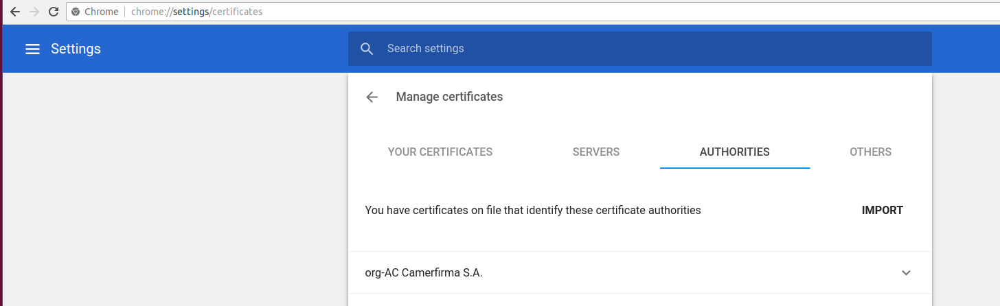
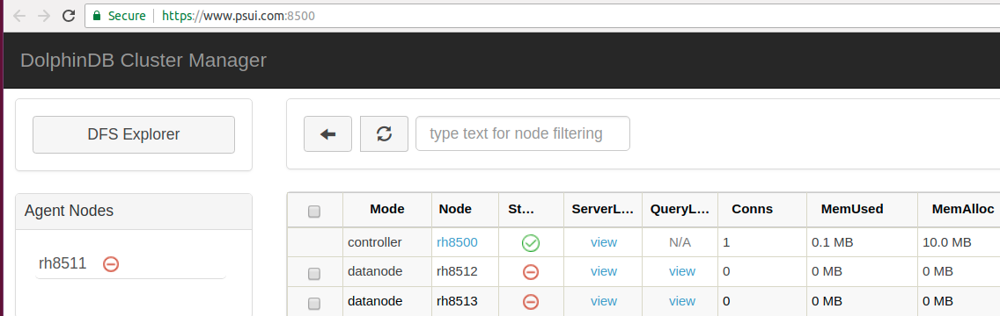

### 权限管理和安全

DolphinDB database 提供了强大、灵活、安全的权限控制系统。

权限控制系统的主要功能：
* 提供用户和组角色，方便权限控制
* 提供多种权限控制类别，适应各种场景
* 丰富的权限控制函数
* 函数视图兼顾保护数据隐私与提供分析结果
* 对任务调度和流数据任务动态鉴权，保证系统安全
* 使用 RSA 对用户关键信息加密
* 支持 SSO，简化登录，方便系统扩展


- [1. 权限概述](#1-权限概述)
  - [1.1 角色](#11-角色)
  - [1.2 用户权限确定规则](#12-用户权限确定规则)
  - [1.3 权限类别](#13-权限类别)
- [2. 权限操作](#2-权限操作)
  - [2.1 分布式数据库](#21-分布式数据库)
  - [2.2 共享内存表](#22-共享内存表)
  - [2.4 其它应用](#24-其它应用)
- [3. 使用HTTPS实现安全通信](#3-使用https实现安全通信)
  - [3.1 使用 HTTPS 配置](#31-使用-https-配置)
  - [3.2 HTTPS证书设置](#32-https证书设置)
- [4. 支持 SSO (Single Sign On)](#4-支持-sso-single-sign-on)


## 1. 权限概述

### 1.1 角色

#### 1.1.1 用户和组 <!-- omit in toc -->

在权限管理系统中，DolphinDB 引入组的概念，便于对具有相同权限的用户进行权限配置和管理。

一个用户可以属于0，1或多个组，一个组里也可以包括0，1或多个用户。

用户和组都是承载权限的实体。我们可以赋予或禁止一个用户、一个组某项权限。用户最终的实际权限是用户本身的权限，加上所属组的权限的结果（详见[1.2 用户权限确定规则](#12-用户权限确定规则)）。

DolphinDB 系统通过用户名和密码对用户进行身份校检，通过 [login](https://www.dolphindb.cn/cn/help/FunctionsandCommands/CommandsReferences/l/login.html) 和 [logout](https://www.dolphindb.cn/cn/help/FunctionsandCommands/CommandsReferences/l/logout.html) 来进行用户的登录和注销管理。 用户可以通过使用 [changePwd](https://www.dolphindb.cn/cn/help/FunctionsandCommands/CommandsReferences/c/changePwd.html) 来改变自己的登录密码。

#### 1.1.2 管理员 <!-- omit in toc -->

管理员分超级管理员（super admin）和管理员（admin）。

DolphinDB 集群第一次启动时，会自动创建用户名为 "admin"，密码为 "123456" 的超级管理员。此管理员拥有所有的权限，且无法被删除。超级管理员 “admin” 无法被删除，其权限也无法被剥夺。

超级管理员可以创建其他用户，对用户进行分组，并选择是否设定为管理员。新创建的管理员、用户和组没有任何权限。管理员可以赋予或禁止其他管理员，用户和组的权限，撤销权限设置。管理员可以通过 [resetPwd](https://www.dolphindb.cn/cn/help/FunctionsandCommands/CommandsReferences/r/resetPwd.html) 修改用户的密码。

管理员可使用的函数或命令有：
  * `addGroupMember`： 添加组成员
  * `createGroup`：创建组
  * `createUser`：创建用户
  * `deleteGroup` ：删除组
  * `deleteGroupMember`：删除组成员
  * `deleteUser`：删除用户
  * `getGroupsByUserId`：根据用户编号得到组
  * `getGroupList`：获取组列表
  * `getUserAccess`：获取用户所单独被赋予的权限，不包括用户所属组的权限
  * `getUsersByGroupId`：获取组的用户列表
  * `getUserList`：获取除管理员之外的所有用户名
  * `resetPwd`：重置用户的密码
  具体用法请参考 [DolphinDB 用户手册](https://www.dolphindb.cn/cn/help/Introduction/index.html)。

以下为超级管理员、管理员和普通用户的总结表：

|                  | 超级管理员             | 管理员        |非管理员用户|
| ---------------- | ---------------------- | -------------- | ---------- |
| 是否需要手动创建 | 否                     | 是              |是          |
| 初始权限         | 拥有所有权限           | 无任何权限      |无任何权限   |
| 是否可以被删除   | 否                     | 是              |是           |
| 是否会被 `getUserList` 函数列出 | 否      | 是              |是           |
| 是否有权创建和删除管理员、用户、组 | 是    | 是             |否           |
| 是否有权赋予和禁止管理员、用户、组的权限|是| 是             |否           |
| 是否有权创建和删除函数视图 | 是            | 是             |否           |
| 是否有权删除其他用户提交的任务| 是         | 是             |否           |

### 1.2 用户权限确定规则

将用户本身也视为一个特殊的组，用户本身的权限就是这个组的权限。用户的最终权限是其所属的所有组的权限共同决定的结果。

个人与所属组之间、不同的所属组之间对用户的某项权限的规定可能存在冲突。以下为权限确定规则：

* 若用户在至少一组中被赋予某项权限，并且在其他组中没有禁止该项权限，则用户拥有该项权限。
* 若用户在至少一组中被禁止某项权限，即使在其他组中被赋予该项权限，此用户的该项权限依然被禁止。

若用户的某项权限被禁止，要使用户获得此权限，有以下两种方式：

1. 由管理员在所有禁止该权限的所属组中使用 [grant](https://www.dolphindb.cn/cn/help/FunctionsandCommands/CommandsReferences/g/grant.html) 命令，从而重新赋予该项权限；
2. 由管理员使用revoke命令，在所有禁止该权限的所属组中撤销之前的禁止权限命令：  
     * 若该用户之前在其他组被赋予过该权限，此时获得此权限；
     * 若该用户之前在其他组没有赋予该权限，则此时处于既未被赋予、也未被禁止该权限的状态，需要使用 `grant` 命令，赋予用户该项权限。

下例说明用户的个人权限与所属组权限发生冲突时的权限确定规则：

```
createUser("user1","123456")  
createUser("user2","123456")  
createGroup("group1")  
createGroup("group2")  
addGroupMember(["user1","user2"],"group1")
addGroupMember(["user1","user2"],"group2")
grant("user1",TABLE_READ,"*")  
deny("group1",TABLE_READ,"dfs://db1/t1")  
deny("group2",TABLE_READ,"dfs://db1/t2") 
```
结果为，用户 user1 可以读取除"dfs://db1/t1" 和"dfs://db1/t2" 以外的所有数据表。

在上例基础上继续进行权限的赋予与禁止，下例为用户不同所属组的权限发生冲突时：
```
grant("user2",TABLE_WRITE,"*")  
deny("group1",TABLE_WRITE,"*")  
grant("group2",TABLE_WRITE,"dfs://db1/t2")
```
以上三行的结果为，用户 user1 和 user2 不能写数据到任何数据表。

### 1.3 权限类别

DolphinDB 提供以下权限类别:

1. TABLE_READ：读取表中数据
2. TABLE_WRITE：写入/删除/修改表数据
3. TABLE_INSERT：向表中追加数据
4. TABLE_UPDATE：更新表中数据
5. TABLE_DELETE：删除表中数据
6. DBOBJ_CREATE：在数据库中创建数据表
7. DBOBJ_DELETE：删除数据库中的数据表 
8. DB_READ：读取数据库中所有表
9. DB_WRITE：对数据库中所有表的写入权限（包含增删改操作）
10. DB_INSERT：向数据库中所有表追加数据
11. DB_UPDATE：更新数据库中所有表
12. DB_DELETE：删除数据库中所有表
13. VIEW_EXEC：执行视图 
14. DB_MANAGE：赋予任意或指定数据库的管理权限，包括删除数据库、创建/删除/重命名数据表、增加/删除分区、增加/删除/重命名/替换列
1.  DB_OWNER：创建数据库并管理其创建的数据库，包括删除其创建的数据库；在其创建的数据库下创建或删除数据表、增加或删除分区、增加/删除表的列、更改表名；赋予、禁止或取消其他用户对自己创建的数据库的以下权限：TABLE_READ, TABLE_WRITE, DBOBJ_CREATE, DBOBJ_DELETE
2.  SCRIPT_EXEC：运行脚本文件 
3.  TEST_EXEC：执行测试脚本
4.  QUERY_RESULT_MEM_LIMIT：限制用户的查询内存大小
5.  TASK_GROUP_MEM_LIMIT：限制用户发送的批量子查询占用的内存大小


请注意，以上权限类别均适用于分布式（DFS）数据库和表；TABLE_READ 和 TABLE_WRITE 权限亦适用于共享内存表、流数据表与流数据引擎。

## 2. 权限操作

管理员可使用 `grant`/`deny`/`revoke` 命令在控制节点上来设置用户或组的权限。用户也可以使用命令 [addAccessControl](https://www.dolphindb.cn/cn/help/FunctionsandCommands/CommandsReferences/a/addAccessControl.html) 限制其他用户访问该用户创建的共享内存表或者流数据引擎。使用 `addAccessControl` 后，其他用户只有被管理员赋予访问权限后，才可访问该用户创建的共享表或者流数据引擎。

本章将分别举例讨论在分布式数据库、共享内存表、流数据表以及流数据引擎中的权限操作。

### 2.1 分布式数据库

在分布式数据库中，可以通过 `grant`/`deny`/`revoke` 命令设置用户或者组的权限。在1.3节中的所有权限，可作为上述三个命令的 *accessType* 参数值。在设置访问权限1-5时，还需要指定权限应用的具体对象。

以下通过4个例子，说明分布式数据库的权限设置的操作。

**例子1**

管理员登录：
```
login(`admin, `123456)
```
创建用户 NickFoles：
```
createUser("NickFoles","AB123!@")  
```
赋予用户 NickFoles 可读任何 DFS 数据表的权限：
```
grant("NickFoles",TABLE_READ,"*") 
```
禁止用户 NickFoles 删除数据库：
```
deny("NickFoles",DB_MANAGE)   
```
创建 SBMVP 组，并且把用户 NickFoles 加入到该组： 
```
createGroup("SBMVP", "NickFoles")  
```
赋予 SBMVP 组可在数据库"dfs://db1"和"dfs://db2"中创建数据表的权限：
```
grant("SBMVP",DBOBJ_CREATE,["dfs://db1","dfs://db2"])    
```

最后用户 NickFoles 的权限为：可以访问所有的数据表，不能创建或删除数据库，可以对"dfs://db1"和"dfs://db2"进行创建数据表的操作。  

**例子2**

通过组可以方便的设置用户权限:
```
createUser("EliManning", "AB123!@")  
createUser("JoeFlacco","CD234@#")  
createUser("DeionSanders","EF345#$")  
createGroup("football", ["EliManning","JoeFlacco","DeionSanders"])  
grant("football", TABLE_READ, "dfs://TAQ/quotes")  
grant("DeionSanders", DB_MANAGE)  
```

该例子创建了3个用户（EliManning, JoeFlacco, DeionSanders）和1个组（football），并且这三个用户属于该组。赋予此组可读数据表”dfs://TAQ/quotes" 的权限，同时只赋予用户 DeionSanders 删除数据库的权限。

**例子3**

可以使用 `grant` 或 `deny` 对所有对象(以\*代表)赋予或禁止权限。例如，赋予用户 JoeFlacco 可读任何 DFS 数据表的权限：
```
grant("JoeFlacco",TABLE_READ,"*")  
```
当 `grant` 或 `deny` 所有对象后，若要撤销操作，只能使用 `revoke` 撤销所有对象的权限，若只撤销某个指定对象的权限，则操作无效：  
```
revoke("JoeFlacco",TABLE_READ,"dfs://db1/t1")
```
以上命令无效。

```
revoke("JoeFlacco",TABLE_READ,"*")
```
以上命令取消了用户 JoeFlacco 可读任何 DFS 数据表的权限。

与之类似，使用 `grant` 或 `deny` 对组赋予或禁止权限后，只能对该组使用 `revoke` 来取消该权限设置。若对某个组员使用 `revoke` 来取消该权限，则无法生效。

**例子4**

有 DB_OWNER 权限的用户可以赋予别的用户对自己创建的数据库的权限。

管理员创建了两个用户，CliffLee 和 MitchTrubisky，其中用户 MitchTrubisky 拥有 DB_OWNER 的权限：

```
createUser(`CliffLee, "GH456$%")
createUser(`MitchTrubisky, "JI3564^")
grant(`MitchTrubisky,DB_OWNER);
```
MitchTrubisky 创建数据表"dfs://dbMT/dt", 并赋予用户 CliffLee 读取该数据表的权限：

```
login(`MitchTrubisky, "JI3564^");
db = database("dfs://dbMT", VALUE, 1..10)
t=table(1..1000 as id, rand(100, 1000) as x)
dt = db.createTable(t, "dt").append!(t)
grant(`CliffLee, TABLE_READ, "dfs://dbMT/dt"); 
```
尽管用户 CliffLee 之前没有被系统管理员赋予任何权限，但是 CliffLee 最后的权限为：可以访问 MitchTrubisky 创建的数据表"dfs://dbMT/dt"。

### 2.2 共享内存表

共享内存表会被共享到所有会话中，因此也会有权限管理的需求。系统支持对共享内存表进行表写入和表读取的权限管理，语法与数据库表权限管理一致。

创建管理员 MitchTrubisky 

```  
createUser("MitchTrubisky","JI3564^",,true)
```

登录 MitchTrubisky 并创建共享内存表 st1, 赋予用户 CliffLee 读取该表的权限：

```
login(`MitchTrubisky, "JI3564^")
share table(1:0, `time`sym`volume, [TIMESTAMP, SYMBOL, INT]) as st1
grant("CliffLee", TABLE_READ, "st1")
```
通过 `getUserAccess` 函数返回的 TABLE_READ_allowed 列可以看到，用户 CliffLee 至此已经拥有了表 st1 的读权限。

```
getUserAccess("CliffLee")
```
需要注意的是，在 MitchTrubisky 使用 `grant`（或 `deny`）函数进行权限管理之前，任何用户对该表都有读写权限。

如上对该表进行过第一次权限操作之后，该表自动添加权限限制。此时只有管理员和表创建者 MitchTrubisky 对该表有读写权限。

也可以取消用户 CliffLee 读取共享内存表的权限：

```
revoke("CliffLee", TABLE_READ, "st1") 
```

若在建表后希望仅自己和管理员对共享内存表有访问权限，可以使用 `addAccessControl` 对于表增加权限控制。

```
share table(1:0, `time`sym`volume, [TIMESTAMP, SYMBOL, INT]) as st2
addAccessControl(st2)
```

### 2.4 其它应用
#### 2.4.1 函数视图(function view) <!-- omit in toc -->

[函数视图](https://www.dolphindb.cn/cn/help/DatabaseandDistributedComputing/DatabaseOperations/FunctionView.html)提供了一种灵活的方式来控制用户访问数据库和表。在视图的基础上，函数视图提供了函数功能，可以同时访问数据库并进行相关计算。

注意：

* 只有系统管理员有创建和删除函数视图的权限。用户即使不具备读写数据库原始数据的权限，也可通过执行函数视图，间接访问数据库，得到所需计算结果。
* 如果函数视图和本地的函数重名，调用时系统会解析为本地函数。

在下例中，管理员定义一个函数视图 "countTradeAll"，并且赋予用户 NickFoles 执行视图 "countTradeAll" 的权限。

管理员定义一个函数视图：  
```
def countTradeAll(){  
	return exec count(*) from loadTable("dfs://TAQ","Trades")  
}
addFunctionView(countTradeAll)  
grant("NickFoles",VIEW_EXEC,"countTradeAll")  
```
以用户名 NickFoles 登录，执行视图 "countTradeAll"
```
countTradeAll()
```
在此例中，虽然用户 NickFoles 没有访问表"dfs://TAQ/Trades"的权限，但是可以运行函数视图 "countTradeAll" 获取表的行数。

函数视图也可以带参数。用户在使用的时候可以输入参数获取相应的结果。下面的例子，我们创建一个函数视图，获取某一个股票在某一天的所有交易记录。
```
def getTrades(s, d){
	return select * from loadTable("dfs://TAQ","Trades") where sym=s, date=d
}
addFunctionView(getTrades)
grant("NickFoles",VIEW_EXEC,"getTrades")  
```
同样在此例中，用户 NickFoles 没有访问表"dfs://TAQ/Trades"的权限，但是可以执行视图 “getTrades”，指定股票代码 IBM 和日期 2018.07.09，获得 IBM 在 2018.07.09 这一天的所有交易记录：
```
getTrades("IBM", 2018.07.09)
```

#### 2.4.2 定时作业 <!-- omit in toc -->

定时作业是指用户指定在特定的时间，以特定的频率执行一系列任务，多用于批处理类业务场景。

```
login("NickFoles","AB123!@")  
def readTable(){  
	read_t1=loadTable("dfs://db1","t1")  
	return exec count(*) from read_t1  
}  
scheduleJob("readTableJob","read DFS table",readTable,minute(now()),date(now()),date(now())+1,'D');  
```

不管 NickFoles 有没有读"dfs://db1/t1"的权限，"readTable" 任务都能设置成功。  

在 "readTable" 任务实际运行时，如果用户 NickFoles 有读"dfs://db1/t1"的权限，则成功执行，否则鉴权失败。  

另外，使用 `deleteScheduledJob` 命令的的时候，系统管理员可以删除其他用户制定的任务，非管理员用户只能删除自己创建的任务。

## 3. 使用HTTPS实现安全通信

DolphinDB 支持使用 HTTPS 安全协议与 web 进行通信。

### 3.1 使用 HTTPS 配置

两种配置 HTTPS 的方法：

- 在控制节点的配置文件中添加 `enableHTTPS=true`

- 在启动控制节点的命令行添加 `-enableHTTPS true`

### 3.2 HTTPS证书设置

DolphinDB 使用服务端证书验证的安全策略。默认情况下，会生成自制证书，客户需要安装服务端的证书，否则浏览器提示不安全连接。在集群环境中，每个节点分布在不同的物理机器上，每台物理 server 需要一份证书，因此控制节点和代理节点需要生成证书，数据节点使用同一个物理服务器上代理节点生成的证书。用户也可购买经过第三方认证的证书。

#### 3.2.1 第三方认证证书 <!-- omit in toc -->

将第三方证书重命名为 server.crt，并且拷贝到控制节点和代理节点的 home 目录下的 keys 文件夹中，若 keys 文件夹不存在，则需手动创建。由于第三方证书经过公认的权威授权机构颁布，所以浏览器默认信任该证书，不需要再手动安装。绝大部分应用场景适合使用此方式。

#### 3.2.2 安装自制证书 <!-- omit in toc -->

在小型封闭集群内部通信时，用户也可以使用自制证书进行 OPENSSL 安全通信，具体过程如下:

> 1. 设置 publicName
由于证书的生成需要知道计算机的域名，对需要生成证书的物理 server 设置该选项为计算机的域名，可以在命令行或配置文件中设置。下面是在 Linux 中启动控制节点的命令行例子。这里 www.ABCD.com 是控制节点所在计算机的域名。  
```
./dolphindb -enableHTTPS true -home master -publicName www.ABCD.com -mode controller -localSite 192.168.1.30:8500:rh8500 -logFile  ./log/master.log
```
> 2. 查看证书是否正确生成  
启动控制节点，在 home 目录下的 keys 文件夹中，查看是否有自制证书文件 *server.crt* 和私钥文件 *serverPrivate.key*。

> 3. 安装自制证书到浏览器的授信证书中心  
不同的浏览器安装选项稍有不同，以 Google Chrome 为例，选择 Settings->Advanced->Manage certificates->AUTHORITIES->Import，导入上面生成的 *server.crt* 文件。

  

在浏览器中输入 https://www.ABCD.com:8500/ 以访问集群管理器。若浏览器地址栏显示绿色的小锁，说明证书安装成功，可以进行 HTTPS 访问。



## 4. 支持 SSO (Single Sign On)

在集群管理界面中，可以点击任意数据节点，链接到该节点的 notebook 上。从控制节点跳转到数据节点，有可能是访问了不同的物理服务器（跨域访问）。DolphinDB 提供了 SSO，使得用户无需重新登录。

DolphinDB 提供两个用于 SSO 的 API 函数：
+ `getAuthenticatedUserTicket()` 获取当前登录用户的加密 ticket
+ `authenticateByTicket(ticket)` 使用上面获取的 ticket 登录系统

DolphinDB 的开发者可以方便安全的使用这些接口来对系统进行扩展。
