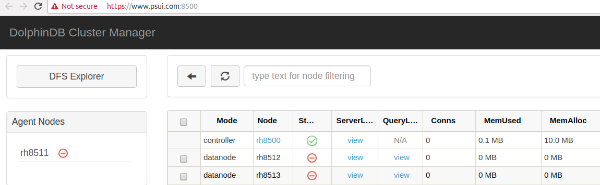

# DolphinDB 权限和安全
DolphinDB提供了强大、灵活、安全的权限控制系统，控制节点（controller）作为权限管理中心，使用RSA加密方式对用户关键信息进行加密，提供用户和组的角色，有多种权限类别以适应各种场景，权限配置必须是管理员用户且在controller上运行。提供以下功能:  
* 丰富的权限控制函数
* 提供用户和组角色，方便权限控制
* 使用RSA对用户关键信息加密
* 提供8种权限控制类别，从db到table读写，适应各种场景
* 提供function view，对db/table进行灵活的读控制
* 支持SSO，简化登录，方便系统扩展
* 对schedule jobs和streaming动态鉴权，保证系统安全

### 1、权限概述
#### 1.1 用户和组
用户和组是承载权限的实体。一个用户可以属于多个组，一个组也可以包括多个用户。引入组的概念，可以方便的对具有相同权限的用户进行权限配置和管理，用户最终的实际权限是用户本身的权限，加上所属组的权限的结果。函数createUser, createGroup, deleteuser, deleteGroup, addGroupMember, deleteGropuMember, getUserAccess, getUserList, getGroupList可以对user和group进行方便的操作。

#### 1.2 权限类别
DolphinDB 有8种权限类别，其中前面5种需要提供操作对象，后面3种不需要提供操作对象。如下:
* TABLE_READ: 从指定数据表中读取数据 
* TABLE_WRITE: 将数据写入指定数据表  
* DBOBJ_CREATE: 创建指定数据库中的对象(数据表) 
* DBOBJ_DELETE: 删除指定数据库中的对象(数据表) 
* VIEW_EXEC: 运行函数视图 
* DB_MANAGE: 创建和删除数据库   
* SCRIPT_EXEC: 运行脚本文件   
* TEST_EXEC: 执行单元测试  

#### 1.3 权限设置
使用grant/deny/revoke函数来设置用户或者组的权限，需要管理员并且在controller上执行权限类操作。  
```
//创建用户 JoeFlacco，密码为:AB123!@,刚创建的用户没有任何权限
createUser("JoeFlacco","AB123!@")  
//赋予用户 JoeFlacco，读任何dfs table的权限
grant("JoeFlacco",TABLE_READ,"*") 
//禁止用户创建或删除数据库
deny("JoeFlacco",DB_MANAGE)   
//创建组analyseGroup，并且把用户JoeFlacco 加入到该组 
createGroup("analyseGroup",["JoeFlacco"])  
//设置组analyseGroup有对db "dfs://db1"和 "dfs://db2"创建table的权限
grant("analyseGroup",DBOBJ_CREATE,["dfs://db1","dfs://db2"])    
```

最后用户的权限为：可以访问所有的数据表，不能创建或删除数据库，可以对"dfs://db1"和"dfs://db2"进行创建表的操作。  

通过组可以方便的设置用户权限:
```
createUser("EliManning", "AB123!@")  
createUser("JoeFlacco","CD234@#")  
createUser("DeionSanders","EF345#$")  
createGroup("football", ["EliManning","JoeFlacco","DeionSanders"])  
grant("football", TABLE_READ, "dfs://TAQ/quotes")  
grant("DeionSanders", DB_MANAGE)  
```

该例子创建3个用户和1个组，并且三个用户属于该组，赋予组读数据表 dfs://TAQ/quotes的权限，所以3个用户都有读该表的权限，同时只赋予用户DeionSanders 创建和删除数据库的权限。

注意:  
>grant 和 deny 没有任何限制，可以对任意操作对象，或者所有对象(\*);  
revoke的使用要注意，当grant/deny all之后对某个单一对象revoke不起作用，但可以revoke all(\*):  
```
grant("JoeFlacco",TABLE_READ,"*")  
revoke("JoeFlacco",TABLE_READ,"dfs://db1/t1") //no effect  
revoke("JoeFlacco",TABLE_READ,"*") //ok  
```

#### 1.4 权限计算规则
用户的最终权限是用户本身的权限加上其所属的所有组的权限。权限位有三种状态, 允许(allow)，禁止(deny)，无(nothing)。  
设置权限规则如下：
* grant一个或多个对象，权限位为allow，allowd ojbs添加相应的对象集合，denied objs删除相应的对象集合。
* grant所有对象，权限为设置为allow，清空allowed objs和denied objs对象集合。
* deny一个或多个对象，权限位不变，如果原来为allow或者nothing，则对应的denied object列表里添加相应的对象; 如果原来权限位为deny，表示禁止访问所有对象。
* deny所有对象，权限位设置为deny，清空allowed objs和denied objs对象集合。

以TABLE_READ的计算规则如下：  
* 如果用户本身或者用户所属的任一group权限位为deny，则TABLE_READ权限为deny。  
* 如果用户本身或者用户所属的任一group权限位为allow，则该权限为allow，allow read tables对象集合为用户本身或者用户所属组权限为allow的对象集合叠加;
denied read tables 集合为所有 deniedReadTables对象集合叠加。  

```  
createUser("user1","123456")  
createUser("user2","123456")  
createGroup("group1")  
createGroup("group2")  
addGroupMember(["user1","user2"],"group1")
addGroupMember(["user1","user2"],"group2")
grant("user1",TABLE_READ,"*")  
deny("group1",TABLE_READ,"dfs://db1/t1")  
deny("group2",TABLE_READ,"dfs://db1/t2")    //user1 可以读取除t1和t2以外的所有表  
grant("user2",TABLE_WRITE,"*")  
deny("group1",TABLE_WRITE,"*")  
grant("group2",TABLE_WRITE,"dfs://db1/t2")  //user2和user1不能写数据到除dfs://db1/t2以外的所有表  
```

#### 1.5 基于函数视图（function view）的权限控制
函数视图（function view）可以提供一种更加灵活的方式来控制用户访问基于分布式文件系统（dfs）的数据表，有些情况下，不希望用户有读全表的权限，但是用户又需要有获取表某些信息的需求，这是可以通过函数视图来方便的解决。 先定义一个函数视图(只有admin用户有创建和删除函数视图的权限),  
```
def countTradeAll(){  
	return exec count(*) from loadTable("dfs://TAQ","Trades")  
}
addFunctionView(countTradeAll)  
grant("user1",VIEW_EXEC,"countTradeAll")  

//创建新的数据库连接，并以user1登录，执行视图countTradeAll
countTradeAll()
```

虽然用户user1没有访问表 dfs://TAQ/Trades的权限，但是赋予该用户访问函数视图的权限。函数视图可以访问表，用户最终可以通过函数视图来获取表的行数。

函数视图也可以带参数。用户在使用的时候可以输入参数获取相应的结果。下面的例子，我们创建一个函数视图，获取某一个股票在某一天的所有交易记录。
```
def getTrades(s, d){
	return select * from loadTable("dfs://TAQ","Trades") where sym=s, date=d
}
addFunctionView(getTrades)  

//当用户调用函数视图时，可以指定股票代码和日期
getTrades("IBM", 2018.07.09)
```

#### 1.6 admin 权限
系统第一次启动时，会自动创建用户名为"admin"，密码为"123456"的用户，admin用户拥有所有的权限。包括创建删除数据库，读写所有表，在数据库中创建删除表，有所有函数视图的权限，有执行脚本和测试脚本的权限。
用户可以根据需要，来更改admin权限。

#### 1.7 权限的其他操作
除了上面的一些操作，还有一些基本操作，deleteUser，deleteGroup，deleteGroupMember，resetPwd和changPwd。  

### 2、scheduled job 和 streaming 的权限控制
scheduled job和streaming属于在后台运行的job，很多情况下，没有显式登录，因此权限验证跟用户显式登录的情况有些不同。这两类后台任务都是以创建该任务的用户身份来运行。
#### 2.1 schedule jobs 权限设置
是用户创建一系列job，指定在特定的时间，以特定的频率执行，多用于适合批处理类业务场景。 
```
login("user2","123456")  
def readTable(){  
	read_t1=loadTable("dfs://db1","t1")  
	return exec count(*) from read_t1  
}  
scheduleJob("noreadJob","read dfs table",readTable,minute(now()) , date(now()),date(now())+1,'D');  
```

不管u2有没有读t1的权限，scheduleJob都能设置成功。  
在job readTable实际运行时，如果用户u2有读t1的权限，则成功执行，否则鉴权失败。  
另外，deleteScheduledJob的时候，admin用户可以删除其他用户的job，非admin用户只能删除自己创建的job。

#### 2.2 streaming 权限设置
streaming handler中对权限的验证，根据subscribeTable时用户的权限为依据。  
```
login("user2","123456")  
def saveTradesToDFS(mutable dfsTrades, msg): dfsTrades.append!(select today() as date, * from msg)  
subscribeTable("NODE1", "trades_stream", "trades", 0, saveTradesToDFS{trades}, true, 1000, 1)  
```

登录用户u2，定义streaming handler saveTradesToDFS，把收到的msg 保存到本地的dfs table中。在streaming执行的时候，会动态的鉴定u2是否有写本地dfs table trades 的权限，如果没有则鉴权失败。

### 3、使用HTTPS实现安全通信
DolphinDB支持使用https安全协议与web进行通信。
#### 3.1 使能HTTPS配置
在启动的controller的命令行或者配置文件中添加支持https的选项;    
+ 1、命令行中使能，启动命令行添加 -enableHTTPS true, linux配置如下：
>./dolphindb -enableHTTPS true  -home master  -publicName www.psui.com  -mode controller -localSite 192.168.1.30:8500:rh8500 -logFile  ./log/master.log  

+ 2、master配置文件中使能，在master启动的配置文件中添加 enableHTTPS=true  
>enableHTTPS=true 

#### 3.2 HTTPS证书设置
dolpindb使用服务端证书验证的安全策略，默认情况下，会生成自制证书，客户需要安装服务端的证书，否则浏览器提示不安全连接。每台物理server需要一份证书，因此master和angent节点需要生成证书，datenode使用同一个物理server上agent生成的证书。当然用户也可以购买经过第三方认证的证书。下面分别介绍第三方证书和自制证书如何安装到dolphindb中。

##### 3.2.1 安装第三方认证证书
将第三方证书重命名为 server.crt，并且拷贝到master和agent 的home目录下的keys文件夹中，若keys文件夹不存在，则手动创建。由于第三方证书经过公认的权威授权机构颁布，所以浏览器默认信任该证书，不需要再手动安装。

##### 3.2.2 安装自制证书
在某些场景下，特别是局域网相对安全的场景下，用户也可以使用自制证书进行OPENSSL安全通信，不过安装自制证书稍微繁琐，具体过程如下:
###### 3.2.2.1 设置 publicName
由于证书的生成需要知道计算机的域名，对需要生成证书的物理server设置该选项为计算机的域名，可以在命令行或配置文件中设置。linux配置如下：    
>./dolphindb -enableHTTPS true  -home master  -publicName www.psui.com  -mode controller -localSite 192.168.1.30:8500:rh8500 -logFile  ./log/master.log

###### 3.2.2.2 查看证书是否正确生成  
启动controller， 在home目录下，keys文件夹中保存集群中用到的证书和公钥私钥，证书的文件名为 server.crt, keys目录下内容为：  
> aclPrivate.key  
  aclPublic.key  
  server.crt  
  serverPrivate.key

###### 3.2.2.3 尝试使用https连接集群管理器
在浏览器中输入，https://www.psui.com:8500/ ,浏览器显示不安全链接，是否继续，选择继续，web显示出集群管理器界面，但是浏览器上面是红色的。因为是自制证书，非授信，需要手动安装到浏览器授信证书里面。


###### 3.2.2.4 手动安装自制证书到浏览器的授信证书中心
不同的浏览器安装选项稍有不同，以google chrome为例，选择setting->Advancced->Manage certificates->AUTHORITIES->import,导入上面生成的server.crt文件。
  

再次尝试https访问集群管理器，https://www.psui.com:8500/ ,浏览器上面显示绿色的小锁，说明证书安装成功，可以正常进行https访问。


### 4、支持SSO （Single Sign On)
DolphinDB的controller作为SSO认证中心，向已登录的客户端提供授权ticket，由于ticket是openssl加密的，保证了通信的安全。比如在跨域登录的时候，简化了用户的权限认证。  
>在集群管理其界面中，可以点击任意数据节点（data node），链接到该节点的notebook上。从controller跳转到data node是跨域访问，DolphinDB提供了获取登录用户加密ticket接口，在跨域鉴权的时候使用该ticket，controller认证通过，并且获取到该用户的访问权限。  

提供了两个用于SSO的API函数，getAuthenticatedUserTicket() 获取当前登录用户的加密ticket;  
authenticateByTicket(ticket) 使用上面获取的ticket登录系统。  
DolphinDB的开发者，可以方便安全的使用这些接口来对系统进行扩展。


