# DolphinDB 中有关 Array Vector 的最佳实践指南

越来越多的机构使用 L1/L2 的快照行情数据进行量化金融的研究。作为一个高性能实时计算平台，DolphinDB 非常适合存储和处理海量的历史高频行情数据。针对快照数据包含多档位信息的特点，DolphinDB 研发了一种方便、灵活且高效的数据结构——Array Vector，可以显著地简化某些常用的查询与计算代码，提高存储和计算地性能。Array Vector 还可以存储不定长的二维数组，在数据处理、模型应用等方面都具有重要意义。

- [DolphinDB 中有关 Array Vector 的最佳实践指南](#dolphindb-中有关-array-vector-的最佳实践指南)
  - [1. 概念](#1-概念)
  - [2. Array Vector 支持的函数和操作](#2-array-vector-支持的函数和操作)
    - [2.1. Array Vector 的创建](#21-array-vector-的创建)
      - [2.1.1. 创建 Array Vector 类型的变量](#211-创建-array-vector-类型的变量)
      - [2.1.2. 创建含有 Array Vector 类型列的表](#212-创建含有-array-vector-类型列的表)
    - [2.2. Array Vector 的基础操作](#22-array-vector-的基础操作)
      - [2.2.1. 访问 Array Vector 中的元素](#221-访问-array-vector-中的元素)
        - [2.2.1.1. 访问 Array Vector 变量中的行](#2211-访问-array-vector-变量中的行)
        - [2.2.1.2. 访问 Array Vector 变量中的列](#2212-访问-array-vector-变量中的列)
        - [2.2.1.3. 访问 Array Vector 变量中 r 行 c 列的元素](#2213-访问-array-vector-变量中-r-行-c-列的元素)
        - [2.2.1.4. 访问表中 Array Vector 列的元素](#2214-访问表中-array-vector-列的元素)
      - [2.2.2. Array Vector 插入数据](#222-array-vector-插入数据)
      - [2.2.3. 转化 Array Vector 为向量、矩阵](#223-转化-array-vector-为向量矩阵)
      - [2.2.4. 对 Fast Array Vector 的每个元素过滤](#224-对-fast-array-vector-的每个元素过滤)
    - [2.3. Array Vector 的计算](#23-array-vector-的计算)
      - [2.3.1. 和标量计算](#231-和标量计算)
      - [2.3.2. 和向量计算](#232-和向量计算)
      - [2.3.3. 和 Array Vector 计算](#233-和-array-vector-计算)
      - [2.3.4. 按行计算](#234-按行计算)
    - [2.4. API 写入](#24-api-写入)
      - [2.4.1. C++ API](#241-c-api)
      - [2.4.2. Java API](#242-java-api)
      - [2.4.3. Python API](#243-python-api)
  - [3. Array Vector 在 level2 快照数据中的应用](#3-array-vector-在-level2-快照数据中的应用)
    - [3.1. 快照数据的存储](#31-快照数据的存储)
    - [3.2. 快照数据分组时保留明细](#32-快照数据分组时保留明细)
    - [3.3. 基于快照数据的高频因子计算](#33-基于快照数据的高频因子计算)
      - [3.3.1. 净委买增额](#331-净委买增额)
      - [3.3.2. 十档净委买增额](#332-十档净委买增额)
  - [4. 总结](#4-总结)
  - [5. 附件](#5-附件)
  - [附件](#附件)

## 1. 概念

DolphinDB 提供了一种特殊的数据结构，数组向量（Array Vector），用以存储比如股票的多档报价数据。顾名思义，Array Vector 的每一个元素是一个一维数组（类型完全相同）。这种存储方式不仅可以简化某些查询与计算的代码，在不同列中含有大量重复数据的情况下，还可以提高数据压缩比，提升查询速度。计算上，Array Vector 可以与标量、向量或另一个 Array Vector 进行二元运算，能够方便地实现向量化运算，提升计算性能。

Array Vector 和矩阵（Matrix）都可以组织二维的结构化数据，但两者有很大区别。首先矩阵的每一行长度相同，Array Vector 无这一要求。其次，在 DolphinDB 的实现中，矩阵的存储是列优先，而Array Vector是行优先。根据实现方式的不同，Array Vector 又可以进一步分为 **Fast Array Vector（数组向量）** 和 **Columnar Tuple（列式元组）** 两种。后续在无特殊注明的情况下，Array Vector 一般指 Fast Array Vector。

**Fast Array Vector** 的实现有两个常规的向量组成，第二个向量连续存储所有行的数据，第一个向量存储每一行的数据结束的索引。这一种存储方式十分紧凑，读写和计算的效率都很高，但很难改变每一行的长度。为弥补这个不足，DolphinDB 引入了 **Columnar Tuple**。顾名思义，Columnar Tuple 是一个元组，代表一列，其中每一个元素代表一行，但值类型必须保持一致。Columnar Tuple 的元素都是一个独立的对象（Scalar 或 Vector），因此可以方便的更改。

**Fast Array Vector 和 Columnar Tuple 的区别**：

- Fast Array Vector 目前暂时不支持 SYMBOL 和 STRING 两种类型；Columnar Tuple 支持。
- 使用 `typestr` 函数查看数据类型，Fast Array Vector 返回的是 “FAST XXX\[] VECTOR”；Columnar Tuple 返回的是 “ANY VECTOR”，所以需要用 `isColumnarTuple` 函数判断变量类型是否为列式元组。
- Fast Array Vector 的存储、查询、计算等效率更高，但更新和删除操作效率较低并且每一行的元素长度不能改变；Columnar Tuple 在更新和删除操作上的表现更好且每一行的元素长度允许改变。【上述的更新和删除操作是通过底层的 C++ 代码实现的。目前更新和删除的接口未开放，脚本层面还不支持更新和删除 Array Vector 中的元素。所以一般情况下，**推荐用户使用 Fast Array Vector (数组向量)**。】

**Fast Array Vector 和 Columnar Tuple 的应用场景**：

- Fast Array Vector：数值类型的二维数组的存储和计算。比如，Level 2 行情的十档量价和50档委托等。
- Columnar Tuple：需要频繁更新二维数组元素的场景。比如，响应式状态引擎内部会自动把输入的 Fast Array Vector 的列转化为 Columnar Tuple，以此提高更新引擎状态的效率。这部分的转化是引擎内部自动完成的，对用户是透明的。用户不会感知到这一个过程，只需要向引擎传入 Fast Array Vector 的列即可。

## 2. Array Vector 支持的函数和操作

### 2.1. Array Vector 的创建

#### 2.1.1. 创建 Array Vector 类型的变量

- **Fast Array Vector (数组向量)**

    1. 通过 [array](../funcs/a/array.dita) 或  [bigarray](../funcs/b/bigarray.dita) 函数定义空的数组向量，并通过 `append!` 添加数据
    
        ```
        x = array(INT[], 0).append!([1 2 3, 4 5, 6 7 8, 9 10])
        /* x
        [[1,2,3],[4,5],[6,7,8],[9,10]]
        */
        ```

    1. 通过 [fixedLengthArrayVector](../funcs/f/fixedLengthArrayVector.dita) 将多个向量/元组/矩阵或表拼接成数组向量。
    
        ```
        vec = 1 2 3
        tp = [4 5 6, 7 8 9]
        m =  matrix(10 11 12, 13 14 15, 16 17 18)
        tb = table(19 20 21 as v1, 22 23 24 as v2)
        x = fixedLengthArrayVector(vec, tp, m, tb)
        /* x
        [[1,4,7,10,13,16,19,22],[2,5,8,11,14,17,20,23],[3,6,9,12,15,18,21,24]]
        */
        ```

    1. 通过 [arrayVector](../funcs/a/arrayVector.dita) 将单个向量拆分成数组向量。
    
        ```
        x = arrayVector(3 5 8 10, [1, 2, 3, 4, 5, 6, 7, 8, 9, 10])
        /* x
        [[1,2,3],[4,5],[6,7,8],[9,10]]
        */
        ```

- **Columnar Tuple (列式元组)**

    通过 [setColumnarTuple!](../funcs/s/setColumnarTuple_.dita) 函数将一个普通元组转换成列式元组。
    
    ```
    x = [[1,2,3],[4,5],[6,7,8],[9,10]].setColumnarTuple!()
    /* x
    ([1,2,3],[4,5],[6,7,8],[9,10])
    */
    ```

#### 2.1.2. 创建含有 Array Vector 类型列的表

1. 创建 Array Vector 类型的变量，将其指定为表中的一列。

    Fast Array Vector 的变量在表中的列类型是 "XXX\[]"，比如 "INT\[]"、"DOUBLE\[]" 等；
    
    Columnar Tuple 的变量在表中为 ”ANY“ 类型。
    
    ```
    x = array(INT[], 0).append!([1 2 3, 4 5, 6 7 8, 9 10])
    y = [1 2 3, 4 5, 6 7 8, 9 10].setColumnarTuple!()
    t = table(1 2 3 4 as id, x as newCol1)
    update t set newCol2=x
    t["newCol3"] = y
    /* t
    id newCol1 newCol2 newCol3
    -- ------- ------- -------
    1  [1,2,3] [1,2,3] [1,2,3]
    2  [4,5]   [4,5]   [4,5]  
    3  [6,7,8] [6,7,8] [6,7,8]
    4  [9,10]  [9,10]  [9,10] 
    */
    
    t.schema().colDefs
    /*
    name    typeString typeInt extra comment
    ------- ---------- ------- ----- -------
    id      INT        4                    
    newCol1 INT[]      68                   
    newCol2 INT[]      68                   
    newCol3 ANY        25   
    */
    ```

2. 通过 [fixedLengthArrayVector](../funcs/f/fixedLengthArrayVector.dita) 将表中多列拼成一列。

    ```
    t = table(1 2 3 4 as id, 1 3 5 6 as v1, 4 7 9 3 as v2)
    t = select *, fixedLengthArrayVector(v1, v2) as newCol from t
    /* t
    id v1 v2 newCol
    -- -- -- ------
    1  1  4  [1,4] 
    2  3  7  [3,7] 
    3  5  9  [5,9] 
    4  6  3  [6,3] 
    */
    ```

3. 通过 `toArray` + `group by` 将表中每组的数据组合成 Array Vector。

    ```
    t = table(1 1 3 4 as id, 1 3 5 6 as v1)
    new_t = select toArray(v1) as newV1 from t group by id
    /* new_t
    id newV1
    -- -----
    1  [1,3]
    3  [5]  
    4  [6]  
    */
    ```

    **注意事项**：
    
    因为 `toArray` 生成的结果是 Fast Array Vector 类型的数据，Fast Array Vector 暂时不支持 SYMBOL 和 STRING 类型，所以 `toArray` 函数暂时也不支持对 SYMBOL 和 STRING 的列使用。
    
    在 group by 的时候，如果需要将 SYMBOL 和 STRING 类型的数据组合，建议使用字符串拼接，比如
    
    ```
    t = table(1 1 3 4 as group_id, `a1`a2`a3`a4 as name)
    new_t = select concat(name, ";") as name from t group by group_id 
    /* new_t
    group_id name 
    -------- -----
    1        a1;a2
    3        a3   
    4        a4        
    */
    ```
    
    使用的时候，用 `split` 函数再将字符串拆分，比如
    
    ```
    select *, name.split(";")[0] as name0 from new_t
    /*
    group_id name  name0
    -------- ----- -----
    1        a1;a2 a1   
    3        a3    a3   
    4        a4    a4   
    */
    ```

4. 设置 [loadText](../funcs/l/loadText.dita) 的 *schema* 和 *arrayDelimiter*，从文本文件中读取含 Fast Array Vector 列的表。

    用 [saveText](../funcs/s/saveText.dita) 存储数据时，Fast Array Vector 的列会自动存储为如下格式：Array Vector 内部用 arrayDelimiter 隔开。

    ```
    x = array(INT[], 0).append!([1 3 5, 2 7 9])
    t = table(1 2 as id, x as value) 
    saveText(t, "./test.csv")
    ```
    
    "./test.csv" 内的文本内容
    
    ```
    id,value
    1,"1,3,5"
    2,"2,7,9"
    ```
    
    针对上面的 csv，读文本数据时，*schema* 中设置 value 列的类型为 “INT\[]”，*arrayDelimiter* 设置为逗号 “,“。
    
    ```
    t = loadText("./test.csv", schema=table(`id`value as name, ["INT", "INT[]"] as type), arrayDelimiter=",")
    /* t
    id value  
    -- -------
    1  [1,3,5]
    2  [2,7,9]
    */t = loadText("./test.csv", schema=table(`id`value as name, ["INT", "INT[]"] as type), arrayDelimiter=",") /* t id value   -- ------- 1  [1,3,5] 2  [2,7,9] */
    ```

### 2.2. Array Vector 的基础操作

#### 2.2.1. 访问 Array Vector 中的元素

用户可以通过函数（[row](../funcs/r/row.dita)、[at](../funcs/a/at.dita)）的方式访问 Array Vector 的行列；也可以通过下标（“x\[index]”）的方式访问 Array Vector 的元素。

当使用下标的方式（“x\[index]”）访问 Array Vector 时满足以下规则：

1. 当 index 为标量或者数据对的时候，表示对列操作，比如 index=0 或者 index=0:3；
2. 当 index 为向量的时候，表示对行的操作，比如 index = \[1, 2, 3]；
3. 当 index 越界时，对应位置的数据会用空值填充；

##### 2.2.1.1. 访问 Array Vector 变量中的行

- 通过 [row](../funcs/r/row.dita) 函数读取 Array Vector 中的一行。【只能访问一行，返回一个向量】

    ```
    x = array(INT[], 0).append!([1 2 3, 4 5, 6 7 8, 9 10])
    x.row(1)
    /*
    [4,5]
    */
    
    y = [1 2 3, 4 5, 6 7 8, 9 10].setColumnarTuple!()
    y.row(1)
    /*
    [4,5]
    */
    
    // 当 index 越界时，空值填充
    x = array(INT[], 0).append!([1 2 3, 4 5, 6 7 8, 9 10])
    x.row(10)
    /*
    [,,,]
    */
    
    y = [1 2 3, 4 5, 6 7 8, 9 10].setColumnarTuple!()
    y.row(10)
    /*
    [,,,]
    */
    ```

- 通过 x\[index] 且 index 为向量的方式访问 Array Vector 的行。【可以访问多行，返回一个和 x 相同类型的 Array Vector】

    ```
    // 读取一行
    x = array(INT[], 0).append!([1 2 3, 4 5, 6 7 8, 9 10])
    x[[1]]
    /*
    [[4,5]]
    */
    
    y = [1 2 3, 4 5, 6 7 8, 9 10].setColumnarTuple!()
    y[[1]]
    /*
    ([4,5])
    */
    
    // 读取多行
    x = array(INT[], 0).append!([1 2 3, 4 5, 6 7 8, 9 10])
    x[[1, 2]]
    /*
    [[4,5],[6,7,8]]
    */
    
    y = [1 2 3, 4 5, 6 7 8, 9 10].setColumnarTuple!()
    y[[1, 2]]
    /*
    ([4,5],[6,7,8])
    */
    
    // 当 index 越界时，空值填充
    x = array(INT[], 0).append!([1 2 3, 4 5, 6 7 8, 9 10])
    x[[3, 4]]
    /*
    [[9,10],]
    */
    
    y = [1 2 3, 4 5, 6 7 8, 9 10].setColumnarTuple!()
    y[[3, 4]]
    /*
    ([9,10],)
    */
    ```

##### 2.2.1.2. 访问 Array Vector 变量中的列

- 通过 x\[index] 且 index 为标量的方式访问 Array Vector 的一列。【只能访问一列，返回一个向量】

    ```
    x = array(INT[], 0).append!([1 2 3, 4 5, 6 7 8, 9 10])
    x[1]
    /*
    [2,5,7,10]
    */
    
    y = [1 2 3, 4 5, 6 7 8, 9 10].setColumnarTuple!()
    y[1]
    /*
    [2,5,7,10]
    */
    
    // 当 index 越界时，空值填充
    x = array(INT[], 0).append!([1 2 3, 4 5, 6 7 8, 9 10])
    x[10]
    /*
    [,,,]
    */
    
    y = [1 2 3, 4 5, 6 7 8, 9 10].setColumnarTuple!()
    y[10]
    /*
    [,,,]
    */
    ```

- 通过 x\[start:end] 的方式访问 Array Vector 的列。【可以访问多行，返回一个 Array Vector】

    ```
    // end 不为空
    x = array(INT[], 0).append!([1 2 3, 4 5, 6 7 8, 9 10])
    x[0:2]
    /*
    [[1,2],[4,5],[6,7],[9,10]]
    */
    
    y = [1 2 3, 4 5, 6 7 8, 9 10].setColumnarTuple!()
    y[0:2]
    /*
    [[1,2],[4,5],[6,7],[9,10]]
    */
    
    // end 为空
    x = array(INT[], 0).append!([1 2 3, 4 5, 6 7 8, 9 10])
    x[1:]
    /*
    [[2,3],[5],[7,8],[10]]
    */
    
    y = [1 2 3, 4 5, 6 7 8, 9 10].setColumnarTuple!()
    y[1:]
    /*
    ([2,3],[5],[7,8],[10])
    */
    
    // 当 index 越界时，空值填充
    x = array(INT[], 0).append!([1 2 3, 4 5, 6 7 8, 9 10])
    x[1:4]
    /*
    [[2,3,],[5,,],[7,8,],[10,,]]
    */
    
    y = [1 2 3, 4 5, 6 7 8, 9 10].setColumnarTuple!()
    y[1:4]
    /*
    [[2,3,],[5,,],[7,8,],[10,,]]
    */
    ```

**注意事项**：

x\[start:end] 中必须满足 start >= 0 且 start < end， 否则参数校验时抛出异常。

当 x 是 STRING 或 SYMBOL 类型的 Columnar Tuple，结果返回一个 Columnar Tuple；

当 x 是 Columnar Tuple 且 end == NULL（每一行的长度可能不一致），结果返回一个 Columnar Tuple；

其他情况下，结果都会返回一个 Fast Array Vector。

##### 2.2.1.3. 访问 Array Vector 变量中 r 行 c 列的元素

- Fast Array Vector 可以通过 x\[r, c] 的方式定位一个元素；Columnar Tuple 可以通过 x\[c, r] 的方式定位一个元素

    ```
    r, c = 2, 1
    x = array(INT[], 0).append!([1 2 3, 4 5, 6 7 8, 9 10])
    x[r, c]
    /*
    [7]
    */
    
    y = [[1,2,3],[4,5],[6,7,8],[9,10]].setColumnarTuple!()
    y[c, r]
    /*
    7
    */
    ```

    **注意事项**：x\[r, c] 中的索引 r 和 c 不能越界，否则参数校验时抛出异常。

- 先定位行，再定位列

    ```
    r, c = 2, 1
    rows, cols = [1, 2, 3], 0:2
    
    // 用函数先定位某一行，再定位某一列
    x = array(INT[], 0).append!([1 2 3, 4 5, 6 7 8, 9 10])
    x.row(r).at(c)
    /*
    7
    */
    
    y = [1 2 3, 4 5, 6 7 8, 9 10].setColumnarTuple!()
    y.row(r).at(c)
    /*
    7
    */
    
    // 用下标先定位某一行，再定位某一列
    x = array(INT[], 0).append!([1 2 3, 4 5, 6 7 8, 9 10])
    x[[r]][c]
    /*
    [7]
    */
    
    y = [1 2 3, 4 5, 6 7 8, 9 10].setColumnarTuple!()
    y[[r]][c]
    /*
    [7]
    */
    
    // 用下标先定位某几行，再定位某几列
    x = array(INT[], 0).append!([1 2 3, 4 5, 6 7 8, 9 10])
    x[rows][cols]
    /*
    [[4,5],[6,7],[9,10]]
    */
    
    y = [1 2 3, 4 5, 6 7 8, 9 10].setColumnarTuple!()
    y[rows][cols]
    /*
    [[4,5],[6,7],[9,10]]
    */
    
    // 当 index 越界时，空值填充
    x = array(INT[], 0).append!([1 2 3, 4 5, 6 7 8, 9 10])
    x[2 3 4][1:3]
    /*
    [[7,8],[10,],[,]]
    */
    
    y = [1 2 3, 4 5, 6 7 8, 9 10].setColumnarTuple!()
    y[2 3 4][1:3]
    /*
    [[7,8],[10,],[,]]
    */
    ```

- 先定位列，再定位行

    ```
    r, c = 2, 1
    rows, cols = [1, 2, 3], 0:2
    
    // 用下标先定位某一列，再定位某一行
    x = array(INT[], 0).append!([1 2 3, 4 5, 6 7 8, 9 10])
    x[c][r]
    /*
    7
    */
    
    y = [1 2 3, 4 5, 6 7 8, 9 10].setColumnarTuple!()
    y[c][r]
    /*
    7
    */
    
    // 用下标先定位某几列，再定位某几行
    x = array(INT[], 0).append!([1 2 3, 4 5, 6 7 8, 9 10])
    x[cols][rows]
    /*
    [[4,5],[6,7],[9,10]]
    */
    
    y = array(INT[], 0).append!([1 2 3, 4 5, 6 7 8, 9 10])
    y[cols][rows]
    /*
    [[4,5],[6,7],[9,10]]
    */
    
    // 当 index 越界时，空值填充
    x = array(INT[], 0).append!([1 2 3, 4 5, 6 7 8, 9 10])
    x[1:3][2 3 4]
    /*
    [[7,8],[10,],]
    */
    
    y = [1 2 3, 4 5, 6 7 8, 9 10].setColumnarTuple!()
    y[1:3][2 3 4]
    /*
    [[7,8],[10,],]
    */
    ```

##### 2.2.1.4. 访问表中 Array Vector 列的元素

可以通过 x\[index] 且 index 为标量或者数据对的方式将表中 Array Vector 列的指定位置的元素取出。

当 index 越界时，指定位置元素用空值填充。

```
x = array(INT[], 0).append!([1 2 3, 4 5, 6 7 8, 9 10])
y = [1 2 3, 4 5, 6 7 8, 9 10].setColumnarTuple!()
t = table(1 2 3 4 as id, x as x, y as y)
new_t = select *, x[2] as x_newCol1, x[1:3] as x_newCol2, y[2] as y_newCol1, y[1:3] as y_newCol2 from t
/* new_t
id x       y       x_newCol1 x_newCol2 y_newCol1 y_newCol2
-- ------- ------- --------- --------- --------- ---------
1  [1,2,3] [1,2,3] 3         [2,3]     3         [2,3]    
2  [4,5]   [4,5]             [5,]                [5,]     
3  [6,7,8] [6,7,8] 8         [7,8]     8         [7,8]    
4  [9,10]  [9,10]            [10,]               [10,]    
*/
```

#### 2.2.2. Array Vector 插入数据

Array Vector 目前支持末尾增加行的操作，暂时不支持修改和删除元素的操作。

- 通过 `append!` 方法向 Array Vector 的变量中插入数据

    ```
    // 插入一行
    x = array(INT[], 0).append!([1 2 3, 4 5 6])
    x.append!(7)
    x.append!([8 9])
    /* x
    [[1,2,3],[4,5,6],[7],[8,9]]
    */
    
    y = [1 2 3, 4 5 6].setColumnarTuple!()
    y.append!(7)
    y.append!([8 9])
    /* y
    ([1,2,3],[4,5,6],7,[8,9])
    */
    
    // 插入多行
    x = array(INT[], 0).append!([1 2 3, 4 5 6])
    x.append!([7, 8 9])
    /* x
    [[1,2,3],[4,5,6],[7],[8,9]]
    */
    
    y = [1 2 3, 4 5 6].setColumnarTuple!()
    y.append!([7, 8 9])
    /* y
    ([1,2,3],[4,5,6],7,[8,9])
    */
    ```

- 通过 [`tableInsert`](../funcs/t/tableInsert.dita) 、 `append!` 等方法向含有 Array Vector 列的表中插入数据

    ```
    x = array(INT[], 0).append!([1 2 3, 4 5, 6 7 8, 9 10])
    y = [1 2 3, 4 5, 6 7 8, 9 10].setColumnarTuple!()
    t = table(1 2 3 4 as id, x as col1, y as col2)
    t.tableInsert(5, 11, 11)
    t.tableInsert(6, [12 13 14], [12 13 14])
    t.append!(table(7 8 as id, [15 16, 17] as col1, [15 16, 17] as col2))
    /* t
    id col1       col2      
    -- ---------- ----------
    1  [1,2,3]    [1,2,3]   
    2  [4,5]      [4,5]     
    3  [6,7,8]    [6,7,8]   
    4  [9,10]     [9,10]    
    5  [11]       11        
    6  [12,13,14] [12,13,14]
    7  [15,16]    [15,16]   
    8  [17]       17         
    */
    ```

#### 2.2.3. 转化 Array Vector 为向量、矩阵

1. 通过 [flatten](../funcs/f/flatten.dita) 函数可以将 Array Vector 展开成一维向量 。

    ```
    x = array(INT[], 0).append!([1 2 3, 4 5 6])
    z = flatten(x)
    /* z
    [1,2,3,4,5,6]
    */
    
    y = [1 2 3, 4 5 6].setColumnarTuple!()
    z = flatten(y)
    /* z
    [1,2,3,4,5,6]
    */
    ```

1. 通过 [matrix](../funcs/m/matrix.dita) 函数可以将等长的 Array Vector 转化为矩阵 。

    ```
    x = array(INT[], 0).append!([1 2 3, 4 5 6])
    z = matrix(x)
    /* z
    #0 #1 #2
    -- -- --
    1  2  3 
    4  5  6 
    */
    
    y = [1 2 3, 4 5 6].setColumnarTuple!()
    z = matrix(y)
    /* z
    #0 #1
    -- --
    1  4 
    2  5 
    3  6 
    */
    ```

#### 2.2.4. 对 Fast Array Vector 的每个元素过滤

可以通过 x\[cond] 的方式将 Fast Array Vector 所有满足 cond 条件的元素过滤出来。（该功能 1.30.21 / 2.00.10 后支持）

```
x = array(INT[], 0).append!([1 2 3, 4 5, 6 7 8, 9 10])
z = x[x>=5]
/* z
[,[5],[6,7,8],[9,10]]
*/

t = table(1 2 3 4 as id, x as x)
new_t = select *, x[x>=5] as newCol from t
/* new_t
id x       newCol 
-- ------- -------
1  [1,2,3] []  
2  [4,5]   [5]    
3  [6,7,8] [6,7,8]
4  [9,10]  [9,10] 
*/
```

### 2.3. Array Vector 的计算

#### 2.3.1. 和标量计算

即把 Array Vector 的每个元素和标量做计算。

```
x = array(INT[], 0).append!([1 2 3, 4 5, 6 7 8, 9 10])
z = x + 1
/* z
[[2,3,4],[5,6],[7,8,9],[10,11]]
*/

y = [1 2 3, 4 5, 6 7 8, 9 10].setColumnarTuple!()
z = y + 1
/* z
([2,3,4],[5,6],[7,8,9],[10,11])
*/

t = table(1 2 3 4 as id, x as x, y as y)
new_t = select *, x + 1 as new_x, y + 1 as new_y from t
/* new_t
id x       y       new_x   new_y  
-- ------- ------- ------- -------
1  [1,2,3] [1,2,3] [2,3,4] [2,3,4]
2  [4,5]   [4,5]   [5,6]   [5,6]  
3  [6,7,8] [6,7,8] [7,8,9] [7,8,9]
4  [9,10]  [9,10]  [10,11] [10,11]
*/
```

#### 2.3.2. 和向量计算

要求向量的长度和 Array Vector 的行数相等。

即把 Array Vector 的每行数据和向量对应位置的元素做计算。

```
x = array(INT[], 0).append!([1 2 3, 4 5, 6 7 8, 9 10])
z = x * [1, 2, 3, 4]
/* z
[[1,2,3],[8,10],[18,21,24],[36,40]]
*/

y = [1 2 3, 4 5, 6 7 8, 9 10].setColumnarTuple!()
z = y * [1, 2, 3, 4]
/* z
([1,2,3],[8,10],[18,21,24],[36,40])
*/

t = table(1 2 3 4 as id, x as x, y as y)
new_t = select *, x*id as new_x, y*id as new_y from t
/* new_t
id x       y       new_x      new_y     
-- ------- ------- ---------- ----------
1  [1,2,3] [1,2,3] [1,2,3]    [1,2,3]   
2  [4,5]   [4,5]   [8,10]     [8,10]    
3  [6,7,8] [6,7,8] [18,21,24] [18,21,24]
4  [9,10]  [9,10]  [36,40]    [36,40]  
*/
```

#### 2.3.3. 和 Array Vector 计算

要求两个 Array Vector 的大小相等。

即把两个 Array Vector 的对应位置的元素做计算。

```
x = array(INT[], 0).append!([1 2 3, 4 5, 6 7 8, 9 10])
xx = array(INT[], 0).append!([3 1 2, 3 1, 1 2 3, 0 1])
z = pow(x, xx)
/* z
[[1,2,9],[64,5],[6,49,512],[1,10]]
*/

y = [1 2 3, 4 5, 6 7 8, 9 10].setColumnarTuple!()
yy = [3 1 2, 3 1, 1 2 3, 0 1].setColumnarTuple!()
z = pow(y, yy)
/* z
([1,2,9],[64,5],[6,49,512],[1,10])
*/

t = table(1 2 3 4 as id, x as x, xx as xx, y as y, yy as yy)
new_t = select *, pow(x, xx) as new_x, pow(y, yy) as new_y from t
/* new_t
id x       xx      y       yy      new_x      new_y     
-- ------- ------- ------- ------- ---------- ----------
1  [1,2,3] [3,1,2] [1,2,3] [3,1,2] [1,2,9]    [1,2,9]   
2  [4,5]   [3,1]   [4,5]   [3,1]   [64,5]     [64,5]    
3  [6,7,8] [1,2,3] [6,7,8] [1,2,3] [6,49,512] [6,49,512]
4  [9,10]  [0,1]   [9,10]  [0,1]   [1,10]     [1,10]     
*/
```

**注意事项**：

Fast Array Vector 和 Columnar Tuple 之间不能直接计算。

#### 2.3.4. 按行计算

1. Array Vector 支持 [行计算系列（row 系列）](../funcs/themes/rowFunctions.dita)。

    为了满足用户逐行计算的需求，DolphinDB 设计了 row 系列函数。
    
    row 系列函数以 “rowFunc“ 的格式命名，例如 `rowSum`、`rowAlign` 等函数。
    
    row 系列函数的输入的参数可以是向量 / 向量元组 / 矩阵 / Array Vector。

    - 单目函数示例：按行求和
    
        ```
        x = array(INT[], 0).append!([1 2 3, 4 5, 6 7 8, 9 10])
        z = rowSum(x)
        /* z
        [6,9,21,19]
        */
        
        y = [1 2 3, 4 5, 6 7 8, 9 10].setColumnarTuple!()
        z = rowSum(y)
        /* z
        [6,9,21,19]
        */
        
        t = table(1 2 3 4 as id, x as x, y as y)
        new_t = select *, rowSum(x) as new_x, rowSum(y) as new_y from t
        /* new_t
        id x       y       new_x new_y
        -- ------- ------- ----- -----
        1  [1,2,3] [1,2,3] 6     6    
        2  [4,5]   [4,5]   9     9    
        3  [6,7,8] [6,7,8] 21    21   
        4  [9,10]  [9,10]  19    19   
        */
        ```
    
    - 双目函数示例（Array Vector 和向量）：按行求加权平均
    
        ```
        x = array(INT[], 0).append!([1 2 3, 4 5 6, 6 7 8, 9 10 11])
        z = rowWavg(x, [1, 1, 2])
        /* z
        [2.25,5.25,7.25,10.25]
        */
        
        y = [1 2 3, 4 5 6, 6 7 8, 9 10 11].setColumnarTuple!()
        z = rowWavg(y, [1, 1, 2])
        /* z
        [2.25,5.25,7.25,10.25]
        */
        
        t = table(1 2 3 4 as id, x as x, y as y)
        new_t = select *, rowWavg(x, [1, 1, 2]) as new_x, rowWavg(y, [1, 1, 2]) as new_y from t
        /* new_t
        id x         y         new_x new_y
        -- --------- --------- ----- -----
        1  [1,2,3]   [1,2,3]   2.25  2.25 
        2  [4,5,6]   [4,5,6]   5.25  5.25 
        3  [6,7,8]   [6,7,8]   7.25  7.25 
        4  [9,10,11] [9,10,11] 10.25 10.25
        */
        ```
    
    - 双目函数示例（Array Vector 和 Array Vector）：按行求相关系数
    
        ```
        x = array(INT[], 0).append!([1 2 3, 4 5, 6 7 8, 9 10])
        xx = array(INT[], 0).append!([3 1 2, 3 1, 1 2 3, 0 1])
        z = rowCorr(x, xx)
        /* z
        [-0.5,-1,1,1]
        */
        
        y = [1 2 3, 4 5, 6 7 8, 9 10].setColumnarTuple!()
        yy = [3 1 2, 3 1, 1 2 3, 0 1].setColumnarTuple!()
        z = rowCorr(y, yy)
        /* z
        [-0.5,-1,1,1]
        */
        
        t = table(1 2 3 4 as id, x as x, xx as xx, y as y, yy as yy)
        new_t = select *, rowCorr(x, xx) as new_x, rowCorr(y, yy) as new_y from t
        /* new_t
        id x       xx      y       yy      new_x new_y
        -- ------- ------- ------- ------- ----- -----
        1  [1,2,3] [3,1,2] [1,2,3] [3,1,2] -0.5  -0.5 
        2  [4,5]   [3,1]   [4,5]   [3,1]   -1    -1   
        3  [6,7,8] [1,2,3] [6,7,8] [1,2,3] 1     1    
        4  [9,10]  [0,1]   [9,10]  [0,1]   1     1       
        */
        ```
    
    - 特殊双目函数示例：按行对齐
    
        针对金融场景的存在的特殊的数据对齐规则，DolphinDB 开发了 `rowAlign` 和 `rowAt` 函数。
        
        [rowAlign(left, right, how)](../funcs/r/rowAlign.dita)：实现 left 和 right 的数据对齐。输入参数 *left*、*right* 是数组向量，表示需要对齐的数据；*how* 是字符串，表述对齐的方式；最终返回一个长度为 2 的元组，分别表示对齐后数据在原数据中的索引。
        
        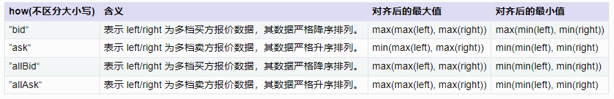
        
        [rowAt(X, Y)](../funcs/r/rowAt.dita)：实现按行从 X 中取出 Y 索引的元素。输入参数 X 是矩阵或数组向量；当 Y 是和 X 行数相等的向量时，返回一个与 Y 长度相同的向量；当 Y 是和 X 行数相等的数组向量时，返回一个与 Y 维度相同的数组向量。
        
        下面以 *how*="bid" 为例，说明具体的 `rowAlign` 对齐结果。
        
        假设 *left* 是某个时刻的五档买价，*right* 是上一时刻的五档买价，都是严格单调减的序列
        
        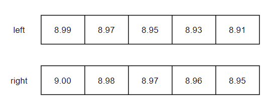
        
        根据买价的值，按行进行数据对齐
        
        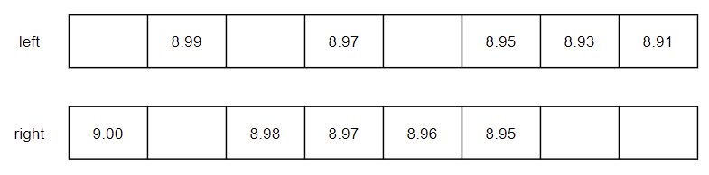
        
        根据 *how* 指定的对齐规则，保留满足条件的数据。*how*="bid" 时，最大值为 max(max(left), max(right)) = max(8.99, 9.00) = 9.00；最小值为 max(min(left), min(right)) = max(8.91, 8.95) = 8.95。【下图蓝色部分为删除部分】
        
        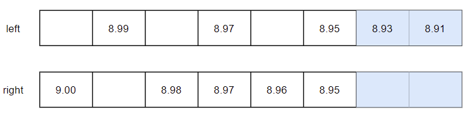
        
        获取剩余数据在原来向量中的索引，没有数据的位置用 -1 填充。
        
        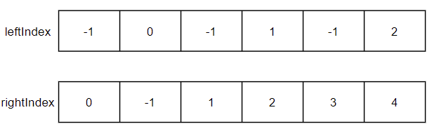
        
        下面以上图 *left* 和 *leftIndex* 为例，说明具体的 `rowAt(left, leftIndex)` 取数结果。
        
        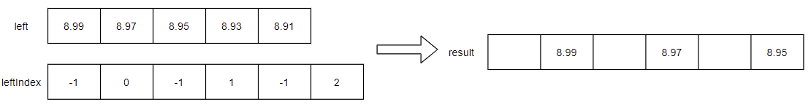
        
        ```
        left = array(DOUBLE[], 0).append!([9.00 8.98 8.97 8.96 8.95, 8.99 8.97 8.95 8.93 8.91])
        right = prev(left)
        /* 
        left:[[9,8.98,8.97,8.96,8.949999999999999],[8.99,8.97,8.949999999999999,8.929999999999999,8.91]]
        right:[,[9,8.98,8.97,8.96,8.949999999999999]]
        */
        
        leftIndex, rightIndex = rowAlign(left, right, how="bid")
        /*
        leftIndex:[[0,1,2,3,4],[-1,0,-1,1,-1,2]]
        rightIndex:[[-1,-1,-1,-1,-1],[0,-1,1,2,3,4]]
        */
        
        leftResult = rowAt(left, leftIndex)
        rightResult = rowAt(right, rightIndex)
        /*
        leftResult:[[9,8.98,8.97,8.96,8.949999999999999],[,8.99,,8.97,,8.949999999999999]]
        rightResult:[[,,,,],[9,,8.98,8.97,8.96,8.949999999999999]]
        */
        ```

1. Fast Array Vector 支持调用高阶函数 [byRow](../funcs/ho_funcs/byRow.dita)，对数组向量的每行元素进行计算。

    - 窗口函数示例：求每行的累计和
    
        ```
        x = array(INT[], 0).append!([1 2 3, 4 5, 6 7 8, 9 10])
        z = byRow(cumsum, x)
        /* z
        [[1,3,6],[4,9],[6,13,21],[9,19]]
        */
        
        t = table(1 2 3 4 as id, x as x)
        new_t = select *, byRow(cumsum, x) as new_x from t
        /* new_t
        id x       new_x        
        -- ------- ---------
        1  [1,2,3] [1,3,6]  
        2  [4,5]   [4,9]    
        3  [6,7,8] [6,13,21]
        4  [9,10]  [9,19]   
        */
        ```
        
        **注意事项**：
        
        - `byRow` 只支持 Fast Array Vector
        - 使用 `byRow` 函数时，自定义函数 func 的返回值只能是**标量**（defg 定义的聚合函数）或者和 Fast Array Vector 每行**等长的向量**（类似窗口函数）。
    
        ```
        // 返回值是标量
        defg foo1(v){
            return last(v)-first(v)
        }
        
        // 返回值是和 v 等长的向量
        def foo2(v){
            return v \ prev(v) - 1
        }
        
        x = array(INT[], 0).append!([1 2 3, 4 5, 6 7 8, 9 10])
        x1 = byRow(foo1, x)
        x2 = byRow(foo2, x)
        /*
        x1: [2,1,2,1]
        x2: [[,1,0.5],[,0.25],[,0.166666666666667,0.142857142857143],[,0.111111111111111]]
        */
        
        t = table(1 2 3 4 as id, x as x)
        new_t = select *, byRow(foo1, x) as x1, byRow(foo2, x) as x2 from t
        /* new_t
        id x       x1 x2                                    
        -- ------- -- --------------------------------------
        1  [1,2,3] 2  [,1,0.5]                              
        2  [4,5]   1  [,0.25]                               
        3  [6,7,8] 2  [,0.166666666666667,0.142857142857143]
        4  [9,10]  1  [,0.111111111111111]                  
        */
        ```

1. Array Vector 支持调用高阶函数 [each](../funcs/ho_funcs/each.dita) 和 [loop](../funcs/ho_funcs/loop.dita)，对 Array Vector 的每行元素进行计算。

    和 `byRow` 函数使用方式类似，都是将自定义函数作用在 Array Vector 的每一行上。
    
    - 两者的区别是：
      - `byRow` 只支持 Fast Array Vector；`each` 和 `loop` 支持 Fast Array Vector 和 Columnar Tuple。
      - `each` 和 `loop` 的自定义函数 func，返回值没有限制，可以是和每行元素不同长度的向量。自定义函数 func 返回值是向量时，返回的结果是 tuple 类型，对应表中的列是 Columnar Tuple 类型。
      - `byRow` 的自定义函数 func 返回值是向量时，`byRow` 返回的结果是 Fast Array Vector 类型，对应表中的列也是 Fast Array Vector 类型。
    
    ```
    // 返回值可以是和 v 不等长的向量
    def foo3(v){
        return [last(v)-first(v), last(v)+first(v)]
    } 
    
    x = array(INT[], 0).append!([1 2 3, 4 5, 6 7 8, 9 10])
    z = loop(foo3, x)
    /* z
    ([2,4],[1,9],[2,14],[1,19])
    */
    
    y = [1 2 3, 4 5, 6 7 8, 9 10].setColumnarTuple!()
    z = loop(foo3, y)
    /* z
    ([2,4],[1,9],[2,14],[1,19])
    */
    
    t = table(1 2 3 4 as id, x as x, y as y)
    new_t = select *, loop(foo3, x) as new_x, loop(foo3, y) as new_y from t
    /* new_t
    id x       y       new_x  new_y 
    -- ------- ------- ------ ------
    1  [1,2,3] [1,2,3] [2,4]  [2,4] 
    2  [4,5]   [4,5]   [1,9]  [1,9] 
    3  [6,7,8] [6,7,8] [2,14] [2,14]
    4  [9,10]  [9,10]  [1,19] [1,19]
    */
    ```

### 2.4. API 写入

#### 2.4.1. C++ API

**Step1**：C++ 中创建表对象。指定对应 Array Vector 列的类型为 DT_XX_ARRAY。

（比如下例中的 value 列是 INT 类型的 Array Vector，所以指定为 DT_INT_ARRAY）

```
int rowNum = 3;
int colNum = 2;
vector<string> colNames = {"id","value"};
vector<DATA_TYPE> colTypes = {DT_INT, DT_INT_ARRAY};
ConstantSP table = Util::createTable(colNames, colTypes, rowNum, rowNum+1);
vector<VectorSP> columnVecs;
columnVecs.reserve(colNum);
for(int i = 0; i < colNum; ++i) {
    columnVecs.emplace_back(table->getColumn(i));
}
```

**Step2**：逐行向 C++ 的表对象中添加数据。创建一个 DdbVector 类型的向量，作为 Array Vector 里的一行。

```
for(int i = 0; i < rowNum; ++i) {
    // 构造 Array Vector 的一行
    DdbVector<int> intVec(0, 10);
    for(int j = 0; j < 3; ++j) {
        intVec.add(i*3+j);
    }
    VectorSP value_row = intVec.createVector(DT_INT);
    columnVecs[0]->setInt(i, i);        // id 列
    columnVecs[1]->set(i, value_row);    // value 列
}
```

**Step3**：连接 DolphinDB，上传数据。

（示例中，是通过 upload 方法把表数据 table 上传到 DolphinDB 的内存表 myTable。C++ API 的更多操作可以查看教程：[C++ API使用教程](../api/cpp.md)）

```
// 连接 DolphinDB 节点
DBConnection conn;
conn.connect("127.0.0.1", 8848);
conn.login("admin", "123456", false);
// 上传数据到内存表
conn.upload("myTable", table);
```

**Step4**：查询数据

```
string script = "select * from myTable;";
ConstantSP result = conn.run(script);
std::cout<<"------ check data ------"<<std::endl;
std::cout<<result->getString()<<std::endl;
```

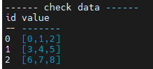

#### 2.4.2. Java API

**Step1**：连接 DolphinDB，并在DolphinDB 中创建一张维度表，用于接收数据。指定对应列的类型为 XX\[]。

（比如下例中的 value 列是 INT 类型的 Array Vector，所以指定为 INT\[]）

```
// 连接 DolphinDB 的节点
DBConnection conn = new DBConnection();
boolean success = conn.connect("127.0.0.1", 8848, "admin", "123456");
// 创建维度表
String ddb_script = "dbName = \"dfs://testDB\"\n" +"../py_api.dita"est\"\n" +
                "if(existsDatabase(dbName)) {\n" +
                "    dropDatabase(dbName)\n" +
                "}\n" +
                "db = database(dbName, VALUE, 1 2 3 4, , 'TSDB')\n" +
                "schemaTB = table(1:0, `id`value, [INT, INT[]])\n" +
                "pt = createTable(db, schemaTB, tbName, sortColumns=`id)";
conn.run(ddb_script);
```

**Step2**：Java 构造数据，创建表对象。每一列对应一个 List，Array Vector 列是一个类型为 vector 的 List，其中每一行是一个向量。

```
List<String> colNames = Arrays.asList("id", "value");
List<Vector> cols = new ArrayList<>(6);
int rowNum = 4;
List<Integer> idCol = new ArrayList<>(rowNum);
List<Vector> valueCol = new ArrayList<>(rowNum);    // Array Vector 列
for(int i = 0; i < rowNum; ++i) {
    idCol.add(i + 1);
    List<Integer> valueRow = new ArrayList<>(50);   // Array Vector 中的一行
    for(int j = 0; j < 3; ++j) {
        valueRow.add(i*3 +j);
    }
    valueCol.add(new BasicIntVector(valueRow));
}
cols.add(new BasicIntVector(idCol));
cols.add(new BasicArrayVector(valueCol));
BasicTable tb = new BasicTable(colNames, cols);
```

**Step3**：往预先创建的维度表中插入数据。

（示例中，是通过 `tableInsert` 方法把表数据 tb 上传到 DolphinDB 的维度表 loadTable ('dfs://testDB','test')。Java API 的更多操作可以查看教程：[Java API使用教程](../api/java/javaapi_legacy.md)）

```
List<Entity> tbArg = new ArrayList<>(1);
tbArg.add(tb);
conn.run("tableInsert{loadTable('dfs://testDB','test')}", tbArg);
```

**Step4**：查询数据

```
BasicTable t;
t = (BasicTable)conn.run("select * from loadTable('dfs://testDB','test')");
System.out.println(t.getString());
```

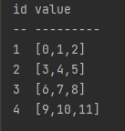

#### 2.4.3. Python API

**Step1**：python 中创建表对象。

（比如下例中的 value 列是 INT 类型的 Array Vector）

```
df = pd.DataFrame({
    'id': [1, 2, 3, 4],
    'value': [np.array([1,2,3],dtype=np.int64), np.array([4,5,6],dtype=np.int64), np.array([7,8,9],dtype=np.int64), np.array([10,11,12],dtype=np.int64)]
})
```

**Step2**：连接 DolphinDB，上传数据。

（示例中，是通过 `table` 方法把数据框 df 上传到 DolphinDB 的内存表 myTable。Python API 的更多操作可以查看教程：[Python API使用教程](../api/python/py.dita)）

```
// 连接 DolphinDB 节点
s = ddb.session()
s.connect("127.0.0.1", 8848, "admin", "123456")
// 上传数据到内存表
s.table(data=df, tableAliasName="myTable")
```

**Step3**：查询数据

```
t = s.run("select * from myTable")
print(t)
```

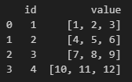

## 3. Array Vector 在 level2 快照数据中的应用

### 3.1. 快照数据的存储

Array Vector 在存储中的一个典型应用场景就是存储快照十档行情数据。

level 2 的快照数据包含买卖十档价格、十档成交量、十档实际总委托笔数、前 50 笔买卖订单等多种多档数据，并且后续也常常需要将这些数据整体计算处理，所以很适合将多档数据作为整体存储为一列。

- **多档多列存储**

    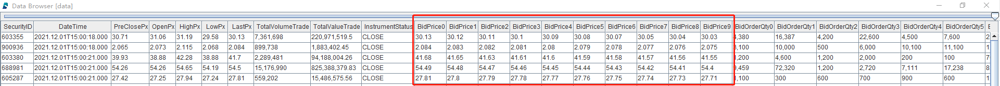

- **Array Vector 存储**

    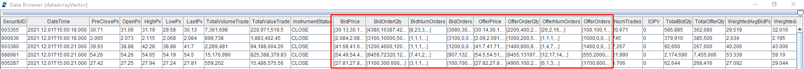
    
    以上交所 level 2 的快照数据为例，进行具体的说明。下面是本教程中的存储的分布式表结构。
    
    | **字段名称**          | **数据类型** | **数据说明**         |
    | :-------------------- | :----------- | :------------------- |
    | SecurityID            | SYMBOL       | 证券代码             |
    | DateTime              | TIMESTAMP    | 日期时间             |
    | PreClosePx            | DOUBLE       | 昨收价               |
    | OpenPx                | DOUBLE       | 开始价               |
    | HighPx                | DOUBLE       | 最高价               |
    | LowPx                 | DOUBLE       | 最低价               |
    | LastPx                | DOUBLE       | 最新价               |
    | TotalVolumeTrade      | INT          | 成交总量             |
    | TotalValueTrade       | DOUBLE       | 成交总金额           |
    | InstrumentStatus      | SYMBOL       | 交易状态             |
    | BidPrice              | DOUBLE\[]     | 申买十价             |
    | BidOrderQty           | INT\[]        | 申买十量             |
    | BidNumOrders          | INT\[]        | 申买十实际总委托笔数 |
    | BidOrders             | INT\[]        | 申买一前 50 笔订单   |
    | OfferPrice            | DOUBLE\[]     | 申卖十价             |
    | OfferOrderQty         | INT\[]        | 申卖十量             |
    | OfferNumOrders        | INT\[]        | 申卖十实际总委托笔数 |
    | OfferOrders           | INT\[]        | 申卖一前 50 笔订单   |
    | NumTrades             | INT          | 成交笔数             |
    | IOPV                  | DOUBLE       | ETF 净值估值         |
    | TotalBidQty           | INT          | 委托买入总量         |
    | TotalOfferQty         | INT          | 委托卖出总量         |
    | WeightedAvgBidPx      | DOUBLE       | 加权平均委买价格     |
    | WeightedAvgOfferPx    | DOUBLE       | 加权平均委卖价格     |
    | TotalBidNumber        | INT          | 买入总笔数           |
    | TotalOfferNumber      | INT          | 卖出总笔数           |
    | BidTradeMaxDuration   | INT          | 买入成交最大等待时间 |
    | OfferTradeMaxDuration | INT          | 买入成交最大等待时间 |
    | NumBidOrders          | INT          | 买方委托价位数       |
    | NumOfferOrders        | INT          | 卖方委托价位数       |
    | WithdrawBuyNumber     | INT          | 买入撤单笔数         |
    | WithdrawBuyAmount     | INT          | 买入撤单数量         |
    | WithdrawBuyMoney      | DOUBLE       | 买入撤单金额         |
    | WithdrawSellNumber    | INT          | 卖出撤单笔数         |
    | WithdrawSellAmount    | INT          | 卖出撤单数量         |
    | WithdrawSellMoney     | DOUBLE       | 卖出撤单金额         |
    | ETFBuyNumber          | INT          | ETF 申购笔数         |
    | ETFBuyAmount          | INT          | ETF 申购数量         |
    | ETFBuyMoney           | DOUBLE       | ETF 申购金额         |
    | ETFSellNumber         | INT          | ETF 赎回笔数         |
    | ETFSellAmount         | INT          | ETF 赎回数量         |
    | ETFSellMoney          | DOUBLE       | ETF 赎回金额         |
    
    其中，买卖十档价格（BidPrice / OfferPrice）、十档成交量（BidOrderQty / OfferOrderQty）、十档实际总委托笔数（BidNumOrders / OfferNumOrders）、前 50 笔买卖订单（BidOrders / OfferOrders）这 8 个字段都采用 Array Vector 的格式存储。在建表时，通过 “DOUBLE\[]” 和 “INT\[]” 的方式指定列的类型为 Array Vector。下面是对应的建表语句。
    
    ```
    dbName = "dfs://SH_TSDB_snapshot_ArrayVector"
    tbName = "snapshot"
    if(existsDatabase(dbName)){
    	dropDatabase(dbName)
    }
    db1 = database(, VALUE, 2020.01.01..2021.01.01)
    db2 = database(, HASH, [SYMBOL, 20])
    db = database(dbName, COMPO, [db1, db2], , "TSDB")
    schemaTable = table(
    	array(SYMBOL, 0) as SecurityID,
    	array(TIMESTAMP, 0) as DateTime,
    	array(DOUBLE, 0) as PreClosePx,
    	array(DOUBLE, 0) as OpenPx,
    	array(DOUBLE, 0) as HighPx,
    	array(DOUBLE, 0) as LowPx,
    	array(DOUBLE, 0) as LastPx,
    	array(INT, 0) as TotalVolumeTrade,
    	array(DOUBLE, 0) as TotalValueTrade,
    	array(SYMBOL, 0) as InstrumentStatus,
    	array(DOUBLE[], 0) as BidPrice,
    	array(INT[], 0) as BidOrderQty,
    	array(INT[], 0) as BidNumOrders,
    	array(INT[], 0) as BidOrders,
    	array(DOUBLE[], 0) as OfferPrice,
    	array(INT[], 0) as OfferOrderQty,
    	array(INT[], 0) as OfferNumOrders,
    	array(INT[], 0) as OfferOrders,
    	array(INT, 0) as NumTrades,
    	array(DOUBLE, 0) as IOPV,
    	array(INT, 0) as TotalBidQty,
    	array(INT, 0) as TotalOfferQty,
    	array(DOUBLE, 0) as WeightedAvgBidPx,
    	array(DOUBLE, 0) as WeightedAvgOfferPx,
    	array(INT, 0) as TotalBidNumber,
    	array(INT, 0) as TotalOfferNumber,
    	array(INT, 0) as BidTradeMaxDuration,
    	array(INT, 0) as OfferTradeMaxDuration,
    	array(INT, 0) as NumBidOrders,
    	array(INT, 0) as NumOfferOrders,
    	array(INT, 0) as WithdrawBuyNumber,
    	array(INT, 0) as WithdrawBuyAmount,
    	array(DOUBLE, 0) as WithdrawBuyMoney,
    	array(INT, 0) as WithdrawSellNumber,
    	array(INT, 0) as WithdrawSellAmount,
    	array(DOUBLE, 0) as WithdrawSellMoney,
    	array(INT, 0) as ETFBuyNumber,
    	array(INT, 0) as ETFBuyAmount,
    	array(DOUBLE, 0) as ETFBuyMoney,
    	array(INT, 0) as ETFSellNumber,
    	array(INT, 0) as ETFSellAmount,
    	array(DOUBLE, 0) as ETFSellMoney
    )
    db.createPartitionedTable(table=schemaTable, tableName=tbName, partitionColumns=`DateTime`SecurityID, compressMethods={DateTime:"delta"}, sortColumns=`SecurityID`DateTime, keepDuplicates=ALL)
    ```
    
    导入数据时，可以通过 `fixedLengthArrayVector` 函数将多档的数据合并成一列 Array Vector。下面是对应的导入数据脚本。
    
    ```
     def transform(data){
    	t = select SecurityID, DateTime, PreClosePx, OpenPx, HighPx, LowPx, LastPx, TotalVolumeTrade, TotalValueTrade, InstrumentStatus,
    		      fixedLengthArrayVector(BidPrice0, BidPrice1, BidPrice2, BidPrice3,  BidPrice4, BidPrice5, BidPrice6, BidPrice7, BidPrice8, BidPrice9) as BidPrice,
    		      fixedLengthArrayVector(BidOrderQty0, BidOrderQty1, BidOrderQty2, BidOrderQty3,  BidOrderQty4, BidOrderQty5, BidOrderQty6, BidOrderQty7, BidOrderQty8, BidOrderQty9) as BidOrderQty,
    		      fixedLengthArrayVector(BidNumOrders0, BidNumOrders1, BidNumOrders2, BidNumOrders3,  BidNumOrders4, BidNumOrders5, BidNumOrders6, BidNumOrders7, BidNumOrders8, BidNumOrders9) as BidNumOrders,
    		      fixedLengthArrayVector(BidOrders0, BidOrders1, BidOrders2, BidOrders3,  BidOrders4, BidOrders5, BidOrders6, BidOrders7, BidOrders8, BidOrders9, BidOrders10, BidOrders11, BidOrders12, BidOrders13,  BidOrders14, BidOrders15, BidOrders16, BidOrders17, BidOrders18, BidOrders19, BidOrders20, BidOrders21, BidOrders22, BidOrders23,  BidOrders24, BidOrders25, BidOrders26, BidOrders27, BidOrders28, BidOrders29, BidOrders30, BidOrders31, BidOrders32, BidOrders33,  BidOrders34, BidOrders35, BidOrders36, BidOrders37, BidOrders38, BidOrders39, BidOrders40, BidOrders41, BidOrders42, BidOrders43,  BidOrders44, BidOrders45, BidOrders46, BidOrders47, BidOrders48, BidOrders49) as BidOrders,
    		      fixedLengthArrayVector(OfferPrice0, OfferPrice1, OfferPrice2, OfferPrice3,  OfferPrice4, OfferPrice5, OfferPrice6, OfferPrice7, OfferPrice8, OfferPrice9) as OfferPrice,
    		      fixedLengthArrayVector(OfferOrderQty0, OfferOrderQty1, OfferOrderQty2, OfferOrderQty3,  OfferOrderQty4, OfferOrderQty5, OfferOrderQty6, OfferOrderQty7, OfferOrderQty8, OfferOrderQty9) as OfferOrderQty,
    		      fixedLengthArrayVector(OfferNumOrders0, OfferNumOrders1, OfferNumOrders2, OfferNumOrders3,  OfferNumOrders4, OfferNumOrders5, OfferNumOrders6, OfferNumOrders7, OfferNumOrders8, OfferNumOrders9) as OfferNumOrders,
    		      fixedLengthArrayVector(OfferOrders0, OfferOrders1, OfferOrders2, OfferOrders3,  OfferOrders4, OfferOrders5, OfferOrders6, OfferOrders7, OfferOrders8, OfferOrders9, OfferOrders10, OfferOrders11, OfferOrders12, OfferOrders13,  OfferOrders14, OfferOrders15, OfferOrders16, OfferOrders17, OfferOrders18, OfferOrders19, OfferOrders20, OfferOrders21, OfferOrders22, OfferOrders23,  OfferOrders24, OfferOrders25, OfferOrders26, OfferOrders27, OfferOrders28, OfferOrders29, OfferOrders30, OfferOrders31, OfferOrders32, OfferOrders33,  OfferOrders34, OfferOrders35, OfferOrders36, OfferOrders37, OfferOrders38, OfferOrders39, OfferOrders40, OfferOrders41, OfferOrders42, OfferOrders43,  OfferOrders44, OfferOrders45, OfferOrders46, OfferOrders47, OfferOrders48, OfferOrders49) as OfferOrders,
    		      NumTrades, IOPV, TotalBidQty, TotalOfferQty, WeightedAvgBidPx, WeightedAvgOfferPx, TotalBidNumber, TotalOfferNumber, BidTradeMaxDuration,OfferTradeMaxDuration, NumBidOrders, NumOfferOrders, WithdrawBuyNumber, WithdrawBuyAmount, WithdrawBuyMoney,WithdrawSellNumber, WithdrawSellAmount, WithdrawSellMoney, ETFBuyNumber, ETFBuyAmount, ETFBuyMoney, ETFSellNumber, ETFSellAmount, ETFSellMoney
    		      from data
    	return t
    }
    
    def loadData(csvDir, dbName, tbName){
    	schemaTB = extractTextSchema(csvDir)
    	update schemaTB set type = "SYMBOL" where name = "SecurityID"
    	loadTextEx(dbHandle=database(dbName), tableName=tbName, partitionColumns=`DateTime`SecurityID, sortColumns=`SecurityID`DateTime, filename=csvDir, schema=schemaTB, transform=transform)
    }
    // 后台提交导入任务
    csvDir = "/home/v2/下载/data/testdata/snapshot_100stocks_multi.csv"
    dbName, tbName = "dfs://SH_TSDB_snapshot_ArrayVector", "snapshot"
    submitJob("loadData", "load Data", loadData{csvDir, dbName, tbName})
    getRecentJobs()
    ```

### 3.2. 快照数据分组时保留明细

Array Vector 在存储中的另一个典型应用场景就是分组计算时将组内所有明细数据保留。

DolphinDB 提供了函数 `toArray`。`toArray` 搭配 `group by` 语句，可以将 `group by` 分组的数据存储成数组向量的一行，便于用户直接查看该分组下的所有数据。

比如，将快照数据聚合成 5 分钟 tick 数据并入库，结果表字段包括高开低收、成交量、成交金额、bid0 和ask0 的量价切片。

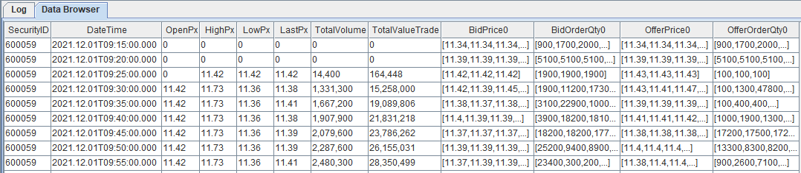

```
// 创建存储 5 min tick 数据的分布式库表
def createFiveMinuteBarDB(dbName, tbName){
	if(existsDatabase(dbName)){
		dropDatabase(dbName)
	}
	db = database(dbName, VALUE, 2021.01.01..2021.12.31, , "TSDB")
	colNames = `SecurityID`DateTime`OpenPx`HighPx`LowPx`LastPx`TotalVolume`TotalValueTrade`BidPrice0`BidOrderQty0`OfferPrice0`OfferOrderQty0
	colTypes = [SYMBOL, TIMESTAMP, DOUBLE, DOUBLE, DOUBLE, DOUBLE, LONG, DOUBLE, DOUBLE[], INT[], DOUBLE[], INT[]]
	schemaTable = table(1:0, colNames, colTypes)
	db.createPartitionedTable(table=schemaTable, tableName=tbName, partitionColumns=`DateTime, compressMethods={DateTime:"delta"}, sortColumns=`SecurityID`DateTime, keepDuplicates=ALL)
}
dbName, tbName = "dfs://fiveMinuteBar", "fiveMinuteBar"
createFiveMinuteBarDB(dbName, tbName)

// 根据快照数计算 5 min tick 数据
t = select first(OpenPx) as OpenPx, max(HighPx) as HighPx, min(LowPx) as LowPx, last(LastPx) as LastPx, last(TotalVolumeTrade) as TotalVolumeTrade, last(TotalValueTrade) as TotalValueTrade, toArray(BidPrice[0]) as BidPrice0,  toArray(BidOrderQty[0]) as BidOrderQty0, toArray(OfferPrice[0]) as OfferPrice0, toArray(OfferOrderQty[0]) as OfferOrderQty0 from loadTable("dfs://SH_TSDB_snapshot_ArrayVector", "snapshot") group by SecurityID, interval(DateTime, 5m, "none") as DateTime map

// 将数据存入数据库
loadTable(dbName, tbName).append!(t)
```

### 3.3. 基于快照数据的高频因子计算

DolphinDB 不仅提供了高速存取时序数据的基本功能，还内置了向量化的多范式编程语言和强大的计算引擎，可高效用于量化金融的因子开发，包括基于历史数据的批量高频因子计算和基于实时 Level 2 行情的流式计算。

本章节以基于快照数据计算高频因子为例，展示 Array Vector 在因子计算中的应用。

#### 3.3.1. 净委买增额

根据《[量化交易因子挖掘笔记-从限价订单簿（LOB）挖掘高频价量因子](https://zhuanlan.zhihu.com/p/452566110) 》 中对净委买增额的定义和计算方法，实现的指标公式如下：

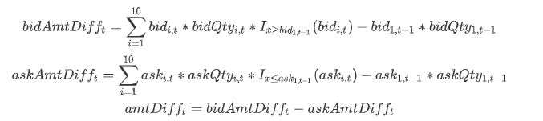

其中 bidAmtDiff<sub>t</sub> 表示 t 时刻的委买增额； bid<sub>i,t</sub> 表示 t 时刻快照数据的第 i 档买方报价；指示函数 I 含义如下：

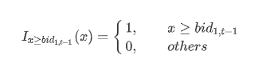

根据上述公式，结合 DolphinDB 丰富的内置函数（`prev` 获取上一个 tick 的价格；`rowSum` 计算 Array Vector 的行和），可以转写出如下代码：

```
@state
def calculateAmtDiff(bid, ask, bidvol, askvol){
	lastBidPrice = prev(bid[0])		// 上一个 tick 的买一价
	lastAskPrice = prev(ask[0])		// 上一个 tick 的卖一价
	lastBidQty = prev(bidvol[0])		// 上一个 tick 的买一量
	lastAskQty = prev(askvol[0])	// 上一个 tick 的卖一量
	// 求委买增额
	bidAmtDiff = rowSum(bid*bidvol*(bid >= lastBidPrice)) - lastBidPrice*lastBidQty
	// 求委卖增额
	askAmtDiff = rowSum(ask*askvol*(ask <= lastAskPrice)) - lastAskPrice*lastAskQty
	return bidAmtDiff - askAmtDiff
}
```

用上面的自定义函数，可以快速地实现净委买增额的批计算和流计算。

- **批计算**

    ```
    snapshot = loadTable("dfs://SH_TSDB_snapshot_ArrayVector", "snapshot")
    res1 = select SecurityID, DateTime, calculateAmtDiff(BidPrice, OfferPrice, BidOrderQty, OfferOrderQty) as amtDiff from snapshot context by SecurityID csort DateTime
    ```

- **流计算**

    ```
    // 创建输入输出表
    share(streamTable(1:0, snapshot.schema().colDefs.name, snapshot.schema().colDefs.typeString), `snapshotStreamTable)
    share(streamTable(1:0, `SecurityID`DateTime`amtDiff, [SYMBOL, TIMESTAMP, DOUBLE]), `res2)
    go
    // 创建流计算引擎
    createReactiveStateEngine(name="calAmtDiffDemo", metrics=<[DateTime, calculateAmtDiff(BidPrice, OfferPrice, BidOrderQty, OfferOrderQty)]>, dummyTable=snapshotStreamTable, outputTable=res2, keyColumn=`SecurityID)
    // 创建订阅
    subscribeTable(tableName="snapshotStreamTable", actionName="calAmtDiffTest", offset=-1, handler=getStreamEngine("calAmtDiffDemo"), msgAsTable=true)
    // 取数据回放，模拟流数据
    testData = select * from snapshot where date(DateTime)=2021.12.01 order by DateTime
    submitJob("replayData", "replay snapshot data", replay{inputTables=testData, outputTables=snapshotStreamTable, dateColumn=`DateTime, timeColumn=`DateTime, replayRate=1000})
    ```

#### 3.3.2. 十档净委买增额

根据[处理 Level 2 行情数据实例](l2_stk_data_proc.md) ，实现的指标公式如下：

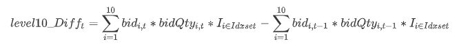

其中 level10_Diff<sub>t</sub> 表示 t 时刻的委买增额； bid<sub>i,t</sub> 表示 t 时刻快照数据的第 i 档买方报价；指示函数 I 含义如下：

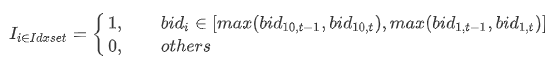

DolphinDB 中可以先通过行对齐函数 `rowAlign` 实现当前十档价格和前一个十档价格进行行对齐；然后通过 `rowAt` 和 `nullFill` 函数分别获取对应档位的委托量和价格；最后通过 `rowSum` 函数计算总的变化额。

```
@state
def level10_Diff(price, qty, buy){
        prevPrice = price.prev()
        left, right = rowAlign(price, prevPrice, how=iif(buy, "bid", "ask"))
        qtyDiff = (qty.rowAt(left).nullFill(0) - qty.prev().rowAt(right).nullFill(0)) 
        amtDiff = rowSum(nullFill(price.rowAt(left), prevPrice.rowAt(right)) * qtyDiff)
        return amtDiff
}

snapshot = loadTable("dfs://SH_TSDB_snapshot_ArrayVector", "snapshot")
res = select SecurityID, DateTime, level10_Diff(BidPrice, BidOrderQty, true) as level10_Diff from snapshot context by SecurityID csort DateTime
```

## 4. 总结

针对不定长度二维数组的存储和计算，DolphinDB 提供了一种特殊的数据形式 —— Array Vector。

本教程针对 Array Vector 的特点、使用方式、注意事项、应用场景等做了一系列的介绍。

DolphinDB 能够存储大量的历史高频行情数据，为其后续的高效因子挖掘和计算提供支持，特别是在 level 2 快照数据的存储和计算上，Array Vector 展现了其简洁、高效、灵活的特点。

## 5. 附件

## 附件
[snapshot_100stocks_multi.zip](https://cdn.dolphindb.cn/downloads/snapshot_100stocks_multi.zip)