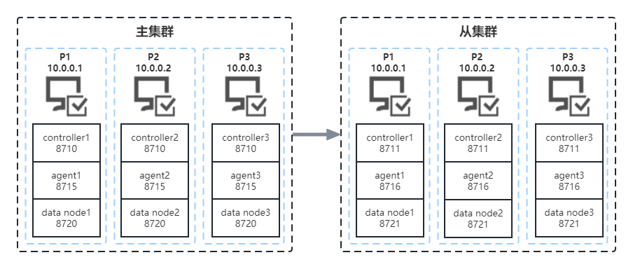
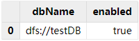
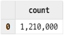
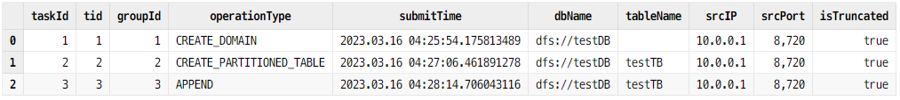
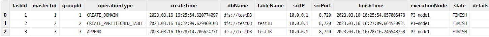
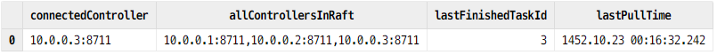
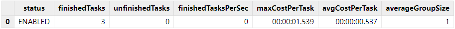
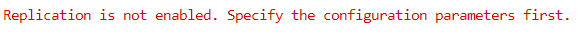
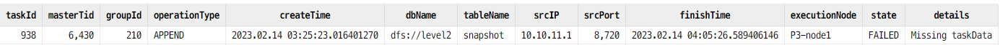

# DolphinDB 集群间的异步复制

异步复制是进行集群间数据同步的一种方式。在金融交易、物联网、互联网/移动互联网等应用场景中，复杂的业务对数据一致性和可靠性提出了极高的要求。与同步复制相比，异步复制网络延迟更低、吞吐量更高、故障风险更小。

DolphinDB 提供的异步复制功能通过异步方式，将主集群复制到从集群，使主从集群数据一致，是集群异地容灾的一个解决方案。

传统集群间的异步复制可能导致数据不一致、丢失或冲突。与传统集群间的异步复制解决方案相比，DolphinDB 具有以下优势：

- 容错性强。节点宕机不会造成数据丢失，主从集群数据最终会保持一致。
- 运维便捷。提供在线监控函数以及错误修复函数。

本教程将从以下几方面对 DolphinDB 的异步复制方案进行介绍：


  - [1. 概述](#1-概述)
    - [1.1 原理](#11-原理)
    - [1.2 支持性](#12-支持性)
  - [2. 环境配置](#2-环境配置)
    - [2.1 主集群配置](#21-主集群配置)
    - [2.2 从集群配置](#22-从集群配置)
  - [3. 使用异步复制](#3-使用异步复制)
    - [3.1 开启集群间异步复制](#31-开启集群间异步复制)
    - [3.2 查询异步复制状态](#32-查询异步复制状态)
    - [3.3 停止或关闭异步复制](#33-停止或关闭异步复制)
  - [4. 常见问题](#4-常见问题)
    - [4.1 Replication is not enabled](#41-replication-is-not-enabled)
    - [4.2 异步复制任务异常中止](#42-异步复制任务异常中止)
  - [5. 附录](#5-附录)


## 1. 概述

### 1.1 原理

使用异步复制功能时，原集群称为主集群，目的集群称为从集群。当前主集群的控制节点会在处理事务时收集相关信息，生成异步复制任务并放到主集群的队列中。同时从集群的控制节点定时从主集群的队列中拉取任务，放到从集群的队列中等待执行。从集群队列中的任务会被划分为不同的组，执行时在组间依次进行，同一组中的任务根据哈希算法被分配到不同的数据节点中并发执行。

异步复制通过各种机制保证数据的一致性，但主集群数据节点的宕机仍可能导致数据丢失。在这种情况下，可以通过开启同步持久化来保证数据一致（见 [2.1](#21-主集群配置) 小节）。

关于异步复制的详细原理请参考[异步复制机制](https://dolphindb.cn/cn/help/DatabaseandDistributedComputing/Database/ClusterAsyncReplication.html#id4)。

### 1.2 支持性

异步复制功能目前支持分布式表；支持 DDL（Data  Definition Language）/ DML（Data Manipulation Languange）操作；支持在数据库层面上开启或关闭异步复制功能。

关于异步复制支持性的更多介绍请参考[异步复制支持性](https://dolphindb.cn/cn/help/DatabaseandDistributedComputing/Database/ClusterAsyncReplication.html#id2)。

## 2. 环境配置

本教程使用两个高可用集群作为示例，架构如下图：



集群间的异步复制支持一个主集群，多个从集群。用户在使用异步复制功能时需要至少部署两个集群，集群类型可为单服务器集群、多服务器集群以及高可用集群。关于如何部署集群请参考[单服务器集群部署](https://gitee.com/dolphindb/Tutorials_CN/blob/master/single_machine_cluster_deploy.md)、[多服务器集群部署](https://gitee.com/dolphindb/Tutorials_CN/blob/master/multi_machine_cluster_deployment.md)、[高可用集群部署](https://gitee.com/dolphindb/Tutorials_CN/blob/master/ha_cluster_deployment.md)。

本教程假定主集群配置文件位于 */dolphindb/server/cluster1/config* 目录下，从集群配置文件位于 */dolphindb/server/cluster2/config* 目录下。与异步复制相关的配置项请参考[集群间的异步复制配置项](https://www.dolphindb.cn/cn/help/DatabaseandDistributedComputing/Configuration/ConfigParamRef.html#id23)。

### 2.1 主集群配置

以 P1 服务器为例，首先登陆 P1 服务器，进入 */dolphindb/server/cluster1/config* 目录。

- **控制节点配置**

执行以下 Shell 命令修改 *controller.cfg* 配置文件：

```
vim ./controller.cfg
```

添加如下配置项参数：

```
clusterReplicationSlaveNum=1
```

*clusterReplicationSlaveNum* 指定允许配置的从集群数量上限，本教程中从集群数量为1。

- **数据节点配置**

执行以下 Shell 命令修改 *cluster.cfg* 配置文件：

```
vim ./cluster.cfg
```

添加如下配置项参数：

```
clusterReplicationMode=master
clusterReplicationWorkDir=/dolphindb/server/cluster1/replication
clusterReplicationSyncPersistence=false
```

*clusterReplicationSyncPersistence* 指定是否开启任务数据的同步持久化，默认为 false，表示持久化异步进行。在这种状态下，主集群数据节点的宕机可能导致数据丢失。可以指定 *clusterReplicationSyncPersistence* 的值为 true 开启同步持久化，以确保数据的一致性。但请注意，开启同步持久化之后，主集群的事务效率会降低。

在完成 P1 服务器的配置之后，请同步修改主集群中其它服务器的配置。在本例中，这表示 P2 和 P3 服务器的配置同样需要按照以上操作进行修改。

### 2.2 从集群配置

以 P1 服务器为例，首先登陆 P1 服务器，进入 */dolphindb/server/cluster2/confi*g 目录。

- **控制节点配置**

执行以下 Shell 命令修改 *controller.cfg* 配置文件：

```
vim ./controller.cfg
```

添加如下配置项参数：

```
clusterReplicationMasterCtl=10.0.0.1:8848
```

*clusterReplicationMasterCtl* 指定主集群控制节点。若主集群为高可用集群，则指定为控制节点 raft 组中的任意节点即可。在本例中指定 P1 服务器中的控制节点。

- **数据节点配置**

执行以下 Shell 命令修改 *cluster.cfg 配置文件：*

```
vim ./cluster.cfg
```

添加如下配置项参数：

```
clusterReplicationMode=slave
clusterReplicationExecutionUsername=admin
clusterReplicationExecutionPassword=123456
```

在配置中指定了用于执行集群间异步复制的用户名和密码。**必须确保该用户有事务操作的相关权限**，即对于主集群上执行的操作，该用户在从集群上同样有执行的权限，否则异步复制任务会失败。关于 DolphinDB 权限的具体介绍请参考[用户权限管理](https://www.dolphindb.cn/cn/help/SystemManagement/UserAccessControl.html)。

在完成以上配置之后，请同步修改从集群中其它服务器的配置。

## 3. 使用异步复制

接下来通过一个例子介绍如何使用 DolphinDB 集群间的异步复制功能。首先，在主集群和从集群中各选择一个数据节点（以下分别使用 dataNodeMaster 和 dataNodeSlave 表示），打开对应的交互编程界面。

### 3.1 开启集群间异步复制

在 dataNodeMaster 的交互编程界面执行以下语句创建数据库：

```
// 创建存储的数据库
login("admin", "123456")
dbName = "dfs://testDB"
if(existsDatabase(dbName)){
  dropDatabase(dbName)
}
db = database(dbName, VALUE, 2023.01.01..2023.12.31)
```

集群异步复制状态共三种：

- ENABLED，开启状态，集群的默认状态；
- DISABLED，关闭状态，用户手动停止了异步复制任务或配置中未包括异步复制相关配置项；
- STOPPED，停止状态，从集群任务执行失败 30 次后将转为该状态。

在集群启动时异步复制状态默认为 "ENABLED"，但集群中新创建的数据库默认关闭异步复制功能，因此需要在 dataNodeMaster 的交互编程界面执行以下语句开启新建数据库的异步复制功能：

```
setDatabaseForClusterReplication(db, true)
```

执行以下语句以确认数据库的异步复制是否开启：

```
schema(db).clusterReplicationEnabled
```

若执行结果返回 true，则说明异步复制功能已启用。也可以通过 [getDatabaseClusterReplicationStatus](https://www.dolphindb.cn/cn/help/FunctionsandCommands/FunctionReferences/g/getDatabaseClusterReplicationStatus.html) 查看所有数据库的异步复制开启状态，但请注意，使用该函数的前提是数据库中存在数据。

```
getDatabaseClusterReplicationStatus()
```

查询结果如下，**dbName** 表示库名，**enabled** 表示开启状态。



### 3.2 查询异步复制状态

在 dataNodeMaster 的交互编程界面执行以下语句创建分区表：

```
// 创建分区表
tbName = "testTB"
colNames = `SecurityID`DateTime`PreClosePx`OpenPx`HighPx`LowPx`LastPx`Volume`Amount
colTypes = [SYMBOL, DATETIME, DOUBLE, DOUBLE, DOUBLE, DOUBLE, DOUBLE, INT, DOUBLE]
schemaTable = table(1:0, colNames, colTypes)
db.createPartitionedTable(table=schemaTable, tableName=tbName, partitionColumns=`DateTime)
```

为了确认在主集群中创建库表后，从集群复制了主集群的库表信息，在 dataNodeSlave 的交互编程界面执行以下语句：

```
loadTable("dfs://testDB", "testTB")
```

函数执行成功说明从集群中成功创建了数据库 `dfs://testDB` 和表 `testTB`。

接着在 dataNodeMaster 执行以下语句，模拟生成 5000 个股票 1 天的 1 分钟 K 线数据：

```
// 模拟数据并写入分区表
n = 1210000
randPrice = round(10+rand(1.0, 100), 2)
randVolume = 100+rand(100, 100)
SecurityID = lpad(string(take(0..4999, 5000)), 6, `0)
DateTime = (2023.01.08T09:30:00 + take(0..120, 121)*60).join(2023.01.08T13:00:00 + take(0..120, 121)*60)
PreClosePx = rand(randPrice, n)
OpenPx = rand(randPrice, n)
HighPx = rand(randPrice, n)
LowPx = rand(randPrice, n)
LastPx = rand(randPrice, n)
Volume = int(rand(randVolume, n))
Amount = round(LastPx*Volume, 2)
tmp = cj(table(SecurityID), table(DateTime))
t = tmp.join!(table(PreClosePx, OpenPx, HighPx, LowPx, LastPx, Volume, Amount))
dbName = "dfs://testDB"
tbName = "testTB"
loadTable(dbName, tbName).append!(t)
```

执行以下语句确认数据已同步到从集群中：

```
select count(*) from loadTable("dfs://testDB", "testTB")
```

返回结果如下：



从集群对应的分区表中插入了 1210000 条数据。可以确认主集群中的数据已同步到从集群中。

若希望查看关于集群间异步复制更详细的状态信息，可通过 DolphinDB 提供的一系列函数进行查询：

- `getMasterReplicationStatus`
- `getSlaveReplicationStatus`
- `getRecentSlaveReplicationInfo`
- `getClusterReplicationMetrics`

在 dataNodeMaster 的交互编程界面执行以下语句可以查询主集群任务发送队列的状态：

```
rpc(getControllerAlias(), getMasterReplicationStatus)
```

[getMasterReplicationStatus](https://www.dolphindb.cn/cn/help/FunctionsandCommands/FunctionReferences/g/getMasterReplicationStatus.html) 只能在控制节点上执行，用户可以通过 `rpc` 函数在控制节点上进行调用。返回结果如下。



主集群生成了三个异步复制任务，分别对应创建数据库、创建表和插入数据。关于上图中各参数的介绍请参考[函数介绍](https://www.dolphindb.cn/cn/help/FunctionsandCommands/FunctionReferences/g/getMasterReplicationStatus.html)。

与之相对应，在 dataNodeSlave 上使用 [getSlaveReplicationStatus](https://www.dolphindb.cn/cn/help/FunctionsandCommands/FunctionReferences/g/getSlaveReplicationStatus.html)[ ](https://www.dolphindb.cn/cn/help/FunctionsandCommands/FunctionReferences/g/getSlaveReplicationStatus.html?highlight=异步复制)可以查询从集群任务执行队列的状态：

```
rpc(getControllerAlias(), getSlaveReplicationStatus)
```

函数返回结果如下。



从集群拉取了主集群上生成的三个任务并完成执行。

在 dataNodeMaster 上使用 [getRecentSlaveReplicationInfo](https://www.dolphindb.cn/cn/help/FunctionsandCommands/FunctionReferences/g/getRecentSlaveReplicationInfo.html) 可以查看跨集群异步复制进程中，连接到主集群的各从集群最近一次的任务状态。

```
rpc(getControllerAlias(), getRecentSlaveReplicationInfo)
```

函数返回结果如下。



从集群最近一次拉取任务时通过控制节点 10.0.0.3:8711 进行连接，最近完成任务的 taskID 为 3。

若想获取从集群异步复制的任务进度和耗时，可以在 dataNodeSlave 上使用 [getClusterReplicationMetrics](https://www.dolphindb.cn/cn/help/FunctionsandCommands/FunctionReferences/g/getClusterReplicationMetrics.html) 进行查询。

```
rpc(getControllerAlias(), getClusterReplicationMetrics, 30)
```

最后一个参数指定了时间区间为过去 30s 内的状态信息，函数返回结果如下。



过去 30s 内完成了三个任务，任务平均耗时为 00:00:00.537。  

:bulb:**注意**：  
若将上述例子中最后一个参数值改为-1，即 `rpc(getControllerAlias(),getClusterReplicationMetrics, -1)`，则返回自异步复制开启后的所有状态信息。

### 3.3 停止或关闭异步复制

在某些情况下需要暂时停止集群间的异步复制，在 dataNodeMaster 或 dataNodeSlave 上执行如下语句来停止主集群或从集群的异步复制。

```
rpc(getControllerAlias(), stopClusterReplication)
```

若在主集群上执行 [stopClusterReplication](https://www.dolphindb.cn/cn/help/FunctionsandCommands/CommandsReferences/s/stopClusterReplication.html)，集群异步复制状态转为 "DISABLED"，在此之后创建的任务将不会放到发送队列中；若在从集群上执行，从集群停止从主集群读取新任务，但正在执行中的任务不会停止。

若希望重新开启异步复制，可通过 [startClusterReplication](https://www.dolphindb.cn/cn/help/FunctionsandCommands/CommandsReferences/s/startClusterReplication.html)  重新启动，集群状态将转为 "ENABLED"。该函数同样只能在控制节点上调用。

当完成异步复制任务之后希望关闭数据库的异步复制功能时，可使用 [setDatabaseForClusterReplication](https://www.dolphindb.cn/cn/help/FunctionsandCommands/CommandsReferences/s/setDatabaseForClusterReplication.html) 来关闭。

```
setDatabaseForClusterReplication(db, false)
```

以上通过一些简单的例子对如何使用异步复制功能进行了介绍，若希望了解更多异步复制支持的操作，请参考 [DolphinDB用户手册](https://www.dolphindb.cn/cn/help/index.html)。

## 4. 常见问题

### 4.1 Replication is not enabled

执行异步复制相关函数报错如下：



该情况一般为集群未正确配置异步复制，请参考[第二节](#2-环境配置)检查环境配置。

### 4.2 异步复制任务异常中止

异步复制任务在执行过程中可能由于异常而中止，比如下面这种情况。



使用 `getSlaveReplicationStatus` 查看任务执行队列状态发现异步复制任务由于失败而中止，**state** 显示为 “FAILED”，失败的任务 ID 为 938。此时的集群状态为 “STOPPED”。

导致异步复制任务失败的原因可能为磁盘容量不足、无写文件权限等等，**details** 中会给出失败原因。用户可以根据失败原因尝试解决，然后执行 *startClusterReplication* 重启异步复制任务。从集群将再次执行所有失败的任务。

若无法分析失败原因，请联系技术支持人员进行处理。可以暂时跳过失败的任务，继续执行之后的任务，在从集群的数据节点上执行以下语句跳过该任务。

```
rpc(getControllerAlias(), skipClusterReplicationTask, 938)
rpc(getControllerAlias(), startClusterReplication)
```

首先通过 [skipClusterReplicationTask](https://www.dolphindb.cn/cn/help/FunctionsandCommands/CommandsReferences/s/skipClusterReplicationTask.html) 跳过了失败的任务，接着调用 `startClusterReplication` 重启了异步复制。跳过的任务将被标记为完成状态。

## 5. 附录

异步复制主集群Demo：

demo_asynMaster.dos:  [Asynchronous_Replication](script/Asynchronous_Replication) 


异步复制从集群Demo：

demo_asynSlave.dos:  [Asynchronous_Replication](script/Asynchronous_Replication) 


 