# DolphinDB 与 Python AirFlow 最佳实践

DolphinDB 作为一款高性能时序数据库，其在实际生产环境中常有数据的清洗、装换以及加载等需求，而对于该如何结构化管理好 ETL 作业，Airflow 提供了一种很好的思路。本篇教程为生产环境中 ETL 实践需求提供了一个解决方案，将 Python Airflow 引入到 DolphinDB 的高可用集群中，通过使用 Airflow  所提供的功能来实现更好管理 DolphinDB 数据 ETL 作业，整体架构如下:

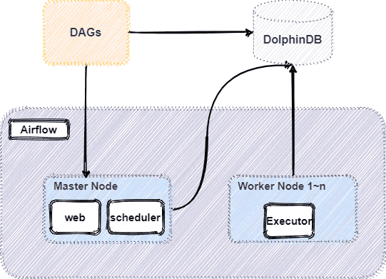

本教程包含内容如下：


  - [1. Airflow](#1-airflow)
    - [1.1 Airflow 简介](#11-airflow-简介)
    - [1.2 Airflow 部分核心功能](#12-airflow-部分核心功能)
    - [1.3 DolphinDBOperator](#13-dolphindboperator)
    - [1.4 Airflow 安装部署](#14-airflow-安装部署)
  - [2. Airflow 调度对行情数据 ETL](#2-airflow-调度对行情数据-etl)
    - [2.1 整体 ETL 架构图](#21-整体-etl-架构图)
    - [2.2 数据介绍](#22-数据介绍)
    - [2.3 DolphinDB 核心清洗脚本介绍](#23-dolphindb-核心清洗脚本介绍)
    - [2.4 增量数据清洗](#24-增量数据清洗)
    - [2.5 Airflow 生成 DAG 执行任务](#25-airflow-生成-dag-执行任务)
  - [3. 常见问题解答(FAQ)](#3-常见问题解答faq)
    - [3.1 如何捕获 DolphinDB 脚本中的 print 函数打印的信息](#31-如何捕获-dolphindb-脚本中的-print-函数打印的信息)
    - [3.2 DolphinDB 脚本中的异步作业 submitjob 如何检测其完成状态](#32-dolphindb-脚本中的异步作业-submitjob-如何检测其完成状态)
    - [3.3 执行 Airflow 中经常遇到连接超时断开，该如何处理](#33-执行-airflow-中经常遇到连接超时断开该如何处理)
    - [3.4 将 start\_date 日期设为当前日期，每天运行一次，为什么当天不会运行](#34-将-start_date-日期设为当前日期每天运行一次为什么当天不会运行)
    - [3.5 DolphinDBOperator 任务运行失败如何定位失败原因](#35-dolphindboperator-任务运行失败如何定位失败原因)
  - [4. 总结](#4-总结)
  - [法律声明](#法律声明)
  - [附件](#附件)


## 1. Airflow

### 1.1 Airflow 简介

Airflow 是一个可编程，调度和监控的工作流平台，基于有向无环图 (Directed acyclic graph, DAG)，Airflow 可以定义一组有依赖的任务，按照依赖依次执行。Airflow 提供了丰富的命令行工具用于系统管控，而其 web 管理界面同样也可以方便地管控调度任务，并且对任务运行状态进行实时监控，方便了系统的运维和管理。

### 1.2 Airflow 部分核心功能

- **增量加载数据**：当表或数据集较小时，可以整体加载数据。但是随着数据的增长，以固定的时间间隔增量提取数据才是 ETL 的常态，仅加载一个小时，一天，一周数据的需求非常普遍。Airflow 可以容易地以特定的时间间隔加载增量数据。
- **处理历史数据**：在某些情况下，您刚刚完成一个新的工作流程并且需要回溯到将新代码投入生产的日期的数据。在这种情况下，您只需使用 DAG 中的 *start_date* 参数以指定开始日期。然后，Airflow 将回填任务到开始日期。此外，还可以使用 DAG 的参数来处理数周、数月或数年的数据。
- **分区提取的数据**：通过对数据的目的地进行分区，可以并行运行 DAG，避免对提取的数据进行锁定，并在读取相同数据时优化性能。不再相关的数据可以存档并从数据库中删除。
- **强制幂等约束**：DAG 运行的结果应始终具有幂等特性。这意味着当您使用相同的参数多次运行某个流程时（即使在不同的日期），结果也将完全相同。
- **有条件地执行**：Airflow 具有一些选项，可根据之前的实例的成功来控制 DAG 中任务的运行方式。

### 1.3 DolphinDBOperator 

DolphinDBOperator 是 Airflow 的 operator 一种，通过 DolphinDBOperator 可以在 Airflow 连接 DolphinDB 进行数据写入、查询、计算等操作。DolphinDBOperator 特有的参数有：

- `dolphindb_conn_id`: 用于指定 DolphinDB 连接，可在 connection 中设置
- `sql`: 指定需要运行的 DolphinDB 脚本
- `file_path`: 可以指定 DolphinDB dos 文件运行脚本

DolphinDBOperator 使用示例如下：

- 通过 sql 参数指定任务内容运行脚本：

    ```
    //在 DolphinDB 中创建一个共享表
    create_parameter_table = DolphinDBOperator(
            task_id='create_parameter_table',
            dolphindb_conn_id='dolphindb_test',
            sql='''
                undef(`paramTable,SHARED)
                t = table(1:0, `param`value, [STRING, STRING])
                share t as paramTable
                '''
        )
    ```
- 通过 file_path 指定 dos 文件运行脚本：

    ```
        //CalAlpha001.dos 为 DolphinDB 脚本
        case1 = DolphinDBOperator(
            task_id='case1',
            dolphindb_conn_id='dolphindb_test',
            file_path=path + "/StreamCalculating/CalAlpha001.dos"
        )
    ```

### 1.4 Airflow 安装部署

- **硬件环境**：

    | 硬件名称 | 配置信息                  |
    | :------- | :------------------------ |
    | 主机名   | HostName                  |
    | 外网 IP  | xxx.xxx.xxx.122           |
    | 操作系统 | Linux（内核版本3.10以上） |
    | 内存     | 64 GB                     |
    | CPU      | x86_64（12核心）          |

- **软件环境**：

    | 软件名称  | 版本信息  |
    | :-------- | :-------- |
    | DolphinDB | 2.00.9    |
    | Airflow   | 2.5.1     |
    | python    | 3.7及以上 |

> **注**：
>
> 1. 本教程使用 SQLite 数据库作为后端存储，如果因 SQLite 版本过低无法启动，可参考[设置数据库](https://airflow.apache.org/docs/apache-airflow/stable/howto/set-up-database.html)，升级 SQLlite 或更改默认数据库。
>
> 2. 在流程开始前建议预先构建 DolphinDB 服务。具体安装方法可以参考 [DolphinDB 高可用集群部署教程](https://gitee.com/dolphindb/Tutorials_CN/blob/master/ha_cluster_deployment.md)。也可以参考基于 [Docker-Compose 的 DolphinDB 多容器集群部署](https://gitee.com/dolphindb/dolphindb-k8s/blob/master/docker-compose_high_cluster.md)。

- **主机环境**  
  
    1. 执行以下命令安装 Airflow：
    
        ```
        pip install airflow-provider-dolphindb
        ```       
    
    2. 安装好 airflow.provider.dolphindb 插件后，启动 Airflow ：
    
        部署以及安装 Airflow 详情见官网：[airflow 快速入门](https://airflow.apache.org/docs/apache-airflow/stable/start.html)。以下为启动 Airflow 的核心代码:
        
        ```
        #初始化数据库
        airflow db init
        
        #创建用户
        airflow users create  --username admin  --firstname Peter  --lastname Parker  --role Admin  --email spiderman@superhero.org  --password admin
        
        # 守护进程运行 webserver
        airflow webserver --port 8080 -D
        
        # 守护进程运行 scheduler
        airflow scheduler -D
        ```
    
    3. 执行以下命令验证 Airflow 是否成功启动：
    
        ```
        ps -aux|grep airflow
        ```
        
        预期输出如下图，证明 Airflow 启动成功：
        
        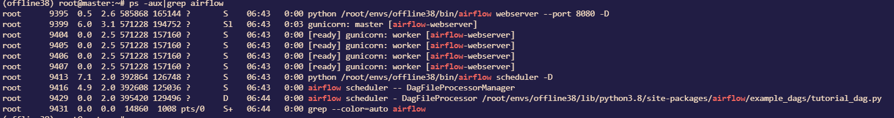
    
    4. 启动成功后，浏览器中登陆 Airflow 的 web 界面：
    
        - 默认地址：`http://IP:8080`
        - 默认账户：初始化 db 中创建，本文例子中为 `admin`
        - 默认密码：初始化 db 中创建, 本文例子中为 `admin`
        
        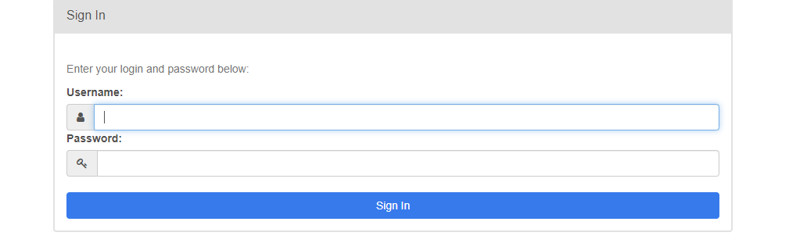
    
    5. 输入上述创建用户名密码即可进入 Airflow 的 UI 界面，如下所示:
    
        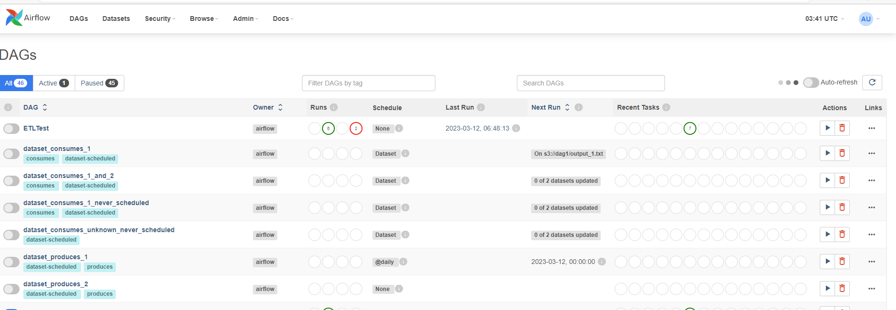
    
    6. 填写 DolphinDB 连接信息后连接到 DolphinDB 数据库。
    
        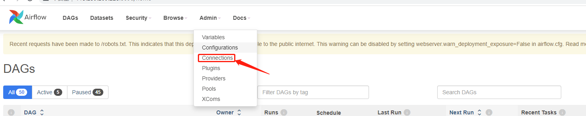
    
    
        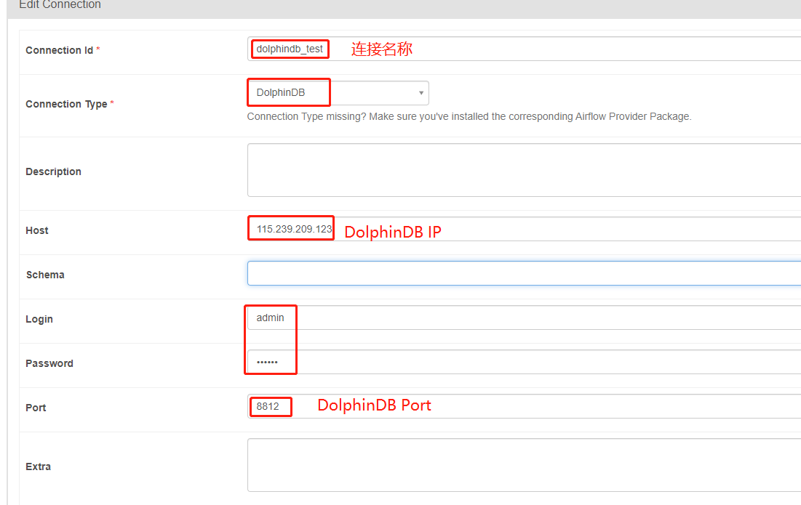
    
        连接成功后，在 DolphinDBOperator 中指定 `dolphindb_conn_id='dolphindb_test'`，即可运行 DolphinDB 脚本。上述准备工作完成后，下文以一个股票快照数据的 ETL 过程为例展现 Airflow 如何和 DolphinDB 交互。

## 2. Airflow 调度对行情数据 ETL

### 2.1 整体 ETL 架构图

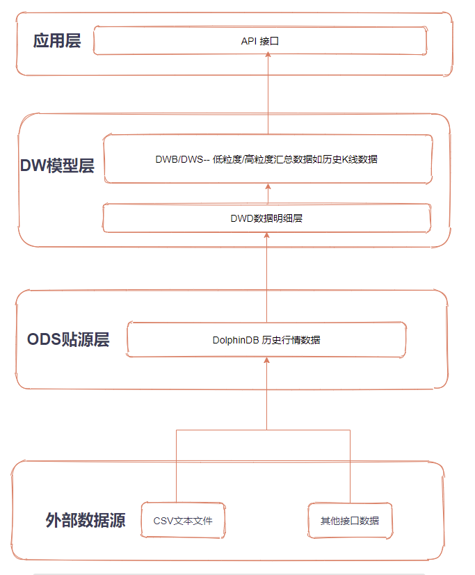

**ETL 平台功能模块代码目录结构**


**功能模块代码目录结构详解**

- *add*：增量数据 ETL
  - addLoadSnapshot：每日新增 Snapshot 原始数据导入
  - addProcessSnapshot：增量 Snapshot 处理成 ArrayVector 以及清洗数据
  - addFactor：增加合成日 K 及一分钟 K 数据并存储
  - addETL.py：构建增量数据 DAG

- *full*：全量数据 ETL
  - loadSnapshot：Snapshot 建表与导入
  - processSnapshot：Snapshot 清洗结果建表，将数据处理成 ArrayVector 以及清洗数据并存储
  - Factor：创建因子存储表，将清洗后数据加工成日 K 以及一分钟 K 数据并存储
  - fullETL.py：构建全量数据 DAG

**外部数据源 - > ODS 数据源**：将原始数据从外部数据源导入 DolphinDB

**ODS 数据源 - >DWD 数据明细**：清洗原始数据，将原始数据中的多档数据清洗成 ArrayVector 并去重

**DWD 数据明细 - > DWB/DWS 数据汇总**:  对清洗后的快照数据进行计算加工合成 K 线数据

> **注**：
> 本教程使用 DolphinDB 中 module 功能以及 DolphinDB 客户端工具进行工程化管理 DolphinDB 脚本，详细介绍见 [DolphinDB教程: 模块](https://gitee.com/dolphindb/Tutorials_CN/blob/master/module_tutorial.md) 以及 [DolphinDB客户端软件教程](https://gitee.com/dolphindb/Tutorials_CN/blob/master/client_tool_tutorial.md)。

### 2.2 数据介绍

本教程选取了 2020.01.04 - 2021.01.08 全市场所有股票的 5 天的 level 2 快照数据。以下是快照表在DolphinDB的结构。BidOrderQty，BidPrice，BidNumOrders，BidOrders，OfferPrice，OfferOrderQty，OfferNumOrders 和 OfferOrders 8个字段分别包含多档数据，在 DolphinDB 中采用 ArrayVector 数据类型来保存：

| 字段名           | 字段含义              | 数据类型（DolphinDB） |
| :--------------- | :-------------------- | :-------------------- |
| SecurityID       | 证券代码              | SYMBOL                |
| DateTime         | 日期时间              | TIMESTAMP             |
| PreClosePx       | 昨收价                | DOUBLE                |
| OpenPx           | 开始价                | DOUBLE                |
| HighPx           | 最高价                | DOUBLE                |
| LowPx            | 最低价                | DOUBLE                |
| LastPx           | 最新价                | DOUBLE                |
| TotalVolumeTrade | 成交总量              | INT                   |
| TotalValueTrade  | 成交总金额            | DOUBLE                |
| InstrumentStatus | 交易状态              | SYMBOL                |
| BidPrice         | 申买十价              | DOUBLE[]              |
| BidOrderQty      | 申买十量              | INT[]                 |
| BidNumOrders     | 申买十实际总委托笔 数 | INT[]                 |
| BidOrders        | 申买一前 50 笔订单    | INT[]                 |
| OfferPrice       | 申卖十价              | DOUBLE[]              |
| OfferOrderQty    | 申卖十量              | INT[]                 |
| OfferNumOrders   | 申卖十实际总委托笔 数 | INT[]                 |
| OfferOrders      | 申卖一前 50 笔订单    | INT[]                 |
| ……               | ……                    | ……                    |

### 2.3 DolphinDB 核心清洗脚本介绍

#### 2.3.1 创建分布式库表

- 创建 snapshot 原始数据存储表：

    创建存储原始 snapshot 原始数据的库表，核心代码如下：
    ```
    module loadSnapshot::createSnapshotTable
    
    //创建 snapshot 原始数据存储库表
    def createSnapshot(dbName, tbName){
    	login("admin", "123456")
    	if(existsDatabase(dbName)){
    		dropDatabase(dbName)
    	}
    	db1 = database(, VALUE, 2020.01.01..2021.01.01)
    	db2 = database(, HASH, [SYMBOL, 50])
    	//按天和股票代码组合分区
    	db = database(dbName,COMPO,[db1,db2],engine='TSDB')
    	colName = ["SecurityID","DateTime","PreClosePx","OpenPx","HighPx","LowPx","LastPx","TotalVolumeTrade","TotalValueTrade","InstrumentStatus","BidPrice0","BidPrice1","BidPrice2","BidPrice3","BidPrice4","BidPrice5","BidPrice6","BidPrice7","BidPrice8","BidPrice9","BidOrderQty0","BidOrderQty1","BidOrderQty2","BidOrderQty3","BidOrderQty4","BidOrderQty5","BidOrderQty6","BidOrderQty7","BidOrderQty8","BidOrderQty9","BidNumOrders0","BidNumOrders1","BidNumOrders2","BidNumOrders3","BidNumOrders4","BidNumOrders5","BidNumOrders6","BidNumOrders7","BidNumOrders8","BidNumOrders9","BidOrders0","BidOrders1","BidOrders2","BidOrders3","BidOrders4","BidOrders5","BidOrders6","BidOrders7","BidOrders8","BidOrders9","BidOrders10","BidOrders11","BidOrders12","BidOrders13","BidOrders14","BidOrders15","BidOrders16","BidOrders17","BidOrders18","BidOrders19","BidOrders20","BidOrders21","BidOrders22","BidOrders23","BidOrders24","BidOrders25","BidOrders26","BidOrders27","BidOrders28","BidOrders29","BidOrders30","BidOrders31","BidOrders32","BidOrders33","BidOrders34","BidOrders35","BidOrders36","BidOrders37","BidOrders38","BidOrders39","BidOrders40","BidOrders41","BidOrders42","BidOrders43","BidOrders44","BidOrders45","BidOrders46","BidOrders47","BidOrders48","BidOrders49","OfferPrice0","OfferPrice1","OfferPrice2","OfferPrice3","OfferPrice4","OfferPrice5","OfferPrice6","OfferPrice7","OfferPrice8","OfferPrice9","OfferOrderQty0","OfferOrderQty1","OfferOrderQty2","OfferOrderQty3","OfferOrderQty4","OfferOrderQty5","OfferOrderQty6","OfferOrderQty7","OfferOrderQty8","OfferOrderQty9","OfferNumOrders0","OfferNumOrders1","OfferNumOrders2","OfferNumOrders3","OfferNumOrders4","OfferNumOrders5","OfferNumOrders6","OfferNumOrders7","OfferNumOrders8","OfferNumOrders9","OfferOrders0","OfferOrders1","OfferOrders2","OfferOrders3","OfferOrders4","OfferOrders5","OfferOrders6","OfferOrders7","OfferOrders8","OfferOrders9","OfferOrders10","OfferOrders11","OfferOrders12","OfferOrders13","OfferOrders14","OfferOrders15","OfferOrders16","OfferOrders17","OfferOrders18","OfferOrders19","OfferOrders20","OfferOrders21","OfferOrders22","OfferOrders23","OfferOrders24","OfferOrders25","OfferOrders26","OfferOrders27","OfferOrders28","OfferOrders29","OfferOrders30","OfferOrders31","OfferOrders32","OfferOrders33","OfferOrders34","OfferOrders35","OfferOrders36","OfferOrders37","OfferOrders38","OfferOrders39","OfferOrders40","OfferOrders41","OfferOrders42","OfferOrders43","OfferOrders44","OfferOrders45","OfferOrders46","OfferOrders47","OfferOrders48","OfferOrders49","NumTrades","IOPV","TotalBidQty","TotalOfferQty","WeightedAvgBidPx","WeightedAvgOfferPx","TotalBidNumber","TotalOfferNumber","BidTradeMaxDuration","OfferTradeMaxDuration","NumBidOrders","NumOfferOrders","WithdrawBuyNumber","WithdrawBuyAmount","WithdrawBuyMoney","WithdrawSellNumber","WithdrawSellAmount","WithdrawSellMoney","ETFBuyNumber","ETFBuyAmount","ETFBuyMoney","ETFSellNumber","ETFSellAmount","ETFSellMoney"]
    	colType = ["SYMBOL","TIMESTAMP","DOUBLE","DOUBLE","DOUBLE","DOUBLE","DOUBLE","INT","DOUBLE","SYMBOL","DOUBLE","DOUBLE","DOUBLE","DOUBLE","DOUBLE","DOUBLE","DOUBLE","DOUBLE","DOUBLE","DOUBLE","INT","INT","INT","INT","INT","INT","INT","INT","INT","INT","INT","INT","INT","INT","INT","INT","INT","INT","INT","INT","INT","INT","INT","INT","INT","INT","INT","INT","INT","INT","INT","INT","INT","INT","INT","INT","INT","INT","INT","INT","INT","INT","INT","INT","INT","INT","INT","INT","INT","INT","INT","INT","INT","INT","INT","INT","INT","INT","INT","INT","INT","INT","INT","INT","INT","INT","INT","INT","INT","INT","DOUBLE","DOUBLE","DOUBLE","DOUBLE","DOUBLE","DOUBLE","DOUBLE","DOUBLE","DOUBLE","DOUBLE","INT","INT","INT","INT","INT","INT","INT","INT","INT","INT","INT","INT","INT","INT","INT","INT","INT","INT","INT","INT","INT","INT","INT","INT","INT","INT","INT","INT","INT","INT","INT","INT","INT","INT","INT","INT","INT","INT","INT","INT","INT","INT","INT","INT","INT","INT","INT","INT","INT","INT","INT","INT","INT","INT","INT","INT","INT","INT","INT","INT","INT","INT","INT","INT","INT","INT","INT","INT","INT","INT","INT","INT","INT","INT","DOUBLE","DOUBLE","INT","INT","INT","INT","INT","INT","INT","INT","DOUBLE","INT","INT","DOUBLE","INT","INT","INT","INT","INT","INT"]
    	schemaTable = table(1:0,colName, colType)
    	
    	db.createPartitionedTable(table=schemaTable, tableName=tbName, partitionColumns=`DateTime`SecurityID, compressMethods={DateTime:"delta"}, sortColumns=`SecurityID`DateTime, keepDuplicates=ALL)
    }
    ```
    
    对于 snapshot 数据，本文采用的数据库分区方案是组合分区，第一层按天分区，第二层对股票代码按 HASH 分50个分区。如何根据数据确定分区方案可参考 [DolphinDB 分区数据库教程](https://gitee.com/dolphindb/Tutorials_CN/blob/master/database.md)。

- 创建清洗后 snapshot 数据存储表：

    创建清洗后以 Array 格式存储 snapshot 数据的库表，核心代码如下：
    
    ```
    module processSnapshot::createSnapshot_array
    
    //创建清洗后的 snapshot 数据存储表
    def createProcessTable(dbName, tbName){
    	if(existsDatabase(dbName)){
    		dropDatabase(dbName)
    	}
    	db1 = database(, VALUE, 2020.01.01..2021.01.01)
    	db2 = database(, HASH, [SYMBOL, 50])
    	//按天和股票代码组合分区
    	db = database(dbName,COMPO,[db1,db2],engine='TSDB')
    	colName = ["SecurityID","DateTime","PreClosePx","OpenPx","HighPx","LowPx","LastPx","TotalVolumeTrade","TotalValueTrade","InstrumentStatus","BidPrice","BidOrderQty","BidNumOrders","BidOrders","OfferPrice","OfferOrderQty","OfferNumOrders","OfferOrders","NumTrades","IOPV","TotalBidQty","TotalOfferQty","WeightedAvgBidPx","WeightedAvgOfferPx","TotalBidNumber","TotalOfferNumber","BidTradeMaxDuration","OfferTradeMaxDuration","NumBidOrders","NumOfferOrders","WithdrawBuyNumber","WithdrawBuyAmount","WithdrawBuyMoney","WithdrawSellNumber","WithdrawSellAmount","WithdrawSellMoney","ETFBuyNumber","ETFBuyAmount","ETFBuyMoney","ETFSellNumber","ETFSellAmount","ETFSellMoney"]
    	colType = ["SYMBOL","TIMESTAMP","DOUBLE","DOUBLE","DOUBLE","DOUBLE","DOUBLE","INT","DOUBLE","SYMBOL","DOUBLE[]","INT[]","INT[]","INT[]","DOUBLE[]","INT[]","INT[]","INT[]","INT","INT","INT","INT","DOUBLE","DOUBLE","INT","INT","INT","INT","INT","INT","INT","INT","DOUBLE","INT","INT","DOUBLE","INT","INT","INT","INT","INT","INT"]
    	schemaTable = table(1:0, colName, colType)
    	db.createPartitionedTable(table=schemaTable, tableName=tbName, partitionColumns=`DateTime`SecurityID, compressMethods={DateTime:"delta"}, sortColumns=`SecurityID`DateTime, keepDuplicates=ALL)
    }
    ```

- 创建 K 线结果存储表：

    创建分钟级 K 线结果存储表，核心代码如下：
    
    ```
    module Factor::createFactorOneMinute
    
    //创建分钟 k 线因子储存表
    def createFactorOneMinute(dbName, tbName){
    	if(existsDatabase(dbName)){
    		dropDatabase(dbName)
    	}
    	//按天分区
    	db = database(dbName, VALUE, 2021.01.01..2021.01.03,engine = `TSDB)
    	colName = `TradeDate`TradeTime`SecurityID`Open`High`Low`Close`Volume`Amount`Vwap
    	colType =[DATE, MINUTE, SYMBOL, DOUBLE, DOUBLE, DOUBLE, DOUBLE, LONG, DOUBLE, DOUBLE]
    	tbSchema = table(1:0, colName, colType)
      	db.createPartitionedTable(table=tbSchema,tableName=tbName,partitionColumns=`TradeDate,sortColumns=`SecurityID`TradeTime,keepDuplicates=ALL)
    }
    ```
    
    创建日级 K 线结果存储表，核心代码如下：
    
    ```
    module Factor::createFactorDaily
    
    //创建日 K 线储存表
    def createFactorDaily(dbName, tbName){
    	if(existsDatabase(dbName)){
    		dropDatabase(dbName)
    	}
    	//按年分区
    	db = database(dbName, RANGE, datetimeAdd(2000.01M,(0..50)*12, "M"),engine = `TSDB)
    	colName = `TradeDate`SecurityID`Open`High`Low`Close`Volume`Amount`Vwap
    	colType =[DATE, SYMBOL, DOUBLE, DOUBLE, DOUBLE, DOUBLE, LONG, DOUBLE, DOUBLE]
    	tbSchema = table(1:0, colName, colType)
      	db.createPartitionedTable(table=tbSchema,tableName=tbName,partitionColumns=`TradeDate,sortColumns=`SecurityID`TradeDate,keepDuplicates=ALL)
    }
    ```

#### 2.3.2 数据清洗

本文将 snapshot 数据的清洗主要分为两个部分：

- 将多档价格、委托量以 Array 形式储存
- 数据去重

具体的处理流程及核心代码如下:

```
module processSnapshot::processSnapshotData

//将数据组合为 array、去重，并统计重复数据量
def mapProcess(mutable t, dbName, tbName){
	n1 = t.size()
	t = select SecurityID, DateTime, PreClosePx, OpenPx, HighPx, LowPx, LastPx, TotalVolumeTrade, TotalValueTrade, InstrumentStatus, fixedLengthArrayVector(BidPrice0, BidPrice1, BidPrice2, BidPrice3, BidPrice4, BidPrice5, BidPrice6, BidPrice7, BidPrice8, BidPrice9) as BidPrice, fixedLengthArrayVector(BidOrderQty0, BidOrderQty1, BidOrderQty2, BidOrderQty3, BidOrderQty4, BidOrderQty5, BidOrderQty6, BidOrderQty7, BidOrderQty8, BidOrderQty9) as BidOrderQty, fixedLengthArrayVector(BidNumOrders0, BidNumOrders1, BidNumOrders2, BidNumOrders3, BidNumOrders4, BidNumOrders5, BidNumOrders6, BidNumOrders7, BidNumOrders8, BidNumOrders9) as BidNumOrders, fixedLengthArrayVector(BidOrders0, BidOrders1, BidOrders2, BidOrders3, BidOrders4, BidOrders5, BidOrders6, BidOrders7, BidOrders8, BidOrders9, BidOrders10, BidOrders11, BidOrders12, BidOrders13, BidOrders14, BidOrders15, BidOrders16, BidOrders17, BidOrders18, BidOrders19, BidOrders20, BidOrders21, BidOrders22, BidOrders23, BidOrders24, BidOrders25, BidOrders26, BidOrders27, BidOrders28, BidOrders29, BidOrders30, BidOrders31, BidOrders32, BidOrders33, BidOrders34, BidOrders35, BidOrders36, BidOrders37, BidOrders38, BidOrders39, BidOrders40, BidOrders41, BidOrders42, BidOrders43, BidOrders44, BidOrders45, BidOrders46, BidOrders47, BidOrders48, BidOrders49) as BidOrders, fixedLengthArrayVector(OfferPrice0, OfferPrice1, OfferPrice2, OfferPrice3, OfferPrice4, OfferPrice5, OfferPrice6, OfferPrice7, OfferPrice8, OfferPrice9) as OfferPrice, fixedLengthArrayVector(OfferOrderQty0, OfferOrderQty1, OfferOrderQty2, OfferOrderQty3, OfferOrderQty4, OfferOrderQty5, OfferOrderQty6, OfferOrderQty7, OfferOrderQty8, OfferOrderQty9) as OfferQty, fixedLengthArrayVector(OfferNumOrders0, OfferNumOrders1, OfferNumOrders2, OfferNumOrders3, OfferNumOrders4, OfferNumOrders5, OfferNumOrders6, OfferNumOrders7, OfferNumOrders8, OfferNumOrders9) as OfferNumOrders, fixedLengthArrayVector(OfferOrders0, OfferOrders1, OfferOrders2, OfferOrders3, OfferOrders4, OfferOrders5, OfferOrders6, OfferOrders7, OfferOrders8, OfferOrders9, OfferOrders10, OfferOrders11, OfferOrders12, OfferOrders13, OfferOrders14, OfferOrders15, OfferOrders16, OfferOrders17, OfferOrders18, OfferOrders19, OfferOrders20, OfferOrders21, OfferOrders22, OfferOrders23, OfferOrders24, OfferOrders25, OfferOrders26, OfferOrders27, OfferOrders28, OfferOrders29, OfferOrders30, OfferOrders31, OfferOrders32, OfferOrders33, OfferOrders34, OfferOrders35, OfferOrders36, OfferOrders37, OfferOrders38, OfferOrders39, OfferOrders40, OfferOrders41, OfferOrders42, OfferOrders43, OfferOrders44, OfferOrders45, OfferOrders46, OfferOrders47, OfferOrders48, OfferOrders49) as OfferOrders, NumTrades, IOPV, TotalBidQty, TotalOfferQty, WeightedAvgBidPx, WeightedAvgOfferPx, TotalBidNumber, TotalOfferNumber, BidTradeMaxDuration, OfferTradeMaxDuration, NumBidOrders, NumOfferOrders, WithdrawBuyNumber, WithdrawBuyAmount, WithdrawBuyMoney, WithdrawSellNumber, WithdrawSellAmount, WithdrawSellMoney, ETFBuyNumber, ETFBuyAmount, ETFBuyMoney, ETFSellNumber, ETFSellAmount, ETFSellMoney from t where isDuplicated([SecurityID, DateTime], FIRST) = false
	n2 = t.size()
	loadTable(dbName, tbName).append!(t)
	return n1,n2
}

def process(processDate, dbName_orig, tbName_orig, dbName_process, tbName_process){
	dataString = temporalFormat(processDate, "yyyyMMdd")
	//查询处理日期的数据在数据库中是否存在
	todayCount = exec count(*) from loadTable(dbName_process, tbName_process) where date(DateTime)=processDate
	//如果库里面已经存在当天要处理的数据，删除库里面已有数据
	if(todayCount != 0){
		writeLog("Start to delete the process snapshot data, the delete date is: " + dataString)
		dropPartition(database(dbName_process), processDate, tbName_process)
		writeLog("Successfully deleted the process snapshot data, the delete date is: " + dataString)
	}
	//开始处理数据
	writeLog("Start process Snapshot Data, the datetime is "+ dataString)
	ds = sqlDS(sql(select=sqlCol("*"), from=loadTable(dbName_orig,tbName_orig),where=<date(DateTime)=processDate>))
	n1,n2=mr(ds, mapProcess{, dbName_process, tbName_process}, +, , false)
	if(n1 != n2){
		writeLog("ERROR: Duplicated datas exists in " + dataString + ", Successfully drop " + string(n1-n2) + " pieces of data" )
	}
	writeLog("Successfully process the snapshot data, the processDate is: " + dataString)
}
```

#### 2.3.3 清洗行情数据合成 K 线

分钟级 K 线合成并入库, 核心代码如下：
```
module Factor::calFactorOneMinute

//合成分钟 K 线并入库
def calFactorOneMinute(dbName, tbName, mutable factorTable){
	pt = loadTable(dbName, tbName)
	//将数据分为10天一组计算
	dayList = schema(pt).partitionSchema[0]
	if(dayList.size()>10) dayList = dayList.cut(10)
	for(days in dayList){
		//计算分钟 K 线
		res =   select first(LastPX) as Open, max(LastPx) as High, min(LastPx) as Low, last(LastPx) as Close, sum(TotalVolumeTrade) as Volume, sum(LastPx*totalVolumeTrade) as Amount, wavg(LastPx, TotalVolumeTrade) as Vwap from pt where date(DateTime) in days group by date(DateTime) as TradeDate,minute(DateTime) as TradeTime, SecurityID
		writeLog("Start to append minute factor result , the days is: [" + concat(days, ",")+"]")
		//分钟 K 线入库
		factorTable.append!(res)
		writeLog("Successfully append the minute factor result to databse, the days is: [" + concat(days, ",")+"]")
	}
}
```

日级 K 线合成并入库, 核心代码如下：

```
module Factor::calFactorDaily1

//合成日 K 线并入库
def calFactorDaily(dbName, tbName, mutable factorTable){
	pt = loadTable(dbName, tbName)
	//将数据分为10天一组计算
	dayList = schema(pt).partitionSchema[0]
	if(dayList.size()>10) dayList = dayList.cut(10)
	for(days in dayList){
		//计算日 K 线
		res =   select first(LastPX) as Open, max(LastPx) as High, min(LastPx) as Low, last(LastPx) as Close, sum(TotalVolumeTrade) as Volume, sum(LastPx*totalVolumeTrade) as Amount, wavg(LastPx, TotalVolumeTrade) as Vwap from pt where date(DateTime) in days group by date(DateTime) as TradeDate, SecurityID 
		writeLog("Start to append daily factor result , the days is: [" + concat(days, ",")+"]")
		//日 K 线入库
		factorTable.append!(res)
		writeLog("Successfully append the daily factor result to databse, the days is: [" + concat(days, ",")+"]")
	}
}
```

### 2.4 增量数据清洗

增量数据的导入和全量数据的导入整体逻辑相同，主要区别如下：

- 全量数据批量导入，增量数据每天定时执行
- 全量数据导入通过 DolphinDB submitjob 异步提交任务，增量数据导入通过调用 append! 接口同步导入
- 数据加工 K 线全量数据批量加工，增量数据只加工当天数据

具体代码差别见附件。

### 2.5 Airflow 生成 DAG 执行任务

#### 2.5.1 生成一个 DAG 实例

生成全量 DAG 实例的示例如下：
```
with DAG(dag_id="ETLTest", start_date=datetime(2023, 3, 10), schedule_interval=None) as dag:
```
`dag_id` 指定了 DAG 名称，需要具有唯一性；`start_date` 设定任务开始日期；`schedule_interval` 指定两次任务的间隔；`None` 表示该任务不自动执行需手动触发。
增量 DAG 示例如下：

```
args = {
    "owner" : "Airflow",
    "start_date" : days_ago(1),
    "catchup" : False,
    'retries' : 0
}
with DAG(dag_id="addETLTest", default_args = args, schedule_interval="0 12 * * *") as dag:
```

增量 DAG 中 `catchup` 表示是否进行回填任务操作，`retries` 表示任务失败重试次数，`schedule_interval = “0 12 * * * ”` 表示在每天12点 (UTC) 运行任务。`schedule` 设置详细可参考：[Scheduling & Triggers](https://airflow.apache.org/docs/apache-airflow/1.10.10/scheduler.html#scheduling-triggers)

#### 2.5.2 获取 Airflow 中的变量

Airflow 中设定的变量值，无法直接在 DolphinDB 脚本中获取，为了在后续的任务中使用，本文通过将 Airflow 中变量写入共享表的方式，来实现后续在 DolphinDB 任务读取变量，具体代码示例如下：
```
//获取变量值
variable = ['ETL_dbName_origin', "ETL_tbName_origin", "ETL_dbName_process",
            "ETL_tbName_process", 'ETL_dbName_factor','ETL_tbName_factor','ETL_dbName_factor_daily',
            'ETL_tbName_factor_daily',"ETL_filedir", "ETL_start_date","ETL_end_date"]
value = []
for var in variable:
    value.append(str(Variable.get(var)))
variables = ",".join(variable)
values = ",".join(value)

//通过DolphinDBOperator创建共享表，并将变量值写入共享表中
  create_parameter_table = DolphinDBOperator(
        task_id='create_parameter_table',
        dolphindb_conn_id='dolphindb_test',
        sql='''
            undef(`paramTable,SHARED)
            t = table(1:0, `param`value, [STRING, STRING])
            share t as paramTable
            '''
    )
    given_param = DolphinDBOperator(
        task_id='given_param',
        dolphindb_conn_id='dolphindb_test',
        sql="params = split('" + variables + "',',');" + \
            "values = split('" + values + "',',');" + \
            "for(i in 0..(params.size()-1)){" + \
            "insert into paramTable values(params[i], values[i]);}"
    )
```

运行该任务后可在 DolphinDB GUI 共享变量栏中看到参数表及其值，如下图所示：


每个 DAG 变量的值可以通过 AirFlow 进行修改，点击下图所示位置：

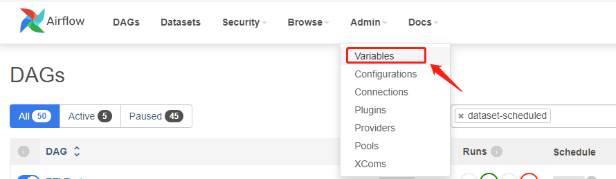

DAG 生成后，在如下 Web 页面显示 DAG 使用的变量可以动态修改，如下所示：

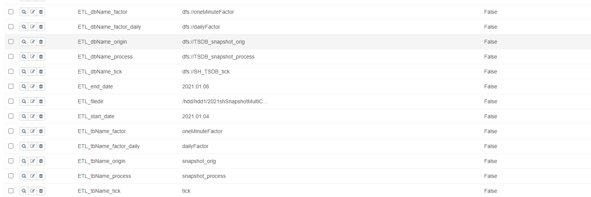

下表为本项目中涉及的变量名称及其含义：

| **变量名**              | **变量描述**                                | **变量示例**                            |
| :---------------------- | :------------------------------------------ | :-------------------------------------- |
| ETL_dbName_factor       | 存储合成的分钟 k 线的库名                   | dfs://oneMinuteFactor                   |
| ETL_tbName_factor       | 存储合成的分钟 k 线的表名                   | oneMinuteFactor                         |
| ETL_dbName_factor_daily | 存储合成的分钟 k 线的库名                   | dfs://dailyFactor                       |
| ETL_tbName_factor_daily | 存储合成的日 k 线的表名                     | dailyFactor                             |
| ETL_dbName_origin       | 存储未处理的原始 snapshot 数据的库名        | dfs://TSDB_snapshot_orig                |
| ETL_tbName_origin       | 存储未处理的原始 snapshot 数据的表名        | snapshot_orig                           |
| ETL_dbName_process      | 存储清洗后 snapshot 数据的库名              | dfs://TSDB_snapshot_process             |
| ETL_tbName_process      | 存储清洗后 snapshot 数据的表名              | snapshot_process                        |
| ETL_filedir             | 原始 snapshot 数据存储路径                  | /home/appadmin/（根据实际存放路径修改） |
| ETL_start_date          | 全量 ETL 任务中需要处理的原始数据的开始日期 | 2021.01.04                              |
| ETL_end_date            | 全量 ETL 任务中需要处理的原始数据的结束日期 | 2021.01.04                              |

 

#### 2.5.3 DolphinDBOperator 执行任务

- **DolphinDBOperator 全量处理数据**

    通过 DolphinDBOperator 将上述的数据入库、清洗、计算等设置为 DAG 中的任务
    
    全量处理核心代码如下：
    ```
       loadSnapshot = DolphinDBOperator(
            task_id='loadSnapshot',
            dolphindb_conn_id='dolphindb_test',
            sql='''
                pnodeRun(clearAllCache)
                undef(all)
                go;
                //使用 module，加载已封装好的建表及入库函数
                use loadSnapshot::createSnapshotTable
                use  loadSnapshot::loadSnapshotData
                //通过参数共享表获取参数
                params = dict(paramTable[`param], paramTable[`value])
                dbName = params[`ETL_dbName_origin]
                tbName = params[`ETL_tbName_origin]
                startDate = date(params[`ETL_start_date])
                endDate = date(params[`ETL_end_date])
                fileDir = params[`ETL_filedir]
                //结果库表不存在则创建
                if(not existsDatabase(dbName)){
                    loadSnapshot::createSnapshotTable::createSnapshot(dbName, tbName)
                }
                //调用清洗函数，后台多进程写入，提高写入效率
                start = now()
                for (loadDate in startDate..endDate){
                    submitJob("loadSnapshot"+year(loadDate)+monthOfYear(loadDate)+dayOfMonth(loadDate), "loadSnapshot", loadSnapshot::loadSnapshotData::loadSnapshot{, dbName, tbName, fileDir}, loadDate)
                }
                //查看写入任务是否完成，以保证后续处理部分数据源完整
                do{
                    cnt = exec count(*) from getRecentJobs() where jobDesc="loadSnapshot" and endTime is null
                }
                while(cnt != 0)
                //查看导入过程中是否有异常，有异常则抛出异常
                cnt = exec count(*) from pnodeRun(getRecentJobs) where jobDesc="loadSnapshot" and errorMsg is not null and receivedTime > start
                if (cnt != 0){
                    error = exec errorMsg from pnodeRun(getRecentJobs) where jobDesc="loadSnapshot" and errorMsg is not null and receivedTime > start
                    throw error[0]
                }
                '''
        )
        processSnapshot = DolphinDBOperator(
            task_id='processSnapshot',
            dolphindb_conn_id='dolphindb_test',
            sql='''
                pnodeRun(clearAllCache)
                undef(all)
                go;
                //使用 module，加载已封装好的建表及入库函数
                use processSnapshot::createSnapshot_array
                use processSnapshot::processSnapshotData
                //通过参数共享表获取参数
                params = dict(paramTable[`param], paramTable[`value])
                dbName_orig = params[`ETL_dbName_origin]
                tbName_orig = params[`ETL_tbName_origin]
                dbName_process = params[`ETL_dbName_process]
                tbName_process = params[`ETL_tbName_process]
                startDate = date(params[`ETL_start_date])
                endDate = date(params[`ETL_end_date])
                //结果库表不存在则创建
                if(not existsDatabase(dbName_process)){
                    processSnapshot::createSnapshot_array::createProcessTable(dbName_process, tbName_process)
                }
                //后台多进程处理，提高处理效率
                start = now()
                for (processDate in startDate..endDate){
                    submitJob("processSnapshot"+year(processDate)+monthOfYear(processDate)+dayOfMonth(processDate), "processSnapshot", processSnapshot::processSnapshotData::process{, dbName_orig, tbName_orig, dbName_process, tbName_process}, processDate)
                }
                //查看清洗任务是否完成，以保证后续处理部分数据源完整
                do{
                    cnt = exec count(*) from getRecentJobs() where jobDesc="processSnapshot" and endTime is null
                }
                while(cnt != 0)
                //查看清洗过程中是否有异常，有异常则抛出异常
                cnt = exec count(*) from pnodeRun(getRecentJobs) where jobDesc="processSnapshot" and errorMsg is not null and receivedTime > start
                if (cnt != 0){
                    error = exec errorMsg from pnodeRun(getRecentJobs) where jobDesc="processSnapshot" and errorMsg is not null and receivedTime > start
                    throw error[0]
                }
                '''
        )
        calMinuteFactor = DolphinDBOperator(
            task_id='calMinuteFactor',
            dolphindb_conn_id='dolphindb_test',
            sql='''
                pnodeRun(clearAllCache)
                undef(all)
                go;
                //使用 module，加载已封装好的建表及入库函数
                use Factor::createFactorOneMinute
                use Factor::calFactorOneMinute
                //通过参数共享表获取参数
                params = dict(paramTable[`param], paramTable[`value])
                dbName = params[`ETL_dbName_process]
                tbName = params[`ETL_tbName_process]	
                dbName_factor = params[`ETL_dbName_factor]
                tbName_factor = params[`ETL_tbName_factor]
                //结果库表不存在则创建
                if(not existsDatabase(dbName_factor)){
                    createFactorOneMinute(dbName_factor, tbName_factor)
                }
                factorTable = loadTable(dbName_factor, tbName_factor)
                //调用计算函数
                calFactorOneMinute(dbName, tbName,factorTable)
                '''
        )
        calDailyFactor = DolphinDBOperator(
            task_id='calDailyFactor',
            dolphindb_conn_id='dolphindb_test',
            sql='''
                pnodeRun(clearAllCache)
                undef(all)
                go;
                //使用 module，加载已封装好的建表及入库函数
                use Factor::createFactorDaily
                use Factor::calFactorDaily1	
                //通过参数共享表获取参数
                params = dict(paramTable[`param], paramTable[`value])
                dbName = params[`ETL_dbName_process]
                tbName = params[`ETL_tbName_process]	
                dbName_factor = params[`ETL_dbName_factor_daily]
                tbName_factor = params[`ETL_tbName_factor_daily]
                //结果库表不存在则创建
                if(not existsDatabase(dbName_factor)){
                    createFactorDaily(dbName_factor, tbName_factor)
                }
                //调用计算函数
                factorTable = loadTable(dbName_factor, tbName_factor)
                Factor::calFactorDaily1::calFactorDaily(dbName, tbName,factorTable)
                '''
        )
    ```
    
    根据任务间的依赖关系，构建 DAG，示例如下：
    ```
        start_task >> create_parameter_table >> given_param >> loadSnapshot >> processSnapshot >> calMinuteFactor >> calDailyFactor
    ```

- **DolphinDBOperator 增量数据入库**

    增量数据任务构建代码如下：
    
    ```
    addLoadSnapshot = DolphinDBOperator(
            task_id='addLoadSnapshot',
            dolphindb_conn_id='dolphindb_test',
            sql='''
                pnodeRun(clearAllCache)
                undef(all)
                go;
                //使用module，加载已封装好的入库函数
                use  addLoadSnapshot::loadSnapshotData
                //通过参数共享表获取参数
                params = dict(paramTable[`param], paramTable[`value])
                dbName = params[`ETL_dbName_origin]
                tbName = params[`ETL_tbName_origin]
                fileDir = params[`ETL_filedir]
                //获取交易日历
                MarketDays = getMarketCalendar("CFFEX")
                //是交易日则进行数据入库
                if(today() in MarketDays ){
                    fileDir = params[`ETL_filedir]
                    addLoadSnapshot::loadSnapshotData::loadSnapshot(today(), dbName, tbName, fileDir)
                }
                '''
        )
        addProcessSnapshot = DolphinDBOperator(
            task_id='addProcessSnapshot',
            dolphindb_conn_id='dolphindb_test',
            sql='''
                pnodeRun(clearAllCache)
                undef(all)
                go;
                //使用module，加载已封装好的清洗函数
                use addProcessSnapshot::processSnapshotData
                //通过参数共享表获取参数
                params = dict(paramTable[`param], paramTable[`value])
                dbName_orig = params[`ETL_dbName_origin]
                tbName_orig = params[`ETL_tbName_origin]
                dbName_process = params[`ETL_dbName_process]
                tbName_process = params[`ETL_tbName_process]
                //获取交易日历
                MarketDays = getMarketCalendar("CFFEX")
                //是交易日则进行数据处理
                if(today() in MarketDays ){
                    addProcessSnapshot::processSnapshotData::process(today(), dbName_orig, tbName_orig, dbName_process, tbName_process)
                }
                '''
        )
        addCalMinuteFactor= DolphinDBOperator(
            task_id='addCalMinuteFactor',
            dolphindb_conn_id='dolphindb_test',
            sql='''
                pnodeRun(clearAllCache)
                undef(all)
                go;
                //使用module，加载已封装好的计算函数
                use addFactor::calFactorOneMinute
                //通过参数共享表获取参数
                params = dict(paramTable[`param], paramTable[`value])
                dbName = params[`ETL_dbName_process]
                tbName = params[`ETL_tbName_process]	
                dbName_factor = params[`ETL_dbName_factor]
                tbName_factor = params[`ETL_tbName_factor]
                factorTable = loadTable(dbName_factor, tbName_factor)
                //获取交易日历
                MarketDays = getMarketCalendar("CFFEX")
                //是交易日则调用计算函数合成分钟K线
                if(today() in MarketDays ){
                    	addFactor::calFactorOneMinute::calFactorOneMinute(dbName, tbName,today(), factorTable)
                }
                '''
        )
        addCalDailyFactor= DolphinDBOperator(
            task_id='addCalDailyFactor',
            dolphindb_conn_id='dolphindb_test',
            sql='''
                pnodeRun(clearAllCache)
                undef(all)
                go;
                //使用module，加载已封装好的计算函数
                use addFactor::calFactorDaily1	
                //通过参数共享表获取参数
                params = dict(paramTable[`param], paramTable[`value])
                dbName = params[`ETL_dbName_process]
                tbName = params[`ETL_tbName_process]	
                dbName_factor = params[`ETL_dbName_factor_daily]
                tbName_factor = params[`ETL_tbName_factor_daily]
                factorTable = loadTable(dbName_factor, tbName_factor)
                //获取交易日历
                MarketDays = getMarketCalendar("CFFEX")
                //是交易日则调用计算函数合成日K线
                if(today() in MarketDays ){
                    addFactor::calFactorDaily1::calFactorDaily(dbName, tbName,today(), factorTable)
                }
                '''
        )
    ```
    根据任务间的依赖关系，构建 DAG，示例如下：
    
    ```
        start_task >> create_parameter_table >> given_param >> addLoadSnapshot >> addProcessSnapshot >> addCalMinuteFactor >> addCalDailyFactor
    ```

#### 2.5.4 生成 DAG

根据如下步骤部署项目：

- **第一步 DolphinDB 项目部署**

    将 DolphinDB 项目中的 *addETL* 和 *fullETL* 项目分别导入 DolphinDB GUI (DolphinDB 客户端工具)中：
    
    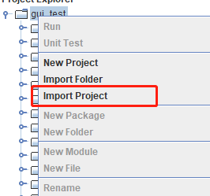
    
    将 *addETL* 及 *fullETL* 项目中的 module 模块上传至 Airflow 中已建立连接的 DolphinDB server 中：
    
    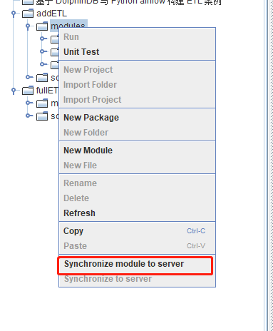

- **第二步 python 项目部署**

    将 *python* 项目中的 python 脚本放置到 *<Airflow_install_Dir/airflow/dags>* 目录下。注意，新建的 DAG 任务并不会马上出现在界面上，默认需要等待5分钟后刷新，也可修改 *airflow.cfg* 文件中的 *dag_dir_list_interval* 调整刷新间隔。

- **第三步 Airflow 变量导入**

    在 Airflow 网页中进入 Admin-->Variables，将 *Variables.json* 文件上传，将变量导入 Airflow 中，并根据实际情况调整变量值。

    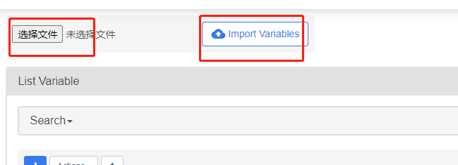

- **第四步 上传原始数据文件**

    将数据文件上传至服务器，并根据数据文件的实际存放路径，在 Airflow 中修改 `ETL_filedir` 变量。如运行增量 ETL 任务，需要将数据文件名中的日期改为当前日期，如：*20230330snapshot.csv*，以避免无数据导致任务失败。
    
    最终实现 DAG 如下所示：
    
    **全量数据入库**：
    
    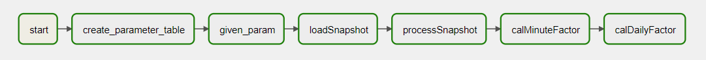
    
    **增量数据入库**：
    
    
    
    运行任务后，任务实例为绿色代表任务运行成功；红色表示任务运行失败；橙色则表示该任务所依赖的上游任务运行失败，任务未启动。

## 3. 常见问题解答(FAQ)

### 3.1 如何捕获 DolphinDB 脚本中的 print 函数打印的信息

- DolphinDB 脚本的 print 的信息为标准输出，可以在 `airflow-scheduler.out` 中找到，如下图所示：

    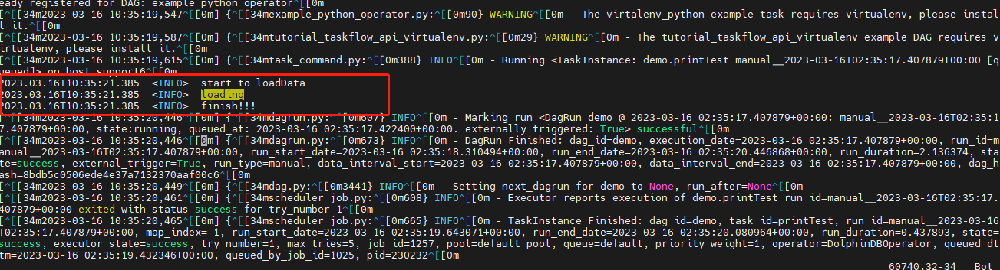

### 3.2 DolphinDB 脚本中的异步作业 submitjob 如何检测其完成状态

- 通过 DolphinDB 的函数 `getRecntJobs` 获取后台作业信息, 之后在 DolphinDB DAG 中添加判断逻辑, 代码示例如下：

    ```
    DolphinDBOperator(
            task_id='processSnapshot',
            dolphindb_conn_id='dolphindb_test',
            sql='''
              //检查所有任务是否全部完成
                do{
                    cnt = exec count(*) from getRecentJobs() where jobDesc="processSnapshot" and endTime is null
                }
                while(cnt != 0)
                //检查后台任务是否成功，失败则抛出异常
                cnt = exec count(*) from pnodeRun(getRecentJobs) where jobDesc="processSnapshot" and errorMsg is not null and receivedTime > start
                if (cnt != 0){
                    error = exec errorMsg from pnodeRun(getRecentJobs) where jobDesc="processSnapshot" and errorMsg is not null and receivedTime > start
                    throw error[0]
                }
                '''
        )
    ```

### 3.3 执行 Airflow 中经常遇到连接超时断开，该如何处理

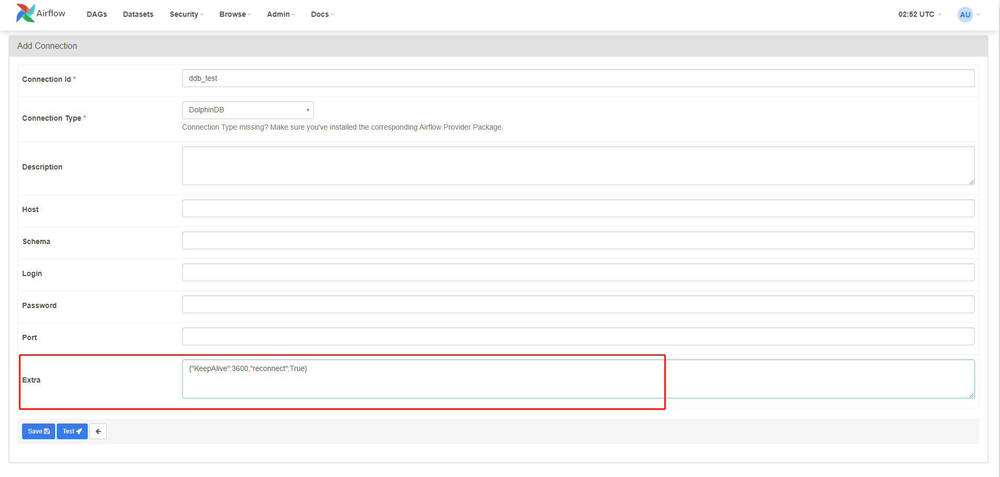

当遇到如上问题，可能是网络延时导致的，可以在建立连接时设置参数，如上图，在 DolphinDB 连接中设置 *KeepAliveTime* 及 *reconnect* 参数即可。

### 3.4 将 start_date 日期设为当前日期，每天运行一次，为什么当天不会运行

- 在 Airflow 中一个定时调度任务的最早开始时间为 start_date + scheduler_interval，例如：`start_date = 2023.03.16`，每天调用一次，则最早一次任务调度为 2023.03.17，所以当天的任务无法执行。

### 3.5 DolphinDBOperator 任务运行失败如何定位失败原因

- 任务失败后，DolphinDBOperator 会将具体的错误信息打印在日志中，可通过查看日志信息，定位异常代码并进行修改。查看日志信息步骤如下：

    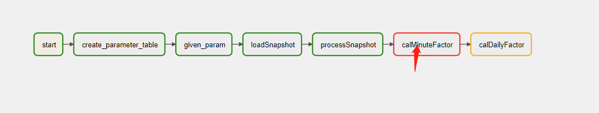
    
    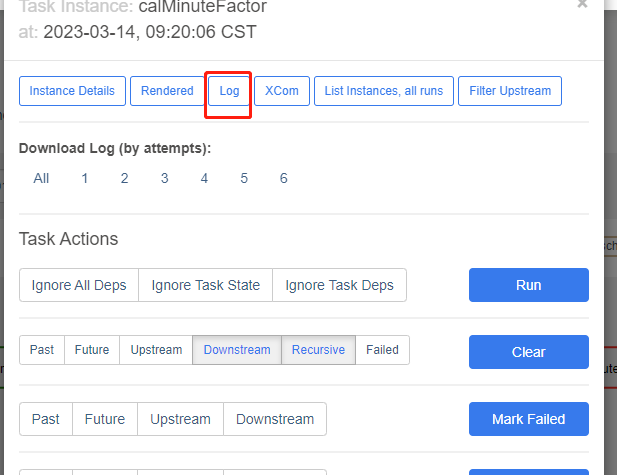
    
    

## 4. 总结

本教程从一个常用行情数据 ETL 案例出发，着重阐述了如何将 Airflow 调度框架与 DolphinDB 数据库结合起来进行结构化 ETL 作业管理, 以此来节省时间，提高效率，降低运维成本。同时，由于篇幅有限，涉及到DolphinDB 和 Airflow 框架的一些其它操作未能更进一步展示，用户在使用过程中需要按照实际情况进行调整。也欢迎大家对本教程中可能存在的纰漏和缺陷批评指正。

## 法律声明

基于 Apache License 2.0 的使用许可协议，本文中所涉及到的 Airflow 相关安装包及源代码，作为 DolphinDB Airflow 插件的组成部分而存在，但 Airflow 安装包或源代码的版权归属于 Apache Software Foundation。  

## 附件

- DolphinDB 工程项目：[addETL](script/Best_Practices_for_DolphinDB_and_Python_AirFlow/DolphinDB_projects/addETL)，[fullETL](script/Best_Practices_for_DolphinDB_and_Python_AirFlow/DolphinDB_projects/fullETL) 

- Python 项目：[addETL.py](script/Best_Practices_for_DolphinDB_and_Python_AirFlow/Python_projects)，[fullETL.py](script/Best_Practices_for_DolphinDB_and_Python_AirFlow/Python_projects)

- 数据文件：[20210104snapshot.csv](https://www.dolphindb.cn/downloads/docs/Best_Practices_for_DolphinDB_and_Python_AirFlow.zip)

- Airflow 变量：[Variables.json](script/Best_Practices_for_DolphinDB_and_Python_AirFlow) 

  

