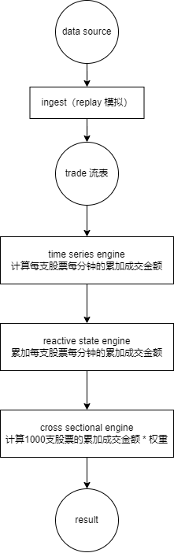
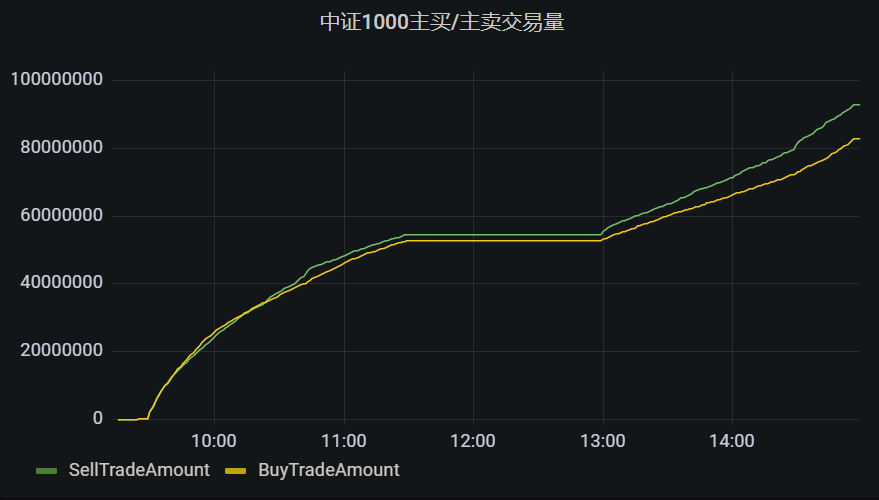

# DolphinDB流式计算中证1000指数主买/主卖交易量

主买是指以卖方的报价成交，主卖是指以买方的报价成交。 一般来说，主动买入就是资金流入，主动卖出就是资金流出，所以实时统计主买/主卖交易量能够实时监控资金的流入流出情况。本文基于中证 1000 指数，介绍如何利用 DolphinDB 流数据处理框架，实时高效计算中证1000指数的主买/主卖交易量。

本文包含内容：

- [DolphinDB流式计算中证1000指数主买/主卖交易量](#dolphindb流式计算中证1000指数主买主卖交易量)
	- [1. 场景概述](#1-场景概述)
	- [2. 实现思路](#2-实现思路)
	- [3. 数据说明](#3-数据说明)
		- [3.1 数据源](#31-数据源)
		- [3.2 成分股权重因子的创建](#32-成分股权重因子的创建)
	- [4. 实时计算主买/主卖交易量](#4-实时计算主买主卖交易量)
		- [4.1 历史行情回放](#41-历史行情回放)
		- [4.2 计算每个股票每分钟的成交金额](#42-计算每个股票每分钟的成交金额)
		- [4.3 累加每只股票每分钟的累加成交金额](#43-累加每只股票每分钟的累加成交金额)
		- [4.4 计算1000只股票的累加成交金额](#44-计算1000只股票的累加成交金额)
	- [5. 结果展示](#5-结果展示)
		- [5.1 节点内的计算结果表](#51-节点内的计算结果表)
		- [5.2 Grafana 实时监控结果](#52-grafana-实时监控结果)
	- [6. 总结](#6-总结)
	- [7. 附件](#7-附件)


## 1. 场景概述

本文介绍如何使用 DolphinDB 计算中证1000成分股分钟级主买/主卖交易量。计算公式如下：


## 2. 实现思路

在实际生产环境中，数据往往是以“流”的形式实时注入到数据表中，如何根据数据流实时计算并响应结果是业务面临的重要问题。针对此类问题，DolphinDB 开发了一套完善的流数据的订阅发布机制和多种流计算引擎，为多样化的实时场景提供了灵活的解决方案。

本文通过行情回放（函数 replay）模拟实时数据流，并通过流数据引擎的级联构建计算模型，以实现每分钟输出中证1000实时主买/主卖的交易量的需求。

整体计算流程如下图所示：



本文涉及到的流数据引擎有：[时间序列引擎](https://www.dolphindb.cn/cn/help/FunctionsandCommands/FunctionReferences/c/createTimeSeriesEngine.html)，[响应式状态引擎](https://www.dolphindb.cn/cn/help/FunctionsandCommands/FunctionReferences/c/createReactiveStateEngine.html)，[横截面引擎](https://www.dolphindb.cn/cn/help/FunctionsandCommands/FunctionReferences/c/createCrossSectionalEngine.html)。

流程说明：

- 使用行情回放功能模拟注入数据到流表；

- 时间序列引擎订阅流表数据，并计算每只股票每分钟的主买/主卖成交金额（交易价格 * 交易量）；

- 用响应式状态引擎进一步计算每只股票的累计主买/主卖成交金额；

- 用横截面引擎计算 1000 只股票的累计主买/主卖成交金额的加权和，并输出结果。

> 各引擎通过级联进行连接，无需通过中间表。详情可参考：[用户手册流数据引擎主题页](https://www.dolphindb.cn/cn/help/FunctionsandCommands/SeriesOfFunctions/streamingEngine.html)。

## 3. 数据说明

### 3.1 数据源

深交所和上交所 [Level2 逐笔成交数据](https://www.dolphindb.cn/downloads/docs/CSI_1000.zip)表结构如下：

| 列名        | 类型      | 说明                             |
| ----------- | --------- | -------------------------------- |
| SecurityID  | SYMBOL    | 股票代码                         |
| TradeTime   | TIMESTAMP | 交易时间                         |
| TradePrice  | DOUBLE    | 成交价格                         |
| TradeQty    | INT       | 交易量                           |
| TradeBSFlag | SYMBOL    | 成交方向，0 表示主买，1 表示主卖 |

> 注意：实际的逐笔成交数据包含的其他字段与本文计算无关，故忽略不列出。

本文采用的数据根据中证1000成分股列表模拟生成，仅从数据源中选取 2022.09.01 一天的中证1000成分股的逐笔成交记录，且仅选取本文计算涉及的字段。其中字段TradeBSFlag表示该笔交易为主买还是主卖。数据量约为 2000 万条。

通过下述脚本将附件数据导入内存。有关数据导入的相关详细说明请参见[数据导入教程](https://gitee.com/dolphindb/Tutorials_CN/blob/master/import_data.md)。

```python
dataFilePath = "/your/path/to/data.csv"
schemaTb = extractTextSchema(dataFilePath)
update schemaTb set type=`SYMBOL where name=`TradeBSFlag
data = loadText(dataFilePath,, schemaTb)
```

### 3.2 成分股权重因子的创建

实际生产中，成分股的权重每天可能会变化。本教程为简便起见，将中证1000中成分股的权重定义为1/1000，这个假设会影响计算结果，但不影响教程中给出的方法和代码。用自定义的 `createWeightDict()` 函数创建一个字典保存各股票的权重因子。

```python
def createWeightDict(constituentCsvPath){
	return dict(loadText(constituentCsvPath).SecurityID, take(0.001, 1000))
}
```

## 4. 实时计算主买/主卖交易量

本章将按第 2 章节的实现思路，分步介绍如何实时计算主买/主卖交易量。

### 4.1 历史行情回放

首先通过回放历史数据来模拟实时行情数据的注入。在 DolphinDB 内，只需要调用内置的 [replay](https://www.dolphindb.cn/cn/help/FunctionsandCommands/FunctionReferences/r/replay.html) 函数就能够轻松实现数据回放。步骤如下：

- 创建一张共享流数据表 trade，用于流数据的接收和发布

```python
tradeTemp = streamTable(2000:0, `TradeTime`SecurityID`TradePrice`TradeQty`TradeBSFlag, [TIMESTAMP, SYMBOL,DOUBLE,DOUBLE,SYMBOL])
enableTableShareAndPersistence(table=tradeTemp, tableName="trade", asynWrite=true, compress=true, cacheSize=20000000, retentionMinutes=1440, flushMode=0, preCache=10000) 
```

- 回放逐笔成交数据。这里提交了一个作业用于异步进行回放任务，回放模式为极速回放
```python
filteredData = select TradeTime, SecurityID, TradePrice, TradeQty, TradeBSFlag from data where SecurityID in weightDict order by TradeTime
submitJob("replayJob", "replay at the maximum speed", replay{filteredData, objByName("trade")})
```

上述代码将中证1000成分股的逐笔成交数据回放到流数据表 trade 中，可通过下述语句查看前 10 条数据：

```
select top 10 * from trade
```

trade 表的数据将作为数据源注入 4.2 节创建的时间序列引擎 `tsEngine` 中。

### 4.2 计算每个股票每分钟的成交金额

计算的第一步是使用时间序列引擎算每个股票每个钟累计的交易量。步骤如下：

- 创建[时间序列引擎](https://dolphindb.cn/cn/help/FunctionsandCommands/FunctionReferences/c/createTimeSeriesEngine.html)

```python
tsEngine = createTimeSeriesEngine(name="tsEngine", windowSize=60000, step=60000, metrics=<[sum(iif(TradeBSFlag=="0", 1, 0)*TradeQty*TradePrice),  sum(iif(TradeBSFlag=="1", 1, 0)*TradeQty*TradePrice)]>, dummyTable=objByName("trade"), outputTable=rsEngine, timeColumn=`TradeTime, keyColumn=`SecurityID, useWindowStartTime=true,  fill=[0, 0], forceTriggerTime=100)
```

metrics 参数中计算相关的元代码使用 iif 函数来计算主买或主买的交易量。fill 设为 [0, 0] 表示若个别股票 1 分钟之内没有任何数据，则填充每分钟主买/主买的交易量均为 0 的记录，用于触发 4.4 小节创建的横截面引擎计算。forceTriggerTime 设为 100，表示新的窗口开始之后的100 ms以内，如果某只股票数据到达，则仅该股票触发计算；新的窗口开始后的100 ms以后，任意一只股票数据到达，之前所有未触发计算的股票，全部强制触发计算。这样的设置的目的是防止某些股票的数据较为稀疏导致其窗口关闭过慢，进而影响后续计算延迟过高。在实盘中，也有不少机构设置 useSystemTime = true 用系统时间来触发，即按系统时间每 1 分钟触发计算 1 次。outputTable 参数指定为 4.3 小节创建的 响应式状态引擎 `rsEngine` 中以实现引擎级联。具体参数的设置请根据实际情况参考用户手册设置。

- 创建[流数据订阅](http://www.dolphindb.cn/cn/help/FunctionsandCommands/FunctionReferences/s/subscribeTable.html)，将数据灌入时间序列引擎中

```python
subscribeTable(tableName="trade", actionName="act_tsEngine", offset=0, handler=append!{tsEngine}, msgAsTable=true, batchSize=10000, throttle=0.001)
```

订阅共享流数据表 trade，并指定 handler 参数为时间序列引擎 `tsEngine`，以将订阅数据注入引擎。

### 4.3 累加每只股票每分钟的累加成交金额

计算的第二步是使用响应式状态引擎计算每个股票累计的交易量。步骤如下：

- 创建一张内存表，为响应式状态引擎提供输入的表结构

```python
tsEngineDummy = table(2000:0, `TradeTime`SecurityID`SellTradeAmount`BuyTradeAmount, [TIMESTAMP, SYMBOL, DOUBLE, DOUBLE])
```

- 创建[响应式状态引擎](http://www.dolphindb.cn/cn/help/FunctionsandCommands/FunctionReferences/c/createReactiveStateEngine.html)

```python
rsEngine = createReactiveStateEngine(name="rsEngine", metrics=<[cummax(TradeTime), cumsum(SellTradeAmount), cumsum(BuyTradeAmount)]>, dummyTable=tsEngineDummy, outputTable=csEngine, keyColumn=`SecurityID)
```
metrics 中使用函数 cumsum 来计算每只股票主买/主卖按分钟的累加成交金额。cumsum 采用了增量计算方法，性能优于全量计算的方式。outputTable 参数指定为 4.4 小节创建的横截面引擎 `csEngine` 中以实现引擎级联。

### 4.4 计算1000只股票的累加成交金额

计算的第二步使用横截面引擎计算加权平均的累计交易量。步骤如下：

本例中横截面引擎的触发机制为每插入一条触发一次计算（ triggeringPattern="perRow”），因此同一时间戳下，每只股票的输入都会产生一条 wsum 的计算结果。因此这里使用键值内存表保存同一时间戳下，1000只股票的最终计算结果。

- 创建一张内存表为横截面引擎提供输入的表结构

```python
rsEngineDummy = table(1:0, `SecurityID`TradeTime`SellTradeAmount`BuyTradeAmount, [SYMBOL, TIMESTAMP, DOUBLE, DOUBLE])
```

- 创建一张键值内存表 tradeAmountIndex，用于保存1000个股票的成交金额加权求和的结果

```python
share(keyedTable(`TradeTime, 2000:0, `TradeTime`SellTradeAmount`BuyTradeAmount, [TIMESTAMP, DOUBLE, DOUBLE]), "tradeAmountIndex")
```

- 创建[横截面引擎](https://dolphindb.cn/cn/help/FunctionsandCommands/FunctionReferences/c/createCrossSectionalEngine.html)

```python
csEngine = createCrossSectionalEngine(name="csEngine", metrics=<[wsum(SellTradeAmount, weightDict[SecurityID]), wsum(BuyTradeAmount, weightDict[SecurityID]), now()]>, dummyTable=rsEngineOutput, outputTable=objByName("tradeAmountIndex"), keyColumn=`SecurityID, triggeringPattern="perRow", useSystemTime=false, timeColumn=`TradeTime, lastBatchOnly=false)
```

输出结果为每分钟一条记录，每条记录包含2个指标 BuyTradeAmount 和 SellTradeAmount ，即累计主买成交金额和累计主卖成交金额。计算结果存储在以时间戳为键的键值内存表 tradeAmountIndex 中。

> 设置 triggeringPattern="perRow" 表示每插入一条逐笔成交记录就实时更新结果，该操作在数据量较大时性能较差。如果对实时性的要求不高，可以设置为每分钟批量计算更新一次结果以换取更好的性能，只需要指定 [triggeringPattern](https://dolphindb.cn/cn/help/FunctionsandCommands/FunctionReferences/c/createCrossSectionalEngine.html?highlight=triggeringPattern)="keyCount", [triggeringInterval](https://dolphindb.cn/cn/help/FunctionsandCommands/FunctionReferences/c/createCrossSectionalEngine.html?highlight=triggeringInterval)=1000 即可。该参数配置在本案例中的含义为，只有当前分钟横截面引擎的记录数达到 1000 条或者下一分钟的记录到来，才会触发当前分钟的中证1000所有股票的累加成交金额的计算。

## 5. 结果展示

### 5.1 节点内的计算结果表
计算的最终结果保存在键值内存表 tradeAmountIndex 中，可通过 DolphinDB 所有 API 随时查询，以通过 DolphinDB GUI 查询最新10条的中证1000主买/主卖的交易量计算结果为例:

```
select top 10 Time, SellTradeAmount, BuyTradeAmount from tradeAmountIndex where UpdateTime >=  datetimeAdd(now(),-10s)
```


### 5.2 Grafana 实时监控结果

Grafana 配置 DolphinDB 数据源及监控 DolphinDB 数据表中数据的教程：[Grafana连接DolphinDB数据源](https://gitee.com/dolphindb/grafana-datasource)

Grafana 中的 Query 代码：

```
select Time, SellTradeAmount, BuyTradeAmount, UpdateTime from tradeAmountIndex
```



## 6. 总结

本文展示了如何基于 DolphinDB 流数据处理框架，实时计算中证1000主买/主卖的交易量。用户可以通过时间序列引擎、响应式状态引擎和横截面引擎级联的方式，实现按分钟输出中证1000实时主买/主卖的交易量。整个实现过程简易便捷，是一套适用于业务的高效的解决方案。

## 7. 附件
- [demo.dos](script/csi_1000.dos)
- [data.csv](https://www.dolphindb.cn/downloads/docs/CSI_1000.zip)
- [constituent.csv](https://www.dolphindb.cn/downloads/docs/CSI_1000.zip)
