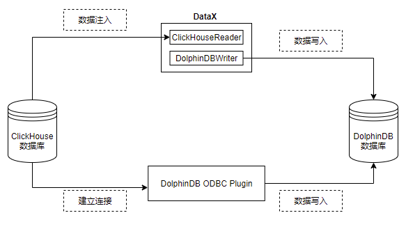

# 从 ClickHouse 迁移到 DolphinDB

- [DolphinDB vs ClickHouse](#dolphindb-vs-clickhouse)
  - [DolphinDB 与 ClickHouse 的相同点](#dolphindb-与-clickhouse-的相同点)
  - [DolphiDB 与 ClickHouse 的区别](#dolphidb-与-clickhouse-的区别)
  - [为什么选择 DolphinDB?](#为什么选择-dolphindb)
- [应用需求](#应用需求)
- [实现方法](#实现方法)
- [迁移案例与操作步骤](#迁移案例与操作步骤)
  - [环境配置](#环境配置)
  - [建库建表](#建库建表)
  - [通过 ODBC 插件迁移](#通过-odbc-插件迁移)
  - [通过 DataX 迁移](#通过-datax-迁移)
- [基准性能](#基准性能)
- [附录](#附录)
  - [DataX DolphinDB-Writer 配置项](#datax-dolphindb-writer-配置项)
  - [table 配置详解](#table-配置详解)
  - [完整代码及测试数据](#完整代码及测试数据)

ClickHouse 是 Yandex 公司于 2016 年开源的用于 OLAP 的列式数据库管理系统，主要用于 WEB 流量分析。凭借面向列式存储、支持数据压缩、完备的 DBMS 功能、多核心并行处理的特点，ClickHouse 被广泛应用于广告流量、移动分析、网站分析等领域。

DolphinDB 是一款国产高性能分布式时序数据库，拥有图灵完备性的编程语言 DolphinDB Script 和高性能低延时的流计算框架，为海量结构化数据的快速存储、检索、分析及计算提供一站式解决方案，适用于量化金融及工业物联网等领域。自发布以来，DolphinDB 凭借卓越的性能、低维护成本、操作简单、可扩展性高等优势，吸引了大量的国内外用户使用 DolphinDB。

本教程旨在为 ClickHouse 使用者提供一份迁移数据至 DolphinDB 的简明参考。

## DolphinDB vs ClickHouse

### DolphinDB 与 ClickHouse 的相同点

- **分布式存储和分析**：DolphinDB 和 ClickHouse 都设计为支持大规模数据的分布式存储和分析。它们可以处理海量数据，并提供快速的查询和分析能力。
- **列式存储**：两者都采用了列式存储结构，更适合海量大数据场景中的写入和读取。这种存储方式在分析型数据库中通常能够提供更高的性能，特别是对于聚合和分析查询。
- **支持分布式计算**：两者都支持分布式计算，可以横向扩展以处理大规模数据集。
- **支持复杂的数据类型**：两者都支持处理复杂的数据类型，包括数组、嵌套结构等，使其适用于各种数据分析场景。

### DolphiDB 与 ClickHouse 的区别

- **分布式能力**：DolphinDB 分布式更强，支持事务和幂等性导数，查询自动路由，全面元数据管理。
- **脚本语言**：两者都支持 SQL 查询，ClickHouse 仅支持 SQL 语言，而 DolphinDB 开发了图灵完备的脚本语言，具备更强的数据处理能力。
- **存储引擎**：DolphinDB 自研的 TSDB 存储引擎将分区内的多列数据（以 blocks 为存储形式，block 是 DolphinDB 中最小的存储单位）顺序存为一个文件，解决了数据分析中宽表查询和点查询性能上的痛点。
- **压缩算法**：DolphinDB 当前仅支持 LZ4、Delta 和枚举类型的压缩，而 ClickHouse 不仅支持 LZ4、ZSTD等通用压缩算法，还针对不同的数据类型开发了不同的编码方法，如 Delta、Gorilla、T64 等。
- **生态支持**：ClickHouse 是一个开源项目，拥有活跃的开源社区，与各种第三方工具能很好的兼容整合，生态支持完善。而 DolphinDB 是企业级方案，在金融行业和物联网领域有更多的实际业务积累，有专业的技术支持团队，可以及时响应、解决客户在使用 DolphinDB 中遇到的各类问题。

### 为什么选择 DolphinDB?

- **运维成本**：ClickHouse 在设计之初没有考虑集群版本，所以现在方案都是改良版。ClickHouse 的 shard 及replica 配置、扩缩容异常繁琐，运维成本高。相比而言，DolphinDB 设计并引入了 DFS 这一抽象文件系统，使得 shard，replica，负载均衡，Failover 均交由 DFS 来实现，用户无需关心，基本没有运维成本。
- **数据一致性**：ClickHouse 副本一致性通过 ZooKeeper 同步分布式日志（Replicated Log）来实现最终一致性，即同步期间副本的数据是不一致的。而 DolphinDB 通过两阶段提交协议来保证副本一致性，副本之间是强一致性。
- **开发成本**：DolphinDB 提供了丰富的计算函数支持，并内置了流数据处理框架，仅需投入少量研发资源即可实现复杂业务场景。

## 应用需求

对于有将数据由 ClickHouse 迁移到 DolphinDB 需求的客户而言，其常规迁移方案通常基于 CSV 文件的导入导出实现的。具体步骤是先将数据从 ClickHouse 中以 CSV 格式导出，再使用 DolphinDB 导入 CSV 文件，从而实现数据的迁移需求。但是这一方案有以下几点不足之处：

- 数据量较大时，需要较大的磁盘空间存储 CSV 文件
- 实现增量同步困难
- 数据迁移效率低

DolphinDB 提供了多种灵活的数据同步方法，来帮助用户方便地把海量数据从多个数据源进行全量同步或增量同步。本文的实践案例基于这一需求，根据 2021.01.04 一天的逐笔成交数据，数据量约 2721 万，提供将数据从 ClickHouse 迁移到 DolphinDB 的高性能解决方案。

## 实现方法

由 ClickHouse 迁移到 DolphinDB 的方案主要有：ODBC 插件、DataX、CSV 文件导入、HTTP Client + zmq 插件等。本文选择使用 ODBC 插件、DataX 进行数据迁移主要基于以下几点原因：

- 二者实现简单、数据流转链路短，迁移效率更高
- 无需额外空间存储中间文件
- 增量同步方案实现简单

本文数据迁移的具体实现框架如下：



- ODBC 插件

    ODBC (Open Database Connectivity) 插件是 DolphinDB 提供的通过 ODBC 接口访问 Oracle 的开源产品。使用插件配合 DolphinDB 脚本使用，与服务器在同一个进程空间内运行，能高效地完成 Oracle 数据到 DolphinDB 的数据写入。

    ODBC 提供如下函数，函数的具体使用请参考 [ODBC 插件](https://gitee.com/dolphindb/DolphinDBPlugin/blob/release200/odbc/README_CN.md)。

    1. `odbc::connect(connStr, [dataBaseType])`
    2. `odbc::close(conn)`
    3. `odbc::query(connHandle or connStr, querySql, [t], [batchSize], [tranform])`
    4. `odbc::execute(connHandle or connStr, SQLstatements)`
    5. `odbc::append(connHandle, tableData, tablename, [createTableIfNotExist], [insertIgnore])`

- DataX 驱动

    DataX 是可扩展的数据同步框架，将不同数据源的同步抽象为从源头数据源读取数据的 Reader 插件，以及向目标端写入数据的 Writer 插件，理论上 DataX 框架可以支持任意数据源类型的数据同步工作。

    DolphinDB 提供基于 DataXReader 和 DataXWriter 的开源驱动。DolphinDBWriter 插件实现了向 DolphinDB 写入数据，使用 DataX 的现有 reader 插件结合 DolphinDBWriter 插件，即可实现从不同数据源向 DolphinDB 同步数据。用户可以在 Java 项目中包含 DataX 的驱动包，开发从 ClickHouse 数据源到 DolphinDB 的数据迁移软件。

## 迁移案例与操作步骤

### 环境配置

本次案例中使用了以下数据库及插件，各版本型号如下：

ClickHouse 版本：`23.8.2.7`

[unixODBC](https://gitee.com/link?target=http%3A%2F%2Fwww.unixodbc.org%2F) 版本：`2.3.7`

[DolphinDB Server](https://gitee.com/link?target=https%3A%2F%2Fwww.dolphindb.cn%2Falone%2Falone.php%3Fid%3D10) 版本：`2.00.10.1`

[DolphinDB GUI](https://gitee.com/link?target=https%3A%2F%2Fwww.dolphindb.cn%2Falone%2Falone.php%3Fid%3D10) 版本：`1.30.21.4`

2.00.10.1 版本 Server 自带 ODBC 插件，位于 Server 的 *\<HomeDir>/plugins* 目录，可直接加载使用。如果 *\<HomeDir>/plugins* 目录下不存在 ODBC 文件夹，则通过如下链接下载：

[DolphinDBPlugin](https://gitee.com/dolphindb/DolphinDBPlugin/tree/release200.9/odbc/bin) 分支：release200.10

请注意，DolphinDB ODBC 插件版本号必须与 Server 版本号一致，否则可能出现报错。例如，DolphinDB Server 版本号为 2.00.10.X，则必须使用 release200.10 分支的 ODBC 插件。

如果想自行编译，请参考： [ODBC 插件](https://gitee.com/dolphindb/DolphinDBPlugin/blob/release200/odbc/README_CN.md#2-%E7%BC%96%E8%AF%91) 中的“编译”章节。

### 建库建表

针对上面的测试数据，我们需要在 DolphinDB 里创建对应的库表，用于存储迁移过来的数据。对于实际的数据，需要综合考虑被迁移数据的字段、类型、数据量，在 DolphinDB 是否需要分区，分区方案，使用 OLAP 还是 TSDB 引擎等情况，去设计建库建表方案。一些数据存储库表设计实践，可以参考 [DolphinDB 数据库分区教程](https://gitee.com/dolphindb/Tutorials_CN/blob/master/database.md)。

本例建表文件 *createTable.dos* 内容如下：

```
create database "dfs://TSDB_tick" partitioned by VALUE([2023.02.01,2023.02.02]),HASH([SYMBOL,10]),engine=`TSDB
create table 'dfs://TSDB_tick'.'tick'(
    SecurityID SYMBOL,
    TradeTime TIMESTAMP [compress='delta'],
    TradePrice DOUBLE,
    TradeQty INT,
    TradeAmount DOUBLE,
    BuyNo INT,
    SellNo INT,
    ChannelNo INT,
    TradeIndex INT,
    TradeBSFlag SYMBOL,
    BizIndex INT
)
partitioned by TradeTime,SecurityID,
sortColumns=`SecurityID`TradeTime
```

从 ClickHouse 迁移到 DolphinDB 的数据字段映射关系如下表：

| **ClickHouse 字段含义** | **ClickHouse 字段** | **ClickHouse 数据类型** | **DolphinDB 字段含义** | **DolphinDB 字段** | **DolphinDB 数据类型** |
| :---------------------- | :------------------ | :---------------------- | :--------------------- | :----------------- | :--------------------- |
| 证券代码                | SecurityID          | String                  | 证券代码               | SecurityID         | SYMBOL                 |
| 交易时间                | TradeTime           | DateTime64              | 交易时间               | TradeTime          | TIMESTAMP              |
| 交易价格                | TradePrice          | DOUBLE                  | 交易价格               | TradePrice         | DOUBLE                 |
| 交易数量                | TradeQty            | Int32                   | 交易数量               | TradeQty           | INT                    |
| 交易金额                | TradeAmount         | DOUBLE                  | 交易金额               | TradeAmount        | DOUBLE                 |
| 买方委托索引            | BuyNo               | Int32                   | 买方委托索引           | BuyNo              | INT                    |
| 卖方委托索引            | SellNo              | Int32                   | 卖方委托索引           | SellNo             | INT                    |
| 成交编号                | TradeIndex          | Int32                   | 成交编号               | TradeIndex         | INT                    |
| 频道代码                | ChannelNo           | Int32                   | 频道代码               | ChannelNo          | INT                    |
| 成交方向                | TradeBSFlag         | String                  | 成交方向               | TradeBSFlag        | SYMBOL                 |
| 业务序列号              | BizIndex            | Int64                   | 业务序列号             | BizIndex           | INT                    |

其部分数据示例如下：

| SecurityID | TradeTime               | TradePrice | TradeQty | TradeAmount | BuyNo  | SellNo | TradeIndex | ChannelNo | TradeBSFlag | BizIndex |
| :--------- | :---------------------- | :--------- | :------- | :---------- | :----- | :----- | :--------- | :-------- | :---------- | :------- |
| 600020     | 2021.01.04T09:25:00.630 | 3.39       | 2100     | 7,119.      | 85961  | 78316  | 19719      | 1         | N           | 123713   |
| 600020     | 2021.01.04T09:25:00.630 | 3.39       | 1000     | 3,390.      | 129945 | 78316  | 19720      | 1         | N           | 123714   |
| 600020     | 2021.01.04T09:25:00.630 | 3.39       | 900      | 3,051.      | 158039 | 78316  | 19721      | 1         | N           | 123715   |

### 通过 ODBC 插件迁移

本例中部署 DolphinDB 的服务器操作系统为 Centos。

#### 安装 unixODBC 库

Centos 系统：

```
# 安装 unixODBC 库
yum install unixODBC unixODBC-devel
```

如果是 Ubuntu 系统，使用以下命令安装：

```
# 安装 unixODBC 库
apt-get install unixodbc unixodbc-dev
```

#### 下载 ClickHouse 的 ODBC 驱动并安装

第一步，下载 [clickhouse-odbc](https://github.com/ClickHouse/clickhouse-odbc/releases/download/v1.2.1.20220905/clickhouse-odbc-linux.zip) 并解压至自定义目录中，假设安装目录为 \<savedir>。

```
mkdir <savedir>
cd <savedir>
wget https://github.com/ClickHouse/clickhouse-odbc/releases/download/v1.2.1.20220905/clickhouse-odbc-linux.zip
unzip clickhouse-odbc-linux.zip
```

第二步，在 **/etc/odbcinst.ini** 文件中，添加以下内容：

**注意**：需要替换 \<savedir> 为实际的安装目录。

```
[ODBC Drivers] 
ClickHouse ODBC Driver (ANSI)    = Installed 
ClickHouse ODBC Driver (Unicode) = Installed 

[ClickHouse ODBC Driver (ANSI)] 
Description = ODBC Driver (ANSI) for ClickHouse 
Driver      = <savedir>/clickhouse-odbc-1.2.1-Linux/lib64/libclickhouseodbc.so 
Setup       = <savedir>/clickhouse-odbc-1.2.1-Linux/lib64/libclickhouseodbc.so 
UsageCount  = 1 

[ClickHouse ODBC Driver (Unicode)] 
Description = ODBC Driver (Unicode) for ClickHouse 
Driver      =<savedir>/clickhouse-odbc-1.2.1-Linux/lib64/libclickhouseodbcw.so 
Setup       =<savedir>/clickhouse-odbc-1.2.1-Linux/lib64/libclickhouseodbcw.so 
UsageCount  = 1 
```

第三步，在 **/etc/odbc.ini** 文件中，添加以下内容：

**注意**：若不存在该文件可自行创建。

```
[ODBC Data Sources] 
ClickHouse DSN (ANSI)=ClickHouse ODBC Driver (ANSI) 
ClickHouse DSN (Unicode)=ClickHouse ODBC Driver (Unicode) 

[ClickHouseAnsi] 
Driver=ClickHouse ODBC Driver (ANSI) 
Description=DSN (localhost) for ClickHouse ODBC Driver (ANSI) 
Server = localhost
Database = default
UID = default
PWD = 123456
Port = 8123
Proto = http

[ClickHouseUni] 
Driver=ClickHouse ODBC Driver (Unicode) 
Description=DSN (localhost) for ClickHouse ODBC Driver (Unicode) 
Server = localhost
Database = default
UID = default
PWD = 123456
Port = 8123
Proto = http
```

#### 同步数据

1. 运行以下命令加载 ODBC 插件（ `ServerPath` 请自行修改）

    ```
    loadPlugin("ServerPath/plugins/odbc/PluginODBC.txt")
    ```

2. 运行以下命令建立与 ClickHouse 的连接（ Dsn 的名称请自行修改）

    ```
    conn = odbc::connect("Dsn=ClickHouseAnsi", `ClickHouse)
    ```

3. 运行以下命令开始同步数据

    ```
    def syncData(conn, dbName, tbName, dt){
        sql = "select SecurityID, TradeTime, TradePrice, TradeQty, TradeAmount, BuyNo, SellNo, ChannelNo, TradeIndex, TradeBSFlag, BizIndex from migrate.ticksh"
        if(!isNull(dt)) {
            sql = sql + " WHERE toDate(TradeTime) = '"+temporalFormat(dt,'yyyy-MM-dd')+"'"
        }
        odbc::query(conn,sql, loadTable(dbName,tbName), 100000)
    }
    dbName="dfs://TSDB_tick"
    tbName="tick"
    syncData(conn, dbName, tbName, NULL)
    ```

    数据共 27211975 条，同步数据耗时约 158 秒。

4. 同步增量数据

    ```
    def scheduleLoad(conn,dbName,tbName){
        sqlQuery = "select SecurityID, TradeTime, TradePrice, TradeQty, TradeAmount, BuyNo, SellNo, ChannelNo, TradeIndex, TradeBSFlag, BizIndex from migrate.ticksh"
        sql = sqlQuery + " WHERE toDate(TradeTime) = '"+temporalFormat(today()-1,'yyyy-MM-dd')+"'"
        odbc::query(conn,sql, loadTable(dbName,tbName), 100000)
    }
    scheduleJob(jobId=`test, jobDesc="test",jobFunc=scheduleLoad{conn,dbName,tbName},scheduleTime=00:05m,startDate=2023.11.03, endDate=2024.11.03, frequency='D')
    ```

### 通过 DataX 迁移

#### 部署DataX

从 [DataX 下载地址](https://datax-opensource.oss-cn-hangzhou.aliyuncs.com/202309/datax.tar.gz) 下载 DataX 压缩包后，解压至自定义目录。

**注意**：2023 年 9 月后发布的 datax 中才有 clickhousereader 插件，如已安装老版本 datax，则只需下载安装包中的 clickhousereader 复制到 *DataX/plugin/reader* 目录下，即可使用。

#### 部署 DataX-DolphinDBWriter 插件

将 [DataX-DolphinDBWriter ](https://gitee.com/link?target=https%3A%2F%2Fgithub.com%2Fdolphindb%2Fdatax-writer)中源码的 *./dist/dolphindbwriter* 目录下所有内容拷贝到 *DataX/plugin/writer* 目录下，即可使用。

#### 执行 DataX 任务

1. 配置 json 文件

    配置文件 *ClickHouseToDDB.json* 的具体内容如下，并将 json 文件置于自定义目录下，本教程中方放置于 *datax-writer-master/ddb_script/* 目录下。

    ```
    {
            "job": {
                    "content": [{
                            "writer": {
                                    "parameter": {
                                            "dbPath": "dfs://TSDB_tick",
                                            "userId": "admin",
                                            "tableName": "tick",
                                            "host": "127.0.0.1",
                                            "pwd": "123456",
                                            "table": [
                                                {
                                                        "type": "DT_SYMBOL",
                                                        "name": "SecurityID"
                                                },
                                                {
                                                    "type": "DT_TIMESTAMP",
                                                    "name": "TradeTime"
                                                },
                                                {
                                                    "type": "DT_DOUBLE",
                                                    "name": "TradePrice"
                                                },
                                                {
                                                    "type": "DT_INT",
                                                    "name": "TradeQty"
                                                },
                                                {
                                                    "type": "DT_DOUBLE",
                                                    "name": "TradeAmount"
                                                },
                                                {
                                                    "type": "DT_INT",
                                                    "name": "BuyNo"
                                                },
                                                {
                                                    "type": "DT_INT",
                                                    "name": "SellNo"
                                                },
                                                {
                                                    "type": "DT_INT",
                                                    "name": "TradeIndex"
                                                },
                                                {
                                                    "type": "DT_INT",
                                                    "name": "ChannelNo"
                                                },
                                                {
                                                    "type": "DT_SYMBOL",
                                                    "name": "TradeBSFlag"
                                                },
                                                {
                                                    "type": "DT_INT",
                                                    "name": "BizIndex"
                                                }
                                            ],
                                            "port": 10001
                                    },
                                    "name": "dolphindbwriter"
                            },
                            "reader": {
                                    "parameter": {
                                            "username": "default",
                                            "column": ["SecurityID", "toString(TradeTime)", "TradePrice", "TradeQty", "TradeAmount", "BuyNo", "SellNo", "ChannelNo", "TradeIndex", "TradeBSFlag", "BizIndex"],
                                            "connection": [{
                                                    "table": ["ticksh"],
                                                    "jdbcUrl": ["jdbc:clickhouse://127.0.0.1:8123/migrate"]
                                            }],
                                            "password": "123456",
                                            "where": ""
                                    },
                                    "name": "clickhousereader"
                            }
                    }],
                    "setting": {
                            "speed": {
                                    "channel": 1
                            }
                    }
            }
    }
    ```

    **注**：当前 clickhousereader 无法识别 DateTime64 类型，故需转为字符串（`"toString(TradeTime)"`）取数。 

2. Linux 终端中执行以下命令以执行 DataX 任务

    ```
    python datax.py ../../datax-writer-master/ddb_script/ClickHouseToDDB.json
    ```

3. 查看 DataX 同步结果

    ```
    任务启动时刻                    : 2023-11-03 17:11:26
    任务结束时刻                    : 2023-11-03 17:14:57
    任务总计耗时                    :                210s
    任务平均流量                    :            8.93MB/s
    记录写入速度                    :         129580rec/s
    读出记录总数                    :            27211975
    读写失败总数                    :                   0
    ```

4. 同步增量数据

    使用 DataX 同步增量数据，可在 `ClickHouseToDDB.json` 的 ”reader“ 中增加 where 条件对数据日期进行筛选，如此每次执行同步任务时至同步 where 条件过滤后的数据，以同步前一天的数据为例，示例如下：

    ```
    "reader": {
        "parameter": {
            "username": "default",
            "column": ["SecurityID", "toString(TradeTime)", "TradePrice", "TradeQty", "TradeAmount", "BuyNo", "SellNo", "ChannelNo", "TradeIndex", "TradeBSFlag", "BizIndex"],
            "connection": [{
                "table": ["ticksh"],
                "jdbcUrl": ["jdbc:clickhouse://127.0.0.1:8123/migrate"]
            }],
            "password": "123456",
            "where": "toDate(TradeTime) = date_sub(day,1,today())"
        },
        "name": "clickhousereader",
    }
    ```

## 基准性能

分别使用 ODBC 插件和 DataX 驱动进行数据迁移， 数据量 2721 万条，迁移耗时对比如下表所示：

| **ODBC 插件** | **DataX** |
| :------------ | :-------- |
| 158s          | 210s      |

综上，ODBC 插件与 DataX 均能实现将 Oracle 中数据迁移到 DolphinDB 中，但是各有优缺点：

- ODBC 使用简单，适合灵活导入数据，但是运维管理不便。
- DataX 需要编写复杂的导入配置，但是其扩展灵活，方便监控，社区支持丰富。

用户可以根据需要自行选择合适的导入方式。

## 附录

### DataX DolphinDB-Writer 配置项

| **配置项**       | **是否必须** | **数据类型** | **默认值** | **描述**                                                     |
| :--------------- | :----------- | :----------- | :--------- | :----------------------------------------------------------- |
| host             | 是           | string       | 无         | Server Host                                                  |
| port             | 是           | int          | 无         | Server Port                                                  |
| userId           | 是           | string       | 无         | DolphinDB 用户名导入分布式库时，必须要有权限的用户才能操作，否则会返回 |
| pwd              | 是           | string       | 无         | DolphinDB 用户密码                                           |
| dbPath           | 是           | string       | 无         | 需要写入的目标分布式库名称，比如 "dfs://MYDB"。               |
| tableName        | 是           | string       | 无         | 目标数据表名称                                               |
| batchSize        | 否           | int          | 10000000   | datax 每次写入 dolphindb 的批次记录数                           |
| table            | 是           |              |            | 写入表的字段集合，具体参考后续 table 项配置详解                |
| saveFunctionName | 否           | string       | 无         | 自定义数据处理函数。若未指定此配置，插件在接收到 reader 的数据后，会将数据提交到 DolphinDB 并通过 `tableInsert` 函数写入指定库表；如果定义此参数，则会用指定函数替换 `tableInsert` 函数。 |
| saveFunctionDef  | 否           | string       | 无         | 数据入库自定义函数。此函数指 用 dolphindb 脚本来实现的数据入库过程。 此函数必须接受三个参数：*dfsPath*（分布式库路径）、*tbName*（数据表名）、*data*（从 datax 导入的数据，table 格式）|

###  table 配置详解

table 用于配置写入表的字段集合。内部结构为

```
 {"name": "columnName", "type": "DT_STRING", "isKeyField":true}
```

请注意此处列定义的顺序，需要与原表提取的列顺序完全一致。

- *name*：字段名称。
- *isKeyField*：是否唯一键值，可以允许组合唯一键。本属性用于数据更新场景，用于确认更新数据的主键，若无更新数据的场景，无需设置。
- *type* 枚举值以及对应 DolphinDB 数据类型如下

| DolphinDB 类型 | 配置值          |
| :------------- | :-------------- |
| DOUBLE         | DT_DOUBLE       |
| FLOAT          | DT_FLOAT        |
| BOOL           | DT_BOOL         |
| DATE           | DT_DATE         |
| MONTH          | DT_MONTH        |
| DATETIME       | DT_DATETIME     |
| TIME           | DT_TIME         |
| SECOND         | DT_SECOND       |
| TIMESTAMP      | DT_TIMESTAMP    |
| NANOTIME       | DT_NANOTIME     |
| NANOTIMETAMP   | DT_NANOTIMETAMP |
| INT            | DT_INT          |
| LONG           | DT_LONG         |
| UUID           | DT_UUID         |
| SHORT          | DT_SHORT        |
| STRING         | DT_STRING       |
| SYMBOL         | DT_SYMBOL       |

### 完整代码及测试数据

[ClickHouseToDDB.zip](./script/ClickHouse_to_DolphinDB/ClickHouseToDDB.zip) 附件中包含以下脚本及测试数据：

- DataX: *ClickHouseToDDB.json*
- DolphinDB: *createTable.dos*、*ClickHouseToDDB_ODBC.dos*
- 模拟数据：*gendata.dos*