# 计算节点使用指南

**导读**

为了提升 DolphinDB 在高并发读写场景下的性能与稳定性，DolphinDB 在架构上引入了计算节点 （compute node） 。计算节点接管了数据节点的部分职能，负责响应客户端的请求并返回结果。在架构层面，将集群的计算与存储进行分离，保证数据节点的软硬件资源有效服务于 IO 过程，从而提升集群写入性能与稳定性。同时 DolphinDB 集群管理者可以根据业务需求和集群负载情况，对计算资源和存储资源独立扩展。

本教程将重点介绍计算节点的特性、架构设计、应用实践及运维管理等方面内容，通过原理解析、案例分析来讲解如何部署和使用计算节点。

**面向读者**

- 架构师（1-5章）
- DolphinDB DBA（第1、2、4章）
- 开发工程师 （第1、3章）
- 运维工程师 （第1、4章）

包含以下内容：


- [第1章 概览](#第1章-概览)
  - [1.1 为什么引入计算节点](#11-为什么引入计算节点)
  - [1.2 计算节点简介](#12-计算节点简介)
  - [1.3 引入计算节点的好处](#13-引入计算节点的好处)
  - [1.4 计算节点安装](#14-计算节点安装)
- [第2章 架构设计](#第2章-架构设计)
  - [2.1 计算节点的设计和硬件规划](#21-计算节点的设计和硬件规划)
  - [2.2 单计算节点集群架构](#22-单计算节点集群架构)
  - [2.3 高可用计算节点集群架构](#23-高可用计算节点集群架构)
  - [2.4 流计算节点](#24-流计算节点)
  - [2.5 基于计算节点实例的资源隔离](#25-基于计算节点实例的资源隔离)
- [第3章 应用场景](#第3章-应用场景)
  - [3.1 数据读取](#31-数据读取)
  - [3.2 数据写入](#32-数据写入)
  - [3.3 流计算](#33-流计算)
  - [3.4 机器学习](#34-机器学习)
- [第4章 运维](#第4章-运维)
  - [4.1 集群监控](#41-集群监控)
  - [4.2 查询监控与SESSION管理](#42-查询监控与session管理)
  - [4.3 参数设置](#43-参数设置)
  - [4.4 计算节点扩缩容](#44-计算节点扩缩容)
- [第5章 总结](#第5章-总结)


# 第1章 概览

## 1.1 为什么引入计算节点

数据节点可以同时承担计算任务和数据读写任务的执行，对于一些计算任务不重的场景来说，数据节点兼任计算任务没有问题，但是对于计算逻辑较复杂，并发度较高的计算密集场景下，可能会有以下影响：

- 对于数据写入的影响：由于密集计算任务会大量消耗 CPU 和内存资源，而数据写入时需要 CPU 来进行数据的预处理和压缩，因此会影响数据写入性能。
- 对于数据读取的影响: 若大量内存被计算任务占用，那么读取数据时，可能因内存不足导致 OOM 异常。

DolphinDB 自版本1.30.14，2.00.1开始支持计算节点，能够有效地解决上述问题。

## 1.2 计算节点简介

### 1.2.1 核心特性

计算节点，顾名思义，即执行计算任务的节点，相比于数据节点，有以下2个核心特性：

- **不存储分布式表数据**

不存储分布式表数据、元数据文件，是一个轻状态的服务组件。计算节点的启停流程十分精简，任何故障都可以通过重启节点来进行快速修复。同时，计算节点可以进行快速地[扩缩容](#44-计算节点扩缩容)。  
有关计算节点的启停步骤，参考：[启动数据节点和计算节点](https://gitee.com/dolphindb/Tutorials_CN/blob/master/multi_machine_cluster_deployment.md#%E7%AC%AC%E5%9B%9B%E6%AD%A5%E5%90%AF%E5%8A%A8%E9%9B%86%E7%BE%A4)

如下图所示3个数据节点、3个计算节点的集群：  

<figure align="left">
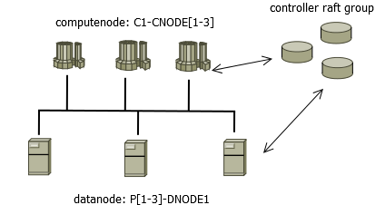  
  <figcaption>图1-1</figcaption>
</figure>


图中 C1-CNODE1 至 C1-CNODE3 为计算节点，P1-DNODE1 至 P3-DNODE1 为数据节点。

从文件系统来简单验证下计算节点的无状态特性。查看数据节点 volume 配置：

```
# 查看存储卷
select * from pnodeRun(getConfig{`volumes})
P1-DNODE1    /ssd/ssd0/wfHuang/volumes/P1-DNODE1
P2-DNODE1    /ssd/ssd0/wfHuang/volumes/P2-DNODE1
P3-DNODE1    /ssd/ssd0/wfHuang/volumes/P3-DNODE1
```

到操作系统去查看数据节点 P1-DNODE1 的 volume 目录：

<figure align="left">
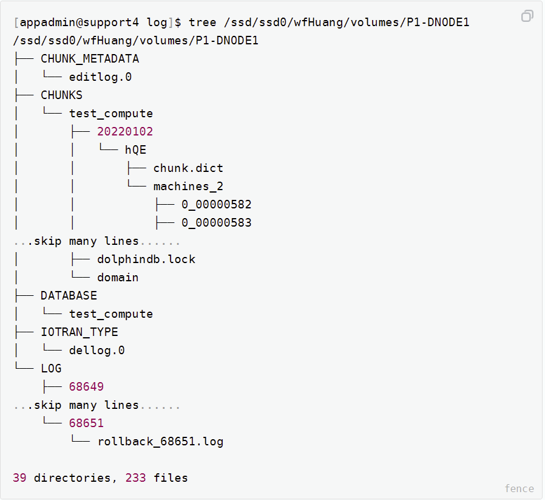  
  <figcaption>图1-2</figcaption>
</figure>


可看到 P1-DNODE1 作为数据节点，管理着事务 undo/redo 日志文件，和大量的数据块 CHUNKS 文件。但计算节点不需要配置 volume, 查看 C1-CNODE1 的默认 data 目录：

<figure align="left">
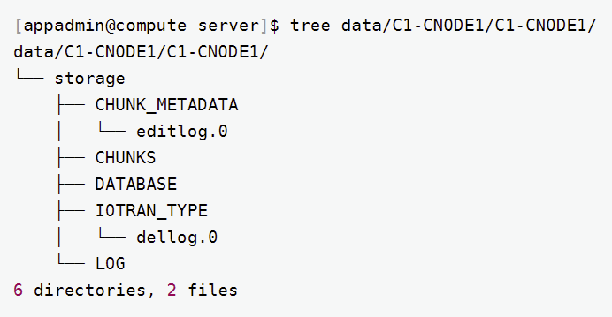  
  <figcaption>图1-3</figcaption>
</figure>


可以看到计算节点 C1-CNODE1 不存储任何的分布式数据文件。

- **负责计算**

在分布式表读写场景中，由数据节点负责 map 阶段，计算节点负责 merge-reduce 阶段（详见[1.2.2章节](#122-通过一个-sql-查询理解计算节点)）。在纯内存对象（常规内存表、分区内存表、流数据表等）计算场景中，由计算节点独立执行。

执行一个分布式表查询 SQL，从文件层面来观察计算节点在数据查询发挥的作用。

查看计算节点 C1-CNODE1 打开的文件（*open files*）：

```
[appadmin@compute volumes]$ lsof -p pidOfComputenode
skip library files
compute_w 38563 appadmin   19u     IPv4 319181009       0t0       TCP compute:8961->192.192.168.2:56780 (ESTABLISHED)
compute_w 38563 appadmin   20u     IPv4 319103550       0t0       TCP compute:8961->192.192.168.2:56786 (ESTABLISHED)
compute_w 38563 appadmin   22u     IPv4 319095550       0t0       TCP compute:8961->192.192.168.2:34842 (ESTABLISHED)
...skip 20 lines......
compute_w 38563 appadmin   44u     IPv4 319337513       0t0       TCP compute:42566->192.192.168.2:8961 (ESTABLISHED)
```
查看数据节点 P1-DNODE1 打开的文件：

```
[appadmin@support4 log]$ lsof -p pidOfDatanode
compute_w 99763 appadmin   33u     IPv4 49451766       0t0       TCP support4:8961->192.192.168.1:42474 (ESTABLISHED)
compute_w 99763 appadmin   36u     IPv4 49455618       0t0       TCP support4:8961->192.192.168.1:42562 (ESTABLISHED)
compute_w 99763 appadmin   39r      REG     8,17 272358102 177313580 /ssd/ssd0/wfHuang/volumes/P1-DNODE1/CHUNKS/test_compute/20220102/hQE/machines_2/1_00000058
compute_w 99763 appadmin   40r      REG     8,17 272358117 177313646 /ssd/ssd0/wfHuang/volumes/P1-DNODE1/CHUNKS/test_compute/20220106/hQE/machines_2/1_00000062
compute_w 99763 appadmin   41r      REG     8,17 272358131 177313802 /ssd/ssd0/wfHuang/volumes/P1-DNODE1/CHUNKS/test_compute/20220227/hQE/machines_2/1_00000072
compute_w 99763 appadmin   42r      REG     8,17 272358111 177313644 /ssd/ssd0/wfHuang/volumes/P1-DNODE1/CHUNKS/test_compute/20220109/hQE/machines_2/1_00000060
......skip hundreds of lines......
```

可以观察到计算节点 C1-CNODE1 打开了大量的 TCP 连接符，而数据节点 P1-DNODE1 除了 TCP 连接符外，还打开了大量的磁盘文件。

<figure align="left">
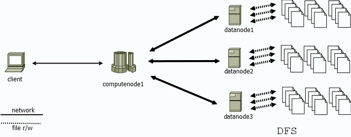  
  <figcaption>图1-4</figcaption>
</figure>

如上图所示，计算节点 computenode1 负责解析 client 的请求，并协调数据节点 datanode[1-3] 读/写数据（即 map，分布式执行过程）。接收到 datanode[1-3] 的数据后，经过 reduce-merge 过程，将最终结果返回给客户端。存算分离的架构，使得数据节点的物理资源得到隔离，写入和读取数据更为稳定、高效。

### **1.2.2 通过一个 SQL 查询理解计算节点**

当客户端向计算节点发起一个 sql 查询：

```
pt1 = loadTable(database("dfs://szstock"),"sztrade")  
select [HINT_EXPLAIN]
    securityID, min(price) as LowPx, max(price) as HighPx, sum(tradeQty) as vol
    , first(price) as OpenPx, last(price) as LastPx, sum(tradeQty * price) as val
from pt
where execType="F"
group by tradedate,securityID,minute(temporalParse(tradetime$STRING, "yyyyMMddHHmmssSSS")) as minute
order by tradedate,securityID, minute
```

通过 `[HINT_EXPLAIN]` 获取执行计划，整个 sql 的执行过程依次为 parse，map，merge，reduce 四个部分。

```
{
    "measurement": "microsecond",
    "explain": {
        "from": {
            "cost": 2
        },
        "map": {
            "partitions": {
                "local": 0,
                "remote": 320
            },
            "cost": 5189927,
            "detail": {
...skip many lines...
        },
        "merge": {
            "cost": 446588,
            "rows": 8522241,
            "detail": {
 ...skip many lines...
                }
            }
        },
        "reduce": {
            "sql": "select [98307] * from 702a9832b17f0000 order by tradedate asc,securityID asc,minute asc",
            "explain": {
                "sort": {
                    "cost": 296783
                },
                "rows": 8522241,
                "cost": 746374
            }
        },
        "rows": 8522241,
        "cost": 6691112
    }
}
```

其中，query parse、merge、reduce 过程发生在计算节点，map 阶段则并行发生于各数据节点。

<figure align="left">
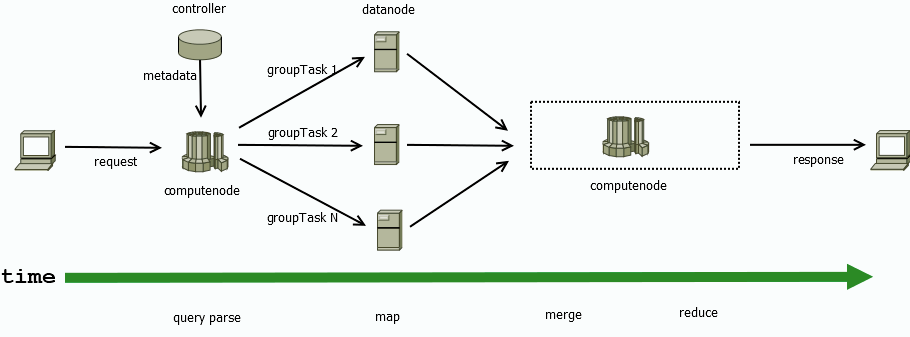  
  <figcaption>图1-5</figcaption>
</figure>

整个执行过程消耗资源具体如下表。

| 执行步骤    | 发生节点     | 消耗资源                 | 时间(us) |
| :---------- | :----------- | :----------------------- | :------- |
| query parse | computenode  | cpu                      | 2        |
| map         | datanode * 3 | IO, network，cpu, memory | 5189927  |
| merge       | computenode  | cpu，network, memory     | 446588   |
| reduce      | computenode  | cpu，network, memory     | 746374   |

该 SQL 总共涉及300个分区，各分区记录数在60-280万不等。merge-reduce 阶段分布处理了850万的数据。由 C1-CNODE1 承担的 merge-reduce 阶段总耗时占比为

 （446588 + 746374）/ 6691112 = 17.8%

上述例子 map 阶段 where，group by 算子大大减少了数据量，因此计算节点的算量不大，如果是读取数据类的场景，比如数据导入导出，此比例会大大增加。

执行过程中，计算节点与数据节点的内存消耗情况如下图所示（node33：计算节点，node34-36：数据节点，下同）。

<figure align="left">
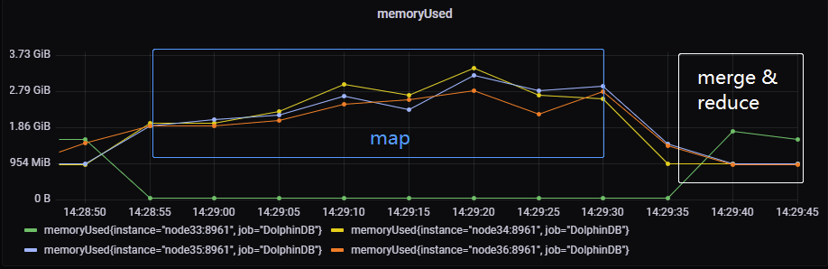  
  <figcaption>图1-6</figcaption>
</figure>


可以看出在 map 阶段在数据节点，是分布式、并行执行的。在 merge-reduce 过程中计算节点的内存消耗逐渐增加。

## 1.3 引入计算节点的好处

### 1.3.1 保证写入数据的稳定性

在数据节点上执行复杂业务计算（如因子计算、机器学习等），会占用大量的内存。使得 cacheEngine 无法获取足够多的内存，而发生 cacheEngine 内存溢出等问题，导致写入延迟，甚至失败。

> ChunkCacheEngine can't reclaim any memory after trying 13 times.
>
> Transation failed, cacheEngine out of memory.

另外，使用 TSDB 引擎，数据刷盘时需进行排序，需要消耗大量的 CPU 资源以及排序 buffer。若 CPU 、内存资源不足时，TSDB 的写入性能会下降。

通过在架构上引入计算节点，采用计算与存储分离的架构设计，可以有效地保证集群数据写入的稳定性。

### 1.3.2 降低故障平均修复时间

使用计算节点的集群能显著地降低故障平均修复时间，尽可能地减少对业务的影响。核心原因是由于计算节点不管理分布式数据，重启可以在数秒内完成。当某个计算节点出现拥塞、无法响应等情况，且无法热修复的，重启即可使其恢复正常服务。

- 启动流程对比

<figure align="left">
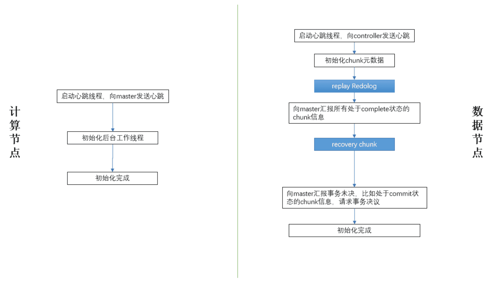  
  <figcaption>图1-7</figcaption>
</figure>


如图，当数据节点启动时，流程中的蓝色标记部分：“回放 redo 日志”，“恢复损坏的 chunk” 等包含了大量的 IO 操作，实际生产环境中耗时为分钟级（具体视数据量大小而定）。而计算节点流程十分精简，可以在秒级完成启动。

## 1.4 计算节点安装

现用如下4台服务器部署集群：

> P1: 192.193.168.2
>
> P2: 192.193.168.3
>
> P3: 192.193.168.4
>
> C1: 192.193.168.1

其中服务器 P1-P3 用于部署数据节点，C1 用于部署计算节点。

### 1.4.1 编写配置文件

在节点列表文件 *cluster.nodes* 中编写计算节点及代理节点。推荐计算节点以 CN (取 compute node 首字母) 标识，数据节点以 DN (取 data node 首字母) 标识，如：
```
localSite,mode
192.193.168.2:8990:controller1,controller
192.193.168.3:8990:controller2,controller
192.193.168.4:8990:controller3,controller
192.193.168.2:8960:P1-agent,agent
192.193.168.3:8960:P2-agent,agent
192.193.168.4:8960:P3-agent,agent
192.193.168.1:8960:C1-agent,agent
192.193.168.2:8961:DN1,datanode
192.193.168.3:8961:DN2,datanode
192.193.168.4:8961:DN3,datanode
192.193.168.1:8961:CN1,computenode
192.193.168.1:8966:CN2,computenode
192.193.168.1:8967:CN3,computenode
```

在配置文件 *cluster.cfg* 中，需要使用前缀来区分数据节点与计算节点的配置项。
```
CN%.workerNum=64
CN%.maxConnections=3000
CN%.maxMemSize=256
CN%.dataSync=0
DN%.maxConnections=512
DN%.maxMemSize=128
DN%.workerNum=32
DN%.chunkCacheEngineMemSize=6
DN%.dataSync=1
DN%.redoLogDir=/ssd/ssd0/wfHuang/volumes/redoLog
DN%.volumes=/ssd/ssd0/wfHuang/volumes,/ssd/ssd1/wfHuang/volumes,/ssd/ssd2/wfHuang/volumes
```

`CN%` 匹配 CN 开头的计算节点，`DN%` 匹配 DN 开头的数据节点。以此保证计算节点与数据节点的配置项不会互相干扰。

注：计算节点必须配置 ` dataSync = 0` 。

### 1.4.2 启动计算节点

参考[集群安装模式](https://gitee.com/dolphindb/Tutorials_CN/blob/master/multi_machine_cluster_deployment.md)部署并启动 agent、controller 节点。启动完成后后，使用 web 启动计算节点。

<figure align="left">
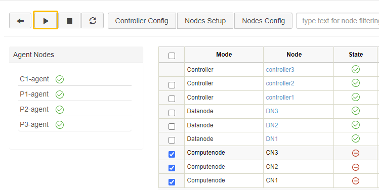  
  <figcaption>图1-8</figcaption>
</figure>

# 第2章 架构设计

## 2.1 计算节点的设计和硬件规划

依据上文解析，计算节点主要负责接收、响应请求以及内存计算，数据节点主要负责数据存储管理。在集群设计与规划时，生产环境最小硬件配置推荐如下：

| 组件        | CPU    | 内存   | 网络      | 硬盘                                            |
| :---------- | :----- | :----- | :-------- | :---------------------------------------------- |
| datanode    | 8 核+  | 64GB+  | 10Gb 网卡 | ssd/hdd，500GB+建议元数据存 ssd，分区数据存 hdd |
| computenode | 16 核+ | 128GB+ | 10Gb 网卡 | hdd,200GB                                       |

计算节点更注重 cpu、内存、网卡性能。而数据节点更注重 iops ，存储通道与容量。集群拓扑结构可根据应用场景与需求参考下文设计。

## 2.2 单计算节点集群架构

<figure align="left">
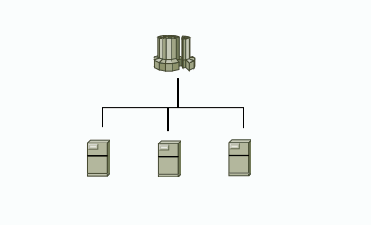  
  <figcaption>图2-1</figcaption>
</figure>

单一的计算节点，可以做为请求统一入口。此时拓扑简单，部署方便。

## 2.3 高可用计算节点集群架构


<figure align="left">
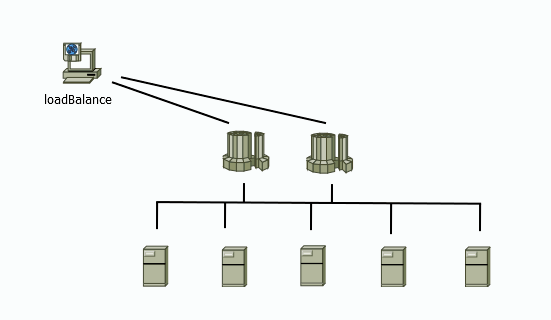  
  <figcaption>图2_2</figcaption>
</figure>

在 DolphinDB 数据库层面，部署多个计算节点，扩展集群计算容量，并实现高可用。

从计算节点发起 DFS 表读写请求时，可以容忍部分数据节点实例级别的故障（比如某个数据节点的服务器断电），其崩溃恢复策略如下：

- 写

  从计算节点写入数据时，如果某个数据节点发生了崩溃，事务管理器会回滚当前失败的事务。并以一个新的事务，重试数据写入，整个过程对于客户端程序是透明无感知的。


<figure align="left">
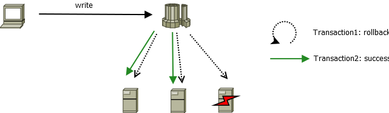  
  <figcaption>图2_3</figcaption>
</figure>

- 读

  DolphinDB 默认采用2副本（确保强一致性），当计算节点发现部分子任务失败时，会根据可用 chunk 副本的分布，重新调度新的 subTask 到对应数据节点中去，实现任务的崩溃恢复。


<figure align="left">
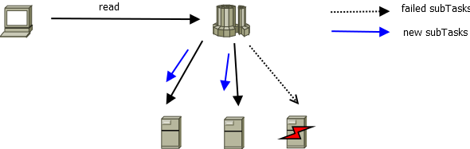  
  <figcaption>图2_4</figcaption>
</figure>

在中间件层面，可以引入负载均衡组件（如 haproxy，F5 等）来实现集群统一访问接口。

## 2.4 流计算节点

生产环境中，流数据对时延要求非常高。在多人、多业务场景使用集群时，数据节点由于本身还是承担着数据读写操作，不可避免地在一定程度上影响流计算。在设计上，可以将流计算相关业务单独地部署至某计算节点实例。

<figure align="left">
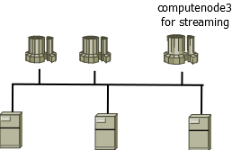  
  <figcaption>图2_5</figcaption>
</figure>


图示，使用 computenode3 作为流计算节点，专门负责流计算业务。在另外两个计算节点上进行批量读写，通过计算节点之间的 Share-nothing 架构特性，有效保证流计算的低时延。

## 2.5 基于计算节点实例的资源隔离

在生产环境中，若有多人同时使用 DolphinDB 集群，需要一定的资源隔离机制来保障核心业务稳定运行。可以在架构层面，配合负载均衡策略，实现基于计算节点的资源隔离。

<figure align="left">
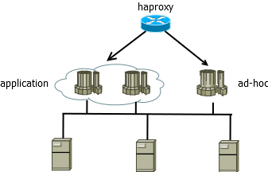  
  <figcaption>图2_6</figcaption>
</figure>


以 haproxy 为例，在 *haproxy.cfg* 中设置2个监听组

- ddb-cluster

核心业务使用计算资源组，总共6000连接，2个计算节点，高可用。

- ad-hoc-single

用于即席查询的计算节点，配置为单节点，限制1000连接，用于分析师，研究员等对数据做一些探索和即席查询。
```
listen ddb-cluster
   bind 0.0.0.0:5000
   mode tcp
   balance leastconn
   server compute1 192.168.168.1:8961 maxconn 3000 check
   server compute2 192.168.168.1:8966 maxconn 3000 check

listen ad-hoc-single
   bind 0.0.0.0:10090
   mode tcp
   balance leastconn
   server compute3 192.168.168.1:8967 maxconn 1000 check
```

 

# 第3章 应用场景

所有数据节点的计算任务、代码都可以无缝迁移到计算节点。集群管理与使用者应当避免直接访问数据节点，转而使用计算节点作为查询与写入的入口。具体演示数据读取、写入、流计算、机器学习。

## 3.1 数据读取

使用 python api 从计算节点读取某一只股票的历史交易数据。

```python
import DolphinDB as ddb

def getData(date, securityID, rowNum=1000000):
    s = ddb.session()
    s.connect("computenode1", 8961, "admin", "123456")
    trade = s.loadTable(tableName="sztrade", dbPath="dfs://szstock)
    rst = trade.select("*").where("tradedate = %d" % date)\
        .where("securityID = '%s'" % securityID) \
        .where("execType=\"F\"")\
        .limit(rowNum).toDF()
    s.close()
    return rst

if __name__ == '__main__' :
    print(getData(20200102, "000014"))
```

## 3.2 数据写入

将历史行情数据导入 DolphinDB ，具体操作请参考[国内股票行情数据导入实例](https://gitee.com/dolphindb/Tutorials_CN/blob/master/stockdata_csv_import_demo.md)。导入2020年1月数据，共计82G数据时，集群计算节点，数据节点消耗情况如下：

- cpu/memory

<figure align="left">
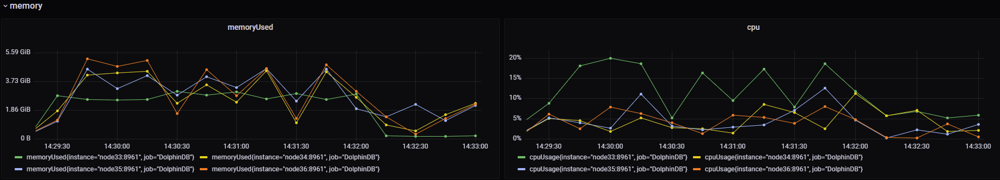  
  <figcaption>图3_1</figcaption>
</figure>

- io

<figure align="left">
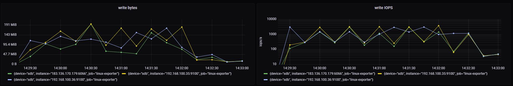  
  <figcaption>图3_2</figcaption>
</figure> 


在执行导入过程中，计算节点 cpu 均值在15%，峰值达到20%，内存消耗约2.8G。

## 3.3 流计算

流计算的核心诉求是时延，如果采用数据节点作为流计算节点，必不可免地会受到分布式表读取与写入的影响。配置计算节点成为流计算节点，可以有效地保障 CPU，memory，io，worker 线程等软硬件资源服务于流计算，从而保证低时延。并且由于计算节点之间是互不影响的，推荐在架构上设计部分计算节点作为流计算节点，其他计算节点用于分析与查询。

### 3.3.1 配置计算节点

设计 CN1 作为流计算的订阅和发布节点，配置文件如下：
```
# publish
CN1.persistenceDir=/ssd/ssd0/persistDir/C1-CNODE1
CN1.persistenceWorkerNum=4
CN1.maxPubConnections=64

# subscribe 
CN1.maxSubConnections=64
CN1.subPort=8970
CN1.subExecutors=16
```

### 3.3.2 创建与订阅流表

在计算节点 CN1 上创建流表：
```
t = streamTable(1:0, `sym`price, [STRING,DOUBLE])
enableTableShareAndPersistence(t, `tickStream)
```

订阅并编写实时因子计算：
```
def sum_diff(x, y){
    return (x-y)/(x+y)
}
factor1 = <ema(1000 * sum_diff(ema(price, 20), ema(price, 40)),10) -  ema(1000 * sum_diff(ema(price, 20), ema(price, 40)), 20)>
result = table(1000:0, `sym`factor1, [STRING,DOUBLE])
rse = createReactiveStateEngine(name="reactiveDemo", metrics =factor1, dummyTable=tickStream, outputTable=result, keyColumn="sym")
subscribeTable(tableName=`tickStream, actionName="factors", offset=-1, handler=tableInsert{rse})
```

往 CN1 模拟写入消息（同时另一个计算节点 CN2 执行导入数据作业）
```
n = 2000000
data = table(take("000001.SH", n) as sym, rand(10.0, n) as price)
tickStream.append!(data)
getStreamingStat().subWorkers
```

查看集群的资源消耗情况：

<figure align="left">
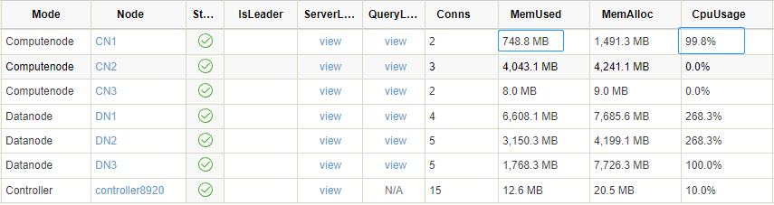  
  <figcaption>图3_3</figcaption>
</figure>

可以看到 CN2, DN1-3 在消耗相对较高的内存和 CPU 时，CN1 并没有受到数据导入的影响，使得流计算的时延得到有效保证。

## 3.4 机器学习

机器学习是计算密集型的场景，模型的训练过程会消耗大量的 CPU、内存资源。将机器学习的作业部署至某个计算节点，可以避免对数据写入、读取类任务的负面影响。例如在 CN2 上，使用 [adaBoost ](https://www.dolphindb.cn/cn/help/FunctionsandCommands/FunctionReferences/a/adaBoostRegressor.html?highlight=adaboost#adaboostregressor)训练股票年波动率：
```
def tranAdaBoost(TrainData){
	db = database(,HASH, [SYMBOL, 10])
	p10TranData = db.createPartitionedTable(table=TrainData, partitionColumns=`SecurityID)
	p10TranData.append!(TrainData)
	model = adaBoostRegressor(sqlDS(<select * from p10TranData>), yColName=`targetRV, xColNames=`BAS`DI0`DI1`DI2`DI3`DI4`Press`RV, numTrees=30, maxDepth=16, loss=`square)
	saveModel(model, "/hdd/data/finance/model/adaBoost.txt")
}

jobId="adaBoost" 
jobDesc="adaBoost train snap"
submitJob(jobId, jobDesc, tranAdaBoost, Train)
```

完整代码及过程请参考[实时实际波动率预测](https://gitee.com/dolphindb/Tutorials_CN/blob/master/machine_learning_volatility.md#32-训练及评价) 。使用 10 个线程并行训练，加速训练过程。

<figure align="left">
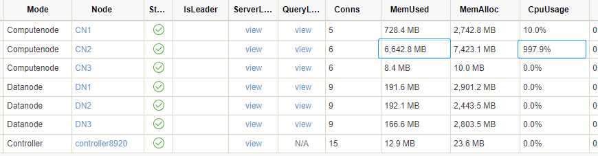  
  <figcaption>图3_4</figcaption>
</figure>

在 CN2 训练过程中，其他节点资源未受影响。同时如果想加速机器学习训练过程，可以使用更多的线程，为 CN2 额外配置一些 CPU、内存资源，在资源管理上非常灵活。

# 第4章 运维

## 4.1 集群监控

引入计算节点的集群，在运维监控层面，需要以存储与计算分离的架构来进行监控。对于数据节点、计算节点的监控侧重点不同。具体来说，计算节点需要关注客户端请求执行情况的相关性能：包括平均响应时间、连接数、内存、CPU 使用率、网卡带宽使用率等；而数据节点更需要关注磁盘空间、IOPS、读写MB/s等 IO 相关指标。

### 4.1.1 监控软件部署

通过部署第三方软件：Grafana，Prometheus 实现集群的管理与监控，具体流程参考 [Grafana 系列部署](https://gitee.com/dolphindb/Tutorials_CN/blob/master/cluster_monitor.md)。

### 4.1.2 监控面板

提供[计算节点与数据节点监控](https://grafana.com/grafana/dashboards/16194) dashboard，是基于存储与计算分离架构设计的一套监控面板。已上传至 Grafana 官方仓库， 可以在快速完成集群的运维监控部署工作。

点击 **Import** -> 输入对应 dashboardID，点击 **Load** 即可完成导入。

<figure align="left">
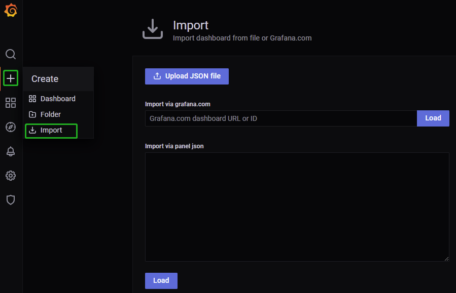  
  <figcaption>图4_1</figcaption>
</figure>

## 4.2 查询监控与SESSION管理

### 4.2.1 session

计算节点监控的关键运行时参数主要是内存、连接数。如何避免个别 session 占用过多内存，而导致其他 session OOM，是运维管理上的重点。

1. 内存管理

在内存紧张时，通过 getSessionMemory 视图进行会话管理，回收空闲会话：
```
select 
    userId
    ,sessionId
    ,memSize/1024/1024 as MB
    ,localtime(createTime) as createTime
    ,localtime(lastActiveTime) as lastActiveTime
    ,(now() - localtime(lastActiveTime))/1000 as idleSeconds
from getSessionMemoryStat()
order by memSize desc
```

通过 closeSessions(sessionId) 来关闭对应会话并回收内存。

<figure align="left">
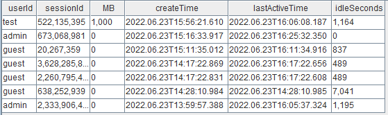  
  <figcaption>图4_2</figcaption>
</figure>


图示，test 用户已经空闲15分钟了，视情况可以关闭此 session，并回收1000MB的内存。

2. 连接管理

在 Linux 中，DolphinDB 的一个 connection 对应一个 TCP 连接。在物联网场景下，需要调整连接数（每个 tcp 连接消耗 4K 内存，对操作系统消耗不大），以应对高 QPS 需求，建议将计算节点的配置设置为 `maxConnections=5000` 及以上。

> The number of incoming connections has reached the limit of 512

当日志出现以上信息时，说明连接已经不足，检查程序是否存在连接泄露的情况。应急处理请使用 `closeSessions()` 清理一些空闲会话以回收连接，并增加 *maxConnections* 。

### 4.2.2 慢查询

慢查询通常会引起系统雪崩，需要重点关注。DolphinDB 提供一个 job log 日志文件，记录 DFS 表相关查询日志，默认在 log 目录下，名称为 *nodeAlias_job.log*。

- 监控 top10 sql
```
jobLogFile = getConfig(`jobLogFile)
queryLog = loadText(jobLogFile)

select 
    node 
    ,userId
    ,sessionId
    ,jobDesc as sqlText
    ,startTime
    ,endTime
    ,(endTime$DATETIME - startTime$DATETIME ) as costSeconds
from queryLog
order by (endTime$DATETIME - startTime$DATETIME ) desc
limit 10
```

<figure align="left">
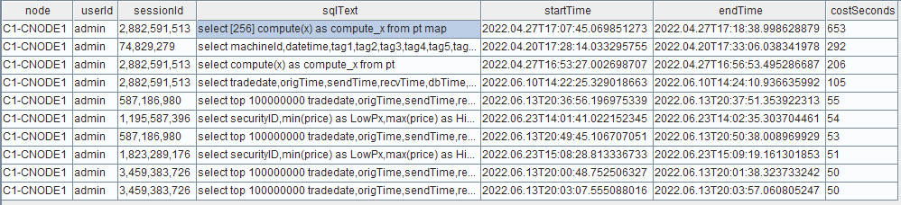  
  <figcaption>图4_3</figcaption>
</figure>


如图，根据 sqlText，userId，运行时间及时长，综合分析处置慢查询，比如限制一些用户进行较大规模的查询，以及对部分查询效率和速度较低的 SQL 语句进行优化。

## 4.3 参数设置

计算节点不需要设置 DFS 表存储相关的参数，包括：*volumes*, *chunkCacheEngineMemSize*, *tsdbCacheEngineSize*, *redoLogDir* 等。计算节点的核心参数包括：*MaxMemSize*, *MaxConnections*, *workerNum*, *maxQueryResultLimit *等。具体设置请参考手册[参数配置](https://www.dolphindb.cn/cn/help/DatabaseandDistributedComputing/Configuration/index.html) 。

## 4.4 计算节点扩缩容

相比于数据节点，计算节点扩缩容非常简单快捷，支持在线扩缩容。

### 4.4.1 扩容

1. 在新机器上部署和配置 agent

拷贝原机器上的 agent 部署包到新机器，并修改 *agent.cfg*，如
```
mode=agent
workerNum=4
localSite=192.192.168.4:8950:C4-agent
controllerSite=192.192.168.4:8990:controller3
sites=192.192.168.4:8950:C4-agent:agent,192.192.168.2:8990:controller1:controller,192.192.168.3:8990:controller2:controller,192.192.168.4:8990:controller3:controller
lanCluster=0
```

2. 在 web 集群管理界面修改 `Nodes Setup` 配置，新增 computenode 和 agent。
 
<figure align="left">
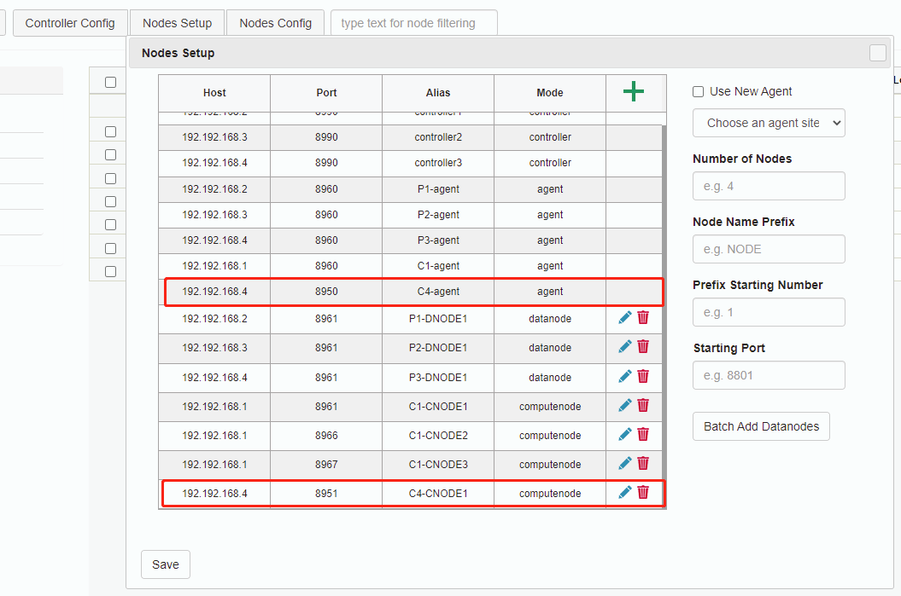  
  <figcaption>图4_4</figcaption>
</figure>


回到 web 管理界面，可以看到已经新增了一个 agent4 并且是未启动状态。

3. 启动新节点的 agent
```
nohup ./DolphinDB -console 0 -mode agent -home data -config config/agent.cfg -logFile log/agent.log &
```

**注：**

如果在已有机器上扩展一个计算节点实例，只需在 web 集群管理页面的任意一个数据/计算节点执行命令：

```
 addNode("192.168.100.33",8965,"C1-NODE5",,"computenode")`
```

新计算节点命名应遵守部署文档中提到的命名规则，以确保 *cluster.cfg* 能赋予新的计算节点正确的配置。

### 4.4.2 缩容

1. 停止计算节点

在 web 集群管理页面停止对应计算节点，等待其安全关闭，通常需要数秒。

2. 修改集群配置

在 `nodes Setup` 中删除对应的 computenode 节点。

# 第5章 总结

计算节点不存储分布式数据，使用计算节点可以有效地提升集群的写入稳定性，缩短故障修复时间。计算节点之间相互隔离，架构设计者可根据应用场景，灵活地部署业务至各计算节点。推荐将流计算、机器学习部署至计算节点。在运维管理上，计算节点可以快速重启、方便地在线扩缩容。