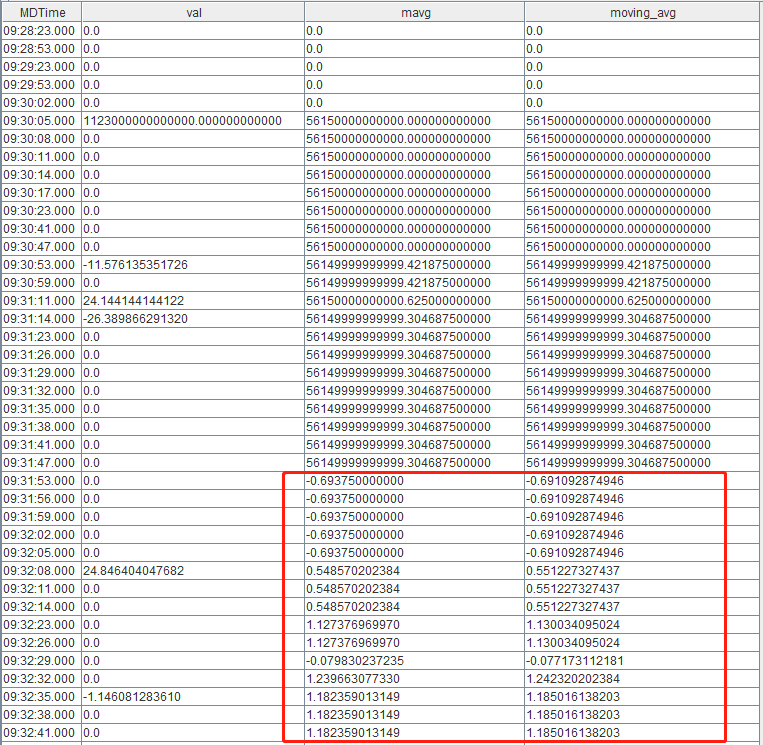
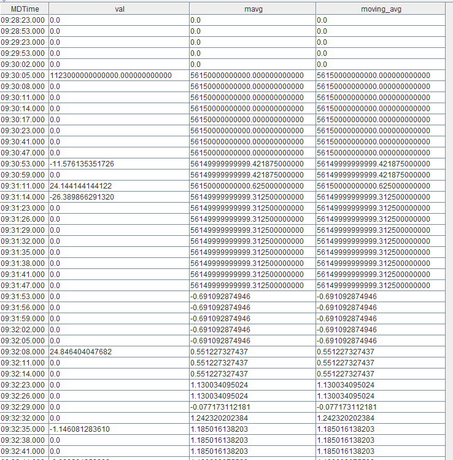

# DolphinDB 计算精度问题与 DECIMAL 类型

- [1 DECIMAL 的计算特性](#1-decimal-的计算特性)
	- [1.1 DECIMAL 的计算方式](#11-decimal-的计算方式)
	- [1.2 DECIMAL 的计算输出](#12-decimal-的计算输出)
- [2 DECIMAL 的优缺点](#2-decimal-的优缺点)
	- [2.1 DECIMAL 的优点](#21-decimal-的优点)
	- [2.2 DECIMAL 的缺点](#22-decimal-的缺点)
- [3 浮点数与 DECIMAL 计算性能差异比较](#3-浮点数与-decimal-计算性能差异比较)
- [4 DECIMAL 最佳实践：避免 mavg 计算精度损失](#4-decimal-最佳实践避免-mavg-计算精度损失)
- [5 总结](#5-总结)


## 1 DECIMAL 的计算特性

### 1.1 DECIMAL 的计算方式

DECIMAL 的存储分为两部分，即存储整型数据的 raw data 和存储小数位数的 scale。例如，对于DECIMAL32(2) 类型的 1.23, 它存储了两个数据：(1) raw data：即整型 123，(2) scale：即 2。这样存储的好处是，在计算时可以直接使用整型的 raw data 进行计算，从而避免精度损失。

对于大多数计算函数，如果最后返回的结果是浮点数类型，DECIMAL 在进行计算时， 会使用 raw data 参与计算，尽量延迟转换成浮点数的时机，从而确保得到精确结果。比如计算 avg 时，假设数据为 DECIMAL32(2) 类型：[1.11, 2.22, 3.33]，其 raw data 为：[111, 222, 333]。在计算时，先算出 raw data 的 sum：111 + 222 + 333 = 666，然后转换成浮点数：double(666) / 102 / 3 = 2.22。

对于DECIMAL算术运算的规则，可参照：[DECIMAL.md · 浙江智臾科技有限公司/Tutorials_CN - Gitee.com](https://gitee.com/dolphindb/Tutorials_CN/blob/master/DECIMAL.md#22-算术计算的溢出检查)。

### 1.2 DECIMAL 的计算输出

本节主要讲述DECIMAL作为计算函数输入的输出结果。

在 DolphinDB 计算函数中，以 DECIMAL 类型作为输入，输出结果仍为 DECIMAL 类型的函数较少，仅有：`sum`、`max`、`min`、`first`、`last`、`firstNot`、`lastNot` 及其 cum、m、tm、TopN 系列函数，如 `cummax`、`mmin`、`tmsum`、`msumTopN`，`cumsumTopN`，`tmsumTopN` 等；以及 `cumPositiveStreak`。

```
a = decimal64(rand(10,100),4)

typestr(sum(a))
>> DECIMAL128

typestr(cummax(a))
>> FAST DECIMAL64 VECTOR

typestr(mmin(a,5))
>> FAST DECIMAL64 VECTOR

T = 2023.03.23..2023.06.30
typestr(tmsum(T, a, 3))
>> FAST DECIMAL128 VECTOR

typestr(cumPositiveStreak(a))
>> FAST DECIMAL128 VECTOR
```

需要注意的是，在引入 DECIMAL128 类型后，自 2.00.10 版本起，sum 系列函数和 `cumPositiveStreak` 的输入输出类型对应规则如下：

| **计算函数**                                                 | **输入类型** | **输出类型** |
| :----------------------------------------------------------- | :----------- | :----------- |
| sum/cumsum/msum/tmsum/msumTopN/cumsumTopN/tmsumTopN/cumPositiveStreak | DECIMAL32    | DECIMAL64    |
|                                                     | DECIMAL64   |        DECIMAL128      |
|                                                    | DECIMAL128   |        DECIMAL128      |

除了上述函数外，cum、m、tm、TopN 系列的函数，包括它们对应的原始的函数，比如 `avg`、`std`、`var`、`skew` 等，以 DECIMAL 类型作为输入，都将返回 DOUBLE 类型的输出结果。

```
a = decimal64(rand(10,100),4)

typestr(avg(a))
>> DOUBLE

typestr(cumstd(a))
>> FAST DOUBLE VECTOR

typestr(mvar(a,5))
>> FAST DOUBLE VECTOR

T = 2023.03.23..2023.06.30
typestr(tmskew(T, a, 3))
>> FAST DOUBLE VECTOR
```

下面将以 DECIMAL64 作为输入为例，列出常见计算函数的输出结果类型。

| **计算函数**                                                 | **输入类型** | **输出类型** |
| :----------------------------------------------------------- | :----------- | :----------- |
| sum/cumsum/msum/tmsum                                        | DECIMAL64    | DECIMAL128   |
| msumTopN/cumsumTopN/tmsumTopN                                | DECIMAL64    | DECIMAL128   |
| max/cummax/mmax/tmmax                                        | DECIMAL64    | DECIMAL64    |
| min/cummin/mmin/tmmin                                        | DECIMAL64    | DECIMAL64    |
| first/mfirst/tmfirst                                         | DECIMAL64    | DECIMAL64    |
| last/mlast/tmlast                                            | DECIMAL64    | DECIMAL64    |
| firstNot/cumfirstNot                                         | DECIMAL64    | DECIMAL64    |
| lastNot/cumlastNot                                           | DECIMAL64    | DECIMAL64    |
| cumPositiveStreak                                            | DECIMAL64    | DECIMAL128   |
| avg/cumavg/mavg/tmavg/mavgTopN/cumavgTopN/tmavgTopN          | DECIMAL64    | DOUBLE       |
| sum2/cumsum2/msum2/tmsum2                                    | DECIMAL64    | DOUBLE       |
| prod/cumprod/mprod/tmprod                                    | DECIMAL64    | DOUBLE       |
| med/cummed/mmed/tmmed                                        | DECIMAL64    | DOUBLE       |
| std/cumstd/mstd/tmstd/mstdTopN/cumstdTopN/tmstdTopN          | DECIMAL64    | DOUBLE       |
| skew/mskew/tmskew/mskewTopN/cumskewTopN/tmskewTopN           | DECIMAL64    | DOUBLE       |
| kurtosis/mkurtosis/tmkurtosis/mkurtosisTopN/cumkurtosisTopN/tmkurtosisTopN | DECIMAL64    | DOUBLE       |
| corr/cumcorr/mcorr/tmcorr/mcorrTopN/cumcorrTopN/tmcorrTopN   | DECIMAL64    | DOUBLE       |
| covar/cumcovar/mcovar/tmcovar/mcovarTopN/cumcovarTopN/tmcovarTopN | DECIMAL64    | DOUBLE       |
| beta/cumbeta/mbeta/tmbeta/mbetaTopN/cumbetaTopN/tmbetaTopN   | DECIMAL64    | DOUBLE       |

## 2 DECIMAL 的优缺点

### 2.1 DECIMAL 的优点

实数在计算机内部无法被精确地表示为浮点数的原因主要有两个：第一个原因是类似于 0.1 这样的数字，具有有限的十进制表示，但是在二进制中能表示为无穷重复的数据，等于 0.1 的近似值，无法被精确表示；第二个原因是数值超出了数据类型能表示的数值范围，系统将对数据做一定处理。与浮点数相比，DECIMAL 类型最大的优点，就在于它能够精确地表示和计算数据。

例如，在表示123.0001时：

```
a =123.0001
print(a)
>> 123.000100000000003

b = decimal64(`123.0001,15)
print(b)
>> 123.000100000000000
```

可见，浮点数无法精确表示123.0001，而 DECIMAL 可以。

在计算 avg 时：

```
a = array(DOUBLE,0)
for (i in 1..100){
	a.append!(123.0000+0.0003*i)
}
avg(a)
>> 123.015149999999
avg(a) == 123.01515
>> false
eqFloat(avg(a),123.01515)
>> true

b= array(DECIMAL64(4),0)
for (i in 1..100){
	b.append!(123.0000+0.0003*i)
}
avg(b)
>> 123.015150000000
typestr(avg(b))
>> DOUBLE
avg(b) == 123.01515
>> true
```

可见，在进行 avg 计算时，浮点数没有返回精确结果，而 DECIMAL 虽然返回结果也是 DOUBLE 类型，但返回了精确结果。

### 2.2 DECIMAL 的缺点

#### 2.2.1 容易溢出

DECIMAL32/DECIMAL64/DECIMAL128 类型的数值范围如下表所示，其中，DECIMAL32(S)、DECIMAL64(S) 和 DECIMAL128(S) 中的 S 表示保留的小数位数。

|            | **底层存储数据类型** | **字节占用** | **Scale有效范围** | **有效数值范围**                        | **最大表示位数** |
| :--------- | :------------------- | :----------- | :---------------- | :-------------------------------------- | :--------------- |
| DECIMAL32  | int32_t              | 占用4个字节  | [0,9]             | (-1 * 10 ^ (9 - S), 1 * 10 ^ (9 - S))   | 9位              |
| DECIMAL64  | int64_t              | 占用8个字节  | [0,18]            | (-1 * 10 ^ (18 - S), 1 * 10 ^ (18 - S)) | 18位             |
| DECIMAL128 | int128_t             | 占用16个字节 | [0,38]            | (-1 * 10 ^ (38 - S), 1 * 10 ^ (38 - S)) | 38位             |

在有效数值范围和最大表示位数的限制下，DECIMAL 类型很容易溢出。自 2.00.10 版本起，我们支持算术运算溢出后，若存在更高精度的类型，则将自动拓展结果的数据类型，从而降低溢出风险：

```
version 2.00.9.6：

a = decimal32(4.0000,4)
b = decimal32(8.0000,4)
c = a*b
>> Server response: 'c = a * b => Decimal math overflow'

version 2.00.10：
a = decimal32(4.0000,4)
b = decimal32(8.0000,4)
c = a*b
print(c)
>> 32.00000000
typestr(c)
>> DECIMAL64
```

但即使如此，DECIMAL128 仍存在溢出风险：

```
a = decimal128(36.00000000,8)
b = a*a*a*a
>> Server response: 'b = a * a * a * a => Decimal math overflow'
```

如上所示，由于 DolphinDB 中 DECIMAL 类型的数据乘法运算结果的 scale 是逐个累加的，b 的预期结果将会是 1679616.00000000000000000000000000000000，将会有39位数字，超出了 DECIMAL128 的最大表示位数38位，导致了溢出。

2.00.10版本新增支持了 DECIMAL 类型的乘法函数 `decimalMultiply`，与 `multiply` 函数 (`*` 运算符) 相比，该函数可以指定计算结果的精度。当 DEICMAL 类型的乘法运算导致 scale 累加存在溢出风险时，可以按需使用 `decimalMultiply` 函数，指定计算结果精度。

```
a = decimal64(36.00000000,8)
decimalMultiply(a, a, 8)
>> 1296.00000000
```

#### 2.2.2 转换误差

当我们直接使用常量生成 DECIMAL 类型时，可能会因为浮点数的转换产生误差：

```
a = 0.5599
decimal64(a,4)
>> 0.5598
```

为了避免这种误差，可以使用字符串来生成 DECIMAL：

```
a = "0.5599"
decimal64(a,4)
>> 0.5599
```

#### 2.2.3 内存占用

DECIMAL32、DECIMAL64 和 DECIMAL128 类型在内存中分别占用4个字节、8个字节和16个字节，而 FLOAT 和 DOUBLE 类型在内存中占用4个字节和8个字节。因此，在数据量相同的情况下，DECIMAL128 占用的内存是 DOUBLE 的两倍。

且由于算术运算溢出后，将自动拓展结果的数据类型，每次拓展后等量数据占用的内存将翻倍，存在一定的内存风险。

#### 2.2.4 性能差异

与 FLOAT 和 DOUBLE 类型相比，DECIMAL 类型的计算速度更慢，我们将在第三节中进行详细比较。

#### 2.2.5 局限性

在 DolphinDB 中，DECIMAL 类型与 FLOAT/DOUBLE 类型相比，目前所支持的功能和结构较少。

- 在函数支持方面，尚有少部分计算函数不支持 DECIMAL 类型。
- 计算结果方面，cum, tm, m, TopN 系列的函数，包括它们对应的原始的函数（`sum`、`max`、`min`、`firstNot`、`lastNot`、`cumPositiveStreak` 除外），即使原始数据是 DECIMAL 类型，返回结果还是浮点数类型。
- 数据结构方面，DolphinDB 系统目前暂未支持 DECIMAL 类型在 matrix 和 set 中使用。
- 数据类型转换方面，DolphinDB 系统暂不支持 BOOL/CHAR/SYMBOL/UUID/IPADDR/INT128 等类型和 temporal 集合下的时间相关类型与 DECIMAL 类型相互转换，其中 STRING/BLOB 类型的数据如需转换成 DECIMAL 类型，必须满足 STRING/BLOB 类型的数据可以转换成数值类型的前提。

## 3 浮点数与 DECIMAL 计算性能差异比较

为了比较浮点数类型与 DECIMAL 类型的计算性能差异，我们选取了一些常用的计算函数，比较相同数据情况下，各个数据类型的计算耗时。

首先，模拟数据脚本如下：

```
n = 1000000
data1 = rand(float(100.0),n)
data2 = double(data1)
data3 = decimal32(data1,4)
data4 = decimal64(data1,4)
data5 = decimal128(data1,4)
```

随后，使用 `timer` 语句统计常用计算函数对于各个类型数据的计算耗时：

```
timer(100){sum(data1)}  //执行100次，避免单次计算误差，并放大不同类型间的耗时差异
timer(100){sum(data2)}
timer(100){sum(data3)}
timer(100){sum(data4)}
timer(100){sum(data5)}
... ...
```

得到的计算耗时统计结果如下（单位：ms）：

|              | **FLOAT** | **DOUBLE** | **DECIMAL32** | **DECIMAL64** | **DECIMAL128** |
| :----------- | :-------- | :--------- | :------------ | :------------ | :------------- |
| **sum**      | 52.985    | 64.331     | 28.721        | 57.234        | 107.126        |
| **sum2**     | 173.278   | 211.772    | 176.261       | 180.051       | 603.422        |
| **prod**     | 63.650    | 55.641     | 171.718       | 174.389       | 18850.009      |
| **avg**      | 178.086   | 210.495    | 26.094        | 106.869       | 258.508        |
| **std**      | 362.388   | 345.758    | 278.933       | 319.177       | 968.276        |
| **kurtosis** | 547.751   | 407.561    | 585.859       | 769.879       | 1013.591       |
| **skew**     | 546.705   | 439.348    | 622.758       | 842.994       | 1074.128       |

根据上述统计结果，可以得知：

（1）对于大部分计算函数，DECIMAL 的性能都比 FLOAT/DOUBLE 差；

（2）DECIMAL128 在计算时，会转换成 LONG DOUBLE（DECIMAL32/DECIMAL64 会转换成 DOUBLE），而 LONG DOUBLE 的实现取决于编译器和 CPU，可能是 12 字节或者 16 字节，LONG DOUBLE 的乘法在数据很大时非常耗时。在本节的测试样例中，vector 里的元素的取值范围较大，所以其乘积非常大，计算非常耗时。而如果把取值范围取小一些，比如 [0.5, 1.0]，则 DECIMAL128 的计算和 DECIMAL32/DECIMAL64 相差不大；

（3）对于 `sum`、`avg`、`std` 这样的函数，DECIMAL 类型在计算时都没有做循环展开，而浮点数类型对 `sum` 做了循环展开，`avg` 则没有。此外，由于 DECIMAL 计算时会使用 raw data 先参与计算，再直接返回 DECIMAL 类型或转化为浮点数，本质是整型计算，实际过程比浮点数运算更高效。因此，它们的性能相差不大，甚至 DECIMAL32/DECIMAL64 的性能比 FLOAT/DOUBLE 更好。

## 4 DECIMAL 最佳实践：避免 mavg 计算精度损失

本节将以具体场景，比较 DECIMAL 类型和浮点数类型在实际计算中的精度差异。


`mavg` 和 `moving(avg,…)` 虽然在含义上完全相同，但两者的实现方式并不一致。`mavg` 的算法是：随着窗口的移动，总和加上进入窗口的数，减去离开窗口的数，再计算 avg，所以在这个加减的过程中，会产生浮点数精度问题。 

首先，我们导入样例数据 [tick.csv](data/DECIMAL_Calculation_Characteristics/tick.csv)，原始数据类型均为 DOUBLE 类型，并计算 `mavg`、`moving(avg,…)`：

```
data = loadText("<yourDirectory>/tick.csv")

t = select
	MDTime,
	((LastPx - prev(LastPx)) / (prev(LastPx) + 1E-10) * 1000) as val,
	mavg(((LastPx - prev(LastPx)) / (prev(LastPx) + 1E-10) * 1000), 20, 1),
	moving(avg, ((LastPx - prev(LastPx)) / (prev(LastPx) + 1E-10) * 1000), 20, 1)
from data
```

得到的结果如下图所示：



可以看到，计算结果从09:31:53.000开始产生误差。

为了避免这种计算误差，我们先将中间计算结果转换为 DECIMAL128 类型，再计算 `mavg` 和 `moving(avg,…)`：

```
t = select
	MDTime,
	((LastPx - prev(LastPx)) / (prev(LastPx) + 1E-10) * 1000) as val,
	mavg(decimal128(((LastPx - prev(LastPx)) / (prev(LastPx) + 1E-10) * 1000),12), 20, 1),
	moving(avg, decimal128(((LastPx - prev(LastPx)) / (prev(LastPx) + 1E-10) * 1000),12), 20, 1)
from data
```

得到的结果如下图所示：



可以看到，`mavg` 和 `moving(avg,…)` 的计算结果完全一致。

由于浮点数的精度问题，cum, tm, m, TopN 系列的函数，包括它们对应的原始的函数，比如 `avg`、`std` 等，都有可能导致计算的精度误差。在对精度极为关注的场景下，我们推荐使用 DECIMAL 进行计算。需要注意的是，除了 `sum`、`max`、`min`、`firstNot`、`lastNot`、`cumPositiveStreak` 及其对应的系列函数，在入参是 DECIMAL 类型时能够返回 DECIMAL 类型的计算结果，其他函数都将返回浮点数类型。虽然存在一定的 DECIMAL 类型转换为浮点数类型的精度误差风险，但避免了计算过程中的精度损失，也可以对计算结果使用 `round` 函数或再次转换为 DECIMAL 类型，得到相对精确的结果。

## 5 总结

浮点数由于其实现方式，在计算机内部无法精确地表示某些数值，因而容易出现精度误差，导致存储或计算结果与预期不符。DECIMAL 可以精确表示数值，但存在容易溢出、内存占用大、性能较劣、有一定局限性等缺点。尽管如此，在某些场景中，选用 DECIMAL 类型依旧能够很好地避免存储或计算结果与预期不符的情况出现。

综上所述，在实际应用时，需要考虑具体需要，选用合适的数据类型，对数据进行相应的精度管理。