# Debezium + Kafka 实时同步 MySQL 数据到 DolphinDB

- [Debezium 同步方案概述](#debezium-同步方案概述)
  - [部署 Kafka 单实例实时数据存储](#部署-kafka-单实例实时数据存储)
    - [部署准备](#部署准备)
    - [部署 Zookeeper](#部署-zookeeper)
    - [部署 Kafka](#部署-kafka)
    - [部署 Schema-Registry](#部署-schema-registry)
    - [部署 Kafka-Connect](#部署-kafka-connect)
  - [部署 MySQL 数据同步到 Kafka](#部署-mysql-数据同步到-kafka)
    - [安装 Debezium-MySQL 连接器插件](#安装-debezium-mysql-连接器插件)
    - [配置 MySQL 数据库](#配置-mysql-数据库)
    - [配置 MySQL 数据同步连接任务](#配置-mysql-数据同步连接任务)
  - [部署 Kafka 数据同步到 DolphinDB](#部署-kafka-数据同步到-dolphindb)
    - [安装 Kafka-DolphinDB 连接器](#安装-kafka-dolphindb-连接器)
    - [DolphinDB 的数据同步准备](#dolphindb-的数据同步准备)
    - [配置 DolphinDB 的数据同步连接任务](#配置-dolphindb-的数据同步连接任务)
  - [运维操作](#运维操作)
    - [DolphinDB 同步须知](#dolphindb-同步须知)
    - [部署检查](#部署检查)
    - [数据同步情况检查](#数据同步情况检查)
  - [附录](#附录)


## Debezium 同步方案概述

Debezium 是一个开源的分布式平台，用于实时捕获和发布数据库更改事件。它可以将关系型数据库（如 MySQL、PostgreSQL、Oracle 等）的变更事件转化为可观察的流数据，以供其他应用程序实时消费和处理。本文中我们将采用 Debezium 与 Kafka 组合的方式来实现从 MySQL 到 DolphinDB 的数据同步。

Kafka + Debezium 的数据同步方案需要部署 4 个服务，如下所示

- **ZooKeeper**：kafka 的依赖部署
- **Kafka**：数据存储
- **Kafka-Connect**：用于接入数据插件 source-connetor、sink-connector 的框架，可以提供高可用。也可以部署单实例版本。
- **Schema-Registry** ：提供实时同步的数据的元数据注册功能 ，支持数据序列化。

基于 Debezium 的数据架构图如下：

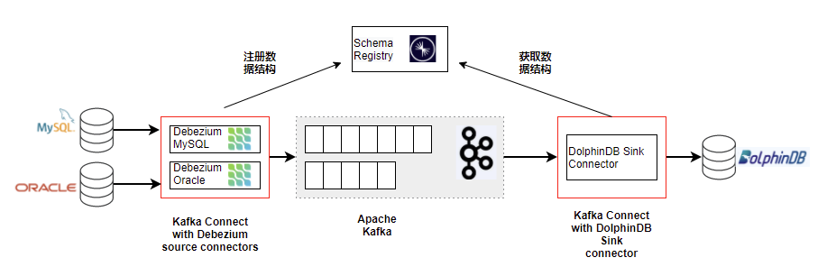

接下来，本文将逐一介绍这些服务的下载、安装，以及配置数据同步任务。

### 部署 Kafka 单实例实时数据存储

基于 Kafka 的整套架构是支持高可用集群的。不过，即使部署单实例的服务，也可以达成数据同步任务。

本文将以单实例存储来进行介绍数据同步。

#### 部署准备

首先下载程序包，Zookeeper（开源）、Kafka（开源）、Confluent（社区版），可以自行到官网下载最新稳定版本。

并将下面 4 个软件包放到 /opt 目录下。（软件、配置、数据路径文件较多。**注意：初次试用请尽量保持路径一致**。）

- **[jdk-17.0.7_linux-x64_bin.tar.gz](https://download.oracle.com/java/17/latest/jdk-17_linux-x64_bin.tar.gz)**
- **[apache-zookeeper-3.7.1-bin.tar.gz](https://zookeeper.apache.org/releases.html)**
- **[kafka_2.13-3.4.1.tgz](https://kafka.apache.org/downloads)（下载 scala 2.13 版本）**
- **[confluent-community-7.4.0.tar.gz](https://www.confluent.io/installation/)** 

Confluent 下载会稍微麻烦点，需要选择 self-managed 然后录入信息，点击 start free 才能下载。注意下载 community 版本即可满足需要，我们只需要里头的 *schema-registry* 包。当然如果需要更好功能，也可以下载正式版，正式版包括了 Zookeeper、Kafka 以及管理、监控 Kafka 的更多功能。Confluent 是 Kafka 相关的商业公司。


以上 4 个程序包下载好之后，我们就可以开始部署了。

#### 部署 Zookeeper 

##### 基础准备

 **第一步：创建部署用户**

创建用户 kafka，授予 sudo 免密权限（需自行设置）。然后切换到 kafka 用户来进行操作（以下均为 kafka 用户操作）。

```
useradd kafka
su kafka
```

 **第二步：安装部署 java 环境**

安装  java 到路径 /opt/java17，整套架构涉及的程序都是基于 java 虚拟机运行的。所以必须安装 java。

```
cd /opt
sudo mkdir -p /usr/local/java
sudo tar -xvf jdk-17.0.7_linux-x64_bin.tar.gz
sudo mv jdk-17.0.7 /usr/local/java/java17
```

设置 java 环境变量（kafka 用户下执行）。         

```
vim ~/.bashrc
# 输入下面代码
JAVA_HOME=/usr/local/java/java17
PATH=$JAVA_HOME/bin:$PATH
export JAVA_HOME PATH

source ~/.bashrc
java --version
```

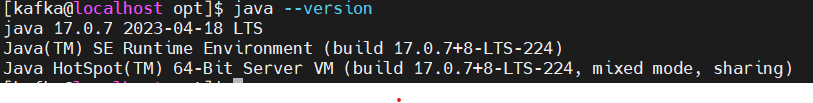

##### 安装 Zookeeper

 **第一步：解压并安装 Zookeeper**

3.7.1 版本的 Zookeeper 用户、组有默认值，这里我们需要调整一下。

```
cd /opt
sudo tar -xvf apache-zookeeper-3.7.1-bin.tar.gz
sudo mv apache-zookeeper-3.7.1-bin zookeeper
sudo chown -R root:root zookeeper
sudo chmod -R 755 zookeeper
```

 **第二步：准备 Zookeeper 的配置文件和存储文件**

创建 zookeeper 的配置文件、数据文件、日志文件的存储路径。请尽量保持路径一致。篇末有打包的全部程序配置文件包。

```
sudo mkdir -p /KFDATA/zookeeper/etc
sudo mkdir -p /KFDATA/zookeeper/data
sudo mkdir -p /KFDATA/zookeeper/datalog
sudo mkdir -p /KFDATA/zookeeper/logs
sudo chown -R kafka:kafka /KFDATA
chmod -R 700 /KFDATA/zookeeper
```

准备 zookeeper 的配置文件 *zoo.cfg*。先从 zookeeper 安装路径下复制 *log4j.properties* 过来，然后进行修改。

说明：zookeeper 的不同版本 *log4j.properties* 配置内容会略有区别。如有不同，请按 log4j 的规则调整。

```
cd /KFDATA/zookeeper/etc
touch zoo.cfg
echo tickTime=2000 > zoo.cfg
echo initLimit=10 >>zoo.cfg
echo syncLimit=5 >>zoo.cfg
echo  dataDir=/KFDATA/zookeeper/data >>zoo.cfg
echo  dataLogDir=/KFDATA/zookeeper/datalog >>zoo.cfg
echo  clientPort=2181 >>zoo.cfg
sudo cp /opt/zookeeper/conf/log4j.properties ./
sudo chown kafka:kafka ./log4j.properties
```

修改 *log4j.properties* 中的 *zookeeper.log.dir* 参数


 **第三步：创建 Zookeeper 的启动文件**

创建一个 *zk.env* ，配置 Zookeeper 启动所需环境变量，用于启动 *service* 文件调用。

```
cd /KFDATA/zookeeper/etc/
touch zk.env
echo JAVA_HOME=/usr/local/java/java17 > zk.env
echo PATH="/usr/local/java/java17/bin:/opt/zookeeper/bin:/usr/local/bin:/bin:/usr/bin:/usr/local/sbin:/usr/sbin" >> zk.env
echo ZOO_LOG_DIR=/KFDATA/zookeeper/logs >> zk.env
echo ZOO_LOG4J_OPTS=\"-Dlog4j.configuration=file:/KFDATA/zookeeper/etc/log4j.properties\" >> zk.env
```

如果对 Zookeeper 很熟练可以自行调用 Zookeeper 安装目录下的 *bin* 文件夹下的操作脚本来进行操作或测试。

使用 `vim` 命令编辑一个 *service* 文件。

```
sudo vim /usr/lib/systemd/system/zookeeper.service
```

录入以下启动命令信息，并保存。

```
[Unit]
Description=Apache Kafka - ZooKeeper
After=network.target

[Service]
Type=forking
User=kafka
Group=kafka
EnvironmentFile=/KFDATA/zookeeper/etc/zk.env
ExecStart=/opt/zookeeper/bin/zkServer.sh start /KFDATA/zookeeper/etc/zoo.cfg
ExecStop=/opt/zookeeper/bin/zkServer.sh stop /KFDATA/zookeeper/etc/zoo.cfg
TimeoutStopSec=180
Restart=no


[Install]
WantedBy=multi-user.target

```

重新加载 service 启动服务。

```
sudo systemctl daemon-reload
```

**第四步：创建测试脚本**

（1）创建连接 Zookeeper 测试文件 *zkCon.sh*。

```
mkdir -p /KFDATA/bin
cd /KFDATA/bin
touch zkCon.sh
echo export JAVA_HOME=/usr/local/java/java17 >zkCon.sh
echo export PATH="{$JAVE_HOME}/bin:/opt/zookeeper/bin:/usr/local/bin:/bin:/usr/bin:/usr/local/sbin:/usr/sbin" >>zkCon.sh
echo export ZOO_LOG_DIR=/KFDATA/zookeeper/logs >>zkCon.sh
echo export ZOO_LOG4J_OPTS=\"-Dlog4j.configuration=file:/KFDATA/zookeeper/etc/log4j.properties\" >>zkCon.sh
echo  '/opt/zookeeper/bin/zkCli.sh -server localhost:2181 -Dzookeeper.config.path=/KFDATA/zookeeper/zoo.cfg' >>zkCon.sh
```

对脚本授予执行权限。

```
chmod +x  zkCon.sh 
```

##### 部署启动 Zookeeper

**第一步：通过 systemctl 工具启动 Zookeeper 服务。**

```
sudo systemctl start zookeeper.service
```

**第二步：查看 Zookeeper 启动情况**

可以通过 `jps` 命令 查看 java 进程， QuorumPeerMain 进程是 Zookeeper 的启动进程。

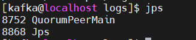

也可以通过 `systemctl` 命令查看，如图即是正常启动。

```
 sudo systemctl status zookeeper
```

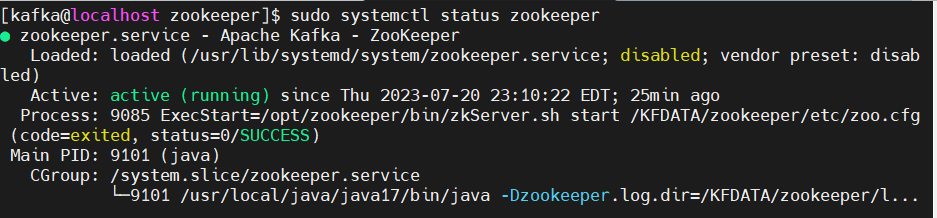

**第三步：通过客户端连接 Zookeeper ，并进行查看。**

```
cd /KFDATA/bin/
./zkCon.sh
# 等待 zookeeper 命令行窗口
ls /
ls /zookeeper 
```

如果返回如下显示，表示 Zookeeper 启动成功，可以在 Zookeeper 中观察到自身的基础信息。


ctrl +c 可以退出 Zookeeper 客户端连接。

#### 部署 Kafka 

##### 安装 Kafka

**第一步：解压安装 Kafka 文件**

执行以下命令，修改一下 Kafka 的安装文件名。

```
cd /opt
sudo tar -xvf kafka_2.13-3.4.1.tgz
sudo mv kafka_2.13-3.4.1 kafka
```

**第二步：准备 Kafka 的配置文件和存储文件**

创建 Kafka 的配置文件、数据文件、日志文件的存储路径。

```
mkdir -p /KFDATA/kafka/etc
mkdir -p /KFDATA/kafka/data
mkdir -p /KFDATA/kafka/logs
```

准备 Kafka 相关配置文件，创建启动配置文件，和日志配置文件。

```
cd /KFDATA/kafka/etc
touch kafka-server.properties
cp /opt/kafka/config/log4j.properties ./
cp /opt/kafka/config/tools-log4j.properties ./
```

修改 [kafka-server.properties](./script/Debezium_and_Kafka_data_sync/kafka-server.properties) 文件中的配置，修改内容较多，文件如下，也可以自行录入。

```
############################# Server Basics #############################
broker.id=1
############################# Socket Server Settings #############################
listeners=PLAINTEXT://0.0.0.0:9092
advertised.listeners=PLAINTEXT://192.168.189.130:9092
num.network.threads=3
num.io.threads=8
socket.send.buffer.bytes=102400
socket.receive.buffer.bytes=102400
socket.request.max.bytes=104857600
############################# Log Basics #############################
log.dirs=/KFDATA/kafka/data
num.partitions=1
num.recovery.threads.per.data.dir=1
############################# Internal Topic Settings  #############################
offsets.topic.replication.factor=1
transaction.state.log.replication.factor=1
transaction.state.log.min.isr=1
############################# Log Retention Policy #############################
log.retention.hours=-1
log.retention.bytes=21474836480 
log.segment.bytes=1073741824
log.retention.check.interval.ms=300000
auto.create.topics.enable=true
############################# Zookeeper #############################
zookeeper.connect=192.168.189.130:2181
# Timeout in ms for connecting to zookeeper
zookeeper.connection.timeout.ms=12000
############################# Group Coordinator Settings #############################
group.initial.rebalance.delay.ms=0
############################# message Settings #############################
message.max.byte=5242880
```

其中以下两项需要视具体环境修改，advertise.listeners 是对外监听端口。

```
advertised.listeners=PLAINTEXT://192.168.189.130:9092
zookeeper.connect=192.168.189.130:2181
```

**第三步：准备 Kafka 的启动文件**

创建 Kafka 启动的环境变量文件，这里配置了开启 JMX 监控端口，如果不需要，可以忽略后两项配置。

JMX 端口的作用是可以通过此端口连接，获取一些监控指标。

```
cd /KFDATA/kafka/etc
touch kf-server.env

echo PATH="/usr/local/java/java17/bin:/opt/zookeeper/bin:/opt/kafka:/usr/local/bin:/bin:/usr/bin:/usr/local/sbin:/usr/sbin" >>kf-server.env
echo LOG_DIR="/KFDATA/kafka/logs/" >>kf-server.env
echo KAFKA_LOG4J_OPTS=\"-Dlog4j.configuration=file:/KFDATA/kafka/etc/log4j.properties\" >>kf-server.env
echo KAFKA_JMX_OPTS=\"-Dcom.sun.management.jmxremote=true -Dcom.sun.management.jmxremote.authenticate=false -Dcom.sun.management.jmxremote.ssl=false -Djava.rmi.server.hostname=192.168.189.130 -Djava.net.preferIPv4Stack=true\" >>kf-server.env
echo JMX_PORT=29999 >>kf-server.env
```

创建 Kafka 的 *systemd service* 文件，`vim` 打开一个文件。

```
sudo vim /usr/lib/systemd/system/kafka-server.service
```

录入以下内容，并保存。

```
[Unit]
Description=Apache Kafka - broker
After=network.target confluent-zookeeper.target

[Service]
Type=forking
User=kafka
Group=kafka
EnvironmentFile=/KFDATA/kafka/etc/kf-server.env
ExecStart=/opt/kafka/bin/kafka-server-start.sh -daemon /KFDATA/kafka/etc/kafka-server.properties
ExecStop=/KFDATA/kafka/bin/kafka-server-stop.sh
LimitNOFILE=1000000
TimeoutStopSec=180
Restart=no

[Install]
WantedBy=multi-user.target
```

重新加载 service 启动服务。

```
sudo systemctl daemon-reload
```

##### 部署启动 Kafka

**第一步：通过 systemctl 工具启动 Kafka 服务**

执行下述命令启动 Kafka 服务：

```
sudo systemctl start kafka-server.service
```

**第二步：查看 Kafka 启动情况**

检查 Kafka 启动情况，可以连接 Zookeeper 客户端 。查看 zookeeper 中的数据。

```
cd /KFDATA/bin
./zkCon.sh
ls /
```

可以看到 Zookeeper 中已经多了一些 kafka 注册信息，如 brokers、cluseter、config、controller 等。

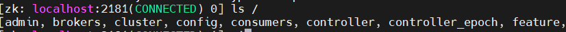

此时，可以测试创建一个 topic 进行测试：

```
cd  /opt/kafka/bin
./kafka-topics.sh --bootstrap-server 192.168.189.130:9092 --create --topic test110
```

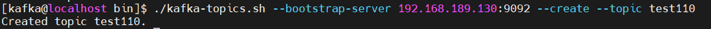

执行下述代码，查看当前 Kafka 中 topic 列表：

```
./kafka-topics.sh --bootstrap-server 192.168.189.130:9092 --list
```

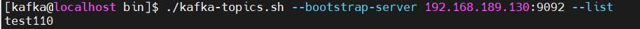

如果返回上述图片显示内容，说明 Kafka 已经启动成功。

#### 部署 Schema-Registry

Schema-Registry 是用于注册传输数据的数据结构的。并记录数据结构改变的每一个版本。数据写入 Kafka 和从 Kafka 中读出都需要 schema-registry 中记录的数据结构来进行序列化和反序列化。通过使用 schema-registry 来注册数据结构。Kafka 中只需保存序列化后的数据即可。可以减少数据的空间占用。

##### 安装 Schema-Registry

**第一步：解压安装 Schema-Registry 文件**

Schema-Registry 程序是 confluent 程序包中一部分。所以这里我们要安装 conluent，社区版本即可。解压缩 *confluent-community-7.4.0.tar.gz*，并修改文件名，设置隶属组。

```
cd /opt
sudo tar -xvf confluent-community-7.4.0.tar.gz
sudo mv confluent-7.4.0 confluent
sudo chown -R root:root confluent
sudo chmod -R 755 confluent
```

**第二步：准备 Schema-Registry 的配置文件和存储文件**

创建 schema-registry 的配置、日志文件存储路径。

```
mkdir -p /KFDATA/schema-registry/etc
mkdir -p /KFDATA/schema-registry/logs
```

准备 schema-registry 的配置文件。

```
cd /KFDATA/schema-registry/etc
cp /opt/confluent/etc/schema-registry/schema-registry.properties ./
cp /opt/confluent/etc/schema-registry/log4j.properties ./
```

修改 *schema-registry.properties* 文件，修改连接的 Kafka Server 地址。

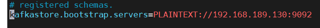

**第三步：准备 Schema-Registry 的启动文件**

创建 Schema-Registry 启动环境变量文件，用于 Schema-Registry 启动时使用。

```
touch schema-registry.env
echo PATH="/usr/local/java/java17/bin:/opt/confluent/bin:/usr/local/bin:/bin:/usr/bin:/usr/local/sbin:/usr/sbin" >schema-registry.env
echo LOG_DIR="/KFDATA/schema-registry/logs" >>schema-registry.env
echo LOG4J_DIR="/KFDATA/schema-registry/etc/log4j.properties" >>schema-registry.env
echo SCHEMA_REGISTRY_LOG4J_OPTS=\"-Dlog4j.configuration=file:/KFDATA/schema-registry/etc/log4j.properties\" >>schema-registry.env
```

创建 Schema-Registry 的 systemd service 启动文件。

```
sudo vim /usr/lib/systemd/system/schema-registry.service
```

录入以下内容并保存。

```
[Unit]
Description=RESTful Avro schema registry for Apache Kafka
After=network.target

[Service]
Type=forking
User=kafka
Group=kafka
EnvironmentFile=/KFDATA/schema-registry/etc/schema-registry.env
ExecStart=/opt/confluent/bin/schema-registry-start -daemon /KFDATA/schema-registry/etc/schema-registry.properties
TimeoutStopSec=180
Restart=no

[Install]
WantedBy=multi-user.target
```

重新加载 service 启动服务。

```
sudo systemctl daemon-reload
```

##### 部署启动 Schema-Registry

**第一步：通过 systemctl 工具启动 Schema-Registry 服务**

执行以下命令

```
sudo systemctl start schema-registry
```

**第二步：查看 Schema-Registry 启动情况**

通过 systemctl 工具查看启动状态。

```
sudo systemctl status schema-registry
```

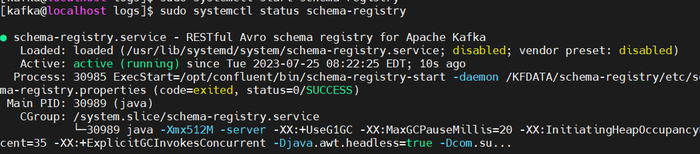

查看 Kafka 中的 topic 

```
cd /opt/kafka/bin
./kafka-topics.sh --bootstrap-server 192.168.189.130:9092 --list
```

可以看到 kafka 中已经创建出了 schema-registry 需要使用的 topic

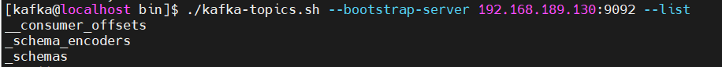

schema-registry 启动成功。

#### 部署 Kafka-Connect 

Kafka-Connect 是 Kafka 提供的 HA 框架，实现了 Kafka-Connect 接口的 connector（连接器），只需处理自己需要进行读取、写入数据任务。高可用部分由 kafka-connect 框架负责。

Kafka-Connect 可用通过 rest api 进行访问。

##### 安装 Kafka-Connect 

**第一步：Kafka-Connect 安装**

Kafka-Connect 由 Kafka 提供，启动程序在 Kafka 的安装路径下，已经存在。数据元数据注册由 schema-registry 处理。相应的序列化包在已安装 Confluent 路径下。故无需再安装程序包。

**第二步：准备 Kafka-Connect 的配置文件和存储文件**

创建 Kafka-Connect 的配置、日志文件存储路径

```
mkdir -p /KFDATA/kafka-connect/etc
mkdir -p /KFDATA/kafka-connect/logs
```

创建 Kafka-Connect 的配置文件 

```
cd /KFDATA/kafka-connect/etc
vim kafka-connect.properties
```

录入以下内容并保存。 ip 地址部分，需要视当前环境修改。

```
bootstrap.servers=192.168.189.130:9092
group.id=connect-cluster

key.converter=io.confluent.connect.avro.AvroConverter
key.converter.schema.registry.url=http://192.168.189.130:8081
value.converter=io.confluent.connect.avro.AvroConverter
value.converter.schema.registry.url=http://192.168.189.130:8081
key.converter.schemas.enable=true
value.converter.schemas.enable=true

internal.key.converter=org.apache.kafka.connect.json.JsonConverter
internal.value.converter=org.apache.kafka.connect.json.JsonConverter
internal.key.converter.schemas.enable=false
internal.value.converter.schemas.enable=false

config.storage.topic=connect-configs
offset.storage.topic=connect-offsets
status.storage.topic=connect-statuses
config.storage.replication.factor=1
offset.storage.replication.factor=1
status.storage.replication.factor=1

plugin.path=/opt/confluent/share/java/plugin
rest.host.name=192.168.189.130
rest.port=8083
rest.advertised.host.name=192.168.189.130
rest.advertised.port=8083

offset.flush.timeout.ms=50000
offset.flush.interval.ms=10000
send.buffer.bytes=13107200
consumer.max.poll.records=10000
consumer.partition.assignment.strategy=org.apache.kafka.clients.consumer.CooperativeStickyAssignor
```

创建 Kafka-Connect 的 log4j 配置文件。

```
cd /KFDATA/kafka-connect/etc
cp /opt/kafka/config/connect-log4j.properties ./log4j.properties
```

修改文件中的以下参数配置

```
vim ./log4j.properties
log4j.appender.connectAppender.File=${kafka.logs.dir}/connect.log
```

将其修改为

```
log4j.appender.connectAppender.File=/KFDATA/kafka-connect/logs/connect.log
```

**第三步：准备 Kafka-Connect 的启动文件**

创建 Kafka-Connect 启动环境变量文件。

```
cd /KFDATA/kafka-connect/etc
touch kafka-connect.env

echo PATH="/usr/local/java/java17/bin:/usr/local/bin:/bin:/usr/bin:/usr/local/sbin:/usr/sbin" >kafka-connect.env
echo LOG_DIR="/KFDATA/kafka-connect/logs/" >>kafka-connect.env
echo LOG4J_DIR="/KFDATA/kafka-connect/etc/log4j.properties" >>kafka-connect.env
echo KAFKA_LOG4J_OPTS=\"-Dlog4j.configuration=file:/KFDATA/kafka-connect/etc/log4j.properties\" >>kafka-connect.env
echo CLASSPATH=/opt/confluent/share/java/schema-registry/*:/opt/confluent/share/java/kafka-serde-tools/*:/opt/confluent/share/java/confluent-common/* >>kafka-connect.env
echo JMX_PORT=29998 >>kafka-connect.env
```

创建 Kafka-Connect 的 systemd service 文件

```
sudo vim /usr/lib/systemd/system/kafka-connect.service
```

录入以下内容，并保存。

```
[Unit]
Description=Apache Kafka Connect - distributed
After=network.target

[Service]
Type=simple
User=kafka
Group=kafka
EnvironmentFile=/KFDATA/kafka-connect/etc/kafka-connect.env
ExecStart=/opt/kafka/bin/connect-distributed.sh /KFDATA/kafka-connect/etc/kafka-connect.properties
TimeoutStopSec=180
Restart=no

[Install]
WantedBy=multi-user.target
```

重新加载 service 启动服务。

```
sudo systemctl daemon-reload
```

##### 部署启动 Kafka-Connect

**第一步：通过 systemctl 工具启动 Kafka-Connect 服务**

执行以下命令

```
sudo systemctl start kafka-connect.service
```

**第二步：查看 Kafka-Connect 启动情况**

通过 `jps` 命令查看启动情况

```
jps -mlvV |grep connect
```

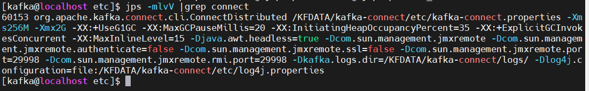

查看 Kafka 中的 topic 情况，Kafka-Connect 会在 Kafka 中创建 connect-configs 、connect-offsets、connect-statuses 三个 topic。

```
cd  /opt/kafka/bin
./kafka-topics.sh --bootstrap-server 192.168.189.130:9092 --list
```


使用 `curl`  命令访问 kafka-connect，可以看到当前我们还没有配置 connector 任务

```
 curl -H "Accept:application/json" 192.168.189.130:8083/connectors/
```

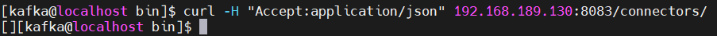

### 部署 MySQL 数据同步到 Kafka 

MySQL 的数据同步包括初始全量同步和 CDC 实时增量同步。

全量同步：将所选表的全部数据以 Insert 的方式写入 kafka，建议此时不要对数据库进行操作。

CDC 实时增量同步：从全量同步时记录的事务顺序号，实时读取 MySQL 的 *binlog* 日志，写入增量数据到 Kafka。

#### 安装 Debezium-MySQL 连接器插件

配置启动 Debezium-MySQL 连接器，需要以下两步：

1. 下载、安装 Debezium-MySQL 插件，并将插件路径配置到 Kafka Connect 配置文件中。

2. 重新启动 Kafka Connect 程序，以加载插件。

**第一步：下载安装 Debezium-MySQL 插件**

官方网站 [Debezium](https://debezium.io/) ，选择最新稳定版本进行下载。

选择 MySQL Connector Plug-in

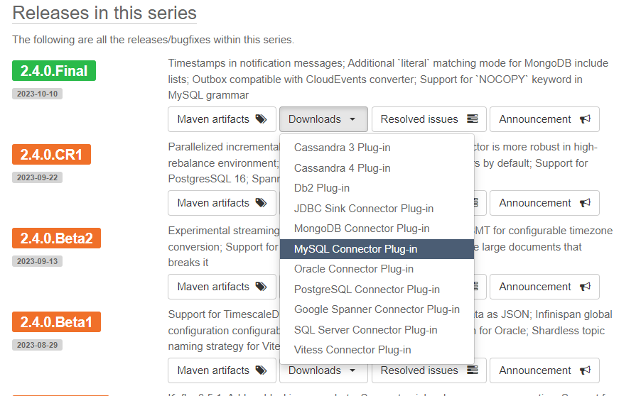

创建插件路径（部署 kafka，kafka-connnect 环境的 kafka 用户），在此路径下解压 Debezium 的 MySQL 插件包

```
sudo mkdir -p /opt/confluent/share/java/plugin
cd /opt/confluent/share/java/plugin
sudo tar -xvf debezium-connector-mysql-2.3.2.Final-plugin.tar.gz
rm ./debezium-connector-mysql-2.3.2.Final-plugin.tar.gz
```

**第二步：配置 Kafka-Connect 加载插件**

修改 Kafka Connect 的配置文件，添加插件路径配置

```
cd /KFDATA/kafka-connect/etc
vim kafka-connect.properties
```

添加或修改参数 *plugin.path* 如下

```
plugin.path=/opt/confluent/share/java/plugin
```

重新启动 Kafka Connect

```
sudo systemctl stop kafka-connect
sudo systemctl start kafka-connect
```

查看日志输出， 如下图所示，则插件加载成功。

```
cat /KFDATA/kafka-connect/logs/connect.log|grep mysql
```

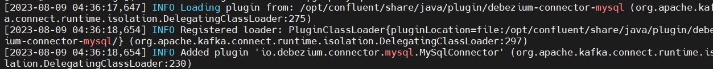

#### 配置 MySQL 数据库

做为 Source 数据库，我们基于 MySQL 的 *binlog* 来获取实时的增量数据，所以需要对 MySQL 数据库做一些设置。

**第一步：创建数据同步用的 MySQL 用户**

Debezium MySQL 连接器需要 MySQL 用户帐户。此 MySQL 用户必须对 Debezium MySQL 连接器捕获更改的所有数据库拥有适当的权限。

```
CREATE USER 'datasyn'@'%' IDENTIFIED BY '1234';
```

授予权限。

```
GRANT SELECT, RELOAD, SHOW DATABASES, REPLICATION SLAVE, REPLICATION CLIENT ON *.* TO 'datasyn';
```

刷新授权表。

```
FLUSH PRIVILEGES;
```

**第二步：设置 MySQL 参数**

进行 CDC 同步，需要对 MySQL 数据库进行一些设置。

| **参数**                 | **值**    | **说明**                                                     |
| :----------------------- | :-------- | :----------------------------------------------------------- |
| server-id                | 1         | MySQL 集群中用于标识一个 MySQL 服务器实例。可以自行调整设置。  |
| log-bin                  | mysql-bin | 设置启用二进制日志功能，并指定日志文件名及存储位置。可自行调整设置。 |
| binlog_format            | ROW       | 必须 *binlog-format* 设置为 ROW 或 row。 连接 MySQL 级联复制实例时，链路内每个实例环节都要设置。 |
| binlog_row_image         | FULL      | 必须 *binlog_row_image* 设置为 FULL 或 full 。连接 MySQL 级联复制实例时，链路内每个级联实例环节都要设置。 |
| gtid_mode                | ON        | 设置开启全局事务标识                                         |
| enforce_gtid_consistency | ON        | 设置强制执行 GTID 一致性                                       |
| expire_logs_days         | 3         | 设置 MySQL 日志保留时间，MySQL 的 CDC 数据同步需要有对应日志文件才能进行同步。推荐至少设置保留3天。 |
| binlog_row_value_options | ““        | **<font color=red>此变量不能设置为 PARTIAL_JSON</font>**                            |

参数参考代码：

```
[mysqld]
server-id = 1

log_bin=mysql-bin
binlog_format=ROW
binlog_row_image=FULL
binlog_row_value_options=""

gtid_mode=ON
enforce_gtid_consistency=ON

expire_logs_days=3
```

#### 配置 MySQL 数据同步连接任务

配置同步任务的及检查的很多命令都要带上 *url* 等参数。为了操作快捷，封装了一些加载配置文件的操作脚本，[kafka-tools.tar](./script/Debezium_and_Kafka_data_sync/kafka-tools.tar) 。下载当前包，解压缩到 /KFDATA 目录下 。后续的很多操作，检查 Kafka 的 topic，查看数据。配置同步任务等都会使用 kafka-tools 包中的脚本。请务必配置。包中的脚本都可以无参数运行，会输出 help。

```
cd /KFDATA
sudo tar -xvf kafka-tools.tar
sudo chown kafka:kafka kafka-tools
rm ./kafka-tools.tar
```

修改 kafka-tools/config/config.properties 配置参数。

按照本机的路径、IP 等对应修改 Kafka、Kafka_Connect 的启动 IP 地址，以及安装目录。

##### 准备MySQL 数据库表

**第一步：创建一个数据库**

```
create database basicinfo;
```

**第二步：创建两张表，并插入一些数据**

创建表1 *index_components*，主键字段 4 个。

```
use basicinfo;
CREATE TABLE `index_components` (
  `trade_date` timestamp NOT NULL DEFAULT CURRENT_TIMESTAMP,
  `code` varchar(20) NOT NULL,
  `effDate` timestamp NOT NULL DEFAULT CURRENT_TIMESTAMP,
  `indexShortName` varchar(20) CHARACTER SET utf8mb3 COLLATE utf8mb3_general_ci DEFAULT NULL,
  `indexCode` varchar(20) NOT NULL,
  `secShortName` varchar(20) CHARACTER SET utf8mb3 COLLATE utf8mb3_general_ci DEFAULT NULL,
  `exchangeCD` varchar(4) CHARACTER SET utf8mb3 COLLATE utf8mb3_general_ci DEFAULT NULL,
  `weight` decimal(26,6) DEFAULT NULL,
  `timestamp` timestamp NOT NULL DEFAULT CURRENT_TIMESTAMP ON UPDATE CURRENT_TIMESTAMP,
  `flag` int NOT NULL DEFAULT '1',
  PRIMARY KEY `index_components_pkey` (`trade_date`,`code`,`indexCode`,`flag`)
)ENGINE=InnoDB DEFAULT CHARSET=utf8mb4; 
```

插入 4 条 数据

```
insert into index_components (trade_date,code,effdate,indexShortName,indexCode,secShortName,exchangeCD,weight,timestamp,flag)
values('2006-11-30','000759','2018-06-30 03:48:05','中证500','000905','中百集团','XSHE',0.0044,'2018-06-30 05:43:05',1),
('2006-11-30','000759','2018-06-30 04:47:05','中证500','000906','中百集团','XSHE',0.0011,'2018-06-30 05:48:06',1),
('2006-11-30','600031','2018-06-30 05:48:05','上证180','000010','三一重工','XSHG',0.0043,'2018-06-30 05:48:05',1),
('2006-11-30','600031','2018-06-30 06:48:02','沪深300','000300','三一重工','XSHG',0.0029,'2018-06-30 05:48:05',1);
```

创建表2  *stock_basic* ，主键字段 2 个。

```
CREATE TABLE `stock_basic` (
  `id` bigint NOT NULL ,
  `ts_code` varchar(20) NOT NULL,
  `symbol` varchar(20) DEFAULT NULL,
  `name` varchar(20) DEFAULT NULL,
  `area` varchar(20) DEFAULT NULL,
  `industry` varchar(40) DEFAULT NULL,
  `list_date` date DEFAULT NULL,
  PRIMARY KEY (`id`,`ts_code`)
) ENGINE=InnoDB DEFAULT CHARSET=utf8mb4;
```

插入 3 条数据 ；

```
insert into stock_basic(id,ts_code,symbol,name,area,industry,list_date)
values (1,'000001.SZ','000001','平安银行','深圳','银行','1991-04-03'),
(2,'000002.SZ','000002','万科A','深圳','地产','1991-01-29'),
(3,'000004.SZ','000004','ST国华','深圳','软件服务','1991-01-14')
```

##### 准备连接器配置文件，并启动连接任务

**第一步：准备 MySQL 同步任务配置文件**

创建连接 MySQL 的 source 连接器配置文件。

```
mkdir /KFDATA/datasyn-config
cd /KFDATA/datasyn-config
vim source-mysql.json
```

录入以下配置 ，hostname 和 kafka 启动地址需对应修改。

```
{
    "name": "basicinfo-connector",
    "config":{
        "connector.class": "io.debezium.connector.mysql.MySqlConnector",
        "tasks.max": "1",
        "topic.prefix":"mysqlserver",
        "database.hostname": "192.168.189.130",
        "database.port": "3306",
        "database.user": "datasyn",
        "database.password": "1234",
        "database.server.id": "2223314",
        "database.include.list": "basicinfo",
        "schema.history.internal.kafka.bootstrap.servers": "192.168.189.130:9092",
        "schema.history.internal.kafka.topic": "schema-changes.basicinfo",
        "heartbeat.interval.ms":"20000"
    }
}
```

参数说明：以上参数为必填参数。更多详细参数说明可以参看
[Debezium connector for MySQL :: Debezium Documentation](https://debezium.io/documentation/reference/2.3/connectors/mysql.html#mysql-connector-properties) 

| **参数名称**                                           | **默认值** | **参数说明**                                                 |
| :----------------------------------------------------- | :--------- | :----------------------------------------------------------- |
| connector.class                                        | 无         | 连接器的 Java 类的名称。这里是 mysql 的连接器类名。              |
| tasks.max                                              | 1          | 当前 connector 的最大并行任务数。mysql 的 source 连接器任务数只能是 1。 |
| topic.prefix                                           | 无         | 当前 connector 同步写入任务的命名空间。会被用于添加到同步表对应 topic 名称前等 |
| database.hostname                                      | 无         | MySQL 数据库服务器的 IP 地址或主机名。                          |
| database.port                                          | 3306       | MySQL 数据库服务器的整数端口号。                              |
| database.user                                          | 无         | MySQL 数据库服务器连接用户。                                  |
| database.password                                      | 无         | MySQL 数据库服务器连接用户密码。                              |
| database.server.id                                     | 无         | 用来模拟 MySQL 隶属进程的进程号。同步程序会以此数字 ID 加入 MySQL 集群。 |
| database.influde.list                                  | 无         | 匹配的数据库名。可以多个，用逗号分割即可。                   |
| schema.history.internal.kafka.bootstrap.servers        | 无         | 数据同步记录 MySQL 的表结构信息的 kafka 连接                   |
| schema.history.internal.kafka.topic                    | 无         | 数据同步记录 MySQL 表结构的 topic 名称                       |
| [heartbeat.interval.ms](http://heartbeat.interval.ms/) | 0          | 当接到 MySQL 更改事件时，保证触发记录 *binlog* 事务位置或者 gtid 的间隔事件。（如果此值为 0 时，接收到不属于数据同步表的改变事件时，不会记录事务位置，可能导致当前记录的同步事务号大幅度落后 MySQL 的最新事务号）。 |

**第二步：启动 MySQL 的数据同步任务**

通过 rest api 启动 MySQL 的 source 连接器

```
curl -i -X POST -H "Accept:application/json" -H  "Content-Type:application/json" http://192.168.189.130:8083/connectors/ -d @/KFDATA/datasyn-config/source-mysql.json
```

也可以通过我们提供 kafka-tools 中的脚本启动，操作能简单一些

```
cd /KFDATA/kafka-tools/bin
./rest.sh create @/KFDATA/datasyn-config/source-mysql.json
```

**第三步：查看 MySQL 数据同步任务状态**

查看同步任务列表。*list* 参数展示任务名列表，*showall* 参数会显示全部同步任务状态。

```
./rest.sh list
./rest.sh showall
```

通过下图可以看到，connector 和 task 的状态都是 RUNNING，当前同步任务状态正常。

说明：每个同步任务会有一个 connector，可以多个 task。

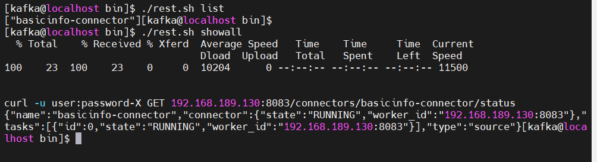

使用 kafka-tools 的脚本 *kafka.sh* 查看 kafka 中的 topic 

```
cd /KFDATA/kafka-tools/bin
./kafka.sh tplist|grep mysqlserver
```

下图中的 topic [mysqlserver.basicinfo.index_components] 即为我们的表 *basicinfo.index_components* 数据在 kafka 中的存储

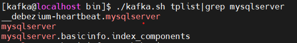

查看 topic  [mysqlserver.basicinfo.index_components] 中的数据条数。

```
./kafka.sh get_offsets mysqlserver.basicinfo.index_components
```

kafka 中已经同步了 MySQL 表 *basicinfo.index_components* 的 4 条数据。

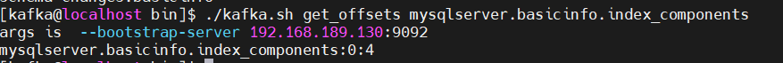

说明： 在同步 MySQL 的初始快照数据时，不能中断。否则必须清理全部已同步数据，重新开始。即初始快照数据不支持断点续传。

### 部署 Kafka 数据同步到 DolphinDB

#### 安装 Kafka-DolphinDB 连接器

配置启动 Kafka-DolphinDB 连接器插件，需要以下两步：

1. 安装 Kafka-DolphinDB 插件，并将插件路径配置到 Kafka Connect 配置文件中。
2. 重新启动 Kafka Connect 程序，以加载插件。

**第一步：下载 Kafka-DolphinDB 插件**

- [jdbc-1.30.22.4-ddbsync.Beta1.jar](./plugin/Debezium_and_Kafka_data_sync/jdbc-1.30.22.4-ddbsync.Beta1.jar)：该 DolphinDB JDBC 包为数据同步做了一些专门修改，后续会同步到主分支上。
- [kafka-connect-jdbc-10.7.4-ddb1.01.Beta1.jar](./plugin/Debezium_and_Kafka_data_sync/kafka-connect-jdbc-10.7.4-ddb1.01.Beta1.jar)：基于 kafka-connect-jdbc-10.7.4 开发，添加了 DolphinDB 连接器。

创建插件路径（部署 Kafka，Kafka-Connnect 环境的 kafka 用户），在此路径下放置 Kafka-DolphinDB 插件包，上面两个包都要放到此目录下。

```
sudo mkdir -p /opt/confluent/share/java/plugin/kafka-connect-jdbc
```

**第二步：配置 Kafka-Connect 加载插件**

Kafka-DolphinDB 插件包的父路径与前文 Debezium-MySQL 连接器插件路径均为 /opt/confluent/share/java/plugin/，因此无需再次配置到 Kafka-Connect 的配置文件中。

如果路径不一致，可以在 *kafka-connect.properties* 中的 *plugin.path* 参数里配置，以逗号分隔。

查看 *plugin.path* 参数配置：

```
cat /KFDATA/kafka-connect/etc/kafka-connect.properties |grep plugin
```

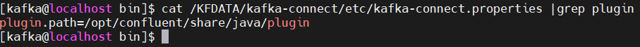

重新启动 Kafka Connect：

```
sudo systemctl stop kafka-connect
sudo systemctl start kafka-connect
```

查看日志输出

```
cat /KFDATA/kafka-connect/logs/connect.log|grep JdbcSinkConnector
```

出现下图中所示信息时，说明插件加载成功。

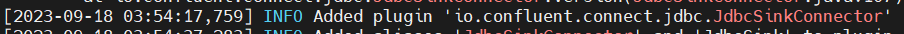

#### DolphinDB 的数据同步准备

**第一步：创建同步的库、表**

要求：当前支持数据同步，需要依赖 TSDB 引擎的 *keepDuplicates* = LAST 数据来保证数据写入的幂等性，即发生数据重复时，两次及以上的相同增量数据写入，不影响数据的一致性。所以需要满足以下条件：

1. DolphinDB 的表必须是 TSDB 引擎且设置 *keepDuplicates* = LAST。
2. TSDB 引擎目前不支持单字段 *sortColumn* 设置 *keepDuplicates* = LAST，所以同步的 MySQL 目标表主键必 须是 2个及以上字段。
3. *sortColumn* 最后的字段必须是时间或者数字。对应的 MySQL 目标表主键字段必须包含时间或数字。

分别创建之前 MySQL 中两张表的对应表：

1. 创建 MySQL 表 *basicinfo.index_components* 的DolphinDB 对应分布式表 [*dfs://index_data*].[*index_components*]

```
def createIndexComDB(dbName){
	if(existsDatabase(dbName)){
	dropDatabase(dbName)
	}
	database(directory=dbName, partitionType=RANGE, partitionScheme= 1999.01M + (0..26)*12,engine="TSDB")
}
def createIndexCom(dbName,tbName){
	db=database(dbName)
             if(existsTable(dbName, tbName)){
                   db.dropTable(tbName)	
	}
	mtable=table(100:0, `trade_date`code`effDate`indexShortName`indexCode`secShortName`exchangeCD`weight`timestamp`flag, [TIMESTAMP,SYMBOL,TIMESTAMP,SYMBOL,SYMBOL,SYMBOL,SYMBOL,DOUBLE,TIMESTAMP,INT]);
	db.createPartitionedTable(table=mtable, tableName=tbName, partitionColumns=`trade_date,sortColumns=`code`indexCode`flag`trade_date,compressMethods={trade_date:"delta"},keepDuplicates=LAST)
}
createIndexComDB("dfs://index_data")
createIndexCom("dfs://index_data",`index_components)
```

2. 创建 MySQL 表 *basicinfo.stock_basic* 的 DolphinDB 对应分布式表 [*dfs://wddb*].[*stock_basic*]

```
def createStockBasicDB(dbName){
	if(existsDatabase(dbName)){
	dropDatabase(dbName)
	}
	db=database(directory=dbName, partitionType=HASH, partitionScheme=[LONG, 1],engine="TSDB")
}
def createStockBasic(dbName,tbName){
	db=database(dbName)
             if(existsTable(dbName, tbName)){
                   db.dropTable(tbName)	
	}
             mtable=table(100:5, `id`ts_code`symbol`name`area`industry`list_date, [LONG,SYMBOL,SYMBOL,SYMBOL,SYMBOL,SYMBOL,DATE]);
	 db.createPartitionedTable(table=mtable, tableName=tbName, partitionColumns=`id,sortColumns=`ts_code`id,keepDuplicates=LAST,sortKeyMappingFunction=[hashBucket{,100}])
}
createStockBasicDB("dfs://wddb")
createStockBasic("dfs://wddb", `stock_basic)
```

**第二步：配置同步配置表**

DolphinDB 做为数据的接收端，本身无需做数据库上的额外设置，按正常使用配置即可。但由于 DolphinDB 中的数据存储表通常以分布式表为主，且分布式表是按照分区规则放置在不同的库名下，不同库名下的表是支持重名的。所以需要提供对于 DolphinDB 中表的同步配置信息。

1. 在 DolphinDB 中创建一张配置表。库、表名可在后续操作中调整，但是表中字段名要保持一致。

- 数据库名：*dfs://ddb_sync_config*
- 表名：*sync_config*

```
dbName = "dfs://ddb_sync_config"
if(existsDatabase(dbName)){
    dropDatabase(dbName)
}
db=database(dbName, HASH, [SYMBOL, 5])

if(existsTable(dbName, "sync_config"))
    db.dropTable("sync_config")
mtable=table(100:0, `connector_name`topic_name`target_db`target_tab, [SYMBOL,SYMBOL,SYMBOL,SYMBOL]);
db.createTable(table=mtable, tableName="sync_config")
```

2. 插入配置表信息，配置 MySQL 表 *basicinfo.index_components* 和 *basicinfo.stock_basic* 对应的 kafka 中 topic 名称对应的 DolphinDB 分布式表

```
sync_config=loadTable("dfs://ddb_sync_config","sync_config");
tmp_tab=table(100:0,`connector_name`topic_name`target_db`target_tab, [SYMBOL,SYMBOL,SYMBOL,SYMBOL]);
insert into tmp_tab (connector_name,topic_name,target_db,target_tab) values ("ddb-sink","mysqlserver.basicinfo.index_components","dfs://index_data","index_components");
insert into tmp_tab (connector_name,topic_name,target_db,target_tab) values ("ddb-sink","mysqlserver.basicinfo.stock_basic","dfs://wddb","stock_basic");
sync_config.append!(tmp_tab);
```

表中数据如下：

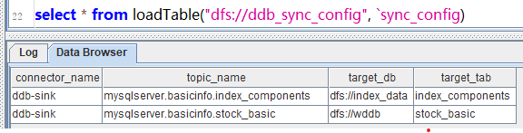

**注意**：对于同一个 connector_name，相同的 *topic_name* 只能配置一条数据。配置分布式库、表必须在 DolphinDB 书库中存在。

| **字段名**     | **类型** | **字段作用**                     |
| :------------- | :------- | :------------------------------- |
| connector_name | Symbol   | 配置的 DolphinDB sink 同步任务名 |
| topic_name     | Symbol   | 要同步的 kafka topic 名称        |
| target_db      | Symbol   | 对应的 DolphinDB 分布式库名      |
| target_tab     | Symbol   | 对应的 DolphinDB 分布式表名      |

#### 配置 DolphinDB 的数据同步连接任务

##### 准备连接器配置文件，并启动连接任务

创建 DolphinDB 数据同步任务配置文件

```
cd /KFDATA/datasyn-config
vim ddb-sink.json
```

配置如下：

```
{
    "name": "ddb-sink",
    "config": {
        "connector.class": "io.confluent.connect.jdbc.JdbcSinkConnector",
        "tasks.max": "2",
        "topics": "mysqlserver.basicinfo.index_components,mysqlserver.basicinfo.stock_basic",
        "connection.url": "jdbc:dolphindb://192.168.189.130:8848?user=admin&password=123456",
        "transforms": "unwrap",
        "transforms.unwrap.type": "io.debezium.transforms.ExtractNewRecordState",
        "transforms.unwrap.drop.tombstones": "false",
        "auto.evolve": "false",
        "insert.mode": "insert",
        "delete.enabled": "true",
        "batch.size":"10000",
        "pk.mode": "record_key",
        "ddbsync.config.table":"dfs://ddb_sync_config,sync_config"
    }
}
```

参数说明：以上参数项为同步 DolphinDB 所需参数。如果对 Confluent 的 JDBC Sink Connect 有经验，可适当调节。

| **参数名称**                      | **默认值**                         | **参数说明**                                                 |
| :-------------------------------- | :--------------------------------- | :----------------------------------------------------------- |
| name                              | 无                                 | 同步任务名称，不可重复。                                     |
| connector.class                   | 无                                 | 连接器的 Java 类的名称。这里是 JdbcSink 的通用连接器类名。     |
| tasks.max                         | 1                                  | 当前 connector 的最大并行任务数。可以调节增大，会创建多 consumer 并行消费读取 Kafka 中数据。一般的数据同步场景设置到 10 基本可以满足同步速度上的需求。 |
| topics                            | 无                                 | 配置要同步的 Kafka 中的 topic 名称，配置多个 topic 时用逗号分割。 |
| connection.url                    | 无                                 | MySQL 数据库服务器的 IP 地址或主机名。                          |
| transforms                        | 无                                 | 声明数据转换操作。                                           |
| transforms.unwrap.type            | 无                                 | 声明数据转换器类别。请保持不变。                            |
| transforms.unwrap.drop.tombstones | false                              | 声明是否删除 Kafka 中的墓碑数据。                            |
| auto.evolve                       | true                               | 当 DolphinDB 中缺少列时，是否自动增加列。当前不支持自动增加列，必须配置为 false。 |
| insert.mode                       | insert                             | 数据插入模式。当前只支持 insert 模式。                       |
| pk.mode                           | none                               | 主键模式。必须设置为 record_key。                            |
| delete.enabled                    | false                              | 在主键模式为 record_key 情况下。对于 null 值 record 是否按照 delete 进行操作。 |
| batch.size                        | 3000                               | 设置在数据量足够大时。以每批最大多少条来写入到目标数据库。注意：当该值大于 Connect worker 中设置的 *consumer.max.pol.records* 时，每次提交数量会受 *consumer.max.pol.records* 的值限制。 |
| ddbsync.config.table              | dfs://ddb_sync_config, sync_config | Kafka 中的 topic 对应 DolphinDB 表的配置表名称。可以自行定义库、表名称。但表中的字段要保持一致。表结构见“DolphinDB 的数据同步准备”。 |

通过 REST API 启动 source 连接器

```
curl -i -X POST -H "Accept:application/json" -H  "Content-Type:application/json" http://192.168.189.130:8083/connectors/ -d @ddb-sink.json
```

也可以通过我们提供 *kafka-tools* 中的脚本启动

```
cd /KFDATA/kafka-tools/bin
./rest.sh create @/KFDATA/datasyn-config/ddb-sink.json
```

查看同步任务列表。其中，”ddb-sink” 为 DolphinDB 数据同步程序。

```
./rest.sh list
```

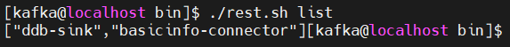

查看 DolphinDB 的 sink 同步任务状态 

```
./rest.sh status ddb-sink
```

通过下图可以看到，同步到 DolphinDB 的同步任务包含 1 个 connector 和 2 个 task 。两个 task 状态都是 RUNNING，即正常运行。这里配置了两个线程进行数据消费，并写入 DolphinDB。

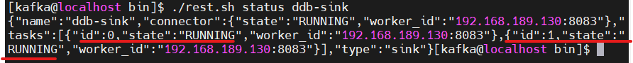

查看 DolphinDB 中的数据

```
select * from loadTable('dfs://index_data', 'index_components');
select * from loadTable('dfs://wddb', 'stock_basic')
```

数据分别如下，两张表的初始数据均已经同步到了 DolphinDB 中。

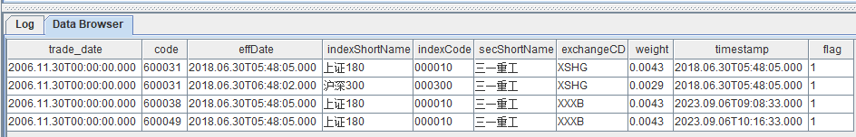

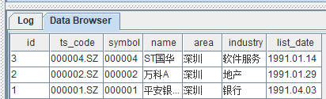

##### 实时数据同步验证

**第一步：插入新数据**

在 MySQL 中插入两条新数据。

```
insert into basicinfo.index_components (trade_date,code,effdate,indexShortName,indexCode,secShortName,exchangeCD,weight,timestamp,flag)
values
('2006-11-30','600051','2018-06-30 05:48:05','上证180','000010','三一重工','XXXB',0.0043,'2018-06-30 05:48:05',1),
('2006-11-30','600052','2018-06-30 06:48:02','沪深300','000300','三一重工','XSHG',0.0029,'2018-06-30 05:48:05',1)
```

在 DolphinDB 中进行查询，可以看到已经多了两条 code 值为  600051 和 600052 的。

```
select * from loadTable('dfs://index_data', 'index_components');
```

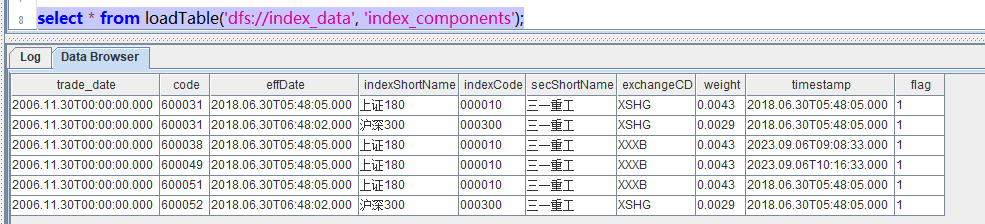

**第二步：数据更新**

在 MySQL 中更新一条数据，这里我们做一个涉及主键字段的更新。

```
update basicinfo.index_components set code='600061' where code ='600051'
```

在 DolphinDB 中进行查询，发现表中已经不存在 code 值为 600051 的数据，但可以看到一条 code 值为 600061 的数据。

```
select * from loadTable('dfs://index_data', 'index_components');
```

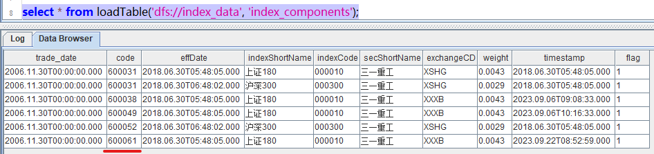

**第三步：数据删除**

从 MySQL 中删除一条数据。

```
delete from basicinfo.index_components where code='600061'
```

在 DolphinDB 中进行查询，可以看到 code 值为 600061 的数据已经不存在了。


### 运维操作

#### DolphinDB 同步须知

1. DolphinDB 是一款支持海量数据的分布式时序数据库。针对不同的数据处理需求，在底层架构上天然上与通常的关系型数据库不同。所以需要有以下限制：
- DolphinDB 的表没有主键设计，需要设置成 *sortColumn* 字段，并设置 *keepDuplicates* = LAST 来进行去重，确保数据唯一。
- DolphinDB 表采用 TSDB 引擎，才可以设置 *sortColumn*。
- DolphinDB 中 TSDB 引擎的 *sortColumn* 中必须要有时间列或者数字列，对应的来源主键则必须包含同样类型字段。
- DolphinDB 中 TSDB 引擎的 *sortColumn* 中必须要有至少两个字段，才能设置  *keepDuplicates* = LAST，所以对应的来源表主键必须是 2 个字段及以上。

2. DDL 语句相关：
- 当前不支持 DDL 语句同步。
- 当前不支持同时修改两边表后的数据传递。

#### 部署检查

1. **查看当前服务是否都在运行状态**：

```
sudo systemctl list-units |egrep 'zookeeper|kafka-server|schema-registry|kafka-connect'
```

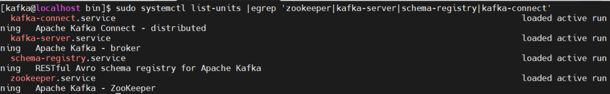

也可以使用 Jps 等其他方法快速查看 Java 进程。

2. **运行以下命令查看当前的同步任务列表查询**：

查看当前有哪些同步任务：

```
./rest.sh list
```

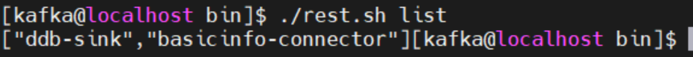

3. **查看某个同步任务的状态**：

```
./rest.sh status ddb-sink
```

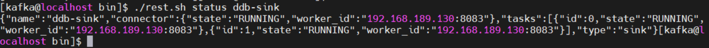

4. **暂停同步任务，该操作会停止当前整体 connector 同步任务**：

```
./rest.sh c_pause ddb-sink
```

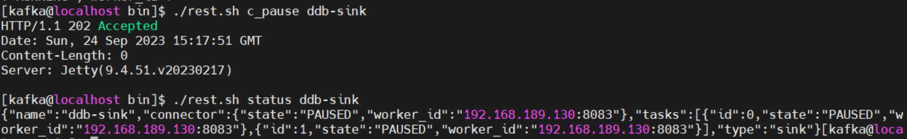

5. **恢复同步任务**：

```
./rest.sh c_resume ddb-sink
```

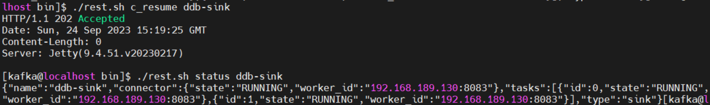

对于曾经由于数据库报错一度暂停的同步任务，在错误消除后，只要 connector 运行正常，可以通过以下命令使其恢复同步：

```
./rest.sh t_restart ${connector_name} ${task_id}
```

6. **修改同步任务配置参数**：

```
./rest c_alter ${connector_name} @source_config.json
```

修改参数时，只需传递参数，不需要带有 connector name，格式示例如下：

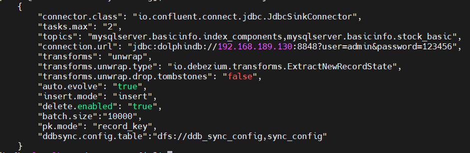

#### 数据同步情况检查

正常情况下，数据同步程序会保持稳定的数据同步。对于意外因素造成的数据未同步，可参考以下步骤逐一排查：

1. **查看 MySQL 中 *binlog* 中记录的最新位置。**

查看该值需要正确的配置 *gtid_mode* 等参数，按照前面的提供的 MySQL 参数配置既可。

```
SHOW MASTER STATUS;
```

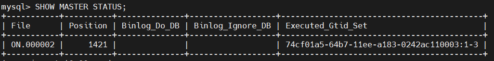

查看 MySQL 中的 *binlog* 具体数据库更改。 可以通过 `mysqlbinglog` 命令查看  MySQL 的 *binlog* 中记录的数据库改变。

```
./mysqlbinlog --base64-output=decode-rows -v --skip-gtids /usr/local/mysql/data/binlog.000003|less
```

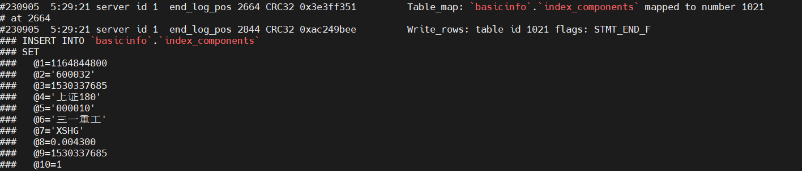

2. **查看 Kafka 中记录的 MySQL 同步的 *binlog* 位置。**

结合前面查看的 MySQL 最新 *binlog* 位置，可以确定当前数据从 MySQL 到 Kafka 的同步进度。

```
./consume.sh --topic connect-offsets --from-beginning |grep basicinfo-connector
```

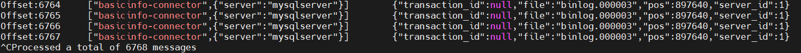

查看 Kafka 中数据， Kafka 中的数据是已序列化的二进制存储。需要使用 avro 调用 schema-registry 中的表结构信息及进行反序列化。这里我们提供了 *tpconsumer.sh* 脚本，可以提供反序列化后的 Kafka 中的真实数据，并匹配上该条数据对应的表结构。

```
./tpconsumer.sh --op=2 --topic=mysqlserver.basicinfo.index_components --offset=1 --max-messages=2
```


3. **查看当前 DolphinDB 同步任务列表。**

下面命令可以查看当前 Kafka 中的消费组。

```
./kafka.sh cm_list
```

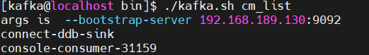

查看 DolphinDB 同步任务对应的 Kafka 消费组中的每一个 consumer 的消费进度，通过此命令可以查看同步程序中每一张的表同步进度。 Lag 为  0 则表示 Kafka 中 topic 当前没有未消费的数据，即 Kafka 中的数据与对应表的数据是一致的。

```
./kafka.sh cm_detail connect-ddb-sink|awk '{printf "%-20s %-40s %-9s %-14s %-15s %-10s %-30s\n", $1, $2, $3, $4, $5, $6,$7}'
```

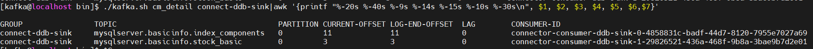

### 附录

[KFDATA.tar](./script/Debezium_and_Kafka_data_sync/KFDATA.tar) 压缩包包含：数据的同步数据文件夹、配置文件及 *Kafka-tools* 脚本。