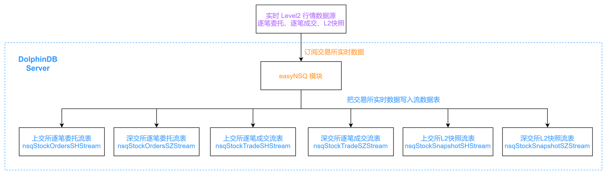
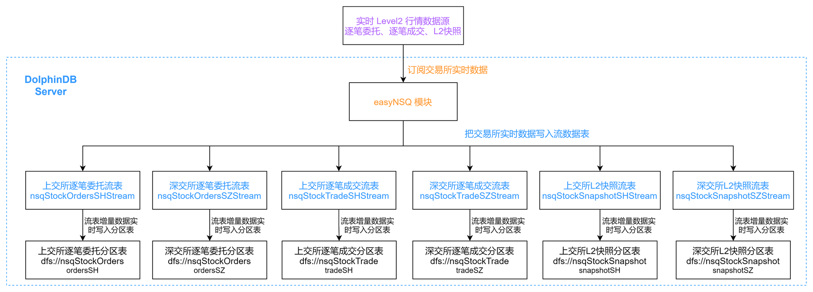
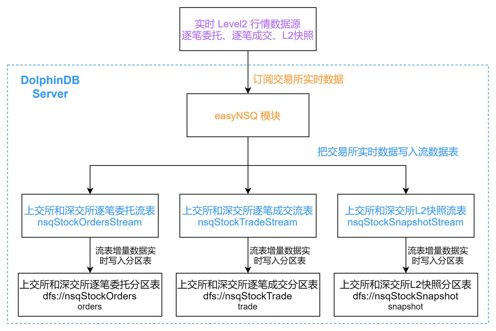
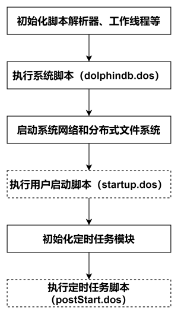

# DolphinDBModules::easyNSQ 实时行情数据接入功能模块使用教程

为了实时获取 Level2 行情数据，DolphinDB 对接恒生 NSQ 极速行情服务软件，开发了能够获取上海和深圳市场行情数据的 NSQ 插件。安装好插件后，用户需要创建用于接收实时数据的持久化共享流表和分区表，并且发起相关订阅。为了方便用户快速搭建 NSQ 实时行情数据的流计算环境，DolphinDB 开发了 DolphinDBModules::easyNSQ 模块（简称 easyNSQ 模块），主要用于 NSQ 实时行情数据的自动化接收和存储。目前已经支持的数据源包括上海和深圳市场的：

- 现货逐笔委托行情主推回调（OnRtnSecuTransactionEntrustData->orders）
- 现货逐笔成交行情主推回调（OnRtnSecuTransactionTradeData->trade）
- 现货深度行情主推回调（OnRtnSecuDepthMarketData->snapshot）

**注意**：DolphinDB 仅提供对接 HSNsqApi 的 NSQ 插件，数据源和接入服务可咨询数据服务商或证券公司。

NSQ 插件目前支持版本：[release200](https://gitee.com/dolphindb/DolphinDBPlugin/tree/release200/nsq), [release130](https://gitee.com/dolphindb/DolphinDBPlugin/tree/release130/nsq)。本模块基于 DolphinDB 2.00.9.4 开发，请使用 2.00.9.4 及以上版本的 DolphinDB。
- [1. 安装说明](#1-安装说明)
  - [1.1 安装 NSQ 插件](#11-安装-nsq-插件)
  - [1.2 安装 easyNSQ 模块](#12-安装-easynsq-模块)
- [2. 实时行情数据存储说明](#2-实时行情数据存储说明)
  - [2.1 行情数据表结构](#21-行情数据表结构)
  - [2.2 接收行情数据到流数据表](#22-接收行情数据到流数据表)
  - [2.3 接收行情数据到流数据表，并持久化到分区表](#23-接收行情数据到流数据表并持久化到分区表)
  - [2.4 合并存储上海和深圳市场行情数据](#24-合并存储上海和深圳市场行情数据)
- [3.  easyNSQ 模块接口介绍](#3--easynsq-模块接口介绍)
  - [easyNSQ::subscribeNsq(configFilePath, dataSource, \[markets\], \[merge\], \[saveToDfs\], \[streamTableNames\], \[dbPath\], \[tableNames\])](#easynsqsubscribensqconfigfilepath-datasource-markets-merge-savetodfs-streamtablenames-dbpath-tablenames)
  - [easyNSQ::closeNsqConnection()](#easynsqclosensqconnection)
  - [easyNSQ::iniNsqEnv(\[streamTableNames\])](#easynsqininsqenvstreamtablenames)
  - [easyNSQ::iniNsqDfs(\[dbName\], \[tbNames\])](#easynsqininsqdfsdbname-tbnames)
- [4. easyNSQ 模块使用示例](#4-easynsq-模块使用示例)
  - [例1. 接收深圳市场 snapshot 实时行情数据](#例1-接收深圳市场-snapshot-实时行情数据)
  - [例2. 接收上海市场所有类型实时行情数据，并持久化存储](#例2-接收上海市场所有类型实时行情数据并持久化存储)
  - [例3. 停止例2中的订阅后，重新接收上海市场 orders 数据](#例3-停止例2中的订阅后重新接收上海市场-orders-数据)
  - [例4. 接收上海和深圳市场所有类型的实时行情数据，并持久化存储](#例4-接收上海和深圳市场所有类型的实时行情数据并持久化存储)
- [5. 设置节点启动时自动订阅 NSQ 行情数据](#5-设置节点启动时自动订阅-nsq-行情数据)
- [附件](#附件)


## 1. 安装说明

使用 DolphinDBModules::easyNSQ 模块前，请确保在 DolphinDB 服务器上正确安装和加载了 NSQ 插件和 DolphinDBModules::easyNSQ 模块文件。

对于之前从未使用过DolphinDB插件和模块功能的读者，推荐在阅读以下章节的同时阅读 [NSQ 插件官方文档](https://gitee.com/dolphindb/DolphinDBPlugin/tree/release200.9/nsq/bin/linux)以及 [DolphinDB 模块教程](https://gitee.com/dolphindb/Tutorials_CN/blob/master/module_tutorial.md#2-定义模块)。  
**注意**：easyNSQ 模块依赖于 NSQ 插件，请确保先加载 NSQ 插件，再加载 easyNSQ 模块。

### 1.1 安装 NSQ 插件

用户可以根据正在使用 DolphinDB server 版本和操作系统，从 github 或 gitee 上的 DolphinDB 官方代码仓库 下载已经编译好的 NSQ 插件，例如 64位 Linux 操作系统上与 DolphinDB 2.00.9.4适配的 NSQ 插件可以从 [release 200.9分支](https://gitee.com/dolphindb/DolphinDBPlugin/tree/release200.9/nsq/bin/linux)下载。如果有手动编译插件的需求，可以参考 [NSQ 插件官方文档](https://gitee.com/dolphindb/DolphinDBPlugin/tree/release200.9/nsq/bin/linux)的说明。

安装插件需要重启 DolphinDB。以 Linux 单节点为例，将编译好的 NSQ 插件安装到路径 */DolphinDB/server/plugins/nsq/*。

将 NSQ 插件的路径添加到 Linux 环境变量：

```
export LD_LIBRARY_PATH=/DolphinDB/server/plugins/nsq/:$LD_LIBRARY_PATH 
```

然后启动 DolphinDB：

```
nohup ./dolphindb -console 0 > single.nohup 2>&1 &
```

- **手动加载插件**

节点启动后，通过 DolphinDB GUI 连接该节点，运行以下代码加载插件：

```
loadPlugin("/DolphinDB/server/plugins/nsq/PluginNsq.txt")
```

任意会话中成功加载插件，即可在当前节点的其他会话中使用插件。若节点重启，则需要重新加载插件。DolphinDB 可以通过配置自动加载指定的插件。

- **自动加载插件**

在配置文件 *dolphindb.cfg* 中加上：

```
preloadModules=plugins::nsq
```

然后启动 DolphinDB，系统自动会到 */DolphinDB/server/plugins/* 目录下加载插件。

- **验证加载**

插件加载好后，可以运行以下代码来验证 NSQ 插件安装成功：

```
nsq::getSubscriptionStatus()
```

该插件函数用于获取当前 NSQ 行情数据连接以及订阅状态，返回如下表格：

```
topicType     isConnected isSubscribed processedMsgCount lastErrMsg failedMsgCount lastFailedTimesconnecttamp
-------------- ----------- ------------ ----------------- ---------- -------------- -------------------
(snapshot, sh) true        true         0                            0
(snapshot, sz) true        true         0                            0
(trade, sh)    true        true         0                            0
(trade, sz)    true        true         0                            0
(orders, sh)    true        true         0                            0
(orders, sz)    true        true         0                            0
```

### 1.2 安装 easyNSQ 模块


以 Linux 单节点为例，将模块文件拷贝到 */DolphinDB/server/modules/* 目录下，即模块脚本 *easyNSQ.dos* 的路径应为 */DolphinDB/server/modules/DolphinDBModules/easyNSQ.dos*

模块文件安装好，运行以下代码加载模块：

```
use DolphinDBModules::easyNSQ
```

如果没有返回错误信息，则说明 easyNSQ 模块已经成功加载。

## 2. 实时行情数据存储说明

### 2.1 行情数据表结构

目前 NSQ 插件对上海和深圳市场的行情数据表结构做了统一处理，具体表结构如下：

#### 逐笔委托（orders）

| **name**     | **type** |
| :----------- | :------- |
| ExchangeID   | SYMBOL   |
| InstrumentID | SYMBOL   |
| TransFlag    | INT      |
| SeqNo        | LONG     |
| ChannelNo    | INT      |
| TradeDate    | DATE     |
| TransactTime | TIME     |
| OrdPrice     | DOUBLE   |
| OrdVolume    | LONG     |
| OrdSide      | CHAR     |
| OrdType      | CHAR     |
| OrdNo        | LONG     |
| BizIndex     | LONG     |

#### 逐笔成交（trade）

| **name**     | **type** |
| :----------- | :------- |
| ExchangeID   | SYMBOL   |
| InstrumentID | SYMBOL   |
| TransFlag    | INT      |
| SeqNo        | LONG     |
| ChannelNo    | INT      |
| TradeDate    | DATE     |
| TransactTime | TIME     |
| TrdPrice     | DOUBLE   |
| TrdVolume    | LONG     |
| TrdMoney     | DOUBLE   |
| TrdBuyNo     | LONG     |
| TrdSellNo    | LONG     |
| TrdBSFlag    | CHAR     |
| BizIndex     | LONG     |

#### L2快照（snapshot）

| **name**        | **type** | **name**              | **type** | **name**               | **type** |
| :-------------- | :------- | :-------------------- | :------- | :--------------------- | :------- |
| ExchangeID      | SYMBOL   | BidVolume0-9          | LONG     | EtfSellBalance         | DOUBLE   |
| InstrumentID    | SYMBOL   | AskVolume0-9          | LONG     | TotalWarrantExecVolume | LONG     |
| LastPrice       | DOUBLE   | TradesNum             | LONG     | WarrantLowerPrice      | DOUBLE   |
| PreClosePrice   | DOUBLE   | InstrumentTradeStatus | CHAR     | WarrantUpperPrice      | DOUBLE   |
| OpenPrice       | DOUBLE   | TotalBidVolume        | LONG     | CancelBuyNum           | INT      |
| HighPrice       | DOUBLE   | TotalAskVolume        | LONG     | CancelSellNum          | INT      |
| LowPrice        | DOUBLE   | MaBidPrice            | DOUBLE   | CancelBuyVolume        | LONG     |
| ClosePrice      | DOUBLE   | MaAskPrice            | DOUBLE   | CancelSellVolume       | LONG     |
| UpperLimitPrice | DOUBLE   | MaBondBidPrice        | DOUBLE   | CancelBuyValue         | DOUBLE   |
| LowerLimitPrice | DOUBLE   | MaBondAskPrice        | DOUBLE   | CancelSellValue        | DOUBLE   |
| TradeDate       | DATE     | YieldToMaturity       | DOUBLE   | TotalBuyNum            | INT      |
| UpdateTime      | TIME     | IOPV                  | DOUBLE   | TotalSellNum           | INT      |
| TradeVolume     | LONG     | EtfBuycount           | INT      | DurationAfterBuy       | INT      |
| TradeBalance    | DOUBLE   | EtfSellCount          | INT      | DurationAfterSell      | INT      |
| AveragePrice    | DOUBLE   | EtfBuyVolume          | LONG     | BidOrdersNum           | INT      |
| BidPrice0-9     | DOUBLE   | EtfBuyBalance         | DOUBLE   | AskOrdersNum           | INT      |
| AskPrice0-9     | DOUBLE   | EtfSellVolume         | LONG     | PreIOPV                | DOUBLE   |

### 2.2 接收行情数据到流数据表



用户指定希望接收的行情数据源（逐笔委托、逐笔成交或L2快照），easyNSQ 模块会根据用户的需要创建不同的持久化共享流表，并通过 NSQ 插件订阅交易所数据，将上海和深圳市场的实时行情数据写入持久化共享流表中。

持久化共享流表是进行共享并做了持久化处理的流数据表。将流表共享是为了让该流表在连接当前节点其它会话中也可见。比如通过 C++ API 实时查询流数据表的会话与定义流表的会话不会是同一个，如果不将流表共享，查询的需求就无法实现。

对流数据表进行持久化的目的主要有两个：一是控制该表的最大内存占用，通过设置 `enableTableShareAndPersistence` 函数中的 *cacheSize* 参数，可以控制流表在内存中最多保留多少条记录，超出的部分被写入持久化数据文件、从内存中清除，进而控制该表的最大内存占用；二是在节点异常关闭的极端情况下，可以从持久化数据文件中恢复已经写入流数据表但是未消费的数据，保证流数据“至少消费一次”的需求。流数据表持久化采用异步的方式进行，对流表写入吞吐量几乎没有影响。

**注意**：

虽然名字里带有“持久化”，但是持久化流表并不能满足行情数据持久化存储的需求。

首先，流数据表持久化到磁盘上的数据的规模在增长到一定大小，或者超过一定时间之后，会触发系统的回收校验，并不能做到真正的永久化存储。

其次，流数据表持久化到磁盘上的数据并没有进行结构化的存储，查询和更新的效率比不上在分区表中存储的数据，不适合用于实际生产环境。

如果用户有将行情数据在磁盘上进行持久化存储的需求，请阅读本篇文档[2.3](#23-接收行情数据到流数据表并持久化到分区表)及[2.4](#24-合并存储上海和深圳市场行情数据)小节的方案说明。


用户可以为这些持久化的共享流表指定名字，也可以选择使用模块默认的表名。在用户没有指定表名的情况下，模块对持久化共享流表的命名如下：

- 上交所逐笔委托：流表名称为 ”nsqStockOrdersSHStream“。
- 深交所逐笔委托：流表名称为 ”nsqStockOrdersSZStream"。
- 上交所逐笔成交：流表名称为 “nsqStockTradeSHStream"。
- 深交所逐笔成交：流表名称为 ”nsqStockTradeSZStream"。
- 上交所 L2 所快照：流表名称为 “nsqStockSnapshotSHStream"。
- 深交所 L2 所快照：流表名称为 ”nsqStockSnapshotSZStream“。

基于过往项目的实践，推荐如下的持久化共享流表参数配置方案：

| **配置项**       | **配置值** |
| :--------------- | :--------- |
| asynWrite        | true       |
| compress         | true       |
| cacheSize        | 500,000    |
| preCache         | 100,000    |
| retentionMinutes | 1440       |
| flushMode        | 0          |

### 2.3 接收行情数据到流数据表，并持久化到分区表



easyNSQ模块还支持将实时行情数据写入分区表进行持久化的存储。在此种订阅模式下，用户指定希望接收的行情数据源（逐笔委托、逐笔成交或L2快照），easyNSQ 模块会通过 NSQ 插件订阅交易所数据，将上海和深圳市场的实时行情数据分别写入持久化共享流表，然后通过 DolphinDB 内置的订阅-发布功能，将流表的增量数据实时写入分区表。

用户可以指定用于存储行情数据的数据库和分区表的名字。在用户没有指定数据库和分区表名字的情况下，模块会使用默认名字的数据库和分区表：

- 上交所逐笔委托：数据库名称为 "dfs://nsqStockOrders"，分区表名称为 "ordersSH"。
- 深交所逐笔委托：数据库名称为 "dfs://nsqStockOrders"，分区表名称为 "ordersSZ"。
- 上交所逐笔成交：数据库名称为 "dfs://nsqStockTrade"，分区表名称为 "tradeSH"。
- 深交所逐笔成交：数据库名称为 "dfs://nsqStockTrade"，分区表名称为 "tradeSZ"。
- 上交所 L2 所快照：数据库名称为 "dfs://nsqStockSnapshot"，分区表名称为 "snapshotSH"。
- 深交所 L2 所快照：数据库名称为 "dfs://nsqStockSnapshot"，分区表名称为 "snapshotSZ"。

细心的读者已经注意到 easyNSQ 模块会将同一行情数据源的数据放在同一个数据库中，比如上交所逐笔委托和深交所逐笔委托数据都会存储在数据库 "dfs://nsqStockOrders"。这样的做法，部分是出于业务逻辑的考虑，即后续往往会对上交所和深交所的逐笔委托数据进行同样的处理操作；此外，NSQ 插件已经对上海和深圳市场的行情数据表结构做了统一处理，上交所和深交所的数据适用于同一套数据库分区规则，可以存储在同一个数据库中。

**注意**：

出于数据安全的考虑，easyNSQ 模块在存储数据到分区表的过程中，如果发现要做写入的分区表不存在，会创建新分区表；如果发现同名分区表已存在，会直接向该分区表写入数据，而不是进行删除和重新创建。

因此，用户在使用 easyNSQ 模块时，需要注意：如果已存在分区表的表结构与行情数据结构不同，写入数据的时候就会抛出异常。建议用户使用 easyNSQ 模块时，在订阅行情数据前对用于行情数据入库存储的分区表进行检查。

基于过往项目的实践，对分区表确定了如下的分区方案：

| **行情数据类型**   | **分区方案**                                           | **分区列**               | **排序列**                  |
| :----------------- | :----------------------------------------------------- | :----------------------- | :-------------------------- |
| 逐笔委托（orders） | 组合分区：时间维度按天分区 + 证券代码维度 HASH 25 分区 | TradeDate + InstrumentID | InstrumentID + TransactTime |
| 逐笔成交（trade）  | 组合分区：时间维度按天分区 + 证券代码维度 HASH 25 分区 | TradeDate + InstrumentID | InstrumentID + TransactTime |
| L2快照（snapshot） | 组合分区：时间维度按天分区 + 证券代码维度 HASH 25 分区 | TradeDate + InstrumentID | InstrumentID + UpdateTime   |

### 2.4 合并存储上海和深圳市场行情数据



easyNSQ 模块支持将上海和深圳市场的实时行情数据进行合并处理。用户可以指定用于接收实时数据的流数据表的名字，以及用于存储行情数据的数据库和分区表的名字。在用户没有进行指定的情况下，模块会使用默认的名字：

- 逐笔委托：流表名称为 ”nsqStockOrdersStream“， 数据库名称为 "dfs://nsqStockOrders"，分区表名称为 "orders"。
- 逐笔成交：流表名称为 ”nsqStockTradeStream“，数据库名称为 "dfs://nsqStockTrade"，分区表名称为 "trade"。
- L2 所快照：流表名称为 ”nsqStockSnapshotStream“，数据库名称为 "dfs://nsqStockSnapshot"，分区表名称为 "snapshot"。

对于沪深行情数据合并存储，持久化共享流表的参数配置方案同沪深行情分开存储的参数配置方案。而分区表的分区方案如下：

| **行情数据类型**   | **分区方案**                                           | **分区列**               | **排序列**                  |
| :----------------- | :----------------------------------------------------- | :----------------------- | :-------------------------- |
| 逐笔委托（orders） | 组合分区：时间维度按天分区 + 证券代码维度 HASH 50 分区 | TradeDate + InstrumentID | InstrumentID + TransactTime |
| 逐笔成交（trade）  | 组合分区：时间维度按天分区 + 证券代码维度 HASH 50 分区 | TradeDate + InstrumentID | InstrumentID + TransactTime |
| L2快照（snapshot） | 组合分区：时间维度按天分区 + 证券代码维度 HASH 50 分区 | TradeDate + InstrumentID | InstrumentID + UpdateTime   |

## 3.  easyNSQ 模块接口介绍

### easyNSQ::subscribeNsq(configFilePath, dataSource, [markets], [merge], [saveToDfs], [streamTableNames], [dbPath], [tableNames])

**参数**

*configFilePath* ：一个字符串，表示 NSQ 行情服务器配置文件 *sdk_config.ini* 的绝对路径；若拷贝配置文件至 *dolphindb server*，则可以是相对于 *dolphindb server* 的相对路径。

*dataSource* ：一个字符串，表示行情的类型，可以是以下值：

- “orders”：表示回调函数 OnRtnSecuDepthMarketData（主推 - 现货深度行情）获取的行情数据。
- ”trade”：表示回调函数 OnRtnSecuDepthMarketData（主推 - 现货深度行情）获取的行情数据。
- “snapshot”：表示回调函数 OnRtnSecuDepthMarketData（主推 - 现货深度行情）获取的行情数据。

*markets*： 可选参数。一个字符串或字符串向量，表示行情市场，上海证券交易所用 `sh` 表示，深圳证券交易所用 `sz` 表示，参数默认值为 `["sz", "sh"]`。

*merge*： 可选参数。一个布尔值，表示是否合并处理上海和深圳市场的行情数据，参数默认值为 false。

*saveToDfs*： 可选参数。一个布尔值，表示是否持久化存储到分区表，参数默认值为 false。

*streamTableNames*： 可选参数。一个字符串或字符串向量，表示用于接收实时数据的流数据表的名字，**将使用这个名字创建新的持久化共享流数据表**。

*dbPath*： 可选参数。一个字符串，表示用于持久化存储数据的数据库的名字。若数据库不存在，将创建新数据库。

*tableNames* ：可选参数。一个字符串或字符串向量，表示用于持久化存储数据的分区表的名字。若分区表不存在，将创建新分区表。**若同名分区表已存在，则直接向该表写入**。

**函数详情**

自动化接收和存储 NSQ 实时行情数据。对应行情市场和行情类型的实时数据会被接收到持久化共享流表，并根据用户需要，同时将数据持久化存储到分区表。
函数执行成功会返回流数据表的名字（如果 *saveToDfs* 为 true，还会返回数据库和分区表的名字），若执行不成功则返回 NULL。

```
streamTableNames = subscribeNsq(configFilePath, "snapshot", ["sh","sz"], merge=true)
streamTableNames, dbPath, tableNames = subscribeNsq(configFilePath, "orders", "sh", saveToDfs=true)
```

用户没有使用可选参数 *streamTableNames*、*dbPath* 和 *tableNames* 时，easyNSQ 模块默认使用以下名字：

| 行情类型 | 行情市场 | 流数据表                 | 数据库                 | 分区表     |
| -------- | -------- | ------------------------ | ---------------------- | ---------- |
| orders   | sh       | nsqStockOrdersSHStream   | dfs://nsqStockOrders   | ordersSH   |
| orders   | sz       | nsqStockOrdersSZStream   | dfs://nsqStockOrders   | ordersSZ   |
| orders   | 合并存储 | nsqStockOrdersStream     | dfs://nsqStockOrders   | orders     |
| trade    | sh       | nsqStockTradeSHStream    | dfs://nsqStockTrade    | tradeSH    |
| trade    | sz       | nsqStockTradeSZStream    | dfs://nsqStockTrade    | tradeSZ    |
| trade    | 合并存储 | nsqStockTradeStream      | dfs://nsqStockTrade    | trade      |
| snapshot | sh       | nsqStockSnapshotSHStream | dfs://nsqStockSnapshot | snapshotSH |
| snapshot | sz       | nsqStockSnapshotSZStream | dfs://nsqStockSnapshot | snapshotSZ |
| snapshot | 合并存储 | nsqStockSnapshotStream   | dfs://nsqStockSnapshot | snapshot   |

### easyNSQ::closeNsqConnection()

**参数**

无

**函数详情**

断开与行情服务器的连接，本函数执行后会取消所有已建立的对实时行情数据的订阅。

函数执行成功返回 true，若有执行异常则会返回 false。

### easyNSQ::iniNsqEnv([streamTableNames])

**参数**

*streamTableNames*：可选参数。一个字符串或字符串向量，表示要清理的流数据表。

**函数详情**

初始化流计算环境，清理指定的流数据表及其订阅。若用户没有使用可选参数 *streamTableNames*，则会根据 easyNSQ 模块默认使用的流表进行清理，请参考 `easyNSQ::subscribeNsq` 的函数详情说明。

**注意**：`iniNsqEnv` 函数在没有传入参数时，会根据 easyNSQ 模块默认使用的流表名字，对同名流表及其订阅进行清理。请用户注意这一行为可能会导致数据被误删除。

### easyNSQ::iniNsqDfs([dbName], [tbNames])

**参数**

*dbName*： 可选参数。一个字符串，表示要清理的分区表的数据路径。

*tbNames* ：可选参数。一个字符串或字符串向量，表示要清理的分区表的表名。

**函数详情**

初始化环境，清理已指定的分区表。若用户没有使用可选参数 *dbName* 和 *tbNames*，则会根据 easyNSQ 模块默认使用的分区表进行清理，请参考 `easyNSQ::subscribeNsq` 的函数详情说明。

**注意**：`iniNsqDfs` 函数在没有传入参数时，会根据 easyNSQ 模块默认使用的数据库路径和分区表名字，对分区表进行清理。请用户注意这一行为可能会导致数据被误删除。

## 4. easyNSQ 模块使用示例

本章节为四个不同的使用场景提供了脚本示例。

### 例1. 接收深圳市场 snapshot 实时行情数据

```
// 登录数据库
login(`admin, `123456)
// 调用模块
use DolphinDBModules::easyNSQ

configFilePath = "<your_path_to>/nsq_sdk_config.ini";

// 初始化化境并拉起订阅
iniNsqEnv()
streamTableNames = subscribeNsq(configFilePath, "snapshot", "sz", saveToDfs=false)

// 检查订阅情况
nsq::getSubscriptionStatus()
select count(*) from objByName(streamTableNames[0])
select top 100 * from objByName(streamTableNames[0])

// 停止订阅
nsq::unsubscribe("snapshot", "sz")
nsq::getSubscriptionStatus()
```

### 例2. 接收上海市场所有类型实时行情数据，并持久化存储

```
// 登录数据库
login(`admin, `123456)
// 调用模块
use DolphinDBModules::easyNSQ

configFilePath = "<your_path_to>/nsq_sdk_config.ini";

// 初始化环境并拉起订阅
iniNsqEnv()
iniNsqDfs()
subscribeNsq(configFilePath, "orders", "sh", saveToDfs=true)
subscribeNsq(configFilePath, "trade", "sh", saveToDfs=true)
subscribeNsq(configFilePath, "snapshot", "sh", saveToDfs=true)

// 检查订阅情况
nsq::getSubscriptionStatus()
existsSubscriptionTopic(,"nsqStockOrdersSHStream","easyNSQ_saveToDfsTable")
existsSubscriptionTopic(,"nsqStockTradeSHStream","easyNSQ_saveToDfsTable")
existsSubscriptionTopic(,"nsqStockSnapshotSHStream","easyNSQ_saveToDfsTable")
select count(*) from objByName("nsqStockOrdersSHStream")
select count(*) from loadTable("dfs://nsqStockOrders", "ordersSH")
select count(*) from objByName("nsqStockTradeSHStream")
select count(*) from loadTable("dfs://nsqStockTrade", "tradeSH")
select count(*) from objByName("nsqStockSnapshotSHStream")
select count(*) from loadTable("dfs://nsqStockSnapshot", "snapshotSH")

// 仅停止 orders 行情数据的订阅
nsq::unsubscribe("orders", "sh")
nsq::getSubscriptionStatus()

// 停止所有订阅
closeNsqConnection()
nsq::getSubscriptionStatus()
```

### 例3. 停止所有订阅后，重新接收上海市场 orders 数据

#### 保留之前持久化的数据

```
// 登录数据库
login(`admin, `123456)

pluginPath = "<your_path>/plugins/nsq/PluginNsq.txt"
configFilePath = "<your_path>/nsq_sdk_config.ini";
// 确保 nsq 插件加载成功
try{ loadPlugin(pluginPath) } catch(ex) { print(ex) }

// 调用模块
use DolphinDBModules::easyNSQ

// 初始化流环境并拉起订阅
iniNsqEnv("nsqStockOrdersSHStream")
streamTableNames, dbPath, tableNames = subscribeNsq(configFilePath, "orders", "sh", saveToDfs=true)

// 检查订阅情况
nsq::getSubscriptionStatus()
existsSubscriptionTopic(,streamTableNames[0],"easyNSQ_saveToDfsTable")
select count(*) from objByName(streamTableNames[0])
select count(*) from loadTable(dbPath, tableNames[0])

// 停止订阅
nsq::unsubscribe("orders", "sh")
```

#### 不保留之前持久化的数据

```
// 登录数据库
login(`admin, `123456)

pluginPath = "<your_path>/plugins/nsq/PluginNsq.txt"
configFilePath = "<your_path>/nsq_sdk_config.ini";
// 确保 nsq 插件加载成功
try{ loadPlugin(pluginPath) } catch(ex) { print(ex) }

// 调用模块
use DolphinDBModules::easyNSQ

// 初始化环境并拉起订阅
iniNsqEnv("nsqStockOrdersSHStream")
iniNsqDfs("dfs://nsqStockOrders", "ordersSH")
subscribeNsq(configFilePath, "orders", "sh", saveToDfs=true)

// 检查订阅情况
nsq::getSubscriptionStatus()
existsSubscriptionTopic(,"nsqStockOrdersSHStream","easyNSQ_saveToDfsTable")
select count(*) from objByName("nsqStockOrdersSHStream")
select count(*) from loadTable("dfs://nsqStockOrders", "ordersSH")

// 停止订阅
nsq::unsubscribe("orders", "sh")
```

### 例4. 接收上海和深圳市场所有类型的实时行情数据，并持久化存储

#### 合并处理上海和深圳市场数据

```
// 登录数据库
login(`admin, `123456)

pluginPath = "<your_path>/plugins/nsq/PluginNsq.txt"
configFilePath = "<your_path>/nsq_sdk_config.ini";
// 确保 nsq 插件加载成功
try{ loadPlugin(pluginPath) } catch(ex) { print(ex) }

// 调用模块
use DolphinDBModules::easyNSQ

// 初始化环境并拉起订阅
iniNsqEnv()
iniNsqDfs()
subscribeNsq(configFilePath, "orders", ["sh","sz"], merge=true, saveToDfs=true)
subscribeNsq(configFilePath, "trade", ["sh","sz"], merge=true, saveToDfs=true)
subscribeNsq(configFilePath, "snapshot", ["sh","sz"], merge=true, saveToDfs=true)

// 检查订阅情况
nsq::getSubscriptionStatus()
existsSubscriptionTopic(,"nsqStockOrdersStream","easyNSQ_saveToDfsTable")
existsSubscriptionTopic(,"nsqStockTradeStream","easyNSQ_saveToDfsTable")
existsSubscriptionTopic(,"nsqStockSnapshotStream","easyNSQ_saveToDfsTable")

// 停止订阅
closeNsqConnection()
```

#### 分开处理上海和深圳市场数据（用户自定义流表和分区表名字）

```
// 登录数据库
login(`admin, `123456)

pluginPath = "<your_path>/plugins/nsq/PluginNsq.txt"
configFilePath = "<your_path>/nsq_sdk_config.ini";
// 确保 nsq 插件加载成功
try{ loadPlugin(pluginPath) } catch(ex) { print(ex) }

// 调用模块
use DolphinDBModules::easyNSQ

// 初始化环境并拉起订阅
iniNsqEnv(["myNsqOrdersSHStream", "myNsqOrdersSZStream", "myNsqTradeSHStream", "myNsqTradeSZStream","myNsqSnapshotSHStream", "myNsqSnapshotSZStream"])
iniNsqDfs("dfs://myNsqOrders", `myNsqOrdersSH`myNsqOrdersSZ)
iniNsqDfs("dfs://myNsqTrade", `myNsqTradeSH`myNsqTradeSZ)
iniNsqDfs("dfs://myNsqSnapshot", `myNsqSnapshotSH`myNsqSnapshotSZ)
subscribeNsq(configFilePath, "orders", ["sh","sz"], saveToDfs=true, streamTableNames=["myNsqOrdersSHStream", "myNsqOrdersSZStream"], dbPath="dfs://myNsqOrders", tableNames=["myNsqOrdersSH", "myNsqOrdersSZ"])
subscribeNsq(configFilePath, "trade", ["sh","sz"], saveToDfs=true, streamTableNames=["myNsqTradeSHStream", "myNsqTradeSZStream"], dbPath="dfs://myNsqTrade", tableNames=["myNsqTradeSH", "myNsqTradeSZ"])
subscribeNsq(configFilePath, "snapshot", ["sh","sz"], saveToDfs=true, streamTableNames=["myNsqSnapshotSHStream", "myNsqSnapshotSZStream"], dbPath="dfs://myNsqSnapshot", tableNames=["myNsqSnapshotSH", "myNsqSnapshotSZ"])

// 检查订阅情况
nsq::getSubscriptionStatus()
select * from getStreamingStat().subWorkers where topic like "%easyNSQ_saveToDfsTable%"

// 停止订阅
closeNsqConnection()
```

#### 清理以上例子运行时创建的流表和分区表

```
iniNsqEnv()
iniNsqDfs()
iniNsqEnv(["myNsqOrdersSHStream", "myNsqOrdersSZStream", "myNsqTradeSHStream", "myNsqTradeSZStream","myNsqSnapshotSHStream", "myNsqSnapshotSZStream"])
iniNsqDfs("dfs://myNsqOrders", `myNsqOrdersSH`myNsqOrdersSZ)
iniNsqDfs("dfs://myNsqTrade", `myNsqTradeSH`myNsqTradeSZ)
iniNsqDfs("dfs://myNsqSnapshot", `myNsqSnapshotSH`myNsqSnapshotSZ)
```

## 5. 设置节点启动时自动订阅 NSQ 行情数据

由于只存在于内存中，DolphinDB 流数据表和流表的订阅在节点关闭后就会消失。所以每次节点启动时，都需要重新创建流数据表和发起订阅。如果每次重新启动后都要求用户进行手动操作，在使用上无疑是不便的。考虑到这一点，DolphinDB 实现了启动时自动执行用户指定脚本的功能。

DolphinDB 系统启动流程如下图所示：



- 用户启动脚本（*startup.dos*）

用户启动脚本是通过配置参数 startup 后才会执行，单机 single 模式在 *dolphindb.cfg* 中配置，集群模式在 *cluster.cfg* 中配置，可配置绝对路径或相对路径。若配置了相对路径或者没有指定目录，系统会依次搜索本地节点的 *home* 目录、工作目录和可执行文件所在目录。

以 Linux 单节点为例，在 *dolphindb.cfg* 添加如下的配置项：

```
startup=/DolphinDB/server/startup.dos
```

然后在 */DolphinDB/server/* 路径下创建 *startup.dos* 脚本文件即可完成配置。之后每次节点启动时，都会自动执行 */DolphinDB/server/startup.dos* 脚本文件中的代码。

假设用户希望接收上海和深证两个市场的 NSQ 行情数据、持久化存储，并对行情数据分别做沪深合并和沪深分开两种处理。用户的 *startup.dos* 应当如下：

```
// 登录数据库
login(`admin, `123456)
go

pluginPath = "<your_path>/plugins/nsq/PluginNsq.txt"
configFilePath = "<your_path>/nsq_sdk_config.ini";
// 确保 nsq 插件加载成功
try{ loadPlugin(pluginPath) } catch(ex) { print(ex) }
go

// 调用模块
use DolphinDBModules::easyNSQ
go

// 初始化环境(不删除分区表)
iniNsqEnv()
go

// 拉起订阅
subscribeNsq(configFilePath, "orders", ["sh","sz"], saveToDfs=true)
subscribeNsq(configFilePath, "trade", ["sh","sz"], saveToDfs=true)
subscribeNsq(configFilePath, "snapshot", ["sh","sz"], saveToDfs=true)
subscribeNsq(configFilePath, "orders", ["sh","sz"], merge=true, saveToDfs=true)
subscribeNsq(configFilePath, "trade", ["sh","sz"], merge=true, saveToDfs=true)
subscribeNsq(configFilePath, "snapshot", ["sh","sz"], merge=true, saveToDfs=true)

```

## 附件

模块文件： [DolphinDBModules](script/DolphinDBModules_easyNSQ/DolphinDBModules) 

startup脚本： [startup.dos](script/DolphinDBModules_easyNSQ/startup.dos) 

使用示例： [使用示例.txt](script/DolphinDBModules_easyNSQ/使用示例.txt) 