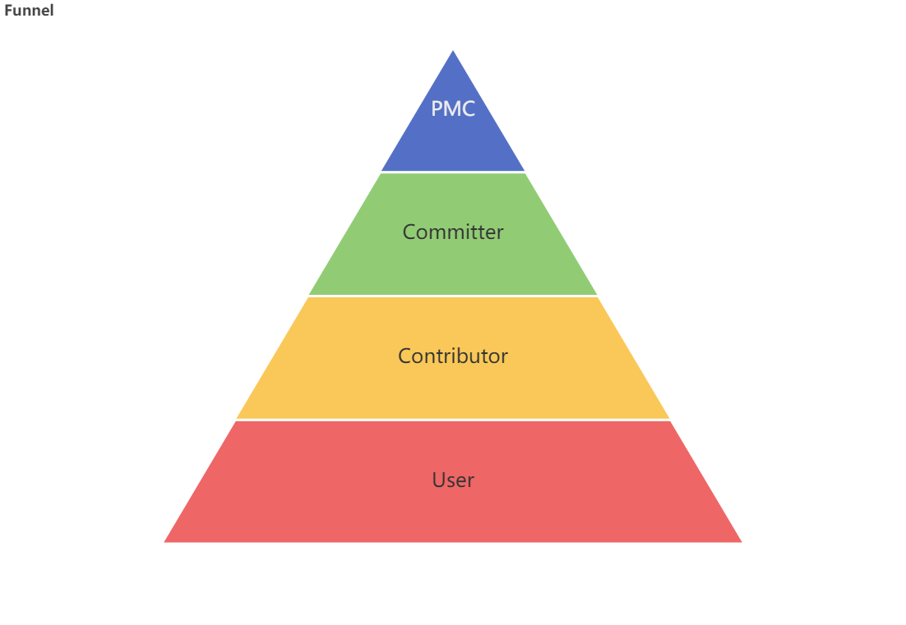
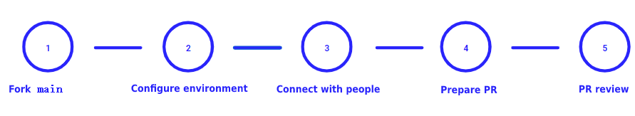
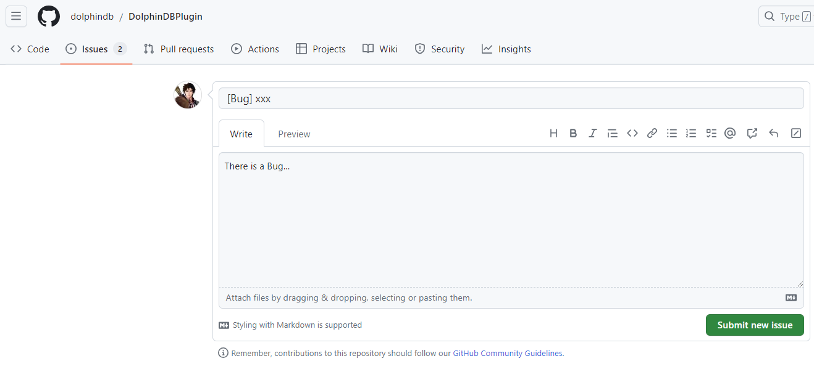
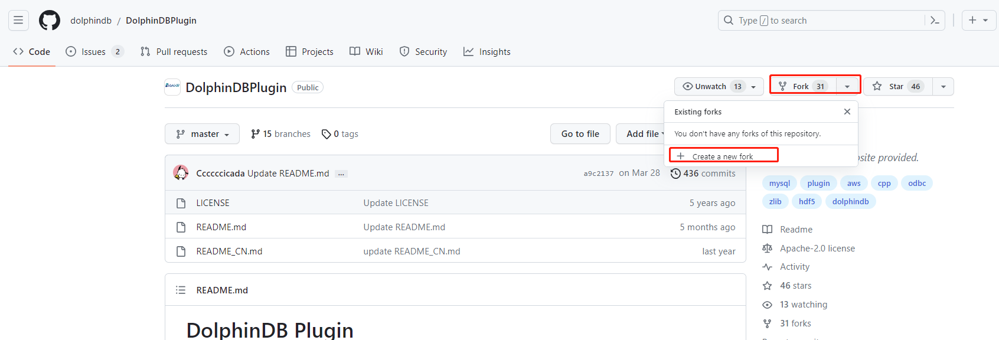
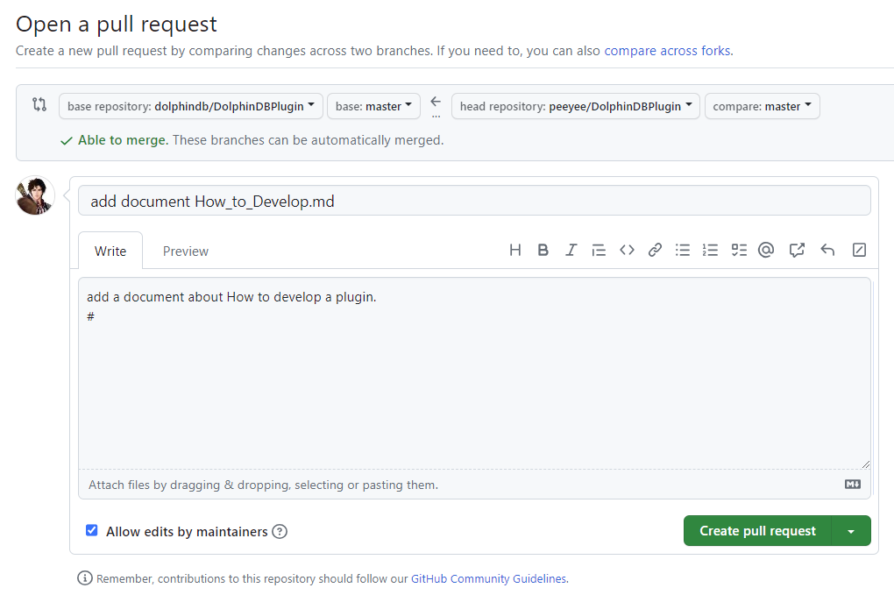
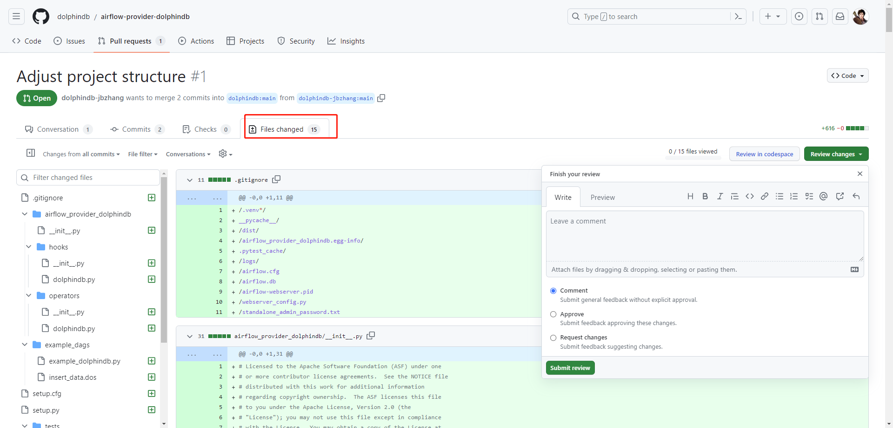
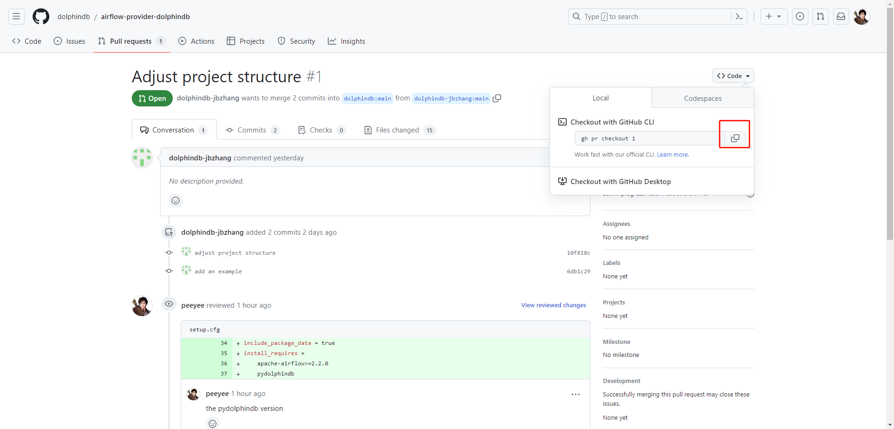

# DolphinDB 开源项目贡献指南

本文档用于指导社区用户参与开源项目贡献，以及 PMC（Project Management Committee）管理项目开发与协作。
- [1 如何参与](#1-如何参与)
  - [1.1 项目组织结构](#11-项目组织结构)
  - [1.2  贡献形式](#12--贡献形式)
  - [1.3 开源项目列表](#13-开源项目列表)
- [2 项目协作流程](#2-项目协作流程)
  - [2.1 开发者](#21-开发者)
  - [2.2 操作流程](#22-操作流程)
  - [2.3 项目管理者](#23-项目管理者)


## 1 如何参与

### 1.1 项目组织结构

DolphinDB 的开源项目由 PMC（Project Management Committee） 统一管理，通常由项目的最初开发者组成，并逐步接纳优秀的社区成员。项目相关参与者包括：用户、贡献者、提交者、维护者。




**PMC**

项目管理委员会，负责项目开发组织机构，对产品的发展和质量负责。一般由项目开发者组成，并且会逐步接收出色的贡献者进入 PMC。PMC 包含两类角色：maintainer、committer。

**contributor**

贡献者，愿意参与项目开发，并贡献力量的社区人员。fork 项目代码，并提交 issue，pr。

**committer**

提交者，由 contributor 晋升而来，通常是在项目日常运营过程中，得到了项目核心维护团队的认可和提名。拥有仓库的代码提交权限。

**maintainer**

具有最高决策权力的群体，决策项目发展方向，同时对项目组织各层级的成员进行提名、投票等。

**users**

使用者，在项目生命周期中发挥着重要的作用。用户可以积极地反馈软件的相关需求和问题，促进项目的不断发展。

### 1.2  贡献形式

欢迎各位开发者积极参与到 DolphinDB 开源项目中，为 DolphinDB 的发展贡献自身的力量，星星之火可以燎原。开发者能以多种形式参与项目，对项目发展做出贡献。包括：

- 报告 bug

测试合报告相关 bug，如有可能指出相关问题代码。

- 修复 bug

搜索带有 bug 标签的 issue 进行修复。

- 实现新功能

搜索带有 enhancement 标签的 issue, 选择实现相关的功能。

- 提交文档

文档对于开发人员、使用者非常关键。欢迎提交设计文档、使用文档，以及指出现有文档中的错漏之处。文档请使用 markdown 格式编写，内容需简洁、实用。

- 翻译

将现有文档翻译至其他语言（目前主要是英文）。

- 关注

关注项目本身也是一种贡献，比如点击 star，watch，帮助回答一些新人的问题等。这都有助于提升项目的热度，进而促进项目的良性发展。

### 1.3 开源项目列表

在 github 上搜索 [DolphinDB](https://github.com/dolphindb) 。目前有以下项目开源：

| **项目**         | **项目说明**                                                 | **地址**                                                     | **备注**                                                     |
| :--------------- | :----------------------------------------------------------- | :----------------------------------------------------------- | :----------------------------------------------------------- |
| DolphinDBPlugin  | C++ 编写的各种插件，扩展 DolphinDB 功能，如可以连接访问外部数据源的 MySQL、ODBC 插件等。开发前请阅读  [DolphinDB 插件开发教程](https://gitee.com/dolphindb/Tutorials_CN/blob/master/plugin_development_tutorial.md) | [GitHub - dolphindb/DolphinDBPlugin](https://github.com/dolphindb/DolphinDBPlugin) | 主开发分支:<br/>release130: 适配 DolphinDB 1.30版本<br/>release200: 适配 DolphinDB 2.00版本 |
| DolphinDBModules | 以 DolphinDB script 编写的 package                           | [GitHub - dolphindb/DolphinDBModules](https://github.com/dolphindb/DolphinDBModules) | 主开发分支：master                                           |
| jdbc             | Java JDBC connector                                          | [GitHub - dolphindb/jdbc: DolphinDB JDBC](https://github.com/dolphindb/jdbc) | 主开发分支：master                                           |
| api-java         | DolphinDB Java API 开发前请阅读（下同）[API 交互协议](https://gitee.com/dolphindb/Tutorials_CN/blob/master/api_protocol.md) | [GitHub - dolphindb/api-java](https://github.com/dolphindb/api-java) | 主开发分支:<br/>release130: 适配DolphinDB 1.30版本<br/>release200: 适配DolphinDB 2.00版本 |
| api-cplusplus    | DolphinDB C++  API                                           | [GitHub - dolphindb/api-cplusplus](https://github.com/dolphindb/api-cplusplus) | 主开发分支:<br/>release130: 适配DolphinDB 1.30版本<br/>release200: 适配DolphinDB 2.00版本 |
| api-python-cpp   | DolphinDB Python API，由 C++、Python编写                     | [GitHub - dolphindb/api-python-cpp: DolphinDB Python API with C++ core](https://github.com/dolphindb/api-python-cpp) | 主开发分支: release130                                       |
| api-csharp       | DolphinDB C# API                                             | [GitHub - dolphindb/api-csharp: DolphinDB C# API](https://github.com/dolphindb/api-csharp) | 主开发分支:<br/>release130: 适配DolphinDB 1.30版本<br/>release200: 适配DolphinDB 2.00版本 |
| api-go           | DolphinDB Go API                                             | [GitHub - dolphindb/api-go](https://github.com/dolphindb/api-go) | 主开发分支:<br/>release130: 适配 DolphinDB 1.30版本<br/>release200: 适配 DolphinDB 2.00版本 |
| gui              | 以 Java 编写的图形化工具                                     | [GitHub - dolphindb/gui: DophinDB Java GUI](https://github.com/dolphindb/gui) | 主开发分支：main                                             |
| api-javascript   | DolphinDB JavaScript API                                     | [GitHub - dolphindb/api-javascript](https://github.com/dolphindb/api-javascript) | 主开发分支：main                                             |
| api-rust         | DolphinDB Rust API                                           | [GitHub - dolphindb/api-rust](https://github.com/dolphindb/api-rust) | 主开发分支：master                                           |
| api-r            | DolphinDB R API                                              | [GitHub - dolphindb/api-r](https://github.com/dolphindb/api-r) | 主开发分支：master                                           |
| web              | web 图形化工具                                               | [GitHub - dolphindb/web: DolphinDB database web management interface](https://github.com/dolphindb/web) | 主开发分支：main                                             |
| vscode-extension | VSCode 插件，可以编写调试 DolphinDB 脚本                     | [GitHub - dolphindb/vscode-extension: DolphinDB VSCode Extension](https://github.com/dolphindb/vscode-extension) | 主开发分支：main                                             |

 

## 2 项目协作流程

### 2.1 开发者

大部分简单的事务可以先从 [GitHub Discussion](https://github.com/apache/airflow/discussions) 开始进行必要的讨论。如果相关行为得到确认，例如确实发现了一个 bug，能稳定复现，可以进一步提交 [issue](https://github.com/apache/airflow/issues/new/choose)。Issue 得到项目 PMC 回复后可以着手相关开发工作。最终通过提交 pr 解决问题。总体流程如图：



这里解释下几个关键行为：

- Discussion

这里可以讨论问题，尤其对于不熟悉项目的人可以在这里发表讨论话题。

- Issue

已经比较确定的行为在这里报告。比如新功能需求、bug。

- PR

pull request，完成相关内容开发后，向项目提交 pr。pr 应该具备以下规范：

1. 详细的解释 bug/功能，提交充分且客观的说明、证据。
2. 如果是新功能应当有测试代码、记录。
3. 不要一次提交太多的内容（这样不利于 review)，推荐一次提交一个 bug 修复，或者一个功能。
4. 提交 pr 至相应分支。如果 pr 过程中分支已经更新，需要 rebase。如有冲突，请解决冲突后再提交 pr 。

- Slack

除了 github 提供的原生交流方式外，也可以在 [DolphinDB Slack](http://dolphindb.slack.com/) 中进行即时交流。

### 2.2 操作流程

以 DolphinDBPlugin 项目为例：

- 提交 issue

在 issue 界面中，提交具体问题，标题以 [label] xxx 形式，label 包括：bug，help wanted, question, enhancement 等。



提交 issue 后，耐心等待项目 Maintainer 回复，持续交流至问题解决，解决后由 Maintainer 关闭。

- PR

1. fork

fork 项目至个人仓库。点击 **fork** → **Create a new fork** 即可。



 

2. clone 至本地

将个人仓库中的项目 clone 到本地以便后续开发。

```
git clone https://github.com/peeyee/DolphinDBPlugin.git
```

3. push 至个人仓库

根据需求，提交相关内容，如果是文档以 markdown 编写，代码风格请循序 [google-styleguide](https://zh-google-styleguide.readthedocs.io/en/latest/contents/)。

```
git commit -a -m "add a document about xxx." && git push
```

4. 提交 PR

在 dolphindb / DolphinDBPlugin 项目中，切换至 Pull requests 页面，点击 **New pull request** → **compare across forks**，选择个人仓库的分支即可。



在描述中详细说明提交的内容及必要性。输入 “#” 可以关联相关的 issue，以便 maintainer 能更好地 review。

### 2.3 项目管理者

对 pr 进行 review，检查是否符合规范，质量，并进行相关测试。接受到 pr 后，可以在 github 上进行 review，备注 comment，要求修改或者接受 pr。

- pr review



在 **File changes** 选项中 review 相关代码，并提交 review 意见：

**Approve**，接受合并。

**Request changes**，退回合并请求，给出意见并要求整改。


- pr test

除了一些简单的提交，如去除无意义代码，拼写错误，增加文档等情况，一般都是要先测试。将 pr 进行本地测试。

具体参考：[Checking out pull requests locally - GitHub Docs](https://docs.github.com/en/pull-requests/collaborating-with-pull-requests/reviewing-changes-in-pull-requests/checking-out-pull-requests-locally) ，这里简单说明下关键步骤：

1. 安装 git cli

Ubuntu 上安装

```
type -p curl >/dev/null || (sudo apt update && sudo apt install curl -y)
curl -fsSL https://cli.github.com/packages/githubcli-archive-keyring.gpg | sudo dd of=/usr/share/keyrings/githubcli-archive-keyring.gpg \
&& sudo chmod go+r /usr/share/keyrings/githubcli-archive-keyring.gpg \
&& echo "deb [arch=$(dpkg --print-architecture) signed-by=/usr/share/keyrings/githubcli-archive-keyring.gpg] https://cli.github.com/packages stable main" | sudo tee /etc/apt/sources.list.d/github-cli.list > /dev/null \
&& sudo apt update \
&& sudo apt install gh -y
```

不同平台的安装参考 [GitHub - cli/cli: GitHub’s official command line tool](https://github.com/cli/cli#installation) 。

2. check out pr

在 pr 列表中找到相应内容，并复制命令：



```
gh pr checkout <PULL-REQUEST ID>
```

checkout 到相应分支并进行测试，将相关测试结果反馈至 pr review 中。