# DolphinDB Python Parser 在金融量化分析场景的入门教程

**面向读者**

- 有 Python 编程基础的 DolphinDB 初学者

**本教程教学内容**

- 如何在 DolphinDB 中用 Python 语言开发因子代码，并完成计算和入库存储
- 如何在 DolphinDB 中用 Python 语言创建各种不同频率的因子存储库表
- 如何在 DolphinDB 中用 Python 语言开发各种场景的因子计算代码

DolphinDB Python Parser （简称 Python Parser）是 Python 语言的一个 DolphinDB 实现。目前 Python Parser 支持了 Python 中最常用的语法，并兼容了 DolphinDB 部分独有的语法。通过 Python Parser，用户可以在 DolphinDB 支持的编程 IDE 中用 Python 语言编写脚本，然后提交给 DolphinDB Server 进行解析执行并得到结果。Python Parser 打破了全局解释锁（GIL, Global Interpreter Lock）的限制，能够方便地实现分布式并行计算。Python Parser 对 Python 语法的兼容，降低了用户上手 DolphinDB 的难度。

本教程基于量化投研中的因子挖掘场景，展示如何用 Python Parser 在 DolphinDB 上快速完成因子开发，包括因子计算和结果存储。

本教程包含内容：
- [基于逐笔数据挖掘日频因子全流程](#基于逐笔数据挖掘日频因子全流程)
  - [历史数据存储](#历史数据存储)
  - [创建日频因子存储库表](#创建日频因子存储库表)
  - [当日尾盘成交占比因子](#当日尾盘成交占比因子)
  - [存入数据库](#存入数据库)
- [创建因子存储库表](#创建因子存储库表)
  - [日频因子](#日频因子)
  - [1分钟频因子](#1分钟频因子)
  - [10分钟频因子](#10分钟频因子)
  - [3秒快照频因子](#3秒快照频因子)
  - [逐笔频因子](#逐笔频因子)
  - [1秒频因子](#1秒频因子)
  - [期货500毫秒频因子](#期货500毫秒频因子)
- [量化因子计算代码开发](#量化因子计算代码开发)
  - [双均线因子](#双均线因子)
  - [十档净委买增额](#十档净委买增额)
  - [价格变动与一档量差的回归系数](#价格变动与一档量差的回归系数)
  - [主动成交量占比](#主动成交量占比)
  - [早盘买卖单大小比](#早盘买卖单大小比)
  - [委托量加权平均委托价格](#委托量加权平均委托价格)
- [性能测试](#性能测试)
  - [性能测试环境](#性能测试环境)
  - [性能测试结果](#性能测试结果)
- [总结](#总结)
- [附件](#附件)


## 基于逐笔数据挖掘日频因子全流程

### 历史数据存储

在用 Python Parser 进行因子计算代码开发前，必须先把历史行情数据存入 DolphinDB，包括日 K 线、分钟 K 线、逐笔数据和 Level-1/Level-2 快照数据等。

关于历史数据存储的问题，DolphinDB 已经发布多篇相关教程，在此不再赘述：

- 通用行情数据导入教程：《[国内股票行情数据导入实例](https://gitee.com/dolphindb/Tutorials_CN/blob/master/stockdata_csv_import_demo.md)》、《[金融 PoC 用户历史数据导入指导手册之股票 level2 逐笔篇](https://gitee.com/dolphindb/Tutorials_CN/blob/master/LoadDataForPoc.md)》
- 通联历史行情数据导入教程：《[DolphinDBModules::easyTLDataImport 通联历史数据自动化导入功能模块使用教程](https://gitee.com/dolphindb/DolphinDBModules/blob/master/easyTLDataImport/README.md)》
- 文本数据导入教程：《[数据导入教程](https://gitee.com/dolphindb/Tutorials_CN/blob/master/import_data.md)》

上述教程代码都基于 DolphinDB 语法开发，在 DolphinDB 支持的编程 IDE 中执行代码时要选择 DolphinDB 语法解释器。选择方式如下：


1. **GUI 客户端**：建议下载官网的最新版本：[DolphinDB GUI](https://www.dolphindb.cn/product#downloads)。

    使用前，应在 DolphinDB GUI 中确保语言下拉菜单已开启：点击 **File** > **Preferences**，选中 **Always show language dropdown** 复选框。

    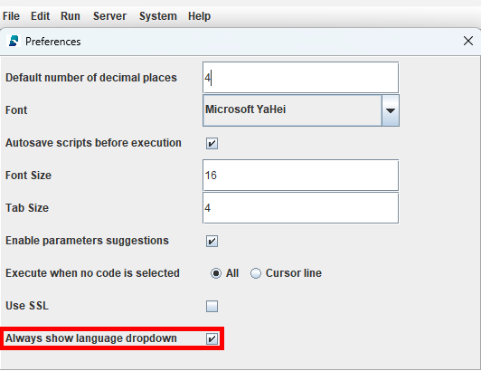

    此后，即可在GUI用户界面中的语言选择菜单中选择 DolphinDB 语法解释器。

    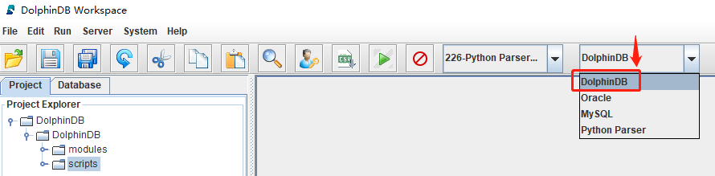


2. **Visual Studio Code（VS Code）编辑器 + DolphinDB VS Code 插件**：建议下载最新版 VS Code 插件：[Visual Studio Code extension for DolphinDB](https://www.dolphindb.cn/product#downloads)。本教程基于 V2.0.1041 开发。

    在 VS Code 的 **Settings** 界面搜索 ` @ext:dolphindb.dolphindb-vscode connections` 后，编辑 `settings.json`，在 `dolphindb.connections` 一节中，指定 “python” 条目。

    `"python": true` 表示使用 Python Parser 语法解释器；`"python": false` 表示使用 DolphinDB 语法解释器。

    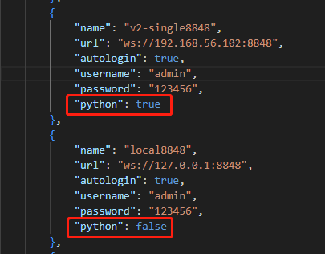


为了能够成功运行本章节示例代码，可以先执行下述代码模拟生成少量逐笔成交数据：（需要将 csvDir 变量修改为 DolphinDB 部署服务器上 tradeData.csv 的实际目录，示例数据见[附件](#附件)）

```
def createTB():
    dbName, tbName = "dfs://TL_Level2", "trade"
    # 数据库如果存在，删除该数据库
    if existsDatabase(dbName):
        dropDatabase(dbName)
    # 创建数据库：时间维度按天 VALUE 分区 + 股票代码 SecurityID HASH 50 分区
    db1 = database("", ddb.VALUE, seq(2020.01.01, 2021.01.01))
    db2 = database("", ddb.HASH, [ddb.SYMBOL, 50].toddb())
    db = database(dbName, ddb.COMPO, [db1, db2].toddb(), engine="TSDB")
    schemaTB = table(array(ddb.INT, 0) as ChannelNo,
                    array(ddb.LONG, 0) as ApplSeqNum,
                    array(ddb.SYMBOL, 0) as MDStreamID,
                    array(ddb.LONG, 0) as BidApplSeqNum,
                    array(ddb.LONG, 0) as OfferApplSeqNum,
                    array(ddb.SYMBOL, 0) as SecurityID,
                    array(ddb.SYMBOL, 0) as SecurityIDSource,
                    array(ddb.DOUBLE, 0) as TradePrice,
                    array(ddb.LONG, 0) as TradeQty,
                    array(ddb.SYMBOL, 0) as ExecType,
                    array(ddb.TIMESTAMP, 0) as TradeTime,
                    array(ddb.TIME, 0) as LocalTime,
                    array(ddb.LONG, 0) as SeqNo,
                    array(ddb.INT, 0) as DataStatus,
                    array(ddb.DOUBLE, 0) as TradeMoney,
                    array(ddb.SYMBOL, 0) as TradeBSFlag,
                    array(ddb.LONG, 0) as BizIndex,
                    array(ddb.SYMBOL, 0) as OrderKind,
                    array(ddb.SYMBOL, 0) as Market)
    db.createPartitionedTable(schemaTB, tbName, partitionColumns=["TradeTime", "SecurityID"].toddb(), compressMethods={"TradeTime":"delta"}.toddb(), sortColumns=["SecurityID", "TradeTime"].toddb(), keepDuplicates=ddb.ALL)

def loadData(csvDir):
    # 创建存储逐笔成交的库表
    createTB()

    # 读示例数据
    name = ["ChannelNo", "ApplSeqNum", "MDStreamID", "BidApplSeqNum", "OfferApplSeqNum", "SecurityID", "SecurityIDSource", "TradePrice", "TradeQty", "ExecType", "TradeTime", "LocalTime", "SeqNo", "DataStatus", "TradeMoney", "TradeBSFlag", "BizIndex", "OrderKind", "Market"].toddb()
    type = ["INT", "LONG", "SYMBOL", "LONG", "LONG", "SYMBOL", "SYMBOL", "DOUBLE", "LONG", "SYMBOL", "TIMESTAMP", "TIME", "LONG", "INT", "DOUBLE", "SYMBOL", "LONG", "SYMBOL", "SYMBOL"].toddb()
    t = loadText(csvDir, schema=table(name, type))

    # append! 数据入库
    loadTable("dfs://TL_Level2", "trade").append!(t)

    # 统计库内数据量
    rowCount = select count(*) from loadTable("dfs://TL_Level2", "trade")      #	181,683
    print(rowCount)

# 执行 loadData 函数, 需要将 csvDir 变量修改为 ddb 部署服务器上 csv 的实际目录
csvDir = "/home/v2/下载/data/tradeData.csv"
loadData(csvDir)
```

本教程中的所有示例代码都是用 Python Parser 语法开发的，所以必须选择 Python Parser 语法解释器执行，GUI 编程工具解释器选择界面如下：

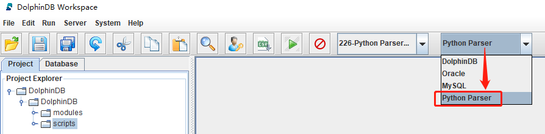


### 创建日频因子存储库表

通过因子存储最佳实践，日频因子存储库表创建示例代码如下：

```
import pandas as pd
import dolphindb as ddb

dbName, tbName = "dfs://dayFactorDB", "dayFactorTB"

# 数据库如果存在，删除该数据库
if existsDatabase(dbName):
    dropDatabase(dbName)

# 创建数据库：时间维度按年 RANGE 分区 + 因子名维度 VALUE 分区
db1 = database("", ddb.RANGE, date(datetimeAdd(1980.01M,seq(0,80)*12,'M')))
db2 = database("", ddb.VALUE, ["f1","f2"].toddb())
db = database(dbName, ddb.COMPO, [db1, db2].toddb(), engine='TSDB', atomic='CHUNK')

# 创建分区表
schemaTB = table(array(ddb.DATE, 0) as tradetime, 
                array(ddb.SYMBOL, 0) as securityid, 
                array(ddb.SYMBOL, 0) as factorname, 
                array(ddb.DOUBLE, 0) as value)

db.createPartitionedTable(schemaTB, tbName, partitionColumns=["tradetime", "factorname"].toddb(), compressMethods={"tradetime":"delta"}.toddb(), 
                        sortColumns=["securityid", "tradetime"].toddb(), keepDuplicates=ddb.ALL, sortKeyMappingFunction=[lambda x:hashBucket(x, 500)].toddb())

# 查看分区表结构
pt = loadTable(dbName, tbName)
pt.schema()
```

**存储结构**

- 对于多因子数据场景，用户可以选择**窄表**和**宽表**两种模式。
- 窄表模式把因子名存为一列，而宽表模式则把每个因子存为一列。
- 经测试在数据查询方面两种模式相差不大，但在增加因子、删除因子和更新因子等数据运维方面窄表模式性能显著优于宽表模式。
- 本教程示例代码为**窄表**存储最佳方案。

**分区存储**

- DolphinDB 支持数据分区存储，对于不同分区数据支持多线程并行写入，对于同一个分区数据支持并发查询。
- 经测试日频因子数据采用 “**时间维度按年 + 因子名**” 的组合分区方式存储，综合性能最佳。

**分区内分组排序存储**

- DolphinDB 的 TSDB 存储引擎提供排序键设置，每一个分区的数据写在一个或多个 level file 中，每一个 level file 内部的数据按照指定的列进行排序且创建索引。
- 排序列中除了最后一列的其他列通常为在点查中过滤条件会用到的列，其唯一值组合称为 SortKeys。
- 为保证性能最优，每个分区的 SortKeys 建议不超过 1000 个。当 SortKeys 较多时，可以通过设置 *sortKeyMappingFunction* 对 SortKeys 降维。
- 经测试日频因子数据采用 “**securityid+tradetime**” 的方式进行排序，sortKeyMapping 设置为 500 综合性能最佳。
- DolphinDB 默认数据存储的压缩算法为 lz4，对于时间、日期类型的数据，建议指定采用 delta 压缩算法存储，提高存储的压缩比。

### 当日尾盘成交占比因子

基于逐笔成交数据计算当日尾盘成交占比因子的计算公式如下：

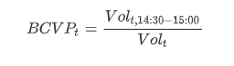

其中 BCVP<sub>t</sub>  表示 t 日期的尾盘成交占比； Vol<sub>t</sub>  表示 t 日期的总成交量； Vol<sub>t,14:30-15:00</sub> 表示 t 日期的 14:30—15:00 的成交量之和。

因子计算示例代码如下：

```
import pandas as pd
import dolphindb as ddb

# 定义因子函数
def beforeClosingVolumePercent(trade):
    tradeTime = trade["TradeTime"].astype(ddb.TIME)
    beforeClosingVolume = trade["TradeQty"][(tradeTime >= 14:30:00.000)&(tradeTime <= 15:00:00.000)].sum()
    totalVolume = trade["TradeQty"].sum()
    res = beforeClosingVolume / totalVolume
    return pd.Series([res], ["BCVP"])

# 指定计算某一天的因子
tradeTB = loadTable("dfs://TL_Level2", "trade")
df = pd.DataFrame(tradeTB, index="Market", lazy=True)
res = df[df["TradeTime"].astype(ddb.DATE)==2023.02.01][["TradeTime", "SecurityID", "TradeQty"]].groupby(["SecurityID"]).apply(beforeClosingVolumePercent)
```

示例代码解析：

- 因子函数 `beforeClosingVolumePercent` 的函数体是按照 Python 语法进行开发的。
- `tradeTime = trade["TradeTime"].astype(ddb.TIME)` 逐笔成交数据中的 TradeTime 以时间戳 TIMESTAMP 的数据类型存入数据库。数据类型的转化可以使用 `astype()` 函数。其中的类型关键字，需要加上 `ddb` 的前缀。
- DolphinDB 中的时间常量的格式：`yyyy.MM.ddTHH:mm:ss.SSS`，比如： 14:30:00.000、2023.02.01、2023.02.01T14:30:00.000
- `tradeTB = loadTable("dfs://TL_Level2", "trade")` 通过 `loadTable` 函数，将 "dfs://TL_Level2" 数据库下的分布式表 "trade" 的元数据取回到内存。此时变量 tradeTB 只包含元数据，库内数据并未取到内存。
- `df = pd.DataFrame(tradeTB, index="Market", lazy=True)` 通过 `pd.DataFrame()` 函数，将 DolphinDB 的表转化为数据框。对于分布式表而言，*index* 为必填参数，可以指定表中的任意一列，该列仅作为索引，后续可以不参与计算；*lazy* 参数指定计算是否立即执行，必须指定为 True，表示该 DataFrame 会存储所有函数调用，尽可能延迟计算，以减少计算带来的性能消耗。
- 可以通过 df[过滤条件] 的形式选出库内指定范围的数据。比如：`df[(df["TradeTime"].astype(ddb.DATE)==2023.02.01)&(df["SecurityID"]=="000001")]` 指定取库内 2023.02.01 的 “000001“ 这一天一只股票的数据。
- 建议在 `groupby` 执行计算函数之前，先对数据列进行过滤，只取出计算需要的列。可以降低内存使用，减少数据读取与拷贝的开销。
- 可以通过 .groupby(分组列).apply(函数) 的方式实现分组计算，Python Parser 内部对 `groupby.apply` 实现了并行计算。

### 存入数据库

上一节中的计算结果 `res` 是当前会话中的一个本地内存变量，关闭会话便会被释放，所以需要把计算结果存入数据库中的分区表中，达到持久化的目的。

把因子计算结果从内存存储到磁盘上的示例代码如下：

```
# res 是一个 Series, 需要将计算结果转化成窄表格式（共4列：tradetime, securityid, factorname, value）
result = res.reset_index().rename(columns={"SecurityID":"securityid"})
result["tradetime"] = 2023.02.01
result = result.melt(id_vars=["tradetime", "securityid"],value_vars=["BCVP"],var_name="factorname",value_name="value")

# 存入数据库
loadTable(dbName, tbName).append!(result.to_table())

# 查看库内数据量
select count(*) from loadTable(dbName, tbName)
```

示例代码解析：

- 因子库用窄表方式存储，需要先将 DataFrame 转化为和因子库统一的 4 列的格式：tradetime, securityid, factorname, value。
- 因为上述示例只计算了一天的因子，结果中没有日期信息，所以需要增加日期信息。
- 使用 `melt` 函数，将宽表转化为窄表。当计算出多个因子值时，可以修改参数 *value_vars*=[“factorname1“, “factorname2“, …]。
- `result.to_table()` 用 `.to_table()` 函数将 no-lazy 模式的 DataFrame 转化为 DolphinDB 中的内存表。
- 通过 `append!` 函数，将因子结果存入数据库。

## 创建因子存储库表

不同频率的因子数据每日数据量是不同的，DolphinDB 的分区方案主要是根据数据量来制定的，以窄表模式存储的数据量统计如下：

| **类型** | **标的数** | **因子数** | **频率** | **时间** | **数据量(TB)** | **数据行数(亿行)** | **日新增数据(GB)** |
| -------- | ---------- | ---------- | -------- | -------- | -------------- | ------------------ | ------------------ |
| 股票     | 5,000      | 10,000     | 日频     | 11年     | 2.4            | 1,337              | 0.9                |
| 股票     | 5,000      | 10,000     | 10分钟   | 11年     | 58.3           | 32,076             | 22.4               |
| 股票     | 5,000      | 10,000     | 1分钟    | 11年     | 583.4          | 320,760            | 223.5              |
| 股票     | 5,000      | 1,000      | 3秒      | 1年      | 126.8          | 58,080             | 536.4              |
| 股票     | 5,000      | 1,000      | 1秒      | 1年      | 380.3          | 174,240            | 1,609.3            |
| 期货     | 200        | 1,000      | 500毫秒  | 1年      | 35.2           | 16,117             | 148.9              |

为了方便用户快速上手 DolphinDB，我们通过因子存储最佳实践，总结了常用频率因子的最优存储方案，并给出了示例代码，如果用户没有时间了解分区的原理，直接复用官方提供的库表创建示例代码即可。

| **因子库**   | **分区方案**                                  | **分区列**                          | **排序列（sortColumns）** | **sortKeyMap** |
| :----------- | :-------------------------------------------- | :---------------------------------- | :------------------------ | :------------- |
| 日频         | 时间维度按年 + 因子名                         | tradetime + factorname              | securityid + tradetime    | 500            |
| 1 分钟频     | 时间维度按天 + 因子名                         | tradetime + factorname              | securityid + tradetime    | 500            |
| 10 分钟频    | 时间维度按月 + 因子名                         | tradetime + factorname              | securityid + tradetime    | 500            |
| 3s 快照频    | 时间维度按日 + 因子名                         | tradetime + factorname              | securityid + tradetime    | 500            |
| 逐笔频       | 时间维度按日 + 因子名 + 股票代码维度：HASH 10 | tradetime + factorname + securityid | securityid + tradetime    | 不降维         |
| 1s 频        | 时间维度按小时 + 因子名                       | tradetime + factorname              | securityid + tradetime    | 500            |
| 期货500ms 频 | 时间维度按日 + 因子名                         | tradetime + factorname              | securityid + tradetime    | 500            |

### 日频因子

日频因子数据库和分区表的创建示例代码：

```
import pandas as pd
import dolphindb as ddb

dbName, tbName = "dfs://dayFactorDB", "dayFactorTB"

# 数据库如果存在，删除该数据库
if existsDatabase(dbName):
    dropDatabase(dbName)

# 创建数据库：时间维度按年 RANGE 分区 + 因子名 VALUE 分区
db1 = database("", ddb.RANGE, date(datetimeAdd(1980.01M,seq(0,80)*12,'M')))
db2 = database("", ddb.VALUE, ["f1","f2"].toddb())
db = database(dbName, ddb.COMPO, [db1, db2].toddb(), engine='TSDB', atomic='CHUNK')

# 创建分区表
schemaTB = table(array(ddb.DATE, 0) as tradetime, 
                array(ddb.SYMBOL, 0) as securityid, 
                array(ddb.SYMBOL, 0) as factorname, 
                array(ddb.DOUBLE, 0) as value)

db.createPartitionedTable(schemaTB, tbName, partitionColumns=["tradetime", "factorname"].toddb(), compressMethods={"tradetime":"delta"}.toddb(), 
                        sortColumns=["securityid", "tradetime"].toddb(), keepDuplicates=ddb.ALL, sortKeyMappingFunction=[lambda x:hashBucket(x, 500)].toddb())
```

### 1分钟频因子

1 分钟频因子数据库和分区表的创建示例代码：

```
import pandas as pd
import dolphindb as ddb

dbName, tbName = "dfs://minuteFactorDB", "minuteFactorTB"

# 数据库如果存在，删除该数据库
if existsDatabase(dbName):
    dropDatabase(dbName)

# 创建数据库：时间维度按天 VALUE 分区 + 因子名 VALUE 分区
db1 = database("", ddb.VALUE, seq(2021.01.01, 2021.12.31))
db2 = database("", ddb.VALUE, ["f1","f2"].toddb())
db = database(dbName, ddb.COMPO, [db1, db2].toddb(), engine='TSDB', atomic='CHUNK')

# 创建分区表
schemaTB = table(array(ddb.DATE, 0) as tradetime, 
                array(ddb.SYMBOL, 0) as securityid, 
                array(ddb.SYMBOL, 0) as factorname, 
                array(ddb.DOUBLE, 0) as value)

db.createPartitionedTable(schemaTB, tbName, partitionColumns=["tradetime", "factorname"].toddb(), compressMethods={"tradetime":"delta"}.toddb(), 
                        sortColumns=["securityid", "tradetime"].toddb(), keepDuplicates=ddb.ALL, sortKeyMappingFunction=[lambda x:hashBucket(x, 500)].toddb())
```

### 10分钟频因子

10 分钟频因子数据库和分区表的创建示例代码：

```
import pandas as pd
import dolphindb as ddb

dbName, tbName = "dfs://tenMinutesFactorDB", "tenMinutesFactorTB"

# 数据库如果存在，删除该数据库
if existsDatabase(dbName):
    dropDatabase(dbName)

# 创建数据库：时间维度按月 VALUE 分区 + 因子名 VALUE 分区
db1 = database("", ddb.VALUE, seq(2023.01M, 2023.06M))
db2 = database("", ddb.VALUE, ["f1","f2"].toddb())
db = database(dbName, ddb.COMPO, [db1, db2].toddb(), engine='TSDB', atomic='CHUNK')

# 创建分区表
schemaTB = table(array(ddb.DATE, 0) as tradetime, 
                array(ddb.SYMBOL, 0) as securityid, 
                array(ddb.SYMBOL, 0) as factorname, 
                array(ddb.DOUBLE, 0) as value)

db.createPartitionedTable(schemaTB, tbName, partitionColumns=["tradetime", "factorname"].toddb(), compressMethods={"tradetime":"delta"}.toddb(), 
                        sortColumns=["securityid", "tradetime"].toddb(), keepDuplicates=ddb.ALL, sortKeyMappingFunction=[lambda x:hashBucket(x, 500)].toddb())
```

### 3秒快照频因子

3 秒快照频因子数据库和分区表的创建示例代码：

```
import pandas as pd
import dolphindb as ddb

dbName, tbName = "dfs://level2FactorDB", "level2FactorTB"

# 数据库如果存在，删除该数据库
if existsDatabase(dbName):
    dropDatabase(dbName)

# 创建数据库：时间维度按天 VALUE 分区 + 因子名 VALUE 分区
db1 = database("", ddb.VALUE, seq(2022.01.01, 2022.12.31))
db2 = database("", ddb.VALUE, ["f1","f2"].toddb())
db = database(dbName, ddb.COMPO, [db1, db2].toddb(), engine='TSDB', atomic='CHUNK')

# 创建分区表
schemaTB = table(array(ddb.DATE, 0) as tradetime, 
                array(ddb.SYMBOL, 0) as securityid, 
                array(ddb.SYMBOL, 0) as factorname, 
                array(ddb.DOUBLE, 0) as value)

db.createPartitionedTable(schemaTB, tbName, partitionColumns=["tradetime", "factorname"].toddb(), compressMethods={"tradetime":"delta"}.toddb(), 
                        sortColumns=["securityid", "tradetime"].toddb(), keepDuplicates=ddb.ALL, sortKeyMappingFunction=[lambda x:hashBucket(x, 500)].toddb())
```

### 逐笔频因子

逐笔频因子数据库和分区表的创建示例代码：

```
import pandas as pd
import dolphindb as ddb

dbName, tbName = "dfs://tickFactorDB", "tickFactorTB"

# 数据库如果存在，删除该数据库
if existsDatabase(dbName):
    dropDatabase(dbName)

# 创建数据库：时间维度按天 VALUE 分区 + 因子名 VALUE 分区 + 股票代码 HASH 10 分区
db1 = database("", ddb.VALUE, seq(2022.01.01, 2022.12.31))
db2 = database("", ddb.VALUE, ["f1","f2"].toddb())
db3 = database("", ddb.HASH, [ddb.SYMBOL, 10].toddb())
db = database(dbName, ddb.COMPO, [db1, db2, db3].toddb(), engine='TSDB', atomic='CHUNK')

# 创建分区表
schemaTB = table(array(ddb.DATE, 0) as tradetime, 
                array(ddb.SYMBOL, 0) as securityid, 
                array(ddb.SYMBOL, 0) as factorname, 
                array(ddb.DOUBLE, 0) as value)

db.createPartitionedTable(schemaTB, tbName, partitionColumns=["tradetime", "factorname", "securityid"].toddb(), compressMethods={"tradetime":"delta"}.toddb(), 
                        sortColumns=["securityid", "tradetime"].toddb(), keepDuplicates=ddb.ALL)
```

### 1秒频因子

1 秒频因子数据库和分区表的创建示例代码：

```
import pandas as pd
import dolphindb as ddb

dbName, tbName = "dfs://secondFactorDB", "secondFactorTB"

# 数据库如果存在，删除该数据库
if existsDatabase(dbName):
    dropDatabase(dbName)

# 创建数据库：时间维度按小时 VALUE 分区 + 因子名 VALUE 分区
db1 = database("", ddb.VALUE, seq(datehour(2022.01.01T00:00:00), datehour(2022.01.31T00:00:00)))
db2 = database("", ddb.VALUE, ["f1","f2"].toddb())
db = database(dbName, ddb.COMPO, [db1, db2].toddb(), engine='TSDB', atomic='CHUNK')

# 创建分区表
schemaTB = table(array(ddb.DATE, 0) as tradetime, 
                array(ddb.SYMBOL, 0) as securityid, 
                array(ddb.SYMBOL, 0) as factorname, 
                array(ddb.DOUBLE, 0) as value)

db.createPartitionedTable(schemaTB, tbName, partitionColumns=["tradetime", "factorname"].toddb(), compressMethods={"tradetime":"delta"}.toddb(), 
                        sortColumns=["securityid", "tradetime"].toddb(), keepDuplicates=ddb.ALL, sortKeyMappingFunction=[lambda x:hashBucket(x, 500)].toddb())
```

### 期货500毫秒频因子

期货 500 毫秒频因子数据库和分区表的创建示例代码：

```
import pandas as pd
import dolphindb as ddb

dbName, tbName = "dfs://futuresFactorDB", "futuresFactorTB"
# 数据库如果存在，删除该数据库
if existsDatabase(dbName):
    dropDatabase(dbName)

# 创建数据库：时间维度按天 VALUE 分区 + 因子名 VALUE 分区
db1 = database("", ddb.VALUE, seq(2021.01.01, 2021.12.31))
db2 = database("", ddb.VALUE, ["f1","f2"].toddb())
db = database(dbName, ddb.COMPO, [db1, db2].toddb(), engine='TSDB', atomic='CHUNK')

# 创建分区表
schemaTB = table(array(ddb.DATE, 0) as tradetime, 
                array(ddb.SYMBOL, 0) as securityid, 
                array(ddb.SYMBOL, 0) as factorname, 
                array(ddb.DOUBLE, 0) as value)

db.createPartitionedTable(schemaTB, tbName, partitionColumns=["tradetime", "factorname"].toddb(), compressMethods={"tradetime":"delta"}.toddb(), 
                        sortColumns=["securityid", "tradetime"].toddb(), keepDuplicates=ddb.ALL, sortKeyMappingFunction=[lambda x:hashBucket(x, 500)].toddb())
```

##  量化因子计算代码开发

本章节基于股票行情数据，选取了一些具有代表性的因子，用 Python Parser 进行了实现，旨在指导用户进行自定义因子的转写和开发。

### 双均线因子

双均线就是根据两条周期不一样的均线的相对位置来跟踪趋势的一种方法，本教程我们使用双均线交叉的方式来判断买卖方向：

- 短周期均线**从下向上**突破长周期均线时，意味着当前时间段具有上涨趋势，突破点就是常说的**金叉**，是股票的**买入信号**，在代码里，使用前一短均值小于前一长均值且当前短均值大于当前长均值的方式来判断金叉，赋予信号值为 1；
- 短周期均线**从上向下**跌破长周期均线时，意味着当前时间段具有下跌趋势，跌破点就是常说的**死叉**，是股票的**卖出信号**，在代码里，使用前一短均值大于前一长均值且当前短均值小于当前长均值的方式来判断金叉，赋予信号值为 -1。

在这里我们使用简单移动平均（Simple Moving Average），其中 n 为窗口大小：

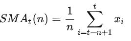

在下边的例子中我们使用了全市场 2020.07.01 至 2023.07.19 的日频股票数据来进行计算，在实际使用中可以自由更换数据频率，如分钟频率，小时频率等。

因子计算示例代码如下：

```
import pandas as pd
import dolphindb as ddb

# 调用数据
df = loadTable("dfs://Daily_adj_price", "data")
df = pd.DataFrame(df, "TRADE_DATE", True)

# 定义计算 ma 金叉死叉信号生成的方法
def signal_ma(data_chunk, short, long):
    #分别计算出5日和20日均线及其前一根均线
    data_chunk['ma_5'] = data_chunk['CLOSE_PRICE_1'].fillna(0).rolling(int(short)).mean()
    data_chunk['ma_20'] = data_chunk['CLOSE_PRICE_1'].fillna(0).rolling(int(long)).mean()
    data_chunk['pre_ma5'] = data_chunk['ma_5'].shift(1)
    data_chunk['pre_ma20'] =  data_chunk['ma_20'].shift(1)
    # 通过df[contion]方式按列进行条件，判断出金叉死叉信号
    data_chunk['signal'] = 0
    data_chunk.loc[((data_chunk.loc[:,'pre_ma5']< data_chunk.loc[:,'pre_ma20'])& (data_chunk.loc[:,'ma_5'] > data_chunk.loc[:,'ma_20'])), "signal"] = 1
    data_chunk.loc[((data_chunk.loc[:,'pre_ma5']> data_chunk.loc[:,'pre_ma20']) & (data_chunk.loc[:,'ma_5'] < data_chunk.loc[:,'ma_20'])), "signal"] = -1
    return data_chunk

# 生成信号
combined_results = df.groupby('SECURITY_ID').apply(signal_ma,5,20)
```

示例代码解析：

- 通过使用 pandas 包中的 `pd.groupby()` + `apply` 的方式
- 实现了按照股票代码分组后对前复权的收盘价使用 `rolling().mean()` 求出移动平均线，并根据长短期均线之间的位置关系来判断出金叉死叉进而产生信号：1代表多头信号，-1代表空头信号，0则为目前没有信号。
- 在计算双均线金叉死叉信号的时候，Python Pandas 版本的实现逻辑和代码同 Python Parser 保持了一致，因此在使用时无需额外操作即可在二者之间切换。此外，Python 解析器底层自动实现的批处理加速功能，省去了 Python 实现批处理所需的额外工作，更为高效。

### 十档净委买增额

本章节展示了如何基于 Level2 快照行情数据计算十档净委买增额。

十档净委买增额因子指的是在有效十档范围内买方资金总体增加量，即所有买价变化量的总和，计算公式如下：

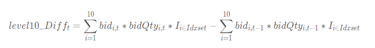

其中 level10_Diff<sub>t</sub> 表示 t 时刻的十档净委买增额； bid<sub>i,t</sub>  表示 t 时刻的第 i 档买方报价； bidQty<sub>i,t</sub> 表示 t 时刻的第 i 档买方挂单数量；指示函数 I 表示报价是否在有效释放范围内。

有效十档范围内表示不考虑已不在十档范围内的档位，即表示只考虑以下区间的档位：

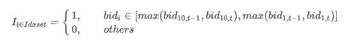

最后，对过去 n 时间窗口内的十档净委买增额求和。

因子计算示例代码如下：

```
import pandas as pd
import dolphindb as ddb

# 定义因子函数
def level10Diff(df, lag=20):
    temp = df[["TradeTime", "SecurityID"]]
    temp["bid"] = df["BidPrice"].fillna(0)
    temp["bidAmt"] = df["BidOrderQty"].fillna(0) * df["BidPrice"].fillna(0)
    temp["prevbid"] = temp["bid"].shift(1).fillna(0)
    temp["prevbidAmt"] = temp["bidAmt"].shift(1).fillna(0)
    temp["bidMin"] = temp["bid"].apply("min")
    temp["bidMax"] = temp["bid"].apply("max")
    temp["prevbidMin"] = temp["bidMin"].shift(1).fillna(0)
    temp["prevbidMax"] = temp["bidMax"].shift(1).fillna(0)
    temp["pmin"] = temp[["bidMin", "prevbidMin"]].max(axis=1)
    temp["pmax"] = temp[["bidMax", "prevbidMax"]].max(axis=1)
    amount = temp["bidAmt"]*((temp["bid"]>=temp["pmin"])&(temp["bid"]<=temp["pmax"]))
    lastAmount = temp["prevbidAmt"]*((temp["prevbid"]>=temp["pmin"])&(temp["prevbid"]<=temp["pmax"]))
    temp["amtDiff"] = amount.apply("sum") - lastAmount.apply("sum")
    temp["amtDiff"] = temp["amtDiff"].rolling(lag, 1).sum()
    return temp[["TradeTime", "SecurityID", "amtDiff"]].fillna(0)

# 指定计算某一天一只股票的因子
snapshotTB = loadTable("dfs://TL_Level2", "snapshot")
df = pd.DataFrame(snapshotTB, index="Market", lazy=True)
df = df[(df["TradeTime"].astype(ddb.DATE)==2023.02.01)&(df["SecurityID"]=="000001")]
res = level10Diff(df.compute(), 20)

# 指定计算某一天的因子
snapshotTB = loadTable("dfs://TL_Level2", "snapshot")
df = pd.DataFrame(snapshotTB, index="Market", lazy=True)
res = df[df["TradeTime"].astype(ddb.DATE)==2023.02.01][["TradeTime", "SecurityID", "BidPrice", "BidOrderQty"]].groupby(["SecurityID"]).apply(lambda x:level10Diff(x, 20))
```

示例代码解析：

- Level2 快照行情数据拥有十档行情量价数据。针对这种类型相同、含义相近的数据，可以考虑使用 DolphinDB 的 Array Vector 类型来存储。在 DolphinDB 里 Array Vector 是一种特殊的向量，用于存储可变长度的二维数组。上述代码就是基于十档行情用 Array Vector 类型存储的数据库开发的，其中 “BidPrice”、“BidOrderQty” 都是 ArrayVector 的列。
- 表中 Array Vector 类型的列转化为 DataFrame 中的一列之后，其中每个元素为 List。 
  

- 针对 Array Vector 转化的列，Python Parser 中支持四则运算、比较等基础运算（比如两列相乘 `df["BidOrderQty"].fillna(0) * df["BidPrice"].fillna(0)`）；其他运算需要使用 `apply` 函数（比如求每一行的最小值 `temp["bid"].apply("min")`）。
- 对于内置函数(比如 `max`/`min`/`sum` 等)，使用 `apply` 函数时，传入字符串和传入函数是有区别的。
  - 传入字符串时，比如 `temp["bid"].apply("max")`，首先会去找 series 类里有没有实现这个函数，如果有，就用 series 的这个函数；如果没有，就去找内置函数。
  - 传入函数时，比如 `temp["bid"].apply(max)`，会直接使用内置函数。

​         综上，对于 `apply` + 内置函数 的情况下，一般建议用户传入字符串。

- 使用 `shift(1)` 的方式获取上一笔快照的数据。
- 使用 `rolling().sum()` 的方式求滑动窗口内十档净委买增额的和。
- `snapshotTB = loadTable("dfs://TL_Level2", "snapshot")` 通过 `loadTable` 函数，将 "dfs://TL_Level2" 数据库下的分布式表 "snapshot" 的元数据取回到内存。此时变量 snapshotTB 只包含元数据，库内数据并未取到内存。
- `df = pd.DataFrame(snapshotTB, index="Market", lazy=True)` 通过 `pd.DataFrame()` 函数，将 DolphinDB 的表转化为数据框。对于分布式表而言，*index* 为必填参数，可以指定表中的任意一列，该列仅作为索引，后续可以不参与计算；*lazy* 参数指定计算是否立即执行，必须指定为 True，表示该 DataFrame 会存储所有函数调用，尽可能延迟计算，以减少计算带来的性能消耗。
- 可以通过 df[过滤条件] 的形式选出库内指定范围的数据。比如：`df[(df["TradeTime"].astype(ddb.DATE)==2023.02.01)&(df["SecurityID"]=="000001")]` 指定取库内 2023.02.01 的 “000001“ 这一天一只股票的数据。
- 建议在 `groupby` 执行计算函数之前，先对数据列进行过滤，只取出计算需要的列。可以降低内存使用，减少数据读取与拷贝的开销。
- lazy 模式下不允许直接改变 DataFrame 的值。因为 `level10Diff` 函数里面有 `temp["bid"] = df["BidPrice"].fillna(0)` 的操作，所以对直接过滤出来的 df 直接调用函数 `level10Diff(df, 20)` 会报错： `Lazy-model DataFrame does not support update value.` 需要使用 `df.compute()` 将 lazy 模式的 DataFrame 强制触发计算，转化为 no-lazy 模式的 DataFrame。 
- 可以通过 .groupby(分组列).apply(函数) 的方式实现分组计算，Python Parser 内部对 `groupby.apply` 实现了并行计算。

### 价格变动与一档量差的回归系数

本章节展示了如何基于 Level2 快照行情数据计算价格变动与一档量差的回归系数。

回归模型：


其中，

- ΔP<sub>t</sub>  表示 t 时刻的价格变动； lastPrice<sub>t</sub> 表示 t 时刻的最新价格；
- NVOL<sub>t</sub> 表示 t 时刻的买卖一档量差； bidQty<sub>1,t</sub> 表示 t 时刻的买方一档挂单笔数； askQty<sub>1,t</sub> 表示 t 时刻的卖方一档挂单笔数；
- α 表示截距；λ 表示斜率；εt 表示 t 时刻的残差。

其中回归系数  λ 为目标因子值。

因子计算示例代码如下：

```
import pandas as pd
import dolphindb as ddb

# 定义因子函数
def priceSensitivityOrderFlowImbalance(df):  
    deltaP = 10000*df["LastPrice"].diff().fillna(0)
    bidQty1 = df["BidOrderQty"].values[0]
    askQty1 = df["OfferOrderQty"].values[0]
    NVOL = bidQty1 - askQty1
    res = beta(deltaP.values, NVOL)
    return pd.Series([res], ["priceSensitivityOrderFlowImbalance"])

# 指定计算某一天一只股票的因子
snapshotTB = loadTable("dfs://TL_Level2", "snapshot")
df = pd.DataFrame(snapshotTB, index="Market", lazy=True)
df = df[(df["TradeTime"].astype(ddb.DATE)==2023.02.01)&(df["SecurityID"]=="000001")]
res = priceSensitivityOrderFlowImbalance(df.compute())
  
# 指定计算某一天的因子
snapshotTB = loadTable("dfs://TL_Level2", "snapshot")
df = pd.DataFrame(snapshotTB, index="Market", lazy=True)
res = df[df["TradeTime"].astype(ddb.DATE)==2023.02.01][["SecurityID", "LastPrice", "BidOrderQty", "OfferOrderQty"]].groupby(["SecurityID"]).apply(priceSensitivityOrderFlowImbalance) 
```

示例代码解析：

- Level2 快照行情数据拥有十档行情量价数据。针对这种类型相同、含义相近的数据，可以考虑使用 DolphinDB 的 Array Vector 类型来存储。在 DolphinDB 里 Array Vector 是一种特殊的向量，用于存储可变长度的二维数组。上述代码就是基于十档行情用 Array Vector 类型存储的数据库开发的，其中 “BidOrderQty”，“OfferOrderQty” 都是 ArrayVector 的列。
- 表中 Array Vector 类型的列转化为 DataFrame 中的一列之后，其中每个元素为 List。 
  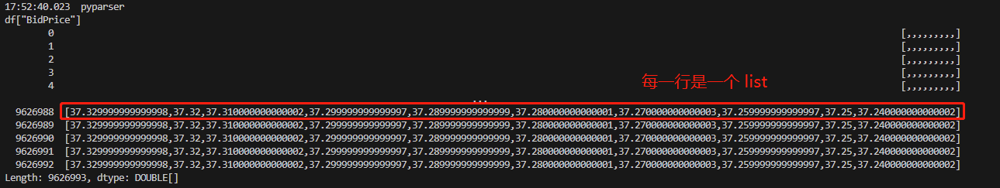

- 针对 ArrayVector 类型，DolphinDB 开发了很多内置函数提升 Array Vector 的易用性和计算性能，比如 row 系列函数。所以除了 上一章节的例子中使用的 `apply` 函数，也可以考虑将其通过 values 属性将 Series 转化为 DolphinDB 的类型，使用 DolphinDB 的内置函数，比如 `df["BidOrderQty"].values[0]` 取 Array Vector 的第一列.
- 使用 `diff(1)` 的方式计算一阶差分。
- 最新价 LastPrice 使用 DOUBLE 类型存储，因为量价的数量级相差较大，所以将价格变动扩大 10000 倍。
- 目前 Python Parser 只支持 pandas 中的函数，暂时还不支持 statsmodels、sklearn.linear_model 等数据分析包。所以不能直接计算回归系数。但是 DolphinDB 内置函数中，有 `beta` / `ols` 等函数可以求回归系数。所以这里选择用  values 属性将 Series 转化为 DolphinDB 的向量，使得后续可以调用 DolphinDB 的内置函数 `beta`。比如，`beta(deltaP.values, NVOL)`。
- `snapshotTB = loadTable("dfs://TL_Level2", "snapshot")` 通过 `loadTable` 函数，将 "dfs://TL_Level2" 数据库下的分布式表 "snapshot" 的元数据取回到内存。此时变量 snapshotTB 只包含元数据，库内数据并未取到内存。
- `df = pd.DataFrame(snapshotTB, index="Market", lazy=True)` 通过 `pd.DataFrame()` 函数，将 DolphinDB 的表转化为数据框。对于分布式表而言，*index* 为必填参数，可以指定表中的任意一列，该列仅作为索引，后续可以不参与计算；*lazy* 参数指定计算是否立即执行，必须指定为 True，表示该 DataFrame 会存储所有函数调用，尽可能延迟计算，以减少计算带来的性能消耗。
- 可以通过 df[过滤条件] 的形式选出库内指定范围的数据。比如：`df[(df["TradeTime"].astype(ddb.DATE)==2023.02.01)&(df["SecurityID"]=="000001")]` 指定取库内 2023.02.01 的 “000001“ 这一天一只股票的数据。
- 建议在 `groupby` 执行计算函数之前，先对数据列进行过滤，只取出计算需要的列。可以降低内存使用，减少数据读取与拷贝的开销。
- 不允许 lazy 和 no-lazy 的数据直接计算。当输入的 df 是 lazy 模式时，`df["LastPrice"].diff()` 操作会保留 lazy 模式，所以 deltaP 是 lazy 模式；`df["BidOrderQty"].apply(lambda x:x[0])` 则会直接触发计算，所以 NVOL 是 no-lazy 模式。所以对直接过滤出来的 df 直接调用函数 `priceSensitivityOrderFlowImbalance(df)` ，执行到 `NVOL*deltaP` 时会报错： `The operation args should be both lazy or not lazy.` 需要使用 `df.compute()` 将 lazy 模式的 DataFrame 强制触发计算，转化为 no-lazy 模式的 DataFrame。 
- 可以通过 .groupby(分组列).apply(函数) 的方式实现分组计算，Python Parser 内部对 `groupby.apply` 实现了并行计算。

### 主动成交量占比

本章节展示了如何基于 Level2 逐笔成交数据计算主动成交量占比。

主动成交占比即主动成交量占总成交量的比例，其计算公式如下：

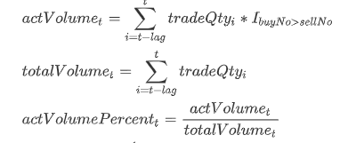

其中 tradeQty<sub>i</sub> 表示 i 时刻的成交量； actVolume<sub>t</sub> 表示 t 时刻起的前 lag 笔订单的主动成交量之和； totalVolume<sub>t</sub> 表示 t 时刻起的前 lag 笔订单的总成交量；指示函数 I 含义如下：

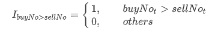

因子计算示例代码如下：

```
import pandas as pd
import dolphindb as ddb

# 定义因子函数
def actVolumePercent(trade, lag):   
    res = trade[["TradeTime", "SecurityID"]]
    actVolume = (trade["TradeQty"]*(trade['BidApplSeqNum'] > trade['OfferApplSeqNum'])).rolling(lag).sum()
    totalVolume = trade["TradeQty"].rolling(lag).sum()
    res["actVolumePercent"] = actVolume/totalVolume
    return res

# 指定计算某一天一只股票的因子
tradeTB = loadTable("dfs://TL_Level2", "trade")
df = pd.DataFrame(tradeTB, index="Market", lazy=True)
df = df[(df["TradeTime"].astype(ddb.DATE)==2023.02.01)&(df["SecurityID"]=="000001")]
res = actVolumePercent(df.compute(), 60)
  
# 指定计算某一天的因子
tradeTB = loadTable("dfs://TL_Level2", "trade")
df = pd.DataFrame(tradeTB, index="Market", lazy=True)
res = df[df["TradeTime"].astype(ddb.DATE)==2023.02.01][["TradeTime", "SecurityID", "TradeQty", "BidApplSeqNum", "OfferApplSeqNum"]].groupby(["SecurityID"]).apply(lambda x: actVolumePercent(x, 60))
```

示例代码解析：

- 通过条件 `trade['BidApplSeqNum'] > trade['OfferApplSeqNum']` 过滤出主动成交订单。
- 通过 `rolling(lag).sum()` 的方式计算前 lag 笔订单的成交量之和。
- `tradeTB = loadTable("dfs://TL_Level2", "trade")` 通过 `loadTable` 函数，将 "dfs://TL_Level2" 数据库下的分布式表 "trade" 的元数据取回到内存。此时变量 tradeTB 只包含元数据，库内数据并未取到内存。
- `df = pd.DataFrame(tradeTB, index="Market", lazy=True)` 通过 `pd.DataFrame()` 函数，将 DolphinDB 的表转化为数据框。对于分布式表而言，*index* 为必填参数，可以指定表中的任意一列，该列仅作为索引，后续可以不参与计算；*lazy* 参数指定计算是否立即执行，必须指定为 True，表示该 DataFrame 会存储所有函数调用，尽可能延迟计算，以减少计算带来的性能消耗。
- 可以通过 df[过滤条件] 的形式选出库内指定范围的数据。比如：`df[(df["TradeTime"].astype(ddb.DATE)==2023.02.01)&(df["SecurityID"]=="000001")]` 指定取库内 2023.02.01 的 “000001“ 这一天一只股票的数据。
- 建议在 `groupby` 执行计算函数之前，先对数据列进行过滤，只取出计算需要的列。可以降低内存使用，减少数据读取与拷贝的开销。
- lazy 模式下不允许直接改变 DataFrame 的值。因为 `actVolumePercent` 函数里面有 `res["actVolumePercent"] = actVolume/totalVolume` 的操作，所以对直接过滤出来的 df 直接调用函数 `actVolumePercent(df, 60)` 会报错： `Lazy-model DataFrame does not support update value.` 需要使用 df.compute() 将 lazy 模式的 DataFrame 强制触发计算，转化为 no-lazy 模式的 DataFrame。 
- 可以通过 .groupby(分组列).apply(函数) 的方式实现分组计算，Python Parser 内部对 groupby.apply 实现了并行计算。

### 早盘买卖单大小比

本章节展示了如何基于 Level2 逐笔委托数据计算早盘买卖单大小比。

早盘买卖单大小比即早盘时间段买入订单平均委托量占卖出订单平均委托量的比例的对数，其计算公式如下：

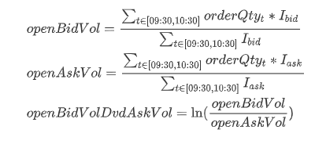

其中 openBidVol 表示早盘时间段买入订单平均委托量； openAskVol 表示早盘时间段卖出订单平均委托量； orderQty<sub>t</sub> 表示 t 时刻的委托量；

​         I<sub>bid</sub> 是指示函数，当订单为买方委托单时值为 1，否则为 0； I<sub>ask</sub> 是指示函数，当订单为卖方委托单时值为 1，否则为 0。

因子计算示例代码如下：

```
import pandas as pd
import dolphindb as ddb

# 定义因子函数
def openBidVolDvdAskVol(df):
    tradeTime = df["TradeTime"].astype(ddb.TIME)
    openBidVolume = df["OrderQty"][(tradeTime >= 09:30:00.000)&(tradeTime <= 10:30:00.000)&((df["Side"]=="1")|(df["Side"]=="B"))].mean()
    openAskVolume = df["OrderQty"][(tradeTime >= 09:30:00.000)&(tradeTime <= 10:30:00.000)&((df["Side"]=="2")|(df["Side"]=="S"))].mean()
    if((openBidVolume>0)&(openAskVolume>0)):
        res = log(openBidVolume / openAskVolume)
    else:
        res = None
    return pd.Series([res], ["openBidVolDvdAskVol"])

# 指定计算某一天一只股票的因子
orderTB = loadTable("dfs://TL_Level2", "entrust")
df = pd.DataFrame(orderTB, index="Market", lazy=True)
df = df[(df["TradeTime"].astype(ddb.DATE)==2023.02.01)&(df["SecurityID"]=="000001")]
res = openBidVolDvdAskVol(df)
  
# 指定计算某一天的因子
orderTB = loadTable("dfs://TL_Level2", "entrust")
df = pd.DataFrame(orderTB, index="Market", lazy=True)
df = df[df["TradeTime"].astype(ddb.DATE)==2023.02.01]
res = df[df["TradeTime"].astype(ddb.DATE)==2023.02.01][["TradeTime", "SecurityID", "OrderQty", "Side"]].groupby(["SecurityID"]).apply(openBidVolDvdAskVol)
```

示例代码解析：

- `tradeTime = df["TradeTime"].astype(ddb.TIME)` 逐笔委托数据中的 TradeTime 以时间戳 TIMESTAMP 的数据类型存入数据库。数据类型的转化可以使用 `astype()` 函数。其中的类型关键字，需要加上 `ddb` 的前缀。
- DolphinDB 中的时间常量的格式：`yyyy.MM.ddTHH:mm:ss.SSS`，比如：09:30:00.000、2023.02.01、2023.02.01T09:30:00.000
- 通联数据中深交所和上交所的买卖方向用的不一样的枚举值。上交所：买单“B”，卖单“S”；深交所：买单“1”，卖单“2”。所以在判断买卖单的时候，增加了“或逻辑”（`|`）的判断。
- `if((openBidVolume>0)&(openAskVolume>0))` 这部分做了一个数据校验，避免出现某些股票早盘没有委托单时，早盘委托量为空的情况。
- `orderTB = loadTable("dfs://TL_Level2", "entrust")` 通过 `loadTable` 函数，将 "dfs://TL_Level2" 数据库下的分布式表 "entrust" 的元数据取回到内存。此时变量 orderTB 只包含元数据，库内数据并未取到内存。
- `df = pd.DataFrame(orderTB, index="Market", lazy=True)` 通过 `pd.DataFrame()` 函数，将 DolphinDB 的表转化为数据框。对于分布式表而言，*index* 为必填参数，可以指定表中的任意一列，该列仅作为索引，后续可以不参与计算；*lazy* 参数指定计算是否立即执行，必须指定为 True，表示该 DataFrame 会存储所有函数调用，尽可能延迟计算，以减少计算带来的性能消耗。
- 可以通过 df[过滤条件] 的形式选出库内指定范围的数据。比如：`df[(df["TradeTime"].astype(ddb.DATE)==2023.02.01)&(df["SecurityID"]=="000001")]` 指定取库内 2023.02.01 的 “000001” 这一天一只股票的数据。
- 建议在 `groupby` 执行计算函数之前，先对数据列进行过滤，只取出计算需要的列。可以降低内存使用，减少数据读取与拷贝的开销。
- 可以通过 .groupby(分组列).apply(函数) 的方式实现分组计算，Python Parser 内部对 `groupby.apply` 实现了并行计算。

### 委托量加权平均委托价格

本章节展示了如何基于 Level2 逐笔委托数据计算委托量加权平均委托价格。

委托量加权平均委托价格是将多笔委托单的委托价格按各自的委托量加权而算出的平均价格，其计算公式如下：

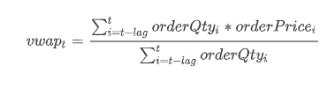

其中 vwap<sub>t</sub> 表示 t 时刻起的前 lag 笔委托单的委托量加权平均委托价格； orderQty<sub>i</sub> 表示 i 时刻委托单的委托量； orderPrice<sub>i</sub> 表示 i 时刻委托单的委托价格。

因子计算示例代码如下：

```
import pandas as pd
import dolphindb as ddb

# 定义因子函数
def volumeWeightedAvgPrice(df, lag):
    res = df[["TradeTime", "SecurityID"]]
    totalAmount = (df["OrderQty"]*df["Price"]).rolling(lag).sum()
    totalVolume = df["OrderQty"].rolling(lag).sum()
    res["volumeWeightedAvgPrice"] = totalAmount / totalVolume
    return res

# 指定计算某一天一只股票的因子
orderTB = loadTable("dfs://TL_Level2", "entrust")
df = pd.DataFrame(orderTB, index="Market", lazy=True)
df = df[(df["TradeTime"].astype(ddb.DATE)==2023.02.01)&(df["SecurityID"]=="000001")]
res = volumeWeightedAvgPrice(df.compute(), 60)
  
# 指定计算某一天的因子
orderTB = loadTable("dfs://TL_Level2", "entrust")
df = pd.DataFrame(orderTB, index="Market", lazy=True)
res = df[df["TradeTime"].astype(ddb.DATE)==2023.02.01][["TradeTime", "SecurityID", "OrderQty", "Price"]].groupby(["SecurityID"]).apply(lambda x: volumeWeightedAvgPrice(x, 60))
```

示例代码解析：

- 通过 `rolling(lag).sum()` 的方式分别计算前 lag 笔委托单的总委托金额和总委托量
- `orderTB = loadTable("dfs://TL_Level2", "entrust")` 通过 `loadTable` 函数，将 "dfs://TL_Level2" 数据库下的分布式表 "entrust" 的元数据取回到内存。此时变量 orderTB 只包含元数据，库内数据并未取到内存。
- `df = pd.DataFrame(orderTB, index="Market", lazy=True)` 通过 `pd.DataFrame()` 函数，将 DolphinDB 的表转化为数据框。对于分布式表而言，*index* 为必填参数，可以指定表中的任意一列，该列仅作为索引，后续可以不参与计算；*lazy* 参数指定计算是否立即执行，必须指定为 True，表示该 DataFrame 会存储所有函数调用，尽可能延迟计算，以减少计算带来的性能消耗。
- 可以通过 df[过滤条件] 的形式选出库内指定范围的数据。比如：`df[(df["TradeTime"].astype(ddb.DATE)==2023.02.01)&(df["SecurityID"]=="000001")]` 指定取库内 2023.02.01 的 “000001” 这一天一只股票的数据。
- 建议在 `groupby` 执行计算函数之前，先对数据列进行过滤，只取出计算需要的列。可以降低内存使用，减少数据读取与拷贝的开销。
- lazy 模式下不允许直接改变 DataFrame 的值。因为 `volumeWeightedAvgPrice` 函数里面有 `res["orderWeightPrice"] = totalAmount/totalVolume` 的操作，所以对直接过滤出来的 df 直接调用函数 `volumeWeightedAvgPrice(df, 60)` 会报错： `Lazy-model DataFrame does not support update value.` 需要使用 `df.compute()` 将 lazy 模式的 DataFrame 强制触发计算，转化为 no-lazy 模式的 DataFrame。 
- 可以通过 .groupby(分组列).apply(函数) 的方式实现分组计算，Python Parser 内部对 `groupby.apply` 实现了并行计算。

## 性能测试

### 性能测试环境

| CPU 类型    | Intel(R) Xeon(R) Gold 5220R CPU @ 2.20GHz |
| ----------- | ----------------------------------------- |
| 逻辑CPU总数 | 24                                        |
| 内存        | 256 GB                                    |
| OS          | CentOS Linux release 7.9.2009 (Core)      |

### 性能测试结果

**测试数据**

- 2023 年单个交易所某日的 level-2 全天数据
  - 快照数据：24,313,086 行 × 62 列 [约 20.6 GB]
  - 逐笔成交：108,307,125 行 × 19 列 [约 11.0 GB]
  - 逐笔委托：141,182,534 行 × 16 列 [约 11.6 GB]

|   数据源  |             因子             | Python Parser 运行耗时 | DolphinDB Scripts 运行耗时 | Python 运行耗时 | DolphinDB Scripts / python parser 性能对比 | Python / python parser 性能对比 |
|:---------:|:----------------------------:|:----------------------:|:--------------------------:|:---------------:|:------------------------------------------:|:-------------------------------:|
| 日频 K 线 |     双均线因子(单只股票）    |        10.88 ms        |           9.07 ms          |      30 ms      |                    0.836                   |              2.757              |
| 日频 K 线 |    双均线因子(全市场股票）   |          1.1 s         |           0.566 s          |     14.01 s     |                    0.515                   |              12.74              |
|  快照行情 |        十档净委买增额        |          4.3 s         |            1.4 s           |      49.4 s     |                    0.326                   |              11.488             |
|  快照行情 | 价格变动与一档量差的回归系数 |          2.8 s         |           0.34 s           |      25.5 s     |                    0.019                   |              9.107              |
|  逐笔成交 |        主动成交量占比        |          6.9 s         |            1.2 s           |      52.9 s     |                    0.174                   |              7.667              |
|  逐笔成交 |       当日尾盘成交占比       |          4.1 s         |           0.31 s           |      19.6 s     |                    0.076                   |              4.780              |
|  逐笔委托 |       早盘买卖单大小比       |          5.8 s         |           0.64 s           |      21.1 s     |                    0.110                   |              3.638              |
|  逐笔委托 |    委托量加权平均委托价格    |          7.2 s         |            1.4 s           |      77.2 s     |                    0.194                   |              10.722             |

## 总结

DolphinDB Python Parser 支持 Python 的常用语法，并兼容了 DolphinDB 部分独有语法。相比于 Python API，Python Parser 能够方便地访问 DolphinDB 库内的数据，减少了网络层面的开销；并且针对 groupby 等函数底层自动实现并行计算，提高计算性能。相比于 DolphinDB Scripts，Python Parser 兼容常用 Python 语法，学习难度更低，用户可以轻松上手 DolphinDB。

本教程针对量化金融中最常见的因子计算场景，提供了一种基于 Python Parser 开发因子的解决方案，包括不同频率因子库的存储方案和基于不同频率不同数据源的基础因子开发代码，并且因子计算性能和 Python 多进程框架相比能有 5 倍以上的提升。 

## 附件

- 示例数据：[tradeData.zip](data/DolphinDB_Python_Parser_Intro_for_Quantitative_Finance/tradeData.zip) 
- 因子实现 DolphinDB 版本：
  - [当日尾盘成交占比.txt](script/DolphinDB_Python_Parser_Intro_for_Quantitative_Finance/因子实现_DolphinDB版本/当日尾盘成交占比.txt) 
  - [价格变动与一档量差的回归系数.txt](script/DolphinDB_Python_Parser_Intro_for_Quantitative_Finance/因子实现_DolphinDB版本/价格变动与一档量差的回归系数.txt) 
  - [十档净委买增额.txt](script/DolphinDB_Python_Parser_Intro_for_Quantitative_Finance/因子实现_DolphinDB版本/十档净委买增额.txt) 
  - [双均线.txt](script/DolphinDB_Python_Parser_Intro_for_Quantitative_Finance/因子实现_DolphinDB版本/双均线.txt) 
  - [委托量加权平均委托价格.txt](script/DolphinDB_Python_Parser_Intro_for_Quantitative_Finance/因子实现_DolphinDB版本/委托量加权平均委托价格.txt) 
  - [早盘买卖单大小比.txt](script/DolphinDB_Python_Parser_Intro_for_Quantitative_Finance/因子实现_DolphinDB版本/早盘买卖单大小比.txt) 
  - [主动成交量占比.txt](script/DolphinDB_Python_Parser_Intro_for_Quantitative_Finance/因子实现_DolphinDB版本/主动成交量占比.txt) 
- 因子实现 Python 版本：
  - [双均线](script/DolphinDB_Python_Parser_Intro_for_Quantitative_Finance/因子实现_Python版本/双均线) 
  - [当日尾盘成交占比.ipynb](script/DolphinDB_Python_Parser_Intro_for_Quantitative_Finance/因子实现_Python版本/当日尾盘成交占比.ipynb) 
  - [价格变动与一档量差的回归系数.ipynb](script/DolphinDB_Python_Parser_Intro_for_Quantitative_Finance/因子实现_Python版本/价格变动与一档量差的回归系数.ipynb) 
  - [十档委买增额.ipynb](script/DolphinDB_Python_Parser_Intro_for_Quantitative_Finance/因子实现_Python版本/十档委买增额.ipynb) 
  - [委托量加权平均委托价格.ipynb](script/DolphinDB_Python_Parser_Intro_for_Quantitative_Finance/因子实现_Python版本/委托量加权平均委托价格.ipynb) 
  - [早盘买卖单大小比.ipynb](script/DolphinDB_Python_Parser_Intro_for_Quantitative_Finance/因子实现_Python版本/早盘买卖单大小比.ipynb) 
  - [主动成交量占比.ipynb](script/DolphinDB_Python_Parser_Intro_for_Quantitative_Finance/因子实现_Python版本/主动成交量占比.ipynb) 