# DolphinDB 通过 Telegraf + Grafana 实现设备指标的采集监控和展示

基于原始数据采集的可视化监控是企业确保设备正常运行和安全生产的重要措施。本文详细介绍了如何从 DolphinDB 出发，借助 Telegraf 对设备进行原始数据采集，并通过 Grafana 实现数据的可视化，从而实现设备指标的实时监控。

- [1. 概览](#1-概览)
- [2. 安装](#2-安装)
	- [2.1 安装 Telegraf](#21-安装-telegraf)
	- [2.2 安装 Grafana](#22-安装-grafana)
	- [2.3 安装 DolphinDB](#23-安装-dolphindb)
- [3. Telegraf 采集数据到 DolphinDB](#3-telegraf-采集数据到-dolphindb)
	- [3.1 下载/自行编译 telegraf-dolphindb-outputs 插件](#31-下载自行编译-telegraf-dolphindb-outputs-插件)
	- [3.2 DolphinDB 环境准备](#32-dolphindb-环境准备)
	- [3.3 配置文件准备](#33-配置文件准备)
	- [3.4 配置说明](#34-配置说明)
	- [3.5 启动 Telegraf](#35-启动-telegraf)
	- [3.6 查询指标](#36-查询指标)
- [4. Grafana 可视化 DolphinDB 数据](#4-grafana-可视化-dolphindb-数据)
	- [4.1 配置 Grafana](#41-配置-grafana)
- [5. 运维实例：用 Telegraf+DolphinDB+Grafana 监控预警 CPU 使用率](#5-运维实例用-telegrafdolphindbgrafana-监控预警-cpu-使用率)
- [6. 附件](#6-附件)


## 1. 概览

Telegraf 是 InfluxData 公司推出的用于采集各种指标信息的工具，可以将采集到的指标数据输出到指定存储，并使用相应工具进行指标展示。

DolphinDB 是由浙江智臾科技有限公司研发的一款高性能分布式时序数据库，集成了功能强大的编程语言和高容量高速度的流数据分析系统。

Grafana 是由 Grafana Labs 公司开源的一个系统监测工具。

将三者结合，可以快速搭建一套集指标采集、指标存储/实时处理、指标处理结果展示功能于一体的系统。本文详细介绍如何在 Linux 环境中部署 Telegraf 实时采集设备指标数据，并使用 DolphinDB 作为输出存储，最终将输出到 DolphinDB 的指标数据在 Grafana 图表中进行展示，完成搭建一整套设备指标实时监控系统，在文章最后提供了一个实际实现案例。

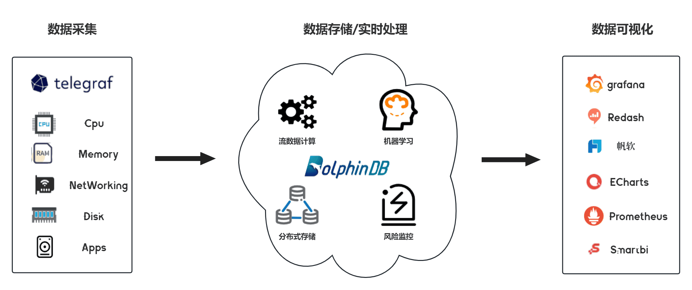

架构图

## 2. 安装

安装 Telegraf、Grafana 和 DolphinDB。

### 2.1 安装 Telegraf

本文这里使用的 Telegraf 版本为 1.24.4。

**2.1.1 下载并安装**


```
wget https://dl.influxdata.com/telegraf/releases/telegraf_-_1.24.4_linux_amd64.tar.gz
tar xf telegraf-1.24.4_linux_amd64.tar.gz
```

详细请参考[Telegraf 官方指南](https://docs.influxdata.com/telegraf/v1.24/install/?t=RedHat+%26amp%3B+CentOS)。

### 2.2 安装 Grafana

本文这里使用的 Grafana 版本为 9.3.2。

**2.2.1 下载并安装**


```
wget https://dl.grafana.com/enterprise/release/grafana-enterprise-9.3.2-1.x86_64.rpm
sudo yum install grafana-enterprise-9.3.2-1.x86_64.rpm
```

**2.2.2 启动 Grafana**

1. 启动 Grafana 命令。


```
systemctl start grafana-server
systemctl enable grafana-server
```

2. 防火墙开放 Grafana 端口号，Grafana 服务默认端口 3000。


```
firewall-cmd --zone=public --add-port=3000/tcp --permanent 
firewall-cmd --reload
```

3. 本机打开 Grafana，检验是否安装成功。


```
http://localhost:3000/
```

详细请参考 [Grafana](https://grafana.com/grafana/download) [官方指南](https://grafana.com/grafana/download)。

### 2.3 安装 DolphinDB

本文这里使用社区版单机单节点 server，版本为 2.00.7。建议使用 2.00.x 版本。

**2.3.1 下载并安装**

1. 从 DolphinDB 官网下载版本为 2.00.7 的社区版 DolphinDB。
2. 将下载的压缩包放到 Linux 服务器的指定路径下，并解压完成安装。

详细请参考 [DolphinDB 安装使用指南](https://gitee.com/dolphindb/Tutorials_CN/blob/master/dolphindb_user_guide.md)。

**2.3.2 启动 DolphinDB**

1. 进入 server 目录，给 dolphindb 文件添加读写改权限。


```
chmod +x dolphindb   
```

2. 防火墙开放 8848 端口号（dolphindb 服务默认端口）。


```
firewall-cmd --zone=public --add-port=8848/tcp --permanent 
firewall-cmd --reload
```

3. 启动 DolphinDB。


```
前台启动命令：
./dolphindb
后台启动命令:
nohup ./dolphindb -console 0 &
```

## 3. Telegraf 采集数据到 DolphinDB

Telegraf 的插件分为四类：数据源（Input）、指标处理（Processor）、指标聚合（Aggregator）、数据输出（Output）。

Telegraf 提供了插件运行的框架和标准，将所有 Input 收集到的时序数据通过 Processor 处理后给到 Aggregator 进行聚合计算，最后输出到 Output，Output 插件再将时序数据写到某个地方，比如数据库、其他网络服务、消息队列或文件等。

因此要实现将 Telegraf 的数据采集到 DolphinDB，只需要在 Telegraf 中制作数据输出存储为 DolphinDB 的 Output 插件即可，实现的 Output 插件只要符合 Telegraf 的插件接口和数据标准，即可接入 Telegraf。下面提供用 go 语言编写的 Output 接口标准：


```
type Output interface {
	PluginDescriber

	// Connect to the Output; connect is only called once when the plugin starts
	Connect() error
	// Close any connections to the Output. Close is called once when the output
	// is shutting down. Close will not be called until all writes have finished,
	// and Write() will not be called once Close() has been, so locking is not
	// necessary.
	Close() error
	// Write takes in group of points to be written to the Output
	Write(metrics []Metric) error
}

type PluginDescriber interface {
	// SampleConfig returns the default configuration of the Plugin
	SampleConfig() string
}
```

Output 接口主要实现了 Connect、Write、Close 三个方法，具体功能如下：

- Connect 方法作为初始化调用，主要功能如下：
  - 获取 Flag 并解析配置文件，初始化参数；
  - 初始化连接并登录；
- Write 方法在有数据输入时调用，其主要功能如下：
  - 解析 metrics 数据；
  - 将数据写入输出端；
- Close 方法负责关闭连接并登出。

DolphinDB 基于 Telegraf 的 Output 插件将 Telegraf 采集并处理过的数据写入 DolphinDB 中。该插件作为 Telegraf 的子进程在后台常驻运行，Telegraf 将采集并处理好的数据进行序列化并通过 stdin 传入该插件，并通过该插件的 stderr 监听插件日志及处理结果。这里实施将以 Telegraf 内置的‘disk’和 'system‘作为输入源，并将相关数据写入到 DolphinDB。

附件已提供 DolphinDB 实现好的 telegraf-dolphindb-outputs 插件，直接下载即可，或也可自行编译实现该插件。

### 3.1 下载/自行编译 telegraf-dolphindb-outputs 插件

**3.1.1 下载插件**

1.下载附件 telegraf-dolphindb-outputs, 放到自行指定路径下，得到插件文件 telegraf-dolphindb-outputs。

2. 将插件文件 telegraf-dolphindb-outputs 授予可执行权限并移动至 $PATH 路径。


```
export PATH=$PATH:/xxxx/
source /etc/profile
```

**3.1.2 自行编译插件**

1. 下载附件 telegraf.zip，放到自行指定路径下，得到编译源码。
2. 安装编译环境

编译环境为 go 环境，本文使用的 go 环境版本为 1.19.4。

①从 [go 官网](https://go.dev/doc/install)下载 go 安装包。

②将下载的压缩包放到 Linux 服务器的自行指定路径下。

③删除原环境自带的 go 环境，并解压下载的 go 压缩包到自行指定路径。


```
rm -rf /usr/local/go && tar -C /usr/local -xzf go1.19.4.linux-amd64.tar.gz
```

④将 go 环境添加到系列变量。


```
export PATH=$PATH:/usr/local/go/bin
source /etc/profile
```

⑤添加后，查看 go 版本检验是否添加成功。


```
 go version
```

详细请参考 [Go 官方指南](https://go.dev/doc/install)。

3. 编译插件

①将下载的编译源码包 telegraf.zip 进行解压，得到项目 go-plugins。

②在 go-plugins 的根目录执行编译脚本。


```
go build -mod mod -o telegraf-dolphindb-outputs cmd/telegraf-outputs/telegraf-outputs.go
```

若执行脚本出错，显示错误：dial tcp 172.217.27.145:443: i/o timeout，请在 /etc/profile 中设置 GOPROXY 环境变量（改一下代理）, 之后启用 go module，用下面的命令：


```
export GOPROXY=https://goproxy.io
export GO111MODULE=on
```

③将编译好的插件文件 telegraf-dolphindb-outputs 授予可执行权限并移动至 $PATH 路径（可将 go-plugins 的根目录添加到系统变量中）。


```
export PATH=$PATH:/xxxx/go-plugins/
source /etc/profile
```

④完成 telegraf-dolphindb-outputs 插件编译。

### 3.2 DolphinDB 环境准备

在启动 Telegraf 前，需在 DolphinDB 中建立相应的库表环境：分布式表 disk 和 system，用于接受并存储 Telegraf 采集到的 disk 和 system 数据。下面提供两种建立库表环境的方式。两种方式执行后，均可在 DolphinDB 中生成 path 为 "dfs://telegraf" 的数据库，且该数据库中有如下两张分布式表：

- 表 disk

| name         | typeString |
| :----------- | :--------- |
| timestamp    | TIMESTAMP  |
| host         | STRING     |
| total        | LONG       |
| used         | LONG       |
| free         | LONG       |
| used_percent | DOUBLE     |

- 表 system

| name          | typeString |
| :------------ | :--------- |
| timestamp     | TIMESTAMP  |
| uptime_format | STRING     |

**3.2.1 用 DolphinDB 脚本建库建表**


```
//登录
login(`admin,`123456)

//数据库名
dbName = "dfs://telegraf"

//表 disk
diskColnames = `timestamp`host`total`used`free`used_percent
diskColtypes =[TIMESTAMP,STRING,LONG,LONG,LONG,DOUBLE]
disk = table(1:0,diskColnames,diskColtypes)

//表 system
systemColnames = `timestamp`uptime_format
systemColtypes =[TIMESTAMP,STRING]
system = table(1:0,systemColnames,systemColtypes)

//创建分布式库 db_telegraf 和分布式表 db_disk,db_system 
db_telegraf = database(directory=dbName, partitionType=VALUE,partitionScheme = 2022.01.01..2022.12.31)
db_disk = createPartitionedTable(dbHandle = db_telegraf,table = disk,tableName = "disk",partitionColumns ="timestamp",compressMethods = {timestamp:"delta"});
db_system = createPartitionedTable(dbHandle = db_telegraf,table = system,tableName = "system",partitionColumns ="timestamp",compressMethods = {timestamp:"delta"});
```

**3.2.2 用项目提供的 Go 脚本建库建表**

1.修改本项目 test/dolphindb.go 文件中的变量 DefaultCfg。


```
DefaultCfg = &outputs.Config{
    Address:      "localhost:8848", //单节点DolphinDB的地址
    User:         "admin", //DolphinDB账户，默认为admin
    Password:     "123456", // DolphinDB账户密码，默认为123456
    ……
}
```

2.在本项目 test 路径下执行以下指令。


```
go test -v dolphindb.go telegraf.go telegraf_test.go -test.run TestPreparePartitionedTableForTelegraf -count=1
go test -v dolphindb.go telegraf.go telegraf_test.go -test.run TestPrepareSecondPartitionedTableForTelegraf -count=1
```

### 3.3 配置文件准备

**3.3.1 Telegraf 配置文件准备**

1. 创建配置文件 TelegrafConfig，存放路径 $TelegrafConfig。详细配置文件信息，请参考附件 TelegrafConfig，其中 OUTPUT PLUGINS 和 INPUT PLUGINS 的内容，请根据需求自行设定，本文只提供参考。

**3.3.2 DolphinDB Output 配置文件准备**

1. 创建 DolphinDB Output Disk 配置文件：/dolphindb/dolphindb-output-disk.conf，配置文件路径与 TelegrafConfig 中的 command 使用路径一致，dolphindb-output-disk.conf 示例如下：


```
# Configuration for DolphinDB to send metrics to.
[[outputs.dolphindb]]
# The address of DolphinDB formatted as {ip}:{port}
address = "localhost:8848"
# The user of DolphinDB.
user = "admin"
# The password of DolphinDB.
password = "123456"
# Name of the database to store metrics in.
database = "dfs://telegraf"
# Name of the table to store metrics in.
table_name = "disk"
# The number of messages to be batched.
# If batch_size is 1, the data is sent to the server immediately after it is written.
# If batch_size is more than 1, the data is sent to the server only when the amount of data reaches batch_size.
batch_size = 10
# An integer more than 0 in milliseconds.
# The data will be sent to the server after written for throttle time,
# even through the data amount is less than the batch_size.
throttle = 1000
# The name of the metrics.
metric_name = "disk"
# The count of the goroutine to send the metrics data to the DolphinDB.
goroutine_count = 1
# The partition column of the table, only works when the goroutine_count is more than 1.
partition_col = "timestamp"
# If use the debug mode.
debug = true

```

2. 创建 DolphinDB Output System 配置文件：/dolphindb/dolphindb-output-system.conf，配置文件路径与 TelegrafConfig 中的 command 使用路径一致。dolphindb-output-system.conf 与 dolphindb-output-disk.conf 内容一致，只需修改 table_name 为“system”和 metric_name 为“system” ，如下：


```
# Name of the table to store metrics in.
table_name = "system"
```


```
# The name of the metrics.
metric_name = "system"
```

### 3.4 配置说明

| **配置参数**    | **说明**                                                     |
| :-------------- | :----------------------------------------------------------- |
| address         | DolphinDB 地址，其格式为 IP:Port。                             |
| user            | 用于访问 DolphinDB 的用户名。                              |
| password        | 用于访问 DolphinDB 的密码。                                   |
| database        | 用于存储 metrics 的数据库。说明：database 不是必要参数，可以注释掉。如果注释掉，则直接将指标数据导入到已存在的 dolphindb 流表当中，流表名为下方的参数 table_name。 |
| table_name      | 用于存储 metrics 的表名。                                      |
| batch_size      | 表示批处理的消息的数量。如果该参数值为 1，表示客户端写入数据后就立即发送给服务器；如果该参数大于 1，表示数据量达到 BatchSize 时，客户端才会将数据发送给服务器。 |
| throttle        | 单位为毫秒。若客户端有数据写入，但数据量不足 BatchSize，则等待 Throttle 的时间再发送数据。 |
| metric_name     | 指标名称，一般与输入插件名称相同，表示该输入插件的指标会被存储到 DolphinDB。 |
| goroutine_count | 表示创建的工作协程数量，如果值为 1，表示单协程。对于维度表，其值必须为 1。|
| partition_col   | 分区列，默认为空，仅在 GoroutineCount 大于 1 时起效。对于分区表，必须指定为分区字段名；如果是流表，必须指定为表的字段名；对于维度表，该参数不起效。|
| debug           | 是否为 debug 模式，默认为 false。在 debug 模式下，将会打印出具体配置信息和 metric_name 指定指标的具体名称、值和类型等。 |

### 3.5 启动 Telegraf

1. 执行以下脚本启动，Telegraf 服务。


```
telegraf --config $TelegrafConfig
```

报错可能是 TelegrafConfig 存放路径有误，可在 TelegrafConfig 存放路径下执行以下脚本启动。


```
telegraf --config TelegrafConfig
```

2. 查看 telegraf 程序运行情况。


```
ps -ef | grep telegraf
```

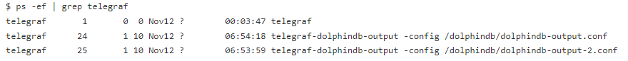

### 3.6 查询指标

1. 连接并登录 DolphinDB，可以打开 localhost:8848，在线登录查看。


```
http://localhost:8848/
```

2. 查询指标。


```
查询 disk 表 ：查询最近的100条指标数据
disk = loadTable("dfs://telegraf","disk")
select top 100 * from disk order by timestamp desc

查询 system 表 ：查询最近的100条指标数据
system = loadTable("dfs://telegraf","system")
select top 100 * from system order by timestamp desc
```

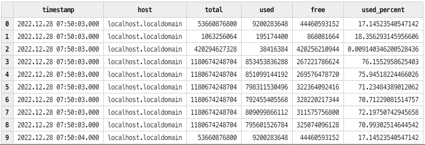

表 disk

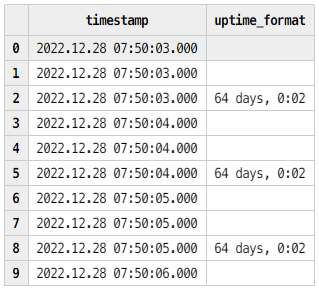

表 system

## 4. Grafana 可视化 DolphinDB 数据

### 4.1 配置 Grafana

1. 在本机浏览器中打开地址。


```
http://localhost:3000/
```

2. 登陆账号，系统初始用户名密码为 admin/admin。


```
username = admin
password = admin
```

3. 依次点击“Settings” >> “Data Sources“ >> “Add data source“，在搜索栏中搜索 DolphinDB，点击并设置其配置项如下 (用户名为 admin , 密码为 123456)，点击 Save&test 测试连接。

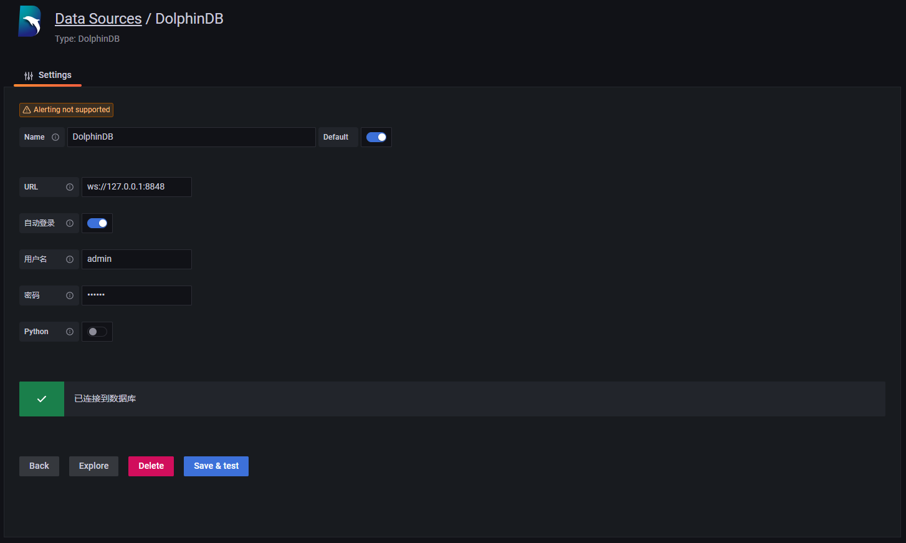

4. 依次点击“Dashboards” >> “Browse“>>”New”>>”New Dashboard”>>”Add a new panel”，新建一个数据面板。

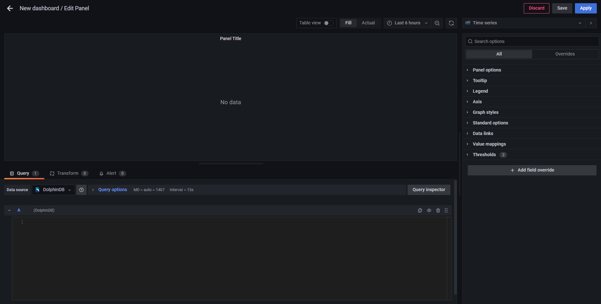

5. 在 Grafana 底部的代码输入栏中输入下方代码（按时间段分组，查询各时间段磁盘总量、使用量、可用量、使用百分比，4 个指标数据的平均情况）。


```
dfs_disk = loadTable("dfs://telegraf","disk")
select timestamp,avg(total),avg(used),avg(free),avg(used_percent) from dfs_disk group by timestamp 
```

点击右边 Panel options，设置 Panel Title 为 disk。

点击 Save，设置 Dashboard name 和 Folder（仪表盘名和目录）。

6. 点击 Panel 内部 Zoom to data，在 Grafana 中可视化 DolphinDB 中的数据，展示了磁盘的 4 个指标的平均情况：

磁盘总量：avg_total；磁盘使用量：avg_used；磁盘可用量：avg_free；磁盘使用百分比：avg_used_percent

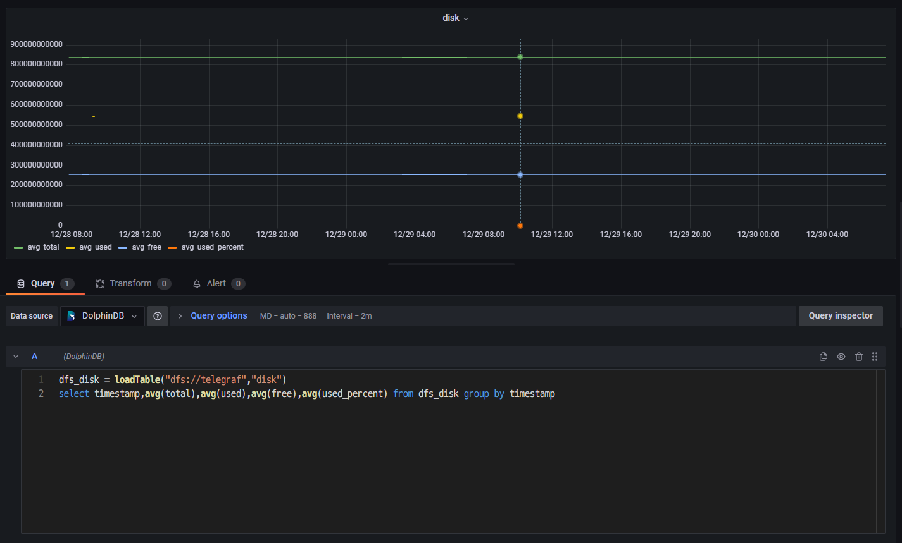

7. 点击其中一个指标（如磁盘使用量 avg_used），对筛选时间段进行放大观察。

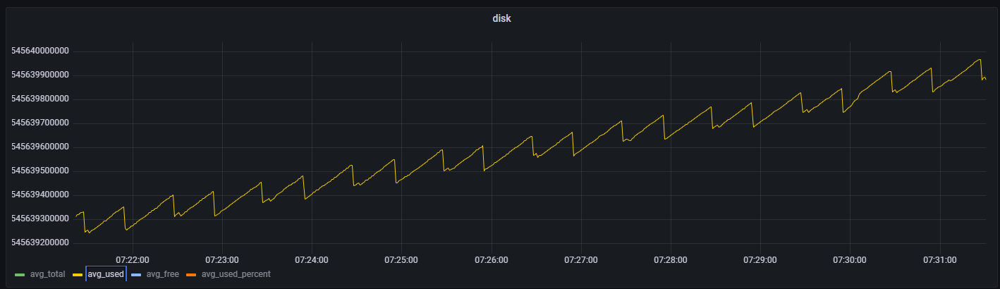

## 5. 运维实例：用 Telegraf+DolphinDB+Grafana 监控预警 CPU 使用率

上文介绍了 disk 和 system 两个指标的数据采集、存储与监控方法。这章提供了一个利用 DolphinDB 流计算统计 CPU 使用率进行预警监控的实际运维案例。主要步骤大致可以分为 3 步：首先，在 Telegraf 的配置文件中添加 CPU 使用率这一监控指标，并编写输出到 DolphinDB 流表的输出配置文件；之后在 DolphinDB 中创建存储 CPU 使用率数据的流表，并编写预警脚本；最后，在 Grafana 中查询预警数据，完成监控预警的可视化。具体操作请按下列步骤执行：

1. 修改 Telegraf 的配置文件 TelegrafConfig。在 INPUT PLUGINS 中添加 CPU 监控  [[inputs.cpu]]，在 OUTPUT PLUGINS 中添加对应 [[outputs.execd]] 输出。

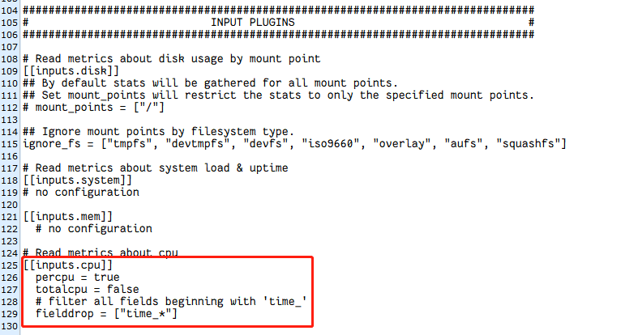

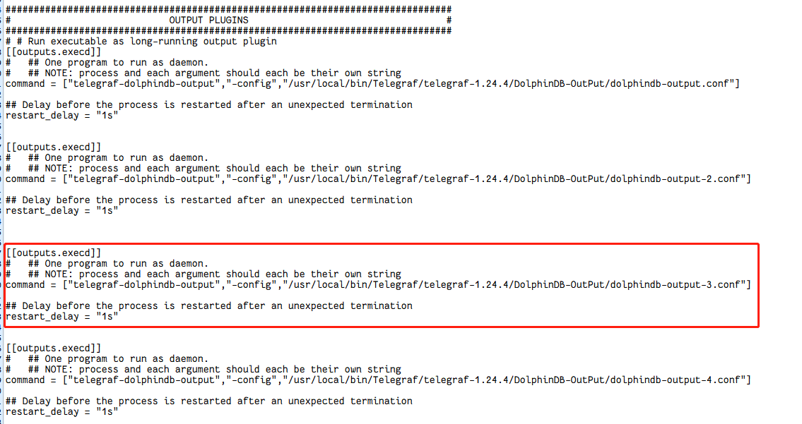

2. 编写对应 [[outputs.execd]] 的配置文件 dolphindb-output-3.conf。这里直接注释掉 database，将 Telegraf 采集的数据导入到 DolphinDB 流表 cpu_stream 中。


```
[[outputs.dolphindb]]
# The address of DolphinDB formatted as {ip}:{port}
address = "localhost:8848"
# The user of DolphinDB.
user = "admin"
# The password of DolphinDB.
password = "123456"
# Name of the database to store metrics in.
# database = "dfs://telegraf"
# Name of the table to store metrics in.
table_name = "cpu_stream"
# The number of messages to be batched.
# If batch_size is 1, the data is sent to the server immediately after it is written.
# If batch_size is more than 1, the data is sent to the server only when the amount of data reaches batch_size.
batch_size = 10
# An integer more than 0 in milliseconds.
# The data will be sent to the server after written for throttle time,
# even through the data amount is less than the batch_size.
throttle = 1000
# The name of the metrics.
metric_name = "cpu"
# The count of the goroutine to send the metrics data to the DolphinDB.
goroutine_count = 1
# The partition column of the table, only works when the goroutine_count is more than 1.
partition_col = "timestamp"
# If use the debug mode.
debug = true

```

3. 修改 DolphinDB 配置文件，用于支持创建磁盘持久化流表。在 dolphindb.cfg 中设置持久化路径如下（<DolphinDBDir>是自定义的数据存放路径，可以与 server 保持同一目录）：


```
volumes=<DolphinDBDir>/volumes 
redoLogDir=<DolphinDBDir>/redoLog
chunkMetaDir=<DolphinDBDir>/chunkMeta
TSDBRedoLogDir=<DolphinDBDir>/TSDBRedoLog
persistenceDir<DolphinDBDir>/persistence
persistenceOffsetDir=<DolphinDBDir>/streamlog
```

4. 连接登录 DolphinDB，在 DolphinDB 中创建存储 CPU 指标数据的流表 cpu_stream。


```
//登录
login(`admin,`123456)

//清理缓存
undef(all)
clearAllCache()

//持久化流表 cpu_stream
cpuColnames = `timestamp`cpu`usage_idle
cpuColtypes =[TIMESTAMP,STRING,DOUBLE]
enableTableShareAndPersistence(table = streamTable(1000:0,cpuColnames,cpuColtypes), tableName=`cpu_stream, cacheSize = 5000000)  
```

5. 在 DolphinDB 中订阅流表 cpu_stream 中的数据，一方面将流表中的数据导入到分布式表 dfs_cpu 中进行持久化存储，另一方面对流表中的数据进行流计算，预警统计 CPU 使用率大于 80% 的指标数据，并将统计的数据存入流表 cpu_warning_result 中。


```
//创建分布表 dfs_cpu ，并订阅 cpu_stream 中的数据导入到 dfs_cpu 中。
dbName = "dfs://telegraf"
db_telegraf = database(directory=dbName, partitionType=VALUE,partitionScheme = 2022.01.01..2022.12.31)
cpu = table(1:0,cpuColnames,cpuColtypes)
dfs_cpu = createPartitionedTable(dbHandle = db_telegraf,table = cpu,tableName = "cpu",partitionColumns ="timestamp",compressMethods = {timestamp:"delta"});
subscribeTable(tableName="cpu_stream", actionName="append_cpu_stream_into_dfs", offset=0, handler=loadTable(dbName,"cpu"), msgAsTable=true,batchSize=100000, throttle=1, reconnect=true)


//进行流计算，预警统计 cpu 使用率大于80%的指标数据，并将统计的数据存入流表 cpu_warning_result 中
enableTableShareAndPersistence(table = streamTable(1000:0,cpuColnames,cpuColtypes), tableName=`cpu_warning_result, cacheSize = 5000000) 
def handler_cpu(mutable warning_result, msg)
{
    t = select * from msg where usage_idle >= 80;
	warning_result.append!(t)
}
subscribeTable(tableName="cpu_stream", actionName="cpu_warning", offset=0, handler=handler_cpu{cpu_warning_result}, msgAsTable=true,batchSize=100000, throttle=1, reconnect=true)
```

6. 启动 Telegraf 服务。


```
telegraf --config $TelegrafConfig
```

7. 查看 cpu_stream 中最近的 100 条 CPU 指标数据，查看 dfs_cpu 中最近的 100 条 CPU 指标数据，查看 cpu_warning_result 中最近的 100 条 预警数据。


```
dbName = "dfs://telegraf"
dfs_cpu = loadTable(dbName,"cpu")
select top 100 * from cpu_stream order by timestamp desc
select top 100 * from dfs_cpu order by timestamp desc 
select top 100 * from cpu_warning_result order by timestamp desc
```

8. 登录 Grafana 监控 CPU 利用率大于 80% 的预警数据。连接上 DolphinDB 数据源并创建面板 Panel 后，直接可视化 cpu_warning_result 中的数据即可（这里只监控了单核 cpu0 的预警数据）。

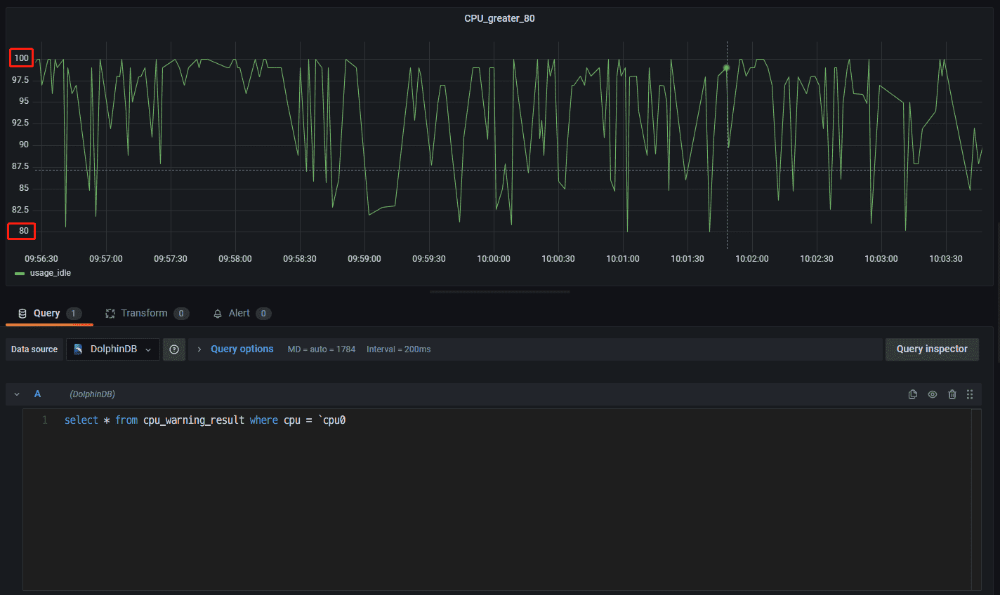

## 6. 附件

1. telegraf-dolphindb-outputs 插件：[telegraf-dolphindb-outputs](plugin/DolphinDB_Telegraf_Grafana/telegraf-dolphindb-outputs)

2. 编译源码：[telegraf.zip](script/DolphinDB_Telegraf_Grafana/telegraf.zip)

3. TelegrafConfig：[TelegrafConfig](script/DolphinDB_Telegraf_Grafana/TelegrafConfig)

