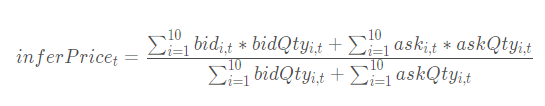
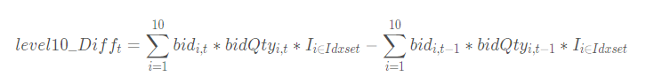
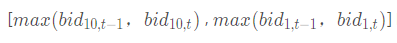
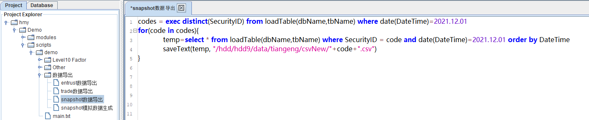
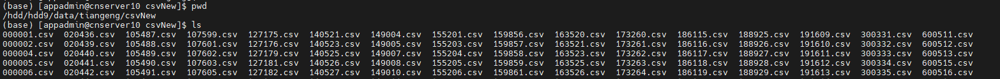
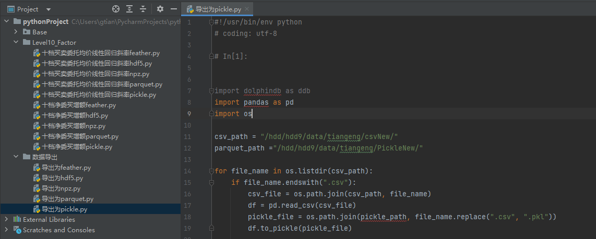
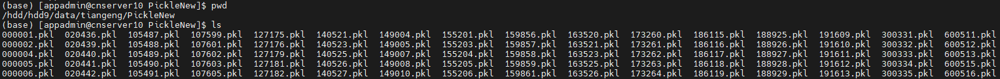
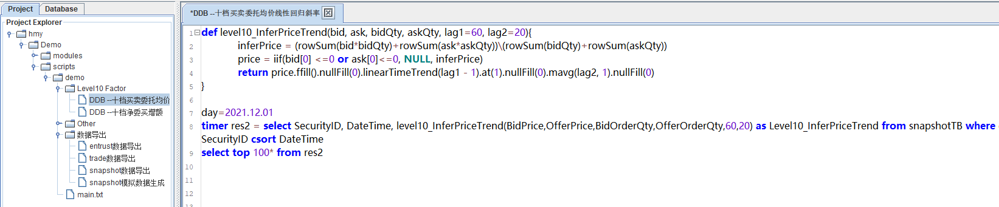
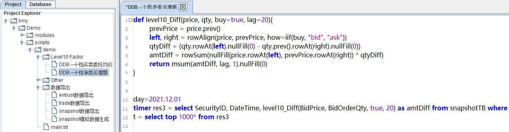

# Python + 文件存储与 DolphinDB 因子计算性能比较

在量化交易中，基于金融市场 L1/L2 报价和交易高频数据进行高频因子计算是一项常见的投研需求。随着金融市场数据量的不断增加，传统的关系数据库已经难以满足大规模数据的存储和查询需求。为了应对这一挑战，一部分用户选择了分布式文件系统，并使用 Pickle、Feather、Npz、Hdf5、以及 Parquet 等格式来存储数据，并结合 Python 进行量化金融计算。

虽然这些存储方案可以支持海量的高频数据，但也存在一些问题，例如数据权限管理困难、不同数据关联不便、检索和查询不便，以及需要通过数据冗余来提高性能等。此外，通过 Python 来读取计算，也需要耗费一些时间在数据传输上。

为解决这些问题，越来越多的券商和私募机构开始采用 DolphinDB 作为分析型的分布式时序数据库。DolphinDB 提供高效的数据存储和计算能力，使得高频数据的因子计算变得更加便捷和高效。

因此，本文将分别介绍如何基于 DolphinDB + 各类文件存储实现因子计算，旨在对比 DolphinDB 一体化因子计算方案与 Python + 各类文件存储的性能差异。通过本文的对比，读者可以了解 DolphinDB 一体化因子计算的优势，并在实际应用中做出更加明智的选择。
- [Python + 文件存储与 DolphinDB 因子计算性能比较](#python--文件存储与-dolphindb-因子计算性能比较)
  - [测试基础环境](#测试基础环境)
    - [软硬件信息](#软硬件信息)
    - [测试数据](#测试数据)
  - [测试场景](#测试场景)
    - [因子计算与代码实现](#因子计算与代码实现)
  - [计算结果对比](#计算结果对比)
    - [计算性能对比](#计算性能对比)
    - [计算准确性对比](#计算准确性对比)
  - [常见问题解答](#常见问题解答)
    - [如何复现本文的代码？](#如何复现本文的代码)
  - [总结](#总结)
  - [附录](#附录)


## 测试基础环境

### 软硬件信息

本次测试对比了通过 Python + 文件存储 和 DolphinDB 实现的因子计算。其中：

- Python +  文件存储因子计算方案依赖 Numpy, Pandas, DolphinDB, Multiprocessing 等库。
- DolphinDB 一体化因子计算方案以 DolphinDB Server 作为计算平台，本次测试使用了单节点部署方式 。

测试所需硬件、软件环境信息如下：

- **硬件环境**

| **硬件名称** | **配置信息**                               |
| :----------- | :----------------------------------------- |
| CPU          | Intel(R) Xeon(R) Silver 4216 CPU @ 2.10GHz |
| 内存         | 128G                                       |
| 硬盘         | SSD 500G                                   |

- **软件环境**

| **软件名称** | **版本信息**                         |
| :----------- | :----------------------------------- |
| 操作系统     | CentOS Linux release 7.9.2009 (Core) |
| DolphinDB    | V 2.00.9.8                           |
| Python       | V 3.7.6                              |
| Numpy        | V 1.20.2                             |
| Pandas       | V 1.3.5                              |

### 测试数据

Level 2 行情数据是目前国内证券市场上最为完整，颗粒度最为精细的交易信息数据。其涵盖了在沪深两市上市的股票、可交易型基金、沪深交易所指数等投资标的。

本次测试选取了全市场 2021.02.01 这一个交易日的全部 Level2 历史行情快照数据，该数据包含 26632 支标的，总数据量约为 3100 万条。初始数据存于 DolphinDB 中，Pickle、Parquet 等格式的数据文件均可从 DolphinDB 中导出生成。

快照表测试数据在 DolphinDB 中共55个字段，部分字段展示如下：

|       | **字段名**  | **数据类型** |
| :---- | :---------- | :----------- |
| **1** | SecurityID  | SYMBOL       |
| **2** | DateTime    | TIMESTAMP    |
| **3** | BidPrice    | DOUBLE       |
| **4** | BidOrderQty | INT          |
| **5** | ……          | ……           |

部分数据示例如下：

| **SecurityID** | **DateTime**            | **BidPrice**                                                 | **BidOrderQty**                                       |
| :------------- | :---------------------- | :----------------------------------------------------------- | :---------------------------------------------------- |
| 000155         | 2021.12.01T09:41:00.000 | [29.3000,29.2900,29.2800,29.2700,29.2600,29.2500,29.2400,29.2300,29.2200,29.2100] | [3700,11000,1400,1700,300,600,3800,200,600,1700]      |
| 000688         | 2021.12.01T09:40:39.000 | [13.5300,13.5100,13.5000,13.4800,13.4700,13.4500,13.4400,13.4200,13.4000,13.3800] | [500,1200,102200,5500,700,47000,1000,6500,18400,1000] |


## 测试场景

本次测试使用的数据是全市场 2021.12.01 这一个交易日的全部 Level2 历史行情快照数据，其中 Pickle，Parquet，Feather，Hdf5 四种格式的数据都按标的代码分组存储，而 Npz 格式的数据是将所有数据均匀分成十二组后进行存储。以上的这些存储方式都是为了达到计算性能的最优，而暂不考虑存储性能。在实践过程中，可以自己选择不同的存储方式，如 `HDFStore( )` 函数可将多个 dataframe 存储为一个 hdf5 文件，压缩比的表现较好，然而并发读写的效率会有所下降。

### 因子计算与代码实现

本小节主要分为三个部分：高频因子（十档买卖委托均价线性回归斜率、十档净委买增额）介绍、在DolphinDB 中因子实现和 Python 中因子实现。

#### 高频因子

- 十档买卖委托均价线性回归斜率

十档买卖委托均价即为十档买卖委托额之和除以十档买卖委托量之和：



十档买卖委托均价线性回归斜率为十档买卖委托均价对时间 t 的线性回归的斜率。

- 十档净委买增额

十档净委买增额因子指的是在有效十档范围内买方资金总体增加量，即所有买价变化量的总和：



有效十档范围内表示不考虑已不在十档范围内的档位，即表示只考虑以下区间的档位：




#### DolphinDB 中因子实现

- 十档买卖委托均价线性回归斜率

十档买卖委托均价线性回归斜率的计算需要的参数分别为 OfferOrderQty、BidOrderQty、OfferPrice、BidPrice 四个字段，均为[数组向量](https://gitee.com/link?target=https%3A%2F%2Fwww.dolphindb.cn%2Fcn%2Fhelp%2FDataTypesandStructures%2FDataForms%2FVector%2FarrayVector.html%3Fhighlight%3Dtoarray%23array-vector)数据类型，分别为买卖十档价格和十档委托数量。使用 `rowSum` 这一内建聚合函数提高了因子的计算效率。通过 `linearTimeTrend` 函数获取因子值对时间 t 的滑动线性回归斜率，该函数返回线性回归的截距和斜率。`price.ffill().linearTimeTrend(lag1-1).at(1).nullFill(0).mavg(lag2, 1).nullFill(0) ` 表示获取十档买卖委托均价对时间t的线性回归的斜率。

```
@state
def level10_InferPriceTrend(bid, ask, bidQty, askQty, lag1=60, lag2=20){
	inferPrice = (rowSum(bid*bidQty)+rowSum(ask*askQty))\(rowSum(bidQty)+rowSum(askQty))
	price = iif(bid[0] <=0 or ask[0]<=0, NULL, inferPrice)
	return price.ffill().linearTimeTrend(lag1-1).at(1).nullFill(0).mavg(lag2, 1).nullFill(0)
}
```

- 十档净委买增额

十档净委买增额的计算需要的参数分别为 BidOrderQty、BidPrice 两个字段，均为[数组向量](https://gitee.com/link?target=https%3A%2F%2Fwww.dolphindb.cn%2Fcn%2Fhelp%2FDataTypesandStructures%2FDataForms%2FVector%2FarrayVector.html%3Fhighlight%3Dtoarray%23array-vector)数据类型。首先通过行对齐函数 `rowAlign` 实现当前十档价格和前一个十档价格进行行对齐，然后通过 `rowAt` 和 `nullFill` 函数分别获取对应档位的委托量和实现价格进行对齐，最后计算总的变化额。

```
@state
def level10_Diff(price, qty, buy, lag=20){
        prevPrice = price.prev()
        left, right = rowAlign(price, prevPrice, how=iif(buy, "bid", "ask"))
        qtyDiff = (qty.rowAt(left).nullFill(0) - qty.prev().rowAt(right).nullFill(0)) 
        amtDiff = rowSum(nullFill(price.rowAt(left), prevPrice.rowAt(right)) * qtyDiff)
        return msum(amtDiff, lag, 1).nullFill(0)
}
```


#### Python 中因子实现

- 十档买卖委托均价线性回归斜率

```
def level10_InferPriceTrend(df, lag1=60, lag2=20):
    '''
    十档买卖委托均价线性回归斜率
    :param df:
    :param lag1:
    :param lag2:
    :return:
    '''
    temp = df[["SecurityID","DateTime"]]
    temp["amount"] = 0.
    temp["qty"] = 0.
    for i in range(10):
        temp[f"bidAmt{i+1}"] = df[f"BidPrice{i+1}"].fillna(0.) * df[f"BidOrderQty{i+1}"].fillna(0.)
        temp[f"askAmt{i+1}"] = df[f"OfferPrice{i+1}"].fillna(0.) * df[f"OfferOrderQty{i+1}"].fillna(0.)
        temp["amount"] += temp[f"bidAmt{i+1}"] + temp[f"askAmt{i+1}"]
        temp["qty"] += df[f"BidOrderQty{i+1}"].fillna(0.) + df[f"OfferOrderQty{i+1}"].fillna(0.)
    temp["inferprice"] = temp["amount"] / temp["qty"]
    temp.loc[(temp.bidAmt1 <= 0) | (temp.askAmt1 <= 0), "inferprice"] = np.nan
    temp["inferprice"] = temp["inferprice"].fillna(method='ffill').fillna(0.)

    def f(x):
        n = len(x)
        x = np.array(x)
        y = np.array([i for i in range(1, n+1)])
        return (n*sum(x*y) - sum(x)*sum(y)) / (n*sum(y*y) - sum(y)*sum(y))

    temp["inferprice"] = temp.groupby("SecurityID")["inferprice"].apply(lambda x: x.rolling(lag1 - 1, 1).apply(f))
    temp["inferprice"] = temp["inferprice"].fillna(0)
    temp["inferprice"] = temp.groupby("SecurityID")["inferprice"].apply(lambda x: x.rolling(lag2, 1).mean())
    return temp[["SecurityID","DateTime", "inferprice"]].fillna(0)
```

- 十档净委买增额

```
def level10_Diff(df, lag=20):
    '''
    十档委买增额
    :param df:
    :param lag:
    :return:
    '''
    temp = df[["SecurityID","DateTime"]]

    for i in range(10):
        temp[f"bid{i+1}"] = df[f"BidPrice{i+1}"].fillna(0)
        temp[f"bidAmt{i+1}"] = df[f"BidOrderQty{i+1}"].fillna(0) * df[f"BidPrice{i+1}"].fillna(0)
        temp[f"prevbid{i+1}"] = temp[f"bid{i+1}"].shift(1).fillna(0)
        temp[f"prevbidAmt{i+1}"] = temp[f"bidAmt{i+1}"].shift(1).fillna(0)

    temp["bidMin"] = temp[[f"bid{i+1}" for i in range(10)]].min(axis=1)
    temp["bidMax"] = temp[[f"bid{i+1}" for i in range(10)]].max(axis=1)
    temp["prevbidMin"] = temp[[f"prevbid{i+1}" for i in range(10)]].min(axis=1)
    temp["prevbidMax"] = temp[[f"prevbid{i+1}" for i in range(10)]].max(axis=1)
    temp["pmin"] = temp[["bidMin", "prevbidMin"]].max(axis=1)
    temp["pmax"] = temp[["bidMax", "prevbidMax"]].max(axis=1)

    temp["amtDiff"] = 0.0
    for i in range(10):
        temp["amtDiff"] += temp[f"bidAmt{i+1}"]*((temp[f"bid{i+1}"] >= temp["pmin"])&(temp[f"bid{i+1}"] <= temp["pmax"])).astype(int) - \
                        temp[f"prevbidAmt{i+1}"]*((temp[f"prevbid{i+1}"] >= temp["pmin"])&(temp[f"prevbid{i+1}"] <= temp["pmax"])).astype(int)
    temp["amtDiff"] = temp.groupby("SecurityID")["amtDiff"].apply(lambda x: x.rolling(lag, 1).sum())
    return temp[["SecurityID","DateTime", "amtDiff"]].fillna(0)
```


## 计算结果对比

### 计算性能对比

Level 2 行情快照数据一天的数据量超过 10 G，因此金融量化工程师们非常关注 Level 2 行情快照数据的高频因子计算性能。基于前述内容，本节我们从（1）不同并行度（2）不同的文件存储形式两个角度进行 “十档买卖委托均价线性回归斜率” 和 “十档净委买增额” 因子计算的性能对比。计算数据为 26632 支标的，1 天共计3100 万行。我们调节不同的并行度，测试在使用不同 CPU 核数的情况下，每种存储方式计算因子的耗时，并与 DolphinDB 的库内一体化计算耗时比较。所有测试均在清除操作系统缓存后进行。测试结果如下列各表：

- **表一 16 核心计算性能比较**：

| **存储方式\因子**  | **十档买卖委托均价线性回归斜率(s)/性能提升（倍数）** | **十档净委买增额(s)/性能提升（倍数）** |
| :----------------- | :------------------------------------------------------- | :----------------------------------------- |
| **DolphinDB**      | 2.4                                                      | 2.3                                        |
| **Python+pickle**  | 254.3/**104.8**                                          | 105.9/**45.4**                             |
| **Python+parquet** | 309.4/**127.5**                                          | 147.9/**63.4**                             |
| **Python+feather** | 291.1/**120.0**                                          | 130.6/**56.0**                             |
| **Python+Hdf5**    | 281.4/**116.0**                                          | 132.0/**56.6**                             |
| **Python+Npz**     | 346.7/**142.9**                                          | 175.2/**75.1**                             |

- **表二 8 核心计算性能比较**：

| **存储方式\因子**  | **十档买卖委托均价线性回归斜率(s)/性能提升（倍数）** | **十档净委买增额(s)/性能提升（倍数）** |
| :----------------- | :--------------------------------------------------- | :------------------------------------- |
| **DolphinDB**      | 4.5                                                  | 4.4                                    |
| **Python+pickle**  | 489.3/**102.8**                                      | 231.6/**60.0**                         |
| **Python+parquet** | 638.7/**143.0**                                      | 296.3/**67.9**                         |
| **Python+feather** | 594.2/**133.1**                                      | 261.9/**60.0**                         |
| **Python+Hdf5**    | 563.4/**126.2**                                      | 294.6/**67.5**                         |
| **Python+Npz**     | 648.7/**145.3**                                      | 334.3/**76.6**                         |

- **表三 4 核心计算性能比较**：

| **存储方式\因子**  | **十档买卖委托均价线性回归斜率(s)/性能提升（倍数）** | **十档净委买增额(s)/性能提升（倍数）** |
| :----------------- | :--------------------------------------------------- | :------------------------------------- |
| **DolphinDB**      | 6.5                                                  | 6.8                                    |
| **Python+pickle**  | 1014.9/**155.6**                                     | 363.9/**53.6**                         |
| **Python+parquet** | 1134.9/**174.0**                                     | 560.9/**82.6**                         |
| **Python+feather** | 1040.6/**159.6**                                     | 479.7/**70.7**                         |
| **Python+Hdf5**    | 1021.2/**156.6**                                     | 437.4/**64.4**                         |
| **Python+Npz**     | 1260.3/**193.2**                                     | 638.8/**94.1**                         |

- **表四 1 核心计算性能比较**：

| **存储方式\因子**  | **十档买卖委托均价线性回归斜率(s)/性能提升（倍数）** | **十档净委买增额(s)/性能提升（倍数）** |
| :----------------- | :------------------------------------------------------- | :----------------------------------------- |
| **DolphinDB**      | 21.8                                                     | 22.0                                       |
| **Python+pickle**  | 3638.2/**166.5**                                         | 1461.8/**66.3**                            |
| **Python+parquet** | 4450.4/**203.7**                                         | 1759.3/**79.8**                            |
| **Python+feather** | 3994.0/**182.8**                                         | 1773.7/**80.5**                            |
| **Python+Hdf5**    | 3996.9/**182.9**                                         | 1774.5/**80.5**                            |
| **Python+Npz**     | 5031.4/**230.3**                                         | 2437.3/**110.6**                           |


从比对结果可以看到，本次测试中，在不同 CPU 核数和不同文件存储形式维度下，对于十档买卖委托均价线性回归斜率，DolphinDB 一体化计算比 Python+ 各类存储文件最高可达近200倍提升，平均约100倍左右的提升。考虑两种计算方式的特点，原因大概如下：

- DolphinDB 自有的数据存储系统的读取效率远优于 Python 读取使用通用存储方式的各类文件存储。
- DolphinDB 具有 `rowSum`，`LinearTimeTrend` 等内置函数，在计算因子时避免了繁冗的 for 循环计算方式，从而节省了大量的计算耗时。

尽管 Pickle，Parquet 等格式的数据文件读取可以从技术层面进行针对性冗余存储或者其他针对性优化，但同时会带来额外硬件资源成本、数据使用和管理成本等。相比之下，DolphinDB 自有数据存储系统在使用上更为高效、方便和简单。 因此 DolphinDB 库内一体化因子计算在完整的因子数据读取、计算全过程上的计算速度是远优于 Python + 各类文件存储的因子计算方式。

从计算性能的对比中，不难发现以下现象：

- 代码实现方面，DolphinDB 的库内 SQL计算更易于实现因子计算调用及并行调用。
- 并行计算方面，DolphinDB 可以自动使用当前可用的 CPU 资源，而Python 脚本需要通过并行调度代码实现，但更易于控制并发度。
- 计算速度方面，DolphinDB 的库内计算比 Python + 各类文件存储 的计算方式快 50 至 200 倍之间。


### 计算准确性对比

上一节中，我们比对了不同计算方式的计算性能。DolphinDB 的库内因子计算在计算速度上要远优于 Python + 各类文件存储的因子计算方式。但是计算快的前提是计算结果要正确一致。本文将 Python +各类文件存储 和 DolphinDB 因子计算结果分别导入为 pandas 中 Dataframe 进行对比。以Python + Pickle 为例，计算结果比对展示如下图，显示的全部结果完全一致。

```
from pandas.testing import assert_frame_equal
df_ddb = df_dolphindb.sort_values(by=["SecurityID","DateTime","amtDiff"]).reset_index(drop=True)
df_py = res_combined.sort_values(by=["SecurityID","DateTime","amtDiff"]).reset_index(drop=True)
df_ddb = df_ddb.round(4)
df_py = df_py.round(4)
assert_frame_equal(df_ddb, df_py, check_exact=False, rtol=1, atol=1e-06)
print(assert_frame_equal)
"""
对于assert_frame_equal函数，对比结果一致时不输出任何结果，不一致时返回报错信息
"""
```


## 常见问题解答

### 如何复现本文的代码？

根据如下步骤部署项目：

- **第一步 DolphinDB 部署**

首先我们需要下载 DolphinDB 并完成单节点 server 部署搭建，这一步骤在 Linux 系统和 Windows 系统中均可以完成，详情可以参考下面的链接：

[单节点部署与升级 (dolphindb.cn)](https://docs.dolphindb.cn/help/dita/md/standalone_server.html)

- **第二步 DolphinDB 客户端安装**

安装并启动 GUI 或者 VSCode，连接到 server 后即可复现 DolphinDB 脚本，详情参考下面的链接：

[使用DolphinDB数据库及客户端](https://docs.dolphindb.cn/help/dita/new_chap_getstarted_ddbserver_and_clients.html)

[DolphinDB VS Code 插件](https://docs.dolphindb.cn/help/dita/md/vscode_extension.html)

- **第三步 上传压缩包并解压代码**

将 [Python_plus_file_VS_dolphindb_on_factor_calc.zip](script/DolphinDB_VS_Python+File_Storage/python_plus_file_VS_dolphindb_on_factor_calc.zip) 上传至服务器。注意：此处服务器路径为：/home/ddb/workfile/demo/，用户需根据实际情况修改路径。

在 Linux 中运行如下命令，将压缩包移动到对应文件夹并解压缩：

```
cd /home/ddb/workfile/demo/

unzip python_plus_file_VS_dolphindb_on_factor_calc.zip -d ./
```
  
- **第四步 依次运行 DolphinDB 代码和 Python 代码**

  - 运行 00_dolphindb_script/00_genSimulatedData.dos，生成模拟数据

    

    

  - 运行 00_dolphindb_script/01_saveAsCsv.dos，将模拟数据保存为csv文件

    

  - 运行 00_dolphindb_script/02_level10Diff.dos，在 DolphinDB 中计算因子1

    

  - 运行 00_dolphindb_script/03_level10InferPriceTrend.dos，在 dolphindb 中计算因子2

    

  - 运行 00_python_script/save_given_format_file/04_save_pickle.py，将 csv 文件保存为 pickle 文件

    
    
  - 运行 00_python_script/calc_factor/05_level10Diff_pickle.py，在 python 中计算因子1

    

  - 运行 00_python_script/calc_factor/06_level10InferPriceTrend_pickle.py，在 python 中计算因子2

    

此处以 pickle 为例，若希望测试其他文件形式，请先运行对应脚本保存对应格式的文件，再运行因子计算的脚本。

## 总结

本篇文章的比较结果显示，在使用相同核数 CPU 前提下，DolphinDB 库内一体化计算性能约为使用Python计算因子的方案的 50 至 200 倍左右，计算结果和 Python 方式完全一样。

- 在数据的管理和读取方面：
  - DolphinDB 是一个专门为大数据分析和处理设计的分布式数据系统，它使用了一种高效的列式存储格式来优化 I/O 操作。因此，DolphinDB 在大数据集的读取和写入方面具有非常高的性能，而 Python Pandas 库虽然也能处理大型数据集，但在处理极大规模数据时可能面临性能挑战。
  - DolphinDB 内存管理非常高效，可以处理超过内存大小的数据集，而且在内存使用上非常节省。这使得在处理大型数据集时，DolphinDB 可以提供更稳定和更高的性能。而在 Python 中，处理大型数据集时可能需要更多的内存管理和优化工作。
  - DolphinDB 作为一个底层数据库产品，集成丰富API接口、拥有完善版本兼容特性以及权限管控功能，而文件存储在跨平台使用困难、前后版本兼容性差以及缺失权限管控功能，DolphinDB 在运维方面大大优于文件存储方式。
- 在代码实现方面，DolphinDB 的库内 SQL 计算更易于实现因子计算调用及并行调用。与此同时，DolphinDB 因为使用了成熟的内置函数极大地提升了因子计算的性能，整体代码量可以缩减到一半及以上。
- 在并行计算方面，DolphinDB 可以自动使用当前可用的 CPU 资源，而 Python 脚本需要通过并行调度代码实现，但更易于控制并发度。

综合而言，在生产环境中，使用 DolphinDB 进行因子计算和存储远比使用 Python + 各类文件存储形式的计算方式更加高效。

## 附录

本教程中的对比测试使用了以下测试脚本：

 [Python+ 文件存储与 DolphinDB 因子计算性能比较.zip](script/DolphinDB_VS_Python+File_Storage/python_plus_file_VS_dolphindb_on_factor_calc.zip)
