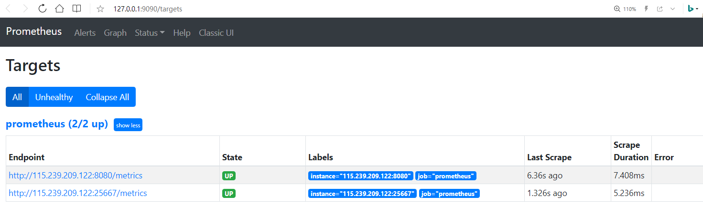
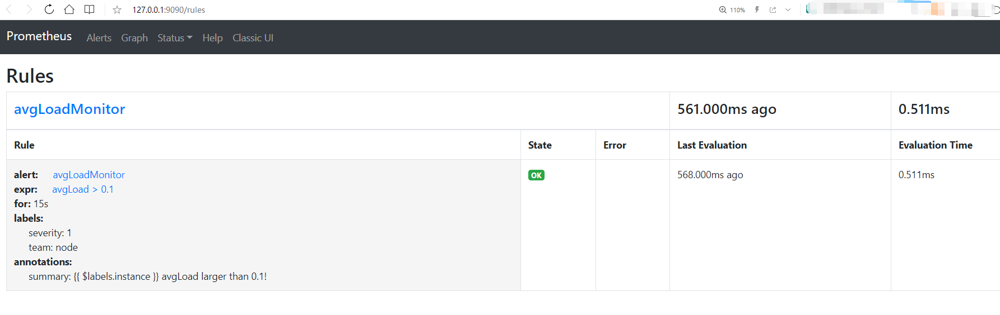
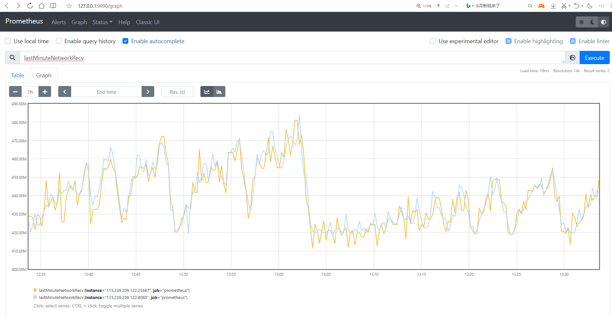

# 使用Prometheus监控告警

DolphinDB提供了三种方式进行性能监控：
* 使用内置函数,如[`getperf`](https://www.dolphindb.cn/cn/help/FunctionsandCommands/FunctionReferences/g/getPerf.html),[`getClusterPerf`](https://www.dolphindb.cn/cn/help/FunctionsandCommands/FunctionReferences/g/getClusterPerf.html)和[`getJobStat`](https://www.dolphindb.cn/cn/help/FunctionsandCommands/FunctionReferences/g/getJobStat.html)；
* Web界面；
* 通过第三方系统的API，如Prometheus, Grafana等。

前两种方式的使用说明详见[用户手册](https://www.dolphindb.cn/cn/help/SystemManagement/PerformanceMonitoring.html)，本文以使用Prometheus监控DolphinDB为例来详细说明第三种方法。

本文以监控系统平均负载为例，安装配置 Prometheus 和其 Alertmanager 组件，然后接入邮件报警，演示系统负载高时自动邮件报警的功能。用户可以参照此文，根据自己的实际需求来实现具体的运维方案。

- [1. Prometheus metrics](#1-prometheus-metrics)
- [2. 下载Prometheus](#2-下载prometheus)
- [3.安装及配置](#3安装及配置)
  - [3.1 Prometheus安装及配置](#31-prometheus安装及配置)
  - [3.2 Alertmanager安装及配置](#32-alertmanager安装及配置)
  - [3.3 启动Prometheus和Alertmanager](#33-启动prometheus和alertmanager)
- [4. 监控展示](#4-监控展示)

## 1. Prometheus metrics

DolphinDB为需要监控的服务产生相应的metrics（指标），Prometheus Server可以直接使用。DolphinDB目前支持的metrics如下所示：

|指标|	类型|	含义|
|----|----|----|
|cpuUsage  | Gauge |DolphinDB进程占用CPU的百分比（单位：无）|
|memoryUsed| Gauge |	节点使用的内存（单位：字节）|
|memoryAlloc   | Gauge |节点中DolphinDB当前内存池的容量（单位：字节）|
|diskCapacity| Gauge |磁盘容量（单位：字节）|
|diskFreeSpace| Gauge |磁盘剩余空间（单位：字节）|
|lastMinuteWriteVolume| Gauge |前一分钟写磁盘容量(单位：字节)|
|lastMinuteReadVolume| Gauge |前一分钟读磁盘容量（单位：字节）|
|lastMinuteNetworkRecv |	Gauge |前一分钟网络接收字节数（单位：字节）	|
|lastMinuteNetworkSend| Gauge |前一分钟网络发送字节数（单位：字节）|
|diskReadRate| Gauge |磁盘读速率（单位：字节/秒）|
|diskWriteRate| Gauge |磁盘写速率（单位：字节/秒）|
|networkSendRate| Gauge |网络发送速率（单位：字节/秒）|
|networkRecvRate  | Gauge |网络接收速率（单位：字节/秒）|
|cumMsgLatency|	Gauge |流数据订阅节点所有已接收的消息的平均延时（单位：纳秒）|
|lastMsgLatency | Gauge |流数据订阅节点最后收到的消息的延时（单位：纳秒）|
|maxLast10QueryTime  | Gauge |前10个完成的查询执行所耗费时间的最大值（单位：纳秒） |
|medLast10QueryTime  | Gauge |前10个完成的查询执行所耗费时间的中间值（单位：纳秒） |
|medLast100QueryTime  | Gauge |前100个完成的查询执行所耗费时间的中间值（单位：纳秒）|
|maxLast100QueryTime |	Gauge |前100个完成的查询执行所耗费时间的最大值（单位：纳秒 |
|maxRunningQueryTime | Gauge |当前正在执行的查询的耗费时间的最大值（单位：纳秒）|
|avgLoad |	Gauge |平均负载（单位：无）|
|jobLoad| Gauge |作业负载（单位：无）|
|runningJobs  | Gauge |正在执行中的作业和任务数（单位：无）|
|queuedJobs| Gauge |队列中的作业和任务数（单位：无）|
|connectionNum| Guage | 节点连接数|

metric 有两种查看方式：

1. 通过 Prometheus Server 进行查看；
2. 选择要查看的 ip:port，进入对应的网址 `http://ip:port/metrics` 进行查看。例如，本机单节点监听在8848端口的 DolphinDB，可以进入网址 `http://127.0.0.1:8848/metrics` 查看相关数据。

## 2. 下载Prometheus

本例的测试环境为已安装Ubuntu 16.04 LTS 的台式机，使用2.26.0版本的Prometheus 和0.21.0版本的Alertmanager。

从Prometheus官网下载Prometheus和Alertmanager，下载链接为：[https://prometheus.io/download/](https://prometheus.io/download/)。相关文档可参阅[官方帮助](https://prometheus.io/docs/prometheus/latest/getting_started/)。

DolphinDB有以下三种部署方式：

1. 通过Docker容器部署运行DolphinDB；
2. 利用K8S等工具部署DolphinDB的相关组件；
3. 直接部署 DolphinDB。

注：部署DolphinDB的相关文档可查阅：[DolphinDB教程](https://gitee.com/dolphindb/Tutorials_CN/blob/master/README.md#/dolphindb/Tutorials_CN/blob/master/dolphindb_user_guide.md)

## 3.安装及配置

### 3.1 Prometheus安装及配置

* 解压缩安装包

解压缩之后，目录文件如下所示:
```
demo@zhiyu:~/prometheus-2.26.0.linux-amd64$ ls
console_libraries  consoles  data  LICENSE  NOTICE  prometheus  prometheus.yml  promtool
```
* 修改prometheus.yml

其中,上述目录下的prometheus.yml就是配置文件，修改后配置如下:
```
global:
  scrape_interval:     15s 
  evaluation_interval: 15s

alerting:
  alertmanagers:
  - static_configs:
    - targets:
      - 127.0.0.1:9093

rule_files:
  - "./avgLoadMonitor.yml"

scrape_configs:
  - job_name: 'DolphinDB'
    static_configs:
    - targets: ['115.239.209.122:8080','115.239.209.122:25667']
```

其中，`alerting`部分的`targets`部分，指向Alertmanager的地址。
`rule_files`部分定义了预警规则，其中`avgLoadMonitor.yml`需要另外创建，下文将介绍如何配置。

`scrape_configs`部分中的targets指向待监控的DolphinDB的节点地址。本例中添加了2个DolphinDB节点，IP 地址为115.239.209.122，监控端口为8080和25667。若用户在实际操作中想要添加其他节点，按照`“IP:PORT”`的格式添加在`targets`中。

* 创建avgLoadMonitor.yml文件

配置avgLoadMonitor.yml的内容如下所示:
```
groups:
- name: avgLoadMonitor
  rules:
  - alert: avgLoadMonitor
    expr: avgLoad > 0.1
    for: 15s
    labels:
      severity: 1
      team: node
    annotations:
      summary: "{{ $labels.instance }} avgLoad larger than 0.1!"

```
本例中使用的指标是avgLoad（DolphinDB提供的一个指标），报警条件为avgLoad> 0.1。用户可根据实际需要，指定指标和报警条件。

### 3.2 Alertmanager安装及配置

* 解压缩安装包

解压后，目录文件如下所示:
```
demo@zhiyu:~/alertmanager-0.21.0.linux-amd64$ ls
alertmanager  alertmanager.yml  amtool  LICENSE  NOTICE
```
示例中，alertmanager.yml是配置文件，报警通知渠道可以是电子邮箱、钉钉、企业微信等。

当预警规则被触发时，Prometheus会根据其配置文件中的`alerting`部分，推送信息给Alertmanager，Alertmanager将向已配置的渠道发送报警消息。

* 配置alertmanager.yml

本例演示的报警渠道为QQ邮箱。修改 alertmanager.yml 如下：
```
global:
  resolve_timeout: 5m
  smtp_from: 'xxxx@qq.com'
  smtp_smarthost: 'smtp.qq.com:465'
  smtp_auth_username: 'xxxx@qq.com'
  smtp_auth_password: 'yyyy'
  smtp_require_tls: false
  smtp_hello: 'qq.com'

route:
  group_by: ['alertname']
  group_wait: 5s
  group_interval: 5s
  repeat_interval: 5m
  receiver: 'email'
receivers:
- name: 'email'
  email_configs:
  - to: 'xxxx@qq.com'
    send_resolved: true
inhibit_rules:
  - source_match:
      severity: 'critical'
    target_match:
      severity: 'warning'
    equal: ['alertname', 'dev', 'instance']

```

>注：xxxx@qq.com请替换为实际邮箱地址；
> 邮箱需要开启SMTP功能，smtp_auth_password: 'yyyy'中的yyyy替换为第三方登录邮箱的授权码。

以qq邮箱为例，获取授权码的具体步骤可参考链接：[获取授权码](https://service.mail.qq.com/cgi-bin/help?subtype=1&id=28&no=1001256)

### 3.3 启动Prometheus和Alertmanager

* 启动Prometheus命令如下：
```
demo@zhiyu:~/prometheus-2.26.0.linux-amd64$ nohup ./prometheus --config.file=prometheus.yml &
```

prometheus默认绑定在9090端口，可以通过前端Web访问，本例使用的地址为127.0.0.1:9090。

* 启动Alertmanager命令如下：

```
demo@zhiyu:~/alertmanager-0.21.0.linux-amd64$ nohup ./alertmanager --config.file=alertmanager.yml &
```
AlertManger默认绑定在9093端口，访问地址是`http://127.0.0.1:9093`，当 Prometheus 中触发报警规则，在该地址中可以看到推送信息，然后提交给具体的渠道处理，从而实现报警。本例中，当负载超过0.1时，邮箱会收到报警邮件。

完成启动后，意味着DolphinDB的指标监控和报警也已完成。

## 4. 监控展示

Prometheus 内置简易的Web控制台，可以查询指标、配置信息等，示例如下：

* 访问http://127.0.0.1:9090/targets 查看被监控的节点：

  

* 访问http://127.0.0.1:9090/rules 查看监控报警规则：

  

* 访问http://127.0.0.1:9090/graph 在输入框中输入指标如 *lastMinuteNetworkRecv*，查看对应指标的图形展示：

  


在实际工作中，经常将Prometheus作为Grafana的数据源，使用Grafana查看指标或者创建仪表盘。DolphinDB已经实现了Grafana的服务端和客户端的接口，具体配置可以参考[grafana教程](../../grafana-datasource/blob/master/README_CN.md)。
