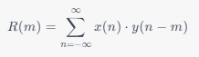
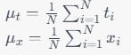
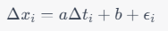
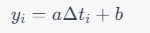
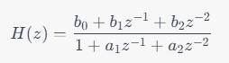
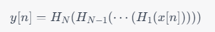
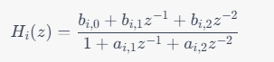
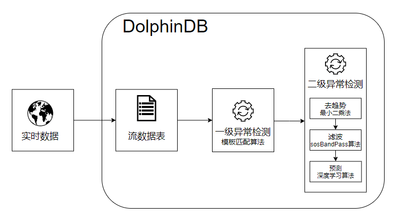

# 使用 DolphinDB 和机器学习对地震波形数据进行预测

- [1. 地震波形数据预测业务场景说明](#1-地震波形数据预测业务场景说明)
- [2. 波形数据异常检测相关算法介绍](#2-波形数据异常检测相关算法介绍)
	- [2.1 模板匹配算法](#21-模板匹配算法)
	- [2.2 线性趋势去除算法](#22-线性趋势去除算法)
	- [2.3 sosBandpass 算法](#23-sosbandpass-算法)
- [3. DolphinDB 解决方案](#3-dolphindb-解决方案)
- [4. 环境准备](#4-环境准备)
	- [4.1 加载插件](#41-加载插件)
	- [4.2 流数据表环境清理](#42-流数据表环境清理)
- [5. 方案实现](#5-方案实现)
	- [5.1 波形实时数据模拟](#51-波形实时数据模拟)
	- [5.2 一级异常检测](#52-一级异常检测)
	- [5.3 二级异常检测](#53-二级异常检测)
- [6. 附录](#6-附录)
	- [插件及脚本文件](#插件及脚本文件)
	- [表结构](#表结构)


## 1. 地震波形数据预测业务场景说明

在地震波形数据异常检测场景中，通常需要使用多种工具和方法来提高检测精度和鲁棒性。其中，FilterPicker 是一种常用的基于模板匹配的异常检测工具，可以实现地震波形数据的实时异常检测和定位。FilterPicker 需要进行预处理，如噪声过滤、信号增强等，然后根据预设的模板和阈值进行匹配和检测，最后输出异常检测的结果和位置信息。

虽然 FilterPicker 可以快速、准确地检测地震波形数据中的异常信号，但其精度和稳定性仍然受到多种因素的影响，例如噪声干扰、模板选择等。为了提高异常检测的精度和鲁棒性，可以使用深度学习算法进行进一步的检测和预测。相比传统的基于规则和模板匹配的方法，深度学习算法具有更好的适应性和泛化性能，可以处理更复杂的地震波形数据，并减少人为干扰和误判的风险。

综上所述，业界在地震波形数据异常检测场景中，通常是先使用 FilterPicker 进行一级异常检测，若有异常点，则进一步使用深度学习的方法进行更加精确的检测。

## 2. 波形数据异常检测相关算法介绍

### 2.1 模板匹配算法

模板匹配算法是一种基于信号相似性的匹配算法，主要利用信号处理中的相关性来进行模板匹配。

在模板匹配算法中，需要先定义一个待匹配信号，即需要被检测的信号。然后，构造一个模板，模板是一种已知特征的信号，其特征可以用来描述所要匹配的目标。模板通常是人为制定的，可以根据需要来选择和设计。

模板匹配的核心是通过计算信号之间的相关系数来比较待匹配信号和模板之间的相似度。相关系数是一种用于描述两个信号相似度的指标。在信号处理中，一般使用互相关函数（cross-correlation）来计算相关系数。

对于两个长度为 N 的信号 X 和 Y，它们的互相关函数可以表示为：



其中 m 为滞后值，R(m) 表示 X 和 Y 之间在滞后值为 m 时的相关性。

通过计算待匹配信号与模板之间的相关系数，可以得到一个相关系数序列，序列中的每个元素对应于待匹配信号中的一个位置。相关系数序列中的极值通常被认为是匹配信号和模板之间的最佳位置，因此可以用来检测待匹配信号中是否存在与模板相似的部分。

然而，模板匹配算法存在一些限制，如噪声、干扰等因素的影响，以及模板匹配在多维空间中的复杂性等。因此，在实际应用中，需要针对具体问题选择合适的算法和参数，并进行优化和改进。

### 2.2 线性趋势去除算法

在地震信号处理中，线性趋势去除的基本思想是将信号的趋势部分表示成一个线性函数的形式，并通过拟合线性函数来计算趋势。由于线性函数的参数可以通过最小二乘法求解，因此这种方法具有计算简单、易于实现等优点。具体而言，线性趋势去除的过程可以分为以下几个步骤：

step1：计算信号的时间序列 t 和信号值序列 x 的均值和，即：



其中，N 表示信号的长度。

step2：计算信号值序列相对于均值的偏差 Δx~i~ 和时间序列相对于均值的偏差 Δt~i~。

step3：用最小二乘法拟合一条直线，使得它尽可能地接近信号值序列 Δx，即：



其中，a 和 b 是拟合直线的斜率和截距，ε~i~ 是误差项。

step4：计算拟合直线的值 y~i~，即：



step5：将信号的趋势部分去除，得到去趋势后的信号，即：


### 2.3 sosBandpass 算法

sosBandpass 是一种数字信号处理算法，用于对地震数据进行带通滤波。其原理是使用一组二阶 IIR 滤波器级联，实现对地震数据在指定频率范围内的滤波，同时保留原始信号的相位信息。

具体地，sosBandpass 算法使用了一组二阶 IIR 滤波器级联的结构，也称为“串联二阶段滤波器”（Second-Order Sections Filter，SOS Filter）。每个二阶 IIR 滤波器的传递函数可以表示为：



其中 z 是单位圆上的复变量，b~0~ b~1~, b~2~, a~1~, a~2~ 是滤波器的系数。通过调整这些系数的值，可以实现不同类型的滤波器，例如低通滤波器、高通滤波器和带通滤波器等。

对于一个带通滤波器，其通带范围可以表示为 [flow, fhigh]，其中 flow 和 fhigh 分别表示低频和高频截止频率。在 sosBandpass 算法中，通带范围被分成若干个子段，每个子段对应一个二阶 IIR 滤波器。假设通带范围被分成了 N 个子段，那么 sosBandpass 算法可以表示为：



其中 x[n] 表示原始地震数据，y[n] 表示滤波后的地震数据。设 H~i~(z) 表示第 i 个二阶 IIR 滤波器的输出，可以表示为：



其中，b~i,0~ ，b~i,1~，b~i,2~，a~i,1~，a~i,2~ 是第 i 个二阶 IIR 滤波器的系数。

## 3. DolphinDB 解决方案



- 实时流接入：流数据表是 DolphinDB 设计专门用于应对实时流数据存储与计算的内存表。具备吞吐量大，低延迟的优点，支持持久化，支持高可用。
- 流数据发布、订阅与消费：DolphinDB 流数据模块采用“发布 - 订阅 - 消费”的模式。流数据首先注入流数据表中，通过流数据表来发布数据，数据节点或者第三方的应用可以通过 DolphinDB 脚本或 API 来订阅及消费流数据。
- FilterPicker 插件：FilterPicker 是一种自动地震信号检测工具，可以从大量地震数据中自动检测和识别地震信号。它主要应用于地震预警、地震监测、地震研究等领域。DolphinDB 开发了对应的 FilterPicker 插件，根据该插件，可在 DolphinDB 内调用模板匹配算法，实现对地震波数据的处理，输出其中的突峭点。
- RTSeis 插件：RTSeis 是一个基于 Python 的实时地震数据处理包，包括地震数据的读取、处理、滤波、台阵响应的移除和地震事件检测等。DolphinDB 开发了对应的 RTSeis 插件，根据该插件，可以对波形数据进行 sosBandPass 滤波处理。
- TensorFlow 插件：用户可以使用 TensorFlow 框架将训练好的模型导出成 .pb 文件，在 DolphinDB 中通过 TensorFlow 插件调用该模型进行预测。

技术架构图中，DolphinDB 流数据表接收外部地震计产生的实时流数据，调用 FilterPicker 插件中的模板匹配算法对实时数据进行一级异常检测，对于异常点，先进行去趋势、滤波处理，再将结果归一化，最后调用 TensorFlow 插件进行预测，输出异常检测结果。

## 4. 环境准备

本节主要内容为加载插件、创建流数据表等，是后续波形实时数据模拟、异常检测的前备工作。

### 4.1 加载插件

为实现波形数据异常检测，DolphinDB 开发了对应的插件，见[附录](#插件及脚本文件)（目前只提供离线版，插件正式发布后会提供下载链接）。下载插件，在 *plugins* 目录下建立 *filterpicker*、*rtseis*、*tf* 三个文件夹，将插件解压到对应的文件夹里。

注意：添加环境变量前需关闭 DolphinDB Server。

Linux 添加环境变量：

```
export LD_LIBRARY_PATH=<YOUR DolphinDB Dir>/server/plugins/rtseis/:$LD_LIBRARY_PATH
export LD_LIBRARY_PATH=<YOUR DolphinDB Dir>/server/plugins/tf/:$LD_LIBRARY_PATH
```

启动 DolphinDB Server，通过 `loadPlugin()` 函数加载插件

```
try{ loadPlugin("./plugins/filterpicker/PluginFilterPicker.txt") }catch(ex){print(ex) }
try{ loadPlugin("./plugins/rtseis/PluginRTSeis.txt") }catch(ex){print(ex) }
try{ loadPlugin("./plugins/tf/PluginTf.txt") }catch(ex){print(ex) }
```

### 4.2 流数据表环境清理

清理流数据表之前需要取消订阅，通过 `unsubscribeTable()` 函数取消订阅，然后再通过 `dropStream()` 函数删除流数据表：

```
unsubscribeTable(tableName = "dataStream", actionName="filterPickerPredict");go
unsubscribeTable(tableName = "pickerStream",actionName="tensorFlowPredict");go
try{dropStreamTable("dataStream")}catch(ex){print(ex)}
try{dropStreamTable("pickerStream")}catch(ex){print(ex)}
try{dropStreamTable("tensorStream")}catch(ex){print(ex)}
```

以 `enableTableShareAndPersistence()` 函数创建流数据共享表并持久化：

```
  //dataStream，接收波形实时流数据
enableTableShareAndPersistence(table=streamTable(1000000:0, `tagid`ts`data, [INT,TIMESTAMP, INT]), tableName=`dataStream, cacheSize=1000000);
  //pickerStream
enableTableShareAndPersistence(table=streamTable(100000:0, `ts`id, [TIMESTAMP,INT]), tableName=`pickerStream, cacheSize=1000000);
  //tensorStream
enableTableShareAndPersistence(table=streamTable(100000:0, `ts`id, [TIMESTAMP, INT]), tableName=`tensorStream, cacheSize=1000000);
```

创建分布式数据库和维度表：

```
if(existsDatabase("dfs://seis01")) dropDatabase("dfs://seis01");
  //创建分布式数据库
create database "dfs://seis01" partitioned by VALUE(1..10), engine='TSDB'
  //创建维度表
create table "dfs://seis01"."tagInfo"(
	xfdsn SYMBOL,
	net SYMBOL,
	sta SYMBOL,
	loc SYMBOL,
	chn SYMBOL,
	id INT[compress="delta"]
)
sortColumns=[`id];
  //向维度表插入数据
net = ["ZJ","YN","XZ","XJ","TJ"]
sta = ["A0001","A0002","A0003","A0004","A0005","A0006","B0001","B0002","B0003","C0001"]
tmp = `EIE`EIN`EIZ
netList = stretch(net,150)
staList = take(stretch(sta,30),150)
locList = take(`40,150)
chn = take(tmp,150)
colt =   array(STRING)
for(i in 0..(chn.size()-1)){
	colt.append!( chn[i].split()[0] + "_" + chn[i].split()[1] + "_" +chn[i].split()[2] )
}
xfdsn = "XFDSN:"+netList+"_"+staList+"_"+locList+"_"+colt
t = table(xfdsn,netList as net,staList as sta,locList as loc,chn,1..150 as id)
loadTable( "dfs://seis01","tagInfo").append!(t);
```

## 5. 方案实现

本章包括以下内容

- 波形实时数据模拟
- 一级异常检测
- 二级异常检测

### 5.1 波形实时数据模拟

实际生产环境中每个通道每 10 毫秒采集一次数据，每个台站有三个通道。以下代码模拟了三个台站的波形实时数据：

```
/*
 * 模拟实时数据
 */
def insertIntoDataStream(){
	do{
		tagidList = 1 2 3 4 5 6 7 8 9
		ts = now()+(0..400)*10
		t = table(stretch(tagidList,3600)as tagid,take(ts,3600) as ts,randNormal(-2500, 1000, 3600) as data)
		objByName(`dataStream).append!(t)
		sleep(3500)
	}while(true)
}
jobId = submitJob("simulate","simulate",insertIntoDataStream);
//通过以下方式取消Job
//cancelJob(jobId)
```

### 5.2 一级异常检测

通过 `subscribe()` 函数订阅实时数据，进行一级异常检测，处理逻辑及代码如下所示：

step1：将实时数据按照 tagid 分组

step2：对每一 tagid，调用 `filterPicker::createFilterPicker()` 函数创建 filter handler

step3：调用 `filterPicker::filerPicker(pickerPtr, timeCol, dataCol, [fixedSize])` 函数进行模板匹配，得到突峭点。其中，各个参数含义如下所示：

- pickerPtr：每一 tagid 对应的 filter handler；
- timeCol：每一 tagid 对应的时间列；
- dataCol：每一 tagid 对应的采样值；
- fixedSize：批计算数据量大小，若数据不足 fixedSize，会累积到下次凑足 fixedSize 再进行计算

其中，突峭点算法参考 [ALomax - FilterPicker - a general purpose, broad-band, phase detector and picker](http://alomax.free.fr/FilterPicker/) 

```
/*
 *一级异常检测处理函数
 *计算波形实时数据中的突峭时间点
 *返回值为突峭时间点和通道id
 */
def pickerHandler(mutable pickerSt, mutable res, vz, msg){
	tags=groups(msg[`tagid]) //按tagid分组
	for (tag in tags.keys()){
		re=res[tag]
		if(re==NULL){
			//创建filter handler
			re= filterPicker::createFilterPicker()
			res[tag]=re
		}
		//将数据传入filterPicker进行计算
		vt=filterPicker::filterPicker(re,msg[tags[tag]][`ts], msg[tags[tag]][`data].float(), 1000)
		if(vt.size()>0){
			vid=take(tag,vt.size())
			pickerSt.append!(table(vt as ts,vid as id))
		}
	}
}

vz=exec id from loadTable("dfs://seis01","tagInfo") where chn ilike("%z") //只需要计算Z分量的数据
res=dict(INT, ANY)
//订阅dataStream，进行一级异常检测，异常检测结果输出到filterStream中
subscribeTable(tableName = "dataStream", actionName="filterPickerPredict", offset=-1,handler=pickerHandler{objByName("pickerStream"), res, vz, }, msgAsTable=true, batchSize = 2000, throttle=1,reconnect=true)
```

一级异常检测结果样例如下所示：

|           ts            |  id  |
| :---------------------: | :--: |
| 2023.04.20T14:37:57.838 |  1   |

上述异常时间点前后几秒内的采样数据如下：

| tagid |           ts            | data  |
| :---: | :---------------------: | :---: |
|   …   |            …            |   …   |
|   1   | 2023.04.20T14:37:57.797 | -3120 |
|   1   | 2023.04.20T14:37:57.807 | -3005 |
|   1   | 2023.04.20T14:37:57.818 | -521  |
|   1   | 2023.04.20T14:37:57.828 | -3886 |
|   1   | 2023.04.20T14:37:57.838 | 1441  |
|   1   | 2023.04.20T14:37:57.848 | 1220  |
|   1   | 2023.04.20T14:37:57.858 | -974  |
|   1   | 2023.04.20T14:37:57.868 | -396  |
|   1   | 2023.04.20T14:37:57.878 | -943  |
|   …   |            …            |   …   |

从采样数据来看，“2023.04.20T14:37:57.838”时间点前后振幅明显变大，确实是一个突峭点。

### 5.3 二级异常检测

通过 `subscribe()` 函数订阅 pickerStream，进行去趋势、滤波、归一化以及二级异常检测，处理逻辑及代码如下所示：

step1：调用 `tf::load(modelFileName, inputName, outputName, [shape])` 函数导入训练好的 TensorFlow 模型（本文使用的深度学习模型不方便对外提供，读者需自行训练模型并调用）。其中各参数含义如下：

- *modelFileName*：模型路径。如果是 keras 生成的 h5 格式的模型文件，可用 [Keras to TensorFlow](https://github.com/amir-abdi/keras_to_tensorflow) 将 h5 格式的模型文件转成 TensorFlow 的 pb 文件后再进行加载。
- *inputName*：模型中输入节点名称，如果不知道，可用[附录](#插件及脚本文件)的 *printTensorName.py* 文件进行打印，输出的第一个即为输入节点名称。
- *outputName*：模型中输出节点名称，如果不知道，可用[附录](#插件及脚本文件)的 *printTensorName.py* 文件进行打印，输出的最后一个即为输出节点名称。
- *shape*：N 维 (N>=3) 数组的 shape，当 N>=3 时才需要提供，类型为 int 类型的 vector，如[3, 5, 8]表示 *shape* 为 3×5×8。如果提供了 *shape*，后面用于预测的 data 请使用 `flatten(x)` 函数转成的一维向量。

step2：提取突峭点前后两秒内三分量数据

step3：剔除趋势成分 (本文将趋势视为线性的，采用最小二乘法估计线性函数的参数)

step4：调用 `rtseis::sosBandPass(x, nTaps, f_min, f_max, windowType, fsamp, ripple)` 函数对三通道数据进行 sosBandPass 变换。其中，各个参数含义如下所示：

- *x*：需要处理的数据
- *nTaps*：筛选器参数
- *f_min*：最低频率
- *f_max*：最高频率
- *windowType*：窗口类型，0-3 分别代表 BUTTERWORTH，BESSEL，CHEBYSHEV1，CHEBYSHEV2
- *fsamp*：采样频率
- *ripple*：windowType 为 2 或 3 时的波纹大小

step5：先对滤波数据进行归一化处理，然后调用 `tf::predict(model, data)` 函数进行预测，当预测概率 prob_P 或者 prob_s 的概率大于 0.9 时，认为该段信号很可能是地震波 P 波或者 S 波信号，然后输出对应的 filterpicker 的突峭点。其中，`tf::predict(model, data)` 各参数含义如下所示：

- *model*：tensorflow 的 model，为 `tf::load()` 函数的返回值
- *data*：需要预测的数据，仅支持同种数据类型的 matrix、vector、table 或者 dictionary。如果在 `tf::load()` 时提供了 *shape* 参数，则 *data* 必须为使用 `flatten(x)` 函数转成的一维向量。

```
def tensorHandler(mutable tensorSt, mutable infoTable, mutable model, mutable cache, msg){
	if(msg.type()!=0) cache.append!(msg)	
	if(cache.size()==0) return
	currTime = now() - 2000
	outed = select * from cache where timestamp  < currTime
	for(s in outed){
		//获取同个台站id信息
		info = select net,sta,loc from infoTable where id == s[`id]
		netInfo = info[`net][0]
		staInfo = info[`sta][0]
		bhzInfo = info[`loc][0]
		bheId = exec id from infoTable where net == netInfo and sta == staInfo and loc == bhzInfo and ilike(chn,"%e")
		bhnId = exec id from infoTable where net == netInfo and sta == staInfo and loc == bhzInfo and ilike(chn,"%n")
		bhzId = exec id from infoTable where net == netInfo and sta == staInfo and loc == bhzInfo and ilike(chn,"%z")
		//获取三个分量数据
		begT = timestamp(s[`timestamp] - 2000)
		endT = timestamp(s[`timestamp] + 1999)
		ve = exec data from dataStream where tagid ==bheId[0] and ts between(begT:endT)
		vn = exec data from dataStream where tagid ==bhnId[0] and ts between(begT:endT)
		vz = exec data from dataStream where tagid ==bhzId[0] and ts between(begT:endT)
		if(ve.size()==  400 && vn.size() ==  400 && vz.size() ==  400) {
			//去趋势
			tem = ols(vn, 0..399)
			bhn = vn - (tem[0] + tem[1]*0..399)
			tem = ols(ve, 0..399)
			bhe = ve - (tem[0] + tem[1]*0..399)
			tem = ols(vz, 0..399)
			bhz = vz - (tem[0] + tem[1]*0..399)
			//滤波
			bhn = rtseis::sosBandPass(bhn,4,3.0,20.0,0,100.0,0.0);
			bhe = rtseis::sosBandPass(bhe,4,3.0,20.0,0,100.0,0.0);
			bhz = rtseis::sosBandPass(bhz,4,3.0,20.0,0,100.0,0.0);
			m = matrix(bhn,bhe,bhz)
			//矩阵数据归一化
			m1 = m / max(max(abs(m)))
			//输入模型进行预测, ts返回值为预测结果
			ts = tf::predict(model, float(m1))
			//prob_p 是P波的概率，prob_S是S波概率, prob_N是噪声的概率。
			prob_P = ts[0]
			prob_S = ts[1]
			prob_N = ts[2]
			if(prob_P > 0.90 || prob_S > 0.90){
				tensorSt.append!(table(s[`timestamp] as timestamp, s[`id] as id))
			}	
		 }
	}
	delete from cache where timestamp  < currTime	
}

  //导入模型
model = tf::load("./model_pol.pb", "conv1d_1_input", "activation_7_1/concat")
infoTable = select * from  loadTable("dfs://seis01","tagInfo")
vz=exec id from loadTable("dfs://seis01","tagInfo") where chn ilike("%z") //只需要计算Z分量的数据
cache =   table(10:0, `timestamp`id, [TIMESTAMP, INT])
  //订阅pickerStream，进行二级异常检测
subscribeTable(tableName = "pickerStream",actionName="tensorFlowPredict", offset=-1, handler=tensorHandler{objByName("tensorStream"),infoTable, model,cache,}, msgAsTable=true, batchSize = 1000, throttle=0.4, timeTrigger=true,reconnect=true)
```

对一级异常检测的结果进行二级异常检测后，结果样例如下表所示：

|           ts            |  id  |
| :---------------------: | :--: |
| 2023.04.20T14:37:57.838 |  1   |

## 6. 附录

### 插件及脚本文件

- [filterpicker](https://docs.dolphindb.cn/zh/appendices/earthquake/filterpicker.zip)
- [rtseis](https://docs.dolphindb.cn/zh/appendices/earthquake/rtseis.zip)
- [tf](https://docs.dolphindb.cn/zh/appendices/earthquake/tf.zip)
- [printTensorName.py](https://docs.dolphindb.cn/zh/appendices/earthquake/printTensorName.py)


### 表结构

维度表结构：

| 字段  | DolphinDB 数据类型 | 含义 |
| ----- | ------------------ | ---- |
| xfdsn | SYMBOL             |      |
| net   | SYMBOL             | 台网 |
| sta   | SYMBOL             | 台站 |
| loc   | SYMBOL             | 位置 |
| chn   | SYMBOL             | 通道 |
| id    | INT                |      |

dataStream 表结构：

| **字段名** | **DolphinDB 数据类型** | **含义**                    |
| :--------- | :--------------------- | :-------------------------- |
| tagid      | INT                    | 维度表中的 id，代表一个通道 |
| ts         | TIMESTAMP              | 采样时间                    |
| data       | INT                    | 采样值                      |

pickerStream 表结构：

| 字段 | DolphinDB 数据类型 | 含义                        |
| ---- | ------------------ | --------------------------- |
| ts   | TIMESTAMP          | 采样时间                    |
| id   | INT                | 维度表中的 id，代表一个通道 |

tensorStream 表结构：

| **字段** | **DolphinDB 数据类型** | **含义**                    |
| :------- | :--------------------- | :-------------------------- |
| ts       | TIMESTAMP              | 采样时间                    |
| id       | INT                    | 维度表中的 id，代表一个通道 |

 