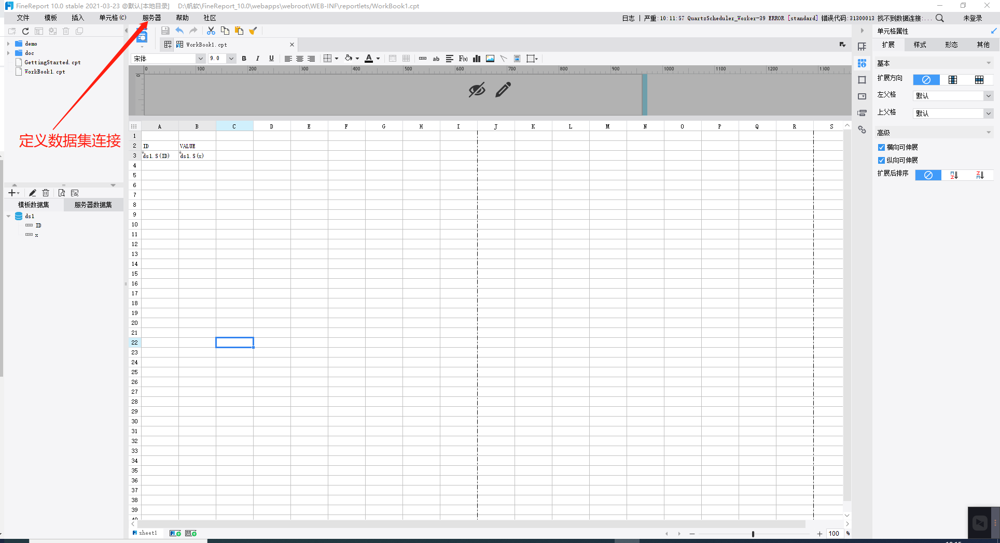
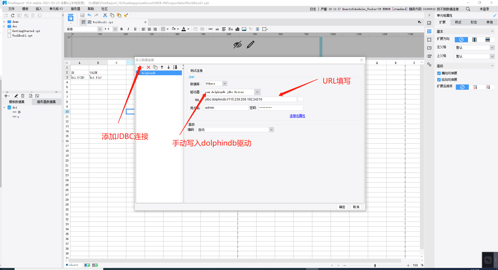
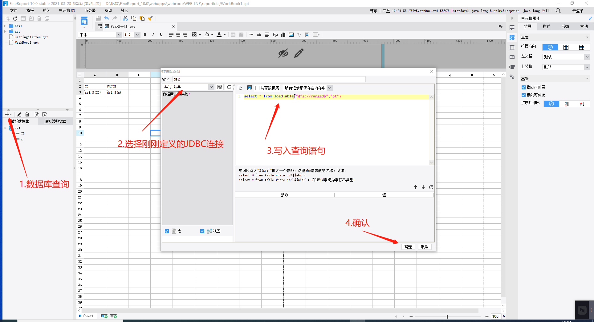
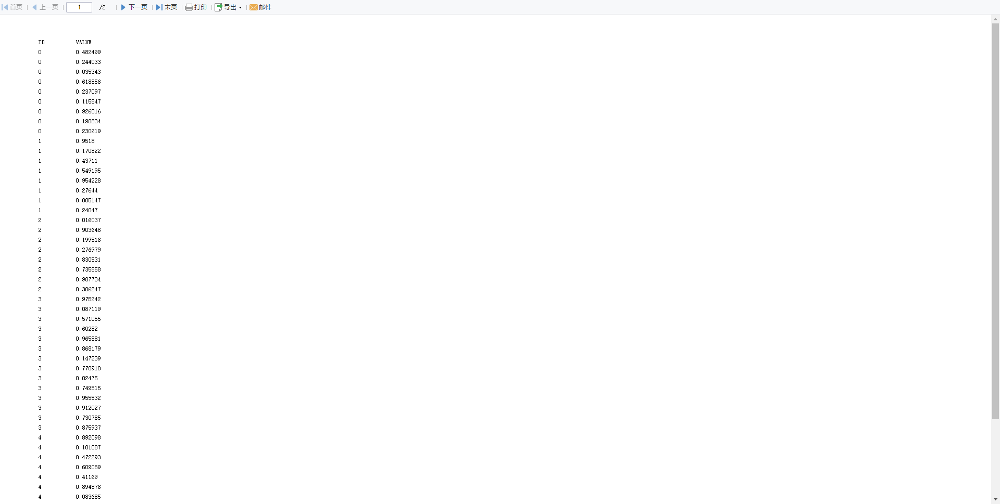

## 帆软报表软件连接DolphinDB数据源

<!-- TOC -->
- [1. 概述](#1-概述)

- [2. 安装并启动FineReport](#2-安装并启动finereport)

 
- [3. 配置JDBC连接](#3-配置jdbc连接)

- [4. 实例](#4-实例)

    - [4.1 创建DolphinDB数据源](#41-创建dolphindb数据源)

    - [4.2 定义数据库查询和创建表格](#42-定义数据库查询和创建表格)
    
<!-- /TOC -->

###  1. 概述

FineReport（帆软报表软件）是一款集数据展示和数据录入功能于一身的企业级工具，具有专业、简捷、灵活的特点，仅需简单的拖拽操作便可以设计复杂的报表或搭建数据决策分析系统，目前在各行各业有着广泛的应用。DolphinDB用于海量时序数据的存取和分析，支持关系模型，兼容宽列数据库与关系数据库的功能，并且像传统的关系数据库一样易于使用。DolphinDB支持SQL查询，提供了JDBC/ODBC接口，因此与现有的第三方分析可视化系统如帆软、Grafana与redash等可轻松实现集成与对接。本文详细介绍在FineReport中配置JDBC连接及查询DolphinDB中数据并展示的步骤。


###  2. 安装并启动FineReport


在帆软官网下载相应的版本进行安装，本例下载安装的是windows版64位10.0版本。

[下载链接](https://www.finereport.com/product/download)

[帮助链接](https://help.fanruan.com/finereport/doc-view-69.html)


###  3. 配置JDBC连接


详细步骤如下：

- 从[github](https://github.com/dolphindb/jdbc)或[gitee](https://gitee.com/dolphindb/jdbc)下载DolphinDB JDBC接口压缩包；

- 解压下载的JDBC压缩包，将~/jdbc/bin/目录下的dolphindb_jdbc.jar和~/jdbc/lib/目录下的dolphindb.jar拷贝到帆软安装目录FineReport_10.0\webapps\webroot\WEB-INF\lib目录下；

- 启动帆软报表（若帆软已打开，需要重启），在菜单中选择“服务器/定义数据集连接"，弹出对话框如下图：



- 点击左上角的+按钮，选择添加JDBC连接，在右边属性页中数据库选默认的“Others”，手工填写驱动器和URL，输入访问DolphinDB节点的用户名和密码。点击“测试连接”，若连接成功，则证明配置无误。注意下图URL中的115.239.209.19:24216是DolphinDB节点的IP地址和端口号，请根据实际情况修改。



### 4. 实例

下面通过一个例子，来说明如何在帆软报表软件中查询并展示数据：


#### 4.1 创建DolphinDB数据源


在DolphinDB中创建一个库表`dfs://rangedb/pt`，并插入两列数据ID和x：

```
	n=100
	ID=rand(10, n)
	x=rand(1.0, n)
	t=table(ID, x)
	db=database("dfs://rangedb", VALUE,  1..10)
	pt = db.createPartitionedTable(t, `pt, `ID)
	pt.append!(t)
```

#### 4.2 定义数据库查询和创建表格

- 定义一个数据库查询

选择菜单“服务器/数据集”，在弹出的对话框中点击左上角“+”按钮(或者如下图中第一步点击“+”按钮)，选择数据库查询，然后如图中第二步选择前面一节刚定义的JDBC连接，再在SQL编辑框中输入下列语句：
```
	select * from loadTable("dfs://rangedb","pt")
```
点击“确认”按钮退出。



- 将数据列插入表格中


- 在插入时需要注意


- 在前端展示数据。如果有展示样式的需求，需要对帆软报表进行格式的定制，本例不做展开，详细介绍可参阅[FineReport帮助文档](https://help.fanruan.com/finereport/)。



