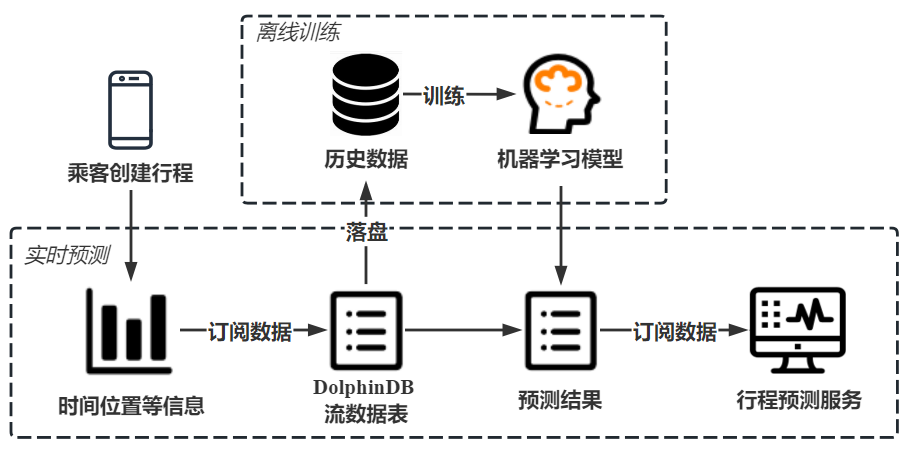
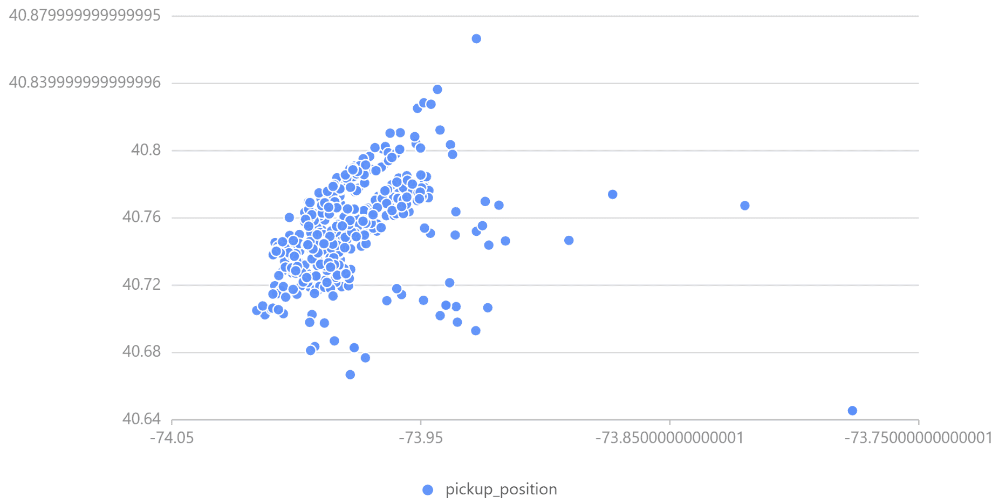
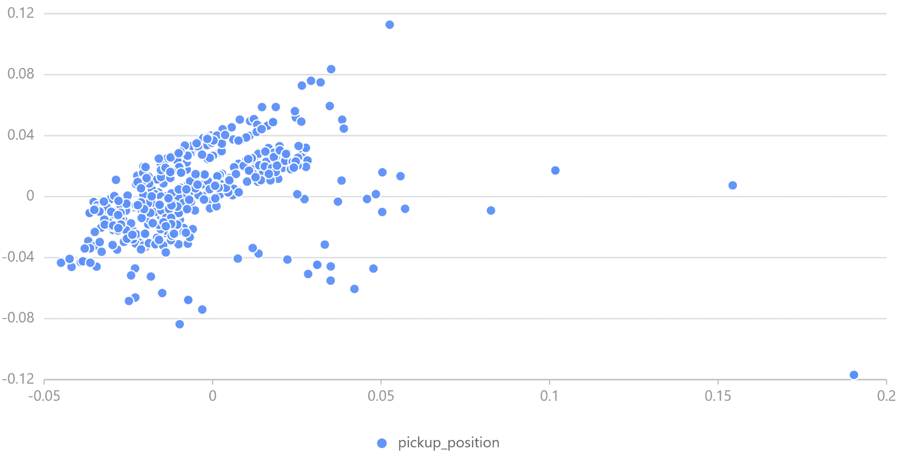
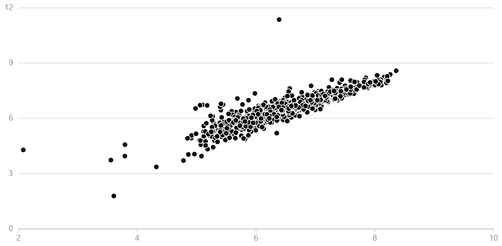
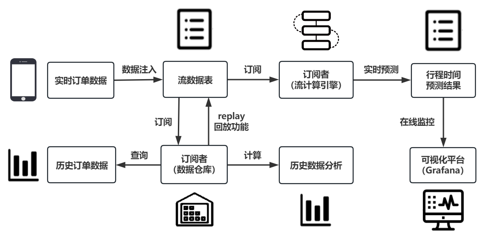
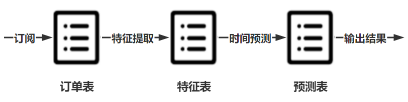
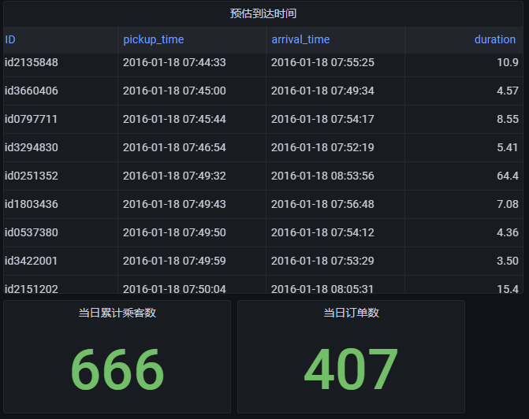

# 基于 DolphinDB 机器学习的出租车行程时间预测

DolphinDB 集高性能时序数据库与全面的分析功能为一体，可用于海量结构化数据的存储、查询、分析、实时计算等，在工业物联网场景中应用广泛。本文以纽约出租车行程时间预测为例，介绍如何使用 DolphinDB 训练机器学习模型，并进行实时数据的预测，为基于智能网联汽车的车联网企业提供基于机器学习方法的即时预测方案。

- [1. 概要](#1-概要)
- [2. 数据介绍](#2-数据介绍)
  - [2.1 数据来源及训练方法](#21-数据来源及训练方法)
  - [2.2 数据特征](#22-数据特征)
  - [2.3 数据存储](#23-数据存储)
- [3. 模型构建](#3-模型构建)
  - [3.1 数据预处理](#31-数据预处理)
  - [3.2 位置信息主成分分析（PCA）](#32-位置信息主成分分析pca)
  - [3.3 位置信息聚类（KMeans）](#33-位置信息聚类kmeans)
  - [3.4 新特征构建](#34-新特征构建)
  - [3.5 模型训练（XGBoost）](#35-模型训练xgboost)
  - [3.6 模型评价](#36-模型评价)
- [4. 行程时间实时预测](#4-行程时间实时预测)
  - [4.1 场景描述](#41-场景描述)
  - [4.2 实时数据模拟及预测](#42-实时数据模拟及预测)
  - [4.3 Grafana 实时监控](#43-grafana-实时监控)
  - [4.4 数据持久化](#44-数据持久化)
- [5. 总结](#5-总结)
- [6. 附录](#6-附录)
  - [6.1 测试环境](#61-测试环境)
  - [6.2 模型代码](#62-模型代码)

## 1. 概要

随着手机移动应用与网约车平台的迅速发展，网约车出行逐渐成为城市生活中一种重要的出行方式。相较其他出行方式而言，选择网约车的乘客对出行时效性有更高的要求，本文将基于乘客上车时间及上下车地点等静态信息，使用 DolphinDB 机器学习方法训练模型，预测网约车行程时间。

在此基础上，本文将介绍如何使用 [DolphinDB 流数据处理系统](https://gitee.com/dolphindb/Tutorials_CN/blob/master/streaming_tutorial.md)对业务系统产生的持续增长的网约车订单动态数据进行实时的收集、清洗、统计、入库，并实时展示行程时间预测结果。

<figure align="left">
  
  <figcaption>行程时间实时预测流程</figcaption>
</figure>


## 2. 数据介绍

### 2.1 数据来源及训练方法

本文训练和预测采用 [Kaggle ](https://www.kaggle.com/competitions/nyc-taxi-trip-duration)提供的来自纽约出租车委员会的数据集，训练方法参考了获奖者 [beluga](https://www.kaggle.com/code/gaborfodor/from-eda-to-the-top-lb-0-367) 的模型，使用 DolphinDB 对原始数据进行数据预处理，完成位置信息主成分分析（PCA, Principal Component Analysis）、位置信息聚类（KMeans）、新特征构建等工作，并使用 DolphinDB XGBoost 插件完成模型训练及行程时间预测。

为对比 DolphinDB 在机器学习上的性能，本文使用 Python Scikit-Learn 库及 XGBoost 在同一环境下进行了模型训练和预测，DolphinDB 在训练耗时、模型精度等方面均有良好表现。

### 2.2 数据特征

该数据集预先分为训练数据集及测试数据集，训练数据集共包含 1458644 条数据，测试数据集共包括 625134 条数据；训练数据集共包含以下 11 列信息。

| **列名**           | **列类型** | **说明**                     | **实例**           |
| :----------------- | :--------- | :--------------------------- | :----------------- |
| id                 | SYMBOL     | 行程的唯一标识               | id2875421          |
| vendor_id          | INT        | 行程记录提供商代码           | 2                  |
| pickup_datetime    | DATETIME   | 出租车计价器开启时间         | 2016/3/14 17:24:55 |
| dropoff_datetime   | DATETIME   | 出租车计价器关闭时间         | 2016/3/14 17:32:30 |
| passenger_count    | INT        | 乘客数量                     | 1                  |
| pickup_longitude   | DOUBLE     | 出租车计价器开启位置经度     | -73.98215484619139 |
| pickup_latitude    | DOUBLE     | 出租车计价器开启位置纬度     | 40.76793670654297  |
| dropoff_longitude  | DOUBLE     | 出租车计价器关闭位置经度     | -73.96463012695312 |
| dropoff_latitude   | DOUBLE     | 出租车计价器关闭位置纬度     | 40.765602111816406 |
| store_and_fwd_flag | CHAR       | 标识来源是否为存储的历史数据 | N                  |
| trip_duration      | INT        | 行程时间（按秒计）           | 455                |

行程时间预测的目标列为上表中 trip_duration 列，即 dropoff_datetime 与 pickup_datetime 之差。测试数据集用于预测，故其列信息不包括 dropoff_datetime 及 trip_duration 列，测试数据集中行程标识、位置等列属性同上表。

上表的数据类型中，SYMBOL 类型是 DolphinDB 中一种特殊的字符串类型，在系统内部的存储结构为一个编码字典，DATETIME 类型为包含了日期和时刻的时间类型。

DolphinDB 支持 `loadText` 方法读取 csv 等数据存储文件到内存表，用户可以 `schema` 函数获取表的特征信息。DolphinDB 也支持使用 SQL 语句完成数据的查询。

```
train = loadText("./taxidata/train.csv") 
train.schema().colDefs
select count(*) from train
select top 5 * from train
```

### 2.3 数据存储

将数据加载到内存表后，可以将训练数据与测试数据导入 DolphinDB 数据库中，便于后续数据的读取与模型的训练，数据导入分布式数据库的操作详见 [database.md · dolphindb/Tutorials_CN - Gitee](https://gitee.com/dolphindb/Tutorials_CN/blob/master/database.md)。

## 3. 模型构建

本节介绍行程时间预测模型的构建方法。

行程时间预测模型的构建分多个过程，一是预处理原始数据，对可能存在的空值进行转换，并将字符等非数值型数据转换为可用于模型训练的数值型数据；二是优化位置信息，原始数据中的纬度经度信息集中在 40.70 °N 至 40.80 °N 及 73.94 °W 至 74.02 °W 之间，数据间位置特征差异不够显著，使用主成分分析、聚类方法处理可以提取到特征更明显的信息；三是新特征的构建，位置信息和时间信息是订单数据的两个关键维度，通过计算可以在位置信息基础上得到方位、距离信息，提取更多空间特征，而组合不同类别的位置信息和时间信息也可以得到更复杂的特征，有利于模型学习深层次的时空规律。

### 3.1 数据预处理

在模型训练过程中，首先需要检查数据集是否包含空值，本训练数据集与测试数据集均不包含空值，若存在缺失值，还需要删除、插补等操作解决缺失数据问题。

其次，需要检查数据集数据类型，原始数据往往包含文本/字符数据，由 1.3 节表可知，本数据集中 store_and_fwd_flag 列为字符型数据，pickup_datetime 及 dropoff_datetime 列为日期时间类型数据，为充分利用这些信息训练模型，需要将其转化为数值型数据。

此外，考虑到该数据测试集评价指标为均方根对数误差（Root Mean Squared Logarithmic Error, RMSLE），同时，最大行程时间接近 1000 小时，离群值会影响模型训练效果，对行程时间取对数作为预测值，在评价时（见 3.6 节）可以直接使用均方根误差（Root Mean Squared Error, RMSE）指标。


<figure align="left">
  
  <figcaption>RMSE</figcaption>
</figure>


DolphinDB 提供多种计算函数，可以帮助用户快速实现数据处理。DolphinDB 提供 `isNull()` 方法用于判断空值，配合 `sum()` 等聚合函数使用可以快速完成整表数据的查询；提供类似于条件运算符的 `iif()` 方法简化 if-else 语句；`date()`、`weekday()`、`hour()` 等方法可以提取时间、日期数据的不同特征，简洁高效；类似于 Python 等编程语言，DolphinDB 支持方括号 ([]) 索引，简化了表的查找、更新和插入。 


```
sum(isNull(train))  // 0，不含空值
trainData[`store_and_fwd_flag_int] = iif(trainData[`store_and_fwd_flag] == 'N', int(0), int(1)) // 将字符N/Y转化为0/1值
trainData[`pickup_date] = date(trainData[`pickup_datetime]) // 日期
trainData[`pickup_weekday] = weekday(trainData[`pickup_datetime]) // 星期*
trainData[`pickup_hour] = hour(trainData[`pickup_datetime]) // 小时
trainData[`log_trip_duration] = log(double(trainData[`trip_duration]) + 1)// 对行程时间取对数，log(trip_duration+1)
select max(trip_duration / 3600) from trainData // 训练集上最大行程时间为979h
```

### 3.2 位置信息主成分分析（PCA）

原始数据中的纬度经度信息集中在 40.70 °N 至 40.80 °N 及 73.94 °W 至 74.02 °W 之间，数据间位置特征差异不够显著，使用 PCA 来转换经度和纬度坐标，有助于 XGBoost 决策树的拆分，DolphinDB PCA 函数使用详见 [pca — DolphinDB 2.0 documentation](https://www.dolphindb.cn/cn/help/FunctionsandCommands/FunctionReferences/p/pca.html)。

DolphinDB PCA 返回的结果是一个字典，包含 components、explainedVarianceRatio、singularValues 三个键，分别代表对应大小为 size(colNames)*k 的主成分分析矩阵、前 k 个主成分每个特征的方差贡献率、主成分方差（协方差矩阵特征值）。可通过主成分分析矩阵转换待处理数据，详见 [Scikit-Learn PCA.transform()](https://github.com/scikit-learn/scikit-learn/blob/9aaed4987/sklearn/decomposition/_base.py#L100)。 

可从中取若干数据绘制经度 - 纬度散点图观察 PCA 结果。

经处理，位置坐标分散在原点附近。

<figure align="left">
  
  <figcaption>PCA 前上客位置信息</figcaption>
</figure>

<figure align="left">
  
  <figcaption>PCA 后上客位置信息</figcaption>
</figure>

`pca()` 接收一个或多个数据源为参数，对指定列中的数据进行主成分分析，用户可通过 `table()` 方法创建内存表，用于 PCA；DolphinDB 也提供了 `dot()`、`repmat()` 等矩阵乘法、矩阵堆叠方法，用户可使用内置函数快速完成矩阵运算，处理位置信息。

```
PCApara = table(trainData[`pickup_latitude] as latitude, trainData[`pickup_longitude] as longitude)
pca_model = pca(sqlDS(<select * from PCApara>)) // 使用PCA计算数据集属性
pca_trainpick = dot((matrix(trainPickPara) - repmat(matrix(avg(trainPickPara)), train_n, 1)), pca_model.components) // transform
trainData[`pca_trainpick_0] = flatten(pca_trainpick[:, 0])
```

DolphinDB 提供了 `plot` 函数供数据可视化。用户可通过 `chartType` 指定图表类型，详见 [plot — DolphinDB 2.0 documentation](https://www.dolphindb.cn/cn/help/FunctionsandCommands/FunctionReferences/p/plot.html)。 


```
x = select top 1000 pca_trainpick_1 from trainData
y = flatten(matrix(select top 1000 pca_trainpick_0 from trainData))
plot(x, y, chartType=SCATTER)
```

### 3.3 位置信息聚类（KMeans）

原始数据位置数据规模庞大，很难挖掘多条数据间的共同特征。KMeans 可以将经纬度相近的数据点归为同一个簇，有助于更好地归纳组内数据特征。本模型指定要生成的聚类数为 100，质心最大迭代次数为 100，选择 KMeans++ 算法生成模型，DolphinDB kmeans 可选参数及含义详见 [kmeans — DolphinDB 2.0 documentation](https://www.dolphindb.cn/cn/help/FunctionsandCommands/FunctionReferences/k/kmeans.html)。

可以使用条形图观察聚类后的数据分布。

<figure align="left">
  
  <figcaption>KMeans 聚类结果</figcaption>
</figure>

`kmeans()` 接收一个表作为训练集。对于机器学习函数生成的模型，DolphinDB 提供 `saveModel` 方法将模型保存到本地文件中用于后续预测，用户可指定服务器端输出文件的绝对路径或相对路径；DolphinDB 也提供了 `predict` 方法，调用已训练的特定模型对相同表结构的测试集数据进行预测。

```
kmeans_set = PCApara[rand(size(PCApara)-1, 500000)] // 随机选取500000数据用于聚类
kmeans_model = kmeans(kmeans_set, 100, maxIter=100, init='k-means++') // KMeans++
saveModel(kmeans_model, "./taxidata/KMeans.model") // 保存模型训练结果
trainData['pickup_cluster'] = kmeans_model.predict(select pickup_latitude, pickup_longitude from trainData)
```

saveModel 和 predict 函数的使用方法可以参考：

- [saveModel — DolphinDB 2.0 documentation](https://www.dolphindb.cn/cn/help/FunctionsandCommands/CommandsReferences/s/saveModel.html)
- [predict — DolphinDB 2.0 documentation](https://www.dolphindb.cn/cn/help/FunctionsandCommands/FunctionReferences/p/predict.html?highlight=predict)

### 3.4 新特征构建

原始数据仅提供了经度及纬度位置信息，可在此基础上增加位置特征，如地球表面两经纬度点之间距离、两经纬度点之间的 Manhattan 距离、两个经纬度之间的方位信息等等。

地球表面两点间的距离可使用 haversine 公式精确得到，而在本数据集中，网约车实际驶过的往往是水平或竖直的街道所组成的路径，Manhattan 距离（也称城市街区距离）标明两个点在标准坐标系上的绝对轴距总和，可能能够更精确地反映实际的行驶距离。

在此基础上，考虑到训练集包含了完整的时间信息，还可以在训练集上添加速度特征。训练集上的速度特征无法直接用于测试集，但在相同的位置聚类属性或相同的时间日期特征下，行程所需时间及平均速度可能存在某些共性（如郊区或凌晨时分网约车车速偏大而城区及早晚高峰时段网约车车速偏小），可以将这种训练集上发现的经验应用到测试集上。可将数据按聚类属性或时间特征分组，统计组内数据平均速度等特征，组合生成新特征，合并到测试集的相应分组中。

距离、方位的计算参数不同而方法相同，DolphinDB 支持用户自定义函数，通过独立的代码模块完成特定的计算任务。而对于不同类别（聚类、时间）内的特征，可使用 `groupby` 方法在每个分组中计算需要的特征（如平均值）。`groupby` 接收三个参数，将根据第三个参数指定的列进行分组，取第一个参数为计算函数，计算第二个参数对应列的特征，并返回行数与分组数相等的表。用户可通过表连接操作将该组合特征合并入特征数据，本文使用 `fj`(full join) 将特征表与 groupby 表合并，`fj()` 指定第三个参数为连接列，将前两个参数所传入的表合并。

```
// 两经纬度点距离、两个经纬度之间的 Manhattan 距离、两个经纬度之间的方位信息
trainData['distance_haversine'] = haversine_array(trainData['pickup_latitude'], trainData['pickup_longitude'], trainData['dropoff_latitude'], trainData['dropoff_longitude'])
trainData['distance_dummy_manhattan'] = dummy_manhattan_distance(trainData['pickup_latitude'], trainData['pickup_longitude'], trainData['dropoff_latitude'], trainData['dropoff_longitude'])
trainData['direction'] = bearing_array(trainData['pickup_latitude'], trainData['pickup_longitude'], trainData['dropoff_latitude'], trainData['dropoff_longitude'])
// 按时间、聚类等信息处理速度、行程时间，产生新特征
for(gby_col in ['pickup_hour', 'pickup_date', 'pickup_week_hour', 'pickup_cluster', 'dropoff_cluster']) {
    for(gby_para in ['avg_speed_h', 'avg_speed_m', 'log_trip_duration']) {
        gby = groupby(avg, trainData[gby_para], trainData[gby_col])
        gby.rename!(`avg_ + gby_para, gby_para + '_gby_' + gby_col)
        trainData = fj(trainData, gby, gby_col)
        testData = fj(testData, gby, gby_col)
    }
      trainData.dropColumns!(`gby + gby_col)
}
```

### 3.5 模型训练（XGBoost）

在进行训练之前，需要再一次检查训练集和测试集的数据，需要剔除 ID、日期、字符等非数值型数据，以及平均速度、行驶时间等仅在训练集上存在的数据，保证训练数据与预测数据结构一致。

完成数据处理及特征构建后，可以使用 XGBoost 等机器学习方法训练模型。为评价模型训练效果，将训练数据集划分为训练集和验证集，随机选取 80% 的数据作为训练集训练模型，使用 20% 的数据作为验证集输出预测结果，使用均方根误差指标计算验证集的预测值与真实值的偏差。最终可以在测试集上输出行程时间的预测结果。

本模型在验证集上的均方根误差为 0.390，可以绘制预测值 - 真值散点图，定性分析模型预测效果。

<figure align="left">
  
  <figcaption>验证集上的预测值与真实值</figcaption>
</figure>

DolphinDB 提供了 XGBoost 插件实现模型训练及预测，使用前需要下载插件到指定路径并加载 XGBoost 插件。DolphinDB XGBoost 插件使用详见 [xgboost/README_CN.md · dolphindb/DolphinDBPlugin - Gitee](https://gitee.com/dolphindb/DolphinDBPlugin/blob/release200/xgboost/README_CN.md#dolphindb-xgboost-插件)。

```
xgb_pars = {'min_child_weight': 50, 'eta': 0.3, 'colsample_bytree': 0.3, 'max_depth': 10,
            'subsample': 0.8, 'lambda': 1., 'nthread': 4, 'booster' : 'gbtree', 'silent': 1,
            'eval_metric': 'rmse', 'objective': 'reg:linear', 'nthread': 48} // xgb 参数设置
xgbModel = xgboost::train(ytrain, train, xgb_pars, 60) // 训练模型
yvalid_ = xgboost::predict(xgbModel, valid) // 使用模型进行预测
```

### 3.6 模型评价

为实现出租车行程时间的预测，本文使用了三种机器学习方法。首先使用 PCA 对位置信息进行处理，转换数据的经纬度特征；使用 KMeans++ 对出租车上下客位置进行聚类，将纽约市区划分为 100 个区域进行分析；最后使用 XGBoost 对数据集特征进行训练。在验证集上模型均方根误差为 0.390，效果较好。

Python Scikit-Learn 也是主流的机器学习库之一，本文在相同环境下使用 Python 对同一数据集进行训练，PCA、KMeans++、XGBoost 训练耗时如下表所示：

| **模型** | **DolphinDB** | **Python** |
| :------- | :------------ | :--------- |
| PCA      | **0.325s**    | 0.396s     |
| KMeans++ | **45.711s**   | 104.568s   |
| XGBoost  | **57.269s**   | 74.289s    |

DolphinDB 与 Python 训练模型在验证集上误差如下表所示：

|      | **DolphinDB** | **Python** |
| :--- | :------------ | :--------- |
| RMSE | 0.390         | 0.394      |

在本行程时间预测任务中，在准确率上，DolphinDB 与 Python 相近；而在性能上，DolphinDB 在 PCA、KMeans++、XGBoost 上的性能均优于 Python。

## 4. 行程时间实时预测

本节结合现实场景，介绍如何使用 DolphinDB 处理实时的订单流数据，基于预测模型实时估计行程时间。

现实场景中，网约车乘客对时效性要求高，需要平台提供准确的行程时间估计；而服务商也需要监控出行平台，分析出行需求并完成资源调度，仅仅使用预测模型无法高效处理实时数据，难以完成即时预测任务，无法满足乘客和服务商的实时需求。DolphinDB 流数据模块可以解决生产环境下实时数据的快速分析计算问题，对服务商发送的即时数据，DolphinDB 流数据引擎可高效完成数据预处理、信息提取、特征构建等工作，使用预先训练的模型完成实时订单行程时间的快速准确预测，为用户提供从模型训练、流数据注入到实时预测及在线监控的一站式解决方案。

<figure align="left">
  
  <figcaption>DolphinDB 流数据处理框架 </figcaption>
</figure>


### 4.1 场景描述

DolphinDB 流数据模块采用发布 - 订阅 - 消费的模式，流数据首先注入流数据表中，通过流表来发布数据，第三方应用可以通过 DolphinDB 脚本或 API 订阅及消费流数据。

为实现出租车行程时间的实时预测，服务商可以创建 DolphinDB 流数据表订阅服务端消息，获取乘客创建的行程信息，使用离线训练完成的模型对行程时间进行实时预测，最后可通过应用程序订阅预测数据并提供给乘客。

### 4.2 实时数据模拟及预测

为获取行程数据并使用机器学习模型预测行程时间，用户需要创建三个流表实现实时预测，一是创建订单信息表订阅乘客行程信息，二是创建特征表完成对订单信息的特征提取；三是创建预测表预测特征流数据表发送的行程特征信息，输出预测结果。

<figure align="left">
  
  <figcaption> </figcaption>
</figure>

用户可以使用 subscribeTable 完成流数据的订阅，并通过 *handler* 指定处理订阅数据的方法（详见 subscribeTable — DolphinDB 2.0 documentation）。在本例中，特征表需订阅订单表完成原始信息的特征提取，本模型定义 `process` 函数实现；预测表需订阅特征表使用特征信息完成行程时间预测，本模型定义 `predictDuration` 函数实现。函数实现详见[6.2 节](#62-模型代码)所附代码。

为模拟实时数据，使用[ replay ](https://www.dolphindb.cn/cn/help/FunctionsandCommands/FunctionReferences/r/replay.html)函数回放历史数据。

```
// 订阅订单信息表，数据从订单表流向特征表
subscribeTable(tableName="orderTable", actionName="orderProcess", offset=0, handler=process{traitTable, hisData}, msgAsTable=true, batchSize=1, throttle=1, hash=0, reconnect=true)
// 订阅特征表，数据从特征表流向预测表
subscribeTable(tableName="traitTable", actionName="predict", offset=0, handler=predictDuration{predictTable}, msgAsTable=true, hash=1, reconnect=true)
// 回放历史数据，模拟实时产生的生产数据
submitJob("replay", "trade",  replay{inputTables=data, outputTables=orderTable, dateColumn=`pickup_datetime, timeColumn=`pickup_datetime, replayRate=25, absoluteRate=true, parallelLevel=1})
```

### 4.3 Grafana 实时监控

服务商可通过第三方 API 连接 DolphinDB 数据库监控行程时间预测服务，本文以 Grafana 为例简要介绍如何使用第三方应用程序动态展示实时数据。

Grafana 是一个用于时序数据动态可视化的数据展示工具，DolphinDB 提供了 Grafana 的数据接口，用户可在 Grafana 面板上编写查询脚本与 DolphinDB 进行交互，实现 DolphinDB 时序数据的可视化，并 Web 端进行实时数据分析，详见 [README.zh.md · dolphindb/grafana-datasource - Gitee](https://gitee.com/dolphindb/grafana-datasource/blob/master/README.zh.md)。

添加 datasource 并新建 dashboard 后，在 Query 中填写以下 DolphinDB 语句进行实时数据可视化：

- Query 1：展示当日出行订单预估到达时间及预估行程时间

```
select id as ID, pickup_datetime as pickup_time, (pickup_datetime+int((exp(duration)-1))) as arrival_time,  (exp(duration)-1)/60 as duration from predictTable 
where date(predictTable.pickup_datetime) == date(select max(pickup_datetime) from predictTable) 
```
- Query 2：统计当日累计订单数及累计乘客数

```
select count(*) from predictTable 
where date(predictTable.pickup_datetime) == date(select max(pickup_datetime) from predictTable)
select sum(passenger_count) from predictTable 
where date(predictTable.pickup_datetime) == date(select max(pickup_datetime) from predictTable) 
```

<figure align="left">
  
  <figcaption>订单预估到达时间及当日订单数</figcaption>
</figure>

- Query 3：统计当日乘客上车位置

```
select pickup_latitude as latitude, pickup_longitude as longitude from predictTable 
where date(predictTable.pickup_datetime) == date(select max(pickup_datetime) from predictTable) 
```

<figure align="left">
  
  <figcaption>当日乘客上车位置</figcaption>
</figure>

- Query 4：统计当日不同时刻订单出行耗时

```
select pickup_datetime, (exp(duration)-1)/60 as duration from predictTable 
where date(predictTable.pickup_datetime) == date(select max(pickup_datetime) from predictTable) 
```

<figure align="left">
  
  <figcaption>当日不同时刻订单出行耗时</figcaption>
</figure>


### 4.4 数据持久化

如果需要将历史数据落盘，可以订阅订单表中数据，指定 `subscribeTable` 以 `loadTable` 的方式将数据持久化到磁盘。

```
db = database("dfs://taxi")
if(existsTable("dfs://taxi", "newData")) { dropTable(db, "newData") }
db.createPartitionedTable(table=table(1:0, orderTable.schema().colDefs.name, orderTable.schema().colDefs.typeString), tableName=`newData, partitionColumns=`pickup_datetime, sortColumns=`pickup_datetime, compressMethods={datetime:"delta"})
subscribeTable(tableName="orderTable", actionName="saveToDisk", offset=0, handler=loadTable("dfs://taxi", "newData"), msgAsTable=true, batchSize=100000, throttle=1, reconnect=true)
```

## 5. 总结

本文介绍了使用 DolphinDB 机器学习函数及插件训练出租车行程时间预测模型的方法，与 Python Scikit-Learn 等主流机器学习方法相比，DolphinDB 在模型训练耗时及预测精度上均有良好表现；在此基础上，本文还介绍了如何使用 DolphinDB 流数据处理工具进行实时预测，并以 Grafana 为例展示了 DolphinDB 时序数据的可视化方法。DolphinDB 内置的计算函数和机器学习方法能够实现从数据存储、数据载入、数据清洗、特征构造到模型建立、模型评价的完整机器学习流程，可以为物联网行业用户提供更全面的数据分析方法。

## 6. 附录

### 6.1 测试环境

- 操作系统：Linux version 3.10.0-1160.el7.x86_64
- CPU：Intel(R) Xeon(R) Silver 4214 CPU @2.20GHz 48 核
- 内存：188G
- 软件版本

DolphinDB: 2.00.9

Python3:3.7.12

Scikit-Learn: 1.0.2

XGBoost: 1.6.2

### 6.2 模型代码

DolphinDB 模型训练代码：[taxiTrain.dos](script/Forecast_of_Taxi_Trip_Duration/taxiTrain.dos) 


DolphinDB 流数据预测代码：  [taxiStream.dos](script/Forecast_of_Taxi_Trip_Duration/taxiStream.dos) 


Python 模型训练代码： [taxiTrain.py](script/Forecast_of_Taxi_Trip_Duration/taxiTrain.py) 
