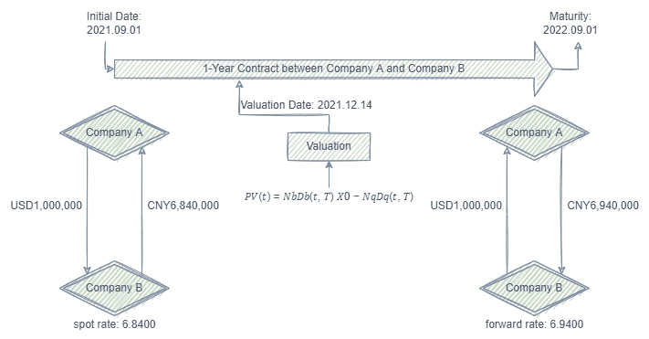

# SQL优化案例：外汇掉期估值计算 <!-- omit in toc -->

在金融领域，合约的估值计算是个常见需求。几百万个合约，由于到期时间和期限长短不同，计算时往往对应不同的利率。合约匹配利率，最常见的做法是通过循环语句对每一个合约做计算。而 DolphinDB 中，可以通过强大的表连接函数，将需要的信息关联后，再通过 SQL向量编程 进行计算。该优化方法相比循环的方法，性能提升超 400 倍。

本文将从以下几个部分来阐述对于此类计算的优化过程。本文中的脚本在 DolphinDB 1.30.18/2.00.6 及以上版本的环境中测试通过。

- [1. 外汇掉期估值的计算逻辑及数据准备](#1-外汇掉期估值的计算逻辑及数据准备)
- [2. 开发环境配置](#2-开发环境配置)
- [3. 外汇掉期估值的普通实现](#3-外汇掉期估值的普通实现)
- [4. 外汇掉期估值的优化实现](#4-外汇掉期估值的优化实现)
- [5. 总结](#5-总结)
- [6. 代码附录](#6-代码附录)

## 1. 外汇掉期估值的计算逻辑及数据准备

### 1.1 外汇掉期估值的计算逻辑 <!-- omit in toc -->

本次的计算整体逻辑如下图：



本次外汇掉期估值计算的逻辑，参考[中国外汇交易中心](https://www.chinamoney.com.cn/chinese/rdgz/20190402/1275734.html)2019年4月2日在官网推出的外汇掉期估值服务中的估值算法，即通过掉期曲线计算当日的远端全价汇率折算，并与约定交易的全价汇率生成的现金流轧差得到净值，再用当日的 Shibor3M(Shanghai Interbank Offered Rate) 利率互换收盘曲线进行贴现，最后得到合约净额的贴现值即为合约估值。

### 1.2 数据准备 <!-- omit in toc -->

外汇掉期估值的计算需要用到掉期曲线利率以及利率互换曲线两张表。以上两张表的数据直接采集于2021年12月14日中国外汇掉期[USD.CNY外汇掉期曲线](https://www.chinamoney.com.cn/chinese/bkcurvfsw/)及[Shibor3M利率互换行情曲线](https://www.chinamoney.com.cn/chinese/bkcurvfx/)。

数据结构分别为：

- USD.CNY外汇掉期曲线:

| name           | typeString | comment    |
| -------------- | ---------- | ---------- |
| Date           | DATE       | 日期       |
| timeminute     | MINUTE     | 时间       |
| currencyPair   | STRING     | 货币对     |
| termToMaturity | STRING     | 期限品种   |
| swapRate_Pips  | DOUBLE     | 掉期点     |
| exchangeRate   | DOUBLE     | 全价汇率   |
| maturityDate   | DATE       | 远端起息日 |

- Shibor3M利率互换行情曲线：

| name         | typeString | comment   |
| ------------ | ---------- | --------- |
| Maturity     | STRING     | 标准期限  |
| buying_rate  | DOUBLE     | 报买（%） |
| average_rate | DOUBLE     | 均值（%） |
| selling_rate | DOUBLE     | 报卖（%） |


本教程用到的合约数据为自行模拟的100万个不同到期期限的合约数据，数据结构为：

| name               | typeString | comment          |
| ------------------ | ---------- | ---------------- |
| contract_no        | INT        | 合约编号         |
| contract_date      | DATE       | 合约日           |
| trade_date         | DATE       | 近端起息日       |
| maturity_date      | DATE       | 远端起息日       |
| buy_sell           | STRING     | 买卖方向         |
| period             | STRING     | 期限             |
| near_leg_currency  | STRING     | 近端交易货币     |
| near_leg_amount    | INT        | 交易量           |
| near_leg_spot_rate | DOUBLE     | 近端掉期全价汇率 |
| far_leg_currency   | STRING     | 远端清算货币     |
| far_leg_spot_rate  | DOUBLE     | 远端掉期全价汇率 |

上述利率数据以及模拟合约数据的脚本请参阅[数据准备脚本](script/FxSwapValuation/fxValuationPreparation.dos)。

## 2. 开发环境配置

### 2.1 DolphinDB server服务器环境 <!-- omit in toc -->

* CPU 类型：Intel(R) Xeon(R) Silver 4216 CPU @ 2.10GHz
* 逻辑 CPU 总数：8
* 内存：64GB
* OS：64位 CentOS Linux 7 (Core)

### 2.2 DolphinDB server部署 <!-- omit in toc -->

* server版本：1.30.18 或 2.00.6
* server部署模式：单节点
* 配置文件：dolphindb.cfg

```shell
localSite=localhost:8848:local8848
mode=single
maxMemSize=64
maxConnections=512
workerNum=8
newValuePartitionPolicy=add
webWorkerNum=2
dataSync=1
```

单节点部署教程：[单节点部署](https://gitee.com/dolphindb/Tutorials_CN/blob/master/standalone_server.md)

## 3. 外汇掉期估值的普通实现

由于每一个合约有不同的起息日和合约期限，因此会对应不同的互换利率以及全价汇率。普通的实现方法是自定义一个包含估值计算逻辑的函数，通过循环语句，将每个合约与对应利率进行计算。

包含三表的估值函数定义如下：

```
def valuationDtmRate(today, swap_rate, IR_swap, maturity_date,far_leg_spot_rate, near_leg_amount){
	target_swap_rate_next = select * from swap_rate where Date=today, currencyPair = `USD.CNY, maturityDate >=maturity_date limit 1
	target_swap_rate_prev = select * from swap_rate where Date=today, currencyPair = `USD.CNY, maturityDate <=maturity_date order by maturityDate desc limit 1
	tartget_IR_swap = select * from IR_swap where Maturity in (target_swap_rate_prev.termToMaturity[0],target_swap_rate_next.termToMaturity[0])
	fex = target_swap_rate_prev.exchangeRate +(maturity_date - target_swap_rate_prev.maturityDate)\ (target_swap_rate_next.maturityDate-target_swap_rate_prev.maturityDate) * (target_swap_rate_next.exchangeRate - target_swap_rate_prev.exchangeRate)
	sir = tartget_IR_swap.selling_rate[0] + (maturity_date - target_swap_rate_prev.maturityDate)\ (target_swap_rate_next.maturityDate-target_swap_rate_prev.maturityDate) * ( tartget_IR_swap.selling_rate[1] -  tartget_IR_swap.selling_rate[0])
	dicount_factor = exp(-sir \ 100 * (maturity_date-today)\365)
	valuation = (fex - far_leg_spot_rate) * dicount_factor * near_leg_amount
	return valuation
}
```

由于涉及到多表间的信息提取，函数看起来会相对复杂。做完这一步之后，就可以对所有的合约进行循环计算。100万个合约在测试环境下做计算耗时约3分20秒。

for循环写法的代码示例如下：

```
today = 2021.12.14
k = array(DOUBLE, 0)
for (x in fx_contract){
	k.append!(valuationDtmRate(today, swap_rate, IR_swap,x.maturity_date, x.far_leg_spot_rate, x.near_leg_amount))
}
result = fx_contract join table(k as valuation)
```

或用loop函数的写法示例如下：

```
k = loop(valuationDtmRate{today, swap_rate, IR_swap},fx_contract.maturity_date, fx_contract.far_leg_spot_rate, fx_contract.near_leg_amount).flatten()
result = fx_contract join table(k as valuation)
```

利用多线程并行计算，可以在同样的计算逻辑上做进一步优化，将原本的单线程循环改成多线程并行计算，最后将结果进行拼接。DolphinDB 提供了 `ploop`/`peach` 函数，可以很方便的把这类循环语句内存计算转换成多线程任务。


此例用了8个并行度做计算，最后耗时大约20秒：

```
k = ploop(valuationDtmRate{today, swap_rate, IR_swap},fx_contract.maturity_date, fx_contract.far_leg_spot_rate, fx_contract.near_leg_amount).flatten()
result = fx_contract join table(k as valuation)
```
> 注意：在批流一体的因子实现中，不建议使用 `ploop`/`peach` 并行加速。具体并行策略可以参考因子最佳实践中的[并行计算章节](https://gitee.com/dolphindb/Tutorials_CN/blob/master/best_practice_for_factor_calculation.md#73-%E5%B9%B6%E8%A1%8C%E8%AE%A1%E7%AE%97)。

## 4. 外汇掉期估值的优化实现

DolphinDB 中提供了许多表关联函数，故原本的两张小表 swap_rate 和 IR_rate 以及合约大表，可以先通过表关联函数将有效信息提取出来，继而直接通过 SQL 做计算即可。如此一来，避免了循环语句重复消耗资源，也减少了代码的开发量。

做外汇掉期估值计算时，可以用 `equal join` , `asof join` 及 `window join` 将需要的远端利率等信息通过三表关联得到，代码如下：

```
today = 2021.12.14
tmp = select * from ej(swap_rate,IR_swap,`termToMaturity, `Maturity) where Date = today
res_aj=aj(fx_contract,tmp, `maturity_date, `maturityDate)
res_wj=wj(res_aj,tmp, 0d:366d,<[first(termToMaturity) as next_termToMaturity, first(exchangeRate) as next_exchangeRate, first(maturityDate) as next_maturityDate,first(buying_rate) as next_buying_rate, first(average_rate) as next_average_rate, first(selling_rate) as next_selling_rate]>, `maturity_date, `maturityDate)
```

由于关联后的信息可以在一张表( res_wj )中得到，故计算逻辑也可以得到简化，可以直观地翻译原公式逻辑进行向量化计算：

```
def valuationSQL(exchangeRate,maturity_date, maturityDate, next_maturityDate, next_exchangeRate, far_leg_spot_rate, selling_rate, next_selling_rate,today, near_leg_amount){
	return (exchangeRate + (maturity_date - maturityDate)\ (next_maturityDate-maturityDate) * (next_exchangeRate - exchangeRate) - far_leg_spot_rate) * exp(-(selling_rate +  (maturity_date - maturityDate)\ (next_maturityDate-maturityDate) * (next_selling_rate - selling_rate))\100 * (maturity_date-today)\365) * near_leg_amount
}
```

用优化后的表关联逻辑做外汇掉期估值计算，整体耗时只需0.5秒左右，性能相比最初提升了超400倍。

```
timer{
	today = 2021.12.14
	tmp = select * from ej(swap_rate,IR_swap,`termToMaturity, `Maturity) where Date = today
	res_aj=aj(fx_contract,tmp, `maturity_date, `maturityDate)
	res_wj=wj(res_aj,tmp, 0d:366d,<[first(termToMaturity) as next_termToMaturity, first(exchangeRate) as next_exchangeRate, first(maturityDate) as next_maturityDate,first(buying_rate) as next_buying_rate, first(average_rate) as next_average_rate, first(selling_rate) as next_selling_rate]>, `maturity_date, `maturityDate)
	
	result = select contract_no,contract_date,trade_date,maturity_date,buy_sell, period, near_leg_currency, near_leg_amount, near_leg_spot_rate, far_leg_currency, far_leg_spot_rate, valuationSQL(exchangeRate,maturity_date, maturityDate, next_maturityDate, next_exchangeRate, far_leg_spot_rate, selling_rate, next_selling_rate,today, near_leg_amount) as valuation from res_wj
}
```

## 5. 总结

对于需要用到多表数据计算的任务，用循环语句的方式性能较差。建议先用 DolphinDB 优化的 `asof join` 等**表关联函数将需要的信息提取**。`asof join` 等表关联函数亦支持分布式关联，对于存储于数据库中的分布式表也可以多线程并行关联，性能卓越。计算部分**建议使用 SQL 向量化编程的方式**做计算，不仅可以减少代码开发量（基本可以直观地翻译计算公式），也避免了循环语句重复消耗 CPU 资源。


## 6. 代码附录
[数据准备脚本](script/FxSwapValuation/fxValuationPreparation.dos)

[外汇掉期估值的优化实现脚本](script/FxSwapValuation/fxValuationOptimal.dos)

[完整优化过程](script/FxSwapValuation/fxValuation.dos)

