# 基于快照行情的股票和基金 K 线合成

> **教程难度**
>
> - 中级
>
> **面向读者**
>
> - 已经掌握 DolphinDB 基础编程语法和 SQL 语法的用户：
>   - [编程语言](https://docs.dolphindb.cn/zh/progr/progr_intro.html)
>   - [map-reduce 函数](https://docs.dolphindb.cn/zh/funcs/m/mr.html)
> - 已经掌握 DolphinDB 流数据基础功能的用户：
>   - [流数据表](https://docs.dolphindb.cn/zh/stream/str_table.html)
>   - [发布与订阅](https://docs.dolphindb.cn/zh/stream/sub_pub.html)
>   - [响应式状态引擎](https://docs.dolphindb.cn/zh/stream/reactive_state_engine.html)
>   - [时序聚合引擎](https://docs.dolphindb.cn/zh/stream/time_series_engine.html)
> - 本教程提供了完整的测试数据和测试代码，初学者也可以跟随教程内容复现业务场景

- [基于快照行情的股票和基金 K 线合成](#基于快照行情的股票和基金-k-线合成)
	- [1. 概述](#1-概述)
	- [2. 基于历史快照行情合成 K 线](#2-基于历史快照行情合成-k-线)
		- [2.1 快照行情数据特征](#21-快照行情数据特征)
		- [2.2 快照行情合成 K 线的规则](#22-快照行情合成-k-线的规则)
		- [2.3 基于历史快照行情合成 K 线](#23-基于历史快照行情合成-k-线)
		- [2.4 并行计算性能测试](#24-并行计算性能测试)
	- [3. 基于实时快照行情数据合成 K 线](#3-基于实时快照行情数据合成-k-线)
		- [3.1 定义创建流表所需的函数](#31-定义创建流表所需的函数)
		- [3.2 定义最高价最低价计算函数](#32-定义最高价最低价计算函数)
		- [3.3 注册原始行情快照数据处理引擎](#33-注册原始行情快照数据处理引擎)
		- [3.4 注册缺失行情填充处理引擎](#34-注册缺失行情填充处理引擎)
		- [3.5 注册1分钟窗口和1分钟步长的滚动计算引擎](#35-注册1分钟窗口和1分钟步长的滚动计算引擎)
		- [3.6 实时合成 K 线存入分区表](#36-实时合成-k-线存入分区表)
		- [3.7 实时行情数据接入](#37-实时行情数据接入)
		- [3.8 Python 客户端订阅](#38-python-客户端订阅)
		- [3.9 DolphinDB DashBoard 面板配置](#39-dolphindb-dashboard-面板配置)
		- [3.10 清理环境](#310-清理环境)
		- [3.11 实时计算性能测试](#311-实时计算性能测试)
		- [3.12 流批一体 K 线合成](#312-流批一体-k-线合成)
	- [4. 总结](#4-总结)
	- [5. 常见问题解答（FAQ）](#5-常见问题解答faq)
		- [5.1 out of memory 错误导致任务失败](#51-out-of-memory-错误导致任务失败)
		- [5.2 计算结果与所述计算规则不符](#52-计算结果与所述计算规则不符)
	- [6. 附录](#6-附录)

## 1. 概述

由于不同交易所不同资产的交易规则是有差异的，导致不同交易所基于快照行情或逐笔成交合成不同资产1分钟 K 线的计算方法是不同的。

本教程旨在提高 DolphinDB 在具体业务场景下的落地效率，降低 DolphinDB 在实际业务使用中的开发难度。

本教程中会学习到：

- 如何基于历史快照行情数据合成1分钟 K 线
- 如何基于实时快照行情数据合成1分钟 K 线

本教程适用范围如下：

表1-1  教程支持 K 线合成的资产范围

| **交易所**    | **是否支持** |
| ---------- | -------- |
| **深交所-股票** | 是        |
| **深交所-基金** | 是        |
| **上交所-股票** | 是        |
| **上交所-基金** | 是        |
| **北交所-股票** | 是        |

**沪深北三大交易所股票和基金资产**的交易时间段如下：

- 早盘集合竞价：09:15:00 - 09:25:00
- 连续竞价：09:30:00 - 11:30:00
- 连续竞价：13:00:00 - 14:57:00
- 午盘集合竞价：14:57:00 - 15:00:00

## 2. 基于历史快照行情合成 K 线

### 2.1 快照行情数据特征

交易所 Level-1或 Level-2 快照行情的数据频率约3秒（即每个股票每隔3秒推送一条快照数据），但是并不是3秒等间隔推送。实盘行情下，平均每个股票和基金1天的快照行情数据条数约4000条左右。

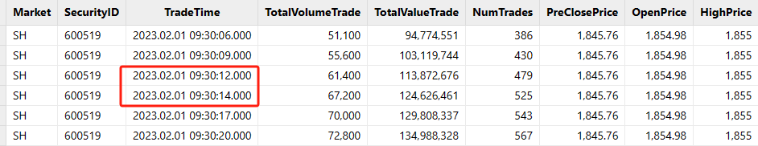

图2-1 活跃股票快照行情非3秒等间隔推送

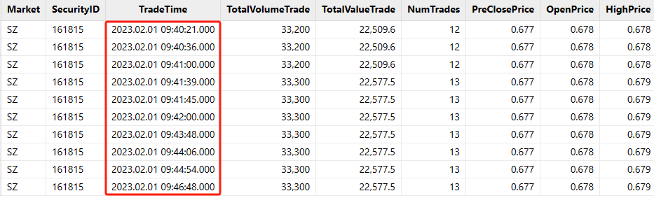

图2-2 不活跃基金快照行情非3秒等间隔推送

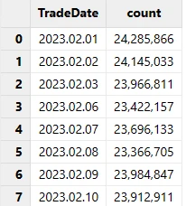

图2-3 2023年2月沪深交易所股票和基金快照行情数据量统计

不同的数据供应商、不同的交易所，提供的快照行情字段都会有差异。

本教程针对沪深北交易所的股票和基金快照行情做了统一处理，数据表中的重要字段如下：

表2-1  沪深北交易所的股票和基金快照行情表结构

| 字段名称         | 数据类型  | 数据说明        |
| ---------------- | --------- | --------------- |
| TradeTime        | TIMESTAMP | 日期时间            |
| SecurityID       | SYMBOL    | 证券代码            |
| OpenPrice        | DOUBLE    | 开盘价             |
| PreCloPrice      | DOUBLE    | 昨收价             |
| HighPrice        | DOUBLE    | 当日最高价           |
| LowPrice         | DOUBLE    | 当日最低价           |
| LastPrice        | DOUBLE    | 当日最新价           |
| PreCloseIOPV     | DOUBLE    | 昨日 IOPV（基金）     |
| IOPV             | DOUBLE    | IOPV（基金）        |
| TotalVolumeTrade | LONG      | 日累计成交量          |
| TotalValueTrade  | DOUBLE    | 日累计成交金额         |
| NumTrades        | LONG      | 日累计成交笔数         |
| UpLimitPx        | DOUBLE    | 当日涨停价           |
| DownLimitPx      | DOUBLE    | 当日跌停价           |
| ……               | ……        | 快照行情字段太多，只展示一部分 |

本教程基于沪深北交易所的股票和基金快照行情数据合成的1分钟 K 线的表结构如下：

表2-2  1分钟 K 线表结构

| 字段名称      | 数据类型  | 数据说明    | 计算规则                                 |
| ------------- | --------- | ----------- | ---------------------------------------- |
| SecurityID    | SYMBOL    | 证券代码        | 证券代码                                     |
| TradeTime     | TIMESTAMP | 日期时间        | 早盘集合竞价数据纳入第一根 K 线<br>第一根 K 线的输出时间是09:30:00，计算窗口为 [09:25:00, 09:31:00)<br>K 线的输出时间为计算窗口的左边界，计算窗口规则为左闭右开<br>合成 K 线一共240根，包括11:30:00, 14:57:00和15:00:00，不包括14:58:00和14:59:00 |
| OpenPrice     | DOUBLE    | 开始价         | 计算窗口内的第一条快照行情的最新价<br>如果开盘后没有成交，为0<br>如果盘中计算窗口缺失快照行情，填充上一根 K 线的收盘价 |
| HighPrice     | DOUBLE    | 最高价         | 计算窗口内的最高价<br>如果开盘后没有成交，为0<br>如果盘中计算窗口缺失快照行情，填充上一根 K 线的收盘价 |
| LowPrice      | DOUBLE    | 最低价         | 计算窗口内的最低价<br>如果开盘后没有成交，为0<br>如果盘中计算窗口缺失快照行情，填充上一根 K 线的收盘价 |
| ClosePrice    | DOUBLE    | 收盘价         | 计算窗口内的最后一条快照行情的最新价<br>如果开盘后没有成交，为0<br>如果盘中计算窗口缺失快照行情，填充上一根 K 线的收盘价 |
| Volume        | LONG      | 成交量         | 计算窗口内的所有快照行情成交量求和<br>如果缺失快照行情，填充0            |
| Turnover      | DOUBLE    | 成交金额        | 计算窗口内的所有快照行情成交金额求和<br>如果缺失快照行情，填充0           |
| TradesCount   | INT       | 成交笔数        | 计算窗口内的所有快照行情成交笔数求和<br>如果缺失快照行情，填充0           |
| PreClosePrice | DOUBLE    | 昨收价         | 当日快照行情中的昨收价<br>如果盘中计算窗口缺失快照行情，填充上一根 K 线的昨日收盘价 |
| PreCloseIOPV  | DOUBLE    | 昨日 IOPV（基金） | 基金当日快照行情中的昨日 IOPV，深交所基金有该字段，上交所基金没有该字段<br>如果盘中计算窗口缺失快照行情，填充上一根 K 线的昨日IOPV |
| IOPV          | DOUBLE    | IOPV（基金）    | 基金当日快照行情中的 IOPV，深交所基金没有该字段，上交所基金有该字段<br>如果盘中计算窗口缺失快照行情，填充上一根 K 线的昨日IOPV |
| UpLimitPx     | DOUBLE    | 涨停价         | 当日快照行情中的涨停价，深交所有该字段，上交所没有该字段<br>如果盘中计算窗口缺失快照行情，填充上一根 K 线的涨停价 |
| DownLimitPx   | DOUBLE    | 跌停价         | 当日快照行情中的跌停价，深交所有该字段，上交所没有该字段<br>如果盘中计算窗口缺失快照行情，填充上一根 K 线的跌停价 |
| ChangeRate    | DOUBLE    | 上涨或下跌幅度     | 当前计算窗口 K 线的收盘价相比上一根 K 线的收盘价的变化幅度<br>开盘第一根 K 线的涨跌幅等于 [09:25:00, 09:31:00) 计算窗口内最后一笔快照的最新价和第一笔快照的最新价的变化幅度<br>如果缺失快照行情，填充0 |

### 2.2 快照行情合成 K 线的规则

**（1）最高价和最低价的处理**

因为快照行情是非等时间间隔的数据切片，所以会出现如下情况：

- 当日最高价（HighPrice）在当前计算窗口内发生变化，但是当前计算窗口内的所有最新价（LastPrice）并不包含发生在当前计算窗口内的当日最高价。

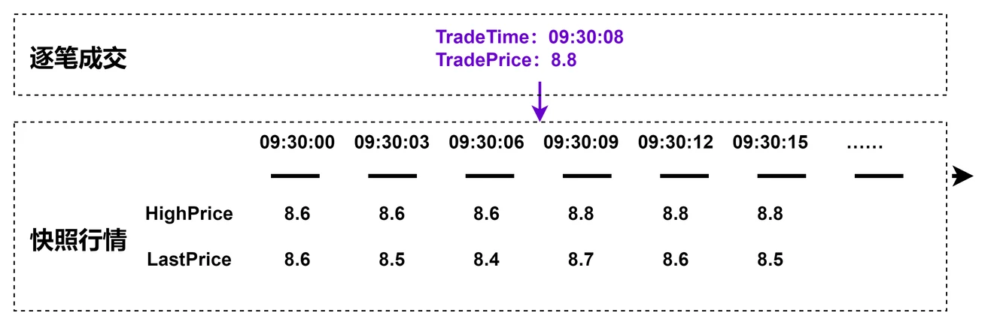

图2-4 最高价计算规则说明

- 当日最低价（LowPrice）在当前计算窗口内发生变化，但是当前计算窗口内的所有最新价（LastPrice）并不包含发生在当前计算窗口内的当日最低价。

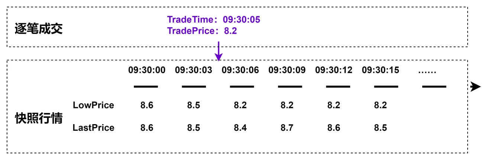

图2-5 最低价计算规则说明

因此，1分钟 K 线的最高价的自定义计算函数如下：

```
defg high(DeltasHighPrice, HighPrice, LastPrice){
	if(sum(DeltasHighPrice)>0.000001){
		return max(HighPrice)
	}
	else{
		return max(LastPrice)
	}
}
```

参数说明：

- **DeltasHighPrice：** 同一个股票或基金两笔相邻快照的当日最高价（HighPrice）的差
- **HighPrice：** 快照行情的当日最高价
- **LastPrice：** 快照行情的当日最新价

函数计算逻辑说明：

- 1分钟 K 线计算窗口内，如果同一个股票或基金两笔相邻快照的当日最高价发生变化，那么1分钟 K 线的最高价等于计算窗口内当日最高价的最大值
- 1分钟 K 线计算窗口内，如果同一个股票或基金两笔相邻快照的当日最高价没有发生变化，那么1分钟 K 线的最高价等于计算窗口内当日最新价的最大值

因此，1分钟 K 线的最低价的自定义计算函数如下：

```
defg low(DeltasLowPrice, LowPrice, LastPrice){
	sumDeltas = sum(DeltasLowPrice)
	if(sumDeltas<-0.000001 and sumDeltas!=NULL){
		return min(iif(LowPrice==0.0, NULL, LowPrice))
	}
	else{
		return min(LastPrice)
	}
}
```

参数说明：

- **DeltasLowPrice：** 同一个股票或基金两笔相邻快照的当日最低价（LowPrice）的差
- **LowPrice：** 快照行情的当日最低价
- **LastPrice：** 快照行情的当日最新价

函数计算逻辑说明：

- 1分钟 K 线计算窗口内，如果同一个股票或基金两笔相邻快照的当日最低价发生变化，那么1分钟 K 线的最低价等于计算窗口内当日最低价的最小值
- 开盘没有成交的股票或基金，推送的快照行情的最新价和最低价都为0，在当日第一个有成交的窗口内，最低价发生变化，此时计算窗口 K 线的最低价等于不为0的快照行情当日最低价的最小值，`min(iif(LowPrice==0.0, NULL, LowPrice))` 就是在处理此种特殊情况
- 1分钟 K 线计算窗口内，如果同一个股票或基金两笔相邻快照的当日最低价没有发生变化，那么1分钟 K 线的最低价等于计算窗口内当日最新价的最小值
- 性能优化小技巧：第三行代码的 `if` 判断条件，两次引用 `sum(DeltasLowPrice)`，建议先用变量 `sumDeltas = sum(DeltasLowPrice)` 进行一次聚合计算。如果在 `if` 判断条件写成 `if(sum(DeltasLowPrice)<-0.000001 and sum(DeltasLowPrice)!=NULL)` ，则此处进行了两次聚合计算


图2-6 开盘没有成交的股票或基金的快照行情

**（2）成交量、成交额和成交笔数的处理**

快照行情中的成交量、成交金额和成交笔数都是日累计求和值，所以按照窗口为1分钟、步长为1分钟的滚动窗口计算前，需要先求出两笔相邻快照的增量。

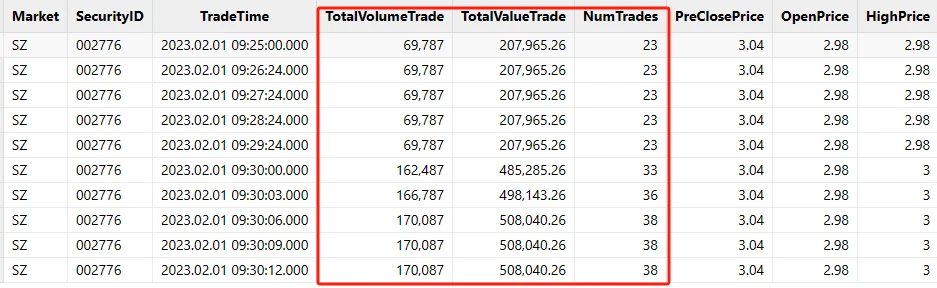

图2-7 快照行情中的日累计成交量、日累计成交额和成日累计交笔数

可以使用 DolphinDB 内置的 [deltas 函数](https://docs.dolphindb.cn/zh/funcs/d/deltas.html)和 [context by SQL 语句](https://docs.dolphindb.cn/zh/progr/sql/contextBy.html)进行数据预处理，具体处理代码下文会详细介绍。

**（3）开盘以后没有成交**

部分成交不活跃的股票和基金，09:15:00 开始交易后一直没有成交，但是快照行情会正常推送。

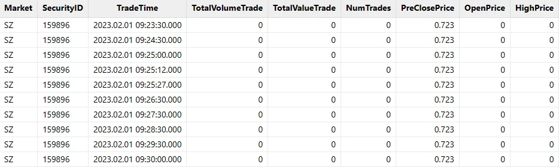

图2-8 开盘没有成交的股票或基金的快照行情

针对开盘以后一直没有成交的计算窗口，本教程处理规则如下：

- OpenPrice, HighPrice, LowPrice, ClosePrice, Volume, Turnover, TradesCount, ChangeRate 为0
- PreClosePrice, PreCloseIOPV, IOPV, UpLimitPx, DownLimitPx 为快照行情中对应的值

**（4）盘中计算窗口内没有成交**

部分成交不活跃的股票和基金，会出现盘中某些计算窗口内完全没有成交，但是快照行情会正常推送。


图2-9 盘中计算窗口内没有成交的快照行情

针对盘中没有成交的计算窗口，本教程处理规则如下：

- OpenPrice, HighPrice, LowPrice, ClosePrice 等于前一根 K 线的 ClosePrice
- Volume, Turnover, TradesCount, ChangeRate 为0
- PreClosePrice, PreCloseIOPV, IOPV, UpLimitPx, DownLimitPx 等于前一根 K 线对应的值

### 2.3 基于历史快照行情合成 K 线

**第一步：部署测试环境**

- 部署 DolphinDB 单节点：[单节点部署教程](https://docs.dolphindb.cn/zh/tutorials/standalone_server.html)
- 下载测试数据，并上传到 DolphinDB 部署的 server 目录下： [testData.csv](../data/k/testData.csv)
- 根据部署教程打开节点 web 编程界面，登陆后运行后续步骤测试代码，默认 admin 账户的密码是 123456

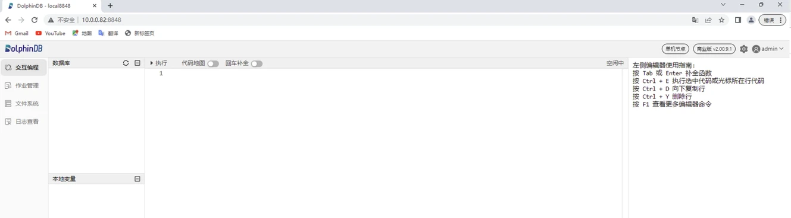

图2-10 DolphinDB web 编程界面

**第二步：创建数据库和分区表**

下述数据库和分区表创建代码适用于沪深两市股票和基金 Level-2 行情快照数据共同存储在同一表中，更多关于数据库和分区表创建的方法可以参考：[存储金融数据的分区方案最佳实践](https://docs.dolphindb.cn/zh/tutorials/best_practices_for_partitioned_storage.html)。

粘贴下述代码至 web 编程界面，选中需要执行代码点击执行（执行快捷键：Ctrl+E）即可：

```
//创建数据库
create database "dfs://snapshotDB"
partitioned by VALUE(2020.01.01..2021.01.01), HASH([SYMBOL, 50])
engine='TSDB'
//创建分区表
create table "dfs://snapshotDB"."snapshotTB"(
    Market SYMBOL
    TradeTime TIMESTAMP
    MDStreamID SYMBOL
    SecurityID SYMBOL
    SecurityIDSource SYMBOL
    TradingPhaseCode SYMBOL
    ImageStatus INT
    PreCloPrice DOUBLE
    NumTrades LONG
    TotalVolumeTrade LONG
    TotalValueTrade DOUBLE
    LastPrice DOUBLE
    OpenPrice DOUBLE
    HighPrice DOUBLE
    LowPrice DOUBLE
    ClosePrice DOUBLE
    DifPrice1 DOUBLE
    DifPrice2 DOUBLE
    PE1 DOUBLE
    PE2 DOUBLE
    PreCloseIOPV DOUBLE
    IOPV DOUBLE
    TotalBidQty LONG
    WeightedAvgBidPx DOUBLE
    AltWAvgBidPri DOUBLE
    TotalOfferQty LONG
    WeightedAvgOfferPx DOUBLE
    AltWAvgAskPri DOUBLE
    UpLimitPx DOUBLE
    DownLimitPx DOUBLE
    OpenInt INT
    OptPremiumRatio DOUBLE
    OfferPrice DOUBLE[]
    BidPrice DOUBLE[]
    OfferOrderQty LONG[]
    BidOrderQty LONG[]
    BidNumOrders INT[]
    OfferNumOrders INT[]
    ETFBuyNumber INT
    ETFBuyAmount LONG
    ETFBuyMoney DOUBLE
    ETFSellNumber INT
    ETFSellAmount LONG
    ETFSellMoney DOUBLE
    YieldToMatu DOUBLE
    TotWarExNum DOUBLE
    WithdrawBuyNumber INT
    WithdrawBuyAmount LONG
    WithdrawBuyMoney DOUBLE
    WithdrawSellNumber INT
    WithdrawSellAmount LONG
    WithdrawSellMoney DOUBLE
    TotalBidNumber INT
    TotalOfferNumber INT
    MaxBidDur INT
    MaxSellDur INT
    BidNum INT
    SellNum INT
    LocalTime TIME
    SeqNo INT
    OfferOrders LONG[]
    BidOrders LONG[]
)
partitioned by TradeTime, SecurityID,
sortColumns=[`Market,`SecurityID,`TradeTime],
keepDuplicates=ALL
```

运行不报错，即执行成功，可以执行下述代码查看分区表的表结构信息：

```
loadTable("dfs://snapshotDB", "snapshotTB").schema().colDefs
```

返回：

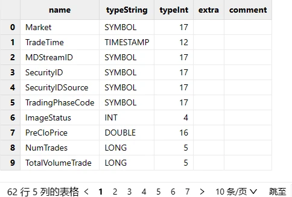

图2-11 行情快照分区表的部分表结构信息

**第三步：导入 csv 测试数据**

执行下述代码，导入测试 csv 文本数据。注意，执行下述代码前，必须把测试数据 `testData.csv` 文件上传到DolphinDB 部署的 server 目录下。也可以把 csv 文件上传到自定义路径，例如 `/data/testData.csv`，此时需要下述代码的` loadTextEx` 导入函数的 `filename="/data/testData.csv"`。

```
tmp = loadTable("dfs://snapshotDB", "snapshotTB").schema().colDefs
schemaTB = table(tmp.name as name, tmp.typeString as type)
loadTextEx(dbHandle=database("dfs://snapshotDB"), tableName="snapshotTB", partitionColumns=`TradeDate`SecurityID, filename="./testData.csv", schema=schemaTB)
```

成功导入后可以执行下述代码，查询前10行数据至内存中查看：

```
data = select top 10 * from loadTable("dfs://snapshotDB", "snapshotTB")
```

返回：

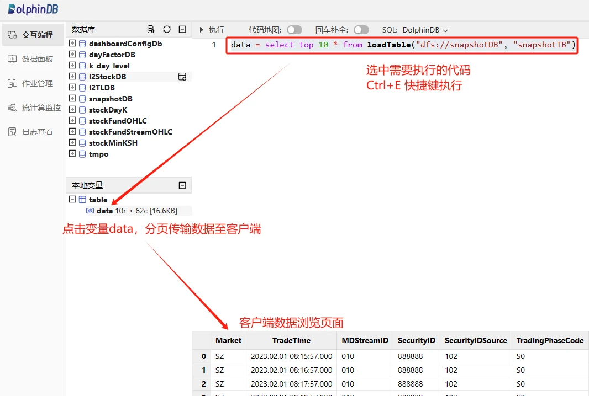

图2-12 数据预览方法

**第四步：自定义最高价最低价计算函数**

执行下述代码，在当前会话中声明自定义函数，可以在同一个会话的后续操作中直接引用函数 `high` 和 `low`：

```
defg high(DeltasHighPrice, HighPrice, LastPrice){
	if(sum(DeltasHighPrice)>0.000001){
		return max(HighPrice)
	}
	else{
		return max(LastPrice)
	}
}

defg low(DeltasLowPrice, LowPrice, LastPrice){
	sumDeltas = sum(DeltasLowPrice)
	if(sumDeltas<-0.000001 and sumDeltas!=NULL){
		return min(iif(LowPrice==0.0, NULL, LowPrice))
	}
	else{
		return min(LastPrice)
	}
}
```

**第五步：加载少量数据至内存调试**

为了方便临时调试代码的正确性，可以先加载少量数据到内存中，方便后续复杂业务代码调试。

执行下述代码，加载1天2个票的数据到内存中，并赋值给表变量 `snapshotTB`，后续代码中，可以直接引用 `snapshotTB` 这个表变量调试代码：

```
snapshotTB =	select	TradeTime, SecurityID, OpenPrice,
			PreCloPrice, HighPrice, LowPrice,
			LastPrice, PreCloseIOPV, IOPV,
			TotalVolumeTrade, TotalValueTrade, NumTrades,
			UpLimitPx, DownLimitPx
		from loadTable("dfs://snapshotDB", "snapshotTB")
		where TradeTime.date()=2023.02.01, SecurityID in `888888`999999
```

**第六步：原始行情快照数据处理**

执行下述代码，对原始的快照行情进行处理，主要进行了以下几个方面的数据加工：

- 把09:25:00-09:30:00的数据归入第一根 K 线：[09:30:00, 09:31:00] 
- 计算同一个股票或者基金的两笔相邻快照的最高价和最低价的变化幅度
- 计算同一个股票或者基金的两笔相邻快照的成交量、成交金额和成交笔数的增量

```
tempTB1 =	select	TradeTime.date() as TradeDate,
			iif(TradeTime.time()<=09:30:00.000, 09:30:00.000, TradeTime.time()) as TradeTime,
			SecurityID,
			OpenPrice,
			PreCloPrice,
			HighPrice,
			LowPrice,
			LastPrice,
			PreCloseIOPV,
			IOPV,
			UpLimitPx,
			DownLimitPx,
			iif(deltas(HighPrice)>0.000001, 1, 0) as DeltasHighPrice,
			iif(abs(deltas(LowPrice))>0.000001, -1, 0) as DeltasLowPrice,
			iif(deltas(TotalVolumeTrade)==NULL, TotalVolumeTrade, deltas(TotalVolumeTrade)) as DeltasVolume,
			iif(deltas(TotalValueTrade)==NULL, TotalValueTrade, deltas(TotalValueTrade)) as DeltasTurnover,
			iif(deltas(NumTrades)==NULL, NumTrades, deltas(NumTrades)) as DeltasTradesCount
		from snapshotTB
		where TradeTime.time()>=09:25:00.000
		context by SecurityID
```

**第七步：1分钟窗口和1分钟步长的聚合计算**

执行下述代码，针对处理后的快照行情做窗口为1分钟、步长为1分钟的滚动窗口计算，重要处理步骤如下：

- 调用了自定义函数 `high` 和 `low `计算 K 线的最高价和最低价
- `FirstBarChangeRate`表示当前1分钟计算窗口内，最后一条最新价不为0的快照相对第一条最新价不为0的快照的变化幅度，用于开盘第一根 K 线的涨跌幅计算
- 数据降频处理调用了 DolphinDB 内置函数`interval`，在此步骤时，针对盘中计算窗口缺失快照行情的情况，统一用0填充，后面会针对全部为0的 K 线填充数据做进一步处理

```
tempTB2 =	select	firstNot(LastPrice, 0) as OpenPrice,
			high(DeltasHighPrice, HighPrice, LastPrice) as HighPrice,
			low(DeltasLowPrice, LowPrice, LastPrice) as LowPrice,
			last(LastPrice) as ClosePrice,
			sum(DeltasVolume) as Volume,
			sum(DeltasTurnover) as Turnover,
			sum(DeltasTradesCount) as TradesCount,
			last(PreCloPrice) as PreClosePrice,
			last(PreCloseIOPV) as PreCloseIOPV,
			last(IOPV) as IOPV,
			last(UpLimitPx) as UpLimitPx,
			last(DownLimitPx) as DownLimitPx,
			lastNot(LastPrice, 0)\firstNot(LastPrice, 0)-1 as FirstBarChangeRate	
		from tempTB1
		group by SecurityID, TradeDate, interval(X=TradeTime, duration=60s, label='left', fill=0) as TradeTime
```

**第八步：对齐每日240根 K 线**

本教程实例中，合成的1分钟 K 线一共240根：

- 第一根 K 线的输出时间是09:30:00，计算窗口为 [09:25:00, 09:31:00)
- 全部输出包括11:30:00, 14:57:00和15:00:00，不包括14:58:00和14:59:00

如果用户需要自定义输出规则，比如需要输出14:58:00和14:59:00这两个特殊时间段的 K 线，可以调整下述代码实现。

```
codes = select distinct(SecurityID) as SecurityID from tempTB2 order by SecurityID
allTime = table((take(0..120, 121)*60*1000+09:30:00.000).join(take(0..117, 118)*60*1000+13:00:00.000).join(15:00:00.000) as TradeTime)
tempTB3 = cj(codes, allTime)
```

**第九步：缺失快照行情计算窗口填充**

执行下述代码，针对对齐每日240根 K 线的结果数据进行如下处理，得到最终结果：

- 针对盘中没有成交的计算窗口，OpenPrice, HighPrice, LowPrice, ClosePrice 用前一根 K 线的 ClosePrice 填充
- 针对盘中没有成交的计算窗口，PreClosePrice, PreCloseIOPV, IOPV, UpLimitPx, DownLimitPx 用前一根 K 线对应的值填充
- 开盘第一根 K 线的涨跌幅等于 [09:25:00, 09:31:00) 计算窗口内最后一笔快照的最新价和第一笔快照的最新价的变化幅度

```
result = select	SecurityID,
		concatDateTime(TradeDate, TradeTime) as TradeTime,
		iif(OpenPrice==0.0 and PreClosePrice==0.0, cumlastNot(ClosePrice, 0.0), OpenPrice) as OpenPrice,
		iif(HighPrice==0.0 and PreClosePrice==0.0, cumlastNot(ClosePrice, 0.0), HighPrice) as HighPrice,
		iif(LowPrice==0.0 and PreClosePrice==0.0, cumlastNot(ClosePrice, 0.0), LowPrice) as LowPrice,
		iif(ClosePrice==0.0 and PreClosePrice==0.0, cumlastNot(ClosePrice, 0.0), ClosePrice) as ClosePrice,
		Volume,
		Turnover,
		TradesCount,
		iif(PreClosePrice==0.0, cumlastNot(PreClosePrice, 0.0), PreClosePrice) as PreClosePrice,
		iif(PreCloseIOPV==0.0 and PreClosePrice==0.0, cumlastNot(PreCloseIOPV, 0.0), PreCloseIOPV).nullFill(0.0) as PreCloseIOPV,
		iif(IOPV==0.0 and PreCloseIOPV==0.0, cumlastNot(IOPV, 0.0), IOPV).nullFill(0.0) as IOPV,
		iif(UpLimitPx==0.0, cumlastNot(UpLimitPx, 0.0), UpLimitPx).nullFill(0.0) as UpLimitPx,
		iif(DownLimitPx==0.0, cumlastNot(DownLimitPx, 0.0), DownLimitPx).nullFill(0.0) as DownLimitPx,
		iif(	time(TradeTime)==09:30:00.000,
			iif(FirstBarChangeRate!=NULL, FirstBarChangeRate, 0.0),
			iif(ratios(ClosePrice)!=NULL and ClosePrice!=0.0, ratios(ClosePrice)-1, 0.0)) as ChangeRate
	from lj(tempTB3, tempTB2, `TradeTime`SecurityID)
	context by SecurityID
```

返回：

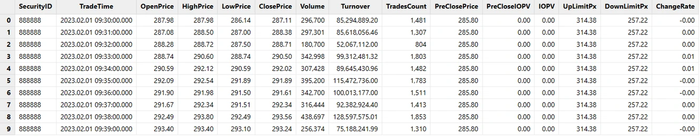

图2-13 1分钟 K 线计算结果

**第十步：封装并行计算代码**

完成前面九个步骤，已经可以针对少量快照行情数据完成 K 线合成任务，但是针对海量历史行情数据还需进一步封装，才能实现并行计算。

可以先执行下述代码，情况当前会话中的所有临时内存变量：

```
undef all
```

然后执行下述代码，定义并行计算相关函数：

```
defg high(DeltasHighPrice, HighPrice, LastPrice){
	if(sum(DeltasHighPrice)>0.000001){
		return max(HighPrice)
	}
	else{
		return max(LastPrice)
	}
}

defg low(DeltasLowPrice, LowPrice, LastPrice){
	sumDeltas = sum(DeltasLowPrice)
	if(sumDeltas<-0.000001 and sumDeltas!=NULL){
		return min(iif(LowPrice==0.0, NULL, LowPrice))
	}
	else{
		return min(LastPrice)
	}
}

def calOHLCBaseOnSnapshotMapFuc(snapshotTB){
	//Processing the original snapshot market table for calculating OHLC
	tempTB1 =	select	TradeTime.date() as TradeDate,
				iif(TradeTime.time()<=09:30:00.000, 09:30:00.000, TradeTime.time()) as TradeTime,
				SecurityID,
				OpenPrice,
				PreCloPrice,
				HighPrice,
				LowPrice,
				LastPrice,
				PreCloseIOPV,
				IOPV,
				UpLimitPx,
				DownLimitPx,
				iif(deltas(HighPrice)>0.000001, 1, 0) as DeltasHighPrice,
				iif(abs(deltas(LowPrice))>0.000001, -1, 0) as DeltasLowPrice,
				iif(deltas(TotalVolumeTrade)==NULL, TotalVolumeTrade, deltas(TotalVolumeTrade)) as DeltasVolume,
				iif(deltas(TotalValueTrade)==NULL, TotalValueTrade, deltas(TotalValueTrade)) as DeltasTurnover,
				iif(deltas(NumTrades)==NULL, NumTrades, deltas(NumTrades)) as DeltasTradesCount
			from snapshotTB
			where TradeTime.time()>=09:25:00.000
			context by SecurityID
	//Aggregate Calculating: temporary 1-minute OHLC table
	tempTB2 =	select	firstNot(LastPrice, 0.0) as OpenPrice,
				high(DeltasHighPrice, HighPrice, LastPrice) as HighPrice,
				low(DeltasLowPrice, LowPrice, LastPrice) as LowPrice,
				last(LastPrice) as ClosePrice,
				sum(DeltasVolume) as Volume,
				sum(DeltasTurnover) as Turnover,
				sum(DeltasTradesCount) as TradesCount,
				last(PreCloPrice) as PreClosePrice,
				last(PreCloseIOPV) as PreCloseIOPV,
				last(IOPV) as IOPV,
				last(UpLimitPx) as UpLimitPx,
				last(DownLimitPx) as DownLimitPx,
				lastNot(LastPrice, 0.0)\firstNot(LastPrice, 0.0)-1 as FirstBarChangeRate	
		from tempTB1
		group by SecurityID, TradeDate, interval(X=TradeTime, duration=60s, label='left', fill=0) as TradeTime
	//240 bars per day
	codes = select distinct(SecurityID) as SecurityID from tempTB2 order by SecurityID
	allTime = table((take(0..120, 121)*60*1000+09:30:00.000).join(take(0..117, 118)*60*1000+13:00:00.000).join(15:00:00.000) as TradeTime)
	tempTB3 = cj(codes, allTime)
	//Processing missing data calculation window, excluding opening
	result = select	SecurityID,
			concatDateTime(TradeDate, TradeTime) as TradeTime,
			iif(OpenPrice==0.0 and PreClosePrice==0.0, cumlastNot(ClosePrice, 0.0), OpenPrice) as OpenPrice,
			iif(HighPrice==0.0 and PreClosePrice==0.0, cumlastNot(ClosePrice, 0.0), HighPrice) as HighPrice,
			iif(LowPrice==0.0 and PreClosePrice==0.0, cumlastNot(ClosePrice, 0.0), LowPrice) as LowPrice,
			iif(ClosePrice==0.0 and PreClosePrice==0.0, cumlastNot(ClosePrice, 0.0), ClosePrice) as ClosePrice,
			Volume,
			Turnover,
			TradesCount,
			iif(PreClosePrice==0.0, cumlastNot(PreClosePrice, 0.0), PreClosePrice) as PreClosePrice,
			iif(PreCloseIOPV==0.0 and PreClosePrice==0.0, cumlastNot(PreCloseIOPV, 0.0), PreCloseIOPV).nullFill(0.0) as PreCloseIOPV,
			iif(IOPV==0.0 and PreCloseIOPV==0.0, cumlastNot(IOPV, 0.0), IOPV).nullFill(0.0) as IOPV,
			iif(UpLimitPx==0.0, cumlastNot(UpLimitPx, 0.0), UpLimitPx).nullFill(0.0) as UpLimitPx,
			iif(DownLimitPx==0.0, cumlastNot(DownLimitPx, 0.0), DownLimitPx).nullFill(0.0) as DownLimitPx,
			iif(	time(TradeTime)==09:30:00.000,
				iif(FirstBarChangeRate!=NULL, FirstBarChangeRate, 0.0),
				iif(ratios(ClosePrice)!=NULL and ClosePrice!=0.0, ratios(ClosePrice)-1, 0.0)) as ChangeRate
		from lj(tempTB3, tempTB2, `TradeTime`SecurityID)
		context by SecurityID
	return result
}

def calOHLCBaseOnSnapshot(calStartDate, calEndDate, dbName, tbName){
	//Generate data source: If SQL only contains the required columns for calculation, it can improve calculation efficiency
	dataSource = sqlDS(<	select	TradeTime, SecurityID, OpenPrice,
					PreCloPrice, HighPrice, LowPrice,
					LastPrice, PreCloseIOPV, IOPV,
					TotalVolumeTrade, TotalValueTrade, NumTrades,
					UpLimitPx, DownLimitPx
				from loadTable(dbName, tbName)
				where TradeTime.date()>=calStartDate, TradeTime.date()<=calEndDate>)
	result = mr(ds=dataSource, mapFunc=calOHLCBaseOnSnapshotMapFuc, finalFunc=unionAll{,false}, parallel=true)
	return result
}
```

最后执行下述代码，针对一天的沪深全市场快照行情并行计算1分钟 K 线：

```
calStartDate = 2023.02.01
calEndDate = 2023.02.01
dbName = "dfs://snapshotDB"
tbName = "snapshotTB"
oneDayResult = calOHLCBaseOnSnapshot(calStartDate, calEndDate, dbName, tbName)
```

**第十一步：1分钟 K 线数据存储**

首次存储数据前，需要执行下述代码创建存储1分钟 K 线所需的数据库和分区表：

```
def createStockFundOHLCDfsTB(dbName="dfs://stockFundOHLC", tbName="stockFundOHLC"){
	if(existsDatabase(dbUrl=dbName)){
		print(dbName + " has been created !")
		print(tbName + " has been created !")
	}
	else{
		db = database(dbName, VALUE, 2021.01.01..2021.12.31)
		print(dbName + " created successfully.")
		colNames = `SecurityID`TradeTime`OpenPrice`HighPrice`LowPrice`ClosePrice`Volume`Turnover`TradesCount`PreClosePrice`PreCloseIOPV`IOPV`UpLimitPx`DownLimitPx`ChangeRate
		colTypes = [SYMBOL, TIMESTAMP, DOUBLE, DOUBLE, DOUBLE, DOUBLE, LONG, DOUBLE, INT, DOUBLE, DOUBLE, DOUBLE, DOUBLE, DOUBLE, DOUBLE]
		schemaTable = table(1:0, colNames, colTypes)
		db.createPartitionedTable(table=schemaTable, tableName=tbName, partitionColumns=`TradeTime)
		print(tbName + " created successfully.")
	}
	return loadTable(dbName, tbName).schema().colDefs
}
dbName = "dfs://stockFundOHLC"
tbName = "stockFundOHLC"
createStockFundOHLCDfsTB(dbName, tbName)
```

执行下述代码将内存中的计算结果存入分区表：

```
loadTable("dfs://stockFundOHLC", "stockFundOHLC").append!(oneDayResult)
```

查询前10行数据至内存中查看：

```
data = select top 10 * from loadTable("dfs://stockFundOHLC", "stockFundOHLC")
```

返回：

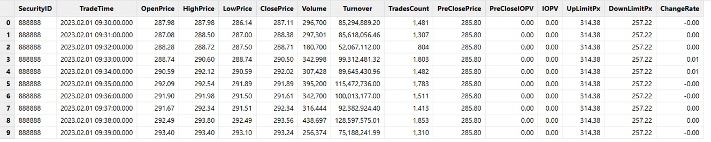

图2-14 1分钟 K 线分区表查询结果

### 2.4 并行计算性能测试

表2-3 测试环境配置表

| 配置项  | 信息                                   |
| -------- | ---------------------------------------- |
| OS（操作系统） | CentOS Linux 7 (Core)                    |
| 内核       | 3.10.0-1160.el7.x86_64                   |
| CPU      | Intel(R) Xeon(R) Gold 5220R CPU @ 2.20GHz16 逻辑 CPU 核心 |
| 内存       | 256 GB                                   |

表2-4 计算性能测试结果表

| 测试场景 | 原始快照行情数据  | 计算结果行数   | 计算结果大小 | 计算耗时 |
| -------- | ------------- | ------------ | ---------- | -------- |
| 1天       | 24,285,866 行  | 1,555,440 行  | 172 MB     | 4.3 s    |
| 10天      | 238,691,947 行 | 15,563,760 行 | 1.7 GB     | 37.3 s   |
| 1个月（20天） | 474,919,708 行 | 31,158,240 行 | 3.4 GB     | 76.5 s   |

如果是社区版用户，在进行上述海量数据并行计算的时候，可能会因为内存不足（社区版限制最大内存使用为8 GB）导致计算任务失败，请添加微信号13306510479 或扫描下面二维码申请测试 license。


图2-15 DolphinDB 技术支持

## 3. 基于实时快照行情数据合成 K 线

实时快照行情数据特征和1分钟 K 线合成规则与2.1和2.2章节中的介绍一致。

基于实时快照行情数据合成 K 线的流程图如下：

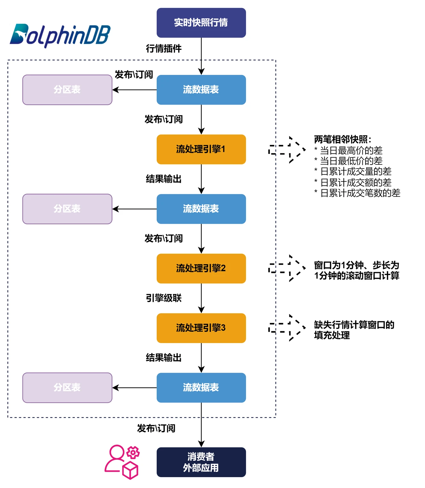

图3-1 基于实时快照行情数据合成 K 线的流程图

接下来将详细介绍如何在 DolphinDB 中实现1分钟 K 线的实时计算代码开发。关于 DolphinDB 的流数据功能的基础概念本教程中不再展开，可以参考官网教程：[流数据](https://docs.dolphindb.cn/zh/stream/str_intro.html)。

### 3.1 定义创建流表所需的函数

执行下述代码，定义创建流数据表所需的函数：

```
def getMDLSnapshotTB(tableCapacity=1000000){
	colNames = `Market`TradeTime`MDStreamID`SecurityID`SecurityIDSource`TradingPhaseCode`ImageStatus`PreCloPrice`NumTrades`TotalVolumeTrade`TotalValueTrade`LastPrice`OpenPrice`HighPrice`LowPrice`ClosePrice`DifPrice1`DifPrice2`PE1`PE2`PreCloseIOPV`IOPV`TotalBidQty`WeightedAvgBidPx`AltWAvgBidPri`TotalOfferQty`WeightedAvgOfferPx`AltWAvgAskPri`UpLimitPx`DownLimitPx`OpenInt`OptPremiumRatio`OfferPrice`BidPrice`OfferOrderQty`BidOrderQty`BidNumOrders`OfferNumOrders`ETFBuyNumber`ETFBuyAmount`ETFBuyMoney`ETFSellNumber`ETFSellAmount`ETFSellMoney`YieldToMatu`TotWarExNum`WithdrawBuyNumber`WithdrawBuyAmount`WithdrawBuyMoney`WithdrawSellNumber`WithdrawSellAmount`WithdrawSellMoney`TotalBidNumber`TotalOfferNumber`MaxBidDur`MaxSellDur`BidNum`SellNum`LocalTime`SeqNo`OfferOrders`BidOrders
	colTypes = [SYMBOL,TIMESTAMP,SYMBOL,SYMBOL,SYMBOL,SYMBOL,INT,DOUBLE,LONG,LONG,DOUBLE,DOUBLE,DOUBLE,DOUBLE,DOUBLE,DOUBLE,DOUBLE,DOUBLE,DOUBLE,DOUBLE,DOUBLE,DOUBLE,LONG,DOUBLE,DOUBLE,LONG,DOUBLE,DOUBLE,DOUBLE,DOUBLE,INT,DOUBLE,DOUBLE[],DOUBLE[],LONG[],LONG[],INT[],INT[],INT,LONG,DOUBLE,INT,LONG,DOUBLE,DOUBLE,DOUBLE,INT,LONG,DOUBLE,INT,LONG,DOUBLE,INT,INT,INT,INT,INT,INT,TIME,INT,LONG[],LONG[]]
	return streamTable(tableCapacity:0, colNames, colTypes)
}

def getMDLSnapshotProcessTB(tableCapacity=1000000){
	colNames = `SecurityID`TradeTime`UpLimitPx`DownLimitPx`PreCloPrice`HighPrice`LowPrice`LastPrice`PreCloseIOPV`IOPV`DeltasHighPrice`DeltasLowPrice`DeltasVolume`DeltasTurnover`DeltasTradesCount
	colTypes = [SYMBOL, TIMESTAMP, DOUBLE, DOUBLE, DOUBLE, DOUBLE, DOUBLE, DOUBLE, DOUBLE, DOUBLE, DOUBLE, DOUBLE, LONG, DOUBLE, INT]
	return streamTable(tableCapacity:0, colNames, colTypes)
}

def getMDLStockFundOHLCTempTB(tableCapacity=1000000){
	colNames = `TradeTime`SecurityID`OpenPrice`HighPrice`LowPrice`ClosePrice`Volume`Turnover`TradesCount`PreClosePrice`PreCloseIOPV`IOPV`UpLimitPx`DownLimitPx`FirstBarChangeRate
	colTypes = [TIMESTAMP, SYMBOL, DOUBLE, DOUBLE, DOUBLE, DOUBLE, LONG, DOUBLE, INT, DOUBLE, DOUBLE, DOUBLE, DOUBLE, DOUBLE, DOUBLE]
	return streamTable(tableCapacity:0, colNames, colTypes)
}

def getMDLStockFundOHLCTB(tableCapacity=1000000){
	colNames = `SecurityID`TradeTime`OpenPrice`HighPrice`LowPrice`ClosePrice`Volume`Turnover`TradesCount`PreClosePrice`PreCloseIOPV`IOPV`UpLimitPx`DownLimitPx`ChangeRate
	colTypes = [SYMBOL, TIMESTAMP, DOUBLE, DOUBLE, DOUBLE, DOUBLE, LONG, DOUBLE, INT, DOUBLE, DOUBLE, DOUBLE, DOUBLE, DOUBLE, DOUBLE]
	return streamTable(tableCapacity:0, colNames, colTypes)
}
```

### 3.2 定义最高价最低价计算函数

执行下述代码，定义计算最高价最低价所需函数：

```
defg high(DeltasHighPrice, HighPrice, LastPrice){
	if(sum(DeltasHighPrice)>0.000001){
		return max(HighPrice)
	}
	else{
		return max(LastPrice)
	}
}

defg low(DeltasLowPrice, LowPrice, LastPrice){
	sumDeltas = sum(DeltasLowPrice)
	if(sumDeltas<-0.000001 and sumDeltas!=NULL){
		return min(iif(LowPrice==0.0, NULL, LowPrice))
	}
	else{
		return min(LastPrice)
	}
}
```

### 3.3 注册原始行情快照数据处理引擎

**第一步：创建相关流数据表**

执行下述代码：

```
//Declare parameters
tableCapacity = 1000000
mdlSnapshotTBName = "mdlSnapshot"
mdlSnapshotProcessTBName = "mdlSnapshotProcess"
//Create MDL snapshot table
share(getMDLSnapshotTB(tableCapacity), mdlSnapshotTBName)
//Create MDL processed snapshot table
share(getMDLSnapshotProcessTB(tableCapacity), mdlSnapshotProcessTBName)
```

说明：

- `tableCapacity` 表示创建流数据表时预先分配的内存空间大小，如果该值小于实际接收的行情数量，则会自动扩容，扩容的时间点会有时延波动。该值也不建议设置太大，设置太大会造成内存浪费。合理的值应该是稍大于当天的全部行情数据量，这个值可以根据过去一段时间的行情数据统计得到。
- `mdlSnapshotTBName` 流数据表用于接收实时快照行情，并把增量数据实时推送给原始行情快照数据处理引擎。
- `mdlSnapshotProcessTBName` 流数据表用于接收引擎处理的结果数据。

**第二步：定义原始行情快照处理引擎规则**

执行下述代码：

```
//Original columns in the snapshot table
colNames = `TradeTime`UpLimitPx`DownLimitPx`PreCloPrice`HighPrice`LowPrice`LastPrice`PreCloseIOPV`IOPV
//Derived columns processed based on the original snapshot table
convert = sqlCol(colNames).append!(sqlColAlias(<iif(deltas(HighPrice)>0.000001, 1, 0)>, `DeltasHighPrice)).append!(sqlColAlias(<iif(abs(deltas(LowPrice))>0.000001, -1, 0)>, `DeltasLowPrice)).append!(sqlColAlias(<iif(deltas(TotalVolumeTrade)==NULL, TotalVolumeTrade, deltas(TotalVolumeTrade))>, `DeltasVolume)).append!(sqlColAlias(<iif(deltas(TotalValueTrade)==NULL, TotalValueTrade, deltas(TotalValueTrade))>, `DeltasTurnover)).append!(sqlColAlias(<iif(deltas(NumTrades)==NULL, NumTrades, deltas(NumTrades))>, `DeltasTradesCount))
```

可以点击本地变量查看定义的计算规则。

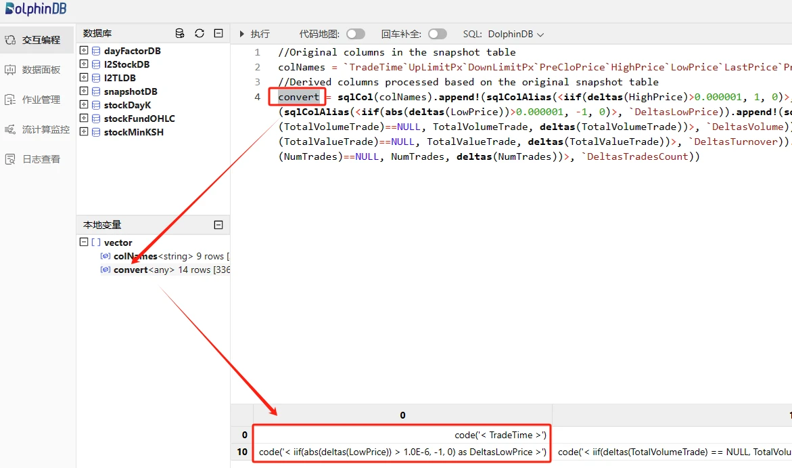

图3-2 自定义行情数据处理规则

原始行情的加工处理包含两部分内容：

- 保留一部分原始字段的值，如市场时间、涨停价、跌停价等，在 `colNames` 变量中表示。
- 对原始字段加工处理，如基于日累计成交量计算相邻两笔快照的成交量增量，在 DolphinDB 中的处理表达式为 `<iif(deltas(TotalVolumeTrade)==NULL, TotalVolumeTrade, deltas(TotalVolumeTrade))>` ，[deltas 函数](https://docs.dolphindb.cn/zh/funcs/d/deltas.html)表示计算两条相邻数据的差，第一条快照的 `deltas(TotalVolumeTrade)` 计算结果为 NULL，这里用 [iif 函数](https://docs.dolphindb.cn/zh/funcs/i/iif.html)处理这种 if-else 的逻辑，第一条快照数据的成交量增量等于该条快照的 `TotalVolumeTrade`。

**第三步：注册原始行情快照处理引擎（流处理引擎1）**

执行下述代码：

```
mdlSnapshotProcessEngineName = "mdlSnapshotProcessEngine"
createReactiveStateEngine(
	name=mdlSnapshotProcessEngineName,
	metrics =convert,
	dummyTable=objByName(mdlSnapshotTBName),
	outputTable=objByName(mdlSnapshotProcessTBName),
	keyColumn="SecurityID",
	filter=<TradeTime.time() between 09:25:00.000:11:31:00.000 or TradeTime.time() between 13:00:00.000:14:57:00.000 or TradeTime.time()>=15:00:00.000>,
	keepOrder = true)
```

说明：

- 此处使用了 DolphinDB 的响应式状态引擎 `ReactiveStateEngine` ，主要功能是针对输入数据做滑动窗口处理，即对每一条输入引擎的数据按照指定的计算逻辑处理，该引擎可以进行无状态和有状态计算，有状态计算函数都已经过算法优化，比如增量计算、避免重复计算等。
- 该引擎支持过滤输出，此处指定了只输出以下时间段的处理结果：
  - 09:25:00.000-11:31:00.000
  - 13:00:00.000-14:57:00.000
  - 大于等于15:00:00.000

执行下述代码，可以查看引擎注册情况，正常返回如下内容：

```
getStreamEngineStat()
```

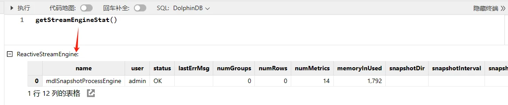

图3-3 引擎注册情况

**第四步：订阅原始行情流数据表**

执行下述代码：

```
subscribeTable(
	tableName=mdlSnapshotTBName,
	actionName=mdlSnapshotProcessEngineName,
	handler=getStreamEngine(mdlSnapshotProcessEngineName),
	msgAsTable=true,
	batchSize=100,
	throttle=0.002,
	hash=0,
	reconnect=true)
```

说明：

- 被订阅的流数据表是原始快照行情表
- 消费者是原始行情快照处理引擎，即原始行情表实时流入的数据会及时发布到引擎，实时完成原始行情的加工

执行下述代码，可以查看订阅情况，正常返回如下内容：

```
getStreamingStat().pubTables
```

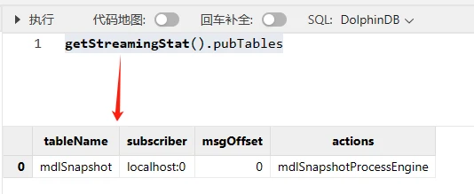

图3-4 订阅情况

### 3.4 注册缺失行情填充处理引擎

按照 K 线合成流程图，正常流程应该先注册流处理引擎2，再注册流处理引擎3。但是本教程中，流处理引擎2到流处理引擎3的用到了引擎级联的功能，所以需要先定义流处理引擎3，然后定义流处理引擎2的时候，才可以指定其输出为流处理引擎3的输入。

**第一步：创建相关流数据表**

执行下述代码：

```
//Declare parameters
mdlStockFundOHLCTBName = "mdlStockFundOHLC"
//Create MDL 1-minute OHLC table
share(getMDLStockFundOHLCTB(100000), mdlStockFundOHLCTBName)
```

说明：

- `mdlStockFundOHLCTBName` 流数据表用于接收流处理引擎3最终的输出，即1分钟的 K 线数据。它可以被外部应用订阅，如 Python, C++, Java, C# 等。

**第二步：注册缺失行情填充处理引擎（流处理引擎3）**

执行下述代码：

```
//Declare parameters
mdlStockFundOHLCEngineName = "mdlStockFundOHLCEngine"
//Define engine calculation methods
convert = <[
	TradeTime,
	iif(OpenPrice==0, ClosePrice, OpenPrice).nullFill(0.0),
	iif(HighPrice==0, ClosePrice, HighPrice).nullFill(0.0),
	iif(LowPrice==0, ClosePrice, LowPrice).nullFill(0.0),
	ClosePrice.nullFill(0.0),
	Volume,
	Turnover,
	TradesCount,
	PreClosePrice,
	PreCloseIOPV.nullFill(0.0),
	IOPV.nullFill(0.0),
	UpLimitPx,
	DownLimitPx,
	iif(time(TradeTime)==09:30:00.000, FirstBarChangeRate, iif(ratios(ClosePrice)!=NULL, ratios(ClosePrice)-1, 0)).nullFill(0.0)
]>
//Create ReactiveStateEngine: mdlStockFundOHLCEngineName
createReactiveStateEngine(
	name=mdlStockFundOHLCEngineName,
	metrics =convert,
	dummyTable=getMDLStockFundOHLCTempTB(1),
	outputTable=objByName(mdlStockFundOHLCTBName),
	keyColumn="SecurityID",
	keepOrder = true)
```

说明：

- 流处理引擎2会基于处理后的快照行情数据做步长和窗口为1分钟的滚动窗口计算，其正常输出是每个股票或基金每分钟都有一条数据。但是会存在特殊情况，非常不活跃的股票或基金会存在某一分钟内一条行情快照数据都不存在的情况，此时流处理引擎2统一用0进行填充。为了符合 K 线的计算规则，比如计算窗口缺失快照行情的 K 线，OpenPrice, HighPrice, LowPrice, ClosePrice 用前一根 K 线的 ClosePrice 填充，上述引擎就是在处理这些异常情况。
- 流处理引擎3的输入是流处理引擎2，所以流处理引擎3不需要订阅上游流数据表。

### 3.5 注册1分钟窗口和1分钟步长的滚动计算引擎

执行下述代码：

```
mdlStockFundOHLCTempEngineName = "mdlStockFundOHLCTempEngine"
//Define engine calculation methods
barConvert = <[
	firstNot(LastPrice, 0),
	high(DeltasHighPrice, HighPrice, LastPrice),
	low(DeltasLowPrice, LowPrice, LastPrice),
	lastNot(LastPrice, 0),
	sum(DeltasVolume),
	sum(DeltasTurnover),
	sum(DeltasTradesCount),
	first(PreCloPrice),
	first(PreCloseIOPV),
	lastNot(IOPV, 0),
	last(UpLimitPx),
	last(DownLimitPx),
	lastNot(LastPrice, 0)\firstNot(LastPrice, 0)-1
]>
//Define engine fill methods
fillList = [0, 0, 0, 'ffill', 0, 0, 0, 'ffill', 'ffill', 'ffill', 'ffill', 'ffill', 0]
createDailyTimeSeriesEngine(
	name=mdlStockFundOHLCTempEngineName,
	windowSize=60000,
	step=60000,
	metrics=barConvert,
	dummyTable=objByName(mdlSnapshotProcessTBName),
	outputTable=getStreamEngine(mdlStockFundOHLCEngineName),
	timeColumn=`TradeTime,
	keyColumn=`SecurityID,
	useWindowStartTime=true,
	forceTriggerTime=1000,
	fill=fillList,
	sessionBegin=09:30:00.000 13:00:00.000 15:00:00.000,
	sessionEnd=11:31:00.000 14:58:00.000 15:01:00.000,
	mergeSessionEnd=true,
	forceTriggerSessionEndTime=30000)
//Subscribe to the processed snapshot table, input incremental data into the DailyTimeSeriesEngine of mdlStockFundOHLCTempEngineName
subscribeTable(
	tableName=mdlSnapshotProcessTBName,
	actionName=mdlStockFundOHLCTempEngineName,
	handler=getStreamEngine(mdlStockFundOHLCTempEngineName),
	msgAsTable=true,
	batchSize=100,
	throttle=0.01,
	hash=0,
	reconnect=true)
```

说明：

- 此处使用了 DolphinDB 的日级时间序列聚合引擎 `DailyTimeSeriesEngine`，主要用于实时计算场景下滚动窗口和滑动窗口计算。
- `forceTriggerTime=1000` 表示整个市场上，任意1个股票或基金的最新快照行情时间 `TradeTime` 大于等于窗口关闭时间（本教程中是整分时间）1000 毫秒（1秒）时，强制触发不活跃股票和基金的最新1根 K 线的计算窗口关闭并输出 K 线结果。该强制输出的时延用户可以根据实际业务需求设置。

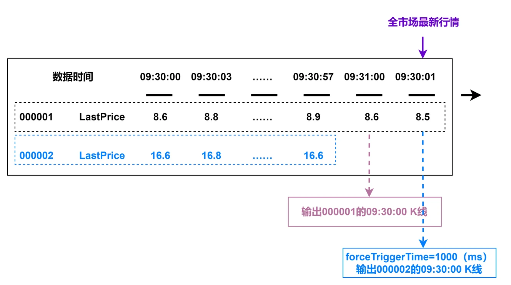

图3-5 forceTriggerTime 参数使用场景说明

- `forceTriggerSessionEndTime=30000` 表示机器时间到达每一个 `sessionEnd` 的时间点后，机器时间再过 30000 毫秒（3秒）时间后，强制关闭没有输出 `sessionEnd` 的最后一根 K 线的股票或基金。

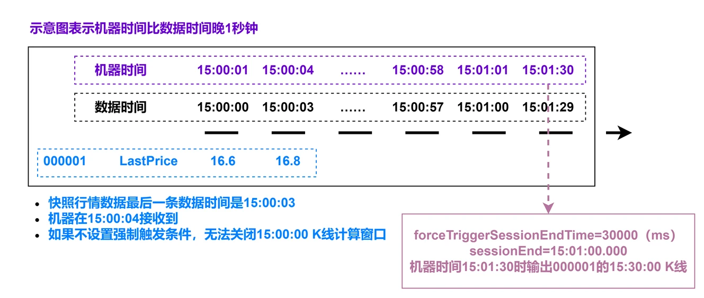

图3-6 forceTriggerSessionEndTime 参数使用场景说明

### 3.6 实时合成 K 线存入分区表

本教程的实时 K 线合成流程中，有三张流数据表，数据内容分别是：

- 原始快照行情数据： mdlSnapshotTBName
- 对原始快照行情加工后的数据：mdlSnapshotProcessTBName
- 1分钟 K 线结果数据：mdlStockFundOHLCTBName

流数据表中的数据需要存入分区表才能满足永久保存的需求，下面以1分钟 K 线结果数据为例，详细介绍如何把流数据表中实时增加的数据存入分区表中。

**第一步：创建数据库和分区表**

数据库和分区表创建代码只需执行一次，创建成功后，分区表会一直存在，不需要反复执行：

```
def createStockFundOHLCDfsTB(dbName, tbName){
	if(existsDatabase(dbUrl=dbName)){
		print(dbName + " has been created !")
		print(tbName + " has been created !")
	}
	else{
		db = database(dbName, VALUE, 2021.01.01..2021.12.31)
		print(dbName + " created successfully.")
		colNames = `SecurityID`TradeTime`OpenPrice`HighPrice`LowPrice`ClosePrice`Volume`Turnover`TradesCount`PreClosePrice`PreCloseIOPV`IOPV`UpLimitPx`DownLimitPx`ChangeRate
		colTypes = [SYMBOL, TIMESTAMP, DOUBLE, DOUBLE, DOUBLE, DOUBLE, LONG, DOUBLE, INT, DOUBLE, DOUBLE, DOUBLE, DOUBLE, DOUBLE, DOUBLE]
		schemaTable = table(1:0, colNames, colTypes)
		db.createPartitionedTable(table=schemaTable, tableName=tbName, partitionColumns=`TradeTime)
		print(tbName + " created successfully.")
	}
	return loadTable(dbName, tbName).schema().colDefs
}
dbName = "dfs://stockFundStreamOHLC"
tbName = "stockFundStreamOHLC"
createStockFundOHLCDfsTB(dbName, tbName)
```

**第二步：订阅1分钟 K 线结果表实时存储**

执行下述代码：

```
subscribeTable(
	tableName=mdlStockFundOHLCTBName,
	actionName=mdlStockFundOHLCTBName,
	handler=loadTable("dfs://stockFundStreamOHLC", "stockFundStreamOHLC"),
	msgAsTable=true,
	batchSize=5000,
	throttle=1,
	hash=0,
	reconnect=true)
```

说明：

- 为了提高实时数据写入分区表的吞吐量，建议 `batchSize` 可以设置为5000条，`throttle`可以设置为1秒，起到批量写入的效果。

### 3.7 实时行情数据接入

完成上述步骤后，把实时快照行情接入至原始行情表 `mdlSnapshotTBName`，即可触发已经定义好的 K 线计算任务。

实时行情数据可以通过 DolphinDB 行情插件、消息中间件插件或各种语言的 API 接入，可以参考官网对应教程或者添加 DolphinDB 小助手微信号13306510479咨询。

本教程通过 DolphinDB 的 replay 回放功能把数据库中的历史行情回放成流数据，进行调试开发。

执行下述代码，启动回放任务：

```
replayData =	select *
		from loadTable("dfs://snapshotDB", "snapshotTB")
		where TradeTime.date()=2023.02.01
		order by TradeTime
replay(
	inputTables=replayData,
	outputTables=mdlSnapshot,
	dateColumn=`TradeTime,
	timeColumn=`TradeTime,
	replayRate=-1)
```

回放结束后，可以执行下述代码查看流数据表中的结果数据：

```
result = select * from mdlStockFundOHLC order by SecurityID
```

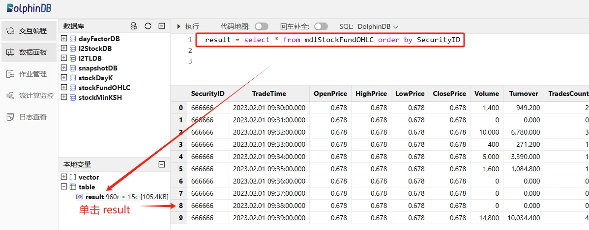

图3-7 流数据表中的1分钟 K 线计算结果

可以执行下述代码查看分区表中的结果数据：

```
result = select *
	from loadTable("dfs://stockFundStreamOHLC", "stockFundStreamOHLC")
	where SecurityID=`666666
```

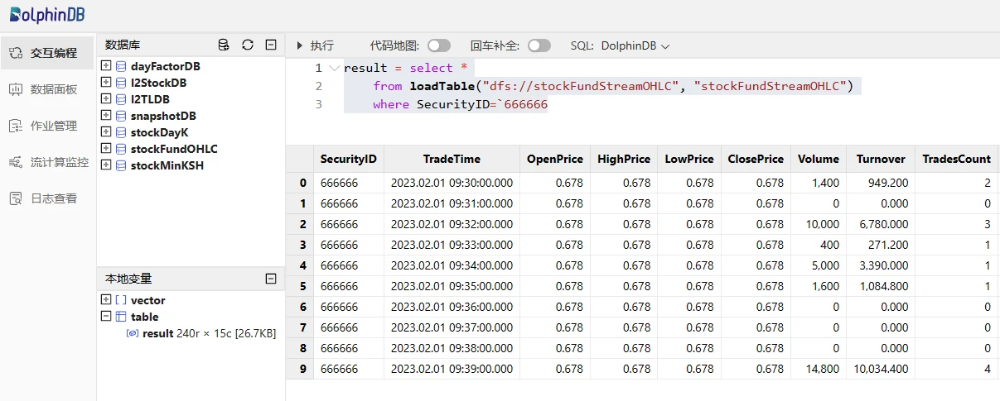

图3-8 分区表中的1分钟 K 线计算结果

### 3.8 Python 客户端订阅

DolphinDB 提供了各种语言的 API 订阅接口，包括 Python, C++, Java, C# 等，具体使用方法可以参考官方 API 相关教程。

本教程以 Python 为例，展示一个简单的第三方客户端消费 DolphinDB 流数据的例子，在 Python 环境执行下述代码：

```
import dolphindb as ddb

# 与 DolphinDB 建立会话和连接
s = ddb.session()
s.connect(host="192.198.1.39", port=8988, userid="admin", password="123456")

# 定义 Python 端的回调函数
def handlerTestPython(msg):
    print(msg)
    
# python 客户端开启 DolphinDB 订阅功能
s.enableStreaming(0)

# 订阅
s.subscribe(host="192.198.1.39",
            port=8988,
            handler=handlerTestPython,
            tableName="mdlStockFundOHLC",
            actionName="testStream",
            offset=0,
            batchSize=2,
            throttle=0.1,
            msgAsTable=True)
```

返回：


图3-9 Python 客户端订阅消费结果

说明：

- 例子中 `offset` 设置为0，表示从流数据表中的内存中的第一条历史数据开始订阅消费。所以在 Python 启动该订阅时，Python 客户端可以消费到订阅流数据表中的所有记录。
- 实盘中，`offset` 一般设置为-1，表示从订阅启动开始，订阅消费该时刻起被订阅流数据表中的增量数据，即最新数据。

### 3.9 DolphinDB DashBoard 面板配置

DolphinDB 提供了便捷的可视化数据面板配置，具体使用方法可以参考官网教程：[数据面板](https://docs.dolphindb.cn/zh/tutorials/dashboard_tutorial.html)。

基于该教程合成的 K 线数据配置数据面板效果如下：

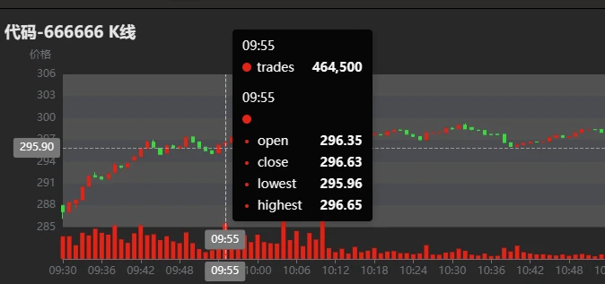

图3-10 DolphinDB DashBoard 资产 K 线图

### 3.10 清理环境

实时计算主要依赖 DolphinDB 的流数据功能，包括订阅发布、流数据表和流计算引擎，所以清理相关环境的时候也需要把上述定义内容全部删除掉。

环境清理步骤：

- 删除流数据表时必须先删除所有相关订阅发布，使用 [unsubscribeTable 函数](https://docs.dolphindb.cn/zh/funcs/u/unsubscribeTable.html)。
- 删除流数据表使用 [dropStreamTable 函数](https://docs.dolphindb.cn/zh/funcs/d/dropStreamTable.html)。
- 删除流计算引擎使用 [dropStreamEngine 函数](https://docs.dolphindb.cn/zh/funcs/d/dropStreamEngine.html)。

可以执行下述代码清理本教程中流数据功能相关环境：

```
//Declare parameters
mdlSnapshotTBName = "mdlSnapshot"
mdlSnapshotProcessTBName = "mdlSnapshotProcess"
mdlSnapshotProcessEngineName = "mdlSnapshotProcessEngine"
mdlStockFundOHLCTempEngineName = "mdlStockFundOHLCTempEngine"
mdlStockFundOHLCTBName = "mdlStockFundOHLC"
mdlStockFundOHLCEngineName = "mdlStockFundOHLCEngine"
//Cancel related subscriptions
try{unsubscribeTable(tableName=mdlSnapshotTBName, actionName=mdlSnapshotProcessEngineName)} catch(ex){print(ex)}
try{unsubscribeTable(tableName=mdlSnapshotProcessTBName, actionName=mdlStockFundOHLCTempEngineName)} catch(ex){print(ex)}
try{unsubscribeTable(tableName=mdlStockFundOHLCTBName, actionName=mdlStockFundOHLCTBName)} catch(ex){print(ex)}
//Cancel the definition of related stream tables
try{dropStreamTable(mdlSnapshotTBName)} catch(ex){print(ex)}
try{dropStreamTable(mdlSnapshotProcessTBName)} catch(ex){print(ex)}
try{dropStreamTable(mdlStockFundOHLCTBName)} catch(ex){print(ex)}
//Cancel the definition of related stream calculation engines
try{dropStreamEngine(mdlSnapshotProcessEngineName)} catch(ex){print(ex)}
try{dropStreamEngine(mdlStockFundOHLCEngineName)} catch(ex){print(ex)}
try{dropStreamEngine(mdlStockFundOHLCTempEngineName)} catch(ex){print(ex)}
```

### 3.11 实时计算性能测试

表3-1 测试环境配置表

| 配置项  | 信息                                   |
| -------- | ---------------------------------------- |
| OS（操作系统） | CentOS Linux 7 (Core)                    |
| 内核       | 3.10.0-1160.el7.x86_64                   |
| CPU      | Intel(R) Xeon(R) Gold 5220R CPU @ 2.20GHz16 逻辑 CPU 核心 |
| 内存       | 256 GB                                   |

表3-2 实时计算性能测试结果表

| 测试场景            | 平均单个股票或基金单次响应计算的时延 |
| ------------------- | ---------------------- |
| 实盘全市场股票和基金（6481个代码） | <0.50 ms               |

### 3.12 流批一体 K 线合成

为了满足产研一体化需求，需要共用一套代码完成基于历史和实时快照行情合成 K 线的计算。

该需求的用户只需根据本章节基于实时快照行情数据合成 K 线的教程，把全量历史数据全速回放，然后把回放所得的 K 线计算结果存入分区表中即可。

实盘实时计算，按照本章节3.7小节所述，接入实时行情数据即可。如有问题，欢迎添加 DolphinDB 小助手微信号13306510479咨询。

## 4. 总结

本教程详细介绍了如何在 DolphinDB 中基于历史和实时快照行情数据合成沪深北交易所股票和基金的1分钟 K 线，旨在提高 DolphinDB 在具体业务场景下的落地效率。

DolphinDB 在海量数据的批计算性能上表现优异，基于16个 CPU 核心完成1天沪深全市场24,285,866 行原始快照行情的降频 K 线计算只需4.7秒，输出1分钟 K 线数据量为 1,555,440 行。

DolphinDB 在大流量的实时流计算性能上表现优异，可以达到微秒级别。基于2.20GHz 主频的 CPU 实时计算沪深全市场股票和基金的1分钟 K 线的平均单票单次响应计算的时延为 500 微秒。

本教程合成 K 线的规则可能和用户实际场景有差异，用户可以根据本教程提供的源码修改后快速完成项目开发。

## 5. 常见问题解答（FAQ）

### 5.1 out of memory 错误导致任务失败

在使用示例教程进行海量数据并行计算的时候，可能会因为内存不足导致计算任务失败，请添加微信号13306510479 或扫描下面二维码申请测试 license。


图5-1 DolphinDB 小助手

### 5.2 计算结果与所述计算规则不符

本教程是基于2023年某天的全市场股票和基金快照行情开发的，可能会有一些特殊情况并没有考虑周全。用户如果在使用教程代码中发现计算结果与所属计算规则不符的情况，请及时联系 DolphinDB 小助手反馈，联系方式请查看5.1。

## 6. 附录

- 测试数据：[testData.csv](./data/k/testData.csv)
- 基于历史快照行情合成 K 线的代码：[calHistoryOHLC.dos](./script/k/calHistoryOHLC.dos)
- 基于实时行情快照合成 K 线的代码：[calStreamOHLC.dos](./script/k/calStreamOHLC.dos)
