# DolphinDB 处理 Level 2 行情数据实例

Level 2 高频行情数据包含大量有价值的信息，利用这些数据生成交易信号和获取收益已经成为量化研究中的一种主流策略。作为一个高性能时序数据库，DolphinDB 非常适合存储、处理 GB 级别甚至 PB 级别的海量数据集，包括 Level 2 高频行情数据的存储、因子计算、建模、回测和实盘交易等。

本文基于国内 A 股市场 Level 2 高频行情数据的特点来展示高频行情数据存储和因子计算实例。根据历史批量因子计算、实时因子计算两个场景，以及针对不同的高频数据源，本文总结出了在 DolphinDB 中处理 Level 2 行情数据实例。

本文涉及的脚本见[附件](#6-附件)，DolphinDB server 版本为 2.00.9。

- [1.  Level 2 行情数据介绍](#1--level-2-行情数据介绍)
	- [1.1 数据概况](#11-数据概况)
	- [1.2 数据结构](#12-数据结构)
- [2.  DolphinDB 高效存储 Level 2 行情数据](#2--dolphindb-高效存储-level-2-行情数据)
	- [2.1 分区方案](#21-分区方案)
	- [2.2 分区内分组排序](#22-分区内分组排序)
	- [2.3 Level 2 行情数据存储方案](#23-level-2-行情数据存储方案)
- [3.  基于历史数据的批量因子计算](#3--基于历史数据的批量因子计算)
	- [3.1 快照数据的因子计算](#31-快照数据的因子计算)
	- [3.2 逐笔成交数据的因子计算](#32-逐笔成交数据的因子计算)
	- [3.3 逐笔委托数据的因子计算](#33-逐笔委托数据的因子计算)
- [4. 基于 Level 2 实时行情数据的流式实现](#4-基于-level-2-实时行情数据的流式实现)
	- [4.1  快照实时行情数据的高频因子流批一体实现](#41--快照实时行情数据的高频因子流批一体实现)
	- [4.2  延时成交订单因子的流式实现](#42--延时成交订单因子的流式实现)
- [5. 总结](#5-总结)
- [6. 附件](#6-附件)


# 1.  Level 2 行情数据介绍

## 1.1 数据概况

Level 2 行情数据是目前国内证券市场上最为完整，颗粒度最为精细的交易信息数据。其涵盖了在沪深两市上市的股票、可交易型基金、沪深交易所指数等大量品种。

Level 2 行情数据分类表如下:

| 数据类型  | 数据频率 |
| :-------- | :------- |
| 分钟 K 线 | 1分钟    |
| 盘口快照  | 3秒      |
| 委托队列  | 3秒      |
| 逐笔成交  | 0.01秒   |
| 逐笔委托  | 0.01秒   |

分钟K线：即当日全天的分钟K线行情。相比传统K线，包含了分钟成交笔数信息。

盘口快照：即常用的每3秒一个切片的十档委托行情。其中，也包括该时刻的委托总量和平均委托价格信息。

委托队列：即买一、卖一的总委托单数，以及前50笔委托的明细信息。

成交明细：即两个3秒快照之间，详细的逐笔成交与逐笔委托信息。

需要注意的是，沪深交易所的 Level 2 行情数据存在一定的差异，主要体现在成交明细数据方面。深交所的逐笔成交数据中，包括了逐笔委托数据，其中有详细的挂撤单信息，和标记为撤单的逐笔成交。

## 1.2 数据结构

上交所提供的1分钟数据是 Level 2 行情数据中数据字段最少、频率最低的数据。其主要包含昨日收盘价、开盘价、最高价、最低价、收盘价、成交量和成交额等数据。

A股票行情快照数据每3秒钟记录一次，包括前后两个时刻的盘口变化数据。每天的数据量约为15G。

股票行情快照数据原始字段说明对照表（表中的空字段，说明当前市场的行情数据中没有该字段）

| 深交所数据          | 上交所数据         | 字段含义                        |
| :------------------ | :----------------- | :------------------------------ |
| security_id         | SecurityID         | 证券代码                        |
| orig_time           | DateTime           | 时间戳：2021-03-01 12:45:00.000 |
| preclose_px         | PreClosePx         | 昨日收盘价                      |
| open_px             | OpenPx             | 开盘价                          |
| high_px             | HighPx             | 最高价                          |
| low_px              | LowPx              | 最低价                          |
| last_px             | LastPx             | 收盘价                          |
| up_limit_px         |                    | 涨停                            |
| down_limit_px       |                    | 跌停                            |
| trading_phase_code  | InstrumentStatus   | 交易状态                        |
| num_trades          | NumTrades          | 成交笔数                        |
| total_volume_trade  | TotalVolumeTrade   | 成交总量                        |
| total_value_trade   | TotalValueTrade    | 成交总金额                      |
| total_bid_qty       | TotalBidQty        | 委托买入总量                    |
| total_offer_qty     | TotalOfferQty      | 委托卖出总量                    |
|                     | WithdrawBuyNumber  | 买入撤单笔数                    |
|                     | WithdrawSellNumber | 卖出撤单笔数                    |
|                     | WithdrawBuyAmount  | 买入撤单数量                    |
|                     | WithdrawSellAmount | 卖出撤单数量                    |
|                     | WithdrawBuyMoney   | 买入撤单金额                    |
|                     | WithdrawSellMoney  | 卖出撤单金额                    |
| weighted_avg_bid_px | WeightedAvgBidPx   | 加权平均委买价格                |
| bid_px              | BidPrice[10]       | 委买价格10                      |
| offer_px            | OfferPrice[10]     | 委卖价格10                      |
| bid_size            | BidOrderQty[10]    | 买10量                          |
| offer_size          | OfferOrderQty[10]  | 卖10量                          |
| order_qty_b1        | BidOrders[50]      | 委买订单50                      |
| order_qty_s1        | OfferOrders[50]    | 委卖订单50                      |

股票逐笔委托数据记录的最小时间间隔为0.01秒，每个0.01秒内有可能有多笔委托，Level 2 行情数据对0.01秒内的委托时点进行模糊处理，不进行区分。 股票逐笔委托数据的单日数据量在 12GB 左右，由于交易活跃度不同，不同标的之间的单日数据量会有很大差异。

股票逐笔委托原始数据字段说明对照表（表中的空字段，说明当前市场的行情数据中没有该字段）

| 深交所数据 | 上交所数据   | 字段含义                                                     |
| ---------- | ------------ | ------------------------------------------------------------ |
| SecurityID | SecurityID   | 证券代码                                                     |
| OrigTime   | TransactTime | 时间戳：2021-03-01 12:45:00.000                              |
| Price      | Price        | 委托价格                                                     |
| OrderQty   | Balance      | 委托数量                                                     |
| Side       | OrderBSFlag  | 买卖方向：<br>沪市为B – 买单；S – 卖<br>深市为1 - 买；2 - 卖 |
|            | OrderNo      | 委托订单号                                                   |
| ApplSeqNum |              | 委托索引（仅深交所）                                         |
| ChannelNo  | ChannelNo    | 频道代码                                                     |
| OrderType  | OrdType      | 委托类别：<br>沪市为A – 委托订单（增加）；D – 委托订单（删除）<br>深市为1-市价；2-限价；U - 本方最优 |
|            | BizIndex     | 业务序列号，与逐笔成交统一编号，从 1 开始按 Channel 连续     |
|            | OrderIndex   | 委托序号， NUMBER 从 1 开始，按 Channel 连续                 |

与股票逐笔委托数据相似，股票逐笔成交数据记录了股票交易的每一笔成交信息。每笔成交包含价格、成交量、成交金额、成交时间等信息。单日数据量在 6GB 左右，与不同标的的交易活跃度有关。

股票逐笔成交数据原始字段说明对照表（表中的空字段，说明当前市场的行情数据中没有该字段）

| 深交所数据      | 上交所数据  | 数据说明                                                     |
| --------------- | ----------- | ------------------------------------------------------------ |
| SecurityID      | SecurityID  | 证券代码                                                     |
| ExecType        | TradeBSFlag | 成交类别：<br>沪市为B – 外盘，主动买；S – 内盘，主动卖；N – 未知<br>深市为4 - 撤销；F - 成交 |
| OrigTime        | TradeTime   |                                                              |
| Price           | TradePrice  | 成交价格                                                     |
| TradeQty        | TradeQty    | 成交数量                                                     |
|                 | TradeAmount | 成交金额                                                     |
| BidApplSeqNum   | BuyNo       | 买方序号                                                     |
| OfferApplSeqNum | SellNo      | 卖方序号                                                     |
|                 | TradeIndex  | 成交序号                                                     |
|                 | BizIndex    | 业务序列号                                                   |
| ChannelNo       | ChannelNo   | 频道代码                                                     |

# 2.  DolphinDB 高效存储 Level 2 行情数据

A股股票高频数据每日数据增量在30+G，基金债券等标的每日数据量在45+G。历史数据和每日增量数据数据量在 10TB 级别以上。面对如此庞大的数据量， 如何保证高效的数据写入、数据压缩和快速的数据查询计算是高频数据存储的一大挑战。

为解决这一挑战，我们将 DolphinDB 的存储特性组合使用，提供了灵活的存储解决方案。

## 2.1 分区方案

为了实现行情数据的灵活分区存储，可以采用”时间+标的“的方式进行数据分区。DolphinDB 支持对不同分区数据进行多线程并行操作。

## 2.2 分区内分组排序

DolphinDB 的 TSDB 引擎提供了排序键设置，可以为每个数据分区设置一个排序键，以便在数据随机读取时更准确地定位数据。例如，通过设置 SortColumn=[“SecurityID”, “TradeTime”]，数据可以按照 SecurityID 字段分组，并在每个组内按照时间字段 TradeTime 排序。

## 2.3 Level 2 行情数据存储方案

在上交所股票 Level 2 行情数据中，市价单信息只存储于逐笔成交表中，而逐笔委托表中没有市价单的记录，因此计算委托量和委托金额等指标时需要对两个表进行关联。在深交所 Level 2 行情数据中，逐笔委托表中的市价单价格标记为0；而撤单记录在逐笔成交表中，撤单记录中价格也标记为0；因此在计算委托金额、撤单金额等指标时都需要对两个表进行关联再计算。此外，在计算其他因子指标时，也需要对逐笔成交表和行情快照数据表进行关联。

根据业务需求，这里对沪深股票 Level 2 高频数据采用一库三表的建库建表方案，即把两个交易所相同的行情数据存入同一张表，使用 market 字段标识不同的交易所，且将 market 设置在索引列（SortColumn）中。

| 数据源   | 数据量 | 分区方案（组合分区）          | 库、表名称                  | SortColumn 字段               |
| :------- | :----- | :---------------------------- | :-------------------------- | :---------------------------- |
| 行情快照 | 15G+   | 交易日按值分区+标的哈希20分区 | "dfs://level_2"，"snapshot" | market，SecurityID，TradeTime |
| 逐笔委托 | 11G+   | 交易日值分区+标的哈希20分区   | "dfs://level_2"，"entrust"  | market，SecurityID，TradeTime |
| 逐笔成交 | 6G+    | 交易日值分区+标的哈希20分区   | "dfs://level_2"，"trade"    | market，SecurityID，TradeTime |

库表创建之后，数据的导入教程可以参考DolphinDB的数据导入相关教程，如[金融 PoC 用户历史数据导入指导手册之股票 level2 逐笔篇](https://gitee.com/dolphindb/Tutorials_CN/blob/master/LoadDataForPoc.md)。

# 3.  基于历史数据的批量因子计算

本章节介绍 DolphinDB 对 Level 2 行情数据的处理。DolphinDB 不仅提供了高速存取时序数据的基本功能，还内置了向量化的多范式编程语言和强大的计算引擎，可高效用于量化金融的因子开发，包括基于历史数据的批量高频因子计算和基于实时 Level 2 行情的流式计算。

本章基于 Level 2 历史行情数据中的行情快照、逐笔成交和逐笔委托中的几个高频因子，介绍 DolphinDB 向量化的多范式编程语言的强大功能。

## 3.1 快照数据的因子计算

Level 2 行情快照数据包含10档价位上的委卖价格、委托量和委托买卖总量等指标，主要用于分析订单簿所提供的信息。

行情快照中的大部分高频因子基于限价订单簿的静态指标，例如价差、深度、宽度、斜率、订单不平衡等，研究市场的交易行为，进而预测股票的短期价格走势。

本节介绍基于 Level 2 行情快照中十档买卖价格和买卖数量数据计算的时间加权订单斜率、十档平均委卖订单斜率、成交价加权净委买比例、十档委买增额和十档买卖委托均价线性回归斜率等高频因子。

以下是 Level 2 行情快照数据十档部分字段的样例：

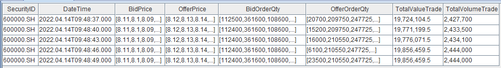  

### 3.1.1 时间加权订单斜率

订单斜率因子衡量订单价差对订单量差的敏感度。其计算公式如下：

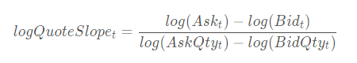

$logQuoteSlope_{t}$ 衡量 t 时刻的订单斜率。其中， $bid_{t}$ 和 $ask_{t}$ 分别表示买一价和卖一价， $bidQty_{t}$ 和 $askQty_{t}$ 分别表示买一量和卖一量。

```
 @state
def timeWeightedOrderSlope(bid,bidQty,ask,askQty,lag=20){
	return (log(iif(ask==0,bid,ask))-log(iif(bid==0,ask,bid)))\(log(askQty)-log(bidQty)).ffill().mavg(lag, 1).nullFill(0)
}
```

使用函数 [`mavg`](https://www.dolphindb.cn/cn/help/FunctionsandCommands/FunctionReferences/m/mavg.html?highlight=mavg) 计算过去20行的移动平均时间加权订单斜率，其中 `@state` 表示用户自定义的状态函数。状态算子计算时需要用到历史状态，DolphinDB 在流式计算中对自定义状态函数，通过增量的方式实现，性能有很大的提升。

### 3.1.2 加权平均订单失衡率因子

订单失衡率（SOIR）因子衡量买卖委托量在总量中的不均衡程度。其计算公式如下：

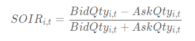

表示 $t$ 时刻第 i 档的订单失衡率因子。其中 $bidQty_{i,t}$， $askQty_{i,t}$ 表示第 i 档买方委托量和卖方委托量。为了充分利用各档数据信息，计算各档位加权和订单失衡率因子时，根据买卖压力的影响力赋予不同档位相应的权重。通常，靠近交易价格的档位被赋予更高的权重。计算公式如下：

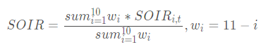

SOIR 反应盘口各档综合的买卖委托量不均衡程度。如果 SOIR 为正，则说明市场买压大于卖压，未来价格趋势上涨的概率较高。此外，SOIR 值越大，上涨的概率越高，反之亦然。

```
@state
def wavgSOIR(bidQty,askQty,lag=20){
	imbalance= rowWavg((bidQty - askQty)\(bidQty + askQty), 10 9 8 7 6 5 4 3 2 1).ffill().nullFill(0)
	mean = mavg(prev(imbalance), (lag-1), 2)
	std = mstdp(prev(imbalance) * 1000000, (lag-1), 2) \ 1000000
	return iif(std >= 0.0000001,(imbalance - mean) \ std, NULL).ffill().nullFill(0)
}
```

bidQty, askQty 为[数组向量](https://www.dolphindb.cn/cn/help/DataTypesandStructures/DataForms/Vector/arrayVector.html?highlight=toarray#array-vector)数据类型，分别为买方十档委托量和卖方十档委托数量。使用数组向量进行加减运算非常便捷，而使用 [`rowWavg`](https://www.dolphindb.cn/cn/help/FunctionsandCommands/FunctionReferences/r/rowWavg.html?highlight=rowwavg) 函数则可轻松计算加权平均值。在本例中，我们使用 `rowWavg` 函数计算各档加权平均的买卖委托量不均衡程度因子，即订单失衡率因子。最后对一段时间的指标进行移动标准化处理。

### 3.1.3 成交价加权净委买比例

净委买比率是衡量一段时间内买盘相对强度的指标，计算公式为：(盘口买一变化量－盘口卖一变化量)/ (abs（盘口买一变化量)+abs(盘口卖一变化量))×100%。当净委买比率为正值数值较大时，说明市场买盘强劲。当委比值为负值且数值较大时，说明市场卖盘强劲。数值从-100%逐步增加到+100%表示买盘逐渐增强，卖盘逐渐减弱；而从+100%逐步减少到-100%则表示买盘逐渐减弱，卖盘逐渐增强的过程。其计算公式如下：

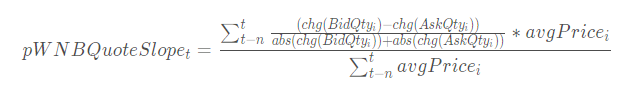

 

$chg(bidQty_{i})$ 和 $chg(askQty_{i})$ 分别表示在 i 时刻盘口买一和卖一变化量，而 $avgPrice_{i}$ 表示在 i-1 时刻到 i 时刻成交的平均价格。

```
  @state
def traPriceWeightedNetBuyQuoteVolumeRatio(bid,bidQty,ask,askQty,TotalValTrd,TotalVolTrd,lag=20){
	prevbid = prev(bid)
	prevbidQty = prev(bidQty)
	prevask = prev(ask)
	prevaskQty = prev(askQty)
	bidchg = iif(round(bid-prevbid,2)>0, bidQty, iif(round(bid-prevbid,2)<0, -prevbidQty, bidQty-prevbidQty))
	offerchg = iif(iif(ask==0,iif(prevask>0,1,0), ask-prevask)>0, prevaskQty, iif(iif(prevask==0,
		iif(ask>0,-1,0), iif(ask>0,ask-prevask,1))<0, askQty, askQty-prevaskQty))
	avgprice = deltas(TotalValTrd)\deltas(TotalVolTrd)
	factorValue = (bidchg-offerchg)\(abs(bidchg)+abs(offerchg))*avgprice
	return nullFill(msum(factorValue,lag,1)\msum(avgprice,lag,1), 0)
}
```

以上代码，首先通过计算买卖一档前后价格的变化，得到盘口买卖一委托量的绝对变化量；然后利用净委买比率公式，计算过去一段时间的成交价加权净委买比例。

### 3.1.4 十档净委买增额

十档净委买增额因子指的是在有效十档范围内买方资金总体增加量，即所有买价变化量的总和，计算公式如下：

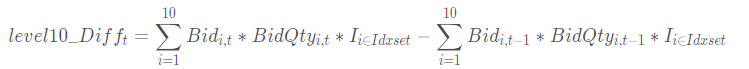

有效十档范围内表示不考虑已不在十档范围内的档位，即表示只考虑以下区间的档位： 

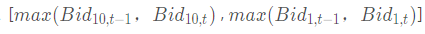

```
@state
def level10_Diff(price, qty, buy, lag=20){
        prevPrice = price.prev()
        left, right = rowAlign(price, prevPrice, how=iif(buy, "bid", "ask"))
        qtyDiff = (qty.rowAt(left).nullFill(0) - qty.prev().rowAt(right).nullFill(0)) 
        amtDiff = rowSum(nullFill(price.rowAt(left), prevPrice.rowAt(right)) * qtyDiff)
        return msum(amtDiff, lag, 1).nullFill(0)
}
```

以上代码，首先通过行对齐函数 [`rowAlign`](https://www.dolphindb.cn/cn/help/FunctionsandCommands/FunctionReferences/r/rowAlign.html?highlight=rowalign) 实现当前十档价格和前一个一十档价格进行行对齐，然后通过 [`rowAt`](https://www.dolphindb.cn/cn/help/FunctionsandCommands/FunctionReferences/r/rowAt.html?highlight=rowat) 和 [`nullFill`](https://www.dolphindb.cn/cn/help/FunctionsandCommands/FunctionReferences/n/nullFill.html?highlight=nullfill) 函数分别获取对应档位的委托量和实现价格进行对齐，最后计算总的变化额。

### 3.1.5 十档买卖委托均价线性回归斜率

十档买卖委托均价即为十档买卖委托额之和除以十档买卖委托量之和：

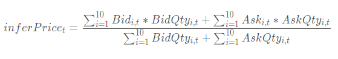

十档买卖委托均价线性回归斜率为十档买卖委托均价对时间t的线性回归的斜率。

```
@state
def level10_InferPriceTrend(bid, ask, bidQty, askQty, lag1=60, lag2=20){
	inferPrice = (rowSum(bid*bidQty)+rowSum(ask*askQty))\(rowSum(bidQty)+rowSum(askQty))
	price = iif(bid[0] <=0 or ask[0]<=0, NULL, inferPrice)
	return price.ffill().linearTimeTrend(lag1).at(1).nullFill(0).mavg(lag2, 1).nullFill(0)
}
```

以上代码，bid, ask, bidQty 和 askQty 均为[数组向量](https://www.dolphindb.cn/cn/help/DataTypesandStructures/DataForms/Vector/arrayVector.html?highlight=toarray#array-vector)数据类型，分别为买卖十档价格和十档委托数量。通过 [`linearTimeTrend`](https://www.dolphindb.cn/cn/help/FunctionsandCommands/FunctionReferences/l/linearTimeTrend.html?highlight=lineartimetrend#lineartimetrend) 函数获取因子值对时间 t 的滑动线性回归斜率，该函数返回线性回归的截距和斜率。`linearTimeTrend(price_,lag1)[1]` 表示获取十档买卖委托均价对时间t的线性回归的斜率。

### 3.1.6 性能测试

A 股 Level 2 行情快照数据一天的数据量超过10G，因此金融量化工程师们非常关注 Level 2 行情快照数据的高频因子计算性能。本节将展示5个受到关注的高频因子的计算性能，包括：加权时间订单斜率、加权平均订单失衡率、成交价加权净委买比率、十档委买增额和十档买卖委托均价线性回归斜率。

```
timer {
	res=select SecurityID,DateTime,timeWeightedOrderSlope(bidPrice[0],bidOrderQty[0],OfferPrice[0],OfferOrderQty[0])  as TimeWeightedOrderSlope,
	level10_InferPriceTrend(bidPrice,OfferPrice,bidOrderQty,OfferOrderQty,60,20) as Level10_InferPriceTrend,
	level10_Diff(bidPrice, bidOrderQty, true,20) as Level10_Diff,
	traPriceWeightedNetBuyQuoteVolumeRatio(bidPrice[0],bidOrderQty[0],OfferPrice[0],OfferOrderQty[0],TotalValueTrade,
	totalVolumeTrade) as TraPriceWeightedNetBuyQuoteVolumeRatio,
	wavgSOIR( bidOrderQty,OfferOrderQty,20) as HeightImbalance
	from  loadTable(dbName,snapshotTBname) where date(DateTime)=idate context by SecurityID csort DateTime map 
}
```

- 计算结果展示

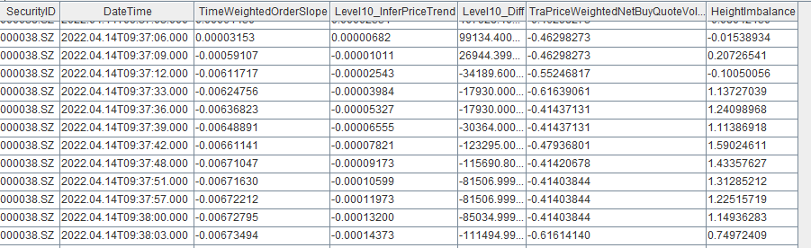

- 计算耗时展示

以下为基于快照数据计算一天全市场所有股票的5个因子的耗时，可以发现耗时基本与 CPU 数量成正比。

| CPU 数量 | 5个因子计算耗时 |
| :------- | :-------------- |
| 4        | 35.51s          |
| 8        | 19.27s          |
| 16       | 11.91s          |
| 32       | 8.11s           |

 

- 与 Python 计算性能的对比

在 Python 中实现上面5个因子的计算逻辑。获取一天中两只股票的数据进行对比测试。

下表为 DolphinDB 和 Python 计算性能的对比，可以发现，DolphinDB 显著优于 Python。代码见[附件](#6-附件)。

| **因子名**                             | **Python 耗时** | **DolphinDB 耗时** | **耗时比** |
| :------------------------------------- | :-------------- | :----------------- | :--------- |
| timeWeightedOrderSlope                 | 136.726ms       | 7.745ms            | 17.6       |
| wavgSOIR                               | 432.329ms       | 11.805ms           | 36.6       |
| traPriceWeightedNetBuyQuoteVolumeRatio | 144.154ms       | 8.339ms            | 17.3       |
| level10_Diff                           | 34.120026s      | 13.025ms           | 2619.2     |
| level10_InferPriceTrend                | 1.267870s       | 20.324ms           | 73.7       |

## 3.2 逐笔成交数据的因子计算

逐笔成交数据包含的信息很丰富，可以构建很多中高频因子。以下为逐笔成交的样例数据：

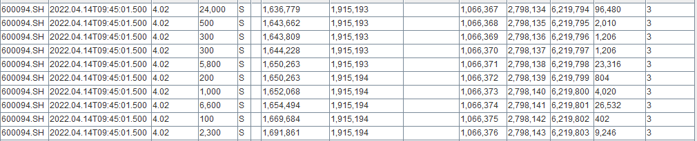

利用逐笔成交数据中的买卖订单号，可以将其合并为单笔订单成交数据，并从单笔订单的角度区分大小单和主买卖方向等。本节从单笔订单和主买卖角度出发，计算主动买入和卖出的单笔订单均价，并统计成交时间与开始委托下单时长超过1分钟的订单数量。

### 3.2.1 单笔订单主动买入卖出均价

单笔订单主动买入、卖出均价为单笔主买、主卖订单的成交均价价格之和除以订单数量。

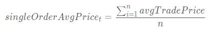

$n$ 表示截至 t 时刻主买、主卖订单数量， $avgTradePrice$ 表示单笔订单主买、主卖的成交均价。

```
def singleOrderAveragePrice(buyNo,sellNo,tradePrice,tradeQty,BSFlag="B"){
	if(BSFlag=="B"){
		 totolMoney=groupby(sum,iif(buyNo>sellNo,tradePrice*tradeQty,0),buyNo).values()[1]
		 totolqty=groupby(sum,iif(buyNo>sellNo,tradeQty,0),buyNo).values()[1]
	}
	else{
		 totolMoney=groupby(sum,iif(buyNo<sellNo,tradePrice*tradeQty,0),sellNo).values()[1]
		 totolqty=groupby(sum,iif(buyNo<sellNo,tradeQty,0),sellNo).values()[1]
		}
	 return totolMoney\totolqty
}
res=select avg(singleOrderAveragePrice(BidApplSeqNum,OfferApplSeqNum,TradePrice,TradeQty,"B")) as ActBuySingleOrderAveragePriceFactor,
avg(singleOrderAveragePrice(BidApplSeqNum,OfferApplSeqNum,TradePrice,TradeQty,"S")) as ActSellSingleOrderAveragePriceFactor from 
tradeTB where  TradePrice>0 group by SecurityID cgroup by minute(DateTime) as minute order by  minute;
```

这里首先通过自定义函数实现单笔订单的成交均价，然后再计算单笔订单的成交均价。自定义函数中使用 [`groupby`](https://www.dolphindb.cn/cn/help/Functionalprogramming/TemplateFunctions/groupby.html?highlight=groupby#groupby-g) 函数分别计算单笔订单的成交金额和成交数量。

最后通过 `group by` + [`cgroup by`](https://www.dolphindb.cn/cn/help/SQLStatements/cgroupby.html?highlight=cgroup#cgroup-by) 计算每只股票当日最新一分钟单笔订单主动买入、卖出均价。计算结果如下：

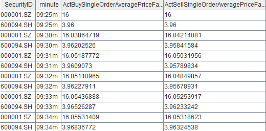

### 3.2.2 股票延时成交订单因子

延时成交挂单数和成交量，一定程度上能反应大单或者机构成交情况。本节统计从下单到成交的时间间隔超过1分钟的订单数和成交量。

```
@state
def delayedTradeNum(bsFlag, flag, side){
      return iif(bsFlag==side && flag<=1, flag, 0).cumsum()

}

@state
def delayedTradeQty(bsFlag, flag, tradeQty, cumTradeQty, side){
        return iif(bsFlag==side && flag>1, tradeQty, iif(bsFlag==side && flag==1, cumTradeQty, 0)).cumsum()
}
///买方
///step 1,标记延时状态，计算笔订单的累计成交量
t1 = select SecurityID,DateTime,entrust.DateTime as time,"B" as bsFlag,tradeQty, cumsum(iif(DateTime-entrust.DateTime>60000,1,0)) as delayedTraderflag, cumsum(tradeQty) as cumTradeQty from lsj(trade, entrust, ['SecurityID', 'BidApplSeqNum'], ['SecurityID', 'ApplSeqNum']) where tradePrice>0 context by  SecurityID,BidApplSeqNum 
/////step 2,统计每只股票累计的延时成交订单数，和延时成交订单量
tt2 = select SecurityID,DateTime,delayedTradeNum(bsFlag, delayedTraderflag, "B") as DelayedTraderBuyOrderNum ,
 delayedTradeQty(bsFlag,delayedTraderflag, tradeQty, cumTradeQty, "B") as DelayedTraderBuyOrderQty from t1 context by SecurityID limit -1
 ///卖方
///step 1,标记延时状态，计算笔订单的累计成交量
t1 = select SecurityID,DateTime,"S" as bsFlag,tradeQty, cumsum(iif(DateTime-entrust.DateTime>60000,1,0)) as delayedTraderflag, cumsum(tradeQty) as cumTradeQty from lsj(trade, entrust, ['SecurityID', 'OfferApplSeqNum'], ['SecurityID', 'ApplSeqNum']) where tradePrice>0 context by SecurityID, OfferApplSeqNum
/////step 2,统计每只股票累计的延时成交订单数，和延时成交订单量
t3 = select SecurityID,DateTime,delayedTradeNum(bsFlag, delayedTraderflag, "S") as DelayedTraderSellOrderNum ,
 delayedTradeQty(bsFlag,delayedTraderflag , tradeQty, cumTradeQty, "S") as DelayedTraderSellOrderQty from t1 context  by SecurityID limit -1
 t2=lsj(t2,t3,`SecurityID`DateTime)

```

下单信息记录在逐笔委托表里，如果统计下单到成交之间的时间间隔，则需要把逐笔成交表和逐笔委托表进行关联。这里首先通过[左半连接](https://www.dolphindb.cn/cn/help/SQLStatements/TableJoiners/leftjoin.html?highlight=lsj#left-join) (`lsj`) 返回逐笔成交表中所有与逐笔委托表匹配的记录，如果逐笔委托表中有多条匹配记录（如上交所的下单和撤单记录），`lsj` 将会取第一条（下单时的订单记录）匹配记录。因此，`lsj` 可以把订单委托下单的时间以及下单量准确关联到成交记录中。DolphinDB 提供很多表关联函数，具体可参考：[表连接 — DolphinDB 2.0 documentation](https://www.dolphindb.cn/cn/help/200/SQLStatements/TableJoiners/index.html#id1) 

计算股票延时成交订单因子的步骤为，首先根据成交表的买卖单号与委托表的订单委托号建立连接，并计算改订单的累计延时成交次数和订单的累计成交量；其次通过自定义函数，计算股票的延时成交订单数以及延时成交的订单量。

## 3.3 逐笔委托数据的因子计算

Level 2 行情逐笔委托数据包含所有的委托订单信息（除了上交所的市价单（即时成交）和部分撤单，深交所的撤单），本节根据买卖订单的委托信息，计算深交所股票的委买委卖金额和撤单金额指标数据。

逐笔委托数据数据样例如下：

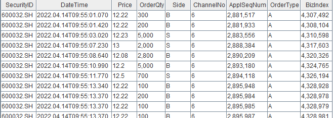

### 3.3.1 委买委卖金额

委托买卖金额是对一段时间内委托订单的买卖方向的资金总量进行统计。由于深交所的市价订单的价格在逐笔委托表里的价格不是一个成交价格（一般标记为0）。因此统计计算委托金额时，我们需要在逐笔成交记录中找到最近的成交价格来作为其近似值。

```
defg calcSZOrderValue(side,price,orderQty,tradePrice,orderType,bsFlag){
	price_=iif(orderType =="50",price,NULL).nullFill(tradePrice)
	return sum(iif(side==bsFlag,price_*orderQty,NULL)).nullFill(0)
}
res=select calcSZOrderValue(side,price,orderQty,tradePrice,orderType,"B") as BuyOrderValue, 
calcSZOrderValue(side,price,orderQty,tradePrice,orderType,"S") as SellOrderValue
from aj(entrustTB,tradeTB,`SecurityID`ApplSeqNum) group by SecurityID,bar(DateTime,1m) as DateTime
```

这里通过 `aj`（[asof join](https://www.dolphindb.cn/cn/help/SQLStatements/TableJoiners/asofjoin.html?highlight=asof%20join)）把逐笔成交里的最新价格关联到逐笔成交中；对市价订单，以获取最新的成交价格作为当前市价委托单的委托价格，最后计算股票每分钟内的买卖委托金额。

### 3.3.2 买卖撤单金额

深交所的撤单标记记录在逐笔成交表中，撤单时的价格一般标记为0，而委托价格记录在逐笔委托表中，因此计算买卖方撤单金额时需要将逐笔成交表和逐笔委托表进行关联。

```

trade = select SecurityID,DateTime, max(BidApplSeqNum,OfferApplSeqNum) as ApplSeqNum,TradeQty from tradeTB where  ExecType=52
entrust = select  SecurityID,ApplSeqNum, Price,Side from entrustTB
res = select  sum(iif(side=="B",Price*TradeQty,NULL)).nullFill(0) as buywithdrawOrderValue,
sum(iif(side=="S",Price*TradeQty,NULL)).nullFill(0) as sellwithdrawOrderValue 
from lsj(trade,entrust,`SecurityID`ApplSeqNum) group by SecurityID,bar(DateTime,1m) as DateTime
```

这里通过 `lj`（[left join](https://www.dolphindb.cn/cn/help/SQLStatements/TableJoiners/leftjoin.html#left-join)）分别把买卖撤单的委托价格关联到撤单信息表中，然后计算每只股票每分钟的买卖撤单金额。

# 4. 基于 Level 2 实时行情数据的流式实现

本章节介绍基于 DolphinDB 实时计算 Level 2 的行情数据。DolphinDB 的计算引擎不仅可以用于量化金融基于历史数据的批量开发计算，也大量用于生产环境的实时计算。

## 4.1  快照实时行情数据的高频因子流批一体实现

DolphinDB 的响应式状态引擎（Reactive State Engine），接收一个在历史数据上经过验证的 DolphinDB 因子代码，应用于实时行情数据，输出实时因子值，实现了高频因子流批一体的解决方案。具体教程请参考[金融高频因子的流批统一计算：DolphinDB 响应式状态引擎介绍](https://gitee.com/dolphindb/Tutorials_CN/blob/master/reactive_state_engine.md#金融高频因子的流批统一计算dolphindb响应式状态引擎介绍)

如上[3.1](#31-快照数据的因子计算)节中基于快照历史行情数据计算的时间加权订单斜率、成交价加权净委买比例、十档委买增额和十档买卖委托均价线性回归斜率因子表达式，将这些因子直接代入响应式状态引擎，以实现对流数据的实时因子计算。

在基于历史数据批量计算加权平均订单失衡率因子的表达式中，在进行因子标准化处理时，使用了迭代的算法（当前标准差很小时，使用上一标准化的因子值），这类因子在流式计算时需要改为流式引擎计算支持的表达式。而其它的高频因子计算中没有涉及迭代算法，可以直接代入流式表达式进行实时因子计算。

十档平均委卖订单斜率因子流式计算实现如下：

```
@state
def wavgSOIRStream(bidQty,askQty,lag=20){
	Imbalance_=rowWavg((bidQty-askQty)\(bidQty+askQty),
	 10 9 8 7 6 5 4 3 2 1)
	Imbalance= ffill(Imbalance_).nullFill(0)
	mean = mavg(prev(Imbalance), (lag-1), 2)
	std = mstdp(prev(Imbalance) *1000000, (lag-1),2) \ 1000000
	factorValue = conditionalIterate(std >= 0.0000001,
	(Imbalance - mean) \ std, cumlastNot)
	return ffill(factorValue).nullFill(0)
}
```

把批计算中的 ` iif(std >= 0.0000001,(Imbalance - mean) \ std, NULL) `改为 `conditionalIterate(std >= 0.0000001,(Imbalance - mean) \ std, cumlastNot)`。

[`conditionalIterate`](https://www.dolphindb.cn/cn/help/FunctionsandCommands/FunctionReferences/c/conditionalIterate.html?highlight=conditionaliterate) 函数只适用于响应式状态引擎，通过条件迭代实现因子中的递归逻辑。假设该函数计算结果对应输出表的列为 factor，且迭代仅基于前一个值，对于第 k 条记录（k = 0, 1, 2 …），其计算逻辑为：

- cond[k] == true：factor[k] = trueValue
- cond[k] == false：factor[k] = falseIterFunc(factor)[k-1]

基于Level 2 行情快照数据的高频因子流式计算脚本如下：

```
metrics = array(ANY, 5)	
metrics[0]=<DateTime>
metrics[1] = <timeWeightedOrderSlope(BidPrice[0],BidOrderQty[0],OfferPrice[0],OfferOrderQty[0],20)>
metrics[2] =<level10_InferPriceTrend(BidPrice,OfferPrice,BidOrderQty,OfferOrderQty,60,20)>
metrics[3] =<traPriceWeightedNetBuyQuoteVolumeRatio(BidPrice[0],BidOrderQty[0],OfferPrice[0],OfferOrderQty[0],TotalValueTrade,TotalVolumeTrade,20)> 
metrics[4] =<wavgSOIRStream( BidOrderQty,OfferOrderQty,20)>

share streamTable(1:0, `SecurityID`DateTime`BidPrice`OfferPrice`BidOrderQty`OfferOrderQty`TotalValueTrade`TotalVolumeTrade, [STRING,TIMESTAMP,DOUBLE[],DOUBLE[],DOUBLE[],DOUBLE[],INT,INT]) as Streamdata

result = table(1000:0, `SecurityID`DateTime`TimeWeightedOrderSlope`Level10_InferPriceTrend`TraPriceWeightedNetBuyQuoteVolumeRatio`height_Imbalance, [STRING,TIMESTAMP,DOUBLE,DOUBLE,DOUBLE,DOUBLE])
rse = createReactiveStateEngine(name="reactiveDemo", metrics =metrics, dummyTable=Streamdata, outputTable=result, keyColumn="SecurityID")
subscribeTable(tableName=`Streamdata, actionName="factors", handler=tableInsert{rse})
snapshotTB=select* from loadTable("dfs://TSDB_snapshot","snapshot") where date(TradeTime)=2022.04.14 and SecurityID in [`600000,`000001]
data1=select SecurityID,TradeTime as DateTime,BidPrice,OfferPrice,BidOrderQty,OfferOrderQty,TotalValueTrade,TotalVolumeTrade from snapshotTB 
Streamdata.append!(data1)

```

流式计算输出结果展示：

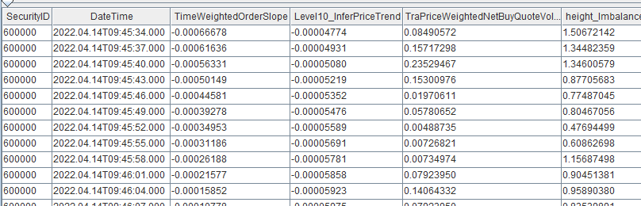

## 4.2  延时成交订单因子的流式实现

DolphinDB 内置的流计算引擎除了响应式状态引擎外，还有时间序列聚合引擎、横截面引擎、异常检测引擎和各种连接引擎。这些引擎均实现了数据表（table）的接口，因此使得多个引擎间的流水线处理变得异常简单。只要将后一个引擎作为前一个引擎的输出即可。引入流水线处理，可以解决更为复杂的因子计算问题。

本节通过流数据引擎的级联构建计算模型，以实现实时计算延时成交订单因子,详细代码见[附件](#6-附件)。

### 4.2.1 实现思路

整体计算流程如下图所示：

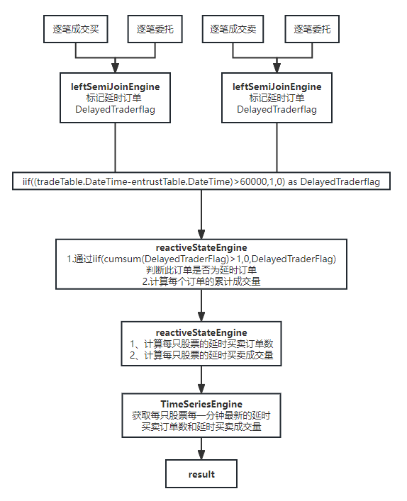

涉及到的流数据引擎有：[左半等值连接引擎](https://www.dolphindb.cn/cn/help/FunctionsandCommands/FunctionReferences/c/createLeftSemiJoinEngine.html#createleftsemijoinengine)，[响应式状态引擎](https://www.dolphindb.cn/cn/help/FunctionsandCommands/FunctionReferences/c/createReactiveStateEngine.html#createreactivestateengine)，[时间序列引擎](https://www.dolphindb.cn/cn/help/FunctionsandCommands/FunctionReferences/c/createTimeSeriesEngine.html#createtimeseriesengine)。

流程说明：

- 左半等值连接引擎，把逐笔成交与逐笔委托数据关联，并计算延时成交订单的累计值和订单累计成交量；
- 用响应式状态引擎，计算每只股票延时订单因子和延时订单成交量；
- 用时间序列引擎 获取最新一分钟的延时订单因子和延时订单成交量，并输出结果。

各引擎间直接级联，无需通过中间表。详情可参考：[用户手册流数据引擎主题](https://www.dolphindb.cn/cn/help/FunctionsandCommands/FunctionStatistics/index.html#id60)。

### 4.2.2  实时计算延时成交订单因子

- 第一步：

tradeTable 和 entrustTable 分别为逐笔成交表和逐笔委托流表。通过创建两个左半等值连接引擎把两个表基于买卖订单进行等值关联。

```
metrics = [
<tradeTable.DateTime>,
<entrustTable.DateTime>,
<TradePrice>,
<TradeQty>,
<cumsum(iif((tradeTable.DateTime-entrustTable.DateTime)>60000,1,0)) as DelayedTraderflag>,
<Side>,
<cumsum(TradeQty)>]
lsjEngineBid=createLeftSemiJoinEngine("lsjEngineBid", tradeTable, entrustTable, lsjoutput, metrics,[[`SecurityID,`BidApplSeqNum],[`SecurityID,`ApplSeqNum]],50000000,true)
subscribeTable(tableName="tradeTable", actionName="Bid", offset=0, handler=appendForJoin{lsjEngineBid, true}, msgAsTable=true)
subscribeTable(tableName="entrustTable", actionName="Bid", offset=0, handler=appendForJoin{lsjEngineBid, false}, msgAsTable=true)

lsjEngineOffer=createLeftSemiJoinEngine("lsjEngineOffer", tradeTable, entrustTable, lsjoutput, metrics,[[`SecurityID,`OfferApplSeqNum],[`SecurityID,`ApplSeqNum]],50000000,true)
subscribeTable(tableName="tradeTable", actionName="Offer", offset=0, handler=appendForJoin{lsjEngineOffer, true}, msgAsTable=true)
subscribeTable(tableName="entrustTable", actionName="Offer", offset=0, handler=appendForJoin{lsjEngineOffer, false}, msgAsTable=true)
```

左半等值连接引擎返回一个左、右表关联后的表对象。对于左表每一条数据，都去匹配右表相同 matchingColumn 的数据，若无匹配的右表记录，则不输出。若匹配多条右表记录，则由 *updateRightTable* 参数决定连接右表的第一条记录还是最后一条记录。*updateRightTable* 为可选参数，默认为 false，表示右表存在多条相同 matchingColumn 的记录时，是保留第一条（false）还是最后一条记录（true）。这里订单成交时间需要与订单的最早委托时间关联，所以 *updateRightTable* 取默认值即可。

metrics 中计算订单的成交量、订单的累计成交量，成交时间和委托时间差是否大于1分钟的累计次数和订单的买卖方向等指标。

- 第二步：

通过响应式状态引擎，计算每一只股票的买卖延时订单数量和买卖延时订单成交量指标。

```
@state
def delayedTradeNum(bsFlag, flag, side){
      return iif(bsFlag==side && flag<=1, flag, 0).cumsum()

}
@state
def delayedTradeQty(bsFlag, flag, tradeQty, cumTradeQty, side){
        return iif(bsFlag==side && flag>1, tradeQty, iif(bsFlag==side && flag==1, cumTradeQty, 0)).cumsum()
}
metrics = array(ANY, 5)	
metrics[0]=<TradeTime>
metrics[1]=<delayedTradeNum(BuySellFlag,DelayedTradeFlag,"B")>
metrics[2]=<delayedTradeNum(BuySellFlag,DelayedTradeFlag,"S")>
metrics[3]=<delayedTradeQty(BuySellFlag,DelayedTradeFlag,TradeQty,cumTradeQty,"B")>
metrics[4]=<delayedTradeQty(BuySellFlag,DelayedTradeFlag,TradeQty,cumTradeQty,"S")>

secondrse = createReactiveStateEngine(name="reactiveDemo", metrics =metrics, dummyTable=lsjoutput, outputTable=RSEresult, keyColumn=["code"],filter=<TradePrice>0>)
subscribeTable(tableName=`lsjoutput, actionName="DelayedTrader", handler=tableInsert{secondrse})
```

DelayedTradeFlag 指标为订单延时成交累计记录。统计股票的延时订单数时，对每笔订单只需统计一次，计算股票的延时成交订单数只需计算 `iif(bsFlag==side&&flag<=1,flag,0)` 的累计值。

```
iif((BuySellFlag=="B")&&(DelayedTraderFlag>1),TradeQty,iif((BuySellFlag=="B")&&(DelayedTraderFlag==1),DelayedTraderFlag*cumTradeQty,0))
```

使用订单延时成交累计记录指标 DelayedTradeFlag 来计算延时订单的成交量。当首次记录为延时成交时，成交量为订单的累计成交量，当 DelayedTradeFlag>1 时，成交量只需加上当前的交易量。

- 第三步：

通过时间序列引擎引擎，计算每一分钟每只股票最新的买卖延时订单数量和买卖延时订单成交量指标。

```
tsengine = createTimeSeriesEngine(name="TSengine", windowSize=60000, step=60000, metrics=<[last(DelayedTradeBuyOrderNum),last(DelayedTradeSellOrderNum),last(DelayedTradeBuyOrderQty),last(DelayedTradeSellOrderQty)]>, dummyTable=RSEresult, outputTable=result, timeColumn=`TradeTime, useSystemTime=false, keyColumn=`code, garbageSize=50, useWindowStartTime=false)
subscribeTable(tableName="RSEresult", actionName="TSengine", offset=0, handler=append!{tsengine}, msgAsTable=true);
```

# 5. 总结

使用 DolphinDB 存储和计算 A 股市场 Level 2 高频行情数据具有高效和灵活的特点。它能够存储大量的历史高频行情数据，为基于该数据的高效因子挖掘和计算提供支持。同时，它还能够进行基于高频实时行情流式计算实时因子，为交易策略提供低延时的交易决策。

# 6. 附件

快照批处理脚本：   [shapshot数据处理.dos](script/Level-2_stock_data_processing/shapshot数据处理.dos) 

逐笔数据批计算脚本：  [entrust数据处理.dos](script/Level-2_stock_data_processing/entrust数据处理.dos) 

成交表数据批计算脚本：  [trade数据处理.dos](script/Level-2_stock_data_processing/trade数据处理.dos) 

快照流式计算脚本：  [shapshot数据流式计算.dos](script/Level-2_stock_data_processing/shapshot数据流式计算.dos) 

延时订单因子流式实现：   [延时订单因子流式实现.dos](script/Level-2_stock_data_processing/延时订单因子流式实现.dos) 

与python性能比对：  [与python性能比对](script/Level-2_stock_data_processing/与python性能比对) 

python实现脚本：  [python实现脚本.py](script/Level-2_stock_data_processing/python实现脚本.py) 
