# 快速搭建 Level-2 快照数据流批一体因子计算平台最佳实践

因子挖掘是量化交易的基础。近年来，Python 是很多研究员进行数据分析和因子挖掘的主流工具。但是通过 Python 挖掘的有效因子在投产时，通常需要由 QUANT 团队的研究员将代码提交给 IT 团队，IT 团队用 C++ 代码转写后部署到生产环境，以满足实盘低延时的要求。这种做法虽然通过维护两套系统解决了产研一体化的问题，但开发周期较长，成本也相对较高。

量化金融是一个高度市场化、多方机构高度博弈的领域，因子的有效时间会随着博弈程度的加剧而缩短。如何使用更高效的工具和流程，更快地找到新的有效因子并投产部署到实盘交易，是每一个交易团队必须面对的问题。

本教程旨在指导用户基于 DolphinDB 快速搭建一个方便、快捷、扩展性好和兼容性强的流批一体因子计算平台原型，提供基于快照数据计算分钟因子和进一步加工分钟因子为复杂因子的功能。

因子业务开发人员无需理解 DolphinDB 流计算框架的底层架构，仅需根据业务因子计算逻辑编写函数表达式，然后调度因子计算平台的计算接口，便可完成因子计算。

基于这一平台，开发人员无需再转写代码，因子投研和生产只需一套系统、一种脚本即可无缝切换，极大降低了开发运维成本，提高了因子投产的全流程效率。


- [快速搭建 Level-2 快照数据流批一体因子计算平台最佳实践](#快速搭建-level-2-快照数据流批一体因子计算平台最佳实践)
  - [1. 概述](#1-概述)
  - [2. Level-2 快照数据流批一体因子计算平台](#2-level-2-快照数据流批一体因子计算平台)
    - [2.1 因子计算平台业务使用流程](#21-因子计算平台业务使用流程)
    - [2.2 因子计算平台框架](#22-因子计算平台框架)
    - [2.3 因子计算平台的计算能力](#23-因子计算平台的计算能力)
    - [2.4 用户二次开发自定义因子表达式](#24-用户二次开发自定义因子表达式)
  - [3. 部署和因子开发](#3-部署和因子开发)
    - [3.1 因子计算平台部署](#31-因子计算平台部署)
    - [3.2 第一类分钟因子开发和调试](#32-第一类分钟因子开发和调试)
    - [3.3 第二类复杂因子开发和调试](#33-第二类复杂因子开发和调试)
    - [3.4 Python 客户端调度任务和订阅结果](#34-python-客户端调度任务和订阅结果)
    - [3.5 计算结果实时推送至 Kafka](#35-计算结果实时推送至-kafka)
  - [4. 流计算相关问题解答](#4-流计算相关问题解答)
    - [4.1 时间序列引擎计算分钟因子](#41-时间序列引擎计算分钟因子)
    - [4.2 响应式状态引擎计算复杂因子](#42-响应式状态引擎计算复杂因子)
  - [5. 路线图(Roadmap)](#5-路线图roadmap)
  - [附录](#附录)


## 1. 概述

在基于 Level-2 快照数据做实时分钟因子加工的时候，比如实时做 K 线，常常会面临以下几个问题：

- 以机器时间还是事件时间作为窗口关闭的信号？
- 如果使用事件时间作为窗口关闭的信号，如何保证及时关闭不活跃股票的计算窗口？
- 如果使用事件时间作为窗口关闭的信号，如何保证及时关闭 11:30（午间休市）、14:57（连续竞价结束）的计算窗口 ？
- 计算时窗口边界的开闭是左闭右开还是左开右闭？
- 计算输出结果的时间是计算窗口起始时间还是结束时间？
- 如果在某个计算窗口内，分组内没有数据，如何用前值或者指定值填充？

在基于分钟因子进一步加工有状态的复杂因子的时候，比如实时计算 MACD、RSI 等，常常会面临以下几个问题：

- 计算因子是有状态的：不仅与当前的多个指标有关，而且与多个指标的历史状态相关，如何开发有状态的算子？
- 有状态的算子如何实现增量计算，提高计算效率？
- 在一次响应计算过程中，如果计算 1000 个因子，这 1000 个因子依赖一个共同的中间变量，如何避免重复计算？

DolphinDB 内置的时间序列流计算引擎可以满足 Level-2 快照数据实时分钟因子计算，响应式状态流计算引擎可以满足分钟因子进一步加工有状态的复杂因子的计算。上述问题会在本教程中逐一解答。<!--本教程的示例内容只涉及分钟频的因子计算，但是 DolphinDB 的计算能力不局限于分钟频的因子，有关更高频率的因子计算解决方案，请联系小助手dolphindb1了解详情。-->

## 2. Level-2 快照数据流批一体因子计算平台

### 2.1 因子计算平台业务使用流程

按照本教程部署完基于 DolphinDB 搭建的因子计算平台后，基于历史数据的因子开发阶段的调试流程如下：

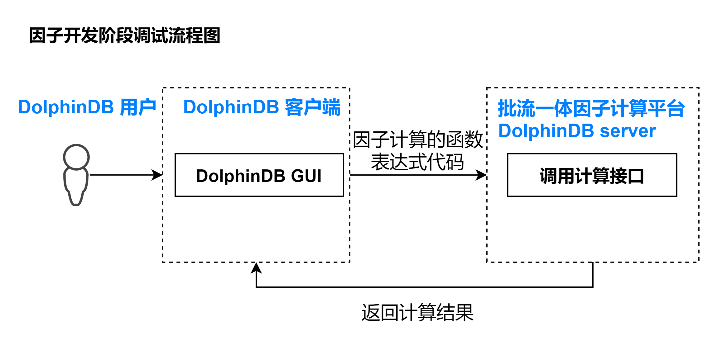

因子业务开发人员只需要在 DolphinDB 提供的集成开发环境中编写因子计算的函数表达式，然后调用因子计算平台的计算接口就可以完成调试。如果编写因子符合 DolphinDB 的语法，就可以成功执行并返回计算结果。如果编写因子不符合 DolphinDB 的语法，就会报错中断。

在已经开发了一定数量的因子后，需要在生产环境部署实时计算业务，部署流程如下：

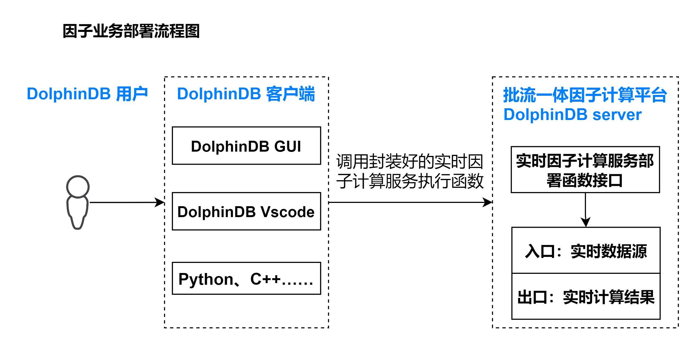

因子业务开发人员只需通过客户端调用封装好的实时因子计算服务执行函数，便可以完成部署。执行完以后，DolphinDB server 会出现该流计算服务的入口，是一个表对象，可以通过 DolphinDB 提供的实时数据接入工具来接入数据。同时也会自动创建流计算服务的出口，也是一个表对象，存储计算结果。

### 2.2 因子计算平台框架

本教程示例 Level-2 快照数据流批一体因子计算平台的架构如下图所示：

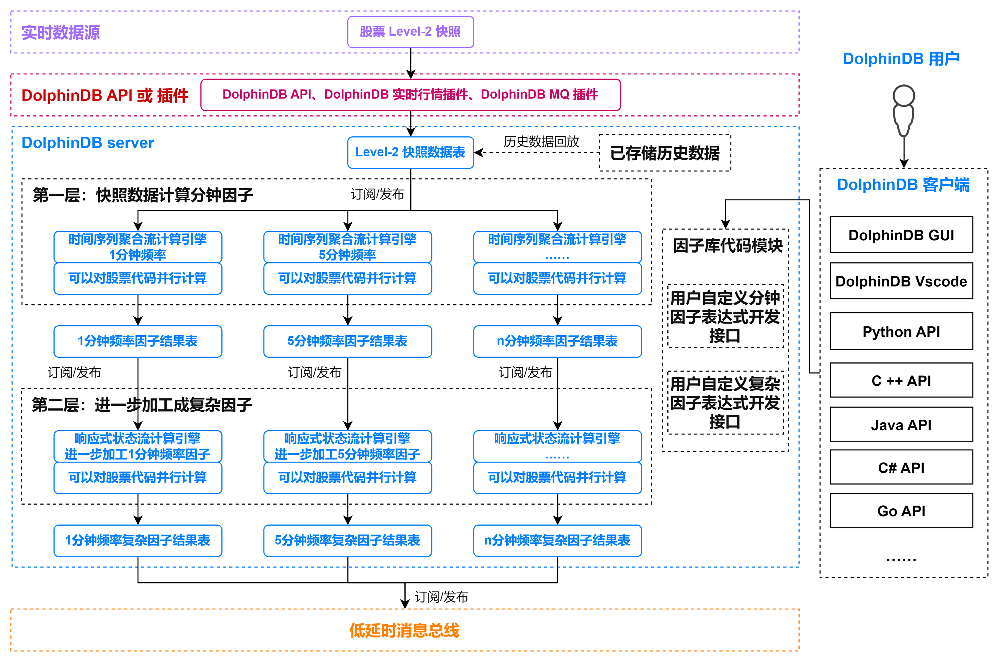

**主要包括以下功能模块**
- 实时数据低延时接入功能模块
  - DolphinDB API 实时数据写入接口：C++ API, Java API 等
  - DolphinDB 实时行情接入插件：amdQuote, Insight, NSQ 等
  - DolphinDB 消息中间件订阅插件：Kafka, zmq, MQTT 等
- 历史数据回放功能模块：因子开发阶段的调试和因子回测都需要基于历史数据，DolphinDB 提供了单表和多表的严格按照时序的控速回放功能，能够便捷高效地把已经存储在 DolphinDB 数据库中的历史数据回放成流。
- 内置流计算引擎功能模块：DolphinDB 根据各种时序数据流式计算场景，开发了多个流计算引擎。本教程中，对快照数据做滚动窗口的聚合计算（计算生成不同分钟频的因子）使用了时间序列聚合流计算引擎，进一步加工成复杂因子用了响应式状态流计算引擎。
- 集成开发环境功能模块：因子业务开发人员可以把 DolphinDB GUI 和 DolphinDB Vscode 作为集成开发环境，进行因子表达式代码的开发和调试。同时可以通过各种语言的 DolphinDB API 与 DolphinDB server 进行交互，进行任务的调度和作业的执行。
- 低延时消息总线发布模块：DolphinDB 提供了对接各种消息队列中间件的插件，可以把实时计算结果推送到 Kafka, zmq, RabbitMQ, MQTT 等。

### 2.3 因子计算平台的计算能力

本教程示例 Level-2 快照数据流批一体因子计算平台拥有计算下述两类因子的能力：

（1）**第一类：基于快照数据计算分钟因子**

第一类因子是指直接对快照数据，做指定窗口大小的滚动窗口聚合计算，比如任意分钟的 K 线等聚合指标计算。第一类因子使用了 DolphinDB 内置的时间序列引擎（createTimeSeriesEngine），具体教程可参考[时间序列引擎（createTimeSeriesEngine）](https://www.dolphindb.cn/cn/help/FunctionsandCommands/FunctionReferences/c/createTimeSeriesEngine.html)。

（2）**第二类：进一步加工分钟因子为复杂因子**

第二类因子是指对第一类因子做进一步加工，做步长为1行、窗口为 n 行或者指定时间的滑动窗口计算，比如 EMA、RSI 等有状态因子的计算。第二类因子使用了 DolphinDB 内置的流计算引擎（createReactiveStateEngine），具体教程可参考[响应式状态引擎（createReactiveStateEngine）](https://www.dolphindb.cn/cn/help/FunctionsandCommands/FunctionReferences/c/createReactiveStateEngine.html)。

### 2.4 用户二次开发自定义因子表达式

#### 2.4.1 自定义分钟因子表达式

第一类因子是指直接对快照数据，做指定窗口大小的滚动窗口聚合计算，用了 DolphinDB 内置的时间序列引擎。时间序列引擎对以下聚合计算算子进行了优化，实现了增量计算，显著提升了性能：corr, covar, first, last, max, med, min, percentile, quantile, std, var, sum, sum2, sum3, sum4, wavg, wsum, count, firstNot, ifirstNot, lastNot, ilastNot, imax, imin, nunique, prod, sem, mode, searchK。所以，如果分钟因子可以直接用 DolphinDB 内置聚合算子表达，就可以实现增量计算。如果分钟因子复杂程度较高，无法直接用 DolphinDB 内置聚合算子直接表达，那么就需要用 `defg` 函数声明自定义聚合计算函数来表达。

下面我们以分钟 K 线计算和指定窗口内的买卖压力指标计算为例，说明增量计算的因子表达式编写方式和非增量计算的因子表达式编写方式。

**增量计算因子表达式**：
```
def High(){
	return "max(LastPx)"
}
```
函数名 `High` 对应因子名称，表示分钟 K 线的最高价，业务上的计算逻辑是对计算窗口内发生的所有价格求最大值，可以用 DolphinDB 内置的聚合算子 `max` 直接表达，所以用字符串 `max(LastPx)` 直接表示，`LastPx` 表示最新成交价格。因子计算平台会自动解析字符串 `max(LastPx)` 为元代码的格式 <max(LastPx)>，并传入时间序列引擎。
同理，分钟 K 线的开盘价、收盘价和最低价可以这样表示：
```
def Open(){
	return "first(LastPx)"
}
```

```
def Close(){
	return "last(LastPx)"
}
```

```
def Low(){
	return "min(LastPx)"
}
```

**非增量计算因子表达式**：

```
defg Press(BidPrice0,BidPrice1,BidPrice2,BidPrice3,BidPrice4,BidPrice5,BidPrice6,BidPrice7,BidPrice8,BidPrice9,BidOrderQty0,BidOrderQty1,BidOrderQty2,BidOrderQty3,BidOrderQty4,BidOrderQty5,BidOrderQty6,BidOrderQty7,BidOrderQty8,BidOrderQty9,OfferPrice0,OfferPrice1,OfferPrice2,OfferPrice3,OfferPrice4,OfferPrice5,OfferPrice6,OfferPrice7,OfferPrice8,OfferPrice9,OfferOrderQty0,OfferOrderQty1,OfferOrderQty2,OfferOrderQty3,OfferOrderQty4,OfferOrderQty5,OfferOrderQty6,OfferOrderQty7,OfferOrderQty8,OfferOrderQty9){
	bidPrice = matrix(BidPrice0,BidPrice1,BidPrice2,BidPrice3,BidPrice4,BidPrice5,BidPrice6,BidPrice7,BidPrice8,BidPrice9)
	bidQty = matrix(BidOrderQty0,BidOrderQty1,BidOrderQty2,BidOrderQty3,BidOrderQty4,BidOrderQty5,BidOrderQty6,BidOrderQty7,BidOrderQty8,BidOrderQty9)
	offerPrice = matrix(OfferPrice0,OfferPrice1,OfferPrice2,OfferPrice3,OfferPrice4,OfferPrice5,OfferPrice6,OfferPrice7,OfferPrice8,OfferPrice9)
	offerQty = matrix(OfferOrderQty0,OfferOrderQty1,OfferOrderQty2,OfferOrderQty3,OfferOrderQty4,OfferOrderQty5,OfferOrderQty6,OfferOrderQty7,OfferOrderQty8,OfferOrderQty9)
	wap = (bidPrice[0]*offerQty[0] + offerPrice[0]*bidQty[0])\(bidQty[0]+offerQty[0])
	bidw=(1.0\(bidPrice-wap))
	bidw=bidw\(bidw.rowSum())
	offerw=(1.0\(offerPrice-wap))
	offerw=offerw\(offerw.rowSum())
	press = log((bidQty*bidw).rowSum())-log((offerQty*offerw).rowSum())
	return avg(press)
}
```
函数名 `Press` 对应因子名，表示买卖压力指标，`BidPrice`, `BidOrderQty`, `OfferPrice`, `OfferOrderQty` 表示买卖方向的十档量价，其函数表达式如下：

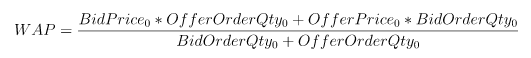

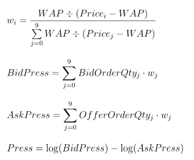

该因子的表达式复杂度较高，无法直接用 DolphinDB 内置的聚合算子表示，需要用 `defg` 函数声明自定义聚合计算函数来表达。因子计算平台会自动解析聚合函数 `Press` 为元代码的格式 <Press()>，并传入时间序列引擎。

#### 2.4.2 自定义复杂因子表达式

第二类因子是指对第一类因子做进一步加工，做步长为1行、窗口为 n 行或者指定时间的滑动窗口计算，用了 DolphinDB 内置的响应式状态引擎。状态算子计算时需要用到历史状态。如果每一次计算都使用全量数据，性能不佳。状态函数的优化，也就是增量方式的流式实现非常关键。下列状态函数在 DolphinDB 的响应式状态引擎中的实现均得到了优化：

- 累计窗口函数：cumavg, cumsum, cumprod, cumcount, cummin, cummax, cumvar, cumvarp, cumstd, cumstdp, cumcorr, cumcovar, cumbeta, cumwsum, cumwavg
- 滑动窗口函数：ema, mavg, msum, mcount, mprod, mvar, mvarp, mstd, mstdp, mskew, mkurtosis, mmin, mmax, mimin, mimax, mmed, mpercentile, mrank, mcorr, mcovar, mbeta, mwsum, mwavg, mslr
- 序列相关函数：deltas, ratios, ffill, move, prev, iterate, ewmMean, ewmVar, ewmStd, ewmCovar, ewmCorr

上述函数除了 `mslr` 返回两个值以外，其余函数均只有一个返回值。在后续的版本中，DolphinDB 将允许用户用插件来开发自己的状态函数，注册后即可在状态引擎中使用。

下面我们以进一步加工分钟收盘价为 MACD 为例：

```
@state
def MACD(Close, SHORT_ = 12, LONG_ = 26, M = 9) {
	DIF = ewmMean(Close, span = SHORT_, adjust = false) - ewmMean(Close, span = LONG_, adjust = false)
	DEA = ewmMean(DIF, span = M, adjust = false)
	MACD = (DIF - DEA) * 2
	return round(DIF, 3), round(DEA, 3), round(MACD, 3)
}
```

函数名 MACD 对应因子名，Close 是指分钟收盘价，必须包括在时间序列聚合引擎的输出结果中。

在定义复杂因子表达式的时候，如果定义的函数是有状态的，即当前行返回值基于之前行的数据，则需要在定义函数前用 `@state` 声明。

## 3. 部署和因子开发

### 3.1 因子计算平台部署

**第一步**

把本教程功能模块代码导入本地集成开发环境（DolphinDB GUI），功能模块源码见附录 *SnapshotFactorCalculationPlatform*。导入的目录结构必须严格按照下图所示结构：

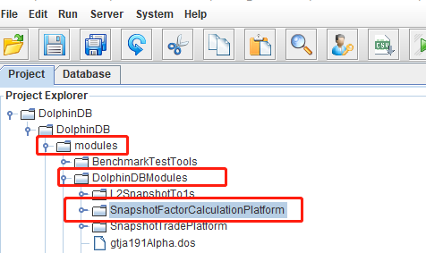

**第二步**

右击 *SnapshotFactorCalculationPlatform* 目录，把本地模块代码同步到 DolphinDB server 端。

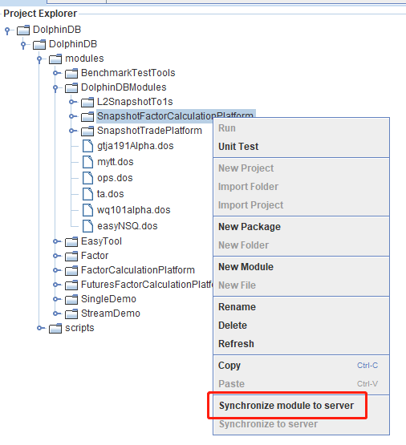

**第三步**

在 DolphinDB GUI 的 *scripts* 目录创建脚本文件，执行下述代码进行功能验证

```
use DolphinDBModules::SnapshotFactorCalculationPlatform::JsonConfig::JsonConfigLoad

/**
计算服务部署传参
testConfig.dos 是示例 Json 配置文件
parallel 指定计算的并行度
 */
jsonPath = "./modules/DolphinDBModules/SnapshotFactorCalculationPlatform/testConfig.dos"
parallel = 2
// 执行计算服务部署函数
loadJsonConfig(jsonPath, parallel)
```
执行成功后，可以在 DolphinDB GUI 的右下角变量栏看到流计算相应的入口和出口的表变量：

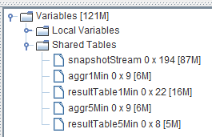

此时，只需要把实时数据或者库内历史数据注入到入口 `snapshotStream` 中，就会在出口（结果表）中看到相应的输出。

### 3.2 第一类分钟因子开发和调试

**第一步**

在 DolphinDB GUI 的 *SnapshotFactorCalculationPlatform* 模块的 *Factor1* 目录定义第一类分钟因子的表达式，按照 3.1 部署完因子计算平台后，内置了如下分钟因子，以调试 Close 和 Press 为例：

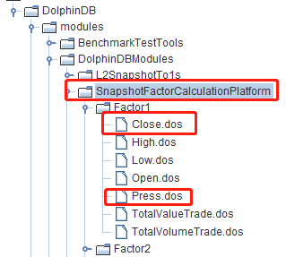

定义完新的因子表达式后，手动把修改后的模块文件同步到 DolphinDB server，如下图所示：

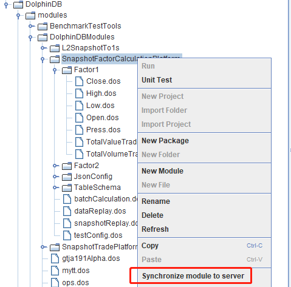

**第二步**

在 DolphinDB GUI 的 *scripts* 目录创建脚本文件，执行下述代码，生成 Json 格式的配置文件：

```
use DolphinDBModules::SnapshotFactorCalculationPlatform::JsonConfig::JsonGetFileString

// 第一类分钟因子配置参数
FactorLevel1 = `Close`Press`Close`Press
isInc = `true`false`true`false
barMinutesLevel1 = 1 1 5 5
useSystemTime = `false`false`false`false
// 指定存储 Json 配置文件的路径
jsonPath = "./test.json"
JsonFileString = JsonGetFileString(FactorLevel1, isInc, barMinutesLevel1, useSystemTime)
saveTextFile(JsonFileString, jsonPath)
```

代码说明：

- `FactorLevel1`：指定需要计算的分钟因子名称，必须在 step1 中定义，并同步到 DolphinDB server。

- `isInc`：与 `FactorLevel1` 的长度相同，表示计算的分钟因子是否需要按照增量计算解析，“true” 表示计算因子按照增量计算函数解析，“false” 表示计算因子按照非增量计算函数解析。

- `barMinutesLevel1`：与 `FactorLevel1` 的长度相同，表示计算的分钟因子的频率，单位是“分”。

- `useSystemTime`：与 `FactorLevel1` 的长度相同，表示计算的分钟因子的窗口关闭方式，“true” 表示用机器时间触发窗口，“false” 表示用事件时间触发窗口。同一个频率的计算因子窗口关闭方式必须一致。

执行完毕后，会在 DolphinDB server 部署目录生成一个 Json 格式的配置文件 *test.json*，内容如下：

```
[{"factor": "Close", "isInc": true, "barMinute": 1, "level": 1, "useSystemTime": false}, {"factor": "Press", "isInc": false, "barMinute": 1, "level": 1, "useSystemTime": false}, {"factor": "Close", "isInc": true, "barMinute": 5, "level": 1, "useSystemTime": false}, {"factor": "Press", "isInc": false, "barMinute": 5, "level": 1, "useSystemTime": false}]
```

**第三步**

在 DolphinDB GUI 的 *scripts* 目录创建脚本文件，执行下述代码，部署计算服务：

```
// 初始化流计算环境
use DolphinDBModules::ops
clearAllStreamEnv()
go
// 执行计算服务部署函数
use DolphinDBModules::SnapshotFactorCalculationPlatform::JsonConfig::JsonConfigLoad
jsonPath = "./test.json"
parallel = 1
loadJsonConfig(jsonPath, parallel)
```

注意，ops 功能模块中的 `clearAllStreamEnv()` 函数会把当前节点的所有订阅、引擎和共享表都会清除，所以在多人协作开发的环境中使用时需要注意。

**第四步**

把测试的 csv 数据文件放到 DolphinDB server 端服务器的指定位置，例如本教程放在 */hdd/hdd9/tutorials/SnapshotFactorCalculationPlatform/test.csv*，测试的 csv 数据可在教程附录下载。然后在 DolphinDB GUI 的 *scripts* 目录创建脚本文件，执行下述代码，把 csv 数据按照流的方式回放进来：

```
use DolphinDBModules::SnapshotFactorCalculationPlatform::snapshotReplay
csvPath = "/hdd/hdd9/tutorials/SnapshotFactorCalculationPlatform/test.csv"
snapshotCsvReplayJob(csvPath, snapshotStream)
```

此时可以在 DolphinDB GUI 中执行函数 `now()`，起到刷新客户端的效果，可以看到右下角变量栏的结果表不断地在更新，查看结果表中的数据，以 1 分钟计算结果表为例，具体内容如下：

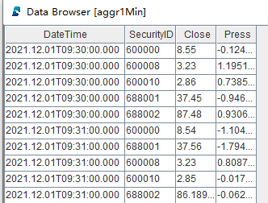

### 3.3 第二类复杂因子开发和调试

**第一步**

在 DolphinDB GUI 的 *SnapshotFactorCalculationPlatform* 模块的 *Factor2* 目录定义第二类复杂因子的表达式，按照 [3.1节](#31-因子计算平台部署) 部署完因子计算平台后，内置了如下复杂因子，以调试 RSI 和 MACD 为例：

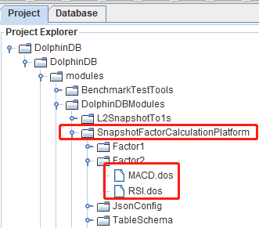

定义完新的因子表达式后，手动把修改后的模块文件同步到 DolphinDB server。

**第二步**

在 DolphinDB GUI 的 *scripts* 目录创建脚本文件，执行下述代码，生成 Json 格式的配置文件：

```
use DolphinDBModules::SnapshotFactorCalculationPlatform::JsonConfig::JsonGetFileString

// 第一类分钟因子配置参数
FactorLevel1 = `Close`Press`Close`Press
isInc = `true`false`true`false
barMinutesLevel1 = 1 1 5 5
useSystemTime = `false`false`false`false

// 第二类复杂因子配置参数
FactorLevel2 = `RSI`MACD`RSI`MACD
barMinutesLevel2 = [[1, 1], [1], [5], [5]]
colNameLevel2 = [`RSI, `DIF`DEA`MACD, `RSI, `DIF`DEA`MACD]
paramsName = [`N, `SHORT_`LONG_`M, `N,`SHORT_`LONG_`M]
paramsValue = [[[24], [30]], [[18, 30, 10]], [[24]], [[9, 25, 6]], [[12, 26, 9]]]

// 指定存储 Json 配置文件的路径
jsonPath = "./test.json"
JsonFileString = JsonGetFileString(FactorLevel1, isInc, barMinutesLevel1, useSystemTime, FactorLevel2, barMinutesLevel2, colNameLevel2, paramsName, paramsValue)
saveTextFile(JsonFileString, jsonPath)
```

代码说明：

- `FactorLevel2`：指定需要计算的复杂因子名称，必须在 step1 中定义，并同步到 DolphinDB server。

- `barMinutesLevel2`：与 `FactorLevel1` 的长度相同，例子中第一个元素 `[1, 1]` 表示对 `FactorLevel2[0]`（RSI ）做两个 1 分钟频率的计算，其窗口大小通过 `paramsValue` 配置。

- `colNameLevel2`：与 `FactorLevel1` 的长度相同，表示因子计算函数输出的列名。

- `paramsName`：与 `FactorLevel1` 的长度相同，表示因子计算函数的参数名字。

- `paramsValue`：与 `FactorLevel1` 的长度相同，与 `barMinutesLevel2` 对应，如 `[[24], [30]]` 对应 `barMinutesLevel2[0]`，即 `[1, 1]`，表示对 RSI 做两个 1 分钟频率的计算，其窗口大小分别是 24 和 30。

执行完毕后，会在 DolphinDB server 部署目录生成一个 Json 格式的配置文件 *test.json*，内容如下：
```
[{"factor": "Close", "isInc": true, "barMinute": 1, "level": 1, "useSystemTime": false}, {"factor": "High", "isInc": true, "barMinute": 1, "level": 1, "useSystemTime": false}, {"factor": "Low", "isInc": true, "barMinute": 1, "level": 1, "useSystemTime": false}, {"factor": "Close", "isInc": true, "barMinute": 5, "level": 1, "useSystemTime": false}, {"factor": "High", "isInc": true, "barMinute": 5, "level": 1, "useSystemTime": false}, {"factor": "Low", "isInc": true, "barMinute": 5, "level": 1, "useSystemTime": false}, {"factor": "RSI", "level": 2, "colName": `R_1, "barMinute": 1, "N": 24}, {"factor": "RSI", "level": 2, "colName": `R_2, "barMinute": 1, "N": 30}, {"factor": "MACD", "level": 2, "colName": `DIF_1`DEA_1`MACD_1, "barMinute": 1, "SHORT_": 18, "LONG_": 30, "M": 10}, {"factor": "RSI", "level": 2, "colName": `R_1, "barMinute": 5, "N": 24}, {"factor": "MACD", "level": 2, "colName": `DIF_1`DEA_1`MACD_1, "barMinute": 5, "SHORT_": 9, "LONG_": 25, "M": 6}]
```

**第三步**

在 DolphinDB GUI 的 *scripts* 目录创建脚本文件，执行下述代码，部署计算服务：
```
// 初始化流计算环境
use DolphinDBModules::ops
clearAllStreamEnv()
go
// 执行计算服务部署函数
use DolphinDBModules::SnapshotFactorCalculationPlatform::JsonConfig::JsonConfigLoad
jsonPath = "./test.json"
parallel = 1
loadJsonConfig(jsonPath, parallel)
```

注意，ops 功能模块中的 `clearAllStreamEnv()` 函数会把当前节点的所有订阅、引擎和共享表都会清除，所以在多人协作开发的环境中使用时需要注意。

**第四步**

把测试的 csv 数据文件放到 DolphinDB server 端服务器的指定位置，例如本教程放在 */hdd/hdd9/tutorials/SnapshotFactorCalculationPlatform/test.csv*，测试的 csv 数据可在教程附录下载。然后在 DolphinDB GUI 的 *scripts* 目录创建脚本文件，执行下述代码，把 csv 数据按照流的方式回放进来：
```
use DolphinDBModules::SnapshotFactorCalculationPlatform::snapshotReplay
csvPath = "/hdd/hdd9/tutorials/SnapshotFactorCalculationPlatform/test.csv"
snapshotCsvReplayJob(csvPath, snapshotStream)
```

此时可以在 DolphinDB GUI 中执行函数 `now()`，起到刷新客户端的效果，可以看到右下角变量栏的结果表不断地在更新，查看结果表中的数据，以 1 分钟复杂因子计算结果表为例，具体内容如下：

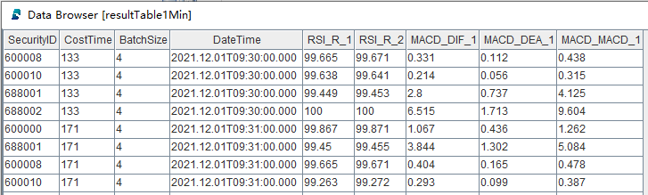

`CostTime` 表示单次响应的计算耗时，单位是微秒。

### 3.4 Python 客户端调度任务和订阅结果

本教程用 jupyter 环境调试，具体测试软件版本如下：

- DolphinDB server 版本：2.00.9.2
- DolphinDB Python API 版本：1.30.21.1
- Python 的版本：3.7.6

**第一步**

导入依赖的 Python 包，并与 DolphinDB server 建立连接：
```
import dolphindb as ddb
import numpy as np

s = ddb.session(host="localhost", port=8892, userid='admin', password='123456',enablePickle=False)
```

**第二步**

部署因子计算服务：
```
jsonPath = "./modules/DolphinDBModules/SnapshotFactorCalculationPlatform/testConfig.dos"
parallel = 1
scripts = """
    use DolphinDBModules::ops
    clearAllStreamEnv()
    go
    use DolphinDBModules::SnapshotFactorCalculationPlatform::JsonConfig::JsonConfigLoad
    loadJsonConfig("{0}", {1})
""".format(jsonPath, parallel)
s.run(scripts)
```

`jsonPath` 路径是指 DolphinDB server 端的相对路径，是调试用的默认测试配置文件。

**第三步**

执行数据回放服务：
```
csvPath = "/hdd/hdd9/tutorials/SnapshotFactorCalculationPlatform/test.csv"
scripts = """
    use DolphinDBModules::SnapshotFactorCalculationPlatform::snapshotReplay
    snapshotCsvReplayJob("{0}", snapshotStream)
""".format(csvPath)
s.run(scripts)
```

`csvPath` 路径是指 DolphinDB server 所在服务器的绝对路径，需要用户自己下载测试数据（见附录），并放到相应目录。例如，本教程测试环境数据文件所在路径是 */hdd/hdd9/tutorials/SnapshotFactorCalculationPlatform/test.csv*。

**第四步**

查询数据至 python 客户端：
```
queryDate = "2021.12.01"
SecurityID = "600000"
scripts = """
    select * from resultTable1Min where date(DateTime)={0}, SecurityID="{1}"
""".format(queryDate, SecurityID)
resultdf = s.run(scripts)
resultdf
```

`resultdf` 的内容如下：

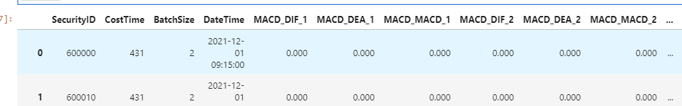

**第五步** 

Python 客户端订阅 DolphinDB server 端的结果表：
```
s.enableStreaming(0)
def handler(lst):
    print(lst)
s.subscribe(host="localhost", port=8892, handler=handler, tableName="aggr1Min", actionName="sub1min", offset=0, msgAsTable=False,  filter=np.array(['600010']))
```

此处 `offset` 设置为 0，表示从结果表的第一行数据开始订阅，订阅返回结果如下：

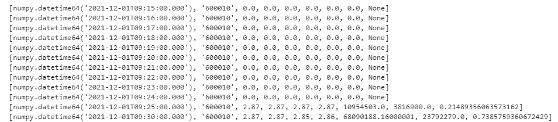

如果想取消订阅，可以执行下述代码：
```
s.unsubscribe(host="localhost", port=8892,tableName="aggr1Min",actionName="sub1min")
```

调试完毕后，建议手动关闭 Python 客户端会话：
```
s.close()
```

其它语言的客户端，如 C++, Java 等，与 DolphinDB server 交互的方式与 Python 客户端相似，具体参考官方的教程文档即可。

### 3.5 计算结果实时推送至 Kafka

DolphinDB server 计算的结果，也可以实时推送到客户本地的低延时消息总线。本教程以推送至 Kafka 为例。开始调试下述功能的前提条件是在 Kafka 中创建好 `aggr1Min` 的 topic，同时 DolphinDB server 已经加载 Kafka 插件。

在 DolphinDB GUI 的 *scripts* 目录创建脚本文件，执行下述代码，把 1 分钟因子计算结果表中的数据推送至 Kafka：
```
use DolphinDBModules::SnapshotFactorCalculationPlatform::resultToKafka

producer = initKafkaProducer("localhost:9092")
subscribeTable(tableName="aggr1Min", actionName="aggr1MinToKafka", offset=0, handler=aggr1MinToKafka{producer, "aggr1Min"}, msgAsTable=true)
```

其中，`initKafkaProducer("localhost:9092")`是指 Kafka 服务的部署 IP 和 Port。

Kafka 的消费者可以及时消费这些数据，如下图所示：

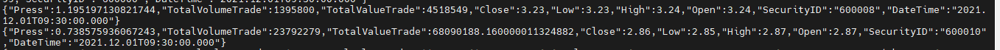
从 DolphinDB server 的监控日志可以看到，计算结果推送至 Kafka 的平均耗时约 180 微秒：

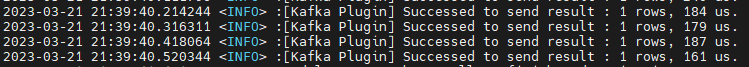

## 4. 流计算相关问题解答

### 4.1 时间序列引擎计算分钟因子

在基于 Level-2 快照数据做实时分钟因子加工的时候，比如实时做 K 线，常常会面临以下几个问题：

- **以机器时间还是事件时间作为窗口关闭的信号？**

本教程示例因子计算平台默认以事件时间作为窗口关闭的触发信号。DolphinDB 内置的时间序列引擎的 *useSystemTime* 参数可以控制以机器时间还是事件时间作为窗口关闭的信号。

- **如果使用事件时间作为窗口关闭的信号，如何保证及时关闭不活跃股票的计算窗口？**

本教程示例因子计算平台以股票为分组，不同组（即不同股票）之间没有触发窗口关闭的机制。DolphinDB 内置的时间序列引擎的 *forceTriggerTime* 参数设置后，可以通过活跃股票的数据强制触发不活跃股票的计算窗口关闭。

- **如果使用事件时间作为窗口关闭的信号，如何保证及时关闭 11:30（午间休市）、14:57（连续竞价结束）的计算窗口 ？**

本教程示例因子计算平台没有配置该功能。DolphinDB 内置的日级时间序列引擎的 *forceTriggerSessionEndTime* 参数可以满足上述场景。

- **计算时窗口边界的开闭是左闭右开还是左开右闭？**

本教程示例因子计算平台的规则是左闭右开。DolphinDB 内置的时间序列引擎的 *closed* 参数可以控制窗口边界规则。

- **计算输出结果的时间是计算窗口起始时间还是结束时间？**

本教程示例因子计算平台的规则是计算窗口起始时间。DolphinDB 内置的时间序列引擎的 *useWindowStartTime* 参数可以输出规则。

- **如果在某个计算窗口内，分组内没有数据，如何用前值或者指定值填充？**

本教程示例因子计算平台没有设置填充规则。DolphinDB 内置的时间序列引擎的 *fill* 参数可以指定填充规则，若（某个分组的）某个窗口无数据时，支持以下几种填充的规则：*none* 表示不输出结果；*null* 表示输出结果为 NULL；*ffill* 表示输出上一个有数据的窗口的结果；具体数值，需要和对应的 *metrics* 计算结果的类型保持一致。

### 4.2 响应式状态引擎计算复杂因子

在基于分钟因子进一步加工有状态的复杂因子的时候，比如实时计算 MACD、RSI 等，常常会面临以下几个问题：

- **计算因子是有状态的：不仅与当前的多个指标有关，而且与多个指标的历史状态相关，如何开发有状态的算子？**

DolphinDB 内置了大量有状态的算子，并进行了增量计算的优化，具体已经内置算子如下所示。

- 累计窗口函数：cumavg, cumsum, cumprod, cumcount, cummin, cummax, cumvar, cumvarp, cumstd, cumstdp, cumcorr, cumcovar, cumbeta, cumwsum, cumwavg。

- 滑动窗口函数：ema, mavg, msum, mcount, mprod, mvar, mvarp, mstd, mstdp, mskew, mkurtosis, mmin, mmax, mimin, mimax, mmed, mpercentile, mrank, mcorr, mcovar, mbeta, mwsum, mwavg, mslr。

- 序列相关函数：deltas, ratios, ffill, move, prev, iterate, ewmMean, ewmVar, ewmStd, ewmCovar, ewmCorr。

DolphinDB 也允许用户用插件来开发自己的状态函数，注册后即可在状态引擎中使用。

- **在一次响应计算过程中，如果计算 1000 个因子，这 1000 个因子依赖一个共同的中间变量，如何避免重复计算？**

比如在上述因子计算平台的复杂因子计算处，有两个因子，分别叫 factor1 和 factor2，表达式如下：
```
@state
def factor1(price) {
    a = ema(price, 20)
    b = ema(price, 40)
    tmp = 1000 * (a-b)\(a+b)
    return  ema(tmp , 10) - ema(tmp , 20)
}
```

```
@state
def factor2(price) {
    a = ema(price, 20)
    b = ema(price, 40)
    tmp = 1000 * (a-b)\(a+b)
    return  mavg(tmp, 10)
}
```
可以看到，两个因子的计算都依赖了相同的中间变量 `tmp`。如果要避免中间变量 `tmp` 的重复计算，可以先定义一个 `tmpFactor` 的函数，表达式如下：
```
@state
def tmpFactor(price) {
    a = ema(price, 20)
    b = ema(price, 40)
    tmp = 1000 * (a-b)\(a+b)
    return  tmp
}
```

 然后把 factor1 和 factor2 的表达式用如下方式表示：
```
@state
def factor1(price) {
    tmp = tmpFactor(price)
    return  ema(tmp , 10) - ema(tmp , 20)
}
```

```
@state
def factor2(price) {
    tmp = tmpFactor(price)
    return  mavg(tmp, 10)
}
```

DolphinDB 内置的响应式状态引擎在解析复杂因子的计算表达式的时候，就会自动避免不同因子相同中间变量的重复计算。

## 5. 路线图(Roadmap)

- 进一步完善 Level-2 快照数据流批一体因子计算平台的功能模块：
  - 开放更多配置参数，解决基于 Level-2 快照数据做实时分钟因子加工的时候遇到的问题
  - 补充 Factor1 和 Factor2 下的内置因子，丰富内置因子库
- 开发 Level-2 快照频率流批一体因子计算平台功能模块
- 开发 Level2 多数据源融合流批一体因子计算平台功能模块

## 附录


功能模块源码： [SnapshotFactorCalculationPlatform](script/Level2_Snapshot_Factor_Calculation/DolphinDBModules/SnapshotFactorCalculationPlatform) 

按照教程，把module内容同步到server后，测试所需脚本： [test_scripts.zip](script/Level2_Snapshot_Factor_Calculation/test_scripts.zip) 

测试的 csv 数据： [Level2_Snapshot_Factor_Calculation](https://www.dolphindb.cn/downloads/docs/Level2_Snapshot_Factor_Calculation.zip) 


 