# 优化投资组合：DolphinDB 最优化求解系列函数应用指南


线性规划和非线性规划是运筹学中重要的内容，在金融和经济领域的问题解决中具有广泛的应用。在金融量化领域的多因子量化模型中，组合权重优化起着至关重要的作用，组合权重优化包括两个要素：第一是组合权重优化的目标函数，如最大化期望收益率，最小化组合风险，最大化效用函数等，第二是目标函数相对应的约束条件，如等式约束和不等式约束。这些优化内容都是线性规划和非线性规划的重要应用问题。

在多因子量化投资领域中，不管使用什么因子，其最终目标都是组合优化得到标的的配置权重，这一步也叫战术配置，主要在于通过一些约束控制住风险。

多因子量化投资的整体逻辑是将 alpha 模型和 risk 模型结合在一起。我们下面以均值 - 方差组合优化框架（Mean-Varaince Optimization，MVO）为例进行解释。MVO 是由 Markowitz 于 1952 年提出，假设

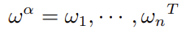为 n 支股票的目标主动权重，其中 

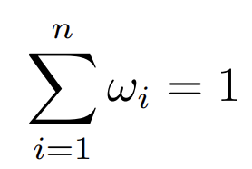

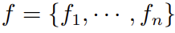为 alpha 模型得到的期望收益率，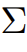 为收益率的协方差矩阵。MVO 的一般框架为：

目标函数：


约束：

权重关系

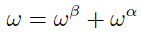

跟踪误差

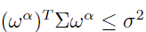
换手率约束


权重上下限
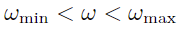

风险因子暴露
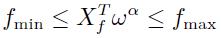


股票数量约束
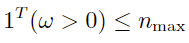
其中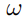为 n 支股票的目标绝对权重向量，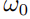为股票的初始权重向量，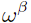为基准组合的权重向量，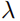为交易成本的厌恶系数。

 

为了满足不同场景的需要，针对实际应用中不同的目标函数和约束条件建立的最优化模型，DolphinDB 提供了多个最优化函数。对于现实中的各种业务决策问题，我们都需要首先把业务问题建成数学规划模型，进而选择合适的求解器寻求最优解或者可行解，从而协助我们做出更理想的决策。通常的求解思路是：

1、明确业务条件与需求；

2、确定优化问题三要素：决策变量、目标函数、约束条件；

3、选择并建立合适的数学规划模型；

4、将该模型导入到求解器中去求解。

本教程将从最优化模型与实际投资组合优化问题出发，对 DophinDB 中最优化求解函数的使用进行介绍。

- [1. 最优化求解系列函数介绍](#1-最优化求解系列函数介绍)
  - [1.1 `linprog`（线性规划）函数](#11-linprog线性规划函数)
  - [1.2 `quadprog`（二次规划）函数](#12-quadprog二次规划函数)
  - [1.3 `qclp`（二次约束线性规划）函数](#13-qclp二次约束线性规划函数)
  - [1.4 `socp`（二阶锥规划）函数](#14-socp二阶锥规划函数)
  - [1.5 插件介绍](#15-插件介绍)
- [2. 常用规划问题转化为二阶锥规划形式](#2-常用规划问题转化为二阶锥规划形式)
  - [2.1 线性规划的二阶锥形式](#21-线性规划的二阶锥形式)
  - [2.2 二次不等式约束的二阶锥形式](#22-二次不等式约束的二阶锥形式)
  - [2.3 绝对值约束的二阶锥形式](#23-绝对值约束的二阶锥形式)
  - [2.4  二次规划的二阶锥形式](#24--二次规划的二阶锥形式)
- [3. 应用场景示例](#3-应用场景示例)
  - [3.1 场景一：最大化期望收益率](#31-场景一最大化期望收益率)
  - [3.2 场景二：最大化效用函数](#32-场景二最大化效用函数)
  - [3.3 场景三：带有换手率约束的投资组合问题](#33-场景三带有换手率约束的投资组合问题)
  - [3.4 场景四：带有收益率波动约束的投资组合问题](#34-场景四带有收益率波动约束的投资组合问题)
- [4. DolphinDB 与 Python 求解最优化问题性能对比](#4-dolphindb-与-python-求解最优化问题性能对比)
  - [4.1 线性规划问题 (LP)](#41-线性规划问题-lp)
  - [4.2 二次规划问题 (QP)](#42-二次规划问题-qp)
  - [4.3 二次约束线性规划问题 (QCLP)](#43-二次约束线性规划问题-qclp)
- [5. 小结](#5-小结)
- [6. 附录](#6-附录)


## 1. 最优化求解系列函数介绍


DolphinDB 最优化求解函数主要有 linprog，quadprog，qclp，socp，用于求解不同约束下的多种规划问题。

### 1.1 `linprog`（线性规划）函数

 

[linprog](https://docs.dolphindb.cn/zh/funcs/l/linprog.html?hl=linprog) 完整名称为 Linear Programming，即线性规划，用于求解线性目标函数在线性约束条件下的极值。

#### 数学模型

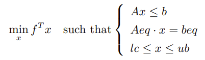

在上面的公式中，x 是未知变量，在优化问题中我们一般也称之为决策变量，

min 表示求表达式 fTx 关于 x 的极小化，such that 后面的内容表示约束条件，在大括号内的三个式子表示相应的等式约束和不等式约束。可以观察到上述表达式关于 x 都是线性的，这种目标函数和约束条件都为线性的优化问题被称为线性规划问题。

对于极大化问题，仅需在目标函数前面添加负号即可转换成极小化问题。

### 1.2 `quadprog`（二次规划）函数

 

[quadprog](https://docs.dolphindb.cn/zh/funcs/q/quadprog.html?hl=quadprog) 即 Quadratic Programming，用于求解二次目标函数在线性约束条件下的极值。

#### 数学模型
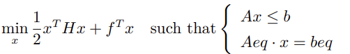
其中 H 必须是对称正定矩阵。

可以观察到与线性规划问题相比，该模型中的目标函数中多了关于 x 的二次项。

### 1.3 `qclp`（二次约束线性规划）函数

 

[qclp](https://docs.dolphindb.cn/zh/funcs/q/qclp.html?hl=qclp) 全称为 Quadratically Constrained Linear Programming，即二次约束线性规划，该函数用于求解线性目标函数在包含二次约束条件下的极值。

#### 数学模型
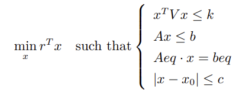

可以观察到与线性规划问题相比，该模型中增加了非线性不等式约束和向量绝对值不等式约束。

### 1.4 `socp`（二阶锥规划）函数

[socp](https://docs.dolphindb.cn/zh/funcs/s/socp.html?hl=socp) 函数 用于求解二阶锥规划（SOCP, Second Order Cone Programming）问题，其数学模型具有更强的一般性，有很广泛的适用场景。socp 和 python 里的 cvxpy 库中的 ecos 求解方法是同种算法。

#### 数学模型

首先给出 k 维标准锥形式的定义：

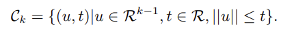

二阶锥里面用到的是二范数

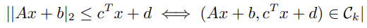

SOCP 问题的锥表述形式如下：
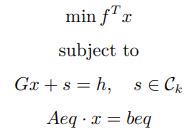

其中为锥，s 为松弛变量，在实际 socp 函数参数中无对应项，其值在优化过程中会被确定。

 

SOCP 问题的标准形式：


其中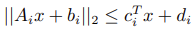 为锥约束。


与锥表述形式相比，二阶锥的标准形式与 Gx + s = h 的对应关系为：

矩阵 G 的形式为 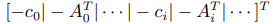 ，向量 h 的形式为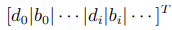 。

### 1.5 插件介绍

gurobi 插件（预计 4 月初发布）用于调用 [gurobi](https://www.gurobi.com/) 优化器。gurobi 是一个性能优异、求解问题类型丰富的优化器，在国内外市场有着众多成熟的案例与客户。gurobi 插件遵循了原用户的使用习惯，方便用户将基于 gurobi 构建的应用与 DolphinDB 进行集成。除此之外，还解决了 gurobi 软件使用中的一些痛点问题：减少了数据在软件架构中的传输与计算成本，直接在 DolphinDB 库内计算，提高整体求解的效率及降低上手难度（开发人员熟悉 DolphinDB 脚本语言即可）。目前插件支持对接 Gurobi Optimizer version 10.0.2，支持 lp、qp、qclp 问题的求解，提供如下的接口。该插件预计 4 月初上线官网——插件广场。

| **接口**     | **参数（如无注明均为必填项）**                               | **功能**           |
| :----------- | :----------------------------------------------------------- | :----------------- |
| model        | params：配置项，可选。<string, string> 类型的字典，用于初始化模型 | 初始化一个模型对象 |
| addVars      | model：模型对象 lb：变量的下限，double vectorub：变量的上限，double vectortype：变量的类型，char vector，根据 gurobi c++ api 文档取值，可选 varName：变量的名称，string vector | 批量增加变量       |
| linExpr      | model：模型对象 coefficient：系数向量，类型为 double vectorvarName：类型为 string vector | 增加线性表达式     |
| quadExpr     | model：模型对象 quadMatrix：类型为 double matrixvarName：类型为 string vectorlinExpr：类型为 linExpr handle | 增加二次表达式     |
| addConstr    | model：类型为 model handlelhsExpr：约束表达式 sense：类型为 char`'<'`: `GRB_LESS_EQUAL``'>'`: `GRB_GREATER_EQUAL``'='`: `GRB_EQUAL`rhsVal：类型为 double | 增加线性/二次约束  |
| setObjective | model：模型对象                                              | 设定目标函数       |
| optimize     | model：模型对象                                              | 执行优化           |
| getResult    | model：模型对象                                              | 获取优化后的变量值 |
| getObjective | model：模型对象                                              | 获取优化结果       |

下文测试数据基于 guorbi 单用户许可，限制 2000 个变量和约束。

## 2. 常用规划问题转化为二阶锥规划形式

 
在使用 socp 求解一般的规划问题时，需要将原问题转化为 SOCP 问题的标准形式，再根据二阶锥的锥表述形式与标准形式之间的对应关系得到最终 socp 函数的参数。

### 2.1 线性规划的二阶锥形式

 
对于线性不等式约束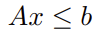，移项后得到

.png)

同理对 x 设定上界与下界的约束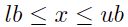 可以转化为

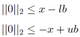

对应二阶锥的标准形式为
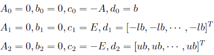

其中 E 为长度与 x 相同的单位矩阵。

因此得到二阶锥参数

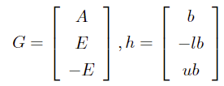

### 2.2 二次不等式约束的二阶锥形式

 
对于二次不等式约束 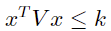，其中 V 为正定矩阵，k 为正标量。V 可以通过 cholesky 分解得到 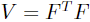，则原约束可以转化为
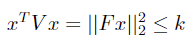
即可得到二阶锥的标准形式

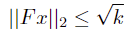
锥形式参数

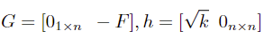

n 为变量 x 的长度。

### 2.3 绝对值约束的二阶锥形式

 
对于包含绝对值约束的线性规划

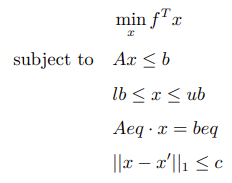

其中 1 范数约束即为绝对值约束
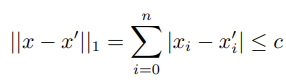


引入辅助变量
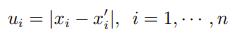

将原问题改写为关于 \[xT, u1, ··· , un]T 的优化问题即可转换为二阶锥规划的形式：
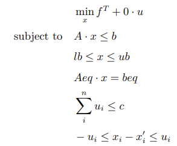


### 2.4  二次规划的二阶锥形式


对于目标函数中含有二次项的规划问题，引入辅助变量 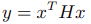 ，由于 H 为正定矩阵，可以通过 cholesky 分解得到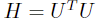，原问题改写为

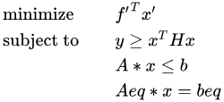

又由四边形恒等式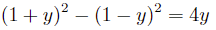可以推出

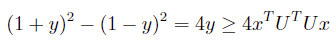

移项得到
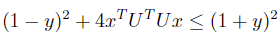


代入到问题二次约束中即可得到


最终得到与原问题等价的规划问题
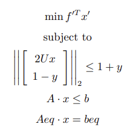


其中
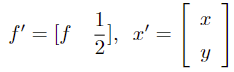


## 3. 应用场景示例

### 3.1 场景一：最大化期望收益率

在股票组合优化问题中，可以在个股权重上下限约束，风险约束，行业约束的约束条件下求解股票投资组合的最大收益。假设有 10 支股票，预测它们未来的收益率分别为

`[0.1, 0.02, 0.01, 0.05, 0.17, 0.01, 0.07, 0.08, 0.09, 0.10]`。这些股票属于消费、金融和科技三个行业，希望在每个行业的暴露不超过 8%，且每个股票权重分配不得多于 15%，求最大化预期收益的投资组合。

#### linprog 函数求解

根据问题描述可以带入线性规划模型得到

预期收益率：
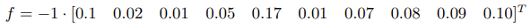

不等式约束：
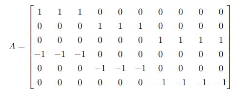
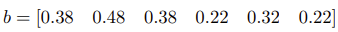
等式约束：所有股票分配权重之和为 1。

```

f = -1*[0.1,0.02,0.01,0.05,0.17,0.01,0.07,0.08,0.09,0.10]
A = ([1,1,1,0,0,0,0,0,0,0,0,0,0,1,1,1,0,0,0,0,0,0,0,0,0,0,1,1,1,1,-1,-1,-1,0,0,0,0,0,0,0,0,0,0,-1,-1,-1,0,0,0,0,0,0,0,0,0,0,-1,-1,-1,-1]$10:6).transpose()
b = [0.3,0.4,0.3]
//参数设置
exposure = 0.08
b = (b + exposure) join (exposure - b)
Aeq = matrix(take(1, size(f))).transpose()
beq = array(DOUBLE).append!(1)
res = linprog(f, A, b, Aeq, beq, 0, 0.15)

//输出结果 
max_return = -res[0] 
//max_return = 0.0861
weights = res[1]
//weights = [0.15,0.15,0,0.15,0.15,0.02,0,0.08,0.15,0.15]

```

#### gurobi 插件求解

```
loadPlugin("plugins/gurobi/PluginGurobi.txt")
model = gurobi::model()

/// 增加变量
numOfVars = 10
lb = take(0, numOfVars)
ub = take(0.15, numOfVars)
stocks = ["A001", "A002", "A003", "A004", "A005", "A006", "A007", "A008", "A009", "A010"]
vars = gurobi::addVars(model, lb, ub, , , stocks)

/// 增加线性约束
f = [0.1,0.02,0.01,0.05,0.17,0.01,0.07,0.08,0.09,0.10]
A = ([1,1,1,0,0,0,0,0,0,0,0,0,0,1,1,1,0,0,0,0,0,0,0,0,0,0,1,1,1,1,-1,-1,-1,0,0,0,0,0,0,0,0,0,0,-1,-1,-1,0,0,0,0,0,0,0,0,0,0,-1,-1,-1,-1]$10:6)
rhs = 0.38 0.48 0.38 -0.22 -0.32 -0.22

for (i in 0:6) {
  lhsExpr = gurobi::linExpr(model, A[i], stocks)
  gurobi::addConstr(model, lhsExpr, '<', rhs[i])
}

lhsExpr = gurobi::linExpr(model, take(1, numOfVars), stocks)
gurobi::addConstr(model, lhsExpr, '=', 1)

// 设置目标函数
obj = gurobi::linExpr(model, f, vars)
gurobi::setObjective(model, obj, -1)

// 执行优化
gurobi::optimize(model) 

// 获取优化结果
result = gurobi::getResult(model)
//股票权重：result = [0.15,0.15,0,0.15,0.15,0.02,0,0.08,0.15,0.15]
obj = gurobi::getObjective(model)
//目标值：obj = 0.0861
```

 

### 3.2 场景二：最大化效用函数

 

现代投资组合理论用均值和方差来刻画收益和风险这两个关键因素，效用函数期望则是尽可能的在最大化期望收益率和最小组合波动率之间取得一个平衡，二次目标函数的最优解也是组合权重优化的一部分，一般收益最大化的同时也要求组合风险最小。

假设有 2457 支股票，其投资组合收益率的协方差矩阵是一个单位矩阵，求解在取得最大效用函数的时各股票的权重分配。

#### quadprog 函数求解

```
baseDir = "/home/data/"
f = dropna(flatten(float(matrix(select col1, col2, col3, col4, col5, col6, col7, col8, col9, col10 from loadText(baseDir + "C.csv") where rowNo(col1) > 0)).transpose()))

N = f.size()
H = eye(N) //协方差矩阵
A = matrix(select * from loadText(baseDir + "A_ub.csv"))
b = 
[0.025876723,	0.092515275,	0.035133942,	0.053184884,	0.067410565,	0.009709433,	0.04668745,	0.00636804,	0.022258664,	0.11027537,
0.018488302,	0.027417204,	0.028585,	0.017228214,	0.008055527,	0.015727843,	0.026132369,	0.013646113,	0.066000808,	0.043606587,
0.048325258,	0.033868626,	0.010790603,	0.017737391,	0.03252374,	0.039329965,	0.040665779,	0.010868773,	0.006819891,	0.015879314,
0.008882335,	-0.025876723,	-0.092515275,	-0.035133942,	-0.053184884,	-0.067410565,	-0.009709433,	-0.04668745,	-0.00636804,	-0.022258664,
-0.110275379,	-0.018488302,	-0.027417204,	-0.028585,	-0.017228214,	-0.008055527,	-0.015727843,	-0.026132369,	-0.013646113,	-0.066000808,
-0.043606587,	-0.048325258,	-0.033868626,	-0.010790603,	-0.017737391,	-0.03252374,	-0.039329965,	-0.040665779,	-0.010868773,	-0.006819891,
-0.015879314,	-0.008882335]

//线性约束
Aeq = matrix(take(1, N)).transpose()
beq = array(DOUBLE).append!(1)
res2 = quadprog(H, f, A, b, Aeq, beq)

```

#### gurobi 插件求解

```
baseDir="/home/data/"
f = dropna(flatten(double(matrix(select col1, col2, col3, col4, col5, col6, col7, col8, col9, col10 from loadText(baseDir + "C.csv") where rowNo(col1) > 0)).transpose()))

N = f.size()
H = eye(N)
A = matrix(select * from loadText(baseDir + "A_ub.csv")).transpose()
b = 
[0.025876723,	0.092515275,	0.035133942,	0.053184884,	0.067410565,	0.009709433,	0.04668745,	0.00636804,	0.022258664,	0.11027537,
0.018488302,	0.027417204,	0.028585,	0.017228214,	0.008055527,	0.015727843,	0.026132369,	0.013646113,	0.066000808,	0.043606587,
0.048325258,	0.033868626,	0.010790603,	0.017737391,	0.03252374,	0.039329965,	0.040665779,	0.010868773,	0.006819891,	0.015879314,
0.008882335,	-0.025876723,	-0.092515275,	-0.035133942,	-0.053184884,	-0.067410565,	-0.009709433,	-0.04668745,	-0.00636804,	-0.022258664,
-0.110275379,	-0.018488302,	-0.027417204,	-0.028585,	-0.017228214,	-0.008055527,	-0.015727843,	-0.026132369,	-0.013646113,	-0.066000808,
-0.043606587,	-0.048325258,	-0.033868626,	-0.010790603,	-0.017737391,	-0.03252374,	-0.039329965,	-0.040665779,	-0.010868773,	-0.006819891,
-0.015879314,	-0.008882335]

model = gurobi::model()
/// 增加变量
lb = take(-10, N)
ub = take(10, N)
varName = "v" + string(1..N)
vars = gurobi::addVars(model, lb, ub, , ,varName)

//增加线性约束
for (i in 0:N) {
    lhsExpr = gurobi::linExpr(model, A[i], varName)
    gurobi::addConstr(model, lhsExpr, '<', b[i])
}
lhsExpr = gurobi::linExpr(model, take(1, N), varName)
gurobi::addConstr(model, lhsExpr, '=', 1)

// 增加目标值
linExpr = gurobi::linExpr(model, f, vars)
quadExpr = gurobi::quadExpr(model, H, varName, linExpr)
gurobi::setObjective(model, quadExpr, 1)

timer status = gurobi::optimize(model) 

// 获取优化结果
result = gurobi::getResult(model)
obj = gurobi::getObjective(model)
```

### 3.3 场景三：带有换手率约束的投资组合问题

 
同样是场景二中的 2457 支股票，我们引入换手率约束。在投资组合问题中，换手率即为当前股票权重与初始股票权重的绝对值之和，衡量了股票的流通性大小。过高的换手率意味着较大的交易成本，本例中我们设置所有股票换手率之和不大于 1，求解使投资组合达到最大收益率时的权重分配。

#### socp 函数求解

使用 socp 函数求解带有换手率约束的投资组合问题时，需将原问题转化为含有绝对值约束的二阶锥形式再进行求解。

```
 
baseDir = "/home/data/""
f = dropna(flatten(float(matrix(select col1, col2, col3, col4, col5, col6, col7, col8, col9, col10 from loadText(baseDir + "C.csv") where rowNo(col1) > 0)).transpose()))
N = f.size()

// Ax <= b
A = matrix(select * from loadText(baseDir + "A_ub.csv"))
x = sum(A[0,])
sum(x);

b = 
[0.025876723,	0.092515275,	0.035133942,	0.053184884,	0.067410565,	0.009709433,	0.04668745,	0.00636804,	0.022258664,	0.11027537,
0.018488302,	0.027417204,	0.028585,	0.017228214,	0.008055527,	0.015727843,	0.026132369,	0.013646113,	0.066000808,	0.043606587,
0.048325258,	0.033868626,	0.010790603,	0.017737391,	0.03252374,	0.039329965,	0.040665779,	0.010868773,	0.006819891,	0.015879314,
0.008882335,	-0.025876723,	-0.092515275,	-0.035133942,	-0.053184884,	-0.067410565,	-0.009709433,	-0.04668745,	-0.00636804,	-0.022258664,
-0.110275379,	-0.018488302,	-0.027417204,	-0.028585,	-0.017228214,	-0.008055527,	-0.015727843,	-0.026132369,	-0.013646113,	-0.066000808,
-0.043606587,	-0.048325258,	-0.033868626,	-0.010790603,	-0.017737391,	-0.03252374,	-0.039329965,	-0.040665779,	-0.010868773,	-0.006819891,
-0.015879314,	-0.008882335]

x0 = exec w0 from  loadText(baseDir + "w0.csv") 


// minimize f^T * x + 0 * u , c = [f, 0] 引入新的求解变量
c = -f // f^T * x， 
c.append!(take(0, N)) // 0 * u
c;

// 根据二阶锥的锥形式与标准形式对应关系设置矩阵 G 
E = eye(N)
zeros = matrix(DOUBLE, N, N, ,0)

G = concatMatrix([-E,zeros]) // -x <= -lb 
G = concatMatrix([G, concatMatrix([E,zeros])], false) // x <= ub
G = concatMatrix([G, concatMatrix([E,-E])], false) // x_i -u_i <= x`_i 
G = concatMatrix([G, concatMatrix([-E,-E])], false) // -x_i-u_i <= -x`_i

G = concatMatrix([G, concatMatrix([matrix(DOUBLE,1,N,,0), matrix(DOUBLE,1,N,,1)])], false) // sum(u)=c
G = concatMatrix([G, concatMatrix([A, matrix(DOUBLE,b.size(), N,,0)])], false) // A*x <= b

//根据二阶锥的锥形式与标准形式对应关系设置向量 h
h = array(DOUBLE).append!(take(0, N)) // -x <= -lb
h.append!(take(0.3, N)) // x <= ub
h.append!(x0) // x_i -u_i <= x`_i
h.append!(-x0) // -x_i-u_i <= -x`_i
h.append!(1) // sum(u)<=c 换手率约束
h.append!(b) // A*x <= b 

// l, q
l = 9891 // 所有约束都是线性的
q = []

// Aeq, beq
Aeq = concatMatrix([matrix(DOUBLE, 1, N, ,1), matrix(DOUBLE, 1, N, ,0)])
beq = array(DOUBLE).append!(1)

res = socp(c, G, h, l, q, Aeq, beq);
print(res)
// output > ("Problem solved to optimality",[4.030922466819474E-13,-1.38420918319221E-12,2.633003706864388E-12,7.170457424061185E-12,3.08367186410226E-13,-1.538707717541051E-12,0.00029999999826,4.494868392653513E-12,-1.046866787477076E-12,0.000799999998839,1.16264810755163E-12,1.610142862543512E-11,-1.056487154243985E-13,-2.157448203710766E-13,4.389916149869339E-12,1.875852354004975E-12,7.82477001121239E-12,0.001299999997416,4.727903065768357E-13,7.550671346161244E-13,5.591928646425624E-12,1.124989684680735E-11,5.482907889730026E-12,0.015985000026396,0.000700000000029,5.633638482685261E-12,1.67297174174449E-12,5.469150816162936E-12,-6.300522047286838E-13,2.303301153098362E-12...],0.964278008555949)

```

#### gurobi 插件求解

暂不支持圆锥约束的求解。

### 3.4 场景四：带有收益率波动约束的投资组合问题


有三支股票，根据每支股票的预期收益与收益率协方差矩阵，决定最优投资组合。

约束条件为：

1. 投资组合的收益率的波动率不超过 11%；
2. 每支股票的权重在 10% 到 50% 之间。

#### qclp 函数求解

```

r = 0.18 0.25 0.36
V = 0.0225 -0.003 -0.01125 -0.003 0.04 0.025 -0.01125 0.025 0.0625 $ 3:3
k = pow(0.11, 2)
A = (eye(3) join (-1 * eye(3))).transpose()
b = 0.5 0.5 0.5 -0.1 -0.1 -0.1
Aeq = (1 1 1)$1:3
beq = [1]

res = qclp(-r, V, k, A, b, Aeq, beq) 
//输出结果
max_return = res[0]
//max_return = 0.2281
weights = res[1]
//weights = [0.50, 0.381, 0.119]
```

#### gurobi 插件求解

```
r = 0.18 0.25 0.36
V = 0.0225 -0.003 -0.01125 -0.003 0.04 0.025 -0.01125 0.025 0.0625 $ 3:3
k = pow(0.11, 2)
A = (eye(3) join (-1 * eye(3)))
b = 0.5 0.5 0.5 -0.1 -0.1 -0.1

// 初始化模型及变量
model = gurobi::model()
varNames = "v" + string(1..3)
lb = 0 0 0
ub = 1 1 1
vars = gurobi::addVars(model, lb, ub,,, varNames)

//增加线性约束
for (i in 0:3) {
    lhsExpr = gurobi::linExpr(model, A[i], vars)
    gurobi::addConstr(model, lhsExpr, '<', b[i])
}
lhsExpr = gurobi::linExpr(model, take(1, 3), vars)
gurobi::addConstr(model, lhsExpr, '=', 1)

// 增加二次约束
quadExp = gurobi::quadExpr(model, V, vars)
gurobi::addConstr(model, quadExp, '<', k)

//设置目标值并执行优化
obj = gurobi::linExpr(model, r, vars)
gurobi::setObjective(model, obj, 1)
timer gurobi::optimize(model)

// 获取优化结果
result = gurobi::getResult(model) 
// [0.50, 0.3808, 0.119158]
obj = gurobi::getObjective(model)
// 0.228107
```

## 4. DolphinDB 与 Python 求解最优化问题性能对比

 

socp 作为 DolphinDB 最优化求解系列函数中适用场景最广泛的优化问题求解器，很多优化问题都可以转换为二阶锥规划后使用 socp 求解。并且由于二阶锥规划具有非常高效的求解算法，因此 socp 函数具有很高的求解效率。socp 和 python 里的 cvxpy 库中的 ecos 求解方法一致。

本节通过使用随机模拟数据对三类规划问题使用不同求解方法的性能进行了对比。需要注意的是，不同的数据可能会对运算性能产生一定影响，因此本测试用例仅供参考。


### 4.1 线性规划问题 (LP)

| **使用函数**                     | **用时统计** |
| :------------------------------- | :----------- |
| linprog                          | 25.9 ms      |
| socp                             | 111.6ms      |
| scipy.optimize.linprog（python） | 38.9 ms      |
| gurobi 插件                      | 1.0 ms       |

本测试场景使用 200 个变量，其中插件的耗时包括从模型初始化至执行`optimize` 求解的全部过程（下同）。


### 4.2 二次规划问题 (QP)

| **使用函数**    | **用时统计** |
| :-------------- | :----------- |
| quadprog        | 2,877.6 ms   |
| socp            | 11,625.3 ms  |
| cvxpy（python） | 8,809.7ms    |
| gurobi 插件     | 4601.7 ms    |

本测试场景使用 1000 个变量，其中 gurobi 插件在添加约束时耗时较大 (773.0 ms)，实际优化耗时 3,828.7 ms。


### 4.3 二次约束线性规划问题 (QCLP)

| **使用函数**  | **用时统计** |
| :------------ | :----------- |
| qclp          | 121.6 ms     |
| socp          | 30.1 ms      |
| cvxpy(python) | 353.6ms      |
| gurobi 插件   | 1.1ms        |

本测试场景使用 200 个变量。

从以上性能对比可以看出，总体而言，gurobi 插件展现出最佳的求解性能，而 DolphinDB 的内置函数相比 python 的求解器也表现出更快的求解速率。此外使用 DolphinDB 最优化函数、gurobi 插件求解的结果与 Python 的求解结果在小数点后至少四位内均达到一致。


## 5. 小结

对于组合优化的场景，DolphinDB 提供了内置的最优化函数及插件的解决方案。使用内置函数时，相较于其他最优化函数，二阶锥规划（socp）展现出广泛的适用范围和强大的运算性能。在实际应用中，通过将一般规划问题转化为二阶锥问题并进行求解，往往能够获得更优的结果。如果项目中已经使用了 gurobi 求解器，选择插件不失为一种优秀的工程方案。结合 DolphinDB 在高性能行情数据处理上的优势，便捷、高效地实现组合优化。


## 6. 附录

DolphinDB 与 Python 求解最优化问题以及性能对比的数据与实现脚本。

 [data.zip](script/mvo/data.zip) 

 [script.zip](script/mvo/script.zip) 
