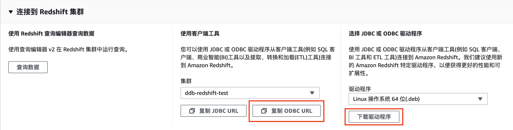
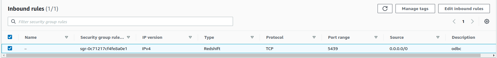
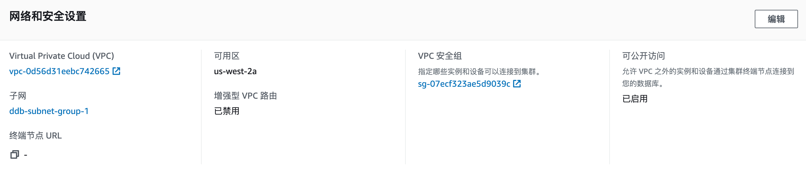
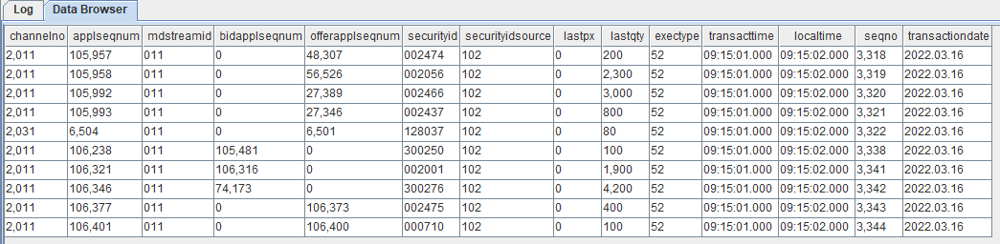

# 从 Redshift 迁移数据到 DolphinDB

AWS Redshift 是最早的云数据仓库之一，为用户提供完全托管的 PB 级云中数据仓库服务。用户可以使用标准 SQL 和现有的商业智能工具，经济高效地进行数据分析。但 AWS Redshift 上手难度较大，对知识储备要求较高，设计和优化相当复杂。作为云数据仓库，AWS Redshift 没有本地仓库操作快速便捷。

DolphinDB 是一款国产的高性能分布式时序数据库产品，其综合解决方案具有卓越的性能优势和低维护成本优势。客户无需集成不同供应商的多个系统，极大地降低了大数据管理和分析系统的综合成本。

与 AWS Redshift 相比，DolphinDB 具有以下优势：

* 操作简单，可扩展性强。具有良好的容错能力及优异的多用户并发访问能力。
* 部署灵活。可在 Linux 或 Windows 环境、本地或云端、终端设备或服务器上部署。
* 易于上手。DolphinDB 提供了丰富的文档和用户手册，且有专业技术支持团队在线解答，方便用户快速上手。

本文旨在为有从 Redshift 迁移数据到 DolphinDB 需求的用户提供一份简明的教程参考。

- [从 Redshift 迁移数据到 DolphinDB](#从-redshift-迁移数据到-dolphindb)
  - [1. 应用需求](#1-应用需求)
  - [2. 实现方法](#2-实现方法)
  - [3. 迁移步骤](#3-迁移步骤)
    - [3.1 环境配置](#31-环境配置)
    - [3.2 ODBC 配置](#32-odbc-配置)
      - [3.2.1 安装 ODBC](#321-安装-odbc)
      - [3.2.2 安装 Redshift.ODBC 驱动](#322-安装-redshiftodbc-驱动)
    - [3.3 利用 DolphinDB 脚本同步数据](#33-利用-dolphindb-脚本同步数据)
  - [4. 总结](#4-总结)
  - [附录](#附录)

## 1. 应用需求

AWS Redshift 2013年上线以来，凭借着使用各种创新技术，以快速、成本低、安全和兼容等优势吸引了大量用户。对于大小在 100 GB 到 1 PB 或更高的数据集，拥有很高的查询性能。具有很高的可扩展性，仅需在 AWS 管理控制台中点击几次即可完成配置扩展。对于金融大数据领域，Redshift 有大规模并行处理（MPP）架构，MPP 可以通过将数据分布到各个计算节点来解决海量数据的处理难题，并通过并发扩展与弹性调整处理突发工作负载。

与 Redshift 相比，2018年初发布的 DolphinDB，作为一款国产的高性能分布式数据库产品，凭借功能强大的编程语言和高容量高速度的流数据分析系统，能在满足低延时高吞吐量数据读写的要求的同时，轻松实现因子挖掘、流式计算、股票行情回放、实时计算高频因子等功能，成为国内大部分金融机构的首选方案。如今，如何将数据从其他数据库迁移同步到 DolphinDB 上成为大部分用户面临的一大难题。

## 2. 实现方法

DolphinDB 的 ODBC (Open Database Connectivity) 插件可帮助用户方便快速地将数据导入，从而实现从 Redshift 迁移数据到 DolphinDB。

ODBC 插件是 DolphinDB 提供的通过 ODBC 接口访问 Redshift 的开源产品。插件配合 DolphinDB 脚本使用，与服务器在同一个进程空间内运行，可以高效快速地完成从 Redshift 导入数据到 DolphinDB。

ODBC 提供了如下函数，函数的具体使用请参考 [ODBC](https://gitee.com/dolphindb/DolphinDBPlugin/blob/release200/odbc/README.md)

```
odbc::connect(connStr, [dataBaseType])
odbc::close(conn)
odbc::query(connHandle or connStr, querySql, [t], [batchSize], [tranform])
odbc::execute(connHandle or connStr, SQLstatements)
odbc::append(connHandle, tableData, tablename, [createTableIfNotExist], [insertIgnore])
```

下表展示了 ODBC 与 DolphinDB 中数据类型的映射关系。

|     |     |
| --- | --- |
| **ODBC 数据类型** | **DolphinDB 数据类型** |
| SQL\_BIT | BOOL |
| SQL\_TINYINT / SQL\_SMALLINT | SHORT |
| SQL\_INTEGER | INT |
| SQL\_BIGINT | LONG |
| SQL\_REAL | FLOAT |
| SQL\_FLOAT/SQL\_DOUBLE/SQL\_DECIMAL/SQL\_NUMERIC | DOUBLE |
| SQL\_DATE/SQL\_TYPE\_DATE | DATE |
| SQL\_TIME/SQL\_TYPE\_TIME | SECOND |
| SQL\_TIMESTAMP/SQL\_TYPE\_TIMESTAMP | NANOTIMESTAMP |
| SQL\_CHAR(len == 1) | CHAR |
| 其他数据类型 | STRING |

本文中的实践案例利用 ODBC 插件迁移数据，选择了金融领域具有代表性的深交所数据作为数据源，提供了3日的逐笔成交数据（约3亿数据量），储存于 Redshift 中，真实地模拟用户情况。数据迁移过程中，要注意数据类型的转换，下表提供了从 Redshift 到 DolphinDB 相应表结构数据类型。

|     |     |     |     |     |     |
| --- | --- | --- | --- | --- | --- |
| **Redshift字段含义** | **Redshift字段** | **Redshift数据类型** | **DolphinDB字段含义** | **DolphinDB字段** | **DolphinDB数据类型** |
| 频道代码 | channelno | integer | 频道代码 | channelno | INT |
| 消息记录号 | applseqnum | integer | 消息记录号 | applseqnum | INT |
| 行情类别 | mdstreamid | character varying(256) | 行情类别 | mdstreamid | SYMBOL |
| 买方委托索引 | bidapplseqnum | integer | 买方委托索引 | bidapplseqnum | INT |
| 卖方委托索引 | offerapplseqnum | integer | 卖方委托索引 | offerapplseqnum | INT |
| 证券代码 | securityid | character varying(256) | 证券代码 | securityid | SYMBOL |
| 证券代码源 | securityidsource | character varying(256) | 证券代码源 | securityidsource | SYMBOL |
| 委托价格 | lastpx | double precision | 委托价格 | lastpx | DOUBLE |
| 委托数量 | lastqty | double precision | 委托数量 | lastqty | DOUBLE |
| 成交类别 | extctype | integer | 成交类别 | extctype | INT |
| 成交时间 | transacttime | time without time zone | 成交时间 | transacttime | TIME |
| 接收时间戳 | lacaltime | time without time zone | 接收时间戳 | lacaltime | TIME |
| 接收序列号 | seqno | integer | 接收序列号 | seqno | INT |
| 交易日期 | transactiondate | date | 交易日期 | transactiondate | DATE |

## 3. 迁移步骤

### 3.1 环境配置

本次案例中使用了以下数据库及插件，各版本型号如下：

[Redshift](https://aws.amazon.com/redshift/) 版本：`国际版 us-west-2区`

[unixODBC](http://www.unixodbc.org/) 版本：`2.3.1`

[DolphinDB Serve](https://www.dolphindb.cn/alone/alone.php?id=10) 版本：`2.00.8.7`

[DolphinDB GUI](https://www.dolphindb.cn/alone/alone.php?id=10) 版本：`1.30.20.1`

`2.00.8.7` 版本 Server 自带 ODBC 插件，位于 Server 的 `<HomeDir>/plugins` 目录，可直接加载使用。如果 `<HomeDir>/plugins` 目录下不存在 ODBC 文件夹，则通过如下链接下载：

[DolphinDB ODBC 插件](https://github.com/dolphindb/DolphinDBPlugin/tree/release200.8/odbc) 版本：`2.00.8`

请注意，DolphinDB ODBC 插件版本号必须与 Server 版本号一致，否则可能出现报错。例如，DolphinDB Server 版本号为 2.00.8.X，则必须使用 release200.8 分支的  ODBC 插件。

### 3.2 ODBC 配置

#### 3.2.1 安装 ODBC

终端输入以下命令安装 ODBC 库

```
# Ubuntu 安装 ODBC
apt-get install unixodbc unixodbc-dev

# CentOS 安装 ODBC
yum install unixODBC  unixODBC-devel

# 检查是否安装成功
odbcinst -j
```

期望输出

```
unixODBC 2.x.x
DRIVERS............: /etc/odbcinst.ini
SYSTEM DATA SOURCES: /etc/odbc.ini
FILE DATA SOURCES..: /etc/ODBCDataSources
USER DATA SOURCES..: $HOME/.odbc.ini
SQLULEN Size.......: 8
SQLLEN Size........: 8
SQLSETPOSIROW Size.: 8
```

> 可以查看到 ODBC 驱动路径（`/etc/odbcinst.ini`）和系统数据源路径（`/etc/odbc.ini`）

#### 3.2.2 安装 Redshift.ODBC 驱动

Redshift 配置 ODBC 连接可参考[配置 ODBC 连接](https://docs.aws.amazon.com/zh_cn/redshift/latest/mgmt/configure-odbc-connection.html)

1. 下载 ODBC 驱动到本地    

Ubuntu 选择 Linux 操作系统 64 位 (.deb)，CentOS 选择 Linux 操作系统 64 位 (.deb)



2. 安装 ODBC 驱动

在终端输入以下语句进行安装

```
#Ubuntu
dpkg -i ./AmazonRedshiftODBC-1.x.x.xxxx-x.x86_64.deb

#CentOS
yum --nogpgcheck localinstall AmazonRedshiftODBC-64-bit-1.x.xx.xxxx-x.x86_64.rpm
```

安装成功后，会在 `/opt/amazon/redshiftodbc/Setup` 下生成两个配置文件 `odbc.ini` 和 `odbcinst.ini`

将这两个文件复制到上文中提到的 ODBC 驱动路径 /etc/odbcinst.ini 和 /etc/odbc.ini

```
cp /opt/amazon/redshiftodbc/Setup/odbcinst.ini /etc/
cp /opt/amazon/redshiftodbc/Setup/odbc.ini /etc/
```

3. ODBC URL 配置

复制 ODBC URL 将其添加到 `/etc/odbc.ini` 文件中

```
[Redshift]
Driver=Amazon Redshift (x64); 
Server=Your server; 
Database=Your database
```

4. 数据库安全组开放

预设情况下，用户创建的任何集群对所有人关闭。IAM 凭证仅控制对 Amazon Redshift API 相关资源的访问 AWS Redshift 控制台、命令行界面 (CLI)、API 和开发工具包。要能够通过 JDBC 或 ODBC 从 SQL 客户端工具访问集群，用户可以使用安全组

* 将安全组的 inbound 规则设置如下，开放5439端口给外部    



* 编辑集群的属性,修改网络和安全设置，设置 VPC 安全组为刚才创建的安全组，并启用可公开访问。    



5. 验证 ODBC 连接成功

在终端输入以下命令(使用数据库的实际登录信息)

```
isql redshift UID PWD
```

期望返回

```
+---------------------------------------+
| Connected!                            |
|                                       |
| sql-statement                         |
| help [tablename]                      |
| quit                                  |
|                                       |
+---------------------------------------+
SQL>
```

### 3.3 利用 DolphinDB 脚本同步数据

1.  运行以下命令加载 ODBC 插件    

```
login("admin","123456")
loadPlugin("./plugins/odbc/PluginODBC.txt")
```

2. 创建 DolphinDB 相应的分区表

```
db=database("dfs://redshift",HASH,[INT,10]);
dt=table(300000000:0,["channelno","applseqnum","mdstreamid","bidapplseqnum","offerapplseqnum","securityid","securityidsource","lastpx","lastqty","exectype","transacttime","localtime","seqno","transactiondate"],[INT,INT,SYMBOL,INT,INT,SYMBOL,SYMBOL,DOUBLE,DOUBLE,INT,TIME,TIME,INT,DATE]);
pt=createPartitionedTable(db,dt,"dfstable","channelno");
```

3. 运行以下命令建立与 Redshift 的连接

```
conn = odbc::connect("Driver={Amazon Redshift (x64)}; Server=Your server; Database=Your database;User=UID;Password=PWD;")
```

4. 运行以下脚本将数据迁移到 DolphinDB 中

```
# pt 为创建的分区表
odbc::query(conn, "select * from trades_sz",pt)
```

```
startTime                        endTime
2022.12.20 17:22:12.644          2022.12.20 17:48:09.618
```

最终迁移3亿条数据，耗时仅为1610秒。该迁移案例测试的硬件环境为：

* CPU：11th Gen Inter(R) Core(TM) i5-11500 @2.70GHz    
* 处理器个数：12 个    
* 单个处理器核数：6 核    
* 内存大小：32 GB    
* 网络传输速率：21508 MiB/s    

5. 查看表中数据

```
select top 10 * from pt
```



## 4. 总结

本教程基于深交所3日逐笔成交数据，为大家介绍了如何将 Redshift 中的数据导入到 DolphinDB 中，DolphinDB 提供了 ODBC 插件，可以方便快捷地将数据进行导入。

DolphinDB 具有强大的金融数据处理能力，包含丰富的预定义函数功能，以及具备自带的持久化数据存储。既有非常高的吞吐量，又有较低的延时；既能够实时处理流数据，又能够处理海量的历史数据；既能满足简单的点查询的要求，又能满足批量数据复杂分析的要求。本教程中的数据迁移模拟操作充分地显示了 DolphinDB 的这些优势。

## 附录
[完整脚本](script/Migrate_data_from_Redshift_to_DolphinDB/Redshift2DDB.txt)