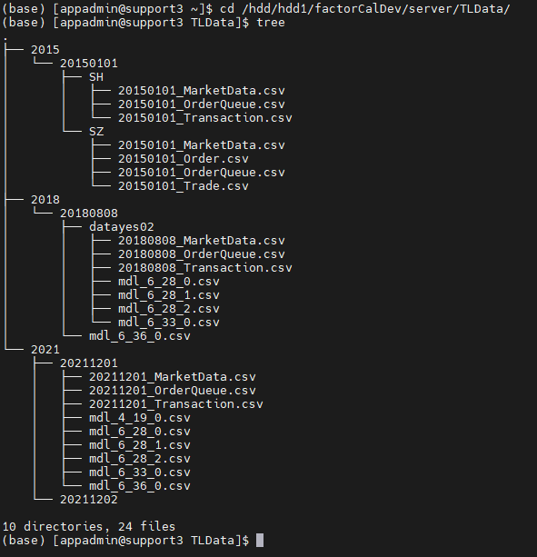
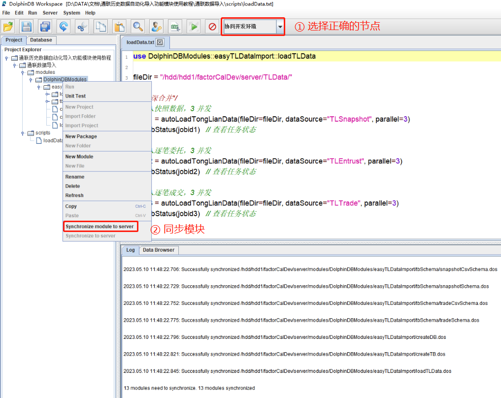
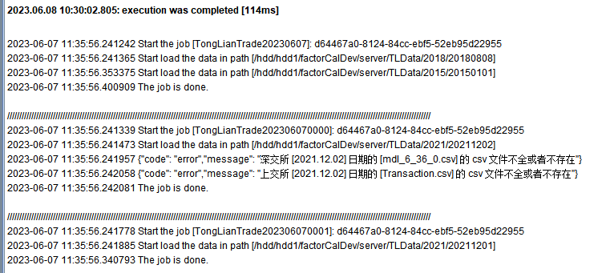
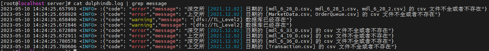
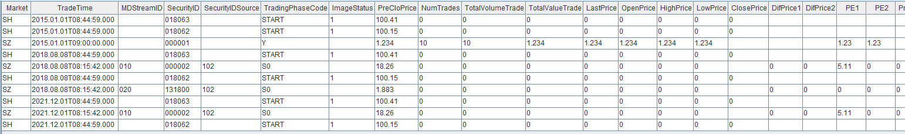
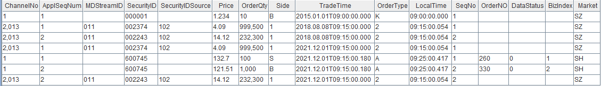
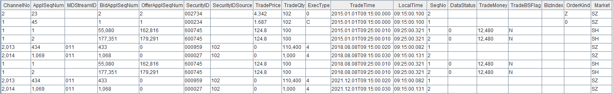

# DolphinDBModules::easyTLDataImport 通联历史数据自动化导入功能模块使用教程

在部署完 DolphinDB 后，需要将历史数据批量导入数据库，再进行数据查询、计算和分析等操作。为便于用户快速导入通联历史 Level-2 行情数据，DolphinDB 开发了 `DolphinDBModules::easyTLDataImport` 模块（简称 `easyTLDataImport` 模块），主要用于通联历史 Level-2 行情数据的自动化导入，目前已支持的数据源包括：

- 沪深 Level-2 快照行情
- 沪深逐笔委托
- 沪深逐笔成交

**注意**：本教程代码基于 DolphinDB 2.00.9.4 开发，建议用户使用 2.00.9.4 及以上版本进行功能测试。

本教程包含内容：
- [1. 历史数据文件结构](#1-历史数据文件结构)
- [2. 行情数据存储模型设计](#2-行情数据存储模型设计)
  - [2.1 Level-2 快照数据](#21-level-2-快照数据)
  - [2.2 逐笔委托数据](#22-逐笔委托数据)
  - [2.3 逐笔成交数据](#23-逐笔成交数据)
  - [2.4 去重方案](#24-去重方案)
- [3. 模块介绍](#3-模块介绍)
  - [3.1 数据表结构](#31-数据表结构)
  - [3.2 数据库和分区表创建](#32-数据库和分区表创建)
  - [3.3 数据导入](#33-数据导入)
- [4. 异常处理](#4-异常处理)
- [5. 使用示例](#5-使用示例)
- [6. 注意事项](#6-注意事项)
  - [6.1 数据文件路径 *fileDir* 的设置](#61-数据文件路径-filedir-的设置)
  - [6.2 最低资源配置（并行度 parallel 的设置）](#62-最低资源配置并行度-parallel-的设置)
- [7. 性能测试](#7-性能测试)
  - [7.1 测试环境](#71-测试环境)
  - [7.2 性能结果](#72-性能结果)
  - [7.3 吞吐量提升建议](#73-吞吐量提升建议)
- [附录](#附录)


## 1. 历史数据文件结构

在使用本教程功能模块时，需要用户自行将通联数据解压，并确保在主目录下创建了以日期命名的日期目录，每个日期目录下包含所有该日期的 csv 文件。

例如，主目录是 level2，则文件结构可以设置如下：

```
|—— level2

|      |—— 20211201

|      |      |—— xxx.csv

|      |      |—— …

|      |—— 20211202

|      |      |—— xxx.csv

|      |      |—— …

|      |—— …

数据也可以按年组织，则文件结构如下

|—— level2

|      |—— 2021

|      |      |—— 20211201

|      |      |      |—— xxx.csv

|      |      |      |—— …

|      |      |—— …

|      |—— 2022

|      |      |—— 20221201

|      |      |      |—— xxx.csv

|      |      |      |—— …

|      |      |—— …

|      |—— …
```

**注意**：日期这一层目录之前的文件结构和日期目录下的文件结构都没有要求。

## 2. 行情数据存储模型设计

通联数据提供了上交所和深交所两个交易所的数据。用户使用 `easyTLDataImport` 模块时可以选择将两个交易所的数据分开存储为两张表，或合并存为一张表。如果选择存为一张表，则表中的字段是两个交易所数据字段的并集，并新增字段 *Market* 用于标识数据来自哪个交易所。

上交所和深交所两个交易所数据的结构不同，且不同时期同一个交易所的数据结构也不同。根据《沪深 L2 高频行情文件说明》，我们整理了通联提供的两个交易所各个时期的数据结构，最终确定以下述的表结构将数据存入数据库。

### 2.1 Level-2 快照数据

- 深交所数据（总共 37 列）

| **字段含义**               | **入库字段名**     | **入库数据类型** | **2010.05 - 2016.05.06<br/>（MarketData.csv）** | **2016.05.07 - 2019.06.04<br/>（mdl_6_28_0.csv）** | 2019.06.05 - 至今<br/>（mdl_6_28_0.csv） |
| :------------------------- | :----------------- | :--------------- | :---------------------------------------------- | :------------------------------------------------- | :--------------------------------------- |
| 数据生成时间               | TradeTime          | TIMESTAMP        | DataTimeStamp                                   | UpdateTime                                         | UpdateTime                               |
| 行情类别                   | MDStreamID         | SYMBOL           |                                                 | MDStreamID                                         | MDStreamID                               |
| 证券代码                   | SecurityID         | SYMBOL           | SecurityID                                      | SecurityID                                         | SecurityID                               |
| 证券代码源                 | SecurityIDSource   | SYMBOL           |                                                 | SecurityIDSource                                   | SecurityIDSource                         |
| 交易阶段                   | TradingPhaseCode   | SYMBOL           | EndOfDayMaker                                   | TradingPhaseCode                                   | TradingPhaseCode                         |
| 昨日收盘价                 | PreCloPrice        | DOUBLE           | PreClosePx                                      | PreCloPrice                                        | PreCloPrice                              |
| 成交笔数                   | NumTrades          | INT              | NumTrades                                       | TurnNum                                            | TurnNum                                  |
| 成交总量                   | TotalVolumeTrade   | INT              | TotalVolumeTrade                                | Volume                                             | Volume                                   |
| 成交总金额                 | TotalValueTrade    | DOUBLE           | TotalValueTrade                                 | Turnover                                           | Turnover                                 |
| 最近价                     | LastPrice          | DOUBLE           | LastPx                                          | LastPrice                                          | LastPrice                                |
| 开盘价                     | OpenPrice          | DOUBLE           | OpenPx                                          | OpenPrice                                          | OpenPrice                                |
| 最高价                     | HighPrice          | DOUBLE           | HighPx                                          | HighPrice                                          | HighPrice                                |
| 最低价                     | LowPrice           | DOUBLE           | LowPx                                           | LowPrice                                           | LowPrice                                 |
| 升跌1（最新价-昨收价）     | DifPrice1          | DOUBLE           |                                                 | DifPrice1                                          | DifPrice1                                |
| 升跌2（最新价-上一最新价） | DifPrice2          | DOUBLE           |                                                 | DifPrice2                                          | DifPrice2                                |
| 股票市盈率1                | PE1                | DOUBLE           | PERatio1                                        | PE1                                                | PE1                                      |
| 股票市盈率2                | PE2                | DOUBLE           | PERatio2                                        | PE2                                                | PE2                                      |
| 基金T-1净值                | PreCloseIOPV       | DOUBLE           |                                                 | PreCloseIOPV                                       | PreCloseIOPV                             |
| 基金实时参考净值           | IOPV               | DOUBLE           |                                                 | IOPV                                               | IOPV                                     |
| 委托买入总量               | TotalBidQty        | INT              | TotalBidQty                                     | TotalBidQty                                        | TotalBidQty                              |
| 加权平均买入价格           | WeightedAvgBidPx   | DOUBLE           | WeightedAvgBidPx                                | WeightedAvgBidPx                                   | WeightedAvgBidPx                         |
| 委托卖出总量               | TotalOfferQty      | INT              | TotalOfferQty                                   | TotalOfferQty                                      | TotalOfferQty                            |
| 加权平均卖出价格           | WeightedAvgOfferPx | DOUBLE           | WeightedAvgOfferPx                              | WeightedAvgOfferPx                                 | WeightedAvgOfferPx                       |
| 涨停价                     | UpLimitPx          | DOUBLE           |                                                 | HighLimitPrice                                     | HighLimitPrice                           |
| 跌停价                     | DownLimitPx        | DOUBLE           |                                                 | LowLimitPrice                                      | LowLimitPrice                            |
| 持仓量                     | OpenInt            | INT              | TotalLongPosition                               | OpenInt                                            | OpenInt                                  |
| 权证溢价率                 | OptPremiumRatio    | DOUBLE           |                                                 | OptPremiumRatio                                    | OptPremiumRatio                          |
| 卖价10档                   | OfferPrice         | DOUBLE[]         | AskPrice1..AskPrice10                           | AskPrice1..AskPrice10                              | AskPrice1..AskPrice10                    |
| 买价10档                   | BidPrice           | DOUBLE[]         | BidPrice1..BidPrice10                           | BidPrice1..BidPrice10                              | BidPrice1..BidPrice10                    |
| 卖量10档                   | OfferOrderQty      | INT[]            | AskVolume1..AskVolume10                         | AskVolume1..AskVolume10                            | AskVolume1..AskVolume10                  |
| 买量10档                   | BidOrderQty        | INT[]            | BidVolume1..BidVolume10                         | BidVolume1..BidVolume10                            | BidVolume1..BidVolume10                  |
| 申买10档委托笔数           | BidNumOrders       | INT[]            |                                                 |                                                    | NumOrdersB1..NumOrdersB10                |
| 申卖10档委托笔数           | OfferNumOrders     | INT[]            |                                                 |                                                    | NumOrdersS1..NumOrdersS10                |
| 入库时间                   | LocalTime          | TIME             | LocalTime                                       | LocalTime                                          | LocalTime                                |
| 消息序列号                 | SeqNo              | INT              | SeqNo                                           | SeqNo                                              | SeqNo                                    |
| 委托卖量50档               | OfferOrders        | INT[]            | OrderQty1..OrderQty50 (OrderQueue.csv)          | OrderQty1..OrderQty50 (mdl_6_28_1.csv)             | OrderQty1..OrderQty50 (mdl_6_28_1.csv)   |
| 委托买量50档               | BidOrders          | INT[]            | OrderQty1..OrderQty50 (OrderQueue.csv)          | OrderQty1..OrderQty50 (mdl_6_28_2.csv)             | OrderQty1..OrderQty50 (mdl_6_28_2.csv)   |

- 上交所数据（总共 52 列）

| **字段含义**             | **入库字段名**     | **入库数据类型** | **2019.06.05 以前<br/>（MarketData.csv）** | **2019.06.06 - 至今<br/>（MarketData.csv）** |
| :----------------------- | :----------------- | :--------------- | :----------------------------------------- | :------------------------------------------- |
| 数据生成时间             | TradeTime          | TIMESTAMP        | UpdateTime                                 | UpdateTime                                   |
| 证券代码                 | SecurityID         | SYMBOL           | SecurityID                                 | SecurityID                                   |
| 快照类型(全量/更新)      | ImageStatus        | INT              | ImageStatus                                | ImageStatus                                  |
| 昨日收盘价               | PreCloPrice        | DOUBLE           | PreCloPrice                                | PreCloPrice                                  |
| 开盘价                   | OpenPrice          | DOUBLE           | OpenPrice                                  | OpenPrice                                    |
| 最高价                   | HighPrice          | DOUBLE           | HighPrice                                  | HighPrice                                    |
| 最低价                   | LowPrice           | DOUBLE           | LowPrice                                   | LowPrice                                     |
| 最近价                   | LastPrice          | DOUBLE           | LastPrice                                  | LastPrice                                    |
| 今收盘价                 | ClosePrice         | DOUBLE           | ClosePrice                                 | ClosePrice                                   |
| 交易阶段                 | TradingPhaseCode   | SYMBOL           | InstruStatus                               | InstruStatus                                 |
| 成交笔数                 | NumTrades          | INT              | TradNumber                                 | TradNumber                                   |
| 成交总量                 | TotalVolumeTrade   | INT              | TradVolume                                 | TradVolume                                   |
| 成交总金额               | TotalValueTrade    | DOUBLE           | Turnover                                   | Turnover                                     |
| 委托买入总量             | TotalBidQty        | INT              | TotalBidVo                                 | TotalBidVo                                   |
| 加权平均买入价格         | WeightedAvgBidPx   | DOUBLE           | WAvgBidPri                                 | WAvgBidPri                                   |
| 债券加权平均委买价格     | AltWAvgBidPri      | DOUBLE           | AltWAvgBidPri                              | AltWAvgBidPri                                |
| 委托卖出总量             | TotalOfferQty      | INT              | TotalAskVol                                | TotalAskVol                                  |
| 加权平均卖出价格         | WeightedAvgOfferPx | DOUBLE           | WAvgAskPri                                 | WAvgAskPri                                   |
| 债券加权平均委卖价格     | AltWAvgAskPri      | DOUBLE           | AltWAvgAskPri                              | AltWAvgAskPri                                |
| ETF申购笔数              | ETFBuyNumber       | INT              | ETFBuyNumber                               | ETFBuyNumber                                 |
| ETF申购数量              | ETFBuyAmount       | INT              | EtfBuyVolume                               | EtfBuyVolume                                 |
| ETF申购金额              | ETFBuyMoney        | DOUBLE           | ETFBuyMoney                                | ETFBuyMoney                                  |
| ETF赎回笔数              | ETFSellNumber      | INT              | ETFSellNumber                              | ETFSellNumber                                |
| ETF赎回数量              | ETFSellAmount      | INT              | ETFSellVolume                              | ETFSellVolume                                |
| ETF赎回金额              | ETFSellMoney       | DOUBLE           | ETFSellMoney                               | ETFSellMoney                                 |
| 债券到期收益率           | YieldToMatu        | DOUBLE           | YieldToMatu                                | YieldToMatu                                  |
| 权证执行的总数量         | TotWarExNum        | DOUBLE           | TotWarExNum                                | TotWarExNum                                  |
| 涨停价                   | UpLimitPx          | DOUBLE           | WarUpperPri                                | WarUpperPri                                  |
| 跌停价                   | DownLimitPx        | DOUBLE           | WarLowerPri                                | WarLowerPri                                  |
| 买入撤单笔数             | WithdrawBuyNumber  | INT              | WiDBuyNum                                  | WiDBuyNum                                    |
| 买入撤单数量             | WithdrawBuyAmount  | INT              | WiDBuyVo                                   | WiDBuyVo                                     |
| 买入撤单金额             | WithdrawBuyMoney   | DOUBLE           | WiDBuyMon                                  | WiDBuyMon                                    |
| 卖出撤单笔数             | WithdrawSellNumber | INT              | WiDSellNum                                 | WiDSellNum                                   |
| 卖出撤单数量             | WithdrawSellAmount | INT              | WiDSellVol                                 | WiDSellVol                                   |
| 卖出撤单金额             | WithdrawSellMoney  | DOUBLE           | WiDSellMon                                 | WiDSellMon                                   |
| 买入总笔数               | TotalBidNumber     | INT              | TotBidNum                                  | TotBidNum                                    |
| 卖出总笔数               | TotalOfferNumber   | INT              | TotSellNum                                 | TotSellNum                                   |
| 买入委托成交最大等待时间 | MaxBidDur          | INT              | MaxBidDur                                  | MaxBidDur                                    |
| 卖出委托最大等待时间     | MaxSellDur         | INT              | MaxSellDur                                 | MaxSellDur                                   |
| 买方委托价位数           | BidNum             | INT              | BidNum                                     | BidNum                                       |
| 卖方委托价位数           | SellNum            | INT              | SellNum                                    | SellNum                                      |
| 基金实时参考净值         | IOPV               | DOUBLE           | IOPV                                       | IOPV                                         |
| 卖价10档                 | OfferPrice         | DOUBLE[]         | AskPrice1..AskPrice10                      | AskPrice1..AskPrice10                        |
| 买价10档                 | BidPrice           | DOUBLE[]         | BidPrice1..BidPrice10                      | BidPrice1..BidPrice10                        |
| 卖量10档                 | OfferOrderQty      | INT[]            | AskVolume1..AskVolume10                    | AskVolume1..AskVolume10                      |
| 买量10档                 | BidOrderQty        | INT[]            | BidVolume1..BidVolume10                    | BidVolume1..BidVolume10                      |
| 申买10档委托笔数         | BidNumOrders       | INT[]            |                                            | NumOrdersB1..NumOrdersB10                    |
| 申卖10档委托笔数         | OfferNumOrders     | INT[]            |                                            | NumOrdersS1..NumOrdersS10                    |
| 入库时间                 | LocalTime          | TIME             | LocalTime                                  | LocalTime                                    |
| 消息序列号               | SeqNo              | INT              | SeqNo                                      | SeqNo                                        |
| 委托卖量50档             | OfferOrders        | INT[]            | OrderQty1..OrderQty50 (OrderQueue.csv)     | OrderQty1..OrderQty50 (OrderQueue.csv)       |
| 委托买量50档             | BidOrders          | INT[]            | OrderQty1..OrderQty50 (OrderQueue.csv)     | OrderQty1..OrderQty50 (OrderQueue.csv)       |

- 沪深数据合并（总共 62 列）

| 字段含义                   | 入库字段名         | 入库数据类型 | 深交所 2010.05 - 2016.05.06<br/>（MarketData.csv） | 深交所 2016.05.07 - 2019.06.04<br/>（mdl_6_28_0.csv） | 深交所 2019.06.05 - 至今<br/>（mdl_6_28_0.csv） | 上交所 2019.06.05 以前<br/>（MarketData.csv） | 上交所 2019.06.06 - 至今<br/>（MarketData.csv） |
| -------------------------- | ------------------ | ------------ | -------------------------------------------------- | ----------------------------------------------------- | ----------------------------------------------- | --------------------------------------------- | ----------------------------------------------- |
| 交易所名称                 | Market             | SYMBOL       | “SZ“                                               | “SZ“                                                  | “SZ“                                            | “SH“                                          | “SH“                                            |
| 数据生成时间               | TradeTime          | TIMESTAMP    | DataTimeStamp                                      | UpdateTime                                            | UpdateTime                                      | UpdateTime                                    | UpdateTime                                      |
| 行情类别                   | MDStreamID         | SYMBOL       |                                                    | MDStreamID                                            | MDStreamID                                      |                                               |                                                 |
| 证券代码                   | SecurityID         | SYMBOL       | SecurityID                                         | SecurityID                                            | SecurityID                                      | SecurityID                                    | SecurityID                                      |
| 证券代码源                 | SecurityIDSource   | SYMBOL       |                                                    | SecurityIDSource                                      | SecurityIDSource                                |                                               |                                                 |
| 交易阶段                   | TradingPhaseCode   | SYMBOL       | EndOfDayMaker                                      | TradingPhaseCode                                      | TradingPhaseCode                                | InstruStatus                                  | InstruStatus                                    |
| 快照类型(全量/更新)        | ImageStatus        | INT          |                                                    |                                                       |                                                 | ImageStatus                                   | ImageStatus                                     |
| 昨日收盘价                 | PreCloPrice        | DOUBLE       | PreClosePx                                         | PreCloPrice                                           | PreCloPrice                                     | PreCloPrice                                   | PreCloPrice                                     |
| 成交笔数                   | NumTrades          | INT          | NumTrades                                          | TurnNum                                               | TurnNum                                         | TradNumber                                    | TradNumber                                      |
| 成交总量                   | TotalVolumeTrade   | INT          | TotalVolumeTrade                                   | Volume                                                | Volume                                          | TradVolume                                    | TradVolume                                      |
| 成交总金额                 | TotalValueTrade    | DOUBLE       | TotalValueTrade                                    | Turnover                                              | Turnover                                        | Turnover                                      | Turnover                                        |
| 最近价                     | LastPrice          | DOUBLE       | LastPx                                             | LastPrice                                             | LastPrice                                       | LastPrice                                     | LastPrice                                       |
| 开盘价                     | OpenPrice          | DOUBLE       | OpenPx                                             | OpenPrice                                             | OpenPrice                                       | OpenPrice                                     | OpenPrice                                       |
| 最高价                     | HighPrice          | DOUBLE       | HighPx                                             | HighPrice                                             | HighPrice                                       | HighPrice                                     | HighPrice                                       |
| 最低价                     | LowPrice           | DOUBLE       | LowPx                                              | LowPrice                                              | LowPrice                                        | LowPrice                                      | LowPrice                                        |
| 今收盘价                   | ClosePrice         | DOUBLE       |                                                    |                                                       |                                                 | ClosePrice                                    | ClosePrice                                      |
| 升跌1（最新价-昨收价）     | DifPrice1          | DOUBLE       |                                                    | DifPrice1                                             | DifPrice1                                       |                                               |                                                 |
| 升跌2（最新价-上一最新价） | DifPrice2          | DOUBLE       |                                                    | DifPrice2                                             | DifPrice2                                       |                                               |                                                 |
| 股票市盈率1                | PE1                | DOUBLE       | PERatio1                                           | PE1                                                   | PE1                                             |                                               |                                                 |
| 股票市盈率2                | PE2                | DOUBLE       | PERatio2                                           | PE2                                                   | PE2                                             |                                               |                                                 |
| 基金T-1净值                | PreCloseIOPV       | DOUBLE       |                                                    | PreCloseIOPV                                          | PreCloseIOPV                                    |                                               |                                                 |
| 基金实时参考净值           | IOPV               | DOUBLE       |                                                    | IOPV                                                  | IOPV                                            | IOPV                                          | IOPV                                            |
| 委托买入总量               | TotalBidQty        | INT          | TotalBidQty                                        | TotalBidQty                                           | TotalBidQty                                     | TotalBidVo                                    | TotalBidVo                                      |
| 加权平均买入价格           | WeightedAvgBidPx   | DOUBLE       | WeightedAvgBidPx                                   | WeightedAvgBidPx                                      | WeightedAvgBidPx                                | WAvgBidPri                                    | WAvgBidPri                                      |
| 债券加权平均委买价格       | AltWAvgBidPri      | DOUBLE       |                                                    |                                                       |                                                 | AltWAvgBidPri                                 | AltWAvgBidPri                                   |
| 委托卖出总量               | TotalOfferQty      | INT          | TotalOfferQty                                      | TotalOfferQty                                         | TotalOfferQty                                   | TotalAskVol                                   | TotalAskVol                                     |
| 加权平均卖出价格           | WeightedAvgOfferPx | DOUBLE       | WeightedAvgOfferPx                                 | WeightedAvgOfferPx                                    | WeightedAvgOfferPx                              | WAvgAskPri                                    | WAvgAskPri                                      |
| 债券加权平均委卖价格       | AltWAvgAskPri      | DOUBLE       |                                                    |                                                       |                                                 | AltWAvgAskPri                                 | AltWAvgAskPri                                   |
| 涨停价                     | UpLimitPx          | DOUBLE       |                                                    | HighLimitPrice                                        | HighLimitPrice                                  | WarUpperPri                                   | WarUpperPri                                     |
| 跌停价                     | DownLimitPx        | DOUBLE       |                                                    | LowLimitPrice                                         | LowLimitPrice                                   | WarLowerPri                                   | WarLowerPri                                     |
| 持仓量                     | OpenInt            | INT          | TotalLongPosition                                  | OpenInt                                               | OpenInt                                         |                                               |                                                 |
| 权证溢价率                 | OptPremiumRatio    | DOUBLE       |                                                    | OptPremiumRatio                                       | OptPremiumRatio                                 |                                               |                                                 |
| 卖价10档                   | OfferPrice         | DOUBLE[]     | AskPrice1..AskPrice10                              | AskPrice1..AskPrice10                                 | AskPrice1..AskPrice10                           | AskPrice1..AskPrice10                         | AskPrice1..AskPrice10                           |
| 买价10档                   | BidPrice           | DOUBLE[]     | BidPrice1..BidPrice10                              | BidPrice1..BidPrice10                                 | BidPrice1..BidPrice10                           | BidPrice1..BidPrice10                         | BidPrice1..BidPrice10                           |
| 卖量10档                   | OfferOrderQty      | INT[]        | AskVolume1..AskVolume10                            | AskVolume1..AskVolume10                               | AskVolume1..AskVolume10                         | AskVolume1..AskVolume10                       | AskVolume1..AskVolume10                         |
| 买量10档                   | BidOrderQty        | INT[]        | BidVolume1..BidVolume10                            | BidVolume1..BidVolume10                               | BidVolume1..BidVolume10                         | BidVolume1..BidVolume10                       | BidVolume1..BidVolume10                         |
| 申买10档委托笔数           | BidNumOrders       | INT[]        |                                                    |                                                       | NumOrdersB1..NumOrdersB10                       |                                               | NumOrdersB1..NumOrdersB10                       |
| 申卖10档委托笔数           | OfferNumOrders     | INT[]        |                                                    |                                                       | NumOrdersS1..NumOrdersS10                       |                                               | NumOrdersS1..NumOrdersS10                       |
| ETF申购笔数                | ETFBuyNumber       | INT          |                                                    |                                                       |                                                 | ETFBuyNumber                                  | ETFBuyNumber                                    |
| ETF申购数量                | ETFBuyAmount       | INT          |                                                    |                                                       |                                                 | EtfBuyVolume                                  | EtfBuyVolume                                    |
| ETF申购金额                | ETFBuyMoney        | DOUBLE       |                                                    |                                                       |                                                 | ETFBuyMoney                                   | ETFBuyMoney                                     |
| ETF赎回笔数                | ETFSellNumber      | INT          |                                                    |                                                       |                                                 | ETFSellNumber                                 | ETFSellNumber                                   |
| ETF赎回数量                | ETFSellAmount      | INT          |                                                    |                                                       |                                                 | ETFSellVolume                                 | ETFSellVolume                                   |
| ETF赎回金额                | ETFSellMoney       | DOUBLE       |                                                    |                                                       |                                                 | ETFSellMoney                                  | ETFSellMoney                                    |
| 债券到期收益率             | YieldToMatu        | DOUBLE       |                                                    |                                                       |                                                 | YieldToMatu                                   | YieldToMatu                                     |
| 权证执行的总数量           | TotWarExNum        | DOUBLE       |                                                    |                                                       |                                                 | TotWarExNum                                   | TotWarExNum                                     |
| 买入撤单笔数               | WithdrawBuyNumber  | INT          |                                                    |                                                       |                                                 | WiDBuyNum                                     | WiDBuyNum                                       |
| 买入撤单数量               | WithdrawBuyAmount  | INT          |                                                    |                                                       |                                                 | WiDBuyVo                                      | WiDBuyVo                                        |
| 买入撤单金额               | WithdrawBuyMoney   | DOUBLE       |                                                    |                                                       |                                                 | WiDBuyMon                                     | WiDBuyMon                                       |
| 卖出撤单笔数               | WithdrawSellNumber | INT          |                                                    |                                                       |                                                 | WiDSellNum                                    | WiDSellNum                                      |
| 卖出撤单数量               | WithdrawSellAmount | INT          |                                                    |                                                       |                                                 | WiDSellVol                                    | WiDSellVol                                      |
| 卖出撤单金额               | WithdrawSellMoney  | DOUBLE       |                                                    |                                                       |                                                 | WiDSellMon                                    | WiDSellMon                                      |
| 买入总笔数                 | TotalBidNumber     | INT          |                                                    |                                                       |                                                 | TotBidNum                                     | TotBidNum                                       |
| 卖出总笔数                 | TotalOfferNumber   | INT          |                                                    |                                                       |                                                 | TotSellNum                                    | TotSellNum                                      |
| 买入委托成交最大等待时间   | MaxBidDur          | INT          |                                                    |                                                       |                                                 | MaxBidDur                                     | MaxBidDur                                       |
| 卖出委托最大等待时间       | MaxSellDur         | INT          |                                                    |                                                       |                                                 | MaxSellDur                                    | MaxSellDur                                      |
| 买方委托价位数             | BidNum             | INT          |                                                    |                                                       |                                                 | BidNum                                        | BidNum                                          |
| 卖方委托价位数             | SellNum            | INT          |                                                    |                                                       |                                                 | SellNum                                       | SellNum                                         |
| 入库时间                   | LocalTime          | TIME         | LocalTime                                          | LocalTime                                             | LocalTime                                       | LocalTime                                     | LocalTime                                       |
| 消息序列号                 | SeqNo              | INT          | SeqNo                                              | SeqNo                                                 | SeqNo                                           | SeqNo                                         | SeqNo                                           |
| 委托卖量50档               | OfferOrders        | INT[]        | OrderQty1..OrderQty50 <br>(OrderQueue.csv)         | OrderQty1..OrderQty50 <br>(mdl_6_28_1.csv)            | OrderQty1..OrderQty50 <br>(mdl_6_28_1.csv)      | OrderQty1..OrderQty50 <br>(OrderQueue.csv)    | OrderQty1..OrderQty50 <br>(OrderQueue.csv)      |
| 委托买量50档               | BidOrders          | INT[]        | OrderQty1..OrderQty50 <br>(OrderQueue.csv)         | OrderQty1..OrderQty50 <br>(mdl_6_28_2.csv)            | OrderQty1..OrderQty50 <br>(mdl_6_28_2.csv)      | OrderQty1..OrderQty50 <br>(OrderQueue.csv)    | OrderQty1..OrderQty50 <br>(OrderQueue.csv)      |

### 2.2 逐笔委托数据

- 深交所数据（总共 12 列）

| 字段含义   | 入库字段名       | 入库数据类型 | 2012.10 - 2016.05.06<br>（Order.csv） | 2016.05.07 - 至今<br>（mdl_6_33_0.csv） |
| ---------- | ---------------- | ------------ | ------------------------------------- | --------------------------------------- |
| 频道代码   | ChannelNo        | INT          | SetNo                                 | ChannelNo                               |
| 委托索引   | ApplSeqNum       | LONG         | RecNo                                 | ApplSeqNum                              |
| 行情类别   | MDStreamID       | SYMBOL       |                                       | MDStreamID                              |
| 证券代码   | SecurityID       | SYMBOL       | SecurityID                            | SecurityID                              |
| 证券代码源 | SecurityIDSource | SYMBOL       |                                       | SecurityIDSource                        |
| 委托价格   | Price            | DOUBLE       | Price                                 | Price                                   |
| 委托数量   | OrderQty         | INT          | OrderQty                              | OrderQty                                |
| 买卖方向   | Side             | SYMBOL       | FunctionCode                          | Side                                    |
| 报价时间   | TradeTime        | TIMESTAMP    | OrderEntryTime                        | TransactTime                            |
| 委托类别   | OrderType        | SYMBOL       | OrderKind                             | OrdType                                 |
| 入库时间   | LocalTime        | TIME         | LocalTime                             | LocalTime                               |
| 接收序列号 | SeqNo            | LONG         | SeqNo                                 | SeqNo                                   |

- 上交所数据（总共 13 列）

| **字段含义** | **入库字段名** | **入库数据类型** | **2021.06.07 - 至今<br/>（mdl_4_19_0.csv）** |
| :----------- | :------------- | :--------------- | :------------------------------------------- |
| 数据状态     | DataStatus     | INT              | DataStatus                                   |
| 委托序号     | ApplSeqNum     | LONG             | OrderIndex                                   |
| 频道代码     | ChannelNo      | INT              | OrderChannel                                 |
| 证券代码     | SecurityID     | SYMBOL           | SecurityID                                   |
| 委托时间     | TradeTime      | TIMESTAMP        | OrderTime                                    |
| 订单类型     | OrderType      | SYMBOL           | OrderType                                    |
| 原始订单号   | OrderNO        | INT              | OrderNO                                      |
| 委托价格     | Price          | DOUBLE           | OrderPrice                                   |
| 委托数量     | OrderQty       | INT              | Balance                                      |
| 委托标识     | Side           | SYMBOL           | OrderBSFlag                                  |
| 业务序列号   | BizIndex       | LONG             | BizIndex                                     |
| 入库时间     | LocalTime      | TIME             | LocalTime                                    |
| 接收序列号   | SeqNo          | LONG             | SeqNo                                        |

- 沪深数据合并（总共 16 列）

| 字段含义   | 入库字段名       | 入库数据类型 | 深交所 2012.10 - 2016.05.06<br/>（Order.csv） | 深交所 2016.05.07 - 至今<br/>（mdl_6_33_0.csv） | 上交所 2021.06.07 - 至今<br/>（mdl_4_19_0.csv） |
| ---------- | ---------------- | ------------ | --------------------------------------------- | ----------------------------------------------- | ----------------------------------------------- |
| 频道代码   | ChannelNo        | INT          | SetNo                                         | ChannelNo                                       | OrderChannel                                    |
| 委托索引   | ApplSeqNum       | LONG         | RecNo                                         | ApplSeqNum                                      | OrderIndex                                      |
| 行情类别   | MDStreamID       | SYMBOL       |                                               | MDStreamID                                      |                                                 |
| 证券代码   | SecurityID       | SYMBOL       | SecurityID                                    | SecurityID                                      | SecurityID                                      |
| 证券代码源 | SecurityIDSource | SYMBOL       |                                               | SecurityIDSource                                |                                                 |
| 委托价格   | Price            | DOUBLE       | Price                                         | Price                                           | OrderPrice                                      |
| 委托数量   | OrderQty         | INT          | OrderQty                                      | OrderQty                                        | Balance                                         |
| 买卖方向   | Side             | SYMBOL       | FunctionCode                                  | Side                                            | OrderBSFlag                                     |
| 报价时间   | TradeTime        | TIMESTAMP    | OrderEntryTime                                | TransactTime                                    | OrderTime                                       |
| 委托类别   | OrderType        | SYMBOL       | OrderKind                                     | OrdType                                         | OrderType                                       |
| 入库时间   | LocalTime        | TIME         | LocalTime                                     | LocalTime                                       | LocalTime                                       |
| 接收序列号 | SeqNo            | LONG         | SeqNo                                         | SeqNo                                           | SeqNo                                           |
| 委托订单号 | OrderNO          | INT          |                                               |                                                 | OrderNO                                         |
| 数据状态   | DataStatus       | INT          |                                               |                                                 | DataStatus                                      |
| 业务序列号 | BizIndex         | LONG         |                                               |                                                 | BizIndex                                        |
| 交易所名称 | Market           | SYMBOL       | “SZ“                                          | “SZ“                                            | “SH“                                            |

### 2.3 逐笔成交数据

- 深交所数据（总共 14 列）

| **字段含义** | **入库字段名**   | **入库数据类型** | **2010.05 - 2016.05.06**<br/>**（Trade.csv）** | **2016.05.07 - 至今**<br/> **（mdl_6_36_0.csv）** |
| :----------- | :--------------- | :--------------- | :--------------------------------------------- | :------------------------------------------------ |
| 频道代码     | ChannelNo        | INT              | SetNo                                          | ChannelNo                                         |
| 消息记录号   | ApplSeqNum       | LONG             | RecNo                                          | ApplSeqNum                                        |
| 行情类别     | MDStreamID       | SYMBOL           |                                                | MDStreamID                                        |
| 买方委托索引 | BidApplSeqNum    | LONG             | BuyOrderRecNo                                  | BidApplSeqNum                                     |
| 卖方委托索引 | OfferApplSeqNum  | LONG             | SellOrderRecNo                                 | OfferApplSeqNum                                   |
| 证券代码     | SecurityID       | SYMBOL           | SecurityID                                     | SecurityID                                        |
| 证券代码源   | SecurityIDSource | SYMBOL           |                                                | SecurityIDSource                                  |
| 委托价格     | TradPrice        | DOUBLE           | Price                                          | LastPx                                            |
| 委托数量     | TradeQty         | DOUBLE           | TradeQty                                       | LastQty                                           |
| 成交代码     | ExecType         | SYMBOL           | FunctionCode                                   | ExecType                                          |
| 成交时间     | TradeTime        | TIMESTAMP        | TradeTime                                      | TransactTime                                      |
| 接收时间戳   | LocalTime        | TIME             | LocalTime                                      | LocalTime                                         |
| 接收序列号   | SeqNo            | LONG             | SeqNo                                          | SeqNo                                             |
| 成交类别     | OrderKind        | SYMBOL           | OrderKind                                      |                                                   |

- 上交所数据（总共 14 列）

| **字段含义** | **入库字段名**  | **入库数据类型** | **2021.04.25 以前<br/>（Transaction.csv）** | **2021.04.26 - 至今<br/>（Transaction.csv）** |
| :----------- | :-------------- | :--------------- | :------------------------------------------ | :-------------------------------------------- |
| 数据状态     | DataStatus      | INT              | DataStatus                                  | DataStatus                                    |
| 消息记录号   | ApplSeqNum      | LONG             | TradeIndex                                  | TradeIndex                                    |
| 频道代码     | ChannelNo       | INT              | TradeChan                                   | TradeChan                                     |
| 证券代码     | SecurityID      | SYMBOL           | SecurityID                                  | SecurityID                                    |
| 成交时间     | TradeTime       | TIMESTAMP        | TradTime                                    | TradTime                                      |
| 委托价格     | TradPrice       | DOUBLE           | TradPrice                                   | TradPrice                                     |
| 委托数量     | TradeQty        | DOUBLE           | TradVolume                                  | TradVolume                                    |
| 成交金额     | TradeMoney      | DOUBLE           | TradeMoney                                  | TradeMoney                                    |
| 买方委托索引 | BidApplSeqNum   | LONG             | TradeBuyNo                                  | TradeBuyNo                                    |
| 卖方委托索引 | OfferApplSeqNum | LONG             | TradeSellNo                                 | TradeSellNo                                   |
| 内外盘标志   | TradeBSFlag     | SYMBOL           | TradeBSFlag                                 | TradeBSFlag                                   |
| 业务序列号   | BizIndex        | LONG             |                                             | BizIndex                                      |
| 接收时间戳   | LocalTime       | TIME             | LocalTime                                   | LocalTime                                     |
| 接收序列号   | SeqNo           | LONG             | SeqNo                                       | SeqNo                                         |

- 沪深数据合并（总共 19 列）

| 字段含义     | 入库字段名       | 入库数据类型 | 深交所 2010.05 - 2016.05.06<br/>（Trade.csv） | 2016.05.07 - 至今<br/>（mdl_6_36_0.csv） | 上交所 2021.04.25 以前<br/>（Transaction.csv） | 2021.04.26 - 至今<br/>（Transaction.csv） |
| ------------ | ---------------- | ------------ | --------------------------------------------- | ---------------------------------------- | ---------------------------------------------- | ----------------------------------------- |
| 频道代码     | ChannelNo        | INT          | SetNo                                         | ChannelNo                                | TradeChan                                      | TradeChan                                 |
| 消息记录号   | ApplSeqNum       | LONG         | RecNo                                         | ApplSeqNum                               | TradeIndex                                     | TradeIndex                                |
| 行情类别     | MDStreamID       | SYMBOL       |                                               | MDStreamID                               |                                                |                                           |
| 买方委托索引 | BidApplSeqNum    | LONG         | BuyOrderRecNo                                 | BidApplSeqNum                            | TradeBuyNo                                     | TradeBuyNo                                |
| 卖方委托索引 | OfferApplSeqNum  | LONG         | SellOrderRecNo                                | OfferApplSeqNum                          | TradeSellNo                                    | TradeSellNo                               |
| 证券代码     | SecurityID       | SYMBOL       | SecurityID                                    | SecurityID                               | SecurityID                                     | SecurityID                                |
| 证券代码源   | SecurityIDSource | SYMBOL       |                                               | SecurityIDSource                         |                                                |                                           |
| 委托价格     | TradPrice        | DOUBLE       | Price                                         | LastPx                                   | TradPrice                                      | TradPrice                                 |
| 委托数量     | TradeQty         | DOUBLE       | TradeQty                                      | LastQty                                  | TradVolume                                     | TradVolume                                |
| 成交代码     | ExecType         | SYMBOL       | FunctionCode                                  | ExecType                                 |                                                |                                           |
| 成交时间     | TradeTime        | TIMESTAMP    | TradeTime                                     | TransactTime                             | TradTime                                       | TradTime                                  |
| 接收时间戳   | LocalTime        | TIME         | LocalTime                                     | LocalTime                                | LocalTime                                      | LocalTime                                 |
| 接收序列号   | SeqNo            | LONG         | SeqNo                                         | SeqNo                                    | SeqNo                                          | SeqNo                                     |
| 数据状态     | DataStatus       | INT          |                                               |                                          | DataStatus                                     | DataStatus                                |
| 成交金额     | TradeMoney       | DOUBLE       |                                               |                                          | TradeMoney                                     | TradeMoney                                |
| 内外盘标志   | TradeBSFlag      | SYMBOL       |                                               |                                          | TradeBSFlag                                    | TradeBSFlag                               |
| 业务序列号   | BizIndex         | LONG         |                                               |                                          |                                                | BizIndex                                  |
| 成交类别     | OrderKind        | SYMBOL       | OrderKind                                     |                                          |                                                |                                           |
| 交易所名称   | Market           | SYMBOL       | “SZ“                                          | “SZ“                                     | “SH“                                           | “SH“                                      |

### 2.4 去重方案

- 为避免重复提交任务或重复导入数据每次导入前，应将库内已有的对应日期的数据删除
- 为避免当天数据中存在重复，将当天市场所有数据（一个大 csv）读入内存，使用 `isDuplicated([...], LAST)` 函数进行去重后再导入数据库

| **数据源**       | **isDuplicated 去重字段**          |
| :--------------- | :--------------------------------- |
| Level-2 快照行情 | TradeTime, SecurityID, ImageStatus |
| 逐笔委托         | ChannelNo, ApplSeqNum              |
| 逐笔快照         | ChannelNo, ApplSeqNum              |

## 3. 模块介绍

`easyTLDataImport` 模块主要包含**数据表结构**、**数据库和分区表创建**和**数据导入**三部分。

### 3.1 数据表结构

*tbSchema* 文件夹下的模块是根据本文第二章节中的合并规则整理的数据结构。该文件夹包含以 *CsvSchema.dos* 和 *CsvSchema.dos* 结尾的两种模块文件，作用如下：

- *CsvSchema.dos* 用于指定 DolphinDB 读取 csv 文件时的数据格式
- *Schema.dos* 用于指定数据存入数据库的数据格式

### 3.2 数据库和分区表创建

数据库和分区表创建包括两个模块文件：*createDB.dos* 和 *createTB.dos*。

- *createDB.dos* 用于创建存储通联数据的数据库
- *createTB.dos* 用于创建存储通联数据的分布式表

基于客户的实践经验，确定了如下的分区方案：

| **沪深是否分开存储** | **分区方案**                                 | **分区列**              | **排序列**                  |
| :------------------- | :------------------------------------------- | :---------------------- | :-------------------------- |
| 沪深分开存储         | 时间维度按天分区 + 证券代码维度 HASH 25 分区 | TradeTime 和 SecurityID | SecurityID + TradeTime      |
| 沪深合并存储         | 时间维度按天分区 + 证券代码维度 HASH 50 分区 | TradeTime 和 SecurityID | Market+SecurityID+TradeTime |

### 3.3 数据导入

数据导入部分包含 *loadOneDayData* 文件夹和 *loadTLData.dos*，作用如下：

- *loadOneDayData* 包含了 *loadOneDaySnapshot.dos* 、*loadOneDayEntrust.dos*、*loadOneDayTrade.dos* 三个模块文件，分别用于导入通联一天的行情快照、逐笔委托和逐笔成交数据。
- *loadTLData.dos* 用于导入指定目录下的所有通联数据，是对前面所有模块的整合。**在应用层面，用户只需要了解该模块中的主要函数即可。**

下面列出 *loadTLData.dos* 模块中的主要函数。

#### 3.3.1 autoLoadTongLianData

**语法**

```
autoLoadTongLianData(fileDir, dataSource, dbName="dfs://TL_Level2", tableName=NULL, market="ALL", startDate=NULL, endDate=NULL, parallel=1, initialDB=false, initialTB=false)
```

**参数**

- `fileDir` 指定的存放数据的路径，该目录下必须有一层目录是形如 “20221201” 的日期。
- `dataSource` 数据源，只能 “TLSnapshot”, “TLEntrsut“, “TLTrade“ 三选一
- `dbName` 数据库名称，默认 ”dfs://TL_Level2“
- `tableName` 分布式表名称，如果用户没有额外指定表名，则默认表名 “snapshot“, “entrust“, “trade“
- `market` 交易所，目前只能 “ALL“, ”SZ“, ”SH“ 三选一。当 market=”ALL” 时，会将沪深的数据全部导入一张名为 tableName 的分布式表；否则，会以分开存储的形式创建名为 tableName+market 的一张分布表（比如 ”snapshotSZ“）并只导入 market 一个交易所的数据。
- `startDate` 字符串，导入数据的起始日期，比如 “20220101”(包括这一天)。若 startDate=NULL，则对起始日期不做判断。
- `endDate` 字符串，导入数据的结束日期，比如 “20221231”(包括这一天)。若 endDate=NULL，则对结束日期不做判断。
- `parallel` 并行度，控制后台提交的任务数目
- `initialDB` 一个布尔值，是否需要初始化数据库。如果已经存在名为 dbName 的数据库，当 initialDB=true 时，会删除原来的数据库并重新创建；否则会保留原来的数据库并输出 "[dbName] 数据库已经存在" 的提示
- `initialTB` 一个布尔值，是否需要初始化分布式表。如果在 dbName 数据库下已经存在名为 tbName 的表，当 initialTB=true 时，会删除原来的表并重新创建；否则会保留原来的表并输出 "数据库 [dbName] 已经存在表 [tbName]" 的提示。

**详情**

将 *fileDir* 路径下从 *startDate* 到 *endDate* 日期的 *dataSource* 数据导入 `dbName` 数据库中的 `tableName` 表里

#### 3.3.2 getJobStatus

**语法**

```
getJobStatus(jobid)
```

**参数**

`jobid` 后台任务描述

**详情**

查询后台任务中任务描述为 `jobid` 的任务状态

#### 3.3.3 getJobDetails

**语法**

```
getJobDetails(jobid)
```

**参数**

`jobid` 后台任务描述

**详情**

输出后台任务中任务描述为 `jobid` 的中间信息

## 4. 异常处理

对于导入过程中可能出现的问题，会在日志中输出对应的报错提示信息。

| 异常情况                                                     | 输出信息                                                     |
| ------------------------------------------------------------ | ------------------------------------------------------------ |
| 创建数据库时，名为 `dbName` 的数据库已经存在且 `initialDB=false` | {"code": "warning","message": "[dbName] 数据库已经存在"}     |
| 创建分布式表时，名为 `tableName` 的表已经存在且 `initialDB=false` | {"code": "warning","message": "数据库 [dbName] 已经存在表 [tableName]"} |
| 数据导入时，*fileDir* 目录下没有形如 “20221201” 的文件夹     | {"code": "warning","message": "[fileDir] 路径下没有找到指定日期的文件夹，请确认文件路径"} |
| 数据导入时，*dataSource* 不是 "TLSnapshot", "TLEntrust", "TLTrade" 三者之一 | {"code": "error","message": "数据源 [dataSource] 暂时不支持"} |
| 数据导入时，*market* 不属于 “ALL“, ”SZ“, ”SH“                | {"code": "error","message": "市场 [market] 暂时不支持"}      |
| 数据导入时，*startDate* 和 *endDate* 不是 NULL 或者形如 “20220101” 的字符串 | {"code": "error","message": "开始日期 [startDate] 格式有误"}<br>{"code": "error","message": "结束日期 [endDate] 格式有误"} |
| 实际 csv 文件的数据列数和 *CsvSchema.dos* 模块里面预设的表结构的列数不一致 | {"code": "error","message": "[csvPath] 的数据格式有误，列数不匹配"} |
| 日期文件夹下，没有对应的 csv 文件                            | {"code": "error","message": "深交所 [day] 日期的 [csvNames] 的 csv 文件不全或者不存在"}<br>{"code": "error","message": "上交所 [day] 日期的 [csvNames] 的 csv 文件不全或者不存在"} |
| 其他错误【通过 try{}catch(ex){} 捕获异常】                   | {"code": "error","message": 输出报错信息 ex}                 |

## 5. 使用示例

- **第一步**：用户按照第 1 章文件结构中的要求解压并准备好数据。假设数据放在 */hdd/hdd1/factorCalDev/server/TLData/* 目录下，文件结构如下图：



- **第二步**：将模块同步到 DolphinDB 的 *sever/modules* 的目录下。



- **第三步**：载入模块和导入数据方法如下：

```
use DolphinDBModules::easyTLDataImport::loadTLData

// 登陆账户
login("admin", "123456")

// 设置文件目录
fileDir = "/hdd/hdd1/factorCalDev/server/TLData/"

/** 沪深合并*/
// 导入快照数据，单线程
jobid1 = autoLoadTongLianData(fileDir=fileDir, dataSource="TLSnapshot", parallel=1)
getJobStatus(jobid1)   // 查看任务状态

// 导入逐笔委托，3 并发
jobid2 = autoLoadTongLianData(fileDir=fileDir, dataSource="TLEntrust", parallel=3)
getJobStatus(jobid2)   // 查看任务状态

// 导入逐笔成交，3 并发
jobid3 = autoLoadTongLianData(fileDir=fileDir, dataSource="TLTrade", parallel=3)
getJobStatus(jobid3)   // 查看任务状态
```

- **第四步**：查询任务状态。

（1）使用 `getJobStatus(jobid)` 可以查询任务状态，当 endTime 有值的时候表示任务结束。例如：

```
getJobStatus(jobid3)
```


（2）使用 `getJobDetails(jobid)` 可以查询任务的中间信息。例如：

```
getJobDetails(jobid3)
```



（3）可以通过查询日志内容，查看任务执行结果。例如：

```
cat dolphindb.log | grep message
```



- **第五步**：查询数据。

（1）快照数据

```
select * from loadTable("dfs://TL_Level2", "snapshot") limit 10
```



（2）逐笔委托

```
select * from loadTable("dfs://TL_Level2", "entrust") limit 10
```



（3）逐笔成交

```
select * from loadTable("dfs://TL_Level2", "trade") limit 10
```



## 6. 注意事项

### 6.1 数据文件路径 *fileDir* 的设置

在模块中数据文件查找的方法如下：

- 从 *fileDir* 目录下递归查找所有由 8 位数字组成的文件夹（即形如 “20221201” 的日期）。
- 再将找到的所有日期和 *startDate、endDate* 进行字符串比较，从而达到导入数据日期筛选的目的。
- 最后在每个日期文件夹下，递归查找所有以 csv 结尾的文件，从而获取该日期下的所有 csv 文件的绝对路径。 

因为第一步是查找所有 8 位数字组成的文件夹，所以 `autoLoadTongLianDataTest` 函数的 *fileDir* 的路径下必须有一层目录是以形如 “20221201” 的日期命名。

所以如果用户想要导入一天的数据，需要通过 *startDate、endDate* 参数控制导入日期，而不是通过 *fileDir* 参数。

以上一章**第五步**图中的文件结构为例，假设只导入 2021.12.01 这一天的数据。不能如此设置导入日期：`fileDir = "/hdd/hdd1/factorCalDev/server/TLData/2021/20211201"`。否则会因为该目录下只有 csv 而找不到日期文件夹。

正确用法如下：

```
// 沪深分开存储：上交所, 导入快照数据，单线程，导入20211201 一天的数据
fileDir = "/hdd/hdd1/factorCalDev/server/TLData/"     // 或者 fileDir = "/hdd/hdd1/factorCalDev/server/TLData/2021/"
jobid1 = autoLoadTongLianData(fileDir=fileDir, dataSource="TLSnapshot", dbName="dfs://TL_SH_Level2", market="SH", startDate="20211201", endDate="20211201")
getJobStatus(jobid1)   // 查看任务状态
```

### 6.2 最低资源配置（并行度 parallel 的设置）

#### **6.2.1 快照行情导入资源使用情况**

通联数据的快照行情数据和最优买卖盘前 50 笔委托数据是两个分开的 csv 文件。为将二者结合，所以先将快照行情数据和最优买卖盘前 50 笔委托数据进行左连接后，再进行入库。

以沪深合并存储的方式导入深交所一天的快照数据为例，具体实现方案如下：

（1）将一天的单市场的快照行情数据和最优买卖盘前 50 笔委托数据的 csv 文件全部读入 DolphinDB 数据库中。此步骤中：

- 2023.02.16 的深交所快照数据 *mdl_6_28_0.csv* 共有 13,608,508 行 89 列，读入后占用内存约 7.1 GB；
- 最优卖价前 50 笔委托数据 *mdl_6_28_1.csv* 共有 13,608,508 行 62 列，读入后占用内存约 3.5 GB；
- 最优买价前 50 笔委托数据 *mdl_6_28_2.csv* 共有 13,611,993 行 62 列，读入后占用内存约 3.5 GB。

（2）将数据处理成沪深合并的表结构，包括将 10 档量价数据和 50 档委托数据合并组成 array vector，并将上交所有的字段但深交所没有的字段用空值 NULL 填充。此步骤中：

- array vector + 填充 NULL 值后的快照表总共 13,608,508 行 60 列，占用内存约 8.7 GB；
- 最优卖价前 50 笔委托总共 13,608,508 行 4 列，读入后占用内存约 2.8 GB；
- 最优买价前 50 笔委托总共 13,611,993 行 4 列，占用内存约 2.8 GB）

（3）根据 `TradeTime` / `SecurityID` / `ImageStatus` 三个字段对数据进行去重。此步骤中：

- 去重后的快照表总共 13,608,508 行 60 列，占用内存约 8.7 GB；
- 最优卖价前 50 笔委托总共 13,608,508 行 4 列，读入后占用内存约 2.8 GB；
- 最优卖价前 50 笔委托总共 13,611,993 行 4 列，占用内存约 2.8 GB）

（4）根据 `TradeTime` / `SecurityID `/ `ImageStatus` 三个字段将买卖的 50 档数据进行左连接。此步骤中：

- 连接后的买卖 50 档委托表总共 13,608,508 行 5 列，占用内存约 5.4 GB。
- 将数据根据股票代码 `SecurityID` 的哈希值分成 50 份，每一份分别和最优买卖盘前 50 笔委托数据进行左连接，将连接后的数据直接加入数据库。**该任务通过 ploop 实现并发执行**。此步骤中：
  - 根据 `hashBucket(SecurityID, 50)` 算出哈希值，在快照数据中取出对应哈希值的数据。比如哈希值为 40 的快照数据共 343,461 行 60 列，占用内存约 225 MB；
  - 最优买卖盘前 50 笔委托数据共 343,461 行 5 列，占用内存约 144 MB；
  - 左连接后结果表共 343,461 行 62 列，占用内存约 364 MB，直接向库内 append 这部分数据）

（5）深交所和上交所串行导入，先完成深交所一天数据的导入，再按上述流程导入上交所一天的快照数据。

**注意**：因为快照数据的导入需要读入整个 csv，再内存里并发进行 join 和写入操作，所以内存消耗较高。

**经测试，单并发导入快照数据占用内存资源约：53 GB**

#### **6.2.2 逐笔委托导入资源使用情况**

为了实现数据去重的目的，会将一个市场一天的逐笔委托数据全部读入内存，进行去重后，再进行入库。

以沪深合并存储的方式导入深交所一天的逐笔委托为例，具体实现方案如下：

（1）将一天的单市场的逐笔委托的 csv 文件全部读入 DolphinDB 数据库中。此步骤中：

- 2023.02.16 的深交所逐笔委托数据 *mdl_6_33_0.csv* 共有 99,798,969 行 12 列，读入后占用内存约 5.7 GB。

（2）将逐笔成交数据处理成沪深合并的表结构，包括将上交所有的字段但深交所没有的字段用空值 NULL 填充和根据 `ChannelNo` , `ApplSeqNum` 两个字段进行去重。此步骤中：

- 填充 NULL 值 + 去重后的逐笔委托表总共 99,798,969 行 16 列，占用内存约 13.1 GB。

（3）将处理完的深交所逐笔委托数据导入数据库。

- 深交所和上交所串行导入，先导完一天深交所，再按上述流程导入一天上交所快照数据。

模块中的数据库采用 TSDB 存储引擎，其写入策略是：

- 数据先写入 Cache Engine，在 Cache Engine 内进行分区。
- 按照 sortColumns 进行排序。
- 当写入的数据达到 TSDBCacheEngineSize 时，进行刷盘。此时：
  - 若有数据继续写入，系统会再分配一块内存来接收新数据；
  - 若不满足该条件， 超过十分钟会强制刷盘。

所以使用 TSDB 引擎导入大量数据的时候，使用 LevelFileIndexCache，TSDBCacheEngine，异步排序，后台的 flush 等环节都会造成内存使用的增加。

**注意**：为了能够按照 `ChannelNo` , `ApplSeqNum` 这两个字段对数据进行去重，需要读入整个 csv 读入内存，使用 TSDB 引擎持续导入大量数据。所以导入时内存消耗较高。

**经测试，单并发导入逐笔委托数据占用内存资源约：55 GB**

#### **6.2.3 逐笔成交导入资源使用情况**

为了实现数据去重的目的，会将一个市场一天的逐笔成交数据全部读入内存，进行去重后，再进行入库。

以沪深合并存储的方式导入深交所一天的逐笔成交为例，具体实现方案如下：

（1）将一天的单市场的逐笔成交的 csv 文件全部读入 DolphinDB 数据库中。此步骤中：

- 2023.02.16 的深交所逐笔成交数据 *mdl_6_36_0.csv* 共有 91,230,221 行 13 列，读入后占用内存约 6.4 GB。

（2）将逐笔成交数据处理成沪深合并的表结构，包括将上交所有的字段但深交所没有的字段用空值 NULL 填充和根据 `ChannelNo` , `ApplSeqNum` 两个字段进行去重。此步骤中：

- 填充 NULL 值 + 去重后的逐笔委托表总共 91,230,221 行 19 列，占用内存约 15.7 GB。

（3）将处理完的深交所逐笔委托数据导入数据库。

- 深交所和上交所串行导入，先导完一天深交所，再按上述流程导入一天上交所快照数据。

**注意**：为了能够按照 `ChannelNo` , `ApplSeqNum` 这两个字段对数据进行去重，需要读入整个 csv 读入内存，使用 TSDB 引擎持续导入大量数据。所以导入时内存消耗较高。

**经测试，单并发导入逐笔成交数据占用内存资源约：58 GB**

综上，控制并发的参数 parallel 需要根据实际的内存情况设置。**建议配置 maxMemSize 至少为 64 GB，**这超过了社区版 License 内存的限制，可以前往 DolphinDB 官网申请企业版试用授权许可。

## 7. 性能测试

### 7.1 测试环境

单节点 8 核 256 GB 的环境来测试导入性能，环境配置资源如下：

| 软硬件项       | 信息                                                         |
| -------------- | ------------------------------------------------------------ |
| OS（操作系统） | CentOS Linux 7 (Core)                                        |
| 内核           | 3.10.0-1160.el7.x86_64                                       |
| CPU            | Intel(R) Xeon(R) Gold 5220R CPU @ 2.20GHz                    |
| 内存           | 256 GB                                                       |
| 磁盘           | 2 块 SSD，3.84 TB 固态硬盘 SATA 读取密集型 6 Gbps 512 2.5 英寸 Flex Bay AG 硬盘 1 DWPD<br>单盘测试随机写<br>- 平均写入IO：266MB/s |

### 7.2 性能结果

只测试了通联数据沪深合并存储的导入性能：

| **数据源** | **数据量**    | **数据天数** | **耗时(min)** | **RPS(W/s)** | **吞吐量(MB/s)** | **原始 csv 大小(GB)** | **单副本磁盘占用大小(GB)** | **压缩比** | **并发数** | **最大内存占用(GB)** |
| :--------- | :------------ | :----------- | :------------ | :----------- | :--------------- | :-------------------- | :------------------------- | :--------- | :--------- | :------------------- |
| snapshot   | 475,469,670   | 20           | 49.63         | 15.97        | 153.86           | 447.40                | 37.41                      | 11.96      | 7          | 185                  |
| entrust    | 2,712,071,019 | 20           | 28.12         | 160.73       | 131.45           | 216.60                | 60.00                      | 3.61       | 7          | 240                  |
| trade      | 2,067,012,875 | 20           | 24.41         | 141.14       | 132.17           | 189.02                | 49.05                      | 3.85       | 7          | 253                  |

### 7.3 吞吐量提升建议

如需提高数据导入的吞吐量，可参考以下优化策略：

（1）通过设置参数 *parallel*，增加后台导入任务的数据，提高导入的并行度。注意环境内存资源的使用。

（2）使用读写性能更好的硬盘。

## 附录

1. 数据表结构

​	[snapshotCsvSchema.dos](../../../DolphinDBModules/blob/master/easyTLDataImport/tbSchema/snapshotCsvSchema.dos) 

​	[snapshotSchema.dos](../../../DolphinDBModules/blob/master/easyTLDataImport/tbSchema/snapshotSchema.dos) 

​	[entrustCsvSchema.dos](../../../DolphinDBModules/blob/master/easyTLDataImport/tbSchema/entrustCsvSchema.dos) 

​	[entrustSchema.dos](../../../DolphinDBModules/blob/master/easyTLDataImport/tbSchema/entrustSchema.dos) 

​	[tradeCsvSchema.dos](../../../DolphinDBModules/blob/master/easyTLDataImport/tbSchema/tradeCsvSchema.dos) 

​	[tradeSchema.dos](../../../DolphinDBModules/blob/master/easyTLDataImport/tbSchema/tradeSchema.dos) 

​	[orderQueueCsvSchema.dos](../../../DolphinDBModules/blob/master/easyTLDataImport/tbSchema/orderQueueCsvSchema.dos) 

2. 数据库和分区表创建

​	[createDB.dos](../../../DolphinDBModules/blob/master/easyTLDataImport/createDB.dos) 

​	[createTB.dos](../../../DolphinDBModules/blob/master/easyTLDataImport/createTB.dos) 

3. 数据导入

​	[loadOneDaySnapshot.dos](../../../DolphinDBModules/blob/master/easyTLDataImport/loadOneDayData/loadOneDaySnapshot.dos) 

​	[loadOneDayEntrust.dos](../../../DolphinDBModules/blob/master/easyTLDataImport/loadOneDayData/loadOneDayEntrust.dos) 

​	[loadOneDayTrade.dos](../../../DolphinDBModules/blob/master/easyTLDataImport/loadOneDayData/loadOneDayTrade.dos) 

​	[loadTLData.dos](../../../DolphinDBModules/blob/master/easyTLDataImport/loadTLData.dos) 