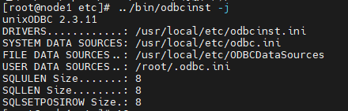
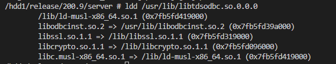
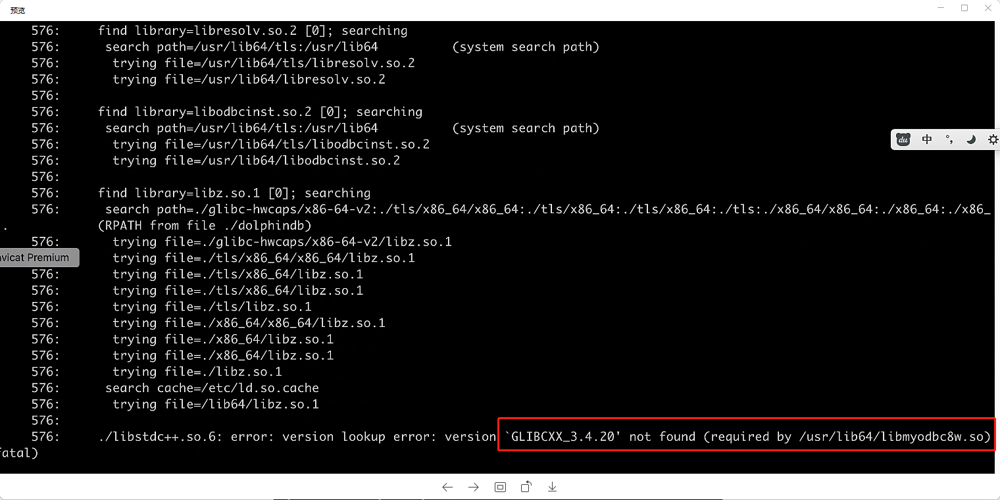
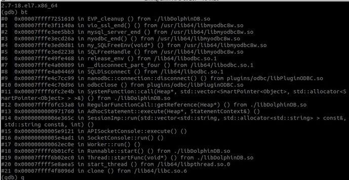

# ODBC插件使用指南
  - [1. ODBC 插件使用场景](#1-odbc-插件使用场景)
  - [2. ODBC 插件使用步骤](#2-odbc-插件使用步骤)
  - [3. ODBC 插件接口介绍](#3-odbc-插件接口介绍)
    - [3.1 odbc::connect(connStr, \[dataBaseType\])](#31-odbcconnectconnstr-databasetype)
    - [3.2 odbc::query(connHandle|connStr, querySql, \[t\], \[batchSize\], \[transform\])](#32-odbcqueryconnhandleconnstr-querysql-t-batchsize-transform)
    - [3.3 odbc::append(connHandle, tableData, tablename,\[createTableIfNotExist\], \[insertIgnore\])](#33-odbcappendconnhandle-tabledata-tablenamecreatetableifnotexist-insertignore)
    - [3.4 odbc::execute(connHandle or connStr, SQLstatements)](#34-odbcexecuteconnhandle-or-connstr-sqlstatements)
  - [4. odbc插件导入导出 Oracle 数据示例](#4-odbc插件导入导出-oracle-数据示例)
    - [4.1 下载 Oracle 的 ODBC 驱动并安装](#41-下载-oracle-的-odbc-驱动并安装)
    - [4.2 配置 ODBC 驱动文件](#42-配置-odbc-驱动文件)
    - [4.3 添加 DolphinDB 启动时的环境变量，并重启 DolphinDB 服务](#43-添加-dolphindb-启动时的环境变量并重启-dolphindb-服务)
    - [4.4 使用 ODBC 插件把表数据写到 Oracle、并查询返回到 DolphinDB 中。](#44-使用-odbc-插件把表数据写到-oracle并查询返回到-dolphindb-中)
  - [5. ODBC 插件使用注意事项和常见问题](#5-odbc-插件使用注意事项和常见问题)
    - [5.1 odbc::connect 失败时，可以先用 `isql` 命令先连接目标数据库进行排查](#51-odbcconnect-失败时可以先用-isql-命令先连接目标数据库进行排查)
    - [5.2 `isql` 命令连接正常，使用 `odbc::connect` 失败](#52-isql-命令连接正常使用-odbcconnect-失败)
    - [5.3 `odbc::append` 时报错](#53-odbcappend-时报错)
    - [5.4 `odbc::execute` 或者 `odbc::query` 失败](#54-odbcexecute-或者-odbcquery-失败)
    - [5.5 ODBC 驱动与 DolphinDB 冲突](#55-odbc-驱动与-dolphindb-冲突)
    - [5.6 中文字符乱码](#56-中文字符乱码)
    - [5.7 常见系统各数据库的ODBC 驱动推荐列表](#57-常见系统各数据库的odbc-驱动推荐列表)

## 1. ODBC 插件使用场景                            

在使用 DolphinDB 的业务场景中，我们有从其他数据源和 DolphinDB 之间同步数据的需求。比如从 Oracle 读数据写入到 DolphinDB，或者从 DolphinDB 写数据到 Oracle 数据库。 按照频率的不同，数据同步可以分为实时和离线同步两种。本文介绍如何使用 ODBC 插件解决离线同步的需求。

用户可以使用 DolphinDB ODBC 插件连接其它数据库服务，将其他数据库中的数据导入到 DolphinDB 数据库，或将 DolphinDB 内存表导出到其它数据库，也可以从 DolphinDB 分布式表中取出数据获得内存表，然后将该内存表导出到其他数据库中。在 DolphinDB 中使用 ODBC 插件查询和写入外部数据库的交互关系如下图所示：


 

## 2. ODBC 插件使用步骤

1.  使用 `loadPlugin` 函数加载 ODBC 插件。
2.  使用 `odbc::connect` 连接目标数据库。
3.  从其他数据库导入数据到 DolphinDB，可以使用 `odbc::query` 方法。
4. 从 DolphinDB 导入到其他数据库，可以使用 `odbc::append` 方法。

## 3. ODBC 插件接口介绍

有关 ODBC 插件使用的前置条件、编译方法、加载方式、类型支持等，参考 [ODBC 插件接口文档](https://dolphindb.net/dzhou/DolphinDBPlugin/-/blob/release200/odbc/README_CN.md) 。下面将介绍 ODBC 插件函数的基本功能以及一些注意事项。

### 3.1 odbc::connect(connStr, [dataBaseType]) 

创建与数据库服务器的连接，返回数据库连接句柄，该句柄将在以后用于访问数据库服务器。

参数 *connStr* 为 ODBC 连接字符串，针对不同数据库的 ODBC 连接，所填的配置参数会不一样，可以参考 [ODBC 连接字符串配置](https://www.connectionstrings.com/)。

同时，建议配置上 *dataBaseType* 参数，目前支持 MYSQL, ORACLE, SQLSERVRER, SQLITE, CLICKHOUSE, POSTGRESQL。因为使用 `ODBC::append` 是通过拼接 SQL 的 INSERT 语句来写入目标数据库，ODBC 插件可以通过 *dataBaseType* 这个参数来选择合适的时间类型格式字符串，不同数据库的时间类型的所支持的时间类型的格式是不一样的，没有配置这个参数可能会导致写入目标数据库失败。

### 3.2 odbc::query(connHandle|connStr, querySql, [t], [batchSize], [transform])

查询数据库并返回 DolphinDB 表。

如果需要写入到分布式表中，可以配置 *batchSize* 参数的大小来控制每次写入行数，可以通过配置 `transform` 函数来对查询过来的数据预处理，然后再写入到分布式表中。

### 3.3 odbc::append(connHandle, tableData, tablename,[createTableIfNotExist], [insertIgnore]) 

将 DolphinDB 的内存表的数据写入到目标数据库。

### 3.4 odbc::execute(connHandle or connStr, SQLstatements)

执行 SQL 语句。无返回结果。

## 4. odbc插件导入导出 Oracle 数据示例

下面将展示在 Linux 上部署 ODBC 插件，实现从 Oracle 导入数据到 DolphinDB ，并从 DolphinDB 导出数据到 Oracle 的完整过程。
### 4.1 下载 Oracle 的 ODBC 驱动并安装

```
wget https://download.oracle.com/otn_software/linux/instantclient/217000/instantclient-basic-linux.x64-21.7.0.0.0dbru.zip
wget https://download.oracle.com/otn_software/linux/instantclient/217000/instantclient-odbc-linux.x64-21.7.0.0.0dbru.zip
```
```
//安装解压
mkdir /usr/local/oracle          //存储oracle-client and oracle-odbc
mkdir /etc/oracle                //存储tnsnames.ora
unzip instantclient-basic-linux.x64-21.7.0.0.0dbru.zip -d /usr/local/oracle/
unzip instantclient-odbc-linux.x64-21.7.0.0.0dbru.zip -d /usr/local/oracle/
```

### 4.2 配置 ODBC 驱动文件
*odbcinst.ini* 文件用于设置 ODBC 的某个 Driver 要用到的 ODBC 驱动库的文件路径。
需要在 /etc/odbcinst.ini 增加 :

```
[ORAC21c]
Description     = Oracle ODBC driver for Oracle 21c
Driver          = /usr/local/oracle/instantclient_21_7/libsqora.so.21.1
```

*/etc/odbc.ini* 文件用于设置 ODBC 的某个 Dsn 所用到的 Driver 、账号信息、远程数据库地址以及所要使用的数据库等配置，更多配置项可参考 [ODBC 连接字符串配置](https://www.connectionstrings.com/)。其中的 Driver 配置项是在 */etc/odbcinst.ini* 文件中配置的。

在 */etc/odbc.ini* 添加：

```
[orac]
Description = odbc for oracle
Driver      = ORAC21c
UserID      = system
Password    = oracle
ServerName = ORAC
Database  = test
```

Oracle 的 ODBC 驱动需要额外在 */etc/oracle/tnsnames.ora* 文件中添加 Oracle 数据库的 IP、PORT 以及 SID 信息。其中 ORAC 配置项名是在 */etc/odbc.ini* 的*ServerName* 的值。
在 *etc/oracle/tnsnames.ora* 添加：

```
ORAC=
(DESCRIPTION =
  (ADDRESS_LIST =
    (ADDRESS = (PROTOCOL = TCP)(HOST = <oracle ip>)(PORT = 1521))
  )
  (CONNECT_DATA =
    (SID=ora21c)
  )
)
 
```

### 4.3 添加 DolphinDB 启动时的环境变量，并重启 DolphinDB 服务

如果是单节点模式，可以在 *startSingle.sh* 文件中添加如下环境变量，如果是集群模式，需要在 *startAgent.sh* 文件中添加。

```
export LD_LIBRARY_PATH=/usr/local/oracle/instantclient_21_7:$LD_LIBRARY_PATH
export TNS_ADMIN=/etc/oracle
// DolphinDB 默认字符编码是 utf8 编码。
// Oracle 的 ODBC 驱动需要 NLS_LANG 环境来识别客户端编码，需要设置环境变量 NLS_LANG 为 utf8 编码。
export NLS_LANG='AMERICAN_AMERICA.AL32UTF8'
#!/bin/sh
nohup ./dolphindb -console 0 > single.nohup 2>&1 &
```

**注意**：如果是集群模式，则需要启动运行代理节点的终端上先配置好环境变量，然后再启动节点。原因是 DolphinDB 数据节点的父进程是代理节点，会继承其的环境变量。对于使用自定义脚本运行的的 DolphinDB 服务，需要在对应的启动脚本里添加。

重启 DolphinDB 服务，可以执行 `stopAllNode.sh` 先关闭当前系统上的 DolphinDB 所有节点。然后执行 `startAgent.sh` 启动代理节点，然后在 DolphinDB 的集群管理网页启动数据节点。如果当前机器还配置了控制节点，需要再执行 `startController.sh` 启动控制节点。

### 4.4 使用 ODBC 插件把表数据写到 Oracle、并查询返回到 DolphinDB 中。

执行 DolphinDB 脚本加载插件

```
login("admin", "123456");
loadPlugin("plugins/odbc/PluginODBC.txt");
```

选择刚刚配置好的 Oracle ODBC 驱动，使用 `odbc::connect ` 连接 Oracle 数据库

```
conn=odbc::connect("Dsn=orac", `oracle);
odbc::execute(conn, "create database test");//创建测试数据库
```

准备写入数据，创建 DolphinDB 内存表，将数据写入到 Oracle 中 

```
colNames="col"+string(1..13)
colTypes=[BOOL,CHAR,SHORT,INT,LONG,DATE,DATETIME,TIMESTAMP,NANOTIMESTAMP,FLOAT,DOUBLE,SYMBOL,STRING]
t=table(1:0,colNames,colTypes)
insert into t values(true,'a',2h,2,22l,2012.12.06,2012.06.12 12:30:00,2012.06.12 12:30:00.008,2012.06.13 13:30:10.008007006,2.1f,2.1,"hello","world")
insert into t values(bool(),char(),short(),int(),long(),date(),datetime(),timestamp(),nanotimestamp(),float(),double(),string(),string())
odbc::append(conn,t,"ddbData",true)
```

**注意**：Oracle 不支持 time 类型，目前不支持 DolphinDB 的 TIME，MINUTE，SECOND，NANOTIME 类型写入到 Oracle。

从 Oracle 查询刚刚写入的数据

```
ret = odbc::query(conn,"select * from ddb_alldatatypes;")
```

## 5. ODBC 插件使用注意事项和常见问题

Linux 版本的 ODBC 插件是基于 unixODBC 开发的，可以使用 unixODBC 提供的基本工具 isql 来快速排查 ODBC 驱动问题。需要注意的是进行 `isql` 命令调试时，需要保证当前的 Linux 用户、运行的服务器和系统、环境变量和运行 DolphinDB 服务时是一致的。

在使用 ODBC 插件进行数据查询和写入遇到问题时，可以先确认当前是执行 `odbc::connect` 时报错还是在执行 `odbc::append` 时报错，来确认排查方法。

**注意**：1.30.20.7和2.00.8.11版本的 ODBC 插件全面支持了 MySQL，SQL Server，Oracle，ClickHouse，SQLite，PostsreSQL 数据库，修复了无法加载Oracle DSN的问题（见 [5.1.1](#5.1.1)）和 某些数据类型的读写错误等问题。建议使用这2个版本之后的 ODBC 插件。

### 5.1 odbc::connect 失败时，可以先用 `isql` 命令先连接目标数据库进行排查

unixODBC 安装方法:

```
//CentOS 系统
yum install unixODBC 
yum install unixODBC-devel.x86_64 
//ubuntu 系统
apt-get install unixodbc 
apt-get install unixodbc-dev
```

用 `isql` 命令进行连接时失败，常见原因是加载 odbc 驱动失败、目标数据库连接失败。

```
isql -v odbc_dsn         //odbc_dsn 替换为设定的dsn名字
isql -v MySQLDSN
isql -v -k "connect_str" //connect_str 换成连接字符串
isql -v -k "Driver=MySQL ODBC 8.0 Unicode Driver;Server=192.168.1.38;Port=3306;Uid=root;Pwd=123456;Database=Test"
```

如果 `isql` 命令无法连接目标数据库，可能原因如下：

#### 5.1.1 配置文件没有添加配置信息、连接字符串写错

常见报错是 `Data source name not found, and no default driver specified`。

1、需要在 */etc/odbc.ini* 和 */etc/odbcinst.ini* 中添加配置信息。

*Driver* 参数需要在 */etc/odbcinst.ini* 中配置。下面的 *Driver* 配置项为 `MySQL ODBC 8.0 Unicode Driver` 。

```
[MySQL ODBC 8.0 Unicode Driver]   
Driver=/usr/lib64/libmyodbc8w.so
UsageCount=1
```

*Dsn* 参数组需要在 */etc/odbc.ini* 中配置。下面的 *Dsn* 配置项组为 `MySQLDSN` ，该配置项组的 *Driver* 参数一定要在 *odbcinst.ini* 文件中找到。

```
[MySQLDSN] 
Driver=MySQL ODBC 8.0 Unicode Driver
SERVER=192.168.1.38
Uid=root
PWD=123456
DATABASE=Test
PORT=3306
```

2、连接字符串与 */etc/odbc.ini* 和 */etc/odbcinst.ini* 配置信息不一致。

- 如果使用 Driver 的连接字符串形式

```
isql -v -k "Driver=MySQL ODBC 8.0 Unicode Driver;Server=192.168.1.38;Port=3306;Uid=root;Pwd=123456;Database=Test"
```

如上需要检查 `MySQL ODBC 8.0 Unicode Driver` 配置项必须在 */etc/odbcinst.ini* 文件中存在。

- 如果使用 Dsn 的连接字符串形式

```
isql -v MySQLDSN
```

此时需要检查 MySQLDSN 配置项组必须要在 */etc/odbc.ini* 中存在，并且其 *Driver* 参数必须要在 */etc/odbc.ini* 文件中存在。

3、连接字符串不符合规范，可以参考 [ODBC 连接字符串配置](https://www.connectionstrings.com/) 进行配置。

#### 5.1.2 unixODBC 配置文件路径错误

如果 *odbcinst.ini* 和 *odbc.ini* 文件都已经配置好，还出现 `Data source name not found, and no default driver specified` 报错，基本是因为配置文件设置错误。

使用 `odbcinst -j` 命令查看，可以确定配置文件路径，如果是手动编译安装会出现上述问题。
但大部分情况下，配置文件都是 */etc/odbc.ini* 和 */etc/odbcinst.ini*，所以如果出现配置文件位置的问题，可以先备份下需要覆盖的文件，然后把所有地方的这2个配置文件统一成一份。



如果设置了上图 *SYSTEM DATA SOURCES* 路径下的配置文件没有生效，考虑修改 *USER DATA SOURCES* 路径下的配置文件。

#### 5.1.3 IP、PORT 等参数不对

1、数据库的目标端口无法访问。通常原因是目标数据库的端口不是所填端口、端口被目标数据库所在服务器的防火墙拦截、目标数据库的访问 IP 白名单没有包含客户端机器的 IP。

```
isql -v -k "Driver=MySQL ODBC 8.0 Unicode Driver;Server=192.168.1.38;Port=3305;Uid=root;Pwd=123456;Database=Test"
[S1000][unixODBC][MySQL][ODBC 8.0(w) Driver]Can't connect to MySQL server on '192.168.1.38' (111)
[ISQL]ERROR: Could not SQLDriverConnect
```

2、如果 `isql` 命令会卡顿很久最后也没连接上，大概率是网络配置问题或者是 DNS 配置错误导致所连接的 IP 是无法访问的。

```
isql -v -k "Driver=MySQL ODBC 8.0 Unicode Driver;Server=192.168.2.38;Port=3306;Uid=root;Pwd=123456;Database=Test"
[S1000][unixODBC][MySQL][ODBC 8.0(w) Driver]Can't connect to MySQL server on '192.168.2.38' (110)
[ISQL]ERROR: Could not SQLDriverConnect
```

**注意**：错误的端口号可能会造成以下问题：

- ODBC 驱动程序崩溃
- 运行 `isql` 命令的进程崩溃
- 使用 ODBC 驱动时 DolphinDB 进程崩溃

目前已知 ClickHouse 和 FreeTDS 的 ODBC 驱动库在端口填错时会导致进程崩溃。

```
isql -v -k  "Driver=FreeTDS;Servername=MSSQL;UID=SA;Pwd=Sa123456;"
Segmentation fault (core dumped)
```

#### 5.1.4 driver 依赖出现问题

1、`file not found`错误

```
isql -v -k "Driver=MySQL ODBC 8.0 Unicode Driver;Server=192.168.1.38;Port=3306;Uid=root;Pwd=123456;Database=Test"
[01000][unixODBC][Driver Manager]Can't open lib '/usr/lib64/libmyodbc8w.so' : file not found
[ISQL]ERROR: Could not SQLDriverConnect
```

可以查看是否有该驱动文件和是否有该驱动文件的读权限。

2、` isql: error while loading shared libraries: libltdl.so.7: cannot open shared object file: No such file or directory` 错误。

到对应 *ODBC Driver* 路径下，使用命令查看依赖库的缺少情况

```
ldd libodbcdriver.so      #libodbcdriver.so 替换为对应 ODBC Driver 库文件名
```

如果 `ldd` 命令中显示某个库 `not found`。

- 如果该库是已经存在的，可以通过添加 `LD_LIBRARY_PATH` 环境变量的值，使得能在执行 `ldd` 时和运行时加载依赖的动态库时找到该库。

```
export LD_LIBRARY_PATH=${LIB_PATH}:$LD_LIBRARY_PATH //${LIB_PATH}修改为依赖库所在的文件夹路径
```

- 该库不存在时，缺少哪个库就安装哪个库

```
libicuuc.so.50 => not found 
yum search icu #CentOS 搜索 icu 库
apt-cache search # libicu 搜索 icu 库 
yum install libicu-develxxxxxxxxxx libicuuc.so.50 => not found yum search icu #CentOS 搜索 icu 库apt-cache search # libicu 搜索 icu 库 yum install libicu-devel1libicuuc.so.50 => not found  2yum search icu #CentOS 搜索 icu 库 3apt-cache search # libicu 搜索 icu 库 4yum install libicu-devel 
```

### 5.2 `isql` 命令连接正常，使用 `odbc::connect` 失败

#### 5.2.1 `odbc::connect` 导致 DolphinDB 意外崩溃

如果运行 `odbc::connect` 时 DolphinDB 进程崩溃了，可以通过[查看 core 文件的程序栈](https://dolphindb.net/dolphindb/tutorials_cn/-/blob/master/how_to_handle_crash.md#3-查看core文件)来判断出现的问题原因。

目前已知 `odbc::connect` 会导致 DolphinDB 进程崩溃的原因是所用的 ODBC 驱动的 OpenSSL 的版本与 DolphinDB 所用的不一致。

在 DolphinDB 环境中使用 ODBC 插件对 ODBC 和 OpenSSL 有版本要求，具体原因如下：

CentOS 系统内置 OpenSSL 库，OpenSSL 的版本是随操作系统编译内置的，不同的操作系统版本携带的 OpenSSL 版本不同，并且数据库的 ODBC 驱动为了适配所运行的操作系统，会使用和操作系统版本一致的 OpenSSL 。其中 CentOS 7 的 OpenSSL 版本是1.0.2，CentOS 8 是1.1.0的。而 DolphinDB 用的是1.0.2版本的 OpenSSL，OpenSSL 版本不兼容。如下为 DolphinDB 使用的1.0.2版本的 OpenSSL ：

```
cd path_to_DolphinDB/server/
strings libDolphinDB.so | grep -i "openssl 1."
SSLv3 part of OpenSSL 1.0.2u  20 Dec 2019
TLSv1 part of OpenSSL 1.0.2u  20 Dec 2019
DTLSv1 part of OpenSSL 1.0.2u  20 Dec 2019
```

当 ODBC 驱动和 DolphinDB 发生了 OpenSSL 的版本冲突，常见的现象是 DolphinDB 进程会崩溃。解决办法是更换使用 OpenSSL 1.0.2 的 ODBC 驱动。

**1、  CentOS 8 系统上使用 SQL Server 的官方 ODBC 驱动**

```
Thread 71 "dolphindb" received signal SIGSEGV, Segmentation fault.
[Switching to Thread 0x7fffd17d4700 (LWP 988437)]
__strcmp_avx2 () at ../sysdeps/x86_64/multiarch/strcmp-avx2.S:101
101     ../sysdeps/x86_64/multiarch/strcmp-avx2.S: 没有那个文件或目录.
(gdb) bt
#0  __strcmp_avx2 () at ../sysdeps/x86_64/multiarch/strcmp-avx2.S:101
#1  0x00007ffff64705f5 in lh_insert () from ./libDolphinDB.so
#2  0x00007ffff63c292f in OBJ_NAME_add () from ./libDolphinDB.so
#3  0x00007fffc0e7d3b2 in ?? () from /lib/x86_64-linux-gnu/libssl.so.1.1
#4  0x00007ffff47cc47f in __pthread_once_slow (once_control=0x7fffc0ed9928, init_routine=0x7fffc0e7d2c0) at pthread_once.c:116
#5  0x00007fffc0d53aad in CRYPTO_THREAD_run_once () from /lib/x86_64-linux-gnu/libcrypto.so.1.1
#6  0x00007fffc0e7d59b in OPENSSL_init_ssl () from /lib/x86_64-linux-gnu/libssl.so.1.1
#7  0x00007fffc1228ff0 in ?? () from /opt/microsoft/msodbcsql17/lib64/libmsodbcsql-17.10.so.2.1
#8  0x00007fffc12233e2 in ?? () from /opt/microsoft/msodbcsql17/lib64/libmsodbcsql-17.10.so.2.1
#9  0x00007fffc1223cac in ?? () from /opt/microsoft/msodbcsql17/lib64/libmsodbcsql-17.10.so.2.1
#10 0x00007fffc11edd9f in ?? () from /opt/microsoft/msodbcsql17/lib64/libmsodbcsql-17.10.so.2.1
#11 0x00007fffc11eb93b in ?? () from /opt/microsoft/msodbcsql17/lib64/libmsodbcsql-17.10.so.2.1
#12 0x00007fffc11ec4a4 in ?? () from /opt/microsoft/msodbcsql17/lib64/libmsodbcsql-17.10.so.2.1
#13 0x00007fffc115b2e9 in ?? () from /opt/microsoft/msodbcsql17/lib64/libmsodbcsql-17.10.so.2.1
#14 0x00007fffc118f96e in ?? () from /opt/microsoft/msodbcsql17/lib64/libmsodbcsql-17.10.so.2.1
#15 0x00007fffc115a70a in SQLDriverConnectW () from /opt/microsoft/msodbcsql17/lib64/libmsodbcsql-17.10.so.2.1
#16 0x00007fffc154ec8a in SQLDriverConnectW () from plugins/odbc/libPluginODBC.so
#17 0x00007fffc15171d8 in nanodbc::connection::connection_impl::connect (this=0x37d14a0, 
    connection_string=u"Driver={ODBC Driver 17 for SQL Server};Server=192.168.1.38,1234;Database=Test;UID=SA;PWD=Sa123456", timeout=0, event_handle=0x0)
    at /jenkins/jenkins/workspace/DolphinDBODBC/odbc/src/nanodbc.cpp:1041
#18 0x00007fffc1503a30 in nanodbc::connection::connection_impl::connection_impl (timeout=0, 
    connection_string=u"Driver={ODBC Driver 17 for SQL Server};Server=192.168.1.38,1234;Database=Test;UID=SA;PWD=Sa123456", this=0x37d14a0)
    at /jenkins/jenkins/workspace/DolphinDBODBC/odbc/src/nanodbc.cpp:868
#19 nanodbc::connection::connection (this=0x7fffd17cd590, connection_string=u"Driver={ODBC Driver 17 for SQL Server};Server=192.168.1.38,1234;Database=Test;UID=SA;PWD=Sa123456", 
    timeout=0) at /jenkins/jenkins/workspace/DolphinDBODBC/odbc/src/nanodbc.cpp:3578
#20 0x00007fffc14f43df in odbcGetConnection (heap=heap@entry=0x2b3aeb0, args=std::vector of length 1, capacity 1 = {...}, funcName="odbc::connect")
    at /jenkins/jenkins/workspace/DolphinDBODBC/odbc/src/DolphinDBODBC.cpp:175
#21 0x00007fffc14f8266 in odbcConnect (heap=0x2b3aeb0, args=std::vector of length 1, capacity 1 = {...})
    at /jenkins/jenkins/workspace/DolphinDBODBC/odbc/src/DolphinDBODBC.cpp:336
#22 0x00007ffff4f636db in SystemFunction::call(Heap*, std::vector<SmartPointer<Object>, std::allocator<SmartPointer<Object> > >&) () from ./libDolphinDB.so
--Type <RET> for more, q to quit, c to continue without paging--
#23 0x00007ffff4f64fec in RegularFunctionCall::getReference(Heap*) () from ./libDolphinDB.so
#24 0x00007ffff4f670aa in Function::getValue(Heap*) () from ./libDolphinDB.so
#25 0x0000000000bbea8e in AssignStatement::execute(Heap*, StatementContext&) ()
#26 0x00000000007f256f in SessionImp::run(std::vector<std::string, std::allocator<std::string> > const&, std::string const&, int) ()
#27 0x0000000000805819 in StdConsole::run() ()
#28 0x00007ffff623e52c in Runnable::start() () from ./libDolphinDB.so
#29 0x00007ffff623e5c0 in Thread::startFunc(void*) () from ./libDolphinDB.so
#30 0x00007ffff47c3609 in start_thread (arg=<optimized out>) at pthread_create.c:477
#31 0x00007ffff438b293 in clone () at ../sysdeps/unix/sysv/linux/x86_64/clone.S:95
```

以上是使用了 SQL Server 的官方驱动，但是使用了 libssl.so.1.1 和 libcrypto.so.1.1 这2个1.1版本的 OpenSSL 动态库，在 odbc::connect 的时候 DolphinDB 进程崩溃了，原因是 DolphinDB 使用的是1.0.2的 OpenSSL， OpenSSL 版本不一致导致了运行错误。建议使用 freeTDS 连接 SQL Server 。

**2、在 alpine 3.15 系统上使用 apk add freetds 安装的 freeTDS 连接 SQL Server**

查看该 ODBC 驱动的动态库的依赖库，会发现其连接了1.1.0版本的 OpenSSL 。



```
0x00007ffff47d9434 in pthread_mutex_lock () from /usr/glibc-compat/lib/libpthread.so.0
(gdb) bt
#0  0x00007ffff47d9434 in pthread_mutex_lock () from /usr/glibc-compat/lib/libpthread.so.0
#1  0x00007fffc12f57d3 in ?? () from /usr/lib/libtdsodbc.so.0.0.0
#2  0x00007fffc12f595e in ?? () from /usr/lib/libtdsodbc.so.0.0.0
#3  0x00007fffc12f5a02 in ?? () from /usr/lib/libtdsodbc.so.0.0.0
#4  0x00007fffc12e47f1 in ?? () from /usr/lib/libtdsodbc.so.0.0.0
#5  0x00007fffc12e4da7 in ?? () from /usr/lib/libtdsodbc.so.0.0.0
#6  0x00007fffc12e8fe6 in SQLDriverConnectW () from /usr/lib/libtdsodbc.so.0.0.0
#7  0x00007fffc13cbc8a in SQLDriverConnectW () from plugins/odbc/libPluginODBC.so
#8  0x00007fffc13941d8 in nanodbc::connection::connection_impl::connect (this=0x2ab8ea0, connection_string=..., timeout=0, event_handle=0x0)
    at /jenkins/jenkins/workspace/DolphinDBODBC/odbc/src/nanodbc.cpp:1041
#9  0x00007fffc1380a30 in nanodbc::connection::connection_impl::connection_impl (timeout=0, connection_string=..., this=0x2ab8ea0)
    at /jenkins/jenkins/workspace/DolphinDBODBC/odbc/src/nanodbc.cpp:868
#10 nanodbc::connection::connection (this=0x7fffd164a4f0, connection_string=..., timeout=0) at /jenkins/jenkins/workspace/DolphinDBODBC/odbc/src/nanodbc.cpp:3578
#11 0x00007fffc13713df in odbcGetConnection (heap=heap@entry=0x2b28dc0, args=..., funcName=...) at /jenkins/jenkins/workspace/DolphinDBODBC/odbc/src/DolphinDBODBC.cpp:175
#12 0x00007fffc1375266 in odbcConnect (heap=0x2b28dc0, args=...) at /jenkins/jenkins/workspace/DolphinDBODBC/odbc/src/DolphinDBODBC.cpp:336
#13 0x00007ffff4f606db in SystemFunction::call(Heap*, std::vector<SmartPointer<Object>, std::allocator<SmartPointer<Object> > >&) () from ./libDolphinDB.so
#14 0x00007ffff4f61fec in RegularFunctionCall::getReference(Heap*) () from ./libDolphinDB.so
#15 0x00007ffff4f640aa in Function::getValue(Heap*) () from ./libDolphinDB.so
#16 0x0000000000bbea8e in AssignStatement::execute(Heap*, StatementContext&) ()
#17 0x00000000007f256f in SessionImp::run(std::vector<std::string, std::allocator<std::string> > const&, std::string const&, int) ()
#18 0x0000000000805819 in StdConsole::run() ()
#19 0x00007ffff623b52c in Runnable::start() () from ./libDolphinDB.so
#20 0x00007ffff623b5c0 in Thread::startFunc(void*) () from ./libDolphinDB.so
#21 0x00007ffff47d72d6 in ?? () from /usr/glibc-compat/lib/libpthread.so.0
#22 0x00007ffff427e113 in clone () from /usr/glibc-compat/lib/libc.so.6
```

以上是在 alpine 3.15 系统上使用 apk add FreeTDS 安装的 FreeTDS 库，但是因为其依赖了系统上的版本为1.1.0的 OpenSSL，会在连接的时候导致 DolphinDB 进程崩溃。可以使用最新的 ODBC 插件文件夹里的不依赖 OpenSSL 库的 FreeTDS 库。

#### **5.2.2 没有设置合适的环境变量**

需要保证运行 DolphinDB 和 `isql` 执行的环境变量是一致的，可以通过在同一终端下执行 `isql` 和单节点的 DolphinDB 来进行验证。环境变量 `LD_LIBRARY_PATH` 用于指定运行时寻找动态依赖库的路径，同时所用到的 ODBC 驱动也可能会用到特殊的环境变量，如 Oracle 的 ODBC 驱动需要用到 `TNS_ADMIN `环境变量。

#### **5.2.3 使用 `LD_DEBUG` 检查环境**

如果配置了环境变量，`isql` 命令还是可以进行数据库连接，`odbc::connect` 还是无法执行成功，可以设置 `LD_DEBUG` 环境变量来检查运行时加载的依赖库，排查依赖库符号冲突、缺少问题。

配置 `LD_DEBUG`，启动单节点的 DolphinDB 服务。

```
LD_DEBUG=libs ./dolphindb 
```

然后执行 `odbc::connect` 进行数据库连接，在终端上会输出加载动态库时发生的报错信息。常见的问题是 `GLIBCXX not found`、`CXXABI not found`。

**注意**：目前已发现 alpine 系统的 `isql` 命令，指定了 `LD_DEBUG=libs` 也不会输出加载的动态库的信息。

```
LD_DEBUG=libs /usr/bin/isql
```

**5.2.3.1 CXXABI 和 GLIBCXX 依赖问题**

CXXABI 是 C++语言内部实现的一套标准，执行程序和动态库在编译时会指定它们所需要运行的 CXXABI 的版本支持，而对 C++ 这些 CXXABI 版本的功能的支持，是在 `libstdc++.so` 中提供的。如果执行的程序或者依赖的动态库在 `libstdc++.so` 没有找到对应版本的 CXXABI 版本，会发生异常。

DolphinDB 的可执行程序 dolphindb，其中指定了 *rpath* 参数为`.`，并且单节点的 DolphinDB 的启动工作目录是在 dolphindb 程序所在路径、集群版本的 DolphinDB 的启动脚本指定了 `LD_LIBRARY_PATH` 为 dolphindb 程序所在路径，所以会优先加载和 dolphindb 程序同一个文件路径的文件，而在程序 dolphindb 路径上具有 *libstdc++.so.6* 文件，会优先使用自带的这个 `libstdc++.so` 库，所运行的 c++ 编译的库需要用 `g++4.8.5` 编译。如果出现 `GLIBCXX not found` 或者 `CXXABI not found` 时，需要重新编译依赖库或者下载合适版本的库。

```
readelf -d dolphindb
Dynamic section at offset 0x16237a8 contains 34 entries:
  Tag        Type                         Name/Value
 0x0000000000000001 (NEEDED)             Shared library: [libgfortran.so.3]
 0x0000000000000001 (NEEDED)             Shared library: [libDolphinDB.so]
 0x0000000000000001 (NEEDED)             Shared library: [libpthread.so.0]
 0x0000000000000001 (NEEDED)             Shared library: [libdl.so.2]
 0x0000000000000001 (NEEDED)             Shared library: [librt.so.1]
 0x0000000000000001 (NEEDED)             Shared library: [libstdc++.so.6]
 0x0000000000000001 (NEEDED)             Shared library: [libm.so.6]
 0x0000000000000001 (NEEDED)             Shared library: [libgcc_s.so.1]
 0x0000000000000001 (NEEDED)             Shared library: [libc.so.6]
 0x0000000000000001 (NEEDED)             Shared library: [ld-linux-x86-64.so.2]
 0x000000000000000f (RPATH)              Library rpath: [.]
```

DolphinDB 自带的 `libstdc++` 库支持的 CXXABI 版本。

```
strings libstdc++.so.6 | grep CXX
GLIBCXX_3.4
GLIBCXX_3.4.1
GLIBCXX_3.4.2
GLIBCXX_3.4.3
GLIBCXX_3.4.4
GLIBCXX_3.4.5
GLIBCXX_3.4.6
GLIBCXX_3.4.7
GLIBCXX_3.4.8
GLIBCXX_3.4.9
GLIBCXX_3.4.10
GLIBCXX_3.4.11
GLIBCXX_3.4.12
GLIBCXX_3.4.13
GLIBCXX_3.4.14
GLIBCXX_3.4.15
GLIBCXX_3.4.16
GLIBCXX_3.4.17
GLIBCXX_3.4.18
GLIBCXX_3.4.19
```



如上就是在 CentOS 8 系统上使用 ODBC 插件加载 MySQL官方已经编译好的 ODBC 动态库驱动报 `GLIBCXX_3.4.20 not found` 的错误，可以改用 CentOS 7 系统上的 MySQL ODBC 动态库来解决这个问题。

**在 CentOS 8 操作系统上使用 ODBC 插件连接 MySQL**

下载 CentOS 8 操作系统的 [Mysql ODBC 驱动](https://downloads.mysql.com/archives/get/p/10/file/mysql-connector-odbc-setup-8.0.17-1.el8.x86_64.rpm)。

```
查看其依赖库
readelf -d /usr/lib64/libmyodbc8w.so

Dynamic section at offset 0x3f7ed8 contains 36 entries:
  Tag        Type                         Name/Value
 0x0000000000000001 (NEEDED)             Shared library: [libodbcinst.so.2]
 0x0000000000000001 (NEEDED)             Shared library: [libpthread.so.0]
 0x0000000000000001 (NEEDED)             Shared library: [librt.so.1]
 0x0000000000000001 (NEEDED)             Shared library: [libssl.so.1.1]
 0x0000000000000001 (NEEDED)             Shared library: [libcrypto.so.1.1]
 0x0000000000000001 (NEEDED)             Shared library: [libdl.so.2]
 0x0000000000000001 (NEEDED)             Shared library: [libm.so.6]
 0x0000000000000001 (NEEDED)             Shared library: [libstdc++.so.6]
 0x0000000000000001 (NEEDED)             Shared library: [libgcc_s.so.1]
 0x0000000000000001 (NEEDED)             Shared library: [libc.so.6]
 0x0000000000000001 (NEEDED)             Shared library: [ld-linux-x86-64.so.2]
 0x000000000000000e (SONAME)             Library soname: [libmyodbc8w.so]
 0x000000000000000f (RPATH)              Library rpath: [$ORIGIN]
```

会发现其依赖了系统上自带的 OpenSSL 。版本号是1.1.1的。

```
strings /usr/lib64/libssl.so.1.1| grep -i "openssl 1."
OpenSSL 1.1.1k  FIPS 25 Mar 2021
```

并且 GLIBCXX 的版本也比较高，需要用到 GLIBCXX_3.4.20 ，而普通版本的 DolphinDB 最高支持 GLIBCXX_3.4.19版本。

```
strings /usr/lib64/libmyodbc8w.so| grep GLIBCXX_3
GLIBCXX_3.4.20
GLIBCXX_3.4.18
GLIBCXX_3.4.11
GLIBCXX_3.4
```

解决办法是在 CentOS 8 系统上安装 CentOS 7 的 MySQL ODBC 的 rpm 包，并且编译1.0.2版本的 OpenSSL 。如果要在 CentOS 8 系统上使用 DolphinDB 的 ODBC 插件连接 MySQL，通过 MySQL 的 ODBC 驱动，需要使用1.0.2版本的 OpenSSL 。

CentOS 7 的 Mysql ODBC 下载地址：

```
https://downloads.mysql.com/archives/get/p/10/file/mysql-connector-odbc-8.0.17-1.el7.x86_64.rpm
```

安装 OpenSSL 1.0.2 的步骤如下:

1. 安装 perl

```
1yum install perl
```

2. 下载 OpenSSL 1.0.2k 源码

```
wget https://www.openssl.org/source/old/1.0.2/openssl-1.0.2k.tar.gz
```

3. 解压编译

```
tar -xzf openssl-1.0.2k.tar.gz
cd openssl-1.0.2k
./config shared --prefix=/usrl/local/ssl102 -fPIC
make
make install
```

4. 进入 OpenSSL 安装位置，设置软链接

```
cd /usrl/local/ssl102/lib/  
ln -s libcrypto.so.1.0.0 libcrypto.so.10
ln -s libssl.so.1.0.0 libssl.so.10
```

5. 添加环境变量，重启 DolphinDB 服务。

```
export LD_LIBRARY_PATH=/usrl/local/ssl102/lib/:$LD_LIBRARY_PATH //把前面编译的好的 OpenSSL的库路径添加到环境变量中。
```

**5.2.3.2 glibc 依赖问题**

如果出现了 `glibcxxx not found` 的报错，原因是运行的 ODBC 驱动或者是其依赖库对 glibc 的版本过高。通常建议是使用 glibc 版本低的系统编译好无法运行的库或者下载合适版本的库，通常不建议直接升级 glibc，因为 glibc 是系统底层库，可能会对一些系统工具造成影响。

### 5.3 `odbc::append` 时报错

#### 5.3.1 `odbc::connect` 没有写 *dataBaseType* 参数

`odbc::connect(connStr, [dataBaseType])` 。连接函数可以填入*dataBaseType*，可以为 `"MYSQL", "SQLServer", "PostgreSQL","Oracle", "SQLITE", "CLICKHOUSE",`建议连接时指定该参数，否则写入数据时可能出现报错。

#### 5.3.2 ODBC 驱动问题

可以先用 `isql` 执行查询和写入语句，看是否能够执行。

### 5.4 `odbc::execute` 或者 `odbc::query` 失败

通常是 SQL 语句写法出错导致的问题，可以先用 `isql` 命令调试，或者可以使用对应数据库的图形界面工具执行相同的 SQL 语句来排查。

**注意**：目前已知在 ClickHouse 的官方 ODBC 驱动上，使用 `use dbname` 是会不生效的。

如执行：

```
odbc::execute(conn,"use dbname;")
```

### 5.5 ODBC 驱动与 DolphinDB 冲突

8.0.18以上的 MySql ODBC 在关闭一个 ODBC 连接时，如果这个连接是唯一的连接，会调用 `EVP_cleanup()` 清理 OpenSSL 的环境。



这会导致其他正在使用 OpenSSL 环境的代码发生异常，例如使用 httpClient 插件查询 https网址时。

```
httpClient::httpGet("https://www.baidu.com")
=>curl returns: SSL: couldn't create a context: error: 140A90F1: lib(20):func(169):reasion(241)
//会抛出无法创建SSL的context的异常，因为此时SSL的初始化都被清理了，需要重新初始化。
```

解决办法是使用8.0.18版本以下的 MySQL ODBC。

### 5.6 中文字符乱码

因为 DolphinDB 的默认编码格式是 `UTF-8`，所以需要加载的 ODBC 驱动也以 `UTF-8` 编码运行。

#### 5.6.1 odbc::query 查询包含中文字符的 `varchar` 列乱码

解决办法有2个：

1、设置 ODBC 驱动查询结果的字符编码，建议使用该方法。

- Oracle

如果需要在 ODBC 里查询和写入的数据中包含中文，需要设置环境变量 `NLS_LANG` 为 `UTF-8` 编码

```
export NLS_LANG='AMERICAN_AMERICA.AL32UTF8'
```

- SQL Server

使用 FreeTDS的 ODBC 连接 SQL Server，需要在设置 FreeTDS 的客户端编码格式为 `UTF-8`。

```
[MSSQL]
        host = 192.168.1.38
        port = 1234
        tds version = 7.2
        client charset = UTF-8 
```

2、查询的 SQL 语句中将 `varchar` 类型转换 `nvarchar`。

```
select cast(t.G_NAME as nchar(10)) from SZ_PTS_DEC t
```

#### 5.6.2 odbc::append 的表数据包含中文时写入目标数据库失败

- Oracle

需要设置环境变量 `NLS_LANG`

- SQL Server、SQLite 数据库目前不支持写入包含中文的数据

原因是目前 ODBC 插件是使用 `SQLDriverConnectW` 接口进行写入的。而 SQL Server 用到的 FreeTDS ODBC 驱动、SQLite的官方 ODBC 均未实现该方法，这时会将把 `Unicode` 字符集转成 `ANSI` 字符集，然后把转换后的字符串调用 `SQLDriverConnect` ，但是因为这2个驱动都不支持 `ANSI` 编码，所以会导致写入失败。

可以通过以下命令查看 ODBC 库是否支持 `SQLDriverConnectW` 方法。

```
// 查询 SQL Server 用到的 FreeTDS 的 ODBC 驱动，不包含 SQLDriverConnectW 的实现
nm -D /hdd1/release/200.9/server/plugins/odbc/libtdsodbc.so.0.0.0 | grep SQLDriverConnectW

// SQLite 的ODBC驱动，不包含 SQLDriverConnectW 的实现
nm -D /usr/lib/x86_64-linux-gnu/odbc/libsqlite3odbc.so | grep SQLDriverConnectW

// Oracle 的 ODBC 驱动，包含 SQLDriverConnectW 的实现
nm -D /usr/local/oracle/instantclient_21_7/libsqora.so.21.1 | grep SQLDriverConnectW
0000000000076730 T SQLDriverConnectW
```

### 5.7 常见系统各数据库的ODBC 驱动推荐列表

| 数据库/操作系统 | ubuntu                                                    | CentOS 7                                                   | CentOS 8                                                   | Rocket 8                                                  | Alpine                                                    |
| --------------- | --------------------------------------------------------- | --------------------------------------------------------- | --------------------------------------------------------- | --------------------------------------------------------- | --------------------------------------------------------- |
| MySQL           | 官方驱动(8.18版本以下）                                   | 官方驱动(8.18版本以下）                                   | CentOS 7系统的官方驱动(8.18版本以下）                      | CentOS 7系统的官方驱动(8.18版本以下）                      | CentOS 7系统的官方驱动(8.18版本以下）                      |
| SQL Server       | odbc 插件目录下的 FreeTDS 用于连接 SQL Server 的 ODBC 驱动 | odbc 插件目录下的 FreeTDS 用于连接 SQL Server 的 ODBC 驱动 | odbc 插件目录下的 FreeTDS 用于连接 SQL Server 的 ODBC 驱动 | odbc 插件目录下的 FreeTDS 用于连接 SQL Server 的 ODBC 驱动 | odbc 插件目录下的 FreeTDS 用于连接 SQL Server 的 ODBC 驱动 |
| SQLite          | 官方驱动                                                  | 官方驱动                                                  | 官方驱动                                                  | 官方驱动                                                  | 官方驱动                                                  |
| Oracle          | 官方驱动                                                  | 官方驱动                                                  | 官方驱动                                                  | 官方驱动                                                  | 官方驱动                                                  |
| ClickHouse      | 官方驱动（1.1.10以上）                                    | 官方驱动（1.1.10以上）                                    | 官方驱动（1.1.10以上）                                    | 官方驱动（1.1.10以上）                                    | 官方驱动（1.1.10以上）                                    |
| PostgreSQL      | 官方驱动                                                  | 官方驱动                                                  | 官方驱动                                                  | 官方驱动                                                  | 官方驱动                                                  |
