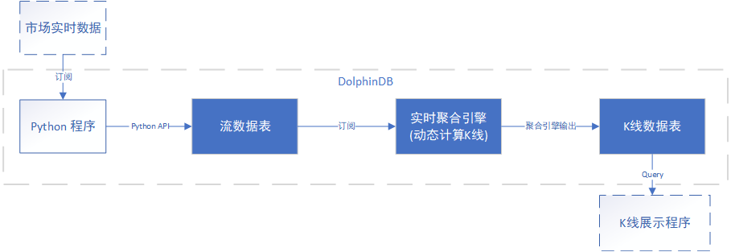

# DolphinDB教程：K线计算 

DolphinDB提供了功能强大的内存计算引擎，内置时间序列函数，分布式计算以及流数据处理引擎，在众多场景下均可高效的计算K线。本教程将介绍DolphinDB如何通过批量处理和流式处理计算K线。

- 计算历史数据K线

可以指定K线窗口的起始时间；一天中可以存在多个交易时段，包括隔夜时段；K线窗口可重叠；使用交易量作为划分K线窗口的维度。需要读取的数据量特别大并且需要将结果写入数据库时，可使用DolphinDB内置的Map-Reduce函数并行计算。

- 实时计算K线

使用API实时接收市场数据，并使用DolphinDB内置的流数据时序计算引擎(time-series aggregator)进行实时计算得到K线数据。

## 1. 历史数据K线计算

使用历史数据计算K线，可使用DolphinDB的内置函数[`bar`](https://www.dolphindb.cn/cn/help/FunctionsandCommands/FunctionReferences/b/bar.html)，[`dailyAlignedBar`](https://www.dolphindb.cn/cn/help/FunctionsandCommands/FunctionReferences/d/dailyAlignedBar.html)，或[`wj`](https://www.dolphindb.cn/cn/help/SQLStatements/TableJoiners/windowjoin.html)。 

### 1.1 不指定K线窗口的起始时刻

这种情况可使用`bar`函数。bar(X,Y)返回X减去X除以Y的余数(X-mod(X,Y))，一般用于将数据分组。如下例所示。

```
date = 09:32m 09:33m 09:45m 09:49m 09:56m 09:56m;
bar(date, 5);
```

返回结果：
```
[09:30m,09:30m,09:45m,09:45m,09:55m,09:55m]
```

**例子1**：使用以下数据模拟美国股票市场：
```
n = 1000000
date = take(2019.11.07 2019.11.08, n)
time = (09:30:00.000 + rand(int(6.5*60*60*1000), n)).sort!()
timestamp = concatDateTime(date, time)
price = 100+cumsum(rand(0.02, n)-0.01)
volume = rand(1000, n)
symbol = rand(`AAPL`FB`AMZN`MSFT, n)
trade = table(symbol, date, time, timestamp, price, volume).sortBy!(`symbol`timestamp)
undef(`date`time`timestamp`price`volume`symbol)
```

计算5分钟K线：
```
barMinutes = 5
OHLC = select first(price) as open, max(price) as high, min(price) as low, last(price) as close, sum(volume) as volume from trade group by symbol, date, bar(time, barMinutes*60*1000) as barStart
```

请注意，以上数据中，time列的精度为毫秒。若time列精度不是毫秒，则应当将 barMinutes\*60*1000 中的数字做相应调整。

### 1.2 指定K线窗口的起始时刻

需要指定K线窗口的起始时刻，可使用`dailyAlignedBar`函数。该函数可处理每日多个交易时段，亦可处理隔夜时段。

请注意，使用`dailyAlignedBar`函数时，时间列必须含有日期信息，包括 DATETIME, TIMESTAMP 或 NANOTIMESTAMP 这三种类型的数据。指定每个交易时段起始时刻的参数 timeOffset 必须使用相应的去除日期信息之后的 SECOND，TIME 或 NANOTIME 类型的数据。

**例子2**（每日一个交易时段）：计算美国股票市场7分钟K线。数据沿用例子1中的trade表。
```
barMinutes = 7
OHLC = select first(price) as open, max(price) as high, min(price) as low, last(price) as close, sum(volume) as volume from trade group by symbol, dailyAlignedBar(timestamp, 09:30:00.000, barMinutes*60*1000) as barStart
```

**例子3**（每日两个交易时段）：中国股票市场每日有两个交易时段，上午时段为9:30至11:30，下午时段为13:00至15:00。

使用以下脚本产生模拟数据：
```
n = 1000000
date = take(2019.11.07 2019.11.08, n)
time = (09:30:00.000 + rand(2*60*60*1000, n/2)).sort!() join (13:00:00.000 + rand(2*60*60*1000, n/2)).sort!()
timestamp = concatDateTime(date, time)
price = 100+cumsum(rand(0.02, n)-0.01)
volume = rand(1000, n)
symbol = rand(`600519`000001`600000`601766, n)
trade = table(symbol, timestamp, price, volume).sortBy!(`symbol`timestamp)
undef(`date`time`timestamp`price`volume`symbol)
```

计算7分钟K线：
```
barMinutes = 7
sessionsStart=09:30:00.000 13:00:00.000
OHLC = select first(price) as open, max(price) as high, min(price) as low, last(price) as close, sum(volume) as volume from trade group by symbol, dailyAlignedBar(timestamp, sessionsStart, barMinutes*60*1000) as barStart
```

**例子4**（每日两个交易时段，包含隔夜时段）：某些期货每日有多个交易时段，且包括隔夜时段。本例中，第一个交易时段为上午8:45到下午13:45，另一个时段为隔夜时段，从下午15:00到第二天上午05:00。

使用以下脚本产生模拟数据:
```
daySession =  08:45:00.000 : 13:45:00.000
nightSession = 15:00:00.000 : 05:00:00.000
n = 1000000
timestamp = rand(concatDateTime(2019.11.06, daySession[0]) .. concatDateTime(2019.11.08, nightSession[1]), n).sort!()
price = 100+cumsum(rand(0.02, n)-0.01)
volume = rand(1000, n)
symbol = rand(`A120001`A120002`A120003`A120004, n)
trade = select * from table(symbol, timestamp, price, volume) where timestamp.time() between daySession or timestamp.time()>=nightSession[0] or timestamp.time()<nightSession[1] order by symbol, timestamp
undef(`timestamp`price`volume`symbol)
```

计算7分钟K线：
```
barMinutes = 7
sessionsStart = [daySession[0], nightSession[0]]
OHLC = select first(price) as open, max(price) as high, min(price) as low, last(price) as close, sum(volume) as volume from trade group by symbol, dailyAlignedBar(timestamp, sessionsStart, barMinutes*60*1000) as barStart
```

### 1.3 重叠K线窗口

以上例子中，K线窗口均不重叠。若要计算重叠K线窗口，可以使用[`wj`](https://www.dolphindb.cn/cn/help/SQLStatements/TableJoiners/windowjoin.html)函数。`wj`函数对左表中的每一行，在右表中截取一段窗口，进行计算。

**例子5** （每日两个交易时段，重叠的K线窗口）：模拟中国股票市场数据，每5分钟计算30分钟K线。
```
n = 1000000
sampleDate = 2019.11.07
symbols = `600519`000001`600000`601766
trade = table(take(sampleDate, n) as date, 
	(09:30:00.000 + rand(7200000, n/2)).sort!() join (13:00:00.000 + rand(7200000, n/2)).sort!() as time, 
	rand(symbols, n) as symbol, 
	100+cumsum(rand(0.02, n)-0.01) as price, 
	rand(1000, n) as volume)
```

首先生成窗口，并且使用[`cj`](https://www.dolphindb.cn/cn/help/SQLStatements/TableJoiners/crossjoin.html)函数来生成股票和交易窗口的组合。
```
barWindows = table(symbols as symbol).cj(table((09:30:00.000 + 0..23 * 300000).join(13:00:00.000 + 0..23 * 300000) as time))
```

然后使用`wj`函数计算重叠窗口的K线数据：
```
OHLC = wj(barWindows, trade, 0:(30*60*1000), 
		<[first(price) as open, max(price) as high, min(price) as low, last(price) as close, sum(volume) as volume]>, `symbol`time)
```

### 1.4 使用交易量划分K线窗口

上面的例子我们均使用时间作为划分K线窗口的维度。在实践中，也可以使用其他变量，譬如用累计的交易量作为划分K线窗口的依据。

**例子6** （使用累计的交易量计算K线）：交易量每增加1000000计算一次K线。
```
n = 1000000
sampleDate = 2019.11.07
symbols = `600519`000001`600000`601766
trade = table(take(sampleDate, n) as date, 
	(09:30:00.000 + rand(7200000, n/2)).sort!() join (13:00:00.000 + rand(7200000, n/2)).sort!() as time, 
	rand(symbols, n) as symbol, 
	100+cumsum(rand(0.02, n)-0.01) as price, 
	rand(1000, n) as volume)
	
volThreshold = 1000000
t = select first(time) as barStart, first(price) as open, max(price) as high, min(price) as low, last(price) as close, last(cumvol) as cumvol 
from (select symbol, time, price, cumsum(volume) as cumvol from trade context by symbol)
group by symbol, bar(cumvol, volThreshold) as volBar
```

代码采用了嵌套查询的方法。子查询为每个股票生成累计的交易量cumvol，然后在主查询中根据累计的交易量用`bar`函数生成窗口。

### 1.5 使用MapReduce函数加速

若需从数据库中提取较大量级的历史数据，计算K线，然后存入数据库，可使用DolphinDB内置的Map-Reduce函数[`mr`](https://www.dolphindb.cn/cn/help/FunctionsandCommands/FunctionReferences/m/mr.html)进行数据的并行读取与计算。这种方法可以显著提高速度。

本例使用美国股票市场的交易数据。原始数据存于"dfs://TAQ"数据库的"trades"表中。"dfs://TAQ"数据库采用复合分区：基于交易日期Date的值分区与基于股票代码Symbol的范围分区。

(1) 将存于磁盘的原始数据表的元数据载入内存：
```
login(`admin, `123456)
db = database("dfs://TAQ")
trades = db.loadTable("trades")
```

(2) 在磁盘上创建一个空的数据表，以存放计算结果。以下代码建立一个模板表（model），并根据此模板表的schema在数据库"dfs://TAQ"中创建一个空的 OHLC 表以存放K线计算结果：
```
model=select top 1 Symbol, Date, Time.second() as bar, PRICE as open, PRICE as high, PRICE as low, PRICE as close, SIZE as volume from trades where Date=2007.08.01, Symbol=`EBAY
if(existsTable("dfs://TAQ", "OHLC"))
	db.dropTable("OHLC")
db.createPartitionedTable(model, `OHLC, `Date`Symbol)
```

(3) 使用`mr`函数计算K线数据，并将结果写入 OHLC 表中：
```
def calcOHLC(inputTable){
	tmp=select first(PRICE) as open, max(PRICE) as high, min(PRICE) as low, last(PRICE) as close, sum(SIZE) as volume from inputTable where Time.second() between 09:30:00 : 15:59:59 group by Symbol, Date, 09:30:00+bar(Time.second()-09:30:00, 5*60) as bar
	loadTable("dfs://TAQ", `OHLC).append!(tmp)
	return tmp.size()
}
ds = sqlDS(<select Symbol, Date, Time, PRICE, SIZE from trades where Date between 2007.08.01 : 2019.08.01>)
mr(ds, calcOHLC, +)
```

- ds是函数`sqlDS`生成的一系列数据源，每个数据源代表从一个数据分区中提取的数据。 
- 自定义函数`calcOHLC`为Map-Reduce算法中的map函数，对每个数据源计算K线数据，并将结果写入数据库，返回写入数据库的K线数据的行数。
- "+"是Map-Reduce算法中的reduce函数，将所有map函数的结果，亦即写入数据库的K线数据的行数相加，返回写入数据库的K线数据总数。

## 2. 实时K线计算

DolphinDB中计算实时K线的流程如下图所示：



实时数据供应商一般会提供基于Python、Java或其他常用语言的API的数据订阅服务。本例中使用Python来模拟接收市场数据，通过DolphinDB Python API写入流数据表中。DolphinDB的流数据时序聚合引擎可按照指定的频率与移动窗口实时计算K线。

本例使用的模拟实时数据源为文本文件[trades.csv](data/k-line/trades.csv)。该文件包含以下4列（附带一行样本数据）：

Symbol|Datetime|Price|Volume
---|---|---|---
000001|2018.09.03T09:30:06|10.13|4500

以下三小节介绍实时K线计算的三个步骤：

### 2.1 使用 Python 接收实时数据，并写入DolphinDB流数据表

* DolphinDB 中建立流数据表
```
share streamTable(100:0, `Symbol`Datetime`Price`Volume,[SYMBOL,DATETIME,DOUBLE,INT]) as Trade
```

* 将模拟数据写入DolphinDB流数据表

实时数据中Datetime的数据精度是秒，由于pandas DataFrame中仅能使用DateTime[64]即DolphinDB中的nanotimestamp类型，所以下列代码在写入前有一个数据类型转换的过程。

```python
import dolphindb as ddb
import pandas as pd
import numpy as np
csv_file = "trades.csv"
csv_data = pd.read_csv(csv_file, dtype={'Symbol':str} )
csv_df = pd.DataFrame(csv_data)
s = ddb.session();
s.connect("127.0.0.1",8848,"admin","123456")
#上传DataFrame到DolphinDB，并对Datetime字段做类型转换
s.upload({"tmpData":csv_df})
s.run("data = select Symbol, datetime(Datetime) as Datetime, Price, Volume from tmpData")
s.run("tableInsert(Trade,data)")
```

### 2.2 实时计算K线

可使用移动窗口实时计算K线数据，一般分为以下2种情况：

- 仅在每次时间窗口结束时触发计算。
	- 时间窗口完全不重合，例如每隔5分钟计算过去5分钟的K线数据。
	- 时间窗口部分重合，例如每隔1分钟计算过去5分钟的K线数据。

- 在每个时间窗口结束时触发计算，同时在每个时间窗口内数据也会按照一定频率更新。
	例如每隔1分钟计算过去1分钟的K线数据，但最近1分钟的K线不希望等到窗口结束后再计算。希望每隔1秒钟更新一次。

下面针对上述的几种情况分别介绍如何使用`createTimeSeriesAggregator`函数实时计算K线数据。请根据实际需要选择相应场景创建时间序列聚合引擎。

#### 2.2.1 仅在每次时间窗口结束时触发计算

时间窗口不重合，可将`createTimeSeriesAggregator`函数的windowSize参数和step参数设置为相同值。时间窗口部分重合，可将windowSize参数设为大于step参数。请注意，windowSize必须是step的整数倍。

场景一：每隔5分钟计算过去5分钟的K线数据。
```
share streamTable(100:0, `datetime`symbol`open`high`low`close`volume,[DATETIME,SYMBOL,DOUBLE,DOUBLE,DOUBLE,DOUBLE,LONG]) as OHLC1
tsAggr1 = createTimeSeriesAggregator(name="tsAggr1", windowSize=300, step=300, metrics=<[first(Price),max(Price),min(Price),last(Price),sum(volume)]>, dummyTable=Trade, outputTable=OHLC1, timeColumn=`Datetime, keyColumn=`Symbol)
subscribeTable(tableName="Trade", actionName="act_tsAggr1", offset=0, handler=append!{tsAggr1}, msgAsTable=true);
```

场景二：每隔1分钟计算过去5分钟的K线数据。
```
share streamTable(100:0, `datetime`symbol`open`high`low`close`volume,[DATETIME,SYMBOL,DOUBLE,DOUBLE,DOUBLE,DOUBLE,LONG]) as OHLC2
tsAggr2 = createTimeSeriesAggregator(name="tsAggr2", windowSize=300, step=60, metrics=<[first(Price),max(Price),min(Price),last(Price),sum(volume)]>, dummyTable=Trade, outputTable=OHLC2, timeColumn=`Datetime, keyColumn=`Symbol)
subscribeTable(tableName="Trade", actionName="act_tsAggr2", offset=0, handler=append!{tsAggr2}, msgAsTable=true);
```

#### 2.2.2 在每个窗口内进行多次计算

以每分钟计算vwap价格为例，当前窗口内即使发生了多次交易，窗口结束前都不会触发任何使用当前窗口数据的计算。某些用户希望在当前窗口结束前频繁使用已有数据计算K线，这时可指定`createTimeSeriesAggregator`函数的updateTime参数。指定updateTime参数后，当前窗口结束前可能会发生多次针对当前窗口的计算。这些计算触发的规则为：

(1) 将当前窗口分为windowSize/updateTime个小窗口，每个小窗口长度为updateTime。一个小窗口结束后，若有一条新数据到达，且在此之前当前窗口内有未参加计算的的数据，会触发一次计算。请注意，该次计算不包括这条新数据。

(2) 一条数据到达聚合引擎之后经过2\*updateTime（若2\*updateTime不足2秒，则设置为2秒），若其仍未参与计算，会触发一次计算。该次计算包括当时当前窗口内的所有数据。

若进行分组计算，以上规则在每组之内应用。在使用updateTime参数时，step必须是updateTime的整数倍。必须使用[键值表](https://www.dolphindb.cn/cn/help/FunctionsandCommands/FunctionReferences/k/keyedTable.html)作为输出表。若未指定keyColumn参数，主键为timeColumn列；若指定了keyColumn参数，主键为timeColumn列和keyColumn列。有关updateTime参数更多细节，请参考[时序聚合引擎教程](./stream_aggregator.md)

例如，要计算1分钟窗口的K线，但当前1分钟的K线不希望等到窗口结束后再计算，而是希望新数据进入后最迟2秒钟就计算。可通过如下步骤实现。

首先，创建一个流表作为输出表，并将时间列和股票代码列作为主键。
```
share streamTable(100:0，`datetime`Symbol`open`high`low`close`volume,[DATETIME,SYMBOL,DOUBLE,DOUBLE,DOUBLE,DOUBLE,LONG]) as OHLC
```

使用以下脚本定义时序聚合引擎。其中指定updateTime参数取值为1(秒)。useWindowStartTime参数设为true，表示输出表第一列为数据窗口的起始时间。
```
tsAggr = createTimeSeriesAggregator(name="tsAggr", windowSize=60, step=60, metrics=<[first(Price),max(Price),min(Price),last(Price),sum(volume)]>, dummyTable=Trade, outputTable=OHLC, timeColumn=`Datetime, keyColumn=`Symbol, updateTime=1, useWindowStartTime=true)
```

最后，订阅流数据：
```
subscribeTable(tableName="Trade", actionName="act_tsaggr", offset=0, handler=append!{tsAggr}, msgAsTable=true);
```

### 2.3 在Python中展示K线数据

在本例中，聚合引擎的输出表也定义为流数据表，客户端可以通过Python API订阅输出表，并将计算结果展现到Python终端。

以下代码使用Python API订阅实时聚合计算的输出结果表OHLC，并将结果通过`print`函数打印出来。

```python
from threading import Event
import dolphindb as ddb
import pandas as pd
import numpy as np
s=ddb.session()
#设定本地端口20001用于订阅流数据
s.enableStreaming(20001)
def handler(lst):         
    print(lst)
# 订阅DolphinDB(本机8848端口)上的OHLC流数据表
s.subscribe("127.0.0.1", 8848, handler, "OHLC","python_api_subscribe",0)
Event().wait() 
```

也可通过[Grafana](../../grafana-datasource/blob/master/README_CN.md)等可视化系统来连接DolphinDB database，对输出表进行查询并将结果以图表方式展现。