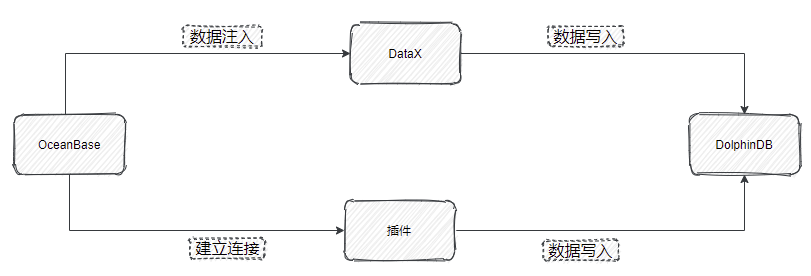

# 从 OceanBase 迁移到 DolphinDB

OceanBase 是一款金融级分布式关系数据库，具有数据强一致、高可用、高性能、在线扩展、高度兼容 SQL 标准和主流关系数据库、低成本等特点，但是其学习成本较高，且缺乏金融计算函数以及流式增量计算的功能。

DolphinDB 是一款国产的高性能分布式时序数据库产品。支持 SQL 和使用类 Python 的语法来处理数据，学习成本很低。并且 DolphinDB 提供了 1500 多个函数，对于复杂的数据处理场景有很强的表达能力，极大地降低了用户开发成本。同时 DolphinDB 还具有强大的流式增量计算能力，能够满足用户实时数据的处理需求。

本文旨在为有从 OceanBase 迁移至 DolphinDB 需求的用户提供一份简洁明了的参考，整体框架如下：

本教程包含的内容如下：




- [1. 应用需求](#1-应用需求)
- [2. 实现方法](#2-实现方法)
- [3. 迁移案例与操作步骤](#3-迁移案例与操作步骤)
  - [3.1 在 DolphinDB 创建表](#31-在-dolphindb-创建表)
  - [3.2 通过 MySQL 插件迁移](#32-通过-mysql-插件迁移)
  - [3.3 通过 DataX 驱动迁移](#33-通过-datax-驱动迁移)
- [4. 基准性能](#4-基准性能)
- [附录](#附录)
  - [DataX DolphinDB-Writer 配置项](#datax-dolphindb-writer-配置项)
  - [完整代码及测试数据](#完整代码及测试数据)


# 1. 应用需求

很多之前使用 OceanBase 的用户不可避免地需要将数据迁移同步至 DolphinDB。DolphinDB 提供了多种灵活的数据同步方法，来帮助用户方便地把海量数据从多个数据源进行全量同步或增量同步。本文中的实践案例基于该需求，提供了将逐笔成交数据从 OceanBase 迁移至 DolphinDB 的高性能解决方案。

现有 2021.01.04 一天的逐笔成交数据，存储于 OceanBase。其部分数据示例如下：

| SecurityID | TradeTime               | TradePrice | TradeQty | TradeAmount | BuyNo  | SellNo | TradeIndex | ChannelNo | TradeBSFlag | BizIndex |
| :--------- | :---------------------- | :--------- | :------- | :---------- | :----- | :----- | :--------- | :-------- | :---------- | :------- |
| 600035     | 2021.01.04T09:32:59.000 | 2.9        | 100      | 290         | 574988 | 539871 | 266613     | 6         | B           | 802050   |
| 600035     | 2021.01.04T09:25:00.000 | 2.91       | 2900     | 8439        | 177811 | 36575  | 8187       | 6         | N           | 45204    |
| 600035     | 2021.01.04T09:25:00.000 | 2.91       | 2600     | 7566        | 177811 | 3710   | 8188       | 6         | N           | 45205    |
| 600035     | 2021.01.04T09:32:59.000 | 2.9        | 100      | 290         | 574988 | 539872 | 266614     | 6         | B           | 802051   |
| 600035     | 2021.01.04T09:25:00.000 | 2.91       | 500      | 1455        | 177811 | 8762   | 8189       | 6         | N           | 45206    |
| 600035     | 2021.01.04T09:32:59.000 | 2.9        | 100      | 290         | 574988 | 539873 | 266615     | 6         | B           | 802052   |
| 600035     | 2021.01.04T09:30:02.000 | 2.9        | 100      | 290         | 18941  | 205774 | 44717      | 6         | S           | 252209   |
| 600035     | 2021.01.04T09:32:59.000 | 2.9        | 100      | 290         | 574988 | 539880 | 266616     | 6         | B           | 802053   |
| 600035     | 2021.01.04T09:30:02.000 | 2.9        | 100      | 290         | 18941  | 209284 | 46106      | 6         | S           | 256679   |
| 600035     | 2021.01.04T09:32:59.000 | 2.9        | 200      | 580         | 574988 | 539884 | 266617     | 6         | B           | 802054   |

# 2. 实现方法

从 OceanBase 迁移数据到 DolphinDB 的方法有以下三种：

- MySQL 插件

MySQL 插件是 DolphinDB 提供的用于导入 MySQL 数据的插件，同样也适用于 OceanBase 的 MySQL 模式。MySQL 插件配合 DolphinDB 脚本使用，与服务器在同一个进程空间内运行，能高效地完成 OceanBase 数据到 DolphinDB 的数据写入。

MySQL 插件提供如下函数，函数的具体使用请参考 [DolphinDB MySQL Plugin](https://gitee.com/dolphindb/DolphinDBPlugin/tree/release200/mysql)

1. mysql::connect(host, port, user, password, db)
2. mysql::showTables(connection)
3. mysql::extractSchema(connection, tableName)
4. mysql::load(connection, table_or_query, [schema], [startRow], [rowNum], [allowEmptyTable])
5. mysql::loadEx(connection, dbHandle,tableName,partitionColumns,table_or_query,[schema],[startRow],[rowNum],[transform])

- ODBC 插件

ODBC (Open Database Connectivity) 插件是 DolphinDB 提供的通过 ODBC 接口访问支持 ODBC 协议开源产品。其使用方式与 MySQL 插件类似，本文不再赘述，感兴趣的读者可参考 [ODBC 插件使用指南](https://gitee.com/dolphindb/Tutorials_CN/blob/master/ODBC_plugin_user_guide.md#4-odbc插件导入导出-oracle-数据示例)。

- DataX 驱动

DataX 是可扩展的数据同步框架，将不同数据源的同步抽象为从源头数据源读取数据的 Reader 插件，以及向目标端写入数据的 Writer 插件，理论上 DataX 框架可以支持任意数据源类型的数据同步工作。

DolphinDB 提供基于 DataXReader 和 DataXWriter 的开源驱动。DolphinDBWriter 插件实现了向 DolphinDB 写入数据，使用 DataX 的现有 reader 插件结合 DolphinDBWriter 插件，即可实现从不同数据源向 DolphinDB 同步数据。用户可以在 Java 项目中包含 DataX 的驱动包，开发从 OceanBase 数据源到 DolphinDB 的数据迁移软件。

DataX 驱动的开发基于 Java SDK，支持高可用。

| **实现途径** | **数据写入效率** | **高可用** |
| :----------- | :--------------- | :--------- |
| MySQL 插件   | 高               | 不支持     |
| DataX 驱动   | 中               | 支持       |

# 3. 迁移案例与操作步骤

## 3.1 在 DolphinDB 创建表

针对上面的测试数据，我们需要在 DolphinDB 里创建对应的库表，用于存储迁移过来的数据。对于实际的数据，需要综合考虑被迁移数据的字段、类型、数据量，在 DolphinDB 是否需要分区，分区方案，使用 OLAP 还是 TSDB 引擎等情况，去设计建库建表方案。一些数据存储库表设计实践，可以参考 [DolphinDB 数据库分区教程](https://gitee.com/dolphindb/Tutorials_CN/blob/master/database.md)。

本例建表文件 *createTable.dos* 内容如下:

```
def createTick(dbName, tbName){
	if(existsDatabase(dbName)){
		dropDatabase(dbName)
	}
	db1 = database(, VALUE, 2020.01.01..2021.01.01)
	db2 = database(, HASH, [SYMBOL, 10])
	db = database(dbName, COMPO, [db1, db2], , "TSDB")
	db = database(dbName)
	name = `SecurityID`TradeTime`TradePrice`TradeQty`TradeAmount`BuyNo`SellNo`ChannelNo`TradeIndex`TradeBSFlag`BizIndex
	type = `SYMBOL`TIMESTAMP`DOUBLE`INT`DOUBLE`INT`INT`INT`INT`SYMBOL`INT
	schemaTable = table(1:0, name, type)
	db.createPartitionedTable(table=schemaTable, tableName=tbName, partitionColumns=`TradeTime`SecurityID, compressMethods={TradeTime:"delta"}, sortColumns=`SecurityID`TradeTime, keepDuplicates=ALL)
}

dbName="dfs://TSDB_tick"
tbName="tick"
createTick(dbName, tbName)
```

从 OceanBase 迁移到 DolphinDB 的数据字段映射关系如下表：

| **OceanBase 字段含义** | **OceanBase 字段** | **OceanBase 数据类型** | **DolphinDB 字段含义** | **DolphinDB 字段** | **DolphinDB 数据类型** |
| :--------------------- | :----------------- | :--------------------- | :--------------------- | :----------------- | :--------------------- |
| 证券代码               | SecurityID         | varchar(10)            | 证券代码               | SecurityID         | SYMBOL                 |
| 交易时间               | TradeTime          | timestamp              | 交易时间               | TradeTime          | TIMESTAMP              |
| 交易价格               | TradePrice         | double                 | 交易价格               | TradePrice         | DOUBLE                 |
| 交易数量               | TradeQty           | int(11)                | 交易数量               | TradeQty           | INT                    |
| 交易金额               | TradeAmount        | double                 | 交易金额               | TradeAmount        | DOUBLE                 |
| 买方委托索引           | BuyNo              | int(11)                | 买方委托索引           | BuyNo              | INT                    |
| 卖方委托索引           | SellNo             | int(11)                | 卖方委托索引           | SellNo             | INT                    |
| 成交编号               | TradeIndex         | int(11)                | 成交编号               | TradeIndex         | INT                    |
| 频道代码               | ChannelNo          | int(11)                | 频道代码               | ChannelNo          | INT                    |
| 成交方向               | TradeBSFlag        | varchar(20)            | 成交方向               | TradeBSFlag        | SYMBOL                 |
| 业务序列号             | BizIndex           | int(11)                | 业务序列号             | BizIndex           | INT                    |

## 3.2 通过 MySQL 插件迁移

### 3.2.1 安装 MySQL 插件

MySQL 插件的安装参考 [DolphinDB MySQL Plugin](https://gitee.com/dolphindb/DolphinDBPlugin/tree/release200/mysql#dolphindb-mysql-plugin)。

### 3.2.2  同步数据

1. 运行以下命令加载 MySQL 插件

```
loadPlugin("ServerPath/plugins/mysql/PluginMySQL.txt")
```

2. 运行以下命令建立与 OceanBase 的连接

```
conn = mysql::connect(`127.0.0.1,2881,`root,`123456,`db1)
```

3. 运行以下命令开始同步数据

```
mysql::loadEx(conn, database('dfs://TSDB_tick'), `tick, `TradeTime`SecurityID,"tick")
```

数据共 27211975 条，同步数据耗时约52秒。

4. 同步增量数据

如需实现增量同步，只需将 `mysql::loadEX` 中的源数据表名替换为查询语句, 并借助 DolphinDB 提供的 `scheduleJob` 函数设置定时任务，即可实现增量同步，示例如下，每天 00:05 同步前一天数据：

```
def scheduleLoad(){
  sqlQuery = "select * from tick where date(TradeTime) =  '" +temporalFormat(today()-1, 'y-MM-dd') +"' ;"
  mysql::loadEx(conn, database('dfs://TSDB_tick'), `tick, `TradeTime`SecurityID,sqlQuery)
}
scheduleJob(jobId=`test, jobDesc="test",jobFunc=scheduleLoad,scheduleTime=00:05m,startDate=2023.04.04, endDate=2024.01.01, frequency='D')
```

注：为防止节点重启时定时任务解析失败，预先在配置文件里添加 `preloadModules=plugins::mysql`。

## 3.3 通过 DataX 驱动迁移

### 3.3.1 部署 DataX

从 [DataX 下载地址](https://gitee.com/link?target=https%3A%2F%2Fdatax-opensource.oss-cn-hangzhou.aliyuncs.com%2F202210%2Fdatax.tar.gz)下载 DataX 压缩包后，解压至自定义目录。

### 3.3.2 部署 DataX-DolphinDBWriter 插件

将 [DataX-DolphinDBWriter ](https://gitee.com/link?target=https%3A%2F%2Fgithub.com%2Fdolphindb%2Fdatax-writer)中源码的 *./dist/dolphindbwriter* 目录下所有内容拷贝到 *DataX/plugin/writer* 目录下。

### 3.3.3 执行 DataX 任务

1. 根据实际环境配置json文件。详情参考：[#DataX DolphinDBWriter插件配置项](https://dolphindb1.atlassian.net/wiki/spaces/POC/pages/631931016/2023.04.30+OceanBase+DolphinDB#DataX-DolphinDB-Writer-配置项)，配置 json 文件

配置文件 *OceanBase_tick.json* 的具体内容如下，并将 json 文件置于自定义目录下，本教程中方放置于 *datax-writer-master/ddb_script/* 目录下。

```
{
    "job": {
        "setting": {
            "speed": {
                "channel":1
            }
        },
        "content": [
            {
                "writer": {
                    "parameter": {
                        "dbPath": "dfs://TSDB_tick",
                        "tableName": "tick",
                        "userId": "admin",
                        "pwd": "123456",
                        "host": "127.0.0.1",
                        "batchSize": 200000,
                        "table": [
                            {
                                "type": "DT_SYMBOL",
                                "name": "SecurityID"
                            },
                            {
                                "type": "DT_TIMESTAMP",
                                "name": "TradeTime"
                            },
                            {
                                "type": "DT_DOUBLE",
                                "name": "TradePrice"
                            },
                            {
                                "type": "DT_INT",
                                "name": "TradeQty"
                            },
                            {
                                "type": "DT_DOUBLE",
                                "name": "TradeAmount"
                            },
                            {
                                "type": "DT_INT",
                                "name": "BuyNo"
                            },
                            {
                                "type": "DT_INT",
                                "name": "SellNo"
                            },
                            {
                                "type": "DT_INT",
                                "name": "TradeIndex"
                            },
                            {
                                "type": "DT_INT",
                                "name": "ChannelNo"
                            },
                            {
                                "type": "DT_SYMBOL",
                                "name": "TradeBSFlag"
                            },
                            {
                                "type": "DT_INT",
                                "name": "BizIndex"
                            }
                        ],
                        "port": 8800
                    },
                    "name": "dolphindbwriter"
                },
                "reader": {
                    "name": "oceanbasev10reader",
                    "parameter": {
                        "username": "root",
                        "password": "123456",
                        "batchSize":10000,
                        "column": [
                            "*"
                        ],
                        "connection": [
                            {
                                "table": [
                                    "tick"
                                ],
                                "jdbcUrl": [
                                    "jdbc:oceanbase://127.0.0.1:2883/db1"
                                ]
                            }
                        ]
                    }
                }
            }
        ]
    }
}

```

2. Linux 终端中执行以下命令以执行 DataX 任务

```
cd ./dataX/bin/
python datax.py ../../datax-writer-master/ddb_script/ocean.json
```

3. 查看DataX同步结果

```
任务启动时刻                    : 2023-04-03 14:58:52
任务结束时刻                    : 2023-04-03 15:00:52
任务总计耗时                    :                120s
任务平均流量                    :           12.32MB/s
记录写入速度                    :         226766rec/s
读出记录总数                    :            27211975
读写失败总数                    :                   0
```

4. 同步增量数据

使用 DataX 同步增量数据，可在  *ocean.json* 的 ”reader“ 中增加 "where" 条件对数据日期进行筛选，如此每次执行同步任务时至同步 where 条件过滤后的数据，以同步前一天的数据为例，示例如下：

```
"reader": {
    "name": "oceanbasev10reader",
    "parameter": {
        "username": "root",
        "password": "123456",
        "batchSize":10000,
        "column": [
            "*"
        ],
        "connection": [
            {
                "table": [
                    "tick"
                ],
                "jdbcUrl": [
                    "jdbc:oceanbase://127.0.0.1:2883/db1"
                ]
            }
        ],
        "where":"date(TradeTime) = (SELECT DATE_ADD(CURDATE(), INTERVAL -1 DAY))"
    }
}
```

# 4. 基准性能

分别使用 MySQL 插件和 DataX 驱动进行数据迁移， 数据量 2721 万条，迁移耗时对比如下表所示：

| **MySQL插件** | **DataX** |
| :------------ | :-------- |
| 52s           | 120s      |

综上，MySQL 插件与 DataX 均能实现 将 OceanBase 中数据迁移到 DolphinDB中，但是各有优缺点：

- MySQL 插件性能较好，适合批量数据的导入，但是运维管理不便。
- DataX 导入数据较慢，适合千万级别以下数据集导入，但是其日志追踪，可扩展性以及管理比较方便。

用户可以根据自己数据量的大小以及工程化的便捷性进行选择导入方式，同时，由于篇幅有限，涉及到 DolphinDB 和 DataX 框架的一些其它操作未能更进一步展示，用户在使用过程中需要按照实际情况进行调整。也欢迎大家对本教程中可能存在的纰漏和缺陷批评指正。

# 附录

## DataX DolphinDB-Writer 配置项

| **配置项**       | **是否必须** | **数据类型** | **默认值** | **描述**                                                     |
| :--------------- | :----------- | :----------- | :--------- | :----------------------------------------------------------- |
| host             | 是           | string       | 无         | Server Host                                                  |
| port             | 是           | int          | 无         | Server Port                                                  |
| userId           | 是           | string       | 无         | DolphinDB 用户名 导入分布式库时，必须要有权限的用户才能操作，否则会返回 |
| pwd              | 是           | string       | 无         | DolphinDB 用户密码                                           |
| dbPath           | 是           | string       | 无         | 需要写入的目标分布式库名称，比如 "dfs://MYDB"。              |
| tableName        | 是           | string       | 无         | 目标数据表名称                                               |
| batchSize        | 否           | int          | 10000000   | DataX 每次写入 DolphinDB 的批次记录数                        |
| table            | 是           |              |            | 写入表的字段集合，具体参考后续table项配置详解                |
| saveFunctionName | 否           | string       | 无         | 自定义数据处理函数。若未指定此配置，插件在接收到 reader 的数据后，会将数据提交到 DolphinDB 并通过 `tableInsert` 函数写入指定库表；如果定义此参数，则会用指定函数替换`tableInsert` 函数。 |
| saveFunctionDef  | 否           | string       | 无         | 数据入库自定义函数。此函数指用 dolphindb 脚本来实现的数据入库过程。 此函数必须接受三个参数：*dfsPath*(分布式库路径), *tbName*(数据表名), *data* (从 DataX 导入的数据, table 格式) |

 

### table 配置详解

table 用于配置写入表的字段集合。内部结构为

```
 {"name": "columnName", "type": "DT_STRING", "isKeyField":true}
```

请注意此处列定义的顺序，需要与原表提取的列顺序完全一致。

- name：字段名称。
- isKeyField：是否唯一键值，可以允许组合唯一键。本属性用于数据更新场景，用于确认更新数据的主键，若无更新数据的场景，无需设置。
- type： 枚举值以及对应 DolphinDB 数据类型如下：

| DolphinDB 类型 | 配置值          |
| :------------- | :-------------- |
| DOUBLE         | DT_DOUBLE       |
| FLOAT          | DT_FLOAT        |
| BOOL           | DT_BOOL         |
| DATE           | DT_DATE         |
| MONTH          | DT_MONTH        |
| DATETIME       | DT_DATETIME     |
| TIME           | DT_TIME         |
| SECOND         | DT_SECOND       |
| TIMESTAMP      | DT_TIMESTAMP    |
| NANOTIME       | DT_NANOTIME     |
| NANOTIMETAMP   | DT_NANOTIMETAMP |
| INT            | DT_INT          |
| LONG           | DT_LONG         |
| UUID           | DT_UUID         |
| SHORT          | DT_SHORT        |
| STRING         | DT_STRING       |
| SYMBOL         | DT_SYMBOL       |

## 完整代码及测试数据

DataX:  [OceanBase_tick.json](script/OceanBase_to_DolphinDB/OceanBase_tick.json) 

DolphinDB:  [mysql插件导入数据.dos](script/OceanBase_to_DolphinDB/mysql插件导入数据.dos), [createTable.dos](script/OceanBase_to_DolphinDB/createTable.dos) 

模拟产生数据：  [genTickCsv.dos](script/OceanBase_to_DolphinDB/genTickCsv.dos) 