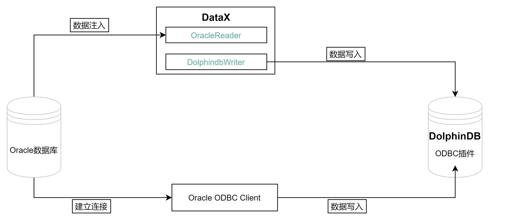

# 从 Oracle 迁移到 DolphinDB

Oracle 是一个广泛使用的关系型数据库管理系统，它支持 ACID 事务处理，具有强大的安全性和可靠性，因此被广泛应用于各种企业级应用程序。但是，随着数据规模的增加和业务需求的变化，Oracle 的一些限制和缺点也逐渐暴露出来。例如，Oracle 的许可证费用昂贵，而且对于海量数据的处理能力较弱。因此，一些企业开始寻找更高效、更灵活的解决方案，以满足业务需求。

DolphinDB 是一种高效、分布式的数据管理和分析平台，它可以轻松地处理海量数据，支持实时数据分析和处理。DolphinDB 使用了基于内存的数据存储方式和多线程并行计算技术，因此具有很高的性能和可扩展性，适合于各种大规模数据处理场景。DolphinDB 还支持多种编程语言，包括 SQL、Python、Java 等，方便开发人员进行数据处理和分析。

在这种情况下，数据迁移变得非常重要。迁移数据可以帮助企业将数据从 Oracle 迁移到更高效、更灵活的解决方案，以便更好地管理和分析数据。此外，数据迁移还可以帮助企业减少许可证费用，提高数据处理的效率，以及满足不断变化的业务需求。

- [实现方法](#实现方法)
- [应用需求](#应用需求)
- [迁移案例与操作步骤](#迁移案例与操作步骤)
  - [环境配置](#环境配置)
  - [建库建表](#建库建表)
  - [通过 ODBC 迁移](#通过-odbc-迁移)
  - [通过 DataX 迁移](#通过-datax-迁移)
- [基准性能](#基准性能)
- [附录](#附录)
  - [DolphinDB 写插件配置项](#dolphindb-写插件配置项)
  - [table 配置详解](#table-配置详解)
  - [完整代码及测试数据](#完整代码及测试数据)


## 实现方法
Oracle 迁移数据到 DolphinDB 的整体框架如下：

  


从 Oracle 迁移数据到 DolphinDB 的方法有以下二种：

- ODBC 插件

ODBC(Open Database Connectivity) 插件是 DolphinDB 提供的通过 ODBC 接口访问 Oracle 的开源产品。使用插件配合 DolphinDB 脚本使用，与服务器在同一个进程空间内运行，能高效地完成 Oracle 数据到 DolphinDB 的数据写入。

ODBC 提供如下函数，函数的具体使用请参考 [ODBC/README_CN.md](https://gitee.com/dolphindb/DolphinDBPlugin/blob/release200/odbc/README_CN.md)。

1. `odbc::connect(connStr, [dataBaseType])`
2. `odbc::close(conn)`
3. `odbc::query(connHandle or connStr, querySql, [t], [batchSize], [tranform])`
4. `odbc::execute(connHandle or connStr, SQLstatements)`
5. `odbc::append(connHandle, tableData, tablename, [createTableIfNotExist], [insertIgnore])`

- DataX 驱动

DataX 是可扩展的数据同步框架，将不同数据源的同步抽象为从源头数据源读取数据的 Reader 插件，以及向目标端写入数据的 Writer 插件，理论上 DataX 框架可以支持任意数据源类型的数据同步工作。

DolphinDB 提供基于 DataXReader 和 DataXWriter 的开源驱动。DolphinDBWriter 插件实现了向 DolphinDB 写入数据，使用 DataX 的现有 reader 插件结合 DolphinDBWriter 插件，即可实现从不同数据源向 DolphinDB 同步数据。用户可以在 Java 项目中包含 DataX 的驱动包，开发从 Oracle 数据源到 DolphinDB 的数据迁移软件。


## 应用需求

很多之前存储在 Oracle 的业务数据，可以通过上述的两种方式将数据同步到 DolphinDB 中。本文的实践案例基于 2021.01.04 号一天的逐笔成交数据，数据量约 2721 万。其部分数据示例如下：

| SecurityID | TradeTime               | TradePrice | TradeQty | TradeAmount | BuyNo  | SellNo | TradeIndex | ChannelNo | TradeBSFlag | BizIndex |
| :--------- | :---------------------- | :--------- | :------- | :---------- | :----- | :----- | :--------- | :-------- | :---------- | :------- |
| 600020     | 2021.01.04T09:25:00.630 | 3.39       | 2100     | 7,119.      | 85961  | 78316  | 19719      | 1         | N           | 123713   |
| 600020     | 2021.01.04T09:25:00.630 | 3.39       | 1000     | 3,390.      | 129945 | 78316  | 19720      | 1         | N           | 123714   |
| 600020     | 2021.01.04T09:25:00.630 | 3.39       | 900      | 3,051.      | 158039 | 78316  | 19721      | 1         | N           | 123715   |
| 600020     | 2021.01.04T09:25:00.630 | 3.39       | 5000     | 16,950.     | 158039 | 158092 | 19722      | 1         | N           | 123716   |
| 600020     | 2021.01.04T09:25:00.630 | 3.39       | 6600     | 22,374.     | 158039 | 118594 | 19723      | 1         | N           | 123717   |
| 600020     | 2021.01.04T09:25:00.630 | 3.39       | 2500     | 8,475.      | 158039 | 138050 | 19724      | 1         | N           | 123718   |
| 600020     | 2021.01.04T09:25:00.630 | 3.39       | 400      | 1,356.      | 42283  | 138050 | 19725      | 1         | N           | 123719   |
| 600020     | 2021.01.04T09:25:00.630 | 3.39       | 100      | 339.        | 42283  | 38902  | 19726      | 1         | N           | 123720   |
| 600020     | 2021.01.04T09:25:00.630 | 3.39       | 3883     | 13,163.37   | 42283  | 45597  | 19727      | 1         | N           | 123721   |
| 600020     | 2021.01.04T09:25:00.630 | 3.39       | 12000    | 40,680.     | 42283  | 168862 | 19728      | 1         | N           | 123722   |


## 迁移案例与操作步骤

### 环境配置

本次案例中使用了以下数据库及插件，各版本型号如下：

[Oracle](https://www.oracle.com/cn/database/technologies/oracle-database-software-downloads.html#19c?source=:ow:o:p:mt:::ODBHeader_cn%2B:ow:o:p:nav:070220DatabaseHero_cn) 版本：`Oracle Database 21c Enterprise Edition`（社区版）

[unixODBC](https://gitee.com/link?target=http%3A%2F%2Fwww.unixodbc.org%2F) 版本：`2.3.7`

[DolphinDB Server](https://gitee.com/link?target=https%3A%2F%2Fwww.dolphindb.cn%2Falone%2Falone.php%3Fid%3D10) 版本：`2.00.9.3`

[DolphinDB GUI](https://gitee.com/link?target=https%3A%2F%2Fwww.dolphindb.cn%2Falone%2Falone.php%3Fid%3D10) 版本：`1.30.21.4`

2.00.9.3 版本 Server 自带 ODBC 插件，位于 Server 的 *\<HomeDir>/plugins* 目录，可直接加载使用。如果 *\<HomeDir>/plugins* 目录下不存在 ODBC 文件夹，则通过如下链接下载：

[DolphinDBPlugin](https://gitee.com/dolphindb/DolphinDBPlugin/tree/release200.9/odbc/bin) 分支：release200.9

请注意，DolphinDB ODBC 插件版本号必须与 Server 版本号一致，否则可能出现报错。例如，DolphinDB Server 版本号为 2.00.9.X，则必须使用 release200.9 分支的 ODBC 插件。

如果想自行编译，请参考： [ODBC/README_CN.md](https://gitee.com/dolphindb/DolphinDBPlugin/blob/release200/odbc/README_CN.md) 文章中的第2章。


###  建库建表

Oracle 建表语句如下：

```
create table ticksh(
  SecurityID         varchar2(20) ,
  TradeTime       	 TIMESTAMP,
  TradePrice         FLOAT,
  TradeQty 	         NUMBER(38),
  TradeAmount        NUMBER(38,4),
  BuyNo              NUMBER(38),
  SellNo             NUMBER(38),
  TradeIndex         NUMBER(38),
  ChannelNo          NUMBER(38),
  TradeBSFlag        VARCHAR2(10),
  BizIndex           INTEGER
);
```

对于实际的数据，需要综合考虑被迁移数据的字段、类型、数据量，在 DolphinDB 是否需要分区，分区方案，使用 OLAP 还是 TSDB 引擎等情况，去设计建库建表方案。一些数据存储库表设计实践，可以参考 [DolphinDB 数据库分区教程](https://gitee.com/dolphindb/Tutorials_CN/blob/master/database.md)。

本例建库建表文件 *createTable.dos* 内容如下:

```
def createTick(dbName, tbName){
	if(existsDatabase(dbName)){
		dropDatabase(dbName)
	}
	db1 = database(, VALUE, 2020.01.01..2021.01.01)
	db2 = database(, HASH, [SYMBOL, 10])
	db = database(dbName, COMPO, [db1, db2], , "TSDB")
	db = database(dbName)
	name = `SecurityID`TradeTime`TradePrice`TradeQty`TradeAmount`BuyNo`SellNo`ChannelNo`TradeIndex`TradeBSFlag`BizIndex
	type = `SYMBOL`TIMESTAMP`DOUBLE`INT`DOUBLE`INT`INT`INT`INT`SYMBOL`INT
	schemaTable = table(1:0, name, type)
	db.createPartitionedTable(table=schemaTable, tableName=tbName, partitionColumns=`TradeTime`SecurityID, compressMethods={TradeTime:"delta"}, sortColumns=`SecurityID`TradeTime, keepDuplicates=ALL)
}

dbName="dfs://TSDB_tick"
tbName="tick"
createTick(dbName, tbName)
```

从 Oracle 迁移到 DolphinDB 的数据字段映射关系如下表：

| **Oracle 字段含义** | **Oracle 字段** | **Oracle 数据类型** | **DolphinDB 字段含义** | **DolphinDB 字段** | **DolphinDB 数据类型** |
| :------------------ | :-------------- | :------------------ | :--------------------- | :----------------- | :--------------------- |
| 证券代码            | SecurityID      | VARCHAR2(20)        | 证券代码               | SecurityID         | SYMBOL                 |
| 交易时间            | TradeTime       | TIMESTAMP           | 交易时间               | TradeTime          | TIMESTAMP              |
| 交易价格            | TradePrice      | FLOAT               | 交易价格               | TradePrice         | DOUBLE                 |
| 交易数量            | TradeQty        | NUMBER(38)          | 交易数量               | TradeQty           | INT                    |
| 交易金额            | TradeAmount     | NUMBER(38,4)        | 交易金额               | TradeAmount        | DOUBLE                 |
| 买方委托索引        | BuyNo           | NUMBER(38)          | 买方委托索引           | BuyNo              | INT                    |
| 卖方委托索引        | SellNo          | NUMBER(38)          | 卖方委托索引           | SellNo             | INT                    |
| 成交编号            | TradeIndex      | NUMBER(38)          | 成交编号               | TradeIndex         | INT                    |
| 频道代码            | ChannelNo       | NUMBER(38)          | 频道代码               | ChannelNo          | INT                    |
| 成交方向            | TradeBSFlag     | VARCHAR2(10)        | 成交方向               | TradeBSFlag        | SYMBOL                 |
| 业务序列号          | BizIndex        | INTEGER             | 业务序列号             | BizIndex           | INT                    |


### 通过 ODBC 迁移

#### 安装 ODBC 驱动

本例中部署 DolphinDB 的服务器操作系统为 Centos。

1. 在安装 Oracle 的客户端前，需先安装 unixODBC 库，使用以下命令安装：

Centos 系统：

```
# 安装 unixODBC 库
yum install unixODBC unixODBC-devel
```

如果是 Ubuntu 系统，使用以下命令安装：

```
# 安装 unixODBC 库
apt-get install unixodbc unixodbc-dev
```


2. 下载 Oracle 的 ODBC 驱动并安装

根据 Oracle 官方的要求，安装 Instant Client ODBC 前，需首先安装 Oracle Instant Client Basic 或 Basic Light 软件包，根据官方提供的建议确定需要的安装内容。Oracle 官方安装说明：[Oracle Instant Client ODBC 安装说明](https://www.oracle.com/cn/database/technologies/releasenote-odbc-ic.html) 。

确定好需要的安装内容后，可在官方提供的下载链接中 [Oracle Instant Client Downloads](https://www.oracle.com/cn/database/technologies/instant-client/downloads.html)  根据当前的操作系统和处理器进入到对应的下载链接，比如本文使用的是 Linux 操作系统，x86-64 的指令。进入到下载链接 [Instant Client for Linux x86-64 (64-bit)](https://www.oracle.com/cn/database/technologies/instant-client/linux-x86-64-downloads.html)  。然后根据 Oracle 的版本选择对应的 Client 版本并进行下载。

**注意**：目前官网上没有给出详细的客户端版本和 Oracle 数据库版本的对应关系，从网上查到的资料来看，如果读者的 Oracle 版本是11.2.xx 版本及以上，可以下载使用最新的客户端版本。版本的最终建议请以官方提供的信息为准。

可以通过以下方式直接在 Linux 系统中下载对应的安装包：

```
wget https://download.oracle.com/otn_software/linux/instantclient/217000/instantclient-basic-linux.x64-21.7.0.0.0dbru.zip
wget https://download.oracle.com/otn_software/linux/instantclient/217000/instantclient-odbc-linux.x64-21.7.0.0.0dbru.zip
```

安装 Oracle 的 ODBC 客户端：

```
//安装解压
mkdir /usr/local/oracle          //存储 oracle-client and oracle-odbc
mkdir /etc/oracle                //存储 tnsnames.ora
unzip instantclient-basic-linux.x64-21.7.0.0.0dbru.zip -d /usr/local/oracle/
unzip instantclient-odbc-linux.x64-21.7.0.0.0dbru.zip -d /usr/local/oracle/
```


3. 配置 ODBC 配置文件

1）*odbcinst.ini* 文件用于设置 ODBC 的某个 Driver 要用到的 ODBC 驱动库的文件路径。 需要在 */etc/odbcinst.ini* 中增加以下内容（如果配置文件不存在，需手工创建） :

```
[ORAC21c]
Description     = Oracle ODBC driver for Oracle 21c
Driver          = /usr/local/oracle/instantclient_21_7/libsqora.so.21.1
```

2）*/etc/odbc.ini*  文件用于设置 ODBC 的某个 Dsn 所用到的 Driver 、账号信息、远程数据库地址以及所要使用的数据库等配置，更多配置项可参考 [ODBC 连接字符串配置](https://gitee.com/link?target=https%3A%2F%2Fwww.connectionstrings.com%2F)。其中的 Driver 为 */etc/odbcinst.ini* 文件中配置的第一行方括号中的内容。添加内容如下（如果配置文件不存在，需手工创建）：

```
[orac]
Description = odbc for oracle
Driver      = ORAC21c
UserID      = system
Password    = dolphindb123
ServerName = ORAC21
Database  = test
```

3）Oracle 的 ODBC 驱动需要额外在 */etc/oracle/tnsnames.ora* 文件中添加 Oracle 数据库的 IP、PORT 以及 SID 信息。其中 ORAC 配置项名为 */etc/odbc.ini* 文件中配置的 *ServerName*。 在 *etc/oracle/tnsnames.ora* 添加（如果配置文件不存在，需手工创建）：

```
ORAC=
(DESCRIPTION =
  (ADDRESS_LIST =
    (ADDRESS = (PROTOCOL = TCP)(HOST = <oracle ip>)(PORT = 1521))
  )
  (CONNECT_DATA =
    (SID=ora21c)
  )
)
 
```

**注意**：理论上 *tnsnames.ora* 的配置内容可以直接放到 *odbc.ini* 配置文件中，不影响 ODBC 连接 Oracle 数据库，但是根据实践来看，Oracle 的 ODBC 某些接口仍然会使用到 *tnsnames.ora* 配置文件，所以该文件必须配置。


4. 测试 ODBC 连接

配置环境变量：

```
vi ~/.bashrc

export LD_LIBRARY_PATH=/usr/local/oracle/instantclient_21_7:$LD_LIBRARY_PATH
export TNS_ADMIN=/etc/oracle
```

使配置生效：

```
source ~/.bashrc
```

测试连接及预期结果如下：

```
isql -v orac

/**********output********/
+---------------------------------------+
| Connected!                            |
|                                       |
| sql-statement                         |
| help [tablename]                      |
| quit                                  |
|                                       |
+---------------------------------------+
SQL> 
```

也可以在 DolphinDB 安装包的配置文件中增加环境变量配置，这样每次启动 DolphinDB 即可增加环境配置。如果是单节点模式，可以在 *startSingle.sh* 文件中添加如下环境变量，如果是集群模式，需要在 *startAgent.sh* 文件中添加，内容如下：

```
export LD_LIBRARY_PATH=/usr/local/oracle/instantclient_21_7:$LD_LIBRARY_PATH
export TNS_ADMIN=/etc/oracle
export NLS_LANG='AMERICAN_AMERICA.AL32UTF8'
```

 

5. 可能缺少的文件

安装 Oracle Instant Client 时，如果是使用离线安装的，可能会提示缺少 libsqora 、libodbcinst 、libnsl 等，这里提供相关的安装命令，也可以从网上下载到需要的 lib 并手工传到服务器上，命令如下：

```
yum install libaio
yum install libnsl
# 有些是缺少链接，而不是缺少文件
ln -s libodbcinst.so.2.0.0 libodbcinst.so.1
```

其他常见问题，可参考 [ODBC_plugin_user_guide.md](https://gitee.com/dolphindb/Tutorials_CN/blob/master/ODBC_plugin_user_guide.md#5-odbc-插件使用注意事项和常见问题)  文章中的第五章注意事项和常见问题。

 

#### 同步数据

1. 运行以下命令加载 ODBC 插件（ `ServerPath` 请自行修改）

```
loadPlugin("ServerPath/plugins/odbc/PluginODBC.txt")
```

2. 运行以下命令建立与 Oracle 的连接 （ Dsn 的名称请自行修改）

```
conn = odbc::connect("Dsn=orac", `Oracle)
```

3. 运行以下命令开始同步数据

```
def transForm(mutable msg){
	msg.replaceColumn!(`TradeQty, int(msg[`TradeQty]))
	msg.replaceColumn!(`BuyNo, int(msg[`BuyNo]))
	msg.replaceColumn!(`SellNo, int(msg[`SellNo]))
	msg.replaceColumn!(`ChannelNo, int(msg[`ChannelNo]))
	msg.replaceColumn!(`TradeIndex, int(msg[`TradeIndex]))
	msg.replaceColumn!(`BizIndex, int(msg[`BizIndex]))
	return msg
}

def syncData(conn, dbName, tbName, dt){
	sql = "select SecurityID, TradeTime, TradePrice, TradeQty, TradeAmount, BuyNo, SellNo, ChannelNo, TradeIndex, TradeBSFlag, BizIndex from ticksh"
	if(!isNull(dt)) {
		sql = sql + " WHERE trunc(TradeTime) = TO_DATE('"+dt+"', 'yyyy.MM.dd')"
	}
    odbc::query(conn,sql, loadTable(dbName,tbName), 100000, transForm)
}

dbName="dfs://TSDB_tick"
tbName="tick"
syncData(conn, dbName, tbName, NULL)
```

数据共 27211975 条，同步数据耗时约210秒。

4. 后台多任务同步数据

本教程中 DolphinDB 的数据库按天分区，如果需要同步多天的数据，可以提交多个任务到后台：

```
for(dt in 2021.01.04..2021.01.05){
	submitJob(`syncOracTick, `syncOracTick, syncData, conn, dbName, tbName, dt)
}
// 查看后台任务
select * from getRecentJobs() where jobDesc = `syncOracTick
```

 

### 通过 DataX 迁移

#### 部署 DataX

从 [DataX 下载地址](https://gitee.com/link?target=https%3A%2F%2Fdatax-opensource.oss-cn-hangzhou.aliyuncs.com%2F202210%2Fdatax.tar.gz) 下载 DataX 压缩包后，解压至自定义目录。

#### 部署 DataX-DolphinDBWriter 插件

将 [DataX-DolphinDBWriter ](https://gitee.com/link?target=https%3A%2F%2Fgithub.com%2Fdolphindb%2Fdatax-writer)中源码的 *./dist/dolphindbwriter* 目录下所有内容拷贝到 *DataX/plugin/writer* 目录下，即可使用。

#### 执行 DataX 任务

1. 配置 json 文件

配置文件 *oracleddb.json* 的具体内容如下，并将 json 文件置于自定义目录下，本教程中方放置于 *datax-writer-master/ddb_script/* 目录下。

```
{
        "job": {
                "content": [{
                        "writer": {
                                "parameter": {
                                        "dbPath": "dfs://TSDB_tick",
                                        "userId": "admin",
                                        "tableName": "tick",
                                        "host": "127.0.0.1",
                                        "pwd": "123456",
                                        "table": [
                                            {
                                                 "type": "DT_SYMBOL",
                                                 "name": "SecurityID"
                                            },
                                            {
                                                "type": "DT_TIMESTAMP",
                                                "name": "TradeTime"
                                            },
                                            {
                                                "type": "DT_DOUBLE",
                                                "name": "TradePrice"
                                            },
                                            {
                                                "type": "DT_INT",
                                                "name": "TradeQty"
                                            },
                                            {
                                                "type": "DT_DOUBLE",
                                                "name": "TradeAmount"
                                            },
                                            {
                                                "type": "DT_INT",
                                                "name": "BuyNo"
                                            },
                                            {
                                                "type": "DT_INT",
                                                "name": "SellNo"
                                            },
                                            {
                                                "type": "DT_INT",
                                                "name": "TradeIndex"
                                            },
                                            {
                                                "type": "DT_INT",
                                                "name": "ChannelNo"
                                            },
                                            {
                                                "type": "DT_SYMBOL",
                                                "name": "TradeBSFlag"
                                            },
                                            {
                                                "type": "DT_INT",
                                                "name": "BizIndex"
                                            }
                                        ],
                                        "port": 8858
                                },
                                "name": "dolphindbwriter"
                        },
                        "reader": {
                                "parameter": {
                                        "username": "system",
                                        "column": ["SecurityID", "TradeTime", "TradePrice", "TradeQty", "TradeAmount", "BuyNo", "SellNo", "ChannelNo", "TradeIndex", "TradeBSFlag", "BizIndex"],
                                        "connection": [{
                                                "table": ["ticksh"],
                                                "jdbcUrl": ["jdbc:oracle:thin:@127.0.0.1:1521:ora21c"]
                                        }],
                                        "password": "dolphindb123",
                                        "where": ""
                                },
                                "name": "oraclereader"
                        }
                }],
                "setting": {
                        "speed": {
                                "channel": 1
                        }
                }
        }
}
```

2. Linux 终端中执行以下命令以执行 DataX 任务

```
cd ./dataX/bin/
python datax.py --jvm=-Xmx8g ../../datax-writer-master/ddb_script/oracleddb.json
```

部分 DataX 版本需要使用以下方式，配置 jvm 内存：

```
python datax.py --jvm="-Xms1g -Xmx8g" ../../datax-writer-master/ddb_script/oracleddb.json
```

3. 查看 DataX 同步结果

```
任务启动时刻                    : 2023-06-06 15:41:34
任务结束时刻                    : 2023-06-06 15:45:49
任务总计耗时                    :                254s
任务平均流量                    :            6.44MB/s
记录写入速度                    :         107133rec/s
读出记录总数                    :            27211975
读写失败总数                    :                   0
```


## 基准性能

分别使用 ODBC 插件和 DataX 驱动进行数据迁移， 数据量 2721 万条，迁移耗时对比如下表所示：

| **ODBC插件** | **DataX** |
| :----------- | :-------- |
| 210s         | 254s      |

综上，ODBC 插件与 DataX 均能实现将 Oracle 中数据迁移到 DolphinDB 中，但是各有优缺点：

- ODBC 使用简单，适合灵活导入数据，但是运维管理不便。
- DataX 需要编写复杂的导入配置，但是其扩展灵活，方便监控，社区支持丰富。

用户可以根据自己数据量的大小以及工程化的便捷性选择合适的导入方式。


## 附录

### DolphinDB 写插件配置项

| **配置项**       | **是否必须** | **数据类型** | **默认值** | **描述**                                                     |
| :--------------- | :----------- | :----------- | :--------- | :----------------------------------------------------------- |
| host             | 是           | string       | 无         | Server Host                                                  |
| port             | 是           | int          | 无         | Server Port                                                  |
| userId           | 是           | string       | 无         | DolphinDB 用户名<br> 导入分布式库时，必须要有权限的用户才能操作，否则会返回 |
| pwd              | 是           | string       | 无         | DolphinDB 用户密码                                           |
| dbPath           | 是           | string       | 无         | 需要写入的目标分布式库名称，比如 "dfs://MYDB"。              |
| tableName        | 是           | string       | 无         | 目标数据表名称                                               |
| batchSize        | 否           | int          | 10000000   | DataX 每次写入 DolphinDB 的批次记录数                        |
| table            | 是           |              |            | 写入表的字段集合，具体参考后续 table 项配置详解              |
| saveFunctionName | 否           | string       | 无         | 自定义数据处理函数。若未指定此配置，插件在接收到 reader 的数据后，会将数据提交到 DolphinDB 并通过 `tableInsert` 函数写入指定库表；如果定义此参数，则会用指定函数替换 `tableInsert` 函数。 |
| saveFunctionDef  | 否           | string       | 无         | 数据入库自定义函数。此函数指用 DolphinDB 脚本来实现的数据入库过程。 此函数必须接受三个参数：*dfsPath* (分布式库路径), *tbName* (数据表名), *data* (从 DataX 导入的数据, table 格式) |

 

### table 配置详解

table 用于配置写入表的字段集合。内部结构为

```
 {"name": "columnName", "type": "DT_STRING", "isKeyField":true}
```

请注意此处列定义的顺序，需要与原表提取的列顺序完全一致。

- name ：字段名称。
- isKeyField：是否唯一键值，可以允许组合唯一键。本属性用于数据更新场景，用于确认更新数据的主键，若无更新数据的场景，无需设置。
- type：枚举值以及对应 DolphinDB 数据类型如下:

| DolphinDB 类型 | 配置值          |
| :------------- | :-------------- |
| DOUBLE         | DT_DOUBLE       |
| FLOAT          | DT_FLOAT        |
| BOOL           | DT_BOOL         |
| DATE           | DT_DATE         |
| MONTH          | DT_MONTH        |
| DATETIME       | DT_DATETIME     |
| TIME           | DT_TIME         |
| SECOND         | DT_SECOND       |
| TIMESTAMP      | DT_TIMESTAMP    |
| NANOTIME       | DT_NANOTIME     |
| NANOTIMETAMP   | DT_NANOTIMETAMP |
| INT            | DT_INT          |
| LONG           | DT_LONG         |
| UUID           | DT_UUID         |
| SHORT          | DT_SHORT        |
| STRING         | DT_STRING       |
| SYMBOL         | DT_SYMBOL       |


### 完整代码及测试数据

DataX:  [oracleddb.json](script/Oracle_to_DolphinDB/oracleddb.json) 

DolphinDB: 

1. [createTable.dos](script/Oracle_to_DolphinDB/createTable.dos)
2. [迁移.txt](script/Oracle_to_DolphinDB/迁移.txt) 

测试数据：  [tick.csv](data/Oracle_to_DolphinDB/tick.csv)  （1万行）