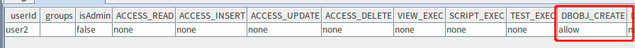
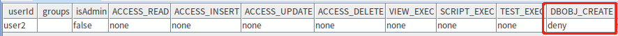
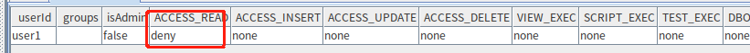
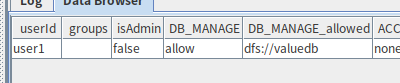
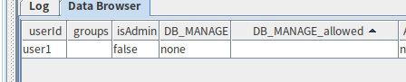
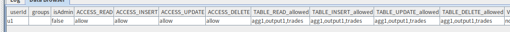

# 数据库权限和安全

在数据库产品使用过程中，为保证数据不被窃取、不遭破坏，我们需要通过用户权限来限制用户对数据库、数据表、视图等功能的操作范围，以保证数据库安全性。为此，DolphinDB 提供了具备以下主要功能的权限管理系统：

- 提供用户和组角色，方便权限控制
- 提供19种权限控制类别，适应各种场景
- 丰富的权限控制函数
- 函数视图兼顾保护数据隐私与提供分析结果
- 对任务调度和流数据任务动态鉴权，保证系统安全
- 使用 RSA 对用户关键信息加密
- 支持 SSO，保证安全通信，方便系统扩展

DolphinDB 在 1.30.21 和 2.00.9 版本中对权限管理主要做了如下升级,使权限控制更加精确、完善和方便：

- 新增数据库层面权限类型：DB_READ、DB_WRITE、DB_UPDATE、DB_DELETE、DB_INSERT
- 将原本的 TABLE_WRITE 权限细分为 TABLE_INSERT、TABLE_UPDATE、TABLE_DELETE
- 新增用户内存限制权限类型：QUERY_RESULT_MEM_LIMIT、TASK_GROUP_MEM_LIMIT
- 支持在数据节点执行权限相关函数

**目录**：
- [1.角色](#1角色)
  - [1.1 角色分类](#11-角色分类)
  - [1.2 角色管理](#12-角色管理)
- [2.权限管理](#2权限管理)
- [3. 权限确定规则](#3-权限确定规则)
  - [3.1 用户和组权限确定规则](#31-用户和组权限确定规则)
  - [3.2 数据库表权限确定规则](#32-数据库表权限确定规则)
  - [3.2 权限确定规则兼容性](#32-权限确定规则兼容性)
- [4. 权限类别](#4-权限类别)
  - [4.1 库级权限类别](#41-库级权限类别)
  - [4.2 表级权限类别](#42-表级权限类别)
  - [4.3 其他权限类别](#43-其他权限类别)
  - [4.4 权限类别兼容性](#44-权限类别兼容性)
  - [4.5 权限回收](#45-权限回收)
- [5.相关函数的权限校验](#5相关函数的权限校验)
  - [5.1 DDL 和 DML 相关函数](#51-ddl-和-dml-相关函数)
  - [5.2 可见性函数](#52-可见性函数)
- [6. 权限操作](#6-权限操作)
  - [6.1 分布式数据库](#61-分布式数据库)
  - [6.2 共享内存表](#62-共享内存表)
  - [6.3 流数据](#63-流数据)
  - [6.4 视图权限](#64-视图权限)
  - [6.5 定时作业权限](#65-定时作业权限)
  - [6.6 脚本执行权限](#66-脚本执行权限)
  - [6.7 内存限制权限](#67-内存限制权限)
- [7. 使用HTTPS实现安全通信](#7-使用https实现安全通信)
  - [7.1 使用 HTTPS 配置](#71-使用-https-配置)
  - [7.2 HTTPS 证书设置](#72-https-证书设置)
- [8. 支持 SSO (Single Sign On)](#8-支持-sso-single-sign-on)


## 1.角色

在未进行登录操作前，用户以 guest 身份访问 DolphinDB server，此时没有任何访问或操作数据库表的权限，也无法被赋予任何权限，需要执行 `login` 函数登录用户，具体的角色分类及创建用户方式等将在下述文章中介绍。

### 1.1 角色分类

#### 1.1.1 用户和组

在权限管理系统中，DolphinDB 引入组的概念，便于对具有相同权限的用户进行权限配置和管理。

当权限管理需求发生变化，只需要修改一次组的权限，就可以应用于组内所有用户。

组的新成员可以获得组拥有的所有权限。

一个用户可以属于0，1或多个组，一个组里也可以包括0，1或多个用户。

用户和组都是权限的载体。我们可以赋予或禁止一个用户、一个组某项权限。用户最终的实际权限是用户本身的权限，加上所属组的权限的结果（详见[3.1 用户和组权限确定规则](#31-用户和组权限确定规则)）。

#### 1.1.2 管理员和超级管理员

DolphinDB 将管理员分超级管理员（super admin）和普通管理员（admin）。

DolphinDB 集群第一次启动时，会自动创建用户名为 "admin"，密码为 "123456" 的超级管理员。此超级管理员初始时便拥有所有的权限，且无法被删除，其权限也无法被剥夺。

所有用户（包括超级管理员）都可以通过 `changePwd` 修改自己的密码，或者通过管理员 `resetPwd` 修改密码。

#### 1.1.3 管理员和普通用户

除管理员以外的用户即为普通用户。

管理员可以通过 `createUser` 函数的 *isAdmin* 参数决定是否将创建的用户设置为管理员。

只有管理员可以创建、删除用户和组，赋予或禁止、撤销其他管理员，用户和组的权限，获取其他用户和组的相关信息。

只有管理员才能执行如下用户管理函数： `resetPwd`, `createGroup`, `deleteGroup`, `createUser`, `deleteUser`, `addGroupMember`, `deleteGroupMember`。

以下为超级管理员、管理员和普通用户的初始权限对照表：

|                                                          | 超级管理员 | 管理员 | 非管理员用户 |
| :------------------------------------------------------- | :--------- | :----- | :----------- |
| 是否需要手动创建                                         | 否         | 是     | 是           |
| 是否可以被删除                                           | 否         | 是     | 是           |
| 是否会被 `getUserList` 函数列出                          | 否         | 是     | 是           |
| 是否有权创建和删除管理员、用户、组                       | 是         | 是     | 否           |
| 是否有权赋予和禁止管理员、用户、组的权限                 | 是         | 是     | 否           |
| 是否有权创建和删除函数视图                               | 是         | 是     | 否           |
| 是否有权删除其他用户提交的任务                           | 是         | 是     | 否           |
| 是否拥有所有类型的权限（权限类型介绍见 [4. 权限类别](#4-权限类别)） | 是         | 否     | 否           |

### 1.2 角色管理

> 2.00.9 和 1.30.21 版本后角色管理函数可以在数据节点执行，之前版本只允许在控制节点操作。

#### 1.2.1 管理用户

只有管理员可以创建用户：

```
login(`admin, "123456");//超级管理员登录
createUser("admin1","123456",,true)//创建普通管理员
login("admin1","123456")//普通管理员登录
createUser("user1","123456",,false)//普通管理员创建普通用户
createUser("user2","123456",,true)//普通管理员创建普通管理员
```

所有用户都可以修改自己的密码：

```
login("user1","123456")//登陆用户
changePwd("123456","123456@")//修改自己的密码
logout("user1")
login("user1","123456@")//修改密码成功
```

只有管理员可以修改其他用户的密码：

```
login("admin1","123456")//登陆管理员用户
resetPwd("user1","123456")//修改其他用户密码
login("user1","123456")//修改密码成功
```

只有管理员可以删除用户：

```
login("admin1","123456")//登陆管理员用户
deleteUser("user1")//删除用户
login("user1","123456")//用户删除成功
=> The user name or password is incorrect
```

#### 1.2.2 管理组

只有管理员可以进行组的管理操作。

创建组：

```
createGroup("group1",["admin1"])
```

添加组成员：

```
addGroupMember(["user2"],"group1")
```

删除组成员：

```
deleteGroupMember(["user2"],"group1")
```

删除组：

```
deleteGroup("group1")
```

删除组将不会删除组内成员，但会回收组的权限，单独对成员限权的操作不变；添加成员到组里后，该用户的权限会发生变化，详细权限判定规则见 [3.1 用户和组权限确定规则](#31-用户和组权限确定规则)。

#### 1.2.3 查看角色信息

- getGroupList： 返回所有组名列表，只能由管理员执行
- getUsersByGroupId：返回属于指定组的用户，只能由管理员执行
- getGroupsByUserId：返回用户所在的组，只能由管理员执行
- getGroupAccess：返回组的权限，只能由管理员执行
- getUserList：获取除管理员之外的所有用户名，只能由管理员执行
- getUserAccess：返回指定用户所单独被赋予的权限，不包括用户所属组的权限。管理员可以查看所有用户的权限，普通用户只能查看自己的权限，没有指定 userId 时，返回当前登录用户的权限

具体用法请参考 [DolphinDB 用户手册](https://www.dolphindb.cn/cn/help/Introduction/index.html)。

## 2.权限管理

用户可以使用 `grant`，`deny` 和 `revoke` 命令来赋予权限、禁止权限，以及撤销权限设置，对应的权限状态为 Allow，Deny 和 None。

> 2.00.9和1.30.21版本后权限管理函数操作可以在数据节点执行，之前版本只允许在控制节点操作。

grant命令：授予某个用户或某个用户组各类权限：

```
grant(`user2, DBOBJ_CREATE,"*") 
getUserAccess("user2")
```



revoke命令:撤销某个用户或某个组的之前被赋予或禁止的权限：

```
revoke(`user2, DBOBJ_CREATE,"*")
getUserAccess("user2")
```

  

deny命令:拒绝某个用户或某个组的权限：

```
deny(`user2, DBOBJ_CREATE,"*") 
getUserAccess("user2")
```



## 3. 权限确定规则

### 3.1 用户和组权限确定规则

将用户本身也视为一个特殊的组，用户本身的权限就是这个组的权限。用户的最终权限是其所属的所有组的权限共同决定的结果。组的存在简化了对用户权限的管理，与此同时也不免出现权限冲突的情况，以下为权限确定规则：

- 若用户在至少一组中被赋予某项权限，并且在其他组中没有禁止该项权限，则用户拥有该项权限
- 若用户在至少一组中被禁止某项权限，即使在其他组中被赋予该项权限，此用户的该项权限依然被禁止

**例1**： 若用户只属于一个组，用户对某个权限的状态为 Deny，所在组对当前权限的状态为 Allow，则最终用户对该权限的状态为 Deny：

```
login("admin","123456")
createUser("user2","123456")
createGroup("group1",["user2"])
deny(`user2, DB_OWNER)//禁止 user2 拥有 DB_OWNER 权限
grant(`group1, DB_OWNER)//赋予 group1DB_OWNER 权限
login("user2","123456")
database("dfs://test",VALUE,1..10)//user2 没有 DB_OWNER 权限
=> <NoPrivilege>Not granted to create or delete databases
```

**例2**： 若用户只属于一个组，用户对某个权限的状态为 None，所在组对当前权限的状态为 Allow，则最终用户对该权限的状态为 Allow：

```
login("admin","123456")
revoke(`user2, DB_OWNER)//撤销禁止 user2 的 DB_OWNER 权限
grant(`group1, DB_OWNER)//赋予 group1DB_OWNER 权限
login("user2","123456")
database("dfs://test",VALUE,1..10)//user2 拥有 DB_OWNER 权限
```

**例3**： 若用户只属于一个组，用户对某个权限的状态为 None，所在组对当前权限的状态为 Deny，则最终用户对该权限的状态为 Deny：

```
login("admin","123456")
revoke(`user2, DB_OWNER)//撤销禁止 user2 的 DB_OWNER 权限
deny(`group1, DB_OWNER)//赋予 group1DB_OWNER 权限
login("user2","123456")
database("dfs://test",VALUE,1..10)//user2 没有 DB_OWNER 权限
=> <NoPrivilege>Not granted to create or delete databases
```

**例4**： 若用户属于多个组，某个组对某个权限的状态为 Deny，其他组对当前权限的状态为 Allow，则最终用户对该权限的状态为 Deny：

```
login("admin","123456")
createGroup("group2",["user2"])
createGroup("group3",["user2"])
deny(`group1, DB_OWNER)
grant(`group2, DB_OWNER)
grant(`group3, DB_OWNER)
login("user2","123456")
database("dfs://test",VALUE,1..10)//user2 没有 DB_OWNER 权限
=> <NoPrivilege>Not granted to create or delete databases
```

**例5**： 若用户属于多个组，某个组对某个权限的状态为 None，其他组对当前权限的状态为 Allow，则最终用户对该权限的状态为 Allow：

```
login("admin","123456")
revoke(`group1, DB_OWNER)
grant(`group2, DB_OWNER)
grant(`group3, DB_OWNER)
login("user2","123456")
database("dfs://test",VALUE,1..10)//user2 拥有 DB_OWNER 权限
```

**例6**： 若用户属于多个组，某个组对某个权限的状态为 None，其他组对当前权限的状态为 Deny，则最终用户对该权限的状态为 Deny：

```
login("admin","123456")
revoke(`group1, DB_OWNER)
deny(`group2, DB_OWNER)
deny(`group3, DB_OWNER)
login("user2","123456")
database("dfs://test",VALUE,1..10)//user2 没有 DB_OWNER 权限
=> <NoPrivilege>Not granted to create or delete databases
```

**例7**： 若用户所在的组被删除，则以用户本身被赋予的权限为准：

```
login("admin","123456")
createUser("user2","123456")
createGroup("group1",["user2"])
grant(`user2, DB_OWNER)//赋予 user2 DB_OWNER 权限
deny(`group1, DB_OWNER)//禁止 group1 DB_OWNER 权限
deleteGroup(`group1)//删除 group1
login("user2","123456")
database("dfs://test",VALUE,1..10)//user2 拥有 DB_OWNER 权限
----------------------------------------------------------------
login("admin","123456")
createGroup("group1",["user2"])
revoke(`user2, DB_OWNER)//回收 user2 DB_OWNER 权限
grant(`group1, DB_OWNER)//赋予 group1 DB_OWNER 权限
deleteGroup(`group1)//删除 group1
login("user2","123456")
database("dfs://test",VALUE,1..10)//user2 没有 DB_OWNER权限
```

### 3.2 数据库表权限确定规则

权限作用的对象范围从大到小可以分为：全局(*)，数据库，表。

以下为库表级权限确定规则：

- 先小范围赋予/撤销/禁止权限，再大范围操作权限，此时小范围权限失效，会被大范围的权限覆盖
- 先大范围 allow, 再小范围 deny，此时 deny 操作生效，allow 权限覆盖的除 deny 以外的范围依旧是 allow
- 先大范围 allow, 再小范围 revoke，此时 revoke 操作无效，allow 权限覆盖的范围依旧是 allow
- 先大范围 deny, 再小范围 revoke，此时 revoke 操作无效，deny 权限覆盖的范围依旧是 deny
- 先大范围 deny, 再小范围 grant ， 1.30.21和2.00.9版本前 grant 可以生效，deny 权限覆盖的除 grant 以外的范围依旧是 deny， 1.30.21 和 2.00.9 版本后不支持此操作
- 先大范围 revoke, 再小范围操作权限，此时小范围权限操作生效

**例1**：对用户 user1 `deny` 表级的 TABLE_READ 权限，然后 `grant` 全局 TABLE_READ 权限，此时 user1 拥有所有表的 TABLE_READ 权限:

```
login("admin", "123456")
createUser("user1","123456")
dbName = "dfs://test"
if(existsDatabase(dbName)){
        dropDatabase(dbName)
}
t = table(1..10 as id , rand(100, 10) as val)
db=database(dbName, VALUE, 1..10)
pt=  db.createPartitionedTable(t, "pt", "id")
pt.append!(t)

deny("user1", TABLE_READ, dbName+"/pt")
grant("user1", TABLE_READ, "*")

login("user1", "123456")
select * from loadTable(dbName, "pt")//user1 获得读 "dfs://test"的权限
```

**例2**：对用户 user2 `grant` 表级的 TABLE_READ 权限，然后 `deny` 全局 TABLE_READ 权限，此时 user2 被禁止所有表的 TABLE_READ权限:

```
login("admin", "123456")
createUser("user2","123456")
dbName = "dfs://test"
if(existsDatabase(dbName)){
        dropDatabase(dbName)
}
t = table(1..10 as id , rand(100, 10) as val)
db=database(dbName, VALUE, 1..10)
pt=  db.createPartitionedTable(t, "pt", "id")
pt.append!(t)

grant("user2", TABLE_READ, dbName+"/pt")
deny("user2", TABLE_READ, "*")

login("user2", "123456")
select * from loadTable(dbName, "pt")//user2 被禁止读 "dfs://test"
```

**例3**：对用户 user3 `grant` 表级的 TABLE_READ 权限，然后 `revoke` 全局 TABLE_READ 权限，此时 user3 被回收所有表的 TABLE_READ 权限：

```
login("admin", "123456")
createUser("user3","123456")
dbName = "dfs://test"
if(existsDatabase(dbName)){
        dropDatabase(dbName)
}
t = table(1..10 as id , rand(100, 10) as val)
db=database(dbName, VALUE, 1..10)
pt=  db.createPartitionedTable(t, "pt", "id")
pt.append!(t)

grant("user3", TABLE_READ, dbName+"/pt")
revoke("user3", TABLE_READ, "*")
login("user3", "123456")
select * from loadTable(dbName, "pt")//user 被撤回读 "dfs://test" 的权限
```

**例4**： 先对用户 user1 `grant` 全局的 TABLE_READ 权限，然后 `deny` "dfs://test/pt" 表 TABLE_READ 权限，此时 user1 拥有除 "dfs://test/pt" 表外所有表的 TABLE_READ 权限：

```
login("admin", "123456")
createUser("user1","123456")
dbName = "dfs://test"
t = table(1..10 as id , rand(100, 10) as val)
if(existsDatabase(dbName)){
        dropDatabase(dbName)
}
db=database(dbName, VALUE, 1..10)
pt=  db.createPartitionedTable(t, "pt", "id")
pt.append!(t)
grant("user1", TABLE_READ, "*")
deny("user1", TABLE_READ, dbName+"/pt")

login("user1", "123456")
select * from loadTable(dbName, "pt")//user1被禁止读"dfs://test/pt"
```

**例5**： 先对用户 user1 `grant` 全局的 TABLE_READ 权限，然后 `revoke` "dfs://test/pt" 表 TABLE_READ 权限，此时 user1 仍然拥有所有表的 TABLE_READ 权限：

```
login("admin", "123456")
createUser("user1","123456")
dbName = "dfs://test"
t = table(1..10 as id , rand(100, 10) as val)
if(existsDatabase(dbName)){
        dropDatabase(dbName)
}
db=database(dbName, VALUE, 1..10)
pt=  db.createPartitionedTable(t, "pt", "id")
pt.append!(t)
grant("user1", TABLE_READ, "*")
revoke("user1", TABLE_READ, dbName+"/pt")

login("user1", "123456")
select * from loadTable(dbName, "pt")//user1 有读 "dfs://test/pt" 的权限
```

**例6**： 先对用户 user1 `deny` 全局的 TABLE_READ 权限，然后 `revoke` "dfs://test/pt" 表 TABLE_READ 权限，此时 user1 仍然被拒绝所有表的 TABLE_READ 权限：

```
login("admin", "123456")
createUser("user1","123456")
dbName = "dfs://test"
if(existsDatabase(dbName)){
        dropDatabase(dbName)
}
t = table(1..10 as id , rand(100, 10) as val)
db=database(dbName, VALUE, 1..10)
pt=  db.createPartitionedTable(t, "pt", "id")
pt.append!(t)

deny("user1", TABLE_READ, "*")
revoke("user1", TABLE_READ, dbName+"/pt")

getUserAccess("user1")//TABLE_READ 依旧是 deny
```



  

**例7**： 先对用户 user1 `deny` 全局的 TABLE_READ 权限，然后 `grant` "dfs://test/pt" 表 TABLE_READ 权限，1.30.21 和 2.00.9版本前，此时 user1 被赋予读 "dfs://test/pt" 表的权限，被拒绝其他所有表的 TABLE_READ 权限，而新版本则在执行 `grant` 的时候抛出异常：

```
login("admin", "123456")
createUser("user1","123456")
dbName = "dfs://test"
if(existsDatabase(dbName)){
        dropDatabase(dbName)
}
t = table(1..10 as id , rand(100, 10) as val)
db=database(dbName, VALUE, 1..10)
pt=  db.createPartitionedTable(t, "pt", "id")
pt1=  db.createPartitionedTable(t, "pt1", "id")
pt.append!(t)
pt1.append!(t)

deny("user1", TABLE_READ, "*")
//新版本中执行grant报错 'Invalid grant: grant [dfs://test/pt] and [deny *] are in conflict'
grant("user1", TABLE_READ, dbName+"/pt")
login("user1", "123456")
select * from loadTable(dbName, "pt")//老版本有读 dbName+"/pt" 的权限
select * from loadTable(dbName, "pt1")//老版本没有读其他表的权限
```

### 3.2 权限确定规则兼容性

1.30.21 和 2.00.9 版本前，如果某个用户对两张不同表分别 `grant` 和 `deny`  相同的表层面权限（TABLE_READ 或 TABLE_WRITE），升级到新版本后该用户会拥有除 `deny` 的表以外所有表的该权限。举例如下：

1.30.21 和 2.00.9 版本以前，使用 `grant`` 命令赋予或使用 `deny`` 命令禁用用户 'user1'不同表对象的 TABLE_READ 权限后，'user1' 将只有 "dfs://valuedb/pt1" 表的读权限：

```
login("admin","123456")
createUser("user1","123456")
grant("user1",TABLE_READ,"dfs://valuedb/pt1")
deny("user1",TABLE_READ,"dfs://valuedb/pt2")
```

升级到新版本后，user1 拥有 "dfs://valuedb" 库中除 pt2 以外所有表的读权限, 等同于执行：

```
grant("user1",TABLE_READ,"dfs://valuedb/*")
deny("user1",TABLE_READ,"dfs://valuedb/pt2")
```

## 4. 权限类别

> 1.30.21 和 2.00.9 版本新增权限 DB_READ, DB_WRITE, DB_INSERT,DB_UPDATE, DB_DELETE, TABLE_INSERT, TABLE_UPDATE, TABLE_DELETE。

### 4.1 库级权限类别

- DB_MANAGE：1.30.21 和 2.00.9 版本之前，可以创建以及删除数据库，可删除任何人所建数据库，包括具有 DB_OWNER 权限之用户所建数据库；1.30.21和 2.00.9 版本之后不能创建数据库， 只能删除数据库
- DB_OWNER：创建数据库并管理其创建的数据库，包括删除数据库、创建或删除数据表、增加或删除分区、可赋予、禁止或取消其他用户对自己创建的数据库的以下权限：TABLE_READ, TABLE_WRITE, TABLE_INSERT, TABLE_UPDATE, TABLE_DELETE, DBOBJ_CREATE, DBOBJ_DELETE, DB_READ, DB_WRITE, DB_INSERT, DB_UPDATE, DB_DELETE
- DBOBJ_CREATE：允许在数据库中建表
- DBOBJ_DELETE：允许在数据库中删除表
- DB_WRITE：允许写数据库所有表，包含表的增删改权限
- DB_INSERT：允许追加数据到某库所有表
- DB_UPDATE：允许更新某库所有表的数据
- DB_DELETE：允许删除某库所有表的数据
- DB_READ：允许读某库所有表

### 4.2 表级权限类别

- TABLE_WRITE：允许增删改所有/指定数据表
- TABLE_READ：允许读取所有/指定数据表
- TABLE_INSERT：允许追加数据到指定表
- TABLE_UPDATE：允许更新指定表的数据
- TABLE_DELETE：允许删除指定表的数据

### 4.3 其他权限类别

- VIEW_EXEC：视图执行权限
- SCRIPT_EXEC：脚本执行权限
- TEST_EXEC：测试脚本执行权限
- QUERY_RESULT_MEM_LIMIT：限制用户的查询内存大小
- TASK_GROUP_MEM_LIMI： 限制用户发送的批量子查询占用的内存大小

### 4.4 权限类别兼容性

1. 1.30.21 和 2.00.9 版本前创建的用户，如果只拥有 DB_MANAGE 权限而没有 DB_OWNER 权限，升级到新版本就无法创建库,需要重新赋予 DB_OWNER 权限。
2. 1.30.21 和 2.00.9 版本前创建的用户，如果被赋予 TABLE_WRITE 权限，升级到新版本后将同时拥有 TABLE_INSERT, TABLE_UPDATE, TABLE_DELETE 权限。
3. 1.30.21 和 2.00.9 版本起，accessType=DB_OWNER 时 `grant` / `deny` / `revoke` 命令中的 objs 若作用于库必须以"*"结尾，表示指定某个 dbName 的前缀范围：

```
login("admin", "123456")
createUser("user1","123456")
grant("user1", DB_OWNER,"*")//用户拥有所有数据库的 DB_OWNER 权限
grant("user1", DB_OWNER,"dfs://test0*")//用户拥有以 "dfs://test0" 为前缀的数据库 DB_OWNER 权限
```

4. 1.30.21 和 2.00.9 版本起，accessType=DB_MANAGE 时，使用 `grant `/ `deny` / `revoke` 命令需确保 objs 中指定的数据库已存在,否则将报错：

```
login("admin", "123456")
createUser("user1","123456")
grant("user1", DB_MANAGE,"dfs://test0") => The database [dfs://test0]  does not exist
grant("user1", DB_MANAGE, ["dfs://db1","dfs://db2"]) => The database [dfs://db1]  does not exist
```

### 4.5 权限回收

表级别的权限在指定表或用户删除的时候回收，库级别的权限在指定库或用户删除的时候回收，DB_OWNER 权限只在用户和该用户下所有库都删除的时候回收。

当权限操作的访问对象为共享内存表、流数据引擎时，权限不会因 server 重启或共享内存表、流数据引擎的删除而回收。当再次创建同名共享内存表、流数据引擎并对其进行访问控制时，对用户的权限操作依然生效。

**例1**： "user1" 拥有 "dfs://valuedb/pt" 表的 TABLE_READ 权限，删除 "dfs://valuedb/pt" 表后重新创建，user1 用户的 TABLE_READ 权限被回收：

```
login("admin", "123456")
dbName = "dfs://valuedb"
t = table(1..10 as id , rand(100, 10) as val)
if(existsDatabase(dbName)){
        dropDatabase(dbName)
} 
db=database(dbName, VALUE, 1..10)
pt=  db.createPartitionedTable(t, "pt", "id").append!(t)
​
createUser("user1","123456")
grant("user1", TABLE_READ,"dfs://valuedb/pt")
login("user1", "123456")
select * from loadTable( "dfs://valuedb",`pt)//此时user1 拥有"dfs://valuedb/pt"表的TABLE_READ权限
login("admin", "123456")
dropTable(db,`pt)
pt=  db.createPartitionedTable(t, "pt", "id").append!(t)
login("user1", "123456")
select * from loadTable( "dfs://valuedb",`pt)//user1用户的TABLE_READ权限被回收
```

**例2**： "user1" 拥有 "dfs://valuedb" 库的 DB_MANAGE 权限，删除 "dfs://valuedb" 库后重新创建，user1 用户的 DB_MANAGE 权限被回收：

```
login("admin", "123456")
dbName = "dfs://valuedb"
t = table(1..10 as id , rand(100, 10) as val)
if(existsDatabase(dbName)){
        dropDatabase(dbName)
}
db=database(dbName, VALUE, 1..10)
pt=  db.createPartitionedTable(t, "pt", "id").append!(t)

createUser("user1","123456")
grant("user1", DB_MANAGE,"dfs://valuedb")
getUserAccess("user1")
```

此时 user1 拥有 "dfs://valuedb" 库的 DB_MANAGE 权限。




```
login("admin", "123456")
if(existsDatabase(dbName)){
        dropDatabase(dbName)
}
db=database(dbName, VALUE, 1..10)
pt=  db.createPartitionedTable(t, "pt", "id").append!(t)
getUserAccess("user1")
```

此时 user1 用户的 DB_MANAGE 权限被回收。




**例3**： "u1" 用户拥有流表 "trades"、"output1" 和流引擎 "agg1" 的读写权限：

```
login(`admin, `123456)
createUser(`u1, "111111");
enableTableShareAndPersistence(streamTable(1000:0, `time`sym`volume, [TIMESTAMP, SYMBOL, INT]),`trades)
share streamTable(1000:0, `time`sym`volume, [TIMESTAMP, SYMBOL, INT]) as  output1
agg1 = createTimeSeriesEngine(name="agg1", windowSize=600, step=600, metrics=<[sum(volume)]>, dummyTable=trades, outputTable=output1, timeColumn=`time, useSystemTime=false, keyColumn=`sym, garbageSize=50, useWindowStartTime=false)
grant("u1", TABLE_READ, "agg1")
grant("u1", TABLE_WRITE, "agg1")
grant("u1", TABLE_READ, "trades")
grant("u1", TABLE_WRITE, "trades")
grant("u1", TABLE_READ, "output1")
grant("u1", TABLE_WRITE, "output1")
getUserAccess(`u1)
```

 


重启或删除并创建同名流表 "trades"、"output1" 和流引擎 "agg1"，此时三个对象都没有访问控制，任何用户可以对其进行读写：

```
login(`admin, `123456)
enableTableShareAndPersistence(streamTable(1000:0, `time`sym`volume, [TIMESTAMP, SYMBOL, INT]),`trades)
share streamTable(1000:0, `time`sym`volume, [TIMESTAMP, SYMBOL, INT]) as  output1
agg1 = createTimeSeriesEngine(name="agg1", windowSize=600, step=600, metrics=<[sum(volume)]>, dummyTable=trades, outputTable=output1, timeColumn=`time, useSystemTime=false, keyColumn=`sym, garbageSize=50, useWindowStartTime=false)
```

增加访问控制：

```
addAccessControl(`trades)
addAccessControl(output1)
addAccessControl(agg1)
```

此时只有用户 "u1" 和三个对象的创建者 "admin" 可以访问对象：

```
login(`u1, "111111")
insert into agg1 values(2018.10.08T01:01:01.785,`A,10) 
insert into output1 values(2018.10.08T01:01:01.785,`A,10) 
insert into trades values(2018.10.08T01:01:01.785,`A,10) 
```

其他用户被拒绝访问：

```
login(`u2, "111111")
insert into agg1 values(2018.10.08T01:01:01.785,`A,10)=> No access to table [agg1]'
insert into output1 values(2018.10.08T01:01:01.785,`A,10) => No access to table [output1]'
insert into trades values(2018.10.08T01:01:01.785,`A,10) => No access to table [trades]'
```

## 5.相关函数的权限校验

本章将介绍相关函数在 1.30.21 和 2.00.9 版本前（旧版）和后（新版 ）涉及的权限对比。

### 5.1 DDL 和 DML 相关函数

分布式表 DDL 和 DML 操作所需权限如下表所示：

| 操作                                                 | 新版权限                                                     | 旧版权限                                                     |
| :--------------------------------------------------- | :----------------------------------------------------------- | :----------------------------------------------------------- |
| database 新建数据库                                  | 拥有 DB_OWNER 权限用户可以创建全局或指定前缀的数据库。       | 拥有 DB_MANAGE 或者 DB_OWNER 权限可以新建所有名字的数据库。  |
| database 加载已有的库                                | 无校验                                                       | 无校验                                                       |
| dropDatabase                                         | DB_MANAGE 用户可以删除任意或指定数据库；<br/>DB_OWNER 用户可以删除自己创建的数据库。 | DB_MANAGE 用户可以删除任何用户的数据库；<br/>DB_OWNER 用户可以删除自己创建的数据库。 |
| createTable                                          | DB_MANAGE 用户可以创建任意或指定数据库下的表；<br>DB_OWNER 用户可以在自己创建的数据库下建表；<br/>DBOBJ_CREATE 用户可以创建任意或指定数据库下的表。 | 当前数据库的创建者或者对当前数据库有DBOBJ_CREATE 权限的用户可以创建该数据库下的表。 |
| dropTable                                            | DB_MANAGE 用户可以删除任意或指定数据库下的表；<br/>DB_OWNER 用户可以在自己创建的数据库下删除表；<br/>DBOBJ_DELETE 用户可以删除任意或指定数据库下的表。 | DB_OWNER 权限用户可以删除自己创建的数据库下任何用户所创建的表；<br/>DB_MANAGE 用户可以删除自己创建的表；对当前数据库有 DBOBJ_DELETE 权限的用户可以删除该库中所有表。 |
| createPartitionedTable                               | DB_MANAGE 用户可以创建任意或指定数据库下的表；<br/>DB_OWNER 用户可以在自己创建的数据库下建表；<br/>DBOBJ_CREATE 用户可以创建任意或指定数据库下的表。 | 当前数据库的创建者或者对当前数据库有 DBOBJ_CREATE 权限的用户可以创建该数据库下的表。 |
| addPartitions(addValuePartitions/addRangePartitions) | DB_MANAGE 用户可以增加任意或指定数据库的分区；<br/>DB_OWNER 用户可以增加自己创建的数据库的分区。 | DB_MANAGE 用户可以增加任何数据库的分区；<br/>DB_OWNER 用户可以增加自己创建的数据库的分区。 |
| newValuePartitionPolicy=add 配置项                   | 所有拥有写入表权限的用户，写入新分区会自动添加。             | 所有拥有写入表权限的用户，写入新分区会自动添加。             |
| dropPartition(deleteSchema=false)                    | DB_MANAGE 用户可以删除任意或指定数据库的分区；<br/>DB_OWNER 用户可以删除自己创建的数据库的分区； <br/>DB_DELETE 权限可以删除任意或指定数据库的分区；<br/>TABLE_DELETE 权限为全局时可以删除所有数据库分区。 | DB_OWNER 用户可以删除自己创建的数据库的分区；<br/>DBOBJ_DELETE 权限可以删除指定或全部数据库的分区。 |
| dropPartition(deleteSchema=true)                     | DB_MANAGE 用户可以删除任意或指定数据库的分区；<br/>DB_OWNER 用户可以删除自己创建的数据库的分区。 | DB_OWNER 用户可以删除自己创建的数据库的分区；DBOBJ_DELETE 权限可以删除指定或全部数据库的分区。 |
| renameTable                                          | DB_MANAGE用户可以 rename 任意或指定数据库下的表；<br/>DB_OWNER 用户可以在自己创建的数据库下 rename 表；<br/>DBOBJ_CREATE 用户可以 rename 任意或指定数据库下的表。 | DB_OWNER 权限用户可以 rename 自己数据库下的表；<br/>DBOBJ_DELETE 权限用户可以 rename 指定数据库下的表。 |
| addColumn                                            | DB_MANAGE 可以增加任意或指定数据库下表的列；<br/>DB_OWNER 用户可以增加自己创建的数据库下表的列；<br/>DBOBJ_CREATE 用户可以增加任意或指定数据库下表的列。 | 拥有 DB_OWNER、DB_MANAGE 权限的用户可以对自己创建的表进行 `addColumn`；<br/>拥有 DBOBJ_CREATE 权限的用户可以对指定数据库下的表 `addColumn`。 |
| dropColumns!                                         | DB_MANAGE 可以删除任意或指定数据库下表的列；<br/>DB_OWNER 用户可以删除自己创建的数据库下表的列；<br/>DBOBJ_CREATE 用户可以删除自己创建的表的列；<br/>DBOBJ_DELETE 用户可以删除任意或指定数据库下表的列。 | DB_MANAGE 用户可以删除任何数据库下表的列；<br/>DB_OWNER 用户可以删除自己的数据库下表的列。 |
| rename!                                              | DB_MANAGE 可以 rename 任意或指定数据库下表的列；<br/>DB_OWNER 用户可以 rename 自己创建的数据库下表的列；<br/>DBOBJ_CREATE 用户可以 rename 任意或指定数据库下表的列。 | DB_MANAGE 用户可以 rename 任何数据库下表的列；<br/>DB_OWNER 用户可以 rename 自己的数据库下表的列。 |
| replaceColumn!                                       | DB_MANAGE 用户可以 replace 任意或指定数据库下表的列；<br/>DB_OWNER 用户可以 replace 自己创建的数据库下表的列；<br/>DBOBJ_CREATE 用户可以 replace 任意或指定数据库下表的列。 | DB_MANAGE 用户可以 replace 任何数据库下表的列；<br/>DB_OWNER 用户可以 replace 自己的数据库下表的列。 |
| setColumnComment                                     | DB_MANAGE 可以对任意或指定数据库下的表`setColumnComment`；<br/>DB_OWNER 用户可以对自己创建的数据库下表 `setColumnComment`；<br/>DBOBJ_CREATE 用户可以对任意或指定数据库下表 `setColumnComment`。 | 拥有 DB_OWNER、DB_MANAGE 权限的用户可以对自己创建的表进行 `setColumnComment`；<br/>拥有DBOBJ_CREATE 权限的用户可以对指定数据库下的表 `setColumnComment`。 |
| truncate                                             | 拥有 DBOBJ_CREATE、DB_OWNER、DB_MANAGE 权限的用户可以对自己创建的表进行 `truncate`；<br/>拥有 TABLE_WRITE/TABLE_DELETE/DB_WRITE/DB_DELETE 权限的用户可以对指定表进行 `truncate`；<br/>拥有 VIEW_EXEC 权限的用户可以执行视图中的 `truncate`。 | 拥有 DBOBJ_CREATE、DB_OWNER、DB_MANAGE 权限的用户可以对自己创建的表进行 `truncate`；<br/>拥有 `TABLE_WRITE` 权限的用户可以对指定表进行 `truncate`；<br/>拥有 VIEW_EXEC 权限的用户可以执行视图中的 `truncate`。 |
| append!                                              | 拥有 DBOBJ_CREATE、DB_OWNER、DB_MANAGE 权限的用户可以对自己创建的表进行 `append!`；<br/>拥有 TABLE_WRITE、TABLE_INSERT、DB_WRITE、DB_INSERT 权限的用户可以对指定表进行 `append!`；<br/>拥有 VIEW_EXEC 权限的用户可以执行视图中的 `append!`。 | 拥有 DBOBJ_CREATE、DB_OWNER、DB_MANAGE 权限的用户可以对自己创建的表进行 `append!`；<br/>拥有 TABLE_WRITE 权限的用户可以对该表进行 `append!`；<br/>拥有 VIEW_EXEC 权限的用户可以执行视图中的 `append!`。 |
| upsert/SQL update                                    | 拥有 DBOBJ_CREATE、DB_OWNER、DB_MANAGE 权限的用户可以对自己创建的表进行 `upsert`/`update`；<br/>拥有TABLE_WRITE、TABLE_UPDATE、DB_DELETE、DB_UPDATE权限的用户可以对指定表进行 `upsert`/`update`；<br/>拥有 VIEW_EXEC 权限的用户可以执行视图中的 `upsert`/`update`。 | 拥有 DBOBJ_CREATE、DB_OWNER、DB_MANAGE 权限的用户可以对自己创建的表进行 `upsert`/`update`；<br/>拥有 TABLE_WRITE 权限的用户可以对该表进行`upsert`/`update`；<br/>拥有 VIEW_EXEC 权限的用户可以执行视图中的 `upsert`/`update`。 |
| SQL delete                                           | 拥有 DBOBJ_CREATE、DB_OWNER、DB_MANAGE 权限的用户可以对自己创建的表进行 `delete`；<br/>拥有 TABLE_WRITE、TABLE_DELETE、DB_WRITE、DB_DELETE 权限的用户可以对指定表进行 `delete`；<br/>拥有 VIEW_EXEC 权限的用户可以执行视图中的 `delete`。 | 拥有 DBOBJ_CREATE、DB_OWNER、DB_MANAGE 权限的用户可以对自己创建的表进行 `delete`；<br/>拥有 TABLE_WRITE 权限的用户可以对该表进行 `delete`；<br/>拥有 VIEW_EXEC 权限的用户可以执行视图中的 `delete`。 |

> 在执行 `addColumn`、`dropColumns!`、`renameColumns`、`replaceColumns`、`setColumnComment`、`rename!`、`renameTable` 函数时，若用户所操作的表对象为其他用户所创建，需要给当前用户赋予表对象的 TABLE_READ 权限。

**例如**：

在用户 user1 创建的数据库中赋予 user2  DBOBJ_CREATE 权限并创建表 pt1:

```
login("admin", "123456")
createUser("user1","123456",,true)
createUser("user2","123456",,true)
grant(`user1, DB_OWNER,"dfs://test*")

login("user1", "123456")
dbName = "dfs://test"
if(existsDatabase(dbName)){
        dropDatabase(dbName)
}
t = table(1..10 as id , rand(100, 10) as val)
db=database(dbName, VALUE, 1..10)
grant(`user2, DBOBJ_CREATE ,"dfs://test")
login("user2", "123456")
pt1=  db.createPartitionedTable(t, "pt1",`id).append!(t)
```

此时若 user1 想要 rename 表 pt1 某一列 ，会报错：

```
login("user1", "123456")
rename!(pt1,`val,`val1)// <NoPrivilege>Not granted to read table dfs://test/pt1'
```

需要赋予 user1 对 pt1 表的读权限：

```
login("admin", "123456")
grant(`user1, TABLE_READ,"dfs://test/pt1")
```

此时 rename 成功：

```
login("user1", "123456")
rename!(pt1,`val,`val1)
schema(loadTable(dbName,`pt1)).colDefs
------------------------------------------
name typeString typeInt extra comment
---- ---------- ------- ----- -------
id   INT        4                    
val1 INT        4                          
```

### 5.2 可见性函数

可见性函数所需权限如下表所示：

| 函数                   | 新版权限                                                     | 旧版权限                                     |
| :--------------------- | :----------------------------------------------------------- | :------------------------------------------- |
| getAllDBs              | 管理员或拥有 DB_MANAGE 权限的用户返回当前节点上所有分布式数据库；<br/>其他用户仅返回有 DB_OWNER 权限的数据库 | 所有用户返回当前节点上所有分布式数据库       |
| getTables              | 返回指定数据库中的所有表                                     | 返回指定数据库中的所有表                     |
| getClusterDFSDatabases | 管理员或拥有 DB_MANAGE 权限的用户返回当前节点上所有分布式数据库；<br/>其他用户仅返回有 DB_OWNER 权限的数据库 | 所有用户返回当前节点上所有分布式数据库       |
| getDFSDatabases        | 管理员或拥有 DB_MANAGE 权限的用户返回当前节点上所有分布式数据库；<br/>其他用户仅返回有 DB_OWNER 权限的数据库 | 所有用户返回当前节点上所有分布式数据库       |
| getDFSTablesByDatabase | 管理员或拥有 DB_MANAGE 权限的用户返回当前节点上所有分布式数据库中的表；<br/>其他用户仅返回有 DB_OWNER 权限的数据库中的表 | 所有用户返回当前节点上所有分布式数据库中的表 |

> 在新版本中,仅拥有 VIEW_EXEC 权限的用户无法获取上述函数结果。

## 6. 权限操作

本章将分别介绍权限操作在分布式数据库、共享内存表、流数据表、流数据引擎、视图、定时作业中的部分应用场景。

### 6.1 分布式数据库

在分布式数据库中，可以通过 `grant` / `deny` / `revoke` 命令设置用户或者组的权限。在[4.1](#41-库级权限类别)&[4.2](#42-表级权限类别)节中的所有权限，可作为上述三个命令的 *accessType* 参数值。

其中，TABLE_READ，TABLE_WRITE，TABLE_INSERT，TABLE_UPDATE，TABLE_DELETE 权限作用范围为全局或表级。DBOBJ_CREATE，DBOBJ_DELETE，DB_READ，DB_WRITE，DB_INSERT，DB_UPDATE，DB_DELETE，DB_MANAGE，DB_OWNER 权限作用范围为全局或库级。

**例1**： 赋予用户 "user1" 全局的 TABLE_READ 权限：

```
 grant(`user1, TABLE_READ, "*")
```

**例2**： 赋予 "user1" 用户 "dfs://valuedb" 库下 pt 表的 TABLE_READ 权限：

```
 grant(`user1, TABLE_READ,"dfs://valuedb/pt")
```

**例3**： 赋予 "user1" 用户 "dfs://valuedb" 库的 DBOBJ_CREATE 权限：

```
 grant(`user1, DBOBJ_CREATE,"dfs://valuedb")
```

**例4**：授权某个用户对某数据库中所有表的读写权限（1.30.21 和 2.00.9 版本新增功能）：

```
login("admin","123456")
createUser("user1","123456")
grant("user1",DB_READ,"dfs://valuedb")
grant("user1",DB_WRITE,"dfs://valuedb")
```

此时 user1 拥有 "dfs://valuedb" 库中所有增删改查权限。

**例5**：限制用户创建并管理以 "dfs://db0" 为前缀的数据库（1.30.21 和 2.00.9 版本新增功能）：

```
login("admin","123456")
createUser("AlexSmith","123456")
grant("AlexSmith", DB_OWNER, "dfs://db0*")
```

此时若用户 "AlexSmith" 创建以 "dfs://db1" 命名的数据库，会被拒绝。

**例6**：赋予一个组中所有组员读某张表的权限，但只有部分组员有写权限：

```
login("admin","123456")
createUser("user1","123456")
createUser("user2","123456")
createUser("user3","123456")
createGroup("group1",["user1","user2","user3"])
grant("group1", TABLE_READ, "dfs://valuedb/pt")
createUser("user4","123456")
addGroupMember("user4","group1")
grant("user1", TABLE_WRITE, "dfs://valuedb/pt")
grant("user4", TABLE_WRITE, "dfs://valuedb/pt")
```

此时 user1 和 user4 拥有对 "dfs://valuedb/pt" 表的增删改查权限，user2  和 user3 只有对其查看的权限。

**例7**：可以使用 `grant` 或 `deny` 对所有对象(以*代表)赋予或禁止权限。例如，赋予用户 JoeFlacco 可读任何 DFS 数据表的权限：

```
grant("JoeFlacco",TABLE_READ,"*")  
```

当 `grant` 或 `deny` 所有对象后，若要撤销操作，只能使用 `revoke` 撤销所有对象的权限，若只撤销某个指定对象的权限，则操作无效：

```
revoke("JoeFlacco",TABLE_READ,"dfs://db1/t1")
```

以上命令无效。

```
revoke("JoeFlacco",TABLE_READ,"*")
```

以上命令取消了用户 JoeFlacco 可读任何 DFS 数据表的权限。

与之类似，使用 `grant` 或 `deny` 对组赋予或禁止权限后，只能对该组使用 `revoke` 来取消该权限设置。若对某个组员使用 `revoke` 来取消该权限，则无法生效。

**例8**：有 DB_OWNER 权限的用户可以赋予别的用户对自己创建的数据库的权限。

管理员创建了两个用户，CliffLee 和 MitchTrubisky，其中用户 MitchTrubisky 拥有 DB_OWNER 的权限：

```
createUser(`CliffLee, "GH456$%")
createUser(`MitchTrubisky, "JI3564^")
grant(`MitchTrubisky,DB_OWNER);
```

MitchTrubisky 创建数据表 "dfs://dbMT/dt", 并赋予用户 CliffLee 读取该数据表的权限：

```
login(`MitchTrubisky, "JI3564^");
db = database("dfs://dbMT", VALUE, 1..10)
t=table(1..1000 as id, rand(100, 1000) as x)
dt = db.createTable(t, "dt").append!(t)
grant(`CliffLee, TABLE_READ, "dfs://dbMT/dt"); 
```

尽管用户 CliffLee 之前没有被系统管理员赋予任何权限，但是 CliffLee 最后的权限为：可以访问 MitchTrubisky 创建的数据表 "dfs://dbMT/dt"。

### 6.2 共享内存表

共享内存表会被共享到所有会话中，因此也会有权限管理的需求。系统支持对共享内存表进行写入和读取的权限管理，语法与数据库表权限管理一致。其中*accessType* 仅支持 TABLE_READ 和 TABLE_WRITE，分别表示对共享内存表的读和增删改权限。

注：

- 只有创建表的用户或者管理员可以限制其他用户对该表的操作权限
- 若用户使用 `addAccessControl` 函数限制其他用户访问该用户创建的共享表，其他用户只有被管理员赋予访问权限后，才可访问该用户创建的共享表
- 如果管理员已经为其他用户 `grant` / `deny` / `revoke` 该表的权限，则该表自动添加权限限制，其他未经授权的用户无法再访问该表

**例子**：

创建管理员 MitchTrubisky，登录 MitchTrubisky 并创建共享内存表 trades：

```
login(`admin, "123456");
createUser("MitchTrubisky","JI3564^",,true)
login(`MitchTrubisky, "JI3564^")
share streamTable(1000:0, `time`sym`volume, [TIMESTAMP, SYMBOL, INT]) as trades
```

此时所有用户都有读写 st1 表的权限：

```
createUser("CliffLee","JI3564^",,false)
login("CliffLee","JI3564^")
insert into trades values(1970.01.01T00:00:00.001,`sym,1)
select * from trades
```

赋予用户 CliffLee 读取 trades 表的权限：

```
login(`MitchTrubisky, "JI3564^")
grant("CliffLee", TABLE_READ, "trades") 
```

此时用户 CliffLee 拥有读取权限而写入则没有权限：

```
login("CliffLee","JI3564^")
select * from trades
insert into trades values(1970.01.01T00:00:00.001,`sym,1) => No access to table [trades]
```

如上对该表进行过第一次权限操作之后，该表自动添加权限限制。此时只有管理员和表创建者 MitchTrubisky 对该表有读写权限。

也可以取消用户 CliffLee 读取的权限：

```
login(`MitchTrubisky, "JI3564^")
revoke("CliffLee", TABLE_READ, "trades")
login("CliffLee","JI3564^")
select * from trades => No access to shared table [trades]
```

若在建表后希望仅自己和管理员对共享内存表有访问权限，可以使用 `addAccessControl` 对于表增加权限控制：

```
share table(1:0, `time`sym`volume, [TIMESTAMP, SYMBOL, INT]) as st2
addAccessControl(st2)
```

### 6.3 流数据

#### 6.3.1 流数据引擎

用户可以使用命令 `addAccessControl` 限制其他用户访问流数据引擎。

**例**：

用户 u1 创建流数据引擎 agg1：

```
login(`admin, `123456)
createUser(`u1, "111111");
createUser(`u2, "222222");
login(`u1, "111111")
share streamTable(1000:0, `time`sym`volume, [TIMESTAMP, SYMBOL, INT]) as trades
output1 = table(10000:0, `time`sym`sumVolume, [TIMESTAMP, SYMBOL, INT])
agg1 = createTimeSeriesEngine(name="agg1", windowSize=600, step=600, metrics=<[sum(volume)]>, dummyTable=trades, outputTable=output1, timeColumn=`time, useSystemTime=false, keyColumn=`sym, garbageSize=50, useWindowStartTime=false)
```

给 agg1 增加访问控制：

```
addAccessControl(agg1)
```

用户 u2 注入数据到引擎失败：

```
login(`u2, "222222")
insert into agg1 values(2018.10.08T01:01:01.785,`A,10) // ERROR: No access to table [agg1]
```

给用户 u2 流数据引擎的写入权限：

```
login(`admin, `123456)
grant("u2", TABLE_WRITE, "agg1")
```

用户 u2 访问时注入数据到引擎成功：

```
login(`u2, "222222")
insert into agg1 values(2018.10.08T01:01:01.785+1..600,take(`A,600),1..600) 
```

#### 6.3.2 订阅流数据表到流数据表

用户订阅流数据表到流数据表时需要有订阅表的TABLE_READ 权限和写入流表的TABLE_READ 和 TABLE_WRITE 权限。

**例1**：u1 用户创建发布流表 trades 和订阅流表 output1 并调用 `addAccessControl` 对表进行访问管理：

```
login(`admin, `123456)
createUser(`u1, "111111");
login(`u1, "111111")
share streamTable(1000:0, `time`sym`volume, [TIMESTAMP, SYMBOL, INT]) as trades
share streamTable(10000:0, `time`sym`sumVolume, [TIMESTAMP, SYMBOL, INT]) as output1
addAccessControl(`trades)
addAccessControl(`output1)
```

u2 用户被赋予 trades 表的 TABLE_READ 权限和 output1 表的 TABLE_READ 和 TABLE_WRITE 权限后可以成功订阅：

```
login(`admin, `123456)
grant("u2", TABLE_READ, "trades")
grant("u2", TABLE_WRITE, "output1")
grant("u2", TABLE_READ, "output1")
login(`u2, "222222")
subscribeTable(tableName="trades", actionName="agg1", offset=0, handler=append!{output1}, msgAsTable=true); 
```

**例2**： 流表的发布端和订阅端不在同一个节点时，权限对象必须为 "nodeAlias:tableName" 。

在远程节点 NODE2 创建发布表 trades 并进行权限管理：

```
login(`admin, `123456)
def pubTable(){
    share (streamTable(1000:0, `time`sym`volume, [TIMESTAMP, SYMBOL, INT]), `trades)
    addAccessControl(`trades)
}
rpc(`NODE2,pubTable)
share streamTable(10000:0, `time`sym`sumVolume, [TIMESTAMP, SYMBOL, INT]) as output1
```

本地节点用户订阅需要 NODE2 节点 trades 表的 TABLE_READ 权限：

```
createUser(`u1, "111111");
grant("u1", TABLE_READ, "NODE2:trades")
login(`u1, "111111")
subscribeTable(server=`NODE2,tableName="trades", actionName="agg1", offset=0, handler=append!{output1}, msgAsTable=true);
```

#### 6.3.3 订阅流数据表到分布式表

用户订阅流数据表到分布式表时需要分布式表的 TABLE_WRITE 权限。

**例**：管理员创建发布表 trades 和订阅分布式数据库 "dfs://valuedb/pt"：

```
login(`admin, `123456)
dbName = "dfs://valuedb"
t = table(10000:0, `time`sym`sumVolume, [TIMESTAMP, SYMBOL, INT])
insert into t values(2018.10.08T01:01:01.785+1..600,take(`A,600),1..600) 
if(existsDatabase(dbName)){
        dropDatabase(dbName)
}
db=database(dbName, VALUE, 1..10)
pt=  db.createPartitionedTable(t, "pt", "sumVolume").append!(t)
share streamTable(1000:0, `time`sym`volume, [TIMESTAMP, SYMBOL, INT]) as trades
```

授权 u2 用户订阅分布式表的 TABLE_WRITE 权限：

```
createUser(`u2, "222222");
grant("u2", TABLE_WRITE,"dfs://valuedb/pt")
```

u2 成功订阅到数据：

```
login(`u2, "222222")
def saveTradesToDFS(mutable dfsTrades, msg): dfsTrades.append!(msg)
subscribeTable(tableName="trades", actionName="agg1", offset=0, handler=saveTradesToDFS{pt}, msgAsTable=true);
login(`admin, `123456)
select * from loadTable(dbName,`pt)
```

### 6.4 视图权限

[函数视图](https://www.dolphindb.cn/cn/help/DatabaseandDistributedComputing/DatabaseOperations/FunctionView.html)提供了一种灵活的方式来控制用户访问数据库和表。在视图的基础上，函数视图提供了函数功能，可以同时访问数据库并进行相关计算。

注意：

- 只有系统管理员有创建和删除函数视图的权限。用户即使不具备读写数据库原始数据的权限，也可通过执行函数视图，间接访问数据库，得到所需计算结果
- 如果函数视图和本地的函数重名，调用时系统会解析为本地函数
- 某些操作只需要 VIEW_EXEC 权限就可以在 FunctionView 中执行，详见表 [5.1 DDL 和 DML 相关函数](#51-ddl-和-dml-相关函数)
- VIEW_EXEC 权限作用范围为全局或视图

**例1**：  管理员定义一个函数视图：

```
def countTradeAll(){  
	return exec count(*) from loadTable("dfs://TAQ","Trades")  
}
addFunctionView(countTradeAll)  
grant("NickFoles",VIEW_EXEC,"countTradeAll")  
```

以用户名 NickFoles 登录，执行视图 "countTradeAll"：

```
countTradeAll()
```

在此例中，虽然用户 NickFoles 没有访问表 "dfs://TAQ/Trades" 的权限，但是可以运行函数视图 "countTradeAll" 获取表的行数。

**例2**： 函数视图也可以带参数。用户在使用的时候可以输入参数获取相应的结果。

创建一个函数视图，获取某一个股票在某一天的所有交易记录：

```
def getTrades(s, d){
	return select * from loadTable("dfs://TAQ","Trades") where sym=s, date=d
}
addFunctionView(getTrades)
grant("NickFoles",VIEW_EXEC,"getTrades")  
```

同样在此例中，用户 NickFoles 没有访问表"dfs://TAQ/Trades"的权限，但是可以执行视图 “getTrades”，指定股票代码 IBM 和日期 2018.07.09，获得 IBM 在 2018.07.09 这一天的所有交易记录：

```
getTrades("IBM", 2018.07.09)
```

### 6.5 定时作业权限

定时作业是指用户指定在特定的时间，以特定的频率执行一系列任务，多用于批处理类业务场景。

- 当用户创建定时作业（函数 ` scheduleJob`）时，若作业中包含库/表的读写或修改操作，不需要具备相关的权限也能成功创建。但执行定时作业时，需要具备与对象相关的权限，否则无法执行
- 系统管理员可以 `deleteScheduledJob` 删除其他用户定时作业，非管理员用户只能删除自己创建的定时作业

```
login("NickFoles","AB123!@")  
def readTable(){
	read_t1=loadTable("dfs://db1","t1")  
	return exec count(*) from read_t1  
}
scheduleJob("readTableJob","read DFS table",readTable,minute(now()),date(now()),date(now())+1,'D');
```

不管 NickFoles 有没有读 "dfs://db1/t1" 的权限，"readTable" 任务都能设置成功。

在 "readTable" 任务实际运行时，如果用户 NickFoles 有读 "dfs://db1/t1" 的权限，则成功执行，否则鉴权失败。

### 6.6 脚本执行权限

SCRIPT_EXEC，TEST_EXEC 权限作用范围为全局。

用户执行 `run` 函数，或在客户端运行脚本都需要 SCRIPT_EXEC 权限：

```
login(`admin, `123456)
createUser(`user1, "123456");
grant(`user1,SCRIPT_EXEC)
login(`user1, "123456")
run("test.txt")
```

用户执行 `test`函数，或在客户端执行 unittest 都需要 TEST_EXEC 权限：

```
login(`admin, `123456)
createUser(`user1, "123456");
grant(`user1,TEST_EXEC)
login(`user1, "123456")
test("test.txt")
```

### 6.7 内存限制权限

`grant` 指定 *accessType* = QUERY_RESULT_MEM_LIMIT 来限制某个用户查询返回结果的内存上限和 *accessType* = TASK_GROUP_MEM_LIMIT 限制发送的批量子查询占用的内存上限，等同于 `setMemLimitOfQueryResult` 函数和 `setMemLimitOfTaskGroupResult` 函数，区别在于 `grant` 只对指定用户生效（暂不支持用户组），`setMemLimitOfQueryResult `函数和  `setMemLimitOfTaskGroupResult `函数对所有用户生效。

下述脚本限制用户 “AlexSmith” 查询时，查询结果所占用的内存大小不能超过 4 GB：

```
grant("AlexSmith", QUERY_RESULT_MEM_LIMIT, 4)
```

下述脚本限制用户 “AlexSmith” 查询时，发送的批量子查询占用的内存不能超过 4 GB：

```
grant("AlexSmith", TASK_GROUP_MEM_LIMIT, 4)
```

## 7. 使用HTTPS实现安全通信

DolphinDB 支持使用 HTTPS 安全协议与 web notebook、VSCode 等编辑器进行通信。

### 7.1 使用 HTTPS 配置

DolphinDB 提供两种配置 HTTPS 的方法：

- 在控制节点的配置文件中添加 `enableHTTPS=true`
- 在启动控制节点的命令行添加 `-enableHTTPS true`

```
./dolphindb -enableHTTPS true -home master -publicName www.psui.com -mode controller -localSite 192.168.1.30:8500:rh8500 -logFile ./log/master.log
```

### 7.2 HTTPS 证书设置

DolphinDB 使用服务端证书验证的安全策略。默认情况下，会生成自制证书，客户需要安装服务端的证书，否则浏览器提示不安全连接。在集群环境中，每个节点分布在不同的物理机器上，每台物理 server 需要一份证书，因此控制节点和代理节点需要生成证书，数据节点使用同一个物理服务器上代理节点生成的证书。用户也可购买经过第三方认证的证书。

#### 7.2.1 第三方认证证书 

将第三方证书重命名为 server.crt，并且拷贝到控制节点和代理节点的 *home* 目录下的 *keys* 文件夹中，若 *keys* 文件夹不存在，则需手动创建。由于第三方证书经过公认的权威授权机构颁布，所以浏览器默认信任该证书，不需要再手动安装。绝大部分应用场景适合使用此方式。

#### 7.2.2 安装自制证书 

在小型封闭集群内部通信时，用户也可以使用自制证书进行 OPENSSL 安全通信，具体过程如下:

1.把 publicName 设置为计算机的域名

> 在集群控制节点的配置文件(*controller.cfg*)中加上`publicName=www.ABCD.com`，或者在命令行窗口启动控制节点时加上 `-publicName www.ABCD.com`。

2.检查证书是否生成

> 启动控制节点，并且检查证书文件 *server.crt* 和服务器的独立密钥 serverPrivate.key 是否存在主目录的 *keys* 目录下。

3.把自签名证书安装到浏览器的证书颁发机构，例如:

> 在Google Chrome，选择 设置->隐私和安全->安全->管理设备证书->Import，把 *server.crt* 导入。

在浏览器地址栏中输入 "https://www.ABCD.com:8500/" 连接到 DolphinDB集群管理器，其中 8500 是控制节点的端口。

## 8. 支持 SSO (Single Sign On)

DolphinDB 的控制节点通过 OpenSSL ticket 为客户端提供安全通信支持。

DolphinDB 提供两个用于 SSO 的 API 函数：

- `getAuthenticatedUserTicket()` 获取当前登录用户的加密 ticket
- `authenticateByTicket(ticket)` 使用上面获取的 ticket 登录系统

DolphinDB 的开发者可以方便安全的使用这些接口来对系统进行扩展。