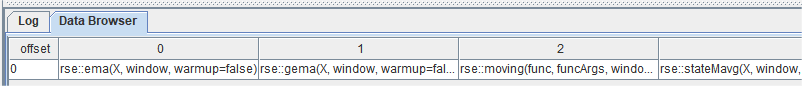
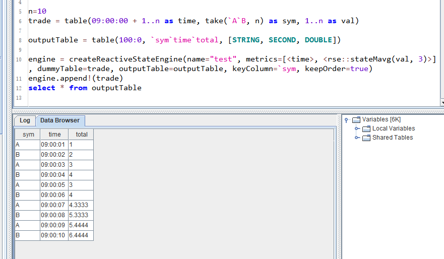

# 流数据状态函数插件

- [1 引言](#1-引言)
- [2 状态函数插件系统原理简介](#2-状态函数插件系统原理简介)
	- [2.1 插件的加载](#21-插件的加载)
	- [2.2 插件的使用](#22-插件的使用)
- [3 状态函数插件的使用](#3-状态函数插件的使用)
- [4 如何开发状态函数插件](#4-如何开发状态函数插件)
	- [4.1 状态函数接口](#41-状态函数接口)
	- [4.2 状态函数接口的实现](#42-状态函数接口的实现)
	- [4.3 实现状态函数 `factory`](#43-实现状态函数-factory)
	- [4.4 在初始化函数中注册状态函数 `factory`](#44-在初始化函数中注册状态函数-factory)
	- [4.5 创建批处理函数原型并注册](#45-创建批处理函数原型并注册)


## 1 引言

量化金融的研究和实盘中，越来越多的机构需要根据高频的行情数据（L1/L2以及逐笔委托数据）来计算量价因子，每只股票的每一条新数据的注入都会更新该只股票的所有因子值。这些因子通常是有状态的：不仅与当前的多个指标有关，而且与多个指标的历史状态相关。以国内的股票市场为例，每3秒收到一个快照，每个股票每天4800个快照，计算因子时可能会用到之前若干个快照的数据，甚至之前若干天的数据。绝大多数机构的研发环境系统（例如 Python）与生产环境系统（例如C++）在研发中所使用编程语言的不同，要维护两套代码，是非常沉重的负担。

而 DolphinDB 所提供的响应式状态引擎（Reactive State Engine），可以实现带有状态的高频因子的流计算解决上述问题。针对这些因子，状态引擎做了很多特殊的优化。而且，状态引擎能够将历史数据批量处理（研发阶段）中编写的表达式或函数作为输入进行流式计算，并确保流式计算的结果与批量计算完全一致。只要在历史数据的批量计算中验证正确，即可保证流数据的实时计算正确。这避免了在生产环境中重写研发代码的高额成本，以及维护研发和生产两套代码的负担。

DolphinDB 流数据响应式状态引擎每输入一条数据引擎都将触发一条结果输出，因此输入和输出数据量一致。DolphinDB 针对生产业务中的常见状态函数（滑动窗口函数、累积函数、序列相关函数和 topN 相关函数等）进行特殊优化，大幅提升了这些函数在响应式状态引擎中的计算效率。响应式状态引擎目前仅支持系统优化过的状态函数。如果 DolphinDB 用户需要使用自定义函数封装复杂的状态函数，可以用 `@state` 进行声明。但是这种自定义函数仍然具有局限性，相比 C++ 开发的状态函数算子，自定义函数的运行效率较低。并且状态引擎支持的自定义函数仅支持 `if-else`、赋值、`return` 等少量语句。在很多应用场景下，仍然需要用 C++ 开发新的函数算子。

随着响应式状态引擎支持的业务越来越多，各种应用场景对状态函数的需求也越来越多样化，如果继续在 DolphinDB 中维护这些状态函数，已经无法适应日益灵活的状态函数需求。因此我们将流数据的状态函数制作成插件，利用插件系统来支持这些多种多样的函数需求。

## 2 状态函数插件系统原理简介

### 2.1 插件的加载

流数据系统中维护了一张哈希表，其中包含了状态函数名称到状态函数 `factory` 函数的映射。DolphinDB 为插件提供了一个注册流数据状态函数的接口，插件所在的动态链接库中会有一个初始化函数 `initialize`。当用户通过 `loadPlugin` 加载插件时，`loadPlugin` 将检查插件中是否包含了 `initialize` 函数。如果有，该函数将被调用，插件中包含的状态函数也将被注册到哈希表当中。

### 2.2 插件的使用

插件当中的流数据状态函数一经加载注册，其使用便与系统自带的其他流数据状态函数没有区别。在创建流数据响应式状态引擎时，引擎会根据函数名，在哈希表中查找对应的 `factory` 函数并创建状态函数的实例。

但是，因为 DolphinDB 在创建流数据响应式状态引擎的时候可能需要使用和流数据状态函数对应的同名批处理函数做一些诸如类型推导的处理工作，因此插件中也需要实现对应的批处理函数的原型。

## 3 状态函数插件的使用

下面以 `stateMavg` 函数为例，介绍流数据插件的使用。

首先调用 `loadPlugin` 函数加载插件：

```
loadPlugin("/path/to/PluginReactiveState.txt")
go
```

插件导入完成后，调用 `listStateFunction(moduleName)` 可以获取所有通过插件导入的状态函数及其用法的列表。其中就包含了我们将要使用的 `stateMavg` 函数：`rse::stateMavg`。



插件中的函数都带有模块名。如果在脚本中想要直接使用插件中的函数（即不需要添加 `rse::`），除了用 `loadPlugin` 导入插件以外，还需要导入模块名：

```
use rse
```

状态函数导入后，我们就可以利用该函数构造 metric 并创建响应式状态引擎，和普通的响应式状态函数的[使用方法](https://www.dolphindb.cn/cn/help/FunctionsandCommands/FunctionReferences/c/createReactiveStateEngine.html)相同。

```
n=10
trade = table(09:00:00 + 1..n as time, take(`A`B, n) as sym, 1..n as val)

outputTable = table(100:0, `sym`time`total, [STRING, SECOND, DOUBLE])

engine = createReactiveStateEngine(name="test", metrics=[<time>, <rse::stateMavg(val, 3)>], dummyTable=trade, outputTable=outputTable, keyColumn=`sym, keepOrder=true)
engine.append!(trade)
select * from outputTable
```



## 4 如何开发状态函数插件

### 4.1 状态函数接口

对于一个新的 ReactiveState 的实现，首先要继承 ReactiveState 类，并实现下列接口：

- `snapshotState`：根据当前的函数状态生成 snapshot
- `restoreState`：从 snapshot 中恢复函数的状态
- `append`：新增数据并输出一条结果
- `addKeys`：新增数据并输出一条结果
- `removeKeys`：删除key
- `getMemoryUsed`：获取函数当前的内存使用情况

如果函数不支持某些功能（例如 snapshot），相应接口应该抛出异常 `RuntimeException`。

响应式状态函数定义示例：

```
class MyReactiveState : public ReactiveState {
public:
    MyReactiveState(/* ... */);
	virtual ~MyReactiveState(){}

	virtual IO_ERR snapshotState(const DataOutputStreamSP& out) override {
		throw RuntimeException("not supported");
	}
	virtual IO_ERR restoreState(const DataInputStreamSP& in){
		throw RuntimeException("not supported");
	}
	virtual void append(Heap* heap, const ConstantSP& keyIndex);
	virtual void addKeys(int count);
	virtual void removeKeys(const vector<int>& keyIndices);
	virtual void getMemoryUsed(long long& fixedMemUsed, long long& variableMemUsedPerKey);
private:
    // ...
};
```

### 4.2 状态函数接口的实现

下面还是以 `stateMavg` 函数为例，介绍状态函数的实现。`stateMavg` 若窗口中 X 的元素个数小于 *window*，则直接输出 *X*；否则取输出字段前 *window* - 1 个值与当前 *X* 值求平均。

`stateMavg` 状态函数类的完整定义如下：

```
class StateMovingAvgReactiveState : public ReactiveState {
public:
	StateMovingAvgReactiveState(int window, int minPeriod, int inputColIndex, int outputColIndex) : window_(window), minPeriods_(minPeriod),
		inputColIndex_(inputColIndex), outputColIndex_(outputColIndex){
		compute_ = std::bind(&StateMovingAvgReactiveState::calculate, this, std::placeholders::_1, std::placeholders::_2);
	}

	virtual IO_ERR snapshotState(const DataOutputStreamSP& out){
		throw RuntimeException("not supported");
	}
	virtual IO_ERR restoreState(const DataInputStreamSP& in){
		throw RuntimeException("not supported");
	}
	virtual void append(Heap* heap, const ConstantSP& keyIndex);
	virtual void addKeys(int count);
	virtual void removeKeys(const vector<int>& keyIndices);
	virtual void getMemoryUsed(long long& fixedMemUsed, long long& variableMemUsedPerKey){
		fixedMemUsed = sizeof(*this);
		variableMemUsedPerKey = sizeof(CircularQueue<char>) + sizeof(double) * window_ + 16;
	}
	
	static ReactiveStateSP createInstance(const vector<ObjectSP>& args, const vector<int>& inputColIndices, const vector<DATA_TYPE>& inputColTypes, const vector<int>& outputColIndices);
private:
	double calculate(int index, double val);

private:
	int window_;
	int inputColIndex_;
	int outputColIndex_;
	vector<double> sums_;
	vector<int> counts_;
	vector<CircularQueue<double>> data_;
};
```

在这里，我们选择不支持 snapshot 功能。另外，`getMemoryUsed` 实现起来也很简单，把类中成员变量所占据的内存空间相加即可。因此，本节主要介绍用于数据的输入和输出的 `append` 函数，以及有新增 key 和删除清理 key 时候的回调函数：`addKeys` 和 `removeKeys`。

成员变量当中，window_ 是窗口长度参数，inputColIndex_ 和 outputColIndex_ 是引擎提供的输入输出列的编号，而 sums_ 、counts_ 以及 data_ 分别为各个 key 分组当前窗口中的元素的和、数量等数据状态。

当有新增 key 的时候，需要为该 key 初始化状态：

```
void StateMovingAvgReactiveState::addKeys(int count){
	for(int i=0; i<count; ++i){
		sums_.push_back(0);
		counts_.push_back(0);
		data_.emplace_back(window_);
	}
}
```

而 key 被清理掉时，对应的状态也应该被删除：

```
void StateMovingAvgReactiveState::removeKeys(const vector<int>& keyIndices){
	removeElements<double>(sums_, keyIndices);
	removeElements<int>(counts_, keyIndices);
	removeElements<CircularQueue<double>>(data_, keyIndices);
}
```

然后可以实现计算逻辑：

```
double StateMovingAvgReactiveState::calculate(int index, double val){
	CircularQueue<double>& queue = data_[index];
    if (val == DBL_NMIN) {
		return val;
	}

	if(LIKELY(queue.size() >= window_)){
		double v = queue.head();
		if(v != DBL_NMIN){
			sums_[index] -= v;
			--counts_[index];
		}
	}
	sums_[index] += val;
	++counts_[index];
	
	double result;
	// 若窗口中 X 的元素个数大于等于 window，则取输出字段前 window - 1 个值与当前 X 值求平均
	if(counts_[index] >= window_)
		result = sums_[index]/counts_[index];
	// 否则直接输出 X
	else
		result = val;
	
	sums_[index] -= val;
	sums_[index] += result;
	queue.push(result);
	return result;
}
```

最后将数据输入和输出功能封装为 `append` 函数：

```
void StateMovingAvgReactiveState::append(Heap* heap, const ConstantSP& keyIndex){
	ConstantSP col = table_->getColumn(inputColIndex_);
	INDEX start = 0;
	INDEX len = keyIndex->size();
	INDEX* pkeyIndex = keyIndex->getIndexArray();
	double buf[Util::BUF_SIZE];
	double bufR[Util::BUF_SIZE];
	while(start < len){
		int count = std::min(len - start, Util::BUF_SIZE);
		col->getDouble(pkeyIndex + start, count, buf);
		for(int i=0; i<count; ++i){
			INDEX curIndex = pkeyIndex[start + i];
			bufR[i] = calculate(curIndex, buf[i]);
		}
		setData<double>(outputColIndex_, pkeyIndex + start, count, bufR);
		start += count;
	}
}
```

输入数据存储在 table_ 中，可以通过 keyIndex 进行访问。输出数据同理，可以用 keyIndex 作为索引，用 `setData` 函数输出。

为了提升运行效率，会先把数据以数组的形式取到 buffer 当中再进行处理。如果输入的数据的分组个数大于 BUF_SIZE，则通过 `while` 循环分段处理。

### 4.3 实现状态函数 `factory`

同时，还需要一个 `factory` 函数用于创建响应式状态函数的实例，其函数签名为：

```
typedef ReactiveStateSP(*StateFuncFactory)(
    const vector<ObjectSP>& args,
    const vector<int>& inputColIndices,
    const vector<DATA_TYPE>& inputColTypes,
    const vector<int>& outputColIndices);
```

例如：

```
ReactiveStateSP createMyReactiveState(const vector<ObjectSP>& args, const vector<int>& inputColIndices, const vector<DATA_TYPE>& inputColTypes, const vector<int>& outputColIndices, SQLContextSP& context, Heap* heap){
	checkOutputColumn(outputColIndices,1,"myReactiveState");
	string funcName = "myReactiveState";
	string syntax = "Usage: genericStateIterate(X, initial, window, func). ";
    // 检查参数的有效性并处理参数
    // ...
	return new MyReactiveState(/* ... */);
}
```

### 4.4 在初始化函数中注册状态函数 `factory`

我们在插件中封装了一个 `registerReactiveState` 函数，可以直接使用。需要把对 `registerReactiveState` 函数的调用放入 `intialize` 函数当中：

```

ConstantSP initialize(Heap *heap, vector<ConstantSP>& arguments) {
    // ...
    string modname = arguments[0]->getString();
    if (!registerReactiveState(heap, modname, "myReactiveState", (long long)&createMyReactiveState, 1,
                              "(arg1, arg2,[arg3])")) {
        return new Bool(false);
    }
    // ...
}

```

### 4.5 创建批处理函数原型并注册

如前面所述，即使只会用到插件中的流处理状态函数，不需要批处理，创建并实现批处理函数仍然是必要的。

例如：

```
ConstantSP myReactiveState(Heap *heap, vector<ConstantSP> &arguments) {
  ConstantSP result = new Double(0.0);
  // ...
  return result;
}
```

最后把批处理函数声明为 `extern "C"`

```
extern "C" {
  ConstantSP myReactiveState(Heap *heap, vector<ConstantSP> &arguments);
}
```

并编辑插件的描述文件 *PluginReactiveState.txt*，添加批处理函数：

```
rse,libPluginReactiveState.so
…
myReactiveState,myReactiveState,system,2,3,0
…
```

这样，一个插件就开发完成了。