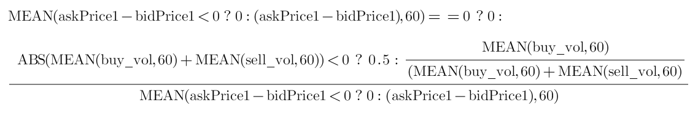
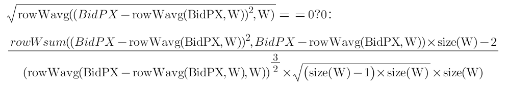
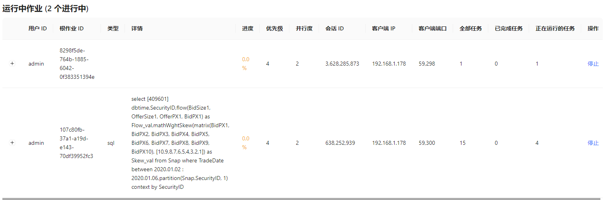
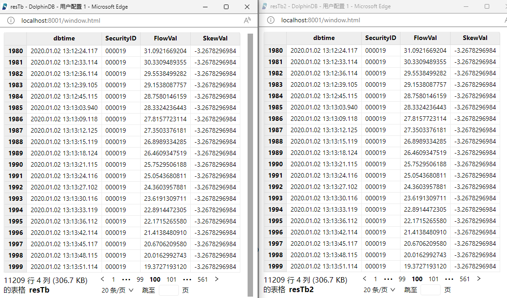

# Python + HDF5 因子计算与 DolphinDB 一体化因子计算方案对比

在量化交易中基于金融市场的 L1/L2 的报价和交易高频数据来进行高频因子计算是非常常见的投研需求。目前国内全市场十年的 L2 历史数据约为 20 ~ 50T，每日新增的数据量约为 10 ~ 20G。传统的关系数据库如 MS SQL Server 或 MySQL 已经很难支撑该量级的数据，即便分库分表，查询性能也远远无法达到要求。由此，一部分用户选择了分布式文件系统, 使用 HDF5 存储数据，并结合 Python 进行量化金融计算。 

HDF5 的存储方案虽然可以支持海量的高频数据，但是也存在一些痛点，例如数据权限管理困难、不同数据关联不便、检索和查询不便、需要通过数据冗余来提高性能等。此外，通过 Python 来读取计算，也要耗费一些时间在数据传输上。

DolphinDB 是一款分析型的分布式时序数据库(time-series database)。目前，越来越多的券商和私募机构开始采用 DolphinDB 存储并进行高频数据的因子计算，也有不少还在使用 Python + HDF5 方案进行高频因子计算的客户对 DolphinDB 表现了浓厚的兴趣。因此，我们撰写了这篇对比 Python + HDF5 因子计算与 DolphinDB 一体化因子计算方案的文章，以供参考。

本文将分别介绍如何基于 Python + HDF5 和 DolphinDB 实现因子计算，并比较两者的计算性能。 

  - [1. 测试环境和测试数据](#1-测试环境和测试数据)
    - [1.1 测试环境](#11-测试环境)
    - [1.2 测试数据](#12-测试数据)
  - [2. 高频因子与代码实现对比](#2-高频因子与代码实现对比)
    - [2.1 高频因子](#21-高频因子)
    - [2.2 DolphinDB 中的因子实现](#22-dolphindb-中的因子实现)
    - [2.3 Python 中的因子实现](#23-python-中的因子实现)
    - [2.4 小结](#24-小结)
  - [3. 因子计算效率对比](#3-因子计算效率对比)
    - [3.1 DolphinDB 的因子调用计算](#31-dolphindb-的因子调用计算)
    - [3.2 Python + HDF5 的因子调度计算](#32-python--hdf5-的因子调度计算)
    - [3.3 计算性能对比](#33-计算性能对比)
    - [3.4 计算结果对比](#34-计算结果对比)
  - [4. 总结](#4-总结)
  - [附录](#附录)


## 1. 测试环境和测试数据

### 1.1 测试环境

本次测试对比了通过 Python +HDF5 和 DolphinDB 实现的因子计算。其中：

- Python + HDF5 因子计算方案依赖 Numpy, Pandas, DolphinDB, Joblib 等库。
- DolphinDB 一体化因子计算方案以 DolphinDB Server 作为计算平台，本次测试使用了单节点部署方式 。

测试所需硬件、软件环境信息如下：

- **硬件环境**

| **硬件名称** | **配置信息**                                |
| :----------- | :------------------------------------------ |
| CPU          | Intel(R) Xeon(R) Silver 4210R CPU @ 2.40GHz |
| 内存         | 512 G                                       |
| 磁盘         | SSD 500 G                                   |

- **软件环境**

| **软件名称** | **版本信息**                         |
| :----------- | :----------------------------------- |
| 操作系统     | CentOS Linux release 7.9.2009 (Core) |
| DolphinDB    | V2.00.8.7                            |
| Python       | V3.6.8                               |
| Numpy        | V1.19.3                              |
| Pandas       | V1.1.5                               |

### 1.2 测试数据

本次测试选取了深市 2020.01.02 ~ 2020.01.06 期间共3个交易日的部分快照数据，该数据包含约 1992 支股票，平均一天数据量约为 760 万条，总数据量约为 2200 万条。初始数据存于 DolphinDB 中，HDF5 格式数据文件可从 DolphinDB 中导出生成。

快照表测试数据在 DolphinDB 中共55个字段，部分字段展示如下：

|      | **字段名** | **数据类型** |      | **字段名** | **数据类型** |
| :--- | :--------- | :----------- | :--- | :--------- | ------------ |
| 1    | TradeDate  | DATE         | 29   | OfferPX1   | INT          |
| 2    | OrigTime   | TIMESTAMP    | 30   | BidPX1     | DOUBLE       |
| 3    | dbtime     | TIMESTAMP    | 31   | OfferSize1 | DOUBLE       |
| 4    | SecurityID | SYMBOL       | 32   | BidSize1   | INT          |
| 5    | ……         | ……           | 33   | ……         | ……           |

 

部分数据示例如下：

```
| record | TradeDate  | OrigTime                | SendTime                | Recvtime                | dbtime                  | ChannelNo | SecurityID | SecurityIDSource | MDStreamID | OfferPX1 | BidPX1 | OfferSize1 | BidSize1 | OfferPX2 | BidPX2 | OfferSize2 | BidSize2 | OfferPX3 | BidPX3 | OfferSize3 | BidSize3 | OfferPX4 | BidPX4 | OfferSize4 | BidSize4 | OfferPX5 | BidPX5 | OfferSize5 | BidSize5 | OfferPX6 | BidPX6 | OfferSize6 | BidSize6 | OfferPX7 | BidPX7 | OfferSize7 | BidSize7 | OfferPX8 | BidPX8 | OfferSize8 | BidSize8 | OfferPX9 | BidPX9 | OfferSize9 | BidSize9 | OfferPX10 | BidPX10 | OfferSize10 | BidSize10 | NUMORDERS_B1 | NOORDERS_B1 | ORDERQTY_B1 | NUMORDERS_S1 | NOORDERS_S1 | ORDERQTY_S1 |
|--------|------------|-------------------------|-------------------------|-------------------------|-------------------------|-----------|------------|------------------|------------|----------|--------|------------|----------|----------|--------|------------|----------|----------|--------|------------|----------|----------|--------|------------|----------|----------|--------|------------|----------|----------|--------|------------|----------|----------|--------|------------|----------|----------|--------|------------|----------|----------|--------|------------|----------|-----------|---------|-------------|-----------|--------------|-------------|-------------|--------------|-------------|-------------|
| 0      | 2020.01.02 | 2020.01.02 09:00:09.000 | 2020.01.02 09:00:09.264 | 2020.01.02 09:00:09.901 | 202.01.02 09:00:09.902  | 1,014     | 14         | 102              | 10         | 0        | 0      | 0          | 0        | 0        | 0      | 0          | 0        | 0        | 0      | 0          | 0        | 0        | 0      | 0          | 0        | 0        | 0      | 0          | 0        | 0        | 0      | 0          | 0        | 0        | 0      | 0          | 0        | 0        | 0      | 0          | 0        | 0        | 0      | 0          | 0        | 0         | 0       | 0           | 0         | 0            | 0           |             | 0            | 0           |             |
| 1      | 2020.01.02 | 2020.01.02 09:01:09.000 | 2020.01.02 09:01:09.330 | 2020.01.02 09:01:09.900 | 2020.01.02 09:01:09.904 | 1,014     | 14         | 102              | 10         | 0        | 0      | 0          | 0        | 0        | 0      | 0          | 0        | 0        | 0      | 0          | 0        | 0        | 0      | 0          | 0        | 0        | 0      | 0          | 0        | 0        | 0      | 0          | 0        | 0        | 0      | 0          | 0        | 0        | 0      | 0          | 0        | 0        | 0      | 0          | 0        | 0         | 0       | 0           | 0         | 0            | 0           |             | 0            | 0           |             |
| 2      | 2020.01.02 | 2020.01.02 09:02:09.000 | 2020.01.02 09:02:09.324 | 2020.01.02 09:02:10.131 | 2020.01.02 09:02:10.139 | 1,014     | 14         | 102              | 10         | 0        | 0      | 0          | 0        | 0        | 0      | 0          | 0        | 0        | 0      | 0          | 0        | 0        | 0      | 0          | 0        | 0        | 0      | 0          | 0        | 0        | 0      | 0          | 0        | 0        | 0      | 0          | 0        | 0        | 0      | 0          | 0        | 0        | 0      | 0          | 0        | 0         | 0       | 0           | 0         | 0            | 0           |             | 0            | 0           |             |
| 3      | 2020.01.02 | 2020.01.02 09:03:09.000 | 2020.01.02 09:03:09.223 | 2020.01.02 09:03:10.183 | 2020.01.02 09:03:10.251 | 1,014     | 14         | 102              | 10         | 0        | 0      | 0          | 0        | 0        | 0      | 0          | 0        | 0        | 0      | 0          | 0        | 0        | 0      | 0          | 0        | 0        | 0      | 0          | 0        | 0        | 0      | 0          | 0        | 0        | 0      | 0          | 0        | 0        | 0      | 0          | 0        | 0        | 0      | 0          | 0        | 0         | 0       | 0           | 0         | 0            | 0           |             | 0            | 0           |             |
| 4      | 2020.01.02 | 2020.01.02 09:04:09.000 | 2020.01.02 09:04:09.227 | 2020.01.02 09:04:10.188 | 2020.01.02 09:04:10.215 | 1,014     | 14         | 102              | 10         | 0        | 0      | 0          | 0        | 0        | 0      | 0          | 0        | 0        | 0      | 0          | 0        | 0        | 0      | 0          | 0        | 0        | 0      | 0          | 0        | 0        | 0      | 0          | 0        | 0        | 0      | 0          | 0        | 0        | 0      | 0          | 0        | 0        | 0      | 0          | 0        | 0         | 0       | 0           | 0         | 0            | 0           |             | 0            | 0           |             |
| 5      | 2020.01.02 | 2020.01.02 09:05:09.000 | 2020.01.02 09:05:09.223 | 2020.01.02 09:05:09.930 | 2020.01.02 09:05:09.936 | 1,014     | 14         | 102              | 10         | 0        | 0      | 0          | 0        | 0        | 0      | 0          | 0        | 0        | 0      | 0          | 0        | 0        | 0      | 0          | 0        | 0        | 0      | 0          | 0        | 0        | 0      | 0          | 0        | 0        | 0      | 0          | 0        | 0        | 0      | 0          | 0        | 0        | 0      | 0          | 0        | 0         | 0       | 0           | 0         | 0            | 0           |             | 0            | 0           |             |
| 6      | 2020.01.02 | 2020.01.02 09:06:09.000 | 2020.01.02 09:06:09.218 | 2020.01.02 09:06:10.040 | 2020.01.02 09:06:10.044 | 1,014     | 14         | 102              | 10         | 0        | 0      | 0          | 0        | 0        | 0      | 0          | 0        | 0        | 0      | 0          | 0        | 0        | 0      | 0          | 0        | 0        | 0      | 0          | 0        | 0        | 0      | 0          | 0        | 0        | 0      | 0          | 0        | 0        | 0      | 0          | 0        | 0        | 0      | 0          | 0        | 0         | 0       | 0           | 0         | 0            | 0           |             | 0            | 0           |             |
| 7      | 2020.01.02 | 2020.01.02 09:07:09.000 | 2020.01.02 09:07:09.224 | 2020.01.02 09:07:09.922 | 2020.01.02 09:07:09.925 | 1,014     | 14         | 102              | 10         | 0        | 0      | 0          | 0        | 0        | 0      | 0          | 0        | 0        | 0      | 0          | 0        | 0        | 0      | 0          | 0        | 0        | 0      | 0          | 0        | 0        | 0      | 0          | 0        | 0        | 0      | 0          | 0        | 0        | 0      | 0          | 0        | 0        | 0      | 0          | 0        | 0         | 0       | 0           | 0         | 0            | 0           |             | 0            | 0           |             |
| 8      | 2020.01.02 | 2020.01.02 09:08:09.000 | 2020.01.02 09:08:09.220 | 2020.01.02 09:08:10.137 | 2020.01.02 09:08:10.154 | 1,014     | 14         | 102              | 10         | 0        | 0      | 0          | 0        | 0        | 0      | 0          | 0        | 0        | 0      | 0          | 0        | 0        | 0      | 0          | 0        | 0        | 0      | 0          | 0        | 0        | 0      | 0          | 0        | 0        | 0      | 0          | 0        | 0        | 0      | 0          | 0        | 0        | 0      | 0          | 0        | 0         | 0       | 0           | 0         | 0            | 0           |             | 0            | 0           |             |
| 9      | 2020.01.02 | 2020.01.02 09:09:09.000 | 2020.01.02 09:09:09.215 | 2020.01.02 09:09:10.175 | 2020.01.02 09:09:10.198 | 1,014     | 14         | 102              | 10         | 0        | 0      | 0          | 0        | 0        | 0      | 0          | 0        | 0        | 0      | 0          | 0        | 0        | 0      | 0          | 0        | 0        | 0      | 0          | 0        | 0        | 0      | 0          | 0        | 0        | 0      | 0          | 0        | 0        | 0      | 0          | 0        | 0        | 0      | 0          | 0        | 0         | 0       | 0           | 0         | 0            | 0           |             | 0            | 0           |             |
```

## 2. 高频因子与代码实现对比

本节将通过两个高频因子，流动状态因子（flow 因子）和权重偏度因子（mathWghtSkew 因子）进行计算比对。

### 2.1 高频因子

- flow 因子

  - 因子介绍：流动状态因子的计算需要依赖历史数据，需要的参数分别为 buy_vol、sell_vol、askPrice1、bidPrice1 四个字段，运用 `mavg` 、`iif` 等函数计算。其计算结果可以反映买方资金流的情况。

  - 公式：

    <figure>
        
        <figcaption>flow 因子计算公式</figcaption>
    </figure>

- mathWghtSkew 因子

  - 因子介绍：接收多档报价数据（价格 BidPX1,BidPX2…BidPX10）并计算多档报价的权重偏度。

  - 公式：

    <figure>
        
        <figcaption>mathWghtSkew 因子计算公式</figcaption>
    </figure>

    

### 2.2 DolphinDB 中的因子实现

本小节中，我们使用 DolphinDB 的编程语言来实现 flow 因子和 mathWghtSkew 因子。DolphinDB 提供了 mavg (滑动窗口系列 m 系列） 和 rowWavg (行计算系列row 系列）函数，并进行了针对性的性能优化。这两个系列的函数不但可用于快捷开发这两个因子，还提供了极佳的计算性能。如以下代码所示：

- flow 因子的实现代码：

```
def flow(buy_vol, sell_vol, askPrice1, bidPrice1){
	buy_vol_ma = round(mavg(buy_vol, 60), 5)
	sell_vol_ma = round(mavg(sell_vol, 60), 5)
	buy_prop = iif(abs(buy_vol_ma+sell_vol_ma) < 0, 0.5 , buy_vol_ma/ (buy_vol_ma+sell_vol_ma))
	spd_tmp = askPrice1 - bidPrice1
	spd = iif(spd_tmp  < 0, 0, spd_tmp)
	spd_ma = round(mavg(spd, 60), 5)
	return iif(spd_ma == 0, 0, buy_prop / spd_ma)
}
```

- mathWghtSkew 因子的实现代码：

```
def mathWghtCovar(x, y, w){
	v = (x - rowWavg(x, w)) * (y - rowWavg(y, w))
	return rowWavg(v, w)
}
def mathWghtSkew(x, w){
	x_var = mathWghtCovar(x, x, w)
	x_std = sqrt(x_var)
	x_1 = x - rowWavg(x, w)
	x_2 = x_1*x_1
	len = size(w)
	adj = sqrt((len - 1) * len) \ (len - 2)
	skew = rowWsum(x_2, x_1) \ (x_var * x_std) * adj \ len
	return iif(x_std==0, 0, skew)
}
```

### 2.3 Python 中的因子实现

本小节中，我们用 Python 实现 flow 因子和 mathWghtSkew 因子。

- flow 因子的实现代码：

```
def flow(df):
    buy_vol_ma = np.round(df['BidSize1'].rolling(60).mean(), decimals=5)
    sell_vol_ma = np.round((df['OfferSize1']).rolling(60).mean(), decimals=5)
    buy_prop = np.where(abs(buy_vol_ma + sell_vol_ma) < 0, 0.5, buy_vol_ma / (buy_vol_ma + sell_vol_ma))
    spd = df['OfferPX1'].values - df['BidPX1'].values
    spd = np.where(spd < 0, 0, spd)
    spd = pd.DataFrame(spd)
    spd_ma = np.round((spd).rolling(60).mean(), decimals=5)
    return np.where(spd_ma == 0, 0, pd.DataFrame(buy_prop) / spd_ma)
```

- mathWghtSkew 因子的实现代码：

```
def rowWavg(x, w):
    rows = x.shape[0]
    res = [[0]*rows]
    for row in range(rows):
        res[0][row] = np.average(x[row], weights=w)
    res = np.array(res)
    return res

def rowWsum(x, y):
    rows = x.shape[0]
    res = [[0]*rows]
    for row in range(rows):
        res[0][row] = np.dot(x[row],y[row])
    res = np.array(res)
    return res

def mathWghtCovar(x, y, w):
    v = (x - rowWavg(x, w).T)*(y - rowWavg(y, w).T)
    return rowWavg(v, w)

def mathWghtSkew(x, w):
    x_var = mathWghtCovar(x, x, w)
    x_std = np.sqrt(x_var)
    x_1 = x - rowWavg(x, w).T
    x_2 = x_1*x_1
    len = np.size(w)
    adj = np.sqrt((len - 1) * len) / (len - 2)
    skew = rowWsum(x_2, x_1) / (x_var*x_std)*adj / len
    return np.where(x_std == 0, 0, skew)
```

### 2.4 小结 

从代码实现来看，使用 DolphinDB 和 Python 两种语言来开发这两个因子的难度差别不大，代码量上 DolphinDB 因为提供了 row 系列的行计算函数，开发上会容易一些。此外在移动窗口计算上 Python 中是通过 `rolling` 函数 + `mean` 等需要进行计算函数组合来进行计算。而在 DolphinDB 中，也可以类似的通过 `moving` 函数组合要进行计算的函数（例如 `mean`, `avg` 等）来进行计算。但是这种组合的方式在进行数据移动时，因为不知道具体的计算业务而难以进行针对性的增量优化。为了提升性能，DolphinDB 专门提供了 m 系列滑动窗口函数。可以对不同的计算需求进行针对性的性能优化。这种针对性的移动计算函数在不同场景与组合方式计算方式相比最高可以提高 100 倍的性能。

 

## 3. 因子计算效率对比

本小节将进一步展示 flow 因子和 mathWghtSkew 因子的具体调用方法，以及如何实现并行调用。

### 3.1 DolphinDB 的因子调用计算

- 因子调用计算

本次对比的因子中 , flow 因子要进行移动窗口计算，mathWghtSkew 因子要进行同行内多列计算。但计算涉及的数据都是对每只股票独立进行计算的。对于这种场景，DolphinDB 提供了 `context by` 函数，可以简化像移动窗口计算这样的时间序列数据操作。通过对股票 SecurityID 进行的 `context by` 操作，可以直接使用 DolphinDB 的 SQL 引擎进行批量股票的移动窗口计算。mathWghtSkew 因子的计算在同一行内的多列间进行，可以一起进行计算。计算代码如下：

```
m = 2020.01.02:2020.01.06
w = 10 9 8 7 6 5 4 3 2 1
res = select dbtime, SecurityID,flow(BidSize1,OfferSize1, OfferPX1, BidPX1) as Flow_val,mathWghtSkew(matrix(BidPX1,BidPX2,BidPX3,BidPX4,BidPX5,BidPX6,BidPX7,BidPX8,BidPX9,BidPX10),w) as Skew_val  from loadTable("dfs://LEVEL2_SZ","Snap") where TradeDate between  m context by SecurityID
```

- 并行调用

DolphinDB 计算框架会将一个大的计算任务拆解成多个子任务进行并行计算。所以，在以上面的 Sql 进行计算时，会自动计算数据涉及的分区，并按照配置的参数 workerNum 所限制的最大工作线程数量，来自动进行多线程并行计算。但在本次对比中，我们需要在指定的并发数下进行一体化计算。我们可以通过修改 DolphinDB 配置文件中的 workerNum 参数来精确地限制系统资源的使用。

参数修改示例如下：

```
workerNum=20
```

通过参数调整，即可控制本次因子通过 DolphinDB Sql 引擎调用计算时的 CPU 资源使用并行度。

DolphinDB 当前任务的并行度可以通过 Web 版的管理器查看，下图展示了配置了4个并行度的并行计算作业。

 

 

### 3.2 Python + HDF5 的因子调度计算

- HDF5 数据文件读取

区别于 DolphinDB 的库内一体化计算，在使用 Python 的计算库进行计算时，需要先从 HDF5 文件中读取快照数据。HDF5的 Python 读取包有若干种。不同的包在存储时会有不同的数据结构，相应的读取方式和性能也不同。

这里我们验证了两种常用的方式：

- pandas 的 `HDFStore()`
- pandas 的 `read_hdf()`

其中 `read_hdf` 方法支持只读取所需列的数据。但实际测试的结果显示，通过 `pandas.read_hdf()` 方法读取部分列数据的耗时与读取全部列数据的耗时差别非常小。而通过 `pandas.to_hdf()` 保存的 HDF5 文件数据比通过调用 `pandas.HDFStore()` 保存的 HDF5 文件数据在存储上要多 30% 左右。由于实际存储空间大，通过 `pandas.read_hdf()` 方法读取同样的 HDF5 存储数据的耗时也要多于使用 `pandas.HDFStore()` 方法。故本次测试选择使用 pandas 的 `HDFStore()` 方法存储和读取 HDF5 文件数据，并进行计算。本次测试对于 HDF5 文件数据以最通用的方式存储，存储前并未去冗或进行其他针对性的存储优化处理。原因在于，这些针对性的优化除了带来数据的冗余以外，也会增加数据使用、管理复杂度。尤其是在海量数据场景下数据管理的复杂度更会大幅上升。

采用 HDFStore 方法存、取 HDF5 的代码实现如下：

```
# 保存 HDF5 文件
def saveByHDFStore(path,df):
    store = pd.HDFStore(path)
    store["Table"] = df
    store.close()

# 读取单个 HDF5 文件
def loadData(path):
    store = pd.HDFStore(path, mode='r')
    data = store["Table"]
    store.close()
    return data
```

- 因子调用计算

对于每只股票，循环读取每天的数据，拼接后转成 dataframe 并进行因子计算。代码如下：

```
def ParallelBySymbol(SecurityIDs,dirPath):
    for SecurityID in SecurityIDs:
        sec_data_list=[]
        for date in os.listdir(dirPath):
            filepath = os.path.join(dirPath,str(date),"data_"+str(date) + "_" + str(SecurityID) + ".h5")
            sec_data_list.append(loadData(filepath))
        df=pd.concat(sec_data_list)
        # 计算 flow 因子
        df_flow_res = flow(df)
        # 计算 mathWghtSkew 因子
        w = np.array([10, 9, 8, 7, 6, 5, 4, 3, 2, 1])
        pxs = np.array(df[["BidPX1","BidPX2","BidPX3","BidPX4","BidPX5","BidPX6","BidPX7","BidPX8","BidPX9","BidPX10"]])
        np.seterr(divide='ignore', invalid='ignore')
        df_skew_res = mathWghtSkew(pxs,w)
```

- 并行调用

这里我们使用 Python 的 Joblib 库实现多进程的并行调度。我们将要计算的股票从文件中读出，然后按照并行度拆分成多组来用于并行计算。代码如下：

```
...
# 股票 HDF5 文件地址
pathDir=/data/stockdata
# 并行度
n = 1
# SecurityIDs 为要计算的全部股票列表
SecurityIDs_splits = np.array_split(SecurityIDs, n)
Parallel(n_jobs=n)(delayed(ParallelBySymbol)(SecurityIDs,pathDir) for SecurityIDs in SecurityIDs_splits)

```

### 3.3 计算性能对比

基于前述内容，本节我们进行不同并行度的 Python + HDF5 因子计算和 DolphinDB 库内一体化因子计算的性能比对。计算的数据量为 1992 只股票，3天总计 2200万行。我们调节不同的并行度，测试在使用不同 CPU 核数的情况下，两种方式计算因子的耗时。所有测试均在清除操作系统缓存后进行。测试结果如下表：

| CPU核数 | Python+HDF5(秒) | DolphinDB（秒） | （Python+HDF5）/ DolphinDB |
| :-----: | :-------------: | :-------------: | :------------------------: |
|    1    |      2000       |      21.0       |             95             |
|    2    |       993       |      11.5       |             86             |
|    4    |       540       |       6.8       |             79             |
|    8    |       255       |       5.8       |             44             |
|   16    |       133       |       4.9       |             27             |
|   24    |       114       |       4.3       |             26             |
|   40    |       106       |       4.2       |             25             |

从比对结果可以看到。本次测试中，在单核的前提下，DolphinDB 库内计算比 Python + HDF5计算快接近100倍。随着可用 CPU 核数逐渐增加，DolphinDB 库内计算和 Python + HDF5 计算耗时比逐渐趋近 1:25 左右。考虑两种计算方式的特点，原因大概如下：

- DolphinDB 自有的数据存储系统的读取效率远优于 Python 读取使用通用存储方式的 HDF5 文件存储。
- DolphinDB 的针对性移动计算函数滑动窗口系列（m 系列）对于不同的移动窗口计算优化可提供更佳计算性能

尽管 HDF5 格式的数据文件读取可以从技术层面进行针对性的冗余存储或者其他针对性优化，但同时会带来额外的硬件资源成本、数据使用和管理成本等。相比之下，DolphinDB 的自有数据存储系统在使用上更为高效、方便和简单。 因此 DolphinDB 的库内一体化因子计算在完整的因子数据读取、计算全过程上的计算速度是远优于 Python + HDF5 的因子计算方式的。

从计算性能的对比中，不难发现以下现象：

- 代码实现方面，DolphinDB 的库内 Sql 计算更易于实现因子计算调用及并行调用。
- 并行计算方面，DolphinDB 可以自动使用当前可用的 CPU 资源，而Python 脚本需要通过并行调度代码实现，但更易于控制并发度。
- 计算速度方面，DolphinDB 的库内计算比 Python + HDF5 的计算方式快 25 倍以上。

### 3.4 计算结果对比

上一节中，我们比对了两种计算的方式的计算性能。DolphinDB 的库内因子计算在计算速度上要远优于 Python + HDF5 的因子计算方式。但是计算快的前提是计算结果要正确一致。我们将 Python +HDF5 和 DolphinDB 的因子计算结果分别存入 DolphinDB 的分布式表中。部分计算结果比对展示如下图，显示的部分结果完全一致。全部的数据比对通过 DolphinDB 脚本进行，比对结果也是完全一致。



也可以通过如下代码进行全数据验证，输出 int[0] 则表示两张表内容一致。

```
resTb = select * from loadTable("dfs://tempResultDB","result_cyc_test")
resTb2 = select * from loadTable("dfs://tempResultDB","result_cyc_test2")
resTb.eq(resTb2).matrix().rowAnd().not().at()
```

验证结果显示，采用Python + HDF5 和 DolphinDB 两种方式进行计算，结果完全一致。

## 4. 总结

本篇文章的比较结果显示，在使用相同核数 CPU 的前提下：

- DolphinDB 的库内一体化计算性能约为 Python + HDF5 因子计算方案的 25 倍左右，计算结果和 Python 方式完全一样。
- 两种方案的因子开发效率相近
- 在数据的管理和读取方面：
  - 每个 HDF5 文件的读取或写入基本是单线程处理的，难以对数据进行并行操作。 此外 HDF5 文件中数据读取效率较依赖于数据在 HDF5 的 group 和 dataset 组织结构。为了追求更好的读写效率，经常要考虑不同的数据读取需求来设计存储结构。需要通过一些数据冗余存储来满足不同场景的高效读写。这种数据操作方式在数据量逐渐上升到 T 级之后，数据管理和操作的复杂度更会大幅增加，实际使用中会增加大量的时间成本和存储空间成本。
  - 而 DolphinDB 的数据管理、查询、使用更为简单便捷。得益于 DolphinDB 的不同存储引擎及分区机制，用户可以以普通数据库的方式轻松管理、使用 PB 级及以上数量级别的数据。

综合而言，在生产环境中，使用 DolphinDB 进行因子计算和存储远比使用 Python + HDF5 计算方式更加高效。

## 附录

本教程中的对比测试使用了以下测试脚本：

 [createDBAndTable.dos](script/Python+HDF5_vs_DolphinDB/createDBAndTable.dos) 

 [ddbFactorCal.dos](script/Python+HDF5_vs_DolphinDB/ddbFactorCal.dos) 

 [gentHdf5Files.py](script/Python+HDF5_vs_DolphinDB/gentHdf5Files.py) 

 [pythonFactorCal.py](script/Python+HDF5_vs_DolphinDB/pythonFactorCal.py) 
