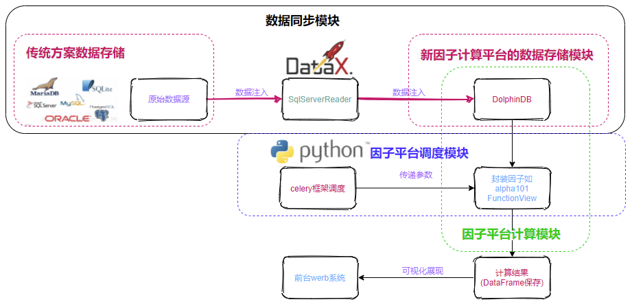
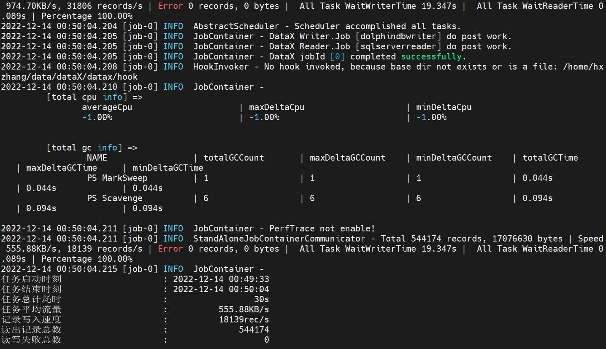

# 基于 DolphinDB 与 Python Celery 框架的因子计算平台构建

因子挖掘是量化金融研究和交易的核心工作。传统的开发流程中，通常使用 Python 从关系型数据库（如 SqlServer, Oracle 等）读取数据，在 Python 中进行因子计算。随着证券交易规模不断扩大以及交易数据量的激增，用户对因子计算平台的性能提出了更高的要求。传统的因子计算工程面临以下问题：

- 因子数据量的增长以及 Python 作为计算平台导致的性能瓶颈问题
- 传统的计算平台框架如何无缝替换问题

 

本教程聚焦于因子批量化计算这一实际业务场景，将 DolphinDB 作为一个核心的计算工具引入到传统的因子平台。以DolphinDB 为核心的因子计算平台包括：数据同步模块、因子批计算模块和因子调度模块。其中 dataX 作为数据同步工具，负责将原始数据以及增量数据从关系数据库同步存储到 DolphinDB 中；DolphinDB 作为因子计算与存储模块；Celery 作为任务调度框架模块。DolphinDB 因子计算平台，可以为业务部门提供即时的因子计算服务、大数据批计算服务以及历史因子查询服务等。引入DolphinDB后，既能满足高中低频因子计算的要求，又有丰富的API以及ETL工具实现无缝集成。下文以 WorldQuant 101 Alpha 因子指标库中的1号因子 `WQAlpha1` 为例来展现出整个因子计算平台的构建流程。


- [1. 总体架构](#1-总体架构)
  - [1.1 SQL Server 概述](#11-sql-server-概述)
  - [1.2 dataX 概述](#12-datax-概述)
  - [1.3 DolphinDB 概述](#13-dolphindb-概述)
  - [1.4 Celery 概述](#14-celery-概述)
- [2. 环境部署](#2-环境部署)
- [3. 开发使用范例](#3-开发使用范例)
  - [3.1 数据介绍](#31-数据介绍)
  - [3.2 业务场景与指标介绍](#32-业务场景与指标介绍)
  - [3.3 dataX 同步 SQL Server 数据到 DolphinDB](#33-datax-同步-sql-server-数据到-dolphindb)
  - [3.4 Celery 框架触发 DolphinDB 预定义函数计算](#34-celery-框架触发-dolphindb-预定义函数计算)
- [4. 总结](#4-总结)
- [附件](#附件)


## 1. 总体架构

基于 DolphinDB 与 Python Celery 框架的因子平台构建，主要包括基于 dataX 的 SQL Server Reader （历史数据同步模块）和 DolphinDB （数据存储与计算模块）的数据源注入，DolphinDB 因子函数的定义和调用，Celery 框架（因子平台调度模块）调用因子函数传递参数和最终以 `Dataframe` 格式的数据可视化展示等。其整体构图如下所示：



### 1.1 SQL Server 概述

- **介绍：**

  SQL Server 是由 Microsoft 开发和推广的关系数据库管理系统。

  SQL Server 为整个架构中原始数据来源部分。

- **教程与下载、安装：**

  有关 SQL Server 的使用、下载、安装可以参考 [SQL Server官方文档](https://www.microsoft.com/zh-cn/sql-server/sql-server-2019)。

### 1.2 dataX 概述

- **介绍：**

  dataX 是一个异构数据源离线同步工具，用于实现包括 MySQL, Oracle, SQL Server, Postgre 等各种异构数据源之间高效的数据同步功能。

  本教程中的 dolphindbWriter 的 dataX 插件能够帮助用户将 SQL Server 数据导入到 DolphinDB 中。

- **教程与下载、安装：**

  有关 dataX 的使用、安装可以参考 [dataX 指南](https://github.com/alibaba/DataX/blob/master/userGuid.md)，下载请点击 [dataX](https://datax-opensource.oss-cn-hangzhou.aliyuncs.com/datax.tar.gz)。

### 1.3 DolphinDB 概述

- **介绍：**

  DolphinDB 是一款高性能的时序数据处理框架，用于计算高频因子以及因子存储等。

  本教程将 DolphinDB 作为因子计算的主要工具，并结合自身所特有的函数视图功能实现预定义的因子函数在 Python 中调用 DolphinDB 的 Python API 。

- **教程与下载、安装：**

  有关 DolphinDB 的安装指南可以参考 [DolphinDB安装使用指南](https://gitee.com/dolphindb/Tutorials_CN/blob/master/dolphindb_user_guide.md)，点击[下载链接](https://dolphindb.cn/alone/alone.php?id=10)下载。其中 Python api 的调用可以参考 [Python API for DolphinDB](https://gitee.com/dolphindb/api_python3)。

### 1.4 Celery 概述

- **介绍：**

  Celery 是一个基于 Python 开发的简单、灵活、可靠的分布式异步消息队列，用于实现异步任务（Async Task）处理，在实际使用过程中需要借助消息中间件（Broker）监控任务执行单元（Worker）的执行情况，并将任务执行结果最终存储到结果存储（Backend）中。

  Celery 具有如下优势：

  - 能够实现异步发起并处理请求的功能，更方便实现了 Python 多线程；
  - 方便集成到诸如 rabbitMQ，DolphinDB 等组件，具有较强的扩展性。

  本教程中将 Celery 作为任务调度的框架，并结合 redis 作为消息中间件和结果存储实现对因子计算的任务调用。

- **教程与下载、安装：**

  有关 Celery 的使用、下载、安装可以参考 [Celery 中文官方文档](https://www.celerycn.io/jian-jie)。

> 注：为了防止在使用 Celery 框架过程中出现诸如 `TypeError: __init__() got an unexpected keyword argument 'username'` 的报错，建议在安装 Celery 框架后卸载默认的 kombou 库并指定安装 `5.1.0` 版本的库。

## 2. 环境部署

> 注：
>
> 1.本教程所介绍的是测试环境的部署，因此所部署的 DolphinDB 服务为单节点版，具体部署教程可以参考 [DolphinDB 单节点部署教程](https://gitee.com/dolphindb/Tutorials_CN/blob/master/standalone_server.md)；
>
> 2.本教程所使用的 Celery 版本为4.3.0.

- **硬件环境：**

| 硬件名称 | 配置信息                  |
| :------- | :------------------------ |
| 主机名   | cnserver9                 |
| 外网 IP  | xxx.xxx.xxx.122           |
| 操作系统 | Linux（内核版本3.10以上） |
| 内存     | 64 GB                     |
| CPU      | x86_64（12核心）          |

- **软件环境：**

| 软件名称                                                     | 版本信息   |
| :----------------------------------------------------------- | :--------- |
| DolphinDB                                                    | V2.00.7    |
| SQL Server                                                   | 2019最新版 |
| dataX                                                        | 3.0        |
| JDK（安装dataX必备）                                         | 1.8.0_xxx  |
| Maven（安装dataX必备）                                       | 3.6.1+     |
| Python（安装dataX必备）                                      | 2.x        |
| Python（包含需要预先安装 numpy、pandas、Celery 等库以及 DolphinDB 的 Python api ） | 3.7.9      |
| redis                                                        | 6.2.7      |

## 3. 开发使用范例

### 3.1 数据介绍

本教程选取了 2020.01.01 - 2021.01.01 间多只股票的每日收盘价格，总数据条数为 544174 条。以下是收盘价格表在 SQL Server 和 DolphinDB 中的数据结构：

| 字段名     | 字段含义 | 数据类型（SQL Server） | 数据类型（DolphinDB） |
| :--------- | :------- | :--------------------- | :-------------------- |
| SecurityID | 股票代码 | varchar                | SYMBOL                |
| TradeDate  | 交易日期 | date                   | DATE                  |
| Value      | 收盘价格 | float                  | DOUBLE                |

### 3.2 业务场景与指标介绍

本教程选取了 WorldQuant 101 Alpha 因子指标库中的1号因子 `WQAlpha1` 为案例进行计算，有关该指标库的详细内容和该因子的引用方法可以参考 [WorldQuant 101 Alpha 因子指标库](https://gitee.com/dolphindb/DolphinDBModules/blob/master/wq101alpha/README_CN.md)。

### 3.3 dataX 同步 SQL Server 数据到 DolphinDB

本节介绍如何将 SQL Server 的数据同步到 DolphinDB 中。

> 注：
>
> 1.本教程中默认已经预先构建好了存有数据的 SQL Server 数据库，在以下的流程介绍中不再描述其构建过程；
>
> 2.本教程中部署的单节点版的 DolphinDB 服务的对应端口为 `8848` 。

- **DolphinDB 数据库表构建：**

  在数据导入到 DolphinDB 之前，需要预先在部署的 DolphinDB 服务中构建数据库表，执行如下 DolphinDB 脚本建立数据库 `dfs://tick_close` 和其中的数据表 `tick_close`：

  ```
  dbName = "dfs://tick_close"
  tbName = "tick_close"
  if(existsDatabase(dbName)){
  	dropDatabase(dbName)
  }
  db = database(dbName, RANGE, date(datetimeAdd(2000.01M,0..50*12,'M')))
  name = `SecurityID`TradeDate`Value
  type = `SYMBOL`DATE`DOUBLE
  schemaTable = table(1:0, name, type)
  db.createPartitionedTable(table=schemaTable, tableName=tbName, partitionColumns=`TradeDate)
  ```

- **撰写导入配置文件：**

  在启动 dataX 执行数据导入命令时，需要先撰写以 `json` 为格式的配置文件，用来指定数据同步过程中的数据源相关配置。

  在一般情况下，对每一张数据表的同步往往需要对应撰写一个配置文件。本教程中针对 `tick_close` 数据表分别撰写了如下的 `tick_close.json` 文件：

  ```
  {
      "job": {
          "content": [
              {
                  "writer": {
                      "parameter": {
                          "dbPath": "dfs://tick_close",
                          "tableName": "tick_close",
                          "batchSize": 100,
                          "userId": "admin",
                          "pwd": "123456",
                          "host": "127.0.0.1",
                          "table": [
                              {
                                  "type": "DT_SYMBOL",
                                  "name": "SecurityID"
                              },
                              {   "type": "DT_DATE",
                                  "name": "TradeDate"
                              },
                              {
                                  "type": "DT_DOUBLE",
                                  "name": "Value"
                              }
  ],
                          "port": 8848
                      },
                      "name": "dolphindbwriter"
                  },
                  "reader": {
                      "name": "sqlserverreader",
                      "parameter": {
                          "username": "SA",
                          "password": "Sa123456",
                          "column": [
                              "*"
                          ],
                          "connection": [
                              {
                                  "table": [
                                      "tick_close"
                                  ],
                                  "jdbcUrl": [
                                  "jdbc:sqlserver://127.0.0.1:1234;DatabaseName=tick_close"
                                  ]
                                  
                              }
                          ]
                      }
                  }
              }
          ],
          "setting": {
              "speed": {
                  "channel": 1
              }
          }
      }
  }
  
  ```

  注：本教程涉及到的数据同步仅为历史数据的全量同步，在实际过程中如果有增量同步等的需要，在 `writer` 配置中要增加 `saveFunctionName ` 和 `saveFunctionDef` 两个配置，具体用法可以参考[ 基于 DataX 的 DolphinDB 数据导入工具](https://gitee.com/dolphindb/datax-writer)。

- **执行数据导入命令：**

  进入 dataX 的 `bin` 目录下，分别执行如下命令向 DolphinDB 的 `tick_close` 数据表中导入数据：

  ```
  $ python datax.py ../conf/tick_close.json
  ```

  参数解释：

  - `datax.py`：用于启动dataX的脚本，必选
  - `../conf/tick_close.json`：存放配置文件的路径，必选

  预期输出：



### 3.4 Celery 框架触发 DolphinDB 预定义函数计算

本节介绍如何使用 DolphinDB 脚本实现计算区间收益率的因子函数并使用 Celery 框架调用和触发框架。

- **消息中间件和结果存储模块 redis 服务的构建：**

  Celery 框架需要一个消息中间件来发送消息实现任务的调度，同时需要一个结果存储的工具用来存储结果。本教程中我们推荐使用 redis 作为消息中间件和结果存储工具，其部署的端口为 `6379` 。在实际使用过程中用户可以根据实际情况选择所使用的的工具和部署方法。本教程中关于 redis 的部署流程省略。

- **DolphinDB 因子函数实现流程：**

  登录机器或使用 DolphinDB GUI 或 VScode 插件连接 DolphinDB 服务使用 DolphinDB 脚本预定义函数。本教程封装了 WorldQuant 101 Alpha 因子指标库中的1号因子 `WQAlpha1`，并以之为案例，其代码实现如下：

  ```
  /**
   * 因子：WorldQuant 101 Alpha 因子指标库中的1号因子 WQAlpha1
  参数：
         security_id：STRING VECTOR,股票代码序列
         begin_date：DATE,区间开始日期
         end_date：DATE,区间结束日期
   */
  use wq101alpha
  defg get_alpha1(security_id, begin_date, end_date){
  	if (typestr(security_id) == 'STRING VECTOR' && typestr(begin_date) == `DATE && typestr(end_date) == `DATE){
  	tick_list = select * from loadTable("dfs://tick_close", "tick_close") where TradeDate >= begin_date and TradeDate <= end_date and SecurityID in security_id
  	alpha1_list=WQAlpha1(panel(tick_list.TradeDate, tick_list.SecurityID, tick_list.Value))
  	return table(alpha1_list.rowNames() as TradeDate, alpha1_list)
  	}
  	else {
  		print("What you have entered is a wrong type")
  		return `NULLValue
  	}
  }
  ```

  参数解释：

  - 请求参数：

| 字段        | 说明         | 类型(dolphindb) | 备注                         | 是否必填 |
| :---------- | :----------- | :-------------- | :--------------------------- | :------- |
| security_id | 股票代码序列 | STRING VECTOR   | 该时间序列中的各元素以日划分 | 是       |
| begin_date  | 区间开始日期 | DATE            |                              | 是       |
| end_date    | 区间结束日期 | DATE            |                              | 是       |

- 返回参数：        

| 字段        | 说明                                 | 类型(dolphindb) | 备注                                           |
| :---------- | :----------------------------------- | :-------------- | :--------------------------------------------- |
| returntable | 在一定时间区间内某支基金的最大回撤率 | IN-MEMORY TABLE | 在异常情况下会返回一个类型为STRING的值wrongNum |

- 由于在 Python 代码中使用 Python api 调用 DolphinDB 预定义的函数和在 server 服务内预定义函数的操作属于不同的 `session`，为了使得 Python api 可以成功调用到 DolphinDB 脚本定义的函数，本教程中我们引入了 `functionView`（即函数视图）功能，需要先将函数添加到函数视图中，将函数视图的执行权限给某研究员（admin 用户是不需要赋予权限），具体代码实现如下：

  ```
  //将该函数加入到函数视图中
  addFunctionView(get_alpha1)
  //将该函数的调用权限赋予给xxx用户
  grant("xxx", VIEW_EXEC, "get_alpha1")

- **Celery 调用因子函数项目构建流程：**

  本节介绍如何构建一个基于 Celery 框架的项目，本教程所使用的 Celery 安装方式是 `pip` 命令，登录机器执行如下命令。用户也可以使用其它安装方法：

  ```
  $ pip install celery==4.3.0 && pip install redis==3.2.0
  ```

  注：如果出现诸如 `TypeError: __init__() got an unexpected keyword argument 'username'` 类似的错误，说明安装 Celery 框架同时安装的组件 kombu 库的版本出了问题，建议卸载掉原有版本的库，执行 `pip3 install kombu==5.1.0` 安装 `5.1.0` 版本的库。

  安装好所需库后，在特定目录下执行如下命令构建项目目录架构和所需文件：

  ```
  $ mkdir celery_project && touch celery_project/tasks.py celery_project/app.py
  ```

  执行 `tree ./celery_project` 命令查看项目目录结构如下：

  ```
  ./celery_project
  ├── app.py
  └── tasks.py
  
  0 directories, 2 files
  ```

  其中，对两个文件中的内容编写分别如下：

  - `tasks.py`：该文件用来与 DolphinDB 建立 `session` 封装调用因子函数，并声明封装的函数为一个可以被 Celery 框架异步调度的任务。

    首先，导入所需的 Python 库：

    ```
    from celery import Celery
    import dolphindb as ddb
    import numpy as np
    import pandas as pd
    from datetime import datetime
    ```

    其次，调用 DolphinDB 的 Python api 与之前 DolphinDB 服务建立 `session`：

    ```
    s = ddb.session()
    s.connect("127.0.0.1", 8848, "admin", "123456")
    ```

    同时，实例化一个 Celery 对象，并设置相关配置：

    ```
    app = Celery(
        'celeryApp',
        broker='redis://localhost:6379/1',
        backend='redis://localhost:6379/2'
    )
    app.conf.update(
        task_serializer='pickle',
        accept_content=['pickle'], 
        result_serializer='pickle',
        timezone='Asia/Shanghai',
        enable_utc=True,
    )
    ```

    注：由于在本次计算过程中涉及到 `datetime` 和 `DataFrame` 格式数据的传递和返回，而 Celery 默认的序列化方式 `json` 无法支持这类数据的序列化，因此要设置 `task_serializer`、`accept_content`、`result_serializer `三个参数设置指定序列化方式为 `pickle` 。

    最后，将调用 DolphinDB 的预定义函数封装成一个函数以供调用，并添加 `@app.task()` 装饰器以说明执行的任务是可供 Celery 调用的异步任务：

    ```
    @app.task()
    def get_alpha1(security_id, begin_date, end_time):
        return s.run("get_alpha1", security_id, begin_date, end_time)
    ```

    注：这里我们使用了 Python 中的数据类型的参数进行传递，其中的 Python 和 DolphinDB 的数据类型的对应关系和使用 DolphinDB 中的数据类型的传参可以参考 [Python API for DolphinDB](https://gitee.com/dolphindb/api_python3#13-运行-dolphindb-函数) 的1.3节。

  - `app.py`：该文件用来与 DolphinDB 建立 `session` 封装调用因子函数，并声明封装的函数为一个可以被 Celery 框架异步调度的任务。

    如下是代码实现。这里我们使用了循环语句并调用 Celery 中的 `delay()` 函数向 Celery 框架发送两个任务调用请求，同时在每次循环中打印出任务 `id`：

    ```
    import numpy as np
    from tasks import get_alpha1
    security_id_list=[["600020", "600021"],["600022", "600023"]]
    if __name__ == '__main__':
      for i in security_id_list:
        result = get_alpha1.delay(i, np.datetime64('2020-01-01'), np.datetime64('2020-01-31'))
        print(result)

- **Celery 调用因子函数任务实现流程：**

  在命令行执行如下语句运行 Celery 框架的 `worker` 端：

  ```
  $ celery -A tasks worker --loglevel=info
  ```

  预期输出：

  ```
   -------------- celery@cnserver9 v4.3.0 (rhubarb)
  ---- **** -----
  --- * ***  * -- Linux-3.10.0-1160.53.1.el7.x86_64-x86_64-with-centos-7.9.2009-Core 2022-11-11 00:10:34
  -- * - **** ---
  - ** ---------- [config]
  - ** ---------- .> app:         celeryApp:0x7f597a1d4e48
  - ** ---------- .> transport:   redis://localhost:6379/1
  - ** ---------- .> results:     redis://localhost:6379/2
  - *** --- * --- .> concurrency: 64 (prefork)
  -- ******* ---- .> task events: OFF (enable -E to monitor tasks in this worker)
  --- ***** -----
   -------------- [queues]
                  .> celery           exchange=celery(direct) key=celery
  
  
  [tasks]
    . tasks.max_drawdown
  
  [2022-11-11 00:10:37,413: INFO/MainProcess] Connected to redis://localhost:6379/1
  [2022-11-11 00:10:37,437: INFO/MainProcess] mingle: searching for neighbors
  [2022-11-11 00:10:38,465: INFO/MainProcess] mingle: all alone
  [2022-11-11 00:10:38,488: INFO/MainProcess] celery@cnserver9 ready.
  ```

  由于使用该命令运行 `worker` 后会一直保持在交互模式，因此我们需要和机器建立一个新的会话，在进入Celery 项目目录后执行如下命令向 Celery 框架发送异步任务调用请求：

  ```
  $ python3 app.py
  ```

  预期输出：

  ```
  400a3024-65a1-4ba6-b8a9-66f6558be242
  cd830360-e866-4850-aba0-3a07e8738f78
  ```

  这时我们查看之前处在运行状态的 `worker` 端，可以查看到异步任务的执行情况和返回的结果信息：

  ```
   -------------- celery@cnserver9 v4.3.0 (rhubarb)
  ---- **** -----
  --- * ***  * -- Linux-3.10.0-1160.53.1.el7.x86_64-x86_64-with-centos-7.9.2009-Core 2022-11-11 00:10:34
  -- * - **** ---
  - ** ---------- [config]
  - ** ---------- .> app:         celeryApp:0x7f597a1d4e48
  - ** ---------- .> transport:   redis://localhost:6379/1
  - ** ---------- .> results:     redis://localhost:6379/2
  - *** --- * --- .> concurrency: 64 (prefork)
  -- ******* ---- .> task events: OFF (enable -E to monitor tasks in this worker)
  --- ***** -----
   -------------- [queues]
                  .> celery           exchange=celery(direct) key=celery
  
  
  [tasks]
    . tasks.max_drawdown
  
  [2022-11-11 00:10:37,413: INFO/MainProcess] Connected to redis://localhost:6379/1
  [2022-11-11 00:10:37,437: INFO/MainProcess] mingle: searching for neighbors
  [2022-11-11 00:10:38,465: INFO/MainProcess] mingle: all alone
  [2022-11-11 00:10:38,488: INFO/MainProcess] celery@cnserver9 ready.
  [2022-11-11 00:12:44,365: INFO/MainProcess] Received task: tasks.max_drawdown[400a3024-65a1-4ba6-b8a9-66f6558be242]
  [2022-11-11 00:12:44,369: INFO/MainProcess] Received task: tasks.max_drawdown[cd830360-e866-4850-aba0-3a07e8738f78]
  [2022-11-11 00:12:44,846: INFO/ForkPoolWorker-63] Task tasks.get_alpha1[400a3024-65a1-4ba6-b8a9-66f6558be242] succeeded in 0.04292269051074982s:    TradeDate  600020  600021
  0  2020-01-01     NaN     NaN
  1  2020-01-02     NaN     NaN
  2  2020-01-03     NaN     NaN
  3  2020-01-06     NaN     NaN
  4  2020-01-07     0.5     0.0
  5  2020-01-08     0.5     0.0
  6  2020-01-09     0.0     0.5
  7  2020-01-10     0.0     0.5
  8  2020-01-13     0.0     0.5
  9  2020-01-14     0.0     0.5
  10 2020-01-15     0.5     0.0
  11 2020-01-16     0.5     0.0
  12 2020-01-17     0.5     0.0
  13 2020-01-20     0.5     0.0
  14 2020-01-21     0.0     0.5
  15 2020-01-22     0.5     0.0
  16 2020-01-23     0.5     0.0
  17 2020-01-24     0.5     0.0
  18 2020-01-27     0.5     0.0
  19 2020-01-28     0.0     0.5
  20 2020-01-29     0.0     0.5
  21 2020-01-30     0.0     0.5
  22 2020-01-31     0.0     0.5
  
  [2022-11-11 00:12:45,054: INFO/ForkPoolWorker-1] Task tasks.get_alpha1[cd830360-e866-4850-aba0-3a07e8738f78] succeeded in 0.06510275602340698s:     TradeDate  600022  600023
  0  2020-01-01     NaN     NaN
  1  2020-01-02     NaN     NaN
  2  2020-01-03     NaN     NaN
  3  2020-01-06     NaN     NaN
  4  2020-01-07     0.0     0.0
  5  2020-01-08     0.0     0.0
  6  2020-01-09     0.0     0.0
  7  2020-01-10     0.0     0.0
  8  2020-01-13     0.0     0.0
  9  2020-01-14     0.0     0.0
  10 2020-01-15     0.0     0.5
  11 2020-01-16     0.0     0.0
  12 2020-01-17     0.0     0.5
  13 2020-01-20     0.5     0.0
  14 2020-01-21     0.5     0.0
  15 2020-01-22     0.5     0.0
  16 2020-01-23     0.5     0.0
  17 2020-01-24     0.0     0.5
  18 2020-01-27     0.0     0.0
  19 2020-01-28     0.5     0.0
  20 2020-01-29     0.5     0.0
  21 2020-01-30     0.5     0.0
  22 2020-01-31     0.5     0.0
  ```

  在任务执行结束后，我们也可以查看存储在 redis 中任务执行结果的相应信息。

  注：在未启动 Celery 框架终端时我们也可以向 Celery 框架发送异步任务调用请求，但此时由于未启动 `worker` 端不能查看任务执行的状况和结果，只能返回一个任务 `id`。

## 4. 总结

   本教程着重讲述了如何将 DolphinDB 引入到传统因子计算平台中来解决传统因子平台的性能瓶颈问题。在经过实际测试后，我们将 Celery 框架的任务异步调用的优势和 DolphinDB 计算存储一体的强大性能优势结合起来，为实际生产过程提供了一个解决案例。

同时，由于篇幅有限，涉及到 SQL Server, dataX, DolphinDB 和 Celery 框架的一些其它操作未能更进一步展示，用户在使用过程中需要按照实际情况进行调整。也欢迎大家对本教程中可能存在的纰漏和缺陷批评指正。

## 附件

- 原始数据文件： [tick_close.zip](data/Python_Celery/tick_close.zip) 
-  DolphinDB 脚本：[ddb_function.txt](script/Python_Celery) 
- Celery项目：[celery_project](script/Python_Celery/celery_project) 

