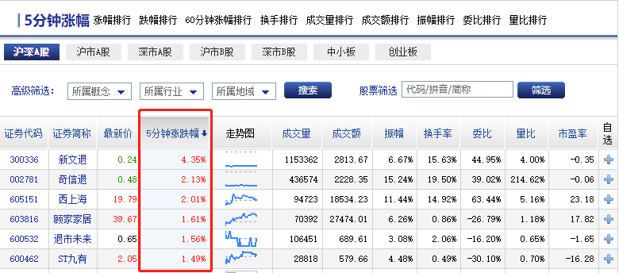
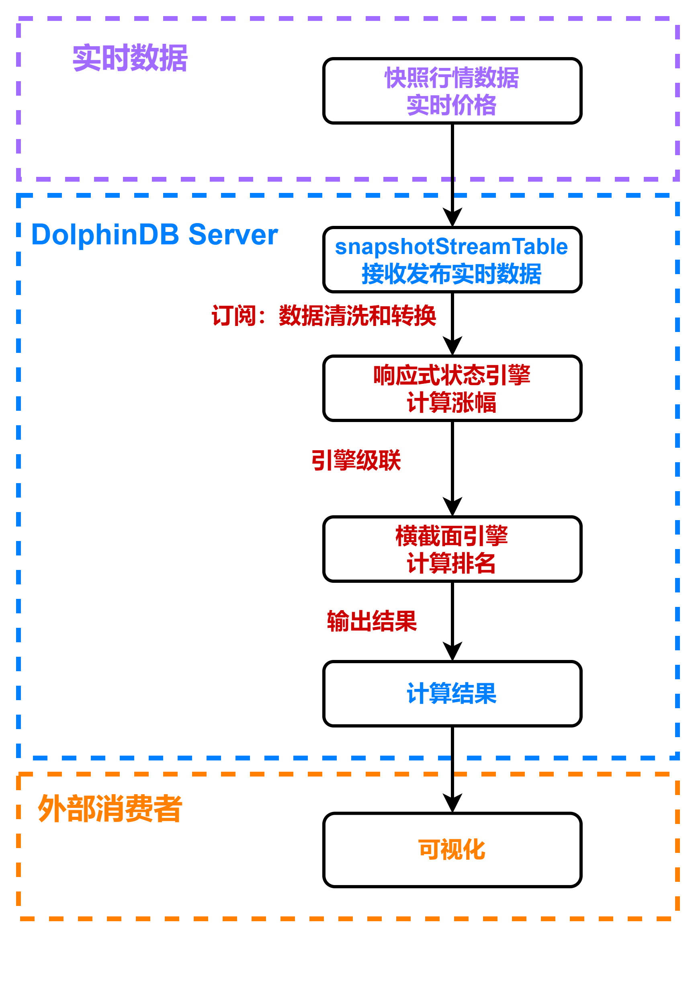
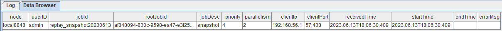
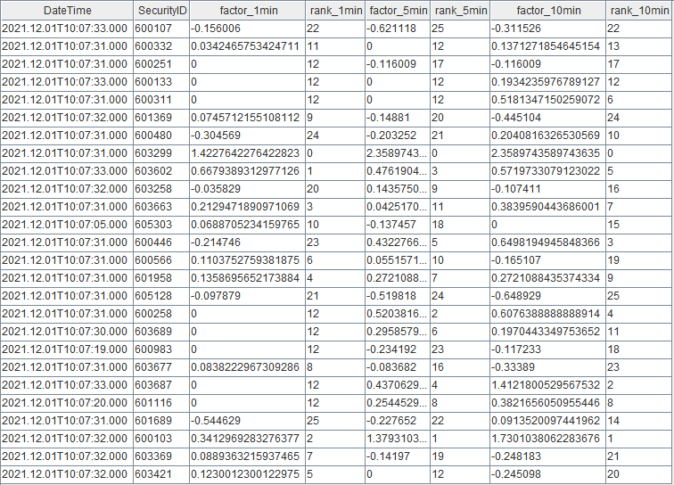
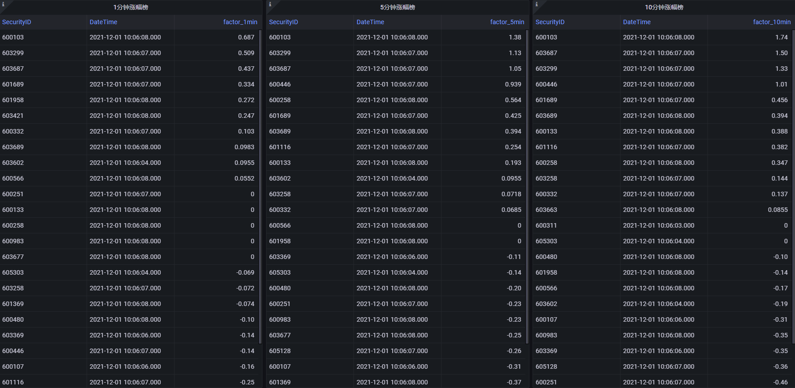

# DolphinDB 流计算在金融行业的应用：实时计算涨幅榜

在股票交易市场，涨幅是一个基础的量价指标，可以衡量资金对个股的拉升力度，是监控主力异动的重要指标。通过关注涨幅，可以了解到资金青睐哪些个股，市场关注哪些板块。



本教程主要提供一种基于 DolphinDB 流数据处理框架，实时计算 1 分钟、5 分钟和10 分钟涨幅榜的低延时解决方案。

本教程包含内容：
- [1. 应用场景描述](#1-应用场景描述)
	- [1.1 数据源](#11-数据源)
	- [1.2 计算指标](#12-计算指标)
	- [1.3 实时计算方案](#13-实时计算方案)
- [2. 代码开发](#2-代码开发)
	- [2.1 创建存储历史数据的库表](#21-创建存储历史数据的库表)
	- [2.2 导入上交所历史快照数据](#22-导入上交所历史快照数据)
	- [2.3 清理环境并创建相关流数据表](#23-清理环境并创建相关流数据表)
	- [2.4 注册流计算引擎和订阅流数据表](#24-注册流计算引擎和订阅流数据表)
	- [2.5 Grafana 实时展示涨幅榜](#25-grafana-实时展示涨幅榜)
	- [2.6 历史数据回放](#26-历史数据回放)
- [3. 结果展示](#3-结果展示)
	- [3.1 节点内的计算结果表](#31-节点内的计算结果表)
	- [3.2 Grafana实时监控结果](#32-grafana实时监控结果)
- [4. 性能测试](#4-性能测试)
	- [4.1 单次响应计算性能测试](#41-单次响应计算性能测试)
	- [4.2 连续响应计算性能测试](#42-连续响应计算性能测试)
- [5. 总结](#5-总结)
- [附件](#附件)


## 1. 应用场景描述

### 1.1 数据源

本教程基于上交所 2021 年某日的快照数据进行代码调试，在 DolphinDB 中存储的表结构为：

| **字段名称** | **数据类型** | **数据说明** |
| :----------- | :----------- | :----------- |
| SecurityID   | SYMBOL       | 证券代码     |
| DateTime     | TIMESTAMP    | 日期时间     |
| PreClosePx   | DOUBLE       | 昨收价       |
| OpenPx       | DOUBLE       | 开始价       |
| HighPx       | DOUBLE       | 最高价       |
| LowPx        | DOUBLE       | 最低价       |
| LastPx       | DOUBLE       | 最新价       |
| ……           | ……           | ……           |

### 1.2 计算指标

本教程示例代码计算了 1 分钟，5 分钟，10 分钟涨幅榜。

涨幅计算公式： *(lastPx - prevLastPx) / prevLastPx \* 100 %*

| **指标名称** | **含义**                                         |
| :----------- | :----------------------------------------------- |
| factor_1min  | 1 分钟涨幅，*prevLastPx* 为 1 分钟前的股票价格   |
| factor_5min  | 5 分钟涨幅，*prevLastPx* 为 5 分钟前的股票价格   |
| factor_10min | 10 分钟涨幅，*prevLastPx* 为 10 分钟前的股票价格 |

关于涨幅的计算细节，不同的开发者会有不同的处理方法。本教程的处理方式如下：

- 当前 X 分钟数据存在时，*prevLastPx*  取前 X 分钟数据的价格。
  - 比如 1 分钟涨幅，09:31:00 的时候，存在 09:30:00 的数据，则 *prevLastPx* 为 09:30:00 的 *lastPx*
- 当前 X 分钟数据不存在时，*prevLastPx* 取 X 分钟前的一个临近时间对应数据的 *lastPx*。
  - 比如 5 分钟涨幅，假设 11:30:00 的数据是上午的最后一条数据，11:30:01~12:59:59 这段时间内没有数据产生。13:03:00 的时候，没有前 5 分钟的 12:58:00 的数据，则 *prevLastPx* 为 12:58:00 的上一条数据，即 11:30:00 的 *lastPx*
- 当窗口不满 X 分钟时，*prevLastPx*  取窗口内第一条数据的价格。
  - 比如 10 分钟涨幅，假设 09:30:00 时，只有 09:25:00~09:30:00 的数据，没有前 10 分钟的 09:20:00 的数据，也没有 10 分钟前的临近时间的数据，则 *prevLastPx* 为窗口第一条数据，即 09:25:00 的 *lastPx*。
- 09:30:00 以后开始输出计算结果
- 上游过滤数据，只计算上交所主板 A 股（股票代码 60 开头） 09:25:00 以后的股票涨幅（09:25:00 以后 *lastPx* 不为 0）

### 1.3 实时计算方案

本教程通过 [createReactiveStateEngine](https://www.dolphindb.cn/cn/help/FunctionsandCommands/FunctionReferences/c/createReactiveStateEngine.html?highlight=createreactivestateengine) 函数创建响应式状态引擎实时计算股票涨幅，通过 [createCrossSectionalEngine](https://www.dolphindb.cn/cn/help/FunctionsandCommands/FunctionReferences/c/createCrossSectionalEngine.html?highlight=createcrosssectionalaggregator) 函数创建横截面引擎对股票截面上的涨幅进行排序生成涨幅榜。

本教程实现的处理流程如下图所示：



**处理流程图说明：**

- 实时数据：为了测试方便，本教程选择从数据库内取出某一天的快照数据，通过 [replay](https://www.dolphindb.cn/cn/help/FunctionsandCommands/FunctionReferences/r/replay.html?highlight=replay) 函数指定速率回放，以此模拟实时数据。
- snapshotStreamTable 是 DolphinDB 中的流数据表，用于接收实时数据源的数据并发布给流计算引擎进行实时计算。
- [subscribeTable](https://www.dolphindb.cn/cn/help/FunctionsandCommands/FunctionReferences/s/subscribeTable.html?highlight=subscribetable) 订阅流数据表，将 snapshotStreamTable 中的增量数据根据股票代码 SecurityID 过滤出沪市主板 A 股的数据，并添加到流计算引擎中计算涨幅。
- 响应式状态引擎结合内置的 [tmfirst](https://www.dolphindb.cn/cn/help/FunctionsandCommands/FunctionReferences/t/tmfirst.html?highlight=tmfirst), [tmove](https://www.dolphindb.cn/cn/help/FunctionsandCommands/FunctionReferences/t/tmove.html?highlight=tmove) 函数实时计算涨幅。
- 横截面引擎结合内置的 [rank](https://www.dolphindb.cn/cn/help/FunctionsandCommands/FunctionReferences/r/rank.html?highlight=rank) 函数实时计算排名。
- 计算结果表是 DolphinDB 中的共享键值表，用于维护涨幅榜的截面，其数据可以被外部消费者消费。
- Grafana 查询引擎输出的计算结果，以实现动态展示涨幅榜的效果。

## 2. 代码开发

本教程代码开发工具采用 [DolphinDB GUI](https://www.dolphindb.cn/cn/gui/gui/index.html)，所有代码均可在 DolphinDB GUI 客户端开发工具执行。

### 2.1 创建存储历史数据的库表

```
def createDfsTb(dbName, tbName){
	//create database
	if(existsDatabase(dbName)){
		dropDatabase(dbName)
	}
	db1 = database(, VALUE, 2020.01.01..2021.01.01)
	db2 = database(, HASH, [SYMBOL, 30])
	db = database(dbName, COMPO, [db1, db2], , "TSDB")
	//create table
	schemaTable = table(
		array(SYMBOL, 0) as SecurityID,
		array(TIMESTAMP, 0) as DateTime,
		array(DOUBLE, 0) as PreClosePx,
		array(DOUBLE, 0) as OpenPx,
		array(DOUBLE, 0) as HighPx,
		array(DOUBLE, 0) as LowPx,
		array(DOUBLE, 0) as LastPx,
		array(INT, 0) as TotalVolumeTrade,
		array(DOUBLE, 0) as TotalValueTrade,
		array(SYMBOL, 0) as InstrumentStatus,
		array(DOUBLE[], 0) as BidPrice,
		array(INT[], 0) as BidOrderQty,
		array(INT[], 0) as BidNumOrders,
		array(INT[], 0) as BidOrders,
		array(DOUBLE[], 0) as OfferPrice,
		array(INT[], 0) as OfferOrderQty,
		array(INT[], 0) as OfferNumOrders,
		array(INT[], 0) as OfferOrders,
		array(INT, 0) as NumTrades,
		array(DOUBLE, 0) as IOPV,
		array(INT, 0) as TotalBidQty,
		array(INT, 0) as TotalOfferQty,
		array(DOUBLE, 0) as WeightedAvgBidPx,
		array(DOUBLE, 0) as WeightedAvgOfferPx,
		array(INT, 0) as TotalBidNumber,
		array(INT, 0) as TotalOfferNumber,
		array(INT, 0) as BidTradeMaxDuration,
		array(INT, 0) as OfferTradeMaxDuration,
		array(INT, 0) as NumBidOrders,
		array(INT, 0) as NumOfferOrders,
		array(INT, 0) as WithdrawBuyNumber,
		array(INT, 0) as WithdrawBuyAmount,
		array(DOUBLE, 0) as WithdrawBuyMoney,
		array(INT, 0) as WithdrawSellNumber,
		array(INT, 0) as WithdrawSellAmount,
		array(DOUBLE, 0) as WithdrawSellMoney,
		array(INT, 0) as ETFBuyNumber,
		array(INT, 0) as ETFBuyAmount,
		array(DOUBLE, 0) as ETFBuyMoney,
		array(INT, 0) as ETFSellNumber,
		array(INT, 0) as ETFSellAmount,
		array(DOUBLE, 0) as ETFSellMoney
	)
	db.createPartitionedTable(table=schemaTable, tableName=tbName, partitionColumns=`DateTime`SecurityID, compressMethods={DateTime:"delta"}, sortColumns=`SecurityID`DateTime, keepDuplicates=ALL)
}

dbName, tbName = "dfs://snapshot", "snapshot"
createDfsTb(dbName, tbName)
```

- 分区原则：建议落在1个最小分区的数据在内存的大小约 150MB~500MB。
  - 比如：上交所 2021年12月01日的股票快照数据为 7873799 行 194 列，加载到内存的大小约 7.3 GB。所以采用组合分区的方法，第一层按天分区，第二层对股票代码按 HASH 分 30 个分区，每个分区的全部数据加载到内存后约占用 249MB 内存空间。
- 创建数据库时，选择 DolphinDB 的  TSDB 存储引擎进行数据的存储。
- 创建数据表时，按照分区方法，指定 `DateTime` 和 `SecurityID` 为分区字段。在对大数据集查询时，必须指定 `DateTime` 和 `SecurityID` 的过滤条件，可以起到分区剪枝的作用。
- DolphinDB 默认数据存储的压缩算法为 lz4，对于时间、日期类型的数据，建议指定采用 delta 压缩算法存储，提高存储的压缩比。

### 2.2 导入上交所历史快照数据

```
def transform(t){
	temp = select lpad(string(SecurityID), 6, "0") as SecurityID, DateTime, PreClosePx, OpenPx, HighPx, LowPx, LastPx, TotalVolumeTrade, TotalValueTrade, InstrumentStatus,
			fixedLengthArrayVector(BidPrice0, BidPrice1, BidPrice2, BidPrice3,  BidPrice4, BidPrice5, BidPrice6, BidPrice7, BidPrice8, BidPrice9) as BidPrice,
			fixedLengthArrayVector(BidOrderQty0, BidOrderQty1, BidOrderQty2, BidOrderQty3,  BidOrderQty4, BidOrderQty5, BidOrderQty6, BidOrderQty7, BidOrderQty8, BidOrderQty9) as BidOrderQty,
			fixedLengthArrayVector(BidNumOrders0, BidNumOrders1, BidNumOrders2, BidNumOrders3,  BidNumOrders4, BidNumOrders5, BidNumOrders6, BidNumOrders7, BidNumOrders8, BidNumOrders9) as BidNumOrders,
			fixedLengthArrayVector(BidOrders0, BidOrders1, BidOrders2, BidOrders3,  BidOrders4, BidOrders5, BidOrders6, BidOrders7, BidOrders8, BidOrders9, BidOrders10, BidOrders11, BidOrders12, BidOrders13,  BidOrders14, BidOrders15, BidOrders16, BidOrders17, BidOrders18, BidOrders19, BidOrders20, BidOrders21, BidOrders22, BidOrders23,  BidOrders24, BidOrders25, BidOrders26, BidOrders27, BidOrders28, BidOrders29, BidOrders30, BidOrders31, BidOrders32, BidOrders33,  BidOrders34, BidOrders35, BidOrders36, BidOrders37, BidOrders38, BidOrders39, BidOrders40, BidOrders41, BidOrders42, BidOrders43,  BidOrders44, BidOrders45, BidOrders46, BidOrders47, BidOrders48, BidOrders49) as BidOrders,
			fixedLengthArrayVector(OfferPrice0, OfferPrice1, OfferPrice2, OfferPrice3,  OfferPrice4, OfferPrice5, OfferPrice6, OfferPrice7, OfferPrice8, OfferPrice9) as OfferPrice,
			fixedLengthArrayVector(OfferOrderQty0, OfferOrderQty1, OfferOrderQty2, OfferOrderQty3,  OfferOrderQty4, OfferOrderQty5, OfferOrderQty6, OfferOrderQty7, OfferOrderQty8, OfferOrderQty9) as OfferOrderQty,
			fixedLengthArrayVector(OfferNumOrders0, OfferNumOrders1, OfferNumOrders2, OfferNumOrders3,  OfferNumOrders4, OfferNumOrders5, OfferNumOrders6, OfferNumOrders7, OfferNumOrders8, OfferNumOrders9) as OfferNumOrders,
			fixedLengthArrayVector(OfferOrders0, OfferOrders1, OfferOrders2, OfferOrders3,  OfferOrders4, OfferOrders5, OfferOrders6, OfferOrders7, OfferOrders8, OfferOrders9, OfferOrders10, OfferOrders11, OfferOrders12, OfferOrders13,  OfferOrders14, OfferOrders15, OfferOrders16, OfferOrders17, OfferOrders18, OfferOrders19, OfferOrders20, OfferOrders21, OfferOrders22, OfferOrders23,  OfferOrders24, OfferOrders25, OfferOrders26, OfferOrders27, OfferOrders28, OfferOrders29, OfferOrders30, OfferOrders31, OfferOrders32, OfferOrders33,  OfferOrders34, OfferOrders35, OfferOrders36, OfferOrders37, OfferOrders38, OfferOrders39, OfferOrders40, OfferOrders41, OfferOrders42, OfferOrders43,  OfferOrders44, OfferOrders45, OfferOrders46, OfferOrders47, OfferOrders48, OfferOrders49) as OfferOrders,
			NumTrades, IOPV, TotalBidQty, TotalOfferQty, WeightedAvgBidPx, WeightedAvgOfferPx, TotalBidNumber, TotalOfferNumber, BidTradeMaxDuration, OfferTradeMaxDuration, 
			NumBidOrders, NumOfferOrders, WithdrawBuyNumber, WithdrawBuyAmount, WithdrawBuyMoney,WithdrawSellNumber, WithdrawSellAmount, WithdrawSellMoney, ETFBuyNumber, ETFBuyAmount, 
			ETFBuyMoney, ETFSellNumber, ETFSellAmount, ETFSellMoney
			from t
	return temp
}

csvDataPath = "/home/v2/下载/data/20211201snapshot_30stocks.csv"
loadTextEx(dbHandle=database(dbName), tableName=tbName, partitionColumns=`DateTime`SecurityID, filename=csvDataPath, transform=transform)
```

- 测试只使用了 2021年12月01日上交所 30 只股票 10:30:00 前的数据，共 32972 条数据，内存占用约 30 M
- 历史数据对象为 csv 文本数据，磁盘空间占用  23 MB
- [loadTextEx](https://www.dolphindb.cn/cn/help/FunctionsandCommands/FunctionReferences/l/loadTextEx.html?highlight=loadtextex) 函数可以直接将数据文件加载到数据库中。其中系统会对数据文件中的数据执行 *transform* 参数指定的函数，再将得到的结果保存到数据库中，本教程中将 csv 中的十档量价数据转化为了 array vector 进行存储

数据导入完成后，可以执行以下查询语句确认数据是否导入成功：

```
select count(*) from loadTable(dbName, tbName) group by date(DateTime) as TradeDate
```

执行完后，返回如下信息，说明数据成功导入：

| TradeDate  | count  |
| :--------- | :----- |
| 2021.12.01 | 32,972 |

### 2.3 清理环境并创建相关流数据表

```
use ops

// clean up environment
def cleanEnvironment(){
	cancelJobEx()
	try{ unsubscribeTable(tableName=`snapshotStreamTable, actionName="snapshotFilter") } catch(ex){ print(ex) }
	try{ dropStreamEngine("calChange")} catch(ex){ print(ex) }
	try{ dropStreamEngine("crossSectionalEngine") } catch(ex){ print(ex) }
	try{ undef("snapshotStreamTable", SHARED) } catch(ex){ print(ex) }
	try{ undef("changeCrossSectionalTable", SHARED) } catch(ex){ print(ex) }
}

// create stream table
def createStreamTable(dbName, tbName){
	schemaTB = loadTable(dbName, tbName).schema().colDefs
	share(streamTable(40000:0, schemaTB.name, schemaTB.typeString), `snapshotStreamTable)
	share(keyedTable(`SecurityID, 50:0, `DateTime`SecurityID`factor_1min`rank_1min`factor_5min`rank_5min`factor_10min`rank_10min, [TIMESTAMP, SYMBOL, DOUBLE,  INT, DOUBLE, INT, DOUBLE, INT]), `changeCrossSectionalTable)
}

cleanEnvironment()
dbName, tbName = "dfs://snapshot", "snapshot"
createStreamTable(dbName, tbName)
```

根据 1.3 章节的流程图，可以看出需要清理的有：正在进行的回放任务、一个订阅（subscribeTable）、两个引擎（响应式状态引擎和横截面引擎）、两张共享表（输入输出表）。

需要创建的表有：一张共享流表（和数据库 dbName 中名为 tbName 的分布式表结构相同，用于接收实时数据）、一张共享键值表（用于维护股票涨幅排名的截面数据）。

### 2.4 注册流计算引擎和订阅流数据表

**（1）订阅流表** snapshotStreamTable，过滤出沪市主板 A 股 09:25:00 以后的数据

```
def snapshotFilter(engineName, mutable data){
	t = select * from data where left(SecurityID, 2)="60" and time(DateTime)>=09:25:00.000
	getStreamEngine(engineName).append!(t)
}

subscribeTable(tableName="snapshotStreamTable", actionName="snapshotFilter", offset=-1, handler=snapshotFilter{"calChange"}, msgAsTable=true, hash=0)
```

- 参数 *batchSize* 和 *throttle* 能指定触发 handler 的规则。*batchSize* 未指定或为非正数，则每一批次的消息都会触发 *handler* 处理增量数据；否则未处理的数据需要积攒到 *batchSize* 条时，*handler* 才会统一处理消息。如果 *batchSize* 条件一直未达到，那么继上次处理消息的 *throttle* 秒之后也会触发 *handler* 处理消息。
- 本教程代码没有指定 *batchSize* 和 *throttle* 是因为示例数据的数据量比较小，共 30 只上交股票，其中主板 A 股只有 26 只。所以每批数据触发一次 *handler* 处理也不会产生计算压力。
- 当接入实时数据之后，可以用 `getStreamingStat().subWorkers` 观察订阅状态，如果发现 *queueDepth* 一直增加，表示订阅队列产生堵塞。此时可以考虑配置并调整 *batchSize* 和 *throttle* 参数。

**（2）注册响应式状态引擎** calChange，计算涨幅

```
@state
def calculateChange(DateTime, LastPx, lag){
	windowFirstPx = tmfirst(DateTime, LastPx, lag)
	preMinutePx = tmove(DateTime, LastPx, lag)
	prevLastPx = iif(preMinutePx == NULL, windowFirstPx, preMinutePx)
	return 100 * (LastPx - prevLastPx) \ prevLastPx
}

createReactiveStateEngine(name="calChange", metrics=<[DateTime, calculateChange(DateTime, LastPx, lag=1m), calculateChange(DateTime, LastPx, lag=5m), calculateChange(DateTime, LastPx, lag=10m)]>, dummyTable=objByName("snapshotStreamTable"), outputTable=getStreamEngine("crossSectionalEngine"), keyColumn=`SecurityID, filter=<time(DateTime) >= 09:30:00.000>)
```

- @state 用于标识状态函数，表示在响应式状态引擎中需要访问灌入引擎的历史数据。其中 `tmfirst` 和 `tmove` 是涉及状态的函数。
- 采用了引擎串联，即响应式状态引擎的输出直接输入下一个横截面引擎。因为 `outputTable=getStreamEngine("crossSectionalEngine")`， 所以需要先执行下面 (3) 的代码创建横截面引擎后，才能顺利执行上述代码创建响应式状态引擎

**（3）注册响应式状态引擎** crossSectionalEngine，计算排名

```
schemaTB = table(1:0, `SecurityID`DateTime`factor_1min`factor_5min`factor_10min, [SYMBOL, TIMESTAMP, DOUBLE, DOUBLE, DOUBLE])
createCrossSectionalEngine(name="crossSectionalEngine", metrics=<[SecurityID, factor_1min, rank(factor_1min, ascending=false), factor_5min, rank(factor_5min, ascending=false), factor_10min, rank(factor_10min, ascending=false)]>, dummyTable=schemaTB, outputTable=objByName("changeCrossSectionalTable"), keyColumn=`SecurityID, triggeringPattern='perBatch', useSystemTime=false, timeColumn=`DateTime)
```

- schemaTB 是横截面引擎的输入表结构（对应响应式状态引擎的输出表结构）。参数 *dummyTable* 只是为了指定输入表结构，和表里是否有数据无关。
- 横截面引擎支持多种触发计算的规则，包括
  - “perBatch” 每插入一批数据触发一次计算
  - “perRow” 每一行数据都会触发一次计算
  - “interval” （根据系统时间）每隔 *triggeringInterval* 的时间，引擎内若存在未计算数据，触发一次计算
  - “keyCount” 当前时间戳记录数达到 *triggeringInterval*，或有更新时间戳的数据到达时，触发一次计算
- 本例中，触发计算的规则采取的是 `triggeringPattern='perBatch'`，即每插入一次数据触发一次对截面的排名统计。

### 2.5 Grafana 实时展示涨幅榜

Grafana 配置 DolphinDB 数据源及监控 DolphinDB 数据表中数据的教程：[Grafana 连接 DolphinDB 数据源](https://gitee.com/dolphindb/grafana-datasource)

本教程监控 1 分钟、5 分钟、10 分钟的涨幅榜。

Grafana 中的 Query 代码：

- 1 min 涨幅榜

    ```
    select SecurityID, DateTime, factor_1min from changeCrossSectionalTable order by rank_1min
    ```

- 5 min 涨幅榜

    ```
    select SecurityID, DateTime, factor_5min from changeCrossSectionalTable order by rank_5min
    ```

- 10 min 涨幅榜

    ```
    select SecurityID, DateTime, factor_10min from changeCrossSectionalTable order by rank_10min
    ```

### 2.6 历史数据回放

```
t = select * from loadTable("dfs://snapshot", "snapshot") where date(DateTime)=2021.12.01 order by DateTime
submitJob("replay_snapshot", "snapshot",  replay{t, snapshotStreamTable, `DateTime, `DateTime, 1000, true, 1})
getRecentJobs()
```

执行完后，返回如下信息：



如果 endTime 和 errorMsg 为空，说明任务正在正常运行中。

## 3. 结果展示

### 3.1 节点内的计算结果表

计算结果表 `changeCrossSectionalTable`，可以通过 DolphinDB 所有 API 查询接口实时查询。

下图是通过 DolphinDB GUI 实时查看该表的结果：



### 3.2 Grafana实时监控结果



## 4. 性能测试

本教程测试了单次响应计算和连续响应计算两种场景。测试数据为 2021 年某天的上交所主板 A 股 1650 只股票的数据。

### 4.1 单次响应计算性能测试

单次响应计算时间为从第 1 个响应式状态引擎收到输入至第 2 个横截面引擎输出结果所经历的时间。

测试了单只股票响应一次计算（单条数据触发一次计算）和 1650 只股票响应一次计算（一批数据触发一次计算）的性能。统计了 10 次的总耗时，取平均值作为单次的耗时。测试使用的服务器 CPU 为 Intel(R) Xeon(R) Silver 4216 CPU @ 2.10GHz。单线程情况下，测试结果如下：

| 股票个数 | 耗时(单位:ms) |
| :------- | :------------ |
| 1        | 0.20          |
| 1650     | 3.45          |

### 4.2 连续响应计算性能测试

以 2021 年某天的上交所主板 A 股 1650 只股票的 658 万条快照数据为测试数据，将所有测试数据全量灌入第 1 个响应式状态引擎触发计算。引擎流水线的计算总耗时是 17 秒，最大处理的能力是 38 万条每秒。

开发者可以增加计算的并行度，提高系统的处理能力。

## 5. 总结

DolphinDB 内置的流数据框架支持流数据的发布，订阅，预处理，实时内存计算，复杂指标的滚动窗口计算、滑动窗口计算、累计窗口计算等，是一个运行高效、使用便捷的流数据处理框架。

本教程基于 DolphinDB 流数据处理框架，提供了一种实时计算涨幅榜的低延时解决方案，旨在提高开发人员在使用 DolphinDB 内置的流数据框架开发流计算业务场景时的开发效率、降低开发难度，更好地挖掘 DolphinDB 在复杂实时流计算场景中的价值。

## 附件

**业务代码**

 [01.创建存储快照数据的库表并导入数据.txt](script/Real-Time_Stock_Price_Increase_Calculation/01.创建存储快照数据的库表并导入数据.txt) 

 [02.清理环境并创建相关流数据表.txt](script/Real-Time_Stock_Price_Increase_Calculation/02.清理环境并创建相关流数据表.txt) 

 [03.注册流计算引擎和订阅流数据表.txt](script/Real-Time_Stock_Price_Increase_Calculation/03.注册流计算引擎和订阅流数据表.txt) 

 [04.历史数据回放.txt](script/Real-Time_Stock_Price_Increase_Calculation/04.历史数据回放.txt) 

 [05.性能测试.txt](script/Real-Time_Stock_Price_Increase_Calculation/05.性能测试.txt) 

**示例数据**

[20211201snapshot_30stocks.zip](data/Real-Time_Stock_Price_Increase_Calculation/20211201snapshot_30stocks.zip) 