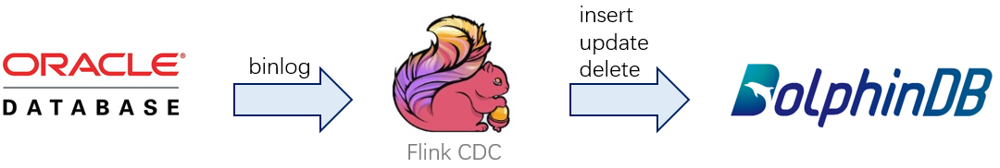
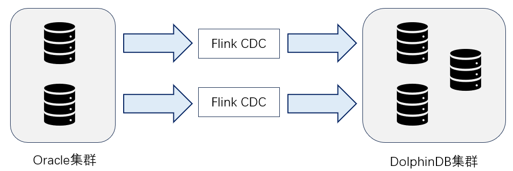
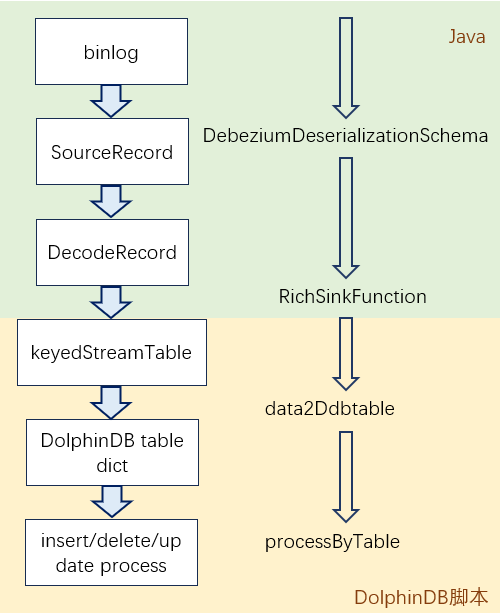

# 基于 FlinkCDC 的 DolphinDB 实时同步

金融机构除了在投研和生产环境中使用时序数据库以外，也会将一部分数据存放在其他数据库中，并定期在这两个数据库之间进行同步。本文提供了一种基于 FlinkCDC 的数据同步方案，实现从 Oracle/SqlServer/MySQL 等外部数据库到 DolphinDB 的数据同步，其延时可以控制在秒级。

- [基于 FlinkCDC 的 DolphinDB 实时同步](#基于-flinkcdc-的-dolphindb-实时同步)
  - [1 FlinkCDC 介绍](#1-flinkcdc-介绍)
    - [1.1 什么是 CDC](#11-什么是-cdc)
    - [1.2 FlinkCDC](#12-flinkcdc)
  - [2 DolphinDB 介绍](#2-dolphindb-介绍)
  - [3 同步方案](#3-同步方案)
    - [3.1 方案介绍](#31-方案介绍)
    - [3.2 系统组成](#32-系统组成)
    - [3.3 流程介绍](#33-流程介绍)
    - [3.4 数据对象](#34-数据对象)
      - [3.4.1 数据流表](#341-数据流表)
      - [3.4.2 错误数据流表](#342-错误数据流表)
        - [errorMsg](#errormsg)
      - [3.4.3 系统信息数据库 dfs://FlinkcdcSysInfo](#343-系统信息数据库-dfsflinkcdcsysinfo)
        - [分布式表 ErrorInfo](#分布式表-errorinfo)
        - [分布式表 LastFilePos](#分布式表-lastfilepos)
      - [3.4.4 错误信息文件](#344-错误信息文件)
    - [3.5 flinkcdc 模块接口](#35-flinkcdc-模块接口)
      - [flinkcdc::start(streamName, configText, needDropStreamTable=false)](#flinkcdcstartstreamname-configtext-needdropstreamtablefalse)
      - [flinkcdc::stop(streamName, needDropStreamTable=false)](#flinkcdcstopstreamname-needdropstreamtablefalse)
      - [flinkcdc::isRunning(streamName)](#flinkcdcisrunningstreamname)
      - [flinkcdc::truncateTables(streamName)](#flinkcdctruncatetablesstreamname)
      - [flinkcdc::getLastFilePos(streamName)](#flinkcdcgetlastfileposstreamname)
      - [flinkcdc::processErrorMsg(streamName, batchSize, whereCodeOrTable=NULL)](#flinkcdcprocesserrormsgstreamname-batchsize-wherecodeortablenull)
      - [flinkcdc::getQueueDepth(streamName)](#flinkcdcgetqueuedepthstreamname)
    - [3.6 配置项](#36-配置项)
      - [3.6.1 启动参数](#361-启动参数)
      - [3.6.2 init.cfg](#362-initcfg)
      - [3.6.3 table.cfg](#363-tablecfg)
      - [3.6.4 transform.dos](#364-transformdos)
  - [4 使用示例](#4-使用示例)
    - [4.1 环境参数](#41-环境参数)
    - [4.2 使用步骤](#42-使用步骤)
  - [5 性能测试](#5-性能测试)
  - [6 结论](#6-结论)
  - [附录](#附录)
    - [常见问题](#常见问题)
      - [1. 频繁报错但没有数据同步过来](#1-频繁报错但没有数据同步过来)
      - [2. 同步后 DolphinDB 与外部数据不匹配](#2-同步后-dolphindb-与外部数据不匹配)
      - [3. 没有报错，也没有数据写入](#3-没有报错也没有数据写入)
      - [4. 怎样缩短落库的时延](#4-怎样缩短落库的时延)
      - [5. 怎样提高方案的可靠性](#5-怎样提高方案的可靠性)
      - [6. 外部表没有修改，但始终有同步数据](#6-外部表没有修改但始终有同步数据)
    - [Oracle 部署注意事项](#oracle-部署注意事项)
      - [断开数据库连接的测试方法](#断开数据库连接的测试方法)
    - [MySQL 部署注意事项](#mysql-部署注意事项)
    - [SQL Server 部署注意事项](#sql-server-部署注意事项)
      - [断开数据库连接的测试方法](#断开数据库连接的测试方法-1)

## 1 FlinkCDC 介绍

### 1.1 什么是 CDC

变更数据捕获（Change Data Capture，CDC）是指从源数据库捕获到数据和数据结构的增量变更（包括数据或数据表的插入、更新以及删除等、DDL、DML），近乎实时地将这些变更传播到其他数据库或应用程序处。通过这种方式，CDC 能够向数据仓库提供高效、低延迟的数据传输，以便信息被及时转换并交付给下游应用程序处理。

变更数据捕获（CDC）通常具有如下三项基本优势：

- CDC 仅发送增量的变更，能够降低通过网络传输数据的成本；
- CDC 可以帮助用户根据最新的数据做出更快、更准确的决策；
- CDC 最大限度地减少了对于生产环境网络流量的干扰。

### 1.2 FlinkCDC

Flink 社区开发了 flink-cdc-connectors 组件，这是一个可以直接从 Oracle，MariaDB, RDS Oracle，Aurora Oracle，PolarDB Oracle，PostgreSQL，MongoDB，SqlServer，OceanBase，PolarDB-X，TiDB 等数据库读取全量数据和增量变更数据的 source 组件。相对于 canal、Maxwell、Debezium 等 CDC 工具，Flink CDC 节省了消息中间件这一层，可以在获取数据后直接进行数据的加工处理。

Flink CDC 可以直接从数据库获取 binlog 以供下游进行业务计算分析。从实现上讲，Flink CDC Connectors 内置了一套 Debezium 和 Kafka 组件，但这个细节对用户屏蔽。该链路简化后如下图所示：



## 2 DolphinDB 介绍

DolphinDB 是一款高性能的融合数据库与编程语言的产品，支持分布式存储与计算，能满足复杂数据应用的开发需求，实现批计算和流计算的统一，并提供事务与高可用的保证。

在数据导入方面，使用 DolphinDB 能大幅降低开发成本。相比使用 Python 等其他语言，DolphinDB 在回测和模拟撮合的性能方面有最高100倍的提升。此外，DolphinDB 支持流批一体，使研发与实盘共用一套代码，这可以减少90%的开发成本。

## 3 同步方案

### 3.1 方案介绍



用户的数据存放在 Oracle 组成的集群中。为提高系统的可靠性，用户可以将两个 FlinkCDC 部署在两台服务器上同时运行。FlinkCDC 通过读取 Oracle 的 binlog 将收到的数据流写入 DolphinDB 集群。

在 DolphinDB 集群中，我们定义了一个名为 keyedStreamTable 的分布式流表。两个 FlinkCDC 同时向该流表写入数据，并通过主键过滤以确保同一主键的数据在24小时内不会重复写入。在 DolphinDB 内部，我们通过代码订阅 keyedStreamTable，将接收到的数据流解析为数据库的更新操作。

### 3.2 系统组成

系统由四个部分组成，分别是：

1. Java 项目：Java 项目是整个系统的入口，它基于开源项目 FlinkCDC 开发，主要实现 Oracle 集群数据的采集、解码和 DolphinDB 数据的编码、上传。
2. flinkcdc 模块：DolphinDB 脚本编写的 flinkcdc.dos 文件，实现对上传数据的处理，并将其存储到 DolphinDB 集群中。
3. 用户配置文件：配置 FlinkCDC（init.cfg）与 DolphinDB 运行的参数、外部库表与 DolphinDB 库表的对应关系（table.cfg）等。
4. 转换代码：用户编写的脚本代码（transform.dos），实现外部数据到 DolphinDB 数据的转换。

用户在使用过程中只需要修改配置文件、编写转换代码（可选），即可将外部库表同步到 DolphinDB 的库表中。

### 3.3 流程介绍



整个流程分为两个部分，Java 代码部分和 DolphinDB 脚本部分。Java 代码部分在 Java 项目中，DolphinDB 脚本在 flinkcdc.dos 和转换代码中。

1. Java 项目依托 FlinkCDC 读取外部数据库的 binlog 文件并将其转为 SourceRecord（与外部库表的数据格式对应）；
2. DebeziumDeserializationSchema 将 SourceRecord 转为 DecodeRecord（与流表的数据格式对应）；
3. RichSinkFunction 采集 DecodeRecord，并使用内部的 MultithreadedTableWriter 对象将其上传到 DolphinDB 服务器的 keyedStreamTable 流表中；
4. flinkcdc 模块订阅 keyedStreamTable 流表，并使用 processMsg 处理收到的数据，整个过程分为两个部分：
   1. data2Ddbtable 将 keyedStreamTable 中的数据按外部库表分组，转为对应 DolphinDB 表的数据（此时会调用用户编写的转换代码），相同 DolphinDB 表的数据存放在一起；
   2. processByTable 按 DolphinDB 表分组，每一组内按照顺序执行 insert/delete/update 操作，完成数据的同步。

**注意：** 为了提高 DolphinDB 的 update 效率，update 的操作被拆分为 delete+insert 两步执行。

### 3.4 数据对象

FlinkCDC 一旦启动，会在 DolphinDB 服务器中自动创建一些数据对象，以下是这些对象的详细介绍。

#### 3.4.1 数据流表

流表的名称由用户调用 start（tableName, configText）时的 tableName 指定，譬如 FlinkCDCStreamTable。外部所有库表的数据都会写入到这一张数据流表中，类型为 keyedStreamTable，表的结构如下。

| **字段名称**    | **字段类型**      | **说明**                                   |
| ----------- | ------------- | ---------------------------------------- |
| file        | SYMBOL        | 记录所在的 binlog 文件名称，全量同步期间填空；增量同步期间非空，oracle 填 scn，mysql 填 binlog 文件名称，pg 填 lsn，sqlserver 填 lsn。 |
| pos         | STRING        | 记录在 binlog 文件中的位置，全量同步期间填记录的顺序号；增量期间，oracle 填 scn 值，pg 填 lsn 值，sqlserver 填 lsn 值。 |
| time        | NANOTIMESTAMP | 收到数据的时间（FlinkCDC 运行机器的时间，不是 DolphinDB 服务器的） |
| type        | CHAR          | c：插入<br> u：更新<br> d：删除                             |
| sourceTable | SYMBOL        | oracle 的库名和表名，使用/连接                      |
| tables      | SYMBOL        | 待写入的 DolphinDB 中的库名和表名，使用/连接，多个库表使用,隔开   |
| data        | BLOB          | 数据的 json 字符串，type 为：<br> c：插入的数据<br> u：更新后的数据<br> d：删除前的数据 |
| beforeData  | BLOB          | 变化之前数据的 json 字符串，type 为：<br> c：空<br> d：空<br> u：变化前的数据   |

**注意：**

1. 由于外部表中的记录使用 fastjson 包转为 json 字符串，日期时间类型（MySQL 的 TIMESTAMP 除外）会转换为 LONG 类型。
2. Oracle 可以使用 nanotimestamp（jsonms*1000）转为 DolphinDB 的准确时间值。
3. MySQL 的 TIMESTAMP 会转为字符串，譬如：2023-09-01T09:00:00Z。

#### 3.4.2 错误数据流表

名称为数据流表名称+ErrorStream，譬如：FlinkCDCStreamTableErrorStream。外部数据写入过程中发生的错误都会记录在错误数据流表，流表的字段如下。

| **字段名称**   | **字段类型**      | **说明**                                |
| ---------- | ------------- | ------------------------------------- |
| streamName | SYMBOL        | 发生错误的流表名称                             |
| errorTable | SYMBOL        | 写入错误的 DolphinDB 中的库名和表名，是 tables 中的一个 |
| errorTime  | NANOTIMESTAMP | 发生错误的时间，DolphinDB 服务器的时间              |
| errorMsg   | STRING        | 错误信息                                  |
| retryTime  | NANOTIMESTAMP | 再次重试的时间，执行 processErrorMsg 时修改        |

##### errorMsg

errorMsg 表示错误信息，包含用空格隔开的错误类别和详细错误信息。范例如下：

```
<nullPartition> dfs://FlinkcdcDemo2/entrustAll存在分区列为空的数据 2/136,ChannelNo->8ApplSeqNum->-46556031
```

错误类别被<>包围，分为以下几种：

1. transform：外部数据转换为 DolphinDB 数据时出错，需要检查 transform 函数、table.cfg 中参数和外部数据。
2. append：数据插入出错，需要检查 DolphinDB 表的分区方式，譬如数据是否在 RANGE 分区范围内。
3. prepareDelete：准备删除数据时出错，需要根据错误信息详细分析。
4. delete：数据删除出错，需要检查是否存在数据丢失，数据不匹配的问题（参看常见问题页面排查）。
5. process：数据处理阶段出错，需要根据错误信息详细分析。
6. nullPartition：外部数据的分区列为空，需要调整 DolphinDB 表的分区字段。

#### 3.4.3 系统信息数据库 dfs://FlinkcdcSysInfo

系统启动后会自动创建这个数据库，用于存放错误和运行信息，其中包含两个分布式表。

##### 分布式表 ErrorInfo

错误数据表，其结构与错误数据流表一致，用于持久化错误数据。

用户通过查询错误数据，解决错误的原因后，可以调用 `flinkcdc::processErrorMsg` 重新处理这些数据。默认保存一个月的错误数据，可通过 table.cfg 中的 *errorInfoRetentionMonths* 参数调整。

##### 分布式表 LastFilePos

外部库表的最后读取位置。

| **字段名称** | **字段类型**  | **说明**          |
| -------- | --------- | --------------- |
| table    | SYMBOL    | 外部库表的名称，库表名用/连接 |
| file     | SYMBOL    | 最后读取的文件名称       |
| pos      | STRING    | 最后读取的文件位置       |
| time     | TIMESTAMP | 最后读取的时间         |

#### 3.4.4 错误信息文件

当前目录的 log 文件夹中存放有 flinkcdc.log 文件，其中记录了 FlinkCDC 运行时的警告和错误信息，包含数据插入数据流表失败的信息，譬如：`DolphinDBSink insert data error`。错误信息文件超过100M 会清空，原有的内容存放在 flinkcdc.log.1 中，文件数量达到30个（可在 init.cfg 的 *logFileMaxBackupIndex* 配置）会自动删除最旧的文件。

### 3.5 flinkcdc 模块接口

**注意：** flinkcdc 模块会在 Java 程序中自动调用，请勿手动修改这个文件。如需手动调用里面的接口，可以把 flinkcdc.dos 上传到服务器的 modules 目录下，引用模块里的方法。

如下为接口介绍：

#### flinkcdc::start(streamName, configText, needDropStreamTable=false)

**功能：** 启动处理流程。

**参数说明：**

`streamName`：流表的名称，一台服务器上可以创建多个流表，每个流表都有自己的状态和对象，彼此之间不影响。

`configText`：用户配置的外部表与 DolphinDB 表的映射文件内容。请参看3.6.3的 table.cfg 文件介绍。

`needDropStreamTable`：是否需要删除之前的流表数据。

**返回值：** 字典，外部库表和 DolphinDB 库表的对应关系。

#### flinkcdc::stop(streamName, needDropStreamTable=false)

**功能：** 停止处理流程。

**参数说明：**

`streamName`：流表的名称。

`needDropStreamTable`：是否同时删除流表数据。

**返回值：** 无。

#### flinkcdc::isRunning(streamName)

**功能：** 处理是否正在进行中。

**参数说明：**

`streamName`：流表的名称。

**返回值：** 字典，外部库表和 DolphinDB 库表的对应关系。

#### flinkcdc::truncateTables(streamName)

**功能：** 截断 table.cfg 中的所有 DolphinDB 表。

**参数说明：**

`streamName`：流表的名称。

**返回值：** 无。

#### flinkcdc::getLastFilePos(streamName)

**功能：** 获取最后处理的 binlog 文件位置。

**参数说明：**

`streamName`：流表的名称。

**返回值：** 表，包含 file(SYMBOL), pos(STRING)两个字段。

#### flinkcdc::processErrorMsg(streamName, batchSize, whereCodeOrTable=NULL)

**功能：** 重新处理发生错误数据的数据。

**参数说明：**

`streamName`：流表的名称。

`batchSize`：分批处理的条数。

`whereCodeOrTable`：重新处理的数据，元代码或者内存表。元代码表示 where 语句的元代码，譬如：`<errorTime>=2023.09.25T15:38:15.593717625 and errorTable="dfs://FlinkcdcDemo/entrust">`。

**返回值：** 处理的数据条数。

#### flinkcdc::getQueueDepth(streamName)

**功能：** 查询数据流表和错误流表的待处理数据队列深度

**参数说明：**

`streamName`：流表的名称。

**返回值：** 表，包含 tableName(STRING),queueDepth(LONG)，如果一个流表包含多个订阅，取最大队列深度。

```
tableName                      queueDepth
------------------------------ ----------
FlinkCDCStreamTableErrorStream 0         
FlinkCDCStreamTable            0  
```

### 3.6 配置项

#### 3.6.1 启动参数

Java 程序的启动参数，例如：

```
java -jar DdbFlinkCDC.jar restart=false startPos=latest truncateTables=false dropStreamTable=false
```

**参数说明：**

`restart`：默认 false，是否重启 DolphinDB 中的程序、重新订阅流表。如果对 init/table 的配置文件做了修改，则必须将该参数设置为 true 后启动才能生效。

`startPos`：默认 continueOrLatest，优先从上次断开的地方开始重新读取，否则读取之后的变更数据。可选initial（全量读取已有数据并读取之后的变更数据）,latest（只读取之后的变更数据）,continueLastPos（从上次断开的地方开始重新读取）。不同的数据库支持的参数不一样，请慎重选择。

`truncateTables`：默认 false，是否截断 table.cfg 中所有 DolphinDB 表的数据。

`dropStreamTable`：默认 false，是否删除已经存在的流表数据。

#### 3.6.2 init.cfg

init.cfg 是 Java 程序的配置文件，名称和位置都不得更改，默认在启动目录下可以调整里面的数值，但不要删除任何一条。

注释必须单独一行且使用#开头。

```
{
    #dolphindb数据库的配置项，包含地址和用户名密码
    "ddb": {
        "ip": "192.168.1.182", 
        "password": "123456",
        "port": 8848,
        "username": "admin"
    },
    #flinkcdc模块的代码地址，请使用工程自带的dos文件，千万不要自行修改里面的代码
    "flinkcdcDos": "./flinkcdc.dos",
    #外部数据库的信息，包含类型（MySql/Oracle/Postgres/Sqlserver），地址，并行度（MySQL可以大于1，其他必须配1），用户名密码等，不同的数据库配置有差异，请务必仔细配置。一个flinkcdc工程只支持一个source项目，最后一个生效
    "source": {
        "type": "Oracle",
        "ip": "183.136.170.218",
        "password": "123456",
        "port": 1521,
        "parallelism": 1,
        "username": "oracledba",
        "database": "ORCLCDB"
    }
    #multithreadedTableWriter数据写入的参数配置
    "multithreadedTableWriter": {
        "batchSize": 10000,
        "throttle": 10
    },
    #flinkcdc写入的流表名称
    "streamTableName": "FlinkCDCStreamTable",
    #外部表到DolphinDB表的映射关系
    "tableConfig": "./table.cfg",
    #外部表到DolphinDB表的字段转换方法，table.cfg中用到的转换函数定义
    "tableConfigTransformDos": "./transform.dos",
    #保存多少个日志文件，每个日志文件大小不超过100MB
    "logFileMaxBackupIndex" : 30
}
```

#### 3.6.3 table.cfg

table.cfg 是 flinkcdc.dos 引用的配置文件，文件名称由 init.cfg 中的 tableConfig 指定，用户可参考下列模板自行编写。

```
{
    #流表持久化的参数，参看https://docs.dolphindb.cn/zh/help/200/FunctionsandCommands/CommandsReferences/e/enableTableShareAndPersistence.html
    "enableTableShareAndPersistence": {
        "asynWrite": true,
        "cacheSize": 100000,
        "retentionMinutes": 1440,
        "flushMode": 0
    },
    #流表订阅的参数，参看subscribeTable — DolphinDB 2.0 documentation
    "subscribeTable": {
        "threadCount": 10,
        "batchSize": 10000,
        "throttle": 1
    },
    #dfs://FlinkcdcSysInfo/ErrorInfo表中保留几个月的数据（可选，整数），默认为1
    "errorInfoRetentionMonths" : 1,
    #外部表
    "sourceTable": [
        {
            #表名，模式名/表名的结构，模式名可为空，但中间的/不能省掉
            "name": "ddb/ENTRUST",
            #DolphinDB中表与外部表的schema（可选，不填则使用DolphinDB表的schema），包含对应字段名称name和字段类型type。
            "schema": [
                {"name": "CHANNELNO","type": "INT"},{"name": "APPLSEQNUM","type": "LONG"},{"name": "MDSTREAMID","type": "INT"},
                {"name": "SECURITYID","type": "SYMBOL"},{"name": "SECURITYIDSOURCE","type": "INT"},{"name": "PRICE","type": "DOUBLE"},
                {"name": "ORDERQTY","type": "INT"},{"name": "SIDE","type": "SYMBOL"},{"name": "TRADETIME","type": "LONG"},
                {"name": "ORDERTYPE","type": "SYMBOL"},{"name": "ORDERINDEX","type": "INT"},{"name": "RECEIVETIME","type": "LONG"},
                {"name": "SEQNO","type": "LONG"},{"name": "MARKET","type": "SYMBOL"},{"name": "DATASTATUS","type": "INT"},
                {"name": "BIZINDEX","type": "LONG"}
            ],
            #外部表对应的DolphinDB表
            "ddbTable": [
                {
                    #库名/表名，同一张表transform、delField、uniqueColumn必须完全一样；
                    "name": "dfs://FlinkcdcDemo/entrust",
                    #转换函数名transform（可选），如果外部表和DolphinDB表的顺序和类型完全匹配可不填，一元函数，传入外部table数据，返回与DolphinDB表字段一一对应的table数据
                    "transform": "toFactor",
                    #软删除字段信息delField（可选，不设置则需配置uniqueColumn）
                    "delField": {
                        #包含软删除字段名称name
                        "name": "isDeleted",
                        #value中是第一个值0表示不删除的字符串值，第二个值1表示删除的字符串值。这些值必须转为字符串填入
                        "value": ["0","1"]
                    }
                },
                {
                    #库名/表名，同一张表transform、delField、uniqueColumn必须完全一样；
                    "name": "dfs://FlinkcdcDemo/entrustAll",
                    #转换函数名transform（可选），如果外部表和DolphinDB表的顺序和类型完全匹配可不填，一元函数：传入外部table数据，返回与DolphinDB表字段一一对应的table数据
                    "transform": "toFactor",
                    #组成唯一值的字段列表（可选，不设置则需配置delField），用于物理删除时判断记录位置，必须和外部表的主键完全一致
                    "uniqueColumn": ["BizIndex"]
                }
            ]
        }
    ]
}
```

对 DolphinDB 数据的删除支持两种模式：

1. 软删除模式。特点是快，所有的更新删除操作都是插入数据，但需要满足以下条件：
   1. 配置 delField 字段
   2. DolphinDB 表调用 createPartitionedTable 时的 sortColumns 与外部库表的主键完全一致，且 keepDuplicates=LAST
   3. 查询语句中增加对软删除字段值的判断。譬如：isDeleted 为软删除字段，查询语句应为 select * from loadTable(“dfs://FlinkcdcDemo”,”entrust”) where **isDeleted=0**
   4. 数据更新频率不会很频繁。因为每次更新都会添加一条新的数据，如果更新太频繁，会导致重复数据太多，降低查询速度。
2. 物理删除模式。特点是适用面广，但相比软删除会慢4-6倍，使用条件如下：
   1. 配置 uniqueColumn 字段，必须与外部库表的主键完全一致。

#### 3.6.4 transform.dos

transform.dos 是 flinkcdc.dos 从外部数据转为 DolphinDB 数据时调用的方法，由用户编写。

文件名称由 init.cfg 中的 tableConfigTransformDos 指定。

```
def toFactor(mutable tb){
      TradeTimeA=nanotimestamp(tb.TRADETIME*1000);
      ReceiveTimeA=time(nanotimestamp(tb.RECEIVETIME*1000));    
      tb.replaceColumn!(`TRADETIME,TradeTimeA);    
      tb.replaceColumn!(`RECEIVETIME,ReceiveTimeA);    
      return tb;
}
```

table.cfg 中 transform 指定的函数，如果函数视图里面没有，必须在文件中定义，否则项目无法启动。

## 4 使用示例

### 4.1 环境参数

- JDK 版本1.8
- DolphinDB 版本2.00.9以上+[encoderdecoder 插件](https://gitee.com/dolphindb/DolphinDBPlugin/tree/release200.10/)+[流数据开启持久化配置](https://docs.dolphindb.cn/zh/help/200/DatabaseandDistributedComputing/Configuration/ConfigParamRef.html#id26)
- Oracle Database 19c Enterprise Edition Release 19.0.0.0.0 - Production

### 4.2 使用步骤

1. 前往[代码仓库](https://dolphindb.net/tpyu/dolphindbflinkcdc)下载工程。
2. 整个工程运行 Maven->Lifecycle->package 打包，生成 DdbFlinkCDC-1.0-SNAPSHOT.jar 文件。
3. 打开 DolphinDBGUI 或者 VSCode，运行 DolphinDB 的建库建表脚本（参看附件 createDb.dos）。
4. 打开 DBeaver，连接 Oracle 数据库，运行 Oracle 建库建表脚本（参看附件 oracle.txt），并开启 log 日志和表的附加日志（参看附录 Oracle 部署说明）。
5. 编辑 init.cfg、table_XXXX.cfg 和 transform.dos（参看附件）。
6. 运行 java -jar DdbFlinkCDC-1.0-SNAPSHOT.jar。

附件：[flinkcdc.dos](./script/Real-time_synchronization_of_DolphinDB_based_on_FlinkCDC/flinkcdc.dos), [init.cfg](./script/Real-time_synchronization_of_DolphinDB_based_on_FlinkCDC/init.cfg), [table_hard.cfg](./script/Real-time_synchronization_of_DolphinDB_based_on_FlinkCDC/table_hard.cfg), [table_soft.cfg](./script/Real-time_synchronization_of_DolphinDB_based_on_FlinkCDC/table_soft.cfg), [transform.dos](./script/Real-time_synchronization_of_DolphinDB_based_on_FlinkCDC/transform.dos), [createDb.dos](./script/Real-time_synchronization_of_DolphinDB_based_on_FlinkCDC/createDb.dos), [oracle.txt](./script/Real-time_synchronization_of_DolphinDB_based_on_FlinkCDC/oracle.txt)

## 5 性能测试

| **操作类型** | **删除方法** | **FlinkCDC** | **DolphinDB耗时** | **总耗时** | **吞吐量** |
| -------- | -------- | ------------ | --------------- | ------- | ------- |
| 插入       | 软删除/物理删除 | 10.1         | 10.0            | 11.1    | 9009    |
| 更新       | 软删除      | 3.8          | 6.4             | 7.2     | 13889   |
| 物理删除     | 4.8      | 43.8         | 44.8            | 2232    |         |
| 删除       | 软删除      | 4.1          | 5.3             | 5.9     | 16949   |
| 物理删除     | 4.2      | 20.1         | 20.7            | 4831    |         |

经多次测试，平均响应延时约4秒（从外部数据更新到 DolphinDB 更新的延时）

测试数据量：100000

服务器配置：社区版本默认配置

总耗时：由于 FlinkCDC 是分批将数据提交到 DolphinDB 处理的，所以相比 FlinkCDC+DolphinDB 的耗时要短

测试 SQL 脚本：参看附件的 oracle.txt

## 6 结论

FlinkCDC 作为一款开源数据同步方案，通过和 DolphinDB 对接能够很好地支持用户的外部数据实时同步，它具有以下特点：

- 部署简单：用户在新环境下只需要两步，1-安装 Java 运行环境，2-拷贝 JAR 文件，即可完成部署。
- 对接库表无需编写 Java 代码：用户对接自己的库表时，不需要调整 Java 项目的代码，只需编写自己的配置文件和 transform 脚本即可，这降低了 DolphinDB 用户的使用门槛。
- 支持多种外部数据库：同时支持 Oracle/SqlServer/MySQL 三种数据库，后续将支持更多数据库。
- 支持全量和增量两种同步：同时支持全量和增量同步两种运行方式。

此外，FlinkCDC 作为一个持续推进的开源项目，仍然存在不少稳定性问题（参看附录），目前其对 MySQL 的支持最好，对 Oracle/SQLServer 等其他数据库的支持稍差，在使用前需要详细的测试。

## 附录

### 常见问题

#### 1. 频繁报错但没有数据同步过来

**问题1：**

```
Caused by: io.debezium.DebeziumException: The db history topic or its content is fully or partially missing. Please check database history topic configuration and re-execute the snapshot.
```

**问题2：** 一启动就停止了

```
2023-10-12 15:38:19,357 INFO [org.apache.flink.runtime.taskmanager.Task] - Source: FlinkCDCStreamTable1 -> Sink: Unnamed (1/1)#0 (7afbcbb6b2010b0f892f5d9901625a59_cbc357ccb763df2852fee8c4fc7d55f2_0_0) switched from INITIALIZING to RUNNING.
2023-10-12 15:38:19,357 INFO [org.apache.flink.runtime.source.coordinator.SourceCoordinator] - Source Source: FlinkCDCStreamTable1 received split request from parallel task 0 (#0)
2023-10-12 15:38:19,357 INFO [org.apache.flink.runtime.executiongraph.ExecutionGraph] - Source: FlinkCDCStreamTable1 -> Sink: Unnamed (1/1) (7afbcbb6b2010b0f892f5d9901625a59_cbc357ccb763df2852fee8c4fc7d55f2_0_0) switched from INITIALIZING to RUNNING.
2023-10-12 15:38:19,907 INFO [io.debezium.connector.oracle.OracleConnection] - Database Version: Oracle Database 19c Enterprise Edition Release 19.0.0.0.0 - Production
Version 19.3.0.0.0
2023-10-12 15:38:20,010 INFO [io.debezium.jdbc.JdbcConnection] - Connection gracefully closed
2023-10-12 15:38:20,015 INFO [com.ververica.cdc.connectors.base.source.enumerator.IncrementalSourceEnumerator] - Assign split StreamSplit{splitId='stream-split', offset={commit_scn=0, lcr_position=null, scn=60589315}, endOffset={commit_scn=0, lcr_position=null, scn=-9223372036854775808}} to subtask 0
2023-10-12 15:38:20,179 INFO [org.apache.flink.runtime.state.TaskExecutorStateChangelogStoragesManager] - Shutting down TaskExecutorStateChangelogStoragesManager.
2023-10-12 15:38:20,180 INFO [org.apache.flink.runtime.blob.PermanentBlobCache] - Shutting down BLOB cache
2023-10-12 15:38:20,180 INFO [org.apache.flink.runtime.state.TaskExecutorLocalStateStoresManager] - Shutting down TaskExecutorLocalStateStoresManager.
2023-10-12 15:38:20,181 INFO [org.apache.flink.runtime.io.disk.FileChannelManagerImpl] - FileChannelManager removed spill file directory C:\Users\wsun\AppData\Local\Temp\flink-io-a016e247-ee14-4f5a-8f72-bc87d7ddb3af
2023-10-12 15:38:20,180 INFO [org.apache.flink.runtime.blob.TransientBlobCache] - Shutting down BLOB cache
2023-10-12 15:38:20,181 INFO [org.apache.flink.runtime.blob.BlobServer] - Stopped BLOB server at 0.0.0.0:49928
2023-10-12 15:38:20,181 INFO [org.apache.flink.runtime.io.disk.FileChannelManagerImpl] - FileChannelManager removed spill file directory C:\Users\wsun\AppData\Local\Temp\flink-netty-shuffle-cdfcd93b-51c4-45fd-8793-eae3a8e4bee2
2023-10-12 15:38:20,181 INFO [org.apache.flink.runtime.filecache.FileCache] - removed file cache directory C:\Users\wsun\AppData\Local\Temp\flink-dist-cache-43906b12-a71c-4f16-8424-4dc7f4185ee5

```

**原因：** 修改了 init.cfg 中的 source，而没有设置启动参数 `restart=true`，导致 DolphinDB 中的程序与 FlinkCDC 中的配置不匹配导致。

**解决方案：** 启动参数设置 `restart=true`，重启 FlinkCDC。

#### 2. 同步后 DolphinDB 与外部数据不匹配

**原因1：** 如果 table.cfg 中设置了 *delField*，可能是 DolphinDB 的表在 createPartitionedTable 时设置的 *sortColumns* 与外部数据库的主键不匹配，导致去重失败。

**解决方法：** 调整 DolphinDB 表。

**原因2：** 如果 table.cfg 中设置了 *uniqueColumn*，可能是和外部数据库的主键不匹配。

**解决方法：** 调整 *uniqueColumn*。

**原因3：** FlinkCDC 与外部数据库的连接断开过，由于部分数据库（Oracle，SqlServer 等）不支持 *continueLastPos* 启动项，导致断开期间数据丢失。可以搜索 flinkcdc.log 中的 `startFlinkCDC execute failed` 信息确认。

**解决方法：** 将 FlinkCDC 部署在外部数据库所在的服务器上，或者和外部数据库网络连接稳定的服务器上，避免网络中断导致的数据丢失。

**原因4：** 数据导入过程中发生错误，可查询 dfs://FlinkcdcSysInfo 库中 ErrorInfo 表的信息，是否有对应外部数据库表的错误信息，根据错误信息排查原因后重新处理。

**原因5：** 针对 Oracle/SqlServer 数据库，startPos 为 initial 启动，在全量同步尚未完成时，对数据库进行了增删改的操作。

#### 3. 没有报错，也没有数据写入

从日志看一切正常，但没有数据过来，Oracle 数据库会偶发这个问题。请检查日志中是否有 `startFlinkCDC execute failed`。如果存在说明 Oracle 数据库的连接断开过，请重启程序，并确保数据库连接不会断开。

#### 4. 怎样缩短落库的时延

可以调整以下两个参数：

init.cfg 的 *multithreadedTableWriter.throttle*

table.cfg 中的 *subscribeTable.throttle*

这两个参数默认是1秒，可以调整为0.5或者更小，但更小的值意味着更低的数据吞吐量，请测试后调整。

#### 5. 怎样提高方案的可靠性

从外部数据源到 DolphinDB，存在以下风险点：

1. 外部数据库到 FlinkCDC 的网络稳定性
   1. 可以将 FlinkCDC 部署在外部数据库的服务器上，或者同一个局域网内。
2. FlinkCDC 到 DolphinDB 的网络稳定性
   1. 可以将 FlinkCDC 部署在 DolphinDB 服务器上，或者同一个局域网内。
3. 系统的稳定性
   1. 将两个 FlinkCDC 部署在两台服务器上同时运行，提高 FlinkCDC 的稳定性。
   2. DolphinDB 中的数据存储在流表中，流表开启了持久化，如果担心 DolphinDB 的稳定性，可以修改 table.cfg 中的 *enableTableShareAndPersistence.asynWrite* 为 false，DolphinDB 将收到的流表数据同步写到操作系统缓存中。这个修改可能会影响数据处理速度。
   3. 如果 DolphinDB 所在的操作系统存在稳定性问题，可以修改 table.cfg 中的 *enableTableShareAndPersistence.flushMode* 为1，DolphinDB 将收到的流表数据同步写到磁盘中。这个修改会显著的影响数据处理的速度。

#### 6. 外部表没有修改，但始终有同步数据

FlinkCDC要求外部数据库的表必须配置主键，如果没有配置主键，会导致FlinkCDC始终同步同一条数据。

可配置外部库表的主键解决问题。

### Oracle 部署注意事项

1. 支持版本: 11, 12, 19, 21
2. 不支持多线程同步，即 init.cfg 中的 *source.parallelism* 必须为1
3. *startPos* 支持 initial、continueOrLatest 和 latest
4. *startPos* 为 initial，全量同步未完成时不要对数据库进行增删改的操作，否则可能导致数据不同步
5. 不支持 CLOB
6. 需要开启 log 日志

以下为开启的操作流程，先用 DBA 登录

```
alter system set db_recovery_file_dest_size = 10G;
alter system set db_recovery_file_dest = '/opt/oracle/oradata/recovery_area' scope=spfile;
shutdown immediate;
startup mount;
alter database archivelog;
alter database open;
```

db_recovery_file_dest 为 log 文件的存放位置

1. 还需要开启附加日志

```
-- 开启表的附加日志
ALTER TABLE inventory.customers ADD SUPPLEMENTAL LOG DATA (ALL) COLUMNS;
-- 开启库的附加日志
ALTER DATABASE ADD SUPPLEMENTAL LOG DATA;
```

inventory.customers 为待开启同步的表名

更多信息可参看：[Oracle CDC Connector](https://ververica.github.io/flink-cdc-connectors/master/content/connectors/oracle-cdc.html)

#### 断开数据库连接的测试方法

```
SELECT SID||','||SERIAL# AS CLOSESESSION FROM V$SESSION WHERE USERNAME LIKE 'C##ABC' AND PROGRAM LIKE 'JDBC%';
ALTER SYSTEM KILL SESSION '371,36231' IMMEDIATE;
```

查询包含 JDBC 的活动连接，逐一取出查询结果中的 CLOSESESSION 值，调用 KILL SESSION，上面`371,36231`为返回的结果。

### MySQL 部署注意事项

1. 支持的版本（含其他衍生的 MySQL 数据库版本）

- [MySQL](https://dev.mysql.com/doc): 5.6, 5.7, 8.0.x
- [RDS MySQL](https://www.aliyun.com/product/rds/mysql): 5.6, 5.7, 8.0.x
- [PolarDB MySQL](https://www.aliyun.com/product/polardb): 5.6, 5.7, 8.0.x
- [Aurora MySQL](https://aws.amazon.com/cn/rds/aurora): 5.6, 5.7, 8.0.x
- [MariaDB](https://mariadb.org/): 10.x
- [PolarDB X](https://github.com/ApsaraDB/galaxysql): 2.0.1

2. *startPos* 支持 initial、continueOrLatest、latest、continueLastPos

需要开启 binlog，在 ini 文件中配置如下参数：

```
#添加数据库的binlog
server-id=1
log-bin=mysql-bin  --binlog的文件名，mysql会在文件名后面自动加序号
binlog_format=row
binlog-do-db=flinktest --数据库名称，选配
```

更多信息可参看：[MySQL CDC Connector](https://ververica.github.io/flink-cdc-connectors/master/content/connectors/mysql-cdc.html)

### SQL Server 部署注意事项

1. 版本: 2012, 2014, 2016, 2017, 2019。
2. 安装企业版、开发人员版、企业评估板和标准版，2019的 express 版本不支持，推荐安装开发人员版。
3. FlinkCDC 不支持 bigint 类型。
4. 不支持多线程同步，即 init.cfg 中的 *source.parallelism* 必须为1。
5. *startPos* 支持 initial、continueOrLatest 和 latest。
6. *startPos* 为 initial，全量同步未完成时不要对数据库进行增删改的操作，否则可能导致数据不同步。

Windows 下：

7. 使用自定义安装，在身份验证页面选择混合模式，设置 sa 账号和密码。
8. FlinkCDC 只支持用户名密码登录，不支持 Windows 身份验证模式。
9. 安装后进入 sql server configuration manager，选择 SQL Server 网络配置 -MSSQLSERVER 协议（名称可能有变化，与安装的实例一致）-TCP/IP，右键选择**启用**，然后在应用中切到 SQL Server 服务 -SQL Server(MSSQLSERVER)-**重启**，SQL Server 代理-**启动。**
10. 下载安装 DBeaver，新建 SQL Server 连接，填入账号 sa 和密码进入，master 数据库不能开启数据捕获，需要新建数据库。
11. 以下为开启表同步的操作流程：

```
USE flinkcdctest -- 连接的数据库名称，即databaseName.

-- 启用CDC功能
EXEC sys.sp_cdc_enable_db;

-- 判断当前数据库是否启用了CDC（如果返回1，表示已启用）
SELECT is_cdc_enabled FROM sys.databases WHERE name = 'flinkcdctest';

EXEC sys.sp_cdc_enable_table
@source_schema = N'dbo',     -- 需要启用的表所在的schema名称，默认是dbo.
@source_name   = N'entrust', -- 需要启用的表名.
@role_name     = N'cdc_role',  -- 角色名称，默认cdc_role.
@supports_net_changes = 0;

-- 判断entrust是否启用，出现在下表中，表示已经开启
EXEC sys.sp_cdc_help_change_data_capture

-- 停止对表的CDC
EXEC sys.sp_cdc_disable_table  
@source_schema = N'dbo',  
@source_name   = N'entrust',  
@capture_instance = N'dbo_entrust'; -- 参看EXEC sys.sp_cdc_help_change_data_capture的instance
```

**错误排查：**

**1-启动失败**

```
java.lang.RuntimeException: SplitFetcher thread 0 received unexpected exception while polling the records
	at org.apache.flink.connector.base.source.reader.fetcher.SplitFetcher.runOnce(SplitFetcher.java:165)
	at org.apache.flink.connector.base.source.reader.fetcher.SplitFetcher.run(SplitFetcher.java:114)
	at java.util.concurrent.Executors$RunnableAdapter.call(Executors.java:511)
	at java.util.concurrent.FutureTask.run$$$capture(FutureTask.java:266)
	at java.util.concurrent.FutureTask.run(FutureTask.java)
	at java.util.concurrent.ThreadPoolExecutor.runWorker(ThreadPoolExecutor.java:1149)
	at java.util.concurrent.ThreadPoolExecutor$Worker.run(ThreadPoolExecutor.java:624)
	at java.lang.Thread.run(Thread.java:748)
Caused by: io.debezium.DebeziumException: The db history topic or its content is fully or partially missing. Please check database history topic configuration and re-execute the snapshot.
```

table.cfg 配置错误，确认所有 [sourceTable.name](http://sourcetable.name/) 是否都在 database 中，[sourceTable.name](http://sourcetable.name/) 一般类似 dbo.entrust，而不是 flinkcdctest.entrust，第一个字段要填入 schema 名称而不是 database 的名称。

**2-启动后重复报错且没有数据写入**

```
2023-10-11 22:00:00,388 WARN [io.debezium.connector.sqlserver.SqlServerStreamingChangeEventSource] - No maximum LSN recorded in the database; please ensure that the SQL Server Agent is running
```

可能是以下原因：

- 启用同步后没有需要同步的数据；
- SQL Server 代理未启动；
- 没有对同步的表执行`EXEC sys.sp_cdc_enable_table`。

**3-没有 CDC 数据过来**

因为 SQLServer 的表被删除后重建导致，需要停止表的 CDC，然后再次启动

更多信息可参看：[SQLServer CDC Connector](https://ververica.github.io/flink-cdc-connectors/master/content/connectors/sqlserver-cdc.html#)

#### 断开数据库连接的测试方法

运行以下命令：

```
select * from sysprocesses where dbid=DB_ID('flinkcdctest') and spid!=@@spid and program_name like 'Microsoft JDBC Driver for SQL Server%'
kill 71
```

查询所有 SPID 并逐一运行 kill 命令断开与进程对应的数据库连接。
