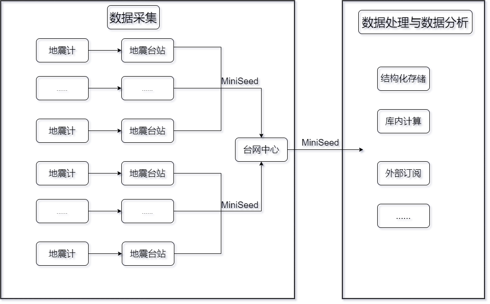
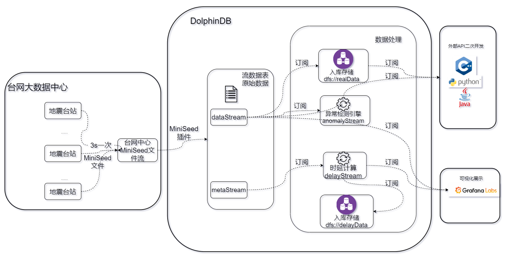
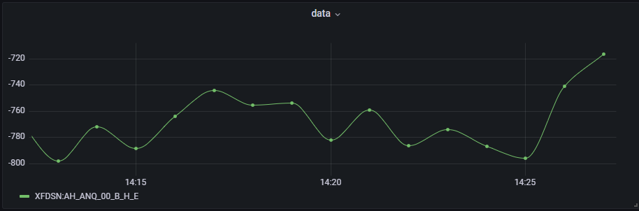
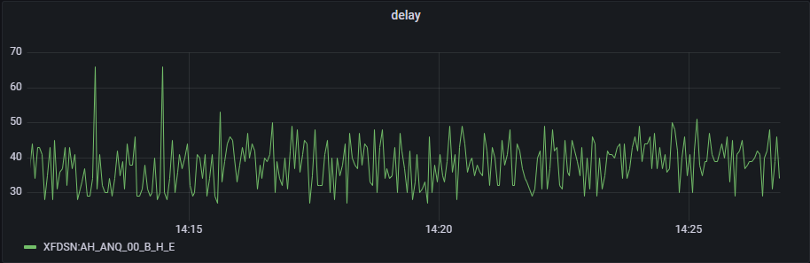

# 地震波形数据存储解决方案

- [1.1 行业背景](#11-行业背景)
- [1.2 业务挑战](#12-业务挑战)
- [3.1 DolphinDB 分区方案设计](#31-dolphindb-分区方案设计)
- [3.2 压缩算法设计](#32-压缩算法设计)
- [4.1 加载插件](#41-加载插件)
- [4.2 分布式数据库创建与流数据表持久化](#42-分布式数据库创建与流数据表持久化)
- [4.3 MiniSeed 实时流模拟](#43-miniseed-实时流模拟)
- [4.4 MiniSeed 历史数据模拟](#44-miniseed-历史数据模拟)
- [4.5 MiniSeed 历史数据解析入库](#45-miniseed-历史数据解析入库)
- [5.1 实时流数据解析](#51-实时流数据解析)
- [5.2 实时流数据存储、时延计算、异常告警](#52-实时流数据存储时延计算异常告警)
  - [**5.2.1 实时流数据存储**](#521-实时流数据存储)
  - [**5.2.2 时延计算**](#522-时延计算)
  - [**5.2.3 异常告警**](#523-异常告警)
- [5.3 历史数据查询与导出](#53-历史数据查询与导出)
- [5.4  可视化展示](#54--可视化展示)
- [7.1 参考文献](#71-参考文献)
- [7.2 脚本运行顺序说明](#72-脚本运行顺序说明)


# 1. 绪论

波形数据的存储与实时流处理是地震预警、地震速报、地震烈度速报、震源机制解等数字地震台网综合处理系统的前提，合理的存储方案与高效的实时流处理架构能极大地节约存储成本、降低响应延时、方便震源分析。本篇教程会为有该方面需求的客户提供一个基于 DolphinDB 的地震波形数据存储及实时流处理的解决方案，助力用户降低存储成本、提升效率。

## 1.1 行业背景 

国家地震台网、区域地震台网和流动地震台网等组成的中国数字地震观测网络系统每天不间断地产生地震波行数据。该数据的原始形态是方便数据处理的，但为了进行归档和交换，必须进行统一的数据格式化，现使用的国际通用交换格式为 SEED。国家测震台网数据备份中心实时接收存储的地震波形数据始于 2007 年 8 月，至今数据量大约有 100TB 左右。随着地震台站数量和强震数据的不断增多，可以预见今后的测震数据增速会越来越快。

现今大部分测震数据是以 SEED 文件格式或存储于盘阵内，或存储于光盘、移动硬盘等离线介质内，辅以数十张描述这些数据文件的关系型表，这些表遵从《中国数字测震台网数据规范》。有数据分析需求的研究人员通过网络等方式进行数据申请，数据服务方按照请求进行波形数据的截取和打包，并发送给研究员。 

传统模式下的地震波形数据存储较为分散，一次能处理的数据长度有限，分析应用的流程冗长，因此并不能有效支撑大规模的数据查询、分析、计算和可视化服务。

## 1.2 业务挑战

总体而言，地震波形数据的处理可以简化成数据采集、数据清洗和数据可视化展示三个部分。其中的数据采集一般通过部署在各地的地震计完成。地震计 7X24 小时不间断地记录和测量当地的地面运动数据，然后通过网络传输到台网中心，由数据处理部门以人工交互或自动化方式处理数据，监测全国和全球的地震活动情况。

<figure>
    
      <figcaption>图 1 地震波形数据流向</figcaption>
    </figure>

目前地震行业中数据采集相关工作比较完善，基本上也形成了统一的标准，但是在数据处理与数据分析模块中，还未形成统一的解决方案。随着国家对防震减灾的要求越来越高，用于数据采集的地震计数量将会呈数量级增长，并且随着物联网的发展，将会有更多数据接入用于地震监测。因此，原有在单台机器上运行的地震数据处理软件（如地震自动测定软件）的数据处理压力会越来越大。同时，海量数据的汇入，对数据存储、管理、回溯等都提出了新的要求。现如今，对地震数据的处理与分析面临以下几大难点：

- 文件存储：以 MiniSeed 文件形式单机存储，横向扩展性差，当数据量大时，扩展成为一个难题
- 离线分析：从服务器上下载 MiniSeed 文件，再通过专业的地震分析软件将其解析成结构化数据进行分析，过程繁琐，效率低下
- 实时处理与展示：目前无法实现实时计算、实时展示，特别是异常检测等时效性强的需求，无法满足

针对上述问题，目前业界的普遍做法是建立云架构数据中心，它基于分布式文件系统的海量存储能力和分布式计算能力，整合数据采集工具和 SQL 交互引擎、列式数据存储引擎，提供对海量数据的采集、存储、处理分析和应用展示等系列功能，但也存在以下几个问题：

- 存储成本：将 MiniSeed 文件解析成结构化数据存入数据库体积变大，造成硬件资源成本急剧增加
- 数据导入/导出功能：结构化数据存入数据库后，按需将数据打包成 MiniSeed 文件难度大，如一个台站所有通道一天的数据打包下载速度极慢，无法为业务人员提供数据支持
- 外部订阅功能：以接口形式获取数据速度极慢，无法为后续其他系统提供数据支撑

# 2. DolphinDB 解决方案

上述地震波形数据在存储与分析模块时面对的问题，可由 DolphinDB 在存储、流计算上支持的以下特性，以及通过这些特性的组合使用得以解决：

- 高效存储方式：数据分区列式存储。针对地震数据可采用时间 + id 的方式组合分区来达成灵活分区存储，对于不同分区数据可以多线程并行操作
- 高效压缩算法：支持 lz4、delta 压缩算法，大大提升压缩率，节约硬件资源
- 高效排序算法：sortColumn 对分区内数据排序存储，快速定位数据在分区中的位置
- 强大的流数据计算引擎：毫秒级别计算响应延时

同时 DolphinDB 良好的生态也为 MiniSeed 文件导入、导出以及二次开发提供了极大的便利：

- 插件支持：自研 MiniSeed 插件，支持 MiniSeed 文件的导入与导出功能，避免了调用第三方工具导入/导出文件的繁琐过程
- 丰富的机器学习支持：内置一系列常用的机器学习算法，例如最小二乘回归、随机森林、K-平均等，同时还提供了一些插件，方便地用 DolphinDB 的脚本语言调用第三方库进行机器学习，如 XGBoost 插件
- 丰富的 API 生态：支持 Python, Java, C++, Go 等 API，助力二次开发

以某台网中心为例：每个通道的采样频率为每 10 毫秒采集一条监测记录，包含时间戳、sid 和采样值三个字段，并以通道为单位、每 3s 将采集到的监测记录打包成 MiniSeed 文件发送到台网中心。有以下需求：

- 结构化分布式存储：MiniSeed 文件解析成结构化数据并入库存储
- 低资源投入：控制结构化数据入库存储的体积
- 实时计算和异常检测：采样数据实时计算、异常检测
- 低延迟快速响应：任意通道历史数据查询、事件关联查询
- 数据导入/导出：MiniSeed 文件快速导入、历史数据导出成 MiniSeed 文件
- 二次开发：能够通过接口获取数据

DolphinDB 解决方案架构图如下：

 

 

架构说明如下：

- MiniSeed 文件解析：DolphinDB 通过自研的 MiniSeed 插件可以将 MiniSeed 文件解析为结构化数据，解析结果包含两部分内容，一部分是采样信息，包含采样时间、采样值、MiniSeed 文件块 id；另一部分是 MiniSeed 文件块信息，包含文件块 id、采样时间、解析时间、解析数据总条数、MiniSeed 采样频率等。
- 实时流接入：流数据表是 DolphinDB 设计专门用于应对实时流数据存储与计算的内存表。具备吞吐量大，低延迟的优点，支持持久化，支持高可用。
- 流数据发布、订阅与消费：DolphinDB 流数据模块采用发布 - 订阅 - 消费的模式。流数据首先注入流数据表中，通过流数据表来发布数据，数据节点或者第三方的应用可以通过 DolphinDB 脚本或 API 来订阅及消费流数据。
- 分布式存储：DolphinDB 是一款高性能分布式时序数据库，采取了列式存储、数据分区、分布式文件系统、并行处理、多版本并发控制 (MVCC)、数据压缩等技术，在海量数据的查询、计算以及批量加载的性能上具有显著优势。
- 异常检测引擎：在实时数据流计算场景下，计算要求高效和即时，DolphinDB 精心研发了适合流计算场景的引擎，系统内部采用了增量计算，优化了实时计算的性能。对于异常检测引擎，使用者只需通过简单的参数配置即可实现复杂的规则设计、窗口检测。
- 可视化展示：DolphinDB 开发了 Grafana 数据源插件 dolphindb-datasource，让用户在 Grafana 面板 dashboard 上通过编写查询脚本、订阅流数据表的方式，与 DolphinDB 进行交互 (基于 WebSocket)，实现 DolphinDB 时序数据的可视化。

# 3. 存储方案设计

存储方案与数据的写入、查询、更新、删除常见操作密切相关，合理的存储方案能极大地提升效率，并且在一定程度上节约硬件资源。因此，在实施整个解决方案之前，需先设计合理的的存储方案。常见的地震数据表结构如表 1 所示：


<table class="tg">
<caption align="bottom">表 1：常见地震数据表结构</caption>
<thead>
  <tr>
    <th class="tg-0e7o">字段名称<br></th>
    <th class="tg-0e7o">数据类型<br></th>
    <th class="tg-0e7o">字段描述<br></th>
  </tr>
</thead>
<tbody>
  <tr>
    <td class="tg-9uk5"><span style="font-weight:normal">ts</span></td>
    <td class="tg-9uk5"><span style="font-weight:normal">TIMESTAMP</span></td>
    <td class="tg-9uk5"><span style="font-weight:normal">采样时间</span></td>
  </tr>
  <tr>
    <td class="tg-9uk5"><span style="font-weight:normal">data</span></td>
    <td class="tg-9uk5"><span style="font-weight:normal">INT</span></td>
    <td class="tg-9uk5"><span style="font-weight:normal">采样值</span></td>
  </tr>
  <tr>
    <td class="tg-9uk5"><span style="font-weight:normal">net</span></td>
    <td class="tg-9uk5"><span style="font-weight:normal">STRING</span></td>
    <td class="tg-9uk5"><span style="font-weight:normal">台网编号</span></td>
  </tr>
  <tr>
    <td class="tg-9uk5"><span style="font-weight:normal">sta</span></td>
    <td class="tg-9uk5"><span style="font-weight:normal">STRING</span></td>
    <td class="tg-9uk5"><span style="font-weight:normal">台站编号</span></td>
  </tr>
  <tr>
    <td class="tg-9uk5"><span style="font-weight:normal">loc</span></td>
    <td class="tg-9uk5"><span style="font-weight:normal">STRING</span></td>
    <td class="tg-9uk5"><span style="font-weight:normal">位置编号</span></td>
  </tr>
  <tr>
    <td class="tg-9uk5"><span style="font-weight:normal">chn</span></td>
    <td class="tg-9uk5"><span style="font-weight:normal">STRING</span></td>
    <td class="tg-9uk5"><span style="font-weight:normal">通道</span></td>
  </tr>
</tbody>
</table>

## 3.1 DolphinDB 分区方案设计

进行历史数据查询时，通常根据台网、台站、位置、通道等条件筛选数据，若要能够快速地查询出历史数据，那么在设计分布式数据库的分区方案时，经常使用查询条件所对应的字段就要被设计为分区列进行值分区，这样在查询时能够进行剪枝处理，精确命中所需的数据。

但由于地震数据查询场景中数据过滤条件过多，按照上述方式设计分区方案，会有多个分区列，导致分区数量过多，降低检索效率。因此，一张表存储所有字段的建表方式会降低查询效率。

考虑到在实际生产环境中，台网、台站、位置、通道等基本信息的取值是固定的并且取值范围较小，因此可以设计维度表存储这些基本信息，然后再建立一张分区表，存储时间、采样值等信息。这种表结构不仅能提升写入、查询、更新、删除等操作的性能，还能避免数据重复，节约磁盘资源。基于此，重新设计的分区表结构与维度表结构如表 2、表 3 所示。

<table class="tg">
<caption align="bottom">表 2 分区表结构</caption>
<thead>
  <tr>
    <th class="tg-0e7o">字段名称<br></th>
    <th class="tg-0e7o">DolphinDB 数据类型<br></th>
    <th class="tg-0e7o">字段描述<br></th>
    <th class="tg-hy65">是否为分区列<br></th>
    <th class="tg-hy65">是否为 sortColumn<br></th>
    <th class="tg-hy65">压缩算法<br></th>
  </tr>
</thead>
<tbody>
  <tr>
    <td class="tg-9uk5"><span style="font-weight:normal">id</span></td>
    <td class="tg-9uk5"><span style="font-weight:normal">INT</span></td>
    <td class="tg-9uk5"><span style="font-weight:normal">由台网、台站、位置、通道四个字段 1 对 1 映射而得，该字段就能表示台网、台站、位置、通道等信息</span></td>
    <td class="tg-ns82"><span style="font-weight:normal">是</span></td>
    <td class="tg-ns82"><span style="font-weight:normal">是</span></td>
    <td class="tg-ns82"><span style="font-weight:normal">delta</span></td>
  </tr>
  <tr>
    <td class="tg-9uk5"><span style="font-weight:normal">ts</span></td>
    <td class="tg-9uk5"><span style="font-weight:normal">TIMESTAMP</span></td>
    <td class="tg-9uk5"><span style="font-weight:normal">采样时间</span></td>
    <td class="tg-ns82"><span style="font-weight:normal">是</span></td>
    <td class="tg-ns82"><span style="font-weight:normal">是</span></td>
    <td class="tg-ns82"><span style="font-weight:normal">delta</span></td>
  </tr>
  <tr>
    <td class="tg-9uk5"><span style="font-weight:normal">data</span></td>
    <td class="tg-9uk5"><span style="font-weight:normal">INT</span></td>
    <td class="tg-9uk5"><span style="font-weight:normal">采样值</span></td>
    <td class="tg-ns82"><span style="font-weight:normal">否</span></td>
    <td class="tg-ns82"><span style="font-weight:normal">否</span></td>
    <td class="tg-ns82"><span style="font-weight:normal">delta</span></td>
  </tr>
</tbody>
</table>


<table class="tg">
<caption align="bottom">表 3 维度表结构</caption>
<thead>
  <tr>
    <th class="tg-0e7o">字段名称<br></th>
    <th class="tg-0e7o">DolphinDB 数据类型<br></th>
    <th class="tg-0e7o">字段描述<br></th>
  </tr>
</thead>
<tbody>
  <tr>
    <td class="tg-9uk5"><span style="font-weight:normal">id</span></td>
    <td class="tg-9uk5"><span style="font-weight:normal">INT</span></td>
    <td class="tg-9uk5"><span style="font-weight:normal">同表 2 中的 id</span></td>
  </tr>
  <tr>
    <td class="tg-9uk5"><span style="font-weight:normal">net</span></td>
    <td class="tg-9uk5"><span style="font-weight:normal">SYMBOL</span></td>
    <td class="tg-9uk5"><span style="font-weight:normal">台网编号</span></td>
  </tr>
  <tr>
    <td class="tg-9uk5"><span style="font-weight:normal">sta</span></td>
    <td class="tg-9uk5"><span style="font-weight:normal">SYMBOL</span></td>
    <td class="tg-9uk5"><span style="font-weight:normal">台站编号</span></td>
  </tr>
  <tr>
    <td class="tg-ns82"><span style="font-weight:normal">loc</span></td>
    <td class="tg-ns82"><span style="font-weight:normal">SYMBOL</span></td>
    <td class="tg-ns82"><span style="font-weight:normal">位置编号</span></td>
  </tr>
  <tr>
    <td class="tg-ns82"><span style="font-weight:normal">chn</span></td>
    <td class="tg-ns82"><span style="font-weight:normal">SYMBOL</span></td>
    <td class="tg-ns82"><span style="font-weight:normal">通道</span></td>
  </tr>
  <tr>
    <td class="tg-ns82"><span style="font-weight:normal">tagid</span></td>
    <td class="tg-ns82"><span style="font-weight:normal">SYMBOL</span></td>
    <td class="tg-ns82"><span style="font-weight:normal">mseed 文件块的 sid</span></td>
  </tr>
</tbody>
</table>


## 3.2 压缩算法设计

对数据进行压缩时，不仅要考虑压缩率，还要兼顾解压速度。DolphinDB 内置 lz4 和 delta 两种压缩算法，根据不同类型的数据采用合适的压缩算法能极大地提升压缩率，降低存储成本。

对于 SHORT, INT, LONG, DECIMAL, 时间或日期类型数据，采用 delta 算法压缩能提升压缩率的同时保证解压速度，其余类型的数据一般建议选择 lz4 算法。

根据上述规则，分区表中的三个列均采用 delta 算法。

# 4. 环境准备

本章主要展示如何使用 MiniSeed 插件模拟生成数据并解析入库，如果读者已经有数据，可酌情忽略第 4.3 和第 4.4 模拟数据章节。

## 4.1 加载插件

转到 MiniSeed 教程 [dolphindb/DolphinDBPlugin](https://gitee.com/dolphindb/DolphinDBPlugin/tree/release200.9/mseed)，在 bin 目录下，找到需要的插件版本并下载。通过以下方式加载插件：

```
 loadPlugin("./plugins/mseed/PluginMseed.txt");
```

MiniSeed 插件提供了 read、write、parse、parseStream 等接口，为 MiniSeed 文件的读、写、解析提供了强大的帮助，用户只需加载 MiniSeed 插件，就能快速地调用这些接口。

## 4.2 分布式数据库创建与流数据表持久化

根据 3.1 节，存储采样历史数据的数据库设计方案如下：

- 选择 TSDB 存储引擎，采用组合分区，一级分区按日期进行值分区，二级分区按设备 Id 进行值分区，每个分区存储一个 id 一天的历史数据
- 分区列为 ts 和 id，索引列为 id 和 ts。ts, id, value 列均采用 delta 压缩算法，每个分区内 sortKey 相同的数据全部保留

通过以下方式创建分布式数据库和分区表：

```
  //创建储实时数据的分布式数据库和分区表
if( existsDatabase("dfs://real") ){ dropDatabase("dfs://real") }
create database "dfs://real" partitioned by VALUE(2023.03.01..2023.03.10), VALUE(1..3900), engine='TSDB'
create table "dfs://real"."realData"(
	id INT[compress="delta"],
	ts TIMESTAMP[compress="delta"],
	value INT[compress="delta"]
)
partitioned by ts, id,
sortColumns=[`id, `ts],
keepDuplicates=ALL

  //创建存储时延计算结果的分布式数据库和分区表
if(existsDatabase("dfs://delay")){dropDatabase("dfs://delay")}
create database "dfs://delay" partitioned by VALUE(2023.03.01..2023.03.10), HASH([INT, 10]), engine='TSDB'	
create table "dfs://delay"."delayData"(
	id INT[compress="delta"],
	tagid SYMBOL,
	startTime TIMESTAMP[compress="delta"],
	receivedTime TIMESTAMP[compress="delta"],
	delay INT[compress="delta"]
)
partitioned by startTime, id,
sortColumns=[`id, `startTime],
keepDuplicates=ALL			

  //创建存储台网、台站、位置、通道等基础信息的维度表 
if(existsTable("dfs://real","tagInfo")){ dropTable(database("dfs://real"),"tagInfo") }
create table "dfs://real"."tagInfo"(
	id INT[compress="delta"],
	net SYMBOL,
	sta SYMBOL,
	loc SYMBOL,
	chn SYMBOL,
	tagid SYMBOL
)
sortColumns=[`id]

```

库表创建后，可以先行模拟台网、台站、位置、通道等基础信息的维度表数据，示例代码如下：

```
// 导入台网、台站、位置、通道等基础信息的维度表信息数据
net = ["ZJ","YN","XZ","XJ","TJ"]
sta = ["A0001","A0002","A0003","A0004","A0005","A0006","B0001","B0002","B0003","C0001"]
tmp = `EIE`EIN`EIZ
netList = stretch(net,150)
staList = take(stretch(sta,30),150)
locList = take(`40,150)
chn = take(tmp,150)
colt =   array(STRING)
for(i in 0..(chn.size()-1)){
	colt.append!( chn[i].split()[0] + "_" + chn[i].split()[1] + "_" +chn[i].split()[2] )
}
tagid = "XFDSN:"+netList+"_"+staList+"_"+locList+"_"+colt
t = table(1..150 as id,netList as net,staList as sta,locList as loc,chn,tagid)
pt = loadTable("dfs://real","tagInfo")
pt.append!(t)
```

流数据表用于接收实时流数据以及进行时延计算，定义四张流数据表，分别用于接收采样信息、MiniSeed 文件信息、时延计算结果以及异常告警信息：

- dataStream：接收采样数据，其结果有三个走向，分别是存入分布式数据库、接受外部 API 的订阅、实时展示
- metaStream：保存 MiniSeed 插件解析文件的元数据（如文件的数据行数、解析的时间、文件的时间等），对元数据进行时延计算后将结果注入到 delay 结果表中
- delayStream：时延计算结果表
- abnormalStream：异常告警信息结果表

上述流数据表创建及持久化方式如下：

```
  //删除流表及流数据引擎
unsubscribeTable(tableName = `dataStream,actionName = `append_data_into_dfs)
unsubscribeTable(tableName = `dataStream,actionName = `abnormalDetect)
unsubscribeTable(tableName = `metaStream,actionName = `calculate_delay)
unsubscribeTable(tableName = `delayStream,actionName = `append_delay_into_dfs)	
try{ dropStreamTable(`metaStream) }catch(ex){ print(ex) }
try{ dropStreamTable(`dataStream) }catch(ex){ print(ex) }
try{ dropStreamTable(`delayStream) }catch(ex){ print(ex) }
try{ dropStreamEngine(`engine) }catch(ex){ print(ex) }
try{ dropStreamTable(`abnormalStream) }catch(ex){ print(ex) }	

  //创建建立接收实时流数据的流数据表
st1 = streamTable(1000000:0,`id`tagid`startTime`receivedTime`actualCount`expectedCount`sampleRate,[INT,SYMBOL,TIMESTAMP,TIMESTAMP,INT,INT,DOUBLE])
st2 = streamTable(1000000:0,`id`ts`data,[INT,TIMESTAMP,INT])
st3 = streamTable(1000000:0,`id`tagid`startTime`receivedTime`delay,[INT,SYMBOL,TIMESTAMP,TIMESTAMP,INT])
st4 = streamTable(10000:0,`Time`id`anomalyType`anomalyString,[TIMESTAMP,STRING,INT,STRING])
enableTableShareAndPersistence(table=st1, tableName=`metaStream, asynWrite=true, compress=true, cacheSize=2000000, preCache = 100000)
enableTableShareAndPersistence(table=st2, tableName=`dataStream, asynWrite=true, compress=true, cacheSize=2000000000, preCache = 100000)
enableTableShareAndPersistence(table=st3, tableName=`delayStream, asynWrite=true, compress=true, cacheSize=2000000, preCache = 100000)
enableTableShareAndPersistence(table=st4, tableName=`abnormalStream, asynWrite=true, compress=true, cacheSize=2000000, preCache = 100000)
```

dataStream 表结构见表 2，metaStream、delayStream、abnormalStream 表结构分别见表 4、表 5、表 6。


<table class="tg">
<caption align="bottom">表 4 metaStream 表结构</caption>
<thead>
  <tr>
    <th class="tg-9xye">字段名称<br></th>
    <th class="tg-9xye">DolphinDB 数据类型<br></th>
    <th class="tg-9xye">含义<br></th>
  </tr>
</thead>
<tbody>
  <tr>
    <td class="tg-qdev"><span style="font-weight:normal">id</span></td>
    <td class="tg-qdev"><span style="font-weight:normal">INT</span></td>
    <td class="tg-qdev"><span style="font-weight:normal">同表 2 中的 id</span></td>
  </tr>
  <tr>
    <td class="tg-qdev"><span style="font-weight:normal">tagid</span></td>
    <td class="tg-qdev"><span style="font-weight:normal">SYMBOL</span></td>
    <td class="tg-qdev"><span style="font-weight:normal">同维度表中的 tagid</span></td>
  </tr>
  <tr>
    <td class="tg-qdev"><span style="font-weight:normal">startTime</span></td>
    <td class="tg-qdev"><span style="font-weight:normal">TIMESTAMP</span></td>
    <td class="tg-qdev"><span style="font-weight:normal">MiniSeed 文件块第一条数据采样时间</span></td>
  </tr>
  <tr>
    <td class="tg-viy4"><span style="font-weight:normal">receivedTime</span></td>
    <td class="tg-viy4"><span style="font-weight:normal">TIMESTAMP</span></td>
    <td class="tg-viy4"><span style="font-weight:normal">解析时间</span></td>
  </tr>
  <tr>
    <td class="tg-viy4"><span style="font-weight:normal">actualCount</span></td>
    <td class="tg-viy4"><span style="font-weight:normal">INT</span></td>
    <td class="tg-viy4"><span style="font-weight:normal">解析数据量</span></td>
  </tr>
  <tr>
    <td class="tg-viy4"><span style="font-weight:normal">expectedCount</span></td>
    <td class="tg-viy4"><span style="font-weight:normal">INT</span></td>
    <td class="tg-viy4"><span style="font-weight:normal">MiniSeed 包头指定的采样值个数</span></td>
  </tr>
  <tr>
    <td class="tg-viy4"><span style="font-weight:normal">sampleRate</span></td>
    <td class="tg-viy4"><span style="font-weight:normal">DOUBLE</span></td>
    <td class="tg-viy4"><span style="font-weight:normal">MiniSeed 采样频率</span></td>
  </tr>
</tbody>
</table>


<table class="tg">
<caption align="bottom">表 5 delayStream 表结构</caption>
<thead>
  <tr>
    <th class="tg-9xye">字段名称<br></th>
    <th class="tg-9xye">DolphinDB 数据类型<br></th>
    <th class="tg-9xye">含义<br></th>
  </tr>
</thead>
<tbody>
  <tr>
    <td class="tg-qdev"><span style="font-weight:normal">id</span></td>
    <td class="tg-qdev"><span style="font-weight:normal">INT</span></td>
    <td class="tg-qdev"><span style="font-weight:normal">同表 2 中的 id</span></td>
  </tr>
  <tr>
    <td class="tg-qdev"><span style="font-weight:normal">tagid</span></td>
    <td class="tg-qdev"><span style="font-weight:normal">SYMBOL</span></td>
    <td class="tg-qdev"><span style="font-weight:normal">同维度表中的 tagid</span></td>
  </tr>
  <tr>
    <td class="tg-qdev"><span style="font-weight:normal">startTime</span></td>
    <td class="tg-qdev"><span style="font-weight:normal">TIMESTAMP</span></td>
    <td class="tg-qdev"><span style="font-weight:normal">MiniSeed 文件块第一条数据采样时间</span></td>
  </tr>
  <tr>
    <td class="tg-viy4"><span style="font-weight:normal">receivedTime</span></td>
    <td class="tg-viy4"><span style="font-weight:normal">TIMESTAMP</span></td>
    <td class="tg-viy4"><span style="font-weight:normal">解析时间</span></td>
  </tr>
  <tr>
    <td class="tg-viy4"><span style="font-weight:normal">delay</span></td>
    <td class="tg-viy4"><span style="font-weight:normal">INT</span></td>
    <td class="tg-viy4"><span style="font-weight:normal">MiniSeed 文件块采样时间与解析时间差值</span></td>
  </tr>
</tbody>
</table>


<table class="tg">
<caption align="bottom">表 6 abnormalStream 表结构</caption>
<thead>
  <tr>
    <th class="tg-9xye">字段名称<br></th>
    <th class="tg-9xye">DolphinDB 数据类型<br></th>
    <th class="tg-9xye">含义<br></th>
  </tr>
</thead>
<tbody>
  <tr>
    <td class="tg-qdev"><span style="font-weight:normal">Time</span></td>
    <td class="tg-qdev"><span style="font-weight:normal">TIMESTAMP</span></td>
    <td class="tg-qdev"><span style="font-weight:normal">告警时间戳</span></td>
  </tr>
  <tr>
    <td class="tg-qdev"><span style="font-weight:normal">id</span></td>
    <td class="tg-qdev"><span style="font-weight:normal">INT</span></td>
    <td class="tg-qdev"><span style="font-weight:normal">同表 2 中的 id</span></td>
  </tr>
  <tr>
    <td class="tg-qdev"><span style="font-weight:normal">anomalyType</span></td>
    <td class="tg-qdev"><span style="font-weight:normal">INT</span></td>
    <td class="tg-qdev"><span style="font-weight:normal">异常的类型，即异常指标的表达式在 metrics 中的下标</span></td>
  </tr>
  <tr>
    <td class="tg-viy4"><span style="font-weight:normal">anomalyString</span></td>
    <td class="tg-viy4"><span style="font-weight:normal">STRING</span></td>
    <td class="tg-viy4"><span style="font-weight:normal">异常的内容</span></td>
  </tr>
</tbody>
</table>


## 4.3 MiniSeed 实时流模拟

调用 MiniSeed 插件的 `write` 函数向 MiniSeed 文件写入采样数据，模拟地震计源源不断地生成 MiniSeed 实时流过程。以下代码以 `submitJob` 提交任务的形式模拟通道“ZJ_A0001_40_E_I_E”一直往 Miniseed 文件写入实时流数据的场景。

```
def writeMseed(){
	/*
	 * Description：
	 * 	此函数用于模拟实际生产环境中，每3s向台网中心发送 MiniSeed 数据包的过程，即每隔3s向 aimPath 路径上的 MiniSeed 文件写数据
	 */
	sid = "XFDSN:ZJ_A0001_40_E_I_E"
	aimPath = "../streamMiniSeed/ZJ_A0001_40_E_I_E.20000101.mseed"
	sampleRate = 100
	cnt = 0
	do{
		startTime = now()
		mseed::write(aimPath, sid, startTime, sampleRate, rand(-3000..500,300))
		sleep(3000)
		cnt += 1
	}while(cnt < 40)	
}
	

mseedStreamJobid = submitJob("wrtieMseedStream","wrtieMseedStream",witeMseed) //提交后台任务
/*
 * 使用以下方式取消实时写入任务
 * cancelJob(mseedStreamJobid)
 */
```

## 4.4 MiniSeed 历史数据模拟

调用 MiniSeed 插件的 `write` 函数模拟历史数据。以下代码以 `submitJob` 的方式提交了模拟 2023.03.02 所有通道 1 天内波形数据的任务。

```
def writeMseed(filePath,sid,startTime,sampleRate,valueList){
	/*
	 * Description：
	 * 	此函数用于将一段连续的采样值写入到 MiniSeed 文件
	 * Input：
	 * 	filePath：STRING MiniSeed 文件存储路径
	 * 	sid：STRING 文件块id 
	 * 	startTime：TIMESTAMP 开始时间
	 * 	sampleRate：DOUBLE 采样频率
	 * 	valueList：INT VECTOR 采样值向量
	 */
	mseed::write(filePath, sid, startTime, sampleRate, take(valueList,8639999))
}

def parallelWrite(){
	/*
	 * Description：
	 * 	此函数用于多线程 写 MiniSeed 文件
	 */
	realDbName,dtName = "dfs://real","tagInfo"
	filePathList = exec "../miniSeed/"+net+"."+sta+"."+loc+"."+chn+"."+"20230302.mseed" from loadTable(realDbName,dtName)
	sidList = exec tagid from loadTable(realDbName,dtName)
	startTime = 2023.03.02T00:00:00.000
	sampleRate = 100
	ploop(writeMseed{,,startTime,sampleRate, rand(-3000..500,300)},filePathList,sidList)
}

submitJob("writeMseed","writeMseed",parallelWrite)
```

## 4.5 MiniSeed 历史数据解析入库

调用 `parseStream` 函数多线程解析 MiniSeed 文件，该接口返回一个包含三个键值对的字典 ret：ret[\`data]、 ret[\`size] 和 ret[\`metaData]，其中，ret[\`data]为采样数据，ret[\`metaData]为 MiniSeed 文件块信息。以下代码以 `submitJob` 的方式提交了解析所有通道 2023.03.02 1 天内波形数据的任务。

```
def parseAndImportIntoDfs(realDbName,realTbNname,dtName,tagInfo,fileParse){
	/*
	 * Description：
	 * 	此函数用于解析 miniSeed 文件，并将结构化数据存入分布式数据库
	 * Input：
	 * 	realDbName,realTbNname,dtNam：STRING 
	 * 	tagInfo：dict 键为台网、台站、位置通道拼接起的字符串，值为对应的 id
	 * 	fileParse：STRING 解析的miniSeed文件存储路径
	 */
	ret = mseed::parseStream(file(fileParse).readBytes(30000000))
	data = ret[`data]
	data.replaceColumn!(`id,tagInfo[data.id])
	delete from data where id = NULL
	pt = loadTable(realDbName,realTbNname)
	pt.append!(data)	 	
}

def parallelInToDfs(realDbName,realTbNname,dtName,tagInfo,filePathList){
	/*
	 * Description：
	 * 	此函数用于并行解析 MiniSeed 文件，并存入分布式数据库
	 * Input：
	 * 	realDbName,realTbNname,dtName：均为 STRING 类型常量，分别代表分布式数据库名、分区表名、维度表名
	 * 	tagInfo：dict 键为由台网、台站、位置、通道组成的字符串，值为对应的id
	 * 	filePathList：STRING VECTOR 需要解析的MiniSeed文件路径向量
	 */
	ploop(parseAndImportIntoDfs{realDbName,realTbNname,dtName,tagInfo,},filePathList)
}

realDbName,realTbNname,dtName = "dfs://real","realData","tagInfo"
filePathList = exec "../miniSeed/"+net+"."+sta+"."+loc+"."+chn+"."+"20230302.mseed" from loadTable(realDbName,dtName)
filePathListGroup = cut(filePathList,48)
d = exec tagid,id from loadTable(realDbName,dtName)
tagInfo=dict(d[`tagid],d[`id])
for(i in 0..(filePathListGroup.size()-1)){
	submitJobEx("parse_mseed_into_dfs"+string(i),"parse_mseed_into_dfs"+string(i),i%10,48,parallelInToDfs,realDbName,realTbNname,dtName,tagInfo,filePathListGroup[i])
}	
```

将历史数据解析入库并强制刷盘后，观察磁盘空间占用，其磁盘空间占用大小为 1.23GB，观察原始 MiniSeed 文件大小为 3.12GB，由此可见，MiniSeed 文件解压后存储为结构化数据的体积大大减少了。

# 5. 数据接入与查询

本章内容包括：

- 实时流数据解析
- 实时流数据存储、时延计算、异常告警
- 历史数据查询与导出

## 5.1 实时流数据解析

调用 MiniSeed 插件的 `parseStream` 函数解析 4.3 节模拟的 MiniSeed 实时流，结果注入 dataStream、metaStream。dataStream、metaStream 接收到的数据如表 7、表 8 所示


<table class="tg">
    <caption align="bottom">表 7 dataStream 表示例</caption>
<thead>
  <tr>
    <th class="tg-0e7o">id<br></th>
    <th class="tg-0e7o">ts<br></th>
    <th class="tg-0e7o">data<br></th>
  </tr>
</thead>
<tbody>
  <tr>
    <td class="tg-9uk5"><span style="font-weight:normal">1</span></td>
    <td class="tg-9uk5"><span style="font-weight:normal">2023.03.09T12:33:00.984</span></td>
    <td class="tg-9uk5"><span style="font-weight:normal">-539</span></td>
  </tr>
  <tr>
    <td class="tg-9uk5"><span style="font-weight:normal">1</span></td>
    <td class="tg-9uk5"><span style="font-weight:normal">2023.03.09T12:33:00.994</span></td>
    <td class="tg-9uk5"><span style="font-weight:normal">-1250</span></td>
  </tr>
  <tr>
    <td class="tg-9uk5"><span style="font-weight:normal">1</span></td>
    <td class="tg-9uk5"><span style="font-weight:normal">2023.03.09T12:33:01.004</span></td>
    <td class="tg-9uk5"><span style="font-weight:normal">761</span></td>
  </tr>
  <tr>
    <td class="tg-ns82"><span style="font-weight:normal">1</span></td>
    <td class="tg-ns82"><span style="font-weight:normal">2023.03.09T12:33:01.014</span></td>
    <td class="tg-ns82"><span style="font-weight:normal">1835</span></td>
  </tr>
  <tr>
    <td class="tg-ns82"><span style="font-weight:normal">1</span></td>
    <td class="tg-ns82"><span style="font-weight:normal">2023.03.09T12:33:01.024</span></td>
    <td class="tg-ns82"><span style="font-weight:normal">-2811</span></td>
  </tr>
  <tr>
    <td class="tg-ns82"><span style="font-weight:normal">……</span></td>
    <td class="tg-ns82"><span style="font-weight:normal">……</span></td>
    <td class="tg-ns82"><span style="font-weight:normal">……</span></td>
  </tr>
</tbody>
</table>


<table class="tg">
    <caption align="bottom">表 8 metaStream 示例</caption>
<thead>
  <tr>
    <th class="tg-0e7o">id<br></th>
    <th class="tg-0e7o">tagid<br></th>
    <th class="tg-0e7o">startTime<br></th>
    <th class="tg-hy65">receiveTime<br></th>
    <th class="tg-hy65">actualCount<br></th>
    <th class="tg-hy65">sampleRate<br></th>
  </tr>
</thead>
<tbody>
  <tr>
    <td class="tg-9uk5"><span style="font-weight:normal">1</span></td>
    <td class="tg-9uk5"><span style="font-weight:normal">XFDSN:AH_ANQ_00_B_H_E</span></td>
    <td class="tg-9uk5"><span style="font-weight:normal">2023.03.09T12:33:00.984</span></td>
    <td class="tg-ns82"><span style="font-weight:normal">2023.03.09T12:33:03.995</span></td>
    <td class="tg-ns82"><span style="font-weight:normal">300</span></td>
    <td class="tg-ns82"><span style="font-weight:normal">100.00</span></td>
  </tr>
  <tr>
    <td class="tg-9uk5"><span style="font-weight:normal">1</span></td>
    <td class="tg-9uk5"><span style="font-weight:normal">XFDSN:AH_ANQ_00_B_H_E</span></td>
    <td class="tg-9uk5"><span style="font-weight:normal">2023.03.09T12:33:03.985</span></td>
    <td class="tg-ns82"><span style="font-weight:normal">2023.03.09T12:33:06.998</span></td>
    <td class="tg-ns82"><span style="font-weight:normal">300</span></td>
    <td class="tg-ns82"><span style="font-weight:normal">100.00</span></td>
  </tr>
  <tr>
    <td class="tg-9uk5"><span style="font-weight:normal">1</span></td>
    <td class="tg-9uk5"><span style="font-weight:normal">XFDSN:AH_ANQ_00_B_H_E</span></td>
    <td class="tg-9uk5"><span style="font-weight:normal">2023.03.09T12:33:06.985</span></td>
    <td class="tg-ns82"><span style="font-weight:normal">2023.03.09T12:33:10.014</span></td>
    <td class="tg-ns82"><span style="font-weight:normal">300</span></td>
    <td class="tg-ns82"><span style="font-weight:normal">100.00</span></td>
  </tr>
  <tr>
    <td class="tg-ns82"><span style="font-weight:normal">1</span></td>
    <td class="tg-ns82"><span style="font-weight:normal">XFDSN:AH_ANQ_00_B_H_E</span></td>
    <td class="tg-ns82"><span style="font-weight:normal">2023.03.09T12:33:09.986</span></td>
    <td class="tg-ns82"><span style="font-weight:normal">2023.03.09T12:33:13.007</span></td>
    <td class="tg-ns82"><span style="font-weight:normal">300</span></td>
    <td class="tg-ns82"><span style="font-weight:normal">100.00</span></td>
  </tr>
  <tr>
    <td class="tg-ns82"><span style="font-weight:normal">1</span></td>
    <td class="tg-ns82"><span style="font-weight:normal">XFDSN:AH_ANQ_00_B_H_E</span></td>
    <td class="tg-ns82"><span style="font-weight:normal">2023.03.09T12:33:12.986</span></td>
    <td class="tg-ns82"><span style="font-weight:normal">2023.03.09T12:33:15.991</span></td>
    <td class="tg-ns82"><span style="font-weight:normal">300</span></td>
    <td class="tg-ns82"><span style="font-weight:normal">100.00</span></td>
  </tr>
  <tr>
    <td class="tg-ns82"><span style="font-weight:normal">……</span></td>
    <td class="tg-ns82"><span style="font-weight:normal">……</span></td>
    <td class="tg-ns82"><span style="font-weight:normal">……</span></td>
    <td class="tg-ns82"><span style="font-weight:normal">……</span></td>
    <td class="tg-ns82"><span style="font-weight:normal">……</span></td>
    <td class="tg-ns82"><span style="font-weight:normal">……</span></td>
  </tr>
</tbody>
</table>


以下代码以 `submitJob` 的方式提交了解析波形实时流数据的任务，`streamSimulate` 函数代码见[附录 7.2](#72-脚本运行顺序说明)：

```
def streamSimulate(meta,data,tagInfo){
	/*
	 * Description：
	 * 	此函数用于接收 MiniSeed 实时流文件，并将其解析为结构化数据，存入流数据表中   
	 * Input：
	 * 	meta：stream TABLE   存放 meta 数据的流表   
	 * 	data：stream TABLE  存放采样数据的流表  
	 * 	tagInfo：dict   tagid 和 id 映射的字典     
	 */
	ret = mseed::parseStream(file("../streamMiniSeed/ZJ_A0001_40_E_I_E.20000101.mseed").readBytes(30000000))
	data_num_row = ret[`data].size()
	meta_num_row = ret[`metaData].size()
	do{
		ret = mseed::parseStream(file("../streamMiniSeed/ZJ_A0001_40_E_I_E.20000101.mseed").readBytes(30000000))
		if(ret[`data].size() > data_num_row){
			now_data_num_row = ret[`data].size()
			now_meta_num_row = ret[`metaData].size()
			qdata = ret[`data][data_num_row:now_data_num_row]
			qmeta= ret[`metaData][meta_num_row:now_meta_num_row]
			data_num_row = now_data_num_row
			meta_num_row = now_meta_num_row
			tmp = tagInfo[qmeta.id]
			qdata.replaceColumn!(`id,tagInfo[qdata.id])
			qmeta = select tmp as ids ,* from qmeta
			delete from qdata where id = NULL
			delete from qmeta where ids = NULL
			objByName(data).append!(qdata)
			objByName(meta).append!(qmeta)
		}
	}while(true)
}

meta,data= "metaStream","dataStream"
d = exec tagid,id from loadTable("dfs://real","tagInfo")
tagInfo=dict(d[`tagid],d[`id])
submitJob("streamSimulate","streamSimulate",streamSimulate,meta,data,tagInfo)
```

## 5.2 实时流数据存储、时延计算、异常告警

### **5.2.1 实时流数据存储**

通过流数据表的发布 - 订阅功能可实现对流数据的处理。对于采样数据，通过内置函数 `subscribeTable` 订阅 dataStream，实现入库存储。`subscribeTable` 函数调用方式如下：

```
subscribeTable([server],tableName,[actionName],[offset=-1],handler,[msgAsTable=false],[batchSize=0],
[throttle=1],[hash=-1],[reconnect=false],[filter],[persistOffset=false],[timeTrigger=false],
[handlerNeedMsgId=false],[raftGroup],[userId=””],[password=””])
```

### **5.2.2 时延计算**

对于时延计算，首先，定义时延计算函数 `calDelay`

```
def calDelay(msg){
	/*
	 * msg：数据流
	 * delayTableName：时延结果流数据表
	 */
	t = select first(id) as id,first(tagid) as tagid,last(startTime) as startTime,receivedTime,last((receivedTime+8*60*60*1000+3000)-(startTime+(actualCount-1)*10)) as delay from msg group by receivedTime
	objByName(`delayStream).append!(t) 	
}
```

其计算规则如下：

```
receivedTime-(startTime+(actualCount)*10)
```

举例说明：receivedTime 为"2023.03.09T12:33:03.995"，startTime 为"2023.03.09T12:33:00.984"，actualCount 为 300，则该 MiniSeed 文件块的时延为 2023.03.09T12:33:03.995-(2023.03.09T12:33:00.984+300*10) = 11ms。

然后，再通过 `subscribeTable` 函数订阅 metaStream，将计算结果注入 delayStream，实现时延计算。时延计算结果示例如表 9 所示：


<table class="tg">
    <caption align="bottom">表 9 delayStream 示例</caption>
<thead>
  <tr>
    <th class="tg-0e7o">id<br></th>
    <th class="tg-0e7o">tagid<br></th>
    <th class="tg-0e7o">startTime<br></th>
    <th class="tg-hy65">receiveTime<br></th>
    <th class="tg-hy65">delay<br></th>
  </tr>
</thead>
<tbody>
  <tr>
    <td class="tg-9uk5"><span style="font-weight:normal">1</span></td>
    <td class="tg-9uk5"><span style="font-weight:normal">XFDSN:AH_ANQ_00_B_H_E</span></td>
    <td class="tg-9uk5"><span style="font-weight:normal">2023.03.09T12:33:00.984</span></td>
    <td class="tg-ns82"><span style="font-weight:normal">2023.03.09T12:33:03.995</span></td>
    <td class="tg-ns82"><span style="font-weight:normal">11</span></td>
  </tr>
  <tr>
    <td class="tg-9uk5"><span style="font-weight:normal">1</span></td>
    <td class="tg-9uk5"><span style="font-weight:normal">XFDSN:AH_ANQ_00_B_H_E</span></td>
    <td class="tg-9uk5"><span style="font-weight:normal">2023.03.09T12:33:03.985</span></td>
    <td class="tg-ns82"><span style="font-weight:normal">2023.03.09T12:33:06.998</span></td>
    <td class="tg-ns82"><span style="font-weight:normal">13</span></td>
  </tr>
  <tr>
    <td class="tg-9uk5"><span style="font-weight:normal">1</span></td>
    <td class="tg-9uk5"><span style="font-weight:normal">XFDSN:AH_ANQ_00_B_H_E</span></td>
    <td class="tg-9uk5"><span style="font-weight:normal">2023.03.09T12:33:06.985</span></td>
    <td class="tg-ns82"><span style="font-weight:normal">2023.03.09T12:33:10.014</span></td>
    <td class="tg-ns82"><span style="font-weight:normal">29</span></td>
  </tr>
  <tr>
    <td class="tg-ns82"><span style="font-weight:normal">1</span></td>
    <td class="tg-ns82"><span style="font-weight:normal">XFDSN:AH_ANQ_00_B_H_E</span></td>
    <td class="tg-ns82"><span style="font-weight:normal">2023.03.09T12:33:09.986</span></td>
    <td class="tg-ns82"><span style="font-weight:normal">2023.03.09T12:33:13.007</span></td>
    <td class="tg-ns82"><span style="font-weight:normal">22</span></td>
  </tr>
  <tr>
    <td class="tg-ns82"><span style="font-weight:normal">1</span></td>
    <td class="tg-ns82"><span style="font-weight:normal">XFDSN:AH_ANQ_00_B_H_E</span></td>
    <td class="tg-ns82"><span style="font-weight:normal">2023.03.09T12:33:12.986</span></td>
    <td class="tg-ns82"><span style="font-weight:normal">2023.03.09T12:33:15.991</span></td>
    <td class="tg-ns82"><span style="font-weight:normal">5</span></td>
  </tr>
  <tr>
    <td class="tg-ns82"><span style="font-weight:normal">……</span></td>
    <td class="tg-ns82"><span style="font-weight:normal">……</span></td>
    <td class="tg-ns82"><span style="font-weight:normal">……</span></td>
    <td class="tg-ns82"><span style="font-weight:normal">……</span></td>
    <td class="tg-ns82"><span style="font-weight:normal">……</span></td>
  </tr>
</tbody>
</table>


### **5.2.3 异常告警**

DolphinDB 内置异常告警引擎 `createAnomalyDetectionEngine`，其调用方式如下：

```
createAnomalyDetectionEngine(name,metrics,dummyTable,outputTable,timeColumn,[keyColumn],[windowSize], 
[step],[garbageSize],[roundTime=true],[snapshotDir],[snapshotIntervalInMsgCount],[raftGroup])
```

对于异常告警，首先根据 `createAnomalyDetectionEngine` 函数定义异常告警引擎 engine，其告警规则为：

```
[max(data)>= 300,min(data)<=-2500]
```

即，3 秒长度的时间窗口内，若采样数据最大值大于 300 或采样数据最小值小于 -2500，则告警。

然后通过 `subscribeTable` 函数订阅 dataStream，将告警结果注入 abnormalStream，实现异常告警。异常告警结果示例如表 10 所示：


<table class="tg">
    <caption align="bottom">表 10 abnormalStream 示例</caption>
<thead>
  <tr>
    <th class="tg-0e7o">Time<br></th>
    <th class="tg-0e7o">id<br></th>
    <th class="tg-0e7o">anomalyType<br></th>
    <th class="tg-hy65">anomalyString<br></th>
  </tr>
</thead>
<tbody>
  <tr>
    <td class="tg-9uk5"><span style="font-weight:normal">2023.03.31T10:01:33.000</span></td>
    <td class="tg-9uk5"><span style="font-weight:normal">1</span></td>
    <td class="tg-9uk5"><span style="font-weight:normal">0</span></td>
    <td class="tg-ns82"><span style="font-weight:normal">max(data) &gt;= 300</span></td>
  </tr>
  <tr>
    <td class="tg-9uk5"><span style="font-weight:normal">2023.03.31T10:01:51.000</span></td>
    <td class="tg-9uk5"><span style="font-weight:normal">1</span></td>
    <td class="tg-9uk5"><span style="font-weight:normal">0</span></td>
    <td class="tg-ns82"><span style="font-weight:normal">max(data) &gt;= 300</span></td>
  </tr>
  <tr>
    <td class="tg-9uk5"><span style="font-weight:normal">2023.03.31T10:01:51.000</span></td>
    <td class="tg-9uk5"><span style="font-weight:normal">1</span></td>
    <td class="tg-9uk5"><span style="font-weight:normal">1</span></td>
    <td class="tg-ns82"><span style="font-weight:normal">min(data) &lt;= -2500</span></td>
  </tr>
  <tr>
    <td class="tg-ns82"><span style="font-weight:normal">……</span></td>
    <td class="tg-ns82"><span style="font-weight:normal">……</span></td>
    <td class="tg-ns82"><span style="font-weight:normal">……</span></td>
    <td class="tg-ns82"><span style="font-weight:normal">……</span></td>
  </tr>
</tbody>
</table>

在 abnormalStream 中，若同一个 id 在同一个时间戳内出现了两条数据，则说明，在 3s 内，同时出现了波形数据的最大值大于 300、最小值小于 -2500 的现象。

实时流数据存储、时延计算、异常告警代码如下所示：

```
//实时流数据入库存储
subscribeTable(tableName=`dataStream, actionName="append_data_into_dfs", offset=0, handler=loadTable("dfs://real","realData"), msgAsTable=true,batchSize=100000, throttle=1, reconnect=true)
//时延计算
subscribeTable(tableName=`metaStream, actionName="calculate_delay", offset=0, handler=calDelay, msgAsTable=true,batchSize=100000, throttle=1, reconnect=true)
//时延计算结果入库存储
subscribeTable(tableName=`delayStream , actionName="append_delay_into_dfs", offset=0, handler=loadTable("dfs://delay","delayData"), msgAsTable=true,batchSize=100000, throttle=1, reconnect=true)
//建立异常告警引擎，设置告警规则
engine = createAnomalyDetectionEngine(name="engine", metrics=<[max(data)>= 300,min(data)<=-2500]>, dummyTable=objByName(`dataStream), outputTable=objByName(`abnormalStream), timeColumn=`ts, keyColumn=`id, windowSize =3000 , step = 3000)
//订阅实时流数据，进行异常告警
subscribeTable(tableName="dataStream", actionName="abnormalDetect", offset=0, handler=append!{engine}, msgAsTable=true)	
```

## 5.3 历史数据查询与导出

历史数据查询与导出测试 case 如下：

- case1：某个台网、某个台站一天所有通道的历史观测数据降采样查询，精确到分钟
- case2：某个事件发生时刻前 2 分钟、后 11 分钟历史观测数据查询，关联台站为 20-30 个
- case3：某个台网、某个台站一天内所有通道数据导出为 MiniSeed 文件
- case4：Java API 查询，某个台网、某个台站一天所有通道的历史观测数据

性能测试结果如表 11 所示：


<table class="tg">
    <caption align="bottom">表 11 查询与导出性能测试结果</caption>
<thead>
  <tr>
    <th class="tg-0e7o">场景<br></th>
    <th class="tg-0e7o">执行 10 次耗时 (毫秒)<br></th>
    <th class="tg-0e7o">平均耗时 (毫秒）<br></th>
    <th class="tg-hy65">结果集数据量 (条)<br></th>
    <th class="tg-hy65">结果集大小<br></th>
  </tr>
</thead>
<tbody>
  <tr>
    <td class="tg-9uk5"><span style="font-weight:normal">case1</span></td>
    <td class="tg-9uk5"><span style="font-weight:normal">7,574</span></td>
    <td class="tg-9uk5"><span style="font-weight:normal">757</span></td>
    <td class="tg-ns82"><span style="font-weight:normal">4,320</span></td>
    <td class="tg-ns82"><span style="font-weight:normal">118KB</span></td>
  </tr>
  <tr>
    <td class="tg-9uk5"><span style="font-weight:normal">case2</span></td>
    <td class="tg-9uk5"><span style="font-weight:normal">2,145</span></td>
    <td class="tg-9uk5"><span style="font-weight:normal">214</span></td>
    <td class="tg-ns82"><span style="font-weight:normal">14,040</span></td>
    <td class="tg-ns82"><span style="font-weight:normal">384KB</span></td>
  </tr>
  <tr>
    <td class="tg-9uk5"><span style="font-weight:normal">case3</span></td>
    <td class="tg-9uk5"><span style="font-weight:normal">19,237</span></td>
    <td class="tg-9uk5"><span style="font-weight:normal">1,923</span></td>
    <td class="tg-ns82"><span style="font-weight:normal">25,920,000</span></td>
    <td class="tg-ns82"><span style="font-weight:normal">692MB</span></td>
  </tr>
  <tr>
    <td class="tg-ns82"><span style="font-weight:normal">case4</span></td>
    <td class="tg-ns82"><span style="font-weight:normal">35,271</span></td>
    <td class="tg-ns82"><span style="font-weight:normal">3,527</span></td>
    <td class="tg-ns82"><span style="font-weight:normal">25,920,000</span></td>
    <td class="tg-ns82"><span style="font-weight:normal">692MB</span></td>
  </tr>
</tbody>
</table>

查询 case1-3 代码如下所示：

```

netAim,staAim,locAim = `ZJ,`A0003, `40  //查询case的查询条件
// case1
timer(10){
	aim  = exec id from loadTable("dfs://real","tagInfo") where net = netAim and  sta = staAim and loc = locAim
	t = select avg(value)  as sample_value from loadTable("dfs://real","realData") where ts >= 2023.03.02T00:00:00.000 and ts < 2023.03.03T00:00:00.000 and id in  aim   group by bar(ts,60000),id
}

// case2
timer(10){
	aim = exec id from loadTable("dfs://real","tagInfo") where net = netAim
	t = select *  from loadTable("dfs://real","realData") where ts >= 2023.03.02T00:08:00.000 and ts <= 2023.03.02T00:21:00.000 and id in aim		 	
}

// case3
timer {
	aim = exec id from loadTable("dfs://real","tagInfo") where net = netAim and sta = staAim
	t = select * from loadTable("dfs://real","realData") where ts >= 2023.03.02T00:00:00.000 and ts < 2023.03.03T00:00:00.000 and id in aim
	t = select ts,loc,net,sta,chn,value,tagid from ej(loadTable("dfs://real","tagInfo"),t,`id) // 导出的结果集数据
	
	sidList = exec distinct tagid from t // 涉及的所有sid
	startTimeTable = select min(ts) as startTime from t group by tagid order by tagid desc  // 文件开始采样时间
	dataList = [] // 涉及的所有采样值
	for(i in 0..(sidList.size()-1)){
		tmpValue = exec value from t where tagid = sidList[i]
		dataList.append!(tmpValue)
	}
	
	aimFilePath= "<YOURDIR>/"+sidList+'.20230302.mseed' // 目标文件
	sampleRate = 100.00 // 采样频率，表示1秒钟有100个采集点，即10ms采集一次
	ploop(mseed::write{,,,sampleRate,},aimFilePath,sidListid,startTimeTable[`startTime],dataList) // 使用mseed::write函数写入文件，使用ploop并行加速
}
```

## 5.4  可视化展示

结构化实时流数据可视化展示通过 grafana 实现。在 grafana 中，可通过编写简单的查询语句，便能获取需要展示的数据。grafana 中执行以下查询语句对采样数据实时流进行可视化展示：

```
//波形实时流数据可视化展示
real_db_name,dt_name = "dfs://real","tagInfo"
t = select avg(data)  as value from dataStream group by bar(ts,6000) as ts, id
select t.value from t left join loadTable(realDbName,dtName) rt on t.id = rt.id  pivot by t.ts,rt.tagid
```

<figure>
    
      <figcaption>图 3 波形数据</figcaption>
    </figure>

执行以下查询语句对时延数据进行可视化展示：

```
//时延流数据可视化展示
select delay from delayStream pivot by startTime,tagid
```

<figure>
    
      <figcaption>图 4 时延数据</figcaption>
    </figure>


# 6 总结

DolphinDB 在地震行业的运用远远不止波形数据的存储与查询。正如前文所说，DolphinDB 具有非常完善的产品生态，在强大的生态支持下，DolphinDB 能够支持更加复杂的波形数据过滤与深度学习预警，限于篇幅，本文不作过多介绍。感兴趣的用户可查阅[浙江智臾科技有限公司/Tutorials_CN](https://gitee.com/dolphindb/Tutorials_CN) 作更加深入细致的了解。

# 7 附录

## 7.1 参考文献

- 《大数据架构下的地震波形数据分析应用浅析》
- 《数字地震台网综合处理系统通用架构研究与设计》
- 《地震台网智慧服务平台的开发与应用》
- DolphinDB 流数据教程 [streaming_tutorial.md · 浙江智臾科技有限公司/Tutorials_CN - Gitee](https://gitee.com/dolphindb/Tutorials_CN/blob/master/streaming_tutorial.md) 
- DolphinDB 分布式存储教程 [database.md · dolphindb/Tutorials_CN - Gitee](https://gitee.com/dolphindb/Tutorials_CN/blob/master/database.md#2-dolphindb分区和基于mpp架构的数据存储的区别) 
- DolphinDB-datasource 插件教程 [README.zh.md · dolphindb/grafana-datasource - Gitee](https://gitee.com/dolphindb/grafana-datasource/blob/master/README.zh.md) 

## 7.2 脚本运行顺序说明

用户可按照行文顺序运行文章中所列出的脚本复现解决方案，此外为方便用户复现，本节对文章中所涉及的脚本整理成文件，用户只需下载并执行附件压缩包中 1~8 的 txt 文件，然后按照如下所示脚本调用文件中的函数即可复现本文的解决方案：

```
login(`admin,`123456)
undef(all);
clearAllCache();
go;

/***
 * ==============================
 * 在运行此脚本此之前，需要做以下事情：
 * 	1.建立与server同级的目录  miniSeed
 * 	2.建立与server同级的目录  streamMiniSeed
 * 	3.建立与server同级的目录  outputMiniSeed
 * 	4.在./server/plugins/目录下建立mseed目录，并将libPluginMseed.so文件和PluginMseed.txt文件放置在改目录下
 * 	5. 运行脚本1-8
 * ==============================
 */


netAim,staAim,locAim = `ZJ,`A0003, `40  //查询case的查询条件


  //step1：加载插件、创建分布式库表、流数据表持久化
mainPrepare()

  //step2：MiniSeed实时流数据模拟与解析
mainStreamSimulate()

  //step3：实时流入库、时延计算及异常告警
mainBuidSubscribe()

  //step4：MiniSeed历史数据模拟( 耗时1min左右，该步骤后台作业完成后再执行step5)
mainHistoryMiniSeedSimulate()


  //step5：MiniSeed历史数据入库( 耗时5min左右，该步骤后台作业完成后再执行step6和step7)
mainHistoryMiniSeedParse()


  //step6：磁盘空间占用统计(单位：GB)
mainDiskUsage()

  //step7：查询case1-case4
queryRecord =  mainQueryTest(netAim,staAim,locAim)

  //step8：查询case5
outputRecord = mainOutputMiniSeed(netAim,staAim)

```

测试脚本压缩包：[test_scripts.zip](script/Seismic_waveform_data_storage/test_scripts.zip) 