# DolphinDB SQL 标准化

为了提升用户体验，降低用户学习成本和脚本迁移复杂度，自 1.30.17 / 2.00.5 版本开始，DolphinDB 逐步支持了标准化 SQL 的书写方法；并于 1.30.22 / 2.00.10 版本起，对标准 SQL 的常用语法和关键字实现了兼容。

- [1 与标准 SQL 的兼容性](#1-与标准-sql-的兼容性)
  - [1.1 常用的 ANSI SQL-92 关键字支持表](#11-常用的-ansi-sql-92-关键字支持表)
  - [1.2 SQL 类型及相关类型转换函数的支持表](#12-sql-类型及相关类型转换函数的支持表)
  - [1.3 非 SQL-92 标准的常用关键字支持表](#13-非-sql-92-标准的常用关键字支持表)
- [2 数据准备](#2-数据准备)
  - [2.1 数据集说明](#21-数据集说明)
  - [2.2 建库建表](#22-建库建表)
  - [2.3 修改表字段](#23-修改表字段)
  - [2.4 删除库表](#24-删除库表)
- [3 SQL 关键字](#3-sql-关键字)
  - [3.1 谓词](#31-谓词)
  - [3.2 distinct](#32-distinct)
  - [3.3 any / all](#33-any--all)
  - [3.4 order by 支持 nulls first / last](#34-order-by-支持-nulls-first--last)
  - [3.5 支持 with 语句](#35-支持-with-语句)
  - [3.6 集合运算](#36-集合运算)
- [4 join 增强](#4-join-增强)
  - [4.1 标准 SQL 的各种类型的关联、笛卡尔积](#41-标准-sql-的各种类型的关联笛卡尔积)
  - [4.2 表类型拓展](#42-表类型拓展)
  - [4.3 多表级联 join](#43-多表级联-join)
  - [4.4 on 条件拓展](#44-on-条件拓展)
- [5 SQL 方言(dialect)兼容](#5-sql-方言dialect兼容)
  - [5.1 脚本使用 SQL 方言](#51-脚本使用-sql-方言)
  - [5.2 API 使用 SQL 方言](#52-api-使用-sql-方言)
- [6 总结](#6-总结)


## 1 与标准 SQL 的兼容性

在脚本层面，自 1.30.22 / 2.00.10 版本起，DolphinDB SQL 开始支持：

- 关键字全大写或全小写的书写方式
- 脚本的换行不影响语法解析，但存在两种特殊情况：
  - 组合关键字不允许拆分，如 order by, group by, context by, pivot by, union all, inner join, nulls first 等。
  - 不使用 as 指定字段别名时，别名与原字段之间不能换行。

> 注意： SQL 语句中的数据库或数据表名称是大小写敏感的。

本章三个小节分别以列表形式说明 DolphinDB 对标准 SQL 语法的支持：

包含：

- 对 SQL-92 常用关键字的支持性
- 对 SQL 类型及类型转换函数的支持性
- 非 SQL-92 标准的常用关键字支持表

### 1.1 常用的 ANSI SQL-92 关键字支持表

下表共统计了 92 项常用的 ANSI SQL-92 关键字，支持 60 项。其中，在不支持的 30 项中：5 项部分兼容，7项与约束相关（在分析项目中没有太大的使用价值），10 项有替代方案。

> √：表示兼容  ×：不兼容  ○：部分兼容
>
> “说明” 字段会给出对应函数或可替代的方案

| **keyword（按 A-Z 排列）** | **兼容性** | **说明**                                                     |
| -------------------------- | ---------- | ------------------------------------------------------------ |
| CHECK                      | ×          | 不支持约束                                                   |
| CONSTRAINT                 | ×          | 不支持约束                                                   |
| CONTAINS                   | ×          | 用 LIKE 替代                                                 |
| DEFAULT                    | ×          | 不支持默认值                                                 |
| ESCAPE                     | ×          | 暂不支持 ESCAPE 定义转义符                                   |
| EXCEPT                     | ×          | 暂不支持 EXCEPT，用 WHERE 替代过滤                           |
| EXEC                       | ×          | 存在同名关键字，但是作用不同                                 |
| EXTRACT                    | ×          | 通过内置日期函数截取日期/时间的某个部分                      |
| FOREIGN                    | ×          | 不支持外键                                                   |
| GLOBAL                     | ×          | 不支持定义 GLOBAL TEMPORARY TABLE                            |
| IDENTITY                   | ×          | 需要自定义标识列，或者用 `rowNo` 替代                        |
| INTERSECT                  | ×          | 暂不支持取交集，用 WHERE 过滤                                |
| LAST                       | ×          | `<fetch orientation>` 的关键字之一，表示取最后几行记录。目前 DolphinDB 仅支持在 CONTEXT BY LIMIT 中指定取最后几行记录。<br>注：内部存在同名关键字 LAST 用于排序时指定空值位置，用法 NULLS LAST。 |
| NATURAL                    | ×          | 不支持 NATURAL JOIN，用 INNER JOIN 替代                      |
| OUTER                      | ×          | 直接用 LEFT JOIN, RIGHT JOIN, FULL JOIN 替代                 |
| OVERLAPS                   | ×          | 用 EXITS 替代                                                |
| POSITION                   | ×          | 用 `strpos` 替代                                             |
| PRIMARY                    | ×          | 不支持主键                                                   |
| REFERENCES                 | ×          | 不支持外键                                                   |
| RESTRICT                   | ×          | 不支持约束删除                                               |
| SOME                       | ×          | 用 ANY 替代                                                  |
| SPACE                      | ×          |                                                              |
| TRANSLATE                  | ×          | 用 `strReplace` 或 `regexReplace` 替代                       |
| UNIQUE                     | ×          | 不支持唯一约束                                               |
| VIEW                       | ×          | 不支持视图                                                   |
| ADD                        | √          | ALTER..ADD..                                                 |
| ALL                        | √          |                                                              |
| ALTER                      | √          |                                                              |
| AND                        | √          |                                                              |
| ANY                        | √          |                                                              |
| AS                         | √          |                                                              |
| ASC                        | √          |                                                              |
| BETWEEN                    | √          |                                                              |
| BY                         | √          |                                                              |
| CASE                       | √          |                                                              |
| CAST / CONVERT             | √          | 对应 `cast` 函数                                             |
| COALESCE                   | √          |                                                              |
| COLUMN                     | √          |                                                              |
| COUNT                      | √          |                                                              |
| CREATE                     | √          |                                                              |
| CROSS                      | √          | CROSS JOIN                                                   |
| DELETE                     | √          |                                                              |
| DESC                       | √          |                                                              |
| DISTINCT                   | √          |                                                              |
| DROP                       | √          |                                                              |
| ELSE                       | √          | CASE WHEN..THEN..ELSE END                                    |
| END                        | √          | CASE WHEN..THEN..ELSE END                                    |
| EXISTS                     | √          |                                                              |
| FALSE                      | √          | false                                                        |
| FROM                       | √          |                                                              |
| FULL                       | √          | FULL JOIN                                                    |
| GROUP                      | √          |                                                              |
| HAVING                     | √          |                                                              |
| IF                         | √          | IF                                                           |
| IN                         | √          |                                                              |
| INNER                      | √          | INNER JOIN                                                   |
| INSERT                     | √          |                                                              |
| IS                         | √          | IS NULL                                                      |
| JOIN                       | √          |                                                              |
| LEFT                       | √          | LEFT JOIN,  字符串函数 `left`                                |
| LIKE                       | √          |                                                              |
| LOWER                      | √          | 对应 `lower` 函数                                            |
| MAX / MIN                  | √          | 对应 `max`，`min` 函数                                       |
| NOT                        | √          |                                                              |
| NULL                       | √          |                                                              |
| NULLIF                     | √          | 对应 `nullIf` 函数                                           |
| ON                         | √          | JOIN .. ON                                                   |
| OR                         | √          |                                                              |
| ORDER                      | √          |                                                              |
| REPEAT                     | √          | 对应 `repeat` 函数                                           |
| RIGHT                      | √          | 字符串 `right` 函数                                          |
| SELECT                     | √          |                                                              |
| SET                        | √          |                                                              |
| SUBSTRING                  | √          | 对应 `substr` 函数                                           |
| SUM                        | √          | 对应 `sum` 函数                                              |
| TABLE                      | √          |                                                              |
| TEMPORARY                  | √          |                                                              |
| THEN                       | √          |                                                              |
| TRIM                       | √          | 对应 `trim` 函数                                             |
| TRUE                       | √          | true                                                         |
| UNION                      | √          |                                                              |
| UPDATE                     | √          |                                                              |
| UPPER                      | √          | 对应函数 `upper`                                             |
| VALUES                     | √          | INSERT INTO .. VALUES ..                                     |
| WHEN                       | √          |                                                              |
| WHERE                      | √          |                                                              |
| WITH                       | √          |                                                              |
| CHARACTER_LENGTH           | ○          | 对应 `strlen` 函数                                           |
| FETCH                      | ○          | 用 TOP / LIMIT 子句替代                                      |
| FIRST                      | ○          | `<fetch orientation>` 的关键字之一，可以用 TOP/LIMIT 替代<br>注：内部存在同名关键字 FIRST 用于排序时指定空值位置，用法 NULLS FIRST。 |
| TRANSACTION                | ○          | 对应 TRANSACTION 关键字                                    |
| WHILE                      | ○          | 用内部 FOR 或 DO-WHILE 代替                              |

> 需要注意 DolphinDB 内部的权限管理机制是一套独立的机制，和 SQL 不直接挂钩，因此此处关键字不包含权限相关的关键字，如：GRANT, DENY 等。

### 1.2 SQL 类型及相关类型转换函数的支持表

| **keyword（按 A-Z 排列）**   | **兼容性** | **说明**                              |
| :--------------------------- | :--------- | :------------------------------------ |
| CHAR / CHARACTER 类型        | ○          | 对应 STRING, SYMBOL 类型              |
| DATE 类型                    | ○          | 对应 DATE 类型，或 `date` 函数        |
| DATETIME 类型                | ○          | 对应 DATETIME 类型                    |
| DAY 函数                     | ○          | 对应函数 `dayOfMonth`                 |
| DECIMAL / DEC / NUMERIC 类型 | ○          | 对应 DECIMAL32, DECIMAL64, DECIMAL128 |
| DOUBLE 类型                  | ○          | 对应 DOUBLE 类型                      |
| FLOAT / REAL 类型            | ○          | 对应 FLOAT 类型                       |
| HOUR 函数                    | ○          | 对应 `hour` 函数                      |
| INT / INTEGER 类型           | ○          | 对应 INT, SHORT, LONG                 |
| INTERVAL  关键字             | ×          | 用 `temporalAdd` 的 DURATION 替代     |
| MINUTE 函数                  | ○          | 对应 `minuteOfHour` 函数              |
| MONTH 函数                   | ○          | 对应 `monthOfYear` 函数               |
| SECOND 函数                  | ○          | 对应 `secondOfMinute` 函数            |
| TIME 类型                    | ○          | 对应 SECOND 类型                      |
| TIMESTAMP 类型               | ○          | 对应 DATETIME 类型                    |
| VARCHAR 类型                 | ○          | 对应 STRING, SYMBOL 类型              |
| YEAR 类型                    | ×          | 不支持年类型                          |
| YEAR 函数                    | ○          | 对应 `year` 函数                      |

### 1.3 非 SQL-92 标准的常用关键字支持表

DolphinDB 针对分布式计算提供了很多特有的关键字，也根据应用场景提供了一些特色的 join 方法。

| **keyword（按 A-Z 排列）** | **说明**                                                     |
| :------------------------- | :----------------------------------------------------------- |
| asof join                  | 按时间列就近连接                                             |
| context by                 | 类似 OVER 开窗函数，用于分组计算                             |
| cgroup by                  | 累计分组计算                                                 |
| exec                       | 生成一个标量、向量或矩阵                                     |
| map                        | 分区内单独计算                                               |
| partition                  | 选择分区                                                     |
| pivot by / unpivot         | 类似 Oracle 的 PIVOT，用于宽表和窄表的转换                   |
| sample                     | 随机选取分区                                                 |
| top / limit                | 取前 n 条记录；其中 limit 和 context by 搭配使用可以取分组的前 n 条或后 n 条记录 |
| truncate                   | 删除数据                                                     |
| window join                | 窗口连接                                                     |

DolphinDB 还提供了一些辅助 SQL 查询的 HINT 关键字：

| **keyword**       | **说明**                                                     |
| :---------------- | :----------------------------------------------------------- |
| [HINT_LOCAL]      | 添加该关键字后，仅获取在本地所有节点数据的查询结果。         |
| [HINT_HASH]       | group by 分组默认优先采用哈希算法。                          |
| [HINT_KEEPORDER]  | 添加该关键字后，context by 分组后计算的输出结果顺序将和输入保持一致。 |
| [HINT_SEQ]        | 添加该关键字后，SQL 语句将在分区间串行执行。                 |
| [HINT_NOMERGE]    | 添加该关键字后，map 的查询结果不再汇总成一张内存表返回给客户端，而是直接返回分区表的句柄。 |
| [HINT_PRELOAD]    | 仅 TSDB 引擎支持该关键字，添加后，where 语句进行条件过滤前，会先将所有数据列加载到内存后再进行过滤。 |
| [HINT_EXPLAIN]    | 添加该关键字后，系统将打印 SQL 语句的执行过程，便于 SQL 查询中实时监测查询的速度和执行的顺序。 |
| [HINT_SORT]       | 添加该关键字后，group by 分组时将采用排序算法进行。          |
| [HINT_VECTORIZED] | 添加该关键字后，group by 分组时将采用向量化运算（vectorization）。 |

## 2 数据准备

本章将简单介绍如何在 DolphinDB 中以标准 SQL 的方式编写脚本。为了便于用户实践理解，本章的所有案例均采用统一的数据库和数据表，建库建表语句请参见 [2.2 章节](#22-建库建表)。

### 2.1 数据集说明

本文的示例采用了 [HR（人力资源数据集）](https://github.com/oracle-samples/db-sample-schemas/tree/99049719d53c2e0810b7a8462965636b98161131/human_resources)做为案例数据集（见节尾）进行演示，包含以下几个表：

| **数据集**  | **存储形式**                |
| :---------- | :-------------------------- |
| countries   | 维度表                      |
| departments | 维度表                      |
| employees   | 维度表                      |
| jobs        | 维度表                      |
| job_history | 分布式表：HASH(EMPLOYEE_ID) |
| locations   | 维度表                      |
| regions     | 维度表                      |

每个表的字段及类型如下：

- countries

| **Column Name** | **Type** |
| :-------------- | :------- |
| COUNTRY_ID      | SYMBOL   |
| COUNTRY_NAME    | STRING   |
| REGION_ID       | INT      |

- departments

| Column Name     | Type   |
| --------------- | ------ |
| DEPARTMENT_ID   | INT    |
| DEPARTMENT_NAME | STRING |
| MANAGER_ID      | INT    |
| LOCATION_ID     | INT    |

- employees

| Column Name    | Type   |
| :------------- | :----- |
| EMPLOYEE_ID    | INT    |
| FIRST_NAME     | STRING |
| LAST_NAME      | STRING |
| EMAIL          | STRING |
| PHONE_NUMBER   | STRING |
| HIRE_DATE      | DATE   |
| JOB_ID         | SYMBOL |
| SALARY         | INT    |
| COMMISSION_PCT | DOUBLE |
| MANAGER_ID     | INT    |
| DEPARTMENT_ID  | INT    |

- jobs

| Column Name | Type   |
| :---------- | :----- |
| JOB_ID      | SYMBOL |
| JOB_TITLE   | STRING |
| MIN_SALARY  | INT    |
| MAX_SALARY  | INT    |

- job_history

| Column Name   | Type   |
| :------------ | :----- |
| EMPLOYEE_ID   | INT    |
| START_DATE    | DATE   |
| END_DATE      | DATE   |
| JOB_ID        | SYMBOL |
| DEPARTMENT_ID | INT    |

- locations

| Column Name    | Type   |
| :------------- | :----- |
| LOCATION_ID    | INT    |
| STREET_ADDRESS | STRING |
| POSTAL_CODE    | LONG   |
| CITY           | STRING |
| STATE_PROVINCE | STRING |
| COUNTRY_ID     | SYMBOL |

- regions

| Column Name | Type   |
| :---------- | :----- |
| REGION_ID   | INT    |
| REGION_NAME | STRING |

数据文件：

- [COUNTRIES.csv](data/Standard_SQL_in_DolphinDB/COUNTRIES.csv) 
- [DEPARTMENTS.csv](data/Standard_SQL_in_DolphinDB/DEPARTMENTS.csv) 
- [EMPLOYEES.csv](data/Standard_SQL_in_DolphinDB/EMPLOYEES.csv) 
- [JOB_HISTORY.csv](data/Standard_SQL_in_DolphinDB/JOB_HISTORY.csv) 
- [JOBS.csv](data/Standard_SQL_in_DolphinDB/JOBS.csv) 
- [LOCATIONS.csv](data/Standard_SQL_in_DolphinDB/LOCATIONS.csv) 
- [REGIONS.csv](data/Standard_SQL_in_DolphinDB/REGIONS.csv) 


### 2.2 建库建表

在 DolphinDB 中既可以通过符合标准 SQL 语言习惯的脚本建库建表，也可以通过 DolphinDB 内置的函数接口建库建表。

（1）创建数据库

```
create database "dfs://hr" partitioned by HASH([INT, 10])
```

（2）创建数据表

此处以创建表 "job_history" 为例进行说明。完整的建表脚本见附件：

[create_db_table_sql.txt](script/Standard_SQL_in_DolphinDB/create_db_table_sql.txt) 

STEP 1：创建分布式表

```
// 通过标准 SQL 的方式创建
create table "dfs://hr"."job_history" (
	EMPLOYEE_ID INT,
	START_DATE DATE,
	END_DATE DATE,
	JOB_ID SYMBOL,
	DEPARTMENT_ID INT
)
partitioned by EMPLOYEE_ID
```

STEP 2：导入数据

DolphinDB 的 INSERT INTO 语句仅支持内存表的数据追加，对于维度表、分布式表，需要通过 `tableInsert` 或者 `append!` 接口进行追加。

```
job_history_tmp=loadText(dir+"JOB_HISTORY.csv")
job_history = loadTable("dfs://hr", "job_history")

job_history.append!(job_history_tmp)
```

### 2.3 修改表字段

> 注：DolphinDB 与其他关系型数据库、NoSQL、NewSQL 数据库不同的是，数据库、编程语言和分布式计算三者融为一体。这种设计使得 DolphinDB 可以一站式轻量化的解决大数据问题。但是，引用数据库和表时，因为与脚本中的变量名可能会冲突，故不能直接用数据库或表名称，必须使用 `loadTable` 函数加载数据表。

DolphinDB 支持通过 ALTER 语句，对字段进行增加、删除、重命名的操作。

```
alter table tableObj add columnName columnType;
alter table tableObj drop [column] columnName;
alter table tableObj rename [column] columnName to newColumnName;
```

上述三个语句也可以分别用 DolphinDB 函数 `addColumn`, `dropColumns!`, `rename!` 实现。

**注意**：对于分布式表，仅 OLAP 引擎支持删除和重命名操作。

（1）新增字段

给 "employees" 表增加一列全名 “FULL_NAME” 列，并更新该列的数据。

```
employees = loadTable("dfs://hr", "employees") // 加载表 employees

alter table employees add FULL_NAME STRING 
employees = loadTable("dfs://hr", `employees) // 增加列后需要重新加载表
update employees set FULL_NAME=FIRST_NAME + " " + LAST_NAME
select * from employees
```

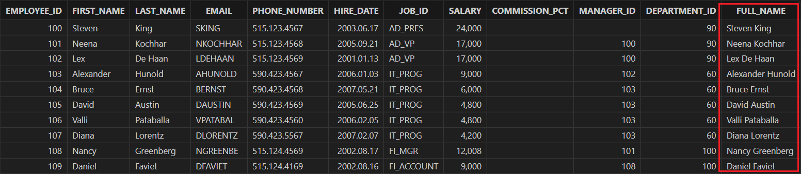

（2）重命名字段

将 “FULL_NAME” 列重命名为 "EMPLOYEE_NAME"。

```
alter table employees rename "FULL_NAME" to "EMPLOYEE_NAME" 
employees = loadTable("dfs://hr", `employees) // 重命名列后需要重新加载表
select * from employees
```

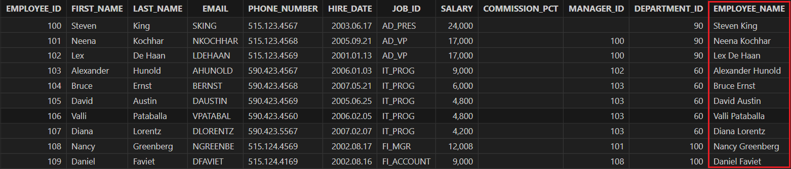

（3）删除字段

删除上文新增的 "EMPLOYEE_NAME" 字段。

```
alter table employees drop EMPLOYEE_NAME 
employees = loadTable("dfs://hr", `employees) // 删除列后需要重新加载表
select * from employees
```

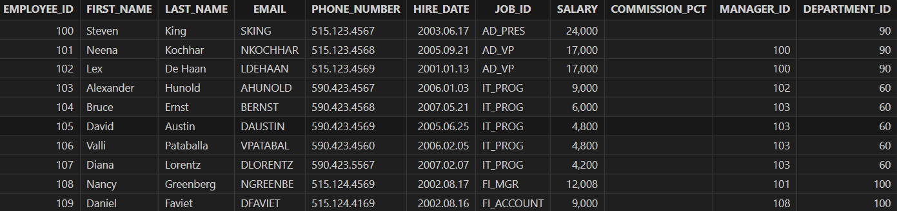

### 2.4 删除库表

（1）删除数据库

```
drop database if exists "dfs://hr"
```

（2）删除数据表

```
drop table if exists "dfs://hr"."job_history"
```

## 3 SQL 关键字

> 注：下文的表变量均是通过 tbName=loadTable(“dfs://hr“, `tbName) 加载得到的，为了说明的简洁，该步骤已被省略。

### 3.1 谓词

谓词指的是返回值为真值的函数，DolphinDB 支持谓词的关键字有：(not) in, (not) like, between, (not) exists, is (not) nullL。

(1) (not) in

选取 "employees" 表中 "EMPLOYEE_ID" 为 [101, 103, 152] 的对应记录。

```
select * from employees where EMPLOYEE_ID in [101, 103, 152];
```

选取 "employees" 表中 "EMPLOYEE_ID" 不在 100~150 的对应记录。

```
select * from employees where EMPLOYEE_ID not in 100..150;
```

(2) (not) like

选取 "employees" 表中 "PHONE_NUMBER" 以 “515” 开头的对应记录。

```
select * from employees where PHONE_NUMBER like "515%";
```

选取 "employees" 表中 "JOB_ID" 不以 “AD” 开头的对应记录。

```
select * from employees where JOB_ID not like "AD%";
```

(3) between

统计 2006 年雇佣的职员人数。

```
select count(*) from employees where date(HIRE_DATE) between 2006.01.01 and 2006.12.31 // output: 24
```

(4) (not) exists

> 注：由于 exists 暂不支持在分布式查询中使用，下述脚本先将维度表和分布式表赋值给内存表再进行查询。

```
job_history = select * from loadTable("dfs://hr", "job_history")
employees = select * from loadTable("dfs://hr", "employees")
```

查询记录在 "job_history" 表中的 "employees" 表的职员对应的记录。

```
select * from employees where exists(select * from job_history where employees.EMPLOYEE_ID in job_history.EMPLOYEE_ID)
```

查询记录不在 "job_history" 表中的 "employees" 表的职员对应的记录。

```
select * from employees where not exists(select * from job_history where employees.EMPLOYEE_ID in job_history.EMPLOYEE_ID)
```

(5) is (not) nullL

查询存在经理的部门对应的记录。

```
select * from departments where MANAGER_ID is not null
```

查询任务百分比为空的职员对应的记录。

```
select * from employees where COMMISSION_PCT is null
```


### 3.2 distinct

distinct 关键字添加在 select / exec 语句后，用于去除重复值并返回唯一值（distinct value）。

> 注：支持在分布式查询中使用，但暂不支持 distinct 与 group by, context by 或 pivot by 配合使用。

需要注意 DolphinDB 中存在同名的函数  `distinct`，若在 SQL 中使用 `distinct` 函数，则不保证返回结果的顺序，且默认将结果列的列名重命名为 "distinct_colName"。

```
select distinct COUNTRY_ID from locations // (1)
select distinct(COUNTRY_ID) from locations // (2)
```

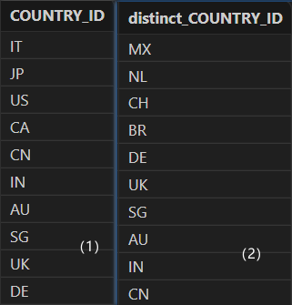

在函数中应用 distinct：统计唯一值的数量。

```
select count(distinct JOB_ID) from employees // output: 19
```

对多列应用 distinct：取 "DEPARTMENT_ID", "MANAGER_ID" 的唯一值。

```
select distinct DEPARTMENT_ID, MANAGER_ID from employees
```


### 3.3 any / all

支持使用 any / all 进行谓词比较，谓词包括：=, !=, >, <, <=,  >=.

- any

查询和采购部门任意职工薪水相同的职工信息。

```
select * from employees
where salary = 
any(select salary 
 from employees
 where department_id = 30) 
order by employee_id
```

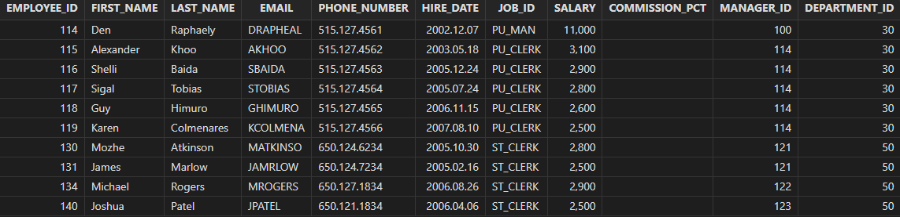


- all

查询薪水大于等于 IT 部门的最低薪水的员工信息。

```
 select * from employees
 where salary >=
 all (select salary from employees where department_id=60)
 order by employee_id
```

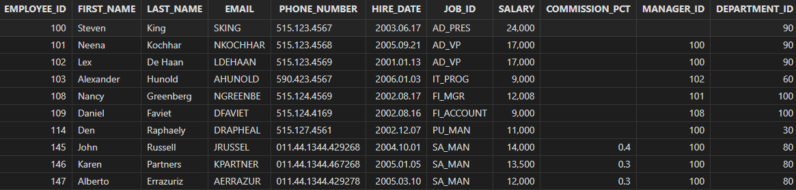

**注**：目前不支持形如 ` ALL (1400, 3000)` 这样的比较。


### 3.4 order by 支持 nulls first / last

支持在 order by 子句中，对空值字段进行 first/last 排序。

查询职工表并按经理 ID 排序，没有经理的职工优先。

```
select * from employees
order by manager_id asc nulls first
```

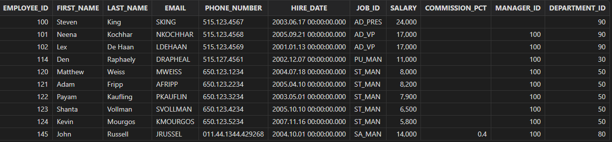

查询职工表并按经理 ID 排序，没有经理的职工放至最后。

```
select * from employees
order by manager_id asc nulls last
```

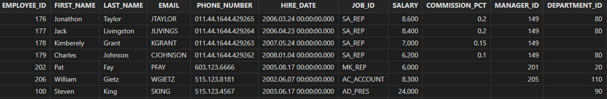

### 3.5 支持 with 语句

with 子句可以极大地提高 SQL 的可读性，并且通过 with 生成可复用的中间表，提高一些复杂 SQL 的执行效率。

查询财务部门已经工作5年以上，薪水8000以上的职员列表，并按薪水从高到低排序。该查询先查询财务部门工作5年以上的职工，生成临时表 "employees_with_salary_increase"，并在 "employees_with_salary_increase" 的基础上继续查询薪水在8000以上的职工信息生成 "employees_with_raise"表，最终在 "employees_with_raise" 表上查询并得到最终结果。

```
//search for the employees  that has worked more than 5 years and with a good salary
with  
  employees_with_salary_increase as (  
    select employee_id, salary, year(now()) as current_year,   
           case when  year(now()) - year(hire_date) > 5 then 1 else 0 end as has_5_years  
    from employees  
    where department_id = 100  
  ),  
  employees_with_raise as (  
    select employee_id, salary, has_5_years  
    from employees_with_salary_increase  
    where salary > 8000  
    and has_5_years = 1  
  )  
select employee_id, salary, has_5_years  
from employees_with_raise  
order by salary desc;
```

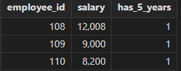

如上，在后续的版本中，通过使用 with 语句，我们可以将复杂的查询过程分解成多个步骤，并且将这些步骤的结果进行临时存储。这可以大大简化查询过程，并且提高查询效率。

### 3.6 集合运算

支持集合的并运算，包括 union、union all。

将地区信息表与部门信息表合并查询，查询所有的地区 ID（可能存在重复记录）。

- union all

```
select location_id from locations 
union all 
select location_id from departments
order by location_id
```

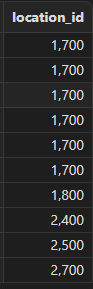

- union

将地区信息表与部门信息表合并查询，查询非重复的地区 ID。

```
select location_id from locations 
union  
select location_id from departments
order by location_id
```

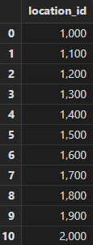

## 4 join 增强

join 在分析场景应用广泛，尤其是在数据仓库维度建模中，通过 join 来生成大宽表服务于应用层。在之前的版中，join 有诸多限制（比如不支持类型不匹配的字段，只支持分布式表之间关联等）。DolphinDB 2.00.10 版本大大提升了 join 的功能。在标准SQL中，join 的语法主要定义在 SQL92, SQL99 中，SQL99 的可读性更高，功能更加完备，被广泛采用。

**SQL92 关联特性**

| **分类**   | **语法**                                                     | **DolphinDB支持情况** |
| :--------- | :----------------------------------------------------------- | :-------------------- |
| 笛卡尔积   | from t1,t2                                                   | √                     |
| 等值连接   | from t1,t2 where t1.id= t2.id                             | √                     |
| 非等值连接 | from t1,t2 where t1.id \<op> t2.id<br>op 包括：>, <,>=, <=, <>，between…and | √                     |
| 外连接     | 左连接：from t1, t2 where t1.id = t2.id(+)<br>右连接：from t1, t2 where t1.id(+) = t2.id | X                     |
| 自连接     | from t t1, t t2 where t1.id \<op> t2.id<br>op 包括：=,>, <,>=, <=, <>，between…and | √                     |

**SQL99 关联特性**

| **分类**             | **语法**                                                     | **DolphinDB支持情况** |
| :------------------- | :----------------------------------------------------------- | :-------------------- |
| 交叉连接（笛卡尔积） | t1 cross join t2                                             | √                     |
| 等值连接             | t1 \[inner] join t2 on t1.id = t2.id                           | √                     |
| 非等值连接           | t1 join t2 on t1.id <op> t2.id<br>op包括：>, <,>=, <=, <>, between…and | X                     |
| 外连接               | 左连接：t1 left join t2<br>右连接：t1 right join t2 <br>全连接：t1 full join t2 | √                     |
| 自然连接             | t1 natural join t2                                           | X                     |
| using 连接           | t1 \[inner] join t2 using(id)                                | X                     |
| 自连接               | t t1 join t t2  on  t1.id \<op> t2.id<br>op 包括：=,>, <,>=, <=, <>, between…and | √                     |

### 4.1 标准 SQL 的各种类型的关联、笛卡尔积

具体包括 cross join、inner join、left join、right join、full join。除标准SQL的关联之外，还拓展了 left semi join（左半连接）。

- cross join（笛卡尔积）

获取职工的两两信息表，可以基于此结果集做一些关联分析。

1. SQL 92

```
select * 
from employees a, employees b
where a.employee_id <> b.employee_id
```

2. SQL99

```
 select * 
 from employees a
 cross join employees b
 where a.employee_id <> b.employee_id
```

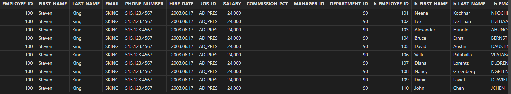

- inner join

职工表自关联，获取职工、经理 ID 信息。

1. SQL92 

```
select e1.employee_id, e1.manager_id
from employees e1, employees e2
where e1.manager_id = e2.employee_id
order by e1.employee_id, e1.manager_id
```


2. SQL99

```
select e1.employee_id, e1.manager_id
from employees e1 
inner join employees e2
on e1.manager_id = e2.employee_id
order by e1.employee_id, e1.manager_id
```

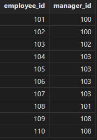

- left join

职工表自关联获取职工 ID，经理 ID，包括没有上级经理的职工。

```
select e1.employee_id, e1.last_name, e2.last_name as manager_name  
from employees e1
left join employees e2 
on e1.manager_id = e2.employee_id
```

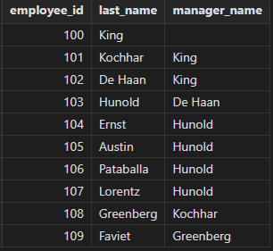

- left semi join

left semi join 不属于标准 SQL 的范畴，但应用广泛，且在分布式环境有较好的性能，故予以支持。

获取部门信息，并展示一个薪水在2500以上的员工信息。

```
select department_id, department_name,employee_id, first_name, last_name, salary
from departments 
left semi join employees // or left semijoin
on departments.department_id = employees.department_id 
       and employees.salary > 2500
order by department_id
```

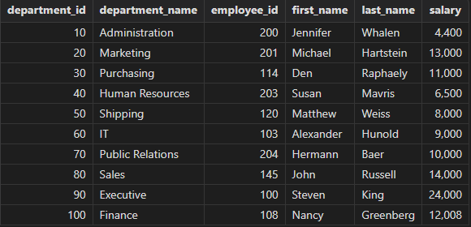

- right join

获取职工薪水、部门信息，包括那些没有所属部门的职工。

```
 select department_id, employee_id, first_name, last_name, salary
 from departments 
 right join employees
 on departments.department_id = employees.department_id 
        and employees.salary > 2500
 order by department_id
```

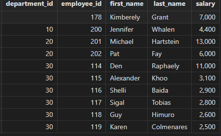

- full join

展示所有部门的职工信息，包括没有员工的部门和没有所属部门的员工。

```
 select department_id, department_name, employee_id, first_name, last_name, salary
 from departments a
 full join employees b
 on a.department_id = b.department_id 
```

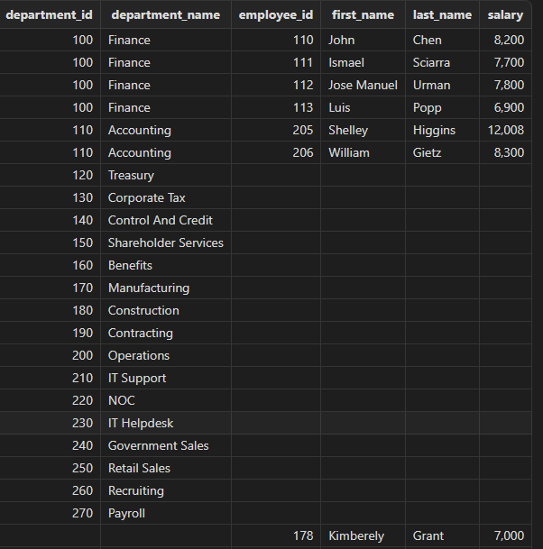

### 4.2 表类型拓展

参与 join 的表类型支持：内存表、分布式表、维度表、非相关子查询（单表、多表 join 的子查询）的临时表。

查找各职员的工作历史信息, 测试各类型的表进行关联查询的兼容性情况。

```
select j.job_id, j.job_title, j.min_salary
  , h.start_date, h.end_date
from jobs j  
left join job_history h 
on h.job_id = j.job_id 
```

| **类型** | 内存表 | 分布式表 | 维度表 | 子查询 |
| :------- | :----- | :------- | :----- | :----- |
| 内存表   | √      | √        | √      | √      |
| 分布式表 | √      | √        | √      | √      |
| 维度表   | √      | √        | √      | √      |
| 子查询   | √      | √        | √      | √      |

### 4.3 多表级联 join

现在你可以将任意多个表 join（之前的版本只能支持两个分区表的 join），来拼接一些大宽表。

关联查询职工表、部门表，获取详细的职工信息，包括个人、经理、部门相关信息。

```
 select a.employee_id, a.last_name, a.manager_id, b.last_name as manager_name
    , a.department_id, c.department_name
 from employees a
 inner join employees b 
 on a.manager_id = b.employee_id 
 inner join departments c 
 on a.department_id = c.department_id 
```

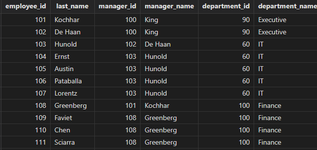

### 4.4 on 条件拓展

查询职工的工作历史，并将 FI_ACCOUNT，AC_ACCOUNT 都视为 AC_ACCOUNT（会计）。

```
select employee_id, j.job_id, j.job_title, j.min_salary
  , h.start_date, h.end_date
from job_history h 
left join jobs j
on j.job_id = case when h.job_id in ("FI_ACCOUNT", "AC_ACCOUNT") then "FI_ACCOUNT" else h.job_id end  
order by employee_id
```

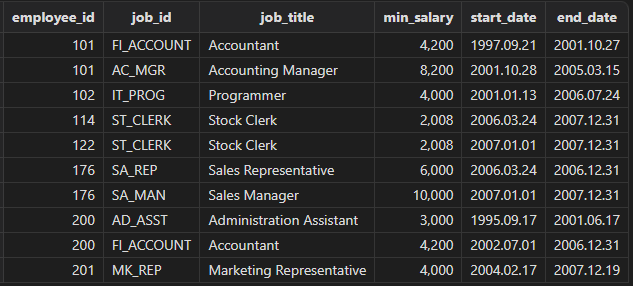

支持在 join 的条件列上做如下转换：

- 函数
- case when
- 支持整型与 STRING/SYMBOL 类型字段 join

**注**：目前仍然不支持 on 1=2 这样的常量表达式（对开发、框架代码可能有一些影响）。

## 5 SQL 方言(dialect)兼容

Oracle、MySQL 等传统数据库在遵循 SQL 规范的前提下，都有各自的扩展特性，并且存在行为不一致的同名函数。以 `substr`/`concat` 函数为例： 

- MySQL 执行 `select substr('HelloWorld',0,4)` 会返回空值，Oracle 执行 `select substr('HelloWorld',0,4) from dual` 返回 "Hell"，两者输入一致，但是输出不一致。
- MySQL 中 `concat` 可以拼接多个字符串，`select concat('my', 's', 'ql', '8')`，Oracle 中 `concat` 只能拼接两个字符串，两者函数名称一致，但是签名不一样。

为此，DolphinDB 开发了一整套框架，使得用户可以指定每个 session 选择兼容的 SQL 方言。目前已支持 Oracle 和 MySQL。其中在 Oracle 模式下，已经实现了一系列的 Oracle 函数，在 MySQL 模式下，实现的函数还较少。后续版本会继续开发，进一步提升兼容率。

### 5.1 脚本使用 SQL 方言

方言模式可以在客户端工具 session 级别进行指定，设置后按指定的 SQL 方言进行解析执行。以 DolphinDB GUI 环境为例：

设置 *File → Preferences → Always show sqlStd dropDown(√)*

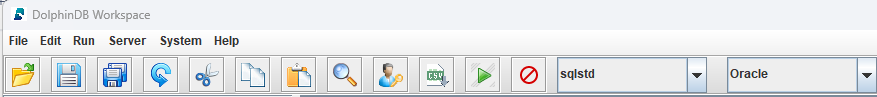

选择对应的 SQL 方言即可，目前支持 Oracle、MySQL、DolphinDB 三种模式。

下面示例以 Oracle模式按部门统计职工薪水情况，包括部门信息、职工人数等：

```
select   
  d.department_id, 
  d.department_name,  
  count(a.employee_id) as num_of_employee_id,
  sum(a.salary) as total_salary,  
  avg(a.salary) as avg_salary,  
  max(a.salary) as max_salary,
  decode(a.job_id, 'IT_PROG' , 'Programmer', 'FI_ACCOUNT', 'Accountant', 'Others') as job_title
from employees a 
inner join departments d
on a.department_id = d.department_id  
group by   
  d.department_id,  
  d.department_name,  
  decode(a.job_id, 'IT_PROG' , 'Programmer', 'FI_ACCOUNT', 'Accountant', 'Others') as job_title
```

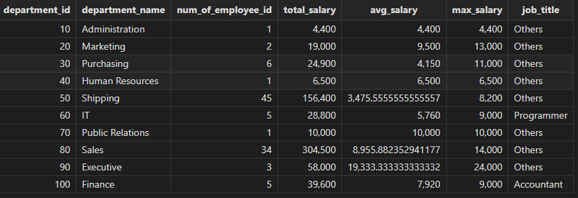

上述代码使用了 Oracle 的 `decode` 函数，除此之外，目前还支持： `concat`, `sysdate`, `nvl`, `to_char`, `to_date`, `to_number`, `regexp_like`, `trunc`, `asciistr`，`instr`，`row_number`。通过设置 SQL 方言，使用 Oracle 的应用程序迁移至 DolphinDB 时，SQL 代码迁移成本大大降低。 MySQL 模式的使用方式类似，方言选项选择 MySQL 即可。目前 MySQL 只支持 `sysdate()` 函数，后续版本会逐步提高兼容性。

### 5.2 API 使用 SQL 方言

- Java API

使用 Java API 时可以在构造 DBconnection 对象时输入 SqlstdEnum, 包括 `DolphinDB`，`Oracle`，`MySQL`。

```
package com.dolphindb.sqlstd;

import com.xxdb.DBConnection;
import com.xxdb.comm.SqlStdEnum;
import com.xxdb.data.Entity;
import java.io.IOException;

public class OracleMode {
    public static void main(String[] args) throws IOException {
        DBConnection connection = new DBConnection(SqlStdEnum.Oracle);
        connection.connect("192.168.1.206", 11702, "admin", "123456");
        String sql = String.format(
                "select employee_id, first_name, last_name, \n" +
                "  decode(job_id, 'IT_PROG' , 'Programmer', 'FI_ACCOUNT', 'Accountant', 'Others') as jobs_title\n" +
                "from loadTable(%s, %s) a"
                , "\"dfs://hr\"", "\"employees\""
        );
        Entity result = connection.run(sql);
        System.out.println(result.getString());
    }
}
```

- JDBC

使用 jdbc 时需要在 url 上增加配置项 *sqlStd*。

```
spring.datasource.url=jdbc:dolphindb://192.168.1.206:11702?databasePath=dfs://hr&sqlStd=Oracle
spring.datasource.username=admin
spring.datasource.password=123456
spring.datasource.driver-class-name=com.dolphindb.jdbc.Driver
```

## 6 总结

DolphinDB自1.30.22 / 2.00.10 版本起，对标准 SQL 的常用语法和关键字实现了兼容，包括：

- 大小写兼容：SQL 关键字支持全大写或全小写，字段名大小写不敏感，但数据库名/表名还是大小写敏感； 
- SQL 语句换行解析：支持在 SQL 语句中任意位置的换行；
- 支持谓词：支持的关键字有 (not) in, (not) like, (not ) between and, (not) exists, is (not) null
- distinct 支持多列：distinct 支持对多个字段一起去重，暂不支持与 group by, context by, pivot by 联用；
- order by 支持 nulls first/last 
- 支持 with as 语句
- 支持 is null, is not null 
- 支持 union、union all
- 支持 any、all
- 支持多表 join：支持的 join 包括 cross join, inner join, left join, right join, full join, left semi join（left semijoin 也支持） 。
  - 支持用 comma (,) 来表示 cross join，a join b，如果后面没有跟 on 条件，表示 cross join，否则表示 inner join。
  - on 条件列支持函数、 case when（以前只能是表的某一个字段）。
  - 支持整型与字符串类型的 join。
- 支持 join 对象是子查询：支持多分区表的 join（以前只能支持两分区表的 join），支持子查询。 join 的表可以是内存表、分区表、维度表、单表子查询、多表 join 的子查询。暂不支持子查询使用父查询的字段；

另外针对 Oracle、MySQL 等传统数据库在遵循 SQL 规范的前提下，都有各自的扩展特性、特别是有同名函数但行为不一致的情况，DolphinDB 开发了一整套框架，使得用户可以为每个会话(session)选择兼容的 SQL 方言，目前在 Oracle 模式下，已经实现了一系列的 Oracle 函数。 后续版本 DolphinDB 会继续进行 SQL 标准化的开发，进一步提升兼容率。例如对于在 SQL-2003 标准中引入的开窗函数，将会在下个主要版本（2.00.11）支持。

 