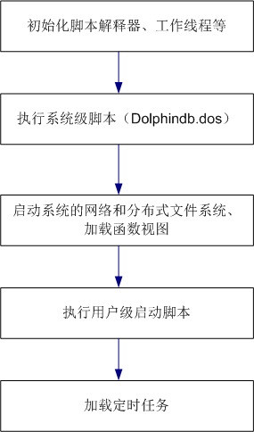

# DolphinDB教程： 启动脚本 

DolphinDB database从1.0版本开始，提供启动脚本功能。在启动脚本中，用户可以指定每次DolphinDB启动都需要自动执行的任务，譬如初始化流数据，定义共享变量，加载插件脚本等。

- [DolphinDB教程： 启动脚本](#dolphindb教程-启动脚本)
	- [1.  DolphinDB 启动流程](#1--dolphindb-启动流程)
	- [2.  执行启动脚本](#2--执行启动脚本)
	- [3.  常见应用场景](#3--常见应用场景)
		- [3.1. 例1：定义并共享内存表](#31-例1定义并共享内存表)
		- [3.2. 例2：定义、加载流数据表并共享、订阅](#32-例2定义加载流数据表并共享订阅)
		- [3.3. 例3：加载插件](#33-例3加载插件)
	- [4.  编写启动脚本](#4--编写启动脚本)

## 1.  DolphinDB 启动流程

DolphinDB系统的启动流程如下图所示：



系统级初始化脚本是必需的，由设置参数init指定，默认脚本是版本发布目录中的dolphindb.dos。系统级初始化脚本中可定义系统级函数。这些函数对所有用户都可见，而且不能被覆盖，相当于DolphinDB内置函数。

执行系统初始化脚本（dolphindb.dos）脚本时，脚本解释器、工作线程等已完成初始化，但系统的网络和分布式文件系统尚未启动、函数视图尚未加载。因此，如果函数视图中使用了插件，加载插件必须在系统初始化脚本（dolphindb.dos）中完成或者在配置项 preloadModules 配置。

注意：由于函数视图存储在控制节点，如果在初始化脚本中加载插件，则集群环境下每个节点的初始化脚本中都必须进行加载，因此建议用户使用 preloadModules 配置项进行预加载。


除了以下极少数任务以外，在启动脚本中我们可以执行任何其它任务。
* 定时作业在启动脚本之后运行，所以不能在启动脚本中使用与定时作业相关的任何功能，包括函数scheduleJob, getScheduledJobs 和 deleteScheduledJob。
* 若需要定义系统级的函数，要求这些函数对所有用户都可见，而且不能被覆盖，请在初始化脚本dolphindb.dos中定义。
* 依赖其他节点的任务。因为有可能其他节点尚未启动。

定时作业 (scheduled job) 在启动脚本执行后加载。因此定时作业中若用到了插件函数、共享表等，需要在启动脚本中预先加载或定义，否则定时作业的反序列化会失败。

如果需要在系统启动时初始化某些定时作业相关的任务，只能在初始化定时任务模块完成后通过postStart脚本执行。postStart脚本文件路径由参数postStart指定。
```
if(getScheduledJobs().jobDesc.find("daily resub") == -1){
	scheduleJob(jobId=`daily, jobDesc="daily resub", jobFunc=run{"/home/appadmin/server/resubJob.dos"}, scheduleTime=08:30m, startDate=2021.08.30, endDate=2023.12.01, frequency='D')	
}
```

## 2.  执行启动脚本

启动脚本的配置参数为startup，参数值为启动脚本文件名，默认脚本为startup.dos。单机模式时在dolphindb.cfg中配置，集群模式时在cluster.cfg中配置。可配置绝对路径或相对路径。若配置了相对路径或者没有指定目录，系统会依次搜索本地节点的home目录、工作目录和可执行文件所在目录。

配置举例如下:
```
startup=/home/streamtest/init/server/startup.dos
```

启动脚本以本地管理员的身份运行，但没有被授权使用集群的分布式功能。因此，若要远程执行控制节点的某些功能，或访问集群中的某个分布式表，需要先以管理员(admin)或其他授权用户身份登录。

启动脚本执行过程中若遇到错误，执行会中断，但系统不会退出，而是继续运行。

## 3.  常见应用场景

系统重启后可能需要的初始化工作主要有：定义并共享内存表，定义、加载并共享流数据表、订阅流数据、加载插件等。

### 3.1. 例1：定义并共享内存表

下面代码中定义了一张内存表t，并分享为sharedT。在其他会话中可对表sharedT进行增加、更新、删除和查询记录。
```
t=table(1:0,`date`sym`val,[DATE,SYMBOL,INT])
share(t, `sharedT); 
```

### 3.2. 例2：定义、加载流数据表并共享、订阅

流数据表的定义不可在DolphinDB中持久化保存，所以流数据表的初始化工作可在启动脚本中执行。下面代码加载并共享了流数据表st1：
```
login("admin","123456")
t1=streamTable(1:0,`date`sym`val,[DATE,SYMBOL,INT])
enableTableShareAndPersistence(table=t1,tableName=`st1,cacheSize=1000)
```
流数据表的订阅也可在启动脚本中完成。以下的代码中，订阅流数据表st1，并把订阅的数据保存到分布式数据表：
```
tb=loadTable("dfs://db1","tb")
subscribeTable(,"st1","subst",-1,append!{tb},true)
```

注意：在例子1，2的场景下，若在启动脚本中定义了共享内存表或者共享流数据表，且在启动脚本中调用了共享表变量，需要在 share 函数或者 enableTableShareAndPersistence 函数后增加 go 语句，否则解析会抛出异常。参考下例：

将流数据表的数据写入一个共享的键值表，在启动脚本中定义如下：
```
def saveT(tb,st){tb.append!(st)}

n=1000000
colNames = `time`sym`vwap
colTypes = [DATETIME,SYMBOL,DOUBLE]
share streamTable(n:0, colNames, colTypes) as test_stream
opt=keyedTable(`sym, n:0, colNames, colTypes)
share(opt, `optShared)
go
subscribeTable(tableName="test_stream", actionName="test1", offset=0, handler=saveT{optShared}, msgAsTable=true, batchSize=100000, throttle=60)
```

上例中，share(opt, `optShared) 语句执行时，动态注册了共享表对象optShared，而后续订阅的 handler=saveT{optShared} 中调用了变量  optShared。若不增加 go 语句，系统解析时，由于无法识别动态注册的变量 optShared 会抛出异常。 

为避免不加 go 语句导致的解析异常，也可以将上述 share 函数替换成 share 语句：

```
share opt as optShared
```

### 3.3. 例3：加载插件

若定时作业 (scheduled job) 中使用了插件函数，必须在启动脚本中加载插件或者在配置项 preloadModules 配置插件，否则会因反序列化失败导致系统退出。
下列代码在定时作业中使用了ODBC插件：
```
use odbc
def jobDemo(){
	conn = odbc::connect("dsn=mysql_factorDBURL");
	//...
}
scheduleJob("job demo","example of init",jobDemo,15:48m, 2019.01.01, 2020.12.31, 'D')
```
若ODBC插件在系统启动时没有加载，读取定时作业时会无法识别函数 `jobDemo`，导致退出系统，输出下列日志：
```
<ERROR>:Failed to unmarshall the job [job demo]. Failed to deserialize assign statement. Invalid message format.
```
必须在启动脚本中加入下列代码以加载 ODBC 插件：
```
loadPlugin("plugins/odbc/odbc.cfg")
```

或者在配置项文件（单节点：dolphindb.cfg / 集群：cluster.cfg）中添加：

```
preloadModules=plugins::odbc
```

## 4.  编写启动脚本

编写启动脚本时，可以使用 [`module`](./module_tutorial.md) 来声明和使用可重用模块，可以自定义函数，也可以使用分布式的功能。

若需要调试启动脚本，可以在脚本中用 print 与 writeLog 等函数打印日志。系统会把启动脚本运行情况输出到节点日志。

编写启动脚本时，为了防止出现异常而停止执行后续的脚本，可使用 try-catch 语句俘获异常。

编写系统初始化脚本和启动脚本时，可以里用 include 语句进行代码的模块化管理。