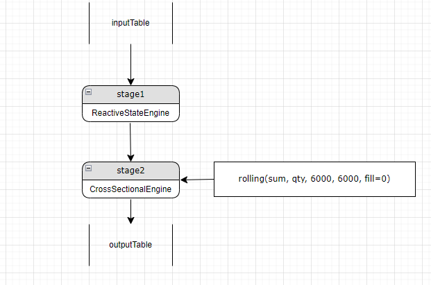
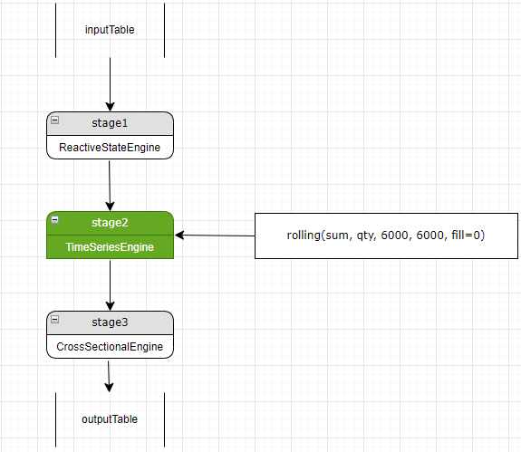
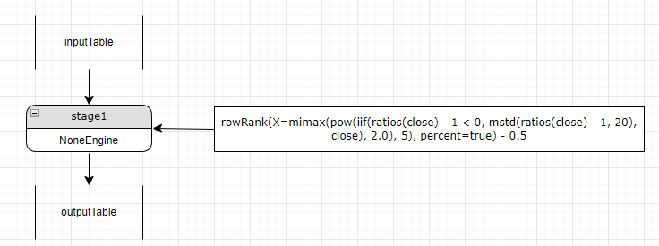
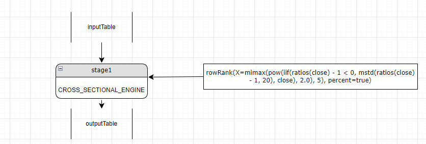
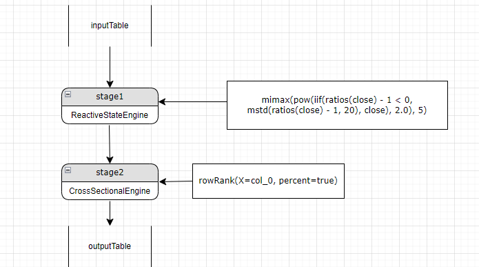
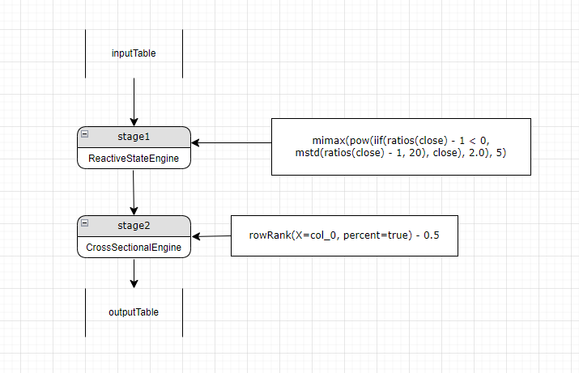
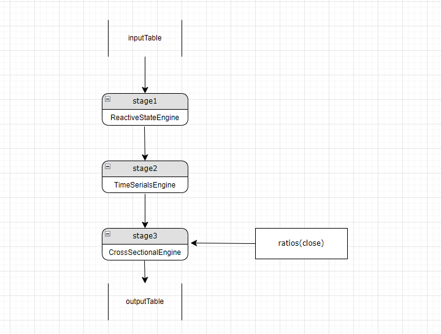
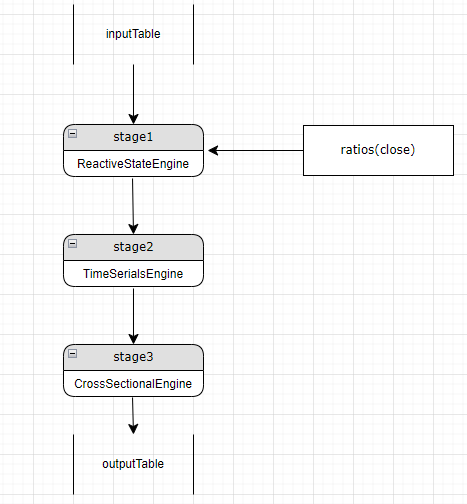
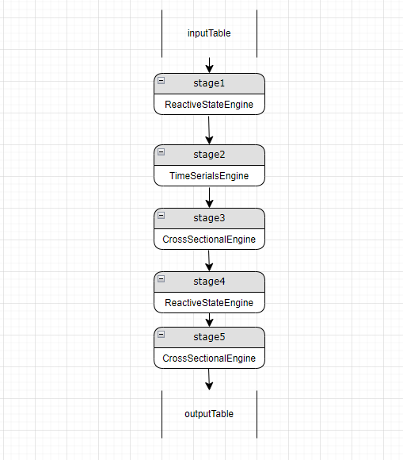
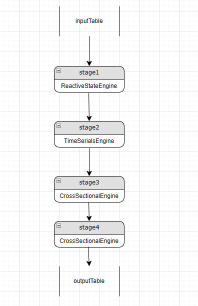

# StreamEngineParser 解析原理介绍

在以往发布的文章中，包含了《WorldQuant 101 Alpha 因子的流批一体实现》和 《国泰君安 191 Alpha 因子的流批一体实现》，这两篇文章介绍了如何基于 DolphinDB 的 StreamEngineParser 实现金融因子的流批一体解决方案。StreamEngineParser 的主要功能是自动构建计算流水线，以及在流批一体计算场景中，将批计算因子翻译成流计算解决方案。本文将为大家详细介绍 StreamEngineParser 的计算规则和解析原理。


- [1 StreamEngineParser 功能介绍](#1-streamengineparser-功能介绍)
- [2 流计算引擎计算规则](#2-流计算引擎计算规则)
  - [2.1 流计算引擎支持类型](#21-流计算引擎支持类型)
  - [2.2 流计算引擎数据交换规则](#22-流计算引擎数据交换规则)
  - [2.3 流计算指标类型](#23-流计算指标类型)
- [3 StreamEngineParser 解析过程介绍](#3-streamengineparser-解析过程介绍)
  - [3.1 定义流水线 stage](#31-定义流水线-stage)
  - [3.2 递归解析](#32-递归解析)
  - [3.3 优化](#33-优化)
    - [3.3.1 在类型匹配的 stage 中计算新增指标 或 为指标匹配 engine](#331-在类型匹配的-stage-中计算新增指标-或-为指标匹配-engine)
    - [3.3.2 检查指标](#332-检查指标)
    - [3.3.3 复检](#333-复检)


# 1 StreamEngineParser 功能介绍

DolphinDB 针对不同场景提供了多种流计算引擎，例如用户可以使用响应式状态引擎（ReactiveStateEngine）访问历史状态数据，通过横截面引擎（CrossSectionalEngine）实时计算截面数据等。对于简单的业务场景，只需使用单一引擎即可解决，而对于一些复杂任务，需要将多种引擎串联成流水线，共同完成计算任务。

相较于手动串联各类引擎需要人工定义每一层引擎实例，并按照特定顺序进行级联，StreamEngineParser 可以帮助用户自动解析表达式，构建流水线，高效实现各类复杂计算业务。

有了这一功能，用户还可以轻松实现流批一体解决方案。以量化因子研发为例，用户通常需要先对证券历史数据进行批计算，验证因子有效性，然后使用流计算在实盘中做交易。传统的解决方案中，为了批计算的开发效率和维护便捷性，往往采用 Python 等语言，而实盘流计算为了性能，通常采用 C++ 等编译型语言。这就要求用户进行从批到流的因子转写，转写过程不仅带来了冗余繁重的开发工作，还存在流批计算结果不一致的隐患。

StreamEngineParser 很好地解决了这一问题，用户只需实现因子的批计算，就可以自动构建对应的流计算方案，无需自己转写即可轻松实现流批一体，同时严格保证了流批计算结果的一致性。

StreamEngineParser 相关使用语法请参考 [streamEngineParser — DolphinDB 2.0 documentation](https://www.dolphindb.cn/cn/help/FunctionsandCommands/FunctionReferences/s/streamEngineParser.html?highlight=streamengineparser)。

# 2 流计算引擎计算规则

## 2.1 流计算引擎支持类型

除了上文中提到的响应式状态引擎（ReactiveStateEngine）和横截面引擎（CrossSectionalEngine）， DolphinDB 还提供了时间序列引擎（TimeSeriesEngine）、会话窗口引擎（SessionWindowEngine）、流数据连接引擎（AsofJoinEngine, EqualJoinEngine, WindowJoinEngine, LookupJoinEngine, LeftSemiJoinEngine） 以及异常检测引擎（AnormalyDectionEngine）。其中，异常检测引擎通常用于对实时数据进行监控的场景，流数据连接引擎侧重于异构表的融合。

目前 StreamEngineParser 仅支持响应式状态引擎、横截面引擎和时间序列引擎。

StreamEngineParser 可以自动解析因子表达式，然后识别解析出的因子应该放在哪一类计算引擎中，从而实现自动构建流水线。例如，针对用于逐行计算的 `row` 系列函数，StreamEngineParser 会解析生成一个横截面引擎来计算，其特征是函数名以 ”row“ 为前缀；针对用于滑动窗口计算的 `rolling` 高阶函数，StreamEngineParser 会解析生成时间序列引擎。除此之外，其他函数调用都将解析成状态引擎的指标。

## 2.2 流计算引擎数据交换规则

流计算引擎定义类继承了 Table 类，即每一个流计算引擎实例是一个特殊的的数据表。流计算引擎有三个基础要素：输入数据表的表结构（dummyTable）、待计算的逻辑（metrics）和输出数据表的实例引用（outputTable），在创建引擎实例时这三个基础要素是已经确定的。

流计算引擎通过 append 接口将引擎和流表的订阅关联起来以接收实时流数据。当引擎的 append 被调用时，会触发计算逻辑，根据引擎的类型来计算指标，计算完成后调用输出表的 append 接口将数据写入。

由于流计算引擎也是一个数据表，所以一个引擎的实例可以作为另一个引擎的输入或输出，这就是 DolphinDB 流计算流水线构建的基础。

## 2.3 流计算指标类型

流计算引擎的指标依赖 DolphinDB 脚本的表达语义，在解析过程中包括函数、表达式、列引用和常量这几类。

- 函数

解析函数时，StreamEngineParser 可以自动识别函数名称、参数列表及类型和返回值类型。函数可以嵌套调用，即一个函数可以作为另外一个函数的参数，如：

```
mrank(rowRank(low, percent=true), true, 9)
```

- 表达式

解析表达式时，StreamEngineParser 可以自动识别表达式的类型，表达式的左值、右值，以及运算符号等，表达式可以在任何引擎中直接使用。如：

```
sign((vol - mfirst(vol, 2))) * (-1 * (close - mfirst(close, 2)))
```

- 列引用

列引用的计算规则是通过引用列名，将输入表中某一列的值直接拷贝到输出表中。在流计算流水线中，列引用对于从某个 stage 的引擎往后续 stage 传递计算结果至关重要。

- 常量

常量的引用不涉及指标的计算，也不涉及跨 stage 传递数据，可以在任意 stage 中直接使用。

# 3 StreamEngineParser 解析过程介绍

## 3.1 定义流水线 stage

定义流水线stage的数据结构，包含当前stage的engine类型，输入Table的schema，计算的metrics列表，假设流水线stage的类名为Process，则其定义为：

```
class Process {
  private:
    EngineType engineType_;
    TableSP inputDummy_;
    vector<ObjectSP> metrics_;
    TableSP outputTableDummy_;
}

enum EngineType {
    REACTIVE_STATE_ENGINE,
    CROSS_SECTIONAL_ENGINE,
    TIME_SERIES_ENGINE，
    NONE_ENGINE
}
```

前文中我们说明了 engine 实例和计算函数之间的对应关系：

- 以 “row” 开头的函数或者 `byrow` 函数会被解析成 CROSS_SECTIONAL_ENGINE
- `rolling` 函数会被解析成 TIME_SERIES_ENGINE
- 其他函数会被解析成 REACTIVE_STATE_ENGINE

 

某一个 stage 仅有一个 engine 实例，仅能计算某一种类型的计算任务，解析过程中当出现某一层的计算指标和当前层的 engine 类型不一致时则需要在当前 engine 的上游新建一个 stage，并将计算的结果以列引用的方式传递给当前 stage。如下图所示：

 

假设当前解析了两层 stage，stage1 是一个 ReactiveStateEngine， stage2 是一个 crossSectionalEngine。在解析过程中识别出来应该在 stage2 的 engine 新增一个计算指标 `rolling (sum, qty, 6000, 6000, fill=0)`。新的指标是一个使用了 `rolling` 的高阶函数调用，前文中介绍这类调用需要在 TIME_SERIES_ENGINE 中计算，而当前 engine 的类型是 CrossSectionalEngine, 与需要的 engine 类型不匹配， 则需要新建一个时间序列 engine 用来计算新的指标，并在原有的 stage2 中新增一个列引用，引用该计算结果。如下图所示：

 

值得注意的是，新增的 stage 既可以放在流水线开头，也可以放在当前 stage 的上一层，如果放在流水线的第一层，则在当前层和新增的 stage 之间每一层都需要增加列的引用，否则当前层会拿不到这个指标的计算结果，导致结果错误。放在原有的 stage 的上一层仅需在新的 stage3 中增加对新的 stage2 中新增指标的列的引用即可。

另外，当我们新增了一个 stage2，则需要在这个 stage2 中针对 stage1 输出表的每一列新增一个列引用。因为现在的 stage3 的输入 table 是 stage1，可以直接访问 stage1 的输出表中的数据，当中间新增了 stage2 后，stage3 的输入 table 是 stage2，没法直接访问 stage1，需要通过 stage2 的列引用作为中间媒介间接访问。

## 3.2 递归解析

StreamEngineParser 的其中一个参数是指标列表，不同的指标对应的 engine 类型可能会不同，同一个指标因为存在嵌套函数调用可能需要多层 stage 才能完整计算。StreamEngineParser 使用递归完成所有指标的解析，先遍历 StreamEngineParser 的原始输入指标列表。

流水线 stage 的最后一层输出到最终输出表，每一个原始输入指标对应流水线最终输出表的一个列。

StreamEngineParser 针对每一个原始输入指标递归进行解析，如果是函数调用指标则依次解析函数名和函数参数列表，如果是表达式则依次解析表达式的左右值，直到某一个解析的指标是一个列引用或者是一个常量则退出递归。

这里我们以 alpha1 因子为例讲解递归解析的完整过程。

DolphinDB 实现的 alpha1 因子代码为：

```
def alpha1(close){
    ts = mimax(pow(iif(ratios(close) - 1 < 0, mstd(ratios(close) - 1, 20), close), 2.0), 5)
    return rowRank(X=ts, percent=true) - 0.5
}

inputSchemaT = table(1:0, ["SecurityID","TradeTime","close"], [SYMBOL,TIMESTAMP,DOUBLE])
resultStream = table(10000:0, ["TradeTime","SecurityID", "factor"], [TIMESTAMP,SYMBOL,DOUBLE])
metrics = <[SecurityID, alpha1(close)]>
streamEngine = streamEngineParser(name="alpha1ParserT", metrics=metrics, dummyTable=inputSchemaT, outputTable=resultStream, keyColumn="SecurityID", timeColumn=`tradetime, triggeringPattern='perBatch', triggeringInterval=4000) 
```

在这个例子中，输入 Table 的 schema 为 `inputSchemaT`, 其中有一个 `close` 输入列，该列被 alpha1 因子作为参数引用。streamEngineParser 的输入指标为 `metrics`，`metrics` 中仅有两个指标分别用于 `SecurityID` 列引用，和 `alpha1(close)` 因子计算。输出 table 的为 `resultStream`，其中 `factor` 列的值是`alpha1(close)` 因子计算后的结果。

alpha1因子有一个赋值表达式 

```
ts = mimax(pow(iif(ratios(close) - 1 < 0, mstd(ratios(close) - 1, 20), close), 2.0), 5)
```

返回的计算表达式 `rowRank(X=ts, percent=true) - 0.5` 中引用了 `ts`。对该因子的递归解析过程如下：

第一步， 将引用的变量展开，则计算完整表达式为：

```
rowRank(X=mimax(pow(iif(ratios(close) - 1 < 0, mstd(ratios(close) - 1, 20), close), 2.0), 5), percent=true) - 0.5
```

第二步，展开后的引用变量最外层是一个表达式，左值为 `rowRank(X=mimax(pow(iif(ratios(close) - 1 < 0, mstd(ratios(close) - 1, 20), close), 2.0), 5), percent=true)`， 表达式计算符为：”-”,  右值为0.5。 

表达式可以在任意类型的 engine 中计算，因为当前的 stage 中还没有 stage，则创建一个初始的 NONE_STAGE，这个 stage 是万能 stage，后续遇到第一个函数计算时可以将其 NoneEngine 类型转换成对应的 engine 类型。如下图：

 

第三步， 递归解析表达式的左值 `rowRank(X=mimax(pow(iif(ratios(close) - 1 < 0, mstd(ratios(close) - 1, 20), close), 2.0), 5), percent=true)`

这个是一个以 "row" 为前缀的函数调用，按照前文中的解析规则会被解析成一个 CrossSectionalEngine， 因为当前的 engine 是一个 NoneEngine 类型，则直接将当前 stage 的 engineType 设置成 `CROSS_SECTIONAL_ENGINE`， 如下图所示：



第四步，接下来解析 `rowRank` 的参数， `rowRank` 的参数分别为 `mimax(pow(iif(ratios(close) - 1 < 0, mstd(ratios(close) - 1, 20), close), 2.0), 5)` 和 `percent=true`.

先解析 `mimax(pow(iif(ratios(close) - 1 < 0, mstd(ratios(close) - 1, 20), close), 2.0), 5)`,  `mimax ` 函数既不是以 "row" 开头，也不是 `byrow` 高阶函数调用或 `rolling` 的高阶函数调用，则应该解析成 `REACTIVE_STATE_ENGINE`， 因为当前层是 CROSS_SECTIONAL_ENGINE，无法计算 REACTIVE_STATE_ENGINE 类型的指标，需要新增一个 stage，并将当前 stage 设置成新增的 stage。如图：



第五步， 接下来依次解析 `mimax(pow(iif(ratios(close) - 1 < 0, mstd(ratios(close) - 1, 20), close), 2.0), 5)`参数，其中 `mimax`，`pow`, `iif`, `ratios`, `mstd` 等函数均应该解析成 `REACTIVE_STATE_ENGINE` 类型，而当前 stage 即 stage1 也是 REACTIVE_STATE_ENGINE，与前述 `mimax` 等函数的解析类型相匹配，所以放在当前 stage 中计算。

第六步，回到第二步 表达式的右值是一个常量，不需要新增 Engine，所以 alpha1 最终解析的流水线为：



流水线仅有两个 stage， stage1 是一个 ReactiveStateEngine 计算 `mimax(pow(iif(ratios(close) - 1 < 0, mstd(ratios(close) - 1, 20), close), 2.0) ` 这个指标，输出到 table 中对应的列为 "col_0"。stage2 是一个 CrossSectionalEngine, 输入表为 stage1 的输出表， 原来的计算指标

```
rowRank(X=mimax(pow(iif(ratios(close) - 1 < 0, mstd(ratios(close) - 1, 20), close), 2.0), 5), percent=true) - 0.5
```

经过流水线拆解后，转换成：

`rowRank(X=col_0, percent=true) - 0.5`,  其中 `col_0` 是 stage1 中 `mimax(pow(iif(ratios(close) - 1 < 0, mstd(ratios(close) - 1, 20), close), 2.0)` 的结算结果。

需要注意的是：

ReactiveEngine 支持嵌套计算，所以当 ReactinveEngine 的函数指标的参数也是一个 reactiveEngine 时，则可以放到同一个 engine 中执行。

但 TimeSeriesEngine 和 CrossSectionalEngine 不支持嵌套计算，比如 `rowRank(rowRank(close, percent=true), percent=true)`, 则需要解析成两个 CrossSectionalEngine。

## 3.3 优化

优化可以尽可能减少流水线的 stage 和避免重复计算。主要的优化方向有两个：尽可能将同类型的指标放在同一个 engine 中计算，并通过列引用传递给后续的 stage；检查某个指标是否已经计算过了，如果已经计算过了则直接引用结果即可。

### 3.3.1 在类型匹配的 stage 中计算新增指标 或 为指标匹配 engine

当检测到某个指标和当前 Engine 类型不匹配时，检测下上游所有 stage，是否存在匹配的 engine，若存在，则在匹配的 engine 中计算，并将结果通过列引用透传到当前层。如：



假设当前 stage 是 stage3，解析的一个指标是 ratios(close), 和当前 stage 的 engine 类型不匹配，需要新增一个 reactiveStateEngine 来计算这个指标，但我们检查到上游 stage 中已有了 ReactiveStateEngine 则可以将这个指标在 stage1 中计算，并将结果透传给 stage3. 如下图所示:



 

### 3.3.2 检查指标

如3.3.1例子，当 stage3 中新增某一个指标，不论这个指标是否和当前层 engine 类型相匹配，检查下上游 stage 中是否已经计算过了，如果已经计算过了则直接通过列引用引用结果即可。

### 3.3.3 复检

复检的目的是在 stage 都解析完成后，因为解析顺序以及依赖关系的原因有可能仍然存在多余的相同类型的 engine 的情况，此时需要合并，如下图所示：



当存在上图中的情况时，我们可以检查 stage4 中的每一个指标，如果指标计算需要的参数在 stage1 中都可以满足，则可以将指标放入 stage1 中计算，如果stage4中的指标有依赖 stage3 的计算结果，则无法移动。完成检查后如果 stage4 中所有指标都是列引用则可以删除该 stage，如下图：

