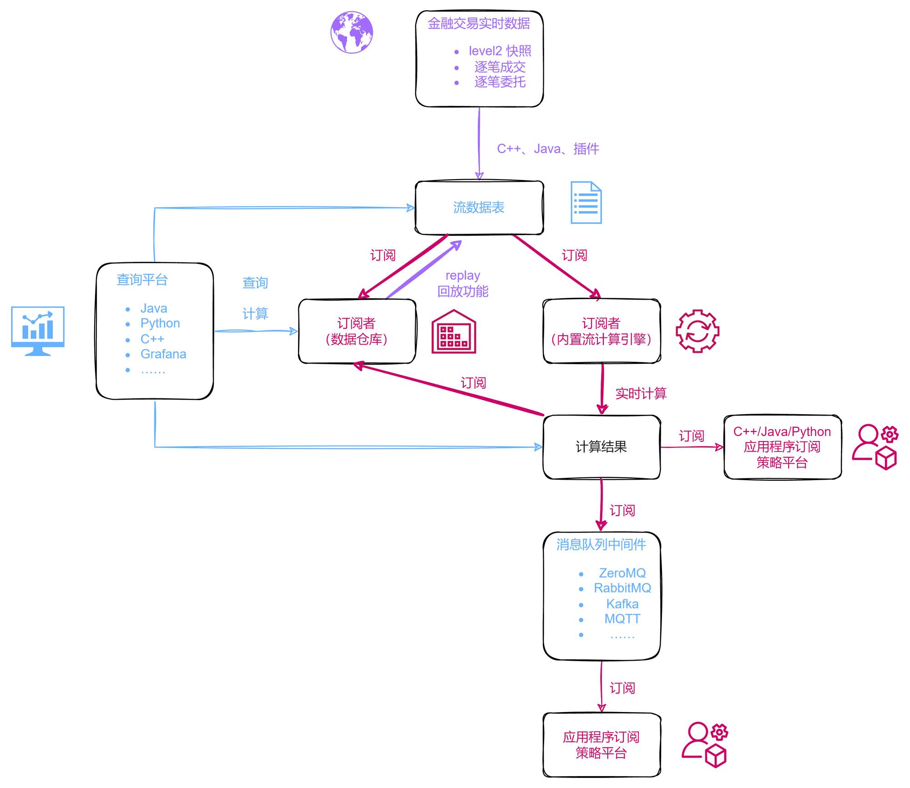
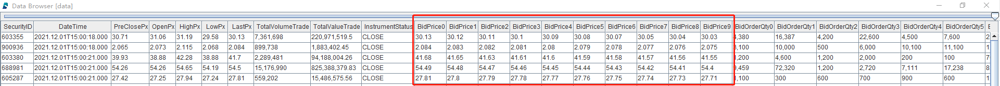
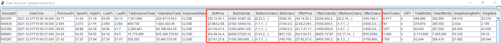
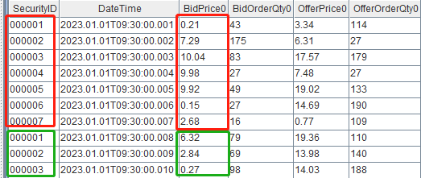
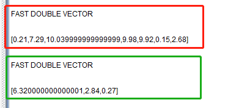
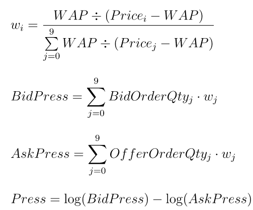
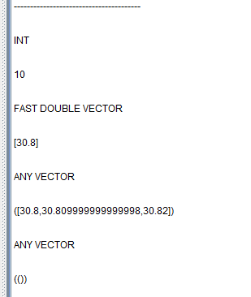

# 金融因子流式实现

DolphinDB 是一款高性能分布式时序数据库。与传统的关系数据库和常见的时序数据库不同，DolphinDB 不仅提供了高速存取时序数据的基本功能，而且内置了向量化的多范式编程语言与强大的计算引擎。DolphinDB 的计算引擎不仅可以用于量化金融的回测和研发，也可以用于生产环境的实时计算，譬如各种频率的金融量化因子的流式实时计算。

- [1.1 DolphinDB 流计算框架](#11-dolphindb-流计算框架)
- [1.2 数据结构](#12-数据结构)
- [2.1 实现示例](#21-实现示例)
	- [**2.1.1 WorldQuant Alpha 1**](#211-worldquant-alpha-1)
	- [**2.1.2 国泰君安 001 因子**](#212-国泰君安-001-因子)
- [2.2 改写规则](#22-改写规则)
- [2.3 注意事项](#23-注意事项)
- [3.1 实现示例](#31-实现示例)
	- [**3.1.1 价格涨跌幅**](#311-价格涨跌幅)
	- [**3.1.2 加权平均价格**](#312-加权平均价格)
- [3.2 无状态函数和状态函数](#32-无状态函数和状态函数)
	- [**3.2.1 无状态函数**](#321-无状态函数)
	- [**3.2.2 状态函数**](#322-状态函数)
	- [**3.2.3 状态和无状态的拆分**](#323-状态和无状态的拆分)
- [3.3 if-else](#33-if-else)
- [3.4 历史数据访问（窗口计算和迭代）](#34-历史数据访问窗口计算和迭代)
- [3.5 循环](#35-循环)
- [4.1 数组向量 (array vector)](#41-数组向量-array-vector)
- [4.2 即时编译(JIT)](#42-即时编译jit)
- [4.3 性能测试](#43-性能测试)


# 1. 概述

## 1.1 DolphinDB 流计算框架

DolphinDB 内置的流数据框架支持流数据的发布，订阅，预处理，实时内存计算，复杂指标的滚动窗口计算、滑动窗口计算、累计窗口计算等，是一个运行高效、使用便捷的流数据处理框架。



本教程主要介绍如何在 **“流数据表 ——> 订阅者(内置流计算引擎) ——> 计算结果”** 这段过程中，利用内置流计算引擎实现金融量化因子并优化之。

DolphinDB 内置流数据引擎详情可见： [流数据引擎 — DolphinDB 2.0 文档](https://www.dolphindb.cn/cn/help/FunctionsandCommands/SeriesOfFunctions/streamingEngine.html)

## 1.2 数据结构

本教程中的代码基于上交所 level 2 行情的日 K 线，逐笔成交，快照数据进行调试。

测试数据在 DolphinDB 中存储的表结构如下：

**（1）日 K 线**

| **字段名称** | **数据说明** | **字段**  | **含义**                 |
| :----------- | :----------- | :-------- | :----------------------- |
| securityID   | 证券代码     | lastPx    | 收盘价                   |
| dateTime     | 日期时间     | volume    | 成交量                   |
| preClosePx   | 昨收价       | amount    | 成交金额                 |
| openPx       | 开始价       | iopv      | 净值估值                 |
| highPx       | 最高价       | fp_Volume | 盘后固定价格交易成交量   |
| lowPx        | 最低价       | fp_Amount | 盘后固定价格交易成交金额 |

**（2）逐笔成交**

| **字段名称** | **数据说明** | **字段**    | **含义**   |
| :----------- | :----------- | :---------- | :--------- |
| securityID   | 证券代码     | buyNo       | 买方订单号 |
| tradeTime    | 日期时间     | sellNo      | 卖方订单号 |
| tradePrice   | 成交价格     | tradeBSFlag | 内外盘标志 |
| tradeQty     | 成交量       | tradeIndex  | 成交序号   |
| tradeAmount  | 成交金额     | channelNo   | 成交通道   |

**（3）行情快照**

DolphinDB 提供了存储可变长二维数组的数据类型 array vector。在数据存储时，可以选择将数据类型相同且含义相近的多列存为一列。

因此，level 2 快照行情的多档数据可以选择：①多列存储；② 用 array vector 存为一列。

<figure align="left">
  
    <figcaption><b>多档多列存储，共194列</b></figcaption>
</figure>

<figure align="left">
  
    <figcaption><b>array vector 存储，共42列</b></figcaption>
</figure>


| **字段名称（多档多列）**           | **字段名称（array vector）** | **数据说明**         |
| :--------------------------------- | :--------------------------- | :------------------- |
| securityID                         | securityID                   | 证券代码             |
| dateTime                           | dateTime                     | 日期时间             |
| preClosePx                         | preClosePx                   | 昨收价               |
| openPx                             | openPx                       | 开始价               |
| highPx                             | highPx                       | 最高价               |
| lowPx                              | lowPx                        | 最低价               |
| lastPx                             | lastPx                       | 最新价               |
| totalVolumeTrade                   | totalVolumeTrade             | 成交总量             |
| totalValueTrade                    | totalValueTrade              | 成交总金额           |
| instrumentStatus                   | instrumentStatus             | 交易状态             |
| bidPrice0 .. bidPrice9             | bidPrice                     | 申买十价             |
| bidOrderQty0 .. bidOrderQty0       | bidOrderQty                  | 申买十量             |
| bidNumOrders0 .. bidNumOrders9     | bidNumOrders                 | 申买十实际总委托笔数 |
| bidOrders0 .. bidOrders49          | bidOrders                    | 申买一前 50 笔订单   |
| offerPrice0 .. offerPrice9         | offerPrice                   | 申卖十价             |
| offerOrderQty0 .. offerOrderQty9   | offerOrderQty                | 申卖十量             |
| offerNumOrders0 .. offerNumOrders9 | offerNumOrders               | 申卖十实际总委托笔数 |
| offerOrders0 .. offerOrders49      | offerOrders                  | 申卖一前 50 笔订单   |
| numTrades                          | numTrades                    | 成交笔数             |
| iopv                               | iopv                         | ETF 净值估值         |
| totalBidQty                        | totalBidQty                  | 委托买入总量         |
| totalOfferQty                      | totalOfferQty                | 委托卖出总量         |
| weightedAvgBidPx                   | weightedAvgBidPx             | 加权平均委买价格     |
| weightedAvgOfferPx                 | weightedAvgOfferPx           | 加权平均委卖价格     |
| totalBidNumber                     | totalBidNumber               | 买入总笔数           |
| totalOfferNumber                   | totalOfferNumber             | 卖出总笔数           |
| bidTradeMaxDuration                | bidTradeMaxDuration          | 买入成交最大等待时间 |
| offerTradeMaxDuration              | offerTradeMaxDuration        | 买入成交最大等待时间 |
| numBidOrders                       | numBidOrders                 | 买方委托价位数       |
| numOfferOrders                     | numOfferOrders               | 卖方委托价位数       |
| withdrawBuyNumber                  | withdrawBuyNumber            | 买入撤单笔数         |
| withdrawBuyAmount                  | withdrawBuyAmount            | 买入撤单数量         |
| withdrawBuyMoney                   | withdrawBuyMoney             | 买入撤单金额         |
| withdrawSellNumber                 | withdrawSellNumber           | 卖出撤单笔数         |
| withdrawSellAmount                 | withdrawSellAmount           | 卖出撤单数量         |
| withdrawSellMoney                  | withdrawSellMoney            | 卖出撤单金额         |
| etfBuyNumber                       | etfBuyNumber                 | ETF 申购笔数         |
| etfBuyAmount                       | etfBuyAmount                 | ETF 申购数量         |
| etfBuyMoney                        | etfBuyMoney                  | ETF 申购金额         |
| etfSellNumber                      | etfSellNumber                | ETF 赎回笔数         |
| etfSellAmount                      | etfSellAmount                | ETF 赎回数量         |
| etfSellMoney                       | etfSellMoney                 | ETF 赎回金额         |


# 2. 日频因子流式实现

DolphinDB 内置的流计算引擎有时间序列引擎，响应式状态引擎，横截面引擎等。在实际场景下，复杂的因子可能涉及横截面、历史状态、时序窗口三种逻辑，需要多个引擎级联才能实现因子逻辑。

为了提高转写效率，DolphinDB 提供了一个 [**引擎流水线解析器（Stream Engine Parser）**](https://www.dolphindb.cn/cn/help/FunctionsandCommands/FunctionReferences/s/streamEngineParser.html?highlight=streamengineparser)可以自动解析并创建引擎流水线，使得用户无需编写复杂的级联代码。因此复杂日频因子的实时流计算一般考虑使用 **引擎流水线解析器** 来实现。

DolphinDB 目前已经实现了 [WorldQuant 101 Alpha 因子库](https://gitee.com/dolphindb/DolphinDBModules/blob/master/wq101alpha/README_CN.md#worldquant-101-alpha-因子指标库-) 和 [国泰君安 191 Alphas 因子库](https://gitee.com/dolphindb/DolphinDBModules/blob/master/gtja191Alpha/README_CN.md#/dolphindb/DolphinDBModules/blob/master/gtja191Alpha/src/gtja191Alpha.dos) 两个因子库内的函数，分别封装在 wq101alpha.dos 和 gtja191Alpha.dos 模块中。这两个模块实现了批流一体，用户可以方便地通过函数 `streamEngineParser` 实现模块中日频因子的流式计算。

## 2.1 实现示例

以 WorldQuant Alpha 101 和国泰君安 191 中的因子为例，说明日频因子流式实现方法。

### **2.1.1 WorldQuant Alpha 1**

- **因子计算逻辑（**[**Alpha001**](https://www.joinquant.com/data/dict/alpha101#alpha001)**）**：

*(rank(Ts_ArgMax(SignedPower(((returns < 0) ? stddev(returns, 20) : close), 2.), 5)) - 0.5)*

- **DolphinDB 实现代码**：

```
def wqAlpha1(close){
    ts = mimax(pow(iif(ratios(close) - 1 < 0, mstd(ratios(close) - 1, 20), close), 2.0), 5)
    return rowRank(X=ts, percent=true) - 0.5
}
```

- **实时流计算**：

```
// 定义输入输出的表结构
colName = `securityID`dateTime`preClosePx`openPx`highPx`lowPx`lastPx`volume`amount`iopv`fp_Volume`fp_Amount
colType = ["SYMBOL","TIMESTAMP","DOUBLE","DOUBLE","DOUBLE","DOUBLE","DOUBLE","INT","DOUBLE","DOUBLE","INT","DOUBLE"]
inputTable = table(1:0, colName, colType)
resultTable = table(10000:0, ["dateTime", "securityID", "factor"], [TIMESTAMP, SYMBOL, DOUBLE])

// 使用 streamEngineParser 创建引擎流水线
try{ dropStreamEngine("alpha1Parser0")} catch(ex){ print(ex) }
try{ dropStreamEngine("alpha1Parser1")} catch(ex){ print(ex) }
metrics = <[securityid, wqAlpha1(preClosePx)]>
streamEngine = streamEngineParser(name="alpha1Parser", metrics=metrics, dummyTable=inputTable, outputTable=resultTable, keyColumn="securityID", timeColumn=`dateTime, triggeringPattern='keyCount', triggeringInterval=3000)

// 查看引擎
getStreamEngineStat()
/*
ReactiveStreamEngine->
name          user  status lastErrMsg numGroups numRows numMetrics memoryInUsed snapshotDir ...
------------- ----- ------ ---------- --------- ------- ---------- ------------ ----------- 
alpha1Parser0 admin OK                0         0       2          13392                    ...

CrossSectionalEngine->
name         user  status lastErrMsg numRows numMetrics metrics      triggering...triggering......
------------ ----- ------ ---------- ------- ---------- ------------ --------------- --------------- ---
alpha1Parser1admin OK                0       2          securityid...keyCount     3000         ...
*/
```

上述代码创建了一个名为 “alpha1Parser” 的引擎流水线。通过 `getStreamEngineStat` 函数可以观察到，该引擎流水线由一个名为 “alpha1Parser0” 的响应式状态引擎和一个名为 “alpha1Parser1” 的横截面引擎组成。

其中 securityID 作为分组键，dateTime 是时间列，输入的消息格式同内存表 `inputTable`，需要计算的指标定义在 `metrics` 里，结果输出到内存表 `resultTable` 中。横截面数据计算的触发方式是 keyCount，即当前时间的数据累积超过 3000 条或者新时间点的数据到来才会触发一次计算。

创建完引擎之后，即可往引擎中插入几条数据，并观察计算结果。

```
// 向引擎添加数据
insert into streamEngine values(`000001, 2023.01.01, 30.85, 30.90, 31.65, 30.55, 31.45, 100, 3085, 0, 0, 0)
insert into streamEngine values(`000002, 2023.01.01, 30.86, 30.55, 31.35, 29.85, 30.75, 120, 3703.2, 0, 0, 0)
insert into streamEngine values(`000001, 2023.01.02, 30.80, 30.95, 31.05, 30.05, 30.85, 200, 6160, 0, 0, 0)
insert into streamEngine values(`000002, 2023.01.02, 30.81, 30.99, 31.55, 30.15, 30.65, 180, 5545.8, 0, 0, 0)
insert into streamEngine values(`000001, 2023.01.03, 30.83, 31.00, 31.35, 30.35, 30.55, 230, 7090.9, 0, 0, 0)
insert into streamEngine values(`000002, 2023.01.03, 30.89, 30.85, 31.10, 30.00, 30.45, 250, 7722.5, 0, 0, 0)
insert into streamEngine values(`000001, 2023.01.04, 30.90, 30.86, 31.10, 30.40, 30.75, 300, 9270, 0, 0, 0)
insert into streamEngine values(`000002, 2023.01.04, 30.85, 30.95, 31.65, 30.55, 31.45, 270, 8329.5, 0, 0, 0)
insert into streamEngine values(`000001, 2023.01.05, 30.86, 30.55, 31.35, 29.85, 30.75, 360, 11109.6, 0, 0, 0)
insert into streamEngine values(`000002, 2023.01.05, 30.80, 30.95, 31.05, 30.05, 30.85, 200, 6160, 0, 0, 0)
insert into streamEngine values(`000001, 2023.01.06, 30.81, 30.99, 31.55, 30.15, 30.65, 180, 5545.8, 0, 0, 0)
insert into streamEngine values(`000002, 2023.01.06, 30.83, 31.00, 31.35, 30.35, 30.55, 230, 7090.9, 0, 0, 0)
insert into streamEngine values(`000001, 2023.01.07, 30.89, 30.85, 31.10, 30.00, 30.45, 250, 7722.5, 0, 0, 0)
insert into streamEngine values(`000002, 2023.01.07, 30.90, 30.86, 31.10, 30.40, 30.75, 300, 9270, 0, 0, 0)
insert into streamEngine values(`000001, 2023.01.08, 30.89, 30.85, 31.10, 30.00, 30.45, 250, 7722.5, 0, 0, 0)
insert into streamEngine values(`000002, 2023.01.08, 30.90, 30.86, 31.10, 30.40, 30.75, 300, 9270, 0, 0, 0)

// 查看结果
select factor from resultTable pivot by dateTime, securityID
/*
dateTime                000001 000002
----------------------- ------ ------
2023.01.01T00:00:00.000              
2023.01.02T00:00:00.000              
2023.01.03T00:00:00.000              
2023.01.04T00:00:00.000              
2023.01.05T00:00:00.000 0.5    0     
2023.01.06T00:00:00.000 0.5    0     
2023.01.07T00:00:00.000 0      0.5   
*/
```

 

### **2.1.2 国泰君安 001 因子**

- **因子计算逻辑（**[**国泰君安001因子**](https://www.joinquant.com/data/dict/alpha191#alpha001)**）**：

*(-1 \* CORR(RANK(DELTA(LOG(VOLUME),1)),RANK(((CLOSE-OPEN)/OPEN)),6)*

- **DolphinDB 实现代码**：

```
def gtjaAlpha1(open, close, vol){
	delta = deltas(log(vol)) 
    return -1 * (mcorr(rowRank(delta, percent=true), rowRank((close - open) \ open, percent=true), 6))
}
```

- **实时流计算**：

```
// 定义输入输出的表结构
colName = `securityID`dateTime`preClosePx`openPx`highPx`lowPx`lastPx`volume`amount`iopv`fp_Volume`fp_Amount
colType = ["SYMBOL","TIMESTAMP","DOUBLE","DOUBLE","DOUBLE","DOUBLE","DOUBLE","INT","DOUBLE","DOUBLE","INT","DOUBLE"]
inputTable = table(1:0, colName, colType)
resultTable = table(10000:0, ["securityID", "dateTime", "factor"], [SYMBOL, TIMESTAMP, DOUBLE])

// 使用 streamEngineParser 创建引擎流水线
try{ dropStreamEngine("gtja1Parser0")} catch(ex){ print(ex) }
try{ dropStreamEngine("gtja1Parser1")} catch(ex){ print(ex) }
try{ dropStreamEngine("gtja1Parser2")} catch(ex){ print(ex) }
metrics = <[gtjaAlpha1(openPx, preClosePx, volume)]>
streamEngine = streamEngineParser(name="gtja1Parser", metrics=metrics, dummyTable=inputTable, outputTable=resultTable, keyColumn="securityID", timeColumn=`dateTime, triggeringPattern='keyCount', triggeringInterval=3000)

// 查看引擎
getStreamEngineStat()
/*
ReactiveStreamEngine->
name         user  status lastErrMsg numGroups numRows numMetrics memoryInUsed snapshotDir ...
------------ ----- ------ ---------- --------- ------- ---------- ------------ ----------- 
gtja1Parser0 admin OK                0         0       4          808                      ...
gtja1Parser2 admin OK                0         0       2          872                      ...

CrossSectionalEngine->
name         user  status lastErrMsg numRows numMetrics metrics      triggering...triggering......
------------ ----- ------ ---------- ------- ---------- ------------ --------------- --------------- ---
gtja1Parser1 admin OK                0       3          securityID...keyCount     3000         ...
*/
```

上述代码创建了一个名为 “gtja1Parser” 的引擎流水线。通过 `getStreamEngineStat` 函数可以观察到，该引擎流水线由一个名为 “gtja1Parser0” 的响应式状态引擎，一个名为 “gtja1Parser1” 的横截面引擎和一个名为 “gtja1Parser2” 的响应式状态引擎组成。

其中 securityID 作为分组键，dateTime 是时间列，输入的消息格式同内存表 `inputTable`，需要计算的指标定义在 `metrics` 里，结果输出到内存表 `resultTable` 中。横截面数据计算的触发方式是 keyCount，即当前时间的数据累积超过 3000 条或者新时间点的数据到来才会触发一次计算。

创建完引擎之后，即可往引擎中插入几条数据，并观察计算结果。

```
// 向引擎添加数据
insert into streamEngine values(`000001, 2023.01.01, 30.85, 30.90, 31.65, 30.55, 31.45, 100, 3085, 0, 0, 0)
insert into streamEngine values(`000002, 2023.01.01, 30.86, 30.55, 31.35, 29.85, 30.75, 120, 3703.2, 0, 0, 0)
insert into streamEngine values(`000001, 2023.01.02, 30.80, 30.95, 31.05, 30.05, 30.85, 200, 6160, 0, 0, 0)
insert into streamEngine values(`000002, 2023.01.02, 30.81, 30.99, 31.55, 30.15, 30.65, 180, 5545.8, 0, 0, 0)
insert into streamEngine values(`000001, 2023.01.03, 30.83, 31.00, 31.35, 30.35, 30.55, 230, 7090.9, 0, 0, 0)
insert into streamEngine values(`000002, 2023.01.03, 30.89, 30.85, 31.10, 30.00, 30.45, 250, 7722.5, 0, 0, 0)
insert into streamEngine values(`000001, 2023.01.04, 30.90, 30.86, 31.10, 30.40, 30.75, 300, 9270, 0, 0, 0)
insert into streamEngine values(`000002, 2023.01.04, 30.85, 30.95, 31.65, 30.55, 31.45, 270, 8329.5, 0, 0, 0)
insert into streamEngine values(`000001, 2023.01.05, 30.86, 30.55, 31.35, 29.85, 30.75, 360, 11109.6, 0, 0, 0)
insert into streamEngine values(`000002, 2023.01.05, 30.80, 30.95, 31.05, 30.05, 30.85, 200, 6160, 0, 0, 0)
insert into streamEngine values(`000001, 2023.01.06, 30.81, 30.99, 31.55, 30.15, 30.65, 180, 5545.8, 0, 0, 0)
insert into streamEngine values(`000002, 2023.01.06, 30.83, 31.00, 31.35, 30.35, 30.55, 230, 7090.9, 0, 0, 0)
insert into streamEngine values(`000001, 2023.01.07, 30.89, 30.85, 31.10, 30.00, 30.45, 250, 7722.5, 0, 0, 0)
insert into streamEngine values(`000002, 2023.01.07, 30.90, 30.86, 31.10, 30.40, 30.75, 300, 9270, 0, 0, 0)
insert into streamEngine values(`000001, 2023.01.08, 30.89, 30.85, 31.10, 30.00, 30.45, 250, 7722.5, 0, 0, 0)
insert into streamEngine values(`000002, 2023.01.08, 30.90, 30.86, 31.10, 30.40, 30.75, 300, 9270, 0, 0, 0)

// 查看结果
select factor from resultTable pivot by dateTime, securityID
/*
dateTime                000001 000002            
----------------------- ------ ------------------
2023.01.01T00:00:00.000                          
2023.01.02T00:00:00.000                          
2023.01.03T00:00:00.000                          
2023.01.04T00:00:00.000                          
2023.01.05T00:00:00.000                          
2023.01.06T00:00:00.000 -1     -1
2023.01.07T00:00:00.000 -1     -1          
*/
```


## 2.2 改写规则

在 DolphinDB 中，内置了各种流计算引擎来实现因子的流式计算。其中很重要的一步就是将因子计算逻辑转写成引擎能够正确解析并执行的函数，即改写成引擎能够识别分解的 metrics。

- **streamEngineParser 的 metrics 的解析规则如下**：

① [行计算系列（row 系列）](https://www.dolphindb.cn/cn/help/FunctionsandCommands/SeriesOfFunctions/rowFunctions.html)的函数会被分发给横截面引擎进行计算，所以涉及横截面计算的逻辑需要使用 row 系列函数。如果没有对应的 row 系列的函数，用户可以通过高阶函数 `byRow` 自行实现逐行计算的逻辑。

② [rolling](https://www.dolphindb.cn/cn/help/200/Functionalprogramming/TemplateFunctions/rolling.html) 函数会被分发给时序聚合引擎进行计算，所以涉及时序窗口的计算需要使用 `rolling` 函数。

③ 其余所有计算会被分发给响应式状态引擎进行计算。响应式状态引擎因子的具体转写注意事项可以**参见[第3章节](#3-高频因子流式实现)。**

以 [2.1.2 章节](#212-国泰君安-001-因子)的国泰君安 191 的 1 号因子为例说明上述解析规则。

```
def gtjaAlpha1(open, close, vol){
	delta = deltas(log(vol)) 
    return -1 * (mcorr(rowRank(delta, percent=true), rowRank((close - open) \ open, percent=true), 6))
}
```

其中 `delta = deltas(log(vol))` 不属于 row 系列函数，也不是调用 `rolling` 函数，会被分发到响应式状态引擎进行计算；`rowRank(delta, percent=true)` 和 `rowRank((close - open) \ open, percent=true)` 调用了 `rowRank` 函数，会被分发到横截面引擎进行计算；`-1 * (mcorr(..., ..., 6))` 不属于 row 系列函数，也不是调用 `rolling` 函数，会被分发到响应式状态引擎进行计算。

结合 `getStreamEngineStat()` 函数返回的结果可以得出整个引擎流水线的计算过程如下：输入数据首先传入名为 “gtja1Parser0” 的响应式状态引擎；“gtja1Parser0” 计算 `delta = deltas(log(vol))` 后将计算结果输出到名为 “gtja1Parser1” 的横截面引擎；“gtja1Parser1”  计算 `rowRank(delta, percent=true)` 和 `rowRank((close - open) \ open, percent=true)` 后将计算结果输出到名为 “gtja1Parser2” 的响应式状态引擎；“gtja1Parser2” 计算 `-1 * (mcorr(..., ..., 6))` 后将计算结果输出到结果表 `resultTable`。

## 2.3 注意事项

（1）横截面引擎的 *timeColumn* 参数只支持 TIMESTAMP 类型。

 （2）因为不同引擎的输出表的各列顺序不同，所以输出表结构的定义需要根据因子的最后一步逻辑来决定。

- 时序聚合引擎：输出表的各列的顺序为：时间列，分组列，计算结果列。
- 响应式状态引擎：输出表的各列的顺序为：分组列，时间列，计算结果列。（响应式状态引擎的输出表中时间列不是必须的，但是因为时间序列聚合引擎以及横截面引擎的输入输出表需包含时间列，所以流水线中的响应式状态引擎输出时会自动增加时间列。）
- 横截面引擎：输出表的各列的顺序为：时间列，分组列 (contextByColumn)，计算结果列。

以 [2.1.1 章节](#211-worldquant-alpha-1)的 WorldQuant Alpha 101 的 1 号因子为例，最后一步计算是 `rowRank(...) - 0.5` 会被分发到横截面引擎内进行计算，所以结果输出表的各列的顺序为：时间列，分组列，计算结果列，即需要定义为 `["dateTime", "securityID", "factor"]`。

以 2.1.2 章节的国泰君安191的 1 号因子为例，最后一步计算是 `-1 * mcorr(...)` 会被分发到响应式状态引擎内计算，所以结果输出表的各列的顺序应该为：分组列，时间列，计算结果列，即定义为 `["securityID", "dateTime", "factor"]`。

# 3. 高频因子流式实现 

响应式状态引擎里注入的每一条数据都会触发一次计算，产生一条结果。高频因子的实时流计算一般可以考虑使用 **响应式状态引擎**（[**createReactiveStateEngine**](https://www.dolphindb.cn/cn/help/FunctionsandCommands/FunctionReferences/c/createReactiveStateEngine.html)）来实现。

## 3.1 实现示例

### **3.1.1 价格涨跌幅**

下面以基于逐笔成交数据计算价格涨跌幅为例，说明高频因子流式实现方法。

- **因子计算逻辑（价格涨跌幅）**：

*tradePrice[i] / tradePrice0[i-lag] - 1*

- **DolphinDB 实现代码**：

```
@state
def pricePercentChange(price, lag){
    return price \ move(price, lag) - 1
}
```

- **实时流计算**：

```
// 定义输入输出的表结构
inputTable = table(1:0, `securityID`tradeTime`tradePrice`tradeQty`tradeAmount`buyNo`sellNo`tradeBSFlag`tradeIndex`channelNo, [SYMBOL,DATETIME,DOUBLE,INT,DOUBLE,LONG,LONG,SYMBOL,INT,INT])
resultTable = table(10000:0, ["securityID", "tradeTime", "factor"], [SYMBOL, TIMESTAMP, DOUBLE])

// 使用 createReactiveStateEngine 创建响应式状态引擎
try{ dropStreamEngine("reactiveDemo")} catch(ex){ print(ex) }
metrics = <[tradeTime, pricePercentChange(tradePrice, 1)]>
rse = createReactiveStateEngine(name="reactiveDemo", metrics =metrics, dummyTable=inputTable, outputTable=resultTable, keyColumn="securityID")
```

上述代码创建了一个名为 “reactiveDemo” 响应式状态引擎，其中 securityID 作为分组键，输入的消息格式同内存表 `inputTable`，需要计算的指标定义在 `metrics` 里，结果输出到内存表 `resultTable` 中。

创建完引擎之后，即可往引擎中插入几条数据，并观察计算结果。

```
// 输入数据
insert into rse values(`000155, 2020.01.01T09:30:00, 30.85, 100, 3085, 4951, 0, `B, 1, 1)
insert into rse values(`000155, 2020.01.01T09:30:01, 30.86, 100, 3086, 4951, 1, `B, 2, 1)
insert into rse values(`000155, 2020.01.01T09:30:02, 30.80, 200, 6160, 5501, 5600, `S, 3, 1)

// 查看结果
select * from resultTable
/*
securityID tradeTime               factor            
---------- ----------------------- ------------------
000155     2020.01.01T09:30:00.000                   
000155     2020.01.01T09:30:01.000 0.0003
000155     2020.01.01T09:30:02.000 -0.001944
*/
```

### **3.1.2 加权平均价格**

下面以基于快照行情数据计算加权平均价格为例，说明高频因子流式实现方法。

- **因子计算逻辑（加权平均价格）**：

*wap = (bidPrice0\*offerOrderQty0 + offerPrice0\*bidOrderQty0) / (offerOrderQty0+bidOrderQty0)*

- **DolphinDB 实现代码**：

```
def weightedAveragedPrice(bidPrice0, bidOrderQty0, offerPrice0, offerOrderQty0){
    return (bidPrice0*offerOrderQty0 + offerPrice0*bidOrderQty0) \ (offerOrderQty0+bidOrderQty0)
}
```

- **实时流计算**：

```
// 定义输入输出的表结构
colName = ["securityID","dateTime","preClosePx","openPx","highPx","lowPx","lastPx","totalVolumeTrade","totalValueTrade","instrumentStatus"] <- flatten(eachLeft(+, ["bidPrice","bidOrderQty","bidNumOrders"], string(0..9))) <- ("bidOrders"+string(0..49)) <- flatten(eachLeft(+, ["offerPrice","offerOrderQty","offerNumOrders"], string(0..9))) <- ("offerOrders"+string(0..49)) <- ["numTrades","iopv","totalBidQty","totalOfferQty","weightedAvgBidPx","weightedAvgOfferPx","totalBidNumber","totalOfferNumber","bidTradeMaxDuration","offerTradeMaxDuration","numBidOrders","numOfferOrders","withdrawBuyNumber","withdrawBuyAmount","withdrawBuyMoney","withdrawSellNumber","withdrawSellAmount","withdrawSellMoney","etfBuyNumber","etfBuyAmount","etfBuyMoney","etfSellNumber","etfSellAmount","etfSellMoney"]
colType = ["SYMBOL","TIMESTAMP","DOUBLE","DOUBLE","DOUBLE","DOUBLE","DOUBLE","INT","DOUBLE","SYMBOL"] <- take("DOUBLE", 10) <- take("INT", 70)<- take("DOUBLE", 10) <- take("INT", 70) <- ["INT","DOUBLE","INT","INT","DOUBLE","DOUBLE","INT","INT","INT","INT","INT","INT","INT","INT","DOUBLE","INT","INT","DOUBLE","INT","INT","DOUBLE","INT","INT","DOUBLE"]
resultTable = table(10000:0, ["securityID", "dateTime", "factor"], [SYMBOL, TIMESTAMP, DOUBLE])
inputTable = table(1:0, colName, colType)

// 使用 createReactiveStateEngine 创建响应式状态引擎
try{ dropStreamEngine("reactiveDemo")} catch(ex){ print(ex) }
metrics = <[dateTime, weightedAveragedPrice(bidPrice0, bidOrderQty0, offerPrice0, offerOrderQty0)]>
rse = createReactiveStateEngine(name="reactiveDemo", metrics =metrics, dummyTable=inputTable, outputTable=resultTable, keyColumn="securityID")
```

上述代码创建了一个名为 “reactiveDemo” 响应式状态引擎，其中 securityID 作为分组键，输入的消息格式同内存表 `inputTable`，需要计算的指标定义在 `metrics` 里，结果输出到内存表 `resultTable` 中。

创建完引擎之后，即可往引擎中插入几条数据，并观察计算结果。

```
// 输入数据
tableInsert(rse, {"securityID":"000001", "dateTime":2023.01.01T09:30:00.000, "bidPrice0":19.98, "bidOrderQty0":100, "offerPrice0":19.99, "offerOrderQty0":120})
tableInsert(rse, {"securityID":"000001", "dateTime":2023.01.01T09:30:03.000, "bidPrice0":19.95, "bidOrderQty0":130, "offerPrice0":19.93, "offerOrderQty0":120})
tableInsert(rse, {"securityID":"000001", "dateTime":2023.01.01T09:30:06.000, "bidPrice0":19.97, "bidOrderQty0":120, "offerPrice0":19.98, "offerOrderQty0":130})

// 查看结果
select * from resultTable
/*
securityID dateTime                factor            
---------- ----------------------- ------------------
000001     2023.01.01T09:30:00.000 19.9845 
000001     2023.01.01T09:30:03.000 19.9396
000001     2023.01.01T09:30:06.000 19.9748
*/
```

从上面的实现示例可以发现，通过响应式状态引擎可以方便快速地实现高频因子的流式计算。其中很重要的一步就是将因子计算逻辑转写成引擎能够正确解析并执行的函数，即改写成引擎能够识别分解的 metrics。

下面将重点介绍如何将 **“因子计算逻辑”** 转写为适配响应式状态引擎 **“DDB 实现代码”**，以及转写过程中的一些注意事项。

## 3.2 无状态函数和状态函数

### **3.2.1 无状态函数**

无状态函数是指不需要回溯历史数据，仅根据当前时刻传入的参数即可获得计算结果的函数。适合封装不依赖历史数据的计算逻辑。比如 [3.1.2 章节](#312-加权平均价格)中的加权平均价格。

:note: **注意**：

如果在  `createReactiveStateEngine` 里面指定了 *keyColumn* 参数，则响应式状态引擎内会进行分组计算。以 `keyColumn="securityID"` 为例，引擎内会根据股票代码分组计算。那么对于同一个股票代码的数据，引擎内会逐条计算；但对于不同股票代码的数据，无状态函数在引擎内会采取向量化计算。所以传入无状态函数的参数都是向量。

下面在 3.1.2 章节的加权平均价格的基础上说明这个情况：

修改因子函数，增加 `print` 语句，观察传入的变量 *bidPrice0*。

```
def weightedAveragedPrice(bidPrice0, bidOrderQty0, offerPrice0, offerOrderQty0){
    print(typestr(bidPrice0))   // 查看 bidPrice0 的数据类型
    print(bidPrice0)            // 查看 bidPrice0 值
    return (bidPrice0*offerOrderQty0 + offerPrice0*bidOrderQty0) \ (offerOrderQty0+bidOrderQty0)
}

metrics = <[dateTime, weightedAveragedPrice(bidPrice0, bidOrderQty0, offerPrice0, offerOrderQty0)]>
```

构造一批输入引擎的数据。（这批数据总共 10 条，包含 7 个不同的标的，3个重复的标的）

```
setRandomSeed(9)
n = 10
securityID = take(lpad(string(1..7), 6, "0"), n)
dateTime = 2023.01.01T09:30:00.000 + 1..n
bidPrice0 = round(rand(20.0, n), 2)
bidOrderQty0 = rand(200, n)
offerPrice0 = round(rand(20.0, n), 2)
offerOrderQty0 = rand(200, n)
testData = table(securityID, dateTime, bidPrice0, bidOrderQty0, offerPrice0, offerOrderQty0)
```



构建响应式状态引擎，并输入这批数据：

```
// 定义输入输出的表结构
colName = ["securityID","dateTime","preClosePx","openPx","highPx","lowPx","lastPx","totalVolumeTrade","totalValueTrade","instrumentStatus"] <- flatten(eachLeft(+, ["bidPrice","bidOrderQty","bidNumOrders"], string(0..9))) <- ("bidOrders"+string(0..49)) <- flatten(eachLeft(+, ["offerPrice","offerOrderQty","offerNumOrders"], string(0..9))) <- ("offerOrders"+string(0..49)) <- ["numTrades","iopv","totalBidQty","totalOfferQty","weightedAvgBidPx","weightedAvgOfferPx","totalBidNumber","totalOfferNumber","bidTradeMaxDuration","offerTradeMaxDuration","numBidOrders","numOfferOrders","withdrawBuyNumber","withdrawBuyAmount","withdrawBuyMoney","withdrawSellNumber","withdrawSellAmount","withdrawSellMoney","etfBuyNumber","etfBuyAmount","etfBuyMoney","etfSellNumber","etfSellAmount","etfSellMoney"]
colType = ["SYMBOL","TIMESTAMP","DOUBLE","DOUBLE","DOUBLE","DOUBLE","DOUBLE","INT","DOUBLE","SYMBOL"] <- take("DOUBLE", 10) <- take("INT", 70)<- take("DOUBLE", 10) <- take("INT", 70) <- ["INT","INT","INT","INT","DOUBLE","DOUBLE","INT","INT","INT","INT","INT","INT","INT","INT","DOUBLE","INT","INT","DOUBLE","INT","INT","INT","INT","INT","INT"]
inputTable = table(1:0, colName, colType)
resultTable = table(10000:0, ["securityID", "dateTime", "factor"], [SYMBOL, TIMESTAMP, DOUBLE])

// 使用 createReactiveStateEngine 创建响应式状态引擎
try{ dropStreamEngine("reactiveDemo")} catch(ex){ print(ex) }
rse = createReactiveStateEngine(name="reactiveDemo", metrics =metrics, dummyTable=inputTable, outputTable=resultTable, keyColumn="securityID")

// 输入数据
tableInsert(rse, testData.flip())
```



如上所示，传入的 *bidPrice0* 是向量，并且这一批的 10 条数据会分两次计算（前 7 条不同股票代码的数据计算一次，后 3 条数据计算一次）。

因此，转写因子的时候需要**注意参数的数据类型和函数支持的数据类型是否匹配**。

比如计算加权平均价格时，增加一层判断逻辑：若 *bidPrice0* > 0，则计算 wap；否则返回默认值 default。

```
def weightedAveragedPrice(bidPrice0, bidOrderQty0, offerPrice0, offerOrderQty0, default){
    if(bidPrice0 > 0){  return (bidPrice0*offerOrderQty0 + offerPrice0*bidOrderQty0) \ (offerOrderQty0+bidOrderQty0)}
    return default
}

metrics = <[dateTime, weightedAveragedPrice(bidPrice0, bidOrderQty0, offerPrice0, offerOrderQty0, 0.0)]>
```

如果在响应式状态引擎的 metrics 里直接调用上面的自定义函数 `weightedAveragedPrice`，会报错。因为 `if(condition){}else{}` 里面，*condition* 要求必须是一个标量，而传参 *bidPrice0* 是向量，所以会报错 “A scalar object is expected. But the actual object is a vector.”

针对这个问题，通用的解决方案是：使用 `each`/`loop` 把函数应用到向量的每个元素上。

对于上面的例子就是：`weightedAveragedPrice` 的写法不变，在 `factorWeightedAveragedPrice` 里调用 `each` 函数把函数 `weightedAveragedPrice` 应用到指定参数的每个元素上，使得传入函数的参数是标量。在 metrics 里则调用最外层的 `factorWeightedAveragedPrice` 函数。

```
def factorWeightedAveragedPrice(bidPrice0, bidOrderQty0, offerPrice0, offerOrderQty0){
    return each(weightedAveragedPrice{default=0.0}, bidPrice0, bidOrderQty0, offerPrice0, offerOrderQty0)
}

metrics = <[dateTime, factorWeightedAveragedPrice(bidPrice0, bidOrderQty0, offerPrice0, offerOrderQty0)]>
```

上述处理方法是通用方法。但对于 `if-else`， DolphinDB 里有函数 `iif` 可以替代，并且更推荐使用 [`iif`](https://www.dolphindb.cn/cn/help/FunctionsandCommands/FunctionReferences/i/iif.html?highlight=iif)。

```
def factorWeightedAveragedPrice(bidPrice0, bidOrderQty0, offerPrice0, offerOrderQty0){
    default = 0.0
    return iif(bidPrice0 > 0, (bidPrice0*offerOrderQty0 + offerPrice0*bidOrderQty0) \ (offerOrderQty0+bidOrderQty0), default)
}

metrics = <[dateTime, factorWeightedAveragedPrice(bidPrice0, bidOrderQty0, offerPrice0, offerOrderQty0)]>
```

### **3.2.2 状态函数**

状态函数是指计算中不仅用到当前数据，还会用到历史数据的函数。比如 [3.1.1 章节](#311-价格涨跌幅)中的价格涨跌幅，不仅需要当前的价格数据，还需要前 lag 条的历史价格数据。

:note: **注意**：

（1）状态函数需要用 @state 声明。

（2）状态函数内只支持赋值语句，`return` 语句和 `if-else` 语句。

其中 `if-else` 语句只支持 *condition* 是一个无关上游表格数据的标量。以 3.1.1 章节中的价格涨跌幅为例：`pricePercentChange(price, lag)` 的参数中 *price* 是上游数据表中的一列， *lag* 是另外指定的窗口大小。所以状态函数里 `if(lag>30){}` 的判断是可以的；但是 `if(price>0){}` 的判断是不行的，需要转化成 `iif` 语句 `iif(price>0, , )`。

```
// 以下写法中 price 来自上游表格，所以 price > 0 实时更新，不会是标量，这样的 if-else 暂时不支持
@state
def pricePercentChange(price, lag){
    if(price>0){
        return price \ move(price, lag) - 1
    }else{
        return 0
    }
}

// 以下写法中 lag 来自引擎定义时的额外指定，所以 lag>30 是个固定结果，是个标量，这样的 if-else 可以支持
@state
def pricePercentChange(price, lag){
    if(lag>30){
        return price \ move(price, lag) - 1
    }else{
        return price \ move(price, 30) - 1
    }
}
```

（3）状态函数支持 `rowSum`、`rowMax` 等 row 系列函数和 `cumSum`、`cumMax` 等 cum 系列函数，但不支持 `sum`、`max` 等聚合函数。如果要在状态函数里面调用 `sum` 等聚合函数，可以用 `rowSum` 等 row 系列函数替代。

比如：求当前价格和倒数第 lag 条数据的价格的最大值。（*max(tradePrice[i], tradePrice[i-lag])*）

```
// 因子实现
@state
def maxPrice(price, lag){
    return rowMax([price, move(price, lag)])
}

// 定义输入输出的表结构
inputTable = table(1:0, `securityID`tradeTime`tradePrice`TradeQty`TradeAmount`BuyNo`SellNo`TradeBSFlag`TradeIndex`ChannelNo, [SYMBOL,DATETIME,DOUBLE,INT,DOUBLE,LONG,LONG,SYMBOL,INT,INT])
resultTable = table(10000:0, ["securityID", "tradeTime", "factor"], [SYMBOL, TIMESTAMP, DOUBLE])

// 使用 createReactiveStateEngine 创建响应式状态引擎
try{ dropStreamEngine("reactiveDemo")} catch(ex){ print(ex) }
metrics = <[tradeTime, maxPrice(tradePrice, 2)]>
rse = createReactiveStateEngine(name="reactiveDemo", metrics =metrics, dummyTable=inputTable, outputTable=resultTable, keyColumn="securityID")

// 输入数据
insert into rse values(`000155, 2020.01.01T09:30:00, 30.85, 100, 3085, 4951, 0, `B, 1, 1)
insert into rse values(`000155, 2020.01.01T09:30:01, 30.86, 100, 3086, 4951, 1, `B, 2, 1)
insert into rse values(`000155, 2020.01.01T09:30:02, 30.80, 200, 6160, 5501, 5600, `S, 3, 1)


// 查看结果
select * from resultTable
/*
securityID tradeTime               factor            
---------- ----------------------- ------------------
000155     2020.01.01T09:30:00.000 30.85
000155     2020.01.01T09:30:01.000 30.86
000155     2020.01.01T09:30:02.000 30.85
*/
```

（4）调用状态函数的自定义函数也必须是状态函数。

### **3.2.3 状态和无状态的拆分**

响应式状态引擎因子都可以用**无状态函数**和**状态函数**组合实现，其中状态和无状态的拆分是最重要的一步。

虽然有些无状态的计算在状态函数里也可以支持，比如 `rowSum` 等。但是因为无状态函数实现向量化计算，且不用保存函数和变量的状态，性能表现更好。所以不建议将所有计算都写在一个状态函数里，而是要将复杂的截面计算拆分到无状态函数中，在状态函数里只保留一些自定义函数的调用和有关历史数据的操作（比如 m 系列，tm系列， fill 相关，迭代等）。

#### 3.2.3.1 移动平均买卖压力

**因子计算逻辑**：

Step1：计算买卖压力指标（[买卖压力指标](https://gitee.com/dolphindb/Tutorials_CN/blob/master/sql_performance_optimization_wap_di_rv.md#2-指标定义)）



Step2：使用 `mavg` 计算过去 lag 行的移动平均买卖压力指标

*(press[i-lag+1]+…+press[i]) / lag*

**DDB 实现代码**：

- 用一个状态函数实现【**不建议**】

```
@state
def averagePress1(bidPrice0, bidPrice1, bidPrice2, bidPrice3, bidPrice4, bidPrice5, bidPrice6, bidPrice7, bidPrice8, bidPrice9, bidOrderQty0, bidOrderQty1, bidOrderQty2, bidOrderQty3, bidOrderQty4, bidOrderQty5, bidOrderQty6, bidOrderQty7, bidOrderQty8, bidOrderQty9, offerPrice0, offerPrice1, offerPrice2, offerPrice3, offerPrice4, offerPrice5, offerPrice6, offerPrice7, offerPrice8, offerPrice9, offerOrderQty0, offerOrderQty1, offerOrderQty2, offerOrderQty3, offerOrderQty4, offerOrderQty5, offerOrderQty6, offerOrderQty7, offerOrderQty8, offerOrderQty9, lag){
	bidPrice = fixedLengthArrayVector(bidPrice0, bidPrice1, bidPrice2, bidPrice3, bidPrice4, bidPrice5, bidPrice6, bidPrice7, bidPrice8, bidPrice9)
	bidOrderQty = fixedLengthArrayVector(bidOrderQty0, bidOrderQty1, bidOrderQty2, bidOrderQty3, bidOrderQty4, bidOrderQty5, bidOrderQty6, bidOrderQty7, bidOrderQty8, bidOrderQty9)
	offerPrice = fixedLengthArrayVector(offerPrice0, offerPrice1, offerPrice2, offerPrice3, offerPrice4, offerPrice5, offerPrice6, offerPrice7, offerPrice8, offerPrice9)
	offerOrderQty = fixedLengthArrayVector(offerOrderQty0, offerOrderQty1, offerOrderQty2, offerOrderQty3, offerOrderQty4, offerOrderQty5, offerOrderQty6, offerOrderQty7, offerOrderQty8, offerOrderQty9)
	wap = (bidPrice0*offerOrderQty0 + offerPrice0*bidOrderQty0) \ (offerOrderQty0+bidOrderQty0)
	bidPress = rowWavg(bidOrderQty, wap \ (bidPrice - wap))
	askPress = rowWavg(offerOrderQty, wap \ (offerPrice - wap))
	press = log(bidPress \ askPress)
	return mavg(press, lag, 1)
}
```

- 无状态函数+状态函数【**推荐**】

```
def calPress(bidPrice0, bidPrice1, bidPrice2, bidPrice3, bidPrice4, bidPrice5, bidPrice6, bidPrice7, bidPrice8, bidPrice9, bidOrderQty0, bidOrderQty1, bidOrderQty2, bidOrderQty3, bidOrderQty4, bidOrderQty5, bidOrderQty6, bidOrderQty7, bidOrderQty8, bidOrderQty9, offerPrice0, offerPrice1, offerPrice2, offerPrice3, offerPrice4, offerPrice5, offerPrice6, offerPrice7, offerPrice8, offerPrice9, offerOrderQty0, offerOrderQty1, offerOrderQty2, offerOrderQty3, offerOrderQty4, offerOrderQty5, offerOrderQty6, offerOrderQty7, offerOrderQty8, offerOrderQty9){
	bidPrice = fixedLengthArrayVector(bidPrice0, bidPrice1, bidPrice2, bidPrice3, bidPrice4, bidPrice5, bidPrice6, bidPrice7, bidPrice8, bidPrice9)
	bidOrderQty = fixedLengthArrayVector(bidOrderQty0, bidOrderQty1, bidOrderQty2, bidOrderQty3, bidOrderQty4, bidOrderQty5, bidOrderQty6, bidOrderQty7, bidOrderQty8, bidOrderQty9)
	offerPrice = fixedLengthArrayVector(offerPrice0, offerPrice1, offerPrice2, offerPrice3, offerPrice4, offerPrice5, offerPrice6, offerPrice7, offerPrice8, offerPrice9)
	offerOrderQty = fixedLengthArrayVector(offerOrderQty0, offerOrderQty1, offerOrderQty2, offerOrderQty3, offerOrderQty4, offerOrderQty5, offerOrderQty6, offerOrderQty7, offerOrderQty8, offerOrderQty9)
	wap = (bidPrice0*offerOrderQty0 + offerPrice0*bidOrderQty0) \ (offerOrderQty0+bidOrderQty0)
	bidPress = rowWavg(bidOrderQty, wap \ (bidPrice - wap))
	askPress = rowWavg(offerOrderQty, wap \ (offerPrice - wap))
	press = log(bidPress \ askPress)
	return press
}

@state
def averagePress2(bidPrice0, bidPrice1, bidPrice2, bidPrice3, bidPrice4, bidPrice5, bidPrice6, bidPrice7, bidPrice8, bidPrice9, bidOrderQty0, bidOrderQty1, bidOrderQty2, bidOrderQty3, bidOrderQty4, bidOrderQty5, bidOrderQty6, bidOrderQty7, bidOrderQty8, bidOrderQty9, offerPrice0, offerPrice1, offerPrice2, offerPrice3, offerPrice4, offerPrice5, offerPrice6, offerPrice7, offerPrice8, offerPrice9, offerOrderQty0, offerOrderQty1, offerOrderQty2, offerOrderQty3, offerOrderQty4, offerOrderQty5, offerOrderQty6, offerOrderQty7, offerOrderQty8, offerOrderQty9, lag){
	press = calPress(bidPrice0, bidPrice1, bidPrice2, bidPrice3, bidPrice4, bidPrice5, bidPrice6, bidPrice7, bidPrice8, bidPrice9, bidOrderQty0, bidOrderQty1, bidOrderQty2, bidOrderQty3, bidOrderQty4, bidOrderQty5, bidOrderQty6, bidOrderQty7, bidOrderQty8, bidOrderQty9, offerPrice0, offerPrice1, offerPrice2, offerPrice3, offerPrice4, offerPrice5, offerPrice6, offerPrice7, offerPrice8, offerPrice9, offerOrderQty0, offerOrderQty1, offerOrderQty2, offerOrderQty3, offerOrderQty4, offerOrderQty5, offerOrderQty6, offerOrderQty7, offerOrderQty8, offerOrderQty9)
	return mavg(press, lag, 1)
}
```

#### 3.2.3.2 性能对比

**server 版本**：2.00.9.2 2023.03.10 JIT

**测试数据量**：上交所 100 只股票的某日的 Level2 快照数据，372,208 * 194 [319 M]

**测试方案**：通过 `timer` 函数，统计从数据灌入引擎开始到所有指标计算结束的总共耗时。

**测试结果**：

| **因子转写方式**   | **耗时（ms）** |
| :----------------- | :------------- |
| 状态与无状态不拆分 | 1492.224       |
| 状态与无状态拆分   | 577.651        |

**测试脚本**：

```
// 导入测试数据
csvPath = "/hdd/hdd0/jit200ssd/server/testdata/"
colName = ["securityID","dateTime","preClosePx","openPx","highPx","lowPx","lastPx","totalVolumeTrade","totalValueTrade","instrumentStatus"] <- flatten(eachLeft(+, ["bidPrice","bidOrderQty","bidNumOrders"], string(0..9))) <- ("bidOrders"+string(0..49)) <- flatten(eachLeft(+, ["offerPrice","offerOrderQty","offerNumOrders"], string(0..9))) <- ("offerOrders"+string(0..49)) <- ["numTrades","iopv","totalBidQty","totalOfferQty","weightedAvgBidPx","weightedAvgOfferPx","totalBidNumber","totalOfferNumber","bidTradeMaxDuration","offerTradeMaxDuration","numBidOrders","numOfferOrders","withdrawBuyNumber","withdrawBuyAmount","withdrawBuyMoney","withdrawSellNumber","withdrawSellAmount","withdrawSellMoney","etfBuyNumber","etfBuyAmount","etfBuyMoney","etfSellNumber","etfSellAmount","etfSellMoney"]
colType = ["SYMBOL","TIMESTAMP","DOUBLE","DOUBLE","DOUBLE","DOUBLE","DOUBLE","INT","DOUBLE","SYMBOL"] <- take("DOUBLE", 10) <- take("INT", 70)<- take("DOUBLE", 10) <- take("INT", 70) <- ["INT","INT","INT","INT","DOUBLE","DOUBLE","INT","INT","INT","INT","INT","INT","INT","INT","DOUBLE","INT","INT","DOUBLE","INT","INT","INT","INT","INT","INT"]
data = select * from loadText(csvPath + "snapshot_100stocks_multi.csv", schema=table(colName, colType)) order by dateTime

// 定义输入输出的表结构
inputTable = table(1:0, colName, colType)
resultTable1 = table(10000:0, ["securityID", "dateTime", "factor"], [SYMBOL, TIMESTAMP, DOUBLE])
resultTable2 = table(10000:0, ["securityID", "dateTime", "factor"], [SYMBOL, TIMESTAMP, DOUBLE])

// 使用 createReactiveStateEngine 创建响应式状态引擎
// 状态函数和无状态函数不拆分
try{ dropStreamEngine("reactiveDemo1")} catch(ex){ print(ex) }
metrics1 = <[dateTime, averagePress1(bidPrice0, bidPrice1, bidPrice2, bidPrice3, bidPrice4, bidPrice5, bidPrice6, bidPrice7, bidPrice8, bidPrice9, bidOrderQty0, bidOrderQty1, bidOrderQty2, bidOrderQty3, bidOrderQty4, bidOrderQty5, bidOrderQty6, bidOrderQty7, bidOrderQty8, bidOrderQty9, offerPrice0, offerPrice1, offerPrice2, offerPrice3, offerPrice4, offerPrice5, offerPrice6, offerPrice7, offerPrice8, offerPrice9, offerOrderQty0, offerOrderQty1, offerOrderQty2, offerOrderQty3, offerOrderQty4, offerOrderQty5, offerOrderQty6, offerOrderQty7, offerOrderQty8, offerOrderQty9, 60)]>
rse1 = createReactiveStateEngine(name="reactiveDemo1", metrics =metrics1, dummyTable=inputTable, outputTable=resultTable1, keyColumn="securityID")
//状态函数和无状态函数拆分
try{ dropStreamEngine("reactiveDemo2")} catch(ex){ print(ex) }
metrics2 = <[dateTime, averagePress2(bidPrice0, bidPrice1, bidPrice2, bidPrice3, bidPrice4, bidPrice5, bidPrice6, bidPrice7, bidPrice8, bidPrice9, bidOrderQty0, bidOrderQty1, bidOrderQty2, bidOrderQty3, bidOrderQty4, bidOrderQty5, bidOrderQty6, bidOrderQty7, bidOrderQty8, bidOrderQty9, offerPrice0, offerPrice1, offerPrice2, offerPrice3, offerPrice4, offerPrice5, offerPrice6, offerPrice7, offerPrice8, offerPrice9, offerOrderQty0, offerOrderQty1, offerOrderQty2, offerOrderQty3, offerOrderQty4, offerOrderQty5, offerOrderQty6, offerOrderQty7, offerOrderQty8, offerOrderQty9, 60)]>
rse2 = createReactiveStateEngine(name="reactiveDemo2", metrics =metrics2, dummyTable=inputTable, outputTable=resultTable2, keyColumn="securityID")

// 输入数据
timer rse1.append!(data)
timer rse2.append!(data)

// 计算结果正确性验证
each(eqObj, resultTable1.values(), resultTable2.values()).all()
```

#### 3.2.3.3 注意事项

① 因为响应式状态引擎计算时的特殊处理，所以不是所有数据类型的变量都可以作为参数和返回值在状态函数和无状态函数之间传递的。状态函数和无状态函数间的参数可以是标量、向量或者数组向量 (Array Vector)，不能是元组 (ANY Vector) 等数据类型。

下面通过 print 打印从状态函数到无状态函数的参数的数据类型和数据值来说明这个现象。

```
// 因子实现
def typeTestNonStateFunc(scalar, vector, arrayVector, anyVector){
	print("---------------------------------------")
	print(typestr(scalar))
	print(scalar)
	print(typestr(vector))
	print(vector)
	print(typestr(arrayVector))
	print(arrayVector)
	print(typestr(anyVector))
	print(anyVector)
	return fixedLengthArrayVector(rowSum(arrayVector), rowAvg(arrayVector))
}

@state
def typeTestStateFunc(price1, price2, price3, lag){
	scalar = lag
	vector = price1
	arrayVector = fixedLengthArrayVector(price1, price2, price3)
	anyVector = [price1, price2, price3]
	res = typeTestNonStateFunc(scalar, vector, arrayVector, anyVector)
	sumRes = res[0]
	avgRes = res[1]
	return sumRes, avgRes, res, anyVector
}
```

其中 *lag* 是外部指定的一个定值，*price1*、*price2*、*price3* 是上游表中的三列，通过 `fixedLengthArrayVector` 可以将多个向量组装成 arrayVector，通过 `[price1, price2, price3]` 可以拼装出元组（tuple）。

```
// 定义输入输出的表结构
inputTable = table(1:0, `securityID`tradeTime`price1`price2`price3, [SYMBOL,DATETIME,DOUBLE,DOUBLE,DOUBLE])
resultTable = table(10000:0, ["securityID", "tradeTime", "sum", "avg", "sum_avg", "anyVector"], [SYMBOL, TIMESTAMP, DOUBLE, DOUBLE,DOUBLE[], DOUBLE[]])

// 使用 createReactiveStateEngine 创建响应式状态引擎
try{ dropStreamEngine("reactiveDemo")} catch(ex){ print(ex) }
metrics = <[tradeTime, typeTestStateFunc(price1, price2, price3, 10) as `sum`avg`sum_avg`anyVector]>
rse = createReactiveStateEngine(name="reactiveDemo", metrics =metrics, dummyTable=inputTable, outputTable=resultTable, keyColumn="securityID")

// 输入数据
insert into rse values(`000155, 2020.01.01T09:30:00, 30.81, 30.82, 30.83)
insert into rse values(`000155, 2020.01.01T09:30:01, 30.86, 30.87, 30.88)
insert into rse values(`000155, 2020.01.01T09:30:02, 30.80, 30.81, 30.82)

// 查看结果
select * from resultTable
/*
securityID tradeTime               sum    avg    sum_avg                 anyVector
---------- ----------------------- ------ ------ ----------------------- ---------
000155     2020.01.01T09:30:00.000 92.46  30.82  [92.46,30.82]           [00F]    
000155     2020.01.01T09:30:01.000 92.61  30.87  [92.61,30.87]           [00F]    
000155     2020.01.01T09:30:02.000 92.43  30.81  [92.43,30.81]           [00F]    
*/
```



② 状态函数内调用自定义函数时，不支持用多个变量接收函数多个返回值（即 `a,b = foo(...)` 的写法）。如果无状态函数需要返回多个值，则需要用 `fixedLengthArrayVector` 将返回结果组装成 array Vector 返回。在状态函数内，用一个变量接收，之后可以用 res[index] 的方式将返回的多个结果拆分。（可以参考上面注意事项① 中的例子）

③ 当数据组装成 array vector 后，计算函数需要改为对应的 row 系列函数或者 `byRow` 高阶函数。（可以参考上面注意事项① 中的例子，计算三个价格之和使用 `rowSum` 函数，计算三个价格的平均数使用 `rowAvg` 函数）

## 3.3 if-else

- **无状态函数**

无状态函数支持 `if-else` 语句。但是 `if-else` 的 *condition* 结果必须是标量；否则需要使用 `iif` 函数替代。(可以参考上文 [3.2.1 无状态函数](#321-无状态函数) 章节中注意事项中的例子)

- **状态函数**

状态函数的 `if-else` 只支持 *condition* 是一个无关上游表格数据的标量；否则需要使用 `iif` 函数替代或者把 `if-else` 的逻辑封装成自定义的无状态函数。(可以参考上文 [3.2.2 状态函数](#322-状态函数) 章节中注意事项② 的部分)

**注意事项**：

`iif` 函数的计算是把 trueResult 和 falseResult 的结果都计算出来，再根据 *condition* 拼装结果。所以需要保证，trueResult 和 falseResult 的两个式子在所有输入下都可以执行不报错。比如：`y=iif(size(x) > 0, sum(x), 0.0)`，如果输入的 `x=[]` ，虽然 `size(x) > 0` 不满足条件应该直接返回 0.0，但是 `iif` 会把两种情况的式子都计算一遍，所以 `sum(x)` 还是会被计算。而 `sum(x)` 的输入不允许是空向量，所以这个式子在 `x=[]` 的情况下会报错。这时就需要换成 `if-else` 语句：`if(size(x)>0){y=sum(x)}else{y=0}`

## 3.4 历史数据访问（窗口计算和迭代）

DolphinDB 内置了丰富的计算函数来帮助用户在状态函数里面实现各种涉及历史数据的计算。比如：[滑动窗口系列（m 系列）](https://www.dolphindb.cn/cn/help/FunctionsandCommands/SeriesOfFunctions/mFunctions.html)、[时序滑动窗口系列（tm 系列）](https://www.dolphindb.cn/cn/help/FunctionsandCommands/SeriesOfFunctions/tmFunctions.html)、[累计窗口系列（cum 系列）](https://www.dolphindb.cn/cn/help/FunctionsandCommands/SeriesOfFunctions/cumFunctions.html)、[`ffill`](https://www.dolphindb.cn/cn/help/FunctionsandCommands/FunctionReferences/f/ffill.html) 等函数。

除此之外，还有 `movingWindowData` 和 `tmovingWindowData` 可以直接返回变量历史值组成的向量，方便用户实现更多的自定义计算。

虽然状态函数内不支持函数自身调用的写法，但是 DolphinDB 提供了 `conditionalIterate`、`stateIterate`、`genericStateIterate`、`genericTStateIterate` 等函数来支持迭代逻辑的实现以及其他对函数结果历史值的复杂处理。

下面以一个自定义的复杂因子为例。

- **因子计算逻辑**：

step1：对最近 lag 条快照的第一档量价数据按照指定的权重做加权平均得到新的量价数据【使用 `moving`】

*bidPrice = bidPrice0[i-lag+1]\*weight[0] + … + bidPrice0[i]\*weight[lag-1]*

*askPrice = offerPrice0[i-lag+1]\*weight[0] + … + offerPrice0[i]\*weight[lag-1]*

*bidVolume = bidOrderQty0[i-lag+1]\*weight[0] + … + bidOrderQty0[i]\*weight[lag-1]*

*askVolume = offerOrderQty0[i-lag+1]\*weight[0] + … + offerOrderQty0[i]\*weight[lag-1]*

step2：使用 Step1 的结果计算移动平均加权价格 maWAP【使用 `mavg`】

step3：因子结果是最近 lag-1 个因子值和当前 maWAP 的加权平均【使用 `genericStateIterate`】，

​      其中权重由最近 lag 个 bidVolume / askVolume 的值确定【使用 `movingWindowData`】

​      *w[i] = bidVolume[i-lag]/askVolume[i-lag]*

​      *factor[i]=(factor[i-lag+1]\*w[i-lag+1] +…+ factor[i-1]\*w[i-1] + maWAP[i]\*w[i]) / (w[i-lag+1] +…+ w[i])*

- **DDB 实现代码**：

```
defg myWavg(x){
	weight = 1..size(x)
	return wavg(x, weight)
}

def iterateFunc(historyFactors, currentValue, weight){
	return wavg(historyFactors join currentValue, weight)
}

@state
def myFactor(bidPrice0, bidOrderQty0, offerPrice0, offerOrderQty0, lag){
	// step1: 使用 moving
	bidPrice, askPrice, bidVolume, askVolume = moving(myWavg, bidPrice0, lag, 1), moving(myWavg, offerPrice0, lag, 1), moving(myWavg, bidOrderQty0, lag, 1), moving(myWavg, offerOrderQty0, lag, 1)

	// step2: 使用 mavg
	wap = (bidPrice*askVolume + askPrice*bidVolume) \ (bidVolume + askVolume)
	maWap = mavg(wap, lag, 1)
	
	// step3: 使用 movingWindowData 
	w = movingWindowData(bidVolume \ askVolume, lag)
	//	 使用 genericStateIterate
	factorValue = genericStateIterate(X=[maWap, w], initial=maWap, window=lag-1, func=iterateFunc{ , , })
	return factorValue
}
```

- **实时流计算**

```
// 定义输入输出的表结构
colName = ["securityID","dateTime","preClosePx","openPx","highPx","lowPx","lastPx","totalVolumeTrade","totalValueTrade","instrumentStatus"] <- flatten(eachLeft(+, ["bidPrice","bidOrderQty","bidNumOrders"], string(0..9))) <- ("bidOrders"+string(0..49)) <- flatten(eachLeft(+, ["offerPrice","offerOrderQty","offerNumOrders"], string(0..9))) <- ("offerOrders"+string(0..49)) <- ["numTrades","iopv","totalBidQty","totalOfferQty","weightedAvgBidPx","weightedAvgOfferPx","totalBidNumber","totalOfferNumber","bidTradeMaxDuration","offerTradeMaxDuration","numBidOrders","numOfferOrders","withdrawBuyNumber","withdrawBuyAmount","withdrawBuyMoney","withdrawSellNumber","withdrawSellAmount","withdrawSellMoney","etfBuyNumber","etfBuyAmount","etfBuyMoney","etfSellNumber","etfSellAmount","etfSellMoney"]
colType = ["SYMBOL","TIMESTAMP","DOUBLE","DOUBLE","DOUBLE","DOUBLE","DOUBLE","INT","DOUBLE","SYMBOL"] <- take("DOUBLE", 10) <- take("INT", 70)<- take("DOUBLE", 10) <- take("INT", 70) <- ["INT","INT","INT","INT","DOUBLE","DOUBLE","INT","INT","INT","INT","INT","INT","INT","INT","DOUBLE","INT","INT","DOUBLE","INT","INT","INT","INT","INT","INT"]
inputTable = table(1:0, colName, colType)
resultTable = table(10000:0, ["securityID", "dateTime", "factor"], [SYMBOL, TIMESTAMP, DOUBLE])

// 使用 createReactiveStateEngine 创建响应式状态引擎
try{ dropStreamEngine("reactiveDemo")} catch(ex){ print(ex) }
metrics = <[dateTime, myFactor(bidPrice0, bidOrderQty0, offerPrice0, offerOrderQty0, 3)]>
rse = createReactiveStateEngine(name="reactiveDemo", metrics =metrics, dummyTable=inputTable, outputTable=resultTable, keyColumn="securityID")

// 输入数据
tableInsert(rse, {"securityID":"000001", "dateTime":2023.01.01T09:30:00.000, "bidPrice0":19.98, "bidOrderQty0":100, "offerPrice0":19.99, "offerOrderQty0":120})
tableInsert(rse, {"securityID":"000001", "dateTime":2023.01.01T09:30:03.000, "bidPrice0":19.95, "bidOrderQty0":130, "offerPrice0":19.93, "offerOrderQty0":120})
tableInsert(rse, {"securityID":"000001", "dateTime":2023.01.01T09:30:06.000, "bidPrice0":19.97, "bidOrderQty0":120, "offerPrice0":19.98, "offerOrderQty0":130})
tableInsert(rse, {"securityID":"000001", "dateTime":2023.01.01T09:30:09.000, "bidPrice0":20.00, "bidOrderQty0":130, "offerPrice0":19.97, "offerOrderQty0":140})


// 查看结果
select * from resultTable
/*
 securityID dateTime                factor            
---------- ----------------------- ------------------
000001     2023.01.01T09:30:00.000 19.9845 
000001     2023.01.01T09:30:03.000 19.9698
000001     2023.01.01T09:30:06.000 19.9736
000001     2023.01.01T09:30:09.000 19.9694
*/
```

- **注意事项**

① 高阶函数 [moving(func, …)](https://www.dolphindb.cn/cn/help/Functionalprogramming/TemplateFunctions/moving.html?highlight=moving) 中的 *func* 是一个聚合函数，需要用 defg 定义 `func` 函数。

② 状态函数不支持函数自身调用的写法，所以遇到需要历史因子值的逻辑时（比如当前计算值为空，就用上一个因子值填充）会很难表示。为此，DolphinDB 提供了 `conditionalIterate`、`genericStateIterate` 等函数。但是，这些函数记录的不是因子函数最终 return 的结果，而是截至该函数所在当前行代码运行后计算的结果。所以，为了正确的取到因子函数的历史结果，逻辑上需要把 `conditionalIterate`、`genericStateIterate` 等函数放在整个状态函数的最后一步。

用下面的例子说明具体情况。

```
@state
def iterateTestFunc(tradePrice){
	// 计算交易价格涨跌幅
	change = tradePrice \ prev(tradePrice) - 1
	// 如果计算结果是空值，则用上一个非空因子值填充
	factor = conditionalIterate(change != NULL, change, cumlastNot)
	// 返回 factor+1 作为最终因子值
	return factor + 1
}
```

创建响应式状态引擎并输入几条数据观察结果。

```
// 定义输入输出的表结构
inputTable = table(1:0, `securityID`tradeTime`tradePrice`tradeQty`tradeAmount`buyNo`sellNo`tradeBSFlag`tradeIndex`channelNo, [SYMBOL,DATETIME,DOUBLE,INT,DOUBLE,LONG,LONG,SYMBOL,INT,INT])
resultTable = table(10000:0, ["securityID", "tradeTime", "factor"], [SYMBOL, TIMESTAMP, DOUBLE])

// 使用 createReactiveStateEngine 创建响应式状态引擎
try{ dropStreamEngine("reactiveDemo")} catch(ex){ print(ex) }
metrics = <[tradeTime, iterateTestFunc(tradePrice)]>
rse = createReactiveStateEngine(name="reactiveDemo", metrics =metrics, dummyTable=inputTable, outputTable=resultTable, keyColumn="securityID")

// 输入数据
insert into rse values(`000155, 2020.01.01T09:30:00, 30.85, 100, 3085, 4951, 0, `B, 1, 1)
insert into rse values(`000155, 2020.01.01T09:30:01, 30.86, 100, 3086, 4951, 1, `B, 2, 1)
insert into rse values(`000155, 2020.01.01T09:30:02, NULL, NULL, NULL, NULL, NULL, NULL, NULL, NULL)
insert into rse values(`000155, 2020.01.01T09:30:03, 30.80, 200, 6160, 5501, 5600, `S, 3, 1)

// 查看结果
select * from resultTable
/*
securityID tradeTime               factor          
---------- ----------------------- ----------------
000155     2020.01.01T09:30:00.000                 
000155     2020.01.01T09:30:01.000 1.0003
000155     2020.01.01T09:30:02.000 1.0003
000155     2020.01.01T09:30:03.000 1.0003
*/
```

| **tradeTime**       | **tradePrice** | **change** | **cumlastNot** | **factor=conditionalIterate(…)** | **iterateTestFunc(tradePrice)** |
| :------------------ | :------------- | :--------- | :------------- | :------------------------------- | :------------------------------ |
| 2020.01.01T09:30:00 | 30.85          | NULL       | NULL           | NULL                             | NULL                            |
| 2020.01.01T09:30:01 | 30.86          | 0.0003     | NULL           | 0.0003                           | 1.0003                          |
| 2020.01.01T09:30:02 | NULL           | NULL       | 0.0003         | 0.0003                           | 1.0003                          |
| 2020.01.01T09:30:03 | 30.80          | NULL       | 0.0003         | 0.0003                           | 1.0003                          |

可以发现，`factor = conditionalIterate(change != NULL, change, cumlastNot)` 这一行中的 *cumlastNot* 找的不是因子函数 `iterateTestFunc(tradePrice)` 的上一个非空值，而是 `factor` 的上一个非空值，最后 return 中的 factor+1 这一步操作并不会被 `conditionalIterate` 函数记录。

如果对历史因子值有后续操作，可以考虑使用 `stateIterate`、`genericStateIterate` 等函数。比如上面的例子可以改写为：（`genericStateIterate` 函数的 window 有限制，window >= 2；目前已经开发新功能支持 window = 1，该功能会加在后续版本中）

```
// 当前要求 window >= 2，所以回看上一个数据也需要 window=2
def processFunc(historyFactor, change){
	lastFactor = last(historyFactor)
	factor = iif(change != NULL, change, lastFactor)
	return factor+1
}
@state
def iterateTestFunc(tradePrice){
	// 计算交易价格涨跌幅
	change = tradePrice \ prev(tradePrice) - 1
	// 如果计算结果是空值，则用上一个因子值填充，返回 factor+1 作为最终因子值
	factor = genericStateIterate(X=[change], initial=change, window=2, func=processFunc)
	return factor
}

// 后续支持 window=1，则可以用以下代码替换
/*
def processFunc(lastFactor, change){
	factor = iif(change != NULL, change, lastFactor)
	return factor+1
}
@state
def iterateTestFunc(tradePrice){
	// 计算交易价格涨跌幅
	change = tradePrice \ prev(tradePrice) - 1
	// 如果计算结果是空值，则用上一个因子值填充，返回 factor+1 作为最终因子值
	factor = genericStateIterate(X=[change], initial=change, window=1, func=processFunc)
	return factor
}
*/
```

| **tradeTime**       | **tradePrice** | **change** | **lastFactor** | **factor=iif(..)** | **iterateTestFunc(tradePrice)** |
| :------------------ | :------------- | :--------- | :------------- | :----------------- | :------------------------------ |
| 2020.01.01T09:30:00 | 30.85          | NULL       | NULL           | NULL               | NULL                            |
| 2020.01.01T09:30:01 | 30.86          | 0.0003     | NULL           | 0.0003             | 1.0003                          |
| 2020.01.01T09:30:02 | NULL           | NULL       | 1.0003         | 1.0003             | 2.0003                          |
| 2020.01.01T09:30:03 | 30.80          | NULL       | 2.0003         | 2.0003             | 3.0003                          |

## 3.5 循环


状态函数不支持 `for`/`while` 等循环语句，支持使用 `each`/`loop` 等函数实现循环逻辑。

下面以一个 python 代码实现的因子逻辑为例，说明如何在响应式状态引擎内实现循环逻辑。

**因子计算逻辑**：(python 代码来源：[**高频因子是怎么回事 —— 正确的、错误的、与瞎编的**](https://zhuanlan.zhihu.com/p/566912024))

```
def _bid_withdraws_volume(l, n, levels=10):
    withdraws = 0
    for price_index in range(0,4*levels, 4):
        now_p = n[price_index]
        for price_last_index in range(0,4*levels,4):
            if l[price_last_index] == now_p:
                withdraws -= min(n[price_index+1] - l[price_last_index + 1], 0)     
    return withdraws

def bid_withdraws(depth, trade):
    ob_values = depth.values
    flows = np.zeros(len(ob_values))
    for i in range(1, len(ob_values)):
        flows[i] = _bid_withdraws_volume(ob_values[i-1], ob_values[i])
    return pd.Series(flows)
```

因子代码中有两层循环，其中内层循环可以转化为向量化计算；外层循环可以使用 `each` 函数。

**DDB 实现代码**：

```
// 对应内层循环
def withdrawsVolumeTmp(lastPrices, lastVolumes, nowPrice, nowVolume){ 
	withdraws = lastVolumes[lastPrices == nowPrice] - nowVolume
	return sum(withdraws * (withdraws > 0))
}

// 对应外层循环
defg withdrawsVolume(prices, Volumes){ 
	lastPrices, nowPrices = prices[0], prices[1]
	lastVolumes, nowVolumes = Volumes[0], Volumes[1]

	withdraws = each(withdrawsVolumeTmp{lastPrices, lastVolumes}, nowPrices, nowVolumes)
	return sum(withdraws)
}


@state
def bidWithdrawsVolume(bidPrice0, bidPrice1, bidPrice2, bidPrice3, bidPrice4, bidPrice5, bidPrice6, bidPrice7, bidPrice8, bidPrice9,bidOrderQty0, bidOrderQty1, bidOrderQty2, bidOrderQty3, bidOrderQty4, bidOrderQty5, bidOrderQty6, bidOrderQty7, bidOrderQty8, bidOrderQty9, levels=10){
	bidPrice = fixedLengthArrayVector(bidPrice0, bidPrice1, bidPrice2, bidPrice3, bidPrice4, bidPrice5, bidPrice6, bidPrice7, bidPrice8, bidPrice9)
	bidOrderQty = fixedLengthArrayVector(bidOrderQty0, bidOrderQty1, bidOrderQty2, bidOrderQty3, bidOrderQty4, bidOrderQty5, bidOrderQty6, bidOrderQty7, bidOrderQty8, bidOrderQty9)
	return moving(withdrawsVolume, [bidPrice[0:levels], bidOrderQty[0:levels]], 2)
}
```

**实时流计算**：

```
// 定义输入输出的表结构
colName = ["securityID","dateTime","preClosePx","openPx","highPx","lowPx","lastPx","totalVolumeTrade","totalValueTrade","instrumentStatus"] <- flatten(eachLeft(+, ["bidPrice","bidOrderQty","bidNumOrders"], string(0..9))) <- ("bidOrders"+string(0..49)) <- flatten(eachLeft(+, ["offerPrice","offerOrderQty","offerNumOrders"], string(0..9))) <- ("offerOrders"+string(0..49)) <- ["numTrades","iopv","totalBidQty","totalOfferQty","weightedAvgBidPx","weightedAvgOfferPx","totalBidNumber","totalOfferNumber","bidTradeMaxDuration","offerTradeMaxDuration","numBidOrders","numOfferOrders","withdrawBuyNumber","withdrawBuyAmount","withdrawBuyMoney","withdrawSellNumber","withdrawSellAmount","withdrawSellMoney","etfBuyNumber","etfBuyAmount","etfBuyMoney","etfSellNumber","etfSellAmount","etfSellMoney"]
colType = ["SYMBOL","TIMESTAMP","DOUBLE","DOUBLE","DOUBLE","DOUBLE","DOUBLE","INT","DOUBLE","SYMBOL"] <- take("DOUBLE", 10) <- take("INT", 70)<- take("DOUBLE", 10) <- take("INT", 70) <- ["INT","INT","INT","INT","DOUBLE","DOUBLE","INT","INT","INT","INT","INT","INT","INT","INT","DOUBLE","INT","INT","DOUBLE","INT","INT","INT","INT","INT","INT"]
inputTable = table(1:0, colName, colType)
resultTable = table(10000:0, ["securityID", "dateTime", "factor"], [SYMBOL, TIMESTAMP, DOUBLE])

// 使用 createReactiveStateEngine 创建响应式状态引擎
try{ dropStreamEngine("reactiveDemo")} catch(ex){ print(ex) }
metrics = <[dateTime, bidWithdrawsVolume(bidPrice0, bidPrice1, bidPrice2, bidPrice3, bidPrice4, bidPrice5, bidPrice6, bidPrice7, bidPrice8, bidPrice9,bidOrderQty0, bidOrderQty1, bidOrderQty2, bidOrderQty3, bidOrderQty4, bidOrderQty5, bidOrderQty6, bidOrderQty7, bidOrderQty8, bidOrderQty9, levels=3)]>
rse = createReactiveStateEngine(name="reactiveDemo", metrics =metrics, dummyTable=inputTable, outputTable=resultTable, keyColumn="securityID")

// 构造数据
setRandomSeed(9)
n = 5
securityID = take(`000001, n)
dateTime = 2023.01.01T09:30:00.000 + 1..n*3*1000
bidPrice0 = rand(10, n) \ 100 + 19.5
bidPrice1, bidPrice2 = bidPrice0+0.01, bidPrice0+0.02
bidOrderQty0, bidOrderQty1, bidOrderQty2 = rand(200, n), rand(200, n), rand(200, n)
offerPrice0 = rand(10, n) \ 100 + 19.5
offerPrice1, offerPrice2 = offerPrice0+0.01, offerPrice0+0.02
offerOrderQty0, offerOrderQty1, offerOrderQty2 = rand(200, n), rand(200, n), rand(200, n)
testdata = table(securityID, dateTime, bidPrice0, bidPrice1, bidPrice2, bidOrderQty0, bidOrderQty1, bidOrderQty2, offerPrice0, offerPrice1, offerPrice2, offerOrderQty0, offerOrderQty1, offerOrderQty2)
// 输入数据
tableInsert(rse, testdata.flip())

// 查看结果
select * from resultTable
/*
securityID dateTime                factor
---------- ----------------------- ------
000001     2023.01.01T09:30:03.000       
000001     2023.01.01T09:30:06.000       
000001     2023.01.01T09:30:09.000 0     
000001     2023.01.01T09:30:12.000 36    
000001     2023.01.01T09:30:15.000 26    
*/
```


# 4. 进阶：高频因子流式实现优化

## 4.1 数组向量 (array vector)

DolphinDB 中的数组向量 (array vector) 是一种特殊的向量，用于存储可变长度的二维数组。这种存储方式可显著简化某些常用的查询与计算。若不同列中含有大量重复数据，使用数组向量存储亦可提高数据压缩比，提升查询速度。数组向量可以与标量、向量或另一个数组向量进行二元运算，能够方便因子计算逻辑的向量化实现。

level 2 高频因子往往需要对十档量价数据进行频繁的操作。从[第 3 章节](#3-高频因子流式实现)的例子中也可以发现，为了让十档量价数据能够方便地实现向量化计算，往往需要通过 `fixedLengthArrayVector` 函数组合十档数据。针对这个特点，可以选择直接使用数组向量 (array vector) 来存储原始的 level 2 快照行情数据，省去函数内组装十档数据的步骤，降低流式计算延时。

比如 “[3.2.3.1 移动平均买卖压力](#3231-移动平均买卖压力)” 章节中的复杂因子，其 arrayVector 的实现代码如下：

- **DDB 实现代码**：

```
def pressArrayVector(bidPrice, bidOrderQty, offerPrice, offerOrderQty){
	wap = (bidPrice[0]*offerOrderQty[0] + offerPrice[0]*bidOrderQty[0]) \ (offerOrderQty[0]+bidOrderQty[0])
	bidPress = rowWavg(bidOrderQty, wap \ (bidPrice - wap))
	askPress = rowWavg(offerOrderQty, wap \ (offerPrice - wap))
	press = log(bidPress \ askPress)
	return press
}

@state
def averagePress3(bidPrice, bidOrderQty, offerPrice, offerOrderQty, lag){
	press = pressArrayVector(bidPrice, bidOrderQty, offerPrice, offerOrderQty)
	return mavg(press, lag, 1)
}
```

- **注意事项**：

① 对 array vector 类型的数据进行操作时，往往需要使用 row 系列函数或者 `byRow` 高阶函数。比如，对十档买方价格求和 `rowSum(bidPrice)` 。

② array vector 类型的列在数据插入时要求数据类型的强一致性。比如，引擎里 dummyTable 定义了 *bidOrderQty* 的数据类型是 INT[]，则上游输入数据表中对应列的数据类型必须也是 INT[]。

③ 因为对 array vector 的切片索引也是有开销的，所以并不是所有因子转化为 array vector 的形式都会有性能提升。如果因子涉及对十档数据的大量复杂操作，则使用 array vector 作为输入会有明显的性能提升；如果因子只是对某档数据进行计算，比如计算中只会使用到的第一档数据，那么更适合多档多列的存储方式。


## 4.2 即时编译(JIT)

DolphinDB 底层由 C++ 实现，脚本中的一次函数调用会转化为多次 C++ 内的虚拟函数调用。在不能使用向量化的情况下，解释成本会比较高。

DolphinDB 中的即时编译功能，在运行时将代码翻译为机器码，能够显著提高了 `for` 循环，`while` 循环和 `if-else` 等语句的运行速度，特别适合于无法使用向量化运算但又对运行速度有极高要求的场景，例如高频因子计算、实时流数据处理等。

JIT 的详细使用方法可以参考教程：[DolphinDB JIT教程](https://gitee.com/dolphindb/Tutorials_CN/blob/master/jit.md)。

本章节主要介绍响应式状态引擎中 JIT 版本因子转写时的注意事项。

响应式状态引擎因子是**状态函数**和**无状态函数**的组合。JIT 版本的因子和非 JIT 版本的因子转写的主要区别在**无状态函数**，状态函数的转写没有区别。

- **区别 1**：jit 函数需要 @jit 标识。
- **区别 2**：普通的无状态函数没有函数使用限制；JIT 版本目前仅支持部分函数。

JIT 中不支持的函数，需要用户通过公式展开、`for`/`while`循环语句、`if-else` 语句等方式自己手动实现。

① 下面以计算买方十档成交额之和为例，说明如何使用公式展开的方法实现 `sum` 函数。

**因子计算逻辑**： *bidPrice0\*bidOrderQty0 + … + bidPrice9\*bidOrderQty9*

**DDB 实现代码(公式展开)**：

```
@jit
def calAmount(bidPrice0, bidPrice1, bidPrice2, bidPrice3, bidPrice4, bidPrice5, bidPrice6, bidPrice7, bidPrice8, bidPrice9, bidOrderQty0, bidOrderQty1, bidOrderQty2, bidOrderQty3, bidOrderQty4, bidOrderQty5, bidOrderQty6, bidOrderQty7, bidOrderQty8, bidOrderQty9){
	return bidPrice0*bidOrderQty0+bidPrice1*bidOrderQty1+bidPrice2*bidOrderQty2+bidPrice3*bidOrderQty3+bidPrice4*bidOrderQty4+bidPrice5*bidOrderQty5+bidPrice6*bidOrderQty6+bidPrice7*bidOrderQty7+bidPrice8*bidOrderQty8+bidPrice9*bidOrderQty9
}
```

② 下面以计算买方十档成交额中的最大值为例，说明如何使用 `for`/`while` 和 `if-else` 语句实现 `max` 函数

**因子计算逻辑**： *max(bidPrice0\*bidOrderQty0, …,  bidPrice9\*bidOrderQty9)*

**DDB 实现代码 (`for` 循环+`if-else`)**：

```
@jit def calAmountMax(bidPrice0, bidPrice1, bidPrice2, bidPrice3, bidPrice4, bidPrice5, bidPrice6, bidPrice7, bidPrice8, bidPrice9, bidOrderQty0, bidOrderQty1, bidOrderQty2, bidOrderQty3, bidOrderQty4, bidOrderQty5, bidOrderQty6, bidOrderQty7, bidOrderQty8, bidOrderQty9){
	amount = [bidPrice0*bidOrderQty0, bidPrice1*bidOrderQty1, bidPrice2*bidOrderQty2, bidPrice3*bidOrderQty3, bidPrice4*bidOrderQty4, bidPrice5*bidOrderQty5, bidPrice6*bidOrderQty6, bidPrice7*bidOrderQty7, bidPrice8*bidOrderQty8, bidPrice9*bidOrderQty9]
	maxRes = -1.0
	for(i in 0:10){
		if(amount[i] > maxRes) maxRes = amount[i]
	}
	return maxRes
}
```

注意事项：在给变量设置初始值或者默认值的时候，需要注意变量数据类型的前后一致性。比如这个例子中，变量 `maxRes` 是 DOUBLE 类型的，则设置初始值的时候需要 `maxRes=-1.0` ，而不能 `maxRes=-1` 。

- **区别 3**：普通的无状态函数多标情况下，传参是向量（详情见“[3.2.1 无状态函数](#321-无状态函数)” 章节中的注意事项）；JIT 版本中，传参是标量，所以不需要再用 `each`/`loop` 多一层额外的处理。

以 “3.2.1 无状态函数” 章节的注意事项中的例子为例。可以直接在 `weightedAveragedPrice` 函数外面加 @jit 标识，而不需要在 `factorWeightedAveragedPrice` 函数里多一层 `each` 的处理

```
// 因子实现
@jit
def weightedAveragedPrice(bidPrice0, bidOrderQty0, offerPrice0, offerOrderQty0, default){
    if(bidPrice0 > 0){  return (bidPrice0*offerOrderQty0 + offerPrice0*bidOrderQty0) \ (offerOrderQty0+bidOrderQty0)}
    return default
}

metrics = <[dateTime, weightedAveragedPrice(bidPrice0, bidOrderQty0, offerPrice0, offerOrderQty0, 0.0)]>
```

- **区别 4**：JIT 版本中可以通过 vector[index] 的方式来获取向量中指定位置的数据。

但是其中的 `index` 只能是标量（index = 0）或者是向量（index=0..5），不能是数据对（index = 0:5）。

（上述写法中，index=0..5 左闭右闭；index=0:5 左闭右开）

- **区别 5**：JIT 版本中函数定义里不能设置默认参数。

比如 `def foo(x, y){}` 是可以的，但 `def foo(x, y=1){}` 不可以。


## 4.3 性能测试

**server 版本**：2.00.9.2 2023.03.10 JIT

**测试数据量**：上交所 100 只股票的某日的 Level2 快照数据 (372,208 条数据)

**测试方案**：通过 `timer` 函数，统计从数据灌入引擎开始到所有指标计算结束的总共耗时。

**测试结果**：

| **因子转写方式**        | **耗时（ms）** |
| :---------------------- | :------------- |
| 多档多列                | 6368.81        |
| 多档 array vector       | 3727.03        |
| 多档多列 + JIT          | 771.13         |
| 多档 array vector + JIT | 458.56         |

**测试因子**：十档量价数据除去空档数据后，计算移动平均买卖压力（公式见 “3.2.3.1 移动平均买卖压力”）

多档多列

```
def calPress(bidPrice0, bidPrice1, bidPrice2, bidPrice3, bidPrice4, bidPrice5, bidPrice6, bidPrice7, bidPrice8, bidPrice9, bidOrderQty0, bidOrderQty1, bidOrderQty2, bidOrderQty3, bidOrderQty4, bidOrderQty5, bidOrderQty6, bidOrderQty7, bidOrderQty8, bidOrderQty9, offerPrice0, offerPrice1, offerPrice2, offerPrice3, offerPrice4, offerPrice5, offerPrice6, offerPrice7, offerPrice8, offerPrice9, offerOrderQty0, offerOrderQty1, offerOrderQty2, offerOrderQty3, offerOrderQty4, offerOrderQty5, offerOrderQty6, offerOrderQty7, offerOrderQty8, offerOrderQty9){
	bidPrice = [bidPrice0, bidPrice1, bidPrice2, bidPrice3, bidPrice4, bidPrice5, bidPrice6, bidPrice7, bidPrice8, bidPrice9]
	bidOrderQty = [bidOrderQty0, bidOrderQty1, bidOrderQty2, bidOrderQty3, bidOrderQty4, bidOrderQty5, bidOrderQty6, bidOrderQty7, bidOrderQty8, bidOrderQty9]
	offerPrice = [offerPrice0, offerPrice1, offerPrice2, offerPrice3, offerPrice4, offerPrice5, offerPrice6, offerPrice7, offerPrice8, offerPrice9]
	offerOrderQty = [offerOrderQty0, offerOrderQty1, offerOrderQty2, offerOrderQty3, offerOrderQty4, offerOrderQty5, offerOrderQty6, offerOrderQty7, offerOrderQty8, offerOrderQty9]
	// 除去空档数据
	bidPrice, bidOrderQty = bidPrice[bidPrice > 0], bidOrderQty[bidPrice > 0]
	offerPrice, offerOrderQty = offerPrice[offerPrice > 0], offerOrderQty[offerPrice > 0]
	// 计算买卖压力指标
	wap = (bidPrice0*offerOrderQty0 + offerPrice0*bidOrderQty0) \ (offerOrderQty0+bidOrderQty0)
	bidPress = wavg(bidOrderQty, wap \ (bidPrice - wap))
	askPress = wavg(offerOrderQty, wap \ (offerPrice - wap))
	press = log(bidPress \ askPress)
	return press.nullFill(0.0)
}

@state
def averagePress(bidPrice0, bidPrice1, bidPrice2, bidPrice3, bidPrice4, bidPrice5, bidPrice6, bidPrice7, bidPrice8, bidPrice9, bidOrderQty0, bidOrderQty1, bidOrderQty2, bidOrderQty3, bidOrderQty4, bidOrderQty5, bidOrderQty6, bidOrderQty7, bidOrderQty8, bidOrderQty9, offerPrice0, offerPrice1, offerPrice2, offerPrice3, offerPrice4, offerPrice5, offerPrice6, offerPrice7, offerPrice8, offerPrice9, offerOrderQty0, offerOrderQty1, offerOrderQty2, offerOrderQty3, offerOrderQty4, offerOrderQty5, offerOrderQty6, offerOrderQty7, offerOrderQty8, offerOrderQty9, lag){
	press = each(calPress, bidPrice0, bidPrice1, bidPrice2, bidPrice3, bidPrice4, bidPrice5, bidPrice6, bidPrice7, bidPrice8, bidPrice9, bidOrderQty0, bidOrderQty1, bidOrderQty2, bidOrderQty3, bidOrderQty4, bidOrderQty5, bidOrderQty6, bidOrderQty7, bidOrderQty8, bidOrderQty9, offerPrice0, offerPrice1, offerPrice2, offerPrice3, offerPrice4, offerPrice5, offerPrice6, offerPrice7, offerPrice8, offerPrice9, offerOrderQty0, offerOrderQty1, offerOrderQty2, offerOrderQty3, offerOrderQty4, offerOrderQty5, offerOrderQty6, offerOrderQty7, offerOrderQty8, offerOrderQty9)
	return mavg(press, lag, 1)
}
```

多档 array vector

```
def calPressArray(bidPrices, bidOrderQtys, offerPrices, offerOrderQtys){
	// 除去空档数据
	bidPrice, bidOrderQty = bidPrices[bidPrices > 0], bidOrderQtys[bidPrices > 0]
	offerPrice, offerOrderQty = offerPrices[offerPrices > 0], offerOrderQtys[offerPrices > 0]
	// 计算买卖压力指标
	wap = (bidPrice[0]*offerOrderQty[0] + offerPrice[0]*bidOrderQty[0]) \ (offerOrderQty[0]+bidOrderQty[0])
	bidPress = wavg(bidOrderQty, wap \ (bidPrice - wap))
	askPress = wavg(offerOrderQty, wap \ (offerPrice - wap))
	press = log(bidPress \ askPress)
	return press.nullFill(0.0)
}

@state
def averagePressArray(bidPrice, bidOrderQty, offerPrice, offerOrderQty, lag){
	press = each(calPressArray, bidPrice, bidOrderQty, offerPrice, offerOrderQty)
	return mavg(press, lag, 1)
}
```

多档多列 + JIT

```
@jit
def calPressJIT(bidPrice0, bidPrice1, bidPrice2, bidPrice3, bidPrice4, bidPrice5, bidPrice6, bidPrice7, bidPrice8, bidPrice9, bidOrderQty0, bidOrderQty1, bidOrderQty2, bidOrderQty3, bidOrderQty4, bidOrderQty5, bidOrderQty6, bidOrderQty7, bidOrderQty8, bidOrderQty9, offerPrice0, offerPrice1, offerPrice2, offerPrice3, offerPrice4, offerPrice5, offerPrice6, offerPrice7, offerPrice8, offerPrice9, offerOrderQty0, offerOrderQty1, offerOrderQty2, offerOrderQty3, offerOrderQty4, offerOrderQty5, offerOrderQty6, offerOrderQty7, offerOrderQty8, offerOrderQty9){
	bidPrice = [bidPrice0, bidPrice1, bidPrice2, bidPrice3, bidPrice4, bidPrice5, bidPrice6, bidPrice7, bidPrice8, bidPrice9]
	bidOrderQty = [bidOrderQty0, bidOrderQty1, bidOrderQty2, bidOrderQty3, bidOrderQty4, bidOrderQty5, bidOrderQty6, bidOrderQty7, bidOrderQty8, bidOrderQty9]
	offerPrice = [offerPrice0, offerPrice1, offerPrice2, offerPrice3, offerPrice4, offerPrice5, offerPrice6, offerPrice7, offerPrice8, offerPrice9]
	offerOrderQty = [offerOrderQty0, offerOrderQty1, offerOrderQty2, offerOrderQty3, offerOrderQty4, offerOrderQty5, offerOrderQty6, offerOrderQty7, offerOrderQty8, offerOrderQty9]

	wap = (bidPrice0*offerOrderQty0 + offerPrice0*bidOrderQty0) \ (offerOrderQty0+bidOrderQty0)
	bidPress = 0.0
	bidWeightSum = 0.0
	askPress = 0.0
	askWeightSum = 0.0
	for(i in 0:10){
		if(bidPrice[i] > 0){
			weight = wap \ (bidPrice[i] - wap)
			bidWeightSum += weight
			bidPress += bidOrderQty[i] * weight
		}
		if(offerPrice[i] > 0){
			weight = wap \ (offerPrice[i] - wap)
			askWeightSum += weight
			askPress += offerOrderQty[i] * weight
		}
	}
	bidPress = bidPress \ bidWeightSum
	askPress = askPress \ askWeightSum
	press = log(bidPress \ askPress)
	return press
}

@state
def averagePressJIT(bidPrice0, bidPrice1, bidPrice2, bidPrice3, bidPrice4, bidPrice5, bidPrice6, bidPrice7, bidPrice8, bidPrice9, bidOrderQty0, bidOrderQty1, bidOrderQty2, bidOrderQty3, bidOrderQty4, bidOrderQty5, bidOrderQty6, bidOrderQty7, bidOrderQty8, bidOrderQty9, offerPrice0, offerPrice1, offerPrice2, offerPrice3, offerPrice4, offerPrice5, offerPrice6, offerPrice7, offerPrice8, offerPrice9, offerOrderQty0, offerOrderQty1, offerOrderQty2, offerOrderQty3, offerOrderQty4, offerOrderQty5, offerOrderQty6, offerOrderQty7, offerOrderQty8, offerOrderQty9, lag){
	press = calPressJIT(bidPrice0, bidPrice1, bidPrice2, bidPrice3, bidPrice4, bidPrice5, bidPrice6, bidPrice7, bidPrice8, bidPrice9, bidOrderQty0, bidOrderQty1, bidOrderQty2, bidOrderQty3, bidOrderQty4, bidOrderQty5, bidOrderQty6, bidOrderQty7, bidOrderQty8, bidOrderQty9, offerPrice0, offerPrice1, offerPrice2, offerPrice3, offerPrice4, offerPrice5, offerPrice6, offerPrice7, offerPrice8, offerPrice9, offerOrderQty0, offerOrderQty1, offerOrderQty2, offerOrderQty3, offerOrderQty4, offerOrderQty5, offerOrderQty6, offerOrderQty7, offerOrderQty8, offerOrderQty9)
	return mavg(press.nullFill(0.0), lag, 1)
}
```

多档 array vector + JIT

```
@jit
def calPressArrayJIT(bidPrice, bidOrderQty, offerPrice, offerOrderQty){
	// 计算买卖压力指标
	wap = (bidPrice[0]*offerOrderQty[0] + offerPrice[0]*bidOrderQty[0]) \ (offerOrderQty[0]+bidOrderQty[0])
	bidPress = 0.0
	bidWeightSum = 0.0
	askPress = 0.0
	askWeightSum = 0.0
	for(i in 0:10){
		if(bidPrice[i] > 0){
			weight = wap \ (bidPrice[i] - wap)
			bidWeightSum += weight
			bidPress += bidOrderQty[i] * weight
		}
		if(offerPrice[i] > 0){
			weight = wap \ (offerPrice[i] - wap)
			askWeightSum += weight
			askPress += offerOrderQty[i] * weight
		}
	}
	bidPress = bidPress \ bidWeightSum
	askPress = askPress \ askWeightSum
	press = log(bidPress \ askPress)
	return press
}

@state
def averagePressArrayJIT(bidPrice, bidOrderQty, offerPrice, offerOrderQty, lag){
	press = calPressArrayJIT(bidPrice, bidOrderQty, offerPrice, offerOrderQty)
	return mavg(press.nullFill(0.0), lag, 1)
}
```

**测试脚本**：

```
// 导入测试数据
csvPath = "/hdd/hdd0/jit200ssd/server/testdata/"
// 快照多档多列
colName = ["securityID","dateTime","preClosePx","openPx","highPx","lowPx","lastPx","totalVolumeTrade","totalValueTrade","instrumentStatus"] <- flatten(eachLeft(+, ["bidPrice","bidOrderQty","bidNumOrders"], string(0..9))) <- ("bidOrders"+string(0..49)) <- flatten(eachLeft(+, ["offerPrice","offerOrderQty","offerNumOrders"], string(0..9))) <- ("offerOrders"+string(0..49)) <- ["numTrades","iopv","totalBidQty","totalOfferQty","weightedAvgBidPx","weightedAvgOfferPx","totalBidNumber","totalOfferNumber","bidTradeMaxDuration","offerTradeMaxDuration","numBidOrders","numOfferOrders","withdrawBuyNumber","withdrawBuyAmount","withdrawBuyMoney","withdrawSellNumber","withdrawSellAmount","withdrawSellMoney","etfBuyNumber","etfBuyAmount","etfBuyMoney","etfSellNumber","etfSellAmount","etfSellMoney"]
colType = ["SYMBOL","TIMESTAMP","DOUBLE","DOUBLE","DOUBLE","DOUBLE","DOUBLE","INT","DOUBLE","SYMBOL"] <- take("DOUBLE", 10) <- take("INT", 70)<- take("DOUBLE", 10) <- take("INT", 70) <- ["INT","INT","INT","INT","DOUBLE","DOUBLE","INT","INT","INT","INT","INT","INT","INT","INT","DOUBLE","INT","INT","DOUBLE","INT","INT","INT","INT","INT","INT"]
data = select * from loadText(csvPath + "snapshot_100stocks_multi.csv", schema=table(colName, colType)) order by dateTime, securityID
// 快照多档 array vector
colName = ["securityID","dateTime","preClosePx","openPx","highPx","lowPx","lastPx","totalVolumeTrade","totalValueTrade","instrumentStatus","bidPrice","bidOrderQty","bidNumOrders","bidOrders","offerPrice","offerOrderQty","offerNumOrders","offerOrders","numTrades","iopv","totalBidQty","totalOfferQty","weightedAvgBidPx","weightedAvgOfferPx","totalBidNumber","totalOfferNumber","bidTradeMaxDuration","offerTradeMaxDuration","numBidOrders","numOfferOrders","withdrawBuyNumber","withdrawBuyAmount","withdrawBuyMoney","withdrawSellNumber","withdrawSellAmount","withdrawSellMoney","etfBuyNumber","etfBuyAmount","etfBuyMoney","etfSellNumber","etfSellAmount","etfSellMoney"]
colType = ["SYMBOL","TIMESTAMP","DOUBLE","DOUBLE","DOUBLE","DOUBLE","DOUBLE","INT","DOUBLE","SYMBOL","DOUBLE[]","INT[]","INT[]","INT[]","DOUBLE[]","INT[]","INT[]","INT[]","INT","INT","INT","INT","DOUBLE","DOUBLE","INT","INT","INT","INT","INT","INT","INT","INT","DOUBLE","INT","INT","DOUBLE","INT","INT","INT","INT","INT","INT"]
dataArrayVector = select * from loadText(csvPath + "snapshot_100stocks_arrayvector.csv", schema=table(colName, colType)) order by dateTime, securityID


// 定义输入输出的表结构
inputTable = table(1:0, data.schema().colDefs.name, data.schema().colDefs.typeString)
inputTableArrayVector = table(1:0, dataArrayVector.schema().colDefs.name, dataArrayVector.schema().colDefs.typeString)
resultTable1 = table(10000:0, ["securityID", "dateTime", "factor"], [SYMBOL, TIMESTAMP, DOUBLE])
resultTable2 = table(10000:0, ["securityID", "dateTime", "factor"], [SYMBOL, TIMESTAMP, DOUBLE])
resultTable3 = table(10000:0, ["securityID", "dateTime", "factor"], [SYMBOL, TIMESTAMP, DOUBLE])
resultTable4 = table(10000:0, ["securityID", "dateTime", "factor"], [SYMBOL, TIMESTAMP, DOUBLE])

// 使用 createReactiveStateEngine 创建响应式状态引擎
// 多档多列
try{ dropStreamEngine("reactiveDemo1")} catch(ex){ print(ex) }
metrics1 = <[dateTime, averagePress(bidPrice0, bidPrice1, bidPrice2, bidPrice3, bidPrice4, bidPrice5, bidPrice6, bidPrice7, bidPrice8, bidPrice9, bidOrderQty0, bidOrderQty1, bidOrderQty2, bidOrderQty3, bidOrderQty4, bidOrderQty5, bidOrderQty6, bidOrderQty7, bidOrderQty8, bidOrderQty9, offerPrice0, offerPrice1, offerPrice2, offerPrice3, offerPrice4, offerPrice5, offerPrice6, offerPrice7, offerPrice8, offerPrice9, offerOrderQty0, offerOrderQty1, offerOrderQty2, offerOrderQty3, offerOrderQty4, offerOrderQty5, offerOrderQty6, offerOrderQty7, offerOrderQty8, offerOrderQty9, 60)]>
rse1 = createReactiveStateEngine(name="reactiveDemo1", metrics =metrics1, dummyTable=inputTable, outputTable=resultTable1, keyColumn="securityID", keepOrder=true)
// 多档 arrayvector
try{ dropStreamEngine("reactiveDemo2")} catch(ex){ print(ex) }
metrics2 = <[dateTime, averagePressArray(bidPrice, bidOrderQty, offerPrice, offerOrderQty, 60)]>
rse2 = createReactiveStateEngine(name="reactiveDemo2", metrics =metrics2, dummyTable=inputTableArrayVector, outputTable=resultTable2, keyColumn="securityID", keepOrder=true)
// 多档多列 + jit
try{ dropStreamEngine("reactiveDemo3")} catch(ex){ print(ex) }
metrics3 = <[dateTime, averagePressJIT(bidPrice0, bidPrice1, bidPrice2, bidPrice3, bidPrice4, bidPrice5, bidPrice6, bidPrice7, bidPrice8, bidPrice9, bidOrderQty0, bidOrderQty1, bidOrderQty2, bidOrderQty3, bidOrderQty4, bidOrderQty5, bidOrderQty6, bidOrderQty7, bidOrderQty8, bidOrderQty9, offerPrice0, offerPrice1, offerPrice2, offerPrice3, offerPrice4, offerPrice5, offerPrice6, offerPrice7, offerPrice8, offerPrice9, offerOrderQty0, offerOrderQty1, offerOrderQty2, offerOrderQty3, offerOrderQty4, offerOrderQty5, offerOrderQty6, offerOrderQty7, offerOrderQty8, offerOrderQty9, 60)]>
rse3 = createReactiveStateEngine(name="reactiveDemo3", metrics =metrics3, dummyTable=inputTable, outputTable=resultTable3, keyColumn="securityID", keepOrder=true)
// 多档 arrayvector + jit
try{ dropStreamEngine("reactiveDemo4")} catch(ex){ print(ex) }
metrics4 = <[dateTime, averagePressArrayJIT(bidPrice, bidOrderQty, offerPrice, offerOrderQty, 60)]>
rse4 = createReactiveStateEngine(name="reactiveDemo4", metrics =metrics4, dummyTable=inputTableArrayVector, outputTable=resultTable4, keyColumn="securityID", keepOrder=true)

// 输入数据
timer rse1.append!(data)
timer rse2.append!(dataArrayVector)
timer rse3.append!(data)
timer rse4.append!(dataArrayVector)

// 计算结果正确性验证
assert each(eqObj, resultTable1.factor, resultTable2.factor).all()
assert each(eqObj, resultTable1.factor, resultTable3.factor).all()
assert each(eqObj, resultTable1.factor, resultTable4.factor).all()
```


# 附件

多档多列与多档 array vector 的快照见以下附件：

- [snapshot_100stocks_arrayvector.zip](https://www.dolphindb.cn/downloads/docs/Streaming_computing_of_financial_quantifiers.zip) 
- [snapshot_100stocks_multi.zip](https://www.dolphindb.cn/downloads/docs/Streaming_computing_of_financial_quantifiers.zip) 