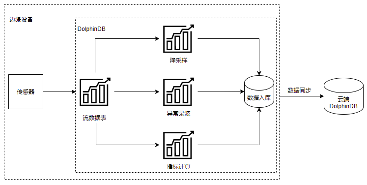
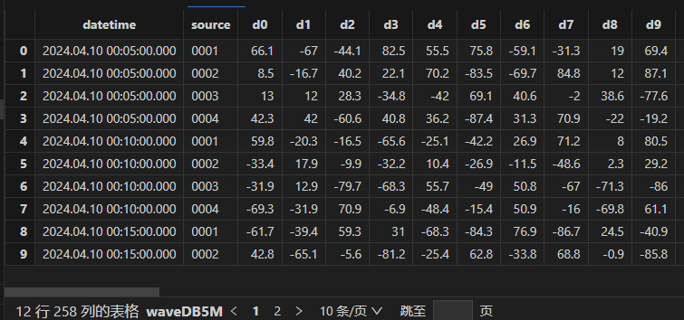
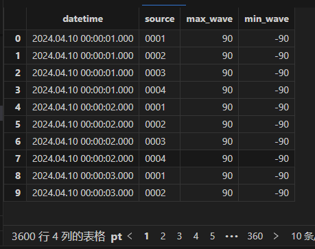
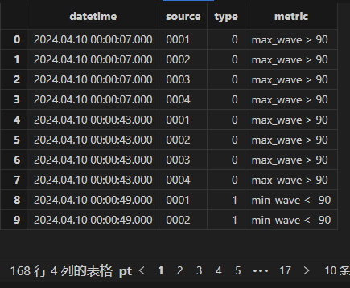
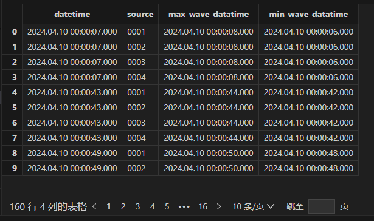

# 云边协同：DolphinDB 构建一体化振动监控与故障诊断解决方案

随着物联网时代的发展，边缘设备的数量急剧膨胀，对边缘设备的数据管理、分析成为难题。在许多应用场景中，特别是需要实时数据处理和反馈的场合，传统的云计算模型往往面临着数据传输延迟较高的问题，而大量数据的产生导致了网络拥堵和带宽压力，极大影响了数据的使用。此外，一些应用场景涉及到的数据具有敏感性，也要求更高水平的隐私保护和数据安全性。而边缘计算的兴起正是源于传统云计算模型的这些局限性。边缘计算通过在数据源附近部署边缘节点，可以在本地进行数据处理和分析，从而显著降低数据传输延迟，减轻网络负载，提高隐私保护和数据安全性。因此，边缘计算的出现为满足特定应用场景的需求提供了一种有效的解决方案，使得数据处理更加高效、安全和可靠。

DolphinDB 是由浙江智臾科技有限公司研发的一款高性能分布式时序数据库，但 DolphinDB 除了数据库功能，还具备强大的数据处理和分析能力。它集成了功能强大的编程语言和高容量高速度的流数据分析系统。将 DolphinDB 部署在边缘端，可以赋予边缘设备强大的计算能力，满足边缘设备的数据处理需求。

- [云边协同：DolphinDB 构建一体化振动监控与故障诊断解决方案](#云边协同dolphindb-构建一体化振动监控与故障诊断解决方案)
  - [1. 边缘计算的挑战](#1-边缘计算的挑战)
  - [2. DolphinDB 边缘计算架构](#2-dolphindb-边缘计算架构)
  - [3. 应用案例](#3-应用案例)
    - [3.1 场景介绍](#31-场景介绍)
    - [3.2 DdolphinDB 解决方案](#32-ddolphindb-解决方案)
    - [3.3 方案实现](#33-方案实现)
  - [4. 总结](#4-总结)
  - [5. 附录](#5-附录)

## 1. 边缘计算的挑战

* **有限的计算资源：** 边缘设备通常具有有限的计算能力和存储容量，可能无法处理大规模或复杂的数据集。
* **实时处理需求：** 一些应用场景需要在边缘设备上进行实时数据处理，如异常告警、实时指标计算等，这需要确保处理速度和响应时间都能够满足要求。
* **数据同步与一致性：** 各边缘设备独立处理完本地数据后，需要将处理后的结果同步到一个汇总的云端设备中进行分析，因此数据的同步需要保障实时性及准确性。

## 2. DolphinDB 边缘计算架构

本文将以一个案例介绍 DolphinDB 是如何解决上述边缘计算的难点。以下案例涉及边缘设备振动信号处理，DolphinDB 提供了一个完整的解决方案。接下来我们详细介绍基于 DolphinDB 实现边缘计算的整体架构。



上述架构中，将 DolphinDB 安装在边缘设备中。其通过 DolphinDB 流表接入传感器数据，并进行实时数据处理。处理内容包括：原始数据的降采样、异常数据录波、指标的计算等方面。通过流表的实时处理，避免了边缘端处理全量数据时的资源不足问题，同时也保证了计算结果的实时性。实时处理后的结果可通过DolphinDB 节点间的数据同步上传至 DolphinDB 云端进行后续的分析处理。

## 3. 应用案例

### 3.1 场景介绍

某电力监测设备生产商希望在工控机中内置振动监控与故障诊断功能，以助力搭建边缘端 SCADA 系统。其边缘设备为 ARM 工控机，采样频率可达 8KHZ~50KHZ。在搭建这一系统时，发现工控机资源无法满足全天数据的批量计算，而现有的实时计算架构过重，也无法适配在工控机运行。

### 3.2 DdolphinDB 解决方案

将 DolphinDB 安装在主变震动监测和故障预警设备内（边端设备），使用 DolphinDB 在边端设备进行实时流数据处理，并将处理后的结果上传云端 DolphinDB，实现云边一体。在该场景中，DolphinDB 解决了以下实现难点：

* 流计算引擎支持实时计算，解决了全量数据计算需要大量资源的问题。
* 流数据引擎实现减量落盘和波形录制。
* Signal 插件支持波形计算和傅里叶变换。
* 通过向量化编程、Array vector 计算提高数据处理效率。

### 3.3 方案实现

接下来我们将基于上述案例提供一个轻量化的实现脚本，用于快速验证该场景。本文的案例中主要实现了边缘端的数据降采样及异常录波功能。

#### 3.3.1 分布式库表创建

创建如下4个分布式表，其中 warn 表用于存储异常告警信息，wave 表用于存储波形的峰值趋势信息，alterWave 表用于存储异常发生时的异常波形，wave5M 则用于存储降采样后的数据。

```
//创建 warn 分布式表
db = database("dfs://warnDB", VALUE, 2022.01.01..2022.12.31)
m = table(1:0,`datetime`source`type`metric,[TIMESTAMP,SYMBOL,INT,STRING]) 
db.createPartitionedTable(m, "warn", ["datetime"])

//创建聚合结果分布式表
db = database("dfs://waveDB", VALUE, 2022.01.01..2022.12.31)
m = table(1:0, `datetime`source`max_wave`min_wave,[TIMESTAMP,SYMBOL,DOUBLE,DOUBLE]) 
db.createPartitionedTable(m, "wave", ["datetime"])

//创建异常录波表
db = database("dfs://alterWaveDB", VALUE, 2022.01.01..2022.12.31)
m = table(1:0,`datetime`source`wave_datatime <- (`d+string(0..255)),[TIMESTAMP,SYMBOL,TIMESTAMP] <- take(DOUBLE,256))
db.createPartitionedTable(m, "alterWave", ["datetime"])

//创建降采样后的原始数据存储表
db = database("dfs://waveDB5M", VALUE, 2022.01.01..2022.12.31)
m = table(1:0,`datetime`source <- (`d+string(0..255)),[TIMESTAMP,SYMBOL] <- take(DOUBLE,256))
db.createPartitionedTable(m, "wave5M", ["datetime"])

```

#### 3.3.2 流表创建

```
share streamTable(100:0, `datetime`source <- (`d+string(0..255)),[TIMESTAMP,SYMBOL] <- take(DOUBLE,256)) as wave
share streamTable(100:0, `datetime`source <- (`d+string(0..255)),[TIMESTAMP,SYMBOL] <- take(DOUBLE,256)) as wave5M
share streamTable(100:0, `datetime`source`max_wave`min_wave,[TIMESTAMP,SYMBOL,DOUBLE,DOUBLE]) as stwave
share streamTable(100:0, `datetime`source`type`metric,[TIMESTAMP,SYMBOL,INT,STRING]) as warn
share streamTable(100:0, `datetime`source`wave_datatime <- (`d+string(0..255)),[TIMESTAMP,SYMBOL,TIMESTAMP] <- take(DOUBLE,256)) as windowOutput1
```

上述代码创建了五个流表，其中 wave 流表用于接收解析后的振动数据，wave5M 用于转存降采样后的数据，stwave 存储波形峰值，warn 用于存储异常记录，windowOutput1 用于存储异常波形数据。

#### 3.3.3 数据处理

数据处理部分包括了数据降采样、峰值趋势计算、异常检测和异常检测录波四部分内容。

* 使用时间序列引擎，对原数据进行降采样

首先是对数据进行降采样，通过时间序列引擎，进行五分钟频率的降采样，降低边缘端的数据存储压力。

```
//创建时序引擎，每五分钟保留最后一条原始数据，对原数据进行降采样
metricsDownSampling = parseExpr(each(add,'last(',(`d+string(0..255)+")")))
downsampling = createTimeSeriesEngine(name="downsampling",  windowSize=5*60*1000, step=5*60*1000, metrics=metricsDownSampling, dummyTable=wave, outputTable=wave5M, timeColumn=`datetime, keyColumn=`source)
subscribeTable(tableName='wave',actionName="down_sampling", offset=0, handler=append!{downsampling}, msgAsTable=true,batchSize=10000,throttle=1)
subscribeTable(tableName='wave5M',actionName='save5mToDFS',offset=0,handler=append!{loadTable("dfs://waveDB5M",'wave5M')},msgAsTable=true,batchSize=10000,throttle=1)
```

上述代码创建了一个时间序列引擎，时间窗口长度及移动步长均为5分钟。该时间序列引擎会将输入数据按时间进行进行聚合，每5分钟聚合一次并返回最后一条记录存储到 wave5M 表中。同时创建了两个订阅：

1. down_sampling 订阅 wave 流表，并将其注入时间序列引擎中进行降采样
2. save5mToDFS 订阅 wave5M 流表，将降采样后数据存入分布式库表中

* 使用时间序列引擎，计算每秒波形峰值

此处我们仍然使用时间序列引擎，计算每秒的波形峰值，通过保留波形的峰值来记录数据的整体特征及趋势。

```
//定义处理函数
def metricCal(engineName,msg){
	t = select datetime,source,rowMin(msg[,2:258]) as min,rowMax(msg[,2:258]) as max  from msg
    getStreamEngine(engineName).append!(t)
}
//定义聚合规则
metrics=<[max(max),min(min)]>
inputSchema = table(100:0, `datetime`source`min`max,[TIMESTAMP,SYMBOL,DOUBLE,DOUBLE])
//创建时序引擎，窗口长度为1s，步长为1s
tsAggr1 = createTimeSeriesEngine(name="tsAggr1",  windowSize=1000, step=1000, metrics=metrics, dummyTable=inputSchema, outputTable=stwave, timeColumn=`datetime, keyColumn=`source)
//订阅 wave 表，进行指标计算
subscribeTable(tableName="wave", actionName="act_tsAggr1", offset=0, handler=metricCal{"tsAggr1"}, msgAsTable=true,batchSize=10000,throttle=1);
//订阅 stwave 表，将峰值趋势入库
subscribeTable(tableName='stwave',actionName='savePeakToDFS',offset=0,handler=append!{loadTable("dfs://waveDB",'wave')},msgAsTable=true,batchSize=10000,throttle=1)
```

上述代码有如下几个数据处理流程：

1. 首先订阅 wave 流表，计算每一行测点的最大值和最小值，将计算结果输入时间序列引擎 tsAggr1 中
2. tsAgg1 引擎按秒聚合输出每秒波形数据的峰值，存储到 stwave 流表中。
3. 最后订阅 stwave 表，将峰值趋势数据存入分布式数据库表。

* 创建异常检测引擎，进行异常检测
  
```
//创建异常检测引擎，检测规则 max>90, min<-90
tsAggr2 = createAnomalyDetectionEngine(name="tsAggr2", metrics=<[max_wave > 90, min_wave <-90]>, dummyTable=stwave, outputTable=warn, timeColumn=`datetime, keyColumn=`source, windowSize=60*1000, step=60*1000)
//订阅 stwave 进行异常检测
subscribeTable(tableName="stwave", actionName="act_tsAggr2", offset=0, handler=append!{tsAggr2}, msgAsTable=true,batchSize=10000,throttle=1);
//订阅 warn 表，将异常记录入库
subscribeTable(tableName='warn',actionName='saveWarnToDFS',offset=0,handler=append!{loadTable("dfs://warnDB",'warn')},msgAsTable=true,batchSize=10000,throttle=1)
```

创建异常检测引擎，并订阅峰值流表 stwave，将异常结果(max_wave > 90, min_wave <-90)输入异常记录表 warn 中，同时订阅 warn 表将异常数据存入分布式数据库表中。

* 创建 windowjoin 引擎，订阅 warn 和 wave，录制异常波形

```
//创建 windowjoin 引擎，订阅 warn 和 wave，输出待存数据
cbefore = short(1)*(-1000)
cafter = short(1)*1000
metricswj = parseExpr(("wave.datetime" <- (`d+string(0..255))))
wjengine = createWindowJoinEngine(name="waveStreamWindow",leftTable=warn,rightTable=wave,outputTable=windowOutput1,window=cbefore:cafter,
                                  metrics=metricswj,matchingColumn=`source,timeColumn=`datetime)
subscribeTable(tableName=`warn,actionName="joinLeft",offset=0,handler=appendForJoin{wjengine,true},msgAsTable=true,batchSize=10000,throttle=1)
subscribeTable(tableName=`wave,actionName="joinRight",offset=0,handler=appendForJoin{wjengine,false},msgAsTable=true,batchSize=10000,throttle=1)  
//订阅 windowOutput1，异常波形入库
subscribeTable(tableName='windowOutput1',actionName='saveAlterWaveToDFS',offset=0,handler=append!{loadTable("dfs://alterWaveDB",'alterWave')},msgAsTable=true,batchSize=10000,throttle=1)                                 
```

订阅 warn 和 wave，使用窗口连接引擎，以异常记录时间 t 为中心，选择 \[t-1,t+1] 的波形数据作为异常波形数据，输入 windowOutput1 中，订阅 windowOutput1，并存入分布式数据库表中。

#### 3.3.4 结果验证

本文使用脚本模拟4个通道，256个测点数据的实时写入，采样频率为 50HZ，具体脚本见附件 simuateData 函数。

**注：** 本文模拟生成的数据完全随机，故多次计算结果可能不同。

查看降采样后数据，可以看到每个通道都进行了5分钟降采样，共计12条记录：

```
wave5M= loadTable('dfs://waveDB5M','wave5M')
select * from wave5M
```



查看峰值趋势表，每秒保留该通道的最大及最小值：

```
wave= loadTable('dfs://waveDB','wave')
select * from wave
```



查看异常告警表输出：

```
warn= loadTable('dfs://warnDB','warn')
select * from warn
```



波形录制表为根据异常告警表与原始数据表连接的结果，因此异常波形表的结果应与告警表一致：

```
alterWave= loadTable('dfs://alterWaveDB','alterWave')
select max(wave_datatime),min(wave_datatime) from alterWave group by datetime,source
```



可以看到异常发生后的前后一秒的数据都被记录了下来。

## 4. 总结

本教程从一个简单的边缘计算案例出发，基于 DolphinDB 的流计算框架，展示了如何在资源有限的边缘设备上实现实时、高效的边缘计算。通过这个案例，可以了解到 DolphinDB 在边缘计算领域的应用优势，并为大量边缘设备的数据管理、分析难题提供了一个有效的解决方案。同时，本教程所介绍的边缘计算案例也可作为一种参考，应用于其他类似场景，进一步拓展边缘计算的应用范围。


## 5. 附录

完整脚本代码：[云边一体脚本实现](script/Virbration_Monitor_Fault_Diagnose/云边一体脚本实现.dos)  