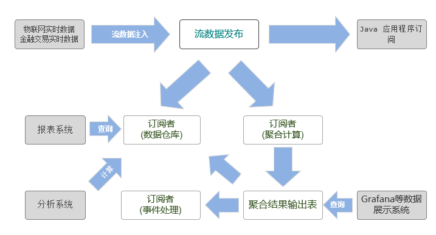

# 动态增加字段和计算指标

工业物联网采集的数据和金融交易数据具有相同的特点：频率高、维度多、数据一旦生成就不会改变、数据量庞大，并且工业物联网数据采集的维度和实时计算的指标会随着业务扩展和设备增加而不断增加。在金融领域，数据分析和监控也需要不断增加风控监测指标。

因此，动态增加字段和计算指标是工业物联网和金融领域的数据平台的共同诉求。

DolphinDB 为工业物联网和金融提供了一站式解决方案。数据处理流程如下图所示：



工业物联网采集的数据和金融交易的实时数据首先会以流数据的形式注入到 DolphinDB 的流数据表中，数据节点/计算节点通过订阅流数据表，可以把实时流数据持久化存储到分布式数据库中，供将来深度数据分析使用；同时，流数据引擎通过订阅流数据表，对流数据进行实时运算，将计算结果用于工业物联网的监控和预警以及互联网金融的风控监测。

在这一数据处理流程中，涉及到了 3 类表：分布式表（DFS table）、流数据表、流数据引擎的输入表和输出表。如果数据采集的维度增加，那么这 3 类表都要做相应的处理。

- [1. 给分布式表增加字段](#1-给分布式表增加字段)
- [2. 给流数据表增加字段](#2-给流数据表增加字段)
- [3. 给流数据引擎增加计算指标](#3-给流数据引擎增加计算指标)
- [4. 总结](#4-总结)

## 1. 给分布式表增加字段

如果计划给流数据表新增加字段，而订阅者分布式表没有做相应的调整，那么流数据将无法写入分布式表，这是由于流数据表和分布式表结构不一致造成的。因此，如果需要给流数据表增加字段，必须首先要给订阅者分布式表增加字段。DolphinDB 提供了 [addColumn](https://www.dolphindb.cn/cn/help/200/FunctionsandCommands/CommandsReferences/a/addColumn.html) 函数为分布式表增加字段。

例：创建一个分布式数据库，计划用于保存流数据表的数据。

```
if(existsDatabase("dfs://iotDemo")){
	dropDatabase("dfs://iotDemo")
	}
db=database("dfs://iotDemo",RANGE,`A`F`M`T`Z)
pt = db.createPartitionedTable(table(1000:0,`time`equipmentId`voltage`current,[TIMESTAMP,SYMBOL,INT,DOUBLE]), `pt, `equipmentId)
```

若给流数据表 streamTb 新增两个字段，作为持久化存储流数据的分布式表 pt 也需要先增加两个字段。注意：分布式表增加字段后，需要使用 [loadTable](https://www.dolphindb.cn/cn/help/FunctionsandCommands/FunctionReferences/l/loadTable.html) 函数重新加载，才会生效。

```
addColumn(pt,`temperature`humidity,[DOUBLE,DOUBLE])
pt=loadTable("dfs://iotDemo","pt")
```

## 2. 给流数据表增加字段

流数据表通常是由 `streamTable` 函数生成，用于传输流数据。工业物联网采集的数据和金融交易的实时数据往往会先注入流数据表。如果数据采集维度增加，那么作为信息发布者的流数据表需要调整结构。DolphinDB 的 `addColumn` 函数除了可以给分布式表增加字段，还可以给流数据表的字段。

假设目前数据采集的维度只有两个：电压和电流。创建流数据表的代码如下：

```
streamTb=streamTable(1000:0,`time`equipmentId`voltage`current,[TIMESTAMP,SYMBOL,INT,DOUBLE])
```

现在需要新增两个采集维度：温度和湿度。流数据表需要新增两个字段：

```
addColumn(streamTb,`temperature`humidity,[DOUBLE,DOUBLE])
```

给流数据表增加字段是即时生效，下一次调用流数据表时，它已经包含了新增加的字段。

## 3. 给流数据引擎增加计算指标

用户在定义流数据引擎时，需要使用[元代码](https://www.dolphindb.cn/cn/help/Objects/Metaprogramming.html)来指定计算指标。随着需求的变化，计算指标往往也会做出相应的改变。DolphinDB 提供了 [addMetrics](https://www.dolphindb.cn/cn/help/200/FunctionsandCommands/CommandsReferences/a/addMetrics.html) 函数来增加流数据引擎的计算指标。

<!-- ### 语法

addMetrics(engine/name, newMetrics, newMetricsSchema, [windowSize])

### 参数

* engine 是流数据引擎，即 [createTimeSeriesEngine](https://www.dolphindb.cn/cn/help/FunctionsandCommands/FunctionReferences/c/createTimeSeriesEngine.html) 等函数返回的抽象表对象。请注意，暂不支持 [createAnomalyDetectionEngine](https://www.dolphindb.cn/cn/help/FunctionsandCommands/FunctionReferences/c/createAnomalyDetectionEngine.html) 和 [createReactiveStateEngine](https://www.dolphindb.cn/cn/help/FunctionsandCommands/FunctionReferences/c/createReactiveStateEngine.html) 引擎。
* name 是一个字符串，表示流数据引擎的名称。
* newMetrics 是元代码，用于表示增加的计算指标。
* newMetricsSchema 是表对象，用于指定新增的计算指标在输出表中的列名和数据类型。
* windowSize 是一个正整数，表示新增指标的计算窗口长度。仅适用于时间序列引擎，且必须为已指定的窗口长度之一。若未指定，默认值为第一个已指定的窗口长度。

### 例子 -->

例：定义一个时间序列引擎，每隔 50 毫秒计算一次每台设备的平均电压和平均电流。

```
// 定义时间序列引擎以及订阅流数据表
streamTb=streamTable(1000:0,`time`equipmentId`voltage`current,[TIMESTAMP,SYMBOL,INT,DOUBLE])
share streamTb as sharedStreamTb
outTb=table(1000:0,`time`equipmentId`avgVoltage`avgCurrent,[TIMESTAMP,SYMBOL,INT,DOUBLE])
streamEngine = createTimeSeriesEngine(name="agg1", windowSize=100, step=50, metrics=<[avg(voltage),avg(current)]>, dummyTable=sharedStreamTb, outputTable=outTb, timeColumn=`time, useSystemTime=false, keyColumn=`equipmentId, garbageSize=2000)
subscribeTable(, "sharedStreamTb", "streamTable", 0, append!{streamEngine}, true)

// 往流数据表中插入数据
n=10
time=temporalAdd(2019.01.20 12:30:10.000,rand(300,n),"ms")
equipmentId=rand(`A`F`M`T`Z,n)
voltage=rand(250,n)
current=rand(16.0,n)
insert into sharedStreamTb values(time, equipmentId, voltage, current)

// 查看流数据表
select * from sharedStreamTb
```

|time                       |equipmentId    |voltage    |current   |
|---                        |---            |---        |---       |
|2019.01.20T12:30:10.160    |A    |79    |1.9056|
|2019.01.20T12:30:10.021    |T    |65    |11.6551|
|2019.01.20T12:30:10.244    |M    |113   |12.2897|
|2019.01.20T12:30:10.053    |A    |133   |1.2491|
|2019.01.20T12:30:10.175    |A    |186   |7.5363|
|2019.01.20T12:30:10.260    |M    |118   |10.4733|
|2019.01.20T12:30:10.003    |M    |172   |1.1165|
|2019.01.20T12:30:10.101    |M    |170   |10.5922|
|2019.01.20T12:30:10.260    |T    |95    |15.5515|
|2019.01.20T12:30:10.249    |Z    |90    |15.2511|


```
// 查看输出表
select * from outTb
```

|time                   |equipmentId|avgVoltage|avgCurrent   |
|----                   |-----------|----------|-------------|
|2019.01.20T12:30:10.050	|T	|65	|11.6551|
|2019.01.20T12:30:10.100	|T	|65	|11.6551|
|2019.01.20T12:30:10.250	|M	|113|12.2897|


给时间序列引擎增加两个新的计算指标，每隔 50 毫秒取最后一个电压和电流值。没有新数据流入引擎时，输出表中新增加的计算指标的值为空。

```
newMetricsSchema=table(1:0,`lastvoltage`lasteletricity,[INT,DOUBLE])
addMetrics(aggregator,<[last(voltage), last(eletricity)]>,newMetricsSchema)

// 查看数据表
select * from outTb
```

|time                   |equipmentId|avgVoltage|avgCurrent   |lastVoltage|lastCurrent|
|----                   |-----------|----------|-------------|---|---|
|2019.01.20T12:30:10.050	|T	|65	|11.6551|
|2019.01.20T12:30:10.100	|T	|65	|11.6551|
|2019.01.20T12:30:10.250	|M	|113|12.2897|

写入新的数据。

```
n=10
timev=temporalAdd(2019.01.20 12:30:10.000,rand(300,n),"ms")
equipmentIdv=rand(`A`F`M`T`Z,n)
voltagev=rand(220..250,n)
eletricityv=rand(16.0,n)
insert into sharedStreamTb values(timev, equipmentIdv, voltagev, eletricityv)
select * from outTb
```

|time                   |equipmentId|avgVoltage|avgCurrent   |lastVoltage|lastCurrent|
|----                   |-----------|----------|-------------|---|---|
|2019.01.20T12:30:10.050	|T	|65	|11.6551|
|2019.01.20T12:30:10.100	|T	|65	|11.6551|
|2019.01.20T12:30:10.250	|M	|113|12.2897|
|2019.01.20T12:30:10.200|F          |235       |9.182104     |234|14.896723|
|2019.01.20T12:30:10.150|T          |243       |10.816871    |236|7.026039|
|2019.01.20T12:30:10.200|Z          |225       |5.893952     |225|2.098874|

## 4. 总结

在流数据处理流程中，如果需要增加字段，必须按照以下顺序：订阅者—分布式表、发布者—流数据表、订阅者—流数据引擎。如果不按照以上顺序增加字段，那么数据结构不一致会导致流数据无法持久化到分布式表。

