# DolphinDB API 性能基准测试报告

- [DolphinDB API 性能基准测试报告](#dolphindb-api-性能基准测试报告)
  - [1. 概述](#1-概述)
  - [2. 测试环境](#2-测试环境)
    - [2.1. 硬件配置](#21-硬件配置)
    - [2.2. 软件配置](#22-软件配置)
    - [2.3. 测试框架](#23-测试框架)
  - [3. 单用户上传数据性能测试](#3-单用户上传数据性能测试)
  - [4. 多用户并发上传数据性能测试](#4-多用户并发上传数据性能测试)
  - [5. 多用户并发下载数据性能测试](#5-多用户并发下载数据性能测试)
  - [6. 计算并发性能测试](#6-计算并发性能测试)
  - [7. 总结](#7-总结)

## 1. 概述

DolphinDB 是一款高性能分布式时序数据库，属于列式关系型数据库，由C++编写，具有内置的并行和分布式计算框架，可用于处理实时数据和海量历史数据。

DolphinDB除了提供自己的脚本语言外，还提供了C++, Java, C#, Python, R等编程语言API，便于开发者在各种不同的开发环境中使用DolphinDB。

本文将测试API接口(C++, Java, C#, Python, R)与DolphinDB交互的性能，具体包括以下场景：

* 单用户上传数据到内存表
* 多用户并发上传数据到分布式（DFS）数据库
* 多用户并发从DolphinDB下载数据到客户端
* 多用户并发发送计算任务（计算某天某个股票的分钟级k线）到DolphinDB，并返回结果

## 2. 测试环境

### 2.1. 硬件配置

本次测试使用了三台配置相同的服务器(SERVER1, SERVER2, SERVER3)。每台服务器的配置如下：

- 主机：PowerEdge R730xd
- CPU：E5-2650 24cores 48线程
- 内存：512G
- 硬盘：HDD 1.8T * 12
- 网络：万兆以太网
- OS：CentOS Linux release 7.6.1810

### 2.2. 软件配置

- C++: GCC 4.8.5
- JRE: 1.8.0
- C#: .net 2.2.105
- Python: 3.7.0
- R: 3.5.2
- DolphinDB: 0.94.2

### 2.3. 测试框架

DolphinDB集群部署在SERVER1上，API程序运行在SERVER2和SERVER3上，通过网络连接到SERVER1上的DolphinDB数据节点进行测试。

DolphinDB集群配置如下：

- 集群包含1个控制节点和6个数据节点；
- 内存：32G/节点 * 6节点 = 192G
- 线程：8线程/节点 * 6节点 = 48 线程
- 硬盘：每个节点配置一个独立的HDD硬盘，1.8T/节点 * 6 = 9.6T

## 3. 单用户上传数据性能测试

本节测试单用户通过API上传数据到DolphinDB服务器。在SERVER1的DolphinDB集群上创建一张内存表，SERVER2上运行API程序，将数据写入到SERVER1内存表中。

写入的数据表字段包括STRING, INT, LONG, SYMBOL, DOUBLE, DATE, TIME等不同类型的字段，共45列，每行336字节 ，共上传100万行，大小约336Mb。测试每次上传10~100000行的情况下的吞吐量和时延。

该场景由于是单用户，并且不会涉及到磁盘操作，因此主要测试API程序数据格式到DolphinDB数据格式的转换性能，CPU性能和网络对测试结果会有较大的影响。各个API的测试结果如下：

**表1. C++ API单用户上传数据到内存表测试结果**

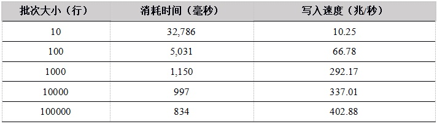

**表2. Java API单用户上传数据到内存表测试结果**

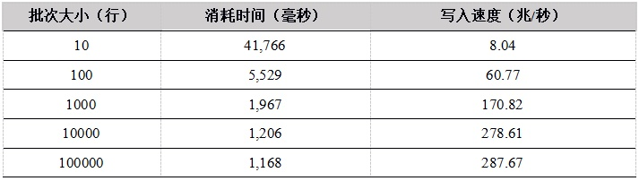

**表3. C# API单用户上传数据到内存表测试结果**

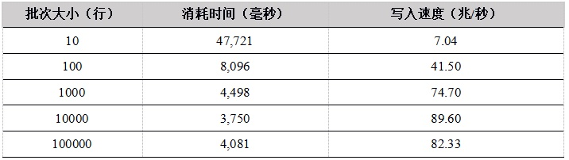

**表4. Python API单用户上传数据到内存表测试结果**

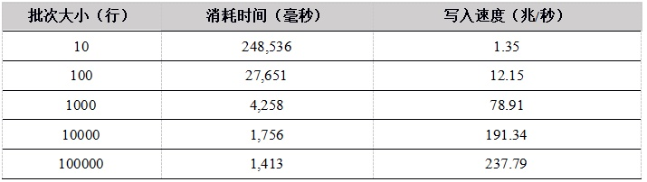

**表5. R API单用户上传数据到内存表测试结果**

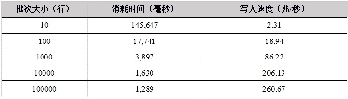

**表6. 各API单用户上传数据到内存表的写入速度对比（单位：兆/秒）**

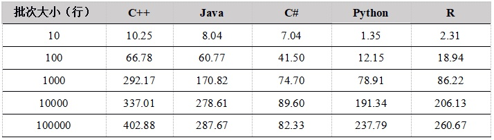

**图1. API上传数据到内存表性能比较**

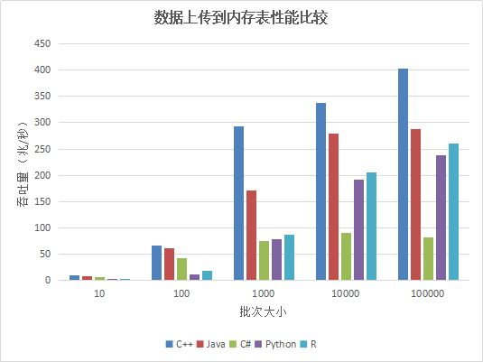

从单用户写入内存表的测试结果看，随着批次大小的增加，性能提升明显，这是因为在总的数据量相同的情况下，一次上传的数据行数越多，上传次数越少，网络通信次数越少。

`C++` 的性能最优，C# 性能较差。Python和R底层实现都是用 `C++` 重写，性能趋势相同，当批次大小较小时，由于调用`C++`模块的次数较多，带来更多的性能损失，性能也会更差。当批次大小达到1000行以上，性能提升明显。我们建议在使用Python和R上传数据时，尽量增大上传的批次大小。

## 4. 多用户并发上传数据性能测试

本节测试通过API多用户并发上传数据到SERVER1的DFS数据表，在SERVER2 和 SERVER3上多个用户同时通过网络发起写入操作。

每个用户共写入500万行，每次写入25000行，每行336个字节，因此每个用户共写入的数据量为840Mb。测试在并发用户为1~128的情况下，并发写入的时延和吞吐量。

我们把用户数平均分配在SERVER2和SERVER3上运行，比如在测16个用户时，两个SERVER各运行8个客户端程序。测试涉及到并发写入，写入的数据通过网络传输到SERVER1上，并且存储到磁盘上，因此可以测试DolphinDB系统能否充分利用服务器CPU、硬盘、网络等资源。各个API的测试结果如下：

**表7. C++ API 多用户并发上传数据到DFS表测试结果**

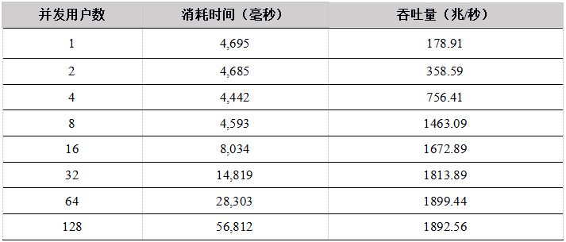

**表8. Java API 多用户并发上传数据到DFS表测试结果**

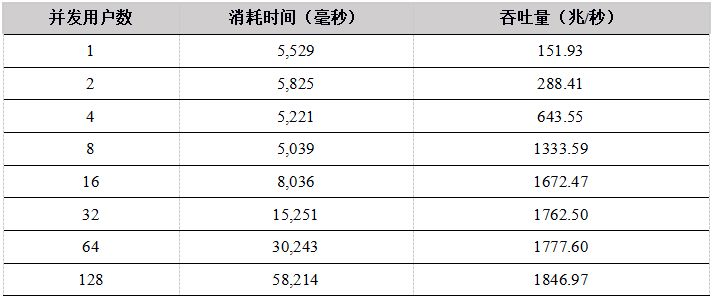

**表9. C# API 多用户并发上传数据到DFS表测试结果**

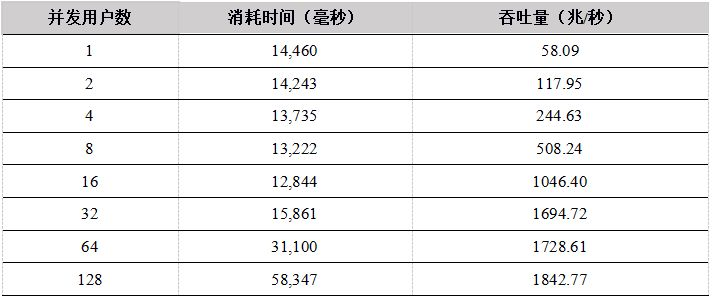

**表10.Python API 多用户并发上传数据到DFS表测试结果**

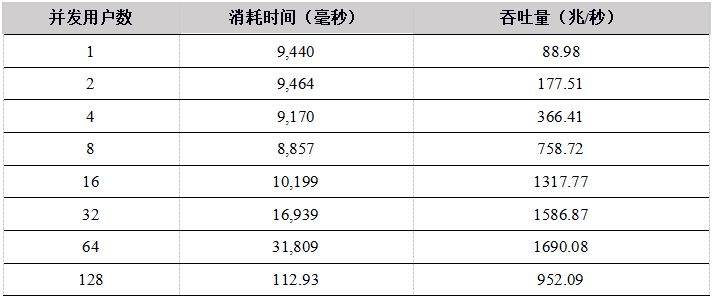

**表11. R API 多用户并发上传数据到DFS表测试结果**

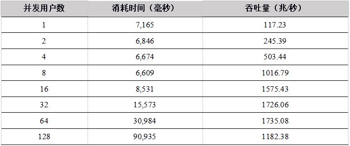

**表12. 各种API 数据上传到DFS表测试结果比较（单位：兆/秒）**

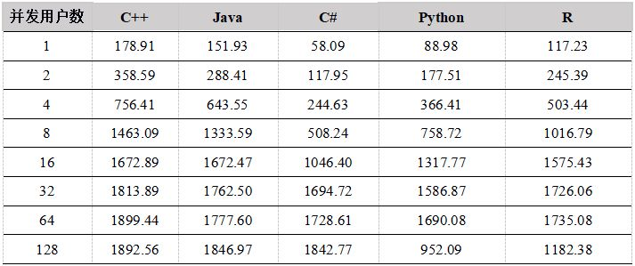

**图2. API上传数据到DFS表性能比较**

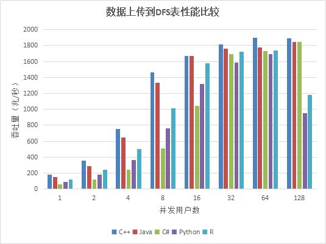

测试结果显示，在用户数小于16的情况下，C++、Java性能优势明显，Python 和C#性能稍差，吞吐量都基本上呈线性增长。当用户数超过16时，网络传输达到极限，成为性能瓶颈，吞吐量基本维持在网络的极限。网络为万兆以太网，极限为1G，但是由于传输的数据有压缩，所以系统吞吐量最大可达1.8G/秒。

## 5. 多用户并发下载数据性能测试

本节测试通过API多用户并发从DolphinDB下载数据的速度。数据库部署在SERVER1上，多个用户在SERVER2和SERVER3上同时下载数据，每个用户随机选择一个数据节点连接。每个用户下载的数据总量为500万行，每行45字节，共计225Mb ，每次下载数据为25000行，分别测试并发用户数为1~128场景下的并发性能。

我们测试了以下两种场景下客户端并发下载数据的性能：

* 5年数据量：从5年的数据中随机选择date和symbol进行下载，涉及的数据量约12T。由于数据量大大超过系统内存，所以每次下载都需要从磁盘加载数据；
* 1周数据量：从最近一周的数据中随机选择symbol进行下载，涉及的数据量约60G。给DolphinDB分配的内存足以容纳60G数据，所有的数据在缓存中，所以每次下载不需要从磁盘加载数据。

各API性能测试结果如下：

**表13. C++ API 数据下载数据测试结果**

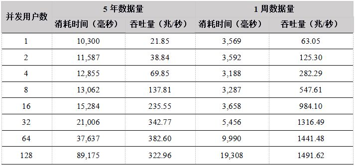

**表14. Java API 数据下载数据测试结果**

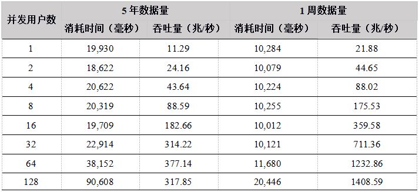

**表15. C# API 数据下载数据测试结果**

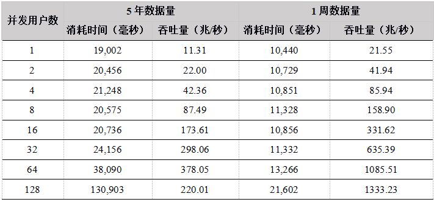

**表16. Python API 数据下载数据测试结果**

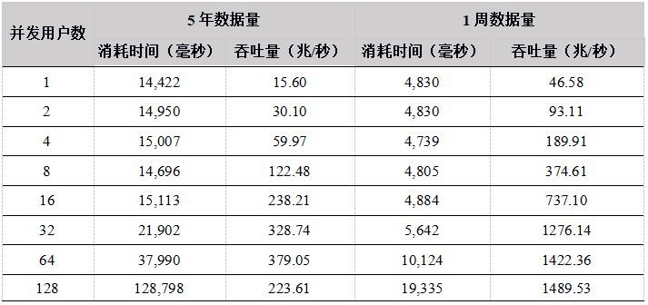

**表17. R API 数据下载数据测试结果**

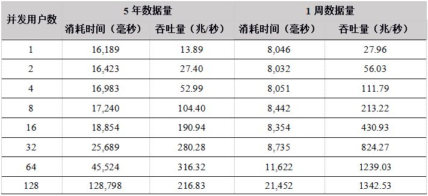

**表18. 各API 5年数据下载吞吐量对比（单位：兆/秒）**

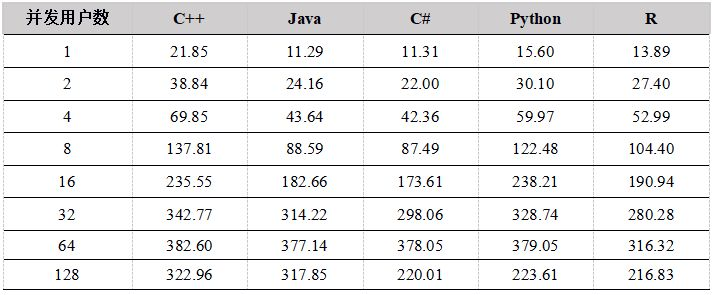

**图3. API 5年数据下载吞吐量比较**

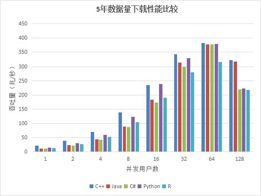

从测试结果上看，在用户数小于64的情况下，吞吐量随着用户数的增加基本上呈线性增长，各个API性能差异不是很大，最大吞吐量在350M左右，由于数据集为12T，DolphinDB 缓存不了所有的数据，必须每次从磁盘加载，磁盘成为系统瓶颈。

在用户数为128的时候性能反而降低，原因是DolphinDB是按照分区加载数据的，如果用户要下载某天某个股票的数据，则会把整个分区加载到内存中，再把用户需要的数据返回给用户。当并发用户数太多，同时发起数据下载请求，又由于数据量太大，数据基本都需要从磁盘中加载，128个用户并发读取磁盘，造成IO竞争加剧，反而造成了整体吞吐量的降低。

因此，建议用户在高并发读取数据的场景下，各个节点尽量配置独立的多个数据卷，来提高IO的并发能力。

**表19. 各种API 1周数据下载吞吐量比较（单位：兆/秒）**

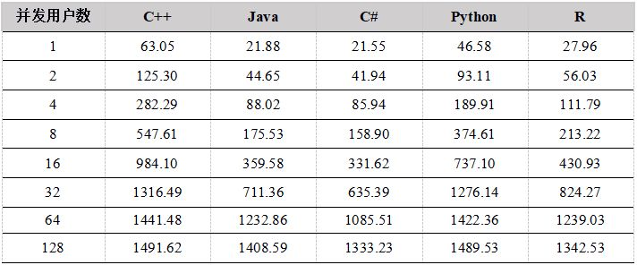

**图4. 各种API 1周数据并发下载吞吐量比较**

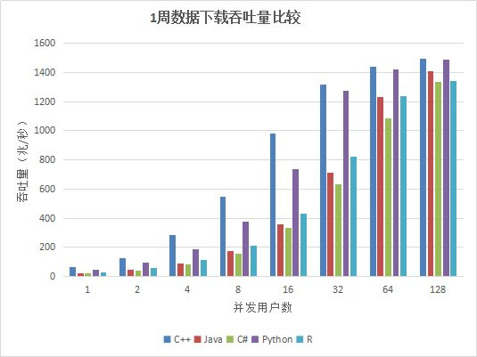

从测试结果上看，各API的吞吐量随着并发用户数的增加基本成线性增加，给DolphinDB分配的内存能够全部容纳一周的数据量，不需要每次从磁盘加载，因此吞吐量最大达到1.4G左右，达到了网络的极限（网络极限1G，由于数据有压缩，实际业务数据量为1.4G）。

## 6. 计算并发性能测试

本节测试通过API向DolphinDB提交并发计算任务，计算某只股票某天的分钟级K线，计算总量约为1亿条。

我们测试在5年数据量和1周数据量两种场景下，不同并发用户数（1~128）的计算性能。

* 5年数据量共12T，内存不能全部缓存，所以几乎每次计算都需要从磁盘加载数据，属于IO密集型应用场景，预期磁盘会成为性能瓶颈。
* 1周数据量约60G，DolphinDB数据节点能全部缓存，因此是计算密集型应用场景，多用户并发时，预期CPU会成为性能瓶颈。

各API的测试结果如下：

**表20. C++ API计算分钟k线性能结果**

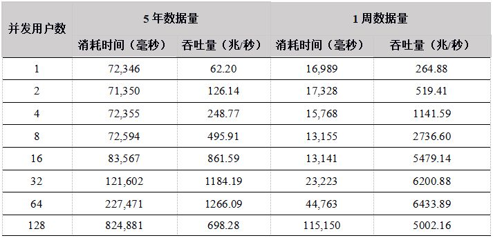

**表21. Java API 计算分钟k线性能结果**

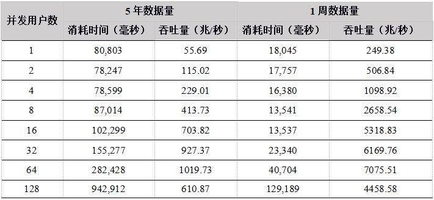

**表22. C# API 计算分钟k线性能结果**

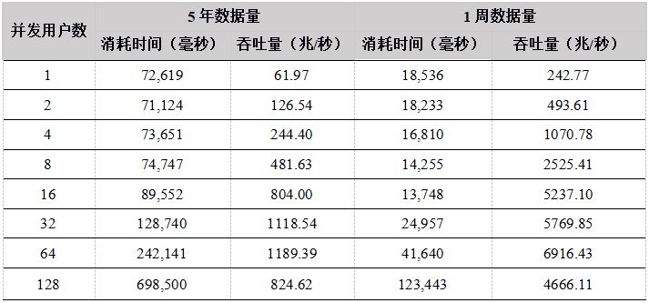

**表23. Python API计算分钟k线性能结果**

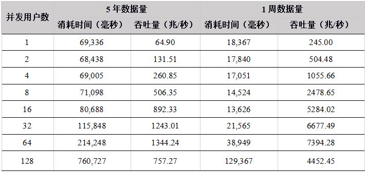

**表24. R API计算分钟k线性能结果**

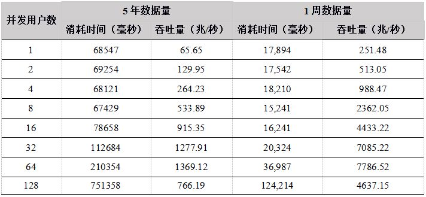

**表25. 各种API 5年数据计算吞吐量比较（单位：兆/秒）**

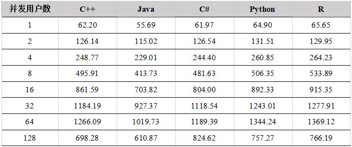

**图5. 各种API 5年数据并发计算吞吐量比较**

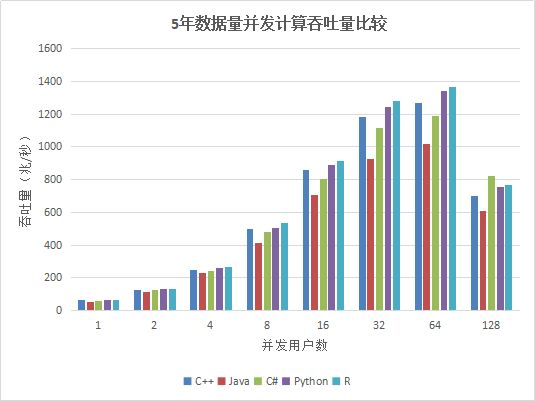

**表22. 各种API 1周数据计算吞吐量比较（单位：兆/秒）**

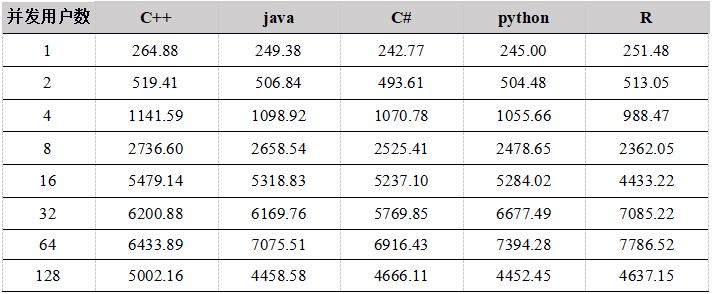

**图5. 各种API 1周数据并发计算吞吐量比较**

从测试结果中看出，在用户数小于64时，吞吐量稳定增长，各个API性能相差不大，在64个并发用户的时候，性能达到最大，计算数据的吞吐量接近7G/秒；当用户达到128G，由于系统任务太多，大大超过物理机器线程数（集群所在物理机器共48线程），导致线程切换频繁，集群内部大量的任务调度分发时间增加，吞吐量反而降低。

## 7. 总结

本次详细测试了DolphinDB C++, Java, C#, Python, R API在不同并发用户数下数据上传、数据下载、计算的性能，结论如下：

- **单用户数据上传到内存表**，C++性能最优，吞吐量最大能到402.88兆/秒，Java, Python, R 也能达到160-200兆/秒，C# 性能稍差，吞吐量最大在60兆左右。而且随着批次大小的增加，吞吐量增加明显，Python和R 更为显著。因此在写入时，在时延和内存允许的情况下，尽量增加批次大小。
- **多用户并发写入分布式DFS表**，随着用户数的增加，在达到网络极限之前，吞吐量稳定增加，总体性能C++, Java性能优势明显，当在32个并发用户数左右的情况下，网络成为瓶颈，各个API性能基本一致，由于数据压缩的原因，系统最大吞吐量达到1.8G/秒。
- **多用户并发下载数据**，在数据集为5年12T的场景下，用户数为64时达到最大吞吐量，为380兆/秒左右。这个场景下所有的数据都需要从磁盘加载，读磁盘成为性能瓶颈，用户数为128的时候，由于每个节点要接受大量的用户下载，磁盘IO竞争激烈，导致整体吞吐量下降。在数据集为1周约60G的场景下，6个数据节点可以缓存所有数据，因此所有的数据都在内存中，不需要从磁盘中加载，吞吐量能达到网络极限，由于数据压缩原因，集群吞吐量为1.8G/秒，而且随着并发用户的增加，吞吐量稳定增加。
- **多用户并发计算**，各个API发送计算某天某个股票的分钟K线任务到DolphinDB，并返回计算结果，网络传输的数据量很小，大部分时间都是在server端做计算，因此，各个API性能基本相当。 5年和1周数据量两种场景下，吞吐量走势基本一致，都是在用户数为64时达到最大吞吐量，5年数据量时，吞吐量最大为1.3G，而1周数据量由于全部数据都在内存，最大吞吐量达到7GB。而到128个用户时，吞吐量下降，主要是由于系统任务太多，大大超过物理机器线程数（集群所在物理机器共48线程），导致线程切换频繁，集群内部大量的任务调度分发时间增加。

总体来看，通过API使用 DolphinDB database 来进行数据检索、数据上传、数据计算等任务，随着并发度的提高，性能稳定提升，基本上满足大部分业务的性能要求。