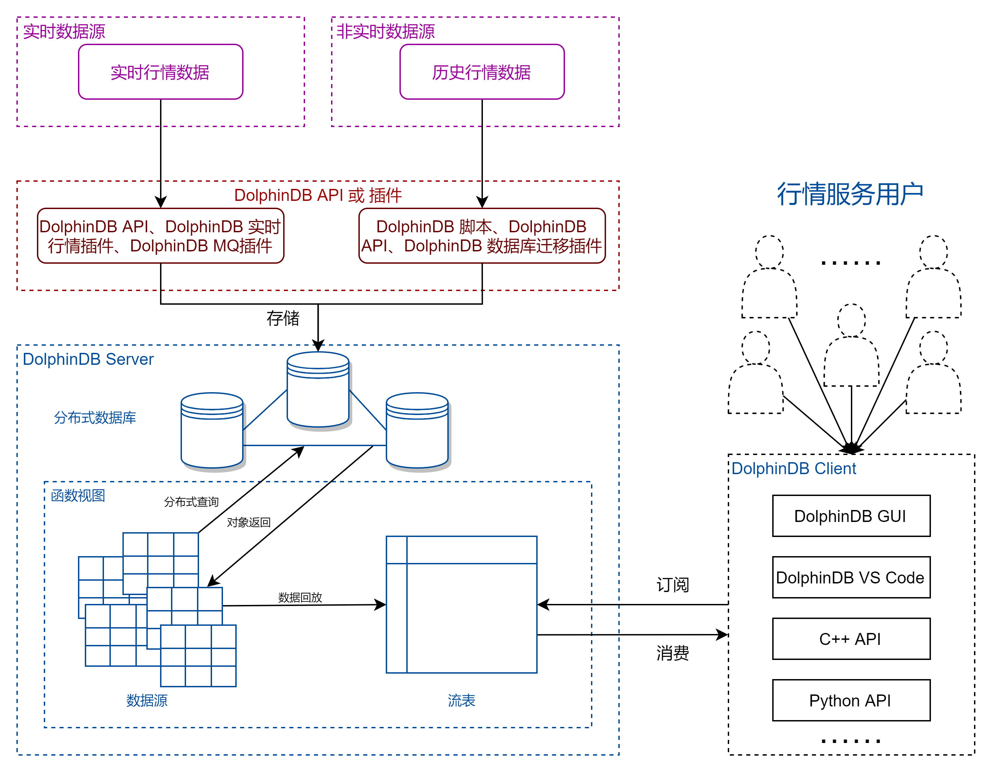
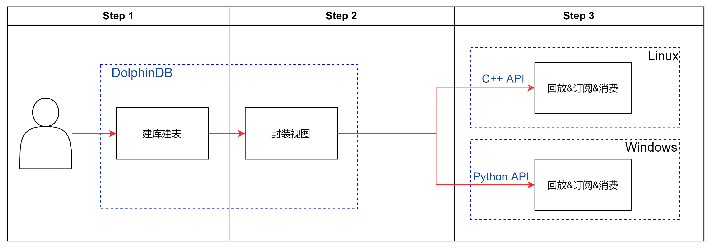
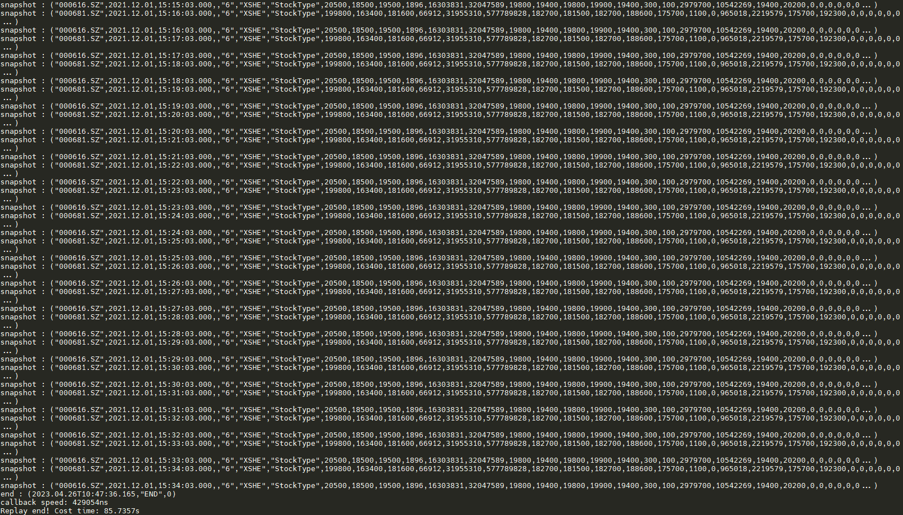
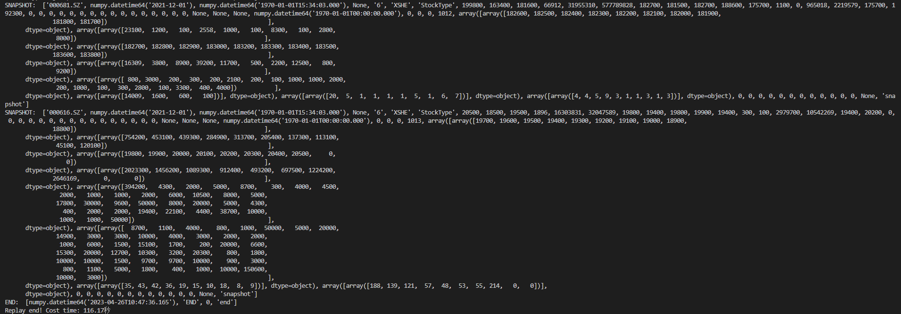

# DolphinDB 搭建行情回放服务的最佳实践

一个量化策略在生产（交易）环境中运行时，实时数据的处理通常是由事件驱动的。为确保研发和生产使用同一套代码，通常在研发阶段需将历史数据，严格按照事件发生的时间顺序进行回放，以此模拟交易环境。在 DolphinDB 中，用户通过 `replay` 函数可以实现对静态数据的回放，即将历史数据按照时间顺序以“实时数据”的方式注入流数据表中。对相同时间戳的数据还可以指定额外排序列，使数据回放顺序更接近实时交易场景。

在[历史数据回放](https://gitee.com/dolphindb/Tutorials_CN/blob/master/historical_data_replay.md)、[股票行情回放](https://gitee.com/dolphindb/Tutorials_CN/blob/master/stock_market_replay.md)两篇教程中已经介绍了 DolphinDB 的回放功能，本教程更加侧重于回放功能的工程化实践。本教程将介绍如何基于 DolphinDB 分布式数据库、回放功能以及 DolphinDB API 搭建一个行情数据回放服务，该服务支持多个用户同时通过 C++ 、 Python 等客户端提交数据回放请求。

**目录**


- [1. 基于 DolphinDB 的行情回放服务](#1-基于-dolphindb-的行情回放服务)
  - [1.1 行情回放服务架构](#11-行情回放服务架构)
  - [1.2 回放服务搭建步骤](#12-回放服务搭建步骤)
- [2. 行情数据分区存储方案](#2-行情数据分区存储方案)
- [3. 行情回放自定义函数](#3-行情回放自定义函数)
  - [3.1 stkReplay 函数：行情回放服务主函数](#31-stkreplay-函数行情回放服务主函数)
  - [3.2 dsTb 函数：构造回放数据源](#32-dstb-函数构造回放数据源)
  - [3.3 replayJob 函数：定义回放任务内容](#33-replayjob-函数定义回放任务内容)
  - [3.4 createEnd 函数：构造回放结束信号](#34-createend-函数构造回放结束信号)
  - [3.5 封装函数视图](#35-封装函数视图)
- [4. API 提交回放](#4-api-提交回放)
  - [4.1 C++ API](#41-c-api)
  - [4.2 Python API](#42-python-api)
- [5. API 订阅消费](#5-api-订阅消费)
  - [5.1 C++ API](#51-c-api)
  - [5.2 Python API](#52-python-api)
- [6. 性能测试](#6-性能测试)
  - [6.1 测试服务器配置](#61-测试服务器配置)
  - [6.2 50 支深交所股票一天全速并发回放性能测试](#62-50-支深交所股票一天全速并发回放性能测试)
  - [6.3 50 支深交所股票跨天全速回放性能测试](#63-50-支深交所股票跨天全速回放性能测试)
- [7. 开发环境配置](#7-开发环境配置)
  - [部署 DolphinDB Server](#部署-dolphindb-server)
  - [DolphinDB client 开发环境](#dolphindb-client-开发环境)
  - [DolphinDB C++ API 安装](#dolphindb-c-api-安装)
  - [DolphinDB Python API 安装](#dolphindb-python-api-安装)
- [8. 路线图 (Roadmap)](#8-路线图-roadmap)
- [9. 总结](#9-总结)
- [10. 附录](#10-附录)


# 1. 基于 DolphinDB 的行情回放服务

本教程实现的行情回放服务基于 3 类国内 A 股行情数据源：逐笔委托数据、逐笔成交数据、Level 2 快照数据，支持以下功能与特性：

- C++、Python 客户端提交回放请求（指定回放股票列表 、回放日期、回放速率、回放数据源）
- 多个用户同时回放
- 多个数据源同时有序回放
- 在时间有序的基础上支持排序列有序（如：针对逐笔数据中的交易所原始消息记录号排序）
- 发布回放结束信号
- 对回放结果订阅消费

## 1.1 行情回放服务架构

本教程示例 DolphinDB 搭建的行情回放服务架构如下图所示：

<figure align="left">

    <figcaption>行情回放服务架构</figcaption>
</figure>

- 行情数据接入：实时行情数据和历史行情数据可以通过 DolphinDB API 或插件存储到 DolphinDB 分布式时序数据库中。
- 函数模块封装：数据查询和回放过程可以通过 DolphinDB 函数视图封装内置，仅暴露股票列表 、回放日期、回放速率、回放数据源等关键参数给行情服务用户。
- 行情用户请求：需要进行行情回放的用户可以通过 DolphinDB 客户端软件（如 DolphinDB GUI 工具、DolphinDB VS Code 插件、DolphinDB API 等）调用封装好的回放函数对存储在数据库中的行情数据进行回放，同时，用户还可以在客户端对回放结果进行实时订阅消费。此外，支持多用户并发回放。

## 1.2 回放服务搭建步骤

本教程示例 DolphinDB 搭建行情回放服务的具体操作步骤如下图所示：

<figure align="left">

    <figcaption>搭建步骤</figcaption>
</figure>

- Step 1：服务提供者设计合理分区的数据库表，在 DolphinDB 集成开发环境中执行对应的建库建表、数据导入等脚本，以将历史行情数据存储到 DolphinDB 分布式数据库中作为回放服务的数据源。在第二章将给出本教程涉及的 3 类行情数据的分区存储方案及建库建表脚本。
- Step 2：服务提供者在 DolphinDB 集成开发环境中将回放过程中的操作封装成函数视图，通过封装使得行情服务用户不需要关心 DolphinDB 回放功能的细节，只需要指定简单的回放参数（股票、日期、回放速率、数据源）即可提交回放请求。在第三章将给全部函数视图的定义脚本。
- Step 3：服务提供者在外部程序中通过 DolphinDB API 调用上述函数视图实现提交回放的功能。在第四章将给出 API 端提交回放任务的 C++ 实现和 Python 实现。此外，在第四章提交回放的基础上，在第五章将介绍对回放结果的 API 端订阅与消费的代码实现。

在第六章将给出多用户多表回放、多天回放的性能测试结果。最后两章为开发环境配置与总结。

# 2. 行情数据分区存储方案

本教程的回放服务基于 3 类国内 A 股行情数据源：逐笔成交数据、逐笔委托数据、快照数据，均使用 TSDB 存储引擎存储在 DolphinDB 分布式数据库中。

| **数据源** | **代码样例中的分区数据库路径** | **代码样例中的表名** | **分区机制**                      | **排序列**       | **建库建表脚本**              |
| :--------- | :----------------------------- | :------------------- | :-------------------------------- | :--------------- | :---------------------------- |
| 逐笔委托   | dfs://Test_order               | order                | VALUE: 交易日, HASH: [SYMBOL, 25] | 股票ID，交易时间 | 附录 [逐笔委托建库建表脚本](script/appendices_market_replay_bp/order_create.txt) |
| 逐笔成交   | dfs://Test_transaction         | transaction          | VALUE: 交易日, HASH: [SYMBOL, 25] | 股票ID，交易时间 | 附录 [逐笔成交建库建表脚本](script/appendices_market_replay_bp/transac_create.txt) |
| 快照       | dfs://Test_snapshot            | snapshot             | VALUE: 交易日, HASH: [SYMBOL, 20] | 股票ID，交易时间 | 附录 [快照建库建表脚本](script/appendices_market_replay_bp/snap_create.txt)     |

回放的原理是从数据库中读取需要的行情数据，并根据时间列排序后写入到相应的流数据表。因此，读数据库并排序的性能对回放速度有很大的影响，合理的分区机制将有助于提高数据加载速度。基于用户通常按照日期和股票提交回放请求的特点，设计了上表的分区方案。

此外，本教程的历史数据存储在三节点双副本的 DolphinDB 集群中，集群和副本同样可以提升读取性能，同时可以增加系统的可用性，分区的副本通常是存放在不同的物理节点的，所以一旦某个分区不可用，系统依然可以调用其它副本分区来保证回放服务的正常运转。

附录将提供部分原始数据的 csv 文件（原始行情数据文件）以及对应的示例导入脚本（逐笔委托示例导入脚本、逐笔成交示例导入脚本、快照示例导入脚本），以便读者快速体验搭建本教程所示的行情回放服务。

# 3. 行情回放自定义函数

本章介绍回放过程中的主要函数功能及其实现，最后将函数封装成视图以便通过 API 等方式调用。

本章的开发工具采用 DolphinDB GUI，完整脚本见附录：[行情回放函数](script/appendices_market_replay_bp/replay.txt)。

| 函数名    | 函数入参                                                     | 函数功能           |
| --------- | ------------------------------------------------------------ | ------------------ |
| stkReplay | stkList：回放股票列表<br>startDate：回放开始日期<br>endDate：回放结束日期<br>replayRate：回放速率<br>replayUuid：回放用户标识<br>replayName：回放数据源名称 | 行情回放服务主函数 |
| dsTb      | timeRS：数据源时间划分<br>startDate：回放开始日期<br>endDate：回放结束日期<br>stkList：回放股票列表<br>replayName：回放数据源名称 | 构造回放数据源     |
| createEnd | tabName：回放输出表名称<br>sortColumn：相同时间戳时额外排序列名 | 构造回放结束信号   |
| replayJob | inputDict：回放输入数据源<br>tabName：回放输出表名称<br>dateDict：回放排序时间列<br>timeDict：回放排序时间列<br>replayRate：回放速率<br>sortColumn：相同时间戳时额外排序列名 | 定义回放任务内容   |

## 3.1 stkReplay 函数：行情回放服务主函数

函数定义代码：

```
def stkReplay(stkList, mutable startDate, mutable endDate, replayRate, replayUuid, replayName)
{
    maxCnt = 50
    returnBody = dict(STRING, STRING)
    startDate = datetimeParse(startDate, "yyyyMMdd")
    endDate = datetimeParse(endDate, "yyyyMMdd") + 1
    sortColumn = "ApplSeqNum"
    if(stkList.size() > maxCnt)
    {
        returnBody["errorCode"] = "0"
        returnBody["errorMsg"] = "超过单次回放股票上限，最大回放上限：" + string(maxCnt)
        return returnBody
    }
    if(size(replayName) != 0)
    { 
        for(name in replayName)
        {
            if(not name in ["snapshot", "order", "transaction"])
            {
                returnBody["errorCode"] = "0"
                returnBody["errorMsg"] = "请输入正确的数据源名称，不能识别的数据源名称：" + name
                return returnBody
            }
        }
    }
    else
    {
        returnBody["errorCode"] = "0"
        returnBody["errorMsg"] = "缺少回放数据源，请输入正确的数据源名称"
        return returnBody
    }
    try 
    {
        if(size(replayName) == 1 && replayName[0] == "snapshot")
        {
            colName = ["timestamp", "biz_type", "biz_data"]
            colType = [TIMESTAMP, SYMBOL, BLOB]
            sortColumn = "NULL"
        }
        else
        {
            colName = ["timestamp", "biz_type", "biz_data", sortColumn]
            colType = [TIMESTAMP, SYMBOL, BLOB, LONG]
        }
        msgTmp = streamTable(10000000:0, colName, colType)
        tabName = "replay_" + replayUuid
        enableTableShareAndPersistence(table=msgTmp, tableName=tabName, asynWrite=true, compress=true, cacheSize=10000000, retentionMinutes=60, flushMode=0, preCache=1000000)
        
        timeRS = cutPoints(09:30:00.000..15:00:00.000, 23)
        
        inputDict = dict(replayName, each(dsTb{timeRS, startDate, endDate, stkList}, replayName))
        dateDict = dict(replayName, take(`MDDate, replayName.size()))
        timeDict = dict(replayName, take(`MDTime, replayName.size()))
        
        jobId = "replay_" + replayUuid
        jobDesc = "replay stock data"
        submitJob(jobId, jobDesc, replayJob{inputDict, tabName, dateDict, timeDict, replayRate, sortColumn})
        returnBody["errorCode"] = "1"
        returnBody["errorMsg"] = "后台回放成功"
        return returnBody
    }
    catch(ex)
    {
        returnBody["errorCode"] = "0"
        returnBody["errorMsg"] = "回放行情数据异常，异常信息：" + ex
        return returnBody
    }
}
```

函数功能：

自定义函数 stkReplay 是整个回放的主体函数，用户传入的参数在 stkReplay 里会进行有效性判断及格式处理，可以根据实际需求更改。

首先，用 maxCnt 来控制用户一次回放股票数量的最大上限，本例中设置的是 50 。returnBody 构造了信息字典，返回给用户以提示执行错误或执行成功。回放开始日期 startDate 和回放结束日期 endDate 利用  [datetimeParse](https://www.dolphindb.cn/cn/help/FunctionsandCommands/FunctionReferences/d/datetimeParse.html?highlight=datetimeparse) 函数进行格式处理 。replayRate 是回放速率，replayUuid 是回放表名名称，replayName 是回放数据源列表，sortColumn 是数据源同回放时间戳排序列列名。

当输入参数无误后，便初始化回放结果流表，结果流表为异构流数据表，字段类型为 BLOB 的字段包含了一条原始记录的全部信息，同时结果流表为持久化流表，[enableTableShareAndPersistence](https://www.dolphindb.cn/cn/help/FunctionsandCommands/CommandsReferences/e/enableTableShareAndPersistence.html?highlight=enabletableshareandpersistence) 函数把流数据表共享并把它持久化到磁盘上，使用持久化流表可以避免内存占用过大。当回放数据源包含逐笔成交（transaction ）或逐笔委托（order）时，本例实现了对相同时间戳的逐笔数据按交易所原始消息记录号（ApplSeqNum）进行排序（具体实现见 [3.3 replayJob 函数](#33-replayjob-函数定义回放任务内容)），所以结果流表中必须冗余一列来存放排序列。若回放数据源仅包含快照（snapshot）时，则不需要冗余一列排序列。

定义回放需要的其他参数。inputDict 构造了回放数据源列表字典，利用 [each](https://www.dolphindb.cn/cn/help/Functionalprogramming/TemplateFunctions/each.html?highlight=each) 函数和 [部分应用](https://www.dolphindb.cn/cn/help/Functionalprogramming/PartialApplication.html?highlight=部分应用) 可以对多个数据源进行简洁的定义。dateDict 和 timeDict 构造了回放数据源时间戳字典。最后通过 [submitJob](https://www.dolphindb.cn/cn/help/FunctionsandCommands/FunctionReferences/s/submitJob.html?highlight=submitjob) 提交后台回放任务。

## 3.2 dsTb 函数：构造回放数据源

函数定义代码：

```
def dsTb(timeRS, startDate, endDate, stkList, replayName)
{
    if(replayName == "snapshot"){
        tab = loadTable("dfs://Test_snapshot", "snapshot")
	}
	else if(replayName == "order") {
		tab = loadTable("dfs://Test_order", "order")
	}
	else if(replayName == "transaction") {
		tab = loadTable("dfs://Test_transaction", "transaction")
	}
	else {
		return NULL
	}
    ds = replayDS(sqlObj=<select * from tab where MDDate>=startDate and MDDate<endDate and HTSCSecurityID in stkList>, dateColumn='MDDate', timeColumn='MDTime', timeRepartitionSchema=timeRS)
    return ds
}
```

函数功能：

自定义函数 dsTb 返回符合用户回放需求的数据源划分结果。主要是对内置 replayDS 函数进行了进一步的封装，函数首先对用户端输入的 replayName 进行判断，选择从数据库加载对应的表对象。利用 replayDS 对交易日期在 startDate 至 endDate 之间、股票代号在 stkList 内的数据按照 timeRS 进行数据源划分，返回某一个数据源的列表。

timeRS 参数对应 replayDS 函数中的 timeRepartitionSchema 参数，是时间类型的向量，可用于将数据源划分为更小粒度的多个数据源，以保证查询 DFS 表中数据的效率以及控制内存大小。本例在 [3.1 stkReplay 函数](#31-stkreplay-函数行情回放服务主函数) 中构造了 timeRS 变量，其意为对于一天的数据在有效时间段内平均分为 23 份。

执行如下代码查看 `dsTb` 函数返回的结果：

```
timeRS = cutPoints(09:30:00.000..15:00:00.000, 3)
startDate = 2021.12.01
endDate = 2021.12.02
stkList = ['000616.SZ']
replayName = ["order"]
ds = dsTb(timeRS, startDate, endDate, stkList, replayName)
```

ds 为一个向量，其中每一个元素如下，数据源被划分为多个小的 SQL 查询语句，具体原理参考 [replayDS 函数](https://www.dolphindb.cn/cn/help/FunctionsandCommands/FunctionReferences/r/replayDS.html?highlight=replayds)。

```
DataSource< select [4] * from tab where time(MDTime) < 09:30:00.000,nanotime(MDTime) >= 00:00:00.000000000,date(MDDate) == 2021.12.01,MDDate >= 2021.12.01 and MDDate < 2021.12.02 and SecurityID in ["000616.SZ"] order by MDDate asc,MDTime asc >
DataSource< select [4] * from tab where time(MDTime) < 11:20:00.001,time(MDTime) >= 09:30:00.000,date(MDDate) == 2021.12.01,MDDate >= 2021.12.01 and MDDate < 2021.12.02 and SecurityID in ["000616.SZ"] order by MDDate asc,MDTime asc >
DataSource< select [4] * from tab where time(MDTime) < 13:10:00.001,time(MDTime) >= 11:20:00.001,date(MDDate) == 2021.12.01,MDDate >= 2021.12.01 and MDDate < 2021.12.02 and SecurityID in ["000616.SZ"] order by MDDate asc,MDTime asc >
DataSource< select [4] * from tab where time(MDTime) < 15:00:00.001,time(MDTime) >= 13:10:00.001,date(MDDate) == 2021.12.01,MDDate >= 2021.12.01 and MDDate < 2021.12.02 and SecurityID in ["000616.SZ"] order by MDDate asc,MDTime asc >
DataSource< select [4] * from tab where nanotime(MDTime) <= 23:59:59.999999999,time(MDTime) >= 15:00:00.001,date(MDDate) == 2021.12.01,MDDate >= 2021.12.01 and MDDate < 2021.12.02 and SecurityID in ["000616.SZ"] order by MDDate asc,MDTime asc >
```

## 3.3 replayJob 函数：定义回放任务内容

函数定义代码：

```
def replayJob(inputDict, tabName, dateDict, timeDict, replayRate, sortColumn)
{
    if(sortColumn == "NULL")
    {
        replay(inputTables=inputDict, outputTables=objByName(tabName), dateColumn=dateDict, timeColumn=timeDict, replayRate=int(replayRate), absoluteRate=false, parallelLevel=23)
    }
    else
    {
        replay(inputTables=inputDict, outputTables=objByName(tabName), dateColumn=dateDict, timeColumn=timeDict, replayRate=int(replayRate), absoluteRate=false, parallelLevel=23, sortColumns=sortColumn)    
    }
    createEnd(tabName, sortColumn)
}
```

函数功能：

自定义函数 `replayJob` 提交用户数据回放并调用 `createEnd` 函数，这里首先通过内置 `replay` 函数回放用户需求数据，此处回放模式为 N 对 1 异构回放。`replay` 函数返回后即表示需要的数据已经全部回放结束，再执行自定义 `createEnd` 函数以构造结束信号写入回放结果里。调用 `createEnd` 函数是可选的，其功能是在回放结束时再发布一条特殊的记录，以标识回放结束。

参数 sortColumn 用于指定额外的排序列，如果用户回放的数据源为仅仅包含快照（snapshot），对于这种特殊情况需要指定 `replayJob` 函数的回放时间戳排序列参数 sortColumn 为 NULL ，则调用内置的 `replay` 函数时不加入 sortColumn 参数。

## 3.4 createEnd 函数：构造回放结束信号

函数定义代码：

```
def createEnd(tabName, sortColumn)
{
    dbName = "dfs://End"
    tbName = "endline"
    if(not existsDatabase(dbName))
    {
        db = database(directory=dbName, partitionType=VALUE, partitionScheme=2023.04.03..2023.04.04)
        endTb = table(2200.01.01T23:59:59.000 as DateTime, `END as point, long(0) as ApplSeqNum)
        endLine = db.createPartitionedTable(table=endTb, tableName=tbName, partitionColumns=`DateTime)
        endLine.append!(endTb)
    }
     
    ds = replayDS(sqlObj=<select * from loadTable(dbName, tbName)>, dateColumn='DateTime', timeColumn='DateTime')
    
    inputEnd = dict(["end"], [ds])
    dateEnd = dict(["end"], [`DateTime])
    timeEnd = dict(["end"], [`DateTime])
    if(sortColumn == "NULL")
    {
        replay(inputTables=inputEnd, outputTables=objByName(tabName), dateColumn=dateEnd, timeColumn=timeEnd, replayRate=-1, absoluteRate=false, parallelLevel=1)
    }
    else
    {
        replay(inputTables=inputEnd, outputTables=objByName(tabName), dateColumn=dateEnd, timeColumn=timeEnd, replayRate=-1, absoluteRate=false, parallelLevel=1, sortColumns=sortColumn)
    }
}
```

函数功能：

自定义函数 createEnd 是在回放结束时给用户提供一条回放结束信号，利用了 replay 回放模式中的 N 对 1 异构回放构造回放信号，会往参数 tabName 指定的异构流表中写入一条消息类型列为 end 的记录。为方便后期异构消费解析以及复用，此处为结束信号独立建一个数据库并创建分区表，表内必须有时间列，其他字段可选。并向该表写入一条模拟数据，其数据内容没有任何强制要求。DolphinDB 建库建表相关知识可参考[分区数据库](https://gitee.com/dolphindb/Tutorials_CN/blob/master/database.md#dolphindb教程分区数据库) 。inputEnd、dateEnd、timeEnd 字典的 key 按需设置为字符串 end，将对应 replay 函数指定的输出表中的第二个字典，即消息类型。

参数 sortColumn 用于指定额外的排序列，如果用户回放的数据源为仅仅包含快照（snapshot），则调用内置的 replay 函数时不加入 sortColumn 参数，结果流表中的结束信号记录如下。


## 3.5 封装函数视图

将以上函数利用 [addFunctionView](https://www.dolphindb.cn/cn/help/FunctionsandCommands/CommandsReferences/a/addFunctionView.html?highlight=addf) 封装成函数视图，具体代码如下。 API 端仅需要调用主函数 `stkReplay`，第四章回放全部基于该函数视图。

```
addFunctionView(dsTb)
addFunctionView(createEnd)
addFunctionView(replayJob)
addFunctionView(stkReplay)
```

# 4. API 提交回放

## 4.1 C++ API

本例程序运行在 Linux 系统 DolphinDB C++ API 环境下，编译成可执行文件以命令行输入参数执行。完整脚本见附录 [C++ 源码](script/appendices_market_replay_bp/cpp_replay.cpp)。

### 4.1.1 C++ API 调用回放服务

C++ API 调用回放服务代码如下：

```
DictionarySP result = conn.run("stkReplay", args);
string errorCode = result->get(Util::createString("errorCode"))->getString();
if (errorCode != "1") 
{
    std::cout << result->getString() << endl;
    return -1;
}
```

conn 是 DolphinDB C++ API DBConnection 对象， C++ 应用可以通过它在 DolphinDB 服务器上执行脚本和函数并在两者之间双向传递数据。conn 通过 `run` 方法调用 stkReplay 自定义函数，args 容器内包含了 `stkReplay` 函数所需的参数。执行结果返回到字典 result 中，可以通过 `get` 方法来获得 key 为 errorCode 对应的值，如果错误代号不为 1 ，则代表回放执行错误，返回错误信息并结束程序。

多用户进行回放时，需要对用户回放的流表进行命名，为了不重复命名以避免冲突，对每个回放用户生成唯一识别号，会生成形如 “Eq8Jk8Dd0Tw5Ej8D” 的识别字符串，代码如下：

```
string uuid(int len)
{
    char* str = (char*)malloc(len + 1);
    srand(getpid());
    for (int i = 0; i < len; ++i)
    {
        switch (i % 3)
        {
        case 0:
            str[i] = 'A' + std::rand() % 26;
            break;
        case 1:
            str[i] = 'a' + std::rand() % 26;
            break;
        default:
            str[i] = '0' + std::rand() % 10;
            break;
        }
    }
    str[len] = '\0';
    std::string rst = str;
    free(str);
    return rst;
}
```

## 4.2 Python API

本例程序运行在 Windows 系统 DolphinDB Python API 环境下，可以在任何具备该环境的客户端执行。完整脚本见附录 [Python 源码](script/appendices_market_replay_bp/python_replay.py)。

### 4.2.1 Python API 调用回放服务

Python API 调用回放服务代码如下：

```
stk_list = ['000616.SZ','000681.SZ']
start_date = '20211201'
end_date = '20211201'
replay_rate = -1
replay_name = ['snapshot']
s.upload({'stk_list':stk_list, 'start_date':start_date, 'end_date':end_date, 'replay_rate':replay_rate, 'replay_uuid':uuidStr, 'replay_name':replay_name})
s.run("stkReplay(stk_list, start_date, end_date, replay_rate, replay_uuid, replay_name)")
```

stk_list 是回放股票列表，start_date 是回放开始日期，end_date 是回放结束日期，replay_rate 是回放速率，replay_uuid 是回放流表名称，replay_name 是回放数据源列表。s 是 DolphinDB 会话，Python 应用通过会话在 DolphinDB 服务器上执行脚本和函数以及在两者之间双向传递数据。使用 s 的 `upload` 方法上传 Python 对象，使用 `run` 方法执行 stkReplay 函数。

多用户进行回放时，需要对用户回放的流表进行命名，为了不重复命名以避免冲突，对每个回放用户生成唯一识别号，会生成形如“Eq8Jk8Dd0Tw5Ej8D”的识别字符串，代码如下：

```
def uuid(length):
    str=""
    for i in range(length):
        if(i % 3 == 0):
            str += chr(ord('A') + random.randint(0, os.getpid() + 1) % 26)
        elif(i % 3 == 1):
            str += chr(ord('a') + random.randint(0, os.getpid() + 1) % 26)
        else:
            str += chr(ord('0') + random.randint(0, os.getpid() + 1) % 10)
    return str

uuidStr = uuid(16)
```

# 5. API 订阅消费

## 5.1 C++ API

### 5.1.1 反序列化器构造

为使异构流数据表反序列化输出，构造输出表结构，代码如下：

```
DictionarySP snap_full_schema = conn.run("loadTable(\"dfs://Test_snapshot\", \"snapshot\").schema()");
DictionarySP order_full_schema = conn.run("loadTable(\"dfs://Test_order\", \"order\").schema()");
DictionarySP transac_full_schema = conn.run("loadTable(\"dfs://Test_transaction\", \"transaction\").schema()");
DictionarySP end_full_schema = conn.run("loadTable(\"dfs://End\", \"endline\").schema()");

unordered_map<string, DictionarySP> sym2schema;
sym2schema["snapshot"] = snap_full_schema;
sym2schema["order"] = order_full_schema;
sym2schema["transaction"] = transac_full_schema;
sym2schema["end"] = end_full_schema;
StreamDeserializerSP sdsp = new StreamDeserializer(sym2schema);
```

上述前四行分别是快照、逐笔委托、逐笔成交、结束信号的表结构构造，回放根据需要选择对应的表结构，结束信号表必须有。unordered_map 创建了 key->schema 的映射表，可以将回放数据源和结束信号按照 schema 进行结构解析。通过 StreamDeserializer 对象来构造异构流表反序列化器。

### 5.1.2 C++ API 订阅回放服务

在 DolphinDB C++ API 中订阅异构流表，代码如下：

```
int listenport = 10260;
ThreadedClient threadedClient(listenport);
string tableNameUuid = "replay_" + uuidStr;
auto thread = threadedClient.subscribe(hostName, port, myHandler, tableNameUuid, "stkReplay", 0, true, nullptr, true, 500000, 0.001, false, "admin", "123456", sdsp);
std::cout << "Successed to subscribe " + tableNameUuid << endl;
thread->join();
```

listenport 是单线程客户端的订阅端口号，tableNameUuid 是用户回放的流表名称，通过 threadedClient.subscribe 可以订阅回放的流表，详情用法参考  [C++ API 订阅](https://gitee.com/dolphindb/api-cplusplus/blob/release200/README_CN.md#9212-调用订阅函数) 。thread 指向循环调用 myHandler 的线程的指针，线程在 topic 被取消订阅后会退出。

### 5.1.3 消费函数构造

调用订阅函数 `threadedClient.subscribe` 订阅异构流数据表时，在最后一个参数指定相应的流数据反序列化实例 StreamDeserializerSP ，在订阅时会对收到的数据进行反序列化再传递给用户自定义的回调函数 `myHandler`，用户可以在回调函数内自定义消费，本文仅实现了简单的输出消费，当消息 msg 的标识为 end 时，通过 `threadedClient.unsubscribe` 取消订阅，代码如下：

```
long sumcount = 0;
long long starttime = Util::getNanoEpochTime();
auto myHandler = [&](vector<Message> msgs) 
{
    for (auto& msg : msgs) 
    {
        std::cout << msg.getSymbol() << " : " << msg->getString() << endl;
        if(msg.getSymbol() == "end")
        {
            threadedClient.unsubscribe(hostName, port, tableNameUuid,"stkReplay");
        }
        sumcount += msg->get(0)->size();
    }
    long long speed = (Util::getNanoEpochTime() - starttime) / sumcount;
    std::cout << "callback speed: " << speed << "ns" << endl;
};
```

### 5.1.4 程序执行

将如上 C++ 程序代码写入 main.cpp 中，在 DolphinDB C++ API 环境下编译成可执行文件 main ，按照如下命令格式输入，回车，即可开始“回放-订阅-消费”过程。

单支股票最大速度回放 “order“ 表一天数据命令：

> $  ./main 000616.SZ 20211201 20211201 -1 order

两支(多支)股票最大速度回放三张表一天数据命令：

> $  ./main 000616.SZ,000681.SZ 20211201 20211201 -1 snapshot,order,transaction

### 5.1.5 消费输出

根据 5.1.4 构造的消费函数，两支股票（“000616.SZ” &“000681.SZ”）最大速度回放三张表一天数据输出如下图所示：

<figure align="left">

    <figcaption>消费输出结果</figcaption>
</figure>


## 5.2 Python API

### 5.2.1 反序列化器构造

为使异构流数据表反序列化输出，Python API 通过 streamDeserializer 类来构造异构流表反序列化器，同时定义输出表结构，代码如下：

```
sd = ddb.streamDeserializer({
    'snapshot':  ["dfs://Test_snapshot", "snapshot"],
    'order': ["dfs://Test_order", "order"],
    'transaction': ["dfs://Test_transaction", "transaction"],
    'end': ["dfs://End", "endline"],
}, s)
```

上述主体部分分别是快照、逐笔委托、逐笔成交、结束信号的表结构构造，回放根据需要选择对应的表结构，结束信号表必须有。

### 5.2.2 Python API 订阅回放服务

在 DolphinDB Python API 中订阅异构流表，代码如下：

```
s.enableStreaming(0)
s.subscribe(host=hostname, port=portname, handler=myHandler, tableName="replay_"+uuidStr, actionName="replay_stock_data", offset=0, resub=False, msgAsTable=False, streamDeserializer=sd, userName="admin", password="123456")
event.wait()
```

`enableStreaming` 函数启用流数据功能，函数参数指定开启数据订阅的端口。s 使用 `subscribe` 函数来订阅 DolphinDB 中的流数据表，详情用法参考 [Python API 订阅](https://gitee.com/dolphindb/api_python3/blob/master/README_CN.md#102-订阅与取消订阅) 。订阅是异步执行的，`event.wait()` 保持主线程不退出。

### 5.2.3 消费函数构造

调用订阅函数 `s.subscribe` 订阅异构流数据表时，在参数指定相应的流数据反序列化实例 `streamDeserializer`,在订阅时会对收到的数据进行反序列化再传递给用户自定义的回调函数 `myHandler`，用户可以在回调函数内自定义消费，仅输出消费代码如下：

```
def myHandler(lst):
    if lst[-1] == "snapshot":
        print("SNAPSHOT: ", lst)
    elif lst[-1] == 'order':
        print("ORDER: ", lst)
    elif lst[-1] == 'transaction':
        print("TRANSACTION: ", lst)
    else:
        print("END: ", lst)
        event.set()
```

### 5.2.4 消费输出

根据 5.2.3 构造的消费函数，两支股票（“000616.SZ” &“000681.SZ”）最大速度回放三张表一天数据输出如下图所示：

<figure align="left">

    <figcaption>消费输出结果</figcaption>
</figure>


# 6. 性能测试

测试的交易日范围从 2021 年 12 月 1 日至 12 月 9 日共 7 个连续交易日。测试脚本见附录：[C++ 测试源码](script/appendices_market_replay_bp/cpp_replay_test.cpp)。

## 6.1 测试服务器配置

| CPU 类型              | Intel(R) Xeon(R) Silver 4216 CPU @ 2.10GHz |
| --------------------- | ------------------------------------------ |
| 逻辑 CPU 总数         | 64                                         |
| 内存                  | 503 GB                                     |
| 硬盘                  | SSD                                        |
| OS                    | CentOS Linux release 7.9.2009 (Core)       |
| DolphinDB Server 版本 | 2.00.9.3 2023.03.29                        |

## 6.2 50 支深交所股票一天全速并发回放性能测试

测试方法：选取深交所 2021 年 12 月 1 日 50 支交易股票数据，linux 后台同时启动多个第四章 C++ API 提交回放程序，提交多个并发回放任务。

> 回放耗时=所有回放任务最晚结束时间-所有回放任务最早收到时间
>
> 回放速率=所有用户回放数据量总和/回放耗时
>
> 平均单个用户回放耗时=（所有回放任务结束时间和-所有回放任务开始时间和）/并发数量
>
> 平均单个用户回放速率=单个用户回放数据量/平均单个用户回放耗时

| 并发数量 | 数据源                           | 数据量        | 回放耗时  | 回放速率 | 单个用户回放耗时（平均） | 单个用户回放速率（平均） |
| -------- | -------------------------------- | ------------- | --------- | -------- | ------------------------ | ------------------------ |
| 1        | snapshot<br>transaction<br>order | 2,775,129行   | 约2.669s  | 约104w/s | 约2.669s                 | 约104w/s                 |
| 10       | snapshot<br>transaction<br>order | 27,751,290行  | 约10.161s | 约273w/s | 约8.482s                 | 约32w/s                  |
| 20       | snapshot<br>transaction<br>order | 55,502,580行  | 约18.761s | 约296w/s | 约16.728s                | 约16w/s                  |
| 40       | snapshot<br>transaction<br>order | 111,005,160行 | 约35.537s | 约312w/s | 约19.091s                | 约14w/s                  |
| 1        | snapshot<br>transaction          | 1,416,548行   | 约2.003s  | 约70w/s  | 约2.003s                 | 约70w/s                  |
| 10       | snapshot<br>transaction          | 14,165,480行  | 约7.155s  | 约198w/s | 约6.382s                 | 约22w/s                  |
| 20       | snapshot<br>transaction          | 28,330,960行  | 约13.115s | 约216w/s | 约11.436s                | 约12w/s                  |
| 40       | snapshot<br>transaction          | 56,661,920行  | 约27.003s | 约210w/s | 约13.740s                | 约10w/s                  |
| 1        | snapshot                         | 194,045行     | 约1.387s  | 约14w/s  | 约1.387s                 | 约14w/s                  |
| 10       | snapshot                         | 1,940,450行   | 约6.428s  | 约30w/s  | 约5.128s                 | 约4w/s                   |
| 20       | snapshot                         | 3,880,900行   | 约11.782s | 约33w/s  | 约10.539s                | 约2w/s                   |
| 40       | snapshot                         | 7,761,800行   | 约23.274s | 约33w/s  | 约12.393s                | 约1w/s                   |

## 6.3 50 支深交所股票跨天全速回放性能测试

测试方法：选取深交所 50 支交易股票数据，linux 后台启动第四章 C++ API 提交回放程序，提交多天回放任务。

> 回放耗时=回放任务结束时间-回放任务收到时间
>
> 回放速率=回放数据量/回放耗时

| 数据源                           | 数据量             | 回放耗时  | 回放速率 |
| -------------------------------- | ------------------ | --------- | -------- |
| snapshot<br>transaction<br>order | 一天：2,775,129行  | 约2.925s  | 约95w/s  |
| snapshot<br>transaction<br>order | 一周：17,366,642行 | 约16.393s | 约106w/s |
| snapshot<br>transaction          | 一天：1,416,548行  | 约1.912s  | 约74w/s  |
| snapshot<br>transaction          | 一周：8,899,562行  | 约9.142s  | 约97w/s  |
| snapshot                         | 一天：194,045行    | 约1.267s  | 约15w/s  |
| snapshot                         | 一周：1,279,869行  | 约6.659s  | 约19w/s  |

# 7. 开发环境配置

## 部署 DolphinDB Server

- Server 版本：2.00.9.3 2023.03.29
- Server 部署模式：单服务器集群
- 配置文件：*cluster.cfg*

```
maxMemSize=128
maxConnections=5000
workerNum=24
webWorkerNum=2
chunkCacheEngineMemSize=16
newValuePartitionPolicy=add
logLevel=INFO
maxLogSize=512
node1.volumes=/ssd/ssd3/pocTSDB/volumes/node1,/ssd/ssd4/pocTSDB/volumes/node1
node2.volumes=/ssd/ssd5/pocTSDB/volumes/node2,/ssd/ssd6/pocTSDB/volumes/node2
node3.volumes=/ssd/ssd7/pocTSDB/volumes/node3,/ssd/ssd8/pocTSDB/volumes/node3
diskIOConcurrencyLevel=0
node1.redoLogDir=/ssd/ssd3/pocTSDB/redoLog/node1
node2.redoLogDir=/ssd/ssd4/pocTSDB/redoLog/node2
node3.redoLogDir=/ssd/ssd5/pocTSDB/redoLog/node3
node1.chunkMetaDir=/ssd/ssd3/pocTSDB/metaDir/chunkMeta/node1
node2.chunkMetaDir=/ssd/ssd4/pocTSDB/metaDir/chunkMeta/node2
node3.chunkMetaDir=/ssd/ssd5/pocTSDB/metaDir/chunkMeta/node3
node1.persistenceDir=/ssd/ssd6/pocTSDB/persistenceDir/node1
node2.persistenceDir=/ssd/ssd7/pocTSDB/persistenceDir/node2
node3.persistenceDir=/ssd/ssd8/pocTSDB/persistenceDir/node3
maxPubConnections=128
subExecutors=24
subThrottle=1
persistenceWorkerNum=1
node1.subPort=8825
node2.subPort=8826
node3.subPort=8827
maxPartitionNumPerQuery=200000
streamingHAMode=raft
streamingRaftGroups=2:node1:node2:node3
node1.streamingHADir=/ssd/ssd6/pocTSDB/streamingHADir/node1
node2.streamingHADir=/ssd/ssd7/pocTSDB/streamingHADir/node2
node3.streamingHADir=/ssd/ssd8/pocTSDB/streamingHADir/node3
TSDBCacheEngineSize=16
TSDBCacheEngineCompression=false
node1.TSDBRedoLogDir=/ssd/ssd3/pocTSDB/TSDBRedoLogDir/node1
node2.TSDBRedoLogDir=/ssd/ssd4/pocTSDB/TSDBRedoLogDir/node2
node3.TSDBRedoLogDir=/ssd/ssd5/pocTSDB/TSDBRedoLogDir/node3
TSDBLevelFileIndexCacheSize=20
TSDBLevelFileIndexCacheInvalidPercent=0.6
lanCluster=0
enableChunkGranularityConfig=true
```

> 路径配置参数需要开发人员根据实际环境配置

有关单服务器集群部署教程，请参考：[单服务器集群部署](https://gitee.com/dolphindb/Tutorials_CN/blob/master/single_machine_cluster_deploy.md#单服务器集群部署)。

## DolphinDB client 开发环境

- CPU 类型：Intel(R) Core(TM) i5-11500 @ 2.70GHz   2.71 GHz
- 逻辑 CPU 总数：12
- 内存：16GB
- OS：Windows 11 专业版
- DolphinDB GUI 版本：1.30.20.1

DolphinDB GUI 安装教程：[DolphinDB GUI 使用手册](https://www.dolphindb.cn/cn/gui/index.html)

## DolphinDB C++ API 安装

- C++ API 版本：release200.9

> C++ API 版本建议按 DolphinDB server 版本选择，如 2.00.9 版本的 server 安装 release200.9 分支的 API

C++ API 教程：[C++ API 教程](https://gitee.com/dolphindb/api-cplusplus)

## DolphinDB Python API 安装

- Python API 版本：1.30.21.1

Python API 教程：[Python API 教程](https://gitee.com/dolphindb/api_python3/blob/master/README_CN.md#python-api-for-dolphindb)


# 8. 路线图 (Roadmap)

- 在后续版本中，`replay` 函数将支持原速回放，即严格以两条记录的时间戳之差为输出间隔向下游注入数据；
- 在后续版本中，`replay` 函数将支持原速倍速回放，即严格以两条记录的时间戳之差为输出间隔进行倍速再向下游注入数据。

# 9. 总结

本教程基于高性能分布式时序数据库、数据回放工具、异构流数据表、C++ API 订阅消费、Python API 订阅消费等 DolphinDB 特性，给出了行情数据最佳分区存储方案，提供了多用户多支股票多天多表交易所行情数据回放最佳实践方案，意在使用户可以在此基础上快速搭建自己的行情回放系统。

# 10. 附录

附录中的压缩包包含以下文件：

- [原始行情数据文件](https://www.dolphindb.cn/downloads/docs/appendices_market_replay_bp_data.zip) 
- [逐笔委托建库建表脚本](script/appendices_market_replay_bp/order_create.txt) 
- [逐笔成交建库建表脚本](script/appendices_market_replay_bp/transac_create.txt) 
- [快照建库建表脚本](script/appendices_market_replay_bp/snap_create.txt) 
- [逐笔委托示例导入脚本](script/appendices_market_replay_bp/order_upload.txt) 
- [逐笔成交示例导入脚本](script/appendices_market_replay_bp/transac_upload.txt) 
- [快照示例导入脚本](script/appendices_market_replay_bp/snap_upload.txt) 
- [行情回放函数](script/appendices_market_replay_bp/replay.txt) 
- [C++ 源码](script/appendices_market_replay_bp/cpp_replay.cpp) 
- [Python 源码](script/appendices_market_replay_bp/python_replay.py) 
- [C++ 测试源码](script/appendices_market_replay_bp/cpp_replay_test.cpp) 
