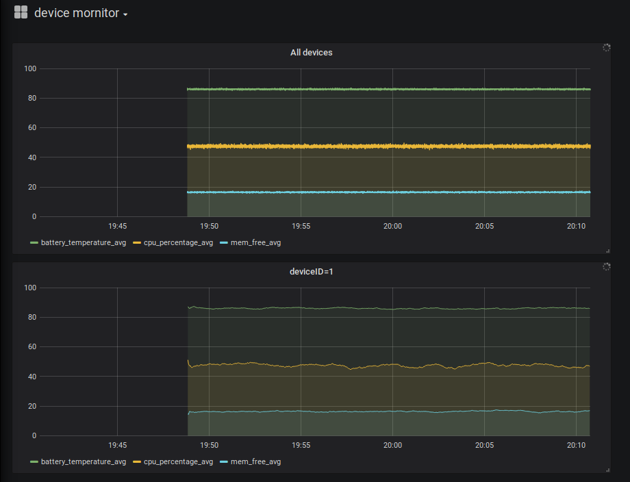

# 横截面聚合引擎、时序聚合引擎和快照引擎在物联网监控中的应用

### 1. 概述
物联网设备（如机床、锅炉、电梯、水表、气表等等）无时无刻不在产生海量的设备状态数据和业务消息数据，采集、计算、存储、分析这些数据有助于进行设备监控、业务分析预测和故障诊断。

DolphinDB作为一个高性能的分布式时序数据库，内置了一个流数据框架，既能实时处理分析这些物联网数据，也能对历史数据进行计算分析，帮助用户利用、发挥这些数据的价值。

DolphinDB内置的流数据框架支持流数据的发布、订阅、预处理、实时内存计算、复杂指标的滚动窗口计算等，是一个运行高效，使用便捷的流数据处理框架。具体介绍详见[DolphinDB流数据教程](https://github.com/dolphindb/Tutorials_CN/blob/master/streaming_tutorial.md)。

在流数据处理框架中，一个非常重要的模块是聚合引擎，它是专门用于流数据实时计算和分析的模块。聚合引擎分两类：

一类是时序聚合引擎，它对数据进行时间轴上的纵向聚合，也即降频计算。

另一类是横截面聚合引擎，它对数据进行横向聚合，它是对相同采样时间、不同设备的相同指标，按照某个算法进行计算。

在流数据存储到分布式表后，为了能快速查询最新实时数据（比如需要展示所有设备的最新状态数据），DolphinDB还提供了一个快照引擎。快照引擎的功能也能用统计函数last完成，但快照引擎的性能更出色。

本教程将举例说明聚合引擎和快照引擎在物联网监控中如何应用。前2个例子是对实时采集的数据进行聚合计算，第3个例子是对历史数据进行回放并聚合计算。

### 2. 应用案例1

2.1 应用场景

物联网设备运维监控平台能帮助用户正确和及时地了解系统的运行状态，发现影响整体系统运行的瓶颈，帮助系统人员进行必要的系统优化和配置变更，甚至为系统的升级和扩容提供依据。强有力的监控和诊断工具还可以帮助运行维护人员快速地分析出应用故障原因，把他们从繁杂重复的劳动中解放出来。运维监测数据通常都是对时间特性比较敏感的数据，比如系统资源指标：CPU、内存、IO、带宽等，以及软件系统指标：存活状态、连接数目、请求数目、超时数目、错误数目、响应时间、服务类型及其他与业务有关的指标。

用DolphinDB搭建监控平台，部署简单，性能优异。本例假设企业总共有1000台设备需要监控运维，每个设备每100ms采集一次数据，采集的数据有三个指标：电池温度、cpu使用率百分比、内存剩余空间。需要完成的任务包括：
* 将采集到的原始数据存入数据库。离线的数据建模需要用到这些历史数据。
* 实时计算每个设备过去一分钟的每个指标的平均值，计算的频率为每两秒钟要进行一次。
* 实时计算所有设备的三个指标的平均值，计算的频率为每100毫秒秒钟要进行一次。
* 因为运维人员需要在最快的时间内掌握设备状态变化，所以前端展示界面每秒查询一次实时运算的结果并刷新指标变化趋势图。
* 运维人员也需要查询所有设备的最新状态数据

2.2 系统设计
	
针对上述场景，首先需要创建一个名为iotDemoDB的分布式数据库用于保存采集的实时数据。数据库按日期和设备两个维度进行数据分区。日期采用值分区，设备采用范围分区。日后清理过期数据，只要简单的删除旧的日期分区就可完成。

启用流数据发布和订阅功能。创建一个时序聚合引擎和一个横截面聚合引擎，用于实时计算，然后将运算结果保存到低频数据表中，供前端轮询。
创建一个快照引擎，能够一次查询所有设备的最新数据并能够区分每个设备。
部署前端Grafana平台展示运算结果的趋势图，设置每1秒钟轮询一次DolphinDB Server，并刷新展示界面。

2.3 实现步骤

(1) 首先定义一个sensorReadings流数据表用于接收实时采集的设备数据，并用enableTableShareAndPersistence函数对sensorReadings表做持久化，内存中保留的最大数据量是100万行。
```
st=streamTable(1000000:0,`deviceID`ts`batteryTemperature`cpuPercentage`memFree,[INT,TIMESTAMP,DOUBLE,DOUBLE,DOUBLE])
enableTableShareAndPersistence(st,`sensorReadings,false, true, 1000000)
```
(2) 通过订阅流数据表sensorReadings，把采集的数据准实时的批量保存到分布式数据库中。分布式表使用日期和设备编号两个分区维度。在物联网大数据场景下，经常要清除过时的数据，这样分区的模式可以简单的通过删除指定日期分区就可以快速的清理过期数据。subscribeTable函数最后两个参数控制数据保存的频率，只有订阅数据达到100万或时间间隔达到10秒才批量将数据写入分布式数据库。

```
tableSchema = table(1000000:0,`deviceID`ts`batteryTemperature`cpuPercentage`memFree,[INT,TIMESTAMP,DOUBLE,DOUBLE,DOUBLE])
db1 = database("",VALUE,2019.04.24..2029.12.31) 
db2 = database("",RANGE,0..10*100)
db = database("dfs://iotDemoDB",COMPO,[db1,db2])
db.createPartitionedTable(tableSchema,"sensorReadings",`ts`deviceID)

dfsTable=loadTable("dfs://iotDemoDB","sensorReadings")
subscribeTable(, "sensorReadings", "saveToDfs", -1, append!{dfsTable}, true, 1000000,10)
```

(3) 用createTimeSeriesAggregator函数创建一个时序聚合引擎， 实时计算每个设备过去一分钟的每个指标的平均值。
函数第二个参数指定了窗口大小为60秒，第三个参数指定每2秒钟做一次求均值运算，第四个参数是运算的元代码，可以由用户自己指定计算函数，任何系统支持的或用户自定义的聚合函数这里都能支持，本例中用avg计算平均值。通过指定分组字段deviceID，函数会将流数据按设备分成1000个队列进行均值运算，每个设备都会按各自的窗口计算得到对应的平均值。
最后通过subscribeTable订阅流数据，在有新数据进来时触发实时计算，并将运算结果保存到一个新的数据流表sensorReadingsAvg中。

> *createTimeSeriesAggregator 参数说明：引擎的名称，窗口时间，运算间隔时间，聚合运算元代码，原始数据输入表，运算结果输出表，时序字段，分组字段，触发GC记录数阈值。*

```
share streamTable(1000000:0, `time`deviceID`batteryTemperatureAvg`cpuPercentageAvg`memFreeAvg, [TIMESTAMP,INT,DOUBLE,DOUBLE,DOUBLE]) as sensorReadingsAvg
metrics = createTimeSeriesAggregator("tsAggr1",60000,2000,<[avg(batteryTemperature),avg(cpuPercentage),avg(memFree)]>,sensorReadings,sensoReadingsAvg,`ts,,`deviceID,2000) 
subscribeTable(, "sensorReadings", "metricEngine", -1, append!{metrics},true)
```
(4) 用createCrossSectionalAggregator函数创建一个横截面聚合引擎，实时计算所有设备的三个指标的平均。
函数第二个参数是运算的元代码，它可以是系统内置或用户自定义的函数，如<[sum(col1), avg(col2)]>，可以对聚合结果使用表达式，如<[avg(col1)-avg(col2)]>，也可以对计算列进行聚合运算，如<[std(col1-col2)]>,本例使用avg求平均值。
第五个参数指定字段deviceID为输入设备的key。第六个参数是表示触发计算的方式。有三个可选项："perRow"，每插入一行数据触发一次计算；"perBatch"，每插入一次数据触发一次计算；"interval"，按一定的时间间隔触发计算。本例取"perBatch"表示插入一批数据计算一次。
最后通过subscribeTable订阅流数据，在有新数据进来时触发实时计算，并将运算结果保存到一个新的数据流表allDevicesReadingsAvg中。

```
allDevicesReadingsAvg = table(1:0, `time`batteryTemperatureAvg`cpuPercentageAvg`memFreeAvg, [TIMESTAMP,DOUBLE,DOUBLE,DOUBLE])
iotCrossAggregator=createCrossSectionalAggregator("crossSectionalAggr", <[avg(batteryTemperature), avg(cpuPercentage),avg(memFree)]>, sensorReadings, allDevicesReadingsAvg, `deviceID, `perBatch)
subscribeTable(,"sensorReadings","iotCrossAggregator",-1,append!{iotCrossAggregator},true)
```
(5) 用registerSnapshotEngine为分布式表注册一个快照引擎，为每个设备的最新数据建立快照。

```
registerSnapshotEngine("dfs://iotDemoDB", "sensorReadings", `deviceID)
```
在分布式表中插入数据后，可用下列查询语句获取每个设备的最新记录

```
select [64] * from loadTable("dfs://iotDemoDB","sensorReadings")
```

(6)在DolphinDB Server端在对数据流做保存、分析的时候，Grafana前端程序每秒钟会轮询实时运算的结果，并刷新趋势图。DolphinDB database提供了Grafana_DolphinDB的datasource插件，关于Grafana的安装以及DolphinDB的插件配置请参考[Grafana配置教程](https://www.github.com/dolphindb/grafana-datasource/blob/master/README.md)。

在完成grafana的基本配置之后，新增一个Graph Panel, 添加2个query如下，第一个用于显示横截面引擎计算的结果，第二个用于时序引擎计算的结果（其中的一个deviceID为1设备）

```
select gmtime(time) as time,batteryTemperatureAvg ,cpuPercentageAvg ,memFreeAvg from sensorReadingsAvg where deviceID = 1
select gmtime(time) as time, batteryTemperatureAvg,cpuPercentageAvg,memFreeAvg from allDevicesReadingsAvg
```



(6) 最后，开始采集数据。
DolphinDB支持ODBC与JDBC等数据接口，同时也提供Python、Java、C#、C++、Json、R等语言的API（编程接口）。应用可以通过API访问DolphinDB，并写入数据。
若实验室没这么多设备，为展示效果，可以在DolphinDB GUI执行以下程序生成模拟数据，并写入流数据表。
 > *数据规模: 1000 个设备，以每个点3个指标、100ms的频率生成数据，以每个指标8个Byte ( Double类型 ) 计算，数据流速是 2.4Mbps，持续1000秒。*
```
def writeData(){
	deviceNum = 1000
	for (i in 0:100000) {
		data = table(take(1..deviceNum,deviceNum) as deviceID ,take(now(),deviceNum) as ts,rand(70..102,deviceNum) as batteryTemperature,rand(15..80,deviceNum) as cpuPercentage,rand(1..32,deviceNum) as memFree)
		sensorReadings.append!(data)
		sleep(100)
	}
}
jobId = submitJob("simulateData", "simulate sensor data", writeData)
```

### 3. 应用案例2
3.1 应用场景

随着大数据和物联网的发展，以工业大数据为主线的技术创新与产业发展趋势正在显现。工业大数据和传统大数据格式、应用范畴上会有些不同，一方面是在设计制造阶段有很多技术数据，包括二维、三维图纸、工艺、数控仿真的图形、算法等非结构化数据，另一方面还有大量的物联网数据，包括生产现场机床采集数据、工业产品现场应用采集数据等。
通过搭建对于数控机床的监控平台，企业用户可以随时了解自己生产线的工作情况，提高生产效率和智能化，也能及时获得异常告警，从而合理安排生产，规避风险等。

DolphinDB在监控平台中，可实现丰富的功能，下面举例简单介绍一下聚合引擎和快照引擎的应用：
* 机床数据采集频率是一秒钟一次 
* 实时计算每个机床过去一分钟的主轴转速指标的最大值和平均值，计算的频率为每两秒钟一次。
* 实时统计各状态机床的总数，即处于加工中、故障、空闲的状态的机床各有多少台，计算的频率为每一秒钟一次。
* 将采集到的原始数据存入数据库。离线的数据建模需要用到这些历史数据。并能查询所有机床的最新状态数据

3.2 系统设计
	
针对上述场景，需要创建流数据表，启用流数据发布和订阅功能。
创建一个时序聚合引擎和一个横截面聚合引擎，用于实时计算，然后将运算结果保存到低频数据表中，供前端轮询。
创建一个快照引擎，能够一次查询所有设备的最新数据并能够区分每个设备。

3.3 实现步骤


(1) 首先定义一个cncSt流数据表用于接收实时采集的机床数据，并用enableTableShareAndPersistence函数对cncSt表做持久化，内存中保留的最大数据量是100万行。虽然机床设备有很多指标，因为本例只涉及2个，所以我们对表结构进行了简化。
```
st=streamTable(1000000:0,`deviceID`ts`RunningStatus`spindleSpeed,[INT,TIMESTAMP,CHAR,INT])
enableTableShareAndPersistence(st,`cncSt,false, true, 1000000)
```
(2) 用createTimeSeriesAggregator函数创建一个时序聚合引擎， 实时计算每个机床过去一分钟的主轴转速指标的平均值和最大值。
函数第二个参数指定了窗口大小为60秒，第三个参数指定每2秒钟做一次求均值运算，第四个参数是运算的元代码，可以由用户自己指定计算函数，任何系统支持的或用户自定义的聚合函数这里都能支持，本例中用avg计算平均值、max计算最大值。通过指定分组字段deviceID，函数会将流数据按机床分别进行运算，每个机床都会按各自的窗口计算得到对应的统计值。
最后通过subscribeTable订阅流数据，在有新数据进来时触发实时计算，并将运算结果保存到一个新的数据流表cncCompSt中。

```
share streamTable(1000000:0, `time`deviceID`spindleSpeedAvg`spindleSpeedMax, [TIMESTAMP,INT,INT,INT]) as cncCompSt
metrics = createTimeSeriesAggregator("tsAggr1",60000,2000,<[avg(spindleSpeed),max(spindleSpeed)]>,cncSt,cncCompSt,`ts,,`deviceID,2000) 
subscribeTable(, "cncSt", "metricEngine", -1, append!{metrics},true)
```
(4) 用createCrossSectionalAggregator函数创建一个横截面聚合引擎，实时计算所有机床的指标统计值。
函数第二个参数是运算的元代码，它可以是系统内置或用户自定义的函数，如<[sum(col1), avg(col2)]>，可以对聚合结果使用表达式，如<[avg(col1)-avg(col2)]>，也可以对计算列进行聚合运算，如<[std(col1-col2)]>,本例使用自定义函数。
第五个参数指定字段deviceID为输入设备的key。第六个参数是表示触发计算的方式。有三个可选项："perRow"，每插入一行数据触发一次计算；"perBatch"，每插入一次数据触发一次计算；"interval"，按一定的时间间隔触发计算。本例取"perBatch"表示插入一批数据计算一次。
最后通过subscribeTable订阅流数据，在有新数据进来时触发实时计算，并将运算结果保存到一个新的数据流表allCncSt中。

```
defg countStatus(col, status) {
	return sum(col == status)
}

allCncSt = table(1:0, `time`count0`count1`count2, [TIMESTAMP,INT,INT,INT])
crossAggregator1=createCrossSectionalAggregator("crossSectionalAggr", <[countStatus(RunningStatus,0), countStatus(RunningStatus,1),countStatus(RunningStatus,2)]>, cncSt, allCncSt, `deviceID, `perBatch)
subscribeTable(,"cncSt","crossAggregator1",-1,append!{crossAggregator1},true)
```
(5) 通过订阅流数据表cncSt，把采集的机床数据准实时的批量保存到分布式数据库中。分布式表使用日期和机床编号两个分区维度。
```
tableSchema = table(1000000:0,`deviceID`ts`RunningStatus`spindleSpeed,[INT,TIMESTAMP,CHAR,INT])
db1 = database("",VALUE,2019.10.01..2029.12.31) 
db2 = database("",RANGE,0..10*100)
db = database("dfs://cncDB",COMPO,[db1,db2])
db.createPartitionedTable(tableSchema,"cncReadings",`ts`deviceID)

dfsTable=loadTable("dfs://cncDB","cncReadings")
subscribeTable(, "cncReadings", "saveToCncDfs", -1, append!{dfsTable}, true, 1000000,10)
```

用registerSnapshotEngine为分布式表注册一个快照引擎，为每个机床的最新数据建立快照。

```
registerSnapshotEngine("dfs://cncDB", "cncReadings", `deviceID)
```
在分布式表中插入数据后，可用下列查询语句获取每个机床的最新数据。

```
select [64] * from loadTable("dfs://cncDB","cncReadings")
```

### 3. 应用案例3
4.1 应用场景

有一个历史数据集（可从https://timescaledata.blob.core.windows.net/datasets/devices_big.tar.gz下载），数据集包含 3000 个设备在 10000 个时间间隔（2016.11.15 - 2016.11.19）上的传感器时间, 设备 ID, 电池, 内存, CPU 等时序统计信息。
现在需要回放数据并计算每个时间间隔所有设备的电池温度的平均值。

4.2 系统设计

先把csv格式的数据集导入dolphinDB数据表，并建立流数据表。然后通过对数据表的回放，把数据写入流数据表。
启用流数据发布和订阅功能。创建一个横截面聚合引擎，用于实时计算，然后将运算结果保存到低频数据表中。

4.3 实现步骤

(1) 首先把csv数据集导入DolphinDB内分布式表readings。
```
TYPES_READINGS  = `DATETIME`SYMBOL`INT`SYMBOL`DOUBLE`SYMBOL`DOUBLE`DOUBLE`DOUBLE`LONG`LONG`SHORT`SYMBOL
schema_readings = table(COLS_READINGS, TYPES_READINGS)

TIME_RANGE 	= 2016.11.15 +0..4
ID_RANGE 	= ('demo' + lpad((0..10 * 300)$STRING, 6, "0"))$SYMBOL

time_schema   = database('', RANGE, TIME_RANGE)
id_schema     = database('', RANGE, ID_RANGE)

db = database(FP_DB, COMPO, [time_schema, id_schema])
timer readings = loadTextEx(db, `readings, `time`device_id, FP_READINGS, , schema_readings)
```

(2) 其次建立流数据表。
```
share streamTable(10000000:0, schema_readings.COLS_READINGS, schema_readings.TYPES_READINGS) as streamoutput
enableTablePersistence(streamoutput, true, false, 1000000)
```
(3) 用replay回放数据集。
```
readings = loadTable(FP_DB, `readings, , false)
ds = replayDS(<select * from readings>, `time, );
replay([ds], [streamoutput], `time, `time, 1, 4)
submitJob("a", "a", replay, [ds], [output2], `time, `time, , 4)
```
(4) 建立一个横截面聚合引擎进行计算。
```
all_devices_readings_avg = table(1:0, `time`battery_temperature_avg, [TIMESTAMP,DOUBLE])
iotCrossAggregator1=createCrossSectionalAggregator("CrossSectionalDemo1", <[avg(battery_temperature)]>, streamoutput, all_devices_readings_avg, `deviceID, `perBatch)
subscribeTable(,"streamoutput","iotCrossAggregator1",-1,append!{iotCrossAggregator1},true)

```
(5) 最后就可以查询结果了。
```
select gmtime(time) as time, battery_temperature_avg from all_devices_readings_avg
```
---
[完整脚本](script/Aggregator_script)
