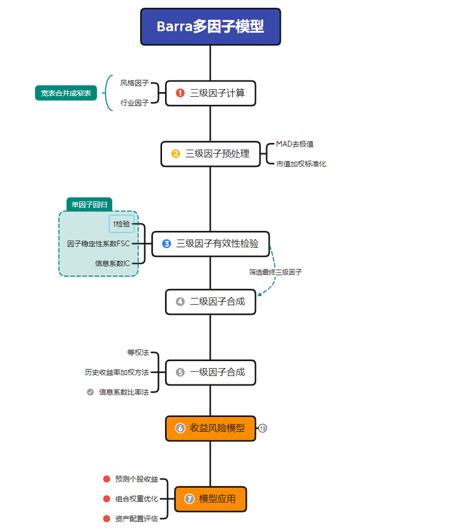
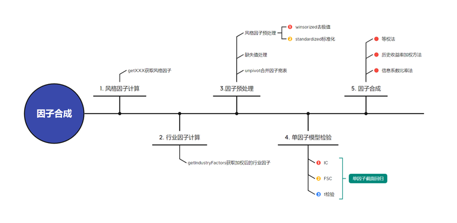
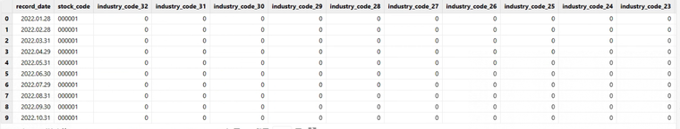
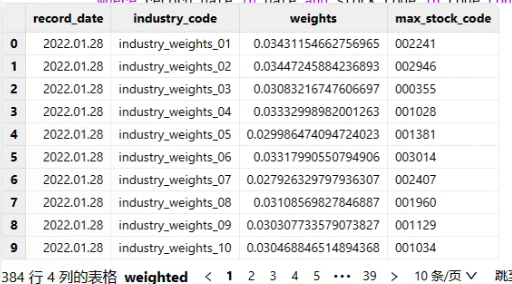
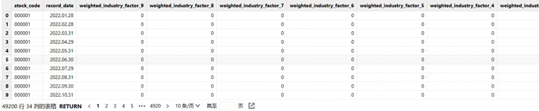
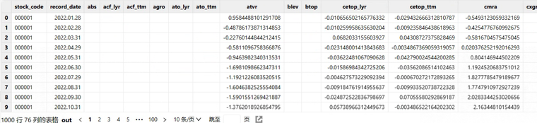
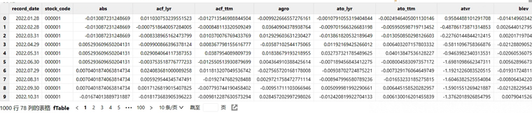
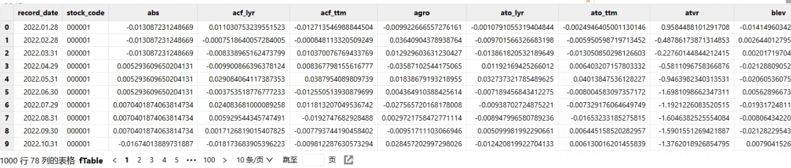
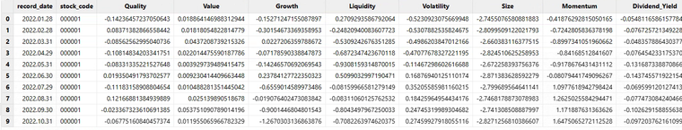
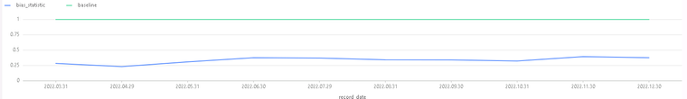

# 基于 DolphinDB 的 Barra 多因子风险模型实践

2018 年 MSCI 发布了中国 A 股全市场股票模型（The Barra China Equity Model，即 Barra CNE6 模型）。与传统的时间序列回归模型有所不同，Barra 模型能够更高效准确地捕捉横截面上机构头寸在各种因子（包括市值等风格因子）上的暴露。并且当模型中纳入具有时序记忆的变量时，它可以共享截面回归和时序回归模型的一些优良性质。该模型采用多层次的因子体系，能够更精细地预测和解释中国股票市场的风险，对中国 A 股的风险评估、组合优化和量化策略产生了积极且广泛的影响。

本文将详细介绍通过 DolphinDB 实现 Barra CNE6 中的 CNLT 长期模型的整个流程。
- [1 Barra 多因子模型简介](#1-barra-多因子模型简介)
  - [1.1 Barra 多因子模型](#11-barra-多因子模型)
  - [1.2 Barra 收益风险模型](#12-barra-收益风险模型)
- [2 基于 DolphinDB 的因子合成](#2-基于-dolphindb-的因子合成)
  - [2.1 风格因子计算](#21-风格因子计算)
  - [2.2 行业因子计算](#22-行业因子计算)
  - [2.3 因子预处理](#23-因子预处理)
  - [2.4 单因子模型检验](#24-单因子模型检验)
  - [2.5 多因子合成](#25-多因子合成)
  - [2.6 自定义因子的多因子合成](#26-自定义因子的多因子合成)
- [3 基于 DolphinDB 的收益风险模型](#3-基于-dolphindb-的收益风险模型)
  - [3.1 基于 WLS 构建 Barra 多因子模型](#31-基于-wls-构建-barra-多因子模型)
  - [3.2 风险调整](#32-风险调整)
  - [3.3 基于 DolphinDB 的收益风险模型展示](#33-基于-dolphindb-的收益风险模型展示)
- [4 基于 DolphinDB 的 Barra 多因子模型应用](#4-基于-dolphindb-的-barra-多因子模型应用)
  - [4.1 预测个股收益](#41-预测个股收益)
  - [4.2 组合权重优化](#42-组合权重优化)
  - [4.3 资产配置评估](#43-资产配置评估)
- [5 基于 DolphinDB的Barra模型实现和应用](#5-基于-dolphindb的barra模型实现和应用)
  - [5.1 因子计算模块 barraFactorsCal](#51-因子计算模块-barrafactorscal)
  - [5.2 因子合成模块 barraFactorsMerge](#52-因子合成模块-barrafactorsmerge)
  - [5.3 因子模型模块 barraFactorsModel](#53-因子模型模块-barrafactorsmodel)
  - [5.4 注意事项](#54-注意事项)
- [6 总结](#6-总结)
- [7 参考文献](#7-参考文献)
- [8 附录](#8-附录)

## 1 Barra 多因子模型简介

### 1.1 Barra 多因子模型

Barra 多因子模型基于多因子回归体系，将风格因子、市场因子和行业因子与收益率进行联合建模，以获取收益率和特质收益率。本文构建的 Barra 模型以 CNE6 模型为准。

CNE6 模型是 Barra 的面向中国股票市场的多因子模型。该模型考虑了一个国家因子、多个行业因子以及多个风格因子。假设市场中共有 N 支股票，P 个行业，以及 Q 个风格因子。在任意给定时间点，该模型使用因子暴露和个股收益率构建截面回归（cross-sectional regression）如下


其中  是第 n 支股票的收益率， 是无风险收益率。 是股票 n 在行业  的暴露，如果假设一个公司只能属于一个行业，那么  的取值为 0（代表该股票不属于这个行业）或者 1（代表该股票属于这个行业）。 是股票 n 在风格因子  的暴露，它的取值经过了某种标准化（标准化的方法会在下文说明）。 为股票 n 的超额收益中无法被因子解释的部分，因此也被称为该股票的特异性收益。 为国家因子的因子收益率（所有股票在国家因子上的暴露都是1）； 为行业  因子的因子收益率； 为风格因子  的因子收益率。
下图为 Barra 多因子模型的流程图。从计算初始因子开始，对每个因子进行单因子模型检验，包括稳定性、有效性和一致性的相关检验；根据检验结果，使用 DolphinDB 接口合成指定的一级和二级因子。对于已合成的因子，DolphinDB 建立了收益预测模型和风险矩阵调整，并从拟合优度、偏差统计量以及 Q 统计量等角度对模型进行了评估。最后，基于收益风险模型对投资组合进行风险评估和组合优化。



<center style="color:black;">Barra多因子模型流程图</center>

### 1.2 Barra 收益风险模型

Barra 多因子模型的核心目的在于准确评估个股和因子的风险，并通过时序的收益风险评估辅助投资判断。基于 CNE6 模型，可以简化个股收益率为因子收益率和个股特异性收益率的线性组合。其中， 为 N 个个股收益率的向量（N\*1 维）， 为当期因子暴露矩阵（N\*k 维，k 为因子个数）， 为 k 个因子的收益率向量（k*\1 维）， 为 N 个个股的特异性收益率的向量（N*1 维）。


对上述等式左右两边分别求协方差矩阵得到如下公式，将个股协方差矩阵  分解为因子收益率协方差矩阵 、特质收益协方差矩阵 。


若从股票收益率的协方差矩阵的角度评估风险，可能存在由于股票数 N 远大于交易日期数 252 导致股票收益率协方差矩阵满秩的问题，且需要计算 N*(N+1)/2 次，复杂度很高。基于 Barra 模型，为求得股票收益率的风险矩阵 ，只需要分别求得因子收益率的风险矩阵  以及个股特异性收益的风险矩阵  ，只需要计算 n * (n + 1) / 2 + n 次，进一步规避了收益率协方差矩阵满秩的问题。

## 2 基于 DolphinDB 的因子合成

本文首先基于 `barraFactorsCal` 模块得到用于建模的多因子窄表，具体流程如下：

1. 基于 `getXXXX` 函数计算风格因子。
2. 基于 `getIndustryFactors` 函数计算行业因子。
3. 基于 `getRegTable` 函数对风格因子、行业因子合并，并填充缺失值得到用于单因子模型检验的回归因子表。
4. 基于 `getFactorsValidation` 函数针对回归因子表生成每个因子对应的 IC 、FSC 指标。
5. 针对不同因子加权方法，基于 `getFSLevelFactor` 函数合成三级因子得到用于建立 Barra 多因子模型的一级因子窄表。



<center style="color: black;">因子合成流程图</center>

### 2.1 风格因子计算

首先计算单个三级风格因子，一级、二级风格因子基于如下风格因子关系表合成得到。其中具有预测属性的 ETOPF_STD, ETOPF, EGRLF, DTOPF 等因子对模型的影响不稳定，暂不考虑。

风格因子关系表

<table>
<thead>
  <tr>
    <th>一级因子<br></th>
    <th>二级因子<br></th>
    <th>三级因子<br></th>
    <th>定义<br></th>
  </tr>
</thead>
<tbody>
  <tr>
    <td rowspan="23">Quality</td>
    <td rowspan="3">Earnings Quality</td>
    <td>ABS</td>
    <td>资产负债表应计项目</td>
  </tr>
  <tr>
    <td>ACF_TTM</td>
    <td>现金流量表应计项目_滚动</td>
  </tr>
  <tr>
    <td>ACF_LYR</td>
    <td>现金流量表应计项目_静态</td>
  </tr>
  <tr>
    <td rowspan="6">Earnings Variability<br> </td>
    <td>VSAL_TTM</td>
    <td>营收波动_滚动</td>
  </tr>
  <tr>
    <td>VSAL_LYR</td>
    <td>营收波动_静态</td>
  </tr>
  <tr>
    <td>VERN_TTM</td>
    <td>盈利波动_滚动</td>
  </tr>
  <tr>
    <td>VERN_LYR</td>
    <td>盈利波动_静态</td>
  </tr>
  <tr>
    <td>VFLO_TTM</td>
    <td>现金流波动_滚动</td>
  </tr>
  <tr>
    <td>VFLO_LYR</td>
    <td>现金流波动_静态</td>
  </tr>
  <tr>
    <td rowspan="3">Investment Quality</td>
    <td>AGRO</td>
    <td>总资产增长率</td>
  </tr>
  <tr>
    <td>IGRO</td>
    <td>新发股增长率</td>
  </tr>
  <tr>
    <td>CXGRO</td>
    <td>资本支出增长率</td>
  </tr>
  <tr>
    <td rowspan="3">Leverage</td>
    <td>MLEV</td>
    <td>市场杠杆</td>
  </tr>
  <tr>
    <td>BLEV</td>
    <td>账面杠杆</td>
  </tr>
  <tr>
    <td>DTOA</td>
    <td>资产负债比</td>
  </tr>
  <tr>
    <td rowspan="8">Profitability</td>
    <td>ATO_TTM</td>
    <td>资产周转率_滚动</td>
  </tr>
  <tr>
    <td>ATO_LYR</td>
    <td>资产周转率_静态</td>
  </tr>
  <tr>
    <td>GP_TTM</td>
    <td>资产毛利率_滚动</td>
  </tr>
  <tr>
    <td>GP_LYR</td>
    <td>资产毛利率_静态</td>
  </tr>
  <tr>
    <td>GPM_TTM</td>
    <td>销售毛利率_滚动</td>
  </tr>
  <tr>
    <td>GPM_LYR</td>
    <td>销售毛利率_静态</td>
  </tr>
  <tr>
    <td>ROA_TTM</td>
    <td>总资产收益率_滚动</td>
  </tr>
  <tr>
    <td>ROA_LYR</td>
    <td>总资产收益率_静态</td>
  </tr>
  <tr>
    <td rowspan="8">Value</td>
    <td>Btop</td>
    <td>BTOP</td>
    <td>账面市值比</td>
  </tr>
  <tr>
    <td rowspan="5">Earning Yield</td>
    <td>CETOP_TTM</td>
    <td>现金盈利价格比_滚动</td>
  </tr>
  <tr>
    <td>CETOP_LYR</td>
    <td>现金盈利价格比_静态</td>
  </tr>
  <tr>
    <td>ETOP_TTM</td>
    <td>预测盈利收益率_滚动</td>
  </tr>
  <tr>
    <td>ETOP_LYR</td>
    <td>预测盈利收益率_静态</td>
  </tr>
  <tr>
    <td>EM</td>
    <td>企业盈利价值比率</td>
  </tr>
  <tr>
    <td rowspan="2">Long-Term Reversal</td>
    <td>LTRSTR</td>
    <td>长期反转相对强度</td>
  </tr>
  <tr>
    <td>LTHALPHA</td>
    <td>长期反转超额收益</td>
  </tr>
  <tr>
    <td rowspan="4">Growth</td>
    <td rowspan="4">Growth</td>
    <td>EGRO_TTM</td>
    <td>每股营收增长率_滚动</td>
  </tr>
  <tr>
    <td>EGRO_LYR</td>
    <td>每股营收增长率_静态</td>
  </tr>
  <tr>
    <td>SGRO_TTM</td>
    <td>每股收益增长率_滚动</td>
  </tr>
  <tr>
    <td>SGRO_LYR</td>
    <td>每股收益增长率_静态</td>
  </tr>
  <tr>
    <td rowspan="4">Liquidity</td>
    <td rowspan="4">Liquidity</td>
    <td>STOM</td>
    <td>月换手率</td>
  </tr>
  <tr>
    <td>STOQ</td>
    <td>季换手率</td>
  </tr>
  <tr>
    <td>STOA</td>
    <td>年换手率</td>
  </tr>
  <tr>
    <td>ATVR</td>
    <td>年化交易比率</td>
  </tr>
  <tr>
    <td rowspan="4">Volatility</td>
    <td>Beta</td>
    <td>HBETA</td>
    <td>贝塔</td>
  </tr>
  <tr>
    <td rowspan="3">Residual Volatility</td>
    <td>HSIGMA</td>
    <td>特异波动率</td>
  </tr>
  <tr>
    <td>DASTD</td>
    <td>波动率</td>
  </tr>
  <tr>
    <td>CMRA</td>
    <td>累计收益</td>
  </tr>
  <tr>
    <td rowspan="2">Size</td>
    <td>Size</td>
    <td>LNCAP</td>
    <td>对数市值</td>
  </tr>
  <tr>
    <td>Mid Cap</td>
    <td>MIDCAP</td>
    <td>中市值</td>
  </tr>
  <tr>
    <td rowspan="2">Momentum</td>
    <td rowspan="2">Momentum</td>
    <td>RSTR</td>
    <td>市场相对强度</td>
  </tr>
  <tr>
    <td>HALPHA</td>
    <td>历史超额收益</td>
  </tr>
  <tr>
    <td>Dividend Yield</td>
    <td>Dividend Yield</td>
    <td>DTOP</td>
    <td>股息收益率</td>
  </tr>
</tbody>
</table>


在调用计算单个三级风格因子时，采用 get + 因子名（首字母大写），例如，Blev（Beta Leverage）, Stom（Size Turnover Momentum）, Stoq（Stock Quality）因子计算如下：

```
getBlev(startTime = 2022.01.03,windows = 365,endTime = 2023.01.02)   
getStom(startTime = 2022.01.03,windows = 21,endTime = 2023.01.02)
getStoq(startTime = 2022.01.03,windows = 63,endTime = 2023.01.02)
```

单个因子计算函数的返回结果均是窄表，返回结果大致如下：


<center style="color: black;">单个因子计算函数返回的窄表结果示例图</center>

### 2.2 行业因子计算

采用申万一级 `SW_2021`、中信一级 `CITIC` 行业分类哑变量因子，CNLT 依据市值给出权重，接口中提供行业因子市值加权。

| **接口**              | **说明**                                                     |
| :-------------------- | :----------------------------------------------------------- |
| `getIndustry`         | 获取原始行业因子步骤一：获取月末交易日和行业交易代码。步骤二：基于交易日数据获取行业数据。步骤三：基于 onehot 编码生成宽表并求和汇总。 |
| `getIndusrtyWeighted` | 获取行业因子权重步骤一：获取月末交易日和行业交易代码。步骤二：基于交易日数据获取各行业数据、市场数据。步骤三：关联上述两表，计算每个行业占总行业的权重，并找出在指定行业中占比最大的个股。 |
| `getIndusrtyFactor`   | 获取加权后的行业因子步骤一：`getIndustry` 获取原始行业因子。步骤二：`getIndusrtyWeighted` 获取行业权重。 |

部分返回结果如下：

```
getIndustry(startTime = 2022.01.01,endTime = 2023.01.02,method = 'SW_2021')
```



<center style="color: black;">对应的部分返回结果图一</center>
<br>


```
getIndusrtyWeighted(startTime = 2022.01.03,endTime = 2023.01.02,method = 'SW_2021')
```



<center style="color: black;">对应的部分返回结果图二</center>
<br>


```
getIndusrtyFactor(startTime = 2022.01.03,endTime = 2023.01.02,method = 'SW_2021')
```



<center style="color: black;">对应的部分返回结果图三</center>
<br>

### 2.3 因子预处理

在对原始三级风格因子进行计算后，通常需要经过一定的标准化的数据清洗流程才能进一步合成因子，DolphinDB 使用了 MAD 法去极值并采用 CNLT 中的市值标准化流程。

#### 2.3.1 风格因子 MAD 法去极值

MAD 方法（median absolute deviation 方法），该方法使用中位数，较于传统的均值标准差具有稳健（robust）性质，不会被极端异常值影响结果，是对减均值后标准差处理的改进方法。MAD 方法相对于其他离群值检测方法的优点在于它对离群值的鲁棒性较强。本文中 MAD 方法对应接口函数 `winsorized` 。

```
/* winsorized
对因子表进行winsorized处理
因子表必须包含三列：记录日期、股票代码和原始因子，其中原始因子必须是第三列
Input :
         tbName
Output:  
         factor table after winsorized */
```

MAD 方法的具体实现步骤如下：

1. 计算数据集的中位数（Median）作为数据的中心位置。
2. 对每个数据点，计算其与中位数的绝对偏差（Absolute Deviation）。
3. 计算所有绝对偏差的中位数，即 Median Absolute Deviation。

     

4. 确定离群值的阈值。通常，离群值被定义为与中位数的偏差超过一定倍数（如 3 倍）的 MAD 的数据点。

     

5. 鉴定离群值。对于超过阈值的数据点，可以将其标记为离群值或进行进一步的分析。

     

#### 2.3.2 风格因子市值加权标准化

市值加权标准化是为了去除极端市值对因子计算贡献产生影响（Barra CNLT）。该方法是为了将因子量纲统一在相接近的水平。对于第 *n* 个个股的第 *k* 个原始因子暴露 ，标准化流程为：


其中 和 分别是对应因子的市值加权均值、等权标准差。(Barra CNLT)

本文市值加权标准化对应接口函数 `standardized`，其中 `adjusted=true` 表示采纳市值中性化处理。

```
/* standardized
对因子表进行标准化和市值中性化处理
因子表必须有三列：记录日期、股票代码和原始因子，原始因子必须是第三列
Input :
         tbName
         adjusted    Market-neutralize or not
Output:  
         factor table after standardized */
```

#### 2.3.3 风格因子、行业因子合并

以上两种接口函数 `winsorized`, `standardized` 嵌入在 `getAllFactors` 函数中，`getAllFactors` 通过指定参数 *normlizing* 和 *scaling* 分别实现标准化和去极值的过程。此外在得到行业因子、风格因子后，基于 `getAllFactors` 函数可以得到合并了上述所有因子的宽表，可进一步用于单因子的有效性检验。

```
/* getAllFactors
获取所有因子
Input:   normlizing           true   (Default)   标准化
         scaling              true   (Default)   去极值
         decap                true   (Default)   市值中性化
         industry_weighted    true   (Default)   行业市值权重加权
         industry_method     'CITIC' (Default)、'SW_2021'
         startTime         2022.01.03(Default)
         endTime           2023.01.02(Default)
Output:  
         factor table */
```

```
Factors = getAllFactors(st=st,et =et, normlizing = true,
                        scaling = true,decap = false,industry_method = 'CITIC',
                        industry_weighted = false)
select * from Factors limit 100
```

#### 2.3.4 因子缺失值处理

在构建因子回归模型前，为避免因子缺失值对于回归模型结果的影响，需要对因子缺失值做进一步的处理。本文中针对所有原始因子的缺失值处理的函数接口为 `getRegTable`，本文选择采用均值填充以处理缺失值。

```
/* getRegTable
 获取用于回归的经过处理的回归因子表、包含个股收益率、因子暴露、行业因子、行业变量、回归权重
Input:   
        factorsTable         false  (Default)          是否使用提供的初始因子表
        tbName               NULL   (Default)          初始因子表
        normlizing           true   (Default)          标准化
        scaling              true   (Default)          去极值
        decap                true   (Default)          回归市值中性化
        industry_weighted    true   (Default)          行业因子加权重
        industry_method     'CITIC' (Default)、'SW_2021'
        st                2022.01.03(Default)
        et                2023.01.02(Default)
Output:  
        regression table  
 */
```

注意：初始因子表 `tbName`，当且仅当 *factorsTable* 为 true 时，需要传入已经使用 `getAllFactors` 函数标准化过、去极值过、市值中性化过、行业因子加权重过的全因子表（或者筛选过股票后的部分个股因子表）。并且若提供因子表，该函数相应参数 *normlizing*, *scaling*, *decap*, *weighted* 是 false 或 true 对结果没有影响，即 `tmpReg = getRegTable(factorsTable = true,tbName = Factors,st= st,et = et)`。

通过调用：

```
fTable = getRegTable(factorsTable = true,tbName = Factors,st= st,
                     et = et,normlizing = normlizing ,scaling = scaling,
                     decap = decap, industry_method = industry_method, 
                     industry_weighted = industry_weighted)
```

执行上述命令可以实现如下效果：

处理之前，`getAllFactors` 得到的原始三级因子宽表：



<center style="color: black;">处理前的原始三级因子宽表示例图</center>

处理之后，`getRegTable` 处理后的三级因子宽表：



<center style="color: black;">处理后的三级因子宽表示例图</center>

### 2.4 单因子模型检验

#### 2.4.1 WLS 回归模型

- 针对风格因子 *s*，单因子的检验回归模型如下：


此处使用 WLS（Weighted Least Squares，加权最小二乘） 以  为因变量，以风格因子 *s* 的因子载荷  为自变量，预测 （风格因子的收益率）。

- 针对行业因子 *i，*单因子的检验回归模型如下：


此处使用 WLS 以  为因变量，以行业因子 *i* 的因子载荷  为自变量，预测（行业因子的收益率）

本文的 WLS 回归模型的接口为 `getOneFactorValidate`，函数嵌套在 `styleValidate` 风格因子检验函数、`industryValidate` 行业因子检验函数中。

```
/* getOneFactorValidate
获取moving wls单因子回归结果统计量的聚合函数
Input:   y          因变量
         x          自变量
         w          权重
Output:  
         wls stat  "beta","tstat","R2","AdjustedR2", "Residual" */
```

#### 2.4.2 T 检验

t 值检验是检验对应变量的因子收益是否显著区别于 0，可以用来衡量因子的有效性以及一致性。其计算方法为：，其中  为估计因子收益   的标准误差。本文的 t 检验主要基于 `getOneFactorValidate` 接口的 WLS 回归模型得到的 t 统计量进行评估。

#### 2.4.3 Factor Stability Coefficient

在构建多因子模型时，必须要考虑到因子暴露的稳定性。如果因子暴露矩阵每次计算时的变化特别大，那么该模型的稳健性较差。故本文引入因子稳定性系数（Factor Stability Coefficient, FSC）指标，其定义为这个月的因子暴露矩阵与下个月因子暴露矩阵的相关性。

通常情况下，FSC 指标是通过比较从不同数据集或不同时间点上进行的、两个独立的因子分析所得到的因子载荷来进行计算的。本文通过 `getFactorsValidation` 函数基于斯皮尔曼相关系数（Spearman's Rank Correlation Coefficient）计算 FSC 指标，令 为因子暴露  的第 *t* 期与第 *t+1* 期的位次值之差。，则 FSC 系数计算方法为：


研究人员通常使用阈值来解释 Factor Stability Coefficient。例如，FSC 大于 0.8 通常被认为表示较好的稳定性或一致性，而低于 0.5 的值可能表示稳定性较差。

#### 2.4.4 Information Coefficient

Information Coefficient（IC）值是因子对下期收益率的预测与下期实际收益率的相关性，IC 代表的是预测值和实现值之间的相关性，通常用于评价预测能力（即选股能力）。在实际计算中，因子 𝑘 的 IC 值一般是指个股第 𝑇 期在因子 𝑘 上的暴露度与 𝑇 +1 期的收益率的相关系数。因子 IC 值反映的是个股下期收益率和本期因子暴露度的线性相关程度，表示使用该因子进行收益率预测的稳健性。IC 的计算方式有两种：normal IC、rank IC。本文在 `getFactorsValidation` 函数基于 *Spearman* 相关系数计算 Rank IC 值。


IC 值被认为在 0.03 上时与市场存在一致或相反的波动规律，此时该因子存在一定的有效性。

#### 2.4.5 基于 DolphinDB 实现单因子有效性检验

本文的单因子有效性检验的对应接口函数 `getFactorsValidation`。该函数通过输入计算得到的全因子表，给出了每一个单因子模型的单因子收益，t  统计量，拟合优度，FSC 指标和 IC 值。通过这些值可以全面系统地对所有因子进行分析，如下列图所示：

```
Input:   
         factorsTable         false  (Default)   是否使用提供的因子表
         tbName               NULL   (Default)   回归因子表
         normlizing           true   (Default)   标准化
         scaling              true   (Default)   去极值
         decap                true   (Default)   市值中性化
         industry_weighted    true   (Default)   行业因子加权重
         industry_method     'CITIC' (Default)、'SW_2021'
         st                   2022.01.03(Default)
         et                   2023.01.02(Default)
Output:  
         factor test table  factor_return、tstat、R2、fsc、IC
         */
```

- 步骤一：首先获取所有因子的检验指标。

```
// 获取单风格因子有效性、一致性、稳定性检验
factorsValid = getFactorsValidation(factorsTable = true,tbName = out,st=2022.01.03,
                                    et =2023.01.02, normlizing = true,scaling = true,
                                    decap = true,industry_method = 'CITIC',
                                    industry_weighted = true)
```

- 步骤二：绘制因子的 FSC 月频时序图，评价因子稳定性。

```
tmp = select record_date,valueType.regexReplace("_stat","") as valueType,
             fsc from factorsValid 
tmppivot = select fsc from tmp pivot by record_date,valueType
tbfsc = sql(select = sqlCol(tmppivot.columnNames()[11:20]),from = tmppivot).eval()
plot(tbfsc,tmppivot.record_date,extras={multiYAxes: false},title = "因子fsc 月频时序图")
```


<center style="color: black;">因子的 FSC 月频时序图</center>

FSC 大部分处于 0.8 以上的因子被公认为因子具备较高的稳定性。上图中除 em, dastd, dtoa 外的其他因子具备较好的稳定性。

- 步骤三：绘制因子的 IC 月频时序图，评价因子一致性。IC 值被认为在 0.03 上时与市场存在一致或相反的波动规律，此时该因子存在一定的有效性。

```
tmp1 = select record_date,valueType.regexReplace("_stat","") as valueType,
              abs(ic) as ic from factorsValid 
tmppivot1 = select ic from tmp1 pivot by record_date,valueType
tbic = sql(select = sqlCol(tmppivot1.columnNames()[2:10]),from = tmppivot1).eval()
baseline = take(0.03,(shape tbic)[0])
plot(table(tbic,baseline),tmppivot1.record_date,
    extras={multiYAxes: false},title = "因子ic 月频时序图")
```


<center style="color: black;">因子的 IC 月频时序图</center>

可以观察到 atvr（Annualized Traded Value Ratio，年交易比值）因子在 2017 年前保持着较强的相关性，而 2018-2022 年期间 8 个因子呈现周期性起伏的规律。

- 步骤四：绘制因子 t_stat，评价因子有效性。

```
tmp2 = select record_date,valueType.regexReplace("_stat","") as valueType,
              tstat from factorsValid 
tmppivot2 = select tstat from tmp2 pivot by record_date,valueType
tbstat = sql(select = sqlCol(tmppivot2.columnNames()[11:20]),from = tmppivot2).eval()

baseline_neg = take(-0.03,(shape tbstat)[0])
baseline_pos = take(0.03,(shape tbstat)[0])
plot(table(tbstat,baseline_neg,baseline_pos),tmppivot2.record_date,
    extras={multiYAxes: false},title = "因子t_stat 月频时序图")
```


<center style="color: black;">因子 t_stat 月频时序图</center>

图中大部分因子的 t 值距离基线 0.03 和 -0.03 有相当的距离。例如 dastd 和 cmra，一个显著高于 0.03，另一个则显著低于 -0.03。由此可得结论：在 18 年之前，这两个因子与市场存在着显著的正负相关性。

### 2.5 多因子合成

针对已经得到的三级因子和因子的有效性识别的结果，用户可以进行下一步因子的合成。因子合成的方法参考华泰证券中给出的部分方法，例如等权法和历史信息法。

1. 等权法（equal），对相应的三级因子等权合成二级、一级因子。例如对 ABS、ACF_TTM 这两个因子各赋1/2的权重合成 Earnings Quality 因子。
2. 历史收益率加权方法（ir），根据在单因子模型检验获得中的三级因子收益率标准化后得到加权系数加权得到二级因子。
3. 信息系数比率法（ic_ir），由因子检验获得的 IC 值对因子进行合成。举例来说，设  维的矩阵  为过去  个截面期上的  个因子的 IC 矩阵， 是矩阵  的行均值， 的矩阵  是  的协方差阵，则可以取  作为权重加权得到各级因子。

本文因子合成的对应接口函数 `getFSLevelFactor`，其中 *firstFactors* 中二级因子的名称需要与 *secondFactors* 中的二级因子的名称一一对应；*secondFactors* 中的三级因子需要与输入的因子表 *factorsTable* 字段名对应（支持大小写匹配）。

```
Input:   
         factorsTable     NULL  (Default) (getRegTable函数返回的全因子表）
         factorsValid     NULL  (Default) (getFactorsValdition接口返回的单因子收益和检验表)
        
         firstFactors     NULL        一级因子二级因子关系json
         secondFactors    NULL        二级因子三级因子关系json
         normlizing       true         是否对合成的因子标准化
         method           "equal"等权、 "ir"历史收益率、"ic_ir"信息系数比率 合成因子方法
         level            "S"、"F"    指定一级二级因子  合成二级(S)一级(F)风格因子
 

Output:  
         factorsTable     返回按指定关系合成的(可直接用于回归模型的)风格大类因子和行业因子
```

```
st = 2022.01.03 
et = 2023.01.02
normlizing = true
scaling = true
decap = true
industry_method = 'CITIC'
industry_weighted = true
Factors = getAllFactors(st= st,et = et, normlizing = normlizing,scaling = scaling,
                        decap = decap,industry_method = industry_method,
                        industry_weighted = industry_weighted)

select * from Factors limit 100

// 对原始因子宽表的缺失值进行处理
fTable = getRegTable(factorsTable = true,tbName = Factors,st= st,et = et, 
                     normlizing = normlizing ,scaling = scaling ,
                     decap = decap,industry_method = industry_method,
                     industry_weighted = industry_weighted)

// 因子有效性检验
// 获取单风格因子有效性、一致性、稳定性检验
factorsValid = getFactorsValidation(factorsTable = true,tbName = Factors,st = st,
                                    et = et , normlizing = normlizing,scaling = scaling,
                                    decap = decap,industry_method = industry_method,
                                    industry_weighted = industry_weighted)
factorsValid

update factorsValid set tstat = abs(tstat)

// 计算fsc
tmp = select record_date,valueType.regexReplace("_stat","") as valueType,
             fsc from factorsValid 
tmppivot = select fsc from tmp pivot by record_date,valueType
tbfsc = sql(select = sqlCol(tmppivot.columnNames()[11:20]),from = tmppivot).eval()
plot(tbfsc,tmppivot.record_date,extras={multiYAxes: false},title = "因子fsc 月频时序图")

// 计算ic
tmp1 = select record_date,valueType.regexReplace("_stat","") as valueType,
              abs(ic) as ic from factorsValid 
tmppivot1 = select ic from tmp1 pivot by record_date,valueType
tbic = sql(select = sqlCol(tmppivot1.columnNames()[2:10]),from = tmppivot1).eval()

baseline = take(0.03,(shape tbic)[0])
plot(table(tbic,baseline),tmppivot1.record_date,
     extras={multiYAxes: false},title = "因子ic 月频时序图")

// 计算tstat
tmp2 = select record_date,valueType.regexReplace("_stat","") as valueType,
              tstat from factorsValid 
tmppivot2 = select tstat from tmp2 pivot by record_date,valueType
tbstat = sql(select = sqlCol(tmppivot2.columnNames()[11:20]),from = tmppivot2).eval()

baseline_neg = take(-0.03,(shape tbstat)[0])
baseline_pos = take(0.03,(shape tbstat)[0])
plot(table(tbstat,baseline_neg,baseline_pos),
    tmppivot2.record_date,extras={multiYAxes: false},
    title = "因子t_stat 月频时序图")
```

由如下的合成一级因子结果可以看到'abs','acf_ttm','acf_lyr','vsal_ttm','vsal_lyr'等因子被合成为 Quality 等一级因子。

合成因子前：



合成因子前的因子暴露


合成后的一级因子：



合成因子后的因子暴露

### 2.6 自定义因子的多因子合成

#### 2.6.1 基于对自定义因子预处理

- 对已有因子数据做预处理，可以调用因子预处理的 `winsorized`、`standardized` 等函数以实现对风格因子实现极值化、标准化处理。
- 对上述步骤处理后的因子数据处理缺失值，避免因子缺失值对于回归模型结果的影响。

假设最后的因子表为 `Factors` 表，则可以通过如下方式调用 `getRegTable` 函数进行缺失值处理。

```
fTable= getRegTable(factorsTable = true,tbName = Factors,st= st,et = et)
```

#### 2.6.2 对自定义进行单因子模型检验

假设最后的因子表为 `Factors` 表，则可以通过如下方式调用 `getFactorsValidation`函数进行单因子模型检验，进一步筛选有效因子。

```
factorsValid= getFactorsValidation(factorsTable = true,tbName = Factors,st= st,et = et)
```

#### 2.6.3 基于自定义因子进行多因子合成

在指定与自定义因子一一对应的一级因子、二级因子后，通过`getFSLevelFactor`函数生成基于自定义因子合成后的一级、二级因子。

```
getFSLevelFactor(fTable,factorsValid,firstFactors,secondFactors,false , "ir",level = "F") getFSLevelFactor(fTable,factorsValid,firstFactors,secondFactors,false , "ir",level = "S")
```

## 3 基于 DolphinDB 的收益风险模型

合成一级因子后，用户就可以基于全部的因子给出收益和风险的模型构建过程，包括所有因子收益、偏差统计量和拟合优度。偏差统计量可以给出模型预测的风险与实际风险的偏差。而拟合优度则反应的是所有因子对市场收益的解释力度，拟合优度越接近于 1 说明模型的稳健性，准确程度越高。

本文收益风险模型对应接口函数 `getRetTable`，函数输出为：计算返回因子风险协方差矩阵、特质性收益风险协方差矩阵、bias_statistic、stR2、tstat 和因子收益率。通过这些返回值可以给出因子风险和特异性风险，以及模型估计的风险准确性评估（bias），模型的解释力度评估（stR2）。

```
/* getRetTable
Input:   
         facTable         NULL  (Default)            (getFSLevelFactor函数返回的）全因子表
         adjust           true  (Default)            是否进行Newey_West调整
         shrink           true  (Default)            是否进行贝叶斯收缩
         eigenfactor      true  (Default)            是否进行特征因子调整
         
Output:  
         factorsRetTable   
*/
```

### 3.1 基于 WLS 构建 Barra 多因子模型

本文首先通过 moving wls 多因子回归模型，函数接口为 `getAllFactorValidate`。

```
/* getAllFactorValidate
获取moving wls多因子回归结果统计量的聚合函数
Input:   y          因变量
         x          自变量
         w          权重
Output:  
         wls stat "beta","tstat","R2","AdjustedR2","Residual" */
```

在构建得到 Barra 多因子回归模型后，再基于 `getRetTable` 函数计算如下模型评估指标：

1. *stR2：*该值为 Barra 中定义的 *𝑆𝑡𝑢𝑑𝑒𝑛𝑡𝑖𝑧𝑒𝑑 R_2 ，*计算方法为*：*

    ，其中 为个股  的超额收益， 为截面回归的残差， 是个股的加权权重， 为  的第  个对角元， 是因子暴露矩阵。

2.  检验：该值为标准的 *t* 统计量，用来衡量回归系数的统计显著性。

3. 偏差统计量（bias_statistic）：该统计量是一种通用的衡量模型预测程度的统计量，直观来看，该统计量计算的是实际的风险比上预测的风险。令  为组合  在  时刻的收益率， 是  时刻的波动率预测。计算方法为：令 ，可理解为对  的波动率进行标准化，则预测准确则  的标准差为 1。组合  在 时刻的偏差统计量为：


其中  是总截面时间数。当收益率符合正态分布的假设下，偏差统计量  的 95% 置信区间为：


因此当观测发现  接近 1 时，则可以初步推断模型的预测值是比较准确的。

4. Q 统计量（Q_statistic）：基于偏差统计量中计算的 ，该统计量惩罚了欠拟合或者过拟合的情况，Q 统计量的计算方法为：
   令  ， 。

### 3.2 风险调整

在构建得到 Barra 多因子回归模型后，若要求解 Barra 模型中的个股收益率协方差矩阵，则需要分别求解因子收益率协方差矩阵 、特质收益协方差矩阵 。然而基于样本求解得到的   、 估计结果都是有偏的，因此需要分别对因子收益率风险矩阵、特质收益协方差矩阵分别进行协方差调整。

#### 3.2.1 因子收益率风险调整

##### 3.2.1.1 Newey_West 调整

Barra 模型必须进行 Newey-West 协方差调整的原因主要有以下两点：

- Barra 的多因子模型是日频的，然而风险预测模型是月频的，因此需要对日频的协方差矩阵通过尺度变化，转化成月频的协方差矩阵，而这个过程必须考虑日频因子收益率的自相关性。
- 实际应用中，基于 Barra 多因子模型预测的因子收益率往往存在时序相关性。此时样本风险矩阵并不是真实收益率风险矩阵的相合估计（随着样本数增加，相合估计会收敛于真实值，这有助于计算估计量的估计误差），因此需要调整由计算出来的日收益率存在  阶序列性导致因子收益率的风险矩阵 。

本文 Newey-West 协方差调整的接口为 `Newye_West` 函数，在 `getRetTable` 函数的 `adjust=true` 时调用。

```
/* Newye_West
Newye_West调整得到协方差矩阵
Input:   
         ret                    收益率表
         q                      收益率自相关阶数
Output:  
         cov                    Newye_West调整后的协方差阵
*/

```

上述接口主要实现步骤如下：

- 步骤一，假设  可满足  过程，则可先基于移动平均过程进行简单校验，如下：  


其中  为不考虑自相关性的样本协方差矩阵，  代表着由当期的收益率向量以及滞后i期的收益率向量所得到的自协方差矩阵，但  本身并不对称，因此对于任何的滞后期 i，都需要  和  成对出现。

- 步骤二，对  的修正加入 Bartlett 权重系数 ，该系数与滞后期成反比，若收益率向量间的滞后期越长，则赋予  的权重则越小。经过证明可以发现，该修正后所得到的样本风险矩阵  是真实的风险矩阵的相合估计，且是半正定矩阵。


##### 3.2.1.2 Eigenfactor 调整

令  是  的因子协方差矩阵，利用特征分解，可以将  写成对角形式 ，其中  是  中相应特征值的特征向量组成的特征向量旋转矩阵。业务上来说，假设有 N 支股票，则  的每一列都是一个特征因子投资组合权重（N*1 维），以该权重构建得到 eigenfactor portfolio（特征因子投资组合，来自特征向量 eigenvector），其中  的每一个对角元则是相应的 eigenfactor portfolio 的波动风险。eigenfactor portfolio 在构建投资组合的最优化构建中有很大的意义：

- eigenfactor 之间彼此独立，两两之间的协方差为零。
- 方差最小的 eigenfactor 代表以最小化组合方差为目标函数实现的组合，而方差最大的 eigenfactor 代表以最大化组合方差为目标函数实现的组合。

然而若直接特征分解会存在偏差，其中风险越小的 eigenfactor portfolio 的偏差反而较大，因此需要进行 Eigenfactor 调整。本文 Eigenfactor 调整对应的接口为 `eigenCovAdjusted` 函数，在 `getRetTable `函数中当参数 `eigenfactor=true` 时被调用。

```
/* eigenCovAdjusted
eigenCovAdjusted调整风格因子协方差
Input:   
         cov                    因子收益率协方差阵
         M                      蒙特卡罗模拟：重采样次数
         
Output:  
         cov                    eigenCovAdjusted调整后的协方差阵
*/
```

上述接口的主要实现步骤如下：

- 步骤一，首先基于蒙特卡洛模拟构造出相对于“真实值”的具有偏差的协方差矩阵  ，即”模拟协方差矩阵“。
  - 生成服从均值为 0，协方差为  的  维的多元正态因子收益  ，每一行代表一个 eigenfactor 的收益率序列。因此  代表了原因子的模拟的收益时间序列，其对应的协方差矩阵  即为得到的模拟协方差矩阵。
  - 进一步特征分解，即可得到模拟的 eigenfactor 的协方差矩阵 。
- 步骤二，以上模拟的 eigenfactor  实际上是以样本协方差矩阵  作为真实的因子收益率协方差矩阵的得到的，其中  可以理解为  的真实值， 是  的无偏估计；因此模拟的”真实协方差矩阵“为 。
- 步骤三，计算缩放量/偏差调整系数。由以上得到的  和  的对角元  和 ，可以计算得到偏差调整系数 ，其中  为 **Bootstrap** 模拟总次数。
- 步骤四，调整基于样本计算得到的 eigenfactor 矩阵  ：，其中  是由  生成的对角矩阵，最终可以给出经过调整后的协方差矩阵 。

#### 3.2.2 基于贝叶斯收缩的个股特异性收益率风险调整

贝叶斯收缩（Bayesian Shrinkage）是一个常见的将先验和样本估计值结合起来的手段。进行贝叶斯收缩调整的主要原因是，基于 Barram 模型使用样本内数据计算出的特异性波动率在样本外的持续性很差，极高或极低的个股波动率可能会出现均值回归的情况，那么波动率会被高估或低估。

本文的贝叶斯收缩的接口为 `BayesShrinkage` 函数，在 `getRetTable` 函数中当参数 `shrink=true` 时被调用。

```
/* BayesShrinkage
BayesShrinkage调整特质波动率
Input:   
         cov                    特质收益率协方差阵
         weight                 市值权重
         q                      λ_F 压缩系数
         
Output:  
         cov                    BayesShrinkage调整后的协方差阵
*/
```

上述接口的实现步骤如下：

- 步骤一，计算样本估计值——基于 WLS 预测得到的特异性收益的风险 。
- 步骤二，计算先验值——首先选择与目标个股处在同一市值的所有股票，再基于市值加权计算的特异性收益率的波动的平均值。


其中 Barra 把所有个股按照市值分成十档， 表示对应的市值档位， 为同处在  市值档位下的n支股票的特异性收益率的波动， 表示 n 支股票按照市值计算的权重。

- 步骤三，贝叶斯收缩（使样本估计值向先验靠拢），计算后验估计。


 是在收缩时赋予先验的权重（称为收缩强度系数），具体公式如下：


其中  是当前个股市值档位中的个股总数， 为样本特异性波动率与先验的偏离程度， 为  市值档位下样本特异性波动率与先验的偏离程度的标准差， 为经验压缩系数，其意义在于更偏重组内的标准差还是更偏重股票相对组内均值的偏差。当  越高，即目标股票的特异性收益率的波动的偏离程度越高，此时样本估计值越不靠谱，因此赋予先验的权重  则越高。

### 3.3 基于 DolphinDB 的收益风险模型展示

如下，首先基于 `getRetTable` 接口得到的收益风险模型，并绘制得到的对应的模型评估指标（R2、T 统计量、Bias 统计量等）。如下绘制模型的 *𝑆𝑡𝑢𝑑𝑒𝑛𝑡𝑖𝑧𝑒𝑑 R_2* ，可知 12 年至 22 年模型的解释力最低为 5%，最高为 84%，平均为 37%，因此模型的解释力度较高。

```
// 一级因子收益率回归  
retOut1 = getRetTable(facTable1,adjust = true)                                    
// adjust采用Newey-West协方差调整、当市场收益率存在序列自相关时采用此方法
retOut1 = getRetTable(facTable1,adjust = false,shrink = false)                    
// shrink采用贝叶斯收缩调整特异性风险、推荐使用
retOut1 = getRetTable(facTable1,adjust = true,shrink = true)                     
 // 特异性风险采用bayesian shrinkage
retOut1 = getRetTable(facTable1,adjust = true,shrink = true,eigenfactor = true)   
// 因子风险采用eigenfactor adjust,当市场关联密切时采用此方法
retOut1 = getRetTable(facTable1,adjust = true,shrink = true,eigenfactor = true)   
// 综上，推荐使用
retOut1 = getRetTable(facTable1,adjust = false,shrink = true,eigenfactor = true)  
// 综上，推荐使用
retOut1 = getRetTable(facTable1,adjust = false,shrink = true,eigenfactor = true)  
// 综上，推荐使用
retOut1 = getRetTable(fTable,adjust = false,shrink = true,eigenfactor = false)    
// 综上，推荐使用
undef(`retOut)
retOut = getRetTable(facTable1,adjust = true,shrink = false ,eigenfactor = false)  
// 综上，推荐使用
retOut1.stock_risk[string(2022.12.30)]   // 12.30的特质收益协方差矩阵
retOut1.fac_risk[string(2022.12.30)]     // 12.30的风险因子协方差矩阵
retOut1.R2                               // R2
retOut1.res                              // 特质收益
retOut1.tstat                            // t-stat
retOut1.fac_ret                          // 因子收益
retOut1.bias                             // bias统计量

plot(retOut1.R2.stR2,retOut1.R2.record_date,"𝑆𝑡𝑢𝑑𝑒𝑛𝑡𝑖𝑧𝑒𝑑 R2 月频时序图")
```


<center style="color: black;">studentized R2 月频时序图</center>

## 4 基于 DolphinDB 的 Barra 多因子模型应用

### 4.1 预测个股收益

预测个股收益的方法比较多样，可以通过经济学或其他模型实现通过时间序列  ，  ，  和  给出 *t + 1* 的预测因子收益，再得到预测个股收益。由于 Barra 多因子模型建立时没有考虑可投资性的要求，因此基于 Barra 多因子模型的预测收益应用较少。为简化模型，DolphinDB 给出基于 Barra 模型的滞后一期预测模型。


注意：到第  期末时，已经获得第 期的个股收益  ，  ，  和  ， 。将  ，  和  代入模型后可以得到滞后一期具备预测性的  ，  ，  和 ，此时结合  期末的  ,  ，即可得到预测的  期的个股收益。与直接的 Barra 因子建模预测相比：此建模使得模型估计出的  ，  ，  和  具备滞后一阶的部分预测性。

本文因此基于上述模型预测个股收益的对应接口函数 `getPredicOut`，假设待预测的因子为全因子表的最后一期（全因子表前t-1数据必须完整），则基于本月初（即上月末的因子暴露预测本月末的个股收益）可计算预期因子收益率，并返回预期模型的因子协方差矩阵(因子风险)、特质性收益协方差矩阵(个股风险)、拟合优度 、校正后的拟合优度   、校正后的拟合优度  、  统计量，以评估模型预测准确度。

```
/* getPredicOut
Input:   
         facTable         NULL  (Default)                    (必须)因子表      
Output:  
         predictRetTable   
*/
```

如下为调用`getPredicOut`接口的具体脚本：

```
predictOut = getPredicOut(facTable1)         
pr = select * from predictOut.predict_ret    // 利用本期因子暴露预测最后一期的收益率
predictOut.R2                               // 预测模型R2
predictOut.res                              // 预测模型特质收益
predictOut.tstat                            // 预测模型t-stat
predictOut.fac_ret                          // 预测模型因子收益
predictOut.bias                             // 预测模型bias统计量
```

注意：`predictOut = getPredicOut(facTable1)` 的结果较多。如需查看，推荐持久化后再查看结果，或者可以取出来部分较少的结果，除去预测收益外，包含 R2、t-stat、月频的因子收益、特质收益、风险因子协方差矩阵、特质风险表、bias 统计量的所有结果。

### 4.2 组合权重优化

组合权重优化在多因子模型中起到了至关重要的作用。组合权重优化的目的在于将组合的风险特征完全定量化，使得投资经理可以清楚地了解组合的收益来源和风险暴露。权重优化的目标函数，优化目标多种多样，例如可以控制最小预测收益并最小组合风险、控制最小本期收益并最小组合风险、控制最大风险并最大化预测收益、控制最大风险并最大化本期收益等等。组合权重优化的过程包含 2 个因素：目标函数和约束条件。

#### 4.2.1 目标函数

假设投资组合中的每只股票的特质因子收益率与共同因子收益率不相关，并且每只股票的特质因子收益率也不相关，因此若  表示投资组合中各股票的权重，则投资组合 *P* 的风险矩阵可表示为如下表达式：


#### 4.2.2 约束条件

- **行业中性**

行业中性是指多头组合的行业配置与对冲基准的行业配置相一致。行业中性配置的目的在于剔除行业因子对策略收益的影响，仅考察行业内部个股的超额收益。假设  为样本股票的行业因子哑变量矩阵，  为沪深 300 中 30 个行业的对应权重，那么行业中性的权重  满足：


- **风格因子中性**

 风格因子中性是指多头组合的风格因子较之对冲基准的风险暴露为 0。风格因子中性配置的目的是消除投资组合与市场风格因子之间的风险暴露，使投资组合的收益主要来源于阿尔法收益，而不是某一特定的市场风格。假设  为样本第  个因子的载荷截面， 为沪深 300 指数对应权重，那么因子  的风格中性权重  满足:  


- **现金中性**

现金中性是指多空市值保持一致，不留方向性敞口。则现金中性的权重  满足：


- **最小收益预测**

控制最小预测收益是 Barra 多因子模型中组合权重优化的一个约束条件，其目的是确保投资组合具备一定的最低收益水平，并帮助控制风险、避免非理性配置以及维持模型一致性。这样可以使投资组合更符合投资目标和风险偏好，并提高整体投资组合的稳定性和可预测性。假设  为基准收益率，则投资组合的权重  应满足：


#### 4.2.3 基于 DolphinDB 实现组合权重优化

本文给出行业基准中性和风格基准中性下的控制最小预测收益并最小组合风险方法，对应接口函数 `getOptimizeWeights`，即实现如下的优化目标。在此接口函数中，可以通过 `deIndustry` 和 `deStyle` 指定是否行业中性和风格中性：


```
/* getOptimizeWeights
组合权重优化中的聚合函数
Input:   
         covf              因子收益协方差矩阵
         delta             特质收益协方差矩阵
         st                2022.01.03(Default)                
         et                2023.01.02(Default)
         ret               预期收益
         r                 0.05                               设置的最小预测收益
         tbName            因子暴露
         deIndustry        true                               行业中性
         deStyle           true                               风格中性
 
Output:  
         weightTable       返回预测的资产配置权重
*/
```

基于 `getOptimizeWeights` 接口，可以通过如下脚本实现在控制最小收益下的最小化风险：

```
optionCode = exec stock_code from getPredicOut(facTable1).predict_ret 
             order by return_day desc limit 20           
// 初步筛选stock1
optionCode = exec stock_code from getPredicOut(facTable2).predict_ret 
             order by return_day desc limit 20  

// 控制收益、最小化风险模型
portWeight1 = getOptimizeWeights(facTable = facTable1,retOut = retOut1,
                                 st = st,et = et, method ="minRiskControlRet",
                                 r = 0.05,optionCode = optionCode)      
// 获得权重组合
portWeight2 = getOptimizeWeights(facTable = facTable2,retOut = retOut2,
                                 st = st,et = et, method ="minRiskControlRet",
                                 r = 0.05, optionCode = optionCode)

index_code = '000300'
CodePre = set(exec stock_code from getPredicOut(facTable1).predict_ret 
              order by return_day desc limit 200)          
 // 初步筛选stock2
CodeWeight = set(exec stock_code 
                from getBenchMark(st=st,et=et,code = index_code) 
                where i_weight != 0)
CodeFac =set(exec stock_code from facTable1 )
optionCode = (CodePre&CodeWeight&CodeFac).keys()
portWeight3 = getOptimizeWeights(facTable = facTable1,retOut = retOut1,
                                 st = st,et = et, method ="minRiskControlRet",
                                 r = 0.005,deStyle = true,optionCode = optionCode)  
// 获得权重组合,并实现在风格上的风险敞口为0
portWeight3 = getOptimizeWeights(facTable = facTable1,retOut = retOut1,st = st,
                                 et = et, method ="minRiskControlRet",r = 0.005,
                                 deIndustry = true,optionCode = optionCode)  
// 获得权重组合,并实现在行业上的风险敞口为0
portWeight4 = getOptimizeWeights(facTable = facTable2,retOut = retOut2,st = st,
                                 et = et, method ="minRiskControlRet",r = 0.05,
                                 optionCode = optionCode)
```

### 4.3 资产配置评估

#### 4.3.1 评估事后资产配置

事后资产配置指在实际收益数据可用之后，根据实际的历史收益数据进行的资产配置。这个过程发生在投资决策之后，基于实际观察到的历史收益数据对资产进行重新配置。因此根据市值或者是等权法评估已有指数的 Bias，可以计算出指定组合的偏差统计量和 Q 统计量，以对事后资产配置进行评估。

- 因子（组合）Bias
- 资产（组合）Bias

本文基于 `getFacSpecialBias` 函数 ，计算事后资产配置的 Bias 统计量，以评估事后资产配置。

```
/*
获取因子的Bias时序统计量和获取个股的特质收益统计量
Input：
			retOut			getRetTable()函数返回的结果
			index_name		指数代码
			method			等权方法或者流通市值方法 'equal'，'float_market'
Output:
			Bias统计量
*/
```

##### 4.3.1.1 事后因子组合评估

如下脚本，假设 `facTable1` 为实际投资的所有因子组合表，基于 `getFacSpecialBias` 计算因子收益率的 Bias、个股特异性的 Bias 以评估事后因子组合。

```
// 因子组合
retOut = getRetTable(facTable1,adjust = true,shrink = false ,eigenfactor = false)  
// 综上，推荐使用
// 获取所有因子的时序bias统计量的值和所有个股的时序bias统计量值
biasOut = getFacSpecialBias(retOut)

// 因子bias
tmpfBias = select bias_stat from biasOut.fac_bias pivot by record_date,valueType
tmpfBias = tmpfBias[23:]
tbfBias = sql(select = sqlCol(tmpfBias.columnNames()[1:9]),from = tmpfBias).eval()

plot(tbfBias,tmpfBias.record_date,extras={multiYAxes: false},
     title = "因子模型因子Bias统计量时序图")
plot(tbfBias,tmpfBias.record_date,extras={multiYAxes: false})

code0 = parseExpr("rowAvg("+ concat(tmpfBias.columnNames()[1:],',') + ")")
avgfBias =  sql(select = sqlColAlias(code0,'avg_bias_stat'),from = tmpfBias ).eval()
plot(avgfBias,tmpfBias.record_date,extras={multiYAxes: false},
     title = "因子均值Bias统计量时序图")
plot(avgfBias,tmpfBias.record_date,extras={multiYAxes: false})

// 个股特异bias
tmpsBias = select mean(bias_stat) from biasOut.stock_bias group by record_date
tmpsBias = tmpsBias[23:]

plot(tmpsBias.avg_bias_stat,tmpsBias.record_date,
     extras={multiYAxes: false},title = "因子模型特异风险Bias统计量时序图")
```

如下，分别绘制事后多因子模型的因子 Bias 统计量时序图以及因子均值 Bias 统计量时序图，其中 CNLT 月频模型的八类风格因子 Bias 统计量长期来看均处于 1 附近，均值为 0.9962，模型对因子的风险预估较为准确，而因子均值 Bias 统计量也长期稳定在1附近，因此可以看出，不论是从因子风险角度还是特异风险角度，本模型的估计均较为准确。


因子 Bias 统计量时序图

因子均值 Bias 曲线：


因子均值 Bias 统计量时序图

因子模型特异风险 Bias 统计量评估：


因子模型特异风险 Bias 统计量时序图

##### 4.3.1.2 事后资产组合评估

本文以沪深 300 指数的等权资产组合为例，基于 `getFacSpecialBias` 计算其 Bias 统计量，并绘制沪深 300 的等权资产组合 Bias 如下所示。

```
/* 简单资产配置评估 */
// 计算指数配置的Bias统计量
tmpIndexbiasbn = getFacSpecialBias(retOut,'000300','equal').stock_bias
tmpIndexBias = select wavg(bias_stat,weight) from tmpIndexbiasbn group by record_date
plot(tmpIndexBias.wavg_bias_stat,tmpIndexBias.record_date,extras={multiYAxes: false})
tmpIndexbiasbn = getFacSpecialBias(retOut,'000300','float_market').stock_bias
tmpIndexBias = select wavg(bias_stat,weight) from tmpIndexbiasbn group by record_date

plot(tmpIndexBias.wavg_bias_stat,tmpIndexBias.record_date,extras={multiYAxes: false})
```


<center style="color: black;">沪深 300 的等权资产组合 Bias </center>

上图中 Bias 均值为 1.08，说明对沪深 300 的等权资产配置风险预测与实际风险较为一致。


<center style="color: black;">沪深 300 的市值加权资产组合 Bias </center>

上图中 Bias 均值为 1.08，说明对沪深 300 的流通市值加权资产配置风险预测与实际风险也较为一致。

#### 4.3.2 评估事前预测模型资产配置

事前资产配置指在实际收益数据可用之前，根据模型的预测和假设进行的资产配置。这个过程发生在投资决策之前，基于模型的预测结果和投资者的目标、约束条件等进行资产配置。根据已经由优化目标得到组合权重或是给定的组合权重，可以计算出指定组合的偏差统计量和 Q 统计量，观察指定资产配置组合权重的合理性或是评估优化权重的好坏。

本文基于 `getPortfolioAccuracy` 接口以评估事前资产配置组合。

```
/* getPortfolioAccuracy
计算资产组合的时序偏差统计量、Q-统计量
Input:                                      
         facTable          NULL   (Default)   (getFSLevelFactor函数返回的）全因子回归表
         retOut            NULL  (Default)    （getRetTable函数返回的）全因子收益表    
         st                2022.01.03(Default)                
         et                2023.01.02(Default)
         index_code        指定资产组合        '000300'、'399101'
         method            权重配比方法        "float_value"  流通市值加权，"equal" 等权
Output:  
         accuracyTable   
*/
```

假设以沪深 300 指数的等权资产组合为例，基于 `getPortfolioAccuracy` 函数计算事前预测资产组合的偏差，发现 *B<sub>n</sub>* 统计量的均值为 0.335<1，但此处 Bias 结果与事前预测得到的组合权重有关，因此说明沪深 300 指数的等权组合对未来风险的可预测性较弱，建议重新配置资产组合。

```
/* 计算预测模型的bias、q统计量 */
index_code = '000300'
st = 2022.01.03 
et = 2023.01.02
outAccurary = getPortfolioAccuracy(st,et,facTable1,retOut,index_code,'equal')
outAccurary = outAccurary[2:]
baseline = take(1,(shape outAccurary)[0])
plot(table(outAccurary.bias_statistic,baseline),outAccurary.record_date,
     extras={multiYAxes: false})
mean(outAccurary) 
```



## 5 基于 DolphinDB的Barra模型实现和应用

本模块将详细说明 基于DolphinDB的Barra 模型实现和应用的使用流程和注意事项。

### 5.1 因子计算模块 barraFactorsCal 

第一步首先是准备相应的真实数据或者模拟数据：可以参考附件中的建库建表模拟数据的脚本，然后加载所有的计算因子的脚本和模型调用验证脚本。

#### 5.1.1 风格因子计算

下面开始计算因子，单个三级因子的计算流程如下：

```
// Get full original fatcors    查看原始风格三级因子
getAbs(startTime = 2022.01.03,endTime = 2023.01.02)
getAcf(method='TTM',startTime = 2022.01.03,endTime = 2023.01.02)                
//'TTM'(Default)
getAcf(method='LYR',startTime = 2022.01.03,endTime = 2023.01.02)
getVsal(method='TTM',startTime = 2022.01.03,windows = 1825,endTime = 2023.01.02)
getVsal(method='LYR',startTime = 2022.01.03,windows = 1825,endTime = 2023.01.02)   
//'LYR'(Default)
getVern(method='TTM',startTime = 2022.01.03,windows = 1825,endTime = 2023.01.02)    
getVern(method='LYR',startTime = 2022.01.03,windows = 1825,endTime = 2023.01.02)   
//'LYR'(Default)
getVflo(method='TTM',startTime = 2022.01.03,windows = 1825,endTime = 2023.01.02)
getVflo(method='LYR',startTime = 2022.01.03,windows = 1825,endTime = 2023.01.02)  
 //'LYR'(Default)
getCetop(method='TTM',startTime = 2022.01.03,endTime = 2023.01.02)              
//'TTM'(Default)
getCetop(method='LYR',startTime = 2022.01.03,endTime = 2023.01.02)              
getEtop(method='TTM',startTime = 2022.01.03,endTime = 2023.01.02)               
//'TTM'(Default)
getEtop(method='LYR',startTime = 2022.01.03,endTime = 2023.01.02)
getEgro(method='TTM',startTime = 2022.01.03,windows = 1825,endTime = 2023.01.02)
getEgro(method='LYR',startTime = 2022.01.03,windows = 1825,endTime = 2023.01.02)   
//'LYR'(Default)
getSgro(method='TTM',startTime = 2022.01.03,windows = 1825,endTime = 2023.01.02)
getSgro(method='LYR',startTime = 2022.01.03,windows = 1825,endTime = 2023.01.02)   
//'LYR'(Default)
getAgro(startTime = 2022.01.03,windows = 1825,endTime = 2023.01.02)
getIgro(startTime = 2022.01.03,windows = 1825,endTime = 2023.01.02)
getMlev(startTime = 2022.01.03,windows = 365,endTime = 2023.01.02)
getDtoa(startTime = 2022.01.03,windows = 365,endTime = 2023.01.02)
getBlev(startTime = 2022.01.03,windows = 365,endTime = 2023.01.02)   
getStom(startTime = 2022.01.03,windows = 21,endTime = 2023.01.02)
getStoq(startTime = 2022.01.03,windows = 63,endTime = 2023.01.02)
getStoa(startTime = 2022.01.03,windows = 365,endTime = 2023.01.02)
getAtvr(startTime = 2022.01.03,windows = 252,halfLife = 63,endTime = 2023.01.02)
getLtrstr(startTime = 2022.01.03,windowsReturn = 1040,windowsAvg = 11,lagged = 273,
          halfLife = 260,endTime = 2023.01.02)
getLthalpha(startTime = 2022.01.03,windowsReturn = 1040,windowsAvg = 11,
          lagged = 273,halfLife = 260,endTime = 2023.01.02)
getMidcap(startTime = 2022.01.03,endTime = 2023.01.02)
getRstr(startTime = 2022.01.03,windowsReturn = 252,windowsAvg = 11,lagged = 11,
        halfLife = 126,endTime = 2023.01.02)
getHalpha(startTime = 2022.01.03,windowsReturn = 252,windowsAvg = 11,lagged = 11,
         halfLife = 126,endTime = 2023.01.02)
getAto(method='TTM',startTime = 2022.01.03,endTime = 2023.01.02)                
//'TTM'(Default)
getAto(method='LYR',startTime = 2022.01.03,endTime = 2023.01.02)
getRoa(method='TTM',startTime = 2022.01.03,endTime = 2023.01.02)               
 //'TTM'(Default)
getRoa(method='LYR',startTime = 2022.01.03,endTime = 2023.01.02)
getBtop(startTime = 2022.01.03,endTime = 2023.01.02)
getDtop(startTime = 2022.01.03,windows = 365,endTime = 2023.01.02)
getHbeta(startTime = 2022.01.03,windowsReturn = 252,halfLife = 63,
          endTime = 2023.01.02)
getHsigma(startTime = 2022.01.03,windowsReturn = 252,halfLife = 63,
          endTime = 2023.01.02)
getDastd(startTime = 2022.01.03,windowsReturn = 252,halfLife = 42,
          endTime = 2023.01.02)
getCmra(startTime = 2022.01.03,windowsReturn = 365,endTime = 2023.01.02)
getLncap(startTime = 2022.01.03,endTime = 2023.01.02)
getCxgro(startTime = 2022.01.03,windows = 5,endTime = 2023.01.02)
getGp(method='TTM',startTime = 2022.01.03,windows = 365,endTime = 2023.01.02)
getGp(method='LYR',startTime = 2022.01.03,windows = 365,endTime = 2023.01.02)    
 //'LYR'(Default)
getGpm(method='TTM',startTime = 2022.01.03,windows = 365,endTime = 2023.01.02)
getGpm(method='LYR',startTime = 2022.01.03,windows = 365,endTime = 2023.01.02)    
//'LYR'(Default)
getEm(startTime = 2022.01.03,windows = 365,endTime = 2023.01.02)
```

#### 5.1.2 行业因子计算

有了计算单个风格因子的函数后，调用 `getIndustry` 等函数获得行业因子：

```
// 获取原始行业因子
getIndustry(startTime = 2022.01.01,endTime = 2023.01.02,method = 'SW_2021') 
getIndustry(startTime = 2022.01.01,endTime = 2023.01.02,method = 'CITIC')
// 获取行业因子权重
getIndustryWeighted(startTime = 2022.01.03,endTime = 2023.01.02,method = 'SW_2021')
getIndustryWeighted(startTime = 2022.01.03,endTime = 2023.01.02,method = 'CITIC')
// 获取加权后的行业因子
getIndustryFactor(startTime = 2022.01.03,endTime = 2023.01.02,method = 'SW_2021')
getIndustryFactor(startTime = 2022.01.03,endTime = 2023.01.02,method = 'CITIC')
```

### 5.2 因子合成模块 barraFactorsMerge 

#### 5.2.1 因子预处理

在计算得到所有风格因子后，可以调用 `standardized`、`winsorized` 对风格因子进行标准化、去极值处理。

```
//factors use for factorValidation 去极值、标准化、市场中性   
//在同种类别因子中，如若包含ttm或者lyr，只能选取其中一种纳入模型 
abs = standardized(winsorized(getAbs(startTime = 2022.01.03,endTime = 2023.01.02)),
                   adjusted = true)
acf_ttm = standardized(winsorized(getAcf(method='TTM',startTime = 2022.01.03,
                   endTime = 2023.01.02)),adjusted = true)   //'TTM'(Default)
acf_lyr = standardized(winsorized(getAcf(method='LYR',startTime = 2022.01.03,
                   endTime = 2023.01.02)),adjusted = true)
vsal_ttm = standardized(winsorized(getVsal(method='TTM',startTime = 2022.01.03,
                   windows = 1825,endTime = 2023.01.02)),adjusted = true)
vsal_lyr = standardized(winsorized(getVsal(method='LYR',startTime = 2022.01.03,
                   windows = 1825,endTime = 2023.01.02)),adjusted = true) 
                   //'LYR'(Default)
vern_ttm = standardized(winsorized(getVern(method='TTM',startTime = 2022.01.03,
                   windows = 1825,endTime = 2023.01.02)),adjusted = true)    
vern_lyr = standardized(winsorized(getVern(method='LYR',startTime = 2022.01.03,
                  windows = 1825,endTime = 2023.01.02)),adjusted = true)   
                  //'LYR'(Default)
vflo_ttm = standardized(winsorized(getVflo(method='TTM',startTime = 2022.01.03,
                   windows = 1825,endTime = 2023.01.02)),adjusted = true)
vflo_lyr = standardized(winsorized(getVflo(method='LYR',startTime = 2022.01.03,
                   windows = 1825,endTime = 2023.01.02)),adjusted = true)
                    //'LYR'(Default)
cetop_ttm = standardized(winsorized(getCetop(method='TTM',startTime = 2022.01.03,
                   endTime = 2023.01.02)),adjusted = true)             
                   //'TTM'(Default)
cetop_lyr = standardized(winsorized(getCetop(method='LYR',startTime = 2022.01.03,
                   endTime = 2023.01.02)),adjusted = true)             
etop_ttm = standardized(winsorized(getEtop(method='TTM',startTime = 2022.01.03,
                   endTime = 2023.01.02)),adjusted = true)              
                    //'TTM'(Default)
etop_lyr = standardized(winsorized(getEtop(method='LYR',startTime = 2022.01.03,
                   endTime = 2023.01.02)),adjusted = true)
egro_ttm = standardized(winsorized(getEgro(method='TTM',startTime = 2022.01.03,
                   windows = 1825,endTime = 2023.01.02)),adjusted = true)
egro_lyr = standardized(winsorized(getEgro(method='LYR',startTime = 2022.01.03,
                   windows = 1825,endTime = 2023.01.02)),adjusted = true)
                    //'LYR'(Default)
sgro_ttm = standardized(winsorized(getSgro(method='TTM',startTime = 2022.01.03,
                   windows = 1825,endTime = 2023.01.02)),adjusted = true)
sgro_lyr = standardized(winsorized(getSgro(method='LYR',startTime = 2022.01.03,
                   windows = 1825,endTime = 2023.01.02)),adjusted = true)  
                   //'LYR'(Default)
agro = standardized(winsorized(getAgro(startTime = 2022.01.03,windows = 1825,
                   endTime = 2023.01.02)),adjusted = true)
igro = standardized(winsorized(getIgro(startTime = 2022.01.03,windows = 1825,
                   endTime = 2023.01.02)),adjusted = true)
mlev = standardized(winsorized(getMlev(startTime = 2022.01.03,windows = 365,
                   endTime = 2023.01.02)),adjusted = true)
dtoa = standardized(winsorized(getDtoa(startTime = 2022.01.03,windows = 365,
                   endTime = 2023.01.02)),adjusted = true)
blev = standardized(winsorized(getBlev(startTime = 2022.01.03,windows = 365,
                   endTime = 2023.01.02)),adjusted = true)
stom = standardized(winsorized(getStom(startTime = 2022.01.03,windows = 21,
                   endTime = 2023.01.02)),adjusted = true)
stoq = standardized(winsorized(getStoq(startTime = 2022.01.03,windows = 63,
                   endTime = 2023.01.02)),adjusted = true)
stoa = standardized(winsorized(getStoa(startTime = 2022.01.03,windows = 365,
                   endTime = 2023.01.02)),adjusted = true)
atvr = standardized(winsorized(getAtvr(startTime = 2022.01.03,windows = 252,
                   halfLife = 63,endTime = 2023.01.02)),adjusted = true)
ltrstr = standardized(winsorized(getLtrstr(startTime = 2022.01.03,
                   windowsReturn = 1040,windowsAvg = 11,lagged = 273,
                   halfLife = 260,endTime = 2023.01.02)),adjusted = true)
lthalpha = standardized(winsorized(getLthalpha(startTime = 2022.01.03,
                   windowsReturn = 1040,windowsAvg = 11,lagged = 273,
                   halfLife = 260,endTime = 2023.01.02)),adjusted = true)
midcap = standardized(winsorized(getMidcap(startTime = 2022.01.03,
                   endTime = 2023.01.02)),adjusted = true)
rstr = standardized(winsorized(getRstr(startTime = 2022.01.03,
                   windowsReturn = 252,windowsAvg = 11,lagged = 11,
                   halfLife = 126,endTime = 2023.01.02)),adjusted = true)
halpha = standardized(winsorized(getHalpha(startTime = 2022.01.03,
                   windowsReturn = 252,windowsAvg = 11,lagged = 11,
                   halfLife = 126,endTime = 2023.01.02)),adjusted = true)
ato_ttm = standardized(winsorized(getAto(method='TTM',startTime = 2022.01.03,
                   endTime = 2023.01.02)),adjusted = true)   //'TTM'(Default)
ato_lyr = standardized(winsorized(getAto(method='LYR',startTime = 2022.01.03,
                   endTime = 2023.01.02)),adjusted = true)  
roa_ttm = standardized(winsorized(getRoa(method='TTM',startTime = 2022.01.03,
                   endTime = 2023.01.02)),adjusted = true)   //'TTM'(Default)
roa_lyr = standardized(winsorized(getRoa(method='LYR',startTime = 2022.01.03,
                   endTime = 2023.01.02)),adjusted = true)
btop = standardized(winsorized(getBtop(startTime = 2022.01.03,
                   endTime = 2023.01.02)),adjusted = true)
dtop = standardized(winsorized(getDtop(startTime = 2022.01.03,windows = 365,
                   endTime = 2023.01.02)),adjusted = true)
hbeta = standardized(winsorized(getHbeta(startTime = 2022.01.03,
                   windowsReturn = 252,halfLife = 63,
                   endTime = 2023.01.02)),adjusted = true)
hsigma = standardized(winsorized(getHsigma(startTime = 2022.01.03,
                   windowsReturn = 252, halfLife = 63,endTime = 2023.01.02)),
                   adjusted = true)
dastd = standardized(winsorized(getDastd(startTime = 2022.01.03,
                   windowsReturn = 252,halfLife = 42,
                   endTime = 2023.01.02)),adjusted = true)
cmra = standardized(winsorized(getCmra(startTime = 2022.01.03,windowsReturn = 365,
                   endTime = 2023.01.02)),adjusted = true)
lncap = standardized(winsorized(getLncap(startTime = 2021.12.01,
                   endTime = 2023.01.02)),adjusted = false)
cxgro = standardized(winsorized(getCxgro(startTime = 2022.01.03,windows = 1825,
                   endTime = 2023.01.02)),adjusted = true)
gp_ttm = standardized(winsorized(getGp(method='TTM',startTime = 2022.01.03,
                   windows = 365,endTime = 2023.01.02)),adjusted = true)
gp_lyr = standardized(winsorized(getGp(method='LYR',startTime = 2022.01.03,
                   windows = 365,endTime = 2023.01.02)),adjusted = true) 
                   //'LYR'(Default)
gpm_ttm = standardized(winsorized(getGpm(method='TTM',startTime = 2022.01.03,
                   windows = 365,endTime = 2023.01.02)),adjusted = true)
gpm_lyr = standardized(winsorized(getGpm(method='LYR',startTime = 2022.01.03,
                   windows = 365,endTime = 2023.01.02)),adjusted = true)  
                   //'LYR'(Default)
em = standardized(winsorized(getEm(startTime = 2022.01.03,windows = 365,
                   endTime = 2023.01.02)),adjusted = true)
```

#### 5.2.2 风格因子、行业因子合并

接下来，批量通过调用函数并行计算所有因子，包括风格因子和行业因子（如果需要查看单个风格因子或行业因子，推荐使用上述的单个因子计算函数）：

```
/* Barra 因子+模型全流程 */
st = 2012.12.01
et = 2023.01.02
normlizing = true
scaling = true
decap = false
industry_method = 'CITIC'
industry_weighted = false


// 获取所有因子、包括行业因子、风格因子
Factors = getAllFactors(st=st,et =et, normlizing = true,scaling = true,
                   decap = false,industry_method = 'CITIC',
                   industry_weighted = false)
Factors = getAllFactors(st=st,et =et, normlizing = true,scaling = true,
                   decap = false,industry_method = 'SW_2021',
                   industry_weighted = false)
select * from Factors limit 100
```

#### 5.2.3 因子有效性检验

接下来对三级因子进行单因子检验，并画出相应的检验指标：（具体画图结果可参考本教程 2.4.5 的结果）

```
st = 2022.01.03 
et = 2023.01.02
normlizing = true
scaling = true
decap = true
industry_method = 'CITIC'
industry_weighted = true
Factors = getAllFactors(st= st,et = et, normlizing = normlizing,
                        scaling = scaling,decap = decap,
                        industry_method = industry_method,
                        industry_weighted = industry_weighted)

select * from Factors limit 100

// 对原始因子宽表的缺失值进行处理
fTable = getRegTable(factorsTable = true,tbName = Factors,st= st,et = et,
                    normlizing = normlizing ,scaling = scaling ,decap = decap,
                    industry_method = industry_method,
                    industry_weighted = industry_weighted)

// 因子有效性检验
// 获取单风格因子有效性、一致性、稳定性检验
factorsValid = getFactorsValidation(factorsTable = true,tbName = Factors,
                                    st = st,et = et , normlizing = normlizing,
                                    scaling = scaling,decap = decap,
                                    industry_method = industry_method,
                                    industry_weighted = industry_weighted)
factorsValid

update factorsValid set tstat = abs(tstat)

// 计算fsc
tmp = select record_date,valueType.regexReplace("_stat","") as valueType,
             fsc from factorsValid 
tmppivot = select fsc from tmp pivot by record_date,valueType
tbfsc = sql(select = sqlCol(tmppivot.columnNames()[11:20]),from = tmppivot).eval()
plot(tbfsc,tmppivot.record_date,extras={multiYAxes: false},
     title = "因子fsc 月频时序图")

// 计算ic
tmp1 = select record_date,valueType.regexReplace("_stat","") as valueType,
             abs(ic) as ic from factorsValid 
tmppivot1 = select ic from tmp1 pivot by record_date,valueType
tbic = sql(select = sqlCol(tmppivot1.columnNames()[2:10]),from = tmppivot1).eval()

baseline = take(0.03,(shape tbic)[0])
plot(table(tbic,baseline),tmppivot1.record_date,extras={multiYAxes: false},
     title = "因子ic 月频时序图")

// 计算tstat
tmp2 = select record_date,valueType.regexReplace("_stat","") as valueType,
              tstat from factorsValid 
tmppivot2 = select tstat from tmp2 pivot by record_date,valueType
tbstat = sql(select = sqlCol(tmppivot2.columnNames()[11:20]),
             from = tmppivot2).eval()

baseline_neg = take(-0.03,(shape tbstat)[0])
baseline_pos = take(0.03,(shape tbstat)[0])
plot(table(tbstat,baseline_neg,baseline_pos),tmppivot2.record_date,
           extras={multiYAxes: false},title = "因子t_stat 月频时序图")
```

#### 5.2.4 多因子合成

利用已经计算好的三级因子合成对应的一级、二级因子：

```
// 合成一级、二级因子 
//  一级因子和二级因子的json，可根据检验结果修改关系,若有需求，可自行添加其他因子
firstFactors = {
        "Quality":["Earnings_Quality","Earnings_Variability","
        Investment_Quality","Leverage","Profitability"],
        "Value":["Btop","Earning_Yield","Long_Term_Reversal"],
        "Growth":"Growth",
        "Liquidity":"Liquidity",
        "Volatility":["Beta","Residual_Volatility"],
        "Size":["Size","Mid_Cap"],
        "Momentum":"Momentum",
        "Dividend_Yield":"Dividend_Yield"
}   
    
// 二级因子和三级因子的json，可根据检验结果修改关系，三级因子一般需要选择ttm和lyr种类的因子
// 三级因子字典表
/* ['abs','acf_ttm','acf_lyr','vsal_ttm','vsal_lyr','vern_ttm','vern_lyr',
   'vflo_ttm','vflo_lyr','cetop_ttm','cetop_lyr','etop_ttm','etop_lyr',
   'egro_ttm','egro_lyr','sgro_ttm','sgro_lyr','agro','igro','mlev','dtoa',
   'blev','stom','stoq','stoa','atvr','ltrstr','lthalpha','midcap',
   'rstr','halpha','ato_ttm','ato_lyr','roa_ttm','roa_lyr','btop',
   'dtop','hbeta','hsigma','dastd','cmra','lncap','cxgro','gp_ttm',
   'gp_lyr','gpm_ttm','gpm_lyr','em'] */
secondFactors = {
    "Earnings_Quality":["abs","acf_ttm"],
    "Earnings_Variability":["vsal_ttm","vern_ttm","vflo_ttm"],
    "Investment_Quality":["agro","igro","cxgro"],
    "Leverage":["mlev","dtoa","blev"],
    "Profitability":["ato_ttm","gp_ttm","gpm_ttm","roa_ttm"],
    "Btop":"btop",
    "Earning_Yield":["cetop_ttm","etop_ttm","em"],
    "Long_Term_Reversal":["ltrstr","lthalpha"],
    "Growth":["egro_ttm","sgro_ttm"],
    "Liquidity":["stom","stoq","stoa","atvr"],
    "Beta":"hbeta",
    "Residual_Volatility":["hsigma","dastd","cmra"],
    "Size":"lncap",
    "Mid_Cap":"midcap",
    "Momentum":["rstr","halpha"],
    "Dividend_Yield":"dtop"
}

select count(*) from fTable
// 针对原始因子表填补缺失值
fTable = getRegTable(factorsTable = true,tbName = Factors,
                     st= st,et = et, normlizing = normlizing ,
                    scaling = scaling ,decap = decap,
                    industry_method = industry_method,
                    industry_weighted = industry_weighted)
// 原始因子有效性检验(factor_return、tstat、R2、aR2、stR2、fsc、IC)
factorsValid = getFactorsValidation(factorsTable = true,tbName = Factors,
                                    st = st,et = et , normlizing = normlizing,
                                    scaling = scaling,decap = decap,
                                    industry_method = industry_method,
                                    industry_weighted = industry_weighted)

select avg(R2)  from factorsValid group by valueType
select avg(aR2)  from factorsValid group by valueType
select avg(abs(tstat))  from factorsValid group by valueType

// 得到最终的一级、二级、因子（目前支持等权法、信息比率法、信息系数信息比率法）
facTable1 = getFSLevelFactor(fTable,factorsValid,firstFactors,secondFactors,false, 
                             "equal",level = "F")
facTable1 = getFSLevelFactor(fTable,factorsValid,firstFactors,secondFactors,false, 
                             "ir",level = "F")
facTable1 = getFSLevelFactor(fTable,factorsValid,firstFactors,secondFactors,false,
                              "ic_ir",level = "F")
facTable2 = getFSLevelFactor(fTable,factorsValid,firstFactors,secondFactors,true, 
                             "equal",level = "S")
facTable2 = getFSLevelFactor(fTable,factorsValid,firstFactors,secondFactors,true, 
                             "ir",level = "S")
facTable2 = getFSLevelFactor(fTable,factorsValid,firstFactors,secondFactors,true, 
                             "ic_ir",level = "S")

facTable1.columnNames()
select * from facTable1 limit 100
```

### 5.3 因子模型模块 barraFactorsModel 

#### 5.3.1 风险收益模型

计算合成后的因子收益率和实现预测收益率：

```
// 一级因子收益率回归  
retOut1 = getRetTable(facTable1,adjust = true)                                    
// adjust采用Newey-West协方差调整、当市场收益率存在序列自相关时采用此方法
retOut1 = getRetTable(facTable1,adjust = false,shrink = false)                    
// shrink采用贝叶斯收缩调整特异性风险、推荐使用
retOut1 = getRetTable(facTable1,adjust = true,shrink = true)                      
// 特异性风险采用bayesian shrinkage
retOut1 = getRetTable(facTable1,adjust = true,shrink = true,eigenfactor = true)   
// 因子风险采用eigenfactor adjust,当市场关联密切时采用此方法
retOut1 = getRetTable(facTable1,adjust = true,shrink = true,eigenfactor = true)   
// 综上，推荐使用
retOut1 = getRetTable(facTable1,adjust = false,shrink = true,eigenfactor = true)  
// 综上，推荐使用
retOut1 = getRetTable(facTable1,adjust = false,shrink = true,eigenfactor = true)  
// 综上，推荐使用
retOut1 = getRetTable(fTable,adjust = false,shrink = true,eigenfactor = false)    
// 综上，推荐使用
undef(`retOut)
retOut = getRetTable(facTable1,adjust = true,shrink = false ,eigenfactor = false) 
 // 综上，推荐使用


// 例如
retOut1.stock_risk[string(2022.12.30)]   // 12.30的特质收益协方差矩阵
retOut1.fac_risk[string(2022.12.30)]     // 12.30的风险因子协方差矩阵
retOut1.R2                               // R2
retOut1.res                              // 特质收益
retOut1.tstat                            // t-stat
retOut1.fac_ret                          // 因子收益
retOut1.bias                             // bias统计量

select `All_Factors_R2,mean(stR2) from retOut.R2  where record_date 
between 2022.01.01 and 2023.01.01

plot(retOut1.R2.stR2,retOut1.R2.record_date,"𝑆𝑡𝑢𝑑𝑒𝑛𝑡𝑖𝑧𝑒𝑑 R2 月频时序图")

retOut2 = getRetTable(facTable2)     // 二级因子收益率回归,相应可以得到对应模型检验结果
retOut3 = getRetTable(fTable)        // 三级因子收益率回归,相应可以得到对应模型检验结果
```

#### 5.3.2 预测个股收益

```
predictOut = getPredicOut(facTable1)         
// 结果较多，如需查看，推荐持久化后再查看结果，或者可以取出来部分较少的结果，除去预测收益外
pr = select * from predictOut.predict_ret    // 利用本期因子暴露预测最后一期的收益率
predictOut.R2                               // 预测模型R2
predictOut.res                              // 预测模型特质收益
predictOut.tstat                            // 预测模型t-stat
predictOut.fac_ret                          // 预测模型因子收益
predictOut.bias                             // 预测模型bias统计量
```

#### 5.3.3 组合权重优化

利用预测收益控制最小预测收益率，最小化风险，求解优化目标（需要注意，如果是模拟数据的话，由于模拟数据不满足一些模型条件，该步骤之后调用函数可能报错）：

```
optionCode = exec stock_code from getPredicOut(facTable1).predict_ret
             order by return_day desc limit 20             // 初步筛选stock1
optionCode = exec stock_code from getPredicOut(facTable2).predict_ret 
             order by return_day desc limit 20  

// 控制收益、最小化风险模型
portWeight1 = getOptimizeWeights(facTable = facTable1,retOut = retOut1,
                                 st = st,et = et, method ="minRiskControlRet",
                                 r = 0.05,optionCode = optionCode) 
                                 // 获得权重组合
portWeight2 = getOptimizeWeights(facTable = facTable2,retOut = retOut2,
                                 st = st,et = et, method ="minRiskControlRet",
                                 r = 0.05,optionCode = optionCode)

index_code = '000300'
CodePre = set(exec stock_code from getPredicOut(facTable1).predict_ret
              order by return_day desc limit 200)           // 初步筛选stock2
CodeWeight = set(exec stock_code from getBenchMark(st=st,et=et,code = index_code)
                                where i_weight != 0)
CodeFac =set(exec stock_code from facTable1 )
optionCode = (CodePre&CodeWeight&CodeFac).keys()
portWeight3 = getOptimizeWeights(facTable = facTable1,retOut = retOut1,
                                 st = st,et = et, method ="minRiskControlRet",
                                 r = 0.005,deStyle = true,  optionCode = optionCode)
                                 // 获得权重组合,并实现在风格上的风险敞口为0
portWeight3 = getOptimizeWeights(facTable = facTable1,retOut = retOut1,
                                 st = st,et = et, method ="minRiskControlRet",
                                 r = 0.005,deIndustry = true,optionCode = optionCode)
                                  // 获得权重组合,并实现在行业上的风险敞口为0
portWeight4 = getOptimizeWeights(facTable = facTable2,retOut = retOut2,
                                 st = st,et = et, method ="minRiskControlRet",
                                 r = 0.05,optionCode = optionCode)
```

#### 5.3.4 事前与事后资产配置评估

事前资产配置评估，计算预测模型的 bias、q 统计量，需要给出月频的资产组合优化权重模型的结果。如下例子，模型不变，例如都是控制收益最小化风险，利用前 n-1 期数据预测第 n 期，给出第 n 期的统计量，如果需要获取每一期的统计量、每一期对模型给出估计后，都应该把前 t 期的 `tbName`、 `facTable`、 `retOut` 结果代入到该函数（设为第 t 期），得到第 t 期的统计量结果 。

```
/* 计算预测模型的bias、q统计量 */
// 真实数据
index_code = '000300'
outAccurary = getPortfolioAccuracy(st,et,facTable1,retOut,index_code,'equal')
outAccurary = outAccurary[2:]
baseline = take(1,(shape outAccurary)[0])
plot(table(outAccurary.bias_statistic,baseline),outAccurary.record_date,
     extras={multiYAxes: false})
mean(outAccurary)
```

事后资产配置评估，计算 Barra 模型的 bias、q 统计量：

```
/*资产配置评估
*/
// 获取所有因子的时序bias统计量的值和所有个股的时序bias统计量
biasOut = getFacSpeacialBias(retOut)
// 因子bias
tmpfBias = select bias_stat from biasOut.fac_bias pivot by record_date,valueType
tbfBias = sql(select = sqlCol(tmpfBias.columnNames()[1:9]),from = tmpfBias).eval()

plot(tbfBias,tmpfBias.record_date,extras={multiYAxes: false},
      title = "因子模型因子Bias统计量时序图")
plot(tbfBias,tmpfBias.record_date,extras={multiYAxes: false})
code0 = parseExpr("rowAvg("+ concat(tmpfBias.columnNames()[1:],',') + ")")
avgfBias =  sql(select = sqlColAlias(code0,'avg_bias_stat'),from = tmpfBias).eval()
plot(avgfBias,tmpfBias.record_date,extras={multiYAxes: false},
      title = "因子均值Bias统计量时序图")
plot(avgfBias,tmpfBias.record_date,extras={multiYAxes: false})

// 个股特异bias
tmpsBias = select mean(bias_stat) from biasOut.stock_bias group by record_date
plot(tmpsBias.avg_bias_stat,tmpsBias.record_date,extras={multiYAxes: false},
      title = "因子模型特异风险Bias统计量时序图")

/* 简单资产配置评估 */
// 计算指数配置的Bias统计量
tmpIndexbiasbn = getFacSpeacialBias(retOut,'000300','equal').stock_bias
tmpIndexBias = select wavg(bias_stat,weight) from tmpIndexbiasbn group by record_date
plot(tmpIndexBias.wavg_bias_stat,tmpIndexBias.record_date,extras={multiYAxes: false})

tmpIndexbiasbn = getFacSpeacialBias(retOut,'000300','float_market').stock_bias
tmpIndexBias = select wavg(bias_stat,weight) from tmpIndexbiasbn group by record_date

plot(tmpIndexBias.wavg_bias_stat,tmpIndexBias.record_date,extras={multiYAxes: false})
```

### 5.4 注意事项

目前 DolphinDB 的 Barra 多因子模块是基于本地的数据库表实现的，若用户需要基于本地已有库表实现 Barra 多因子模型，暂时需要修改 Barra 模块函数内部的部分库表名及列名，后续会完善相应接口，使得用户能更加方便地使用模块。其中 Barra 多因子模型模块中使用的因子对应的数据源表见附件。

## 6 总结

本文基于 DolphinDB 内置的丰富统计分析函数库、分布式架构下的高性能查询、便捷的向量化编程等特性，完整实现了 Barra 多因子模型 CNLT 的整个流程。DolphinDB 将自身的强大功能与 Barra 多因子模型进行深度融合，帮助用户更准确地分析市场因子对投资组合的影响，同时进一步优化投资策略以实现更高的投资回报。

## 7 参考文献

[1] 通联数据.通联数据风险模型评测报告[R].中国:通联数据,2022.  <br>[2] 通联数据.风险模型库介绍[R].中国:通联数据,2023.  
[3] JAY YAO.Barra China A Total Market  Equity Model for Long-Term  Investors[R].Andrei Morozov:MSCI,August 2018.  
[4] 刘富兵,李辰.基于组合权重优化的风格中性多因子选股策略[R].中国:国泰君安证券,2015.04.26.  
[5] Newey, W. K. and K. D. West (1987). A simple, positive semi-definite, heteroskedasticity and autocorrelation consistent covariance matrix. Econometrica, Vol. 55(3), 703 – 708.  
[6] Menchero, J., D. J. Orr, and J. Wang (2011). The Barra US Equity Model (USE4). MSCI Barra Research Notes.  
[7] Ledoit, Olivier, and Michael Wolf. "Improved estimation of the covariance matrix of stock returns with an application to portfolio selection." Journal of empirical finance 10.5 (2003): 603-621.  
[8] 林晓明,陈烨.因子合成方法实证分析华泰多因子系列之十[R].中国:华泰证券,2018.  
[9] 林晓明,陈烨.华泰多因子模型体系初华泰多因子系列之一[R].中国:华泰证券,2016.      

## 8 附录

- 因子对应数据源表：[因子对应表.xlsx](./script/barra_multi_factor_risk_model/因子对应表.xlsx) 
- 建库建表和模拟数据：[createTable.dos](./script/barra_multi_factor_risk_model/test/createTable.dos) 
- 因子计算模块 barraFactorsCal：[barraFactorsCal.dos](./script/barra_multi_factor_risk_model/barra/barraFactorsCal.dos) 
- 因子合成模块 barraFactorsMerge：[barraFactorsMerge.dos](./script/barra_multi_factor_risk_model/barra/barraFactorsMerge.dos) 
- 多因子模型模块 barraFactorsModel：[barraFactorsModel.dos](./script/barra_multi_factor_risk_model/barra/barraFactorsModel.dos) 
- 因子计算测试脚本：[factorsCalTest.dos](./script/barra_multi_factor_risk_model/test/factorsCalTest.dos) 
- 因子合成测试脚本：[factorsMergeTest.dos](./script/barra_multi_factor_risk_model/test/factorsMergeTest.dos) 
- 多因子模型测试脚本：[factorsModelTest.dos](./script/barra_multi_factor_risk_model/test/factorsModelTest.dos) 
