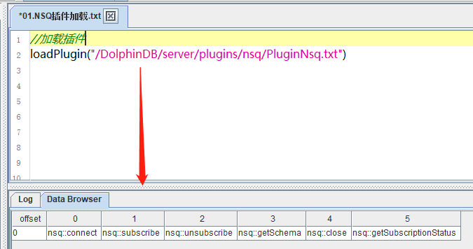
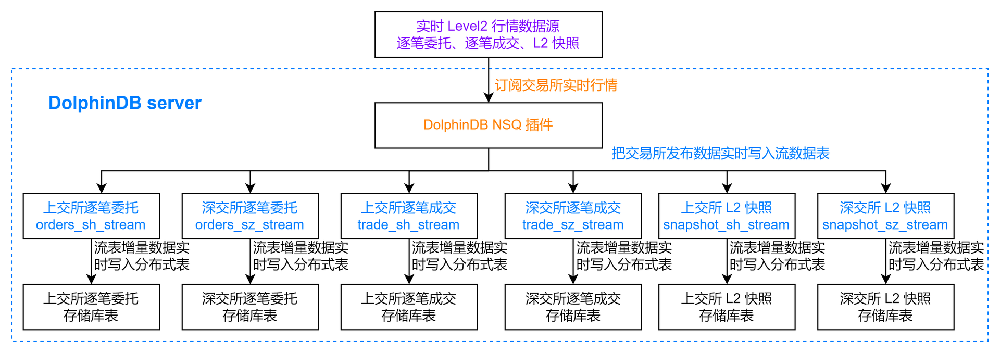
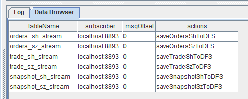
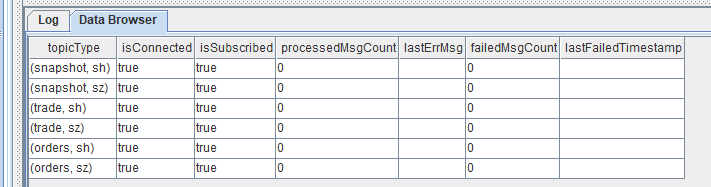

# DolphinDB NSQ 插件最佳实践指南

- [DolphinDB NSQ 插件最佳实践指南](#dolphindb-nsq-插件最佳实践指南)
	- [1. DolphinDB NSQ 插件介绍](#1-dolphindb-nsq-插件介绍)
	- [2. 基本使用介绍](#2-基本使用介绍)
	- [3. 通过 NSQ 插件把实时行情数据写入数据库](#3-通过-nsq-插件把实时行情数据写入数据库)
		- [3.1 创建分布式库表](#31-创建分布式库表)
			- [3.1.1 创建存储 Level2 行情数据的数据库](#311-创建存储-level2-行情数据的数据库)
			- [3.1.2 创建存储逐笔委托的分布式表](#312-创建存储逐笔委托的分布式表)
			- [3.1.3 创建存储逐笔成交的分布式表](#313-创建存储逐笔成交的分布式表)
			- [3.1.4 创建存储 level2 快照的分布式表](#314-创建存储-level2-快照的分布式表)
		- [3.2 订阅流数据表把增量数据实时写入数据库](#32-订阅流数据表把增量数据实时写入数据库)
			- [3.2.1 创建流数据表](#321-创建流数据表)
			- [3.2.2 创建流数据表增量数据实时写入数据库的订阅](#322-创建流数据表增量数据实时写入数据库的订阅)
			- [3.2.3 NSQ 插件订阅交易所实时行情](#323-nsq-插件订阅交易所实时行情)
	- [4. 节点启动时自动订阅 NSQ 行情数据落库](#4-节点启动时自动订阅-nsq-行情数据落库)
	- [附录](#附录)

## 1. DolphinDB NSQ 插件介绍

为了实时获取 Level2 行情数据，恒生公司发布了 NSQ 极速行情服务软件的 SDK，名称为 HSNsqApi。为了对接该软件，DolphinDB 开发了能够获取上海和深圳市场行情数据的NSQ插件。目前已经支持的数据源：

* 现货逐笔委托行情主推回调（OnRtnSecuTransactionEntrustData->orders）    
* 现货逐笔成交行情主推回调（OnRtnSecuTransactionTradeData->trade）    
* 现货深度行情主推回调（OnRtnSecuDepthMarketData->snapshot）    

请注意，DolphinDB 仅提供对接 HSNsqApi 的 NSQ 插件，数据源和接入服务可咨询数据服务商或证券公司。

NSQ 插件目前支持版本：[relsease200](https://gitee.com/dolphindb/DolphinDBPlugin/tree/release200/nsq), [release130](https://gitee.com/dolphindb/DolphinDBPlugin/tree/release130/nsq)。本教程基于 [**NSQ Plugin release200.8**](https://gitee.com/dolphindb/DolphinDBPlugin/tree/release200.8/nsq) 开发，请使用 **DolphinDB 2.00.8 版本 server** 进行相关测试。若需要测试其它版本 server，请切换至相应插件分支下载插件包进行测试。

## 2. 基本使用介绍

用户可以根据 **DolphinDB server** 版本和**操作系统**下载对应的已经编译好的插件文件，如 **DolphinDB 2.00.8 server** 对应的 **NSQ Plugin release200.8** 的[官方下载链接](https://gitee.com/dolphindb/DolphinDBPlugin/tree/release200.8/nsq/bin)。

以 Linux 单节点为例，下载好插件文件后，需要添加动态库地址到环境变量中。注意插件的安装路径`<PluginDir>`，需要根据实际环境修改，本例中插件的安装路径为 `/DolphinDB/server/plugins/nsq`，启动 server 前需要执行如下命令：

```
export LD_LIBRARY_PATH="$LD_LIBRARY_PATH:/DolphinDB/server/plugins/nsq"
```

进入 server 安装目录，执行如下命令启动 server：

```
nohup ./dolphindb -console 0 > single.nohup 2>&1 &
```

节点启动后，在任意会话中成功加载插件，即可在其它会话中调用该插件中的函数。若节点重启，则需重新加载插件。DolphinDB 支持手动加载和自动加载两种方式：

* **手动加载**

通过 [DolphinDB GUI](https://www.dolphindb.cn/cn/gui/index.html) 连接该节点，执行下述代码加载插件。注意插件的安装路径需要根据实际环境修改：

```
loadPlugin("/DolphinDB/server/plugins/nsq/PluginNsq.txt")
```

首次加载成功后，会在 DolphinDB GUI 的 Data Berowser 返回如下信息：

<div align=center></div>

如果反复执行，会抛出模块已经被使用的错误提示：

```
The module [nsq] is already in use.
```

可以通过 try-cach 语句捕获这个错误提示，避免因为这个错误提示而中断脚本代码的执行：

```
try{loadPlugin("/DolphinDB/server/plugins/nsq/PluginNsq.txt")} catch(ex){print(ex)}
```

* **自动加载**

在配置文件 dolphindb.cfg 中配置参数 startup=startup.dos。startup.dos 文件需要在 server 安装目录创建，其内容为：

```
try{loadPlugin("/DolphinDB/server/plugins/nsq/PluginNsq.txt")} catch(ex){print(ex)}
```

注意`"/DolphinDB/server/plugins/nsq/PluginNsq.txt"`是插件的安装路径需要根据实际环境修改。

至此，插件的部署和加载已经完成，后续可以直接通过 DolphinDB GUI 连接该节点，调用 NSQ 插件中的函数订阅 Level2 实时行情数据。

## 3. 通过 NSQ 插件把实时行情数据写入数据库

本教程示例代码中，把上海和深圳市场的行情数据分别存储在不同的分布式表中，整个数据流转的过程如下图所示：

<div align=center></div>

流程图说明：

* 图中紫色字体表示实时 Level2 行情数据源，需要用户自行咨询数据服务商开通接入服务。
* 图中橙色字体表示 DolphinDB NSQ 插件，其部署和加载参考[第2章节](#2-基本使用介绍)。
* 图中蓝色字体表示 DolphinDB 中的共享异步持久化流数据表。
* orders\_sh\_stream：用于接收和发布上交所逐笔委托实时流数据。    
* orders\_sz\_stream：用于接收和发布深交所逐笔委托实时流数据。    
* trade\_sh\_stream：用于接收和发布上交所逐笔成交实时流数据。    
* trade\_sz\_stream：用于接收和发布深交所逐笔成交实时流数据。    
* snapshot\_sh\_stream：用于接收和发布上交所 L2 快照实时流数据。    
* snapshot\_sz\_stream：用于接收和发布深交所 L2 快照实时流数据。    
* 将内存表共享是为了让该表连接当前节点其它会话可见，比如通过 API 实时查询流数据表时的会话与定义这些表的会话不是同一个，所以需要共享。    
* 对流数据表进行持久化的目的主要有两个：一是控制该表的最大内存占用，通过设置 [enableTableShareAndPersistence 函数](https://www.dolphindb.cn/cn/help/FunctionsandCommands/CommandsReferences/e/enableTableShareAndPersistence.html)中的 cacheSize 大小，控制该表在内存中保留的最大记录条数，进而控制该表的最大内存占用；二是在节点异常关闭的极端情况下，从持久化数据文件中恢复已经写入流数据表但是未消费的数据，保证流数据“至少消费一次”的需求。    
* 流数据表持久化采用异步的方式进行，可以有效提高流表写入的吞吐量。只有流数据表才可以被订阅消费，所以需要将以上的 orders\_sh\_stream, orders\_sz\_stream, trade\_sh\_stream, trade\_sz\_stream, snapshot\_sh\_stream, snapshot\_sz\_stream 定义成流数据表。
* 图中黑色字体表示的存储库表用于在磁盘上存储实时行情数据。增量数据实时写入数据库服务通过 DolphinDB 内置的订阅发布功能实现。对流数据表发起订阅，回调函数会把增量数据写入分布式表中。本教程中的各个库表的命名方式如下：

* 上交所逐笔委托：数据库名称为"dfs://stockL2"，分布式表名称为"orders\_sh"。    
* 深交所逐笔委托：数据库名称为"dfs://stockL2"，分布式表名称为"orders\_sz"。    
* 上交所逐笔成交：数据库名称为"dfs://stockL2"，分布式表名称为"trade\_sh"。    
* 深交所逐笔成交：数据库名称为"dfs://stockL2"，分布式表名称为"trade\_sz"。    
* 上交所 L2 所快照：数据库名称为"dfs://stockL2"，分布式表名称为"snapshot\_sh"。    
* 深交所 L2 所快照：数据库名称为"dfs://stockL2"，分布式表名称为"snapshotk\_sz"。    

为简化分布式库表和流数据表的创建代码，可以在 nsq::connect(configFilePath, options) 函数建立连接后调用 nsq::getSchema(dataType) 函数获取行情数据各个表的表结构，参考代码如下：

```
//加载插件
try{loadPlugin("/DolphinDB/server/plugins/nsq/PluginNsq.txt")} catch(ex){print(ex)}
//连接行情服务器
nsq::connect("/DolphinDB/server/plugins/nsq/nsq_sdk_config.ini")
//获取行情数据的表结构
ordersSchema = nsq::getSchema(`orders)
tradeSchema = nsq::getSchema(`trade)
snapshotSchema = nsq::getSchema(`snapshot)
```

目前 NSQ 插件对上海和深圳市场的行情数据表结构做了统一处理，具体表结构如下：

* 上海和深圳市场的逐笔委托

|     |     |
| --- | --- |
| **name** | **type** |
| ExchangeID | SYMBOL |
| InstrumentID | SYMBOL |
| TransFlag | INT |
| SeqNo | LONG |
| ChannelNo | INT |
| TradeDate | DATE |
| TransactTime | TIME |
| OrdPrice | DOUBLE |
| OrdVolume | LONG |
| OrdSide | CHAR |
| OrdType | CHAR |
| OrdNo | LONG |
| BizIndex | LONG |

* 上海和深圳市场的逐笔成交

|     |     |
| --- | --- |
| **name** | **type** |
| ExchangeID | SYMBOL |
| InstrumentID | SYMBOL |
| TransFlag | INT |
| SeqNo | LONG |
| ChannelNo | INT |
| TradeDate | DATE |
| TransactTime | TIME |
| TrdPrice | DOUBLE |
| TrdVolume | LONG |
| TrdMoney | DOUBLE |
| TrdBuyNo | LONG |
| TrdSellNo | LONG |
| TrdBSFlag | CHAR |
| BizIndex | LONG |

* 上海和深圳市场的 L2 快照

|     |     |     |     |     |     |
| --- | --- | --- | --- | --- | --- |
| **name** | **type** | **name** | **type** | **name** | **type** |
| ExchangeID | SYMBOL | BidVolume0-9 | LONG | EtfSellBalance | DOUBLE |
| InstrumentID | SYMBOL | AskVolume0-9 | LONG | TotalWarrantExecVolume | LONG |
| LastPrice | DOUBLE | TradesNum | LONG | WarrantLowerPrice | DOUBLE |
| PreClosePrice | DOUBLE | InstrumentTradeStatus | CHAR | WarrantUpperPrice | DOUBLE |
| OpenPrice | DOUBLE | TotalBidVolume | LONG | CancelBuyNum | INT |
| HighPrice | DOUBLE | TotalAskVolume | LONG | CancelSellNum | INT |
| LowPrice | DOUBLE | MaBidPrice | DOUBLE | CancelBuyVolume | LONG |
| ClosePrice | DOUBLE | MaAskPrice | DOUBLE | CancelSellVolume | LONG |
| UpperLimitPrice | DOUBLE | MaBondBidPrice | DOUBLE | CancelBuyValue | DOUBLE |
| LowerLimitPrice | DOUBLE | MaBondAskPrice | DOUBLE | CancelSellValue | DOUBLE |
| TradeDate | DATE | YieldToMaturity | DOUBLE | TotalBuyNum | INT |
| UpdateTime | TIME | IOPV | DOUBLE | TotalSellNum | INT |
| TradeVolume | LONG | EtfBuycount | INT | DurationAfterBuy | INT |
| TradeBalance | DOUBLE | EtfSellCount | INT | DurationAfterSell | INT |
| AveragePrice | DOUBLE | EtfBuyVolume | LONG | BidOrdersNum | INT |
| BidPrice0-9 | DOUBLE | EtfBuyBalance | DOUBLE | AskOrdersNum | INT |
| AskPrice0-9 | DOUBLE | EtfSellVolume | LONG | PreIOPV | DOUBLE |

### 3.1 创建分布式库表

执行创建分布式库表的语句前，需要登陆有创建权限的账号，执行如下代码登录默认的管理员账号：

```
login("admin", "123456")
```

#### 3.1.1 创建存储 Level2 行情数据的数据库

创建存储 Level2 行情数据的数据库，具体代码如下：

```
dbName = "dfs://stockL2"
if(existsDatabase(dbName) == false){
	dbDate = database("", VALUE, 2022.01.01..2022.12.01)
	dbSymbol = database("", HASH, [SYMBOL, 20])
	database(dbName, COMPO, [dbDate, dbSymbol], , "TSDB")
	print("Database created successfully !")
}
else{
	print("Database and table have been created !")
}
```

* 在 DolphinDB 中，根据存储的数据量制定合理的分区方案，DolphinDB 的分区方案是作用在数据库上的，一个数据库下可以创建多个分布式表，**需要注意的是**这些分布式表共用数据库的分区方案，所以不同分布式表的数据量必须在同一个量级才可以存储在同一个数据库下。    
* 在制定数据库分区方案时，一个通用的原则是每个最小分区单位内的数据在内存中的大小约150MB~500MB。例如上交所2021年12月10日的股票逐笔委托数据为52,172,616条，加载到内存的大小约 2.3GB，可以采用组合分区的方法，第一层按天分区，第二层对股票代码按 HASH 分20个分区，每个最小分区的全部数据加载到内存后约占用 150MB 内存空间。    
* 针对 Level2 行情数据，本教程推荐的数据库分区方案是组合分区，第一层按天分区，第二层对股票代码按 HASH 分20个分区。    
* 把数据量在同一个量级的不同分布式表存储在一个数据库中，有利于提高做分布式表关联的效率，所以本教程推荐把6个不同的 Lelvel2 行情数据表存储在同一个数据库中。

#### 3.1.2 创建存储逐笔委托的分布式表

创建存储上交所逐笔委托数据的分布式表，具体代码如下：

```
dbName = "dfs://stockL2"
tbName = "orders_sh"
if(existsTable(dbName, tbName) == false){
	db = database(dbName)
	db.createPartitionedTable(table=table(1:0, ordersSchema.name, ordersSchema.type), tableName=tbName, partitionColumns=`TradeDate`InstrumentID, sortColumns=`InstrumentID`TransactTime, keepDuplicates=ALL)
	print("DFS table created successfully !")
}
else{
	print("DFS table have been created !")
}
```

创建存储深交所逐笔委托数据的分布式表，具体代码如下：

```
dbName = "dfs://stockL2"
tbName = "orders_sz"
if(existsTable(dbName, tbName) == false){
	db = database(dbName)
	db.createPartitionedTable(table=table(1:0, ordersSchema.name, ordersSchema.type), tableName=tbName, partitionColumns=`TradeDate`InstrumentID, sortColumns=`InstrumentID`TransactTime, keepDuplicates=ALL)
	print("DFS table created successfully !")
}
else{
	print("DFS table have been created !")
}
```

#### 3.1.3 创建存储逐笔成交的分布式表

创建存储上交所逐笔成交数据的分布式表，具体代码如下：

```
dbName = "dfs://stockL2"
tbName = "trade_sh"
if(existsTable(dbName, tbName) == false){
	db = database(dbName)
	db.createPartitionedTable(table=table(1:0, tradeSchema.name, tradeSchema.type), tableName=tbName, partitionColumns=`Tradedate`InstrumentID, sortColumns=`InstrumentID`TransactTime, keepDuplicates=ALL)
	print("DFS table created successfully !")
}
else{
	print("DFS table have been created !")
}
```

创建存储深交所逐笔成交数据的分布式表，具体代码如下：

```
dbName = "dfs://stockL2"
tbName = "trade_sz"
if(existsTable(dbName, tbName) == false){
	db = database(dbName)
	db.createPartitionedTable(table=table(1:0, tradeSchema.name, tradeSchema.type), tableName=tbName, partitionColumns=`Tradedate`InstrumentID, sortColumns=`InstrumentID`TransactTime, keepDuplicates=ALL)
	print("DFS table created successfully !")
}
else{
	print("DFS table have been created !")
}
```

#### 3.1.4 创建存储 level2 快照的分布式表

创建存储上交所 L2 快照数据的分布式表，具体代码如下：

```
dbName = "dfs://stockL2"
tbName = "snapshot_sh"
if(existsTable(dbName, tbName) == false){
	db = database(dbName)
	db.createPartitionedTable(table(1:0, snapshotSchema.name, snapshotSchema.type), tbName, `TradeDate`InstrumentID, sortColumns=`InstrumentID`UpdateTime, keepDuplicates=ALL)
	print("DFS table created successfully !")
}
else{
	print("DFS table have been created !")
}
```

创建存储深交所 L2 快照数据的分布式表，具体代码如下：

```
dbName = "dfs://stockL2"
tbName = "snapshot_sz"
if(existsTable(dbName, tbName) == false){
	db = database(dbName)
	db.createPartitionedTable(table(1:0, snapshotSchema.name, snapshotSchema.type), tbName, `TradeDate`InstrumentID, sortColumns=`InstrumentID`UpdateTime, keepDuplicates=ALL)
	print("DFS table created successfully !")
}
else{
	print("DFS table have been created !")
}
```

### 3.2 订阅流数据表把增量数据实时写入数据库

创建完存储的分布式库表后，可以创建相关的流数据表和相关的订阅，最后通过 NSQ 插件把交易所实时行情数据接入 DolphinDB 的流数据表中。

#### 3.2.1 创建流数据表

创建逐笔委托流数据表相关的代码如下：

```
//创建共享的异步持久化流数据表：上交所逐笔委托
enableTableShareAndPersistence(table=streamTable(1:0, ordersSchema.name, ordersSchema.type), tableName=`orders_sh_stream, cacheSize=1000000, preCache=1000)
//创建共享的异步持久化流数据表：深交所逐笔委托
enableTableShareAndPersistence(table=streamTable(1:0, ordersSchema.name, ordersSchema.type), tableName=`orders_sz_stream, cacheSize=1000000, preCache=1000)
```

创建逐笔成交流数据表相关的代码如下：

```
//创建共享的异步持久化流数据表：上交所逐笔成交
enableTableShareAndPersistence(table=streamTable(1:0, tradeSchema.name, tradeSchema.type), tableName=`trade_sh_stream, cacheSize=1000000, preCache=1000)
//创建共享的异步持久化流数据表：深交所逐笔成交
enableTableShareAndPersistence(table=streamTable(1:0, tradeSchema.name, tradeSchema.type), tableName=`trade_sz_stream, cacheSize=1000000, preCache=1000)
```

创建 L2 快照流数据表相关的代码如下：

```
//创建共享的异步持久化流数据表：上交所 L2 快照
enableTableShareAndPersistence(table=streamTable(1:0, snapshotSchema.name, snapshotSchema.type), tableName=`snapshot_sh_stream, cacheSize=1000000, preCache=1000)
//创建共享的异步持久化流数据表：深交所 L2 快照
enableTableShareAndPersistence(table=streamTable(1:0, snapshotSchema.name, snapshotSchema.type), tableName=`snapshot_sz_stream, cacheSize=1000000, preCache=1000)
```

创建完相关流数据表后，可以在 DolphinDB GUI 的右下角共享变量栏查看这些表，如下图所示：

<div align=center></div>

#### 3.2.2 创建流数据表增量数据实时写入数据库的订阅

创建逐笔委托数据相关订阅的代码如下：

```
//创建实时增量数据落库的订阅：上交所逐笔委托
subscribeTable(tableName="orders_sh_stream", actionName="saveOrdersShToDFS", offset=-1, handler=loadTable("dfs://stockL2", "orders_sh"), msgAsTable=true, batchSize=10000, throttle=1, reconnect = true)
//创建实时增量数据落库的订阅：深交所逐笔委托
subscribeTable(tableName="orders_sz_stream", actionName="saveOrdersSzToDFS", offset=-1, handler=loadTable("dfs://stockL2", "orders_sz"), msgAsTable=true, batchSize=10000, throttle=1, reconnect = true)
```

创建逐笔成交数据相关订阅的代码如下：

```
//创建实时增量数据落库的订阅：上交所逐笔成交
subscribeTable(tableName="trade_sh_stream", actionName="saveTradeShToDFS", offset=-1, handler=loadTable("dfs://stockL2", "trade_sh"), msgAsTable=true, batchSize=10000, throttle=1, reconnect = true)
//创建实时增量数据落库的订阅：深交所逐笔成交
subscribeTable(tableName="trade_sz_stream", actionName="saveTradeSzToDFS", offset=-1, handler=loadTable("dfs://stockL2", "trade_sz"), msgAsTable=true, batchSize=10000, throttle=1, reconnect = true)
```

创建 L2 快照数据相关订阅的代码如下：

```
//创建实时增量数据落库的订阅：上交所L2快照
subscribeTable(tableName="snapshot_sh_stream", actionName="saveSnapshotShToDFS", offset=-1, handler=loadTable("dfs://stockL2", "snapshot_sh"), msgAsTable=true, batchSize=10000, throttle=1, reconnect = true)
//创建实时增量数据落库的订阅：深交所L2快照
subscribeTable(tableName="snapshot_sz_stream", actionName="saveSnapshotSzToDFS", offset=-1, handler=loadTable("dfs://stockL2", "snapshot_sz"), msgAsTable=true, batchSize=10000, throttle=1, reconnect = true)
```

创建完相关订阅后，可以通过执行如下代码查看已创建的订阅信息：

```
getStreamingStat().pubTables
```

返回结果如下：

<div align=center></div>

#### 3.2.3 NSQ 插件订阅交易所实时行情

完成相关的流数据表和订阅创建后，最后执行下述代码，通过 NSQ 插件把交易所实时行情数据接入 DolphinDB 的流数据表中：

```
nsq::subscribe(`orders, `sh, orders_sh_stream)
nsq::subscribe(`orders, `sz, orders_sz_stream)
nsq::subscribe(`trade, `sh, trade_sh_stream)
nsq::subscribe(`trade, `sz, trade_sz_stream)
nsq::subscribe(`snapshot, `sh, snapshot_sh_stream)
nsq::subscribe(`snapshot, `sz, snapshot_sz_stream)
```

NSQ 插件订阅状态的查询接口如下：

```
nsq::getSubscriptionStatus()
```

订阅成功后，返回信息如下：

<div align=center></div>

至此，通过 NSQ 插件把交易所 Level2 行情数据实时写入 DolphinDB 数据库的服务已经部署完成，只要数据源有实时增量数据推送，就可以在 DolphinDB 的流数据表和分布式表中查到最新的数据。

## 4. 节点启动时自动订阅 NSQ 行情数据落库

DolphinDB 系统的启动流程如下图所示：

<div align=center></div>

* 系统初始化脚本（dolphindb.dos）
    
    系统初始化脚本是必需的，默认加载版本发布目录中的 dolphindb.dos。不建议做修改，因为版本升级的时候需要用新版本发布包中的系统初始化脚本覆盖。
    
* 用户启动脚本（startup.dos）
    
    用户启动脚本是通过配置参数 startup 后才会执行，单机 single 模式在 dolphindb.cfg 中配置，集群模式在 cluster.cfg 中配置，可配置绝对路径或相对路径。若配置了相对路径或者没有指定目录，系统会依次搜索本地节点的 home 目录、工作目录和可执行文件所在目录。
    
    配置举例如下:
    
    ```
    startup=/DolphinDB/server/startup.dos
    ```
    
    将上述业务代码添加到 /DolphinDB/server 目录的 startup.dos 文件中，并在对应的配置文件中配置参数 startup，即可完成节点启动时的自动订阅部署。
    
* 定时任务脚本（postStart.dos）
    
    DolphinDB 中通过 scheduleJob 函数定义的定时任务会进行持久化。所以在重新启动节点时，系统先执行用户启动脚本，然后在初始化定时任务模块时完成持久化定时任务的加载。在完成上述步骤后，系统会执行定时任务脚本，此时用户可以在定时任务脚本中调用 scheduleJob 函数定义新的定时任务。
    
    本教程中未使用该功能，所以不需要开启该配置项。1.30.15 和 2.00.3 版本开始支持配置 postStart.dos 实现节点启动自动执行定时任务脚本。
    

本教程中，startup.dos 的脚本为：

```
//加载插件
try{loadPlugin("/DolphinDB/server/plugins/nsq/PluginNsq.txt")} catch(ex){print(ex)}
go
//连接行情服务器
nsq::connect("/DolphinDB/server/plugins/nsq/nsq_sdk_config.ini")
go
//获取行情数据的表结构
ordersSchema = nsq::getSchema(`orders)
tradeSchema = nsq::getSchema(`trade)
snapshotSchema = nsq::getSchema(`snapshot)
go
//登陆账号
login("admin", "123456")
//Level2行情数据存储数据库
dbName = "dfs://stockL2"
if(existsDatabase(dbName) == false){
	dbDate = database("", VALUE, 2022.01.01..2022.12.01)
	dbSymbol = database("", HASH, [SYMBOL, 20])
	database(dbName, COMPO, [dbDate, dbSymbol], , "TSDB")
	print("Database created successfully !")
}
else{
	print("Database and table have been created !")
}
//上交所逐笔委托
tbName = "orders_sh"
if(existsTable(dbName, tbName) == false){
	db = database(dbName)
	db.createPartitionedTable(table=table(1:0, ordersSchema.name, ordersSchema.type), tableName=tbName, partitionColumns=`TradeDate`InstrumentID, sortColumns=`InstrumentID`TransactTime, keepDuplicates=ALL)
	print("DFS table created successfully !")
}
else{
	print("DFS table have been created !")
}
//深交所逐笔委托
tbName = "orders_sz"
if(existsTable(dbName, tbName) == false){
	db = database(dbName)
	db.createPartitionedTable(table=table(1:0, ordersSchema.name, ordersSchema.type), tableName=tbName, partitionColumns=`TradeDate`InstrumentID, sortColumns=`InstrumentID`TransactTime, keepDuplicates=ALL)
	print("DFS table created successfully !")
}
else{
	print("DFS table have been created !")
}
//上交所逐笔成交
tbName = "trade_sh"
if(existsTable(dbName, tbName) == false){
	db = database(dbName)
	db.createPartitionedTable(table=table(1:0, tradeSchema.name, tradeSchema.type), tableName=tbName, partitionColumns=`Tradedate`InstrumentID, sortColumns=`InstrumentID`TransactTime, keepDuplicates=ALL)
	print("DFS table created successfully !")
}
else{
	print("DFS table have been created !")
}
//深交所逐笔成交
tbName = "trade_sz"
if(existsTable(dbName, tbName) == false){
	db = database(dbName)
	db.createPartitionedTable(table=table(1:0, tradeSchema.name, tradeSchema.type), tableName=tbName, partitionColumns=`Tradedate`InstrumentID, sortColumns=`InstrumentID`TransactTime, keepDuplicates=ALL)
	print("DFS table created successfully !")
}
else{
	print("DFS table have been created !")
}
//上交所L2快照
tbName = "snapshot_sh"
if(existsTable(dbName, tbName) == false){
	db = database(dbName)
	db.createPartitionedTable(table(1:0, snapshotSchema.name, snapshotSchema.type), tbName, `TradeDate`InstrumentID, sortColumns=`InstrumentID`UpdateTime, keepDuplicates=ALL)
	print("DFS table created successfully !")
}
else{
	print("DFS table have been created !")
}
//深交所L2快照
tbName = "snapshot_sz"
if(existsTable(dbName, tbName) == false){
	db = database(dbName)
	db.createPartitionedTable(table(1:0, snapshotSchema.name, snapshotSchema.type), tbName, `TradeDate`InstrumentID, sortColumns=`InstrumentID`UpdateTime, keepDuplicates=ALL)
	print("DFS table created successfully !")
}
else{
	print("DFS table have been created !")
}
go
//创建共享的异步持久化流数据表：上交所逐笔委托
enableTableShareAndPersistence(table=streamTable(1:0, ordersSchema.name, ordersSchema.type), tableName=`orders_sh_stream, cacheSize=1000000, preCache=1000)
//创建共享的异步持久化流数据表：深交所逐笔委托
enableTableShareAndPersistence(table=streamTable(1:0, ordersSchema.name, ordersSchema.type), tableName=`orders_sz_stream, cacheSize=1000000, preCache=1000)
//创建共享的异步持久化流数据表：上交所逐笔成交
enableTableShareAndPersistence(table=streamTable(1:0, tradeSchema.name, tradeSchema.type), tableName=`trade_sh_stream, cacheSize=1000000, preCache=1000)
//创建共享的异步持久化流数据表：深交所逐笔成交
enableTableShareAndPersistence(table=streamTable(1:0, tradeSchema.name, tradeSchema.type), tableName=`trade_sz_stream, cacheSize=1000000, preCache=1000)
//创建共享的异步持久化流数据表：上交所L2快照
enableTableShareAndPersistence(table=streamTable(1:0, snapshotSchema.name, snapshotSchema.type), tableName=`snapshot_sh_stream, cacheSize=1000000, preCache=1000)
//创建共享的异步持久化流数据表：深交所L2快照
enableTableShareAndPersistence(table=streamTable(1:0, snapshotSchema.name, snapshotSchema.type), tableName=`snapshot_sz_stream, cacheSize=1000000, preCache=1000)
go
//创建实时增量数据落库的订阅：上交所逐笔委托
subscribeTable(tableName="orders_sh_stream", actionName="saveOrdersShToDFS", offset=-1, handler=loadTable("dfs://stockL2", "orders_sh"), msgAsTable=true, batchSize=10000, throttle=1, reconnect = true)
//创建实时增量数据落库的订阅：深交所逐笔委托
subscribeTable(tableName="orders_sz_stream", actionName="saveOrdersSzToDFS", offset=-1, handler=loadTable("dfs://stockL2", "orders_sz"), msgAsTable=true, batchSize=10000, throttle=1, reconnect = true)
//创建实时增量数据落库的订阅：上交所逐笔成交
subscribeTable(tableName="trade_sh_stream", actionName="saveTradeShToDFS", offset=-1, handler=loadTable("dfs://stockL2", "trade_sh"), msgAsTable=true, batchSize=10000, throttle=1, reconnect = true)
//创建实时增量数据落库的订阅：深交所逐笔成交
subscribeTable(tableName="trade_sz_stream", actionName="saveTradeSzToDFS", offset=-1, handler=loadTable("dfs://stockL2", "trade_sz"), msgAsTable=true, batchSize=10000, throttle=1, reconnect = true)
//创建实时增量数据落库的订阅：上交所L2快照
subscribeTable(tableName="snapshot_sh_stream", actionName="saveSnapshotShToDFS", offset=-1, handler=loadTable("dfs://stockL2", "snapshot_sh"), msgAsTable=true, batchSize=10000, throttle=1, reconnect = true)
//创建实时增量数据落库的订阅：深交所L2快照
subscribeTable(tableName="snapshot_sz_stream", actionName="saveSnapshotSzToDFS", offset=-1, handler=loadTable("dfs://stockL2", "snapshot_sz"), msgAsTable=true, batchSize=10000, throttle=1, reconnect = true)
go
//NSQ 插件接入实时行情
nsq::subscribe(`orders, `sh, orders_sh_stream)
nsq::subscribe(`orders, `sz, orders_sz_stream)
nsq::subscribe(`trade, `sh, trade_sh_stream)
nsq::subscribe(`trade, `sz, trade_sz_stream)
nsq::subscribe(`snapshot, `sh, snapshot_sh_stream)
nsq::subscribe(`snapshot, `sz, snapshot_sz_stream)
writeLog("NSQ subscribe Successfully !")
```

**注意**

* 插件的安装路径：`"/DolphinDB/server/plugins/nsq/PluginNsq.txt"`需要根据实际环境修改。
* NSQ 插件的初始化配置文件路径：`"/DolphinDB/server/plugins/nsq/nsq_sdk_config.ini"`需要根据实际环境修改。

## 附录

* NSQ 插件的手动编译安装以及接口函数说明可以参考官网文档教程：[DolphinDB NSQ 插件官方教程](https://gitee.com/dolphindb/DolphinDBPlugin/tree/release200.8/nsq)
* 详细启动脚本配置可以参考官网文档教程：[启动脚本教程](https://gitee.com/dolphindb/Tutorials_CN/blob/master/Startup.md)
* 关于节点启动时自动订阅处理业务的部署可以参考官网文档教程：[节点启动时的流计算自动订阅教程](https://gitee.com/dolphindb/Tutorials_CN/blob/master/streaming_auto_sub.md)。
* 节点启动时自动订阅 NSQ 行情数据落库脚本：[startup.dos](./script/best_implementation_for_NSQ_Plugin/startup.dos)