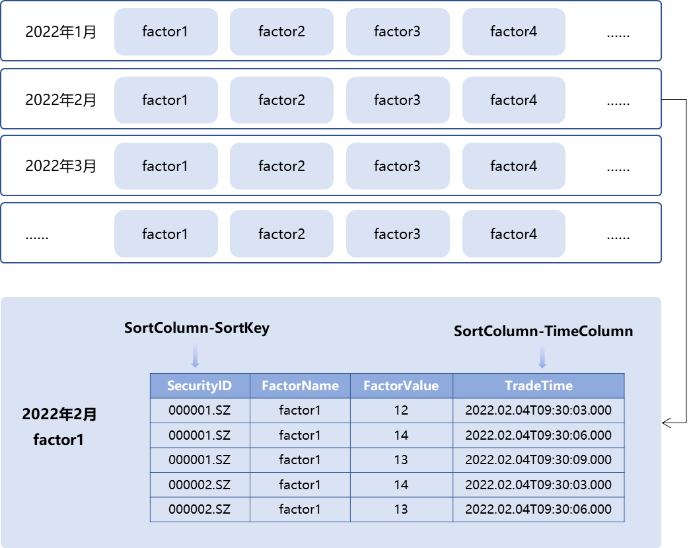
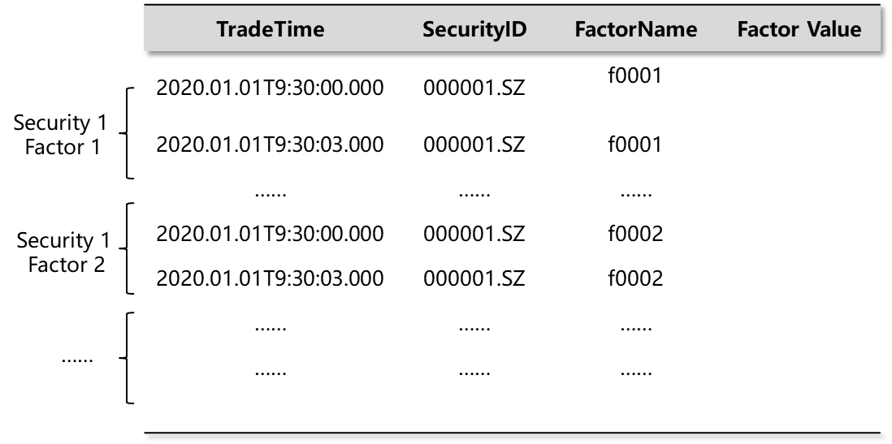
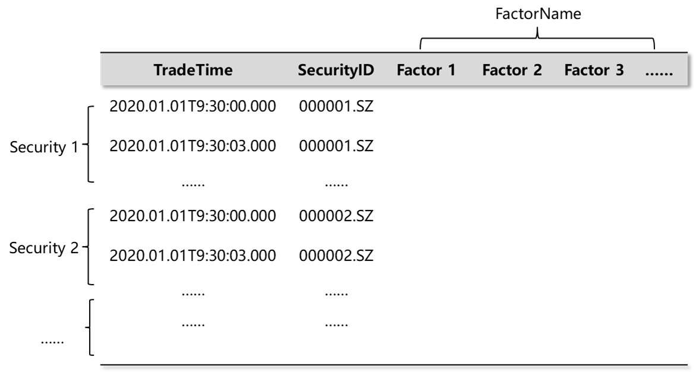

# 中高频多因子库存储最佳实践

- [中高频多因子库存储最佳实践](#中高频多因子库存储最佳实践)
	- [1. 概述](#1-概述)
		- [1.1. 中高频多因子存储面临的挑战](#11-中高频多因子存储面临的挑战)
		- [1.2. 中高频多因子存储场景需求](#12-中高频多因子存储场景需求)
	- [2. DolphinDB 的存储特性](#2-dolphindb-的存储特性)
		- [2.1. 分区存储](#21-分区存储)
		- [2.2 分区内分组排序存储](#22-分区内分组排序存储)
	- [3. 十分钟级一万因子存储场景解决方案](#3-十分钟级一万因子存储场景解决方案)
		- [3.1. 存储方案设计](#31-存储方案设计)
		- [3.2. 数据准备](#32-数据准备)
		- [3.3. 测试案例一：HDD 存储](#33-测试案例一hdd-存储)
		- [3.4. 测试案例二：SSD 存储](#34-测试案例二ssd-存储)
		- [3.5. 中高频多因子库存储的最佳实践：SSD vs HDD](#35-中高频多因子库存储的最佳实践ssd-vs-hdd)
	- [附录](#附录)

## 1. 概述

因子挖掘是量化交易的基础。随着量化交易竞争的加剧，量化投资团队需要处理大量因子。在许多情况下，因子数据量甚至会远远超过高频的行情数据量。以5,000只股票10,000个因子为例，一年的10分钟线数据量为 2.3TB，1分钟线数据量为 23TB，3秒线数据量为 460TB。如此量级的数据就对因子存储方案提出了很高的要求。

本文将基于中高频多因子存储场景，结合实际数据案例来设计 DolphinDB 存储方案，并对比不同存储模式下的性能，给出最佳存储模式的建议。

### 1.1. 中高频多因子存储面临的挑战

在数据高频次和因子高数量的双重叠加之下，数据量将轻易达到 TB 级别，那么中高频多因子的存储方案就必须同时面对以下问题：

* 庞大的数据量

因子计算通常有4个维度包括股票、因子、频率和时间。国内股票总个数按5,000来算。因子个数一般机构大约为1,000起，多的甚至有10,000个因子。时间频率最高的是每3秒钟生成一次数据，频率低的也有10分钟一次，也就是说，一只股票一个因子一天会生成24到4,800条 tick 数据。

**宽表存储模式数据量统计：**

| **股票（只）** | **因子（个）** | **频率** | **时间** | **数据量（GB）** |
| --- | --- | --- | --- | --- |
| 5,000 | 10,000 | 10 分钟线 | 4 年  | 9,014 |
| 5,000 | 1,000 | 1 分钟线 | 2 年  | 4,513 |
| 5,000 | 1,000 | 3 秒线 | 1 年  | 45,129 |

**窄表存储模式数据量统计：**

| **股票（只）** | **因子（个）** | **频率** | **时间** | **数据量（GB）** |
| --- | --- | --- | --- | --- |
| 5,000 | 10,000 | 10 分钟线 | 4 年  | 27,037 |
| 5,000 | 1,000 | 1 分钟线 | 2 年  | 13,518 |
| 5,000 | 1,000 | 3 秒线 | 1 年  | 134,183 |

面对如此庞大的数据量，如何保证高效的数据写入和数据压缩是因子库存储的一大挑战，如果不能支持并充分发挥多块磁盘的 I/O，写入耗时将达数小时以上。

* 因子库动态变化

因子库经常会发生变化，往往需要新增因子、修改因子定义，或加入新的股票等。面对 TB 级的因子数据，单个因子的新增、修改、删除耗时应该保证在秒级才能确保量化投研的效率。

对于上述问题，我们在设计方案时，除了尽可能优化每一项操作的性能，更重要的是每项性能不能出现明显短板，否则在数据操作量级大幅上升后，会大幅度降低整体的生产效率。

* 多因子对齐输出

金融行业的数据分析通常需要数据支持面板格式。对于读取随机标的（A 股市场目前约5,000只股票）、随机多个因子（10,000个因子中随机查询1,000个因子）的场景，需要在操作时能够尽可能高速并精准读取数据，减少无效 I/O ，并以需要的方式（通常是因子面板模式）将数据读取出来。

### 1.2. 中高频多因子存储场景需求

总体来看，中高频多因子的存储方案需要满足以下几点：

* 保证写入高效性；
* 支持高效的因子库运维（新增因子及因子数据的修改、删除）；
* 支持高效、灵活的读取方式，且以最适合金融计算的方式输出。

## 2. DolphinDB 的存储特性

面对中高频多因子存储场景，我们将 DolphinDB 的下述存储特性组合使用，提供了灵活的存储解决方案。

### 2.1. 分区存储

数据分区存储，针对因子数据可以采用“时间+因子/标的”的方式组合分区来达成因子数据的灵活分区存储。DolphinDB 对于不同分区数据可以多线程并行操作。

### 2.2 分区内分组排序存储

DolphinDB 的 TSDB 引擎提供排序键设置，对分区内的数据完成分块索引。这样的设置有助于在随机读时更精准的定位数据。例如，在“2022年2月-factor1”的分区内部，数据可以按照 SortColumn-SortKey 字段 SecurityID 分组存储，在每个 SecurityID 组内，再按照时间字段 TradeTime 排序，如下图所示。



借助以上特性，可以灵活地设计存储方案，以应对中高频多因子场景下的不同需求。

下文中，我们以一个“10分钟级100000因子”的例子，为大家测试在不同存储模式下，数据的写入、查询和运维等方面的性能，并通过分析结果，为大家提供一个中高频多因子库存储的最佳实践。

## 3. 十分钟级一万因子存储场景解决方案

### 3.1. 存储方案设计

在存储因子数据时，用户可以选择窄表和宽表两种模式。

窄表模式一般有4列：时间戳、股票代码、因子编号以及因子值，如下图所示。在需要面板数据的场景中，窄表模式的数据可使用 DolphinDB 的 [pivot](https://www.dolphindb.cn/cn/help/Functionalprogramming/TemplateFunctions/pivot.html) 功能转换为面板数据。面对金融场景时序数据中大量因子需要对齐转置的情形，可以根据时间、股票代码和因子对数据表重新排序，将时间和股票代码作为行，因子作为列进行计算输出，并且非常高效。



宽表模式中，一般每个因子存为一列，如下图所示。宽表模式下的面板数据可以直接用于量化交易中的程序计算，符合金融场景的数据输出需求，但在[测试案例一](#33-测试案例一hdd-存储)三种运维操作的测试数据对比中，我们会看到，因子数据的新增和修改场景下宽表耗时较高。



DolphinDB 中同时支持宽表和窄表的两种模式数据存储。结合 DolphinDB 的存储特性，我们设计以下两种存储方案来比对10分钟级10,000因子场景存储性能：

**方案 1：窄表模式**

*   TradeTime 按月值分区 + FactorName 值分区
*   排序字段: SecurityID + TradeTime

把时间分区调整到月，对因子分区调整到每个因子单独分区，并对每个分区内的数据按照 SecurityID 分组，组内按照 TradeTime 排序。这样的好处是每个分区数据大小适合，在数据检索时，既可以按照时间和因子名进行分区剪枝干，又可以按照股票 ID 近一步的精确定位数据，满足在随意组合因子、标的场景下精准地读取数据。

**方案 2：宽表模式**

*   TradeTime 按月值分区 + SecurityID 值分区
*   排序字段: SecurityID + TradeTime

在 SecurityID 上进行分区剪枝，因子维度上通过选择不同的列来进行数据筛选。

下文将在固态硬盘（SSD）和机械硬盘（HDD）这两种不同的硬件配置下，对宽表和窄表的存储性能分别进行测试。

### 3.2. 数据准备

我们通过模拟随机生成5,000只股票10分钟级10,000个因子的数据，并分别采用窄表和宽表两种方式来存储。

随机生成因子名称和股票代码的函数定义如下：

```
def createFactorNamesAndSymbolNamse(num_factors,num_symbols){
	factor_names = lpad(string(1..num_factors),6,"f00000")
	symbols_preliminary = lpad(string(1..num_symbols),6,"000000")+"."
	areas = rand(["SZ","SH"],num_symbols)
	symbols = symbols_preliminary + areas
	return factor_names,symbols
}
```

生成字段及字段类型的函数定义如下：

```
def createColnameAndColtype(mode,factor_names){
	if(mode == "single"){
		return ["tradetime","symbol","factorname","value"],[DATETIME,SYMBOL,SYMBOL,DOUBLE]
	}else{
		col_names = ["tradetime","symbol"].append!(factor_names)
		col_types = [DATETIME,SYMBOL].append!(take(DOUBLE,factor_names.size()))
		return col_names,col_types
	}
}
```

### 3.3. 测试案例一：HDD 存储

服务器配置：

*   CPU：64核
*   内存：512G
*   磁盘：9块 HDD 硬盘
*   数据库设置：单机集群三数据节点

**因子写入**

对于5,000只股票10,000个因子，我们首先测试写入2022.1.1至2022.1.31内的10 钟级数据，可以运行如下代码定义不同存储模式下的因子写入函数：

```
// 窄表模式写入某个时间范围数据
def writeSingleModelData(dbname,tbname,start_date,end_date,symbols,factor_names){
	total_time_range = getTimeList(start_date,end_date)
	nodes = exec value from pnodeRun(getNodeAlias)
	for(j in 0..(total_time_range.size()-1)){
		for(i in 0..(factor_names.size()-1)){
			rpc(nodes[i%(nodes.size())],submitJob,"singleModel"+j+"and"+i,dbname,singleModelPartitionData,dbname,tbname,total_time_range[j],symbols,factor_names,factor_names[i])
		}
	}
}

// 宽表模式写入某个时间范围数据
def writeWideModelData(dbname,tbname,start_date,end_date,symbols,factor_names){
	total_time_range = getTimeList(start_date,end_date)
	nodes = exec value from pnodeRun(getNodeAlias)
	for(j in 0..(total_time_range.size()-1)){
		for(i in 0..(symbols.size()-1)){
			rpc(nodes[i%(nodes.size())],submitJob,"wideModel"+j+"and"+i,dbname,wideModelPartitionData,dbname,tbname,total_time_range[j],factor_names,symbols[i])
		}
	}
}
```

可以看到，宽表模式在数据写入速度上优于窄表模式，硬盘占用空间上略优于窄表模式。这是因为窄表模式下的数据冗余度高，实际数据量比较大。另外需要说明一点，实验中因子值使用的是随机的浮点数，几乎没有重复，压缩比较低，实际场景中的压缩比会更高。

|     |     |     |     |     |     |     |     |     |     |
| --- | --- | --- | --- | --- | --- | --- | --- | --- | --- |
| 存储方案 | 写入天数 | 每天行数 | 总行数 | 每行字节 | 数据原始大小 (GB) | 落盘大小 (GB) | 写入耗时 (s) | 压缩比 | 磁盘 I/O(MB/s) |
| 窄表  | 21  | 1,200,000,000 | 25,200,000,000 | 24  | 478 | 185 | 523 | 2.6 | 937 |
| 宽表  | 21  | 120,000 | 2,520,000 | 80,012 | 190 | 166 | 301 | 1.1 | 648 |

**因子查询**

查询21天全市场5,000只标的的1,000个因子数据，窄表的查询会将数据转换成与宽表一样的面板数据输出。定义因子查询函数的核心代码如下：

```
// 窄表模式查询随机1000因子
def querySingleModel(dbname,tbname,start_time,end_time,aim_factor){
	return select value from loadTable(dbname,tbname) where tradetime>=start_time and tradetime<= end_time and  factorname in aim_factor pivot by tradetime,symbol,factorname
}

// 宽表模式查询随机1000因子
def queryWideModel(dbname,tbname,start_time,end_time,aim_factor){
	ll = aim_factor[0]
	for(i in 1..(aim_factor.size()-1)){
		ll = ll+","+aim_factor[i]
	}
	script = "select tradetime,symbol,"+ll+"from loadTable("+'"'+dbname+'"'+","+'"'+tbname+'"'+")" + "where tradetime>="+start_time+"and tradetime<="+end_time
	tt = parseExpr(script).eval()
	return tt
}
```

数据以宽表模式存储在机械硬盘中时，对10,000个因子随机查询1,000个因子的初次查询速度慢一些；查询前1,000个因子则速度较快。这是因为在机械硬盘下进行多列的随机检索会比较慢。

即便如此，与宽表模式的最快情况相比，窄表模式下经过 [pivot by](https://www.dolphindb.cn/cn/help/SQLStatements/pivotBy.html) 转为面板数据后的查询速度也要更快。这是因为虽然宽表的所有列已经按照面板模式准备好，但是宽表的数据都是在同一个分区，读取时是单线程进行。而窄表模式数据存在于很多因子分区 ，读取数据和拼接面板数据时是很多个 CPU 同时工作，这是个分布式多线程操作，所以窄表模式在查询面板数据时耗时更少。

|     |     |     |     |     |
| --- | --- | --- | --- | --- |
| 存储方案 | 因子选择 | 数据大小 (GB) | 冷查询耗时 (s) | 热查询耗时 (s) |
| 窄表  | 随机 1,000 | 18.8 | 80  | 52  |
| 宽表  | 随机 1,000 | 18.8 | 425 | 49  |
| 宽表  | 前 1,000 个 | 18.8 | 92  | 49  |

**数据运维**

因子数据的运维包括新增因子、更新因子、删除因子。

* 新增因子

在新增因子的场景，窄表模式可以使用 [append!](https://www.dolphindb.cn/cn/help/FunctionsandCommands/FunctionReferences/a/append!.html) 插入新的因子数据；而宽表模式需要先进行 [addColumn](https://www.dolphindb.cn/cn/help/FunctionsandCommands/CommandsReferences/a/addColumn.html) 操作，然后通过 [update](https://www.dolphindb.cn/cn/help/SQLStatements/update.html) 操作更新新增因子列数据。在 DolphinDB 当前的设计下，更新宽表模式中某一列因子，需要将分区数据全部重写，耗时较长

假设此处需要新增第 f10002 号因子在2022.1.1至2022.1.31时间范围内的数据，不同存储模式下的新增因子脚本如下所示：

```
//窄表模式新增1个因子
def singleModelAddNewFactor(dbname,tbname,start_date,end_date,symbols,factor_names,new_factor){
	time_list = getTimeList(start_date,end_date).flatten()
	num_row = symbols.size()*time_list.size()
	col_names,col_types = createColnameAndColtype("single",factor_names)
	t = table(num_row:num_row,col_names,col_types)
	t["tradetime"] = stretch(time_list,num_row)
	t["symbol"] = take(symbols,num_row)
	t["factorname"] = take(new_factor,num_row)
	t["value"] = rand(100.0,num_row)
	pt = loadTable(dbname,tbname)
	pt.append!(t)	
}

//宽表模型新增一个因子
def wideModelAddNewFactor(dbname,tbname,start_date,end_date,symbols,new_factor,parallel = true){   //parallel=true表示并行,=false表示串行
	pt = loadTable(dbname,tbname)
	addColumn(pt,[new_factor],[DOUBLE])
	time_list = getTimeList(start_date,end_date)
	start_time_list,end_time_list = [],[] 
	for(i in 0..(time_list.size()-1)){
		start_time_list.append!(time_list[i][0])
		idx = time_list[i].size()-1
		end_time_list.append!(time_list[i][idx])
	}
	if(!parallel){
		for(i in 0..(start_time_list.size()-1)){
			for(j in 0..(symbols.size()-1)){
				wideModelSinglePartitionUpdate(dbname,tbname,start_time_list[i],end_time_list[i],new_factor,symbols[j])
			}
		}
	}else{
		for(i in 0..(start_time_list.size()-1)){
			ploop(wideModelSinglePartitionUpdate{dbname,tbname,start_time_list[i],end_time_list[i],new_factor,},symbols)
		}
	}
}
```

* 更新因子

量化投研中，重新计算因子数据是常见的场景。根据窄表模式下的分区规则，对指定因子数据更新时，可以精确定位到因子所在分区，并进行修改，所以耗时在秒级；而宽表模式的更新方式如上节所述原因，耗时较长。

假定此处需要更新第 f00555 号因子在2022.1.1至2022.1.31时间范围内的因子值数据，不同存储模式下的脚本如下所示：

```
//窄表模式更新1个因子
def singleModelUpdateFactor(dbname,tbname,start_date,end_date,update_factor,parallel = false){   //parallel=true表示并行更新
	time_list = getTimeList(start_date,end_date)
	start_time_list,end_time_list = [],[] 
	for(i in 0..(time_list.size()-1)){
		start_time_list.append!(time_list[i][0])
		idx = time_list[i].size()-1
		end_time_list.append!(time_list[i][idx])
	}
	if(!parallel){
		for(i in 0..(start_time_list.size()-1)){
			singleModelSinglePartitionUpdate(dbname,tbname,start_time_list[i],end_time_list[i],update_factor)
		}		
	}else{
		ploop(singleModelSinglePartitionUpdate{dbname,tbname,,,update_factor},start_time_list,end_time_list)
	}
}

//宽表模型更新1个因子
def wideModelUpdateFactor(dbname,tbname,start_date,end_date,update_factor,symbols,parallel = true){  //parallel=true表示并行更新,=false表示串行
	time_list = getTimeList(start_date,end_date)
	start_time_list,end_time_list = [],[] 
	for(i in 0..(time_list.size()-1)){
		start_time_list.append!(time_list[i][0])
		idx = time_list[i].size()-1
		end_time_list.append!(time_list[i][idx])
	}
	if(!parallel){
		for(i in 0..(start_time_list.size()-1)){
			for(j in 0..(symbols.size()-1)){
				wideModelSinglePartitionUpdate(dbname,tbname,start_time_list[i],end_time_list[i],update_factor,symbols[j])	
			}
		}
	}else{
		for(i in 0..(start_time_list.size()-1)){
			ploop(wideModelSinglePartitionUpdate{dbname,tbname,start_time_list[i],end_time_list[i],update_factor,},symbols)
		}
	}
}
```

* 删除因子

删除因子虽然不是必须的，但可以释放存储空间，以及提供其他便利。当前窄表模型的分区方案在删除指定因子时耗时在秒级，脚本如下所示，TSDB 引擎下的宽表模式目前不支持删除因子列。

```
// 单值模型删除一个因子
def singleModelDeleteFactor(dbname,tbname,start_date,end_date,delete_factor){
	pt = loadTable(dbname,tbname)
	time_list = getTimeList(start_date,end_date).flatten()
	start_time,end_time = time_list[0],time_list[time_list.size()-1]
	delete  from pt where tradetime >= start_time and tradetime <= end_time and factorname = delete_factor
}
```

三种运维操作下的测试数据如下表所示，可以看到在10分钟级10,000个因子数据场景下，窄表模式在因子数据查询和因子数据运维方面全面优于宽表模式，只是在数据写入速度和存储空间要逊于宽表模式。综合考虑各个方面，使用窄表模式存储因子数据是更好的选择。

|     |     |     |
| --- | --- | --- |
| 数据运维操作 | 窄表 (s) | 宽表 (s) |
| 新增 1 因子 | 1.2 | 534 |
| 更新 1 因子 | 1.1 | 541 |
| 删除 1 因子 | 0.8 | N/A |

### 3.4. 测试案例二：SSD 存储

上一节中，我们使用机械硬盘比对了一个月因子数据场景下宽表和窄表的性能。在实际生产时，为了提高效率，我们往往选择 SSD 硬盘来存储因子数据。本小节我们就选择 SSD 硬盘来进行测试，进行6个月因子数据场景下宽表和窄表的性能比对。同样从因子写入、因子查询和数据运维三个方面进行测试。

服务器配置：

* CPU 48 核
* 内存：512G
* 磁盘：4 块 SSD 硬盘
* 数据库设置：单机集群二数据节点

**因子写入**

通过多任务并行方式写入6个月5,000只标的10分钟级10,000 子数据，定义因子写入函数的代码与[案例一](#33-测试案例一hdd-存储)中因子写入一致，完整脚本可参考附件。从结果我们可以看到，宽表模式在写入速度和存储空间上性能占优。

|     |     |     |     |     |     |     |     |     |     |
| --- | --- | --- | --- | --- | --- | --- | --- | --- | --- |
| 存储方案 | 写入天数 | 每天行数 | 总行数 | 每行字节 | 数据原始大小 (GB) | 落盘大小 (GB) | 写入耗时 (s) | 压缩比 | 磁盘 I/O(MB/s) |
| 方案 1 - 窄表 | 129 | 1,200,000,000 | 154,800,000,000 | 24  | 2,873 | 1,118 | 2,194 | 2.6 | 1,338 |
| 方案 2 - 宽表 | 129 | 120,000 | 15,480,000 | 80,012 | 1,143 | 1,030 | 1,115 | 1.1 | 1,049 |

**因子查询**

接下来我们随机查询5,000只标的下1,000个因子在1, 3, 6个月内的数据，核心查询代码与案例一中一致，完整脚本可参考附件。

测试结果如下所示，其中冷查询表示在无数据缓存的情况下进行查询，热查询表示有数据缓存的情况下进行查询 。可以看到，在使用 SSD 磁盘的情况下，窄表模式的查询耗时同样低于宽表模式。此外随着查询数据量增长，查询耗时是线性增长的，不会因为查询数据量的大增而出现查询耗时大幅增加的情况。

|     |     |     |     |     |
| --- | --- | --- | --- | --- |
| 存储方案 | 查询数据大小 (GB) | 查询数据月份 | 冷查询耗时 (s) | 热查询耗时 (s) |
| 窄表  | 18.8 | 1   | 37  | 34  |
| 宽表  | 18.8 | 1   | 59  | 43  |
| 窄表  | 57.3 | 3   | 103 | 90  |
| 宽表  | 57.3 | 3   | 171 | 115 |
| 窄表  | 115.5 | 6   | 201 | 173 |
| 宽表  | 115.5 | 6   | 363 | 274 |

**数据运维**

同样，我们从新增、更新和删除因子三个角度，测试1, 3, 6个月的数据运维性能，核心代码与案例一中一致，完整脚本可参考附件。在这个环节窄表模式同样远远优于宽表模式，且数据运维的各项操作，耗时同样随操作影响数据量线性增长。

|     |     |     |     |
| --- | --- | --- | --- |
| 数据运维操作 | 操作因子数据月份 | 窄表 (s) | 宽表 (s) |
| 新增 1 因子 | 1   | 1.0 | 185 |
| 新增 1 因子 | 3   | 2.9 | 502 |
| 新增 1 因子 | 6   | 5.8 | 1,016 |
| 更新 1 因子 | 1   | 1.1 | 162 |
| 更新 1 因子 | 3   | 3.1 | 477 |
| 更新 1 因子 | 6   | 6.2 | 948 |
| 删除 1 因子 | 1   | 0.8 | N/A |
| 删除 1 因子 | 3   | 1.1 | N/A |
| 删除 1 因子 | 6   | 1.2 | N/A |

**吞吐量**

在案例一中我们提到，窄表模式下查询面板数据时，任务会以分布式多线程的方式处理，这将消耗较多的 CPU 资源。

为了验证在多线程并发查询因子数据时，查询性能是否会因为 CPU 资源竞争大幅下降，我们进行了并发查询测试。

我们采取并发8个线程查询一个月全市场5,000只股票、随机10,000个因子数据，每个查询数据大小为 19GB，测试结果如下表。

|     |     |
| --- | --- |
| 存储方案 | 总耗时(s) |
| 窄表  | 247 |
| 宽表  | 242 |

通过比对我们可以看到，在8个并发查询的场景，窄表模式的查询确实有一定下降，但总耗时仍然可以达到和宽表模式基本相同的水准。

本节在 SSD 硬盘上测试了6个月的因子数据场景。使用合理设计的窄表模式存储 TB 级别的因子数据，在数据写入、多因子随机查询、因子数据运维等各方面均有稳定表现。在8 程并发情况下查询速度与宽表模式相当。此外，查询、因子运维耗时能够保证线性增长，不会因为海量数据不断增加而出现查询、因子运维耗时大幅增加情况，这样的特性是数据库可以支持海量数据的重要保证。

### 3.5. 中高频多因子库存储的最佳实践：SSD vs HDD

前两节中我们分别在 HDD 和 SSD 两种硬盘环境下进行了宽表和窄表的存储性能比对。但是在其他系统资源一样的情况下，HDD 和 SSD 的差别是否很大，也是我们比较关心的一件事情。本小节我们将在下表所示的两种硬件配置环境下，对比测试不同存储模式的性能，为大家提供中高频多因子库存储的最佳实践建议。

| **服务器配置项** | **SSD** | **HDD** |
| --- | --- | --- |
| CPU | 64 核 | 64 核 |
| 内存  | 512G | 512G |
| 磁盘  | 3 块 SSD 硬盘（1.5GB/s 吞吐量） | 9 块 HDD 硬盘（1.4GB/s 吞吐量） |
| 数据库设置 | 单机集群三数据节点 | 单机集群三数据节点 |

**因子写入**

写入一个月5,000只标的10钟级10,000因子数据，定义因子写入函数的代码与案例一中一致，完整脚本可参考附件。在磁盘总 I/O 相近的情况，SSD 硬盘的写入速度略优于 HDD 硬盘。

|     |     |     |     |     |     |     |
| --- | --- | --- | --- | --- | --- | --- |
| 存储方案 | 存储配置 | 数据原始大小 (GB) | 落盘大小 (GB) | 压缩比 | 磁盘 IO(MB/s) | 写入耗时 (s) |
| SSD | 窄表  | 479 | 186 | 2.6 | 1,068 | 459 |
| SSD | 宽表  | 191 | 166 | 1.1 | 757 | 257 |
| HDD | 窄表  | 479 | 186 | 2.6 | 937 | 523 |
| HDD | 宽表  | 191 | 166 | 1.1 | 648 | 301 |

**因子查询**

分别进行查询一个月全市场5,000只股票 随机1,000个因子数据，查询数据量大小 19G，核心查询代码与案例一中一致，完整脚本可参考附件。从下表中可以看到，使用 HDD 硬盘的冷查询和热查询会相差大一些。而无论 SSD 硬盘还是 HDD 硬盘，窄表模式的分布式多线程查询都可以保持更加稳定的性能。

|     |     |     |     |
| --- | --- | --- | --- |
| 存储方案 | 存储配置 | 冷查询耗时 (s) | 热查询耗时 (s) |
| SSD | 窄表  | 64  | 61  |
| SSD | 宽表  | 162 | 55  |
| HDD | 窄表  | 80  | 52  |
| HDD | 宽表  | 425 | 49  |

**数据运维**

在运维场景下，窄表模式的落盘后数据量为 186GB ，宽表为 166GB，新增、更新和删除因子的核心代码与案例一中一致，完整脚本可参考附件。测试结果如下所示，可以看到无论是 SSD 还是 HHD ，窄表模式的运维操作耗时都非常低，基本都是秒级。而宽表模式虽然在 SDD 硬盘下耗时要少于 HDD 硬盘，但总体耗时仍然非常高。

|     |     |     |     |
| --- | --- | --- | --- |
| **存储方案** | **数据运维操作** | **窄表 (s)** | **宽表 (s)** |
| SSD | 新增 1 因子 | 1.1 | 330 |
| SSD | 更新 1 因子 | 0.9 | 316 |
| SSD | 删除 1 因子 | 0.5 | N/A |
| HDD | 新增 1 因子 | 1.2 | 534 |
| HDD | 更新 1 因子 | 1.1 | 541 |
| HDD | 删除 1 因子 | 0.8 | N/A |

从上述结果我们可以看到。在同等条件下，选择 SSD 磁盘在写入场景、冷查询场景性能都要好于 HDD 磁盘。而在因子运维场景，窄表模式耗时比较短，相差并不明显。宽表模式则有较大差异。也就是说在因子数据使用的各个场景采用 SSD 磁盘都可以获得更好的性能。故在因子数据存储上，我们推荐使用 SSD 磁盘来进行因子数据存储。

本教程通过一个“10分钟级10,000因子数据”的例子，测试了因子在不同存储模式（宽表、窄表）和硬盘选择（HDD, SSD）下的写入、新增、更新、删除，以及多线程并发查询时的性能。

通过测试结果可知：在10分钟级10,000因子场景下，采取按月 Value 分区 + 因子名 Value 分区，以及 SortColumn 为 SecurityID+TradeTime 设置下的窄表模式对数据进行存储，为最佳解决方案。

虽然在并发查询场景下，窄表模式的查询操作会因为分布式处理导致的 CPU 资源竞争而增加耗时，但仍可以保证与宽表模式的查询耗时差距不超过5%。

同时，该存储方案无论在 HDD 硬盘或 SSD 硬盘中，都能保持稳定的性能，查询场景性能优于宽表模式，因子运维场景下优势更加明显，各项指标均达到秒级，仅在数据写入环节的性能略逊于宽表模式。

因此，在中高频多因子库的存储方案选择中，我们更推荐用户采用合理设计存储模型的窄表模式。

## 附录

[10分钟级因子存储解决方案](script/best_practices_for_multi_factor/Ten_minutes_factor_storage_Solution.dos)