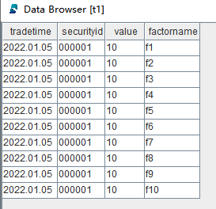
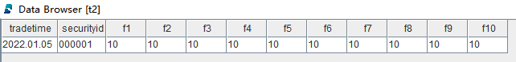

# 基于 DolphinDB 存储金融数据的分区方案最佳实践

- [概述](#概述)
- [数据存储方案总览](#数据存储方案总览)
  - [金融数据存储方案](#金融数据存储方案)
  - [因子库窄表存储方案](#因子库窄表存储方案)
- [金融数据存储方案实践](#金融数据存储方案实践)
  - [股票数据](#股票数据)
  - [期权数据](#期权数据)
  - [期货数据](#期货数据)
  - [银行间债券](#银行间债券)
- [因子库窄表存储方案实践](#因子库窄表存储方案实践)
  - [日频因子库](#日频因子库)
  - [半小时频因子库](#半小时频因子库)
  - [十分钟频因子库](#十分钟频因子库)
  - [分钟频因子库](#分钟频因子库)
  - [秒钟频因子库](#秒钟频因子库)
  - [Level-2 快照频因子库](#level-2-快照频因子库)
  - [逐笔频因子库](#逐笔频因子库)
  - [期货 500ms 频因子库](#期货-500ms-频因子库)
- [结语](#结语)
- [常见问题与解答（FAQ）](#常见问题与解答faq)
  - [创建数据库表时报错：已经存在重名库表](#创建数据库表时报错已经存在重名库表)

## 概述

对数据库进行合理的分区可以显著降低系统响应延迟，提高数据吞吐量。合理的分区设计需要综合考虑数据分布的特征、查询和计算的典型场景、数据更新的频率等方方面面。

本文为入门级教程，针对几种常见的金融数据给出了较为通用的分区方案和示例脚本，以帮助初次体验 DolphinDB 的用户快速完成建库建表。 

本文全部代码适用于 2.00.10 及以上版本。

## 数据存储方案总览

存储方案包括金融数据存储方案和因子库存储方案两大部分。

### 金融数据存储方案

针对不同金融数据，给出以下的分区存储方案：

| **产品大类** | **数据集**               | **存储引擎** | **分区方案**                      | **分区列**          | **排序列**                       |
| :----------- | :----------------------- | :----------- | :-------------------------------- | :------------------ | :------------------------------- |
| 股票         | Level-2 快照（沪深分表） | TSDB         | 按天分区 + 按股票代码 HASH25 分区 | 交易日期 + 股票代码 | 股票代码 + 交易时间              |
| 股票         | Level-1 快照（沪深分表） | TSDB         | 按天分区 + 按股票代码 HASH25 分区 | 交易日期 + 股票代码 | 股票代码 + 交易时间              |
| 股票         | 逐笔委托（沪深分表）     | TSDB         | 按天分区 + 按股票代码 HASH25 分区 | 交易日期 + 股票代码 | 股票代码 + 交易时间              |
| 股票         | 逐笔成交（沪深分表）     | TSDB         | 按天分区 + 按股票代码 HASH25 分区 | 交易日期 + 股票代码 | 股票代码 + 交易时间              |
| 股票         | Level-2 快照（沪深合并） | TSDB         | 按天分区 + 按股票代码 HASH50 分区 | 交易日期 + 股票代码 | 交易所类型 + 股票代码 + 交易时间 |
| 股票         | Level-1 快照（沪深合并） | TSDB         | 按天分区 + 按股票代码 HASH50 分区 | 交易日期 + 股票代码 | 交易所类型 + 股票代码 + 交易时间 |
| 股票         | 逐笔委托（沪深合并）     | TSDB         | 按天分区 + 按股票代码 HASH50 分区 | 交易日期 + 股票代码 | 交易所类型 + 股票代码 + 交易时间 |
| 股票         | 逐笔成交（沪深合并）     | TSDB         | 按天分区 + 按股票代码 HASH50 分区 | 交易日期 + 股票代码 | 交易所类型 + 股票代码 + 交易时间 |
| 股票         | 日 K 线                  | OLAP         | 按年分区                          | 交易时间            | 无                               |
| 股票         | 分钟 K 线                | OLAP         | 按天分区                          | 交易时间            | 无                               |
| 期权         | 快照                     | TSDB         | 按天分区 + 按期权代码 HASH20 分区 | 交易日期 + 期权代码 | 期权代码 + 接收时间              |
| 期货         | 快照                     | TSDB         | 按天分区 + 按期货代码 HASH10 分区 | 交易日期 + 期货代码 | 期货代码 + 接收时间              |
| 期货         | 日 K 线                  | OLAP         | 按年分区                          | 交易时间            | 无                               |
| 期货         | 分钟 K 线                | OLAP         | 按天分区                          | 交易时间            | 无                               |
| 银行间债券   | X-Bond 报价              | TSDB         | 按天分区                          | 创建日期            | 债券代码 + 创建时间              |
| 银行间债券   | X-Bond 成交              | TSDB         | 按天分区                          | 创建日期            | 债券代码 + 创建时间              |
| 银行间债券   | ESP 报价                 | TSDB         | 按天分区                          | 创建日期            | 债券代码 + 创建时间              |
| 银行间债券   | ESP 成交                 | TSDB         | 按天分区                          | 创建日期            | 债券代码 + 创建时间              |
| 银行间债券   | QB 报价                  | TSDB         | 按天分区                          | 市场时间            | 债券代码 + 市场时间              |
| 银行间债券   | QB 成交                  | TSDB         | 按天分区                          | 市场时间            | 债券代码 + 市场时间              |


### 因子库窄表存储方案

因子挖掘是量化交易的必备环节之一。随着量化交易和 AI 模型训练规模的发展，量化投资团队在投研环节势必需要处理大量因子数据。因子的存储也是一个关键问题，本文推荐使用窄表存储因子库。



窄表存储模型



宽表存储模型

相较于宽表，窄表存储有以下优势：

- 更加高效地删除过期失效因子
  - 宽表的方案是删除全表的某一列，相比窄表方案效率低下
- 更加高效地添加新因子
  - 宽表的方案是先增加列，然后更新新增列的值，相比窄表方案效率低下
- 更加高效地按照因子名更新指定因子的值
  - 宽表的方案是 update 全表的某一列，相比窄表效率低下
- 单次多因子面板数据的查询效率和宽表近似
  - DolphinDB 通过对 `pivot by` 方法的并行优化，保证了窄表存储方案的多因子数据查询效率

针对不同频率的因子数据，给出以下的分区存储方案，均采用 TSDB 存储引擎：

| **产品大类**                    | **因子频率**                                       | **分区方案**                 | **分区列**          | **排序列**          | **sortKey 降维** |
| :------------------------------ | :------------------------------------------------- | :--------------------------- | :------------------ | :------------------ | :--------------- |
| 股票（假设共 5000 支标的）      | 日频因子                          | 按年分区 + 按因子名分区                            | 交易时间 + 因子名            | 股票代码 + 交易时间 | 500              |
| 股票（假设共 5000 支标的） | 30 分钟因子                       | 按年分区 + 按因子名分区                            | 交易时间 + 因子名            | 股票代码 + 交易时间 | 500              |
| 股票（假设共 5000 支标的） | 10 分钟因子                       | 按月分区 + 按因子名分区                            | 交易时间 + 因子名            | 股票代码 + 交易时间 | 500              |
| 股票（假设共 5000 支标的） | 1 分钟频因子                      | 按日分区 + 按因子名分区                            | 交易时间 + 因子名            | 股票代码 + 交易时间 | 500              |
| 股票（假设共 5000 支标的） | 1 秒钟频因子                      | 按小时分区 + 按因子名分区                          | 交易时间 + 因子名            | 股票代码 + 交易时间 | 500              |
| 股票（假设共 5000 支标的） | Level-2 快照频率因子（3 秒~5 秒） | 按日分区 + 按因子名分区                            | 交易时间 + 因子名            | 股票代码 + 交易时间 | 500              |
| 股票（假设共 5000 支标的） | Level-2 逐笔频因子                | 按小时分区 + 按因子名分区 + 按股票代码 HASH10 分区 | 交易时间 + 因子名 + 股票代码 | 股票代码 + 交易时间 | 不降维 |
| 期货（假设共 200 支标的）       | 500ms 频因子                                       | 按日分区  + 按因子名分区     | 交易时间  + 因子名  | 期货代码 + 交易时间 | 500              |

## 金融数据存储方案实践

基于上一章的分区方案，本章将提供对应的 DolphinDB 脚本。

### 股票数据

#### Level-2 行情数据

股票 Level-2 行情数据包含 Level-2 快照数据、逐笔委托数据、逐笔成交数据，在分布式数据库中，如果要连接（join）多个分区的数据表，通常会非常耗时，因为涉及到的分区可能位于不同的节点上，需要在不同节点之间复制数据。为解决这个问题，DolphinDB 推出了共存储位置（co-location）的分区机制，确保同一个分布式数据库里所有表在相同分区的数据存储在相同的节点上。这样的安排，保证了这些表在连接的时候非常高效。因此在本方案中，把 Level-2 快照数据、逐笔委托数据、逐笔成交数据这些分区方案一致的数据表存入同一个数据库中。

上交所和深交所两个交易所的数据在字段结构上略有不同，用户在建立库表时可以考虑是否将两个交易所的数据进行合并，如果选择存为一张表，则表中的字段是两个交易所数据字段的并集，并新增字段 *Market* 用于标识数据来自哪个交易所。Level-1 的分区方案采用 Level-2 的即可。

如果您希望将通联数据导入 DolphinDB 数据库，可以参考如下教程，使用封装好的模块即可完成建库建表和 Level-2 行情数据导入：

- [DolphinDBModules::easyTLDataImport 通联历史数据自动化导入功能模块使用教程](https://gitee.com/dolphindb/DolphinDBModules/blob/master/easyTLDataImport/README.md) 

下面将根据是否将沪深交易所分开存储介绍不同建库建表的分区规则。

##### Level-2 快照（沪深分表）

**深交所**

```
create database "dfs://split_SZ_TB"
partitioned by VALUE(2020.01.01..2021.01.01), HASH([SYMBOL, 25])
engine='TSDB'

create table "dfs://split_SZ_TB"."split_SZ_snapshotTB"(
    TradeDate DATE[comment="交易日期", compress="delta"]   
    TradeTime TIME[comment="交易时间", compress="delta"]
    MDStreamID SYMBOL
    SecurityID SYMBOL
    SecurityIDSource SYMBOL
    TradingPhaseCode SYMBOL
    PreCloPrice DOUBLE
    NumTrades LONG
    TotalVolumeTrade LONG
    TotalValueTrade DOUBLE
    LastPrice DOUBLE
    OpenPrice DOUBLE
    HighPrice DOUBLE
    LowPrice DOUBLE
    DifPrice1 DOUBLE
    DifPrice2 DOUBLE
    PE1 DOUBLE
    PE2 DOUBLE
    PreCloseIOPV DOUBLE
    IOPV DOUBLE
    TotalBidQty LONG
    WeightedAvgBidPx DOUBLE
    TotalOfferQty LONG
    WeightedAvgOfferPx DOUBLE
    UpLimitPx DOUBLE
    DownLimitPx DOUBLE
    OpenInt INT
    OptPremiumRatio DOUBLE
    OfferPrice DOUBLE[]
    BidPrice DOUBLE[]
    OfferOrderQty LONG[]
    BidOrderQty LONG[]
    BidNumOrders INT[]
    OfferNumOrders INT[]
    LocalTime TIME
    SeqNo INT
    OfferOrders LONG[]
    BidOrders LONG[]
)
partitioned by TradeDate, SecurityID,
sortColumns=[`SecurityID,`TradeTime],
keepDuplicates=ALL
```

Level-2 行情数据使用“**时间维度按天+股票维度 HASH25**”的分区规则，使用存储引擎 **TSDB**，使用“**股票代码 + 交易时间**”作为排序列。下面对上述脚本进行说明：

- TSDB 引擎只支持创建分布式数据库，库名前必须添加”dfs://”；
- 在此处建立分区表时对某些列使用了指定压缩算法，对 *TradeTime* 列使用了“delta”压缩算法，其余列则默认使用“lz4”压缩算法；
- 建表时指定 *OfferPrice* 为 DOUBLE[] 类型， 表示将 10 档卖价数据存 储在一个字段中，该字段类型为 DOUBLE 类型的数组向量（arrray vector），更详细的 array vector 介绍见：[DolphinDB 中有关 array vector 的最佳实践指南](https://gitee.com/dolphindb/Tutorials_CN/blob/master/Array_Vector.md) ；
- *sortColumns* 参数用于将写入的数据按照指定字段进行排序，系统默认 *sortColumns*（指定多列时） 最后一列为时间列，其余列字段作为排序的索引列，称作 sort key。频繁查询的字段适合设置为 *sortColumns*，且建议优先把查询频率高的字段作为 *sortColumns* 中位置靠前的列；
- *keepDuplicates* 参数表示在每个分区内如何处理所有 *sortColumns* 之值皆相同的数据，在两个函数中该参数的值均为“ALL”表示保留所有数据。

**上交所**

```
create database "dfs://split_SH_TB"
partitioned by VALUE(2020.01.01..2021.01.01), HASH([SYMBOL, 25])
engine='TSDB'

create table "dfs://split_SH_TB"."split_SH_snapshotTB"(
    TradeDate DATE[comment="交易日期", compress="delta"]   
    TradeTime TIME[comment="交易时间", compress="delta"]
    SecurityID SYMBOL
    ImageStatus INT
    PreCloPrice DOUBLE
    OpenPrice DOUBLE
    HighPrice DOUBLE
    LowPrice DOUBLE
    LastPrice DOUBLE
    ClosePrice DOUBLE
    TradingPhaseCode SYMBOL
    NumTrades LONG
    TotalVolumeTrade LONG
    TotalValueTrade DOUBLE
    TotalBidQty LONG
    WeightedAvgBidPx DOUBLE
    AltWAvgBidPri DOUBLE
    TotalOfferQty LONG
    WeightedAvgOfferPx DOUBLE
    AltWAvgAskPri DOUBLE
    ETFBuyNumber INT
    ETFBuyAmount LONG
    ETFBuyMoney DOUBLE
    ETFSellNumber INT
    ETFSellAmount LONG
    ETFSellMoney DOUBLE
    YieldToMatu DOUBLE
    TotWarExNum DOUBLE
    UpLimitPx DOUBLE
    DownLimitPx DOUBLE
    WithdrawBuyNumber INT
    WithdrawBuyAmount LONG
    WithdrawBuyMoney DOUBLE
    WithdrawSellNumber INT
    WithdrawSellAmount LONG
    WithdrawSellMoney DOUBLE
    TotalBidNumber INT
    TotalOfferNumber INT
    MaxBidDur INT
    MaxSellDur INT
    BidNum INT
    SellNum INT
    IOPV DOUBLE
    OfferPrice DOUBLE[]
    BidPrice DOUBLE[]
    OfferOrderQty LONG[]
    BidOrderQty LONG[]
    BidNumOrders INT[]
    OfferNumOrders INT[]
    LocalTime TIME
    SeqNo INT
    OfferOrders LONG[]
    BidOrders LONG[]
)
partitioned by TradeDate, SecurityID,
sortColumns=[`SecurityID,`TradeTime],
keepDuplicates=ALL
```

上交所的数据格式与深交所略有不同，但分区方案一致。

##### 逐笔委托（沪深分表）

**深交所**

```
create database "dfs://split_SZ_TB"
partitioned by VALUE(2020.01.01..2021.01.01), HASH([SYMBOL, 25])
engine='TSDB'

create table "dfs://split_SZ_TB"."split_SZ_entrustTB"(
    ChannelNo INT
    ApplSeqNum LONG
    MDStreamID SYMBOL
    SecurityID SYMBOL
    SecurityIDSource SYMBOL
    Price DOUBLE
    OrderQty LONG
    Side SYMBOL
    TradeDate DATE[comment="交易日期", compress="delta"]   
    TradeTime TIME[comment="交易时间", compress="delta"]
    OrderType SYMBOL
    LocalTime TIME
    SeqNo INT
)
partitioned by TradeDate, SecurityID,
sortColumns=[`SecurityID,`TradeTime],
keepDuplicates=ALL
```

用户可以使用上述代码以创建存储深交所逐笔委托数据的数据库表，分区规则采用了“**时间维度按日 + 股票代码 HASH25**”的组合分区方式存储，使用存储引擎 **TSDB**，使用“**股票代码 + 交易时间**”作为排序列。

**上交所**

```
create database "dfs://split_SH_TB"
partitioned by VALUE(2020.01.01..2021.01.01), HASH([SYMBOL, 25])
engine='TSDB'

create table "dfs://split_SH_TB"."split_SH_entrustTB"(
    DataStatus INT
    ApplSeqNum LONG
    ChannelNo INT
    SecurityID SYMBOL
    TradeDate DATE[comment="交易日期", compress="delta"]   
    TradeTime TIME[comment="交易时间", compress="delta"]
    OrderType SYMBOL
    OrderNO INT
    Price DOUBLE
    OrderQty LONG
    Side SYMBOL
    BizIndex INT
    LocalTime TIME
    SeqNo INT
)
partitioned by TradeDate, SecurityID,
sortColumns=[`SecurityID,`TradeTime],
keepDuplicates=ALL
```

上交所的数据格式与深交所略有不同，但分区方案一致。

##### 逐笔成交（沪深分表）

**深交所**

```
create database "dfs://split_SZ_TB"
partitioned by VALUE(2020.01.01..2021.01.01), HASH([SYMBOL, 25])
engine='TSDB'

create table "dfs://split_SZ_TB"."split_SZ_tradeTB"(
    ChannelNo INT
    ApplSeqNum LONG
    MDStreamID SYMBOL
    BidApplSeqNum LONG
    OfferApplSeqNum LONG
    SecurityID SYMBOL
    SecurityIDSource SYMBOL
    TradePrice DOUBLE
    TradeQty INT
    ExecType SYMBOL
    TradeDate DATE[comment="交易日期", compress="delta"]   
    TradeTime TIME[comment="交易时间", compress="delta"]
    LocalTime TIME
    SeqNo INT
    OrderKind SYMBOL
)
partitioned by TradeDate, SecurityID,
sortColumns=[`SecurityID,`TradeTime],
keepDuplicates=ALL
```

用户可以使用上述代码以创建存储深交所逐笔委托数据的数据库表，分区规则采用了“**时间维度按日 + 股票代码 HASH25**”的组合分区方式存储，使用存储引擎 **TSDB**，使用“**股票代码 + 交易时间**”作为排序列。

**上交所**

```
create database "dfs://split_SH_TB"
partitioned by VALUE(2020.01.01..2021.01.01), HASH([SYMBOL, 25])
engine='TSDB'

create table "dfs://split_SH_TB"."split_SH_tradeTB"(
    DataStatus INT
    ApplSeqNum INT
    ChannelNo INT
    SecurityID SYMBOL
    TradeDate DATE[comment="交易日期", compress="delta"]   
    TradeTime TIME[comment="交易时间", compress="delta"]
    TradePrice DOUBLE
    TradeQty LONG
    TradeMoney DOUBLE
    BidApplSeqNum LONG
    OfferApplSeqNum LONG
    TradeBSFlag SYMBOL
    BizIndex LONG
    LocalTime TIME
    SeqNo INT
)
partitioned by TradeDate, SecurityID,
sortColumns=[`SecurityID,`TradeTime],
keepDuplicates=ALL
```

上交所的数据格式与深交所略有不同，但分区方案一致。

##### Level-2 快照（沪深合并）

```
create database "dfs://merge_TB"
partitioned by VALUE(2020.01.01..2021.01.01), HASH([SYMBOL, 50])
engine='TSDB'

create table "dfs://merge_TB"."merge_snapshotTB"(
	Market SYMBOL
    TradeDate DATE[comment="交易日期", compress="delta"]   
    TradeTime TIME[comment="交易时间", compress="delta"]
    MDStreamID SYMBOL
    SecurityID SYMBOL
    SecurityIDSource SYMBOL
    TradingPhaseCode SYMBOL
    ImageStatus INT
    PreCloPrice DOUBLE
    NumTrades LONG
    TotalVolumeTrade LONG
    TotalValueTrade DOUBLE
    LastPrice DOUBLE
    OpenPrice DOUBLE
    HighPrice DOUBLE
    LowPrice DOUBLE
    ClosePrice DOUBLE
    DifPrice1 DOUBLE
    DifPrice2 DOUBLE
    PE1 DOUBLE
    PE2 DOUBLE
    PreCloseIOPV DOUBLE
    IOPV DOUBLE
    TotalBidQty LONG
    WeightedAvgBidPx DOUBLE
    AltWAvgBidPri DOUBLE
    TotalOfferQty LONG
    WeightedAvgOfferPx DOUBLE
    AltWAvgAskPri DOUBLE
    UpLimitPx DOUBLE
    DownLimitPx DOUBLE
    OpenInt INT
    OptPremiumRatio DOUBLE
    OfferPrice DOUBLE[]
    BidPrice DOUBLE[]
    OfferOrderQty LONG[]
    BidOrderQty LONG[]
    BidNumOrders INT[]
    OfferNumOrders INT[]
    ETFBuyNumber INT
    ETFBuyAmount LONG
    ETFBuyMoney DOUBLE
    ETFSellNumber INT
    ETFSellAmount LONG
    ETFSellMoney DOUBLE
    YieldToMatu DOUBLE
    TotWarExNum DOUBLE
    WithdrawBuyNumber INT
    WithdrawBuyAmount LONG
    WithdrawBuyMoney DOUBLE
    WithdrawSellNumber INT
    WithdrawSellAmount LONG
    WithdrawSellMoney DOUBLE
    TotalBidNumber INT
    TotalOfferNumber INT
    MaxBidDur INT
    MaxSellDur INT
    BidNum INT
    SellNum INT
    LocalTime TIME
    SeqNo INT
    OfferOrders LONG[]
    BidOrders LONG[]
)
partitioned by TradeDate, SecurityID,
sortColumns=[`Market,`SecurityID,`TradeTime],
keepDuplicates=ALL
```

用户可以使用上述代码建立同时存储沪深 Level-2 行情数据的数据库表，使用“**时间维度按天 + 股票维度 HASH50**”的分区规则，使用存储引擎 **TSDB**，使用“**交易所类型 + 股票代码 + 交易时间**”作为排序列。与沪深分开存储的建库建表的分区规则类似，仅在 HASH 数量和排序列方面有所区别。

##### 逐笔委托（沪深合并）

```
create database "dfs://merge_TB"
partitioned by VALUE(2020.01.01..2021.01.01), HASH([SYMBOL, 50])
engine='TSDB'

create table "dfs://merge_TB"."merge_entrustTB"(
    ChannelNo INT
    ApplSeqNum LONG
    MDStreamID SYMBOL
    SecurityID SYMBOL
    SecurityIDSource SYMBOL
    Price DOUBLE
    OrderQty LONG
    Side SYMBOL
    TradeDate DATE[comment="交易日期", compress="delta"]   
    TradeTime TIME[comment="交易时间", compress="delta"]
    OrderType SYMBOL
    LocalTime TIME
    SeqNo LONG
    OrderNO LONG
    DataStatus INT
    BizIndex LONG
    Market SYMBOL
)
partitioned by TradeDate, SecurityID,
sortColumns=[`Market,`SecurityID,`TradeTime],
keepDuplicates=ALL
```

用户可以使用上述代码建立同时存储沪深 Level-2 行情数据的数据库表，使用“**时间维度按天 + 股票维度 HASH50**”的分区规则，使用存储引擎 **TSDB**，使用“**交易所类型 + 股票代码 + 交易时间**”作为排序列。与沪深分开存储的建库建表的分区规则类似，仅在 HASH 数量和排序列方面有所区别。

##### 逐笔成交（沪深合并）

```
create database "dfs://merge_TB"
partitioned by VALUE(2020.01.01..2021.01.01), HASH([SYMBOL, 50])
engine='TSDB'

create table "dfs://merge_TB"."merge_tradeTB"(
    ChannelNo INT
    ApplSeqNum LONG
    MDStreamID SYMBOL
    BidApplSeqNum LONG
    OfferApplSeqNum LONG
    SecurityID SYMBOL
    SecurityIDSource SYMBOL
    TradePrice DOUBLE
    TradeQty LONG
    ExecType SYMBOL
    TradeDate DATE[comment="交易日期", compress="delta"]   
    TradeTime TIME[comment="交易时间", compress="delta"]
    LocalTime TIME
    SeqNo LONG
    DataStatus INT
    TradeMoney DOUBLE
    TradeBSFlag SYMBOL
    BizIndex LONG
    OrderKind SYMBOL
    Market SYMBOL
)
partitioned by TradeDate, SecurityID,
sortColumns=[`Market,`SecurityID,`TradeTime],
keepDuplicates=ALL
```

用户可以使用上述代码建立同时存储沪深 Level-2 行情数据的数据库表，使用“**时间维度按天 + 股票维度 HASH50**”的分区规则，使用存储引擎 **TSDB**，使用“**交易所类型 + 股票代码 + 交易时间**”作为排序列。与沪深分开存储的建库建表的分区规则类似，仅在 HASH 数量和排序列方面有所区别。

#### 股票日 K 线

```
create database "dfs://k_day_level"
partitioned by RANGE(2000.01M + (0..30)*12)
engine='OLAP'

create table "dfs://k_day_level"."k_day"(
	securityid SYMBOL  
	tradetime TIMESTAMP
	open DOUBLE        
	close DOUBLE       
	high DOUBLE        
	low DOUBLE
	vol INT
	val DOUBLE
	vwap DOUBLE
)
partitioned by tradetime
```

用户可以使用上述代码建立同时存储日K的数据库表，使用“**时间维度按年**”的分区规则，使用存储引擎 **OLAP**。每个分区内都包含了这一年所有股票的日 K 数据。

#### 股票分钟 K 线

```
create database "dfs://k_minute_level"
partitioned by VALUE(2020.01.01..2021.01.01)
engine='OLAP'

create table "dfs://k_minute_level"."k_minute"(
	securityid SYMBOL  
	tradetime TIMESTAMP
	open DOUBLE        
	close DOUBLE       
	high DOUBLE        
	low DOUBLE
	vol INT
	val DOUBLE
	vwap DOUBLE
)
partitioned by tradetime
```

用户可以使用上述代码建立同时存储日 K 的数据库表，使用“**时间维度按天**”的分区规则，存储引擎使用 **OLAP**。每个分区内都包含了当天所有股票的分钟 K 数据。

### 期权数据

#### 期权快照

```
create database "dfs://ctp_options"
partitioned by VALUE(2020.01.01..2021.01.01), HASH([SYMBOL, 20])
engine='TSDB'

create table "dfs://ctp_options"."options"(
    TradingDay DATE[comment="交易日期", compress="delta"]
    ExchangeID SYMBOL
    LastPrice DOUBLE
    PreSettlementPrice DOUBLE
    PreClosePrice DOUBLE
    PreOpenInterest DOUBLE
    OpenPrice DOUBLE
    HighestPrice DOUBLE
    LowestPrice DOUBLE
    Volume INT
    Turnover DOUBLE
    OpenInterest DOUBLE
    ClosePrice DOUBLE
    SettlementPrice DOUBLE
    UpperLimitPrice DOUBLE
    LowerLimitPrice DOUBLE
    PreDelta DOUBLE
    CurrDelta DOUBLE
    UpdateTime SECOND
    UpdateMillisec INT
    BidPrice DOUBLE[]
    BidVolume INT[]
    AskPrice DOUBLE[]
    AskVolume INT[]
    AveragePrice DOUBLE
    ActionDay DATE
    InstrumentID SYMBOL
    ExchangeInstID STRING
    BandingUpperPrice DOUBLE
    BandingLowerPrice DOUBLE
    tradeTime TIME
    receivedTime NANOTIMESTAMP
    perPenetrationTime LONG
)
partitioned by TradingDay, InstrumentID,
sortColumns=[`InstrumentID,`ReceivedTime],
keepDuplicates=ALL
```

用户可以使用上述代码以创建存储期权快照数据的数据库表，分区规则采用了“**时间维度按天 + 期权代码维度 HASH20**”的组合分区方式存储，使用存储引擎 **TSDB**，使用“**期权代码 + 接收时间**”作为排序列。经测试期货快照数据采用这种方式分区存储，综合性能最佳。

### 期货数据

#### 期货快照

```
create database "dfs://ctp_futures"
partitioned by VALUE(2020.01.01..2021.01.01), HASH([SYMBOL, 10])
engine='TSDB'

create table "dfs://ctp_futures"."futures"(
    TradingDay DATE[comment="交易日期", compress="delta"]
    ExchangeID SYMBOL
    LastPrice DOUBLE
    PreSettlementPrice DOUBLE
    PreClosePrice DOUBLE
    PreOpenInterest DOUBLE
    OpenPrice DOUBLE
    HighestPrice DOUBLE
    LowestPrice DOUBLE
    Volume INT
    Turnover DOUBLE
    OpenInterest DOUBLE
    ClosePrice DOUBLE
    SettlementPrice DOUBLE
    UpperLimitPrice DOUBLE
    LowerLimitPrice DOUBLE
    PreDelta DOUBLE
    CurrDelta DOUBLE
    UpdateTime SECOND
    UpdateMillisec INT
    BidPrice DOUBLE[]
    BidVolume INT[]
    AskPrice DOUBLE[]
    AskVolume INT[]
    AveragePrice DOUBLE
    ActionDay DATE
    InstrumentID SYMBOL
    ExchangeInstID STRING
    BandingUpperPrice DOUBLE
    BandingLowerPrice DOUBLE
    tradeTime TIME
    receivedTime NANOTIMESTAMP
    perPenetrationTime LONG
)
partitioned by TradingDay, InstrumentID,
sortColumns=[`InstrumentID,`ReceivedTime],
keepDuplicates=ALL
```

用户可以使用上述代码以创建存储期货快照数据的数据库表，分区规则采用了“**时间维度按天 + 期货代码维度 HASH10**”的组合分区方式存储，使用存储引擎 **TSDB**，使用“**期货代码 + 接收时间**”作为排序列。经测试期货快照数据采用这种方式分区存储，综合性能最佳。

#### 期货日 K 线

由于期货 K 数据与股票 K 数据类似，因此可以使用股票 K 数据的表格结构作为期货 K 数据的表格结构

```
create database "dfs://ctp_k_day_level"
partitioned by RANGE(2000.01M + (0..30)*12)
engine='OLAP'

create table "dfs://ctp_k_day_level"."ctp_k_day"(
	securityid SYMBOL  
	tradetime TIMESTAMP
	open DOUBLE        
	close DOUBLE       
	high DOUBLE        
	low DOUBLE
	vol INT
	val DOUBLE
	vwap DOUBLE
)
partitioned by tradetime
```

用户可以使用上述代码以创建存储期货日 K 数据的数据库表，与股票日 K 数据的分区规则相同，使用“**时间维度按年**”的分区规则，存储引擎使用 **OLAP**。在一个分区中包含了这一年所有期货的日 K 数据。

#### 期货分钟 K 线

```
create database "dfs://ctp_k_day_level"
partitioned by RANGE(2000.01M + (0..30)*12)
engine='OLAP'

create table "dfs://ctp_k_day_level"."ctp_k_day"(
	securityid SYMBOL  
	tradetime TIMESTAMP
	open DOUBLE        
	close DOUBLE       
	high DOUBLE        
	low DOUBLE
	vol INT
	val DOUBLE
	vwap DOUBLE
)
partitioned by tradetime
```

用户可以使用上述代码以创建存储期货分钟 K 数据的数据库表，与股票分钟 K 数据的分区规则相同，使用“**时间维度按天**”的分区规则，存储引擎使用 **OLAP**。每个分区内都包含了当天所有期货的分钟 K 数据。

### 银行间债券

#### X-Bond 报价

```
create database "dfs://XBond"
partitioned by VALUE(2023.01.01..2023.12.31)
engine='TSDB'

create table "dfs://XBond"."XBondDepthTable"(
    bondCodeVal SYMBOL
    createDate DATE[comment="创建日期", compress="delta"]  
    createTime TIME[comment="创建时间", compress="delta"]
    marketDepth LONG
    mdBookType LONG
    messageId LONG
    messageSource STRING
    msgSeqNum LONG
    msgType STRING
    bidmdEntryPrice DOUBLE[]
    offermdEntryPrice DOUBLE[]
    bidmdEntrySize LONG[]
    offermdEntrySize LONG[]
    bidsettlType LONG[]
    offersettlType LONG[]
    bidyield DOUBLE[]
    offeryield DOUBLE[]
    bid1yieldType STRING
    offer1yieldType STRING
    bid2yieldType STRING
    offer2yieldType STRING
    bid3yieldType STRING
    offer3yieldType STRING
    bid4yieldType STRING
    offer4yieldType STRING
    bid5yieldType STRING
    offer5yieldType STRING
    bid6yieldType STRING
    offer6yieldType STRING
    securityID SYMBOL
    senderCompID STRING
    senderSubID STRING
    sendingTime TIMESTAMP
)
partitioned by createDate,
sortColumns=[`securityID, `createTime]
```

用户可以使用上述代码以创建存储 X-Bond 报价数据的数据库表，使用“**时间维度按天**”的分区规则，使用存储引擎 **TSDB**，使用“**债券代码 + 创建时间**”作为排序列。每个分区内都包含了当天所有 X-Bond 报价数据。

#### X-Bond 成交

```
create database "dfs://XBond"
partitioned by VALUE(2023.01.01..2023.12.31)
engine='TSDB'

create table "dfs://XBond"."XBondTradetable"(
    createDate DATE[comment="创建日期", compress="delta"]  
    createTime TIME[comment="创建时间", compress="delta"]
    securityID SYMBOL
    beforeClosingPrice DOUBLE
    beforeClosingYield DOUBLE
    beforeWeightedAveragePrice DOUBLE
    beforeWeightedAverageYield DOUBLE
    fillSide LONG
    highestPrice DOUBLE
    highestYield DOUBLE
    lowestPrice DOUBLE
    lowestYield DOUBLE
    marketIndicator LONG
    mdSubType LONG
    mdType LONG
    messageId LONG
    messageSource STRING
    msgSeqNum LONG
    msgType STRING
    openingValence DOUBLE
    openingYield DOUBLE
    priceRiseFallAmplitude DOUBLE
    senderCompID STRING
    sendingTime TIMESTAMP
    settlType LONG
    symbol STRING
    tradeMethod LONG
    transactTime TIMESTAMP
    transactionNumber LONG
    uniqueOutputKey LONG
    upToDatePrice DOUBLE
    upToDateYield DOUBLE
    weightedAveragePrice DOUBLE
    weightedAverageYield DOUBLE
    yieldRiseFall DOUBLE
)
partitioned by createDate,
sortColumns=[`securityID, `createTime]
```

用户可以使用上述代码以创建存储 X-Bond 成交数据的数据库表，使用“**时间维度按天**”的分区规则，使用存储引擎 **TSDB**，使用“**债券代码 + 创建时间**”作为排序列。每个分区内都包含了当天所有 X-Bond 成交数据。

#### ESP 报价

```
create database "dfs://ESP"
partitioned by VALUE(2023.01.01..2023.12.31)
engine='TSDB'

create table "dfs://ESP"."ESPDepthtable"(
    createDate DATE[comment="创建日期", compress="delta"]  
    createTime TIME[comment="创建时间", compress="delta"]
    bondCodeVal SYMBOL
    marketDepth LONG
    marketIndicator LONG
    mdBookType LONG
    mdSubBookType LONG
    messageId LONG
    messageSource STRING
    msgSeqNum LONG
    msgType STRING
    askclearingMethod LONG[]
    bidclearingMethod LONG[]
    askdeliveryType LONG[]
    biddeliveryType LONG[]
    askinitAccountNumSixCode LONG[]
    bidinitAccountNumSixCode LONG[]
    asklastPx DOUBLE[]
    bidlastPx DOUBLE[]
    askmdEntryDate DATE[]
    bidmdEntryDate DATE[]
    askmdEntrySize LONG[]
    bidmdEntrySize LONG[]
    askmdEntryTime TIME[]
    bidmdEntryTime TIME[]
    askmdQuoteType LONG[]
    bidmdQuoteType LONG[]
    askquoteEntryID LONG[]
    bidquoteEntryID LONG[]
    asksettlType LONG[]
    bidsettlType LONG[]
    askyield DOUBLE[]
    bidyield DOUBLE[]
    ask1initPartyTradeCode STRING
    bid1initPartyTradeCode STRING
    ask2initPartyTradeCode STRING
    bid2initPartyTradeCode STRING
    ask3initPartyTradeCode STRING
    bid3initPartyTradeCode STRING
    ask4initPartyTradeCode STRING
    bid4initPartyTradeCode STRING
    ask5initPartyTradeCode STRING
    bid5initPartyTradeCode STRING
    ask6initPartyTradeCode STRING
    bid6initPartyTradeCode STRING
    ask7initPartyTradeCode STRING
    bid7initPartyTradeCode STRING
    ask8initPartyTradeCode STRING
    bid8initPartyTradeCode STRING
    ask9initPartyTradeCode STRING
    bid9initPartyTradeCode STRING
    ask10initPartyTradeCode STRING
    bid10initPartyTradeCode STRING
    securityID SYMBOL
    securityType STRING
    senderCompID STRING
    senderSubID STRING
    sendingTime TIMESTAMP
    symbol STRING
)
partitioned by createDate,
sortColumns=[`securityID, `createTime]
```

用户可以使用上述代码以创建存储 ESP 报价数据的数据库表，使用“**时间维度按天**”的分区规则，使用存储引擎 **TSDB**，使用“**债券代码 + 创建时间**”作为排序列。每个分区内都包含了当天所有 ESP 报价数据。

#### ESP 成交

```
create database "dfs://ESP"
partitioned by VALUE(2023.01.01..2023.12.31)
engine='TSDB'

create table "dfs://ESP"."ESPTradetable"(
    createDate DATE[comment="创建日期", compress="delta"]  
    createTime TIME[comment="创建时间", compress="delta"]
    securityID SYMBOL
    execId STRING
    execType STRING
    lastQty LONG
    marketIndicator LONG
    messageSource STRING
    msgSeqNum LONG
    msgType STRING
    price DOUBLE
    senderCompID STRING
    stipulationType STRING
    stipulationValue DOUBLE
    symbol STRING
    tradeDate DATE
    tradeMethod LONG
    tradeTime TIME
    tradeType LONG
    transactTime TIMESTAMP
)
partitioned by createDate,
sortColumns=[`securityID, `createTime]
```

用户可以使用上述代码以创建存储 ESP 成交数据的数据库表，使用“**时间维度按天**”的分区规则，使用存储引擎 **TSDB**，使用“**债券代码 + 创建时间**”作为排序列。每个分区内都包含了当天所有 ESP 成交数据。

#### QB 报价

```
create database "dfs://QB_QUOTE"
partitioned by VALUE(2023.10.01..2023.10.31)
engine='TSDB'

create table "dfs://QB_QUOTE"."qbTable"(
	SENDINGTIME TIMESTAMP
	CONTRIBUTORID SYMBOL
	MARKETDATATIME TIMESTAMP
	SECURITYID SYMBOL
	BONDNAME SYMBOL
	DISPLAYLISTEDMARKET SYMBOL
	BIDQUOTESTATUS INT
	BIDYIELD DOUBLE
	BIDPX DOUBLE
	BIDPRICETYPE INT
	BIDPRICE DOUBLE
	BIDDIRTYPRICE DOUBLE
	BIDVOLUME INT
	BIDPRICEDESC STRING
	ASKQUOTESTATUS INT
	ASKYIELD DOUBLE
	OFFERPX DOUBLE
	ASKPRICETYPE INT
	ASKPRICE DOUBLE
	ASKDIRTYPRICE DOUBLE
	ASKVOLUME INT
	ASKPRICEDESC STRING
)
partitioned by MARKETDATATIME,
sortColumns=[`SECURITYID,`MARKETDATATIME]
```

用户可以使用上述代码以创建存储 QB 报价数据的数据库表，使用“**时间维度按天**”的分区规则，使用存储引擎 **TSDB**，使用“**债券代码 + 市场时间**”作为排序列。每个分区内都包含了当天所有 QB 报价数据。

#### QB 成交

```
create database "dfs://QB_TRADE"
partitioned by VALUE(2023.10.01..2023.10.31)
engine='TSDB'

create table "dfs://QB_TRADE"."lastTradeTable"(
	SECURITYID SYMBOL
	BONDNAME SYMBOL
	SENDINGTIME TIMESTAMP
	CONTRIBUTORID SYMBOL
	MARKETDATATIME TIMESTAMP
	MODIFYTIME SECOND
	DISPLAYLISTEDMARKET SYMBOL
	EXECID STRING
	DEALSTATUS INT
	TRADEMETHOD INT
	YIELD DOUBLE
	TRADEPX DOUBLE
	PRICETYPE INT
	TRADEPRICE DOUBLE
	DIRTYPRICE DOUBLE
	SETTLSPEED STRING
)
partitioned by MARKETDATATIME,
sortColumns=[`SECURITYID,`MARKETDATATIME]
```

用户可以使用上述代码以创建存储 QB 交易数据的数据库表，使用“**时间维度按天**”的分区规则，使用存储引擎 **TSDB**，使用“**债券代码 + 市场时间**”作为排序列。每个分区内都包含了当天所有 QB 交易数据。

## 因子库窄表存储方案实践

### 日频因子库

```
create database "dfs://dayFactorDB" 
partitioned by RANGE(date(datetimeAdd(1980.01M,0..80*12,'M'))), VALUE(`f1`f2), 
engine='TSDB'

create table "dfs://dayFactorDB"."dayFactorTB"(
    tradetime DATE[comment="时间列", compress="delta"], 
    securityid SYMBOL, 
    value DOUBLE, 
    factorname SYMBOL
)
partitioned by tradetime, factorname,
sortColumns=[`securityid, `tradetime], 
keepDuplicates=ALL, 
sortKeyMappingFunction=[hashBucket{, 500}]
```

用户可以使用上述代码以创建存储日频因子库的数据库表，分区规则采用了“**时间维度按年 + 因子名**”的组合分区方式存储，使用存储引擎**TSDB**，使用“**股票代码 + 交易时间**”作为排序列。经测试日频因子数据采用这种方式分区存储，综合性能最佳。

对于分区内的分组排序存储来说，DolphinDB 中的 TSDB 存储引擎提供排序键设置，每一个分区的数据写在一个或多个 level file 中。每一个 level file 内部的数据按照指定的列进行排序且创建块索引。在排序列中，除了最后一列之外的其他列通常用作点查中的过滤条件。这些列的唯一值组合被称为 SortKeys（排序键）。为保证性能最优，每个分区的 SortKeys 建议不超过 1000 个。 如 SortKeys 较多可通过设置 *sortKeyMappingFunction* 对 SortKeys 降维。经测试日频因子数据采用“**securityid + tradetime**”的方式进行排序，**sortKeyMapping** 设置为 500 时，综合性能最佳。

### 半小时频因子库

```
create database "dfs://halfhourFactorDB"
partitioned by RANGE(date(datetimeAdd(1980.01M,0..80*12,'M'))), VALUE(`f1`f2),
engine='TSDB'

create table "dfs://halfhourFactorDB"."halfhourFactorTB"(
    tradetime TIMESTAMP[comment="时间列", compress="delta"],
    securityid SYMBOL,
    value DOUBLE,
    factorname SYMBOL,
)
partitioned by tradetime, factorname,
sortColumns=[`securityid, `tradetime],
keepDuplicates=ALL,
sortKeyMappingFunction=[hashBucket{, 500}]
```

用户可以使用上述代码以创建存储半小时频因子库的数据库表，分区规则采用了“**时间维度按年 + 因子名**”的组合分区方式存储，使用存储引擎 **TSDB**，使用“**股票代码 + 交易时间**”作为排序列。经测试半小时频因子数据采用这种方式分区存储，综合性能最佳。

### 十分钟频因子库

```
create database "dfs://tenMinutesFactorDB" 
partitioned by VALUE(2023.01M..2023.06M), 
VALUE(`f1`f2), 
engine='TSDB'

create table "dfs://tenMinutesFactorDB"."tenMinutesFactorTB"(
    tradetime TIMESTAMP[comment="时间列", compress="delta"], 
    securityid SYMBOL, 
    value DOUBLE, 
    factorname SYMBOL
)
partitioned by tradetime, factorname,
sortColumns=[`securityid, `tradetime], 
keepDuplicates=ALL, 
sortKeyMappingFunction=[hashBucket{, 500}]
```

用户可以使用上述代码以创建存储十分钟频因子库的数据库表，分区规则采用了“**时间维度按月 + 因子名**”的组合分区方式存储，使用存储引擎 **TSDB**，使用“**股票代码 + 交易时间**”作为排序列。经测试十分钟频因子数据采用这种方式分区存储，综合性能最佳。

### 分钟频因子库

```
create database "dfs://minuteFactorDB" 
partitioned by VALUE(2012.01.01..2021.12.31), VALUE(`f1`f2), 
engine='TSDB'

create table "dfs://minuteFactorDB"."minuteFactorTB"(
    tradetime TIMESTAMP[comment="时间列", compress="delta"], 
    securityid SYMBOL, 
    value DOUBLE, 
    factorname SYMBOL
)
partitioned by tradetime, factorname,
sortColumns=[`securityid, `tradetime], 
keepDuplicates=ALL, 
sortKeyMappingFunction=[hashBucket{, 500}]
```

用户可以使用上述代码以创建存储分钟频因子库的数据库表，分区规则采用了“**时间维度按日 + 因子名**”的组合分区方式存储，使用存储引擎 **TSDB**，使用“**股票代码 + 交易时间**”作为排序列。经测试分钟频因子数据采用这种方式分区存储，综合性能最佳。

### 秒钟频因子库

```
create database "dfs://secondFactorDB" 
partitioned by VALUE(datehour(2022.01.01T00:00:00)..datehour(2022.01.31T00:00:00)), VALUE(`f1`f2), 
engine='TSDB'

create table "dfs://secondFactorDB"."secondFactorTB"(
    tradetime TIMESTAMP[comment="时间列", compress="delta"], 
    securityid SYMBOL, 
    value DOUBLE, 
    factorname SYMBOL
)
partitioned by tradetime, factorname,
sortColumns=[`securityid, `tradetime], 
keepDuplicates=ALL, 
sortKeyMappingFunction=[hashBucket{, 500}]
```

用户可以使用上述代码以创建存储秒钟频因子库的数据库表，分区规则采用了“**时间维度按小时 + 因子名**”的组合分区方式存储，使用存储引擎 **TSDB**，使用“**股票代码 + 交易时间**”作为排序列。经测试秒钟频因子数据采用这种方式分区存储，综合性能最佳。

### Level-2 快照频因子库

```
create database "dfs://level2FactorDB" partitioned by VALUE(2022.01.01..2022.12.31), VALUE(["f1", "f2"]), 
engine='TSDB'

create table "dfs://level2FactorDB"."level2FactorTB"(
    tradetime TIMESTAMP[comment="时间列", compress="delta"], 
    securityid SYMBOL, 
    value DOUBLE, 
    factorname SYMBOL
)
partitioned by tradetime, factorname,
sortColumns=[`securityid, `tradetime], 
keepDuplicates=ALL, 
sortKeyMappingFunction=[hashBucket{, 500}]
```

用户可以使用上述代码以创建存储 Level-2 快照频因子库的数据库表，分区规则采用了“**时间维度按日 + 因子名**”的组合分区方式存储，使用存储引擎 **TSDB**，使用“**股票代码 + 交易时间**”作为排序列。根据测试结果，Level-2 快照频因子数据采用这种方式进行分区存储，可以实现最佳的综合性能。

### 逐笔频因子库

```
create database "dfs://tickFactorDB" partitioned by VALUE(2022.01.01..2022.12.31), VALUE(["f1", "f2"]), HASH([SYMBOL,10])
engine='TSDB'

create table "dfs://tickFactorDB"."tickFactorTB"(
    tradetime TIMESTAMP[comment="时间列", compress="delta"], 
    securityid SYMBOL, 
    value DOUBLE, 
    factorname SYMBOL
)
partitioned by tradetime, factorname,securityid,
sortColumns=[`securityid, `tradetime], 
keepDuplicates=ALL
```

用户可以使用上述代码创建存储逐笔频因子库的数据库表，分区规则采用了“**时间维度按日 + 因子名维度 + 股票维度 HASH10**”的组合分区方式存储，使用存储引擎 **TSDB**，使用“**股票代码 + 交易时间**”作为排序列。根据测试结果，逐笔频因子数据采用了这种分区存储方式，可以获得最佳的综合性能。与之前提到的因子存储方案不同之处在于，这里没有对排序键（sortKey）进行降维处理。原因是每天的数据按照股票代码维度进行了 10 个哈希分区，而每个最小分区内包含 500 个股票，因此无需再进行降维处理。

### 期货 500ms 频因子库

```
create database "dfs://futuresFactorDB" 
partitioned by VALUE(2022.01.01..2023.01.01), VALUE(["f1", "f2"]), 
engine='TSDB' 

create table "dfs://futuresFactorDB"."futuresFactorTB"(
    tradetime TIMESTAMP[comment="时间列", compress="delta"], 
    securityid SYMBOL, 
    value DOUBLE, 
    factorname SYMBOL
)
partitioned by tradetime, factorname,
sortColumns=[`securityid, `tradetime], 
keepDuplicates=ALL, 
sortKeyMappingFunction=[hashBucket{, 500}]
```

用户可以使用上述代码以创建存储L期货 500ms 频因子库的数据库表，分区规则采用了“**时间维度按日 + 因子名**”的组合分区方式存储，使用存储引擎 **TSDB**，使用“**期货代码 + 交易时间**”作为排序列。根据测试结果，采用这种分区存储方式可以实现期货 500 毫秒频率因子数据的最佳综合性能。

## 结语

针对常见的金融数据，我们通过最佳实践，给出上述建库建表的推荐方案，用户可以根据实际业务场景，进行适当调整和修改。

本文扩展阅读：

- [DolphinDB教程：分区数据库](https://gitee.com/dolphindb/Tutorials_CN/blob/master/database.md) 
- [TSDB 存储引擎详解](https://gitee.com/dolphindb/Tutorials_CN/blob/master/tsdb_explained.md) 

## 常见问题与解答（FAQ）

### 创建数据库表时报错：已经存在重名库表

执行创建数据库表的代码后，报出如下错误：

```
create database partitioned by VALUE(["f1","f2"]), engine=TSDB => It is not allowed to overwrite an existing database.
```

**解决方法**：建议使用其他名字或者删掉该数据库。

删除指定数据库的代码如下：

```
dropDatabase("dfs://dayFactorDB")
```

检查指定数据库是否存在的代码如下：

```
existsDatabase("dfs://dayFactorDB")
```